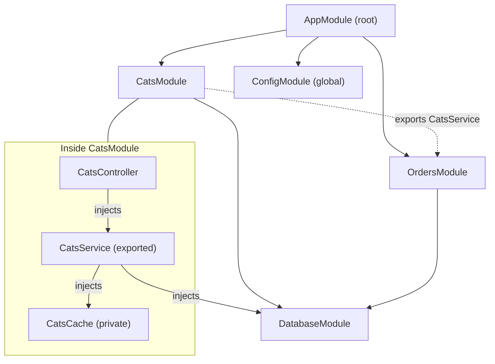

# Chapter 1 — What NestJS Is: Architecture, Philosophy, and the Module Graph

> **한눈에 보기**
> NestJS는 Node.js 백엔드에 **아키텍처**를 제공하는 프레임워크입니다. Express나 Fastify를
> 대체하는 것이 아니라 그 위에 모듈·컨트롤러·프로바이더 구조와 의존성 주입(DI) 컨테이너를
> 얹습니다. 이 장에서는 Nest가 해결하려는 문제, Angular에서 물려받은 설계, 데코레이터와
> 메타데이터 리플렉션이라는 동작 원리, `nest new`가 만든 프로젝트가 부팅될 때 실제로 무슨
> 일이 일어나는지를 따라갑니다. 이 장은 책 전체의 지도이고, 2장부터 각 지역을 파고듭니다.

**What you will learn**

- Why *architecture* — not performance, not features — is the problem Nest was built to solve.
- How a decorator plus `reflect-metadata` turns a plain class into something Nest can find, instantiate, and wire.
- Why `@Injectable()` is a **marker**, not a registration, and what actually registers a provider.
- When to type your app object as `NestExpressApplication` or `NestFastifyApplication`, and when not to bother.
- Why the module graph, not the file system, defines your application.
- What `NestFactory.create(AppModule)` does between the call and `app.listen()` accepting a socket.
- The concrete costs — boilerplate, learning curve, metadata indirection — you pay for all of it.

**Why this matters**

Every Node.js backend team hits the same wall. Version one is a single `app.js` with twelve routes and it is a joy. Eighteen months later there are eighty routes across nine files, two of them construct their own database client "temporarily", and nobody can unit-test the pricing logic because it reaches into `req.session`, `process.env`, and a top-level `redisClient` that connects on import. The code is not bad; it simply had no *architecture*, and Node.js — unlike Rails, Spring, or ASP.NET — shipped no opinion about what one should look like.

That is the gap Nest fills. The official documentation puts it plainly: plenty of superb libraries, helpers, and tools exist for Node, but none effectively solve the main problem of **architecture**. Nest's answer is an out-of-the-box application architecture — heavily inspired by Angular — that makes applications testable, scalable, loosely coupled, and maintainable. You declare units of code, you declare what they depend on, and a container assembles them. `req.session` becomes a constructor parameter. `redisClient` becomes a provider with a lifecycle. Pricing logic becomes a class you instantiate in a test with three lines and no HTTP server.

There is a price. Nest asks you to learn a vocabulary — module, provider, token, scope — before your second endpoint, and to accept indirection where "how did that value get into my method?" is answered by framework metadata rather than by a line you can read. Those costs are real, front-loaded, and repaid over the life of a codebase more than one person touches.

## 1. What Nest actually is

Nest is a framework for building efficient, scalable Node.js server-side applications. It uses progressive JavaScript, is built with and fully supports TypeScript — while still enabling pure JavaScript — and combines OOP, FP, and FRP (functional reactive programming, via RxJS; [Chapter 12](./12-interceptors.md)). Mechanically it is three things stacked:

1. **A dependency-injection container.** The heart. Nest reads class metadata, builds a graph of what depends on what, resolves it in order, instantiates one instance per module scope by default, and hands finished objects to whoever asked.
2. **A request pipeline.** A fixed, named sequence — middleware, guards, interceptors, pipes, handler, interceptors again, exception filters — extended at defined points rather than by pushing callbacks into an opaque array.
3. **A platform adapter layer.** Nest does not implement an HTTP server; it drives one. Express is the default, Fastify is supported, anything else is possible once an adapter exists.

Notice what is *not* there: an ORM, a template engine, an auth system, a queue. Nest ships integrations for all of them as optional packages; it is opinionated about *structure* and unopinionated about *stack*.

> **Hint** — Nest abstracts over Express/Fastify but also exposes their APIs directly, so you can use the myriad third-party modules available for the underlying platform: `@Req()`, `getRequest()`, and `app.getHttpAdapter().getInstance()` are always there. That escape hatch is a design principle, not an accident.

## 2. The Angular inheritance

Open your first Nest file and, if you have written Angular, you will feel déjà vu: a class with a decorator taking a metadata object of `imports`, `controllers`, `providers`, `exports`. That is deliberate transplantation, not homage.

| Concept | In Angular | In Nest |
|---|---|---|
| Unit of composition | `@NgModule` | `@Module` |
| Marker for injectable classes | `@Injectable()` | `@Injectable()` |
| Registration / public surface | `providers: []` / `exports: []` | `providers: []` / `exports: []` |
| Custom provider recipes | `useValue` / `useClass` / `useFactory` | plus `useExisting` |
| Reactive primitive | RxJS `Observable` | RxJS `Observable` |

What Nest did **not** take: change detection, zones, templates, and Angular's migration to standalone components. Nest modules stay mandatory and central: in the browser they turned out to be optional ceremony, but on the server, where a module also delimits provider *visibility*, they earn their keep. If you know Angular you already hold most of the mental model; if you do not, do not learn Angular first.

## 3. The mechanism: decorators and metadata reflection

Everything rests on one language feature and one tiny library; understand this and the rest stops feeling like magic. A **decorator** is a function that runs at class-definition time and receives the thing it decorates. Nest's decorators do essentially one thing: attach data to the class through `Reflect.defineMetadata`, from the `reflect-metadata` polyfill that every Nest entrypoint pulls in.

```typescript
// A simplified illustration of what @Controller() does — not Nest's source,
// but the shape is accurate: a decorator writes metadata onto the class.
import 'reflect-metadata';

export function Controller(prefix = '/'): ClassDecorator {
  return (target: object) => Reflect.defineMetadata('path', prefix, target);
}

@Controller('cats')
class CatsController {}

console.log(Reflect.getMetadata('path', CatsController)); // 'cats'
```

The class itself is unchanged: no base class, no interface to implement, no registration call — only a side-table entry saying "this class wants the `cats` prefix". At bootstrap Nest walks your module graph, reads those entries, and builds routes from them.

The second, subtler use is how Nest knows what your constructor wants. With `emitDecoratorMetadata: true`, the TypeScript compiler emits the runtime types of constructor parameters under the key `design:paramtypes` — but only for classes carrying at least one decorator. So in `constructor(private readonly catsService: CatsService)`, inside a class marked `@Injectable()`, Nest finds `[CatsService]` recorded and knows what to pass.

That is the whole trick, and it explains the framework's most misunderstood rule. `@Injectable()` is a **marker**: it makes the compiler emit parameter metadata and tags the class as injectable. What *registers* it with the container is a module's `providers` array. Two consequences to memorize:

- **Interfaces cannot be injected by type.** `constructor(private repo: CatRepository)` works only if `CatRepository` is a class; interfaces vanish at runtime and `design:paramtypes` records `Object`. Use a string/symbol token with `@Inject()`, or an `abstract class` — those survive to runtime.
- **Deleting `@Injectable()` from a class with dependencies breaks injection**, because no parameter metadata is emitted. The class still "works" if its constructor is empty, which is why the bug hides.

Your `tsconfig.json` therefore needs both flags — `"experimentalDecorators": true` and `"emitDecoratorMetadata": true` — which `nest new` sets for you alongside `"target": "ES2023"` and `"module": "commonjs"`.

> **⚠️ Notice** — These are the *legacy* experimental decorators, not the TC39 Stage 3 standard decorators TypeScript 5.0 enabled by default. The two are incompatible, and standard decorators do not support `emitDecoratorMetadata`. On the v11 baseline Nest requires `experimentalDecorators: true`. Do not "modernize" this setting.

## 4. The platform abstraction: Express and Fastify

Nest aims to be platform-agnostic: platform independence makes it possible to create reusable logical parts that work across several different types of application, because your controllers and services never touch the HTTP library. Technically Nest works with any Node HTTP framework once an adapter exists. Two ship out of the box:

| Package | What it is | When to choose it |
|---|---|---|
| `@nestjs/platform-express` | Express — battle-tested, production-ready, huge community ecosystem. **Used by default; no action needed.** | Default. Choose it whenever you expect Express-ecosystem middleware (`multer`, `express-session`, Passport strategies). |
| `@nestjs/platform-fastify` | Fastify — high performance, low overhead, focused on maximum efficiency and speed. | Throughput-sensitive, JSON-heavy APIs where Fastify plugins suffice. See [Chapter 55](../part3-advanced/55-performance-and-compilation.md). |

Each platform exposes its own application interface — `NestExpressApplication`, `NestFastifyApplication`. Pass the type as a generic when, and only when, you want platform-specific methods:

```typescript title="main.ts — Express (default) vs Fastify"
import { NestFactory } from '@nestjs/core';
import { NestExpressApplication } from '@nestjs/platform-express';
import { FastifyAdapter, NestFastifyApplication } from '@nestjs/platform-fastify';
import { join } from 'node:path';
import { AppModule } from './app.module';

// Express: no adapter argument needed — it is the default platform.
const app = await NestFactory.create<NestExpressApplication>(AppModule);
app.useStaticAssets(join(__dirname, '..', 'public')); // Express-only method
await app.listen(process.env.PORT ?? 3000);

// Fastify: the adapter is explicit, because it is not the default.
const fast = await NestFactory.create<NestFastifyApplication>(
  AppModule,
  new FastifyAdapter(),
);
await fast.listen(process.env.PORT ?? 3000, '0.0.0.0');
```

You do not **need** to specify a type **unless** you actually want the underlying platform API; plain `NestFactory.create(AppModule)` returns an `INestApplication`, enough for most applications. The architectural point: swapping that file should be the *entire* migration, because nothing else in a well-written Nest app knows which server is running. In practice you will find leaks — a middleware typed `express.RequestHandler`, an `@Res()` handler calling `res.render()` — each a design debt you took on knowingly.

## 5. The three building blocks, from 10,000 feet

**Controller** — owns the HTTP boundary. It maps a URL prefix, its methods map routes, and its only job is to turn a request into a service call and the result into a response. A controller holding business logic is the most common design mistake in Nest codebases.

**Provider** — owns behaviour: services, repositories, factories, clients, helpers — anything the container can create and inject. Singletons per application by default.

**Module** — owns composition and visibility. It declares which controllers it mounts, which providers it registers, which modules it imports, and which providers it exposes through `exports`; anything not exported is private. That encapsulation is what stops a 200-file codebase from becoming a fully connected graph.

Every application has exactly one **root module**, conventionally `AppModule`, and the graph reachable from it *is* the application. A file no module imports does not exist as far as Nest is concerned, whatever it exports or wherever it sits on disk — which answers most "why is my provider undefined?" questions.



`OrdersModule` can inject `CatsService` because `CatsModule` exports it and `OrdersModule` imports `CatsModule`. It cannot inject `CatsCache` at all — not by importing harder, not by adding a decorator. `DatabaseModule` is imported twice but instantiated once: the container keys instances by module scope, not by import site.

## 6. Scaffolding a project

Node.js **20 or higher** is required. Start with the CLI (recommended), a starter repo, or hand-assembly.

```bash
$ npm i -g @nestjs/cli
$ nest new project-name
```

The CLI prompts for a package manager, creates the directory, installs node modules and boilerplate, and fills `src/` with the core files.

> **Hint** — `--strict` creates the project with TypeScript's stricter feature set: `strictNullChecks`, `noImplicitAny`, `strictBindCallApply`, `forceConsistentCasingInFileNames`, `noFallthroughCasesInSwitch`. **Use it** — every example here assumes strict mode, and retrofitting it later is far more painful.

Cloning the TypeScript starter (`git clone https://github.com/nestjs/typescript-starter.git`, then `npm install && npm run start`) gives an identical outcome; `javascript-starter.git` is the JavaScript flavour, and `degit` clones without git history. You can also assemble a project from just `@nestjs/core`, `@nestjs/common`, `rxjs`, and `reflect-metadata` — instructive once, not how to start real work.

### The generated layout

The scaffold creates `src/` with five files and encourages the convention of keeping each module in its own dedicated directory:

| File | Role |
|---|---|
| `app.controller.ts` | A basic controller with a single route. |
| `app.controller.spec.ts` | The unit tests for the controller. |
| `app.module.ts` | The root module of the application. |
| `app.service.ts` | A basic service with a single method. |
| `main.ts` | The entry file, which uses the core `NestFactory` class to create a Nest application instance. |

Outside `src/` you get `test/` (e2e specs and a Jest config), `nest-cli.json`, `tsconfig.json`, `tsconfig.build.json`, `eslint.config.mjs`, `.prettierrc`, and a `package.json` whose `scripts` block is the interface you use daily — all dissected in [Chapter 2](./02-cli-and-project-setup.md).

## 7. `main.ts`: what bootstrap actually does

```typescript title="main.ts"
import { NestFactory } from '@nestjs/core';
import { AppModule } from './app.module';

async function bootstrap() {
  const app = await NestFactory.create(AppModule);
  await app.listen(process.env.PORT ?? 3000);
}
bootstrap();
```

Six lines, two of which do enormous work. `NestFactory` is the core class for creating an application instance, exposing a few static methods: `create()` for HTTP apps, `createMicroservice()` for RPC ([Chapter 45](../part3-advanced/45-microservices-fundamentals.md)), and `createApplicationContext()` for standalone apps with no server at all ([Chapter 42](../part3-advanced/42-standalone-and-cli-apps.md)). `create()` returns an object fulfilling the `INestApplication` interface; `listen()` then starts the HTTP listener. Inside that first `await`, in order:

1. **Scan the module graph.** From `AppModule`, Nest reads `@Module()` metadata, follows `imports` recursively, and registers every module, controller, provider, and exported token. Circular imports surface here (resolved with `forwardRef()` — [Chapter 41](../part3-advanced/41-module-ref-discovery-lazy.md)).
2. **Resolve and instantiate.** For each provider Nest reads `design:paramtypes` or explicit `@Inject()` tokens, looks each token up in the module's own providers, then in providers exported by its imports, then in global modules, and instantiates in dependency order. This is where `Nest can't resolve dependencies of the X (?)` is thrown — `?` marks the parameter it could not satisfy.
3. **Run async init hooks.** `OnModuleInit` implementations and promise-returning `useFactory` providers are awaited ([Chapter 39](../part3-advanced/39-lifecycle-and-shutdown.md)).
4. **Register routes.** Nest walks every controller, reads path and method metadata from each handler, and calls the adapter's routing API. Only now do concrete HTTP routes exist.
5. **Return the application object — still not listening.**

`app.listen()` is the separate final step: it runs `OnApplicationBootstrap` hooks and binds the socket. The gap between "constructed" and "listening" is deliberate — it is where `useGlobalPipes()`, `enableCors()`, and `setGlobalPrefix()` go, and where a test calls `await app.init()` to get the graph without a port.

> **Hint** — By default, if any error happens while creating the application your app exits with code `1`. To make it throw instead, disable the option: `NestFactory.create(AppModule, { abortOnError: false })`. Two other early options: `{ logger: ['error', 'warn'] }` to cut bootstrap noise or plug in a custom logger ([Chapter 18](../part2-intermediate/18-logging.md)), and `{ bufferLogs: true }` to hold output until your logger is ready.

## 8. Running, watching, linting

```bash
$ npm run start        # build, then listen on the port set in src/main.ts
$ npm run start:dev    # the same, in watch mode: recompile and reload on change
$ npm run lint         # eslint, with autofix
$ npm run format       # prettier
```

Open `http://localhost:3000/` and you should see the `Hello World!` message. The default compiler is `tsc` — correct, but not fast on large projects.

> **Hint** — For roughly **20× faster builds**, use the SWC builder: `npm run start -- -b swc`. SWC skips type checking; add `--type-check` to run `tsc --noEmit` alongside it. Full setup in [Chapter 2](./02-cli-and-project-setup.md).

The CLI scaffolds a reliable workflow at scale, so every project ships a **linter** and a **formatter** preinstalled — ESLint and Prettier, via the base `eslint` and `prettier` CLI packages so official IDE extensions integrate cleanly, plus the headless scripts above for CI and git hooks. Linters find *problems* (unused variables, floating promises); formatters enforce *style*. Nest ships both because arguing about either is a waste of a team's time.

## 9. Where Nest sits in the landscape

Nest is not competing with Express — it is built on it. The useful comparison is altitude.

| | Raw Express / Fastify | **NestJS** | Full-stack framework |
|---|---|---|---|
| HTTP server | yes | no — drives one | yes |
| App architecture | no | **yes** — modules, DI, pipeline | yes |
| ORM / auth | no | integrations only | built in |
| Testability out of the box | you build it | **first-class** (`Test.createTestingModule`) | good |
| TypeScript | retrofitted types | **foundational** | varies |
| Cost of endpoint #1 / #200 | minutes / high and rising | an hour of concepts / flat | an hour of conventions / low |
| Escape hatch to platform | n/a | always available | often narrow |

Nest occupies the middle: the structural spine of a full framework, every infrastructure decision left to you. If your team wants those decisions made for it, Nest feels like assembly work; if it wants to make them without re-deriving application architecture each project, Nest is the right altitude.

**When not to use Nest:** a single-purpose Lambda transforming one payload; a four-route webhook receiver that will never grow; a script; a prototype whose value is being written in ninety minutes. Nest's fixed cost is amortized by none of those.

## 10. Trade-offs, stated plainly

**Boilerplate and learning curve.** A CRUD resource in Nest is a module, a controller, a service, two DTOs, an entity, and two spec files; in Express it is one file. The Nest version is more testable at scale and more tedious to type — which is why the CLI has `nest g resource`. And you cannot write Nest productively without understanding DI, module scope, and the request pipeline. There is no "just start typing" on-ramp; budget a week to fluency, not a day.

**Decorator and metadata indirection.** When a value appears in your handler parameter or a guard rejects a request, no line in *your* repository explains it: the explanation lives in framework metadata your editor cannot show you, stack traces deepen, and debugging becomes less local. That is the real cost of the design, and why the REPL ([Chapter 2](./02-cli-and-project-setup.md)) and Devtools ([Chapter 56](../part3-advanced/56-observability.md)) exist to make the invisible graph inspectable.

**Runtime cost and ecosystem lag.** DI resolution happens once at bootstrap, so steady-state overhead is small — but request-scoped providers ([Chapter 38](../part3-advanced/38-injection-scopes.md)) can make it substantial, and serverless cold start is measurably slower than a bare handler ([Chapter 58](../part3-advanced/58-deployment-and-serverless.md)). Separately, `@nestjs/*` integrations track upstream libraries with a delay; occasionally you will write a small custom provider instead.

## 11. The project behind the framework

Nest is an **MIT-licensed open source project** sustained by community support — OpenCollective sponsorship, donations, commercial offerings — not by a company paying for the hours; no vendor can unilaterally change its license, but the bus factor is smaller than for a hyperscaler-backed framework. **Official support** from the core team is for sale (architectural reviews, mentoring, security and performance consulting, code and PR audits, team augmentation, workshops) — cheap next to getting module boundaries wrong across a fleet of services. And Nest runs in production at a long, public list of companies: not proof of correctness, but you will find engineers who know it.

## Common mistakes

1. **Symptom:** `Nest can't resolve dependencies of the CatsController (?). Please make sure that the argument CatsService at index [0] is available in the CatsModule context.`
   **Cause:** `CatsService` carries `@Injectable()` but is not in any module's `providers` — or is in a module that does not `export` it.
   **Fix:** Add it to the owning module's `providers`; if another module needs it, `export` it there and `import` that module. `@Injectable()` marks; `providers` registers.

2. **Symptom:** A provider resolves inside its own module but is missing elsewhere.
   **Cause:** Module encapsulation — providers are private unless exported.
   **Fix:** Export it. Do **not** re-register the same class in both modules: that yields two independent instances with two caches, two connections, two counters — a worse bug than the one you started with.

3. **Symptom:** After a refactor a constructor parameter arrives as `undefined`.
   **Cause:** Someone removed `@Injectable()` from a class with constructor dependencies, so TypeScript stopped emitting `design:paramtypes`.
   **Fix:** Restore it. Every container-created class with a non-empty constructor carries a class decorator.

4. **Symptom:** `constructor(private repo: CatRepository)` fails with a token-not-found error where `CatRepository` is an `interface`.
   **Cause:** Interfaces do not exist at runtime; emitted metadata is `Object`.
   **Fix:** `@Inject('CAT_REPOSITORY')` with a custom provider, or turn the abstraction into an `abstract class`.

5. **Symptom:** Switching Express → Fastify breaks a dozen files.
   **Cause:** Platform leakage — Express types in middleware signatures, `res.render()`, manual `@Res()` writes.
   **Fix:** Confine platform code to `main.ts` and a thin labelled adapter layer; use `@Res({ passthrough: true })` when you need a header but still want Nest to serialize ([Chapter 4](./04-controllers-responses.md)).

## Putting it together

A complete application exercising every idea above: a root module importing a feature module with one private and one exported provider, a controller that only delegates, and a bootstrap that configures the app between construction and listening.

```typescript title="src/cats/cats.repository.ts"
import { Injectable } from '@nestjs/common';

export interface Cat {
  id: number;
  name: string;
}

// Private to CatsModule: listed in providers, absent from exports.
@Injectable()
export class CatsRepository {
  private readonly cats: Cat[] = [{ id: 1, name: 'Nyan' }];

  findAll(): Cat[] {
    return [...this.cats];
  }

  add(name: string): Cat {
    const cat = { id: this.cats.length + 1, name };
    this.cats.push(cat);
    return cat;
  }
}
```

```typescript title="src/cats/cats.service.ts"
import { Injectable, Logger, OnModuleInit } from '@nestjs/common';
import { Cat, CatsRepository } from './cats.repository';

@Injectable() // marker: emits design:paramtypes and tags the class
export class CatsService implements OnModuleInit {
  private readonly logger = new Logger(CatsService.name);

  // design:paramtypes here is [CatsRepository]; the container resolves it.
  constructor(private readonly repository: CatsRepository) {}

  onModuleInit(): void {
    // Runs during NestFactory.create(), before app.listen().
    this.logger.log(`Ready with ${this.repository.findAll().length} cat(s)`);
  }

  findAll(): Cat[] {
    return this.repository.findAll();
  }

  create(name: string): Cat {
    return this.repository.add(name.trim());
  }
}
```

```typescript title="src/cats/cats.controller.ts"
import { Body, Controller, Get, Post } from '@nestjs/common';
import { Cat } from './cats.repository';
import { CatsService } from './cats.service';

@Controller('cats')
export class CatsController {
  constructor(private readonly catsService: CatsService) {}

  @Get() findAll(): Cat[] {
    return this.catsService.findAll();
  }

  @Post() create(@Body('name') name: string): Cat {
    return this.catsService.create(name); // extract, delegate, return
  }
}
```

```typescript title="src/cats/cats.module.ts  +  src/app.module.ts"
import { Module } from '@nestjs/common';
import { CatsController } from './cats.controller';
import { CatsRepository } from './cats.repository';
import { CatsService } from './cats.service';

@Module({
  controllers: [CatsController],
  providers: [CatsService, CatsRepository],
  exports: [CatsService], // CatsRepository stays private on purpose.
})
export class CatsModule {}

// --- src/app.module.ts ---
@Module({ imports: [CatsModule] })
export class AppModule {}
```

```typescript title="src/main.ts"
import { NestFactory } from '@nestjs/core';
import { AppModule } from './app.module';

async function bootstrap() {
  const app = await NestFactory.create(AppModule, { abortOnError: false });
  // Between construction and listening: configure the whole application.
  app.setGlobalPrefix('api');
  app.enableShutdownHooks();
  await app.listen(process.env.PORT ?? 3000);
}
bootstrap();
```

```bash
$ npm run start:dev
$ curl http://localhost:3000/api/cats
[{"id":1,"name":"Nyan"}]
$ curl -X POST http://localhost:3000/api/cats \
    -H 'content-type: application/json' -d '{"name":"Mochi"}'
{"id":2,"name":"Mochi"}
```

Then run the experiment that teaches more than the code does: inject `CatsRepository` into a class registered in `AppModule`. Nest refuses to start and names the exact token and parameter index. That refusal — at bootstrap, not at 3 a.m. under load — is the value proposition in one message.

> **핵심 정리**
> - Nest가 해결하는 문제는 성능이나 기능이 아니라 **아키텍처**입니다. Express/Fastify 위에 DI 컨테이너, 정해진 요청 파이프라인, 플랫폼 어댑터를 얹은 것이 Nest입니다.
> - 설계는 Angular에서 왔습니다(`@Module`, `@Injectable`, 생성자 주입, `exports`). 다만 템플릿·변경 감지 같은 브라우저 개념은 가져오지 않았고, 모듈은 여전히 필수입니다.
> - 모든 마법의 실체는 **데코레이터 + `reflect-metadata`** 입니다. 데코레이터는 클래스에 메타데이터를 붙일 뿐이며, `emitDecoratorMetadata`가 생성자 파라미터 타입(`design:paramtypes`)을 런타임에 남깁니다.
> - `@Injectable()`은 **표시(marker)** 일 뿐 등록이 아닙니다. 실제 등록은 모듈의 `providers` 배열이며, 인터페이스는 런타임에 없으므로 토큰 주입이 필요합니다.
> - 플랫폼은 교체 가능합니다. 기본은 `platform-express`, 대안은 `platform-fastify`이고, 플랫폼 고유 API가 필요할 때만 타입을 지정합니다.
> - 애플리케이션은 파일 시스템이 아니라 **루트 모듈에서 도달 가능한 그래프**입니다. 어떤 모듈도 import하지 않는 파일은 존재하지 않는 것과 같습니다.
> - `NestFactory.create()`는 그래프 스캔 → 의존성 해석·인스턴스화 → `OnModuleInit` → 라우트 등록까지 수행하고, 소켓 바인딩은 `app.listen()`이 담당합니다. 그 사이가 전역 설정 자리입니다.
> - 대가는 분명합니다: 보일러플레이트, 학습 곡선, 메타데이터 간접성, 콜드 스타트. 일회성 스크립트나 작은 웹훅 수신기에는 과합니다.

> **연습 문제**
> 1. `nest new --strict`로 프로젝트를 만들고 `AppService`에 생성자 의존성을 하나 추가한 뒤 `@Injectable()`만 삭제해 보세요. 오류가 빌드 시점에 나는지 부팅 시점에 나는지 기록하고, `design:paramtypes` 관점에서 이유를 설명하세요.
> 2. `CatsModule`의 `exports` 배열을 비운 뒤 다른 모듈에서 `CatsService`를 주입해 보세요. 오류 메시지의 `(?)` 표시가 무엇을 가리키는지 설명하세요.
> 3. **직접 만들어 보기** — 위 예제를 확장해 `OrdersModule`을 추가하고, `CatsModule`이 export한 `CatsService`만 주입해 주문 시 고양이 존재 여부를 검증하는 `OrdersService`를 구현하세요. `CatsRepository`를 주입하려 시도했을 때 나오는 오류도 함께 기록하세요.
> 4. **직접 만들어 보기** — `main.ts`를 Fastify로 전환하세요(`@nestjs/platform-fastify` 설치 후 `FastifyAdapter` 사용). 컨트롤러와 서비스를 한 줄도 고치지 않고 동작하는지 확인하고, 고쳐야 했다면 그 지점이 왜 "플랫폼 누수"인지 설명하세요. 이어서 `{ abortOnError: false }`를 준 경우와 주지 않은 경우의 종료 코드 차이도 비교하세요.

**Next:** [Chapter 2 — The Nest CLI, Project Layout, and the Development Loop](./02-cli-and-project-setup.md) turns the scaffolding you just ran into a tool you control: every `nest generate` schematic, every `nest-cli.json` option, watch mode versus hot module replacement, and the REPL that lets you call any provider in the graph from your terminal.
