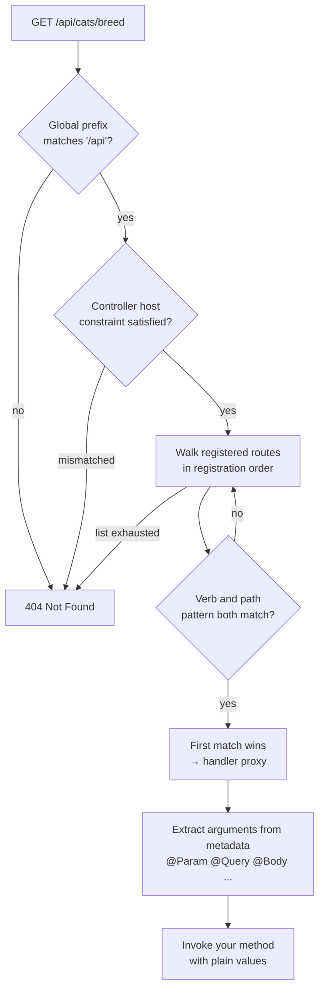

# Chapter 3 — Controllers I: Routing, Parameters, and the Request

> **한눈에 보기**
> 컨트롤러는 들어오는 HTTP 요청을 받아 어떤 코드가 그것을 처리할지 결정하는 진입점이다.
> 이 장은 `@Controller()`가 붙인 메타데이터가 부팅 시점에 어떻게 실제 라우트 테이블로 바뀌는지,
> URL의 각 조각을 꺼내 쓰는 파라미터 데코레이터가 무엇인지 다룬다. 2장의 프로젝트 골격 위에
> 처음으로 동작하는 엔드포인트를 올리는 장이며, Nest 11이 채택한 Express v5의 와일드카드 규칙
> 변경은 마이그레이션에서 가장 많이 깨지는 지점이라 따로 설명한다. 응답을 만드는 쪽은 4장이다.

**What you will learn**

- Why `@Controller()` and the method decorators are *metadata only*, and what turns that metadata into a router at bootstrap.
- How Nest composes a route path from the global prefix, the controller prefix, and the method path.
- Every HTTP method decorator (`@Get`, `@Post`, `@Put`, `@Delete`, `@Patch`, `@Options`, `@Head`, `@All`) and when `@All` is a mistake.
- How to capture dynamic segments with `@Param()`, and why `@Get(':id')` above `@Get('breed')` silently swallows the wrong requests.
- Why bare `*` wildcards behave differently under Express v5, what a *named wildcard* like `*splat` is, and why `?` and `+` no longer work.
- How to route by hostname with `@Controller({ host })`, and read every part of a request through `@Query`, `@Body`, `@Headers`, `@Ip`, `@Session`, `@Req`, `@Res`, `@Next`.
- How `setGlobalPrefix()` works, and how to exempt a health-check route from it.

**Why this matters**

A team upgrades a Nest 10 service to Nest 11. The build passes, the tests pass, they deploy — and the static-asset route `@Get('assets/*')` starts returning 404 for every request, though nothing in the diff touched that file. What changed is that Nest 11 defaults to Express v5, whose router was rewritten on `path-to-regexp` v8, where a bare `*` is no longer a legal path token. The route did not stop matching; it stopped *existing*. This is the most common breakage in the v10 → v11 migration, and it lives entirely inside the controller layer.

That story argues for how this chapter is ordered. Most introductions present the decorators as a vocabulary list — here is `@Get`, here is `@Param`, go build something. That works right up until something does not match, and then you have no model of *why*, because you were never told that a controller class is not, at runtime, a router. It is a class carrying metadata; between `NestFactory.create()` and your first request, the `RoutesResolver` walks the module graph, reads that metadata, and registers real Express (or Fastify) routes. Once you see that step, route ordering, prefix composition, wildcard syntax, and the `@Res()` trap stop being trivia and become consequences.

There is a second reason to slow down: the request-parameter decorators are the boundary where untrusted data enters your application, and they lie politely. `@Param('id')` returns a `string`, always, whatever you annotate it as — and every validation feature in later chapters fixes a problem that starts here.

## What a controller actually is

A controller is a class with routing metadata attached — no base class to extend, no interface to implement, no registration call.

```typescript title="src/cats/cats.controller.ts"
import { Controller, Get } from '@nestjs/common';

@Controller('cats')
export class CatsController {
  @Get()
  findAll(): string {
    return 'This action returns all cats';
  }
}
```

`@Controller('cats')` uses `Reflect.defineMetadata` to stamp `'cats'` onto the class; `@Get()` stamps a path (`'/'` by default) and a verb (`RequestMethod.GET`) onto `findAll`. Nothing has been registered anywhere: if you never list `CatsController` in a module's `controllers` array, this file is inert — it compiles, and no request will ever reach it. The method name carries no meaning either; call it `findAll`, `list`, or `handler7` and the behaviour is identical. Only decorators matter — worth saying out loud if you come from a framework where the name *is* load-bearing.

### From metadata to a route table

At bootstrap, `NestFactory.create()` builds the module graph, instantiates every provider and controller, then hands off to the `RoutesResolver`. For each controller it:

1. Reads the controller-level path prefix (plus `host` and `version` when present).
2. Enumerates prototype methods and reads each one's path + verb metadata.
3. Composes the final path: `globalPrefix` + `controllerPrefix` + `methodPath`.
4. Calls the adapter's registration function — for Express, literally `app.get(path, handler)`.
5. Wraps your method in a *proxy* that runs guards, interceptors and pipes, extracts arguments from their decorators, and handles the return value.

Step 5 matters: the function Express receives is never your method. It is a generated wrapper that knows, from metadata, to fill parameter index 0 with `req.params.id` and index 1 with `req.body`, so your method is called with plain values — which is why controllers are trivially unit-testable. Registration happens **in the order Nest visits controllers and methods**, and Express matches in that same order.



The diagram encodes one rule: **first match wins, and matching walks in registration order**. Express does not score by specificity — `@Get(':id')` is a perfectly good match for `/cats/breed`, with `id` becoming `'breed'`.

## The `@Controller()` decorator and path prefixes

`@Controller()` accepts four forms — no argument (routes mount at the root), a string prefix (`@Controller('cats')`), an array of prefixes that all mount (`@Controller(['cats', 'felines'])`), and an options object (`@Controller({ path: 'cats', host: 'api.example.com' })`).

Use the options form when you need `host` (below) or `version` ([Chapter 33](../part2-intermediate/33-mvc-and-versioning.md)). The array form aliases a resource through a rename, keeping legacy clients working during a deprecation window at the cost of two route-table entries per handler. The prefix removes repetition — without it, renaming a resource means editing every decorator — and slashes are normalised, so `@Controller('cats')` and `@Controller('/cats')` are identical and `@Get('breed/')` registers the same path as `@Get('breed')`.

## Every HTTP method decorator

| Decorator | Verb | Use it for, and what to know |
|---|---|---|
| `@Get(path?)` | GET | Reads. Safe and idempotent; must not mutate state |
| `@Search(path?)` | SEARCH | A rarely used verb for read queries with a request body; supported by Nest but not by every proxy |
| `@Post(path?)` | POST | Creates and other non-idempotent actions. Default success status is **201**, not 200 |
| `@Put(path?)` | PUT | Full replacement. Idempotent: same request twice = same end state |
| `@Patch(path?)` | PATCH | Partial update — the right verb for an `UpdateCatDto` of optional fields |
| `@Delete(path?)` | DELETE | Removal. Idempotent; commonly returns 204 |
| `@Options(path?)` | OPTIONS | Describing allowed methods; usually handled by CORS middleware, not by you |
| `@Head(path?)` | HEAD | Headers only. Express answers HEAD from your GET handler automatically |
| `@All(path?)` | *all verbs* | Proxies, webhook sinks, catch-alls. Use sparingly — see below |

Each takes an optional path appended to the controller prefix: inside `@Controller('cats')`, `@Get('breed')` produces `GET /cats/breed` and `@Delete(':id')` produces `DELETE /cats/42`.

`@All()` deserves a warning: it registers the handler for *every* verb, so `@All('webhooks/:provider')` answers a `DELETE` or a `TRACE` just as happily. That is almost never right for a business endpoint — it hides mistakes (a client sending `GET` where you expected `POST` gets a 200 instead of a 405) and broadens your attack surface. Reserve it for pass-through proxies.

## Route parameters

Static paths cannot express `GET /cats/1`. For dynamic segments you declare a **token** with a leading colon and read it back with `@Param()`:

```typescript title="src/cats/cats.controller.ts"
import { Controller, Get, Param } from '@nestjs/common';

@Controller('cats')
export class CatsController {
  // @Param() with no argument hands you the whole req.params object.
  @Get(':id')
  findOne(@Param() params: { id: string }) { return `Returns cat #${params.id}`; }

  // A token name narrows it to one value — what you want almost every time —
  // and tokens compose freely:  GET /cats/3/kittens/7
  @Get(':catId/kittens/:kittenId')
  findKitten(@Param('catId') catId: string, @Param('kittenId') kittenId: string) {
    return `Kitten ${kittenId} of cat ${catId}`;
  }
}
```

**Route params are always strings** — the most consequential sentence in this section. The following compiles, runs, and is wrong:

```typescript
// ❌ WRONG — `id` is the string '42', not the number 42
@Get(':id')
findOne(@Param('id') id: number) { return `${id + 1}`; }   // "421", not "43"

// ✅ RIGHT — ParseIntPipe converts, and throws 400 on non-numeric input
@Get(':id')
findOne(@Param('id', ParseIntPipe) id: number) { return `${id + 1}`; }   // "43"
```

TypeScript's annotation is erased at compile time and nothing coerces the value, so a pipe must both convert and validate — [Chapter 10](./10-pipes-and-validation.md) covers them properly. The point here is that these decorators hand you raw strings.

### Route ordering: the pitfall that costs an afternoon

Because Express matches in registration order and Nest registers in declaration order, a parameterised route declared *before* a static one intercepts it:

```typescript
// ❌ WRONG ORDER
@Get(':id')     findOne(@Param('id') id: string) { return `cat ${id}`; }
@Get('breed')   findBreeds() { return 'breeds'; }   // unreachable
```

`GET /cats/breed` matches `:id` first, `id` becomes `'breed'`, and `findBreeds` is never called — no error, no warning, no log line, just a lookup for a cat with id `"breed"` and a confusing 404 from your service layer. The rule: **declare static paths before parameterised ones, and specific patterns before broad ones.**

```typescript
// ✅ RIGHT ORDER
@Get('breed')          findBreeds() { /* static — first */ }
@Get('breed/:name')    findBreed(@Param('name') n: string) { /* static prefix + param */ }
@Get(':id')            findOne(@Param('id') id: string) { /* broadest — last */ }
```

The same rule applies *across* controllers that share a prefix, where the module's `controllers` array order decides — relying on that is a sign the two controllers should be one.

## Wildcards and the Express v5 change

Read this twice if you are upgrading from Nest 10.

Under Express v4 (Nest ≤ 10), a bare asterisk was a legal path token: `'abcd/*'` matched `/abcd`, `/abcd/123`, and `/abcd/a/b/c` alike. That parser also supported a small regex-flavoured vocabulary — `?` for an optional segment (`/cats/:id?`), `+` for one-or-more, and parenthesised inline regexes.

Nest 11 ships Express v5, which rebuilt its router on `path-to-regexp` v8. That release removed the ambiguous syntax deliberately: patterns like `/:a*` had several plausible readings and were a documented source of path-matching bugs. The consequences:

| Syntax | Express v4 (Nest 10) | Express v5 (Nest 11) |
|---|---|---|
| `'abcd/*'` | wildcard, matches any suffix | **not valid in pure Express** — Nest ships a compatibility shim |
| `'abcd/*splat'` | not supported | **the supported form** — a named wildcard |
| `'/:id?'` | optional parameter | **throws at registration** — no `?` modifier |
| `'/files/:name+'` | one-or-more segments | **throws** — no `+` modifier |
| `'/ab*cd'` (mid-path) | wildcard in the middle | must be written `'/ab{*splat}cd'` |
| `'/:id(\\d+)'` | inline regex constraint | removed — use a pipe or guard instead |
| `-` and `.` | literal characters | still literal characters |

A **named wildcard** is written `*name`. The name is arbitrary — `splat` is simply the conventional choice, inherited from Sinatra and Express's own docs. It exists so the matched segment can be read back:

```typescript
// ✅ Nest 11 / Express 5 — recommended form
import { Controller, Get, Param } from '@nestjs/common';

@Controller()
export class FilesController {
  @Get('files/*splat')
  serve(@Param('splat') splat: string[]) {
    // GET /files/img/logo.png  →  splat === ['img', 'logo.png']
    return `serving ${splat.join('/')}`;
  }
}
```

Note the type: a named wildcard yields an **array of segments**, not a joined string, because `path-to-regexp` v8 splits on `/`.

### Nest's compatibility layer

Nest 11 does not force you to rewrite every route: its Express adapter normalises a *trailing* bare `*` into a named wildcard before handing the path to Express, so `@Get('abcd/*')` still works. Two caveats explain the war story above. The shim covers only the **trailing** asterisk — mid-path, write braces yourself (`@Get('ab{*splat}cd')`). And it is a Nest-level convenience: any code that registers a route directly with Express — `app.use('/assets/*', ...)`, a third-party module, a `forRoutes({ path: 'assets/*' })` entry, a `setGlobalPrefix` exclusion — is talking to Express, not Nest, and Express will reject or mis-handle the bare `*`.

The recommendation: **write named wildcards everywhere, even though the shim exists.** It is a two-character change, it removes a class of surprise, and it makes the matched value readable through `@Param`. Fastify's own router (`find-my-way`) has never supported mid-path wildcards in any Nest version, so this also keeps the door open to switching platforms.

### Optional segments without `?`

Because `/:id?` is gone, the replacement is the brace form: `@Get('cats/:id?')` throws at bootstrap under Express 5, while `@Get('cats{/:id}')` works. `{...}` is `path-to-regexp` v8's replacement for `?` — everything inside is optional as a unit, so `'cats{/:id}'` matches both `/cats` and `/cats/42`. It is legal, but two explicit routes read better and give you separate places to hang Swagger metadata, guards, and status codes.

> **⚠️ Notice** — Trailing wildcards work on Fastify; mid-path ones never have. See [Chapter 55](../part3-advanced/55-performance-and-compilation.md) before switching platforms for performance.

## Sub-domain routing

`@Controller()`'s options object accepts a `host`, constraining the controller to requests whose `Host` header matches. With `@Controller({ host: 'admin.example.com' })`, `GET /` on `admin.example.com` reaches the handler; the same path on `www.example.com` falls through to whatever else matches, or 404s. Hosts also support tokens, which is the mechanism behind per-tenant subdomains:

```typescript title="src/accounts/accounts.controller.ts"
import { Controller, Get, HostParam } from '@nestjs/common';

@Controller({ host: ':account.example.com' })
export class AccountsController {
  @Get()   // GET https://acme.example.com/  →  account === 'acme'
  getInfo(@HostParam('account') account: string): string { return account; }
}
```

`@HostParam()` reads from the host match the way `@Param()` reads from the path match; with no argument it returns all host params.

Three warnings. **Fastify does not support nested routers**, which host-based routing is built on — if you need sub-domain routing, stay on Express; this is a hard constraint, not a preference. The `Host` header is client-controlled, so never treat `@HostParam('account')` as an authenticated tenant identifier: resolve it to a real tenant record and authorise. And behind a load balancer `Host` depends on proxy configuration, so you will usually need `app.set('trust proxy', 1)` first.

## Reading the rest of the request

A dedicated decorator exists for each part of a request; using them instead of reaching into `req` keeps handlers platform-independent and testable.

### `@Query()`

```typescript
// GET /cats?age=2&breed=Persian
@Get()
async findAll(@Query('age') age: string, @Query('breed') breed: string) {
  return `cats filtered by age: ${age} and breed: ${breed}`;
}
```

With no argument you get the whole query object — the form you will use with a DTO once validation is in play (`@Query() query: ListAllEntitiesDto`). Query values are strings or arrays of strings, needing the same pipe treatment as route params.

**Complex query strings need a parser change.** Express v5 defaults to the `simple` query parser, which does *not* build nested structures, so `?filter[where][name]=John` and `?item[]=1&item[]=2` arrive flat unless you opt in:

```typescript title="src/main.ts"
// Express
app.set('query parser', 'extended');   // enables nested objects and arrays

// Fastify — same capability, configured on the adapter
new FastifyAdapter({ querystringParser: (str) => qs.parse(str) });
```

> **Hint** — `qs` supports nesting and arrays (`npm install qs`). Deeply nested parsing has a real DoS surface, which is why `qs` exposes `depth` and `arrayLimit`.

### `@Headers()`, `@Ip()`, and `@Session()`

```typescript
@Get()
findAll(@Headers('user-agent') ua: string, @Headers() all: Record<string, string>, @Ip() ip: string) {
  return { ua, headerCount: Object.keys(all).length, ip };
}

@Get('profile')
getProfile(@Session() session: Record<string, any>) {
  session.views = (session.views ?? 0) + 1;
  return { views: session.views };
}
```

Header names match case-insensitively (Node lowercases them on the way in). `@Ip()` maps to `req.ip`, trustworthy only when `trust proxy` matches your topology. `@Session()` maps to `req.session` and returns `undefined` unless you have mounted session middleware — Nest ships none ([Chapter 32](../part2-intermediate/32-http-cookies-sessions.md)). `@Body()` returns the parsed body and `@Body('name')` one property of it; [Chapter 4](./04-controllers-responses.md) covers it alongside DTOs.

### The escape hatch: `@Req()`, `@Res()`, `@Next()`

When no dedicated decorator covers your case, ask for the raw platform objects:

```typescript
import { Controller, Get, Req } from '@nestjs/common';
import type { Request } from 'express';   // install @types/express

@Controller('cats')
export class CatsController {
  @Get()
  findAll(@Req() req: Request) { return `${req.method} ${req.originalUrl} from ${req.ip}`; }
}
```

Import the typing with `import type` so the value import is erased and your build stays uncoupled from Express. `@Request()` is a longer alias for `@Req()` and `@Response()` for `@Res()`; both exist so codebases can pick a naming style.

**`@Res()` is not a neutral choice.** Injecting `@Res()` or `@Next()` switches that handler into *library-specific mode*: Nest stops interpreting your return value, and the request hangs until you call something like `res.json(...)` yourself. That topic — with its `passthrough` escape hatch and its consequences for interceptors, `@HttpCode()` and `@Header()` — opens [Chapter 4](./04-controllers-responses.md). Until then, treat `@Res()` as a decorator you must justify.

### The complete request-object decorator table

| Decorator | Maps to | Returns |
|---|---|---|
| `@Request()`, `@Req()` | `req` | The full platform request object |
| `@Response()`, `@Res()` \* | `res` | The full platform response object |
| `@Next()` \* | `next` | The Express `next` function |
| `@Session()` | `req.session` | Session object (requires session middleware) |
| `@Param(key?)` | `req.params` / `req.params[key]` | `string`, `string[]` (wildcard), or object |
| `@Body(key?)` | `req.body` / `req.body[key]` | Parsed body, or one property of it |
| `@Query(key?)` | `req.query` / `req.query[key]` | `string`, `string[]`, or object |
| `@Headers(name?)` | `req.headers` / `req.headers[name]` | `string` or header record |
| `@Ip()` | `req.ip` | `string` |
| `@HostParam(key?)` | `req.hosts` | Host token value(s) |

\* Injecting `@Res()`, `@Response()`, or `@Next()` puts the handler into library-specific mode: you own the response and must terminate it, or the connection hangs until the client times out.

All of these accept pipes as extra arguments — `@Query('page', ParseIntPipe)`, `@Body(ValidationPipe)` — the seam [Chapter 10](./10-pipes-and-validation.md) exploits. When the table does not cover your case, write your own with `createParamDecorator` ([Chapter 13](./13-custom-decorators-and-lifecycle.md)).

## Global prefix

Most APIs want every route under a common prefix such as `/api` or `/v1`. Set it once with `app.setGlobalPrefix('v1')`: a `CatsController` with prefix `cats` and a `@Get(':id')` handler then serves `GET /v1/cats/42`. The prefix is prepended at registration time — it appears in the real Express route table, it is not a runtime rewrite.

Some routes must stay outside it — Kubernetes liveness probes, load-balancer health checks, third-party webhooks. Use `exclude`:

```typescript title="src/main.ts"
import { RequestMethod } from '@nestjs/common';

app.setGlobalPrefix('v1', {
  exclude: [{ path: 'health', method: RequestMethod.GET }],
});

// The string shorthand excludes a path for *every* HTTP method:
app.setGlobalPrefix('v1', { exclude: ['cats'] });
```

> **Hint** — The `path` property is matched by `path-to-regexp`, so the v8 rules apply here too: **a bare asterisk is not accepted.** Use a parameter (`:param`) or a named wildcard — `{ path: 'webhooks/*splat', method: RequestMethod.ALL }`.

Two things it does *not* do: it does not affect middleware mounted with `app.use()` (those paths were registered against Express first), and it does not cover Swagger's document path, static assets, or microservice message patterns. For real API versioning it is the wrong tool entirely — it gives you one version, forever. See [Chapter 33](../part2-intermediate/33-mvc-and-versioning.md) for `app.enableVersioning()`.

## A note on state sharing

**Nest instantiates each controller exactly once** and reuses that instance for every request — Node.js does not use the multi-threaded, request-per-thread model Java or .NET developers may expect, so there is no per-request controller and no thread-local storage. Sharing a singleton is safe and fast, and a database pool or a stateless service belongs there. Per-request state does not: writing `private lastId: string` and assigning `this.lastId = id` inside a handler is a data-leak bug, because request B overwrites it before request A finishes its `await`. Pass request data down as arguments. Genuine per-request lifetimes exist — request-scoped providers ([Chapter 38](../part3-advanced/38-injection-scopes.md)) and `AsyncLocalStorage` ([Chapter 43](../part3-advanced/43-async-local-storage.md)) — but both carry real cost.

## Common mistakes

1. **Parameterised route declared before a static one.** *Symptom:* `GET /cats/breed` returns "cat not found" and logs show a lookup for id `"breed"`. *Cause:* Express matches in registration order and `:id` matched first. *Fix:* move `@Get('breed')` above `@Get(':id')`.

2. **Bare `*` in a path after upgrading to Nest 11.** *Symptom:* the route 404s, or bootstrap throws `Missing parameter name at index …`. *Cause:* `path-to-regexp` v8 removed bare wildcards, and Nest's shim covers only trailing asterisks in route decorators — not `app.use()`, `forRoutes()`, or prefix exclusions. *Fix:* write `*splat` (or `{*splat}` mid-path) everywhere.

3. **Trusting the TypeScript type on a param.** *Symptom:* `@Param('id') id: number` yields `"42" + 1 === "421"`. *Cause:* type annotations are erased; the decorator returns whatever the router captured, always a string. *Fix:* `@Param('id', ParseIntPipe) id: number`, or validate through a DTO.

4. **Forgetting to register the controller in a module.** *Symptom:* every request 404s and no route appears in the startup log. *Cause:* decorators only attach metadata; the `controllers` array mounts the class. *Fix:* add it to the owning module — a route missing from the boot log is conclusive.

5. **Bootstrap-level defaults you never set.** *Symptom:* `?filter[where][name]=John` yields the literal key `'filter[where][name]'`, and a health check meant for `/health` sits at `/v1/health`. *Cause:* Express v5 defaults to the `simple` query parser, and `setGlobalPrefix` covers every controller route unless excluded. *Fix:* `app.set('query parser', 'extended')` (or a `qs` `querystringParser` on Fastify), plus an `exclude` entry per root-level route.

## Putting it together

One controller exercising the whole chapter — ordering, params, wildcards, query, headers, IP, host matching — with the module and bootstrap that make it run.

```typescript title="src/cats/cats.controller.ts"
import {
  Controller, Get, Post, Put, Delete, Options,
  Param, Query, Headers, Ip, ParseIntPipe, DefaultValuePipe,
} from '@nestjs/common';

@Controller('cats')
export class CatsController {
  // --- static paths first -------------------------------------------------
  @Get('breeds')
  findBreeds(): string[] { return ['Persian', 'Siamese', 'Bengal']; }

  // --- collection ---------------------------------------------------------
  @Get()                               // GET /api/cats?breed=Bengal&limit=10
  findAll(
    @Query('breed') breed = '',
    @Query('limit', new DefaultValuePipe(20), ParseIntPipe) limit: number,
    @Headers('user-agent') ua: string,
    @Ip() ip: string,
  ) {
    return { from: ip, ua, breed, limit, cats: [] };
  }

  @Post()    create(): string { return 'created'; }
  @Options() describe(): string { return 'GET, POST, OPTIONS'; }

  // --- named wildcard: /api/cats/photos/2024/03/tom.png -------------------
  @Get('photos/*path')
  photo(@Param('path') path: string[]) { return { file: path.join('/') }; }

  // --- parameterised paths last ------------------------------------------
  @Get(':id')    findOne(@Param('id', ParseIntPipe) id: number) { return { id, name: 'Tom' }; }
  @Put(':id')    replace(@Param('id', ParseIntPipe) id: number) { return `replaced ${id}`; }
  @Delete(':id') remove(@Param('id', ParseIntPipe) id: number)  { return `removed ${id}`; }
}
```

```typescript title="src/app.module.ts"
import { Controller, Get, HostParam, Module } from '@nestjs/common';
import { CatsController } from './cats/cats.controller';

@Controller('health')          // stays outside the global prefix (see main.ts)
export class HealthController {
  @Get() check() { return { status: 'ok', uptime: process.uptime() }; }
}

@Controller({ host: ':tenant.example.com', path: 'whoami' })
export class TenantsController {
  @Get() whoami(@HostParam('tenant') tenant: string) { return { tenant }; }
}

@Module({ controllers: [CatsController, HealthController, TenantsController] })
export class AppModule {}
```

```typescript title="src/main.ts"
import { NestFactory } from '@nestjs/core';
import { RequestMethod } from '@nestjs/common';
import type { NestExpressApplication } from '@nestjs/platform-express';
import { AppModule } from './app.module';

async function bootstrap() {
  const app = await NestFactory.create<NestExpressApplication>(AppModule);
  app.set('query parser', 'extended');   // nested query objects
  app.set('trust proxy', 1);             // makes @Ip() and host matching correct
  app.setGlobalPrefix('api', {
    exclude: [{ path: 'health', method: RequestMethod.GET }],
  });
  await app.listen(3000);
}
bootstrap();
```

Start it and read the boot log: Nest prints one `RouterExplorer` line per registered route, in registration order — exactly the list Express will walk. If a route is missing there, the problem is registration, not execution, and no amount of debugging inside the handler will help.

> **핵심 정리**
> - 컨트롤러는 라우터가 아니라 **메타데이터를 붙인 클래스**이며, 부팅 시 `RoutesResolver`가 이를 읽어 실제 라우트를 등록한다. 최종 경로는 `globalPrefix + controllerPrefix + methodPath`로 합쳐지고 메서드 이름은 영향을 주지 않는다.
> - Express는 **등록 순서대로 매칭하고 첫 매치를 채택**한다. `@Get(':id')`가 위에 있으면 `@Get('breed')`는 영원히 호출되지 않는다.
> - Nest 11은 Express v5를 쓰고 `path-to-regexp` v8에서 맨 `*`, `?`, `+`, 인라인 정규식이 제거됐다. **이름 있는 와일드카드 `*splat`을 쓰라.** 중간이면 `{*splat}`, 선택 구간이면 `{/:id}`다.
> - 호환 계층은 데코레이터 **끝에 붙은** `*`만 보정하므로 `app.use()`, `forRoutes()`, `exclude`는 직접 고쳐야 한다. `@Controller({ host })`는 Fastify에서 동작하지 않고, `Host` 헤더는 조작 가능하므로 인증 근거가 될 수 없다.
> - `@Param`, `@Query`, `@Headers`가 돌려주는 값은 **언제나 문자열**이다. 타입 표기는 컴파일 시 사라지므로 파이프로 변환·검증하라. `@Res()`/`@Next()`를 주입하면 핸들러가 라이브러리 전용 모드가 되어 반환값이 무시된다.
> - `setGlobalPrefix()`는 컨트롤러 라우트에만 적용되며, 공유되는 컨트롤러 인스턴스의 필드에 요청별 상태를 두면 동시 요청끼리 값이 섞인다.

> **연습 문제**
> 1. `@Get(':id')`를 `@Get('breed')` 위에 선언하고 `GET /cats/breed`를 호출하라. 어떤 핸들러가 실행되며 `id`에는 무엇이 들어오는가? 부팅 로그의 `RouterExplorer` 출력에서 이 문제를 미리 발견할 단서를 설명하라.
> 2. Nest 11에서 `@Get('assets/*')`, `@Get('assets/*splat')`, `@Get('as*sets/x')`를 각각 등록하라. 어느 것이 동작하고 어느 것이 실패하는가? 실패 시 오류 메시지를 인용하고 `path-to-regexp` v8의 변경으로 설명하라.
> 3. `@Param('id') id: number` 핸들러에서 `typeof id`를 출력하라. 왜 `number`가 아닌가? `ParseIntPipe`를 붙였을 때 `/cats/abc`가 어떤 상태 코드와 본문을 내는지 확인하라.
> 4. **직접 만들어 보라.** `/files/*path` named wildcard 라우트를 가진 `FilesController`를 작성하라. `@Param('path')`가 배열임을 확인하고, 실제 경로로 합칠 때 `..`이 섞인 경로 순회 공격을 막는 검증을 구현하라.
> 5. **직접 만들어 보라.** `setGlobalPrefix('api/v1')`을 적용하되 `GET /health`와 모든 `/webhooks/**`가 제외되도록 `exclude`를 구성하라. 와일드카드를 `*`로 썼을 때와 `*splat`으로 썼을 때의 차이를 요청으로 확인하고, `Host` 헤더를 조작한 요청으로 `@HostParam` 값이 신뢰할 수 없음을 함께 보여라.

**Next:** [Chapter 4 — Controllers II: Responses, Status Codes, DTOs, and Async](./04-controllers-responses.md) turns the direction around: now that a request has reached your handler, you will learn how Nest converts what you `return` into an HTTP response, why injecting `@Res()` silently disables half the framework, and why DTOs must be classes.
