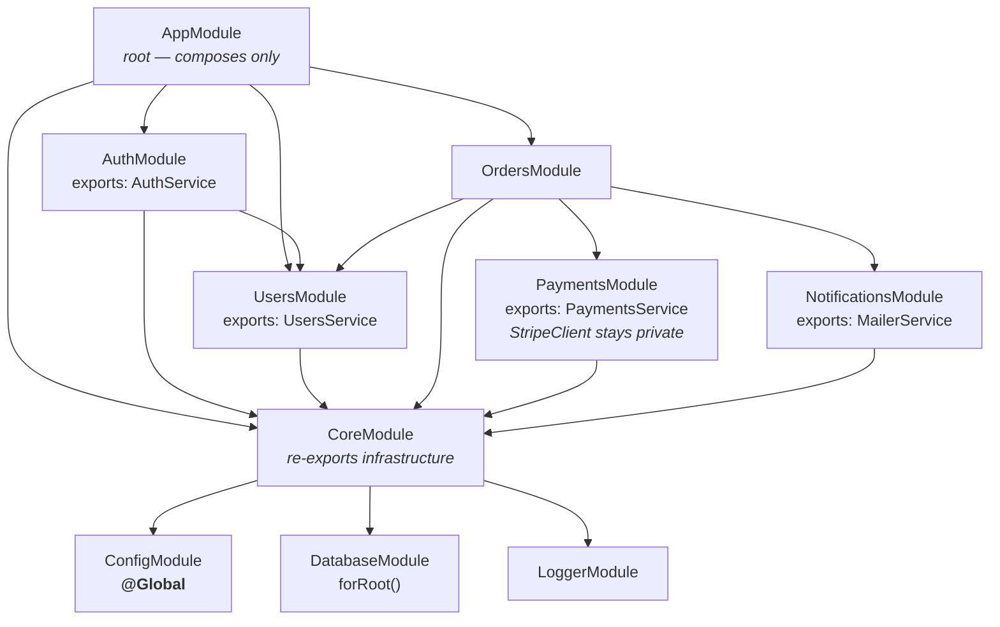

# Chapter 6 — Modules: Structuring the Application Graph

> **한눈에 보기**
> 5장에서 프로바이더를 만들었다면, 이 장은 그 프로바이더가 **어디에서 보이는가**를 결정합니다.
> Nest의 인젝터는 전역이 아니라 **모듈 단위로 캡슐화**되어 있고, 이 캡슐화 규칙을 모르면
> "같은 서비스인데 상태가 두 개"라는 버그를 반드시 만나게 됩니다.
> `@Module()`의 네 가지 키, 공유 모듈의 단일 인스턴스 규칙, `@Global()`의 대가,
> 모듈 그래프가 DAG라는 사실과 순환이 생겼을 때 벌어지는 일을 다룹니다.

**What you will learn**

- What each of `providers`, `controllers`, `imports`, and `exports` actually does to the injector — and why three of them are not interchangeable.
- Why a provider registered in two modules gives you **two instances**, and how the export/import pair gives you exactly one.
- How re-exporting lets a "core" module act as a facade over several infrastructure modules.
- When `@Global()` is justified, what it costs you, and why it is not a substitute for `imports`.
- How to inject a provider *into a module class*, and why a module class can never itself be a provider.
- What Nest does when the module graph contains a cycle, and how to see the graph before it bites you.
- A folder layout that survives a team of ten, and why barrel files are a liability in a Nest codebase.

**Why this matters**

Two symptoms send more Nest developers to the issue tracker than anything else, and both are module problems wearing a provider costume.

The first: a `CacheService` that "does not remember anything". Writes made through `OrdersModule` are invisible from `UsersModule`. Nothing throws, nothing logs, the tests pass individually. The cause is that `CacheService` was listed in the `providers` array of both modules, so Nest built two instances with two independent `Map`s. The provider was correct; the module wiring was not.

The second: `Nest can't resolve dependencies of the OrdersService (?)` for a provider you can see, spelled correctly, in a module three directories away. The cause is encapsulation: a module's providers are private unless exported, and an importer sees only what the imported module chose to expose. That is deliberate — the module boundary exists so a large application has *seams*, places where you can say "this is the public API of the billing subsystem" and have the container enforce it.

Modules are also how Nest builds the **application graph** — the structure it walks at bootstrap to decide instantiation order, lifecycle-hook order, shutdown order, and which enhancers apply where. Everything from `TypeOrmModule.forRoot()` to `@nestjs/config` to your own dynamic modules is expressed in this vocabulary.

---

## 1. `@Module()` and its four keys

A module is a class annotated with `@Module()`. The class body is usually empty; the decorator's metadata object is the entire point.

```typescript title="src/orders/orders.module.ts"
import { Module } from '@nestjs/common';
import { OrdersController } from './orders.controller';
import { OrdersService } from './orders.service';
import { PaymentsModule } from '../payments/payments.module';

@Module({
  imports: [PaymentsModule],
  controllers: [OrdersController],
  providers: [OrdersService],
  exports: [OrdersService],
})
export class OrdersModule {}
```

| Key | What it does | Direction |
|---|---|---|
| `providers` | Providers **instantiated by this module's injector**, available to everything inside this module. | creates |
| `controllers` | Controllers instantiated here; their routes are registered on the HTTP adapter. | creates |
| `imports` | Other modules whose **exported** providers become visible inside this module. | borrows |
| `exports` | The subset of this module's providers (or re-exported modules) visible to modules that import this one. | lends |

Three rules follow, and memorising them prevents most module bugs:

1. **`providers` creates. It never "grants access".** Adding an already-existing class to a second module's `providers` array does not reach for the existing instance; it builds a new one.
2. **`imports` takes modules, not providers.** You cannot write `imports: [PaymentsService]`. The unit of visibility is the module.
3. **`exports` takes providers or modules, and only affects *other* modules.** Exporting changes nothing about what is visible inside the exporting module itself.

> **Hint** — `exports` accepts either the provider itself or just its token. For a custom provider `{ provide: 'CONNECTION', useFactory: ... }`, both `exports: ['CONNECTION']` and `exports: [connectionFactory]` work. Prefer the token: it is the thing consumers actually inject.

Every application has at least one module — the **root module**, conventionally `AppModule`, passed to `NestFactory.create()`. It is the entry point from which Nest discovers everything else by following `imports` edges.

---

## 2. Feature modules

The default unit of organisation is the **feature module**: one module per bounded capability, owning its controllers, its services, its DTOs, and its persistence.

```typescript title="src/cats/cats.module.ts"
import { Module } from '@nestjs/common';
import { CatsController } from './cats.controller';
import { CatsService } from './cats.service';

@Module({
  controllers: [CatsController],
  providers: [CatsService],
})
export class CatsModule {}
```

```typescript title="src/app.module.ts"
import { Module } from '@nestjs/common';
import { CatsModule } from './cats/cats.module';

@Module({
  imports: [CatsModule],
})
export class AppModule {}
```

Note that `AppModule` declares no controllers and no providers. In a healthy application the root module is almost empty: it composes feature modules and configures infrastructure, and owns no domain logic itself. If `AppModule` has grown a `providers` array of fifteen services, that is the smell that the application never got modularised.

> **Hint** — `nest g module cats` creates the module *and* adds it to the nearest parent module's `imports` array. `nest g resource cats` scaffolds a whole feature module — controller, service, DTOs, entity, spec files — in one command.

The organising principle is **cohesion by capability, not by technical layer**. A `services/` directory holding every service and a `controllers/` directory holding every controller is the anti-pattern: nothing can be moved, deleted, or extracted without touching both. A feature module is deletable with one `rm -rf` and one line removed from `imports`, and that deletability is what you are buying.

---

## 3. Encapsulation: the visibility rule

This is the rule that makes modules more than folders:

> **A module can inject only (a) providers it declares itself, and (b) providers exported by modules it imports.**

Nothing else is reachable. Not a provider two modules away, not a provider in a sibling, not a provider in a module that imports *you*. Visibility is not transitive by default either: if `A` imports `B` and `B` imports `C`, then `A` cannot see `C`'s providers unless `B` re-exports `C` (§5).

```typescript
// payments.module.ts
@Module({
  providers: [PaymentsService, StripeClient],
  exports: [PaymentsService],          // StripeClient stays private
})
export class PaymentsModule {}

// orders.module.ts
@Module({
  imports: [PaymentsModule],
  providers: [OrdersService],
})
export class OrdersModule {}
```

`OrdersService` may inject `PaymentsService`. If it tries to inject `StripeClient`, bootstrap fails with `Nest can't resolve dependencies of the OrdersService (?)` — and that failure is the system working. `StripeClient` is an implementation detail of the payments subsystem; the day you swap Stripe for Adyen, only `PaymentsModule` changes.

Treat `exports` as an API design decision, not a checkbox to tick when the error appears. A useful heuristic: **export the thing you would be willing to keep stable for a year.** Repositories, HTTP clients, and internal config usually stay private; the service that expresses the subsystem's use cases is what you export.

---

## 4. Shared modules and the single-instance rule

Every Nest module is automatically shareable. There is no separate "shared module" concept — there is only a module that exports something and other modules that import it.

```typescript title="src/cats/cats.module.ts"
@Module({
  controllers: [CatsController],
  providers: [CatsService],
  exports: [CatsService],
})
export class CatsModule {}
```

Now `CatsModule` can be imported by `DogsModule`, `ShelterModule`, and `ReportsModule`, and **all three receive the same `CatsService` instance**. Providers are singletons per module context, and the context that owns `CatsService` is `CatsModule` — importers borrow the instance, they do not create their own.

### The duplicate-registration trap

Here is the mistake, side by side with the fix:

```typescript
// ❌ Two instances. Two caches. Two counters.
@Module({ providers: [CatsService, DogsService] })
export class DogsModule {}

@Module({ providers: [CatsService, ReportsService] })
export class ReportsModule {}

// ✅ One instance, borrowed by both.
@Module({ providers: [CatsService], exports: [CatsService] })
export class CatsModule {}

@Module({ imports: [CatsModule], providers: [DogsService] })
export class DogsModule {}

@Module({ imports: [CatsModule], providers: [ReportsService] })
export class ReportsModule {}
```

The broken version compiles, boots, and passes most unit tests. It fails in production three ways. **State diverges**: in-memory caches, counters, timers, and subscription registries silently fork, and whichever instance you inspect in the debugger looks correct. **Resources multiply**: a provider owning a database pool or an AMQP channel now holds two, so connection limits are reached at half the expected load. **Lifecycle hooks duplicate**: `onModuleInit()` runs once per instance, so a provider that starts a cron job or subscribes to a queue starts it twice and processes every message twice. The tell, with `NEST_DEBUG=true`, is the same provider name being instantiated under two different module contexts.

> **⚠️ Notice** — This applies to providers with default scope. Request-scoped providers (Chapter 38) are instantiated per request by design, and durable providers change the rule again. When in doubt about what "shared" means for a given provider, check its scope first.

---

## 5. Module re-exporting

A module can export a module it imports. This turns it into a facade over several lower-level modules.

```typescript title="src/core/core.module.ts"
import { Module } from '@nestjs/common';
import { CommonModule } from '../common/common.module';
import { DatabaseModule } from '../database/database.module';
import { LoggerModule } from '../logger/logger.module';

@Module({
  imports: [CommonModule, DatabaseModule, LoggerModule],
  exports: [CommonModule, DatabaseModule, LoggerModule],
})
export class CoreModule {}
```

Any module that imports `CoreModule` now sees everything those three modules export, without naming them. Feature modules import one thing:

```typescript
@Module({
  imports: [CoreModule],
  controllers: [OrdersController],
  providers: [OrdersService],
})
export class OrdersModule {}
```

This is the honest alternative to `@Global()`: the dependency stays explicit at every import site, so a module's header still tells you what it depends on, but the boilerplate is one line instead of five. It also gives you a single place to change infrastructure — swap `LoggerModule` for `PinoLoggerModule` inside `CoreModule` and no feature module notices.

Re-exporting works for dynamic modules too, and there is a wrinkle worth knowing now: when re-exporting a dynamic module you **omit the `forRoot()` call** in `exports`.

```typescript
@Module({
  imports: [DatabaseModule.forRoot([User])],
  exports: [DatabaseModule],          // not DatabaseModule.forRoot([User])
})
export class CoreModule {}
```

The `forRoot()` call in `imports` is what registers the configured providers; the bare class in `exports` names the module whose exports should be forwarded. Chapter 37 explains why.

---

## 6. Global modules, and the price of using them

`@Global()` makes a module's exports visible everywhere without an `imports` entry.

```typescript title="src/logger/logger.module.ts"
import { Global, Module } from '@nestjs/common';
import { LoggerService } from './logger.service';

@Global()
@Module({
  providers: [LoggerService],
  exports: [LoggerService],
})
export class LoggerModule {}
```

The module must still be imported **exactly once**, by the root or core module — `@Global()` registers its exports in the global provider set at that moment; it does not make the module import itself. A dynamic module achieves the same with `global: true` on the returned object.

What it costs you. **Dependencies become invisible**: a module's header no longer tells you what it needs, you cannot review coupling by reading imports, and you cannot extract a feature into a library without discovering its hidden dependencies one bootstrap failure at a time. **Tests get heavier**: `Test.createTestingModule({ providers: [OrdersService] })` fails for a globally-provided dependency unless you re-register it, and the error does not say which module was supposed to supply it. **Collisions get harder to reason about**: two global modules exporting the same token becomes a resolution-order question.

The author's position: use `@Global()` only for cross-cutting infrastructure with exactly one implementation per process — a logger, a config service, an AsyncLocalStorage context holder, or `ConfigModule.forRoot({ isGlobal: true })`. Use plain `imports` or a re-exporting `CoreModule` for everything else. "Importing this everywhere is tedious" is a reason to build a facade, not to go global.

---

## 7. Injecting providers into a module class

A module class can have a constructor with dependencies, resolved from that module's own context:

```typescript title="src/cats/cats.module.ts"
import { Module, OnModuleInit } from '@nestjs/common';
import { CatsController } from './cats.controller';
import { CatsService } from './cats.service';

@Module({
  controllers: [CatsController],
  providers: [CatsService],
})
export class CatsModule implements OnModuleInit {
  constructor(private readonly catsService: CatsService) {}

  onModuleInit() {
    this.catsService.seedDefaults();
  }
}
```

This is useful for module-level setup: seeding, registering handlers discovered at boot, validating configuration and failing fast. It is a poor place for anything ongoing — a module class is not a service, and logic in a module header is invisible to everyone reading the feature's service files.

**A module class can never be injected as a provider.** You cannot write `constructor(private catsModule: CatsModule)`. The module is what constructs its own providers, so a provider depending on its module would be a circular dependency by construction. If you need to reach into a module at runtime, use `ModuleRef` (Chapter 41).

---

## 8. The module graph is a DAG

`imports` edges form a directed graph. Nest walks it from the root module, instantiates each module's providers bottom-up, and expects the graph to be **acyclic**.



Read the shape, not the boxes. `CoreModule` is a sink everything depends on and that depends on nothing in the domain. Feature modules depend *downward* on infrastructure and *sideways* on a few peers. `AppModule` has only outgoing edges; nothing points back up. That shape is what makes a module extractable into a library later.

### What happens on a cycle

If `UsersModule` imports `OrdersModule` and `OrdersModule` imports `UsersModule`, one of them is evaluated first and, because ES module resolution has not finished the other file yet, its class reference is `undefined`. Nest reports:

```text
[Nest] ERROR A circular dependency between modules was detected.
Nest cannot create the OrdersModule instance.
The module at index [1] of the UsersModule "imports" array is undefined.
```

Nest provides `forwardRef()` for both module imports and provider injection to break the cycle explicitly:

```typescript
@Module({
  imports: [forwardRef(() => OrdersModule)],
  providers: [UsersService],
  exports: [UsersService],
})
export class UsersModule {}
```

Treat `forwardRef()` as a diagnosis, not a cure. A cycle almost always means a missing third module: extract the shared concept (a `UserOrdersReadModel`, a domain event, a shared `AccountsModule`) and both cycles resolve into a DAG. [Chapter 41 — ModuleRef, DiscoveryService, Lazy Loading, and Circular Dependencies](../part3-advanced/41-module-ref-discovery-lazy.md) covers `forwardRef()`, the provider-level variant, and the refactorings that remove the need for it.

> **Hint** — `@nestjs/devtools-integration` renders the live graph in a browser, including which module supplied each injected token. On any codebase past a dozen modules it pays for itself the first time you use it. See Chapter 56.

---

## 9. Dynamic modules, briefly

Everything so far is *static* metadata, fixed at compile time. A **dynamic module** is a module whose metadata is computed by a static method at import time:

```typescript title="src/database/database.module.ts"
import { DynamicModule, Module } from '@nestjs/common';
import { createDatabaseProviders } from './database.providers';
import { Connection } from './connection.provider';

@Module({
  providers: [Connection],
  exports: [Connection],
})
export class DatabaseModule {
  static forRoot(entities: Function[] = [], options?: DbOptions): DynamicModule {
    const providers = createDatabaseProviders(options, entities);
    return {
      module: DatabaseModule,
      providers,
      exports: providers,
    };
  }
}
```

```typescript
@Module({
  imports: [DatabaseModule.forRoot([User])],
})
export class AppModule {}
```

Two facts to carry forward. First, the returned metadata **extends** rather than replaces what the `@Module()` decorator declared: `Connection` is still provided and exported alongside the generated repository providers. Second, `forRoot()` may return the `DynamicModule` object synchronously or as a `Promise`, and adding `global: true` to the returned object registers it globally — with the same caveats as §6.

This shape is why you write `ConfigModule.forRoot()`, `TypeOrmModule.forFeature([User])`, and `JwtModule.registerAsync({...})`. Those conventions — `forRoot` for once-per-app, `forFeature` for per-module, the `*Async` variants — and `ConfigurableModuleBuilder`, which generates all of it, are the subject of [Chapter 37](../part3-advanced/37-dynamic-modules.md).

---

## 10. Folder structure and barrel files

A layout that scales, and the reasoning behind each choice:

```text
src/
├── main.ts
├── app.module.ts                # composes only
├── core/
│   ├── core.module.ts           # re-exports config, database, logger
│   ├── config/
│   ├── database/
│   └── logger/
├── common/                      # no domain knowledge: pipes, filters, decorators
│   ├── decorators/
│   ├── filters/
│   ├── guards/
│   └── interceptors/
└── orders/
    ├── orders.module.ts
    ├── orders.controller.ts
    ├── orders.service.ts
    ├── orders.repository.ts
    ├── dto/
    │   ├── create-order.dto.ts
    │   └── update-order.dto.ts
    ├── entities/
    │   └── order.entity.ts
    └── orders.service.spec.ts
```

- **`core/` versus `common/`.** `core` holds *stateful* infrastructure instantiated once (connections, config, logger); `common` holds *stateless* building blocks with no domain knowledge (a `ParseObjectIdPipe`, an `AllExceptionsFilter`, a `@CurrentUser()` decorator). The distinction matters because `core` must be imported exactly once and `common` can be imported freely.
- **Specs live beside their subject.** Moving the feature then moves its tests; a parallel `test/` tree does not survive a refactor.
- **One module per directory, named after the directory.** `nest g` assumes this; so will everyone reading the code.

### Barrel files are a liability here

A barrel is an `index.ts` that re-exports a directory:

```typescript title="src/orders/index.ts"
export * from './orders.module';
export * from './orders.service';
export * from './dto/create-order.dto';
```

It looks tidy and causes three specific problems in a Nest codebase:

1. **It manufactures circular imports.** If `orders.service.ts` imports from `users/index.ts` and `users.service.ts` imports from `orders/index.ts`, you have a cycle between *files* even though the modules are acyclic — and the symptom is `Nest can't resolve dependencies`, or a class that is `undefined` at decoration time, with a stack trace pointing at neither file.
2. **It defeats tree-shaking and slows the compiler.** Importing one DTO pulls the whole barrel's graph into the compilation unit and the bundle; on a serverless deploy that shows up in cold-start time.
3. **It hides the encapsulation boundary.** The point of §3 is that a module has a public API; a barrel that exports every file states the opposite.

The recommendation: **no barrels inside `src/`.** Import by full path. The one place a barrel earns its keep is the entry point of a publishable library in a monorepo, where the barrel *is* the curated API surface — see [Chapter 54](../part3-advanced/54-monorepo-and-libraries.md).

---

## Common mistakes

1. **Registering a shared provider in every module that uses it.** *Symptom:* state written through one module is invisible from another; connection counts double. *Cause:* each `providers` entry creates a separate instance. *Fix:* declare it once, export it, and import the owning module everywhere else.

2. **Putting a provider in `imports`.** *Symptom:* `TypeError: Cannot read properties of undefined` inside `NestFactory.create`, or "Nest cannot create the module instance". *Cause:* `imports` accepts modules and dynamic modules only. *Fix:* `imports: [PaymentsModule]`, not `imports: [PaymentsService]`.

3. **Forgetting `exports` and adding the provider to the consumer instead.** *Symptom:* the resolution error disappears but the bug from mistake #1 appears. *Cause:* the error was telling you the truth — the provider was not public. *Fix:* add it to the owning module's `exports`.

4. **Assuming imports are transitive.** *Symptom:* `A` imports `B`, `B` imports `C`, and `A` cannot inject `C`'s exported provider. *Cause:* visibility only crosses one edge. *Fix:* re-export `C` from `B`, or import `C` in `A` directly.

5. **Importing a `@Global()` module more than once.** *Symptom:* duplicated lifecycle hooks, or a dynamic module configured twice with different options. *Cause:* `@Global()` controls visibility, not instantiation; each import site of a *dynamic* global module registers its providers again. *Fix:* import it exactly once, in the root or core module.

6. **Registering a dynamic module with `forRoot()` in a feature module.** *Symptom:* two database pools, two config instances. *Cause:* `forRoot()` is once-per-application by convention; `forFeature()` is the per-module counterpart. *Fix:* `forRoot()` in `AppModule`/`CoreModule` only.

7. **Re-exporting a dynamic module with the `forRoot()` call.** *Symptom:* `exports: [DatabaseModule.forRoot([User])]` compiles but importers still cannot see the providers. *Cause:* the exported reference must be the module class. *Fix:* `exports: [DatabaseModule]`.

8. **Solving a module cycle with `forwardRef()` and moving on.** *Symptom:* the app boots, then a provider is `undefined` at a random call site, usually under lazy initialisation. *Cause:* the cycle is still there; `forwardRef()` only delays resolution. *Fix:* extract the shared concept into a third module. See Chapter 41.

---

## Putting it together

A four-module slice showing encapsulation, sharing, re-exporting, and one global module.

```typescript title="src/core/core.module.ts"
import { Global, Module } from '@nestjs/common';
import { ConfigService } from './config/config.service';
import { LoggerService } from './logger/logger.service';

@Global()
@Module({
  providers: [ConfigService, LoggerService],
  exports: [ConfigService, LoggerService],
})
export class CoreModule {}
```

```typescript title="src/users/users.module.ts"
import { Module } from '@nestjs/common';
import { UsersController } from './users.controller';
import { UsersRepository } from './users.repository';
import { UsersService } from './users.service';

@Module({
  controllers: [UsersController],
  providers: [UsersService, UsersRepository], // repository stays private
  exports: [UsersService],                    // the module's public API
})
export class UsersModule {}
```

```typescript title="src/payments/payments.module.ts"
import { Module } from '@nestjs/common';
import { PaymentsService } from './payments.service';
import { StripeClient } from './stripe.client';

@Module({
  providers: [PaymentsService, StripeClient], // StripeClient stays private
  exports: [PaymentsService],
})
export class PaymentsModule {}
```

```typescript title="src/orders/orders.service.ts"
import { Injectable } from '@nestjs/common';
import { LoggerService } from '../core/logger/logger.service';
import { PaymentsService } from '../payments/payments.service';
import { UsersService } from '../users/users.service';

@Injectable()
export class OrdersService {
  constructor(
    private readonly users: UsersService,        // via imports: [UsersModule]
    private readonly payments: PaymentsService,  // via imports: [PaymentsModule]
    private readonly logger: LoggerService,      // via @Global() CoreModule
  ) {}

  async place(userId: string, amountCents: number) {
    const user = await this.users.findById(userId);
    const receipt = await this.payments.charge(user.customerId, amountCents);
    this.logger.log(`Order placed for ${user.id}: ${receipt.id}`);
    return receipt;
  }
}
```

```typescript title="src/orders/orders.module.ts"
import { Module } from '@nestjs/common';
import { PaymentsModule } from '../payments/payments.module';
import { UsersModule } from '../users/users.module';
import { OrdersController } from './orders.controller';
import { OrdersService } from './orders.service';

@Module({
  imports: [UsersModule, PaymentsModule],
  controllers: [OrdersController],
  providers: [OrdersService],
})
export class OrdersModule {}
```

```typescript title="src/app.module.ts"
import { Module } from '@nestjs/common';
import { CoreModule } from './core/core.module';
import { OrdersModule } from './orders/orders.module';
import { UsersModule } from './users/users.module';

@Module({
  imports: [CoreModule, UsersModule, OrdersModule],
})
export class AppModule {}
```

Verify the boundaries by trying to break them. Inject `UsersRepository` into `OrdersService` and bootstrap fails — encapsulation held. Add `UsersService` to `OrdersModule`'s `providers` and it boots, but `UsersController` and `OrdersService` now talk to different instances; a `console.log` in the `UsersService` constructor runs twice. That one experiment teaches the module system faster than any diagram.

---

> **핵심 정리**
> - `providers`는 **인스턴스를 만들고**, `imports`는 **빌려오고**, `exports`는 **빌려준다**. 이 세 가지는 서로 대체 가능하지 않다.
> - 모듈은 기본적으로 프로바이더를 **캡슐화**한다. 임포트한 모듈이 `exports`에 넣은 것만 보인다. 가시성은 한 단계만 전파되며 전이적이지 않다.
> - 같은 클래스를 두 모듈의 `providers`에 넣으면 인스턴스가 **두 개** 생긴다. 상태 분기, 커넥션 중복, 라이프사이클 훅 이중 실행이 뒤따른다.
> - 모듈 재수출(`imports`와 `exports` 양쪽에 모듈을 나열)은 `CoreModule` 같은 파사드를 만드는 정직한 방법이며, `@Global()`보다 우선 고려해야 한다.
> - `@Global()`은 로거·설정처럼 프로세스에 하나뿐인 인프라에만 쓰고, 루트/코어 모듈에서 **한 번만** 임포트한다. 의존성을 보이지 않게 만드는 대가를 치른다.
> - 모듈 클래스에는 프로바이더를 주입할 수 있지만, 모듈 클래스 자체는 프로바이더로 주입할 수 없다.
> - 모듈 그래프는 **DAG**여야 한다. 순환이 생기면 `forwardRef()`로 막기 전에 제3의 모듈로 개념을 추출하라 (41장).
> - 동적 모듈이 반환하는 메타데이터는 `@Module()` 메타데이터를 **덮어쓰지 않고 확장**한다. 재수출할 때는 `forRoot()` 호출 없이 클래스만 나열한다.
> - `src/` 안에서 배럴 파일(`index.ts`)은 순환 임포트와 빌드 비대화를 부른다. 전체 경로로 임포트하라.

> **연습 문제**
> 1. `UsersModule`의 `exports`에서 `UsersService`를 지우고 앱을 실행해 보라. 오류 메시지가 정확히 어떤 모듈 컨텍스트를 가리키는지 확인하고, 왜 "임포트를 했는데도" 실패하는지 설명하라.
> 2. `A → B → C` 형태의 세 모듈을 만들고, `C`가 export한 프로바이더를 `A`에서 주입해 보라. 실패하는가? `B`에서 `C`를 재수출하면 어떻게 달라지는가?
> 3. **구현 과제**: 인메모리 카운터를 가진 `CounterService`를 만들어 두 모듈의 `providers`에 각각 등록하고, 두 모듈의 컨트롤러에서 증가/조회 엔드포인트를 노출하라. 값이 어긋나는 것을 확인한 뒤 export/import 방식으로 고치고, 생성자에 로그를 찍어 인스턴스 개수를 증명하라.
> 4. **구현 과제**: `ConfigModule`, `LoggerModule`, `DatabaseModule`을 재수출하는 `CoreModule`을 작성하라. 그다음 `LoggerModule`만 `@Global()`로 바꿔 보고, 두 방식이 테스트 작성(`Test.createTestingModule`)에 각각 어떤 영향을 주는지 비교하라.
> 5. `UsersModule`과 `OrdersModule`이 서로를 임포트하도록 만들어 순환을 일으킨 뒤, 실제 오류 메시지를 기록하라. `forwardRef()`로 해결한 버전과, 공통 개념을 제3의 모듈로 추출해 해결한 버전을 각각 만들고 장단점을 비교하라.

**Next:** You now know where a token is visible. [Chapter 7 — Dependency Injection: How Nest Wires Your Application](./07-dependency-injection-basics.md) goes one level down into how a token is *resolved* — class, string, and symbol tokens, the four provider recipes in depth, async factories that delay bootstrap, and how all of it shows up in unit tests.
