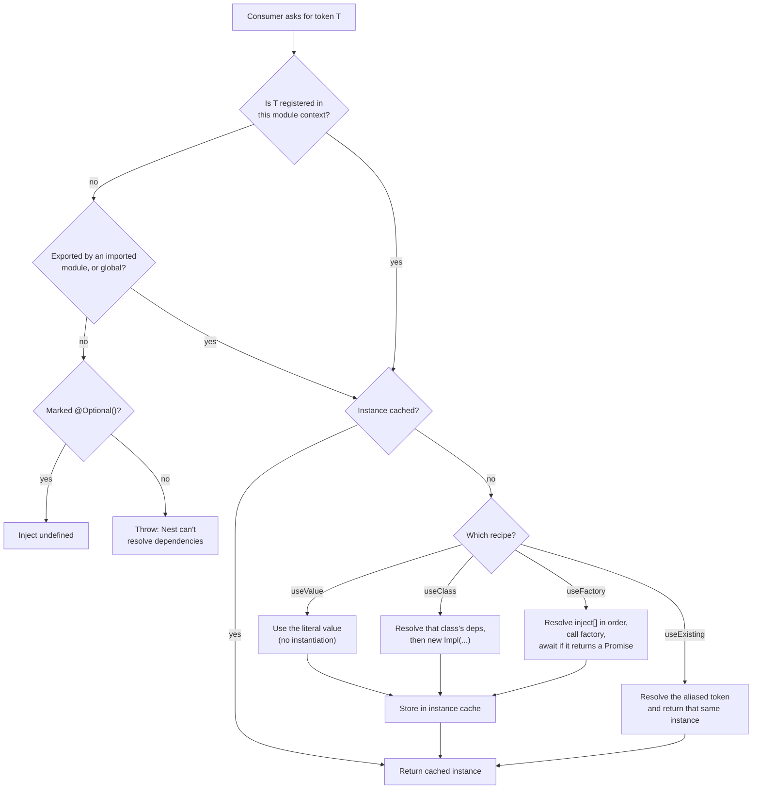

# Chapter 7 — Dependency Injection: How Nest Wires Your Application

> **한눈에 보기**
> 5장에서 프로바이더를, 6장에서 모듈 경계를 배웠습니다. 이 장은 그 둘을 잇는 **해석(resolution)** 과정을 다룹니다.
> 선언(declare) → 등록(register) → 주입(inject)이라는 세 단계, 클래스·문자열·심볼 토큰의 차이,
> 그리고 `useClass`·`useValue`·`useFactory`·`useExisting` 네 가지 커스텀 프로바이더 문법을
> 실제로 쓸 수 있을 만큼 깊이 살펴봅니다. 비동기 팩토리로 부팅을 지연시키는 방법도 여기서 배웁니다.

**What you will learn**

- The three steps every dependency goes through — declare, register, resolve — and which file each lives in.
- Why inversion of control is a *testing* property before it is an architecture property.
- How to use string, `Symbol`, and abstract-class tokens, and which to pick for a given job.
- How to write `useValue`, `useClass`, `useFactory`, and `useExisting` providers, including factories that inject other providers.
- How an `async` factory delays bootstrap until a connection is ready — and when that is the wrong tool.
- How to export custom providers, and how the same mechanism gives you clean unit tests with `Test.createTestingModule()` and `overrideProvider()`.

**Why this matters**

Dependency injection sounds like framework ceremony until the day you need to do one of these things: swap the real payment gateway for a fake in an end-to-end test, without a single `jest.mock()` call and without the code under test knowing; run the same `AuthService` against an in-memory user store locally and LDAP in production, with the choice made in one file; refuse HTTP traffic until the database handshake completes, so the first request never sees a half-initialised pool; ship a library whose consumers supply their own logger, HTTP client, and clock without you exporting a single global.

Every one of those is a five-line change once you understand provider tokens and the four recipes, and a multi-day refactor without them. That is the whole argument for DI, and it is practical rather than philosophical. The mechanism also explains error messages that otherwise look arbitrary: `Nest can't resolve dependencies of the CatsService (?)`, or `... (CatsRepository, ?)` — each names the position in the dependency list that failed. By the end of this chapter you will read them as diagnostics rather than noise.

---

## 1. Three steps: declare, register, resolve

Every injected dependency in Nest goes through the same three steps, and each lives in a different file. This is the whole model.

**Step 1 — Declare.** `@Injectable()` marks a class as manageable by the container (Chapter 5: a marker that also triggers `design:paramtypes` emission).

```typescript title="src/cats/cats.service.ts"
import { Injectable } from '@nestjs/common';
import { Cat } from './interfaces/cat.interface';

@Injectable()
export class CatsService {
  private readonly cats: Cat[] = [];
  findAll(): Cat[] { return [...this.cats]; }
}
```

**Step 2 — Request.** A consumer declares a dependency on the **token** `CatsService` through its constructor.

```typescript title="src/cats/cats.controller.ts"
import { Controller, Get } from '@nestjs/common';
import { CatsService } from './cats.service';
import { Cat } from './interfaces/cat.interface';

@Controller('cats')
export class CatsController {
  constructor(private catsService: CatsService) {}

  @Get()
  async findAll(): Promise<Cat[]> {
    return this.catsService.findAll();
  }
}
```

**Step 3 — Register.** The module associates the token `CatsService` with a recipe.

```typescript title="src/app.module.ts"
@Module({
  controllers: [CatsController],
  providers: [CatsService],
})
export class AppModule {}
```

When the container instantiates `CatsController` it reads the constructor's token list, looks up `CatsService` in the module registry, finds the step-3 registration, and — at default (singleton) scope — either creates and caches the instance or returns the cached one.

Two properties are worth stating explicitly. **Analysis is transitive**: if `CatsService` has its own dependencies they are resolved first, and theirs before that — the container builds the graph and instantiates bottom-up, so you never write initialisation order by hand. **It happens once, at bootstrap**: for default-scoped providers all of this finishes before the HTTP server listens, so a wiring error is a startup crash rather than a 3 a.m. 500.

> **Hint** — Set `NEST_DEBUG=true` for per-token resolution logs during bootstrap, showing each token, its dependent class, and the module it was found in. It is the most effective debugging tool for DI problems.

---

## 2. Inversion of control, concretely

The "inversion" is small and specific. Compare:

```typescript
// ❌ Control in the consumer: the class chooses its collaborator
export class OrdersService {
  private payments = new StripePaymentsService(process.env.STRIPE_KEY!);
}

// ✅ Control inverted: the class declares a need, the container decides
@Injectable()
export class OrdersService {
  constructor(private readonly payments: PaymentsService) {}
}
```

The second version cannot be given the wrong collaborator by accident, and can be given a different one deliberately without editing. **Testability**: `new OrdersService(new FakePayments())` works with no framework at all — the acid test of a well-injected class. **Late binding**: the choice of implementation moves to a module, the one place that can see the environment. **Lifetime management**: the container owns creation and destruction, so shutdown hooks (Chapter 39) run in the right order without a registry you maintain.

The cost is indirection: reading `OrdersService` no longer tells you which class runs — you must look at the module. That is why Chapter 6 insists modules stay small and honest. DI trades local clarity for global flexibility, and a module registering thirty providers has spent the flexibility and kept the cost.

---

## 3. Tokens: class, string, symbol, abstract class

A **token** is the key the container looks up. Four kinds are usable, and picking the right one is most of the skill.

| Token kind | Example | Injected with | Use when |
|---|---|---|---|
| Class | `CatsService` | plain constructor type | The class is the contract (the common case). |
| String | `'CONNECTION'` | `@Inject('CONNECTION')` | Quick and readable; risks collisions across packages. |
| `Symbol` | `Symbol('LOGGER')` | `@Inject(LOGGER)` | Libraries and large apps — unique runtime identity. |
| Abstract class | `abstract class LoggerService` | plain constructor type | One artifact should be both contract and runtime token. |

### Why interfaces are not on that list

TypeScript interfaces are erased at compile time, so they have no runtime identity and cannot be tokens. This compiles, then fails at bootstrap:

```typescript
export interface LoggerPort { log(message: string): void }

@Injectable()
export class CatsService {
  constructor(private readonly logger: LoggerPort) {} // ❌ paramtype is Object
}
```

The two correct shapes. First, keep the interface for typing and add a `Symbol` as the runtime token:

```typescript title="src/logger/logger.tokens.ts"
export interface LoggerPort { log(message: string): void }
export const LOGGER = Symbol('LOGGER');
```

```typescript
@Injectable()
export class PinoLoggerService implements LoggerPort {
  log(message: string) { /* implementation details */ }
}

@Module({
  providers: [{ provide: LOGGER, useClass: PinoLoggerService }],
  exports: [LOGGER],
})
export class LoggerModule {}

// Injection — the token must be named explicitly
@Injectable()
export class CatsService {
  constructor(@Inject(LOGGER) private readonly logger: LoggerPort) {}
}
```

Second, use an abstract class — which *does* survive compilation, because it emits a real constructor function:

```typescript
export abstract class LoggerService {
  abstract log(message: string): void;
}

@Module({
  providers: [{ provide: LoggerService, useClass: PinoLoggerService }],
  exports: [LoggerService],
})
export class LoggerModule {}

// No @Inject() needed: the abstract class is both type and token
@Injectable()
export class CatsService {
  constructor(private readonly logger: LoggerService) {}
}
```

**Which to choose.** Abstract classes give the cleanest call sites and are the author's default inside an application: one import, no `@Inject()`, full type checking. `Symbol` tokens are right for libraries and anything crossing package boundaries, since each symbol has unique runtime identity and two packages cannot collide the way `'CONFIG'` and `'CONFIG'` can. Plain strings are acceptable in a small app kept in one `constants.ts` — never inline the same literal twice, because a typo becomes a bootstrap error rather than a compile error.

> **Hint** — Keep tokens in a dedicated file (`cats.tokens.ts`, `constants.ts`) and import them. Treat them as you would enums: defined once, imported everywhere.

---

## 4. The standard provider, expanded

The shorthand you have been writing is sugar:

```typescript
providers: [CatsService]
// is exactly
providers: [{ provide: CatsService, useClass: CatsService }]
```

The expanded form is where token and recipe separate, and it is the entry point to everything else here. Four recipes exist, all objects with a `provide` key plus one `use*` key:



Trace one thing on that diagram: `useExisting` skips the cache-store step and returns the aliased instance directly. That is the mechanical reason an alias is an alias and not a copy.

---

## 5. `useValue`: constants, third-party objects, and mocks

`useValue` supplies an already-existing value. Nest performs no instantiation and no dependency resolution on it.

```typescript
import { Module } from '@nestjs/common';
import { CatsService } from './cats.service';

const mockCatsService = {
  findAll: () => [{ id: 1, name: 'Alice', age: 3, breed: 'Bengal' }],
  create: () => undefined,
};

@Module({
  imports: [CatsModule],
  providers: [{ provide: CatsService, useValue: mockCatsService }],
})
export class AppModule {}
```

Because TypeScript is structurally typed, the value only needs a compatible shape — a literal object, an instance created with `new`, a client from a third-party SDK. That gives `useValue` three roles: **constants** (`{ provide: 'APP_NAME', useValue: 'cats-api' }`), **third-party clients built outside Nest** (an already-constructed `Stripe`, `Redis`, or `S3Client`), and **test doubles**, which §10 builds on.

> **⚠️ Notice** — `useValue` bypasses dependency resolution entirely. A class instance created with `new` gets nothing injected into it, though its `onModuleInit()` will still be called if it implements the interface. If the value needs dependencies, use `useFactory`.

---

## 6. Non-class tokens and `@Inject()`

Constructor injection by type only works when the type is a class. For string and symbol tokens you name the token with `@Inject()`:

```typescript title="src/database/database.constants.ts"
export const CONNECTION = 'CONNECTION';
```

```typescript title="src/database/database.module.ts"
import { Module } from '@nestjs/common';
import { connection } from './connection';
import { CONNECTION } from './database.constants';

@Module({
  providers: [{ provide: CONNECTION, useValue: connection }],
  exports: [CONNECTION],
})
export class DatabaseModule {}
```

```typescript title="src/cats/cats.repository.ts"
import { Inject, Injectable } from '@nestjs/common';
import { CONNECTION } from '../database/database.constants';
import { Connection } from '../database/connection';

@Injectable()
export class CatsRepository {
  constructor(@Inject(CONNECTION) private readonly connection: Connection) {}
}
```

`@Inject()` comes from `@nestjs/common` and takes one argument: the token. It also works with class tokens (`@Inject(CatsService)`), occasionally necessary inside a `forwardRef()` for circular dependencies, or on property injection where no `design:paramtypes` exists.

---

## 7. `useClass`: choosing an implementation

`useClass` decouples the token from the class that satisfies it — how one decision in one file reaches the whole application.

```typescript title="src/config/config.providers.ts"
import { ConfigService } from './config.service';
import { DevelopmentConfigService } from './development-config.service';
import { ProductionConfigService } from './production-config.service';

export const configServiceProvider = {
  provide: ConfigService,
  useClass:
    process.env.NODE_ENV === 'development' ? DevelopmentConfigService : ProductionConfigService,
};

@Module({
  providers: [configServiceProvider],
  exports: [ConfigService],
})
export class ConfigModule {}
```

Every consumer writes `constructor(private config: ConfigService)` and is unaware of the branch. Defining the provider as a named object first is code organisation, but a habit worth having: the provider becomes importable, testable, reusable. This registration also overrides any `@Injectable()`-decorated `ConfigService` registered elsewhere in the same module — registration is last-one-wins within a `providers` array, which is what makes overriding work. Nest resolves the chosen class's own dependencies normally, so `ProductionConfigService` may inject a `SecretsManagerClient` while `DevelopmentConfigService` injects nothing.

---

## 8. `useFactory`: computed and asynchronous providers

`useFactory` supplies a function whose return value becomes the provider's value. It is the most flexible recipe and the one you meet most often in library code.

```typescript title="src/database/connection.provider.ts"
import { DatabaseConnection } from './database-connection';
import { MyOptionsProvider } from './my-options.provider';

export const connectionProvider = {
  provide: 'CONNECTION',
  useFactory: (optionsProvider: MyOptionsProvider, optionalProvider?: string) =>
    new DatabaseConnection(optionsProvider.get()),
  inject: [MyOptionsProvider, { token: 'SomeOptionalProvider', optional: true }],
  //       \______________/    \_________________________________________/
  //        mandatory           may resolve to undefined
};
```

```typescript
@Module({
  providers: [
    connectionProvider,
    MyOptionsProvider, // class-based provider
    // { provide: 'SomeOptionalProvider', useValue: 'anything' },
  ],
})
export class DatabaseModule {}
```

The rules for `inject`:

- It is **positional**: Nest resolves each entry and passes the instances to the factory **in the same order**. A mismatch with the parameter list is a silent bug, not a type error — TypeScript cannot correlate the two.
- Entries may be tokens (`MyOptionsProvider`, `'CONFIG'`, a `Symbol`) or objects of the form `{ token, optional: true }`; an unresolvable optional entry arrives as `undefined` instead of failing bootstrap.
- Omitting `inject` entirely is fine for a factory that needs nothing.

### Providers do not have to be services

A factory can return anything — an array, a number, a configuration object: `{ provide: 'CONFIG', useFactory: () => (process.env.NODE_ENV === 'development' ? devConfig : prodConfig) }`.

### Asynchronous providers

Sometimes the application should not accept requests until an asynchronous task finishes — most commonly, until the database connection is established. Make the factory `async`; Nest awaits the returned promise and **will not instantiate anything depending on that token** until it resolves.

```typescript title="src/database/async-connection.provider.ts"
export const asyncConnectionProvider = {
  provide: 'ASYNC_CONNECTION',
  useFactory: async () => await createConnection(options),
};
```

Inject it by token like any other provider, with `@Inject('ASYNC_CONNECTION')`.

Three things to understand before reaching for one. **They delay the whole bootstrap**: `NestFactory.create()` does not resolve until every async provider has settled — that is the point, but a hanging dependency makes the process appear to start and never listen, so give every async factory a timeout. **A rejected promise aborts startup**, usually correct behaviour, so make sure the rejection message identifies the dependency. **They are not a general "run this at boot" hook**: for side effects use `onModuleInit()` / `onApplicationBootstrap()` (Chapter 39).

The TypeORM and Mongoose integrations in Part II are built on this pattern; Chapters 19 and 21 show the production versions.

---

## 9. `useExisting` and exporting custom providers

### Aliases

`useExisting` creates a second token for a provider that already exists.

```typescript
import { Injectable, Module } from '@nestjs/common';

@Injectable()
class LoggerService { /* implementation details */ }

const loggerAliasProvider = { provide: 'AliasedLoggerService', useExisting: LoggerService };

@Module({ providers: [LoggerService, loggerAliasProvider] })
export class AppModule {}
```

Both tokens resolve to the **same singleton instance**: `app.get('AliasedLoggerService') === app.get(LoggerService)` is `true`. Contrast `useClass: LoggerService`, which builds a *second* instance under the second token — a distinction that matters whenever the provider holds state or a connection. Aliases are most useful during migrations: introduce the new token, alias it to the old provider, migrate consumers one at a time, then swap the alias for a real implementation.

### Exporting custom providers

Like any provider, a custom provider is private to its declaring module. Export it by **token**:

```typescript
const connectionFactory = {
  provide: 'CONNECTION',
  useFactory: (optionsProvider: OptionsProvider) =>
    new DatabaseConnection(optionsProvider.get()),
  inject: [OptionsProvider],
};

@Module({
  providers: [connectionFactory],
  exports: ['CONNECTION'],
})
export class DatabaseModule {}
```

Exporting the **full provider object** (`exports: [connectionFactory]`) is equivalent. Prefer the token form: it is shorter, it is what consumers actually write in `@Inject()`, and it keeps `exports` readable as a list of public names rather than implementations.

> **Hint** — This chapter covers the *syntax* of custom providers. Modules whose providers are configured by the importer — `forRoot()`, `forRootAsync()`, `ConfigurableModuleBuilder` — are [Chapter 37](../part3-advanced/37-dynamic-modules.md); the deeper patterns (provider discovery, injecting into custom decorators) are [Chapter 36](../part3-advanced/36-custom-providers.md).

---

## 10. How this shows up in unit tests

Everything above pays off here. `@nestjs/testing` builds a real injector from a module definition you write inline, so replacing a dependency means registering a different recipe for the same token.

```typescript title="src/orders/orders.service.spec.ts"
import { Test } from '@nestjs/testing';
import { OrdersService } from './orders.service';
import { PaymentsService } from '../payments/payments.service';
import { LOGGER } from '../logger/logger.tokens';

describe('OrdersService', () => {
  const payments = { charge: jest.fn().mockResolvedValue({ id: 'rc_1' }) };
  const logger = { log: jest.fn() };
  let service: OrdersService;

  beforeEach(async () => {
    const moduleRef = await Test.createTestingModule({
      providers: [
        OrdersService,
        { provide: PaymentsService, useValue: payments },  // class token -> mock
        { provide: LOGGER, useValue: logger },             // symbol token -> mock
      ],
    }).compile();
    service = moduleRef.get(OrdersService);
  });

  it('charges through the payments service', async () => {
    await service.place('user_1', 5000);
    expect(payments.charge).toHaveBeenCalledWith(expect.anything(), 5000);
  });
});
```

For an integration test that boots the real graph and replaces one thing, use `overrideProvider()`:

```typescript
const moduleRef = await Test.createTestingModule({ imports: [AppModule] })
  .overrideProvider(PaymentsService)
  .useValue(payments)
  .compile();
```

`overrideProvider()` accepts `.useValue()`, `.useClass()`, and `.useFactory()` — the same recipes, applied after the fact. Chapter 31 covers the full testing surface, including `useMocker()` for auto-mocking and end-to-end tests with `supertest`.

The design rule that follows: **if a class is hard to test, look at its constructor.** A class with three injected collaborators is three `useValue` lines away from a test; a class that calls `new` internally or reads `process.env` in a method body cannot be tested without touching the environment.

---

## Common mistakes

1. **Typing a dependency as an interface.** *Symptom:* `Nest can't resolve dependencies of the CatsService (?)` with a correct-looking import. *Cause:* interfaces are erased; the emitted paramtype is `Object`. *Fix:* an abstract class, or a `Symbol`/string token with `@Inject()`.

2. **Injecting a non-class token without `@Inject()`.** *Symptom:* the same `(?)` error for a provider registered as `{ provide: 'CONNECTION', ... }`. *Cause:* nothing correlates a constructor parameter with a string token. *Fix:* `@Inject('CONNECTION')`.

3. **`inject` array out of order with the factory parameters.** *Symptom:* the factory receives the wrong object, typically `undefined is not a function`. *Cause:* `inject` is positional and TypeScript cannot check the correlation. *Fix:* keep the two lists adjacent and in the same order.

4. **Registering a custom provider but forgetting to export it.** *Symptom:* it resolves inside the declaring module and fails everywhere else. *Cause:* module encapsulation (Chapter 6). *Fix:* add the token to `exports`.

5. **Using `useClass` where you meant `useExisting`.** *Symptom:* two connection pools, or a cache that looks empty through the second token. *Cause:* `useClass` instantiates, `useExisting` aliases. *Fix:* `useExisting` when you want the same instance.

6. **Expecting `useValue` to receive injected dependencies.** *Symptom:* a field on a hand-constructed instance is `undefined`. *Cause:* `useValue` bypasses resolution entirely. *Fix:* build the object in a `useFactory` with an `inject` array.

7. **Using an async factory as a general startup hook.** *Symptom:* the process starts and never listens; health checks time out. *Cause:* every async provider blocks bootstrap. *Fix:* reserve async factories for values genuinely produced asynchronously, add timeouts, put side effects in `onApplicationBootstrap()`.

8. **Duplicating string tokens as inline literals.** *Symptom:* `Nest can't resolve dependencies` after a rename, in a file you did not touch. *Cause:* `'CONECTION'` and `'CONNECTION'` are two different tokens and neither is a compile error. *Fix:* one exported constant, imported everywhere.

---

## Putting it together

An `OrdersModule` using all four recipes: an environment-selected clock (`useClass`), a constant (`useValue`), an async connection (`useFactory`), and a migration alias (`useExisting`).

```typescript title="src/orders/orders.tokens.ts"
export const ORDERS_CONNECTION = Symbol('ORDERS_CONNECTION');
export const ORDERS_CONFIG = Symbol('ORDERS_CONFIG');

export interface OrdersConfig { maxItemsPerOrder: number }
export abstract class Clock { abstract now(): Date }
```

```typescript title="src/orders/clock.ts"
@Injectable()
export class SystemClock extends Clock { now() { return new Date(); } }

@Injectable()
export class FrozenClock extends Clock { now() { return new Date('2026-01-01T00:00:00Z'); } }
```

```typescript title="src/orders/orders.providers.ts"
import { Provider } from '@nestjs/common';
import { ConfigService } from '../config/config.service';
import { createConnection, Connection } from '../database/connection';
import { Clock, FrozenClock, SystemClock, ORDERS_CONFIG, ORDERS_CONNECTION } from './orders.tokens';

// useClass — environment-dependent implementation
export const clockProvider: Provider = {
  provide: Clock,
  useClass: process.env.NODE_ENV === 'test' ? FrozenClock : SystemClock,
};

// useValue — a plain constant behind a Symbol token
export const ordersConfigProvider: Provider = {
  provide: ORDERS_CONFIG,
  useValue: { maxItemsPerOrder: 20 },
};

// useFactory (async) — bootstrap waits for this to settle
export const ordersConnectionProvider: Provider = {
  provide: ORDERS_CONNECTION,
  useFactory: (config: ConfigService): Promise<Connection> =>
    createConnection({ url: config.get('DATABASE_URL'), timeoutMs: 5_000 }),
  inject: [ConfigService],
};

// useExisting — legacy alias kept alive during a migration
export const legacyConnectionAlias: Provider = { provide: 'DB', useExisting: ORDERS_CONNECTION };
```

```typescript title="src/orders/orders.service.ts"
import { BadRequestException, Inject, Injectable } from '@nestjs/common';
import { Connection } from '../database/connection';
import { Clock, OrdersConfig, ORDERS_CONFIG, ORDERS_CONNECTION } from './orders.tokens';

@Injectable()
export class OrdersService {
  constructor(
    private readonly clock: Clock,                                  // abstract-class token
    @Inject(ORDERS_CONFIG) private readonly config: OrdersConfig,   // symbol token
    @Inject(ORDERS_CONNECTION) private readonly db: Connection,     // async provider
  ) {}

  async place(userId: string, itemCount: number) {
    if (itemCount > this.config.maxItemsPerOrder) {
      throw new BadRequestException(`Max ${this.config.maxItemsPerOrder} items per order`);
    }
    return this.db.insert('orders', { userId, itemCount, createdAt: this.clock.now() });
  }
}
```

```typescript title="src/orders/orders.module.ts"
import { Module } from '@nestjs/common';
import { ConfigModule } from '../config/config.module';
import { OrdersController } from './orders.controller';
import { OrdersService } from './orders.service';
import { clockProvider, legacyConnectionAlias, ordersConfigProvider,
         ordersConnectionProvider } from './orders.providers';
import { ORDERS_CONNECTION } from './orders.tokens';

@Module({
  imports: [ConfigModule],
  controllers: [OrdersController],
  providers: [
    OrdersService,
    clockProvider,
    ordersConfigProvider,
    ordersConnectionProvider,
    legacyConnectionAlias,
  ],
  exports: [OrdersService, ORDERS_CONNECTION],
})
export class OrdersModule {}
```

Run it with `NODE_ENV=test` and every order is timestamped `2026-01-01`; run it normally and the system clock applies — with no change in `OrdersService`. Bootstrap blocks until `createConnection` resolves, so the first request never sees a half-open pool. And `app.get('DB') === app.get(ORDERS_CONNECTION)` is `true`: the legacy name is an alias, not a second connection.

---

> **핵심 정리**
> - 모든 의존성은 **선언(`@Injectable()`) → 요청(생성자) → 등록(`providers`)** 세 단계를 거치며, 해석은 부팅 시점에 전이적으로, 아래에서 위로 일어난다.
> - `providers: [CatsService]`는 `{ provide: CatsService, useClass: CatsService }`의 축약형이다. 토큰과 레시피를 분리하는 순간 나머지 모든 문법이 이해된다.
> - 인터페이스는 런타임에 존재하지 않아 토큰이 될 수 없다. **추상 클래스**(앱 내부에 권장) 또는 **`Symbol` 토큰**(라이브러리에 권장)을 쓴다. 문자열 토큰은 한 파일에 상수로 모아 둘 때만 안전하다.
> - `useValue`는 의존성 해석을 건너뛰고 값을 그대로 쓴다(상수·외부 SDK 인스턴스·테스트 목). `useClass`는 토큰과 구현 클래스를 분리해 환경별 구현 선택을 한 파일에 모은다.
> - `useFactory`의 `inject` 배열은 **순서 기반**이며 타입 검사가 되지 않는다. 팩토리 파라미터와 나란히 두고 관리하라. `{ token, optional: true }`로 선택적 의존성을 지정할 수 있다.
> - `async useFactory`는 프로미스가 resolve될 때까지 **부팅 전체를 지연**시킨다. DB 연결에는 적합하지만 일반적인 시작 훅으로 쓰면 안 된다.
> - `useExisting`은 복사가 아니라 **별칭**이라 두 토큰이 같은 인스턴스를 가리킨다. 커스텀 프로바이더도 모듈에 갇혀 있으므로 `exports`에 **토큰**을 넣어 공개해야 한다.
> - `Test.createTestingModule()`과 `overrideProvider()`는 같은 메커니즘을 뒤집어 쓴 것이다. 생성자 주입을 쓰는 클래스는 언제나 손으로 `new` 할 수 있어야 한다.

> **연습 문제**
> 1. `constructor(private logger: LoggerPort)`처럼 인터페이스 타입으로 주입을 시도해 보고, 컴파일된 JS에서 `design:paramtypes`가 무엇으로 찍히는지 확인하라. 추상 클래스로 바꾸면 어떻게 달라지는가?
> 2. `useFactory`의 `inject` 배열 순서를 일부러 뒤집어 보라. TypeScript는 오류를 내는가? 런타임에서는 어떤 증상이 나타나며, 이를 예방할 코드 작성 습관은 무엇인가?
> 3. **구현 과제**: `NODE_ENV`에 따라 `InMemoryCatsRepository` 또는 `PostgresCatsRepository`를 선택하는 `useClass` 프로바이더를 작성하라. 토큰은 추상 클래스로 정의하고, 두 구현이 서로 다른 의존성을 가지도록 만들어 컨테이너가 각각을 올바르게 해석하는지 확인하라.
> 4. **구현 과제**: 2초 지연 후 연결 객체를 반환하는 `async useFactory` 프로바이더를 만들고, 앱이 언제 listen을 시작하는지 로그로 측정하라. 그다음 팩토리가 reject하도록 바꿔 부팅이 어떻게 실패하는지 관찰하고, 타임아웃을 추가해 실패 메시지를 개선하라.
> 5. `useExisting` 별칭과 `useClass`로 만든 두 번째 등록의 차이를, 인스턴스에 카운터를 두고 두 토큰으로 각각 증가시켜 증명하라.
> 6. `Test.createTestingModule()`로 `OrdersService`의 세 의존성을 모두 `useValue` 목으로 대체한 단위 테스트를 작성하고, `overrideProvider()`로 `AppModule` 전체를 부팅하되 결제 서비스만 바꾸는 통합 테스트도 작성하라.

**Next:** With providers, modules, and DI in place, the request path becomes the subject — [Chapter 8 — Middleware: The Layer Before Nest](./08-middleware.md) starts at the outermost layer, where code runs before Nest's own pipeline has decided anything at all.
