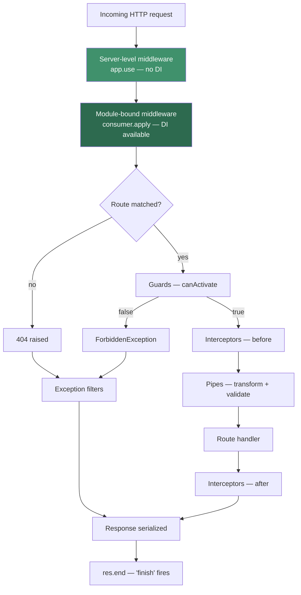

# Chapter 8 — Middleware: The Layer Before Nest

> **한눈에 보기**
> 미들웨어는 Nest 요청 파이프라인에서 **가장 먼저** 실행되는 층으로, 사실상
> Express/Fastify의 미들웨어를 그대로 이어받은 것입니다. 가드·인터셉터·파이프보다
> 앞서 실행되며 `ExecutionContext`를 아직 알지 못합니다. 7장의 DI가 미들웨어에도
> 적용되지만 `app.use()` 전역 미들웨어만은 예외라는 점이 이 장의 핵심 긴장 지점입니다.
> 클래스/함수형 미들웨어, `MiddlewareConsumer`, Express v5 와일드카드 규칙, 그리고
> "언제 미들웨어이고 언제 인터셉터인가"를 결정표로 정리합니다.

**What you will learn**

- Why middleware runs *before* guards, and therefore can never read `@Roles()` metadata or know which handler will run.
- How to write class middleware implementing `NestMiddleware` with constructor injection, and when a plain function is the better choice.
- How `configure(consumer: MiddlewareConsumer)` on a `NestModule` binds middleware, and why `@Module()` has no `middleware` key.
- Every form `forRoutes()` accepts — path strings, `RouteInfo` objects, controller classes — and how `exclude()` subtracts from them.
- The Express v5 **named wildcard** rules (`*splat`, `{*splat}`) that replaced the bare `*`, and the upgrade traps they create.
- Why `app.use()` middleware cannot inject anything, and the two workarounds.
- A decision table for middleware vs. guards vs. interceptors, so you stop putting authentication in the wrong layer.

**Why this matters**

Here is a bug report that reaches every Nest team eventually. "Our request-id header is missing from the logs of failed requests, but present everywhere else." Someone had put the request-id generator in a guard. Guards run after middleware, but they also run *after* Nest has decided a route matched — and for a 404, no guard runs at all. The correlation id vanished exactly where it was most needed. Moving eleven lines into a middleware fixed it permanently, because middleware is the only layer that sees a request before Nest has decided anything about it.

Nest gives you five interception points — middleware, guards, interceptors, pipes, and filters — and they are not interchangeable. They differ in *how early* they run, *how much they know*, and *what they may do to the response*. Middleware sits at the extreme end: earliest, least informed, most powerful over the raw socket. It is the only place you can terminate a request without Nest ever creating an `ExecutionContext`, and the only place the Express and Fastify plugin ecosystem plugs in unchanged.

The cost of that power is blindness. Middleware does not know which controller method is about to run, cannot read decorator metadata, and cannot be reused across HTTP, WebSocket, and microservice transports. Code needing any of that belongs one layer deeper, and getting the boundary wrong is the most common architectural mistake in beginner Nest codebases — usually an auth middleware that duplicates, and eventually contradicts, a guard. This chapter takes the mechanism first and the API second.

## Where middleware sits

Nest does not implement its own HTTP server; it wraps one — Express by default, Fastify optionally — behind an adapter, and middleware is where that wrapping is thinnest. A Nest middleware **is** an Express middleware: same `(req, res, next)` signature, same contract, same ecosystem compatibility. Everything from `@nestjs/core` — guards, interceptors, pipes, the handler itself — is bundled into a *single* Express route handler per route; middleware is registered separately, ahead of that handler, using the adapter's native mechanism.



Three consequences follow, all mattering in practice.

**Middleware runs even when no route matches** — `/does-not-exist` still passes through it, which is why request logging and correlation ids belong here.

**Middleware cannot see the handler.** When Express dispatches to it, Nest has not yet chosen which bundled handler will run. There is no `ExecutionContext`, no `getHandler()`, no `Reflector`. If your logic must ask "what does this route's `@Roles()` decorator say?", middleware is structurally the wrong layer.

**Middleware can end the request.** Calling `res.end()` or `res.status(429).send()` and *not* calling `next()` terminates the cycle; Nest never runs. This is how rate limiters and CORS preflight handlers work.

> **⚠️ Notice** — Express and Fastify hand middleware different objects. Under `@nestjs/platform-fastify` middleware is powered by `middie` and receives the **raw** Node `IncomingMessage`/`ServerResponse`, not Fastify's `request`/`reply` wrappers. Code calling `res.status(200).json(...)` works on Express and throws on Fastify, so type middleware against the platform you ship.

## Class middleware

The canonical form is a class decorated with `@Injectable()` that implements `NestMiddleware`. Through this chapter we build one real piece of infrastructure for an orders API — request ids, timing, tenant resolution — rather than `console.log` toys.

```typescript title="src/common/middleware/request-id.middleware.ts"
import { Injectable, NestMiddleware } from '@nestjs/common';
import { Request, Response, NextFunction } from 'express';
import { randomUUID } from 'node:crypto';

declare module 'express' {
  interface Request {
    requestId?: string;
  }
}

@Injectable()
export class RequestIdMiddleware implements NestMiddleware {
  use(req: Request, res: Response, next: NextFunction): void {
    const incoming = req.headers['x-request-id'];
    const id = typeof incoming === 'string' && incoming ? incoming : randomUUID();

    req.requestId = id;
    res.setHeader('X-Request-Id', id);
    next();
  }
}
```

`NestMiddleware` requires exactly one method, `use()`. Its declared signature is deliberately loose — `use(...args: any[])` — because concrete parameter types depend on the HTTP adapter; you narrow them with the `express` (or `fastify`) types.

The `declare module 'express'` block is not decoration. Attaching properties to `req` is how middleware communicates downstream, and without it TypeScript rejects `req.requestId` under `strict`. Collect these in one `src/types/express.d.ts`.

Three rules govern every middleware you write. **Call `next()` exactly once, on every path** — zero calls hangs the request until the client times out (a silent hang, worse than a crash), two calls produces `ERR_HTTP_HEADERS_SENT` further down the stack. **Do not `await` anything you do not have to**, because middleware sits on the hot path of every request and a database call here multiplies p99 latency across the whole API. And **never send a response *and* call `next()`.**

### Dependency injection in middleware

Class middleware participates fully in the DI system from [Chapter 7](./07-dependency-injection-basics.md). Nest instantiates it through the injector, resolving constructor parameters from the module whose `configure()` binds it.

```typescript title="src/common/middleware/access-log.middleware.ts"
import { Injectable, NestMiddleware, Logger } from '@nestjs/common';
import { Request, Response, NextFunction } from 'express';
import { MetricsService } from '../metrics/metrics.service';

@Injectable()
export class AccessLogMiddleware implements NestMiddleware {
  private readonly logger = new Logger(AccessLogMiddleware.name);

  constructor(private readonly metrics: MetricsService) {}

  use(req: Request, res: Response, next: NextFunction): void {
    const startedAt = process.hrtime.bigint();

    // Do not log here — the status code is not known yet.
    res.on('finish', () => {
      const ms = Number(process.hrtime.bigint() - startedAt) / 1_000_000;
      this.metrics.observeRequest(req.method, res.statusCode, ms);
      this.logger.log(
        `${req.method} ${req.originalUrl} ${res.statusCode} ${ms.toFixed(1)}ms`,
      );
    });

    next();
  }
}
```

The `res.on('finish')` hook is the correct way to observe a *completed* request from middleware. Middleware runs before the handler, so when `use()` executes there is no status code and no body yet. `finish` fires after the last byte is flushed — also *after* exception filters have run — so this logs the real outcome, 500s included.

The DI rule is where beginners get burned: **`MetricsService` must be visible in the module that calls `configure()`**, not merely where the middleware file lives. If `AppModule.configure()` applies `AccessLogMiddleware`, `AppModule` must declare `MetricsService` or import a module that exports it. Otherwise you get the "Nest can't resolve dependencies" error covered in [Chapter 9](./09-exception-filters.md).

Middleware honours injection scopes too: a `Scope.REQUEST` dependency forces per-request instantiation, with the costs discussed in [Chapter 38](../part3-advanced/38-injection-scopes.md). For a layer running on every request, prefer singletons.

## Functional middleware

When a middleware has no dependencies and no state, the class is pure ceremony. Nest accepts a plain `(req, res, next)` function and binds it identically. When the function needs configuration, wrap it in a factory closing over its options — the shape `morgan('combined')` has:

```typescript title="src/common/middleware/body-size-guard.middleware.ts"
import { Request, Response, NextFunction } from 'express';

export function bodySizeGuard(maxBytes: number) {
  return (req: Request, res: Response, next: NextFunction): void => {
    if (Number(req.headers['content-length'] ?? 0) > maxBytes) {
      res.status(413).json({ statusCode: 413, message: 'Payload too large' });
      return; // terminate: do NOT call next()
    }
    next();
  };
}
```

Bind it with `consumer.apply(bodySizeGuard(5_000_000)).forRoutes(OrdersController)`. Note the early `return`; forgetting it is the classic double-response bug.

The official recommendation, which this book endorses: **use functional middleware whenever you need no dependencies.** There is a second, less obvious reason — it is the *only* form usable with `app.use()`, and every third-party middleware you install (`helmet()`, `cors()`, `morgan()`, `compression()`) is a factory returning a function. Functions are the native currency of this layer; class middleware is the exception, justified only by DI.

## Binding middleware: `configure()` and `NestModule`

The `@Module()` decorator has no `middleware` property, and that is deliberate. Middleware binding is *route-scoped* — it needs paths, methods, and ordering — which does not compress into a static metadata array. Instead, a module that binds middleware implements `NestModule` and exposes `configure()`.

```typescript title="src/app.module.ts"
import { Module, NestModule, MiddlewareConsumer } from '@nestjs/common';

@Module({ imports: [OrdersModule, MetricsModule] })
export class AppModule implements NestModule {
  configure(consumer: MiddlewareConsumer): void {
    consumer.apply(RequestIdMiddleware, AccessLogMiddleware).forRoutes('*splat');
  }
}
```

Nest calls `configure()` once at bootstrap, after all modules are instantiated and all providers resolved — never per request. Inside, the `MiddlewareConsumer` records "these middleware, for these route patterns"; once every module's `configure()` has run, Nest walks that registry and installs handlers on the HTTP adapter.

> **Hint** — `configure()` may be `async`. If you must `await` something before deciding what to bind — a feature-flag file, a remote config — declare it `async configure(consumer: MiddlewareConsumer): Promise<void>` and Nest awaits it before continuing bootstrap.

Because `configure()` runs with the module fully constructed, the module class can inject providers and branch on them — a trick absent from the official docs. Give `AppModule` a `constructor(private readonly config: ConfigService) {}` and wrap the `consumer.apply(...)` call in `if (this.config.get('ACCESS_LOG_ENABLED') === 'true')`: a whole middleware chain toggled from the environment, at zero per-request cost.

## `forRoutes()`: every accepted form

`forRoutes()` is overloaded, and all forms compose in a single call:

```typescript
import { RequestMethod } from '@nestjs/common';

consumer.apply(AccessLogMiddleware).forRoutes(
  OrdersController,                              // controller class
  { path: 'orders', method: RequestMethod.GET }, // RouteInfo
  'webhooks/{*splat}',                           // path string
);
```

A path string matches **all** HTTP methods, resolved relative to any global prefix from `app.setGlobalPrefix()`. A `RouteInfo` is `{ path: string; method: RequestMethod; version?: VersionValue }` — the only form that restricts by method; `RequestMethod` is an enum from `@nestjs/common` with `GET`, `POST`, `PUT`, `DELETE`, `PATCH`, `OPTIONS`, `HEAD`, `SEARCH`, `PROPFIND`, and `ALL`.

Passing a **controller class** is the form to reach for by default: Nest reads the controller's route metadata and binds to every path it declares, so adding `@Get('archive')` later is covered automatically — no second edit in `app.module.ts`, no drift between controller and binding.

| Form | Example | Method filter | Survives new routes | Recommended for |
|---|---|---|---|---|
| Path string | `'orders'` | No — all methods | Only if pattern matches | Cross-cutting patterns |
| `RouteInfo` | `{ path: 'orders', method: RequestMethod.POST }` | Yes | No | Method-specific concerns |
| Controller class | `OrdersController` | No | Yes | **Default choice** |
| Wildcard string | `'*splat'` | No | Yes | Truly global concerns |

## `exclude()`: subtracting routes

`exclude()` removes routes from whatever `forRoutes()` selected. It accepts the same string and `RouteInfo` forms — but **not** controller classes.

```typescript
consumer
  .apply(AccessLogMiddleware)
  .exclude(
    { path: 'orders/health', method: RequestMethod.GET },
    'orders/internal/{*splat}',
  )
  .forRoutes(OrdersController);
```

Chain order does not matter — both calls record into the same consumer entry. Matching uses `path-to-regexp`, so wildcard parameters behave exactly as in `forRoutes()`.

> **⚠️ Notice** — `exclude()` matches the *final* path, including any global prefix. With `app.setGlobalPrefix('api')`, an exclusion of `'orders/health'` may not match `/api/orders/health`. Verify exclusions with a real request rather than assuming.

## Wildcards and the Express v5 rules

Nest 11 ships Express **v5**, which changed wildcard syntax in a way that breaks almost every v4-era tutorial — the most common upgrade failure in Nest 11. In v4, `'*'` was a valid path meaning "anything"; in v5 the underlying `path-to-regexp` v8 requires wildcards to be **named**:

```typescript
consumer.apply(mw).forRoutes('abcd/*');       // v4 — invalid in Nest 11
consumer.apply(mw).forRoutes('abcd/*splat');  // v5 — correct
```

`splat` carries no special meaning — it is just the parameter name the matched segment binds to; `*wildcard` or `*rest` work identically. The critical subtlety: **`abcd/*splat` requires at least one character after the slash.**

| Pattern | `/abcd` | `/abcd/` | `/abcd/1` | `/abcd/a/b/c` |
|---|---|---|---|---|
| `abcd/*splat` | no | no | yes | yes |
| `abcd/{*splat}` | yes | yes | yes | yes |
| `*splat` | yes | yes | yes | yes |

Braces make a segment **optional**, so `'abcd/{*splat}'` includes the parent path itself. Two more rules catch people: **hyphens and dots are literal** in string paths (`orders/2024-01` matches that exact string, `report.pdf` a literal dot), and **`'*'` alone is invalid** — for "every route" write `'*splat'` or `'{*splat}'`, which is the mechanical fix for the `TypeError: Missing parameter name` errors people hit on upgrade. The same rules apply to controller `@Get()` paths and to `exclude()`, so learning them once pays off across [Chapter 3](./03-controllers-routing.md) too.

## Multiple middleware and ordering

`apply()` takes a comma-separated list, executed left to right:

```typescript
consumer
  .apply(RequestIdMiddleware, AccessLogMiddleware, TenantMiddleware)
  .forRoutes('*splat');
```

Ordering here is guaranteed and matters: `AccessLogMiddleware` reads `req.requestId`, which exists only because `RequestIdMiddleware` set it.

Across separate `apply()` calls the guarantees thin out. Nest gives you argument order **within one `apply()`** and call order for consecutive chains **within one module's `configure()`**; **across modules**, registration follows module initialization order (imports initialize before importers) — observable, but not a documented contract, so do not build on it. `app.use()` middleware always precedes all of it, being registered on the server instance first.

The practical rule: **if two middleware have an ordering dependency, put them in the same `apply()` call in the same module.** Splitting them across modules is a bug waiting for someone to reorder an `imports` array.

## Global middleware with `app.use()`

`INestApplication` exposes `use()`, which delegates straight to the underlying Express/Fastify instance — `app.use(helmet())`, `app.use(compression())` — and runs for **every** request reaching the server, including requests matching no Nest route at all.

**It cannot use dependency injection.** That is not a limitation Nest chose; it falls out of the mechanism. `app.use()` hands a function directly to Express, which calls it with `(req, res, next)` and nothing else. No injector is involved, and there is no module context to resolve tokens against. Passing a class does not work either — Express would receive a constructor where it expects a function.

Two ways out. **Option A — resolve manually from the container:**

```typescript
const metrics = app.get(MetricsService);
app.use((req, res, next) => {
  metrics.countRequest();
  next();
});
```

`app.get()` retrieves an already-instantiated singleton; it does **not** work for request-scoped providers, which need `app.resolve()` — and at that point you should be writing class middleware anyway.

**Option B — class middleware with a wildcard**, `consumer.apply(AccessLogMiddleware).forRoutes('*splat')`, which is the recommendation whenever DI is involved. The difference is small but real: `forRoutes('*splat')` registers inside Nest's routing layer and respects the global prefix, while `app.use()` sits outside it. Security middleware that must run before *anything* belongs in `app.use()`; application logic needing services belongs in class middleware.

## Third-party middleware

Every Express middleware in the npm ecosystem works in Nest unwrapped — much of why Nest defaults to Express.

```typescript title="src/main.ts"
app.use(helmet());
app.use(morgan('combined'));
app.enableCors({ origin: ['https://app.example.com'], credentials: true });
```

CORS uses `app.enableCors()` rather than `app.use(cors())`: Nest wraps the `cors` package into the adapter so preflight works on both platforms. Prefer the Nest API when one exists. Third-party middleware can also be route-scoped — `consumer.apply(morgan('combined')).exclude('health').forRoutes('*splat')`.

> **Hint** — [Chapter 26 — Hardening the Application](../part2-intermediate/26-web-security-hardening.md) covers `helmet`, CORS, CSRF, and rate limiting properly. Treat these snippets as mechanism demonstrations, not a security configuration.

### The body-parser caveat

Under the Express adapter, Nest registers `body-parser`'s `json` and `urlencoded` automatically. To configure them yourself — a different size limit, raw-body capture for webhook signatures — turn the built-ins off first:

```typescript title="src/main.ts"
import * as bodyParser from 'body-parser';

const app = await NestFactory.create(AppModule, { bodyParser: false });
app.use(bodyParser.json({ limit: '5mb' }));
app.use(bodyParser.urlencoded({ extended: true, limit: '5mb' }));
```

Skip the flag and you get two parsers in the chain: the first consumes the stream, the second sees an already-ended request and silently does nothing. Your custom limit appears ignored, with no error anywhere — one of the harder Nest bugs to diagnose from symptoms alone.

## Middleware vs. guards vs. interceptors

This decision shapes your codebase. All three "run something around a request", and they are routinely misused for one another.

| | Middleware | Guards | Interceptors |
|---|---|---|---|
| Runs at | Before routing | After routing, before pipes | Around the handler |
| Knows the handler? | No | Yes (`ExecutionContext`) | Yes (`ExecutionContext`) |
| Reads decorator metadata? | No | Yes (`Reflector`) | Yes (`Reflector`) |
| Runs on a 404? | Yes | No | No |
| Sees the response body? | Only that it finished | No | **Yes** — can transform it |
| Short-circuits by | not calling `next()` | returning `false` | returning another observable |
| Platform-agnostic? | No — Express/Fastify | Yes | Yes |
| Idiomatic error | `res.status(...).send()` | throw `HttpException` | throw `HttpException` |
| Use for | Correlation ids, raw logging, security headers, body parsing, rate limiting | AuthN/AuthZ, feature flags, role checks | Response shaping, caching, timeouts, transactions |

Three heuristics resolve almost every real case. **"Does it need to know which handler is running?"** → guard or interceptor; anything reading `@Roles()` or `@Public()` needs a `Reflector`, which needs an `ExecutionContext`. **"Does it need to see or change the response body?"** → interceptor; middleware observes only *that* a response finished, so envelope-wrapping, serialization, and cache population belong in [Chapter 12](./12-interceptors.md). **"Does it need to run even when the URL matches nothing?"** → middleware.

The one that trips up nearly everyone: **authentication belongs in a guard, not middleware.** JWT verification in middleware is tempting because "it runs first" — but you immediately need `@Public()` to exempt the login route, and that is decorator metadata middleware cannot read. Teams that start here end up with a path allow-list hardcoded in `exclude()` that drifts out of sync with the controllers. [Chapter 11](./11-guards.md) shows the guard version, which has no such problem. The legitimate exception is *token extraction* — pulling a bearer token onto `req` — with the *decision* left to a guard.

## Common mistakes

1. **Forgetting `next()` on a branch.** *Symptom:* requests hang forever, nothing in the logs. *Cause:* a conditional path skips `next()` without sending a response. *Fix:* every path ends in `next()` or a send — write `next()` first, add logic around it.

2. **Calling `next()` after sending.** *Symptom:* intermittent `ERR_HTTP_HEADERS_SENT`. *Cause:* `res.status(401).json(...)` falling through. *Fix:* `return` immediately after any send.

3. **Using `'*'` as a route pattern in Nest 11.** *Symptom:* `TypeError: Missing parameter name at index 1` at bootstrap. *Cause:* Express v5 requires named wildcards. *Fix:* `'*'` → `'*splat'`, `'path/*'` → `'path/*splat'` (or `'path/{*splat}'` if the bare parent must match too).

4. **Injecting a provider the configuring module cannot see.** *Symptom:* `Nest can't resolve dependencies of the AccessLogMiddleware (?)`. *Cause:* the dependency lives in a module that the one calling `configure()` does not import. *Fix:* import the exporting module where the binding happens — resolution uses the *configuring* module's context.

5. **Trying to inject into `app.use()` middleware.** *Symptom:* `this.someService` is `undefined`, or Express throws on receiving a class. *Cause:* `app.use()` bypasses the injector. *Fix:* class middleware with `.forRoutes('*splat')`, or `app.get()` the singleton and close over it.

6. **Logging the status code inside `use()`.** *Symptom:* every request logs `200`, even the 500s. *Cause:* `res.statusCode` is final only after the handler runs. *Fix:* log from `res.on('finish')`.

7. **Per-request I/O in middleware.** *Symptom:* p99 latency doubles across the API after a "small" middleware. *Cause:* a database or cache lookup on the hot path of every request, health checks included. *Fix:* move it into a route-scoped guard or interceptor, and always `exclude()` health and metrics.

8. **Customizing body parsing without `bodyParser: false`.** *Symptom:* the `limit` option has no effect; raw-body capture yields an empty buffer. *Cause:* Nest's built-in parser already consumed the stream. *Fix:* `NestFactory.create(AppModule, { bodyParser: false })`, then register your own.

## Putting it together

A runnable slice: correlation ids, timing, tenant resolution, and metrics, with health and metrics excluded from logging.

```typescript title="src/common/middleware/tenant.middleware.ts"
@Injectable()
export class TenantMiddleware implements NestMiddleware {
  constructor(private readonly registry: TenantRegistry) {}

  use(req: Request, _res: Response, next: NextFunction): void {
    const header = req.headers['x-tenant-id'];

    if (typeof header !== 'string' || !this.registry.isKnown(header)) {
      // Express v5 forwards sync throws to the error handler,
      // so Nest's exceptions layer formats this correctly.
      throw new BadRequestException('Missing or unknown X-Tenant-Id header');
    }

    req.tenantId = header;
    next();
  }
}
```

```typescript title="src/app.module.ts"
import { Module, NestModule, MiddlewareConsumer, RequestMethod } from '@nestjs/common';
import { OrdersModule } from './orders/orders.module';
import { OrdersController } from './orders/orders.controller';
import { MetricsModule } from './metrics/metrics.module';
import { TenantModule } from './tenant/tenant.module';
import { RequestIdMiddleware } from './common/middleware/request-id.middleware';
import { AccessLogMiddleware } from './common/middleware/access-log.middleware';
import { TenantMiddleware } from './common/middleware/tenant.middleware';

@Module({ imports: [OrdersModule, MetricsModule, TenantModule] })
export class AppModule implements NestModule {
  configure(consumer: MiddlewareConsumer): void {
    // 1. Infrastructure: everything, including 404s.
    consumer
      .apply(RequestIdMiddleware, AccessLogMiddleware)
      .exclude(
        { path: 'health', method: RequestMethod.GET },
        { path: 'metrics', method: RequestMethod.GET },
      )
      .forRoutes('*splat');

    // 2. Business context: tenant-scoped routes only, bound to the
    //    controller class so new routes are covered automatically.
    consumer.apply(TenantMiddleware).forRoutes(OrdersController);
  }
}
```

```typescript title="src/main.ts"
const app = await NestFactory.create(AppModule);
app.use(helmet()); // server-level: runs before everything, needs no DI
app.enableCors({ origin: ['https://app.example.com'], credentials: true });
await app.listen(process.env.PORT ?? 3000);
```

Trace `GET /orders/42` with a valid tenant header: `helmet()` sets headers, `RequestIdMiddleware` echoes `X-Request-Id`, `AccessLogMiddleware` starts the timer and registers a `finish` listener, `TenantMiddleware` validates via its injected `TenantRegistry`, then Nest matches the route and runs guards, interceptors, pipes, and the handler.

Now trace `GET /nope`. The first three still run; `TenantMiddleware` does not, because the path does not match `OrdersController`. Nest finds no route, the exceptions layer produces a 404, `finish` fires, and the 404 is logged **with its correlation id** — this chapter's opening bug, fixed structurally rather than patched.

> **핵심 정리**
> - 미들웨어는 라우트 매칭 **이전**에 실행되므로 404 요청에도 실행됩니다. 상관관계 ID와 접근 로그가 미들웨어에 속하는 이유입니다.
> - 미들웨어는 `ExecutionContext`를 받지 못합니다. 어떤 핸들러가 실행될지 모르고, `Reflector`로 데코레이터 메타데이터를 읽을 수 없습니다.
> - 클래스 미들웨어(`@Injectable()` + `NestMiddleware`)는 생성자 주입이 완전히 동작하지만, 의존성은 `configure()`를 **호출하는 모듈**에서 보여야 합니다. 의존성이 없다면 함수형을 쓰십시오.
> - `@Module()`에는 미들웨어 키가 없습니다. `NestModule`의 `configure(consumer)`가 유일한 바인딩 지점이며 부트스트랩 시 한 번만 호출됩니다(`async` 가능).
> - `forRoutes()`는 문자열, `RouteInfo`, 컨트롤러 클래스를 받습니다. **기본은 컨트롤러 클래스**로 하십시오 — 라우트를 추가해도 바인딩이 따라옵니다.
> - Nest 11 = Express v5입니다. `'*'`는 더 이상 유효하지 않으므로 `'*splat'`을 쓰고, 부모 경로까지 매칭하려면 `'{*splat}'`으로 감싸 선택적으로 만드십시오.
> - 순서 보장은 하나의 `apply()` 안에서만 확실합니다. `app.use()`는 DI를 쓸 수 없는데, 이는 Express에 함수를 직접 넘기는 구조의 필연적 결과입니다.
> - 인증은 미들웨어가 아니라 **가드**에 두십시오. `@Public()` 같은 예외 처리는 메타데이터를 필요로 합니다.

> **연습 문제**
> 1. `RequestIdMiddleware`를 함수형 미들웨어로 다시 작성하십시오. 무엇을 잃고 무엇을 얻습니까? `app.use()`로 등록할 수 있게 된 점이 왜 의미가 있는지 설명하십시오.
> 2. `forRoutes('admin/*splat')`와 `forRoutes('admin/{*splat}')`의 차이를 `/admin`, `/admin/`, `/admin/users`, `/admin/users/7` 네 경로에 대해 표로 정리하십시오.
> 3. **구현 과제:** IP당 분당 60회로 제한하는 인메모리 레이트 리미터를 클래스 미들웨어로 구현하십시오. 한도를 넘으면 `next()`를 호출하지 말고 429를 직접 전송해야 하며, `/health`는 `exclude()`로 제외하십시오.
> 4. **구현 과제:** 소요 시간이 500ms를 넘으면 `X-Slow-Request: true` 헤더를 붙이는 미들웨어를 작성하십시오. 헤더는 응답 전송 전에 설정해야 하므로 `res.on('finish')`로는 늦습니다. 이 요구사항이 사실 인터셉터에 더 어울리는 이유도 논하십시오.
> 5. 어떤 팀이 JWT 검증을 미들웨어에 두고 로그인 경로를 `exclude()`로 빼놓았습니다. 6개월 뒤 이 설계가 무너지는 구체적 시나리오 두 가지를 제시하고, 가드 기반 설계가 각각을 어떻게 방지하는지 설명하십시오.

**Next:** [Chapter 9 — Exception Filters and Error Handling](./09-exception-filters.md) picks up where middleware's `res.on('finish')` left off: what actually produced that status code. You will learn the built-in exceptions layer, the full catalogue of HTTP exception classes, and how to take complete control of the error response with `@Catch()` filters.
