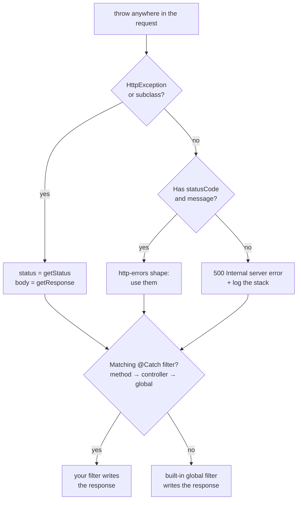

# Chapter 9 — Exception Filters and Error Handling

> **한눈에 보기**
> Nest에는 처리되지 않은 모든 예외를 응답으로 바꾸는 **예외 계층**이 내장되어 있습니다.
> 이 장은 그 계층이 무엇을 하는지, `HttpException`과 20개 내장 예외 클래스가 어떤 JSON을
> 만드는지, `@Catch()` 필터로 그 결과를 어떻게 장악하는지 다룹니다. 8장에서 미들웨어가
> `res.on('finish')`로 상태 코드를 *관찰*했다면, 이 장은 그 코드를 *결정*하는 층입니다.
> 끝으로 부트스트랩 단계에서 가장 자주 만나는 DI 에러 메시지를 해독표로 정리합니다.

**What you will learn**

- What the exceptions layer does with a thrown value, and the exact JSON it produces for recognized and unrecognized errors.
- How `HttpException`'s three constructor arguments shape the body, and why `cause` never appears in it.
- Every built-in HTTP exception class with its status code, and when subclassing beats using them directly.
- How to write an `ExceptionFilter` with `@Catch()`, and what `ArgumentsHost` buys you over grabbing `req`/`res`.
- The three binding scopes — and why a global filter registered in `main.ts` silently cannot inject anything.
- Why `@Catch()` with no arguments must come *before* type-specific filters, and how to extend `BaseExceptionFilter` rather than reimplement it.
- How to decode the four messages that account for most bootstrap failures.

**Why this matters**

Error handling is the part of an API users experience most and developers design least. A service returning `{"statusCode":500,"message":"Internal server error"}` for a duplicate email is not broken in any way a test will catch — it is simply useless to the client team, who now have to guess. The same service leaking a Postgres constraint name in a 500 body is a security finding.

Nest's answer is a dedicated **exceptions layer** at the far end of the request pipeline. Anything thrown anywhere — a guard, a pipe, an interceptor, a controller, a nested service — unwinds to it, and it decides the status code and body. Consistent errors with no `try/catch` in every handler, and one place to change when the shape must change.

The mechanism has two halves beginners conflate. **Exception classes** — `HttpException` and its twenty subclasses — carry a status and a payload. **Exception filters** decide what to *do* with them, and you need custom ones far less often than tutorials suggest: for logging, an envelope format, or mapping a domain error to a status. This chapter covers both halves, then closes with what the official docs bury in an FAQ — the startup messages that consume most of a beginner's debugging time.

## The built-in exceptions layer

Every Nest application starts with a global exception filter already installed — part of the routing machinery, not something you register. Its job, precisely: catch anything thrown while handling a request; if it is an `HttpException` or subclass, use its status and response payload; if it merely has `statusCode` and `message` (the shape `http-errors` produces), use those; otherwise respond `500` with a fixed body and log the error.



The unrecognized case produces exactly `{"statusCode": 500, "message": "Internal server error"}`, nothing more. That opacity is deliberate: an unrecognized throw is by definition unplanned, and leaking its message risks exposing SQL, file paths, or credentials. The stack goes to the log, not the wire.

### Exceptions logging and `IntrinsicException`

By default the built-in filter **does not log** `HttpException` or its subclasses. A `NotFoundException` is normal application flow, not an incident, and logging every 404 buries the real failures. The same holds for `WsException` and `RpcException`.

The mechanism is a base class, `IntrinsicException`, exported from `@nestjs/common`. All built-in exception types inherit from it, and the filter uses `instanceof IntrinsicException` to decide whether a throw is "expected". Unrecognized errors — a `TypeError`, a driver error, your own `class BillingError extends Error` — are not intrinsic and *are* logged with their stack. To log 4xx responses, write a filter.

## `HttpException`

`HttpException` is the base of the hierarchy, from `@nestjs/common`. Throwing `new HttpException('Forbidden', HttpStatus.FORBIDDEN)` produces `{ "statusCode": 403, "message": "Forbidden" }`. The constructor takes three arguments, two required:

```typescript
new HttpException(
  response: string | object,
  status: number,
  options?: { cause?: Error; description?: string },
)
```

**`response`** defines the JSON body. A **string** makes Nest build `{ statusCode, message }` with your string as `message`; an **object** is serialized verbatim, so you own the entire body — including whether `statusCode` appears at all. **`status`** is the HTTP status code; prefer the `HttpStatus` enum, because `HttpStatus.UNPROCESSABLE_ENTITY` survives code review in a way `422` does not. **`options.cause`** attaches the underlying error and is **never serialized into the response** — it exists so a filter or logger can report what actually went wrong.

```typescript
try {
  return await this.service.findAll();
} catch (error) {
  throw new HttpException(
    { status: HttpStatus.FORBIDDEN, error: 'This is a custom message' },
    HttpStatus.FORBIDDEN,
    { cause: error },
  );
}
```

The response is exactly `{ "status": 403, "error": "This is a custom message" }`.

Because `response` was an object, the body is exactly that object — no `statusCode` key, because you did not supply one. This is the most common source of "why does this endpoint's error shape differ from every other one". An object gives you total control *and* total responsibility.

Two accessors matter inside filters: `getStatus()` returns the numeric status, and `getResponse()` returns the payload as `string | object`, exactly as it will be serialized. That union is a hazard — always narrow it:

```typescript
const raw = exception.getResponse();
const payload =
  typeof raw === 'string' ? { message: raw } : (raw as Record<string, unknown>);
```

## The built-in HTTP exceptions

Nest ships twenty subclasses, all from `@nestjs/common`, all accepting the same `(message?, options?)` signature.

| Class | Status | Typical use |
|---|---|---|
| `BadRequestException` | 400 | Malformed input the client can fix |
| `UnauthorizedException` | 401 | Missing or invalid credentials |
| `ForbiddenException` | 403 | Authenticated but not permitted |
| `NotFoundException` | 404 | Resource does not exist |
| `MethodNotAllowedException` | 405 | Verb unsupported here |
| `NotAcceptableException` | 406 | Nothing matches `Accept` |
| `RequestTimeoutException` | 408 | Client took too long |
| `ConflictException` | 409 | Duplicate key, version conflict |
| `GoneException` | 410 | Permanently removed |
| `PreconditionFailedException` | 412 | `If-Match` failed |
| `PayloadTooLargeException` | 413 | Body exceeds the limit |
| `UnsupportedMediaTypeException` | 415 | `Content-Type` not handled |
| `ImATeapotException` | 418 | RFC 2324; a probe canary |
| `UnprocessableEntityException` | 422 | Parses, violates a rule |
| `InternalServerErrorException` | 500 | Deliberate unrecoverable failure |
| `NotImplementedException` | 501 | Route exists, behaviour does not |
| `BadGatewayException` | 502 | Upstream returned garbage |
| `ServiceUnavailableException` | 503 | Overloaded or in maintenance |
| `GatewayTimeoutException` | 504 | Upstream did not answer |
| `HttpVersionNotSupportedException` | 505 | Protocol version rejected |

Settle 400 vs 422 as a team convention. This book's recommendation: **400 for input that cannot be parsed or is structurally wrong, 422 for input that parses fine but violates a business rule.** Nest's `ValidationPipe` defaults to 400, so validation errors are 400 and domain rule violations should be 422.

All built-ins accept the `options` object, which adds a `description` on top of `cause`:

```typescript
throw new BadRequestException('Something bad happened', {
  cause: new Error(),
  description: 'Some error description',
});
```

```json
{
  "message": "Something bad happened",
  "error": "Some error description",
  "statusCode": 400
}
```

A built-in exception's default shape is three keys: `message` (your string), `error` (the `description`, or the standard status text such as `"Bad Request"` when omitted), and `statusCode`. Pass an array as the message and it stays an array — exactly how `ValidationPipe` returns failed constraints.

## Custom exceptions

Before writing one, ask whether you need it: `throw new ConflictException('Email already registered')` is clear, typed, and free. Reach for a custom class when the exception carries structured data, or when you want a hierarchy filters can match on.

```typescript title="src/common/exceptions/domain.exception.ts"
import { HttpException, HttpStatus } from '@nestjs/common';

export class DomainException extends HttpException {
  constructor(
    public readonly code: string,
    message: string,
    status: HttpStatus = HttpStatus.UNPROCESSABLE_ENTITY,
    cause?: Error,
  ) {
    super({ code, message, statusCode: status }, status, { cause });
  }
}

export class OrderAlreadyShippedException extends DomainException {
  constructor(id: string) {
    super('ORDER_ALREADY_SHIPPED', `Order ${id} has already shipped`);
  }
}
```

Because these extend `HttpException`, the built-in filter handles them with no extra wiring, and one `@Catch(DomainException)` filter matches the whole family. The stable `code` field is what client teams actually want: `"ORDER_ALREADY_SHIPPED"` is machine-checkable in a way an English `message` is not.

> **⚠️ Notice** — A real design tension: making domain errors extend `HttpException` couples your service layer to `@nestjs/common` and to HTTP semantics, which hurts if those services later run behind a microservice transport. The alternative is plain `Error` subclasses plus one filter mapping them to statuses. For a single HTTP application, extending `HttpException` is the pragmatic choice.

## Exception filters

A filter takes over the response for the types it declares. Two pieces: `@Catch()` registers those types, and `ExceptionFilter<T>` requires `catch(exception: T, host: ArgumentsHost)`.

```typescript title="src/common/filters/http-exception.filter.ts"
import { ExceptionFilter, Catch, ArgumentsHost, HttpException, Logger } from '@nestjs/common';
import { Request, Response } from 'express';

@Catch(HttpException)
export class HttpExceptionFilter implements ExceptionFilter<HttpException> {
  private readonly logger = new Logger(HttpExceptionFilter.name);

  catch(exception: HttpException, host: ArgumentsHost): void {
    const ctx = host.switchToHttp();
    const request = ctx.getRequest<Request>();
    const status = exception.getStatus();
    const raw = exception.getResponse();
    const payload = typeof raw === 'string' ? { message: raw } : raw;

    if (status >= 500) {
      this.logger.error(`${request.method} ${request.url}`, exception.stack);
    }

    ctx.getResponse<Response>().status(status).json({
      ...(payload as object),
      statusCode: status,
      timestamp: new Date().toISOString(),
      path: request.url,
    });
  }
}
```

`@Catch()` takes one type or a comma-separated list — `@Catch(HttpException, DomainException)`. With no arguments it catches everything, covered below.

> **⚠️ Notice** — On `@nestjs/platform-fastify`, use `response.send()` rather than `response.json()`, and import `FastifyReply` instead of Express's `Response`. This is exactly the platform coupling the catch-everything filter below avoids.

### `ArgumentsHost`

`host` is not a convenience wrapper around `req`/`res` — it is the abstraction that makes a filter reusable across execution contexts. Each transport passes a different argument set: HTTP `(request, response, next)`, WebSockets `(client, data)`, RPC `(data, context)`. `ArgumentsHost` wraps that array: `getType()` returns `'http' | 'ws' | 'rpc'` so one filter can branch; `switchToHttp()` gives `getRequest()`/`getResponse()`/`getNext()`; `switchToWs()` gives `getClient()`/`getData()`; `switchToRpc()` gives `getContext()`/`getData()`; `getArgs()` and `getArgByIndex(n)` are the raw escape hatch.

Calling `switchToHttp()` on a WebSocket exception does not throw — it returns an object whose getters produce nonsense. Always check `getType()` in a globally bound filter when the app has more than one transport. [Chapter 40](../part3-advanced/40-execution-context.md) develops this fully.

## Binding filters

Filters bind at three scopes, and the scope determines reach and DI behaviour. `@UseFilters()` takes one filter or a comma-separated list.

```typescript
@Post()
@UseFilters(HttpExceptionFilter)   // method scope — this handler only
async create(@Body() dto: CreateOrderDto) {}

@Controller('orders')
@UseFilters(HttpExceptionFilter)   // controller scope — every handler
export class OrdersController {}

// main.ts — global scope, every route
app.useGlobalFilters(new HttpExceptionFilter());
```

> **Hint** — Pass the **class**, not an instance: `@UseFilters(HttpExceptionFilter)`, not `@UseFilters(new HttpExceptionFilter())`. Nest then builds it through the DI container, reuses one instance per module, and lets it inject dependencies. An instance is one you built, so Nest cannot inject into it.

### The DI caveat for global filters

This is the most confusing thing about filters, and it is worth understanding as a mechanism rather than memorizing as a rule. `app.useGlobalFilters(new SomeFilter())` runs in `main.ts`, *outside* any module — no module context means no injector to resolve constructor parameters against, which is why you must call `new` yourself and hand-feed anything the filter needs. The fix is to register it as a provider under the `APP_FILTER` token:

```typescript title="src/app.module.ts"
import { APP_FILTER } from '@nestjs/core';

@Module({
  providers: [{ provide: APP_FILTER, useClass: HttpExceptionFilter }],
})
export class AppModule {}
```

The filter is now built by the injector, so it can inject anything visible in the declaring module — while still applying **globally**, regardless of which module that is. Register it where the filter lives and its dependencies are available. Add as many `APP_FILTER` providers as you need.

| | `useGlobalFilters()` | `APP_FILTER` provider |
|---|---|---|
| Where | `main.ts` | any module's `providers` |
| Dependency injection | **No** | **Yes** |
| Applies globally | Yes | Yes |
| Covers gateways / hybrid apps | **No** | Yes |
| Recommended | Only for zero-dependency filters | **Default choice** |

That fourth row is easy to miss. If your app has a WebSocket gateway or a microservice half, `APP_FILTER` is not a preference — it is the only thing that works.

## Catch-everything filters

`@Catch()` with an empty argument list matches any thrown value, including things that are not `Error` instances at all — someone will `throw 'nope'`. Combine it with `HttpAdapterHost` for a filter that behaves identically on Express and Fastify:

```typescript title="src/common/filters/catch-everything.filter.ts"
import { ExceptionFilter, Catch, ArgumentsHost, HttpException, HttpStatus } from '@nestjs/common';
import { HttpAdapterHost } from '@nestjs/core';

@Catch()
export class CatchEverythingFilter implements ExceptionFilter {
  constructor(private readonly httpAdapterHost: HttpAdapterHost) {}

  catch(exception: unknown, host: ArgumentsHost): void {
    // Resolve here, not in the constructor: the adapter may not be
    // available yet when the filter is instantiated.
    const { httpAdapter } = this.httpAdapterHost;
    const ctx = host.switchToHttp();
    const status =
      exception instanceof HttpException
        ? exception.getStatus()
        : HttpStatus.INTERNAL_SERVER_ERROR;

    httpAdapter.reply(
      ctx.getResponse(),
      {
        statusCode: status,
        timestamp: new Date().toISOString(),
        path: httpAdapter.getRequestUrl(ctx.getRequest()),
      },
      status,
    );
  }
}
```

Nothing here touches `Response` or `FastifyReply`: `httpAdapter.reply()` and `getRequestUrl()` delegate to whichever platform is loaded, so the file survives a platform switch untouched.

> **⚠️ Notice — ordering.** When combining a catch-all filter with a type-specific one at the same scope, **declare the catch-all first**. Nest evaluates bound filters in reverse registration order, so the last-registered is consulted first; putting the specific filter last is what lets it win for its own type. Get this backwards and the catch-all swallows everything, with no warning of any kind.

## Extending `BaseExceptionFilter`

Most of the time you do not want to *replace* Nest's error handling, only add to it. `BaseExceptionFilter` from `@nestjs/core` is the built-in global filter, exposed for exactly this:

```typescript title="src/common/filters/logging-exceptions.filter.ts"
@Catch()
export class LoggingExceptionsFilter extends BaseExceptionFilter {
  private readonly logger = new Logger('Exceptions');

  catch(exception: unknown, host: ArgumentsHost): void {
    const req = host.switchToHttp().getRequest();
    this.logger.warn(`${req.method} ${req.url} → ${(exception as Error)?.message}`);
    super.catch(exception, host); // delegate the response to Nest
  }
}
```

Ten lines logs *every* exception, including the `HttpException`s the default filter stays quiet about, with no risk of your response shape drifting from Nest's. Two rules follow.

**Method- and controller-scoped filters extending `BaseExceptionFilter` must not be instantiated with `new`** — pass the class and let the framework build it, because the base class needs an `HttpAdapter` reference only the framework can supply.

**Global filters extending it can be registered either way:** via `APP_FILTER` (recommended; the adapter is wired for you), or manually by handing the adapter in:

```typescript title="src/main.ts"
const { httpAdapter } = app.get(HttpAdapterHost);
app.useGlobalFilters(new LoggingExceptionsFilter(httpAdapter));
```

## Decoding startup errors

Most beginner time lost to Nest goes not to runtime exceptions but to messages the injector prints during bootstrap. These four account for the overwhelming majority.

### "Nest can't resolve dependencies of the X (?)"

```bash
Nest can't resolve dependencies of the OrdersService (?). Please make sure
that the argument PaymentsService at index [0] is available in the
OrdersModule context.
```

Read it as a sentence with two blanks: *which class* failed, and *which parameter*. The `?` marks the unresolvable position; a partly resolved constructor shows what it found, like `(ConfigService, ?)`.

| Unknown token | Meaning | Fix |
|---|---|---|
| A provider class name | Not in this module's `providers`, or its exporting module is not imported | Add to `providers`, or import the module that `exports` it |
| The failing class's own name | Self-injection — not allowed | Break the cycle; extract the shared piece |
| `Object` | You injected an interface or type, which erases at runtime | Inject a class, or a string/symbol token with `@Inject()` |
| `dependency` | Two files import each other (circular *file* import) | Move shared constants to their own file; check barrel files |
| `ModuleRef` in a monorepo | Two copies of `@nestjs/core` loaded | Yarn: `nohoist`. pnpm: `@nestjs/core` as peer dep + `dependenciesMeta.injected` |

Two more traps. **Putting a provider in `imports` instead of `providers`** produces this error with the provider's name where the module name should be — a strong tell. And **duplicating a provider in a feature module and the root module** makes Nest instantiate it twice; usually the feature module belongs in the root's `imports` instead.

The `import type` trap deserves its own mention because TypeScript will not warn you: `import type { PaymentsService } from './payments.service'` erases at compile time, so `emitDecoratorMetadata` has nothing to emit and the token becomes `Object`. Use a value import for anything you inject.

### "Circular dependency" error

```bash
Nest cannot create the OrdersModule instance.
The module at index [1] of the OrdersModule "imports" array is undefined.
Potential causes:
- A circular dependency between modules. Use forwardRef() to avoid it.
Scope [AppModule -> OrdersModule]
```

The literal cause is an entry in `imports` that evaluated to `undefined` — which happens when module A's file imports module B's while B's imports A's, and one is still mid-evaluation when the decorator runs.

Two varieties. **Module-level cycles** need `forwardRef()` on *both* sides — the `imports` arrays *and* the injected providers; doing one side leaves the same error slightly reworded. **Constant-sharing cycles**, where a service imports a token from a module file that imports the service, are not dependency cycles at all: move the constants to their own file and the cycle disappears. Prefer that whenever the shape allows, because `forwardRef()` is a maintenance cost forever. [Chapter 41](../part3-advanced/41-module-ref-discovery-lazy.md) covers both in depth.

### "Cannot read property 'x' of undefined" from decorator misuse

This one has no helpful message at all, which is why it burns hours. It surfaces at *class definition* time, often before any log line, and the cause is almost always a decorator referencing a value not yet initialized — usually a circular file import. If the message names a symbol from another module, treat it as the circular-import case above; if it fires inside `@Module({ ... })`, one of the arrays contains `undefined`.

### `NEST_DEBUG` and endless watch loops

When the message is not enough, run with `NEST_DEBUG=true`. Nest then logs every injection it attempts: the **host class** whose dependency is being resolved, the **injected token**, and the **module** being searched. The last few lines before the failure usually locate it in seconds. Available since Nest 8.1.

A separate annoyance: on Windows with TypeScript 4.9+, `npm run start:dev` can loop forever printing `File change detected. Starting incremental compilation...` — TypeScript's newer filesystem-event watcher is the culprit. Add this to `tsconfig.json` as a sibling of `compilerOptions`:

```json
{ "watchOptions": { "watchFile": "fixedPollingInterval" } }
```

## Common mistakes

1. **Passing an object to `HttpException` and losing `statusCode`.** *Symptom:* one endpoint's errors differ in shape from every other. *Cause:* an object `response` replaces the whole body. *Fix:* include `statusCode` yourself, or pass a string.

2. **Registering a catch-all filter after a specific one.** *Symptom:* `HttpExceptionFilter` never runs; everything is a 500 envelope. *Cause:* filters are evaluated in reverse registration order. *Fix:* `@Catch()` first, type-specific last.

3. **`useGlobalFilters(new F(configService))`.** *Symptom:* it appears to work — until it holds a stale instance, or a gateway's errors bypass it entirely. *Cause:* manual wiring outside the module system. *Fix:* register via `APP_FILTER`.

4. **Assuming `getResponse()` returns an object.** *Symptom:* a body with numeric keys spelled out from a string. *Cause:* it returns `string | object`. *Fix:* narrow before spreading.

5. **Rethrowing without `cause`.** *Symptom:* a 500 with no way to tell which upstream call failed. *Cause:* `throw new InternalServerErrorException()` discards the original. *Fix:* pass `{ cause: error }` and log it in your filter.

6. **Injecting an interface.** *Symptom:* `... argument Object at index [0]`. *Cause:* interfaces do not exist at runtime. *Fix:* inject a class, or `@Inject('TOKEN')` with a custom provider.

7. **`forwardRef()` on the module but not the provider.** *Symptom:* the circular dependency error persists, slightly reworded. *Cause:* module- and provider-level cycles are separate. *Fix:* apply it to both.

8. **Returning error details from a catch-all in production.** *Symptom:* a pen-test finding — stack traces or SQL in 500 bodies. *Cause:* a debug-friendly filter shipped unchanged. *Fix:* log server-side, return a correlation id.

## Putting it together

One filter that logs, carries the correlation id from [Chapter 8](./08-middleware.md), normalizes every error to one envelope, and never leaks internals on a 500.

```typescript title="src/common/filters/all-exceptions.filter.ts"
import { Catch, ArgumentsHost, HttpException, HttpStatus, Logger } from '@nestjs/common';
import { BaseExceptionFilter } from '@nestjs/core';
import { ConfigService } from '@nestjs/config';
import { Request, Response } from 'express';

@Catch()
export class AllExceptionsFilter extends BaseExceptionFilter {
  private readonly logger = new Logger('Exceptions');

  constructor(private readonly config: ConfigService) {
    super();
  }

  catch(exception: unknown, host: ArgumentsHost): void {
    if (host.getType() !== 'http') {
      return super.catch(exception, host); // ws / rpc: leave it to Nest
    }

    const ctx = host.switchToHttp();
    const req = ctx.getRequest<Request>();
    const isHttp = exception instanceof HttpException;
    const status = isHttp ? exception.getStatus() : HttpStatus.INTERNAL_SERVER_ERROR;
    const raw = isHttp ? exception.getResponse() : null;
    const body = (typeof raw === 'string' ? { message: raw } : raw) as Record<
      string,
      unknown
    > | null;

    if (status >= 500) {
      this.logger.error(
        `${req.method} ${req.originalUrl} rid=${req.requestId ?? '-'}`,
        (exception as Error)?.stack,
      );
      const cause = (exception as { cause?: Error }).cause;
      if (cause) this.logger.error('caused by', cause.stack);
    } else if (this.config.get('LOG_CLIENT_ERRORS') === 'true') {
      this.logger.warn(`${status} ${req.method} ${req.originalUrl}`);
    }

    ctx.getResponse<Response>().status(status).json({
      statusCode: status,
      code: (body?.code as string) ?? HttpStatus[status] ?? 'UNKNOWN',
      // Never echo an unrecognized error's message to the client.
      message: status >= 500 ? 'Internal server error' : (body?.message ?? 'Error'),
      requestId: req.requestId,
      path: req.originalUrl,
      timestamp: new Date().toISOString(),
    });
  }
}
```

Register it once as a provider, so `ConfigService` injects and gateways are covered:

```typescript title="src/app.module.ts"
@Module({
  providers: [{ provide: APP_FILTER, useClass: AllExceptionsFilter }],
})
export class AppModule {}
```

`throw new OrderAlreadyShippedException('42')` from anywhere now produces:

```json
{
  "statusCode": 422,
  "code": "ORDER_ALREADY_SHIPPED",
  "message": "Order 42 has already shipped",
  "requestId": "7c1e...",
  "path": "/orders/42/ship",
  "timestamp": "2026-08-27T09:14:02Z"
}
```

An unexpected `TypeError` produces the same envelope with `statusCode: 500`, `code: "INTERNAL_SERVER_ERROR"`, and a generic message — while the full stack and its `cause` chain go to the server log, keyed by the same `requestId` the client received. That last property makes production support tractable: a user pastes an id, one log query finds the failure.

> **핵심 정리**
> - 전역 예외 필터는 이미 설치되어 있습니다. `HttpException` 계열은 그 상태/본문을 쓰고, `statusCode`+`message`를 가진 값(`http-errors` 형태)도 인식하며, 나머지는 500 고정 응답이 됩니다.
> - `HttpException(response, status, options)`에서 `response`가 **문자열이면** `{ statusCode, message }`가 만들어지고, **객체면** 그 객체가 본문 전체가 됩니다. `cause`는 절대 직렬화되지 않습니다.
> - 내장 예외 20종은 모두 `IntrinsicException`을 상속하므로 기본 필터가 **로그를 남기지 않습니다**. 4xx를 남기려면 필터를 직접 써야 합니다.
> - 도메인 예외는 `HttpException`을 상속시키고 안정적인 `code` 필드를 실어 보내십시오. 클라이언트에 필요한 것은 문장이 아니라 기계가 검사할 수 있는 코드입니다.
> - `@Catch()`는 타입을 여러 개 받고, 인자가 없으면 모든 것을 잡습니다. **catch-all을 먼저 선언**해야 타입별 필터가 자기 타입을 처리할 기회를 얻습니다.
> - `ArgumentsHost`는 편의 래퍼가 아니라 실행 컨텍스트 추상화입니다. 전역 필터라면 `getType()`을 확인하십시오.
> - `useGlobalFilters()`는 모듈 밖에서 실행되므로 DI를 쓸 수 없고 게이트웨이·하이브리드 앱도 커버하지 못합니다. **기본 선택은 `APP_FILTER`**이며, 동작을 대체하지 말고 확장하려면 `BaseExceptionFilter`를 상속해 `super.catch()`를 호출하십시오.
> - "Nest can't resolve dependencies"의 알 수 없는 토큰이 `Object`면 인터페이스나 `import type`을 주입한 것이고, `dependency`면 파일 간 순환 import입니다. 막히면 `NEST_DEBUG=true`로 주입 로그를 읽으십시오.

> **연습 문제**
> 1. `new HttpException('Nope', 403)`과 `new HttpException({ message: 'Nope' }, 403)`이 만드는 JSON 본문을 각각 적고, 두 번째에서 `statusCode`가 사라지는 이유를 설명하십시오.
> 2. 기본 필터가 `NotFoundException`은 로그하지 않고 `TypeError`는 로그하는 이유를 `IntrinsicException` 관점에서 설명하고, 이 설계가 왜 합리적인지 논하십시오.
> 3. **구현 과제:** `@Catch(HttpException)` 필터를 만들어 `X-Request-Id`를 응답 본문에 넣으십시오. 8장의 `RequestIdMiddleware`와 함께 동작해야 하며, 미들웨어가 적용되지 않은 경로에서도 깨지지 않아야 합니다.
> 4. **구현 과제:** 서드파티 에러(예: `PrismaClientKnownRequestError`)를 잡아 `P2002`는 409로, `P2025`는 404로 매핑하는 필터를 작성하고 `APP_FILTER`로 등록하십시오.
> 5. `app.useGlobalFilters(new AuditFilter(auditService))`가 "동작하는" 것처럼 보여도 권장되지 않는 이유를 세 가지 대십시오. 하나는 게이트웨이/하이브리드 앱과 관련되어야 합니다.
> 6. `Nest can't resolve dependencies of the ReportService (ConfigService, ?) ... the argument Object at index [1]`를 해독하고, 가장 가능성 높은 원인 두 가지와 수정 방법을 쓰십시오.

**Next:** [Chapter 10 — Pipes: Transformation and Validation](./10-pipes-and-validation.md) turns to the layer that produces most of your 400s. Pipes run just before the handler, transform and validate every parameter, and throw the exceptions this chapter taught you to shape.
