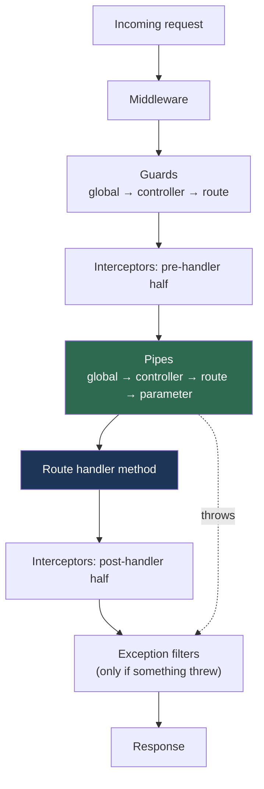

# Chapter 10 — Pipes: Transformation and Validation

> **한눈에 보기**
> 파이프는 핸들러가 호출되기 **직전**에 인자를 가로채는 클래스입니다. 하는 일은 두 가지뿐,
> 값을 원하는 형태로 **변환**하거나 유효한지 **검증**하고 아니면 예외를 던지는 것입니다.
> 9장의 예외 필터가 "잘못된 요청이 들어온 뒤"를 처리했다면, 파이프는 애초에 잘못된 값이
> 핸들러에 도달하지 못하도록 시스템 경계에서 막습니다. 내장 파이프 전부와 옵션, 직접
> 만드는 법, 전역 등록 방식을 다룹니다.

**What you will learn**

- Why a pipe is the only place in Nest that sees *both* the raw argument value and the *declared type* of the parameter it will fill, and why that is what makes automatic validation possible.
- How `transform(value, metadata)` works, and why `ArgumentMetadata.metatype` is `Object` for an interface-typed parameter.
- The four binding scopes — parameter, method, controller, global — and which to reach for by default.
- Every built-in pipe with its full option set — `ValidationPipe`, `ParseIntPipe`, `ParseFloatPipe`, `ParseBoolPipe`, `ParseArrayPipe`, `ParseUUIDPipe`, `ParseEnumPipe`, `ParseDatePipe`, `DefaultValuePipe`, `ParseFilePipe` — and how to change their status and error body.
- How to write a schema-driven pipe (Zod/Joi) from scratch, and how the class-validator approach differs.
- What `whitelist`, `forbidNonWhitelisted`, `transform`, and `transformOptions` do to the object your handler receives, including the mass-assignment hole `whitelist` closes — and why `useGlobalPipes()` cannot inject dependencies while `APP_PIPE` can.

**Why this matters**

Here is a bug that ships in almost every Node.js codebase not taught this chapter. A handler is declared `findOne(@Param('id') id: number)`; TypeScript is satisfied; the service then does `if (id > 100)`. At runtime `id` is the string `"5"`, because everything in an HTTP path is a string. The type annotation was a lie, and the compiler could not catch it, because the value crossed a network boundary where no type information exists.

Pipes answer that whole class of problem, and they are more interesting than they look. A pipe is the only construct in the Nest pipeline that runs *per-argument* rather than per-request. Middleware sees a raw `req`; guards see an `ExecutionContext`; interceptors see the response stream. Only a pipe is handed one value plus metadata saying which decorator produced it and what class the parameter was declared as. That last piece — the `metatype` — is what lets Nest run `class-validator` rules on a DTO automatically, with no per-endpoint glue.

The second reason pipes earn a chapter is *where* they sit: inside the exceptions zone, after guards have approved the request, immediately before the handler body. That is a real boundary. If a value reaches line one of a service it is already validated and coerced, so every layer beneath the controller can assume clean input. Push validation deeper and you re-validate in six places; push it shallower, into middleware, and you lose the route metadata that tells you what to validate against. A large share of practical API security lives here too: a `PATCH /users/me` that hands an unfiltered body to `repository.save()` lets a caller set `{"role": "admin"}`, and one option flag closes that permanently.

## What a pipe is

A pipe is a class annotated with `@Injectable()` that implements `PipeTransform` — the whole definition, and the interface has one method:

```typescript
export interface PipeTransform<T = any, R = any> {
  transform(value: T, metadata: ArgumentMetadata): R;
}
```

Nest interposes the pipe just before the handler is invoked, and whatever the pipe **returns** becomes the argument the handler receives. There is no `next()` and no mutate-in-place convention: the return value completely overrides the previous value. Both use cases follow from that one rule — **transformation** returns something different (`"5"` → `5`, an id → a loaded entity), **validation** returns the value unchanged if acceptable and throws if not. A validation pipe is therefore a transformation pipe that is the identity function on the happy path; Nest does not distinguish the two internally, and neither should you.

> **Hint** — Pipes run inside the *exceptions zone*: when one throws, the exception is handled by the layer you built in [Chapter 9 — Exception Filters](./09-exception-filters.md), and the controller method is never entered. Validating here is a best practice rather than a style preference — the failure path is already designed for you.

## Where pipes run

Order explains several confusing behaviours, notably why a guard never sees a parsed DTO.



Three consequences worth memorising. **Guards run before pipes**, so a guard cannot read a validated DTO and must inspect raw `request.body` ([Chapter 11](./11-guards.md)). **Interceptors wrap pipes**, so a timing interceptor is also timing your validation ([Chapter 12](./12-interceptors.md)). And **pipes are the last thing before your code** — everything after them is business logic.

Within the pipe layer, pipes at the same level run left to right — which is what makes `@Query('page', new DefaultValuePipe(0), ParseIntPipe)` work.

## `PipeTransform` and `ArgumentMetadata`

The most useless pipe possible — `transform(value, metadata) { return value; }` on an `@Injectable()` class — is a legal pipe. `PipeTransform<T, R>` is generic: `T` is the incoming type, `R` what you return, so `PipeTransform<string, number>` reads as "I take a string and give you a number" — exactly what `ParseIntPipe` is. The second parameter, `ArgumentMetadata`, carries the interesting information — three fields:

| Field | Meaning | Example |
|---|---|---|
| `type` | `'body' \| 'query' \| 'param' \| 'custom'` — which decorator produced the argument. `'custom'` is a custom parameter decorator ([Chapter 13](./13-custom-decorators-and-lifecycle.md)). | `@Body()` → `'body'` |
| `metatype` | The parameter's type as a runtime constructor; `undefined` with no annotation, or in plain JavaScript. | `CreateOrderDto`, `Number` |
| `data` | The string passed to the decorator; `undefined` when the parentheses are empty. | `@Param('id')` → `'id'` |

`metatype` is what makes generic validation possible. Nest reads it from the `design:paramtypes` metadata TypeScript emits when `emitDecoratorMetadata` is on, so a pipe can ask "what class was this supposed to be?" and validate against it.

> **⚠️ Notice** — TypeScript interfaces vanish during transpilation. Declare `@Body() dto: CreateOrderDto` where `CreateOrderDto` is an `interface`, and the emitted metatype is `Object`; every metatype-driven pipe, `ValidationPipe` included, silently skips it. **Always use classes for DTOs**, imported with a value import — `import type { Dto }` is erased too. Generics erase as well: `@Body() items: CreateItemDto[]` emits `Array`, which is what `ParseArrayPipe` exists for.

## Binding pipes: four scopes

**Parameter scope** is the narrowest: pass the pipe as an extra argument to the parameter decorator, as in `@Param('id', ParseIntPipe) id: number`. You pass the **class**, not an instance, so Nest instantiates it and the pipe joins dependency injection. Pass an instance when you need to configure it —

`@Param('id', new ParseIntPipe({ errorHttpStatusCode: HttpStatus.NOT_ACCEPTABLE })) id: number`. An in-place instance is created once at class-definition time and reused for every request, and it cannot inject anything. That trade-off — configurability versus injectability — recurs for guards, interceptors, and filters.


**Method scope** uses `@UsePipes()` on a handler — `@UsePipes(new ZodValidationPipe(createOrderSchema))` above `create()` — applying the pipe to *every* parameter. Be careful: it now also runs against `@Param()` and `@Query()` on the same handler. That is fine for a metatype-aware pipe, which skips primitives, but a schema pipe wired to a body schema will reject the path parameter. When the pipe is body-specific, bind it inside `@Body()`.

**Controller scope** is `@UsePipes()` on the class, for a whole resource sharing one policy. **Global scope** is `app.useGlobalPipes(new ValidationPipe())` in `main.ts`, the recommended default for `ValidationPipe`: a policy applying to "most endpoints" will be forgotten on the one endpoint that needed it.

> **⚠️ Notice** — In hybrid applications `useGlobalPipes()` does not attach pipes to gateways or microservice handlers. For a standard (non-hybrid) microservice app it does mount globally.

| Scope | DI? | Configurable? | Typical use |
|---|---|---|---|
| Parameter — `@Param('id', Pipe)` | Yes (class form) | Yes (instance form) | `Parse*` coercion |
| Method / controller — `@UsePipes()` | Yes | Yes | Endpoint or resource policy |
| Global — `useGlobalPipes()` | **No** | Yes | App-wide `ValidationPipe` |
| Global — `APP_PIPE` | **Yes** | Via `useFactory` | App-wide pipe needing config |

## The built-in pipes

All are exported from `@nestjs/common`. The `Parse*` family shares three options — `errorHttpStatusCode` (default `400`), `exceptionFactory`, and `optional` (pass `null`/`undefined` through) — plus their own options.

**`ParseIntPipe`** parses a numeric string to an integer, throwing otherwise; it rejects `"3.5"`, `"1e3"` and `"0x10"` on purpose. On `@Param('id', ParseIntPipe) id: number`, `GET /orders/abc` yields `{"statusCode": 400, "message": "Validation failed (numeric string is expected)", "error": "Bad Request"}`.

**`ParseFloatPipe`** is the same but accepts a decimal point; use it for money only if you are ready to talk about floating-point rounding. **`ParseBoolPipe`** accepts `"true"`/`"false"` and real booleans, rejecting `"1"`, `"yes"`, `"on"` — the strictness forces callers onto one spelling. **`ParseDatePipe`** parses an ISO-8601 string into a `Date`, and also takes `optional` and `default`.

**`ParseUUIDPipe`** validates a UUID of version 3, 4, or 5; pin the version when your system issues only one — `new ParseUUIDPipe({ version: '4' })`.

**`ParseEnumPipe`** validates against a TypeScript enum or a plain object of allowed values:

```typescript
export enum OrderStatus { Pending = 'pending', Shipped = 'shipped', Cancelled = 'cancelled' }

@Get('by-status/:status')
byStatus(@Param('status', new ParseEnumPipe(OrderStatus)) status: OrderStatus) {
  return this.orders.byStatus(status);
}
```

This is one of the highest-value pipes in the library: it turns an open string into a closed set, documenting the API and deleting a whole category of "unknown status" branches.

**`ParseArrayPipe`** is the only `Parse*` pipe with a substantial option set:

`items` names the class (or `Number`, `String`, `Boolean`) each element must be, DTO classes being run through `class-validator`; `separator` splits an incoming string, required for query strings; `optional` allows the argument to be missing; the error options behave as everywhere else. Two canonical uses: bulk bodies, which plain `ValidationPipe` cannot handle because `CreateOrderDto[]` erases to `Array` — `@Body(new ParseArrayPipe({ items: CreateOrderDto })) dtos: CreateOrderDto[]`; and comma-separated query parameters — `GET /orders?ids=1,2,3` via `@Query('ids', new ParseArrayPipe({ items: Number, separator: ',' })) ids: number[]`.

### `DefaultValuePipe`

The `Parse*` pipes throw on `null` and `undefined`, which is the wrong behaviour for optional query parameters, so you substitute a default *before* parsing. Argument order is the mechanism:

```typescript
@Query('page', new DefaultValuePipe(1), ParseIntPipe) page: number
```

`DefaultValuePipe` runs first, replaces `undefined`, and hands a defined value on. Reverse the order and the parse pipe throws before the default is seen — the most common ordering bug in Nest controllers.

### `ParseFilePipe`

Validates multipart uploads from `@UploadedFile()`, taking an array of `FileValidator` instances plus `errorHttpStatusCode` and `exceptionFactory`:

```typescript
@UploadedFile(
  new ParseFilePipe({
    validators: [
      new MaxFileSizeValidator({ maxSize: 5 * 1024 * 1024 }),
      new FileTypeValidator({ fileType: 'application/pdf' }),
    ],
    errorHttpStatusCode: HttpStatus.UNPROCESSABLE_ENTITY,
  }),
)
file: Express.Multer.File
```

`ParseFilePipeBuilder` composes the same validators fluently — `.addFileTypeValidator({ fileType: 'jpeg' }).addMaxSizeValidator({ maxSize: 1000 }).build({ fileIsRequired: false })`, where `fileIsRequired: false` makes the upload optional.

`FileValidator` is an abstract class with `isValid(file)` and `buildErrorMessage(file)`; `isValid` may be async, so you can call out to a scanner. `FileTypeValidator` checks the file's magic number rather than the client-supplied MIME type — which matters, because `Content-Type` on an upload is attacker-controlled. Full coverage: [Chapter 28](../part2-intermediate/28-file-upload-and-streaming.md).

### Customizing built-in pipe errors

`errorHttpStatusCode` changes only the status, and that is genuinely useful: a malformed id in a path segment is arguably a `404`, which also avoids advertising that your ids are integers.

`exceptionFactory` replaces the whole exception — `new ParseIntPipe({ exceptionFactory: () => new BadRequestException({ code: 'INVALID_ORDER_ID' }) })`. For `ValidationPipe` the factory receives class-validator's `ValidationError[]`, which lets you emit a field-keyed object instead of a flat message list:

```typescript
new ValidationPipe({
  exceptionFactory: (errors) =>
    new UnprocessableEntityException({
      code: 'VALIDATION_FAILED',
      fields: errors.map((e) => ({ field: e.property, constraints: Object.values(e.constraints ?? {}) })),
    }),
});
```

Doing this once, globally, is how an API gets a consistent machine-readable error contract. Decide whether the pipe or the [Chapter 9](./09-exception-filters.md) filter owns the response envelope; keep the other thin.

## Writing a custom pipe from scratch

### A schema-based pipe

Schema libraries such as [Zod](https://zod.dev/) (`npm install --save zod`) describe a shape as a value rather than as decorators on a class. Wrapping one takes ten lines.

```typescript title="zod-validation.pipe.ts"
import { PipeTransform, ArgumentMetadata, BadRequestException } from '@nestjs/common';
import { ZodSchema } from 'zod';

export class ZodValidationPipe implements PipeTransform {
  constructor(private readonly schema: ZodSchema) {}

  transform(value: unknown, metadata: ArgumentMetadata) {
    const result = this.schema.safeParse(value);
    if (!result.success) {
      throw new BadRequestException({
        message: 'Validation failed',
        issues: result.error.issues.map((i) => `${i.path.join('.')}: ${i.message}`),
      });
    }
    return result.data;
  }
}
```

Two details matter. `safeParse` instead of `parse` in a `try/catch` keeps the failure path explicit and reports *which* fields failed — the official example throws that away. And the pipe returns `result.data`, not `value`: Zod strips unknown keys and coerces. The schema lives next to the type:

```typescript title="create-order.schema.ts"
export const createOrderSchema = z
  .object({ customerId: z.string().uuid(), quantity: z.number().int().positive() })
  .strict();

export type CreateOrderDto = z.infer<typeof createOrderSchema>;
```

`z.infer` derives the TypeScript type *from* the runtime schema, so the two cannot drift apart — the strongest argument for the schema approach. Bind it per-parameter so it only sees the body, and mix freely with built-ins: `update(@Param('id', ParseIntPipe) id: number, @Body(new ZodValidationPipe(updateOrderSchema)) dto: UpdateOrderDto)`.

> **⚠️ Notice** — Zod requires `strictNullChecks` in `tsconfig.json`. A Joi version is identical in shape: `schema.validate(value)` returning `{ error, value }`.

### A transformation pipe

Because the return value replaces the argument, a pipe can *load* something:

```typescript title="order-by-id.pipe.ts"
import { Injectable, PipeTransform, NotFoundException } from '@nestjs/common';
import { OrdersService, Order } from './orders.service';

@Injectable()
export class OrderByIdPipe implements PipeTransform<string, Promise<Order>> {
  constructor(private readonly orders: OrdersService) {}

  async transform(value: string): Promise<Order> {
    const id = Number.parseInt(value, 10);
    const order = Number.isNaN(id) ? undefined : await this.orders.findOne(id);
    if (!order) throw new NotFoundException(`Order ${value} not found`);
    return order;
  }
}
```

Bound as `@Param('id', OrderByIdPipe) order: Order`, the handler body becomes `return order;`. The pipe is `async` — Nest awaits promises from `transform()` — and injects `OrdersService`, which works only because we bound the **class**. The counter-argument: a database read hidden in a parameter decorator is invisible to anyone skimming the file. Use it for read-only lookups every handler needs.

## The class-validator approach

The alternative is decorators on the DTO class (`npm i --save class-validator class-transformer`; the decorated `CreateOrderDto` appears in *Putting it together*). The class is then the single source of truth. Here is the pipe that consumes it — the built-in `ValidationPipe` reduced to a skeleton:

```typescript title="validation.pipe.ts"
import { PipeTransform, Injectable, ArgumentMetadata, BadRequestException } from '@nestjs/common';
import { validate } from 'class-validator';
import { plainToInstance } from 'class-transformer';

@Injectable()
export class ValidationPipe implements PipeTransform<any> {
  async transform(value: any, { metatype }: ArgumentMetadata) {
    if (!metatype || !this.toValidate(metatype)) {
      return value;
    }
    const object = plainToInstance(metatype, value);
    const errors = await validate(object);
    if (errors.length > 0) {
      throw new BadRequestException('Validation failed');
    }
    return value;
  }

  private toValidate(metatype: Function): boolean {
    const types: Function[] = [String, Boolean, Number, Array, Object];
    return !types.includes(metatype);
  }
}
```

Every line is load-bearing. `transform` is `async` because some class-validator constraints return promises. `toValidate()` bails out on native types, which cannot carry decorators — `Object` is in that list, which is *also* why an interface-typed DTO is silently unvalidated. And `plainToInstance()` is essential: the object from `express.json()` has no prototype link to your class, while class-validator reads rules from class metadata.

Everything past this skeleton — custom validation decorators, groups, nested validation, async validators — belongs to [Chapter 15 — Validation in Depth](../part2-intermediate/15-validation-in-depth.md).

## The built-in `ValidationPipe` and its options

You do not need to write that pipe: `@nestjs/common` ships a more capable one whose options extend class-validator's `ValidatorOptions`.

| Option | Default | What it does |
|---|---|---|
| `transform` | `false` | Return the `plainToInstance` result, and coerce primitives to the declared parameter type. |
| `transformOptions` | `{}` | Forwarded to `class-transformer` — notably `enableImplicitConversion`, `excludeExtraneousValues`. |
| `whitelist` | `false` | Strip every property with no validation decorator. |
| `forbidNonWhitelisted` | `false` | With `whitelist`, throw instead of stripping. |
| `forbidUnknownValues` | `true` | Fail immediately on an object with no known metadata. |
| `skipMissingProperties`, `skipNullProperties`, `skipUndefinedProperties` | `false` | Skip validation for properties that are null **or** undefined / null only / undefined only, respectively. |
| `disableErrorMessages` | `false` | Omit messages from the response body. |
| `errorHttpStatusCode` | `400` | Status used for validation failures. |
| `exceptionFactory` | — | Build your own exception from `ValidationError[]`. |
| `errorFormat` | `'list'` | `'list'` yields an array of strings; `'grouped'` an object keyed by property path, keeping custom messages verbatim. |
| `groups`, `strictGroups`, `always` | — | Validation groups — Chapter 15. |
| `stopAtFirstError` | `false` | Report only the first failing constraint per property. |
| `enableDebugMessages`, `dismissDefaultMessages`, `validationError.target/.value` | — | Extra console warnings; suppress default messages; expose the offending object and value in the error. |

### `whitelist` and `forbidNonWhitelisted`

These are the security options. With `whitelist: true`, any incoming property carrying no validation decorator on the DTO is **removed** before your handler sees it. Consider `PATCH /users/me` with a DTO declaring only `@IsString() displayName`, and a caller sending `{ "displayName": "Ada", "role": "admin" }`. Without `whitelist` the handler receives both keys and `repository.save(dto)` grants the caller admin; with it, the handler receives `{ displayName: "Ada" }`. This is the mass-assignment defence, and the author recommends turning it on globally on day one of every project.

`forbidNonWhitelisted: true` (which requires `whitelist: true`) upgrades silent stripping to a `400` naming the offending properties. Prefer it on internal APIs, where a stray field means a client bug; prefer plain `whitelist` on public APIs, where an unknown field is more likely an old client.

> **⚠️ Notice** — `whitelist` protects the payload's *shape*, not the caller's *authority*: it cannot tell you this user may not change `status`. Field-level authorization is [Chapter 25](../part2-intermediate/25-authorization.md).

### `transform` and `transformOptions`

With `transform: true` the pipe returns the class instance from `plainToInstance`, so `dto instanceof CreateOrderDto` is `true`, class methods work, and `@Transform()`/`@Type()` conversions have been applied. It also enables primitive coercion: with that flag on, `findOne(@Param('id') id: number)` really does receive a `number`, because the pipe reads the `metatype` (`Number`) and converts. Without `transform` you coerce explicitly with `ParseIntPipe` — the more visible option, and the one to prefer when a reader should be able to *see* the conversion.

`enableImplicitConversion: true` in `transformOptions` converts values purely from the declared property type, without a `@Type(() => Number)` on each field. It is convenient and slightly dangerous: it turns `"abc"` into `NaN` for a `number` property, and the resulting `@IsNumber()` message is confusing. The author's recommendation is to leave it off and write explicit `@Type()` decorators. Keep `disableErrorMessages` off too: hiding messages usually converts a self-service integration problem into a support ticket. If you fear leaking internals, shape errors with `exceptionFactory` rather than deleting them.

## Global pipes and `APP_PIPE`

`app.useGlobalPipes(new ValidationPipe())` registers an instance created outside any module, therefore outside the DI container: it cannot inject anything. The moment the pipe needs a `ConfigService` — to decide whether `forbidNonWhitelisted` applies here — that registration stops working. Register the pipe under `APP_PIPE` instead:

```typescript title="app.module.ts"
import { Module, ValidationPipe } from '@nestjs/common';
import { APP_PIPE } from '@nestjs/core';
import { ConfigService } from '@nestjs/config';

@Module({
  providers: [
    {
      provide: APP_PIPE,
      inject: [ConfigService],
      useFactory: (config: ConfigService) =>
        new ValidationPipe({
          whitelist: true,
          forbidNonWhitelisted: config.get('NODE_ENV') !== 'production',
          transform: true,
        }),
    },
  ],
})
export class AppModule {}
```

Nest recognises the token and mounts the provider globally, whichever module declares it — including a feature module, which surprises people. `useClass` works when no configuration is needed, and several `APP_PIPE` providers may coexist, mounting in order.

## Common mistakes

1. **`DefaultValuePipe` after the parse pipe.** *Symptom:* `GET /orders` with no `?page=` returns `400 Validation failed`. *Cause:* `ParseIntPipe` ran first and got `undefined`. *Fix:* default first.

2. **DTO declared as an `interface`.** *Symptom:* invalid payloads sail through a global `ValidationPipe`. *Cause:* the interface is erased, `metatype` is `Object`, so the pipe skips it. *Fix:* use a `class`, value-imported.

3. **Expecting `whitelist` to work without decorators.** *Symptom:* `whitelist: true` strips everything and the handler gets `{}`. *Cause:* whitelisting keeps only properties carrying at least one class-validator decorator. *Fix:* decorate every field you accept, `@IsOptional()` on the optional ones.

4. **A body-specific pipe bound with `@UsePipes()`.** *Symptom:* `PUT /orders/12` fails validation on the *path* parameter. *Cause:* `@UsePipes()` applies to every argument of the handler. *Fix:* bind inside `@Body()`.

5. **Relying on `transform: true` for coercion, then removing it.** *Symptom:* `id > 100` silently stops working after someone edits the global pipe config. *Cause:* the coercion was invisible at the call site. *Fix:* prefer explicit `ParseIntPipe` even when `transform` is on.

6. **A `useGlobalPipes()` pipe that needs injection.** *Symptom:* `Cannot read properties of undefined` in a constructor dependency. *Cause:* the instance was built outside the DI container. *Fix:* register it with `APP_PIPE`.

7. **Validating twice, or catching in the handler.** *Symptom:* duplicated messages, or a `try/catch` that never fires. *Cause:* pipes stack rather than replace one another, and all run before the handler body. *Fix:* pick one binding level; shape errors with `exceptionFactory` or a filter.

## Putting it together

A complete orders resource using most of the chapter: a whitelisting global `ValidationPipe` via `APP_PIPE`, a class-validator DTO, `Parse*` pipes with defaults, an enum pipe, and an entity-loading pipe.

```typescript title="orders/orders.controller.ts"
import {
  Body, Controller, DefaultValuePipe, Get, Param, ParseBoolPipe,
  ParseEnumPipe, ParseIntPipe, Post, Query,
} from '@nestjs/common';
import { Type } from 'class-transformer';
import { IsUUID, IsString, IsInt, IsPositive, IsOptional, MaxLength } from 'class-validator';
import { Order, OrderStatus, OrdersService } from './orders.service';
import { OrderByIdPipe } from './pipes/order-by-id.pipe';

export class CreateOrderDto {
  @IsUUID('4') customerId: string;

  @IsString() sku: string;

  @Type(() => Number) @IsInt() @IsPositive() quantity: number;

  @IsOptional() @IsString() @MaxLength(500) note?: string;
}

@Controller('orders')
export class OrdersController {
  constructor(private readonly orders: OrdersService) {}

  @Post()
  create(@Body() dto: CreateOrderDto) {
    return this.orders.create(dto); // a validated CreateOrderDto instance
  }

  @Get()
  findAll(
    @Query('page', new DefaultValuePipe(1), ParseIntPipe) page: number,
    @Query('archived', new DefaultValuePipe(false), ParseBoolPipe) archived: boolean,
  ) {
    return this.orders.findAll({ page, archived });
  }

  @Get('by-status/:status')
  byStatus(@Param('status', new ParseEnumPipe(OrderStatus)) status: OrderStatus) {
    return this.orders.byStatus(status);
  }

  @Get(':id')
  findOne(@Param('id', OrderByIdPipe) order: Order) {
    return order;
  }
}
```

Register the `APP_PIPE` provider from the previous section. `POST /orders` with an extra `"discount": 100` returns `400` naming `discount`; `GET /orders` with no query string returns page 1; `.../by-status/shipped-maybe` returns `400`; `GET /orders/999` returns `404` from a pipe, never entering the handler body.

> **핵심 정리**
> - 파이프는 `PipeTransform` 구현체이며, `transform()`의 **반환값이 곧 핸들러 인자**가 된다. 검증 파이프는 항등 함수인 변환 파이프의 특수한 경우일 뿐이다.
> - 파이프는 미들웨어·가드·인터셉터(전반부) 다음, 핸들러 **직전**에 예외 존 안에서 실행된다.
> - `ArgumentMetadata.metatype`은 `emitDecoratorMetadata`로 얻는 런타임 타입 정보다. 인터페이스나 `import type`을 쓰면 검증이 조용히 건너뛰어진다. **DTO는 클래스로.**
> - 바인딩은 파라미터/메서드/컨트롤러/전역 네 단계. 클래스를 넘기면 DI, 인스턴스를 넘기면 옵션 설정이 가능하다.
> - `Parse*` 파이프는 `null`/`undefined`에서 예외를 던진다. 선택적 쿼리에는 `DefaultValuePipe`를 **먼저** 배치한다.
> - `errorHttpStatusCode`는 상태 코드만, `exceptionFactory`는 예외 전체를 교체한다. 전역 에러 규격은 후자로 정의한다.
> - `whitelist: true`는 데코레이터 없는 속성을 제거해 mass-assignment를 막는다. 기본으로 켜둘 것. `transform: true`는 진짜 DTO 인스턴스를 넘겨주지만, 명시적 `ParseIntPipe`가 의도를 더 잘 드러낸다.
> - `useGlobalPipes()`로 등록한 파이프는 주입을 받을 수 없다. 주입이 필요하면 `APP_PIPE`를 쓴다.

> **연습 문제**
> 1. `@Query('page', ParseIntPipe, new DefaultValuePipe(1))`처럼 순서를 뒤집으면 어떤 요청에서 어떤 응답이 나오는가? 파이프 실행 순서로 설명하라.
> 2. DTO를 `interface`로 선언하면 전역 `ValidationPipe`가 아무 오류도 내지 않는 이유를 `ArgumentMetadata` 필드 값으로 설명하라.
> 3. **직접 만들어 보라.** 콤마 구분 정렬 파라미터(`?sort=-createdAt,name`)를 `{ field: string; direction: 'asc' | 'desc' }[]`로 바꾸는 `ParseSortPipe`를 작성하라. 허용 필드 목록은 생성자로 받고, 목록에 없으면 `BadRequestException`을 던질 것.
> 4. **직접 만들어 보라.** `exceptionFactory`로 검증 실패를 `{ code, errors: { [field]: string[] } }`로 반환하는 전역 `ValidationPipe`를 `APP_PIPE`로 등록하라. `ConfigService` 값에 따라 `forbidNonWhitelisted`를 켜고 끌 것.
> 5. `whitelist: true`가 막는 공격과 막지 **못하는** 공격을 하나씩 예시로 들고, `OrderByIdPipe` 같은 엔티티 로딩 파이프를 쓰지 말아야 할 상황을 하나 제시하라.

**Next:** Pipes decide whether an argument is *well-formed*; they say nothing about whether the caller is *allowed* to make the call. [Chapter 11 — Guards](./11-guards.md) covers the construct that answers that question, and why it runs before all the validation you just set up.
