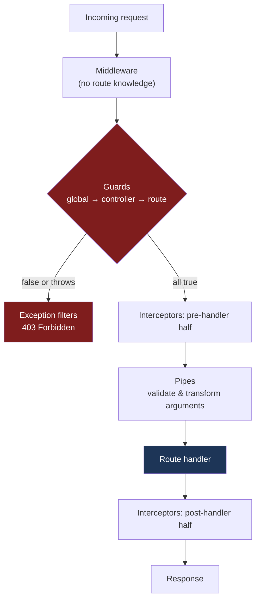

# Chapter 11 — Guards: Authorization at the Route Boundary

> **한눈에 보기**
> 가드는 "이 요청이 라우트 핸들러까지 갈 자격이 있는가?"라는 **단 하나의 질문**에 답하는
> 클래스입니다. 미들웨어와 달리 `ExecutionContext`를 통해 어떤 컨트롤러의 어떤 핸들러가
> 실행될 예정인지 알고 있고, 그래서 라우트에 붙은 메타데이터를 읽어 선언적으로 판단할 수
> 있습니다. 10장의 파이프가 "값이 올바른가"를 물었다면, 가드는 그보다 **먼저** "당신이
> 누구이며 이걸 해도 되는가"를 묻습니다.

**What you will learn**

- The one question a guard exists to answer, and why anything else you are tempted to put in a guard belongs somewhere else.
- Why guards run after all middleware but before every interceptor and pipe, and the concrete consequences of that position.
- `CanActivate`, `ExecutionContext`, and how `getHandler()` / `getClass()` give a guard the route metadata middleware can never see.
- How to bind guards at method, controller, and global level — and why `APP_GUARD` is the only global form that can inject dependencies.
- How to attach route metadata with `SetMetadata` or `Reflector.createDecorator`, build a typed `@Roles()` decorator, and read it back with `get`, `getAllAndOverride`, and `getAllAndMerge`.
- The difference between returning `false` and throwing, what status each produces, and which to prefer.
- How multiple guards compose, in what order they run, and how short-circuiting affects side effects.

**Why this matters**

Consider a codebase where authorization lives in the service layer. `OrdersService.cancel(orderId, user)` starts with `if (user.role !== 'admin') throw new ForbiddenException()`. It works. Six months later there are forty service methods, thirty-one of them carry that check, and nobody can tell you which nine do not. The check is invisible from the controller, invisible from the route table, and it must be duplicated in every new method someone writes. A security property that has to be re-implemented per method is one you will eventually forget.

Guards exist to move that decision to a place where it is *declarative and visible*. `@UseGuards(RolesGuard)` and `@Roles('admin')` sit directly above the handler. You can read a controller top to bottom and enumerate exactly who may call what. And because the guard runs at the framework boundary, there is no path into the handler that skips it.

The interesting part is *why* a guard can do this when middleware cannot. Express middleware is handed `(req, res, next)` and nothing else. It has no idea which handler `next()` will eventually reach, so it cannot ask "what roles does *this* route require?" A guard receives an `ExecutionContext` that names the controller class and the handler method that are about to run. That single capability — knowing the destination before you get there — is what makes metadata-driven authorization possible, and it is the reason Nest introduced a construct that Express does not have.

One boundary to set now: authentication and authorization are different jobs. Authentication answers "who are you?" and usually happens once, producing a `request.user`. Authorization answers "may you do this?" and depends on the route. Guards are excellent at the second and adequate at the first. This chapter builds both to show the mechanism; the production versions are [Chapter 23 — Authentication](../part2-intermediate/23-authentication.md) and [Chapter 25 — Authorization](../part2-intermediate/25-authorization.md).

## The single question a guard answers

A guard is a class annotated with `@Injectable()` that implements `CanActivate`:

```typescript
export interface CanActivate {
  canActivate(
    context: ExecutionContext,
  ): boolean | Promise<boolean> | Observable<boolean>;
}
```

Nest calls `canActivate()` and uses the result:

- `true` → the request proceeds to the next guard, then to interceptors, pipes, and the handler.
- `false` → Nest throws `ForbiddenException` on your behalf; the handler never runs.
- a thrown exception → it goes to the exceptions layer from [Chapter 9](./09-exception-filters.md), exactly as if the handler had thrown it.

That is the entire contract. Notice what it does *not* include: a guard cannot modify the response, cannot wrap the handler, and has no `next()` to call. If you find yourself wanting to log timings, reshape output, or retry — those are interceptors ([Chapter 12](./12-interceptors.md)). If you want to reject a *value* rather than a *caller*, that is a pipe ([Chapter 10](./10-pipes-and-validation.md)). Keeping guards to their one question is what keeps them composable.

## Where guards run, and why



Guards run **after all middleware** and **before any interceptor or pipe**. Each half of that sentence has practical consequences.

*After middleware* means anything middleware attached to the request is already available: if a cookie parser or a Passport middleware populated `request.cookies` or `request.user`, a guard can read it. It also means middleware still runs for requests a guard will reject — which matters if your middleware is expensive.

*Before interceptors and pipes* means two things that surprise people. First, **a guard sees the raw, unvalidated body**. Nothing has run `ValidationPipe` yet, so `request.body` is whatever the JSON parser produced. A guard that reads `request.body.tenantId` is reading attacker-controlled, unvalidated input, and must treat it accordingly. Second, **rejecting in a guard is cheap**: no DTO has been constructed, no validation performed, no interceptor state set up. That ordering is deliberate — the framework refuses work as early as it can once it knows the caller has no business making the request.

The ordering also settles a common design question: *should authentication be middleware or a guard?* Middleware is fine when token validation is uniform across every route. A guard is better the moment some routes are public, because `@Public()` metadata is readable only from a guard. The author's recommendation is a global authentication **guard** with a `@Public()` escape hatch — exactly what Chapter 23 builds.

## `CanActivate` and `ExecutionContext`

`ExecutionContext` extends `ArgumentsHost` — the same object you met in the exception-filters chapter — and adds two methods that matter enormously:

| Method | Returns | Use |
|---|---|---|
| `switchToHttp()` | `HttpArgumentsHost` with `getRequest()`, `getResponse()`, `getNext()` | Reach the platform request/response |
| `switchToRpc()` / `switchToWs()` | Microservice / WebSocket hosts | The same guard, other transports |
| `getType()` | `'http' \| 'rpc' \| 'ws' \| 'graphql'` | Branch on transport in a shared guard |
| `getClass()` | The controller class | Read class-level metadata |
| `getHandler()` | The handler method reference | Read method-level metadata |

`getClass()` and `getHandler()` are the whole reason guards exist as a separate construct. They are references, not names, and they are exactly what `Reflector` needs to look up metadata attached by a decorator. Deeper coverage across transports: [Chapter 40](../part3-advanced/40-execution-context.md).

Typing the request is worth doing once:

```typescript
import { Request } from 'express';

export interface AuthedRequest extends Request {
  user?: { sub: string; roles: string[] };
}
```

Then `context.switchToHttp().getRequest<AuthedRequest>()` gives you a typed `request.user` in every guard, instead of `any`.

## An authentication guard reading a token

Here is the shape of a token-reading guard. It is deliberately minimal — the real one is in Chapter 23 — but every structural decision in it is the one you want.

```typescript title="auth.guard.ts"
import {
  Injectable, CanActivate, ExecutionContext, UnauthorizedException,
} from '@nestjs/common';
import { JwtService } from '@nestjs/jwt';
import { AuthedRequest } from './authed-request';

@Injectable()
export class AuthGuard implements CanActivate {
  constructor(private readonly jwt: JwtService) {}

  async canActivate(context: ExecutionContext): Promise<boolean> {
    const request = context.switchToHttp().getRequest<AuthedRequest>();
    const token = this.extractToken(request);
    if (!token) {
      throw new UnauthorizedException('Missing bearer token');
    }
    try {
      request.user = await this.jwt.verifyAsync(token);
    } catch {
      throw new UnauthorizedException('Invalid or expired token');
    }
    return true;
  }

  private extractToken(request: AuthedRequest): string | undefined {
    const [scheme, value] = request.headers.authorization?.split(' ') ?? [];
    return scheme === 'Bearer' ? value : undefined;
  }
}
```

Three things to notice. It **injects** `JwtService` through the constructor, which works because guards are ordinary providers. It **throws `UnauthorizedException`** rather than returning `false`, because a missing token is a `401`, not a `403`. And it **writes to `request.user`**, the Node convention for passing the authenticated principal down the chain; every later guard, interceptor, and custom decorator reads it from there.

## Binding guards

Guards bind at three levels with `@UseGuards()`, which accepts a comma-separated list.

```typescript title="orders.controller.ts"
@Controller('orders')
@UseGuards(AuthGuard, RolesGuard)   // controller-scoped: every handler
export class OrdersController {

  @Delete(':id')
  @UseGuards(OwnerGuard)            // method-scoped: this handler only
  remove(@Param('id', ParseIntPipe) id: number) { /* ... */ }
}
```

As with pipes, passing the **class** lets Nest instantiate it and inject its dependencies; passing an instance (`@UseGuards(new RolesGuard())`) gives a hand-configured object that cannot inject anything. Prefer the class form: a guard needing configuration should read it from a `ConfigService`, not from an argument you write at the binding site.

Global binding from `main.ts` looks like this:

```typescript
const app = await NestFactory.create(AppModule);
app.useGlobalGuards(new AuthGuard(/* ... */));
```

and it has the same defect as `useGlobalPipes()`: the instance is created outside any module, so the DI container knows nothing about it — and `new AuthGuard()` cannot even be constructed when `AuthGuard` needs a `JwtService`. That makes `useGlobalGuards()` nearly useless for real authentication.

> **⚠️ Notice** — For hybrid applications, `useGlobalGuards()` does not attach guards to gateways or microservice handlers by default. For a standard (non-hybrid) microservice app it does mount globally.

### `APP_GUARD`: the global form that can inject

Register the guard as a provider under the `APP_GUARD` token and it becomes global *and* fully injectable:

```typescript title="app.module.ts"
import { Module } from '@nestjs/common';
import { APP_GUARD } from '@nestjs/core';
import { AuthGuard } from './auth/auth.guard';
import { RolesGuard } from './auth/roles.guard';

@Module({
  providers: [
    { provide: APP_GUARD, useClass: AuthGuard },
    { provide: APP_GUARD, useClass: RolesGuard },
  ],
})
export class AppModule {}
```

Two details matter here. First, the guard is global regardless of which module declares it — put it in the module where the guard lives, typically `AuthModule` or `AppModule`. Second, **multiple `APP_GUARD` providers are allowed**, and they execute in declaration order. That is how you express "authenticate first, then check roles" globally: `AuthGuard` populates `request.user`, `RolesGuard` reads it. Reverse the two and `RolesGuard` sees `undefined`.

Global authentication needs an escape hatch for login and health-check routes. The standard pattern is a `@Public()` marker the guard checks first:

```typescript title="public.decorator.ts"
import { Reflector } from '@nestjs/core';

export const Public = Reflector.createDecorator<boolean>();
```

```typescript
// inside AuthGuard.canActivate, before touching the token:
const isPublic = this.reflector.getAllAndOverride(Public, [
  context.getHandler(),
  context.getClass(),
]);
if (isPublic) return true;
```

## Route metadata and a typed `@Roles()` decorator

A guard that returns `true` for everyone is a guard that does nothing. To make it useful it needs to know what *this* route requires, and that information comes from metadata attached to the handler.

Nest offers two ways to attach it.

### `Reflector.createDecorator` — typed, recommended

```typescript title="roles.decorator.ts"
import { Reflector } from '@nestjs/core';

export const Roles = Reflector.createDecorator<string[]>();
```

That single line creates a decorator whose argument is typed `string[]` and whose *identity* is the key. You apply it as `@Roles(['admin'])` and read it with `reflector.get(Roles, context.getHandler())` — passing the decorator itself, not a magic string. Typos become compile errors, and "find all usages" works.

The type argument can be anything serialisable, which is how you build richer policies:

```typescript
export const RequirePermission = Reflector.createDecorator<{
  resource: string;
  action: 'read' | 'write' | 'delete';
}>();
```

### `SetMetadata` — lower level, more control

```typescript
import { SetMetadata } from '@nestjs/common';

@Post()
@SetMetadata('roles', ['admin'])
create(@Body() dto: CreateOrderDto) { /* ... */ }
```

Here `'roles'` is the key and `['admin']` the value. Using `@SetMetadata()` directly in controllers is poor practice — the key is a bare string repeated at every call site — so wrap it:

```typescript title="roles.decorator.ts"
import { SetMetadata } from '@nestjs/common';

export const ROLES_KEY = 'roles';
export const Roles = (...roles: string[]) => SetMetadata(ROLES_KEY, roles);
```

Now `@Roles('admin', 'auditor')` reads better than the array form, because `SetMetadata` lets you shape the signature freely — variadic arguments, multiple parameters, computed values. That is its one real advantage; `Reflector.createDecorator` always takes exactly one argument.

| | `Reflector.createDecorator` | `SetMetadata` wrapper |
|---|---|---|
| Key | The decorator object itself | A string you manage |
| Type safety | Enforced by the generic | Only what your wrapper declares |
| Signature | Exactly one argument | Any signature you like |
| Read with | `reflector.get(Roles, target)` | `reflector.get<string[]>(ROLES_KEY, target)` |
| Recommendation | Default choice | When you need a custom signature |

## Reading metadata: `get`, `getAllAndOverride`, `getAllAndMerge`

`Reflector` is provided by the framework and injected like any other service. Its three read methods differ in how they combine metadata from several targets.

**`get(decoratorOrKey, target)`** reads one target and returns `undefined` if the metadata is absent:

```typescript
const roles = this.reflector.get(Roles, context.getHandler());
```

This is the naive version, and it has a bug waiting in it: metadata placed on the **controller** is invisible. `@Roles(['admin'])` above `export class AdminController` would be silently ignored.

**`getAllAndOverride(decoratorOrKey, targets[])`** walks the array in order and returns the **first** value it finds:

```typescript
const roles = this.reflector.getAllAndOverride(Roles, [
  context.getHandler(),
  context.getClass(),
]);
```

Handler first, class second, so a method-level `@Roles()` overrides the controller-level default. This is the right semantic for roles, and it is what you should use almost every time.

**`getAllAndMerge(decoratorOrKey, targets[])`** concatenates arrays and merges objects from every target:

```typescript
const roles = this.reflector.getAllAndMerge(Roles, [
  context.getHandler(),
  context.getClass(),
]);
```

With `@Roles(['admin'])` on the class and `@Roles(['auditor'])` on the method, you get `['auditor', 'admin']`. That semantic is additive: the handler *widens* access rather than replacing it. Merging is right for accumulating permission tags or feature flags, and wrong for roles if you ever want a method to be *stricter* than its controller — merging can only ever loosen.

Choose deliberately: "class sets the default, method overrides" is `getAllAndOverride`; "every level contributes" is `getAllAndMerge`.

Here is the complete roles guard:

```typescript title="roles.guard.ts"
import { Injectable, CanActivate, ExecutionContext, ForbiddenException } from '@nestjs/common';
import { Reflector } from '@nestjs/core';
import { Roles } from './roles.decorator';
import { AuthedRequest } from './authed-request';

@Injectable()
export class RolesGuard implements CanActivate {
  constructor(private readonly reflector: Reflector) {}

  canActivate(context: ExecutionContext): boolean {
    const required = this.reflector.getAllAndOverride(Roles, [
      context.getHandler(),
      context.getClass(),
    ]);
    if (!required?.length) {
      return true; // no @Roles() on this route: nothing to enforce
    }

    const { user } = context.switchToHttp().getRequest<AuthedRequest>();
    if (!user) {
      throw new ForbiddenException('No authenticated principal');
    }
    const allowed = required.some((role) => user.roles.includes(role));
    if (!allowed) {
      throw new ForbiddenException(`Requires one of: ${required.join(', ')}`);
    }
    return true;
  }
}
```

The `if (!required?.length) return true;` line deserves a comment in your own code, because it encodes a policy: **routes with no `@Roles()` are open to any authenticated user**. That is the usual choice, but deny-unless-allowed is more defensible for an internal admin API — and the guard is where you make that decision once.

> **⚠️ Notice** — This guard trusts `request.user`, which some earlier guard or middleware must have set. If `RolesGuard` runs before `AuthGuard`, `user` is `undefined` and every protected route returns `403` — a confusing failure that is really an ordering bug.

## Returning `false` versus throwing

When a guard returns `false`, Nest throws `ForbiddenException` for you, and the client sees:

```json
{ "statusCode": 403, "message": "Forbidden resource", "error": "Forbidden" }
```

That is a fine default, and for a genuinely boolean policy — "this feature flag is off for you" — `false` is the clearest expression of intent. But it gives exactly one status and one message, which is wrong in two common situations:

- **No credentials at all.** That is `401 Unauthorized`, not `403`. `401` tells a client "authenticate and try again"; `403` tells it "you are known and still not allowed". A client library that retries on `401` after refreshing a token will loop forever if you send `403`.
- **You want to say why.** `throw new ForbiddenException('Requires one of: admin, auditor')` is far more useful to the API consumer than a bare "Forbidden resource".

Any exception thrown from a guard flows through the exceptions layer, so your global filter and any context-bound filters shape it exactly as they shape handler exceptions. The author's recommendation: **throw a specific exception, and reserve `return false` for policies where "no" needs no explanation.** Be careful about the reverse mistake too — a `404` is sometimes the correct answer when even revealing the resource's existence is a leak, and a guard is a perfectly legal place to throw `NotFoundException`.

## Async guards and Observables

`canActivate()` may return a `boolean`, a `Promise<boolean>`, or an `Observable<boolean>`. Nest awaits or subscribes as needed. Asynchronous guards are the norm, not the exception: verifying a JWT signature, loading a user's permissions, checking a revocation list, or calling an authorization service all involve I/O.

```typescript
@Injectable()
export class SubscriptionGuard implements CanActivate {
  constructor(private readonly billing: BillingService) {}

  async canActivate(context: ExecutionContext): Promise<boolean> {
    const { user } = context.switchToHttp().getRequest<AuthedRequest>();
    if (!(await this.billing.hasActiveSubscription(user!.sub))) {
      throw new ForbiddenException('An active subscription is required');
    }
    return true;
  }
}
```

The Observable form matters mostly when you are already in an RxJS world — `return this.http.get(...).pipe(map((res) => res.data.allowed));` is a complete `canActivate` body. Two warnings. Every guard is on the critical path of every matching request, so an authorization lookup that hits the database costs a round trip per request — cache it ([Chapter 27](../part2-intermediate/27-caching.md)) or fold the permissions into the token. And a guard that throws a *non-HTTP* exception surfaces as a `500`, not a `403`; wrap risky I/O and translate failures deliberately.

## Guard ordering with multiple guards

Guards execute in a fixed, documented order:

1. **Global guards**, in registration order — `APP_GUARD` providers in the order they appear in the `providers` array, then anything from `useGlobalGuards()`.
2. **Controller guards**, left to right in the `@UseGuards()` list.
3. **Route guards**, left to right in the `@UseGuards()` list.

They **short-circuit**: the first guard that returns `false` or throws stops the chain, and no later guard runs. That is what makes "authenticate then authorize" work, and also why a guard should not carry side effects it cannot afford to skip. An audit-log guard placed after `RolesGuard` never records denied attempts. Log denials from an exception filter, or from the deciding guard.

Composition also lets each guard stay narrow. Rather than one `SuperGuard` that authenticates, checks roles, and verifies ownership, write three:

```typescript
@Delete(':id')
@UseGuards(AuthGuard, RolesGuard, OwnerGuard)
@Roles(['admin', 'owner'])
remove(@Param('id', ParseIntPipe) id: number) { /* ... */ }
```

Each is independently testable, and the decorator stack states the policy. Keep in mind that guards cannot pass values to each other except through the request object: `AuthGuard` writes `request.user`, the others read it. Keep that contract documented — it is the seam where ordering bugs live.

## Common mistakes

1. **`RolesGuard` before `AuthGuard`.** *Symptom:* every protected route returns `403` even with a valid token. *Cause:* `request.user` is `undefined` when the roles guard runs. *Fix:* order the `APP_GUARD` providers (or the `@UseGuards()` list) so authentication comes first.

2. **`reflector.get(Roles, context.getHandler())` when metadata is on the controller.** *Symptom:* a class-level `@Roles()` is silently ignored and every method is open. *Cause:* `get` reads exactly one target. *Fix:* `getAllAndOverride(Roles, [getHandler(), getClass()])`.

3. **Returning `false` for a missing token.** *Symptom:* clients that refresh on `401` never refresh; users see "Forbidden" when they simply were not logged in. *Cause:* `false` always means `403`. *Fix:* `throw new UnauthorizedException()`.

4. **A global guard registered with `useGlobalGuards()` that needs DI.** *Symptom:* you cannot construct it, or its injected service is `undefined`. *Cause:* the instance lives outside the DI container. *Fix:* the `APP_GUARD` provider.

5. **Expecting a validated DTO in a guard.** *Symptom:* `request.body.tenantId` is a raw string, an array, or missing entirely. *Cause:* pipes run *after* guards. *Fix:* validate defensively inside the guard, or move the check into a pipe or the handler.

6. **Forgetting the escape hatch on a global auth guard.** *Symptom:* `POST /auth/login` returns `401` — you must be logged in to log in. *Cause:* the global guard has no exemption. *Fix:* a `@Public()` decorator checked at the top of `canActivate`.

7. **Side effects in a guard that is not guaranteed to run.** *Symptom:* audit records exist for allowed requests but not denied ones. *Cause:* short-circuiting. *Fix:* record from an exception filter or from the deciding guard itself.

8. **Business logic in a guard.** *Symptom:* the guard loads an entity, then the handler loads it again; or the guard mutates state. *Cause:* the guard is answering more than one question. *Fix:* guards decide; pipes transform; interceptors observe. Cache the loaded entity on `request` if both really need it.

## Putting it together

A complete authorization slice: a typed `@Roles()` decorator, a global authentication guard with a `@Public()` exemption, a global roles guard, and a route-level ownership guard.

```typescript title="auth/decorators.ts"
import { Reflector } from '@nestjs/core';

export const Roles = Reflector.createDecorator<string[]>();
export const Public = Reflector.createDecorator<boolean>();
```

```typescript title="auth/owner.guard.ts"
import { Injectable, CanActivate, ExecutionContext, NotFoundException } from '@nestjs/common';
import { OrdersService } from '../orders/orders.service';
import { AuthedRequest } from './authed-request';

@Injectable()
export class OwnerGuard implements CanActivate {
  constructor(private readonly orders: OrdersService) {}

  async canActivate(context: ExecutionContext): Promise<boolean> {
    const request = context.switchToHttp().getRequest<AuthedRequest>();
    const order = await this.orders.findOne(Number(request.params.id));
    // A 404 here avoids confirming that someone else's order exists.
    if (!order || order.customerId !== request.user?.sub) {
      throw new NotFoundException('Order not found');
    }
    return true;
  }
}
```

```typescript title="orders/orders.controller.ts"
import { Controller, Delete, Get, Param, ParseIntPipe, UseGuards } from '@nestjs/common';
import { Roles, Public } from '../auth/decorators';
import { OwnerGuard } from '../auth/owner.guard';
import { OrdersService } from './orders.service';

@Controller('orders')
@Roles(['customer'])                      // controller default
export class OrdersController {
  constructor(private readonly orders: OrdersService) {}

  @Get('health')
  @Public(true)                           // skips AuthGuard entirely
  health() {
    return { status: 'ok' };
  }

  @Get(':id')
  @UseGuards(OwnerGuard)                  // runs after the two global guards
  findOne(@Param('id', ParseIntPipe) id: number) {
    return this.orders.findOne(id);
  }

  @Delete(':id')
  @Roles(['admin'])                       // overrides the controller default
  remove(@Param('id', ParseIntPipe) id: number) {
    return this.orders.remove(id);
  }
}
```

```typescript title="app.module.ts"
@Module({
  imports: [AuthModule, OrdersModule],
  providers: [
    { provide: APP_GUARD, useClass: AuthGuard },   // 1st: sets request.user
    { provide: APP_GUARD, useClass: RolesGuard },  // 2nd: reads @Roles()
  ],
})
export class AppModule {}
```

Trace `DELETE /orders/7` with a customer's token. `AuthGuard` verifies the token and sets `request.user`. `RolesGuard` calls `getAllAndOverride`, finds `['admin']` on the handler (overriding `['customer']` on the class), sees the user's roles do not include it, and throws `ForbiddenException` with a message naming the requirement. No pipe runs, `ParseIntPipe` never sees `"7"`, and the handler body is never entered. Now trace `GET /orders/health`: `AuthGuard` finds `Public` metadata and returns `true` immediately, `RolesGuard` finds `['customer']` on the class but no `request.user` — which is why a `@Public()` route should also carry no `@Roles()`, or your roles guard needs its own public check.

That wrinkle is real, and it is the kind of interaction you only find by tracing: two global guards with an exemption mechanism must *both* honour it.

> **핵심 정리**
> - 가드는 `CanActivate`를 구현한 `@Injectable()` 클래스이며, "이 요청을 핸들러까지 보낼 것인가"라는 단 하나의 질문에만 답한다.
> - 가드는 모든 미들웨어 **다음**, 모든 인터셉터·파이프 **이전**에 실행된다. 따라서 `request.user`는 볼 수 있지만 검증된 DTO는 볼 수 없다.
> - `ExecutionContext.getHandler()` / `getClass()`가 미들웨어에는 없는 능력, 즉 "무엇이 실행될지 아는 것"을 준다. 메타데이터 기반 인가는 여기서 나온다.
> - 전역 등록은 `APP_GUARD` 프로바이더로 한다. `useGlobalGuards()`는 DI를 받을 수 없어 실전 인증 가드에는 사실상 쓸 수 없다.
> - `APP_GUARD`는 여러 개 등록할 수 있고 **선언 순서대로** 실행된다. 인증 → 인가 순서를 여기서 보장한다.
> - 메타데이터는 `Reflector.createDecorator`(타입 안전, 기본 선택) 또는 `SetMetadata` 래퍼(자유로운 시그니처)로 붙인다.
> - 읽을 때는 `get`이 아니라 `getAllAndOverride([handler, class])`를 기본으로 쓴다. 누적 의미가 필요할 때만 `getAllAndMerge`.
> - `false` 반환은 항상 `403`이다. 자격 증명이 없으면 `401`을 **던져야** 하고, 이유를 알려주려면 예외를 직접 던진다.
> - 가드는 첫 실패에서 단락(short-circuit)된다. 건너뛰면 안 되는 부수 효과를 가드에 두지 말 것.

> **연습 문제**
> 1. `APP_GUARD`로 `RolesGuard`를 `AuthGuard`보다 먼저 등록하면 어떤 증상이 나타나는가? 왜 `401`이 아니라 `403`이 되는지 설명하라.
> 2. `getAllAndOverride`와 `getAllAndMerge`의 결과가 달라지는 컨트롤러/핸들러 메타데이터 조합을 하나 만들고, 각각이 적절한 상황을 한 문장으로 쓰라.
> 3. **직접 만들어 보라.** `@Public()` 데코레이터를 인식하는 전역 `AuthGuard`를 작성하되, 컨트롤러 단위 `@Public()`도 존중하도록 하라. 그리고 같은 예외 처리를 `RolesGuard`에도 일관되게 적용하라.
> 4. **직접 만들어 보라.** `Reflector.createDecorator<{ resource: string; action: 'read' | 'write' }>()`로 `@RequirePermission()`을 만들고, 이를 읽어 판단하는 `PermissionGuard`를 구현하라. 권한 조회는 비동기로 하고, 조회 실패가 `500`이 아니라 `403`이 되도록 처리할 것.
> 5. 소유권 검사를 가드에서 하는 것과 서비스에서 하는 것의 장단점을 각각 두 가지씩 쓰고, 어느 쪽을 권장할지 근거와 함께 답하라.

**Next:** Guards say yes or no and then step aside. [Chapter 12 — Interceptors and the Response Pipeline](./12-interceptors.md) covers the construct that wraps the handler on both sides — measuring it, reshaping its output, replacing its exceptions, and even skipping it entirely.
