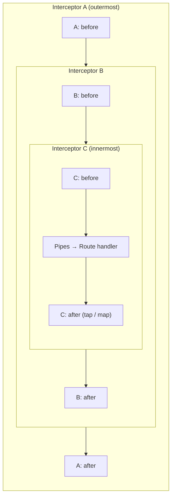

# Chapter 12 — Interceptors and the Response Pipeline

> **한눈에 보기**
> 인터셉터는 라우트 핸들러를 **양쪽에서 감싸는** 클래스입니다. 핸들러 호출 전에도, 반환된
> 스트림이 클라이언트로 나가기 전에도 코드를 끼워 넣을 수 있고, 결과를 바꾸거나 예외를
> 바꾸거나 아예 핸들러를 건너뛸 수도 있습니다. 11장의 가드가 "통과 여부"만 결정했다면,
> 인터셉터는 통과한 요청의 **처리 과정 전체**를 감쌉니다. RxJS `Observable`을 다루는 유일한
> 계층이기도 해서, 이 장은 실무에 쓰는 연산자 여섯 개를 함께 익힙니다.

**What you will learn**

- The five things an interceptor can do that no other Nest construct can, and why they all follow from one design decision.
- `NestInterceptor`, `intercept()`, `CallHandler`, and why forgetting to return `next.handle()` silently hangs the request.
- The onion model: how several interceptors nest around the handler, and the exact order of the "before" and "after" halves.
- Six RxJS operators — `tap`, `map`, `catchError`, `timeout`, `of`, `throwError` — with a worked interceptor for each.
- Complete implementations of `LoggingInterceptor`, `TransformInterceptor`, `ExcludeNullInterceptor`, `ErrorsInterceptor`, `TimeoutInterceptor`, and a short-circuiting `CacheInterceptor`.
- Binding at method, controller, and global level, and why `APP_INTERCEPTOR` is the global form that can inject.
- When to reach for an interceptor rather than middleware or an exception filter — and when the answer is "none of them".

**Why this matters**

Every API eventually grows a set of concerns that are not about any one endpoint. Every response should be wrapped in an envelope. Every request should be logged with its duration. No request should be allowed to hang for more than ten seconds. Errors from the payment provider should be translated into your own error vocabulary before they reach a client. None of that belongs in a controller, and putting it in a service means writing it forty times.

Aspect-oriented programming is the name for factoring out exactly this kind of cross-cutting concern, and an interceptor is Nest's implementation of it. What makes interceptors unusually capable is a single design decision: `intercept()` receives a `CallHandler` and must *return* the stream that comes out of it. The handler is not invoked before your code runs; it is invoked when *you* choose, by calling `next.handle()`. Everything else follows. Code before that call runs before the handler. Operators piped onto the returned Observable run after it. And if you never call it at all, the handler simply does not execute — which is how a cache interceptor works.

That power comes with an unusual requirement for a Nest beginner: you have to think in streams. `handle()` returns an RxJS `Observable`, not a promise, and the way you affect what happens "after" is by piping operators onto it. In practice you need six operators, not sixty, and each maps cleanly onto an interceptor you will actually write. This chapter teaches them through those interceptors rather than in the abstract.

The failure mode to know before you start: an interceptor that does not return the stream. `intercept()` returning `undefined`, or returning the result of `next.handle().subscribe(...)`, produces a request that never responds and never errors. It just hangs, and the stack trace tells you nothing, because nothing threw. Understanding *why* — which the next two sections explain — inoculates you against the single most common interceptor bug.

## What an interceptor can do

The official list has five entries, and they are worth reading as consequences of one mechanism rather than as five separate features:

| Capability | Mechanism |
|---|---|
| Bind extra logic **before** method execution | Code above `return next.handle()` |
| Bind extra logic **after** method execution | `.pipe(tap(...))` on the returned stream |
| **Transform the result** returned from a handler | `.pipe(map(...))` |
| **Transform the exception** thrown from a handler | `.pipe(catchError(...))` |
| **Extend** or **completely override** the handler | Return a different Observable — or never call `handle()` |

In AOP terms, the call to `next.handle()` is the *pointcut*: the exact place your additional behaviour is woven around the original method.

## The contract: `intercept`, `ExecutionContext`, `CallHandler`

```typescript
export interface NestInterceptor<T = any, R = any> {
  intercept(
    context: ExecutionContext,
    next: CallHandler<T>,
  ): Observable<R> | Promise<Observable<R>>;
}

export interface CallHandler<T = any> {
  handle(): Observable<T>;
}
```

`ExecutionContext` is the same object guards receive ([Chapter 11](./11-guards.md)) — `switchToHttp()`, `getHandler()`, `getClass()`, `getType()` all work identically, so an interceptor can read route metadata with `Reflector` exactly as a guard does. That is how you build a `@CacheKey()` or `@NoEnvelope()` decorator that an interceptor honours.

`CallHandler` has exactly one method. `handle()` invokes the rest of the chain — remaining interceptors, then pipes, then the route handler — and returns an `Observable` that emits the handler's return value once and completes. If the handler returns a promise, Nest converts it; if it returns a plain value, Nest wraps it.

The generic parameters read as "in and out": `NestInterceptor<User, UserResponse>` is an interceptor that receives a stream of `User` and produces a stream of `UserResponse`.

Note also that `intercept()` may itself be `async` and return `Promise<Observable<R>>`, which is occasionally useful when you need to await something *before* deciding whether to call `handle()`.

## Why you must return the stream

This is the load-bearing rule of the entire chapter, so here it is next to its counterexample.

```typescript
// WRONG — the request hangs forever
intercept(context: ExecutionContext, next: CallHandler) {
  console.log('Before...');
  next.handle();          // called, but the stream is discarded
}

// ALSO WRONG — subscribes, but returns a Subscription, not an Observable
intercept(context: ExecutionContext, next: CallHandler) {
  return next.handle().subscribe((data) => console.log(data));
}

// RIGHT
intercept(context: ExecutionContext, next: CallHandler): Observable<unknown> {
  console.log('Before...');
  return next.handle().pipe(tap(() => console.log('After...')));
}
```

Nest subscribes to whatever `intercept()` returns and writes the emitted value to the response. Return nothing and there is no stream to subscribe to, so no response is ever written; the socket stays open until the client times out. Nest cannot detect this for you at runtime — an interceptor that returns nothing looks exactly like one that has not finished. The defence is a compile-time one: always annotate `intercept()` with an explicit `Observable<T>` return type, and TypeScript rejects both mistakes above.

The second point is subtler: **you must not subscribe yourself**. RxJS Observables are lazy and, by default, cold — each subscription triggers the underlying work again. Subscribing inside your interceptor and also returning something for Nest to subscribe to can execute the handler twice. Pipe operators; never subscribe.

## The onion model: execution order

Multiple interceptors nest. Each one's "before" code runs on the way in, and its `pipe`d operators run on the way out — in reverse order.



Reading that: `A before → B before → C before → handler → C after → B after → A after`. It is a stack, not a queue.

The binding order that determines who is outermost is:

1. **Global** interceptors (`APP_INTERCEPTOR` providers in declaration order, then `useGlobalInterceptors()`), outermost;
2. **Controller** interceptors, in the order listed in `@UseInterceptors()`;
3. **Route** interceptors, in the order listed, innermost — closest to the handler.

The practical consequences follow directly. A global `TransformInterceptor` that wraps responses in `{ data }` is *outside* a route-level interceptor, so the route-level one sees the raw handler value and the global one sees whatever the route-level one produced. If you want the envelope applied last, it must be outermost — which is the global position. Conversely, a `TimeoutInterceptor` should be near the outside so it bounds everything inside it, while a `CacheInterceptor` wants to be far enough out that it can skip the work of the interceptors within.

Remember where the other constructs sit: guards run **before all interceptors**, and pipes run **inside** every interceptor, immediately before the handler. So a logging interceptor that measures `Date.now()` differences is measuring validation time as well as handler time — accurate for "how long did this request take", misleading for "how slow is my database".

## The six operators you need

| Operator | Import | What it does in an interceptor |
|---|---|---|
| `tap` | `rxjs/operators` | Runs a side effect on emission, error, or completion without changing the value |
| `map` | `rxjs/operators` | Replaces the emitted value — the response body |
| `catchError` | `rxjs/operators` | Intercepts an error; return a replacement stream or re-throw |
| `timeout` | `rxjs/operators` | Errors with `TimeoutError` if nothing is emitted in time |
| `of` | `rxjs` | Creates a stream that emits a value immediately — short-circuits the handler |
| `throwError` | `rxjs` | Creates a stream that errors immediately — used inside `catchError` |

Everything below is built from these.

## LoggingInterceptor — `tap`

```typescript title="logging.interceptor.ts"
import {
  Injectable, NestInterceptor, ExecutionContext, CallHandler, Logger,
} from '@nestjs/common';
import { Observable } from 'rxjs';
import { tap } from 'rxjs/operators';

@Injectable()
export class LoggingInterceptor implements NestInterceptor {
  private readonly logger = new Logger(LoggingInterceptor.name);

  intercept(context: ExecutionContext, next: CallHandler): Observable<unknown> {
    const request = context.switchToHttp().getRequest();
    const label = `${request.method} ${request.url}`;
    const started = Date.now();

    return next.handle().pipe(
      tap({
        next: () => this.logger.log(`${label} 200-range ${Date.now() - started}ms`),
        error: (err) => this.logger.warn(`${label} failed ${Date.now() - started}ms: ${err.message}`),
      }),
    );
  }
}
```

`tap` is the observer that changes nothing. Using its object form (`{ next, error }`) rather than a bare callback is the improvement worth internalising: the single-callback form fires only on success, so a naive logging interceptor silently stops logging exactly the requests you most want to see. `tap` also accepts a `complete` callback, which for a single-value HTTP response fires immediately after `next`.

## TransformInterceptor — `map` and the response envelope

Many APIs return a uniform envelope rather than a bare payload. One interceptor gives that to every endpoint at once.

```typescript title="transform.interceptor.ts"
import { Injectable, NestInterceptor, ExecutionContext, CallHandler } from '@nestjs/common';
import { Observable } from 'rxjs';
import { map } from 'rxjs/operators';

export interface Envelope<T> {
  data: T;
  meta: { requestId: string; timestamp: string };
}

@Injectable()
export class TransformInterceptor<T> implements NestInterceptor<T, Envelope<T>> {
  intercept(context: ExecutionContext, next: CallHandler<T>): Observable<Envelope<T>> {
    const request = context.switchToHttp().getRequest();
    return next.handle().pipe(
      map((data) => ({
        data,
        meta: {
          requestId: request.headers['x-request-id'] ?? 'unknown',
          timestamp: new Date().toISOString(),
        },
      })),
    );
  }
}
```

A handler returning `[]` now produces `{"data": [], "meta": {...}}`. Note the generics: `NestInterceptor<T, Envelope<T>>` documents the transformation and makes `map`'s callback fully typed.

Two caveats before you adopt this globally. **It does not apply to errors** — an exception bypasses `map` entirely and goes to the exceptions layer, so your error responses will not have the envelope unless a filter adds it too. Decide once whether the interceptor or the filter owns the response shape. And **it breaks with `@Res()`**: if a handler writes to the library-specific response object directly, Nest is no longer managing the response, `handle()` emits nothing useful, and response mapping has no effect.

> **⚠️ Notice** — Response mapping does not work with the library-specific response strategy. Using `@Res()` directly opts a handler out of the entire interceptor response pipeline.

A related one-liner from the docs, useful when a legacy client cannot cope with `null`:

```typescript title="exclude-null.interceptor.ts"
@Injectable()
export class ExcludeNullInterceptor implements NestInterceptor {
  intercept(context: ExecutionContext, next: CallHandler): Observable<unknown> {
    return next.handle().pipe(map((value) => (value === null ? '' : value)));
  }
}
```

This replaces a top-level `null` only. Nulls nested inside an object are untouched — for that you want serialization, which is [Chapter 16](../part2-intermediate/16-serialization.md). That chapter also covers `ClassSerializerInterceptor`, the built-in interceptor that applies `class-transformer` rules to your responses.

## ErrorsInterceptor — `catchError`

```typescript title="errors.interceptor.ts"
import {
  Injectable, NestInterceptor, ExecutionContext, CallHandler,
  BadGatewayException, HttpException,
} from '@nestjs/common';
import { Observable, throwError } from 'rxjs';
import { catchError } from 'rxjs/operators';

@Injectable()
export class ErrorsInterceptor implements NestInterceptor {
  intercept(context: ExecutionContext, next: CallHandler): Observable<unknown> {
    return next.handle().pipe(
      catchError((err) =>
        throwError(() =>
          err instanceof HttpException ? err : new BadGatewayException('Upstream failure'),
        ),
      ),
    );
  }
}
```

The docs' version rewrites *every* error into `BadGatewayException`, which would turn your carefully chosen `404`s into `502`s. The guard clause above is the version to use: pass through anything that is already an `HttpException`, and translate only the unexpected.

Note the shape `throwError(() => err)`. The factory form is required in RxJS 7+; passing the error directly is deprecated. And note that `catchError` must return an Observable — returning `of(fallbackValue)` instead of `throwError(...)` converts the error into a successful response, which is how you implement a graceful degradation ("if the recommendations service is down, return an empty list").

This overlaps with exception filters, and the distinction is worth stating plainly: a **filter** owns the HTTP response for an exception, and it is the right place to shape error bodies globally. An **interceptor** sits closer to the handler and can see the error *in context*, with access to the arguments and the stream, so it is the right place for retries, fallbacks, and translating a specific dependency's errors into your vocabulary. Filters shape; interceptors decide.

## TimeoutInterceptor — `timeout`

```typescript title="timeout.interceptor.ts"
import {
  Injectable, NestInterceptor, ExecutionContext, CallHandler, RequestTimeoutException,
} from '@nestjs/common';
import { Observable, throwError, TimeoutError } from 'rxjs';
import { catchError, timeout } from 'rxjs/operators';

@Injectable()
export class TimeoutInterceptor implements NestInterceptor {
  constructor(private readonly ms = 5000) {}

  intercept(context: ExecutionContext, next: CallHandler): Observable<unknown> {
    return next.handle().pipe(
      timeout(this.ms),
      catchError((err) =>
        err instanceof TimeoutError
          ? throwError(() => new RequestTimeoutException())
          : throwError(() => err),
      ),
    );
  }
}
```

After the deadline, `timeout` errors the stream and `catchError` converts the RxJS `TimeoutError` into a `408`. The `instanceof` check is essential — without it you would convert every error into a timeout.

Understand precisely what this does and does not do. It **unsubscribes** from the handler's stream, which for an Observable-based source cancels it. For a handler that returned a promise, the promise keeps running to completion in the background — the database query is not cancelled, the response is simply no longer waited for. Treat this as a *response* deadline, not a resource-management tool. Add real cancellation (an `AbortSignal`, a statement timeout) at the source when it matters.

## CacheInterceptor — `of` and stream overriding

The most striking capability: an interceptor that never calls `handle()`.

```typescript title="cache.interceptor.ts"
import { Injectable, NestInterceptor, ExecutionContext, CallHandler } from '@nestjs/common';
import { Reflector } from '@nestjs/core';
import { Observable, of } from 'rxjs';
import { tap } from 'rxjs/operators';

export const CacheKey = Reflector.createDecorator<string>();

@Injectable()
export class CacheInterceptor implements NestInterceptor {
  private readonly store = new Map<string, unknown>();

  constructor(private readonly reflector: Reflector) {}

  intercept(context: ExecutionContext, next: CallHandler): Observable<unknown> {
    const request = context.switchToHttp().getRequest();
    if (request.method !== 'GET') {
      return next.handle();
    }

    const prefix = this.reflector.get(CacheKey, context.getHandler());
    if (!prefix) {
      return next.handle();
    }

    const key = `${prefix}:${request.url}`;
    if (this.store.has(key)) {
      return of(this.store.get(key));   // handler is never invoked
    }
    return next.handle().pipe(tap((value) => this.store.set(key, value)));
  }
}
```

`of(value)` creates an Observable that emits once and completes. Returning it in place of `next.handle()` means the remaining interceptors, the pipes, and the handler never run at all — the response is produced entirely inside the interceptor. That is a genuinely different capability from anything a guard, pipe, or filter offers.

This example is deliberately naive: an unbounded `Map` with no TTL and no invalidation is a memory leak with extra steps, and per-instance state does not survive horizontal scaling. It is here to show the mechanism. The production answer — `@nestjs/cache-manager`, TTL, key strategies, and a shared Redis store — is [Chapter 27](../part2-intermediate/27-caching.md).

## Binding interceptors

`@UseInterceptors()` takes a class or an instance, and binds at method or controller level:

```typescript
@Controller('orders')
@UseInterceptors(LoggingInterceptor)
export class OrdersController {

  @Get(':id')
  @UseInterceptors(CacheInterceptor)
  @CacheKey('orders')
  findOne(@Param('id', ParseIntPipe) id: number) { /* ... */ }
}
```

As always, passing the class enables dependency injection; `@UseInterceptors(new TimeoutInterceptor(2000))` gives you per-binding configuration at the cost of injection. `TimeoutInterceptor` above is a good example of when the instance form genuinely earns its keep: different routes want different deadlines.

Global binding from `main.ts`:

```typescript
app.useGlobalInterceptors(new LoggingInterceptor());
```

with the familiar limitation — no DI, because the instance is created outside any module. The `APP_INTERCEPTOR` token fixes it:

```typescript title="app.module.ts"
import { Module } from '@nestjs/common';
import { APP_INTERCEPTOR } from '@nestjs/core';

@Module({
  providers: [
    { provide: APP_INTERCEPTOR, useClass: LoggingInterceptor },
    { provide: APP_INTERCEPTOR, useClass: TransformInterceptor },
    {
      provide: APP_INTERCEPTOR,
      useFactory: (config: ConfigService) =>
        new TimeoutInterceptor(config.get<number>('REQUEST_TIMEOUT_MS')),
      inject: [ConfigService],
    },
  ],
})
export class AppModule {}
```

The interceptor is global no matter which module declares it, several `APP_INTERCEPTOR` providers may coexist, and they run in declaration order — which, per the onion model, means the first declared is the outermost.

> **Hint** — Interceptors are providers. They can inject anything a service can, and they honour injection scopes: a `Scope.REQUEST` interceptor gets a fresh instance per request, at a measurable performance cost. See [Chapter 38](../part3-advanced/38-injection-scopes.md).

## Interceptors versus middleware versus filters

| | Middleware | Guard | Interceptor | Exception filter |
|---|---|---|---|---|
| Runs | Before everything | After middleware | Around the handler | Only on an exception |
| Knows the target handler | No | Yes | Yes | Yes |
| Sees the return value | No | No | **Yes** | No (sees the error) |
| Can change the response body | Only by writing raw | No | **Yes** | Yes |
| Can skip the handler | By not calling `next()` | By returning `false` | **By not calling `handle()`** | n/a |
| Platform-agnostic | No (Express/Fastify) | Yes | Yes | Yes |

Read the rows as a decision procedure. Need the handler's *return value*? Only an interceptor has it. Need to run for every request including unmatched routes and static files? That is middleware, because interceptors only run for matched Nest routes. Need to shape what an error looks like on the wire? A filter. Need to decide whether the request proceeds? A guard.

The one case where the answer is "none of them": logic that belongs to a single endpoint. An interceptor used by exactly one route is usually a private method wearing a costume.

## Common mistakes

1. **Forgetting to return the stream.** *Symptom:* the request hangs with no error, no log, and no response. *Cause:* `intercept()` returned `undefined`. *Fix:* `return next.handle()...`, and annotate the return type `Observable<T>` so the compiler catches it.

2. **Subscribing inside `intercept()`.** *Symptom:* handlers run twice, side effects duplicate, or the response never arrives. *Cause:* cold Observables re-execute per subscription, and a `Subscription` is not an `Observable`. *Fix:* use `pipe`, never `subscribe`.

3. **`tap(() => log())` with a single callback.** *Symptom:* successful requests are logged, failed ones vanish. *Cause:* the shorthand form only observes `next`. *Fix:* `tap({ next, error })`.

4. **A `catchError` that swallows `HttpException`.** *Symptom:* a deliberate `404` from a service reaches the client as `502`. *Cause:* blanket rewriting. *Fix:* re-throw anything already an `HttpException`.

5. **Expecting the envelope on error responses.** *Symptom:* success bodies look like `{ data: ... }`, error bodies do not. *Cause:* exceptions bypass `map` and go to the exceptions layer. *Fix:* shape errors in a filter that produces the same envelope, or accept the asymmetry deliberately.

6. **Using `@Res()` alongside a transform interceptor.** *Symptom:* the interceptor appears to do nothing on one endpoint. *Cause:* the handler took over the response object. *Fix:* return values from handlers; use `@Res({ passthrough: true })` when you only need to set a header or cookie.

7. **Wrong nesting order.** *Symptom:* a route-level interceptor sees the enveloped object instead of the raw value, or a timeout never fires. *Cause:* global is outermost, route-level innermost. *Fix:* move the interceptor to the level whose position you need.

8. **Treating `timeout()` as cancellation.** *Symptom:* the client gets `408` but the database query still runs to completion. *Cause:* unsubscribing does not abort a promise. *Fix:* propagate an `AbortSignal` or set a statement timeout at the source.

## Putting it together

A single module wiring three global interceptors in a deliberate order, plus one route-level interceptor.

```typescript title="common/interceptors/audit.interceptor.ts"
import { Injectable, NestInterceptor, ExecutionContext, CallHandler, Logger } from '@nestjs/common';
import { Observable } from 'rxjs';
import { tap } from 'rxjs/operators';

@Injectable()
export class AuditInterceptor implements NestInterceptor {
  private readonly logger = new Logger('Audit');

  intercept(context: ExecutionContext, next: CallHandler): Observable<unknown> {
    const req = context.switchToHttp().getRequest();
    const started = Date.now();
    const who = req.user?.sub ?? 'anonymous';
    const what = `${context.getClass().name}.${context.getHandler().name}`;

    return next.handle().pipe(
      tap({
        next: () => this.logger.log(`${who} ${what} ok ${Date.now() - started}ms`),
        error: (e) => this.logger.warn(`${who} ${what} ${e.constructor.name} ${Date.now() - started}ms`),
      }),
    );
  }
}
```

```typescript title="app.module.ts"
import { Module } from '@nestjs/common';
import { APP_INTERCEPTOR } from '@nestjs/core';
import { ConfigService } from '@nestjs/config';

@Module({
  imports: [OrdersModule],
  providers: [
    // Outermost: the envelope is applied last, to whatever survives below.
    { provide: APP_INTERCEPTOR, useClass: TransformInterceptor },
    // Then the deadline, bounding everything inside it.
    {
      provide: APP_INTERCEPTOR,
      useFactory: (c: ConfigService) => new TimeoutInterceptor(c.get('REQUEST_TIMEOUT_MS') ?? 5000),
      inject: [ConfigService],
    },
    // Innermost of the globals: measures handler + pipes, not the envelope.
    { provide: APP_INTERCEPTOR, useClass: AuditInterceptor },
  ],
})
export class AppModule {}
```

```typescript title="orders/orders.controller.ts"
@Controller('orders')
export class OrdersController {
  constructor(private readonly orders: OrdersService) {}

  @Get(':id')
  @UseInterceptors(CacheInterceptor)   // innermost of all
  @CacheKey('orders')
  findOne(@Param('id', ParseIntPipe) id: number) {
    return this.orders.findOne(id);
  }
}
```

Trace a cache hit on `GET /orders/7`. `TransformInterceptor` records the request id and calls down. `TimeoutInterceptor` arms its deadline and calls down. `AuditInterceptor` starts its timer and calls down. `CacheInterceptor` finds the key and returns `of(cachedOrder)` — so `ParseIntPipe` never runs and `OrdersService` is never touched. Unwinding, `AuditInterceptor` logs a sub-millisecond duration, `TimeoutInterceptor` disarms, and `TransformInterceptor` wraps the cached order in the envelope. The client cannot tell the difference from a miss, which is exactly the point.

Now trace a slow miss. The cache passes through, the handler starts, and five seconds later `timeout` errors the stream. `AuditInterceptor`'s `error` callback logs `RequestTimeoutException`, `TransformInterceptor`'s `map` is skipped entirely, and the exception reaches the filters — which is why your error envelope has to be a filter's job, not this interceptor's.

> **핵심 정리**
> - 인터셉터는 `NestInterceptor`를 구현한 `@Injectable()` 클래스이며, `intercept(context, next)`가 반환한 스트림을 Nest가 구독한다.
> - `next.handle()`을 **반드시 반환**해야 한다. 반환하지 않으면 응답 없이 무한 대기하고, 직접 `subscribe()`하면 핸들러가 두 번 실행될 수 있다.
> - `handle()` 호출 지점이 AOP의 포인트컷이다. 그 앞은 "전", `pipe`로 붙인 연산자는 "후", 호출하지 않으면 핸들러는 아예 실행되지 않는다.
> - 실행 순서는 양파 모델이다. 전역 → 컨트롤러 → 라우트 순으로 감싸며, 되돌아올 때는 역순이다.
> - 실무에 필요한 연산자는 여섯 개다. `tap`(로깅), `map`(응답 변환), `catchError`(예외 변환), `timeout`(응답 기한), `of`(단락), `throwError`(재던지기).
> - `tap`은 객체 형태 `{ next, error }`로 쓴다. 콜백 하나만 넘기면 실패한 요청은 기록되지 않는다.
> - `catchError`에서 이미 `HttpException`인 예외는 그대로 다시 던져라. 무차별 변환은 의도한 `404`를 `502`로 바꾼다.
> - 예외는 `map`을 건너뛴다. 성공 응답의 봉투와 에러 응답의 봉투는 서로 다른 계층(인터셉터/필터)이 담당한다는 사실을 인지하고 설계할 것.
> - 전역 등록은 `APP_INTERCEPTOR`로 한다. `useGlobalInterceptors()`는 DI를 받을 수 없다.
> - `@Res()`를 직접 쓰면 응답 파이프라인에서 이탈하므로 응답 변환 인터셉터가 동작하지 않는다.

> **연습 문제**
> 1. `intercept()`에서 `next.handle()`을 호출했지만 반환하지 않으면 어떤 일이 벌어지는가? 왜 오류가 아니라 "멈춤"으로 나타나는지 설명하라.
> 2. 전역 `TransformInterceptor`와 라우트 레벨 인터셉터가 있을 때, 라우트 인터셉터가 보는 값은 봉투가 씌워진 값인가 원본인가? 양파 모델로 설명하라.
> 3. **직접 만들어 보라.** `@Retry(3)` 데코레이터와 이를 읽어 실패한 핸들러를 최대 N회 재시도하는 인터셉터를 작성하라. `HttpException`은 재시도하지 말고, 재시도 간 지연을 지수적으로 늘릴 것. (힌트: `retry`, `retryWhen` 대신 `retry({ count, delay })`)
> 4. **직접 만들어 보라.** 성공 응답과 오류 응답이 **같은 봉투 형식**을 갖도록 `TransformInterceptor`와 예외 필터를 함께 설계하라. 두 계층이 봉투 정의를 중복해서 갖지 않도록 공통 타입/헬퍼를 두어야 한다.
> 5. `timeout(5000)`이 걸린 요청에서 데이터베이스 쿼리는 실제로 취소되는가? 그렇지 않다면 어떻게 해결해야 하는지 두 가지 방법을 쓰라.
> 6. 미들웨어·가드·인터셉터·예외 필터 중 하나만 쓸 수 있다면 다음 각각을 어디에 구현할지 고르고 이유를 대라: (a) 요청 ID 부여, (b) 응답 압축, (c) 결제 API 오류를 자사 오류 코드로 변환, (d) 관리자 전용 라우트 차단.

**Next:** You now have all five request-pipeline constructs. [Chapter 13 — Custom Decorators and the Complete Request Lifecycle](./13-custom-decorators-and-lifecycle.md) assembles them into one authoritative picture and shows how to build the parameter decorators — `@CurrentUser()`, `@Cookies()` — that make controllers read like the domain they serve.
