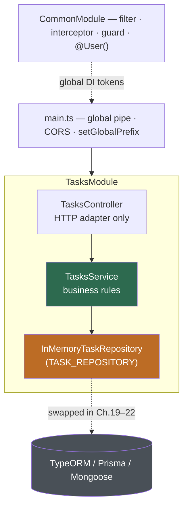

# Chapter 14 — Building Your First Complete CRUD Application

> **한눈에 보기**
> Part I의 마지막 장이자 캡스톤 프로젝트입니다. 지금까지 배운 컨트롤러, 프로바이더,
> 모듈, DI, 파이프, 가드, 인터셉터, 예외 필터, 커스텀 데코레이터를 **하나의 실행되는
> REST API**로 조립합니다. 데이터베이스는 아직 쓰지 않고 인메모리 저장소로 도메인
> 경계를 먼저 익힙니다(영속성은 19~22장). `nest g resource`의 뼈대에서 시작해 전역
> `ValidationPipe`, 예외 필터, 로깅 인터셉터, CORS, `setGlobalPrefix`, REPL, `curl`까지.

**What you will learn**

- How `nest g resource` scaffolds an entire feature slice, and which five transport layers the schematic supports.
- How to draw a module boundary so a feature can later be tested or swapped without touching the rest of the app.
- How to write an entity, a `CreateTaskDto`, and an `UpdateTaskDto` from `PartialType`, and why partial updates need their own DTO.
- How to implement a service against an in-memory repository so Chapters 19–22 can replace it by changing one line.
- How to wire a global `ValidationPipe`, exception filter, logging interceptor, CORS, and `setGlobalPrefix` in one `main.ts`.
- How to explore the *running* application with the Nest REPL, exercise every endpoint with `curl`, and see what the app still lacks before production.

**Why this matters**

You know each Nest building block in isolation. That is not the same as knowing how to build an application. The gap shows up predictably: a controller that quietly does business logic because "it was only two lines"; a service that throws `HttpException` and so cannot be reused from a queue worker; DTOs used as entities, so an internal `id` becomes writable from outside. These are *assembly* problems, and the only way to learn assembly is to assemble something.

This chapter builds one application — a task tracker — and every code block belongs to it. We stop short of a database on purpose: an in-memory store forces you to define the *shape* of your persistence boundary before committing to an ORM, so at [Chapter 19](../part2-intermediate/19-sql-with-typeorm.md) the only file that changes is the repository.

## 1. Scaffolding the project

With Node 20+ and the CLI ([Chapter 2](./02-cli-and-project-setup.md)):

```bash
$ npm i -g @nestjs/cli
$ nest new task-api --strict
$ cd task-api && npm run start:dev
```

`--strict` enables TypeScript's stricter feature set — do not skip it. The generated `src/` holds `main.ts` (the entry file, which uses `NestFactory` to create the application instance), `app.module.ts` (the root module), a sample controller/service, and their specs. `start:dev` watches, recompiles, and listens on `process.env.PORT ?? 3000`; `npm run lint` and `npm run format` are wired to ESLint and Prettier, and `npm run start -- -b swc` swaps in the SWC builder for roughly 20× faster rebuilds. Nest defaults to `@nestjs/platform-express`, with `@nestjs/platform-fastify` a drop-in alternative ([Chapter 55](../part3-advanced/55-performance-and-compilation.md)).

## 2. `nest g resource`: one command per feature

Adding a feature by hand means five steps — `nest g mo` to keep code organized, `nest g co` for CRUD routes, `nest g s` to isolate business logic, an entity for the data shape, DTOs for what goes over the network. The schematic does all five and wires them together:

```bash
$ nest g resource tasks
? What transport layer do you use? REST API
? Would you like to generate CRUD entry points? Yes
CREATE src/tasks/tasks.{controller,service,module}.ts (+ .spec.ts files)
CREATE src/tasks/dto/{create,update}-task.dto.ts
CREATE src/tasks/entities/task.entity.ts
UPDATE src/app.module.ts
```

Note the last line: the schematic registers `TasksModule` in `AppModule.imports` — the step people forget by hand, whose symptom (a 404 on a route you can plainly see) costs an afternoon. The generated controller is already a full REST surface — `@Post` → `create`, `@Get` → `findAll`, `@Get(':id')` → `findOne`, `@Patch(':id')` → `update`, `@Delete(':id')` → `remove` — each delegating to the service, with `@Param('id') id: string` converted via `+id`. We rewrite it in §6.

> **⚠️ Notice** — Generated services are **not** tied to any ORM or data source, so every method body is a placeholder string. Filling them in is your job, and it is the bulk of this chapter.

### Transport layers

The same command generates the equivalent surface for four other transports:

| Transport | Generates | Entry points become | Chapter |
|---|---|---|---|
| REST API | `*.controller.ts` | `@Get` / `@Post` / `@Patch` / `@Delete` routes | here |
| GraphQL (code first) | `*.resolver.ts` + `dto/*.input.ts` (`@InputType()`) | `@Query` / `@Mutation`; schema from classes | [50](../part3-advanced/50-graphql-fundamentals.md) |
| GraphQL (schema first) | `*.resolver.ts` + `.graphql` SDL | same, types from the SDL file | [50](../part3-advanced/50-graphql-fundamentals.md) |
| Microservice (non-HTTP) | `*.controller.ts` with message handlers | `@MessagePattern('findAllTasks')` | [45](../part3-advanced/45-microservices-fundamentals.md) |
| WebSockets | `*.gateway.ts` | `@SubscribeMessage('createTask')` | [44](../part3-advanced/44-websockets.md) |

Picking `GraphQL (code first)` yields a `@Resolver(() => Task)` class instead of a controller — `@Mutation(() => Task) createTask(@Args('createTaskInput') input: CreateTaskInput)`, `@Query(() => [Task], { name: 'tasks' }) findAll()` — wired to the *same* service, entity, and DTOs (renamed `*.input.ts`). That symmetry is the point: **the service is the application; the controller, resolver, or gateway is a transport adapter over it.**

> **Hint** — `--no-spec` skips the `.spec.ts` files. Do not use it here: [Chapter 31](../part2-intermediate/31-testing.md) picks this application up and fills those specs in.

## 3. Designing the module boundary

The rule that survives real projects: *a module owns its entity, DTOs, service, and transport adapter, and exports only the service.* It never exports its controller, and if another module must construct one of its DTOs, the boundary is wrong.



Two decisions deserve justification. **The service depends on a repository *token*, not a concrete class:** `TasksService` injects `TASK_REPOSITORY`, an interface resolving today to `InMemoryTaskRepository` and in Chapter 19 to a TypeORM class, with nothing above it changing. **Cross-cutting concerns bind through DI:** the filter and interceptor register under `APP_FILTER` and `APP_INTERCEPTOR`; `useGlobalFilters(new AllExceptionsFilter())` also works, but that instance lives outside the container and can inject nothing.

## 4. The entity and the DTOs

The entity is the shape the application owns — neither the request body nor the response body.

```typescript title="src/tasks/entities/task.entity.ts"
export type TaskStatus = 'todo' | 'in_progress' | 'done';

export class Task {
  id: number;
  title: string;
  description: string | null;
  status: TaskStatus;
  ownerId: number;
  createdAt: Date;
  updatedAt: Date;
}
```

The create DTO describes what a *client* may send. Note what is absent: `id`, `ownerId`, `createdAt`, and `updatedAt` are server-owned, and a DTO exposing them lets a client forge them.

```typescript title="src/tasks/dto/create-task.dto.ts"
import { IsEnum, IsOptional, IsString, MaxLength, MinLength } from 'class-validator';
import { TaskStatus } from '../entities/task.entity';

export class CreateTaskDto {
  @IsString() @MinLength(1) @MaxLength(120)
  title: string;

  @IsOptional() @IsString() @MaxLength(2000)
  description?: string;

  @IsOptional() @IsEnum(['todo', 'in_progress', 'done'])
  status?: TaskStatus;
}
```

Install `class-validator`, `class-transformer`, and `@nestjs/mapped-types`.

### Partial updates and `PartialType`

`PATCH` means "change the fields I sent, leave the rest alone", so its DTO must make **every** field optional — and re-declaring them with `@IsOptional()` duplicates every constraint, so the copies drift.

```typescript title="src/tasks/dto/update-task.dto.ts"
import { PartialType } from '@nestjs/mapped-types';
import { CreateTaskDto } from './create-task.dto';

export class UpdateTaskDto extends PartialType(CreateTaskDto) {}
```

`PartialType` returns a new class with the same properties and validators, each additionally optional. Send `{"title":"x"}` and only `title` is validated; send `{"title":""}` and `@MinLength(1)` still rejects it — optional does not mean unvalidated.

> **Hint** — `PartialType` ships in `@nestjs/mapped-types` for plain REST and in `@nestjs/swagger` when the OpenAPI schema should follow ([Chapter 30](../part2-intermediate/30-openapi-advanced.md)); `PickType`, `OmitType`, and `IntersectionType` are its siblings. Never use `Partial<CreateTaskDto>` — the TS utility type erases at compile time, so nothing is validated.

## 5. The repository and the service

```typescript title="src/tasks/task.repository.ts"
import { Injectable } from '@nestjs/common';
import { Task } from './entities/task.entity';

export const TASK_REPOSITORY = 'TASK_REPOSITORY';

export interface TaskRepository {
  nextId(): number;
  findAll(ownerId: number): Promise<Task[]>;
  findById(id: number): Promise<Task | null>;
  save(task: Task): Promise<Task>;
  delete(id: number): Promise<boolean>;
}

@Injectable()
export class InMemoryTaskRepository implements TaskRepository {
  private readonly rows = new Map<number, Task>();
  private sequence = 0;

  nextId() { return ++this.sequence; }

  async findAll(ownerId: number) {
    return [...this.rows.values()].filter((t) => t.ownerId === ownerId);
  }
  async findById(id: number) { return this.rows.get(id) ?? null; }
  async save(task: Task) { this.rows.set(task.id, { ...task }); return { ...task }; }
  async delete(id: number) { return this.rows.delete(id); }
}
```

Every method is `async` although nothing awaits — deliberately, so that when a real database replaces this, no signature and no caller changes. The service holds the business rules and owns the errors:

```typescript title="src/tasks/tasks.service.ts"
import { Inject, Injectable, NotFoundException } from '@nestjs/common';
import { CreateTaskDto } from './dto/create-task.dto';
import { UpdateTaskDto } from './dto/update-task.dto';
import { Task } from './entities/task.entity';
import { TASK_REPOSITORY, TaskRepository } from './task.repository';


@Injectable()
export class TasksService {
  constructor(@Inject(TASK_REPOSITORY) private readonly repo: TaskRepository) {}

  async create(dto: CreateTaskDto, ownerId: number): Promise<Task> {
    const now = new Date();
    return this.repo.save({
      id: this.repo.nextId(),
      title: dto.title,
      description: dto.description ?? null,
      status: dto.status ?? 'todo',
      ownerId,
      createdAt: now,
      updatedAt: now,
    });
  }

  findAll(ownerId: number): Promise<Task[]> {
    return this.repo.findAll(ownerId);
  }

  async findOne(id: number, ownerId: number): Promise<Task> {
    const task = await this.repo.findById(id);
    if (!task || task.ownerId !== ownerId) {
      throw new NotFoundException(`Task ${id} not found`);
    }
    return task;
  }

  async update(id: number, dto: UpdateTaskDto, ownerId: number): Promise<Task> {
    const existing = await this.findOne(id, ownerId);
    return this.repo.save({ ...existing, ...dto, updatedAt: new Date() });
  }

  async remove(id: number, ownerId: number): Promise<void> {
    await this.findOne(id, ownerId);
    await this.repo.delete(id);
  }
}
```

Three details. `update` and `remove` read through `findOne`, so ownership is enforced in one place. A task belonging to someone else returns **404, not 403** — "it exists but is not yours" leaks information. And `remove` returns `void`, pairing with the route's `204 No Content`.

## 6. The controller

The controller binds a route, extracts inputs, calls the service, and picks a status code — nothing else.

```typescript title="src/tasks/tasks.controller.ts"
import { Body, Controller, Delete, Get, HttpCode, HttpStatus, Param, ParseIntPipe, Patch, Post } from '@nestjs/common';
import { TasksService } from './tasks.service';
import { CreateTaskDto } from './dto/create-task.dto';
import { UpdateTaskDto } from './dto/update-task.dto';
import { AuthenticatedUser, User } from '../common/user.decorator';

@Controller('tasks')
export class TasksController {
  constructor(private readonly tasksService: TasksService) {}

  @Get('me/summary')                      // static segment BEFORE ':id'
  async summary(@User() u: AuthenticatedUser) {
    return { owner: u.firstName, total: (await this.tasksService.findAll(u.id)).length };
  }

  @Post()
  create(@Body() dto: CreateTaskDto, @User('id') owner: number) {
    return this.tasksService.create(dto, owner);        // 201 by default
  }

  @Get()
  findAll(@User('id') owner: number) {
    return this.tasksService.findAll(owner);
  }

  @Get(':id')
  findOne(@Param('id', ParseIntPipe) id: number, @User('id') owner: number) {
    return this.tasksService.findOne(id, owner);
  }

  @Patch(':id')
  update(
    @Param('id', ParseIntPipe) id: number,
    @Body() dto: UpdateTaskDto,
    @User('id') owner: number,
  ) {
    return this.tasksService.update(id, dto, owner);
  }

  @Delete(':id')
  @HttpCode(HttpStatus.NO_CONTENT)
  remove(@Param('id', ParseIntPipe) id: number, @User('id') owner: number) {
    return this.tasksService.remove(id, owner);         // 204, empty body
  }
}
```

The status codes are not arbitrary:

| Route | Status | Why |
|---|---|---|
| `POST /tasks` | 201 Created | Nest's default for `@Post()`. |
| `GET /tasks` | 200 OK | An empty list is `[]` with 200, never 404. |
| `GET /tasks/:id` | 200 / 404 | `NotFoundException` from the service. |
| `PATCH /tasks/:id` | 200 OK | Returns the updated resource. |
| `DELETE /tasks/:id` | 204 No Content | `@HttpCode` overrides the default 200; body must be empty. |
| bad body / non-numeric `:id` | 400 | Global `ValidationPipe` / `ParseIntPipe`. |

> **⚠️ Notice** — `@Get('me/summary')` sits **above** `@Get(':id')` on purpose: routes match in declaration order, so a dynamic segment declared first swallows every static sibling.

## 7. The `@User()` decorator and a stand-in guard

Part I has not covered real authentication ([Chapter 23](../part2-intermediate/23-authentication.md) does), but the app needs an owner per request. Reuse the decorator from [Chapter 13](./13-custom-decorators-and-lifecycle.md) with a deliberately trivial header guard, labelled temporary.

```typescript title="src/common/user.decorator.ts"
import { createParamDecorator, ExecutionContext } from '@nestjs/common';

export interface AuthenticatedUser { id: number; firstName: string }

export const User = createParamDecorator(
  (data: keyof AuthenticatedUser | undefined, ctx: ExecutionContext) => {
    const u: AuthenticatedUser | undefined = ctx.switchToHttp().getRequest().user;
    return data ? u?.[data] : u;
  },
);
```

```typescript title="src/common/dev-auth.guard.ts"
import { CanActivate, ExecutionContext, Injectable, UnauthorizedException } from '@nestjs/common';

/** TEMPORARY. Replaced by a real JWT guard in Chapter 23. */
@Injectable()
export class DevAuthGuard implements CanActivate {
  canActivate(context: ExecutionContext): boolean {
    const request = context.switchToHttp().getRequest();
    const [id, firstName] = String(request.headers['x-user'] ?? '').split(':');
    if (!Number.isInteger(Number(id)) || !id) {
      throw new UnauthorizedException('Missing or malformed X-User header');
    }
    request.user = { id: Number(id), firstName: firstName ?? 'anonymous' };
    return true;
  }
}
```

Because it is a guard it runs before pipes and the handler, so `@User('id')` always has a value on a protected route — the Chapter 13 lifecycle rule paying rent.

## 8. Cross-cutting concerns: filter and interceptor

One filter turns every uncaught error into one predictable JSON envelope — clients should never parse two error shapes.

```typescript title="src/common/all-exceptions.filter.ts"
import { ArgumentsHost, Catch, ExceptionFilter, HttpException, HttpStatus, Logger } from '@nestjs/common';

@Catch()
export class AllExceptionsFilter implements ExceptionFilter {
  private readonly logger = new Logger(AllExceptionsFilter.name);

  catch(exception: unknown, host: ArgumentsHost) {
    const ctx = host.switchToHttp();
    const response = ctx.getResponse();
    const request = ctx.getRequest();

    const http = exception instanceof HttpException;
    const status = http ? exception.getStatus() : HttpStatus.INTERNAL_SERVER_ERROR;
    const payload = http ? exception.getResponse() : 'Internal server error';
    if (status >= 500) {
      this.logger.error(`${request.method} ${request.url}`, (exception as Error)?.stack);
    }
    response.status(status).json({
      statusCode: status,
      path: request.url,
      timestamp: new Date().toISOString(),
      error: typeof payload === 'string' ? { message: payload } : payload,
    });  // one envelope for every failure
  }
}
```

`@Catch()` with no arguments catches everything, including non-`Error` values thrown by accident. Only 5xx gets a stack trace; logging every 404 buries real failures.

```typescript title="src/common/logging.interceptor.ts"
import { CallHandler, ExecutionContext, Injectable, Logger, NestInterceptor } from '@nestjs/common';
import { Observable, tap } from 'rxjs';

@Injectable()
export class LoggingInterceptor implements NestInterceptor {
  private readonly logger = new Logger('HTTP');

  intercept(ctx: ExecutionContext, next: CallHandler): Observable<unknown> {
    const { method, url } = ctx.switchToHttp().getRequest();
    const started = Date.now();
    return next.handle().pipe(
      tap({
        next: () => this.logger.log(`${method} ${url} ${Date.now() - started}ms`),
        error: (e) => this.logger.warn(`${method} ${url} ${Date.now() - started}ms — ${e.message}`),
      }),
    );
  }
}
```

Remember from Chapter 13: this sees pipe, handler, and service errors but **not** guard rejections — no `X-User` header yields a 401 with no log line here. Extend the filter for a full access log ([Chapter 18](../part2-intermediate/18-logging.md)).

Both bind globally through `CommonModule`, whose only job is two provider entries:

```typescript title="src/common/common.module.ts (imports elided)"
@Module({
  providers: [
    { provide: APP_FILTER, useClass: AllExceptionsFilter },
    { provide: APP_INTERCEPTOR, useClass: LoggingInterceptor },
  ],
})
export class CommonModule {}
```

## 9. Wiring the modules

```typescript title="src/tasks/tasks.module.ts (imports elided)"
@Module({
  controllers: [TasksController],
  providers: [
    TasksService,
    { provide: TASK_REPOSITORY, useClass: InMemoryTaskRepository },
    { provide: APP_GUARD, useClass: DevAuthGuard },
  ],
  exports: [TasksService],
})
export class TasksModule {}
```

`AppModule` is then just `@Module({ imports: [CommonModule, TasksModule] })`. One line above deserves inspection — `{ provide: TASK_REPOSITORY, useClass: InMemoryTaskRepository }` — because that is the seam: Chapter 19 changes `useClass` and nothing else.

## 10. `main.ts`: global pipe, CORS, and the global prefix

```typescript title="src/main.ts"
import { NestFactory } from '@nestjs/core';
import { Logger, RequestMethod, ValidationPipe } from '@nestjs/common';
import { AppModule } from './app.module';

async function bootstrap() {
  const app = await NestFactory.create(AppModule);

  app.useGlobalPipes(
    new ValidationPipe({
      whitelist: true,             // strip properties with no decorator
      forbidNonWhitelisted: true,  // 400 instead of silently stripping
      transform: true,             // plain object -> DTO class instance
      transformOptions: { enableImplicitConversion: true },
    }),
  );

  app.enableCors({
    origin: ['http://localhost:5173'],
    methods: ['GET', 'POST', 'PATCH', 'DELETE'],
    allowedHeaders: ['Content-Type', 'X-User'],
    credentials: true,
  });

  app.setGlobalPrefix('api/v1', {
    exclude: [{ path: 'health', method: RequestMethod.GET }],
  });

  await app.listen(process.env.PORT ?? 3000);
  Logger.log('Listening on /api/v1', 'Bootstrap');
}
bootstrap();
```

**`whitelist` + `forbidNonWhitelisted`.** Without `whitelist`, a client POSTs `{"title":"x","ownerId":999}` and — because `update` spreads `dto` — writes a field it must not own. `whitelist` strips undecorated properties; `forbidNonWhitelisted` turns the strip into a 400 so the client learns instead of silently losing data. **`transform: true`** builds a real `CreateTaskDto` instance, which is what makes class-level validation and `@Transform()` work; `enableImplicitConversion` also coerces query and param strings to the declared primitive.

**CORS and the prefix.** `enableCors()` with no arguments allows every origin — fine locally, wrong in production. `allowedHeaders` must include `X-User`, or the browser preflight fails while `curl` keeps working ([Chapter 26](../part2-intermediate/26-web-security-hardening.md)). `setGlobalPrefix('api/v1')` prefixes every registered route; `exclude` keeps chosen routes off it, because load balancers hit `/health` and are never versioned. A plain string excludes a path for every method: `{ exclude: ['health'] }`.

> **⚠️ Notice** — In Nest 11 (Express v5, `path-to-regexp` v8) `path` does **not** accept bare asterisk wildcards. Use parameters (`:param`) or named wildcards (`*splat`) instead of `*` — a frequent v10 → v11 migration break ([Chapter 59](../part3-advanced/59-migration-and-ecosystem.md)).

## 11. Exploring the running app with the REPL

You have an application you cannot see inside. The REPL boots the DI container without an HTTP listener and hands you the graph.

```typescript title="src/repl.ts"
import { repl } from '@nestjs/core';
import { AppModule } from './app.module';

async function bootstrap() {
  const replServer = await repl(AppModule);          // a Node.js REPL server
  replServer.setupHistory('.nestjs_repl_history', (e) => e && console.error(e));
}
bootstrap();
```

Start it with `npm run start -- --entryFile repl`; `LOG REPL initialized` means the container is up. `debug()` prints every registered module with its controllers and providers — the fastest way to confirm a provider is registered where you think. `get(Token)` (aliased `$`) resolves an instance whose methods you can `await`, and `methods(Token)` lists a class's public surface:

```typescript
> debug()
TasksModule:
 - controllers:
  ◻ TasksController
 - providers:
  ◻ TasksService  ◻ TASK_REPOSITORY  ◻ APP_GUARD
> service = get(TasksService)
TasksService { repo: InMemoryTaskRepository {} }
> await service.create({ title: 'Write chapter 14' }, 1)
{ id: 1, title: 'Write chapter 14', description: null, status: 'todo', ownerId: 1, ... }
> await service.findOne(99, 1)
Uncaught NotFoundException: Task 99 not found
> methods(TasksService)

Methods:
 ◻ create  ◻ findAll  ◻ findOne  ◻ update  ◻ remove
```

`help()` lists every native function; `<fn>.help` prints one signature:

| Function | Description | Signature |
|---|---|---|
| `debug` | modules + their controllers and providers | `debug(moduleCls?: ClassRef \| string) => void` |
| `get` / `$` | an injectable or controller instance | `get(token: InjectionToken) => any` |
| `methods` | public methods of a class | `methods(token: ClassRef \| string) => void` |
| `resolve` | a transient or request-scoped instance | `resolve(token, contextId) => Promise<any>` |
| `select` | navigate to another module | `select(token) => INestApplicationContext` |

Add `--watch` to reload on every save; without `setupHistory`, each reload discards your command history.

## 12. Testing it by hand with `curl`

With `npm run start:dev` running, work through the surface. Every request carries the `X-User` header.

```bash
BASE=http://localhost:3000/api/v1
AUTH='X-User: 1:Alan'; JSON='Content-Type: application/json'

curl -i -X POST "$BASE/tasks" -H "$AUTH" -H "$JSON" \
     -d '{"title":"Write chapter 14","description":"Capstone"}'  # 201 + entity
curl -s "$BASE/tasks"            -H "$AUTH"    # 200, array of one
curl -s "$BASE/tasks/1"          -H "$AUTH"    # 200
curl -s "$BASE/tasks/me/summary" -H "$AUTH"    # 200, aggregate
curl -s -X PATCH  "$BASE/tasks/1" -H "$AUTH" -H "$JSON" -d '{"status":"in_progress"}'
curl -i -X DELETE "$BASE/tasks/1" -H "$AUTH"   # 204, empty body
```

Then the failure paths, the part people forget to test:

```bash
curl -s -X POST "$BASE/tasks" -H "$AUTH" -H "$JSON" -d '{"title":""}'
       # 400 — title too short (ValidationPipe)
curl -s -X POST "$BASE/tasks" -H "$AUTH" -H "$JSON" -d '{"title":"ok","ownerId":999}'
       # 400 — unknown property (forbidNonWhitelisted)
curl -s "$BASE/tasks/abc" -H "$AUTH"          # 400 — ParseIntPipe
curl -s "$BASE/tasks/1" -H 'X-User: 2:Grace'  # 404 — someone else's task
curl -s "$BASE/tasks"                         # 401 — and NO interceptor log line
```

Every one comes back in the same envelope — `{"statusCode":400,"path":"/api/v1/tasks","timestamp":"2026-08-27T09:12:44.019Z","error":{"message":["property ownerId should not exist"]}}` — which is the whole reason the filter is bound globally.

## Common mistakes

1. **Forgetting to register the feature module.** *Symptom:* every route 404s though the controller exists. *Cause:* `TasksModule` is not in `AppModule.imports`. *Fix:* import it — `nest g resource` does this for you.
2. **Declaring a static route after a dynamic one.** *Symptom:* `GET /tasks/summary` returns 400 from `ParseIntPipe`. *Cause:* `@Get(':id')` matched first. *Fix:* declare static segments above dynamic ones.
3. **`Partial<CreateTaskDto>` instead of `PartialType(CreateTaskDto)`.** *Symptom:* PATCH accepts anything. *Cause:* the TS utility type erases at runtime, leaving no validation metadata. *Fix:* extend `PartialType()`.
4. **`ValidationPipe` without `whitelist`.** *Symptom:* a client sets `ownerId` or `id` on create. *Cause:* undecorated properties pass through and get spread into the entity. *Fix:* `whitelist: true` plus `forbidNonWhitelisted: true`.
5. **`enableCors()` with no options in production.** *Symptom:* any site can call your API with the user's cookies. *Cause:* the default is `origin: '*'`. *Fix:* an explicit origin allow-list. Related: returning a body from a `@HttpCode(204)` route — return `void`, as `remove()` does.

## Putting it together

The final tree, with every file this chapter produced:

```text
src/  main.ts · repl.ts · app.module.ts
      common/  common.module.ts (APP_FILTER + APP_INTERCEPTOR)
               all-exceptions.filter.ts · logging.interceptor.ts
               dev-auth.guard.ts (TEMPORARY — Ch.23) · user.decorator.ts (Ch.13)
      tasks/   tasks.module.ts (TASK_REPOSITORY + APP_GUARD)
               tasks.controller.ts · tasks.service.ts · task.repository.ts
               entities/task.entity.ts
               dto/create-task.dto.ts · dto/update-task.dto.ts
```

Trace one `POST /api/v1/tasks` and all of Part I appears in order: `DevAuthGuard` ([11](./11-guards.md)) attaches the user → `LoggingInterceptor` ([12](./12-interceptors.md)) starts its timer → `ValidationPipe` ([10](./10-pipes-and-validation.md)) validates `CreateTaskDto` → `@User('id')` ([13](./13-custom-decorators-and-lifecycle.md)) supplies the owner → `TasksController` ([3](./03-controllers-routing.md), [4](./04-controllers-responses.md)) calls `TasksService` ([5](./05-providers-and-services.md)), injected by token ([7](./07-dependency-injection-basics.md)) from `TasksModule` ([6](./06-modules.md)) → the interceptor logs the duration → `AllExceptionsFilter` ([9](./09-exception-filters.md)) shapes whatever went wrong.

### What a production version still needs

| Missing | Why it matters | Chapter |
|---|---|---|
| Real persistence | a `Map` dies with the process | [19](../part2-intermediate/19-sql-with-typeorm.md)–[22](../part2-intermediate/22-prisma.md) |
| Real authentication | `X-User` is trivially forged | [23](../part2-intermediate/23-authentication.md), [24](../part2-intermediate/24-passport-strategies.md) |
| Authorization rules | ownership checks are ad hoc | [25](../part2-intermediate/25-authorization.md) |
| Environment config | port and origins are hard-coded | [17](../part2-intermediate/17-configuration.md) |
| Serialization, logging, caching | entities are raw; `Logger` prints for humans; `findAll` returns everything | [16](../part2-intermediate/16-serialization.md), [18](../part2-intermediate/18-logging.md), [27](../part2-intermediate/27-caching.md) |
| Helmet, CSRF, rate limiting | CORS alone is not hardening | [26](../part2-intermediate/26-web-security-hardening.md) |
| API documentation | no OpenAPI schema | [29](../part2-intermediate/29-openapi-fundamentals.md), [30](../part2-intermediate/30-openapi-advanced.md) |
| Tests | the `.spec.ts` files are still empty | [31](../part2-intermediate/31-testing.md) |
| Health checks, deployment | `/health` is excluded but unimplemented | [56](../part3-advanced/56-observability.md), [58](../part3-advanced/58-deployment-and-serverless.md) |

> **핵심 정리**
> - `nest g resource`는 모듈·컨트롤러·서비스·엔티티·DTO·스펙을 한 번에 만들고 `AppModule`의 `imports`까지 갱신하며, REST·GraphQL(code/schema first)·마이크로서비스·WebSocket 다섯 트랜스포트를 지원한다. 다만 생성된 서비스 본문은 전부 플레이스홀더다.
> - 엔티티·`CreateXDto`·`UpdateXDto`는 서로 다른 세 가지다. 부분 수정 DTO는 `PartialType(CreateXDto)`로 만들라. `Partial<T>`는 런타임에 사라져 검증이 전혀 동작하지 않는다.
> - 서비스는 구체 클래스가 아니라 **토큰**(`TASK_REPOSITORY`)에 의존시켜라. 19~22장에서 `useClass` 한 줄만 바꾸면 실제 DB로 교체된다.
> - 전역 `ValidationPipe`에는 `whitelist`, `forbidNonWhitelisted`, `transform`을 함께 켜라. 하나만 빠져도 클라이언트가 서버 소유 필드를 위조할 수 있다.
> - 필터·인터셉터는 `APP_FILTER`/`APP_INTERCEPTOR`로 등록하라. `useGlobalFilters(new X())` 인스턴스는 DI 컨테이너 밖이라 아무것도 주입받지 못한다.
> - `setGlobalPrefix('api/v1', { exclude: [...] })`로 헬스 체크는 버전 접두사에서 빼라. v11에서는 `*` 대신 `:param`·`*splat`을 쓴다.
> - REPL(`--entryFile repl`)의 `debug()`, `get()`, `methods()`는 HTTP 없이 DI 그래프를 확인하는 가장 빠른 방법이다. 정적 경로(`me/summary`)는 동적 경로(`:id`)보다 먼저 선언하라.

> **연습 문제**
> 1. `nest g resource projects`를 `GraphQL (code first)`와 `REST API`로 각각 실행하고 생성 파일 목록을 비교하라. 두 트랜스포트가 **공유하는** 파일은 무엇이며 그것이 아키텍처적으로 무엇을 뜻하는가?
> 2. `whitelist: true`를 잠시 끄고 `{"title":"ok","ownerId":999}`를 POST하라. 응답과 이후 `GET /tasks` 결과가 어떻게 달라지는지 기록하고 왜 보안 문제인지 설명하라.
> 3. **직접 구현:** `GET /api/v1/tasks`에 `?status=todo&limit=10` 필터를 추가하라. 쿼리 전용 `FindTasksQueryDto`를 만들고 `enableImplicitConversion` 덕분에 `limit`이 `number`로 들어오는지 확인하라.
> 4. **직접 구현:** `/health` 라우트를 가진 `HealthController`를 만들고, `exclude` 덕분에 `/api/v1/health`가 아니라 `/health`에서 응답하는지 `curl`로 검증하라. 이어서 REPL의 `debug()`로 등록을 확인하고, `X-User` 없이 요청할 때 `LoggingInterceptor` 로그가 찍히지 않는 이유를 13장 라이프사이클 표로 설명하라.

**Next:** Part I ends here. [Chapter 15 — Validation in Depth](../part2-intermediate/15-validation-in-depth.md) opens Part II by taking apart the `ValidationPipe` you just bound globally: every `class-validator` decorator, `class-transformer`'s `@Transform` and `@Type`, and custom constraints.
