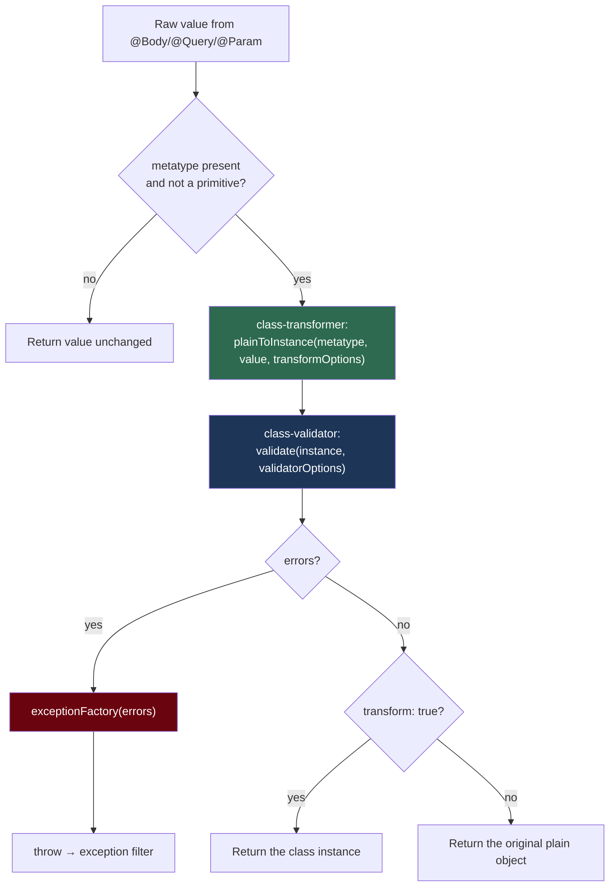

# Chapter 15 — Validation in Depth: class-validator, class-transformer, and Custom Pipes

> **한눈에 보기**
> 10장에서 `ValidationPipe`를 "켜는" 법을 배웠다면, 이 장은 그 파이프가 **실제로 무슨 일을
> 하는지**를 옵션 하나하나까지 분해합니다. `whitelist`가 막는 공격, `transform`이 조용히 값을
> 바꿔 버리는 함정, 중첩 객체가 검증되지 않는 이유, 검증 그룹과 조건부 검증, DI를 쓰는 비동기
> 커스텀 검증기까지 다룬 뒤, 프로젝트 전체가 공유할 에러 응답 규격을 직접 설계합니다.

**What you will learn**

- What `ValidationPipe` runs per request — `plainToInstance` → `validate` → `exceptionFactory` — and why each stage fails differently.
- Every `ValidationPipe` option, including the three that silently change your data (`transform`, `enableImplicitConversion`, `whitelist`) and the one with a security history (`forbidUnknownValues`).
- Why `@ValidateNested()` without `@Type()` validates nothing, and why an array-typed body is invisible to the validator.
- How to build `create` / `update` DTO families with `PartialType`, `PickType`, `OmitType`, and `IntersectionType` without duplicating a decorator.
- How to write a `@ValidatorConstraint` class, an async database-backed validator wired through `useContainer()`, and a typed decorator with `registerDecorator`.
- How to replace the default `400` body with one project-wide error shape, and how to run the same rules for WebSocket and microservice handlers.

**Why this matters**

There is a category of production incident that looks like a database bug and is a validation bug. A row appears whose `quantity` is `NaN`, because a client sent `"3 boxes"`. A `PATCH /users/me` hands `req.body` to `repository.save()`, and a curious user discovers `"role": "admin"` works. Both are closed by configuration you will write in the first ten minutes of this chapter.

The deeper reason to spend a chapter here is that `ValidationPipe` is **two libraries in a trench coat**. `class-transformer` turns the plain JSON object Express handed you into an instance of your DTO class, coercing types on the way. Only then does `class-validator` walk that instance's decorator metadata and produce errors. Almost every confusing behaviour comes from not knowing which library is responsible: `"1"` becoming `1` is class-transformer; `"must be an integer"` is class-validator; a nested object being skipped is *both*, because the transformer left it plain and the validator therefore found no metadata to read. Validation is also where your public contract gets written in executable form — documentation that cannot go stale, the input to your OpenAPI schema ([Chapter 29](./29-openapi-fundamentals.md)), and the boundary that lets every layer beneath the controller stop writing defensive checks.

## The two libraries and the order they run in

Install both — they are peer dependencies of the pipe, not of Nest:

```bash
$ npm i --save class-validator class-transformer
```

`ValidationPipe` is exported from `@nestjs/common`. Per decorated argument, it does this:



Four consequences that explain most questions about this pipe:

1. **The instance is always created**, even when `transform` is `false`; `transform` only decides whether it reaches your handler. So with `transform: false`, a `@Transform()` that normalises a value has *no effect on your handler argument*.
2. **`whitelist` stripping happens inside class-validator**, which returns a sanitised object — so `whitelist: true` strips even with `transform: false`.
3. **If `metatype` is missing or primitive, the pipe returns early.** Declare a DTO as an `interface` and you get zero validation and zero errors, silently. Use classes, never `import type`.
4. **Errors are `ValidationError` trees, not strings.** The default factory flattens them; anything richer is your job.

## Turning it on

Bind globally in `main.ts` so no endpoint can be forgotten:

```typescript title="main.ts"
import { NestFactory } from '@nestjs/core';
import { ValidationPipe } from '@nestjs/common';
import { AppModule } from './app.module';

async function bootstrap() {
  const app = await NestFactory.create(AppModule);
  app.useGlobalPipes(
    new ValidationPipe({
      whitelist: true,
      forbidNonWhitelisted: true,
      transform: true,
      transformOptions: { enableImplicitConversion: false },
    }),
  );
  await app.listen(process.env.PORT ?? 3000);
}
bootstrap();
```

That options object is the recommendation of this book; the rest of the chapter justifies every entry — including why `enableImplicitConversion` is off.

```typescript title="users/dto/create-user.dto.ts"
import { IsEmail, IsNotEmpty, IsString, MinLength } from 'class-validator';

export class CreateUserDto {
  @IsEmail()
  email: string;

  @IsNotEmpty() @IsString()
  @MinLength(12, { message: 'password must be at least 12 characters' })
  password: string;
}
```

With `create(@Body() dto: CreateUserDto)` in the controller, a bad email produces `{"statusCode":400,"error":"Bad Request","message":["email must be an email"]}` and no code in the handler. The same pipe validates `@Param()` and `@Query()` — path parameters are user input like any other, so a `FindOneParams` class with `@IsNumberString() id: string` is worth writing.

> **Hint** — Note the missing argument: `@Param()` with no key yields the whole params object, which is what a params *class* validates. `@Param('id')` yields a string whose metatype is `String`, and the pipe skips it.

## The complete option table

`ValidationPipeOptions` extends class-validator's `ValidatorOptions`, so the surface is larger than the Nest-specific part:

```typescript
export interface ValidationPipeOptions extends ValidatorOptions {
  transform?: boolean;
  transformOptions?: ClassTransformOptions;
  disableErrorMessages?: boolean;
  exceptionFactory?: (errors: ValidationError[]) => any;
  errorHttpStatusCode?: ErrorHttpStatusCode;
  expectedType?: Type<any>;
  validateCustomDecorators?: boolean;
  errorFormat?: 'list' | 'grouped';
}
```

**Nest-specific options:**

| Option | Default | Effect |
|---|---|---|
| `transform` | `false` | Return the class instance instead of the plain object; also enables primitive coercion for `@Param`/`@Query`. |
| `transformOptions` | `{}` | Passed to `plainToInstance` — notably `enableImplicitConversion`, `excludeExtraneousValues`, `exposeDefaultValues`, `groups`. |
| `disableErrorMessages` | `false` | Strip messages from the response. The `400` still happens; the client learns nothing. |
| `errorHttpStatusCode` | `400` | Status the thrown exception carries, e.g. `HttpStatus.UNPROCESSABLE_ENTITY`. |
| `exceptionFactory` | built-in | Receives raw `ValidationError[]`, returns the exception to throw. The most useful hook here. |
| `expectedType` | — | Override the metatype: validate against *this* class whatever the parameter is annotated as. |
| `validateCustomDecorators` | `false` | Also validate arguments from custom parameter decorators (`metadata.type === 'custom'`), so `@CurrentUser()` is not validated by accident. |
| `errorFormat` | `'list'` | `'list'` → `message: string[]`. `'grouped'` → property paths as keys with your custom messages unmodified (no parent-path prefixing). |

**Inherited class-validator options:**

| Option | Default | Effect |
|---|---|---|
| `whitelist` | `false` | Strip every property carrying **no** validation decorator. |
| `forbidNonWhitelisted` | `false` | With `whitelist`, throw instead of stripping. |
| `forbidUnknownValues` | `true` | Fail immediately when asked to validate an object with no registered metadata. |
| `skipMissingProperties` | `false` | Skip properties that are `null` **or** `undefined`. |
| `skipUndefinedProperties` / `skipNullProperties` | `false` | Skip only one of the two. |
| `groups` | `[]` | Run only decorators in these validation groups. |
| `always` | `false` | Default for each decorator's `always` option — run it even when groups do not match. |
| `strictGroups` | `false` | When `groups` is empty, ignore decorators that declare any group. |
| `dismissDefaultMessages` | `false` | Suppress library defaults; only explicit `message` options survive. |
| `stopAtFirstError` | `false` | Stop validating a property after its first failing constraint. |
| `validationError.target` | `true` | Include the validated object in each `ValidationError`. |
| `validationError.value` | `true` | Include the offending value in each `ValidationError`. |
| `enableDebugMessages` | `false` | Print extra warnings when something looks misconfigured. |

Two deserve immediate attention. **`validationError.target` and `validationError.value` should be `false` in production**: by default each error carries a back-reference to the whole DTO and the raw value, so a naive `exceptionFactory` or logger writes the submitted password into your logs and possibly your HTTP response. Turned off, errors shrink to `{ property, constraints, children }`.

**`forbidUnknownValues` defaults to `true` since class-validator 0.14** and should stay there. It was historically `false`, and that combined with a metadata-less object meant `validate()` returned zero errors — an unknown payload passing as valid. If advice tells you to set it `false`, the real problem is a missing DTO class or a missing `@Type()`.

```typescript
new ValidationPipe({
  whitelist: true,
  forbidNonWhitelisted: true,
  transform: true,
  stopAtFirstError: true,
  validationError: { target: false, value: false },
  errorHttpStatusCode: HttpStatus.UNPROCESSABLE_ENTITY,
});
```

## Stripping properties, and the attack it stops

```typescript
// WRONG — mass assignment
@Patch('me')
async update(@CurrentUser() user: User, @Body() dto: UpdateProfileDto) {
  return this.repo.save({ ...user, ...dto });   // dto may carry anything
}
```

`UpdateProfileDto` declares `displayName` and `bio`. With the default `whitelist: false`, `dto` **is the raw body**, so `{"displayName":"x","role":"admin"}` sets `role`. The DTO type said otherwise, but TypeScript types do not exist at runtime.

`whitelist: true` removes every undecorated property, so `role` never reaches the handler. `forbidNonWhitelisted: true` upgrades the silent removal to a `400` naming the offender: `["property role should not exist"]`.

Silent stripping is friendlier to old clients sending extra fields; loud rejection catches client bugs early. This book recommends **both flags on**, relaxing to `whitelist`-only for a specific public endpoint if a real integration partner needs it.

> **⚠️ Notice** — `whitelist` is not authorization. It stops a caller setting a field you never declared; it does nothing about a caller setting a field you *did* declare but may not change. That is [Chapter 25](./25-authorization.md).

## Transformation, and where implicit conversion bites

`transform: true` does two things people conflate.

**One: your handler receives a real instance.** Without it, `dto instanceof CreateUserDto` is `false`, class methods are missing, `@Transform()` normalisation is discarded, and `plainToInstance` defaults never reached the object you got.

**Two: primitive coercion for path and query parameters.** Every path and query value arrives as a `string`; with `transform: true` the pipe reads the declared type and converts, so `findOne(@Param('id') id: number)` really receives a number.

That second behaviour becomes dangerous with `transformOptions: { enableImplicitConversion: true }`, which coerces **every** DTO property to its declared type using `design:type` metadata, without you writing `@Type()`. Given `page: number`, `includeDeleted: boolean`, `q: string`:

- `?page=abc` becomes `NaN`, which `@IsInt()` then rejects — fine.
- `?includeDeleted=false` becomes **`true`**, because `Boolean("false")` is `true`. Your "off" switch is permanently on, and `@IsBoolean()` approves, because a boolean is what it got. This is the classic `enableImplicitConversion` bug.
- A `q: string` property receiving an object becomes `"[object Object]"`, and `@IsString()` approves.

The failure mode is that conversion runs **before** validation, so conversion can manufacture a value that satisfies the constraint you wrote. Hence: `enableImplicitConversion: false`, with explicit coercion where wanted.

```typescript title="users/dto/list-users.dto.ts"
import { Transform, Type } from 'class-transformer';
import { IsBoolean, IsInt, IsOptional, IsString, Max, Min } from 'class-validator';

export class ListUsersDto {
  @Type(() => Number)          // "" and "abc" become NaN → @IsInt rejects
  @IsInt() @Min(1) @Max(100)
  limit: number = 20;

  @Transform(({ value }) => value === 'true' || value === true)   // honest parsing
  @IsBoolean()
  includeDeleted: boolean = false;

  @IsOptional() @IsString()
  q?: string;
}
```

`@Type(() => Number)` uses `Number(value)`, so `"abc"` becomes `NaN` and fails `@IsInt()`. The explicit `@Transform` makes the boolean rule visible where it matters. Both survive code review; `enableImplicitConversion` does not.

### Explicit conversion with `Parse*` pipes

If you prefer no auto-transform, cast at the parameter instead:

```typescript
@Get(':id')
findOne(
  @Param('id', ParseIntPipe) id: number,
  @Query('sort', ParseBoolPipe) sort: boolean,
) {
  console.log(typeof id === 'number', typeof sort === 'boolean'); // true true
  return this.usersService.findOne(id, sort);
}
```

`ParseBoolPipe` accepts only `"true"` and `"false"` — the strictness implicit conversion lacks. There is no `ParseStringPipe`, because strings are what you already have. Both approaches are legitimate: global `transform: true` plus explicit `@Type()` scales better across a large API; per-parameter `Parse*` pipes read more clearly on a handful of endpoints. Do not mix styles arbitrarily.

## Validating arrays

TypeScript erases generics, so `CreateUserDto[]` emits the metatype `Array`, and `createBulk(@Body() dtos: CreateUserDto[])` validates **nothing**. `ParseArrayPipe` takes an `items` class and validates every element:

```typescript
@Post('bulk')
createBulk(
  @Body(new ParseArrayPipe({ items: CreateUserDto }))
  dtos: CreateUserDto[],
) {
  return this.usersService.createMany(dtos);
}
```

It also parses delimited query strings, which is how you accept `GET /users?ids=1,2,3`:

```typescript
@Get()
findByIds(
  @Query('ids', new ParseArrayPipe({ items: Number, separator: ',' }))
  ids: number[],
) {
  return this.usersService.findByIds(ids);
}
```

Its options are `items`, `separator`, `optional`, plus the shared `errorHttpStatusCode` and `exceptionFactory`. The alternative — better when the array has siblings, and better for OpenAPI — is a wrapper DTO whose array property carries `@ArrayNotEmpty() @ArrayMaxSize(500) @ValidateNested({ each: true }) @Type(() => CreateUserDto)`. `@ArrayMaxSize` is not decoration: an unbounded bulk endpoint is a denial-of-service primitive.

## Nested objects: `@ValidateNested` and `@Type` together

The most common silent failure in the ecosystem is a `@ValidateNested()` with no `@Type()`. The decorator says "recurse into this property", but by the time it runs the property is still a **plain object**: `plainToInstance` only descends when told which class to build. No instance means no metadata, and the recursion finds nothing. Both decorators, always, together:

```typescript title="users/dto/create-user.dto.ts"
import { Type } from 'class-transformer';
import {
  IsEmail, IsISO31661Alpha2, IsNotEmpty, IsOptional,
  IsString, MinLength, ValidateNested,
} from 'class-validator';

export class AddressDto {
  @IsString() @IsNotEmpty() city: string;
  @IsISO31661Alpha2() country: string;
}

export class CreateUserDto {
  @IsEmail() email: string;

  @IsString() @MinLength(12) password: string;

  @ValidateNested()
  @Type(() => AddressDto)
  address: AddressDto;

  @IsOptional()
  @ValidateNested({ each: true })
  @Type(() => AddressDto)
  otherAddresses?: AddressDto[];
}
```

`{ each: true }` applies the decorator to every element rather than to the array. Nested errors come back as a `children` tree; the default flattener produces `address.country must be a valid ISO31661 Alpha2 code`.

> **⚠️ Notice** — `whitelist: true` recurses too, so a partially decorated nested DTO quietly loses fields at every level. If a nested property is genuinely free-form, mark it `@IsObject()` or `@Allow()` so the whitelist keeps it.

## Mapped types: DTO families without duplication

A CRUD resource wants several shapes of the same data. Hand-writing them means that the day someone adds `@MaxLength(80)` to `CreateCatDto`, the update DTO keeps the old rule. `@nestjs/mapped-types` derives them instead:

```bash
$ npm i --save @nestjs/mapped-types
```

Given `class CreateCatDto { name: string; age: number; breed: string; }`:

| Utility | Result | Example |
|---|---|---|
| `PartialType(T)` | every property of `T`, all optional | `class UpdateCatDto extends PartialType(CreateCatDto) {}` |
| `PickType(T, keys)` | only the listed properties | `class UpdateCatAgeDto extends PickType(CreateCatDto, ['age'] as const) {}` |
| `OmitType(T, keys)` | everything except the listed keys | `class UpdateCatDto extends OmitType(CreateCatDto, ['name'] as const) {}` |
| `IntersectionType(A, B)` | the union of both property sets | `class UpdateCatDto extends IntersectionType(CreateCatDto, AdditionalCatInfo) {}` |

They compose, which is how a realistic update DTO is written — everything creatable except the immutable fields, all optional:

```typescript title="cats/dto/update-cat.dto.ts"
import { OmitType, PartialType } from '@nestjs/mapped-types';
import { CreateCatDto } from './create-cat.dto';

export class UpdateCatDto extends PartialType(
  OmitType(CreateCatDto, ['name'] as const),
) {}
```

The `as const` matters: without it TypeScript widens the array to `string[]`, so a typo in a property name compiles. Mechanically, `PartialType` builds a class at runtime, copies the parent's validation metadata onto it, and adds `@IsOptional()` to every property — which is why it must wrap a **decorated class**, and why the result is a real constructor you can extend with extra decorated properties.

> **⚠️ Notice** — Three packages export identically named helpers: `@nestjs/mapped-types`, `@nestjs/swagger`, and `@nestjs/graphql`. They differ in which metadata they copy. In a Swagger app, import from `@nestjs/swagger` — otherwise derived DTOs validate correctly but appear empty in the generated OpenAPI document. GraphQL apps import from `@nestjs/graphql`. Mixing them produces undocumented side effects.

## Validation groups and conditional validation

Sometimes the *same class* has different rules in different contexts — a password required on registration and optional on update, an `id` forbidden on create and required on a nested update. Groups express that without splitting the class:

```typescript title="users/dto/user-payload.dto.ts"
import { IsString, IsUUID, MinLength } from 'class-validator';

export class UserPayloadDto {
  @IsUUID('4', { groups: ['update'] })
  id?: string;

  @IsString({ groups: ['create', 'update'] })
  @MinLength(12, { groups: ['create'] })
  password?: string;

  @IsString({ always: true })     // runs regardless of the active group
  email: string;
}
```

```typescript
@Post()
create(@Body(new ValidationPipe({ groups: ['create'] })) dto: UserPayloadDto) {}

@Put(':id')
replace(@Body(new ValidationPipe({ groups: ['update'] })) dto: UserPayloadDto) {}
```

`always: true` on the pipe makes every decorator behave as if it declared `always`, disabling group filtering. `strictGroups: true` does the opposite: with no active groups, decorators declaring any group are skipped. Without `strictGroups`, a group-less run executes *all* decorators including grouped ones — rarely what people expect.

**Honest assessment:** groups are powerful and hard to read. A three-group DTO is harder to reason about than `CreateUserDto` plus `PartialType` siblings. Reach for groups when the *same object graph* is submitted in several modes — typically a nested tree whose children may be created or updated in one request. Otherwise prefer separate classes.

`@ValidateIf` is the lighter tool and usually the right one:

```typescript
export class CreateWebhookDto {
  @IsIn(['http', 'email'])
  kind: 'http' | 'email';

  @ValidateIf((o: CreateWebhookDto) => o.kind === 'http')
  @IsUrl({ protocols: ['https'], require_protocol: true })
  url?: string;

  @ValidateIf((o: CreateWebhookDto) => o.kind === 'email')
  @IsEmail()
  recipient?: string;
}
```

When the predicate is `false`, **every** validator on that property is skipped — unlike `@IsOptional()`, which skips only for `null`/`undefined`.

## Custom validator constraints

When a rule is domain logic — not "is it a string" but "is this a SKU we issue" — write a constraint class. It is reusable, unit-testable, and owns its message. `registerDecorator` then wraps it in a decorator that reads like a built-in one.

```typescript title="common/validators/is-sku.validator.ts"
import {
  registerDecorator, ValidationArguments, ValidationOptions,
  ValidatorConstraint, ValidatorConstraintInterface,
} from 'class-validator';

@ValidatorConstraint({ name: 'isSku', async: false })
export class IsSkuConstraint implements ValidatorConstraintInterface {
  validate(value: unknown): boolean {
    return typeof value === 'string' && /^[A-Z]{3}-\d{6}$/.test(value);
  }

  defaultMessage(args: ValidationArguments): string {
    return `${args.property} must look like ABC-123456`;
  }
}

export function IsSku(validationOptions?: ValidationOptions) {
  return function (object: object, propertyName: string) {
    registerDecorator({
      name: 'isSku',
      target: object.constructor,
      propertyName,
      options: validationOptions,
      constraints: [],
      validator: IsSkuConstraint,
    });
  };
}
```

You could use `@Validate(IsSkuConstraint)` directly, but `@IsSku()` reads far better. The `constraints` array passes arguments through to `validate()`, where they arrive as `args.constraints` — that is how a comparison decorator such as `@MatchesProperty('password')` reaches its sibling property, via `args.object[args.constraints[0]]`. `validator` also accepts an inline object literal with `validate` and `defaultMessage`, for one-off rules not worth a class.

### Async validators with dependency injection

"Is this email already taken?" needs the database. class-validator supports async constraints, and Nest can inject into them — but only after you connect the two containers.

```typescript title="users/validators/is-email-unique.validator.ts"
import { Injectable } from '@nestjs/common';
import { ValidatorConstraint, ValidatorConstraintInterface } from 'class-validator';
import { UsersRepository } from '../users.repository';

@ValidatorConstraint({ name: 'isEmailUnique', async: true })
@Injectable()
export class IsEmailUniqueConstraint implements ValidatorConstraintInterface {
  constructor(private readonly users: UsersRepository) {}

  async validate(email: string): Promise<boolean> {
    return typeof email === 'string' && !(await this.users.existsByEmail(email));
  }

  defaultMessage(): string {
    return 'email is already registered';
  }
}
```

Register it as a provider in the module owning `UsersRepository`, use it with `@Validate(IsEmailUniqueConstraint)`, and hand class-validator the Nest container:

```typescript title="main.ts"
import { useContainer } from 'class-validator';

const app = await NestFactory.create(AppModule);
useContainer(app.select(AppModule), { fallbackOnErrors: true });
app.useGlobalPipes(new ValidationPipe({ whitelist: true, transform: true }));
```

Without `useContainer`, class-validator constructs the constraint itself with no arguments and `this.users` is `undefined`. The symptom — a `TypeError` thrown from inside validation — looks nothing like a DI problem. `fallbackOnErrors: true` lets the library fall back to its own instantiation for dependency-free constraints; without it, every non-provider constraint throws.

> **⚠️ Notice** — A uniqueness check in a validator is a **usability** feature, not a correctness guarantee. Between its `SELECT` and your service's `INSERT`, another request can take the email; keep the unique index and handle the violation. Note too that each async validator is a query on every request — an unauthenticated endpoint with three of them is an amplification target.

## Customising the error shape

The default `{ statusCode, error, message: string[] }` is fine for a demo and poor for a real client, which wants to attach errors to form fields and therefore needs property names, not English sentences. `exceptionFactory` fixes it once for the whole application:

```typescript title="common/pipes/validation-exception.factory.ts"
import { UnprocessableEntityException } from '@nestjs/common';
import { ValidationError } from 'class-validator';

export interface FieldError { field: string; errors: string[] }

export function flatten(errors: ValidationError[], parent = ''): FieldError[] {
  return errors.flatMap((error) => {
    const path = parent ? `${parent}.${error.property}` : error.property;
    const own = error.constraints
      ? [{ field: path, errors: Object.values(error.constraints) }]
      : [];
    const nested = error.children?.length ? flatten(error.children, path) : [];
    return [...own, ...nested];
  });
}

export function validationExceptionFactory(errors: ValidationError[]) {
  return new UnprocessableEntityException({
    statusCode: 422,
    code: 'VALIDATION_FAILED',
    message: 'The submitted payload failed validation.',
    details: flatten(errors),
  });
}
```

Nested arrays produce numeric properties, so a failure inside `users[2].email` flattens to `users.2.email`; map `.2.` to `[2]` in the flattener if your consumers prefer that. Register with `APP_PIPE` rather than `useGlobalPipes()`, so the pipe can inject configuration ([Chapter 17](./17-configuration.md)):

```typescript title="app.module.ts"
@Module({
  providers: [
    {
      provide: APP_PIPE,
      inject: [ConfigService],
      useFactory: (config: ConfigService) =>
        new ValidationPipe({
          whitelist: true,
          forbidNonWhitelisted: true,
          transform: true,
          transformOptions: { enableImplicitConversion: false },
          validationError: { target: false, value: false },
          exceptionFactory: validationExceptionFactory,
        }),
    },
  ],
})
export class AppModule {}
```

Leave `disableErrorMessages` off even in production: hiding *which field* failed is rarely worth the marginal security benefit for a first-party API. Turn it on only if your threat model includes enumeration through error text.

## WebSockets and microservices

The pipe is transport-agnostic — it operates on `ArgumentMetadata`, not on `req` — so the same pipe, DTOs, and factory work for a gateway ([Chapter 44](../part3-advanced/44-websockets.md)) or a message handler ([Chapter 45](../part3-advanced/45-microservices-fundamentals.md)). Two practical differences.

**Binding.** In a hybrid application, `app.useGlobalPipes()` does *not* attach to gateways or microservice handlers; register through `APP_PIPE`, which reaches every context, or bind with `@UsePipes()`. For a standalone app created with `NestFactory.createMicroservice`, `useGlobalPipes()` does apply.

**The thrown exception.** A `BadRequestException` means nothing over Redis or Kafka. Throw an `RpcException` for microservices and a `WsException` for gateways:

```typescript
@UsePipes(
  new ValidationPipe({
    whitelist: true,
    transform: true,
    exceptionFactory: (errors) =>
      new RpcException({ code: 'VALIDATION_FAILED', details: flatten(errors) }),
  }),
)
@MessagePattern({ cmd: 'create_user' })
create(@Payload() dto: CreateUserDto) {
  return this.usersService.create(dto);
}
```

Message payloads have no query string and no path parameters, so `transform`'s primitive-coercion half is irrelevant there.

## The class-validator decorator reference

| Category | Decorator | Notes |
|---|---|---|
| Presence | `@IsDefined()` | The only decorator that ignores `skipMissingProperties`. |
| Presence | `@IsOptional()` | Skips all other validators when the value is `null`/`undefined`. |
| Presence | `@IsNotEmpty()` | Rejects `''`, `null`, `undefined` — *not* `0` or `false`. |
| Presence | `@Allow()` | No rule; keeps a property from being stripped by `whitelist`. |
| Type | `@IsString()` `@IsInt()` `@IsNumber(opts)` `@IsBoolean()` `@IsDate()` `@IsEnum(E)` | `@IsNumber({ allowNaN: false, maxDecimalPlaces: 2 })` is the useful form. |
| Number | `@Min(n)` `@Max(n)` `@IsPositive()` `@IsNegative()` `@IsDivisibleBy(n)` | |
| String | `@MinLength(n)` `@MaxLength(n)` `@Length(min, max)` | Counts UTF-16 code units, not graphemes. |
| String | `@Matches(regex)` | Anchor patterns; watch for catastrophic backtracking. |
| String | `@IsEmail()` `@IsUrl(opts)` `@IsUUID('4')` `@IsIP()` `@IsJSON()` | `@IsUrl({ protocols: ['https'], require_protocol: true })` for webhooks. |
| String | `@IsIn([...])` `@IsNotIn([...])` | Cheaper and clearer than a regex for closed sets. |
| String | `@IsISO8601()` `@IsDateString()` | Validate the *string*; use `@Type(() => Date)` + `@IsDate()` for a real `Date`. |
| String | `@IsStrongPassword(opts)` `@IsPhoneNumber(region)` `@IsISO31661Alpha2()` | |
| Array | `@ArrayNotEmpty()` `@ArrayMinSize(n)` `@ArrayMaxSize(n)` `@ArrayUnique()` | Always bound array sizes on public endpoints. |
| Nested | `@ValidateNested({ each: true })` | Requires `@Type(() => Klass)`. |
| Control | `@ValidateIf(fn)` `@Validate(Constraint, [args])` `@ValidatePromise()` | |

Every decorator accepts a final `ValidationOptions`: `{ message, groups, always, each, context }`. `context` attaches arbitrary data to the `ValidationError` — the right place for a stable machine-readable error code your `exceptionFactory` reads instead of guessing from constraint names.

## Common mistakes

1. **DTO declared as an `interface`, or imported with `import type`.** *Symptom:* invalid payloads sail through with a 201. *Cause:* no `design:paramtypes` metadata, so `metatype` is `Object` and the pipe returns early. *Fix:* classes and value imports, always.
2. **`@ValidateNested()` without `@Type()`.** *Symptom:* the top level validates, the nested object accepts anything. *Cause:* class-transformer never built the child instance. *Fix:* both decorators on every nested property, plus `{ each: true }` for arrays.
3. **`enableImplicitConversion: true` with a boolean query flag.** *Symptom:* `?flag=false` behaves as true. *Cause:* `Boolean("false") === true`, and conversion runs before validation. *Fix:* turn it off; use `@Transform(({ value }) => value === 'true')` or `ParseBoolPipe`.
4. **Forgetting `useContainer()` with an injectable constraint.** *Symptom:* `TypeError: Cannot read properties of undefined` thrown from inside validation. *Cause:* class-validator constructed the constraint itself, bypassing DI. *Fix:* `useContainer(app.select(AppModule), { fallbackOnErrors: true })`, and register the constraint as a provider.
5. **Validating a bare array parameter.** *Symptom:* `POST /users/bulk` accepts garbage. *Cause:* generics erase; the metatype is `Array`. *Fix:* `ParseArrayPipe({ items: Dto })` or a wrapper DTO.
6. **`whitelist: false` on an update endpoint that spreads the DTO into a save.** *Symptom:* privilege escalation. *Cause:* mass assignment. *Fix:* `whitelist: true` globally, plus explicit field mapping for anything security-relevant.
7. **Importing `PartialType` from `@nestjs/mapped-types` in a Swagger project.** *Symptom:* validation works, but the OpenAPI schema for the update DTO is empty. *Fix:* import from `@nestjs/swagger` throughout.
8. **Leaving `validationError.value` on and logging the errors.** *Symptom:* plaintext passwords in your log aggregator. *Fix:* `validationError: { target: false, value: false }`.

## Putting it together

An orders endpoint exercising nearly everything above: nested validation, arrays, explicit conversion, a custom constraint, mapped types, and the project-wide error shape.

```typescript title="orders/dto/create-order.dto.ts"
import { Transform, Type } from 'class-transformer';
import {
  ArrayMaxSize, ArrayNotEmpty, IsEmail, IsIn, IsInt,
  IsOptional, IsPositive, IsString, MaxLength, ValidateNested,
} from 'class-validator';
import { OmitType, PartialType } from '@nestjs/mapped-types';
import { IsSku } from '../../common/validators/is-sku.validator';

export class OrderItemDto {
  @IsSku()
  sku: string;

  @Type(() => Number)
  @IsInt() @IsPositive()
  quantity: number;
}

export class CreateOrderDto {
  @IsEmail()
  customerEmail: string;

  @IsIn(['standard', 'express'])
  shipping: 'standard' | 'express';

  @ArrayNotEmpty() @ArrayMaxSize(100)
  @ValidateNested({ each: true })
  @Type(() => OrderItemDto)
  items: OrderItemDto[];

  @IsOptional()
  @Transform(({ value }) => (typeof value === 'string' ? value.trim() : value))
  @IsString() @MaxLength(500)
  note?: string;
}

// Everything except the customer, all optional.
export class UpdateOrderDto extends PartialType(
  OmitType(CreateOrderDto, ['customerEmail'] as const),
) {}
```

```typescript title="orders/orders.controller.ts"
import { Body, Controller, Param, ParseIntPipe, Patch, Post } from '@nestjs/common';
import { CreateOrderDto, UpdateOrderDto } from './dto/create-order.dto';
import { OrdersService } from './orders.service';

@Controller('orders')
export class OrdersController {
  constructor(private readonly orders: OrdersService) {}

  @Post()
  create(@Body() dto: CreateOrderDto) {
    return this.orders.create(dto); // a validated CreateOrderDto instance
  }

  @Patch(':id')
  update(@Param('id', ParseIntPipe) id: number, @Body() dto: UpdateOrderDto) {
    return this.orders.update(id, dto);
  }
}
```

With the `APP_PIPE` registration above, `POST /orders` carrying `{"customerEmail":"nope","shipping":"drone","items":[{"sku":"abc","quantity":0}],"discount":99}` returns one `422` describing every problem at once:

```json
{
  "statusCode": 422,
  "code": "VALIDATION_FAILED",
  "message": "The submitted payload failed validation.",
  "details": [
    { "field": "customerEmail", "errors": ["customerEmail must be an email"] },
    { "field": "shipping", "errors": ["shipping must be one of the following values: standard, express"] },
    { "field": "discount", "errors": ["property discount should not exist"] },
    { "field": "items.0.sku", "errors": ["sku must look like ABC-123456"] },
    { "field": "items.0.quantity", "errors": ["quantity must be a positive number"] }
  ]
}
```

> **핵심 정리**
> - `ValidationPipe`는 두 라이브러리의 조합이다. `class-transformer`가 인스턴스를 만들고, `class-validator`가 그 인스턴스를 검증한다. 이상 동작을 만나면 먼저 "어느 쪽 책임인가"를 물어라.
> - 권장 기본값은 `whitelist: true`, `forbidNonWhitelisted: true`, `transform: true`, `enableImplicitConversion: false`, `validationError: { target: false, value: false }`이다.
> - `whitelist: true`는 데코레이터 없는 속성을 제거해 mass-assignment를 차단한다. 다만 인가(authorization)의 대체물은 아니다.
> - `enableImplicitConversion`은 `Boolean("false") === true` 때문에 불리언 쿼리 파라미터를 망가뜨린다. 변환은 항상 `@Type()`이나 `@Transform()`으로 명시하라.
> - `@ValidateNested()`는 `@Type(() => Klass)` 없이는 아무것도 검증하지 않는다. 배열이면 `{ each: true }`까지 셋이 한 세트다.
> - 제네릭은 런타임에 사라진다. 배열 바디는 `ParseArrayPipe({ items: Dto })`나 래퍼 DTO로 감싸야 한다.
> - `PartialType`/`PickType`/`OmitType`/`IntersectionType`은 조합 가능하다. Swagger를 쓰면 `@nestjs/swagger`에서, GraphQL이면 `@nestjs/graphql`에서 import하라.
> - DI가 필요한 커스텀 검증기는 `useContainer(app.select(AppModule), { fallbackOnErrors: true })`가 있어야 동작한다.
> - 에러 응답 규격은 `exceptionFactory`로 한 번만 정의하고 `APP_PIPE`로 등록해 설정 주입까지 받아라.
> - 같은 파이프가 WebSocket·마이크로서비스에서도 동작하지만, 던지는 예외는 `WsException`/`RpcException`이어야 한다.

> **연습 문제**
> 1. `transform: false`인 상태에서 DTO에 `@Transform(({ value }) => value.trim())`을 붙였다. 핸들러가 받는 값에 trim이 적용되는가? 파이프 실행 순서로 설명하라.
> 2. `forbidUnknownValues`의 기본값이 `true`로 바뀐 이유를 설명하고, 이를 `false`로 되돌리고 싶어지는 상황이 실제로는 어떤 버그의 증상인지 제시하라.
> 3. `@IsOptional()`과 `@ValidateIf(() => false)`의 차이를, 값이 `''`(빈 문자열)일 때와 `null`일 때로 나누어 설명하라.
> 4. **직접 만들어 보라.** `@IsAfter('startsAt')` 데코레이터를 `registerDecorator`로 작성하라. 같은 객체의 다른 날짜 속성보다 뒤여야 하며, 두 값 중 하나가 유효한 날짜가 아닐 때의 동작을 명시적으로 정의할 것.
> 5. **직접 만들어 보라.** 쿠폰 코드가 DB에 존재하고 아직 유효한지 확인하는 비동기 커스텀 검증기를 만들어 `useContainer`로 연결하라. 그 뒤, 이 검증을 파이프가 아니라 서비스 계층에서 해야 한다는 반론을 근거와 함께 제시하라.
> 6. 같은 중첩 DTO에 대해 `errorFormat: 'grouped'`가 만드는 응답과 이 장의 `flatten()` 방식이 만드는 응답을 비교하고, 프런트엔드 폼 라이브러리에 어느 쪽이 더 적합한지 결정하라.

**Next:** Validation guards what comes *in*. The mirror-image problem — making sure a password hash never leaves your API — is solved by the same `class-transformer` library running in the opposite direction. [Chapter 16 — Serialization](./16-serialization.md) covers `ClassSerializerInterceptor` and the response-shaping decorators.
