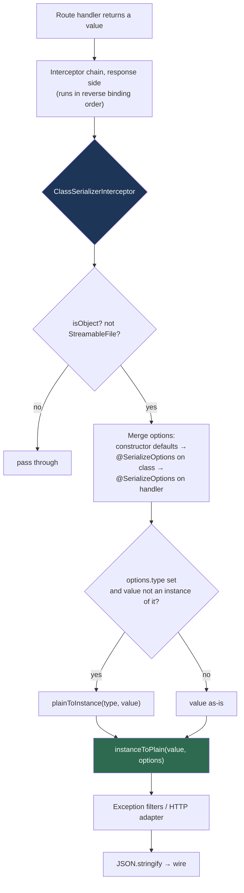
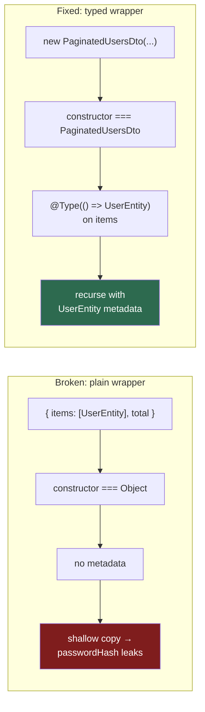

# Chapter 16 — Serialization: Shaping What Leaves Your API

> **한눈에 보기**
> 15장이 **들어오는** 데이터를 검증했다면, 이 장은 **나가는** 데이터를 다듬습니다.
> `ClassSerializerInterceptor`가 응답 객체에 `instanceToPlain()`을 적용하는 원리부터,
> `@Exclude`·`@Expose`·`@Transform`의 정확한 동작, `@SerializeOptions`의 모든 옵션,
> 그리고 "데코레이터를 붙였는데 password가 그대로 나가는" 가장 흔한 사고의 원인과 해결까지
> 다룹니다. 마지막에는 인터셉터 대신 **명시적 응답 DTO + 매퍼**를 쓰는 대안을 정직하게 비교합니다.

**What you will learn**

- What `ClassSerializerInterceptor` actually does per response — where `instanceToPlain()` is called, what it skips, and why arrays work but wrapper objects do not.
- How `@Exclude()`, `@Expose()` (with `name`, `groups`, `toClassOnly`, `toPlainOnly`) and `@Transform()` differ, and why the direction flags exist at all.
- Every option you can pass through `@SerializeOptions()` — `strategy: 'excludeAll'`, `groups`, `version`, `excludePrefixes`, `enableCircularCheck`, `type` — and the security consequence of choosing allowlist over denylist.
- Why serialization decorators appear to do nothing when TypeORM, Prisma, or `lean()` Mongoose queries hand you plain objects, and the three ways to fix it.
- How to serialize nested objects, arrays, and paginated envelopes so that inner entities keep their rules.
- How to expose a field to admins and hide it from everyone else, using groups resolved from the authenticated request.
- When to abandon the interceptor entirely in favour of explicit response DTOs and mapper functions — with an honest comparison, not a sales pitch.

**Why this matters**

The canonical failure is one line long. A developer writes `return this.usersRepository.findOne({ where: { id } })`, ships it, and every `GET /users/:id` response contains `passwordHash`, `passwordResetToken`, and `twoFactorSecret`. Nobody notices, because the frontend does not render those fields. Six months later a scraper notices. Password hashes are not passwords, but a leaked bcrypt corpus is an offline cracking job against your users' reused credentials, and a leaked reset token is an account takeover with no cracking required.

The reason this keeps happening is structural, not careless. Your persistence model and your public representation start out looking identical — `User` has an `id`, an `email`, a `name` — so it feels wasteful to define two classes. As the entity grows, the divergence arrives one column at a time: an audit column, a soft-delete flag, an internal `stripeCustomerId`, a denormalised counter. Nobody makes a decision to expose those. They are exposed by default, because returning the entity is the path of least resistance and every new column silently joins the public API.

Serialization is the layer that makes the divergence explicit and *enforced by default*. Nest offers a declarative approach: annotate the entity once with `class-transformer` decorators, register one interceptor application-wide, and every handler that returns that entity is sanitised — including the handler a colleague writes next quarter, who never reads this chapter. That centralisation is the real value, and it is why this chapter spends as much time on the failure modes of the mechanism as on its API. An interceptor that silently does nothing is worse than no interceptor at all, because it buys you confidence you have not earned.

> **Hint** — Serialization here means *outbound object shaping*, not JSON encoding. `JSON.stringify` still runs afterwards, inside the HTTP adapter. Everything in this chapter happens before that.

## The mechanism: one interceptor, one function call

Everything in this chapter rests on a single class-transformer function:

```typescript
import { instanceToPlain } from 'class-transformer';

const plain = instanceToPlain(someClassInstance, options);
```

`instanceToPlain()` walks the object, reads the `class-transformer` metadata registered by decorators on the object's **constructor**, and produces a new plain object with those rules applied. (In older class-transformer versions this function was named `classToPlain`; both names still exist, `instanceToPlain` is the current one.)

`ClassSerializerInterceptor` is a thin wrapper. Conceptually its response handler is:

```typescript
// Simplified from @nestjs/common/serializer/class-serializer.interceptor.ts
serialize(response: unknown, options: ClassSerializerContextOptions) {
  if (!isObject(response) || response instanceof StreamableFile) {
    return response;
  }
  return Array.isArray(response)
    ? response.map((item) => this.transformToPlain(item, options))
    : this.transformToPlain(response, options);
}

transformToPlain(plainOrClass: any, options: ClassSerializerContextOptions) {
  if (!plainOrClass) {
    return plainOrClass;
  }
  if (!options.type) {
    return instanceToPlain(plainOrClass, options);
  }
  if (plainOrClass instanceof options.type) {
    return instanceToPlain(plainOrClass, options);
  }
  const instance = plainToInstance(options.type, plainOrClass);
  return instanceToPlain(instance, options);
}
```

Four facts follow directly from those twenty lines, and they explain most of the surprises later in the chapter:

1. **Non-objects pass through untouched.** Returning a string, a number, or `undefined` from a handler bypasses serialization entirely.
2. **`StreamableFile` is explicitly skipped**, because a file stream is not a plain object to be rewritten. This is also true for anything you write directly to the response object with `@Res()` — the interceptor never sees a return value at all.
3. **Top-level arrays are mapped element by element.** `return users` where `users: UserEntity[]` works. `return { items: users }` does *not* — the interceptor calls `instanceToPlain` on the wrapper, and the wrapper is a plain `Object` with no metadata. We return to this in the nested-objects section.
4. **`options.type` is the escape hatch** for handlers that return plain objects: the interceptor runs `plainToInstance` for you first.

Here is where the interceptor sits in the pipeline you learned in [Chapter 12](../part1-beginner/12-interceptors.md):



### Binding the interceptor

Install nothing new — `class-transformer` is already a dependency from [Chapter 15](./15-validation-in-depth.md), and `ClassSerializerInterceptor` ships in `@nestjs/common`.

Per handler or per controller:

```typescript
import { ClassSerializerInterceptor, Controller, Get, UseInterceptors } from '@nestjs/common';

@Controller('users')
@UseInterceptors(ClassSerializerInterceptor)
export class UsersController {}
```

Application-wide via a provider — this is the form you almost always want, and the form that gives you the centralised guarantee:

```typescript title="app.module.ts"
import { ClassSerializerInterceptor, Module } from '@nestjs/common';
import { APP_INTERCEPTOR } from '@nestjs/core';

@Module({
  providers: [
    {
      provide: APP_INTERCEPTOR,
      useClass: ClassSerializerInterceptor,
    },
  ],
})
export class AppModule {}
```

Application-wide from `main.ts`, which is the only form that lets you set *default* transform options for the whole app:

```typescript title="main.ts"
import { ClassSerializerInterceptor, ValidationPipe } from '@nestjs/common';
import { NestFactory, Reflector } from '@nestjs/core';
import { AppModule } from './app.module';

async function bootstrap() {
  const app = await NestFactory.create(AppModule);

  app.useGlobalPipes(new ValidationPipe({ whitelist: true, transform: true }));
  app.useGlobalInterceptors(
    new ClassSerializerInterceptor(app.get(Reflector), {
      strategy: 'excludeAll',
      excludeExtraneousValues: true,
    }),
  );

  await app.listen(3000);
}
bootstrap();
```

The `Reflector` argument is mandatory: the interceptor uses it to read `@SerializeOptions()` metadata from the handler and the controller class. The second argument is a `ClassTransformOptions` object that becomes the baseline for every response; `@SerializeOptions()` on a controller overrides it, and `@SerializeOptions()` on a handler overrides that.

> **⚠️ Notice** — The `APP_INTERCEPTOR` form and the `useGlobalInterceptors` form are not equivalent. Only the second accepts default options. Only the first can inject other providers (it is instantiated by the DI container). If you need both, subclass the interceptor — shown at the end of the conditional-exposure section.

## Excluding properties: the denylist approach

The smallest useful example. Annotate the entity, return an instance of it:

```typescript title="users/entities/user.entity.ts"
import { Exclude } from 'class-transformer';

export class UserEntity {
  id: number;
  email: string;
  firstName: string;
  lastName: string;

  @Exclude()
  passwordHash: string;

  @Exclude()
  twoFactorSecret: string | null;

  constructor(partial: Partial<UserEntity>) {
    Object.assign(this, partial);
  }
}
```

```typescript title="users/users.controller.ts"
import { ClassSerializerInterceptor, Controller, Get, Param, UseInterceptors } from '@nestjs/common';
import { UserEntity } from './entities/user.entity';

@Controller('users')
@UseInterceptors(ClassSerializerInterceptor)
export class UsersController {
  @Get(':id')
  findOne(@Param('id') id: string): UserEntity {
    return new UserEntity({
      id: 1,
      email: 'john@example.com',
      firstName: 'John',
      lastName: 'Doe',
      passwordHash: '$2b$12$...',
      twoFactorSecret: null,
    });
  }
}
```

Response:

```json
{
  "id": 1,
  "email": "john@example.com",
  "firstName": "John",
  "lastName": "Doe"
}
```

The `constructor(partial: Partial<UserEntity>)` pattern with `Object.assign` is worth adopting as a habit. It is what makes `new UserEntity({...})` ergonomic, and — more importantly — it is what forces you to *construct an instance*, which is the precondition the whole mechanism depends on.

`@Exclude()` also takes direction options:

```typescript
@Exclude({ toPlainOnly: true })
passwordHash: string;
```

`toPlainOnly: true` means "drop this on the way out, but keep it on the way in". That matters because `class-transformer` runs in both directions in a Nest app: `ValidationPipe` calls `plainToInstance` on inbound bodies, and `ClassSerializerInterceptor` calls `instanceToPlain` on outbound values. If you reuse one class for both, an unqualified `@Exclude()` will also strip the field from incoming request bodies — which is usually what you want for `passwordHash`, and definitely *not* what you want if the same class carries a `password` field the client is supposed to send.

### The problem with denylists

`@Exclude()` is a denylist, and denylists fail open. Add a column to the entity, forget the decorator, and it ships. The failure is silent, it appears in every endpoint at once, and no test catches it unless you wrote a test that asserts the exact key set of the response.

The fix is to invert the default.

## Exposing properties: the allowlist approach

There are two ways to say "nothing is exposed unless I say so".

**Per class** — put `@Exclude()` on the class itself and `@Expose()` on each field you want:

```typescript
import { Exclude, Expose } from 'class-transformer';

@Exclude()
export class UserEntity {
  @Expose() id: number;
  @Expose() email: string;
  @Expose() firstName: string;
  @Expose() lastName: string;

  passwordHash: string;      // not exposed — no decorator needed
  twoFactorSecret: string;   // not exposed
  internalNotes: string;     // a column added next year: still not exposed
}
```

**Globally** — set `strategy: 'excludeAll'` once, in the interceptor defaults, and every class in the application behaves that way:

```typescript
app.useGlobalInterceptors(
  new ClassSerializerInterceptor(app.get(Reflector), { strategy: 'excludeAll' }),
);
```

This is the author's recommendation, and the trade-off is real: with `excludeAll` you must decorate every field you want in every response class, which is more typing and a noisier entity file. In exchange, a new column is invisible by default, and *forgetting* becomes safe rather than dangerous. Security defaults should fail closed. Pay the typing.

> **Hint** — `strategy: 'excludeAll'` and `excludeExtraneousValues: true` are related but not the same. `strategy` governs `instanceToPlain` (the outbound direction). `excludeExtraneousValues` governs `plainToInstance` (the inbound direction), dropping input keys that have no `@Expose()`. Setting both in the interceptor defaults is harmless and useful once you start using `@SerializeOptions({ type })`.

### `@Expose()` options in full

| Option | Type | Effect |
|---|---|---|
| `name` | `string` | Rename the property in the output (or map an input key to this property on the way in). |
| `groups` | `string[]` | Include this property only when the transform's `groups` option contains at least one of these. |
| `since` / `until` | `number` | Include only when the transform's `version` option falls in `[since, until)`. |
| `toClassOnly` | `boolean` | Apply the rule only for `plainToInstance`. |
| `toPlainOnly` | `boolean` | Apply the rule only for `instanceToPlain`. |

Renaming is the most common use. Your database column is `created_at`; your API contract says `createdAt`:

```typescript
export class UserEntity {
  @Expose({ name: 'createdAt' })
  created_at: Date;
}
```

Be deliberate about direction here. `@Expose({ name: 'createdAt' })` with no direction flag applies both ways, which means an inbound `plainToInstance` will also look for `createdAt` in the payload. If the class is only ever a response class, that is fine. If it is shared, write `@Expose({ name: 'createdAt', toPlainOnly: true })`.

`@Expose()` on a **getter** is the other major use, and it is how you add computed fields that do not exist as columns:

```typescript
export class UserEntity {
  @Expose() firstName: string;
  @Expose() lastName: string;

  @Expose()
  get fullName(): string {
    return `${this.firstName} ${this.lastName}`;
  }
}
```

Getters are only picked up because they live on the prototype and `instanceToPlain` reads exposed accessors. This is the clearest demonstration of why the value must be a real class instance: a plain object copied out of the database has no prototype carrying `fullName`, so nothing is computed and nothing is emitted.

You can also expose a **method** the same way, and rename it so the output does not look like an accessor:

```typescript
@Expose({ name: 'isVerified' })
checkVerified(): boolean {
  return this.verifiedAt !== null;
}
```

> **⚠️ Notice** — Under `strategy: 'excludeAll'`, a getter with no `@Expose()` is dropped like any other member. Under the default `exposeAll` strategy, getters are *not* included automatically; you still need `@Expose()`. Getters are opt-in in both strategies.

## `@Transform()`: rewriting values on the way out

`@Exclude` and `@Expose` decide *whether* a property appears. `@Transform` decides *what its value is*.

```typescript
import { Transform } from 'class-transformer';

export class UserEntity {
  @Transform(({ value }) => value?.name)
  role: RoleEntity;
}
```

The output becomes `"role": "admin"` instead of a nested role object.

The callback receives a single params object:

| Field | Meaning |
|---|---|
| `value` | The current property value. |
| `key` | The property name. |
| `obj` | The **source** object (the class instance, when serializing out). |
| `type` | A `TransformationType` enum: `PLAIN_TO_CLASS`, `CLASS_TO_PLAIN`, or `CLASS_TO_CLASS`. |
| `options` | The full `ClassTransformOptions` in effect for this call. |

`obj` is what makes `@Transform` more powerful than it first appears — the callback can read *other* fields:

```typescript
import { Transform, TransformationType } from 'class-transformer';

export class OrderEntity {
  @Expose() subtotalCents: number;
  @Expose() taxCents: number;

  @Expose()
  @Transform(({ obj }) => (obj.subtotalCents + obj.taxCents) / 100)
  totalAmount: number;
}
```

Three practical transforms you will write repeatedly:

```typescript
// 1. Money stored as integer cents, exposed as a decimal string.
@Expose()
@Transform(({ value }) => (value / 100).toFixed(2), { toPlainOnly: true })
priceCents: number;

// 2. Dates as ISO-8601 strings, explicitly, instead of relying on JSON.stringify.
@Expose()
@Transform(({ value }) => (value instanceof Date ? value.toISOString() : value), {
  toPlainOnly: true,
})
createdAt: Date;

// 3. A BigInt / Prisma Decimal that JSON.stringify would throw on.
@Expose()
@Transform(({ value }) => value?.toString(), { toPlainOnly: true })
balance: bigint;
```

The third is not cosmetic. `JSON.stringify` throws `TypeError: Do not know how to serialize a BigInt`, and the throw happens inside the HTTP adapter, *after* your exception filters have already decided the response was a success. The result is a broken, half-written response and a stack trace with no route context. A `@Transform` fixes it at the right layer.

Direction flags matter more for `@Transform` than anywhere else. A transform without them runs in both directions, which usually means your inbound `plainToInstance` divides the price by 100 a second time. When in doubt, branch on `type`:

```typescript
@Transform(({ value, type }) =>
  type === TransformationType.CLASS_TO_PLAIN ? value / 100 : value * 100,
)
priceCents: number;
```

## `@SerializeOptions()`: per-route control

`@SerializeOptions()` (from `@nestjs/common`) attaches a `ClassTransformOptions` object as route metadata. The interceptor reads it with `Reflector` and passes it as the second argument to `instanceToPlain()`.

```typescript
import { SerializeOptions } from '@nestjs/common';

@SerializeOptions({ excludePrefixes: ['_'] })
@Get()
findOne(): UserEntity {
  return new UserEntity({ id: 1, _internalCacheKey: 'x' } as any);
}
```

The full option set you can pass:

| Option | Type | Default | What it does |
|---|---|---|---|
| `strategy` | `'excludeAll' \| 'exposeAll'` | `'exposeAll'` | Allowlist vs denylist for the whole transform. |
| `groups` | `string[]` | `undefined` | Activates `@Expose({ groups })` / `@Exclude({ groups })` / `@Transform({ groups })` rules. |
| `version` | `number` | `undefined` | Activates `since` / `until` rules for API versioning. |
| `excludePrefixes` | `string[]` | `undefined` | Drops any property whose name starts with one of these — no decorator required. |
| `enableCircularCheck` | `boolean` | `false` | Detects cycles instead of recursing until the stack overflows. |
| `excludeExtraneousValues` | `boolean` | `false` | On the *inbound* leg (`plainToInstance`), discard keys with no `@Expose()`. |
| `exposeUnsetFields` | `boolean` | `true` | When `false`, omit properties that are `undefined` rather than emitting `"key": undefined`. |
| `exposeDefaultValues` | `boolean` | `false` | Use a class field's initializer when the source value is `undefined`. |
| `ignoreDecorators` | `boolean` | `false` | Ignore all class-transformer metadata. Useful for an internal debug route; never for a public one. |
| `enableImplicitConversion` | `boolean` | `false` | Coerce by reflected design type. Relevant inbound (see [Chapter 15](./15-validation-in-depth.md)); rarely wanted outbound. |
| `type` | `Type<any>` | `undefined` | **Nest-specific.** The class to `plainToInstance` into before serializing. |

`excludePrefixes` deserves a note. It is a blunt instrument that operates on names, not metadata, and it is genuinely useful with ORMs that decorate instances with bookkeeping fields — Mongoose documents carry `_id` and `__v`, TypeORM lazy relations carry `__propertyName__`. Setting `excludePrefixes: ['_']` globally is a reasonable default *in addition to* your decorators, not instead of them.

`enableCircularCheck` earns its own paragraph because you will meet the failure before you meet the option. A bidirectional ORM relation — `User.posts` where each `Post.author` points back at the `User` — is a cycle. `instanceToPlain` follows object references, so it recurses `user → posts[0] → author → posts[0] → ...` until Node dies with `RangeError: Maximum call stack size exceeded`. The route returns a 500 with a stack trace that names none of your files. Turning on `enableCircularCheck` replaces the crash with a truncated object, which is better but still not right; the correct fix is a `@Exclude()` on the back-reference so the cycle never forms. Use the option as a safety net, not as the design.

```typescript
export class PostEntity {
  @Expose() id: number;
  @Expose() title: string;

  @Exclude() // break the cycle at the source
  author: UserEntity;
}
```

### API versioning through `version`

`since` and `until` let one class serve several API versions:

```typescript
export class UserEntity {
  @Expose() id: number;

  // v1 only: a single combined name field
  @Expose({ until: 2 })
  @Transform(({ obj }) => `${obj.firstName} ${obj.lastName}`)
  name: string;

  // v2 onwards: split fields
  @Expose({ since: 2 }) firstName: string;
  @Expose({ since: 2 }) lastName: string;
}
```

```typescript
@Version('1')
@SerializeOptions({ version: 1 })
@Get()
findAllV1() { /* ... */ }

@Version('2')
@SerializeOptions({ version: 2 })
@Get()
findAllV2() { /* ... */ }
```

The bounds are half-open: `since` is inclusive, `until` is exclusive, so `{ since: 2 }` and `{ until: 2 }` partition cleanly at version 2. This pairs with Nest's routing-level versioning, covered in [Chapter 33](./33-mvc-and-versioning.md). It is a good tool for *additive* version differences and a bad one for restructured payloads — when v2 changes the shape rather than the fields, write a second class.

## The bug that costs the most hours: "my decorators do nothing"

You add `@Exclude()` to `passwordHash`. You register the interceptor globally. You hit the endpoint. `passwordHash` is still there.

This is the single most common Nest serialization question, and the cause is almost always the same: **the interceptor received a plain object, not an instance of your decorated class.** `instanceToPlain` reads metadata from `value.constructor`. If the constructor is `Object`, there is no metadata, so there is nothing to apply, and the function returns a faithful copy — including the field you meant to drop. There is no warning, because from class-transformer's perspective nothing went wrong.

Plain objects arrive from more places than you expect:

```typescript
// 1. Prisma. Always returns plain objects. Always.
const user = await this.prisma.user.findUnique({ where: { id } });

// 2. Mongoose with .lean() — a POJO by design.
const user = await this.userModel.findById(id).lean();

// 3. TypeORM with a raw or partial selection.
const rows = await this.repo.query('SELECT * FROM users WHERE id = $1', [id]);
const partial = await this.repo.find({ select: { id: true, email: true } });

// 4. Any object literal you build yourself.
return { ...user, permissions };

// 5. A wrapper envelope — the inner instances are fine, the wrapper is not.
return { items: users, total };

// 6. JSON that round-tripped through a cache or a message broker.
const cached = JSON.parse(await this.redis.get(key));
```

Case 5 is the sneaky one, and it deserves its own diagnosis. `instanceToPlain({ items: [userEntity], total: 1 })` sees a plain `Object` at the top. With no metadata it copies keys — and when it copies `items`, it copies the array of `UserEntity` instances *as values*, without descending into them with their own metadata. The wrapper is a metadata dead end, and everything under it is unprotected.



### Fix 1 — construct the instance in the service

Explicit, obvious, and it works everywhere including outside HTTP:

```typescript
async findOne(id: number): Promise<UserEntity> {
  const row = await this.prisma.user.findUniqueOrThrow({ where: { id } });
  return new UserEntity(row);
}

async findAll(): Promise<UserEntity[]> {
  const rows = await this.prisma.user.findMany();
  return rows.map((row) => new UserEntity(row));
}
```

This relies on the `constructor(partial: Partial<UserEntity>) { Object.assign(this, partial); }` pattern. Note that `Object.assign` does **not** run `@Type()` conversions on nested values — nested relations stay plain. For nested data, use fix 2.

### Fix 2 — `plainToInstance` in the service

`plainToInstance` respects `@Type()` and therefore rebuilds nested structures properly:

```typescript
import { plainToInstance } from 'class-transformer';

async findOneWithPosts(id: number): Promise<UserEntity> {
  const row = await this.prisma.user.findUniqueOrThrow({
    where: { id },
    include: { posts: true },
  });
  return plainToInstance(UserEntity, row, { excludeExtraneousValues: true });
}
```

`excludeExtraneousValues: true` is the important half here: without it, keys in `row` that have no `@Expose()` are copied onto the instance anyway, and then — under `strategy: 'exposeAll'` — serialized right back out. With it, the instance only ever holds fields you declared.

### Fix 3 — `@SerializeOptions({ type })`, the Nest-native shortcut

Since the interceptor already knows how to call `plainToInstance`, you can hand it the class and return plain objects from the handler:

```typescript
import { ClassSerializerInterceptor, Controller, Get, Query, SerializeOptions, UseInterceptors } from '@nestjs/common';

@Controller('users')
@UseInterceptors(ClassSerializerInterceptor)
export class UsersController {
  @Get()
  @SerializeOptions({ type: UserEntity })
  findOne(@Query('id') id: number): UserEntity {
    if (id === 1) {
      return {
        id: 1,
        firstName: 'John',
        lastName: 'Doe',
        passwordHash: 'secret',
      } as UserEntity;
    }

    return {
      id: 2,
      firstName: 'Kamil',
      lastName: 'Mysliwiec',
      passwordHash: 'secret2',
    } as UserEntity;
  }
}
```

Both branches return object literals; both come out sanitised. The upside the official docs highlight is genuine: because the handler's declared return type is `UserEntity`, TypeScript checks the shape of the literal for you. `plainToInstance(UserEntity, row)` accepts any `row` — it gives you no such check.

The downside is that the guarantee lives on the *controller*, not on the *value*. If the same service method is called from a queue worker, a CLI command, or a WebSocket gateway without that decorator, the plain object flows on unprotected. That is the argument for fix 1 or 2 in any codebase where the domain layer is consumed from more than one transport.

**Recommendation.** Convert in the service (fix 1 or 2), so a `UserEntity` is a `UserEntity` everywhere in the process. Use `@SerializeOptions({ type })` as a targeted convenience on controllers that assemble ad-hoc response shapes.

### The diagnostic

When serialization "does nothing", spend thirty seconds on this before anything else:

```typescript
@Get(':id')
async findOne(@Param('id') id: string) {
  const value = await this.usersService.findOne(+id);
  console.log(value.constructor.name); // 'UserEntity' → good. 'Object' → this is your bug.
  return value;
}
```

## Nested objects and arrays

Top-level arrays are handled by the interceptor's `.map()`. Nested structures are handled by `class-transformer`, and only if you tell it the types.

### Nested single object

```typescript
import { Exclude, Expose, Type } from 'class-transformer';

@Exclude()
export class AddressEntity {
  @Expose() city: string;
  @Expose() country: string;
  postalCode: string;     // internal, never exposed
}

@Exclude()
export class UserEntity {
  @Expose() id: number;
  @Expose() email: string;

  @Expose()
  @Type(() => AddressEntity)
  address: AddressEntity;

  passwordHash: string;
}
```

`@Type(() => AddressEntity)` is what makes `plainToInstance` build a real `AddressEntity` for the nested value. The arrow function exists to defer evaluation, which is what allows two entity files to reference each other without a circular-import crash at module load time.

> **Hint** — On the *outbound* leg, if `address` already holds an `AddressEntity` instance, `instanceToPlain` reads its metadata from the live constructor and `@Type()` is not strictly required. It becomes required the moment the value is plain — which, with any ORM, is most of the time. Always write it.

### Nested arrays

Same decorator; `class-transformer` sees the array and applies the type per element:

```typescript
@Exclude()
export class PostEntity {
  @Expose() id: number;
  @Expose() title: string;
  @Exclude() author: UserEntity;   // break the back-reference cycle
}

@Exclude()
export class UserEntity {
  @Expose() id: number;

  @Expose()
  @Type(() => PostEntity)
  posts: PostEntity[];
}
```

TypeScript's emitted design-type metadata for `posts` is just `Array`, with no element type — that erasure is exactly why `@Type()` is not optional here.

### Paginated envelopes

The correct fix for case 5 above is to make the envelope a class too:

```typescript title="common/dto/paginated.dto.ts"
import { Expose, Type } from 'class-transformer';

export class PageMetaDto {
  @Expose() total: number;
  @Expose() page: number;
  @Expose() perPage: number;
}

export class PaginatedUsersDto {
  @Expose()
  @Type(() => UserEntity)
  items: UserEntity[];

  @Expose()
  @Type(() => PageMetaDto)
  meta: PageMetaDto;

  constructor(items: UserEntity[], meta: PageMetaDto) {
    this.items = items;
    this.meta = meta;
  }
}
```

Returning `new PaginatedUsersDto(users, meta)` gives the interceptor a constructor with metadata, and the `@Type()` on `items` tells it to descend. A generic version — `PaginatedDto<T>` — is possible but awkward, because decorators cannot capture a type parameter; the usual solution is a `Paginated(UserEntity)` mixin factory, the same technique used for generic OpenAPI schemas in [Chapter 30](./30-openapi-advanced.md).

## Conditional exposure: showing fields only to some callers

The requirement is universal: an admin listing users should see `email` and `lastLoginIp`; a public profile endpoint should not. Groups are the mechanism.

```typescript
import { Exclude, Expose } from 'class-transformer';

@Exclude()
export class UserEntity {
  @Expose() id: number;
  @Expose() displayName: string;

  @Expose({ groups: ['self', 'admin'] })
  email: string;

  @Expose({ groups: ['admin'] })
  lastLoginIp: string;

  @Expose({ groups: ['admin'] })
  createdAt: Date;

  passwordHash: string;
}
```

With no `groups` option in effect, group-qualified properties are omitted. Passing `groups: ['admin']` includes both group-qualified sets that list `'admin'`.

Static routes are the easy case:

```typescript
@Get('admin/users')
@UseGuards(AdminGuard)
@SerializeOptions({ groups: ['admin'] })
findAllForAdmin(): Promise<UserEntity[]> {
  return this.usersService.findAll();
}
```

Dynamic, per-request groups need the request, and `@SerializeOptions()` is static metadata evaluated at decoration time. Subclass the interceptor:

```typescript title="common/interceptors/role-serializer.interceptor.ts"
import {
  CallHandler,
  ClassSerializerInterceptor,
  ExecutionContext,
  Injectable,
  PlainLiteralObject,
} from '@nestjs/common';
import { ClassTransformOptions } from 'class-transformer';

@Injectable()
export class RoleSerializerInterceptor extends ClassSerializerInterceptor {
  serialize(
    response: PlainLiteralObject | PlainLiteralObject[],
    options: ClassTransformOptions,
  ) {
    return super.serialize(response, options);
  }

  intercept(context: ExecutionContext, next: CallHandler) {
    const request = context.switchToHttp().getRequest();
    const user = request.user as { id: number; roles: string[] } | undefined;

    const groups: string[] = [];
    if (user?.roles?.includes('admin')) {
      groups.push('admin');
    }
    if (user) {
      groups.push('self');
    }

    // Merge into the options the base class will use for this request.
    const contextOptions = this.getContextOptions(context) ?? {};
    (this as any).defaultOptions = {
      ...(this as any).defaultOptions,
      ...contextOptions,
      groups,
    };

    return super.intercept(context, next);
  }
}
```

That mutation of `defaultOptions` is safe only because the interceptor instance is singleton-scoped and Node handles one request per tick of synchronous work — but it is fragile, and an interceptor that mutates itself is a smell. The cleaner shape is to bypass the base class and call `instanceToPlain` yourself:

```typescript title="common/interceptors/group-serializer.interceptor.ts"
import { CallHandler, ExecutionContext, Injectable, NestInterceptor, StreamableFile } from '@nestjs/common';
import { instanceToPlain } from 'class-transformer';
import { Observable, map } from 'rxjs';

@Injectable()
export class GroupSerializerInterceptor implements NestInterceptor {
  intercept(context: ExecutionContext, next: CallHandler): Observable<unknown> {
    const request = context.switchToHttp().getRequest();
    const roles: string[] = request.user?.roles ?? [];
    const groups = ['public', ...(request.user ? ['self'] : []), ...roles];

    return next.handle().pipe(
      map((value) => {
        if (!value || typeof value !== 'object' || value instanceof StreamableFile) {
          return value;
        }
        return instanceToPlain(value, { strategy: 'excludeAll', groups });
      }),
    );
  }
}
```

Explicit, testable, and it never mutates shared state. The `self` group is worth a caveat: exposing `email` under `self` is only correct if the *record being serialized* belongs to the requester. Group membership derived purely from "someone is logged in" will happily hand every user's email to every logged-in user. Either scope the group by comparing `request.user.id` to the record id — which requires a per-record decision the interceptor is a bad place for — or keep "my own profile" on a dedicated `GET /users/me` route with `@SerializeOptions({ groups: ['self'] })` and never use that group elsewhere. The second is the design the author recommends: routes, not records, decide visibility.

## Beyond HTTP: WebSockets, microservices, and GraphQL

`ClassSerializerInterceptor` is an interceptor, and interceptors are transport-agnostic ([Chapter 40](../part3-advanced/40-execution-context.md)). It works unchanged wherever the interceptor chain runs.

**WebSockets.** The value returned from a `@SubscribeMessage()` handler passes through the interceptor chain before the adapter emits it:

```typescript
import { ClassSerializerInterceptor, UseInterceptors } from '@nestjs/common';
import { MessageBody, SubscribeMessage, WebSocketGateway } from '@nestjs/websockets';

@WebSocketGateway()
@UseInterceptors(ClassSerializerInterceptor)
export class UsersGateway {
  @SubscribeMessage('users:get')
  async handleGet(@MessageBody() id: number): Promise<UserEntity> {
    return this.usersService.findOne(id);
  }
}
```

The caveat is that a gateway usually also pushes messages *outside* any handler — `this.server.emit('user:updated', user)` from a service or an event listener. Nothing intercepts that path. Serialize by hand at the emit site:

```typescript
this.server.to(room).emit('user:updated', instanceToPlain(user, { strategy: 'excludeAll' }));
```

This is a real leak vector, and it is invisible to anyone auditing controllers.

**Microservices.** Same story for `@MessagePattern()` return values — the interceptor runs, and the serialized value is what the transporter sends back:

```typescript
@UseInterceptors(ClassSerializerInterceptor)
@MessagePattern({ cmd: 'get_user' })
getUser(@Payload() id: number): Promise<UserEntity> {
  return this.usersService.findOne(id);
}
```

But think about what serialization *means* here. In an HTTP response you are talking to an untrusted client, so stripping fields is protection. In a message reply you are talking to another one of your own services, which may legitimately need `passwordHash` (an auth service verifying a credential) and which certainly does not want its `Date` objects flattened into strings by an outbound `@Transform`. Serializing internal RPC replies with the same rules as public HTTP responses is a common source of "the field is there in the monolith and missing in the microservice" bugs. Prefer separate classes for internal contracts, or apply the interceptor per-handler rather than globally in a service that serves both.

`@EventPattern()` handlers return nothing meaningful, so serialization is irrelevant there.

**GraphQL.** The interceptor runs around resolvers, but GraphQL has its own, stronger answer: the schema *is* an allowlist. A field that is not in the `@ObjectType()` cannot be requested, so `passwordHash` never reaches a client whether or not you decorate it. Two consequences:

- `@Exclude()` on an entity does **not** hide a field from GraphQL; only the schema does. If your entity is also your `@ObjectType()`, remove the `@Field()` decorator instead.
- Applying `ClassSerializerInterceptor` globally in a GraphQL app can *break* things: field resolvers and `@ResolveField()` methods run against the object your resolver returned, and if serialization has already stripped `authorId` from it, the field resolver that needed `authorId` gets `undefined`. Nest cannot see that dependency.

The recommendation for GraphQL applications is to skip `ClassSerializerInterceptor` and model visibility in the schema, using `@Field()` presence and field-level guards. This is covered in [Chapter 50](../part3-advanced/50-graphql-fundamentals.md).

## The alternative: explicit response DTOs and mappers

There is a second school, and it is not a lesser one. Instead of decorating the entity and letting an interceptor rewrite it, you define a separate class per response and a function that builds it.

```typescript title="users/dto/user-response.dto.ts"
export class UserResponseDto {
  id!: number;
  email!: string;
  fullName!: string;
  createdAt!: string;

  static fromEntity(user: User): UserResponseDto {
    return {
      id: user.id,
      email: user.email,
      fullName: `${user.firstName} ${user.lastName}`,
      createdAt: user.createdAt.toISOString(),
    };
  }

  static fromEntities(users: User[]): UserResponseDto[] {
    return users.map((u) => UserResponseDto.fromEntity(u));
  }
}
```

```typescript title="users/users.controller.ts"
@Get(':id')
async findOne(@Param('id', ParseIntPipe) id: number): Promise<UserResponseDto> {
  const user = await this.usersService.findOne(id);
  return UserResponseDto.fromEntity(user);
}
```

No interceptor. No metadata. No `class-transformer`. The compiler checks the mapping, and the response shape is readable in one place with no cross-referencing of decorators.

The strongest argument for this style is failure mode. If you add a column to `User` and forget to touch the DTO, the field is absent from the response — a visible, harmless omission. If you forget an `@Exclude()`, the field is present — an invisible, dangerous exposure. Omission is a bug report; exposure is an incident.

The strongest argument against it is volume. A `User` with eight fields, four endpoints, and three visibility levels becomes several near-identical mapper functions, and every field rename touches all of them. That is the boilerplate `ClassSerializerInterceptor` exists to remove.

| | `ClassSerializerInterceptor` + decorators | Explicit response DTO + mapper |
|---|---|---|
| Boilerplate | Low — decorate once, applies everywhere | High — one class + one mapper per response shape |
| Failure mode when a field is forgotten | **Leaks** (denylist) / omits (`excludeAll`) | **Omits** — always fails closed |
| Where the contract is visible | Spread across decorators on the entity | One file, top to bottom, readable |
| Type safety of the output | Weak — decorators are runtime metadata, TS sees the entity type | Strong — the compiler checks every field |
| Computed / derived fields | `@Expose()` on a getter, `@Transform` with `obj` | Ordinary code in the mapper |
| Conditional visibility (role, version) | First-class: `groups`, `since`/`until` | Manual: `if` branches, or a second DTO |
| Coupling of persistence to API | High — the entity carries API concerns | Low — the entity stays a persistence model |
| OpenAPI accuracy ([Ch. 29](./29-openapi-fundamentals.md)) | Poor — the schema shows entity fields, including hidden ones, unless duplicated with `@ApiHideProperty` | Excellent — the DTO *is* the documented schema |
| Renaming a field | One `@Expose({ name })` | Touch every mapper |
| Cost of a new endpoint shape | Zero | A new class |
| Works outside HTTP without extra care | Only where interceptors run | Always — it is just a function |
| Runtime cost | Reflection + a full object walk per response | A direct object literal |

**The author's recommendation**, stated plainly because the style guide asks for it:

- For applications where the API is essentially a projection of the domain model — internal tools, admin backends, small services — use `ClassSerializerInterceptor` with `strategy: 'excludeAll'` globally. The boilerplate saving is real and the fail-closed default removes the main objection.
- For a public API with a contract you version, document, and are contractually held to, use explicit response DTOs. The extra classes buy compile-time enforcement, honest OpenAPI output, and the freedom to refactor the database without breaking clients.
- Do not mix the two *for the same resource*. A codebase where some responses are shaped by decorators and others by mappers gives reviewers no rule to apply, and the review is where leaks are actually caught.
- Whichever you choose, add one end-to-end test per resource that asserts the exact key set of the response. It catches every failure mode of both approaches:

```typescript
it('never exposes credential fields', async () => {
  const res = await request(app.getHttpServer()).get('/users/1').expect(200);
  expect(Object.keys(res.body).sort()).toEqual(['createdAt', 'email', 'fullName', 'id']);
});
```

## Common mistakes

1. **Returning a plain object and expecting decorators to fire.**
   *Symptom:* `passwordHash` appears in the response even though `@Exclude()` is on the field and the interceptor is registered globally.
   *Cause:* `instanceToPlain` reads metadata from `value.constructor`. Prisma, `lean()`, raw queries, and object literals all give you `Object`.
   *Fix:* `new UserEntity(row)`, `plainToInstance(UserEntity, row, { excludeExtraneousValues: true })`, or `@SerializeOptions({ type: UserEntity })`. Diagnose with `console.log(value.constructor.name)`.

2. **Wrapping decorated instances in a plain envelope.**
   *Symptom:* `GET /users` is clean; `GET /users?page=1`, which returns `{ items, total }`, leaks everything.
   *Cause:* The interceptor serializes the wrapper, which has no metadata, and copies `items` through as opaque values.
   *Fix:* Make the envelope a class with `@Type(() => UserEntity)` on `items`, and return an instance of it.

3. **Trusting `@Exclude()` as the whole strategy.**
   *Symptom:* A migration adds `stripe_customer_id`, and it is in the API the same day.
   *Cause:* Denylists fail open; a new field is exposed by default.
   *Fix:* `strategy: 'excludeAll'` in the global interceptor options, or `@Exclude()` at class level with `@Expose()` per field.

4. **Nested relations serialized without `@Type()`.**
   *Symptom:* `user.address.postalCode` is in the response although `AddressEntity` excludes it.
   *Cause:* Without `@Type(() => AddressEntity)`, `plainToInstance` leaves the nested value as a plain object, so `AddressEntity`'s rules never load.
   *Fix:* Add `@Type()` to every relation property, including arrays.

5. **Bidirectional relations without a broken cycle.**
   *Symptom:* `RangeError: Maximum call stack size exceeded` on one route, 500 with no useful stack.
   *Cause:* `user.posts[0].author === user`; `instanceToPlain` follows references forever.
   *Fix:* `@Exclude()` the back-reference. Use `enableCircularCheck: true` as a net, not a fix.

6. **Direction-blind `@Transform` on a class used for both input and output.**
   *Symptom:* Prices are 100× too small after a create-then-read round trip.
   *Cause:* A transform with no `toPlainOnly` runs on the inbound `plainToInstance` as well.
   *Fix:* Add `{ toPlainOnly: true }`, or branch on `TransformationType`. Better: stop sharing one class between request and response.

7. **Emitting from a gateway or a scheduled job without serializing.**
   *Symptom:* Fields are hidden on REST endpoints but present in the WebSocket `user:updated` payload.
   *Cause:* `server.emit()` does not pass through the interceptor chain; nor does a Bull job's return value, a webhook you POST yourself, or a log line.
   *Fix:* Call `instanceToPlain()` explicitly at those boundaries, or map to a response DTO in the service so no unsanitised object ever exists.

8. **Assuming serialization applies to `@Res()` and `StreamableFile`.**
   *Symptom:* An endpoint that writes with `res.json(user)` leaks; a file download endpoint is unaffected by `@SerializeOptions`.
   *Cause:* Using `@Res()` without `passthrough: true` opts out of the entire response pipeline; `StreamableFile` is explicitly skipped by the interceptor.
   *Fix:* Return values instead of writing to `res`, or serialize by hand before `res.json()`.

## Putting it together

A complete users module with allowlist serialization, computed fields, nested relations, role-based groups, and a typed pagination envelope.

```typescript title="src/users/entities/user.entity.ts"
import { Exclude, Expose, Transform, Type } from 'class-transformer';

@Exclude()
export class AddressEntity {
  @Expose() city: string;
  @Expose() country: string;
  postalCode: string; // internal only

  constructor(partial: Partial<AddressEntity>) {
    Object.assign(this, partial);
  }
}

@Exclude()
export class UserEntity {
  @Expose() id: number;
  @Expose() firstName: string;
  @Expose() lastName: string;

  @Expose()
  get fullName(): string {
    return `${this.firstName} ${this.lastName}`;
  }

  @Expose({ groups: ['self', 'admin'] })
  email: string;

  @Expose({ groups: ['admin'] })
  @Transform(({ value }) => (value instanceof Date ? value.toISOString() : value), {
    toPlainOnly: true,
  })
  lastLoginAt: Date | null;

  @Expose()
  @Type(() => AddressEntity)
  address: AddressEntity;

  @Expose({ name: 'balance' })
  @Transform(({ value }) => (value / 100).toFixed(2), { toPlainOnly: true })
  balanceCents: number;

  // Never exposed under any group: no @Expose(), and the class is @Exclude()'d.
  passwordHash: string;
  twoFactorSecret: string | null;

  constructor(partial: Partial<UserEntity>) {
    Object.assign(this, partial);
    if (partial.address) {
      this.address = new AddressEntity(partial.address);
    }
  }
}
```

```typescript title="src/users/dto/paginated-users.dto.ts"
import { Expose, Type } from 'class-transformer';
import { UserEntity } from '../entities/user.entity';

export class PageMetaDto {
  @Expose() total: number;
  @Expose() page: number;
  @Expose() perPage: number;

  constructor(partial: Partial<PageMetaDto>) {
    Object.assign(this, partial);
  }
}

export class PaginatedUsersDto {
  @Expose()
  @Type(() => UserEntity)
  items: UserEntity[];

  @Expose()
  @Type(() => PageMetaDto)
  meta: PageMetaDto;

  constructor(items: UserEntity[], meta: PageMetaDto) {
    this.items = items;
    this.meta = meta;
  }
}
```

```typescript title="src/users/users.service.ts"
import { Injectable, NotFoundException } from '@nestjs/common';
import { PageMetaDto, PaginatedUsersDto } from './dto/paginated-users.dto';
import { UserEntity } from './entities/user.entity';

// Stand-in for whatever the ORM returns: plain rows.
type UserRow = Omit<UserEntity, 'fullName' | 'address'> & { address: Record<string, any> };

@Injectable()
export class UsersService {
  private readonly rows: UserRow[] = [
    {
      id: 1,
      firstName: 'John',
      lastName: 'Doe',
      email: 'john@example.com',
      lastLoginAt: new Date('2026-08-01T09:30:00Z'),
      balanceCents: 129_950,
      address: { city: 'Seoul', country: 'KR', postalCode: '04524' },
      passwordHash: '$2b$12$abcdefghijklmnopqrstuv',
      twoFactorSecret: 'JBSWY3DPEHPK3PXP',
    },
  ];

  // Conversion happens here — every caller, HTTP or not, gets a real instance.
  async findOne(id: number): Promise<UserEntity> {
    const row = this.rows.find((r) => r.id === id);
    if (!row) {
      throw new NotFoundException(`User ${id} not found`);
    }
    return new UserEntity(row as unknown as Partial<UserEntity>);
  }

  async findAll(page = 1, perPage = 20): Promise<PaginatedUsersDto> {
    const slice = this.rows.slice((page - 1) * perPage, page * perPage);
    const items = slice.map((r) => new UserEntity(r as unknown as Partial<UserEntity>));
    return new PaginatedUsersDto(
      items,
      new PageMetaDto({ total: this.rows.length, page, perPage }),
    );
  }
}
```

```typescript title="src/users/users.controller.ts"
import {
  ClassSerializerInterceptor,
  Controller,
  Get,
  Param,
  ParseIntPipe,
  Query,
  SerializeOptions,
  UseGuards,
  UseInterceptors,
} from '@nestjs/common';
import { AdminGuard } from '../common/guards/admin.guard';
import { PaginatedUsersDto } from './dto/paginated-users.dto';
import { UserEntity } from './entities/user.entity';
import { UsersService } from './users.service';

@Controller('users')
@UseInterceptors(ClassSerializerInterceptor)
export class UsersController {
  constructor(private readonly usersService: UsersService) {}

  // Public: id, names, fullName, address (city/country), balance.
  @Get(':id')
  findOne(@Param('id', ParseIntPipe) id: number): Promise<UserEntity> {
    return this.usersService.findOne(id);
  }

  // The caller's own record: adds email.
  @Get('me/profile')
  @SerializeOptions({ groups: ['self'] })
  findMe(): Promise<UserEntity> {
    return this.usersService.findOne(1);
  }

  // Admin listing: adds email and lastLoginAt, and uses the typed envelope.
  @Get()
  @UseGuards(AdminGuard)
  @SerializeOptions({ groups: ['admin'], excludePrefixes: ['_'] })
  findAll(@Query('page', ParseIntPipe) page = 1): Promise<PaginatedUsersDto> {
    return this.usersService.findAll(page);
  }
}
```

`GET /users/1` returns:

```json
{
  "id": 1,
  "firstName": "John",
  "lastName": "Doe",
  "fullName": "John Doe",
  "address": { "city": "Seoul", "country": "KR" },
  "balance": "1299.50"
}
```

`GET /users?page=1` as an admin returns:

```json
{
  "items": [
    {
      "id": 1,
      "firstName": "John",
      "lastName": "Doe",
      "fullName": "John Doe",
      "email": "john@example.com",
      "lastLoginAt": "2026-08-01T09:30:00.000Z",
      "address": { "city": "Seoul", "country": "KR" },
      "balance": "1299.50"
    }
  ],
  "meta": { "total": 1, "page": 1, "perPage": 20 }
}
```

`passwordHash`, `twoFactorSecret`, and `address.postalCode` are unreachable from any route, at any group level, because the classes are `@Exclude()`d and those fields carry no `@Expose()`. That is the property worth engineering for: not "these fields are hidden", but "these fields cannot be shown by accident".

> **핵심 정리**
> - 직렬화는 `ClassSerializerInterceptor`가 핸들러 반환값에 `instanceToPlain()`을 적용하는 것이 전부다. 나머지는 모두 `class-transformer` 메타데이터의 문제다.
> - 메타데이터는 `value.constructor`에서 읽는다. 평범한 객체(Prisma, `lean()`, 리터럴, `{ items }` 래퍼)를 반환하면 데코레이터는 **조용히 아무 일도 하지 않는다**. `console.log(value.constructor.name)`이 최고의 진단이다.
> - 해결책은 세 가지: 서비스에서 `new Entity(row)`, `plainToInstance(...)`, 또는 컨트롤러에서 `@SerializeOptions({ type })`. 도메인 계층이 여러 트랜스포트에서 쓰인다면 앞의 두 가지를 택하라.
> - `@Exclude()`만 쓰는 차단 목록은 **열린 채 실패한다**. 컬럼이 추가되면 그날 바로 노출된다. `strategy: 'excludeAll'`(또는 클래스 레벨 `@Exclude()` + 필드별 `@Expose()`)로 기본값을 뒤집어라.
> - `@Expose`는 `name`(이름 변경), getter 노출, `groups`, `since`/`until`(버전)을 제공하고, `@Transform`은 `value`·`obj`·`type`을 받아 값을 다시 쓴다. 입출력에 같은 클래스를 쓴다면 `toPlainOnly`/`toClassOnly`를 반드시 붙여라.
> - 중첩 객체와 배열은 `@Type(() => X)` 없이는 규칙이 적용되지 않는다. 양방향 관계는 역참조에 `@Exclude()`를 붙여 순환을 끊어라 — `enableCircularCheck`는 안전망이지 설계가 아니다.
> - 역할별 노출은 `groups`로 하되, 그룹은 **레코드**가 아니라 **라우트**가 결정하게 하라. "로그인했으니 self"는 남의 이메일을 노출한다.
> - 인터셉터가 닿지 않는 출구가 있다: `server.emit()`, 큐 작업 반환값, `@Res()` 직접 쓰기, `StreamableFile`. 그 경계에서는 손으로 직렬화하라.
> - GraphQL에서는 스키마 자체가 허용 목록이다. `ClassSerializerInterceptor`를 전역으로 붙이면 필드 리졸버가 필요한 값을 잃을 수 있다.
> - 공개 API라면 명시적 응답 DTO + 매퍼가 더 낫다. 필드를 빠뜨렸을 때 **누락**되지 **노출**되지 않고, OpenAPI 스키마가 정직해지며, 컴파일러가 검사해 준다.

> **연습 문제**
> 1. `@Exclude()`가 붙은 `passwordHash`가 응답에 그대로 나오는 상황을 세 가지 서로 다른 원인으로 재현해 보라(Prisma 스타일 평범한 객체, `{ items: [...] }` 래퍼, `@Res()` 직접 사용). 각각의 진단 방법과 수정 방법을 한 문장으로 정리하라.
> 2. `strategy: 'exposeAll'`과 `'excludeAll'`의 "실패 방향"을 설명하라. 새 컬럼 `internal_risk_score`를 추가했을 때 두 설정에서 각각 무슨 일이 일어나는가?
> 3. **구현 과제.** `OrderEntity`를 만들어라. `totalCents`는 `total`이라는 이름의 소수 문자열로 노출하고, `customer`는 중첩 `CustomerEntity`로 직렬화하며, `items`는 `OrderItemEntity` 배열이고, `internalCostCents`는 `finance` 그룹에서만 보이게 하라. 페이지네이션 봉투 클래스까지 포함해 `GET /orders`가 올바르게 직렬화되는지 e2e 테스트로 검증하라(응답 키 집합을 정확히 단언할 것).
> 4. **구현 과제.** 문제 3의 `OrderEntity`를 데코레이터 없이 명시적 응답 DTO + `static fromEntity()` 매퍼로 다시 작성하라. 두 구현의 줄 수를 세고, "새 컬럼을 추가하고 아무 데도 손대지 않았을 때" 각각 무슨 일이 일어나는지 실제로 실험해 확인하라.
> 5. 게이트웨이에서 `this.server.emit('order:updated', order)`로 보내는 페이로드가 REST 응답과 동일한 규칙으로 정제되도록 만들려면 어떤 설계가 가장 안전한가? 서비스 계층에서 응답 DTO로 매핑하는 방식과 emit 지점에서 `instanceToPlain`을 호출하는 방식을 비교하라.
> 6. `@Expose({ since: 2 })`와 `@Expose({ until: 2 })`로 v1/v2를 나눈 엔티티에 v3에서 필드 이름이 바뀌는 변경이 들어왔다. 같은 클래스에 계속 버전을 쌓는 것이 언제 한계에 도달하는지, 대안은 무엇인지 논하라.

**Next:** [Chapter 17 — Configuration and Environment Management](./17-configuration.md) moves from shaping data to shaping the application itself: how `@nestjs/config` loads, validates, namespaces, and types the settings that make the same code behave differently in development, test, and production — and which of those settings must never live in a `.env` file at all.
