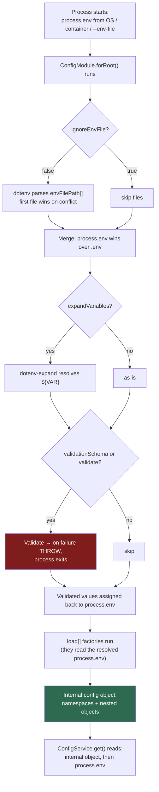

# Chapter 17 — Configuration and Environment Management

> **한눈에 보기**
> 같은 코드가 개발·테스트·운영에서 다르게 동작해야 한다면, 그 차이는 **환경**에 있어야 합니다.
> 이 장은 `@nestjs/config`를 처음부터 끝까지 다룹니다. `forRoot()`의 모든 옵션,
> `registerAs` 네임스페이스와 `ConfigType`으로 얻는 타입 안전성, Joi와 class-validator를
> 이용한 부팅 시점 스키마 검증, `ConfigService.get`의 제네릭·`infer`·`getOrThrow`,
> 변수 확장, `main.ts`와 다른 동적 모듈의 `useFactory`에서 설정을 쓰는 법,
> 모노레포 구성, 그리고 **무엇이 절대 `.env`에 들어가서는 안 되는지**까지 살펴봅니다.

**What you will learn**

- What `ConfigModule.forRoot()` actually does at bootstrap — the exact order of parse, merge, validate, and load — and why that order explains every precedence question you will have.
- Every option on `ConfigModuleOptions`, including the three that quietly change which values exist (`ignoreEnvFile`, `ignoreEnvVars`, `skipProcessEnv`) and the two that change *when* they exist (`cache`, `validatePredefined`).
- How to turn a flat `.env` into typed, namespaced configuration objects with `registerAs()` + `ConfigType<typeof x>`, so no part of your code says `process.env` or a magic string.
- How to make the application refuse to start when a required variable is missing, using either a Joi schema or a `class-validator` class, and which to pick.
- How to read configuration in `main.ts`, inside another module's `useFactory`, and in a module that must be conditionally loaded.
- How configuration works in a Nest monorepo, and how to keep per-app `.env` files from colliding.
- Which values belong in `.env`, which belong in a secret manager, and why "it is in `.env` so it is safe" is a mistake that has ended companies.

**Why this matters**

Two failure modes bracket this chapter, and they are opposites.

The first is the crash at 3 a.m. A deploy ships without `REDIS_URL`. The application starts fine — `process.env.REDIS_URL` is `undefined`, `new Redis(undefined)` cheerfully connects to `localhost:6379`, and nothing is there. Health checks pass, because the health check does not touch Redis. Twenty minutes later the session store times out under load and the whole service falls over. The stack trace names an ioredis internal. The actual bug was a missing line in a deployment manifest, and it was detectable in the first 50 milliseconds of process life. A validation schema turns that incident into a container that exits immediately with `"REDIS_URL" is required` — a five-second fix instead of a two-hour outage.

The second is the leak. A `.env` file with production database credentials gets committed, because it was in `.gitignore` on the developer's machine but the file was added with `git add -f` during a debugging session two years earlier. Or it is baked into a Docker image layer, where it survives every `rm` in a later layer. Or it is dumped into an error tracker, because someone attached `process.env` to a Sentry context to "help with debugging". Configuration is where credentials live, which makes configuration a security surface, not a convenience layer.

Between those two poles sits the actual engineering: making configuration **typed**, so a typo is a compile error; **validated**, so a missing value is a startup failure; **namespaced**, so a database setting is not a string key in twelve files; and **injected**, so a unit test can supply fake values without touching `process.env`. `@nestjs/config` gives you all four. This chapter is about using it well rather than merely using it.

## The model: environment in, one object out

Before any API, hold the mental model. `ConfigModule.forRoot()` runs once, synchronously, while Nest builds the module graph, and it produces a single in-memory configuration object that `ConfigService` reads from.



Four consequences fall out of this diagram, and they answer most questions people ask later:

1. **Real environment variables beat `.env` files.** dotenv does not overwrite an existing `process.env` key. `export DATABASE_USER=prod` in the shell wins over `DATABASE_USER=test` in `.env`. This is deliberate and correct: it is how a container platform injects production values over a checked-in development default.
2. **Validation runs before `load` factories.** Your factory functions can assume the variables they read have already passed the schema — but only the ones the schema covers.
3. **Validation output is written back.** Joi defaults and coercions (`Joi.number()` turning `"3000"` into `3000`) land in `process.env`, so a `load` factory that runs afterwards sees the defaulted values.
4. **`load` factory output is not validated.** The schema validates the *environment*, not the objects your factories return. If you need to constrain a factory's output, do it inside the factory.

### Installation

```bash
$ npm i --save @nestjs/config
```

`@nestjs/config` wraps [dotenv](https://github.com/motdotla/dotenv) internally and requires TypeScript 4.1 or later. Nothing else is needed for the basics; Joi is a separate optional install, covered later.

### The smallest working setup

```typescript title="app.module.ts"
import { Module } from '@nestjs/common';
import { ConfigModule } from '@nestjs/config';

@Module({
  imports: [ConfigModule.forRoot()],
})
export class AppModule {}
```

```bash title=".env"
DATABASE_USER=test
DATABASE_PASSWORD=test
PORT=3000
```

`forRoot()` registers the `ConfigService` provider in this module. `ConfigService` is where every read goes from here on.

> **⚠️ Notice** — Add `.env` to `.gitignore` on the first commit of the project, before it contains anything. Commit a `.env.example` with the *keys* and no values instead. Retro-fitting this after a real credential has been committed means rewriting history and rotating the credential — the second part is mandatory and people forget it.

## The complete `forRoot()` option table

Every property of `ConfigModuleOptions`, what it does, and when you actually want it:

| Option | Type | Default | What it does |
|---|---|---|---|
| `isGlobal` | `boolean` | `false` | Registers `ConfigModule` as a global module, so feature modules need not import it. |
| `envFilePath` | `string \| string[]` | `.env` (project root) | Which file(s) dotenv parses. With an array, **the first file that defines a key wins**. |
| `ignoreEnvFile` | `boolean` | `false` | Skip `.env` files entirely; read only the runtime environment. The right setting in production containers. |
| `ignoreEnvVars` | `boolean` | `false` | Legacy switch for skipping validation of variables that were already in `process.env` before the module loaded. Superseded by `validatePredefined`. |
| `validatePredefined` | `boolean` | `true` | When `false`, variables set before the module loaded (e.g. `PORT=3000 node main.js`) are excluded from validation. |
| `skipProcessEnv` | `boolean` | `false` | When `true`, `ConfigService.get()` reads **only** from `load` factories and ignores `process.env`. Strong hygiene; see below. |
| `cache` | `boolean` | `false` | Memoise `process.env` reads inside `ConfigService`. |
| `encoding` | `string` | `'utf8'` | Encoding used when reading `.env` files. Rarely needed. |
| `expandVariables` | `boolean \| DotenvExpandOptions` | `false` | Enable `${VAR}` interpolation inside `.env`, via dotenv-expand. |
| `load` | `ConfigFactory[]` | `[]` | Factory functions (or `registerAs()` namespaces) returning configuration objects. |
| `validationSchema` | Joi schema | `undefined` | Validate the merged environment against a Joi object schema. |
| `validationOptions` | `object` | see below | Options handed to `schema.validate()`. |
| `validate` | `(config) => config` | `undefined` | A synchronous custom validation function. Mutually exclusive with `validationSchema` in practice. |

### `isGlobal`

Without it, every module that injects `ConfigService` must list `ConfigModule` in its `imports`:

```typescript title="users/users.module.ts"
import { Module } from '@nestjs/common';
import { ConfigModule } from '@nestjs/config';

@Module({
  imports: [ConfigModule],   // note: ConfigModule, not ConfigModule.forRoot()
  providers: [UsersService],
})
export class UsersModule {}
```

With it, one call in the root module is enough:

```typescript
ConfigModule.forRoot({ isGlobal: true });
```

Configuration is one of the genuinely legitimate uses of a global module — it is cross-cutting, stateless after bootstrap, and imported by nearly everything. The general argument against global modules ([Chapter 6](../part1-beginner/06-modules.md)) is that they hide dependencies; here the dependency is universal enough that hiding it costs nothing. Use `isGlobal: true`.

### `envFilePath`

```typescript
ConfigModule.forRoot({ envFilePath: '.development.env' });
```

```typescript
ConfigModule.forRoot({
  envFilePath: ['.env.development.local', '.env.development'],
});
```

The array form gives you a layered convention with per-developer overrides that are never committed:

```typescript
ConfigModule.forRoot({
  envFilePath: [
    `.env.${process.env.NODE_ENV}.local`,  // gitignored, personal overrides
    `.env.${process.env.NODE_ENV}`,        // committed, per-environment defaults
    '.env',                                // committed, shared defaults
  ],
});
```

Two traps live in this snippet. First, **paths are resolved relative to the process working directory**, not to the file that contains the code — running `node dist/main.js` from the repository root and from `dist/` behave differently. Second, `process.env.NODE_ENV` is read here at *module-definition time*, so it can only come from the real environment; a `NODE_ENV` line inside `.env` is far too late to affect which `.env` gets loaded.

### `ignoreEnvFile`

```typescript
ConfigModule.forRoot({ ignoreEnvFile: process.env.NODE_ENV === 'production' });
```

In production you want values injected by the platform (Kubernetes secrets, ECS task definitions, Fly secrets), and you want a stray `.env` that got copied into the image to have no effect at all. Setting `ignoreEnvFile: true` there closes a real class of "why is staging using the dev database" incidents.

### `cache`

```typescript
ConfigModule.forRoot({ cache: true });
```

Reading `process.env` in Node is not a plain object property read — it crosses into C++ and re-reads the process environment block each time. In a hot path called thousands of times per second, that shows up in a profile. `cache: true` memoises the values inside `ConfigService`.

The trade-off is that a runtime mutation of `process.env` stops being visible. Almost nothing legitimately mutates `process.env` after boot, but tests do — a test that sets `process.env.FEATURE_X = 'true'` and then reads through a cached `ConfigService` will read the old value. Either build the testing module fresh per test, or override the provider (shown in the testing note near the end).

### `skipProcessEnv`

```typescript
ConfigModule.forRoot({
  load: [databaseConfig, appConfig],
  skipProcessEnv: true,
});
```

With this on, `configService.get('DATABASE_HOST')` returns `undefined` even though the variable exists — only `configService.get('database.host')` works, because only the `load` factories are consulted. That sounds hostile, and it is exactly the point: it forces every raw environment variable to pass through a factory where it can be parsed, defaulted, and named. The author recommends it for any project past the prototype stage, because it makes "someone read a raw env var in a service" impossible rather than merely discouraged.

### `ignoreEnvVars` and `validatePredefined`

These two overlap and are a documented source of confusion. Both concern variables that were already in `process.env` before the module loaded — "predefined" variables, such as those from `PORT=3000 node main.js`, from a CI runner, or from a container platform. `validatePredefined: false` excludes them from validation; `ignoreEnvVars` is the older spelling of the same idea. Prefer `validatePredefined` in new code.

You want this when your platform injects dozens of variables you do not control — Kubernetes adds `KUBERNETES_SERVICE_HOST`, `*_PORT_*_TCP` and friends to every pod — and a strict schema with `allowUnknown: false` would reject them. The alternative, and usually the better one, is to leave validation on and set `allowUnknown: true` in `validationOptions`.

## Custom configuration files and the `load` option

A flat `.env` is fine for six variables and unmanageable at sixty. Custom configuration files group related settings, parse them once, and give them real types.

A configuration file exports a factory function returning any nested plain object:

```typescript title="config/configuration.ts"
export default () => ({
  port: parseInt(process.env.PORT ?? '3000', 10),
  database: {
    host: process.env.DATABASE_HOST,
    port: parseInt(process.env.DATABASE_PORT ?? '5432', 10),
  },
});
```

```typescript title="app.module.ts"
import { Module } from '@nestjs/common';
import { ConfigModule } from '@nestjs/config';
import configuration from './config/configuration';

@Module({
  imports: [
    ConfigModule.forRoot({
      isGlobal: true,
      load: [configuration],
    }),
  ],
})
export class AppModule {}
```

```typescript
const port = this.configService.get<number>('port');
const dbHost = this.configService.get<string>('database.host');
```

The value of `load` is an array, so you can register several files: `load: [databaseConfig, authConfig, mailConfig]`.

The factory is where **all coercion belongs**. Every value in `process.env` is a string — `"false"`, `"0"`, and `""` are all truthy strings — so the factory is the one place that converts once and correctly:

```typescript title="config/app.config.ts"
const toBool = (v: string | undefined, fallback = false): boolean =>
  v === undefined ? fallback : ['1', 'true', 'yes', 'on'].includes(v.toLowerCase());

const toInt = (v: string | undefined, fallback: number): number => {
  const n = Number.parseInt(v ?? '', 10);
  return Number.isNaN(n) ? fallback : n;
};

export default () => ({
  port: toInt(process.env.PORT, 3000),
  featureFlags: {
    newCheckout: toBool(process.env.FEATURE_NEW_CHECKOUT),
    betaSearch: toBool(process.env.FEATURE_BETA_SEARCH),
  },
  corsOrigins: (process.env.CORS_ORIGINS ?? '').split(',').filter(Boolean),
});
```

`if (process.env.FEATURE_X)` is true for the string `"false"`. That bug is written somewhere in most Node codebases.

### YAML configuration

For deeply nested configuration, YAML is easier to read than an ever-growing `.env`:

```yaml title="config/config.yaml"
http:
  host: 'localhost'
  port: 8080

db:
  postgres:
    url: 'localhost'
    port: 5432
    database: 'yaml-db'
  sqlite:
    database: 'sqlite.db'
```

```bash
$ npm i js-yaml
$ npm i -D @types/js-yaml
```

```typescript title="config/configuration.ts"
import { readFileSync } from 'node:fs';
import { join } from 'node:path';
import * as yaml from 'js-yaml';

const YAML_CONFIG_FILENAME = 'config.yaml';

export default () =>
  yaml.load(
    readFileSync(join(__dirname, YAML_CONFIG_FILENAME), 'utf8'),
  ) as Record<string, any>;
```

> **⚠️ Notice** — The Nest CLI does not copy non-TypeScript assets into `dist/` during the build. Your YAML file will be missing at runtime unless you declare it. If `config/` sits beside `src/`, add to `nest-cli.json`:
>
> ```json
> {
>   "compilerOptions": {
>     "assets": [{ "include": "../config/*.yaml", "outDir": "./dist/config" }]
>   }
> }
> ```
>
> The failure otherwise is `ENOENT: no such file or directory, open '.../dist/config/config.yaml'` — in production only, never in `nest start --watch`.

### Validating a factory's output

The `validationSchema` option validates environment variables, **not** the object your factory returns. If a YAML file supplies the value, no schema in `forRoot()` will check it. Validate inside the factory, where you have complete control:

```typescript title="config/configuration.ts"
export default () => {
  const config = yaml.load(
    readFileSync(join(__dirname, YAML_CONFIG_FILENAME), 'utf8'),
  ) as Record<string, any>;

  if (config.http.port < 1024 || config.http.port > 49151) {
    throw new Error('HTTP port must be between 1024 and 49151');
  }

  return config;
};
```

A throw inside a `load` factory propagates out of `NestFactory.create()` and the process exits — which is exactly the behaviour you want for invalid configuration.

## Namespaces: `registerAs`, `ConfigType`, and `asProvider`

Dot-notation string keys (`'database.host'`) are better than raw `process.env` reads, but they are still strings: no autocomplete, no rename support, and a typo returns `undefined` instead of failing. `registerAs()` fixes that.

```typescript title="config/database.config.ts"
import { registerAs } from '@nestjs/config';

export default registerAs('database', () => ({
  host: process.env.DATABASE_HOST ?? 'localhost',
  port: parseInt(process.env.DATABASE_PORT ?? '5432', 10),
  username: process.env.DATABASE_USER,
  password: process.env.DATABASE_PASSWORD,
  name: process.env.DATABASE_NAME ?? 'app',
  ssl: process.env.DATABASE_SSL === 'true',
  poolSize: parseInt(process.env.DATABASE_POOL_SIZE ?? '10', 10),
}));
```

Load it exactly like any other factory:

```typescript
ConfigModule.forRoot({
  isGlobal: true,
  load: [databaseConfig, authConfig],
});
```

Now you have three ways to read it, in increasing order of quality.

**By string key** — works, but no better than before:

```typescript
const host = this.configService.get<string>('database.host');
```

**By whole namespace object**, typed:

```typescript
import { ConfigType } from '@nestjs/config';
import databaseConfig from '../config/database.config';

const db = this.configService.get<ConfigType<typeof databaseConfig>>('database');
```

**By injecting the namespace directly** — the recommended form:

```typescript title="database/database.service.ts"
import { Inject, Injectable } from '@nestjs/common';
import { ConfigType } from '@nestjs/config';
import databaseConfig from '../config/database.config';

@Injectable()
export class DatabaseService {
  constructor(
    @Inject(databaseConfig.KEY)
    private readonly dbConfig: ConfigType<typeof databaseConfig>,
  ) {}

  describe(): string {
    // Fully typed: dbConfig.port is number, dbConfig.ssl is boolean.
    return `${this.dbConfig.host}:${this.dbConfig.port}/${this.dbConfig.name}`;
  }
}
```

Two pieces make this work. `registerAs()` attaches a `KEY` property to the returned factory — an injection token unique to that namespace. `ConfigType<typeof databaseConfig>` extracts the *return type* of the factory, so the type of `dbConfig` is derived from the code that builds it and can never drift from it. Rename `poolSize` to `maxConnections` in the factory and every consumer becomes a compile error. That is the entire point.

This is also the form to reach for when writing tests: the dependency is a plain injection token holding a plain object, so a test overrides it with an object literal and never touches `process.env`.

```typescript
const moduleRef = await Test.createTestingModule({
  providers: [DatabaseService],
})
  .overrideProvider(databaseConfig.KEY)
  .useValue({ host: 'localhost', port: 5432, name: 'test', ssl: false, poolSize: 1 })
  .compile();
```

### `asProvider()`

Namespaces know how to turn themselves into the async-options object that other Nest modules expect:

```typescript
import { Module } from '@nestjs/common';
import { TypeOrmModule } from '@nestjs/typeorm';
import databaseConfig from './config/database.config';

@Module({
  imports: [TypeOrmModule.forRootAsync(databaseConfig.asProvider())],
})
export class AppModule {}
```

`asProvider()` returns exactly this:

```typescript
{
  imports: [ConfigModule.forFeature(databaseConfig)],
  useFactory: (configuration: ConfigType<typeof databaseConfig>) => configuration,
  inject: [databaseConfig.KEY],
}
```

It saves boilerplate only when the namespace's shape already matches what the target module expects. In practice it rarely does — TypeORM wants `type`, `entities`, `synchronize`, and `autoLoadEntities` alongside the connection fields — so you will more often write the `useFactory` yourself and spread the namespace into it. That pattern is in the dynamic-modules section below.

## Partial registration with `forFeature()`

`forRoot()` belongs in the root module. When a feature module owns configuration nobody else needs, `forFeature()` registers just that namespace, locally:

```typescript title="database/database.module.ts"
import { Module } from '@nestjs/common';
import { ConfigModule } from '@nestjs/config';
import databaseConfig from '../config/database.config';
import { DatabaseService } from './database.service';

@Module({
  imports: [ConfigModule.forFeature(databaseConfig)],
  providers: [DatabaseService],
  exports: [DatabaseService],
})
export class DatabaseModule {}
```

This keeps a feature's configuration next to the feature, and it keeps `AppModule`'s `load` array from growing to thirty entries in a large codebase.

> **⚠️ Notice** — `forFeature()` runs during **module initialisation**, and the order in which Nest initialises modules is not guaranteed. If module B reads a value that module A registered with `forFeature()`, and B reads it in a **constructor**, A may not have initialised yet and the value will be `undefined`. Reading in `onModuleInit()` is safe, because that hook runs only after every module the current module depends on has initialised.

```typescript
@Injectable()
export class ReportsService implements OnModuleInit {
  private dsn: string;

  constructor(private readonly configService: ConfigService) {}

  onModuleInit() {
    // Safe here; would be unreliable in the constructor.
    this.dsn = this.configService.getOrThrow<string>('analytics.dsn');
  }
}
```

The cleanest way to avoid the whole question is to load shared namespaces in `forRoot()` and reserve `forFeature()` for configuration a single module uses privately.

## Schema validation: refusing to start on bad configuration

This is the highest-value section in the chapter. A missing variable should never become a runtime `undefined`; it should be a startup failure with the variable's name in the message.

### Joi

```bash
$ npm install --save joi
```

```typescript title="app.module.ts"
import { Module } from '@nestjs/common';
import { ConfigModule } from '@nestjs/config';
import * as Joi from 'joi';

@Module({
  imports: [
    ConfigModule.forRoot({
      isGlobal: true,
      validationSchema: Joi.object({
        NODE_ENV: Joi.string()
          .valid('development', 'production', 'test', 'provision')
          .default('development'),
        PORT: Joi.number().port().default(3000),

        DATABASE_HOST: Joi.string().hostname().required(),
        DATABASE_PORT: Joi.number().port().default(5432),
        DATABASE_USER: Joi.string().required(),
        DATABASE_PASSWORD: Joi.string().required(),

        JWT_SECRET: Joi.string().min(32).required(),
        JWT_EXPIRES_IN: Joi.string().default('15m'),

        REDIS_URL: Joi.string().uri({ scheme: ['redis', 'rediss'] }).required(),

        // Conditional: required only in production.
        SENTRY_DSN: Joi.string().uri().when('NODE_ENV', {
          is: 'production',
          then: Joi.required(),
          otherwise: Joi.optional(),
        }),
      }),
      validationOptions: {
        allowUnknown: true,
        abortEarly: false,
      },
    }),
  ],
})
export class AppModule {}
```

Two behaviours worth internalising:

- **All schema keys are optional by default.** `Joi.string()` alone constrains the type if present and permits absence. `.required()` is what makes a variable mandatory; `.default(x)` supplies a value and writes it back into `process.env`.
- **Defaults and coercions are written back.** `Joi.number()` turns the string `"3000"` into the number `3000`, and the merged, validated object replaces `process.env`. Any `load` factory that runs afterwards sees the coerced values.

`JWT_SECRET: Joi.string().min(32).required()` is the kind of rule worth writing. It does not merely check presence — it makes it impossible to deploy with the placeholder `secret` that someone put in `.env.example`.

### `validationOptions`

The `@nestjs/config` defaults are:

- `allowUnknown: true` — environment variables not in the schema are permitted.
- `abortEarly: false` — report *all* validation errors, not just the first.

Both are good defaults, and there is a sharp edge in overriding them:

> **⚠️ Notice** — The moment you pass a `validationOptions` object, any key you omit reverts to **Joi's** default, not Nest's. Joi's default for `allowUnknown` is `false` and for `abortEarly` is `true`. Passing `validationOptions: { abortEarly: false }` alone therefore silently turns on strict unknown-key rejection, and your application stops booting because Kubernetes injected `KUBERNETES_PORT_443_TCP`. Always specify **both** keys explicitly.

```typescript
validationOptions: {
  allowUnknown: true,   // never omit this
  abortEarly: false,    // never omit this either
}
```

`abortEarly: false` matters more than it looks. With `true`, a fresh clone with an empty `.env` tells you `"DATABASE_HOST" is required`, you fix it, restart, and are told `"DATABASE_USER" is required` — five restarts to learn five facts. With `false`, one restart lists all five.

Setting `allowUnknown: false` deliberately is defensible in a locked-down deployment where you control the entire environment: it catches typos like `DATABSE_HOST=...`, which `allowUnknown: true` accepts as an unknown key while `DATABASE_HOST` fails as missing. In a Kubernetes pod it is impractical.

### `validatePredefined`

```typescript
ConfigModule.forRoot({
  validationSchema: schema,
  validatePredefined: false,
});
```

With this, variables that were already in `process.env` before the module loaded are excluded from validation. It is a narrower alternative to `allowUnknown: true` for the platform-injected-variables problem.

### Custom `validate` with class-validator

If you already use `class-validator` for DTOs ([Chapter 15](./15-validation-in-depth.md)), you can validate the environment with the same library and, importantly, get a **typed** result instead of a schema object.

```typescript title="env.validation.ts"
import { plainToInstance } from 'class-transformer';
import {
  IsBoolean,
  IsEnum,
  IsInt,
  IsOptional,
  IsString,
  IsUrl,
  Max,
  Min,
  MinLength,
  validateSync,
} from 'class-validator';

enum Environment {
  Development = 'development',
  Production = 'production',
  Test = 'test',
  Provision = 'provision',
}

export class EnvironmentVariables {
  @IsEnum(Environment)
  NODE_ENV: Environment = Environment.Development;

  @IsInt()
  @Min(0)
  @Max(65535)
  PORT: number = 3000;

  @IsString()
  DATABASE_HOST: string;

  @IsInt()
  @Min(1)
  @Max(65535)
  DATABASE_PORT: number = 5432;

  @IsString()
  @MinLength(32, { message: 'JWT_SECRET must be at least 32 characters' })
  JWT_SECRET: string;

  @IsUrl({ protocols: ['redis', 'rediss'], require_tld: false })
  REDIS_URL: string;

  @IsBoolean()
  @IsOptional()
  ENABLE_SWAGGER?: boolean;
}

export function validate(config: Record<string, unknown>) {
  const validatedConfig = plainToInstance(EnvironmentVariables, config, {
    enableImplicitConversion: true,
  });

  const errors = validateSync(validatedConfig, { skipMissingProperties: false });

  if (errors.length > 0) {
    throw new Error(
      `Invalid environment configuration:\n${errors
        .map((e) => `  - ${e.property}: ${Object.values(e.constraints ?? {}).join(', ')}`)
        .join('\n')}`,
    );
  }
  return validatedConfig;
}
```

```typescript title="app.module.ts"
import { validate } from './env.validation';

@Module({
  imports: [ConfigModule.forRoot({ isGlobal: true, validate })],
})
export class AppModule {}
```

`enableImplicitConversion: true` is doing essential work: every value arrives as a string, and `@IsInt()` on the string `"3000"` fails without it. The class field initialisers (`PORT: number = 3000`) act as defaults. The function must be **synchronous** — there is no way to await a secret manager here, which is a real limitation discussed in the secrets section.

The custom `validate` function returns the validated object, which `@nestjs/config` uses as the environment. That return value is why this approach can also *transform*: parse a comma-separated list into an array, uppercase a region code, normalise a URL.

### Joi or class-validator?

| | Joi | class-validator |
|---|---|---|
| Extra dependency | Yes (`joi`) | No, if you already validate DTOs |
| Expressiveness | Excellent — `when`, `alternatives`, cross-field rules are first-class | Good; cross-field rules need a custom constraint |
| Type output | None — the schema is not a TypeScript type | The class *is* a type, reusable as `ConfigService<EnvironmentVariables>` |
| Coercion | Built in (`Joi.number()`) | Needs `enableImplicitConversion` |
| Error messages | Clear by default | Clear, and fully customisable per constraint |
| Reads like | A specification | A DTO |

**Recommendation:** use class-validator if the project already has it, because the `EnvironmentVariables` class doubles as the generic parameter for `ConfigService` and gives you key-name checking at compile time. Use Joi when the rules are genuinely conditional — `required in production, optional otherwise`, mutually exclusive settings, "exactly one of these three" — where `Joi.when` and `Joi.alternatives` are far more direct.

## Reading values: `ConfigService` in depth

```typescript
import { Injectable } from '@nestjs/common';
import { ConfigService } from '@nestjs/config';

@Injectable()
export class AppService {
  constructor(private readonly configService: ConfigService) {}
}
```

### `get()` basics

```typescript
// A raw environment variable
const dbUser = this.configService.get<string>('DATABASE_USER');

// A value from a load factory, by dot path
const dbHost = this.configService.get<string>('database.host');

// A whole nested object
interface DatabaseConfig { host: string; port: number }
const dbConfig = this.configService.get<DatabaseConfig>('database');
const port = dbConfig.port;

// With a default when the key is absent
const host = this.configService.get<string>('database.host', 'localhost');
```

The generic is a **type assertion, not a check**. `get<number>('PORT')` returns whatever is stored — a string, if the value came straight from `process.env` and nothing coerced it — while telling TypeScript it is a number. That mismatch produces `"3000" + 1 === "30001"`, and the compiler will not warn you. Coerce in a `load` factory or a validation schema; treat the generic as documentation of the *intended* type.

### Typed keys with the first generic

```typescript
interface EnvironmentVariables {
  PORT: number;
  TIMEOUT: string;
}

@Injectable()
export class AppService {
  constructor(private readonly configService: ConfigService<EnvironmentVariables>) {
    const port = this.configService.get('PORT', { infer: true });
    // typeof port === 'number'

    // Compile error: 'URL' is not a key of EnvironmentVariables
    const url = this.configService.get('URL', { infer: true });
  }
}
```

`{ infer: true }` tells `ConfigService` to derive the return type from the interface instead of accepting an explicit generic. Now a typo in a key name is a compile error rather than an `undefined` discovered in production.

Inference works through dot notation into nested shapes too:

```typescript
constructor(
  private readonly configService: ConfigService<{ database: { host: string } }>,
) {
  const dbHost = this.configService.get('database.host', { infer: true })!;
  // typeof dbHost === 'string'  (the ! discards the possible undefined)
}
```

### The second generic: dropping `undefined`

Under `strictNullChecks`, `get()` returns `T | undefined`, because a key may be absent. If you validate at startup, you *know* it is present, and the non-null assertions become noise. The second generic asserts "this configuration was validated":

```typescript
constructor(private readonly configService: ConfigService<{ PORT: number }, true>) {
  const port = this.configService.get('PORT', { infer: true });
  // typeof port === 'number' — no undefined, no assertion needed
}
```

Combine this with the `EnvironmentVariables` class from the custom `validate` function and you get end-to-end typing: the class defines the keys, the validator guarantees they exist, and the second generic tells the compiler so.

```typescript
constructor(
  private readonly configService: ConfigService<EnvironmentVariables, true>,
) {}
```

### `getOrThrow()`

```typescript
const secret = this.configService.getOrThrow<string>('JWT_SECRET');
```

`getOrThrow()` returns `T` rather than `T | undefined` and throws if the key is missing or `undefined`. It is the right call for any value whose absence makes the code meaningless — secrets, connection strings, external service URLs.

Use it as a *second* line of defence, not the first. A `getOrThrow` inside a service throws at the moment that code path first executes, which may be hours after deployment and in the middle of a user request. A validation schema throws during bootstrap, before the port is bound. Validate at startup; use `getOrThrow` to make the type non-optional and to catch the value that slipped past the schema.

### Custom getter services

Wrapping `ConfigService` in a small typed facade is a pattern worth knowing:

```typescript title="config/api-config.service.ts"
import { Injectable } from '@nestjs/common';
import { ConfigService } from '@nestjs/config';

@Injectable()
export class ApiConfigService {
  constructor(private readonly configService: ConfigService) {}

  get isAuthEnabled(): boolean {
    return this.configService.get('AUTH_ENABLED') === 'true';
  }

  get jwtSecret(): string {
    return this.configService.getOrThrow<string>('JWT_SECRET');
  }
}
```

```typescript
@Injectable()
export class AppService {
  constructor(private readonly apiConfig: ApiConfigService) {
    if (this.apiConfig.isAuthEnabled) {
      // ...
    }
  }
}
```

This gives every consumer autocomplete and hides the string keys behind one file. Its downside is that it centralises everything into a class that grows to two hundred lines in a large app. For most projects, `registerAs` namespaces injected by `KEY` achieve the same typing with better locality, and the facade is redundant. Use the facade when you need computed configuration — a value derived from two variables, or a URL assembled from parts.

## Variable expansion

```bash title=".env"
APP_URL=mywebsite.com
SUPPORT_EMAIL=support@${APP_URL}
DATABASE_URL=postgres://${DATABASE_USER}:${DATABASE_PASSWORD}@${DATABASE_HOST}:${DATABASE_PORT}/${DATABASE_NAME}
```

```typescript
ConfigModule.forRoot({
  isGlobal: true,
  expandVariables: true,
});
```

`SUPPORT_EMAIL` resolves to `support@mywebsite.com`, and `DATABASE_URL` is assembled from parts. Internally this is [dotenv-expand](https://github.com/motdotla/dotenv-expand).

Two caveats. Expansion can reference variables from the real environment as well as from the file, which is the feature's main value — the platform injects `DATABASE_PASSWORD` as a secret and the file composes a connection string from it. And a `$` in a literal value (a password containing `$`) will be interpreted as a reference and silently expand to an empty string. Escape it as `\$`, or keep passwords out of `.env` entirely, which the next-to-last section argues you should anyway.

## Configuration outside the DI container

### In `main.ts`

`main.ts` has no constructor injection, so pull the service off the application instance:

```typescript title="main.ts"
import { ValidationPipe } from '@nestjs/common';
import { ConfigService } from '@nestjs/config';
import { NestFactory } from '@nestjs/core';
import { AppModule } from './app.module';

async function bootstrap() {
  const app = await NestFactory.create(AppModule);
  const configService = app.get(ConfigService);

  app.enableCors({ origin: configService.get<string[]>('app.corsOrigins') });
  app.useGlobalPipes(new ValidationPipe({ whitelist: true, transform: true }));

  const port = configService.get<number>('app.port', 3000);
  await app.listen(port);
  console.log(`Listening on ${await app.getUrl()}`);
}
bootstrap();
```

`app.get()` works because `NestFactory.create()` has already built the container — which means `ConfigModule.forRoot()` has already run and validation has already passed. If configuration is invalid, `NestFactory.create()` throws and you never reach this line. That ordering is the reason startup validation is so effective.

> **⚠️ Notice** — Reading `process.env` at the **top level of a module file** happens when the file is first imported, which can be *before* `ConfigModule.forRoot()` runs. This is the classic silent failure:
>
> ```typescript
> // BROKEN: evaluated at import time, before .env is parsed
> const API_KEY = process.env.API_KEY;
>
> @Injectable()
> export class PaymentsService {
>   private readonly key = API_KEY;  // undefined
> }
> ```
>
> Read configuration inside constructors or `onModuleInit`, never at module scope.

### Values needed before Nest boots

Some values are needed before `NestFactory` runs at all — microservice transport options passed to `NestFactory.createMicroservice()`, for instance. Node 20 and later support a native `--env-file` flag, and the Nest CLI exposes it:

```bash
$ nest start --env-file .env
```

```bash
$ node --env-file=.env dist/main.js
```

This populates `process.env` before a single line of your code runs, so a top-level read works. Use it for the narrow set of values that genuinely cannot wait for the DI container.

### `ConfigModule.envVariablesLoaded`

For asynchronous work that must not begin until the `.env` file has been parsed, `ConfigModule` exposes a promise:

```typescript
export async function getStorageModule() {
  await ConfigModule.envVariablesLoaded;
  return process.env.STORAGE === 'S3' ? S3StorageModule : DefaultStorageModule;
}
```

Once that promise resolves, every configuration variable is loaded.

### `ConditionalModule`

To load a module only when an environment variable says so:

```typescript
import { ConditionalModule, ConfigModule } from '@nestjs/config';

@Module({
  imports: [
    ConfigModule.forRoot({ isGlobal: true }),
    ConditionalModule.registerWhen(FooModule, 'USE_FOO'),
  ],
})
export class AppModule {}
```

`FooModule` loads unless `USE_FOO` is the string `false`. A predicate gives you full control:

```typescript
ConditionalModule.registerWhen(
  FooBarModule,
  (env: NodeJS.ProcessEnv) => !!env['foo'] && !!env['bar'],
);
```

`ConditionalModule` depends on `ConfigModule.envVariablesLoaded`, so `ConfigModule` must also be loaded. If that hook has not flipped within 5 seconds — or within a timeout you pass as the third parameter of `registerWhen` — `ConditionalModule` throws and Nest aborts startup.

This is genuinely useful for optional infrastructure: a `MetricsModule` that only exists in production, a `SeedModule` that only exists in development. It is a poor tool for feature flags that change at runtime, since the decision is made once at bootstrap.

## Feeding configuration into other dynamic modules

The most common real use of `ConfigService` is not reading a value in a service — it is configuring another module. Every well-behaved Nest module offers a `forRootAsync()`/`registerAsync()` variant that accepts `imports`, `inject`, and `useFactory`:

```typescript title="app.module.ts"
import { Module } from '@nestjs/common';
import { ConfigModule, ConfigService, ConfigType } from '@nestjs/config';
import { TypeOrmModule } from '@nestjs/typeorm';
import { JwtModule } from '@nestjs/jwt';
import databaseConfig from './config/database.config';
import authConfig from './config/auth.config';

@Module({
  imports: [
    ConfigModule.forRoot({
      isGlobal: true,
      load: [databaseConfig, authConfig],
      validate,
    }),

    // Untyped form: inject ConfigService and read by key.
    TypeOrmModule.forRootAsync({
      inject: [ConfigService],
      useFactory: (config: ConfigService) => ({
        type: 'postgres' as const,
        host: config.getOrThrow<string>('database.host'),
        port: config.getOrThrow<number>('database.port'),
        username: config.getOrThrow<string>('database.username'),
        password: config.getOrThrow<string>('database.password'),
        database: config.getOrThrow<string>('database.name'),
        autoLoadEntities: true,
        synchronize: false,
      }),
    }),

    // Typed form: inject the namespace token. Preferred.
    JwtModule.registerAsync({
      inject: [authConfig.KEY],
      useFactory: (auth: ConfigType<typeof authConfig>) => ({
        secret: auth.jwtSecret,
        signOptions: { expiresIn: auth.jwtExpiresIn },
      }),
    }),
  ],
})
export class AppModule {}
```

Note the missing `imports: [ConfigModule]` on both async registrations. That is only correct because `isGlobal: true` is set; without it, each `forRootAsync` needs `imports: [ConfigModule]` so the factory can resolve `ConfigService`.

The typed form is better for the same reason as before: `auth.jwtSecret` is checked by the compiler, `config.get('auth.jwtSecrat')` is not.

Writing your *own* module that accepts configuration this way — `forRoot`, `forRootAsync`, `useFactory`, `useExisting`, `useClass`, and the `ConfigurableModuleBuilder` that generates all of them — is the subject of [Chapter 37 — Dynamic Modules and Configurable Module Builders](../part3-advanced/37-dynamic-modules.md). Everything you have seen a library module do here, you will be able to build there.

## Configuration in a monorepo

A Nest monorepo ([Chapter 54](../part3-advanced/54-monorepo-and-libraries.md)) has several applications sharing one `package.json`, one `node_modules`, and one working directory:

```text
apps/
  api/
    src/main.ts
    .env
  worker/
    src/main.ts
    .env
libs/
  config/
    src/
      config.module.ts
      database.config.ts
.env                  # shared defaults
nest-cli.json
```

The critical fact: **`nest start api` and `nest start worker` both run with the repository root as the working directory.** A bare `envFilePath: '.env'` therefore resolves to the *root* `.env` for both apps, and `apps/api/.env` is never read. Be explicit:

```typescript title="apps/api/src/app.module.ts"
ConfigModule.forRoot({
  isGlobal: true,
  envFilePath: ['apps/api/.env.local', 'apps/api/.env', '.env'],
  load: [databaseConfig, apiConfig],
  validate: validateApiEnv,
});
```

```typescript title="apps/worker/src/app.module.ts"
ConfigModule.forRoot({
  isGlobal: true,
  envFilePath: ['apps/worker/.env.local', 'apps/worker/.env', '.env'],
  load: [databaseConfig, workerConfig],
  validate: validateWorkerEnv,
});
```

The layering does real work: shared infrastructure (the database, Redis) lives in the root `.env`, app-specific settings (`PORT`, queue concurrency) live per app, and the first-match-wins rule lets an app override a shared default.

Two more monorepo-specific points. **Give each app its own validation schema.** The worker does not need `PORT` or `CORS_ORIGINS`; the API does not need `QUEUE_CONCURRENCY`. One shared schema forces every app to satisfy every other app's requirements, which pushes people toward making everything optional — defeating the purpose. **Put shared `registerAs` factories in a library** (`libs/config`), so `databaseConfig` is defined once and imported by both apps.

And if you use YAML in a monorepo, remember the assets rule — `nest-cli.json` has a per-project `compilerOptions.assets` section, and each project needs its own entry.

## The 12-factor discussion: what must never live in `.env`

[The twelve-factor app](https://12factor.net/config) says configuration belongs in the environment. That principle is right, and it is routinely misapplied. Two clarifications matter.

**"Configuration" means what varies between deploys.** Database URLs, feature flags, log levels, external service endpoints: yes. Route tables, retry policies, business rules: no — those are code, and putting them in the environment gives you an untested, undocumented, unversioned configuration language with no type checking. If a value is the same in every environment, it belongs in a constant in a `.ts` file where the compiler can see it.

**"In the environment" does not mean "in a `.env` file".** The `.env` file is a *development convenience* that simulates an environment. In production, values should be injected by the platform. `.env` files in production are a liability for concrete reasons:

- They persist on disk, so anything that can read the filesystem — a path-traversal bug, a leaked backup, an exposed volume — reads your credentials.
- Baked into a Docker image, they live in an image layer forever. Deleting the file in a later layer does not remove it from the earlier one, and anyone who can pull the image can extract it.
- They encourage committing. `.gitignore` protects a file until someone runs `git add -f` while debugging.
- They cannot be rotated without a redeploy, and they carry no audit trail of who read what, when.

### What must never be in `.env`, in any environment

| Value | Why not | Where it belongs |
|---|---|---|
| Production database passwords | Long-lived, high blast radius, no rotation path | Secret manager, or IAM/workload identity with no password at all |
| Cloud provider access keys | Long-lived credentials are the most common cause of cloud breaches | Workload identity / instance roles (IRSA, GCP Workload Identity, EC2 instance profile) |
| Private keys (JWT signing, TLS, SSH) | Multi-line, easily mangled, never rotated in practice | KMS / HSM, or a mounted secret volume |
| Payment processor live keys | Direct financial loss on compromise | Secret manager with audit logging |
| OAuth client secrets for production | Enables full impersonation of your application | Secret manager |
| Encryption keys for data at rest | A leaked key makes the encryption decorative | KMS, with the key never leaving the KMS |
| Anything you cannot rotate in under an hour | Rotation speed *is* your incident response window | A system built for rotation |

The practical shape in production is one of three:

1. **Platform-injected environment variables sourced from a secret store.** Kubernetes `Secret` → `envFrom`; ECS `secrets` referencing Secrets Manager; Fly `fly secrets set`. Your code still reads `process.env`, so nothing in this chapter changes, and `ignoreEnvFile: true` guarantees no file is consulted.
2. **Mounted secret files.** The platform writes secrets to `/run/secrets/*` and you read them at startup. The `_FILE` convention — `DATABASE_PASSWORD_FILE=/run/secrets/db_password` — keeps secrets out of the environment block entirely, which matters because environment variables are visible to child processes and, on Linux, readable from `/proc/<pid>/environ`.
3. **Fetching at startup from a secret manager.** AWS Secrets Manager, GCP Secret Manager, Vault. This one does not fit `@nestjs/config`'s synchronous `validate` function, so you fetch before `NestFactory.create()` and assign into `process.env`, or you write an async provider.

```typescript title="main.ts — fetch-then-boot"
import { NestFactory } from '@nestjs/core';
import { AppModule } from './app.module';
import { loadSecrets } from './config/secrets';

async function bootstrap() {
  // Runs before the Nest container exists, so ConfigModule's synchronous
  // validation still sees a fully populated process.env.
  if (process.env.NODE_ENV === 'production') {
    Object.assign(process.env, await loadSecrets());
  }

  const app = await NestFactory.create(AppModule);
  await app.listen(process.env.PORT ?? 3000);
}
bootstrap();
```

A small set of habits closes the remaining holes:

- **`.env.example`, committed; `.env`, never.** The example lists every key with an empty or obviously-fake value, so a new developer knows what to fill in and validation tells them when they miss one.
- **Never log the configuration object.** `logger.debug(config)` at startup writes your database password into every log aggregator you own, where it is indexed, replicated, and retained for a year.
- **Scrub before sending to error trackers.** Sentry and friends attach environment context by default in some SDKs. Configure a denylist of key patterns — `/secret|password|token|key|dsn|credential/i`.
- **Distinguish secret from non-secret in your own configuration structure.** A `registerAs('database', ...)` namespace that separates `connection` from `credentials` makes it obvious which half is safe to print.
- **Make rotation routine.** A secret you have never rotated is a secret you cannot rotate under pressure.

## Common mistakes

1. **Reading `process.env` at module scope.**
   *Symptom:* A value is `undefined` in the service but visibly present in `.env`; adding a `console.log` inside a method shows it correctly.
   *Cause:* The top-level `const` was evaluated when the file was first imported, before `ConfigModule.forRoot()` parsed the file.
   *Fix:* Read in the constructor, in `onModuleInit`, or via a `load` factory. For values needed before Nest boots, use `node --env-file`.

2. **No validation schema.**
   *Symptom:* The application boots fine and fails hours later with a connection error naming a driver internal.
   *Cause:* A missing variable became `undefined` and a client library silently substituted a default.
   *Fix:* A `validationSchema` or `validate` function with `.required()` on everything essential. Fail at second zero, not at hour three.

3. **Passing `validationOptions` with only one key.**
   *Symptom:* Works locally, refuses to start in Kubernetes with an error about `KUBERNETES_PORT_443_TCP_PROTO`.
   *Cause:* Omitted keys fall back to *Joi's* defaults, and Joi's `allowUnknown` default is `false`.
   *Fix:* Always specify both `allowUnknown` and `abortEarly` explicitly.

4. **Treating the `get<T>()` generic as a conversion.**
   *Symptom:* `get<number>('PORT') + 1` produces `"30001"`; a `timeout` config makes `setTimeout` fire immediately.
   *Cause:* The generic is an assertion. Values from `process.env` are always strings.
   *Fix:* Coerce in a `load` factory or a schema. Then the assertion is true.

5. **Truthiness checks on boolean-ish variables.**
   *Symptom:* `MAINTENANCE_MODE=false` puts the site into maintenance mode.
   *Cause:* `"false"` is a non-empty string and therefore truthy.
   *Fix:* Parse explicitly in a factory (`v === 'true'`), or declare `Joi.boolean()` / `@IsBoolean()` so the value is coerced before you see it.

6. **Reading `forFeature()` configuration in a constructor.**
   *Symptom:* A value is `undefined` in one module and correct in another, non-deterministically across restarts.
   *Cause:* Module initialisation order is indeterminate; the registering module may not have run yet.
   *Fix:* Read in `onModuleInit()`, or move the namespace into the root `forRoot({ load: [...] })`.

7. **Shipping a `.env` in the Docker image.**
   *Symptom:* Staging connects to the development database; a `docker history` reveals credentials.
   *Cause:* `COPY . .` includes `.env`; deleting it in a later layer does not remove it from the image.
   *Fix:* `.dockerignore` the file, set `ignoreEnvFile: true` in production, inject via platform secrets, and rotate anything that was ever in an image.

8. **Depending on cached configuration in tests.**
   *Symptom:* A test sets `process.env.FEATURE_X` and the service still sees the old value.
   *Cause:* `cache: true` memoised the read at first access.
   *Fix:* Override the provider instead of mutating the environment:
   ```typescript
   const moduleRef = await Test.createTestingModule({ providers: [MyService] })
     .overrideProvider(ConfigService)
     .useValue({ get: (k: string) => ({ 'feature.x': true })[k] })
     .compile();
   ```

## Putting it together

A complete, production-shaped configuration layer: typed namespaces, class-validator startup validation, per-environment file layering, values consumed by a dynamic module, and `main.ts` wiring.

```typescript title="src/config/env.validation.ts"
import { plainToInstance } from 'class-transformer';
import { IsEnum, IsInt, IsOptional, IsString, Max, Min, MinLength, validateSync } from 'class-validator';

export enum Environment {
  Development = 'development',
  Test = 'test',
  Production = 'production',
}

export class EnvironmentVariables {
  @IsEnum(Environment)
  NODE_ENV: Environment = Environment.Development;

  @IsInt() @Min(1) @Max(65535)
  PORT: number = 3000;

  @IsString()
  DATABASE_HOST: string;

  @IsInt() @Min(1) @Max(65535)
  DATABASE_PORT: number = 5432;

  @IsString() DATABASE_USER: string;
  @IsString() DATABASE_PASSWORD: string;
  @IsString() DATABASE_NAME: string;

  @IsString()
  @MinLength(32, { message: 'JWT_SECRET must be at least 32 characters long' })
  JWT_SECRET: string;

  @IsString() @IsOptional()
  JWT_EXPIRES_IN?: string;

  @IsString() @IsOptional()
  CORS_ORIGINS?: string;
}

export function validate(config: Record<string, unknown>): EnvironmentVariables {
  const validated = plainToInstance(EnvironmentVariables, config, {
    enableImplicitConversion: true,
  });
  const errors = validateSync(validated, { skipMissingProperties: false });

  if (errors.length > 0) {
    const detail = errors
      .map((e) => `  - ${e.property}: ${Object.values(e.constraints ?? {}).join('; ')}`)
      .join('\n');
    throw new Error(`Invalid environment configuration:\n${detail}`);
  }
  return validated;
}
```

```typescript title="src/config/app.config.ts"
import { registerAs } from '@nestjs/config';

export default registerAs('app', () => ({
  env: process.env.NODE_ENV ?? 'development',
  port: parseInt(process.env.PORT ?? '3000', 10),
  corsOrigins: (process.env.CORS_ORIGINS ?? '').split(',').filter(Boolean),
  isProduction: process.env.NODE_ENV === 'production',
}));
```

```typescript title="src/config/database.config.ts"
import { registerAs } from '@nestjs/config';

export default registerAs('database', () => ({
  host: process.env.DATABASE_HOST!,
  port: parseInt(process.env.DATABASE_PORT ?? '5432', 10),
  username: process.env.DATABASE_USER!,
  password: process.env.DATABASE_PASSWORD!,
  name: process.env.DATABASE_NAME!,
  ssl: process.env.DATABASE_SSL === 'true',
  poolSize: parseInt(process.env.DATABASE_POOL_SIZE ?? '10', 10),
}));
```

```typescript title="src/config/auth.config.ts"
import { registerAs } from '@nestjs/config';

export default registerAs('auth', () => ({
  jwtSecret: process.env.JWT_SECRET!,
  jwtExpiresIn: process.env.JWT_EXPIRES_IN ?? '15m',
}));
```

```typescript title="src/app.module.ts"
import { Module } from '@nestjs/common';
import { ConfigModule, ConfigType } from '@nestjs/config';
import { JwtModule } from '@nestjs/jwt';
import { TypeOrmModule } from '@nestjs/typeorm';
import appConfig from './config/app.config';
import authConfig from './config/auth.config';
import databaseConfig from './config/database.config';
import { validate } from './config/env.validation';
import { HealthController } from './health/health.controller';

@Module({
  imports: [
    ConfigModule.forRoot({
      isGlobal: true,
      cache: true,
      expandVariables: true,
      ignoreEnvFile: process.env.NODE_ENV === 'production',
      envFilePath: [
        `.env.${process.env.NODE_ENV ?? 'development'}.local`,
        `.env.${process.env.NODE_ENV ?? 'development'}`,
        '.env',
      ],
      load: [appConfig, databaseConfig, authConfig],
      validate,
    }),

    TypeOrmModule.forRootAsync({
      inject: [databaseConfig.KEY],
      useFactory: (db: ConfigType<typeof databaseConfig>) => ({
        type: 'postgres' as const,
        host: db.host,
        port: db.port,
        username: db.username,
        password: db.password,
        database: db.name,
        ssl: db.ssl ? { rejectUnauthorized: false } : false,
        extra: { max: db.poolSize },
        autoLoadEntities: true,
        synchronize: false,
      }),
    }),

    JwtModule.registerAsync({
      global: true,
      inject: [authConfig.KEY],
      useFactory: (auth: ConfigType<typeof authConfig>) => ({
        secret: auth.jwtSecret,
        signOptions: { expiresIn: auth.jwtExpiresIn },
      }),
    }),
  ],
  controllers: [HealthController],
})
export class AppModule {}
```

```typescript title="src/health/health.controller.ts"
import { Controller, Get, Inject } from '@nestjs/common';
import { ConfigType } from '@nestjs/config';
import appConfig from '../config/app.config';
import databaseConfig from '../config/database.config';

@Controller('health')
export class HealthController {
  constructor(
    @Inject(appConfig.KEY)
    private readonly app: ConfigType<typeof appConfig>,
    @Inject(databaseConfig.KEY)
    private readonly db: ConfigType<typeof databaseConfig>,
  ) {}

  @Get()
  check() {
    return {
      status: 'ok',
      env: this.app.env,
      // Host and port are safe to surface; credentials are never touched here.
      database: `${this.db.host}:${this.db.port}/${this.db.name}`,
    };
  }
}
```

```typescript title="src/main.ts"
import { ValidationPipe } from '@nestjs/common';
import { ConfigType } from '@nestjs/config';
import { NestFactory } from '@nestjs/core';
import { AppModule } from './app.module';
import appConfig from './config/app.config';

async function bootstrap() {
  // If configuration is invalid, this line throws and the process exits
  // before a port is ever bound.
  const app = await NestFactory.create(AppModule);

  const config = app.get<ConfigType<typeof appConfig>>(appConfig.KEY);

  app.useGlobalPipes(new ValidationPipe({ whitelist: true, transform: true }));
  app.enableCors({
    origin: config.corsOrigins.length > 0 ? config.corsOrigins : false,
    credentials: true,
  });
  app.enableShutdownHooks();

  await app.listen(config.port);
}
bootstrap();
```

```bash title=".env.example"
# Copy to .env and fill in. Never commit .env.
NODE_ENV=development
PORT=3000

DATABASE_HOST=localhost
DATABASE_PORT=5432
DATABASE_USER=app
DATABASE_PASSWORD=change-me
DATABASE_NAME=app_dev
DATABASE_SSL=false
DATABASE_POOL_SIZE=10

# At least 32 characters. Generate with: openssl rand -base64 48
JWT_SECRET=
JWT_EXPIRES_IN=15m

CORS_ORIGINS=http://localhost:5173
```

Start it with an empty `JWT_SECRET` and the process exits immediately:

```text
Error: Invalid environment configuration:
  - JWT_SECRET: JWT_SECRET must be at least 32 characters long
```

No listening port, no partially working service, no 3 a.m. page. That single behaviour is worth more than every other feature in this chapter combined.

> **핵심 정리**
> - `ConfigModule.forRoot()`는 부팅 시 한 번, 정해진 순서로 실행된다: `.env` 파싱 → `process.env`와 병합(실제 환경 변수 우선) → 확장 → **검증** → `load` 팩토리 실행. 우선순위 관련 의문은 대부분 이 순서로 답이 나온다.
> - 검증 스키마가 이 장에서 가장 값비싼 기능이다. 필수 변수가 빠지면 포트를 열기 **전에** 프로세스가 죽어야 한다. `undefined`가 런타임까지 흘러가면 장애가 된다.
> - `validationOptions`를 넘기는 순간 생략한 키는 Nest 기본값이 아니라 **Joi 기본값**으로 되돌아간다. `allowUnknown`과 `abortEarly`는 항상 둘 다 명시하라.
> - `process.env`의 모든 값은 문자열이다. `get<number>()`는 변환이 아니라 단언이며, `"false"`는 참이다. 변환은 `load` 팩토리나 스키마에서 **한 번만** 하라.
> - `registerAs('x', () => ({...}))` + `@Inject(xConfig.KEY)` + `ConfigType<typeof xConfig>`가 최선의 조합이다. 문자열 키가 사라지고, 팩토리를 고치면 소비자 전체가 컴파일 에러로 드러나며, 테스트에서는 토큰 하나만 override하면 된다.
> - 모듈 파일 최상단에서 `process.env`를 읽지 마라. 그 코드는 `forRoot()`보다 먼저 실행된다. 정말 부팅 이전에 필요하면 `node --env-file` / `nest start --env-file`을 써라.
> - 다른 동적 모듈은 `forRootAsync({ inject: [xConfig.KEY], useFactory })`로 설정하라. 직접 이런 모듈을 만드는 방법은 37장에서 다룬다.
> - 모노레포에서는 작업 디렉터리가 항상 저장소 루트다. `envFilePath`에 `apps/<app>/.env`를 명시하고, 앱마다 별도의 검증 스키마를 두어라.
> - 12-factor의 "환경에 저장하라"는 "`.env` 파일에 저장하라"가 아니다. 운영에서는 플랫폼이 주입하게 하고 `ignoreEnvFile: true`로 파일을 아예 무시하라.
> - 운영 DB 비밀번호, 클라우드 액세스 키, 개인 키, 결제 라이브 키, 암호화 키는 `.env`에 두지 마라. 시크릿 매니저 또는 워크로드 아이덴티티가 답이다. 그리고 설정 객체를 절대 로그에 찍지 마라.

> **연습 문제**
> 1. `.env`에 `PORT=3000`이 있고 셸에서 `export PORT=8080`을 한 뒤 앱을 켰다. `configService.get('PORT')`는 무엇을 반환하며, 그 이유는 이 장의 부팅 순서 다이어그램의 어느 단계에 있는가?
> 2. `validationOptions: { abortEarly: false }`만 넘긴 설정이 로컬에서는 잘 뜨는데 쿠버네티스에서만 부팅에 실패한다. 원인을 설명하고 두 가지 해결책을 제시하라.
> 3. **구현 과제.** `registerAs`로 `mail` 네임스페이스를 만들어라(호스트, 포트, 사용자, 비밀번호, `fromAddress`, `secure` 불리언). `ConfigType`으로 타입을 얻어 `MailModule.forRootAsync`에 `useFactory`로 주입하고, `MAIL_PORT`가 465일 때만 `secure`가 기본 true가 되도록 팩토리 안에서 로직을 넣어라. 테스트에서 `mailConfig.KEY`를 override해 `process.env`를 전혀 건드리지 않고 검증하라.
> 4. **구현 과제.** class-validator 기반 `validate` 함수를 작성하되, `NODE_ENV=production`일 때만 `SENTRY_DSN`과 `DATABASE_SSL=true`를 요구하도록 만들어라(`@ValidateIf` 사용). 그런 다음 같은 규칙을 Joi의 `when`으로 다시 작성하고, 어느 쪽이 읽기 쉬운지 근거와 함께 결론을 내려라.
> 5. 모노레포에 `apps/api`와 `apps/worker`가 있다. 두 앱이 같은 데이터베이스를 쓰지만 `PORT`는 API만, `QUEUE_CONCURRENCY`는 워커만 필요하다. `.env` 파일 배치, `envFilePath` 배열, 검증 스키마 분리를 설계하고 그렇게 나눈 이유를 설명하라.
> 6. 팀에서 "운영 DB 비밀번호를 `.env`에 넣고 서버에만 두면 안전하지 않냐"고 묻는다. 이 장의 표를 근거로 반박하고, 도커 이미지 레이어·`/proc/<pid>/environ`·로그 수집기·회전(rotation) 관점에서 각각 하나씩 구체적인 위험을 들어라. 대안 세 가지를 제시하라.

**Next:** [Chapter 18 — Logging: Built-in, Custom, and Structured](./18-logging.md) takes the next step in operational maturity. Now that your application refuses to start with bad configuration, the remaining question is what it tells you once it *is* running — and the first rule of that chapter follows directly from the last section of this one: never log the thing you just spent a chapter protecting.
