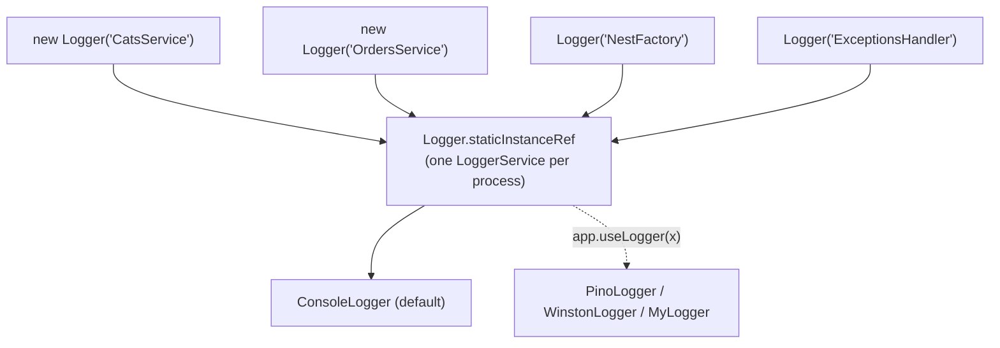
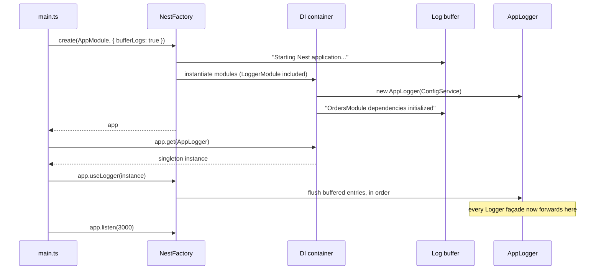

# Chapter 18 — Logging: Built-in, Custom, and Structured

> **한눈에 보기**
> 로깅은 "console.log를 예쁘게 찍는 일"이 아니라 운영 중인 시스템을 관찰하는 유일한 통로입니다.
> 이 장은 Nest 내장 `Logger`/`ConsoleLogger`의 동작 원리, 로그 레벨의 계단식 필터링, v11의 JSON 로깅,
> `LoggerService`를 구현한 커스텀 로거, DI로 로거를 주입하는 `bufferLogs` + `app.useLogger()` 부트스트랩
> 패턴, Pino/Winston 통합, 그리고 무엇을 로그에 남기고 무엇을 절대 남기면 안 되는지를 다룹니다.
> 7장의 DI 지식이 여기서 "프레임워크 자신이 쓰는 객체를 갈아끼우는" 형태로 다시 등장합니다.

**What you will learn**

- What `Logger` in `@nestjs/common` actually *is* — a façade over one mutable static implementation — and why that makes `app.useLogger()` retroactive.
- How Nest's six levels cascade, how to filter them with `logLevels`, and why `logger: false` is almost always the wrong way to quiet an application.
- How to configure `ConsoleLogger` completely, and which of its options are silently ignored under `json: true`.
- How to emit structured JSON that an aggregator indexes by field instead of by regex.
- How to write a logger against `LoggerService`, or extend `ConsoleLogger` and override only what you need.
- Why a DI-aware logger requires `bufferLogs: true`, and what you lose by using `logger: false` instead.
- How to make `nestjs-pino` or `nest-winston` the process-wide logger without touching a single service.
- What belongs in a log line, what must never appear in one, and how a correlation ID turns a pile of lines back into a request.

**Why this matters**

A checkout endpoint starts returning 500 for one user in two hundred. The logs contain the stack trace — but the trace is inside a `catch` three layers deep in a payment adapter, so it tells you *where* the code broke and nothing about *which* request, *which* customer, or *what payload* broke it. Around it sit eleven thousand lines from the same second, interleaved from twelve concurrent requests, all free text. You have a correlation problem, not a debugging problem, and more `console.log` will not fix it: the missing piece is structure, not volume.

The second failure is worse. During an incident someone adds `this.logger.debug(JSON.stringify(req.body))` to a login handler. The change ships. Three months later an audit finds plaintext passwords and card numbers in an aggregator that forty people can query and that retains data for a year. The logging system worked exactly as designed; the design was the problem.

Both are cheap to prevent and expensive to remediate, and both are decided in `main.ts` and a handful of service constructors — before there is anything to debug. This chapter treats a logger as what it is in a Nest application: a provider like any other, resolvable through the container, replaceable in tests, and uniquely also consumed by the framework itself.

---

## 1. What `Logger` actually is

`@nestjs/common` exports two easily-confused things:

- **`ConsoleLogger`** — a concrete *implementation* that formats messages and writes to `process.stdout`/`stderr`.
- **`Logger`** — a **façade**. Each instance holds a context string and forwards every call to one shared, process-wide implementation kept in a static field.

```typescript
// Conceptual sketch of Logger — not the real source.
export class Logger implements LoggerService {
  protected static staticInstanceRef: LoggerService = new ConsoleLogger();

  constructor(protected context?: string, protected options: { timestamp?: boolean } = {}) {}

  log(message: any, ...optionalParams: any[]) {
    this.localInstance?.log(message, ...optionalParams, this.context);
  }

  static overrideLogger(logger: LoggerService | LogLevel[] | boolean) { /* swaps staticInstanceRef */ }
}
```

Three consequences explain most of the surprising behaviour in this chapter:

1. **`new Logger('CatsService')` is free.** It allocates an object holding a string — no file handle, no socket. One per class as a `private readonly` field costs nothing.
2. **Replacement is retroactive.** `app.useLogger(x)` calls `Logger.overrideLogger()` internally, so every `Logger` created *before* it — including Nest's own inside `NestFactory` and `RoutesResolver` — immediately forwards to your implementation. Nothing needs re-creating.
3. **The framework logs through your door.** `Starting Nest application...` is a `Logger` call with context `NestFactory`. One configuration governs system logging *and* application logging.



A *logger implementation* is any object satisfying `LoggerService`. The *active logger* is the one in `staticInstanceRef`. There is exactly one per process, and `app.useLogger()` sets it.

---

## 2. Log levels and cascading filters

The `LogLevel` union in `@nestjs/common` is:

```typescript
export type LogLevel = 'verbose' | 'debug' | 'log' | 'warn' | 'error' | 'fatal';
```

| Level | Severity | Use it for |
|---|---|---|
| `verbose` | 0 | Firehose detail: per-item traces, raw protocol frames. Local debugging only. |
| `debug` | 1 | Developer-facing state: chosen strategy, cache hit/miss, computed query. Dev and staging. |
| `log` | 2 | Business events worth keeping — "order 41 created". This is Nest's *info* level. |
| `warn` | 3 | Recovered but shouldn't have happened: retry succeeded, config fell back to a default. |
| `error` | 4 | One operation failed. Always paired with a stack. |
| `fatal` | 5 | The process cannot continue: DB unreachable at boot, required secret missing. Added in v10. |

**Levels cascade upward** — enabling one enables everything more severe. This is the most misread part of the API:

```typescript title="src/main.ts"
const app = await NestFactory.create(AppModule, {
  logger: ['log'], // enables log, warn, error, fatal — NOT "only log"
});
```

```typescript
logger: ['error', 'warn']  // error, warn, fatal   (warn is the floor)
logger: ['verbose']        // everything
logger: ['fatal']          // fatal only
```

That last line is the correct way to make an application nearly silent. Compare it to:

```typescript
// ❌ Do not do this in production.
const app = await NestFactory.create(AppModule, { logger: false });
```

`logger: false` disables logging **entirely**, including Nest's own unhandled-exception reporting. An application configured this way that cannot reach its database exits with no output at all. Reserve it for tests, and for the narrow window before `app.useLogger()` — where §6 shows `bufferLogs` is strictly better.

### Driving levels from configuration

Hard-coding levels means redeploying to change verbosity. `main.ts` runs before the container exists, so read `process.env` with a validated fallback (the `ConfigService` from [Chapter 17](./17-configuration.md) takes over inside the app):

```typescript title="src/logging/log-levels.ts"
import { LogLevel } from '@nestjs/common';

const ORDER: LogLevel[] = ['verbose', 'debug', 'log', 'warn', 'error', 'fatal'];

/** Every level at or above `floor`; falls back to 'log' on bad input. */
export function levelsFrom(floor: string | undefined): LogLevel[] {
  const i = ORDER.indexOf((floor ?? 'log') as LogLevel);
  return ORDER.slice(i === -1 ? 2 : i);
}
```

```typescript
const app = await NestFactory.create(AppModule, { logger: levelsFrom(process.env.LOG_LEVEL) });
```

Now `LOG_LEVEL=debug` in a staging manifest is a config change, not a code change. You can also flip levels on a live `ConsoleLogger` with `setLogLevels(levels)` — useful behind an admin endpoint when you need ten minutes of debug output from a running pod.

> **Hint** — `Logger.isLevelEnabled('debug')` lets you skip expensive message construction: `if (Logger.isLevelEnabled('debug')) this.logger.debug(expensiveDump());`

---

## 3. Configuring `ConsoleLogger`

Passing an array selects levels. Passing a **`ConsoleLogger` instance** configures everything else.

```typescript title="src/main.ts"
import { NestFactory } from '@nestjs/core';
import { ConsoleLogger } from '@nestjs/common';
import { AppModule } from './app.module';

async function bootstrap() {
  const app = await NestFactory.create(AppModule, {
    logger: new ConsoleLogger({
      prefix: 'Orders',              // replaces the "[Nest]" tag
      colors: process.stdout.isTTY,
      timestamp: true,
      logLevels: ['debug', 'log', 'warn', 'error', 'fatal'],
    }),
  });
  await app.listen(process.env.PORT ?? 3000);
}
bootstrap();
```

| Option | Description | Default |
|---|---|---|
| `logLevels` | Enabled log levels (cascading, as in §2). | `['log','fatal','error','warn','debug','verbose']` |
| `timestamp` | Print the **time difference** from the previous message (`+5ms`). Ignored when `json` is on. | `false` |
| `prefix` | Tag at the start of every line. Ignored when `json` is on. | `Nest` |
| `json` | Emit each entry as one line of JSON. | `false` |
| `colors` | ANSI colourisation. `true` when `json` is off, `false` when on. | `true` |
| `context` | Default context string for this instance. | `undefined` |
| `compact` | Render objects on one line. A number *n* unites the innermost *n* levels while they fit `breakLength`. | `true` |
| `maxArrayLength` | Max elements shown for Array/TypedArray/Map/Set/WeakMap/WeakSet. `null`/`Infinity` for all, `0` or negative for none. | `100` |
| `maxStringLength` | Max characters per string. `null`/`Infinity` for all, `0` or negative for none. | `10000` |
| `sorted` | Sort object keys when formatting; may be a custom comparator. | `false` |
| `depth` | Recursion depth when inspecting objects. `Infinity`/`null` to recurse to the stack limit. | `5` |
| `showHidden` | Include non-enumerable properties and symbols, `WeakMap`/`WeakSet` entries, prototype properties. | `false` |
| `breakLength` | Column at which values wrap. `Infinity` when `compact` is `true`, `80` otherwise. | `Infinity` |

The last seven are handed straight to Node's `util.inspect`. All of them, plus `maxArrayLength`, `maxStringLength` and `sorted`, are **ignored in the parseable-JSON configuration** — `json` on, colours off, `compact` true — because there the output must stay valid JSON rather than a pretty-printed inspection.

Two options earn attention. **`depth`** is the one you will actually change: the default of `5` truncates deeper structures to `[Object]`, which is exactly what happens when you log a nested API response and see nothing useful. Raise it locally, keep it low in production — deep inspection of a large object is expensive and runs on the request's own thread. **`colors`** should track `process.stdout.isTTY`. Hard-coding `colors: true` fills log files and aggregator payloads with escape sequences like `[32m`, breaking grep, JSON parsers, and every dashboard downstream.

---

## 4. JSON logging

Free-text logs are searchable by substring. Structured logs are searchable by *field* — `level:error AND context:PaymentsService AND orderId:41` — and that difference is what makes an aggregator worth paying for. Since v11 `ConsoleLogger` produces structured output natively:

```typescript
const app = await NestFactory.create(AppModule, {
  logger: new ConsoleLogger({ json: true }),
});
```

Each entry becomes one line:

```json
{
  "level": "log",
  "pid": 19096,
  "timestamp": 1607370779834,
  "message": "Starting Nest application...",
  "context": "NestFactory"
}
```

That shape is the point. `timestamp` is epoch milliseconds; `pid` distinguishes workers in a clustered deployment; `context` is the class name you passed to the `Logger` constructor and becomes a first-class filter dimension. Platforms that ingest container stdout — AWS ECS/CloudWatch, GCP Cloud Logging, Loki, Datadog — parse this with no custom pattern, giving you field-based filtering, aggregation, and alerting for free.

Two behaviours to internalise. **`json: true` disables colours automatically** so the output stays valid JSON; you may force `colors: true` for local reading, but colourised JSON is not parseable downstream and belongs in a dev profile only. And **`prefix` and the `+5ms` timestamp are ignored** under `json` — the prefix is a constant better set as an aggregator label, and the diff is derivable from the absolute `timestamp` field.

The pragmatic setup — colourised text locally, JSON everywhere deployed:

```typescript title="src/main.ts"
const isProduction = process.env.NODE_ENV === 'production';

const app = await NestFactory.create(AppModule, {
  logger: new ConsoleLogger({
    json: isProduction,
    colors: !isProduction && process.stdout.isTTY,
    timestamp: !isProduction,
    prefix: 'Orders',
    logLevels: levelsFrom(process.env.LOG_LEVEL),
  }),
});
```

> **⚠️ Notice** — Under `json: true` whatever you pass as `message` is serialised. An object with a circular reference, a `BigInt`, or a throwing getter will produce a broken line or crash the formatter. Pass plain, pre-shaped data.

---

## 5. A logger per class, with a context and a timestamp

The convention that makes logs navigable is one `Logger` per class, named after the class:

```typescript title="src/cats/cats.service.ts"
import { Injectable, Logger } from '@nestjs/common';
import { Cat } from './cat.entity';

@Injectable()
export class CatsService {
  private readonly logger = new Logger(CatsService.name);

  create(cat: Cat) {
    this.logger.log(`Creating cat ${cat.id}`);
    return cat;
  }
}
```

`CatsService.name`, not the literal `'CatsService'`: a rename in your editor updates it, a string silently rots. The context prints in square brackets in text mode and as a `context` field in JSON mode:

```bash
[Nest] 19096   - 12/08/2019, 7:12:59 AM   [CatsService] Creating cat 41
```

Because `Logger` is a façade, this instance costs nothing and automatically follows whatever active logger the process ends up with. **Write application code against `Logger` from `@nestjs/common` and decide the implementation once in `main.ts`** — that recommendation holds even when the implementation turns out to be Pino (§7).

`Logger.error` takes the stack as a second parameter. Log message and stack separately rather than interpolating the error into the string; aggregators index them as distinct fields, and traces survive instead of collapsing to `[object Object]`:

```typescript
catch (err) {
  this.logger.error(`Charge failed for order ${order.id}`, err instanceof Error ? err.stack : undefined);
  throw err;
}
```

### The `+5ms` diff

`Logger`'s second constructor argument takes options — most usefully `timestamp`:

```typescript
private readonly logger = new Logger(MyService.name, { timestamp: true });
```

```bash
[Nest] 19096   - 04/19/2024, 7:12:59 AM   [MyService] Doing something with timestamp here +5ms
```

Read `+5ms` carefully: it is **not** the duration of the operation being logged. It is the delta since the *previous line from the same logger*, whatever that was. It is a poor-man's profiler for a sequential startup path, and actively misleading under concurrent load where lines from different requests interleave. For real timing, measure and log the number as data — `{ event: 'query.finished', ms: 42 }` is queryable (`ms > 500`); `+5ms` is not.

---

## 6. Custom implementations: `LoggerService` and `ConsoleLogger`

Any object with the right methods can be the active logger. The contract is `LoggerService`:

```typescript title="src/logging/my-logger.service.ts"
import { Injectable, LoggerService } from '@nestjs/common';

@Injectable()
export class MyLogger implements LoggerService {
  log(message: any, ...optionalParams: any[]) {}      // 'log' level
  fatal(message: any, ...optionalParams: any[]) {}    // 'fatal' level
  error(message: any, ...optionalParams: any[]) {}    // 'error' level
  warn(message: any, ...optionalParams: any[]) {}     // 'warn' level
  debug?(message: any, ...optionalParams: any[]) {}   // optional
  verbose?(message: any, ...optionalParams: any[]) {} // optional
}
```

`debug` and `verbose` are optional; the other four are not. Note the shape of `optionalParams`: when a call arrives through the `Logger` façade, **the last element is the context string**. A logger that ignores this prints `CatsService` as if it were part of the message.

The simplest custom logger already exists — the global `console` satisfies `LoggerService`, so `logger: console` works. That is a debugging trick, not a configuration: you lose levels, contexts, and formatting. A real hand-written one:

```typescript title="src/logging/my-logger.service.ts"
import { Injectable, LoggerService, LogLevel } from '@nestjs/common';

@Injectable()
export class MyLogger implements LoggerService {
  private readonly enabled = new Set<LogLevel>(['log', 'warn', 'error', 'fatal']);

  private write(level: LogLevel, message: any, params: any[]) {
    if (!this.enabled.has(level)) return;
    const context = typeof params.at(-1) === 'string' ? params.at(-1) : undefined;
    process.stdout.write(
      JSON.stringify({ level, time: new Date().toISOString(), context, message }) + '\n',
    );
  }

  log(m: any, ...p: any[]) { this.write('log', m, p); }
  fatal(m: any, ...p: any[]) { this.write('fatal', m, p); }
  error(m: any, ...p: any[]) { this.write('error', m, p); }
  warn(m: any, ...p: any[]) { this.write('warn', m, p); }
  debug(m: any, ...p: any[]) { this.write('debug', m, p); }
  verbose(m: any, ...p: any[]) { this.write('verbose', m, p); }
}
```

```typescript
const app = await NestFactory.create(AppModule, { logger: new MyLogger() });
```

This works and has a real defect: `new MyLogger()` bypasses the container, so it cannot inject `ConfigService`, cannot be overridden in a testing module, and cannot be reused through DI. §7 fixes that. Before it, there is usually a shorter path.

### Extending the built-in logger

Most "custom logger" requirements are really "the built-in one, plus one thing". Subclass instead of reimplementing:

```typescript title="src/logging/my-logger.service.ts"
import { ConsoleLogger } from '@nestjs/common';

export class MyLogger extends ConsoleLogger {
  error(message: any, stack?: string, context?: string) {
    // add your tailored logic here — e.g. forward to Sentry
    super.error(...arguments);
  }
}
```

**Always call `super`.** Nest relies on `ConsoleLogger`'s behaviour for its own system messages; an override that swallows the call silently deletes bootstrap diagnostics. Under `strict`, prefer the explicit `super.error(message, stack, context)`.

A more realistic subclass adds a custom method and per-consumer context:

```typescript title="src/logging/app-logger.service.ts"
import { ConsoleLogger, Injectable, Scope } from '@nestjs/common';

@Injectable({ scope: Scope.TRANSIENT })
export class AppLogger extends ConsoleLogger {
  customLog() {
    this.log('Please feed the cat!');
  }
}
```

`Scope.TRANSIENT` matters, and the reason is subtle. `ConsoleLogger` carries a **mutable** `context` field set by `setContext()`. At default singleton scope every consumer shares one instance, so the last `setContext()` wins and suddenly every line in the application is tagged `PaymentsService`. Transient scope gives each injecting class its own instance:

```typescript title="src/cats/cats.service.ts"
import { Injectable } from '@nestjs/common';
import { AppLogger } from '../logging/app-logger.service';

@Injectable()
export class CatsService {
  private readonly cats: Cat[] = [];

  constructor(private myLogger: AppLogger) {
    // Transient scope: this instance is ours alone, so setContext is safe here.
    this.myLogger.setContext('CatsService');
  }

  findAll(): Cat[] {
    this.myLogger.warn('About to return cats!'); // built-in methods
    this.myLogger.customLog();                   // and your own
    return this.cats;
  }
}
```

Transient scope has a cost ([Chapter 38](../part3-advanced/38-injection-scopes.md)), but a bounded one: transient providers are created once per *consumer* at bootstrap, not once per request. A logger is precisely the case the scope was designed for.

---

## 7. Making the logger a provider: `bufferLogs` and `useLogger`

Now the interesting problem. You want a logger that (a) can inject `ConfigService`, and (b) is also the logger Nest itself uses during bootstrap. Those fight each other: `NestFactory.create()` runs *before* any module is instantiated, so there is no container to resolve a logger from.

The answer is a two-phase bootstrap.

```typescript title="src/logging/logger.module.ts"
import { Module } from '@nestjs/common';
import { AppLogger } from './app-logger.service';

@Module({ providers: [AppLogger], exports: [AppLogger] })
export class LoggerModule {}
```

At least one module in the graph must import `LoggerModule`, or Nest never instantiates `AppLogger` and `app.get()` fails.

```typescript title="src/main.ts"
import { NestFactory } from '@nestjs/core';
import { AppModule } from './app.module';
import { AppLogger } from './logging/app-logger.service';

async function bootstrap() {
  const app = await NestFactory.create(AppModule, { bufferLogs: true });
  app.useLogger(app.get(AppLogger));
  await app.listen(process.env.PORT ?? 3000);
}
bootstrap();
```



`bufferLogs: true` tells Nest to **hold** every entry in memory instead of printing it, until `useLogger()` attaches an implementation or initialisation finishes. The buffer is then flushed through the new logger in original order — so your DI-built logger receives even the messages emitted before it existed. If initialisation *fails* while buffering, Nest falls back to the original `ConsoleLogger` to print the error, so a boot crash is never silent. A related knob, `autoFlushLogs` (default `true`), can be set to `false` to flush manually with `Logger.flush()` — useful when your transport is itself asynchronous.

> **Hint** — You will see `logger: false` used instead. It works but *discards* rather than buffers: nothing is logged between `create()` and `useLogger()`, so an initialisation error in that window vanishes. Prefer `bufferLogs`. If you don't mind the first few lines going through the default logger, omitting both is also fine.

### Injecting `Logger` as a token

Instead of injecting your concrete class everywhere, register your implementation *under the `Logger` token*:

```typescript title="src/app.module.ts"
import { Logger, Module } from '@nestjs/common';
import { AppLogger } from './logging/app-logger.service';

@Module({
  providers: [{ provide: Logger, useClass: AppLogger }],
  exports: [Logger],
})
export class AppModule {}
```

Consumers then depend on the framework type: `constructor(private readonly logger: Logger) {}`. This is the [Chapter 7](../part1-beginner/07-dependency-injection-basics.md) `useClass` recipe applied to logging, and it is the cleanest option for a shared library — consumers see only `@nestjs/common` types, and a testing module can swap it with `overrideProvider(Logger).useValue(mockLogger)`.

| Approach | How you get it | Context handling | Best for |
|---|---|---|---|
| `new Logger(Foo.name)` | Construct in the class | Fixed at construction, per class | Default choice; application code |
| Inject `AppLogger` (transient) | Constructor injection | `setContext()` in the constructor | You need custom methods on the logger |
| `{ provide: Logger, useClass: AppLogger }` | Inject `Logger` | Per call, or set in the factory | Libraries; easy test substitution |

All three reach the same active logger once `app.useLogger()` has run. Mixing them is legal but confusing — pick one per project.

---

## 8. Using an external logger: Pino and Winston

`ConsoleLogger` is enough for many services. Reach for a dedicated library when you need sub-microsecond serialisation at high throughput, transports (rotating files, syslog, HTTP shipping), redaction rules, or per-request child loggers.

### Pino via `nestjs-pino`

```bash
$ npm install nestjs-pino pino-http pino
$ npm install --save-dev pino-pretty
```

```typescript title="src/app.module.ts"
import { Module } from '@nestjs/common';
import { LoggerModule } from 'nestjs-pino';
import { ConfigModule, ConfigService } from '@nestjs/config';
import { randomUUID } from 'node:crypto';
import type { IncomingMessage, ServerResponse } from 'node:http';

@Module({
  imports: [
    ConfigModule.forRoot({ isGlobal: true }),
    LoggerModule.forRootAsync({
      inject: [ConfigService],
      useFactory: (config: ConfigService) => {
        const isProduction = config.get('NODE_ENV') === 'production';
        return {
          pinoHttp: {
            level: config.get<string>('LOG_LEVEL') ?? 'info',
            // Reuse an upstream correlation id when present; otherwise mint one.
            genReqId: (req: IncomingMessage, res: ServerResponse) => {
              const raw = req.headers['x-request-id'];
              const id = (Array.isArray(raw) ? raw[0] : raw) ?? randomUUID();
              res.setHeader('x-request-id', id);
              return id;
            },
            customProps: () => ({ release: process.env.GIT_SHA ?? 'dev' }),
            redact: {
              paths: [
                'req.headers.authorization',
                'req.headers.cookie',
                'req.body.password',
                'req.body.cardNumber',
                'res.headers["set-cookie"]',
              ],
              censor: '[redacted]',
            },
            serializers: {
              req: (req) => ({ id: req.id, method: req.method, url: req.url }),
              res: (res) => ({ statusCode: res.statusCode }),
            },
            autoLogging: { ignore: (req) => req.url === '/health' },
            transport: isProduction
              ? undefined // raw NDJSON to stdout; let the platform ship it
              : { target: 'pino-pretty', options: { singleLine: true, colorize: true } },
          },
        };
      },
    }),
  ],
})
export class AppModule {}
```

```typescript title="src/main.ts"
import { NestFactory } from '@nestjs/core';
import { Logger } from 'nestjs-pino';
import { AppModule } from './app.module';

async function bootstrap() {
  const app = await NestFactory.create(AppModule, { bufferLogs: true });
  app.useLogger(app.get(Logger));
  await app.listen(process.env.PORT ?? 3000);
}
bootstrap();
```

This is exactly the §7 pattern. The payoff is that **your services do not change**: they still hold `new Logger(CatsService.name)` from `@nestjs/common`, and every call now lands in Pino with the request id attached automatically.

### Winston via `nest-winston`

```bash
$ npm install nest-winston winston winston-daily-rotate-file
```

```typescript title="src/main.ts"
import { NestFactory } from '@nestjs/core';
import { WinstonModule } from 'nest-winston';
import * as winston from 'winston';
import 'winston-daily-rotate-file';
import { AppModule } from './app.module';

async function bootstrap() {
  const app = await NestFactory.create(AppModule, {
    logger: WinstonModule.createLogger({
      level: process.env.LOG_LEVEL ?? 'info',
      format: winston.format.combine(
        winston.format.timestamp(),
        winston.format.errors({ stack: true }),
        winston.format.json(),
      ),
      defaultMeta: { service: 'orders-api', release: process.env.GIT_SHA ?? 'dev' },
      transports: [
        new winston.transports.Console({
          format:
            process.env.NODE_ENV === 'production'
              ? winston.format.json()
              : winston.format.combine(winston.format.colorize(), winston.format.simple()),
        }),
        new winston.transports.DailyRotateFile({
          filename: 'logs/app-%DATE%.log',
          datePattern: 'YYYY-MM-DD',
          maxSize: '20m',
          maxFiles: '14d',
          level: 'warn',
        }),
      ],
    }),
  });
  await app.listen(process.env.PORT ?? 3000);
}
bootstrap();
```

`WinstonModule.createLogger()` returns a `LoggerService`, so it goes straight into the `logger` option — no `bufferLogs` needed, since nothing comes out of the container. If you *do* want DI, use `WinstonModule.forRootAsync()` in `AppModule` and then `app.useLogger(app.get(WINSTON_MODULE_NEST_PROVIDER))` with `bufferLogs: true`.

| | `ConsoleLogger` | `nestjs-pino` | `nest-winston` |
|---|---|---|---|
| Throughput | Adequate | Highest | Moderate |
| Structured output | `json: true` | Native NDJSON | Via `format.json()` |
| Transports (file, syslog, HTTP) | No | Worker-thread transports | Many, built in |
| Redaction | Manual | `redact` paths | Custom format |
| Per-request child logger | No | Yes (ALS-backed) | Manual |
| Extra dependencies | None | 3 | 2+ |

Recommendation: start on `ConsoleLogger` with `json: true`; move to `nestjs-pino` when you need request-scoped context or redaction, which for most APIs is the moment you go to production; pick Winston when a transport requirement decides it for you.

---

## 9. Correlation IDs

A log line without a request identifier is a fact with no story attached. The rule: **accept an incoming `x-request-id` if present, mint a UUID if not, echo it on the response, and attach it to every line for that request.** Accepting the upstream value is what makes it work across service boundaries — a gateway generates it once and every downstream hop inherits it.

Passing the id through method parameters pollutes every signature in the call stack. Store it in `AsyncLocalStorage` instead, where any code running inside the request can read it without being handed it:

```typescript title="src/logging/request-context.ts"
import { AsyncLocalStorage } from 'node:async_hooks';

export const requestContext = new AsyncLocalStorage<{ requestId: string }>();
```

A middleware ([Chapter 8](../part1-beginner/08-middleware.md)) opens the store, and the logger reads it with no cooperation from callers — see §11 for both halves wired together. If you use `nestjs-pino`, all of this is already done: `genReqId` above sets it and Pino's ALS-backed child logger stamps `req.id` on every line. The full mechanism, including its interaction with request-scoped providers, worker threads, and microservice transports, is [Chapter 43 — AsyncLocalStorage and Request Context Propagation](../part3-advanced/43-async-local-storage.md).

---

## 10. What to log — and what must never be logged

Logs are a data store with weak access control and long retention. Treat every line as something a contractor may read in eighteen months.

| Category | Example | Verdict |
|---|---|---|
| Correlation id | `requestId`, `traceId`, `spanId` | **Always.** Without it the rest is unusable. |
| Actor identifier | Internal `userId`, `tenantId` | **Yes** — opaque internal ids only, never email or name. |
| Operation outcome | `order.created`, `statusCode`, `durationMs` | **Yes.** Dashboards and alerts are built from this. |
| Resource ids | `orderId`, `invoiceId` | **Yes.** They make a line actionable. |
| Error message + stack | `err.message`, `err.stack` | **Yes**, as separate fields — after checking the message doesn't embed a parameterised query. |
| Deployment metadata | `release`/`GIT_SHA`, `pid`, `hostname` | **Yes.** Turns "it broke" into "it broke after the 14:02 deploy". |
| Credentials | Passwords, API keys, tokens, `Authorization`, session cookies | **Never.** A logged token is a leaked token — rotate it, don't redact it later. |
| Payment data | PAN, CVV, expiry, IBAN | **Never.** PCI-DSS forbids storing CVV at all, logs included. |
| Government/health identifiers | SSN, national ID, passport, medical records | **Never.** |
| Direct personal data | Email, phone, address, full name, precise location | **Avoid.** Log the internal id and join at query time in a system with access controls. |
| Whole request/response bodies | `JSON.stringify(req.body)` | **Never wholesale.** Log a field allowlist — bodies are where secrets and PII hide. |
| High-cardinality noise | Per-row loop traces in production | **No.** `verbose`, disabled outside a debugging session. |

Two habits make this durable rather than aspirational. **Redact at the logger, not at the call site** — a call site is one code review away from regressing, while a `redact` path list applies to everything forever. And **log events, not sentences**: `this.logger.log({ event: 'order.created', orderId, tenantId, totalCents })` is filterable, aggregatable, and alertable; `` this.logger.log(`Created order ${orderId} for ${email}`) `` is none of those and has already leaked an email address.

> **⚠️ Notice** — Logging is not free. Under `json: true` every entry costs a serialisation on the request's own thread; at `verbose` under load, logging can dominate a service's CPU profile. Set production levels deliberately and measure.

---

## Common mistakes

1. **Symptom:** `logger: ['error']` is set and a config bug still produces no output, even when the app fails to boot.
   **Cause:** Someone later changed it to `logger: false`, which disables *everything*, including Nest's own exception reporting.
   **Fix:** Use `logger: ['fatal']` to be nearly silent, or a `ConsoleLogger` with `logLevels`. Reserve `false` for tests.

2. **Symptom:** `logger: ['debug']` is set and you still see `log` lines you didn't ask for.
   **Cause:** Levels cascade — naming one enables every more severe level too.
   **Fix:** Intended behaviour. To exclude a level you must raise the floor above it; there is no per-level allowlist.

3. **Symptom:** Every line in the app shows the same `[PaymentsService]` context, regardless of origin.
   **Cause:** A `ConsoleLogger` subclass registered at default singleton scope, with each consumer calling `setContext()` on the shared instance. The last call wins.
   **Fix:** `@Injectable({ scope: Scope.TRANSIENT })` on the logger.

4. **Symptom:** `app.get(MyLogger)` throws `Nest could not find MyLogger element`.
   **Cause:** `LoggerModule` is defined but never imported, so the provider was never instantiated.
   **Fix:** Import it into `AppModule` (or mark it `@Global()`). `app.get()` retrieves an existing singleton; it does not create one. For a transient logger use `await app.resolve()`.

5. **Symptom:** After switching to a custom logger the first ~20 bootstrap lines are missing.
   **Cause:** `logger: false` was used to silence the pre-`useLogger()` window, discarding those entries.
   **Fix:** `bufferLogs: true` — the entries are held and replayed through your logger once attached.

6. **Symptom:** A `ConsoleLogger` subclass overrides `error()` and Nest's unhandled-exception traces disappear.
   **Cause:** The override does not call `super.error()`.
   **Fix:** Always delegate to `super` after your own logic.

7. **Symptom:** Log shipping breaks with "invalid JSON" after copying a local `json: true` config to production.
   **Cause:** `colors: true` was set explicitly, so ANSI escapes are embedded in the JSON.
   **Fix:** Let `json: true` disable colours; gate `colors` on `process.stdout.isTTY`.

8. **Symptom:** A nested object logs as `{ payment: { gateway: [Object] } }`.
   **Cause:** `depth` defaults to `5` and `util.inspect` truncates below it.
   **Fix:** Raise `depth` in development, or better, log a flat pre-shaped event object with only the fields you need.

---

## 11. Putting it together

Environment-driven levels, JSON in deployed environments, correlation IDs from `AsyncLocalStorage`, a DI-built logger, and a service that stays framework-agnostic.

```typescript title="src/logging/app-logger.service.ts"
import { ConsoleLogger, Injectable, Scope } from '@nestjs/common';
import { ConfigService } from '@nestjs/config';
import { requestContext } from './request-context';
import { levelsFrom } from './log-levels';

@Injectable({ scope: Scope.TRANSIENT })
export class AppLogger extends ConsoleLogger {
  constructor(config: ConfigService) {
    const isProduction = config.get('NODE_ENV') === 'production';
    super({
      json: isProduction,
      colors: !isProduction && process.stdout.isTTY,
      timestamp: !isProduction,
      prefix: 'Orders',
      depth: isProduction ? 3 : 8,
      logLevels: levelsFrom(config.get<string>('LOG_LEVEL')),
    });
  }

  /** Emit a structured event; the request id is attached automatically. */
  event(name: string, data: Record<string, unknown> = {}) {
    this.log({ event: name, requestId: requestContext.getStore()?.requestId, ...data });
  }
}
```

```typescript title="src/logging/logger.module.ts"
import { Global, MiddlewareConsumer, Module, NestModule } from '@nestjs/common';
import { randomUUID } from 'node:crypto';
import type { Request, Response, NextFunction } from 'express';
import { requestContext } from './request-context';
import { AppLogger } from './app-logger.service';

@Global()
@Module({ providers: [AppLogger], exports: [AppLogger] })
export class LoggerModule implements NestModule {
  configure(consumer: MiddlewareConsumer) {
    consumer
      .apply((req: Request, res: Response, next: NextFunction) => {
        const raw = req.headers['x-request-id'];
        const requestId = (Array.isArray(raw) ? raw[0] : raw) ?? randomUUID();
        res.setHeader('x-request-id', requestId);
        requestContext.run({ requestId }, () => next());
      })
      .forRoutes('*');
  }
}
```

```typescript title="src/orders/orders.service.ts"
import { Injectable } from '@nestjs/common';
import { AppLogger } from '../logging/app-logger.service';

@Injectable()
export class OrdersService {
  constructor(private readonly logger: AppLogger) {
    this.logger.setContext(OrdersService.name); // safe: transient scope
  }

  async create(input: { tenantId: string; userId: string; totalCents: number; card: string }) {
    const startedAt = performance.now();
    try {
      const orderId = await this.persist(input);
      // An event, not a sentence — and note that `card` never appears.
      this.logger.event('order.created', {
        orderId,
        tenantId: input.tenantId,
        userId: input.userId,
        totalCents: input.totalCents,
        ms: Math.round(performance.now() - startedAt),
      });
      return { orderId };
    } catch (err) {
      this.logger.error(
        { event: 'order.create_failed', tenantId: input.tenantId },
        err instanceof Error ? err.stack : undefined,
      );
      throw err;
    }
  }

  private async persist(_input: unknown): Promise<number> {
    return 41;
  }
}
```

```typescript title="src/main.ts"
import { NestFactory } from '@nestjs/core';
import { AppModule } from './app.module';
import { AppLogger } from './logging/app-logger.service';

async function bootstrap() {
  const app = await NestFactory.create(AppModule, { bufferLogs: true });
  app.useLogger(await app.resolve(AppLogger)); // resolve(), not get(): transient scope
  await app.listen(process.env.PORT ?? 3000);
}
bootstrap();
```

Run it with `NODE_ENV=production LOG_LEVEL=log` and every line — yours and Nest's — is single-line JSON carrying `level`, `context`, `requestId`, and your event fields, with no card number anywhere in sight.

---

> **핵심 정리**
> - `@nestjs/common`의 `Logger`는 구현체가 아니라 **파사드**다. 프로세스 전체에 활성 로거는 하나뿐이며, `app.useLogger()`는 이미 만들어진 모든 `Logger` 인스턴스에 소급 적용된다.
> - 레벨 `verbose < debug < log < warn < error < fatal`은 **계단식**이다. `['log']`는 "log만"이 아니라 "log 이상 전부"를 뜻한다.
> - `logger: false`는 Nest 자신의 부팅 오류 보고까지 끈다. 조용하게 만들려면 `['fatal']`을 쓰고 `false`는 테스트에만 쓴다.
> - `ConsoleLogger`의 `compact`·`depth`·`breakLength` 등은 Node의 `util.inspect`로 전달되며, 파싱 가능한 JSON 모드에서는 무시된다. `prefix`와 `+5ms`도 `json: true`에서 무시된다.
> - 클래스마다 `new Logger(Foo.name)`을 두는 것이 기본 관례다. 비용은 사실상 0이고, 나중에 구현체를 바꿔도 애플리케이션 코드는 그대로다.
> - DI가 필요한 로거는 `bufferLogs: true` → `app.useLogger(app.get(MyLogger))` 2단계 부팅으로 연결한다. 버퍼 덕분에 로거 생성 이전 메시지도 유실되지 않는다.
> - `ConsoleLogger`를 상속할 때는 반드시 `super`를 호출하고, `setContext()`를 쓴다면 `Scope.TRANSIENT`로 선언하라. 싱글턴이면 컨텍스트가 앱 전체에서 덮어써진다.
> - `{ provide: Logger, useClass: MyLogger }`는 소비자가 프레임워크 타입에만 의존하게 해 라이브러리와 테스트 대체에 유리하다. Pino/Winston도 `LoggerService`를 만족하므로 서비스 코드는 한 줄도 바뀌지 않는다.
> - 상관관계 ID는 `AsyncLocalStorage`에 넣어 로거가 스스로 읽게 하라. 인자로 넘기지 마라.
> - 자격 증명·카드 정보·주민번호·요청 본문 전체는 **절대** 남기지 않는다. 호출부가 아니라 **로거 계층에서** 마스킹하라.

> **연습 문제**
> 1. `logger: ['warn']`로 앱을 띄우고 `log`, `debug`, `error`, `fatal`을 각각 호출해 무엇이 출력되는지 확인하라. 계단식 규칙을 실제 출력으로 설명해 보라.
> 2. `json: true`와 `colors: true`를 동시에 켠 뒤 출력을 `JSON.parse()`에 넣어 보라. 무슨 일이 일어나며, 왜 배포 환경에서 이 조합을 금지해야 하는가? `depth`를 `1`과 `10`으로 바꿔 가며 4단계 중첩 객체가 어디서 `[Object]`로 잘리는지도 확인하라.
> 3. **구현 과제**: `ConfigService`를 주입받아 `LOG_LEVEL`과 `NODE_ENV`에 따라 스스로를 설정하는 `AppLogger`를 만들고 `bufferLogs: true` + `app.useLogger()`로 연결하라. 그다음 `logger: false`로 바꿔 부팅 중 일부러 예외를 던져 보고 두 방식의 출력 차이를 기록하라.
> 4. **구현 과제**: `x-request-id`를 수용/생성해 `AsyncLocalStorage`에 저장하는 미들웨어와, 이를 모든 라인에 자동으로 붙이는 로거를 작성하라. 동시에 20개 요청을 보내 각 요청의 로그가 ID로 완전히 분리되는지 확인하라.
> 5. **구현 과제**: `password`, `authorization`, `cardNumber`를 마스킹하는 스크러빙 계층을 로거 안에 구현하고, 호출부에서 일부러 그 필드가 든 객체를 로깅해 마스킹이 동작함을 테스트로 증명하라. 호출부가 아니라 로거에서 처리해야 하는 이유를 한 문단으로 정리하라.
> 6. `nestjs-pino`로 같은 앱을 전환하되 서비스 코드는 한 줄도 바꾸지 말라. 무엇을 바꿔야 했고, 왜 서비스 코드는 그대로여도 되는가?

**Next:** Logging gives you visibility into what your application did; the next chapter gives it something substantial to do. [Chapter 19 — SQL Databases with TypeORM](./19-sql-with-typeorm.md) introduces persistence — repositories, relations, transactions, and migrations — and every failure mode there is one you will first meet as a log line.
