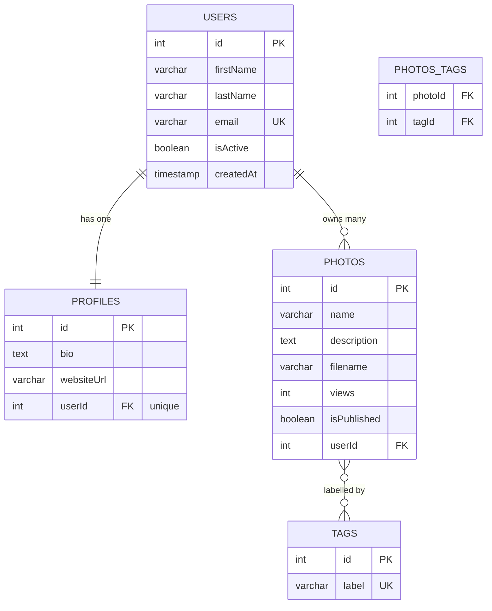
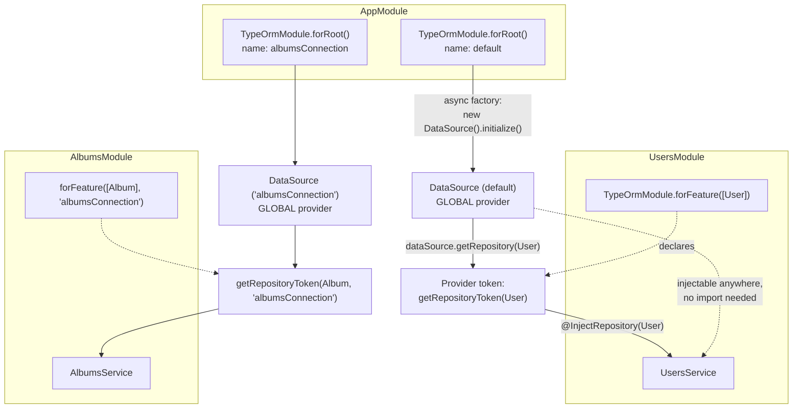

# Chapter 19 — SQL Databases with TypeORM

> **한눈에 보기**
> 이 장은 Nest 애플리케이션에 관계형 데이터베이스를 붙이는 표준 경로인 `@nestjs/typeorm`을
> 처음부터 끝까지 다룹니다. `TypeOrmModule.forRoot()`가 부트스트랩 시점에 실제로 무엇을
> 등록하는지, `@InjectRepository()`가 왜 토큰 하나로 환원되는지, 관계·트랜잭션·구독자·
> 마이그레이션을 어떻게 다루는지를 설명합니다. 6장의 모듈 그래프와 17장의 `ConfigService`가
> 여기서 처음으로 하나의 실전 배선으로 합쳐집니다. 그리고 이 장의 절반은 한 문장을 위한
> 것입니다 — **`synchronize: true`는 절대 프로덕션에 도달해서는 안 됩니다.**

**What you will learn**

- What `TypeOrmModule.forRoot()` registers at bootstrap — the `DataSource`, the `EntityManager`, the retry loop — and why those become injectable everywhere without importing anything.
- Why `@InjectRepository(User)` is not magic but a `getRepositoryToken(User)` lookup, and what that fact buys you in tests.
- How to model one-to-one, one-to-many, and many-to-many relations so that the generated SQL is the SQL you intended, including the `cascade` / `eager` traps.
- How to run a transaction with `QueryRunner` without making the surrounding service impossible to unit test.
- Why `synchronize: true` will eventually drop a production column, and the exact migration workflow — CLI DataSource file included — that replaces it.
- How to register a second database, a custom repository, and an entity subscriber, and what each costs.
- How to build the same integration by hand with custom providers, and the two situations where that is actually the right call.

**Why this matters**

A team runs a staging environment with `synchronize: true` because it is convenient — the schema follows the entities, nobody writes migrations, onboarding is fast. Someone renames `User.email` to `User.emailAddress`. TypeORM's schema synchronizer sees a column named `email` that no entity claims, and a column named `emailAddress` that does not exist. It does the only thing it knows how to do: `ALTER TABLE user DROP COLUMN email`, then `ALTER TABLE user ADD emailAddress`. In staging that is a shrug. The same config reaches production through a copied `.env`, and forty thousand email addresses are gone. There is no error message, no warning, no exception — the synchronizer did exactly what it was designed to do.

That failure is not really about TypeORM. It is about the difference between a *derived* schema and an *owned* schema. Everything in this chapter that looks like ceremony — migrations, a separate CLI DataSource file, `autoLoadEntities` instead of a root-module entity list — exists to draw that line clearly.

The second reason this chapter matters is architectural. The data layer is the place where Nest's dependency injection stops being an academic nicety. A repository is an asynchronous resource: it does not exist until a TCP connection is established and the entity metadata is built. Nest's async providers make that invisible — your service constructor receives a fully-initialized `Repository<User>` and never thinks about connection timing. Understanding *how* that invisibility works is what lets you replace the repository in a test, point one module at a second database, or swap the whole integration for hand-rolled providers when you need to.

TypeORM is the most mature TypeScript ORM and the one the Nest docs lead with, but it is also opinionated in ways that will surprise you — decorator metadata drives everything, the query builder and the repository API disagree about several behaviours, and lazy relations are a footgun. This chapter is honest about that.

## What `TypeOrmModule.forRoot()` actually does

Install the integration package, TypeORM itself, and a driver:

```bash
$ npm install --save @nestjs/typeorm typeorm mysql2
```

Swap `mysql2` for `pg` (PostgreSQL), `sqlite3`, `better-sqlite3`, `mssql`, `oracledb`, or `mongodb`. Nothing else in this chapter changes except the `type` field — the procedure is identical for every database TypeORM supports.

```typescript title="app.module.ts"
import { Module } from '@nestjs/common';
import { TypeOrmModule } from '@nestjs/typeorm';

@Module({
  imports: [
    TypeOrmModule.forRoot({
      type: 'mysql',
      host: 'localhost',
      port: 3306,
      username: 'root',
      password: 'root',
      database: 'test',
      entities: [],
      synchronize: true,
    }),
  ],
})
export class AppModule {}
```

> **⚠️ Notice** — `synchronize: true` must never be true in production. It is shown here because every tutorial shows it; the section on migrations explains what to do instead, and the "Common mistakes" section explains how it reaches production despite everyone knowing better.

`forRoot()` is a **dynamic module** (Chapter 37 covers the mechanism in full). What it returns is a module whose providers include:

1. A provider for the resolved options object, keyed by an internal token.
2. An **async factory provider** that constructs `new DataSource(options)` and calls `.initialize()`. Because the factory returns a `Promise`, Nest will not instantiate anything that depends on it until the promise settles. That is the whole reason your services can treat a repository as if it were synchronous.
3. A provider that pulls `dataSource.manager` out and exposes it under the `EntityManager` token.
4. `exports` for both, marked **global**, so `DataSource` and `EntityManager` are injectable anywhere in the application without importing `TypeOrmModule` again.

That last point is worth stating plainly, because it surprises people who have internalized Chapter 6's rule that you can only inject what your module imports:

```typescript title="app.module.ts"
import { Module } from '@nestjs/common';
import { TypeOrmModule } from '@nestjs/typeorm';
import { DataSource } from 'typeorm';
import { UsersModule } from './users/users.module';

@Module({
  imports: [TypeOrmModule.forRoot({ /* ... */ }), UsersModule],
})
export class AppModule {
  constructor(private dataSource: DataSource) {}
}
```

Any provider in any module can ask for `DataSource` or `EntityManager` and get the default connection. Repositories are *not* global — those come from `forFeature()`, and that difference is deliberate.

### The Nest-specific options

`forRoot()` accepts every option the TypeORM `DataSource` constructor accepts, plus three that `@nestjs/typeorm` adds:

| Option | Default | What it does |
|---|---|---|
| `retryAttempts` | `10` | How many times to retry the initial connection before letting bootstrap fail. |
| `retryDelay` | `3000` | Milliseconds between connection retries. |
| `autoLoadEntities` | `false` | If `true`, every entity registered via `forFeature()` is appended to the `entities` array automatically. |
| `verboseRetryLog` | `false` | Logs the full error on each retry rather than a one-line message. |
| `manualInitialization` | `false` | Creates the `DataSource` but does not call `initialize()`; you do it yourself. |
| `dataSourceFactory` | — | Async-config only. Supply your own initialized `DataSource`. |

`retryAttempts` and `retryDelay` matter more than they look. In Docker Compose or Kubernetes, the application container regularly starts before the database is accepting connections. Without a retry loop your app crashes, the orchestrator restarts it, and you get a crash-loop that eventually resolves — noisily. With the default ten attempts at three seconds you get thirty seconds of quiet tolerance. For slow-starting managed databases, raise it:

```typescript
TypeOrmModule.forRoot({
  // ...
  retryAttempts: 20,
  retryDelay: 5000,
  verboseRetryLog: true,
})
```

Do not set `retryAttempts` to `Infinity`. A permanently wrong password should fail your deployment, not hang it.

## Entities: mapping classes to tables

An entity is a class decorated with `@Entity()` whose properties are decorated with column decorators. TypeORM reads that decorator metadata at `DataSource.initialize()` time and builds an in-memory schema description.

Our worked domain for this chapter is a small photo service: users have exactly one profile, many photos, and photos carry many tags.

```typescript title="users/user.entity.ts"
import {
  Entity,
  Column,
  PrimaryGeneratedColumn,
  CreateDateColumn,
  UpdateDateColumn,
  Index,
} from 'typeorm';

@Entity({ name: 'users' })
export class User {
  @PrimaryGeneratedColumn()
  id: number;

  @Column({ length: 100 })
  firstName: string;

  @Column({ length: 100 })
  lastName: string;

  @Index({ unique: true })
  @Column({ length: 255 })
  email: string;

  @Column({ default: true })
  isActive: boolean;

  @CreateDateColumn()
  createdAt: Date;

  @UpdateDateColumn()
  updatedAt: Date;
}
```

A few things are doing real work here:

- `@Entity({ name: 'users' })` — without the explicit name, the table is named after the class (`user`). Pin the name. Renaming a class should not be a schema migration.
- `@PrimaryGeneratedColumn()` produces an auto-increment integer. `@PrimaryGeneratedColumn('uuid')` produces a UUID instead, which is what you want if IDs are ever exposed publicly or if you need to generate them client-side before insert.
- `@Column({ length: 100 })` — TypeScript's `string` maps to `varchar(255)` by default. That default is almost never what you want for a first name and definitely not what you want for a body of text (use `@Column('text')`).
- `@CreateDateColumn()` / `@UpdateDateColumn()` are maintained by TypeORM, not the database. If another process writes rows directly, `updatedAt` will lie. If that matters, use a database trigger and mark the column `{ update: false }`.

The entity file lives in the `users` directory, alongside everything else that belongs to `UsersModule`. You *can* keep all entities in a top-level `entities/` folder, and plenty of projects do. Do not. The whole argument of Chapter 6 is that a module is a cohesive unit; splitting the persistence shape of a domain object away from the service that owns it means every change touches two trees.

### Separating the entity definition

Decorator-based entities couple your domain class to TypeORM. If you would rather keep the class clean — because it is shared with a frontend package, or because you object to decorators on principle — TypeORM offers `EntitySchema`:

```typescript title="users/user.schema.ts"
import { EntitySchema } from 'typeorm';
import { User } from './user.entity';

export const UserSchema = new EntitySchema<User>({
  name: 'User',
  target: User,
  columns: {
    id: { type: Number, primary: true, generated: true },
    firstName: { type: String },
    lastName: { type: String },
    isActive: { type: Boolean, default: true },
  },
  relations: {
    photos: {
      type: 'one-to-many',
      target: 'Photo', // the name of the PhotoSchema
    },
  },
});
```

> **⚠️ Notice** — If you provide the `target` option, the `name` must equal the target class's name. Without `target`, any name works.

Nest accepts an `EntitySchema` instance anywhere an entity class is expected:

```typescript title="users/users.module.ts"
import { Module } from '@nestjs/common';
import { TypeOrmModule } from '@nestjs/typeorm';
import { UserSchema } from './user.schema';
import { UsersService } from './users.service';
import { UsersController } from './users.controller';

@Module({
  imports: [TypeOrmModule.forFeature([UserSchema])],
  providers: [UsersService],
  controllers: [UsersController],
})
export class UsersModule {}
```

My recommendation: use decorators unless you have a concrete reason not to. `EntitySchema` gives up compile-time checking of column names against the class, is far less commonly used (so less well tested), and the decoupling it buys is theoretical for most services. The one genuinely good reason is a shared domain package that must not depend on `typeorm` at runtime.

## The repository pattern in Nest

TypeORM implements the **repository pattern**: each entity gets a `Repository<T>` obtained from the data source. `@nestjs/typeorm` turns that into a DI concern.

```typescript title="users/users.module.ts"
import { Module } from '@nestjs/common';
import { TypeOrmModule } from '@nestjs/typeorm';
import { User } from './user.entity';
import { UsersService } from './users.service';
import { UsersController } from './users.controller';

@Module({
  imports: [TypeOrmModule.forFeature([User])],
  providers: [UsersService],
  controllers: [UsersController],
})
export class UsersModule {}
```

`forFeature([User])` registers one provider per entity. The provider's token is `getRepositoryToken(User)` — a string like `UserRepository` — and its factory is `dataSource.getRepository(User)`, injecting the global `DataSource`. That is the entire mechanism. There is nothing else.

```typescript title="users/users.service.ts"
import { Injectable, NotFoundException } from '@nestjs/common';
import { InjectRepository } from '@nestjs/typeorm';
import { Repository } from 'typeorm';
import { User } from './user.entity';

@Injectable()
export class UsersService {
  constructor(
    @InjectRepository(User)
    private usersRepository: Repository<User>,
  ) {}

  findAll(): Promise<User[]> {
    return this.usersRepository.find();
  }

  async findOne(id: number): Promise<User> {
    const user = await this.usersRepository.findOneBy({ id });
    if (!user) {
      throw new NotFoundException(`User ${id} not found`);
    }
    return user;
  }

  create(data: Partial<User>): Promise<User> {
    const user = this.usersRepository.create(data);
    return this.usersRepository.save(user);
  }

  async remove(id: number): Promise<void> {
    await this.usersRepository.delete(id);
  }
}
```

`@InjectRepository(User)` is exactly `@Inject(getRepositoryToken(User))`. Knowing that is what makes the testing section trivial.

Note `repository.create(data)` followed by `repository.save(user)`. `create()` does not touch the database — it instantiates the entity class and copies properties, which is what makes lifecycle decorators (`@BeforeInsert()`) and default values apply. Calling `save(plainObject)` works but silently skips class instantiation in some code paths. Always go through `create()`.

> **⚠️ Notice** — Don't forget to import `UsersModule` into the root `AppModule`. `forFeature()` registers providers in the *importing* module's scope only.

### Re-exporting repositories

`forFeature()` providers are scoped to the module that calls it. If another module needs `@InjectRepository(User)`, export the whole `TypeOrmModule` from the registering module:

```typescript title="users/users.module.ts"
import { Module } from '@nestjs/common';
import { TypeOrmModule } from '@nestjs/typeorm';
import { User } from './user.entity';

@Module({
  imports: [TypeOrmModule.forFeature([User])],
  exports: [TypeOrmModule],
})
export class UsersModule {}
```

```typescript title="users-http.module.ts"
import { Module } from '@nestjs/common';
import { UsersModule } from './users.module';
import { UsersService } from './users.service';
import { UsersController } from './users.controller';

@Module({
  imports: [UsersModule],
  providers: [UsersService],
  controllers: [UsersController],
})
export class UserHttpModule {}
```

This works, and the docs recommend it. I recommend against it as a default. Exporting a repository exports your table. Any module that imports `UsersModule` can now write arbitrary SQL against `users`, and your domain boundary is decoration. Export `UsersService` instead and let it be the only thing that touches the table. Re-export the repository when you genuinely have two modules co-owning a table — a `UsersModule` and a `UsersAdminModule`, say — and not before.

### `autoLoadEntities`

Listing entities in the root module's `entities` array is tedious and, worse, it inverts the dependency: `AppModule` now imports from every feature directory. Set `autoLoadEntities: true` and every entity passed to any `forFeature()` call is appended automatically:

```typescript title="app.module.ts"
import { Module } from '@nestjs/common';
import { TypeOrmModule } from '@nestjs/typeorm';
import { UsersModule } from './users/users.module';

@Module({
  imports: [
    TypeOrmModule.forRoot({
      type: 'postgres',
      host: 'localhost',
      port: 5432,
      username: 'app',
      password: 'app',
      database: 'photos',
      autoLoadEntities: true,
      synchronize: false,
    }),
    UsersModule,
  ],
})
export class AppModule {}
```

> **⚠️ Notice** — Entities that are only *referenced* by a relation but never passed to `forFeature()` are **not** picked up. If `Photo` has a `@ManyToOne(() => User)` but no module calls `forFeature([User])`, initialization fails with `EntityMetadataNotFoundError`. Every entity in the graph needs to appear in some `forFeature()` call.

The alternative is a glob path — `entities: [__dirname + '/**/*.entity{.ts,.js}']` — which does pick up everything. It also breaks under bundlers (webpack, esbuild, SWC's bundling mode) because there is no filesystem to glob at runtime, and it silently picks up entities you deleted from the module graph but not from disk. Prefer `autoLoadEntities`; use globs only for the CLI DataSource file, where a bundler is not involved.

## Relations: a worked schema

Three relation kinds, all present in our domain:

| Relation | Decorators | Foreign key lives on |
|---|---|---|
| One-to-one | `@OneToOne()` + `@JoinColumn()` | The side with `@JoinColumn()` |
| One-to-many / many-to-one | `@OneToMany()` + `@ManyToOne()` | The `@ManyToOne()` side, always |
| Many-to-many | `@ManyToMany()` + `@JoinTable()` | A junction table, owned by the `@JoinTable()` side |



### One-to-one

```typescript title="profiles/profile.entity.ts"
import {
  Entity,
  Column,
  PrimaryGeneratedColumn,
  OneToOne,
  JoinColumn,
} from 'typeorm';
import { User } from '../users/user.entity';

@Entity({ name: 'profiles' })
export class Profile {
  @PrimaryGeneratedColumn()
  id: number;

  @Column('text', { nullable: true })
  bio: string | null;

  @Column({ length: 255, nullable: true })
  websiteUrl: string | null;

  @OneToOne(() => User, (user) => user.profile, { onDelete: 'CASCADE' })
  @JoinColumn({ name: 'userId' })
  user: User;
}
```

```typescript title="users/user.entity.ts (excerpt)"
@OneToOne(() => Profile, (profile) => profile.user, { cascade: ['insert'] })
profile: Profile;
```

`@JoinColumn()` decides which table carries the foreign key. Put it on the *dependent* side — a profile without a user is meaningless, a user without a profile is fine. `onDelete: 'CASCADE'` is a **database-level** constraint emitted into the schema; `cascade: ['insert']` is a **TypeORM-level** behaviour that saves the related entity when you save the parent. They are unrelated features with confusingly similar names.

### One-to-many / many-to-one

```typescript title="photos/photo.entity.ts"
import {
  Entity,
  Column,
  PrimaryGeneratedColumn,
  ManyToOne,
  ManyToMany,
  JoinTable,
  Index,
} from 'typeorm';
import { User } from '../users/user.entity';
import { Tag } from '../tags/tag.entity';

@Entity({ name: 'photos' })
export class Photo {
  @PrimaryGeneratedColumn()
  id: number;

  @Column({ length: 500 })
  name: string;

  @Column('text')
  description: string;

  @Column()
  filename: string;

  @Column('int', { default: 0 })
  views: number;

  @Column({ default: false })
  isPublished: boolean;

  @Index()
  @ManyToOne(() => User, (user) => user.photos, {
    nullable: false,
    onDelete: 'CASCADE',
  })
  user: User;

  @ManyToMany(() => Tag, (tag) => tag.photos, { cascade: ['insert'] })
  @JoinTable({
    name: 'photos_tags',
    joinColumn: { name: 'photoId' },
    inverseJoinColumn: { name: 'tagId' },
  })
  tags: Tag[];
}
```

```typescript title="users/user.entity.ts (excerpt)"
@OneToMany(() => Photo, (photo) => photo.user)
photos: Photo[];
```

The `@Index()` on the `@ManyToOne` side is not optional in practice. TypeORM creates the foreign key constraint but **does not** create an index on the FK column for every database (MySQL/InnoDB does automatically; PostgreSQL does not). Without it, `SELECT * FROM photos WHERE userId = 7` is a sequential scan, and `DELETE FROM users WHERE id = 7` with `ON DELETE CASCADE` is a sequential scan per deleted row. This is the single most common cause of a Nest+Postgres service that is fast in development and unusable at ten million rows.

### Many-to-many

```typescript title="tags/tag.entity.ts"
import { Entity, Column, PrimaryGeneratedColumn, ManyToMany } from 'typeorm';
import { Photo } from '../photos/photo.entity';

@Entity({ name: 'tags' })
export class Tag {
  @PrimaryGeneratedColumn()
  id: number;

  @Column({ length: 64, unique: true })
  label: string;

  @ManyToMany(() => Photo, (photo) => photo.tags)
  photos: Photo[];
}
```

Only the owning side gets `@JoinTable()`. The inverse side just declares the property. If you put `@JoinTable()` on both, TypeORM creates two junction tables and neither is authoritative.

### Loading relations

Relations are **not** loaded by default. Three ways to get them:

```typescript
// 1. Declaratively, per query — the option you should reach for first.
const user = await this.usersRepository.findOne({
  where: { id },
  relations: { photos: true, profile: true },
});

// 2. With the query builder, when you need to filter or paginate the join.
const users = await this.usersRepository
  .createQueryBuilder('user')
  .leftJoinAndSelect('user.photos', 'photo', 'photo.isPublished = :pub', {
    pub: true,
  })
  .where('user.isActive = :active', { active: true })
  .orderBy('user.createdAt', 'DESC')
  .take(20)
  .getMany();

// 3. Eagerly, declared on the entity — avoid.
@OneToMany(() => Photo, (photo) => photo.user, { eager: true })
photos: Photo[];
```

`eager: true` means *every* `find()` on `User` joins `photos`. It is invisible at the call site, it cannot be turned off per query (the query builder ignores it entirely, which is its own inconsistency), and it turns a list endpoint into an accidental full-table join. Do not use it. The three seconds saved writing `relations: { photos: true }` are not worth a load-bearing implicit join.

Lazy relations (`photos: Promise<Photo[]>`) exist too. They issue a query on property access, which means a `for` loop over users silently becomes N+1 queries. Also avoid.

## Custom repositories: extending `Repository`

TypeORM v0.3 removed the `@EntityRepository()` decorator. The replacement is `Repository.extend()`, and the way to expose it in Nest is a custom provider:

```typescript title="users/users.repository.ts"
import { DataSource, Repository } from 'typeorm';
import { User } from './user.entity';

export interface UsersRepository extends Repository<User> {
  findActiveByEmail(email: string): Promise<User | null>;
  countPublishedPhotos(userId: number): Promise<number>;
}

export const usersRepositoryProvider = {
  provide: 'USERS_REPOSITORY',
  inject: [DataSource],
  useFactory: (dataSource: DataSource): UsersRepository =>
    dataSource.getRepository(User).extend({
      findActiveByEmail(this: Repository<User>, email: string) {
        return this.findOneBy({ email, isActive: true });
      },
      countPublishedPhotos(this: Repository<User>, userId: number) {
        return this.createQueryBuilder('user')
          .innerJoin('user.photos', 'photo')
          .where('user.id = :userId', { userId })
          .andWhere('photo.isPublished = true')
          .getCount();
      },
    }),
};
```

```typescript title="users/users.module.ts"
@Module({
  imports: [TypeOrmModule.forFeature([User])],
  providers: [UsersService, usersRepositoryProvider],
  exports: [UsersService],
})
export class UsersModule {}
```

```typescript title="users/users.service.ts (excerpt)"
constructor(
  @Inject('USERS_REPOSITORY') private users: UsersRepository,
) {}
```

`extend()` returns a *new* repository object that inherits from the base one; the original is untouched. The `this: Repository<User>` annotations are not decoration — without them TypeScript types `this` as the object literal and `this.findOneBy` does not exist.

An alternative pattern, which I prefer for anything non-trivial, is a plain injectable class that *has* a repository rather than *extends* one:

```typescript title="users/users.repository.ts"
import { Injectable } from '@nestjs/common';
import { InjectRepository } from '@nestjs/typeorm';
import { Repository } from 'typeorm';
import { User } from './user.entity';

@Injectable()
export class UsersRepository {
  constructor(
    @InjectRepository(User) private readonly repo: Repository<User>,
  ) {}

  findActiveByEmail(email: string) {
    return this.repo.findOneBy({ email, isActive: true });
  }

  save(user: User) {
    return this.repo.save(user);
  }
}
```

It is more typing and it is worth it: the surface area is exactly what you chose to expose, it participates in DI normally, it can inject other things (a logger, a cache), and mocking it in a test is one `useValue`.

## Transactions

A transaction is a unit of work that either fully happens or fully does not. TypeORM offers several strategies; two are worth using.

### `QueryRunner` — full control

```typescript title="users/users.service.ts (excerpt)"
import { Injectable } from '@nestjs/common';
import { DataSource } from 'typeorm';
import { User } from './user.entity';

@Injectable()
export class UsersService {
  constructor(private dataSource: DataSource) {}

  async createMany(users: User[]): Promise<void> {
    const queryRunner = this.dataSource.createQueryRunner();

    await queryRunner.connect();
    await queryRunner.startTransaction();
    try {
      await queryRunner.manager.save(users[0]);
      await queryRunner.manager.save(users[1]);

      await queryRunner.commitTransaction();
    } catch (err) {
      // Since we have errors, roll back the changes we made.
      await queryRunner.rollbackTransaction();
      throw err;
    } finally {
      // A manually instantiated queryRunner must be released.
      await queryRunner.release();
    }
  }
}
```

Three things people get wrong here. First, **`release()` must be in a `finally`**. A query runner holds a connection out of the pool; leak enough of them and every subsequent request hangs waiting for a connection that will never be returned. This is the classic "the app works for twenty minutes then stops responding" bug. Second, **rethrow after rollback**. The docs' snippet swallows the error, which means the caller sees a successful `void` return for a transaction that rolled back. Third, **all work must go through `queryRunner.manager`**. If you call `this.usersRepository.save()` inside the try block, that repository uses a *different* connection from the pool and is not part of the transaction — it commits independently and the rollback does nothing to it.

### The callback form

```typescript
async createMany(users: User[]) {
  await this.dataSource.transaction(async (manager) => {
    await manager.save(users[0]);
    await manager.save(users[1]);
  });
}
```

Shorter, and it handles commit, rollback, and release for you. Use this unless you need a specific isolation level across a long sequence of steps, savepoints, or to hand the runner to another method. You can pass an isolation level as the first argument: `this.dataSource.transaction('SERIALIZABLE', async (manager) => { ... })`.

### Making transactions testable

Both forms inject `DataSource`, and `DataSource` is a large object with many methods. Unit-testing `createMany` now requires mocking `createQueryRunner()` returning an object with `connect`, `startTransaction`, `manager.save`, `commitTransaction`, `rollbackTransaction`, and `release`. That mock is longer than the method it tests.

The fix is a narrow seam:

```typescript title="database/transaction-runner.ts"
import { Injectable } from '@nestjs/common';
import { DataSource, EntityManager } from 'typeorm';

export abstract class TransactionRunner {
  abstract run<T>(work: (manager: EntityManager) => Promise<T>): Promise<T>;
}

@Injectable()
export class TypeOrmTransactionRunner implements TransactionRunner {
  constructor(private readonly dataSource: DataSource) {}

  run<T>(work: (manager: EntityManager) => Promise<T>): Promise<T> {
    return this.dataSource.transaction(work);
  }
}
```

Register `{ provide: TransactionRunner, useClass: TypeOrmTransactionRunner }` once, inject `TransactionRunner` everywhere, and a test mock is `{ run: (work) => work(fakeManager) }`. One line. This is the technique the docs gesture at when they mention a "helper factory class"; it is worth doing on day one rather than after your fifth painful transaction test.

## Subscribers: listening to entity events

A subscriber hooks into TypeORM's entity lifecycle across the whole data source — useful for audit logging, cache invalidation, or search-index updates.

```typescript title="users/user.subscriber.ts"
import { Injectable } from '@nestjs/common';
import {
  DataSource,
  EntitySubscriberInterface,
  EventSubscriber,
  InsertEvent,
  UpdateEvent,
  RemoveEvent,
} from 'typeorm';
import { User } from './user.entity';

@Injectable()
@EventSubscriber()
export class UserSubscriber implements EntitySubscriberInterface<User> {
  constructor(dataSource: DataSource) {
    dataSource.subscribers.push(this);
  }

  listenTo() {
    return User;
  }

  beforeInsert(event: InsertEvent<User>) {
    event.entity.email = event.entity.email.toLowerCase().trim();
  }

  afterUpdate(event: UpdateEvent<User>) {
    console.log('User updated columns:', event.updatedColumns.map((c) => c.propertyName));
  }

  afterRemove(event: RemoveEvent<User>) {
    console.log('User removed:', event.entityId);
  }
}
```

```typescript title="users/users.module.ts"
@Module({
  imports: [TypeOrmModule.forFeature([User])],
  providers: [UsersService, UserSubscriber],
  controllers: [UsersController],
})
export class UsersModule {}
```

The constructor pushing `this` onto `dataSource.subscribers` is the registration. Nest instantiates the provider; the provider registers itself. Omit `listenTo()` and the subscriber fires for every entity in the data source.

> **⚠️ Notice** — Event subscribers **cannot be request-scoped**. They are constructed once at bootstrap, so they cannot inject anything request-scoped either (see [Chapter 38 — Injection Scopes](../part3-advanced/38-injection-scopes.md)). If a subscriber needs the current user or request ID, use `AsyncLocalStorage` ([Chapter 43](../part3-advanced/43-async-local-storage.md)), not DI.

Two limits worth knowing before you build audit logging on subscribers. First, subscribers only fire for operations that go through the entity manager. `repository.update()`, `repository.delete()`, and anything built with `createQueryBuilder().update()` bypass entity loading entirely, so `beforeUpdate` never runs. Second, `afterInsert` runs inside the transaction; throwing there rolls back the insert, which is sometimes what you want and sometimes a surprise.

## Migrations, and why `synchronize: true` must never reach production

`synchronize: true` tells TypeORM to compare entity metadata to the live schema on every startup and issue whatever DDL closes the gap. It is genuinely useful for the first two days of a project. After that it is a loaded weapon:

- A renamed property is a `DROP COLUMN` followed by an `ADD COLUMN`. **All data in that column is gone**, with no warning.
- A narrowed column type may truncate.
- A removed entity may drop a table.
- Two application instances starting simultaneously can run conflicting DDL.
- There is no record of what changed, so there is nothing to review and nothing to roll back.

Migrations invert this. You own the schema; the entities describe how you read it. The two are kept in sync by explicit, reviewed, version-controlled SQL.

### The CLI DataSource file

TypeORM's CLI runs outside Nest. It has no module graph, no `ConfigService`, no DI container — so it needs its own `DataSource` instance exported as the default export of a standalone file:

```typescript title="src/database/data-source.ts"
import { DataSource } from 'typeorm';
import { config } from 'dotenv';

config(); // load .env for the CLI process

export default new DataSource({
  type: 'postgres',
  host: process.env.DB_HOST,
  port: Number(process.env.DB_PORT ?? 5432),
  username: process.env.DB_USERNAME,
  password: process.env.DB_PASSWORD,
  database: process.env.DB_NAME,
  // Globs are correct here: the CLI runs from source, not a bundle.
  entities: ['src/**/*.entity.ts'],
  migrations: ['src/database/migrations/*.ts'],
  synchronize: false,
});
```

Note that this file and your `forRootAsync()` config both describe the same database, which is a duplication you should minimize by extracting a shared `buildDataSourceOptions()` function that both import. What you must **not** do is set `synchronize: true` here "because it's just the CLI" — `migration:run` against a synchronizing DataSource will apply the synchronizer first and your migration will then find the schema already changed.

Add scripts to `package.json`:

```json
{
  "scripts": {
    "typeorm": "typeorm-ts-node-commonjs -d src/database/data-source.ts",
    "migration:generate": "npm run typeorm -- migration:generate",
    "migration:create": "npm run typeorm -- migration:create",
    "migration:run": "npm run typeorm -- migration:run",
    "migration:revert": "npm run typeorm -- migration:revert",
    "migration:show": "npm run typeorm -- migration:show"
  }
}
```

### The workflow

```bash
# 1. Change an entity (add Photo.altText, say).
# 2. Generate a migration by diffing entities against the live schema.
$ npm run migration:generate -- src/database/migrations/AddPhotoAltText

# 3. READ THE GENERATED FILE. Always. Every time.
# 4. Apply it.
$ npm run migration:run

# Roll back the most recent migration:
$ npm run migration:revert
```

`migration:generate` connects to the database, so your local database must already be at the previous migration's state. `migration:create` produces an empty migration for changes the differ cannot infer — data backfills, renames you want to preserve data through, index creation with `CONCURRENTLY`.

A generated migration looks like this:

```typescript title="src/database/migrations/1712345678901-AddPhotoAltText.ts"
import { MigrationInterface, QueryRunner } from 'typeorm';

export class AddPhotoAltText1712345678901 implements MigrationInterface {
  name = 'AddPhotoAltText1712345678901';

  public async up(queryRunner: QueryRunner): Promise<void> {
    await queryRunner.query(
      `ALTER TABLE "photos" ADD "altText" character varying(500)`,
    );
  }

  public async down(queryRunner: QueryRunner): Promise<void> {
    await queryRunner.query(`ALTER TABLE "photos" DROP COLUMN "altText"`);
  }
}
```

**Why you must read it**: this is where the rename trap lives. Rename `description` to `caption` and the differ emits `DROP COLUMN "description"` + `ADD "caption"`. Change it by hand to `ALTER TABLE "photos" RENAME COLUMN "description" TO "caption"` and the data survives. The generator cannot know your intent; only you can.

Migration classes live outside the Nest application entirely. Their lifecycle belongs to the CLI, so **you cannot use dependency injection, providers, or any Nest feature inside them**. If a data backfill needs application logic, write a one-off standalone script using `NestFactory.createApplicationContext()` ([Chapter 42](../part3-advanced/42-standalone-and-cli-apps.md)) instead of cramming it into a migration.

### Running migrations at startup

`migrationsRun: true` in the Nest data source options runs pending migrations when the app boots. It is convenient and it is a trap under horizontal scaling: five replicas starting together will race on the same migration. TypeORM takes an advisory lock on most databases, so usually one wins and four wait — but "usually" is doing a lot of work in that sentence, and a long migration will make four replicas fail their startup probe.

Run migrations as a separate step in your deploy pipeline: a Kubernetes `Job`, an ECS one-off task, a CI step before the rolling update. One process, one migration run, then start the app.

| Setting | Development | CI / test | Production |
|---|---|---|---|
| `synchronize` | `true` (first days only) | `true` against a throwaway DB | **`false`, always** |
| `migrationsRun` | `false` | `true` | `false` — run as a deploy step |
| `logging` | `true` | `['error']` | `['error', 'warn', 'migration']` |
| `dropSchema` | never | `true` for an isolated test DB | **never** |

## Multiple databases and named data sources

Some services own two databases — a primary and a read replica, an application store and a legacy system, a per-tenant shard. `forRoot()` can be called more than once, and once you do, **naming becomes mandatory**.

```typescript title="app.module.ts"
import { Module } from '@nestjs/common';
import { TypeOrmModule } from '@nestjs/typeorm';
import { User } from './users/user.entity';
import { Album } from './albums/album.entity';

const defaultOptions = {
  type: 'postgres' as const,
  port: 5432,
  username: 'user',
  password: 'password',
  database: 'db',
  synchronize: false,
};

@Module({
  imports: [
    TypeOrmModule.forRoot({
      ...defaultOptions,
      host: 'user_db_host',
      entities: [User],
    }),
    TypeOrmModule.forRoot({
      ...defaultOptions,
      name: 'albumsConnection',
      host: 'album_db_host',
      entities: [Album],
    }),
  ],
})
export class AppModule {}
```

> **⚠️ Notice** — A data source without a `name` gets the name `default`. Two unnamed data sources, or two with the same name, silently override each other. You will discover this when queries hit the wrong database.

Every downstream registration must then name its data source:

```typescript
@Module({
  imports: [
    TypeOrmModule.forFeature([User]),                      // default
    TypeOrmModule.forFeature([Album], 'albumsConnection'), // named
  ],
})
export class AppModule {}
```

```typescript
import { Injectable } from '@nestjs/common';
import { InjectRepository, InjectDataSource, InjectEntityManager } from '@nestjs/typeorm';
import { DataSource, EntityManager, Repository } from 'typeorm';
import { Album } from './album.entity';

@Injectable()
export class AlbumsService {
  constructor(
    @InjectRepository(Album, 'albumsConnection')
    private albums: Repository<Album>,
    @InjectDataSource('albumsConnection')
    private dataSource: DataSource,
    @InjectEntityManager('albumsConnection')
    private entityManager: EntityManager,
  ) {}
}
```

And in a custom provider, use `getDataSourceToken()`:

```typescript
import { getDataSourceToken } from '@nestjs/typeorm';
import { DataSource } from 'typeorm';

@Module({
  providers: [
    {
      provide: AlbumsService,
      useFactory: (albumsConnection: DataSource) =>
        new AlbumsService(albumsConnection),
      inject: [getDataSourceToken('albumsConnection')],
    },
  ],
})
export class AlbumsModule {}
```

A transaction **cannot span two data sources**. If a use case must write to both, you need either a two-phase pattern (write to one, publish an event, reconcile) or the outbox pattern. Do not pretend two `queryRunner`s in the same try block are atomic — they are not.



## Async configuration

Hardcoding credentials in `app.module.ts` fails the moment you have more than one environment. `forRootAsync()` defers option construction until the DI container can build it, which means it can depend on the `ConfigService` from [Chapter 17](17-configuration.md).

### `useFactory`

```typescript title="app.module.ts"
import { Module } from '@nestjs/common';
import { ConfigModule, ConfigService } from '@nestjs/config';
import { TypeOrmModule } from '@nestjs/typeorm';

@Module({
  imports: [
    ConfigModule.forRoot({ isGlobal: true }),
    TypeOrmModule.forRootAsync({
      imports: [ConfigModule],
      inject: [ConfigService],
      useFactory: (config: ConfigService) => ({
        type: 'postgres',
        host: config.getOrThrow<string>('DB_HOST'),
        port: config.getOrThrow<number>('DB_PORT'),
        username: config.getOrThrow<string>('DB_USERNAME'),
        password: config.getOrThrow<string>('DB_PASSWORD'),
        database: config.getOrThrow<string>('DB_NAME'),
        autoLoadEntities: true,
        synchronize: false,
        logging: config.get('NODE_ENV') === 'development',
        ssl: config.get('DB_SSL') === 'true' ? { rejectUnauthorized: false } : false,
      }),
    }),
  ],
})
export class AppModule {}
```

The factory can be `async` and can inject anything the imported modules provide. `getOrThrow` rather than `get` is deliberate: a missing `DB_PASSWORD` should fail at bootstrap with a clear message, not at the first query with `password authentication failed`.

### `useClass`

```typescript title="database/typeorm-config.service.ts"
import { Injectable } from '@nestjs/common';
import { ConfigService } from '@nestjs/config';
import { TypeOrmModuleOptions, TypeOrmOptionsFactory } from '@nestjs/typeorm';

@Injectable()
export class TypeOrmConfigService implements TypeOrmOptionsFactory {
  constructor(private readonly config: ConfigService) {}

  createTypeOrmOptions(): TypeOrmModuleOptions {
    return {
      type: 'postgres',
      host: this.config.getOrThrow('DB_HOST'),
      port: this.config.getOrThrow<number>('DB_PORT'),
      username: this.config.getOrThrow('DB_USERNAME'),
      password: this.config.getOrThrow('DB_PASSWORD'),
      database: this.config.getOrThrow('DB_NAME'),
      autoLoadEntities: true,
      synchronize: false,
    };
  }
}
```

```typescript
TypeOrmModule.forRootAsync({
  useClass: TypeOrmConfigService,
});
```

`TypeOrmModule` instantiates `TypeOrmConfigService` **inside itself** and calls `createTypeOrmOptions()`. That instance is private to `TypeOrmModule` — if `TypeOrmConfigService` is also a provider elsewhere, you now have two instances.

### `useExisting`

```typescript
TypeOrmModule.forRootAsync({
  imports: [ConfigModule],
  useExisting: ConfigService,
});
```

Identical to `useClass` with one critical difference: `TypeOrmModule` looks up the *already-instantiated* provider from the imported module instead of creating a private copy. Use this when the options factory is stateful, expensive, or shared — for example a config service that fetched secrets from AWS Secrets Manager during its own initialization.

> **Hint** — With multiple data sources, `name` must sit **at the same level as** `useFactory` / `useClass` / `useExisting`, not inside the returned options object:
>
> ```typescript
> TypeOrmModule.forRootAsync({
>   name: 'albumsConnection',
>   useFactory: (config: ConfigService) => ({ /* ... */ }),
>   inject: [ConfigService],
> });
> ```
>
> Put it inside `useFactory`'s return value and Nest registers the data source under the `default` token while TypeORM knows it as `albumsConnection`. Every injection then silently resolves to the wrong connection.

### `dataSourceFactory`

With any of the three async forms, you can take over `DataSource` construction entirely:

```typescript
import { DataSource, DataSourceOptions } from 'typeorm';

TypeOrmModule.forRootAsync({
  imports: [ConfigModule],
  inject: [ConfigService],
  useFactory: (config: ConfigService) => ({
    type: 'postgres',
    host: config.getOrThrow('DB_HOST'),
    port: config.getOrThrow<number>('DB_PORT'),
    username: config.getOrThrow('DB_USERNAME'),
    password: config.getOrThrow('DB_PASSWORD'),
    database: config.getOrThrow('DB_NAME'),
    autoLoadEntities: true,
    synchronize: false,
  }),
  dataSourceFactory: async (options: DataSourceOptions) => {
    const dataSource = await new DataSource(options).initialize();
    return dataSource;
  },
});
```

`dataSourceFactory` receives the options your async config produced and must return `Promise<DataSource>`. This is the hook for wrapping the data source in instrumentation — `typeorm-transactional`'s `addTransactionalDataSource()`, an OpenTelemetry wrapper, or a query-logging proxy. Without it, those libraries have no way to see the data source before providers start using it.

## Testing without a database

Unit tests should not open TCP connections. Because every repository is registered under a computable token, replacing one is a two-line custom provider:

```typescript title="users/users.service.spec.ts"
import { Test, TestingModule } from '@nestjs/testing';
import { getRepositoryToken } from '@nestjs/typeorm';
import { Repository } from 'typeorm';
import { UsersService } from './users.service';
import { User } from './user.entity';

describe('UsersService', () => {
  let service: UsersService;
  let repo: jest.Mocked<Partial<Repository<User>>>;

  beforeEach(async () => {
    repo = {
      find: jest.fn(),
      findOneBy: jest.fn(),
      create: jest.fn(),
      save: jest.fn(),
      delete: jest.fn(),
    };

    const moduleRef: TestingModule = await Test.createTestingModule({
      providers: [
        UsersService,
        { provide: getRepositoryToken(User), useValue: repo },
      ],
    }).compile();

    service = moduleRef.get(UsersService);
  });

  it('returns all users', async () => {
    const users = [{ id: 1, firstName: 'Ada' } as User];
    repo.find!.mockResolvedValue(users);

    await expect(service.findAll()).resolves.toEqual(users);
    expect(repo.find).toHaveBeenCalledTimes(1);
  });

  it('throws when the user does not exist', async () => {
    repo.findOneBy!.mockResolvedValue(null);
    await expect(service.findOne(42)).rejects.toThrow('User 42 not found');
  });
});
```

`getRepositoryToken(User)` takes an optional second argument for a named data source: `getRepositoryToken(Album, 'albumsConnection')`.

For integration tests, do the opposite — use a real database. A `better-sqlite3` in-memory data source with `synchronize: true` and `dropSchema: true` is fast and needs no infrastructure, but SQLite's type system differs enough from PostgreSQL that some bugs hide. Testcontainers spinning a real PostgreSQL is slower and catches everything. My recommendation: SQLite for repository-level tests, a containerized real database for the e2e suite. [Chapter 31](31-testing.md) covers the full strategy.

```typescript title="test/database.testing-module.ts"
import { TypeOrmModule } from '@nestjs/typeorm';

export const TestDatabaseModule = TypeOrmModule.forRoot({
  type: 'better-sqlite3',
  database: ':memory:',
  autoLoadEntities: true,
  synchronize: true,
  dropSchema: true,
});
```

This is the one place `synchronize: true` is not merely acceptable but correct — the database is created and destroyed within a single test run.

## Doing it by hand: TypeORM without `@nestjs/typeorm`

Everything `@nestjs/typeorm` does can be written with plain custom providers. Doing it once is the best way to prove to yourself there is no magic.

```typescript title="database/database.providers.ts"
import { DataSource } from 'typeorm';

export const DATA_SOURCE = 'DATA_SOURCE';

export const databaseProviders = [
  {
    provide: DATA_SOURCE,
    useFactory: async (): Promise<DataSource> => {
      const dataSource = new DataSource({
        type: 'mysql',
        host: 'localhost',
        port: 3306,
        username: 'root',
        password: 'root',
        database: 'test',
        entities: [__dirname + '/../**/*.entity{.ts,.js}'],
        synchronize: true,
      });

      return dataSource.initialize();
    },
  },
];
```

Because the factory returns a promise, this is an **async provider**: Nest awaits it before instantiating anything that injects `DATA_SOURCE`. That single fact is what makes the connection's asynchrony invisible everywhere else.

```typescript title="database/database.module.ts"
import { Module } from '@nestjs/common';
import { databaseProviders } from './database.providers';

@Module({
  providers: [...databaseProviders],
  exports: [...databaseProviders],
})
export class DatabaseModule {}
```

Now a repository provider per entity:

```typescript title="photos/photo.providers.ts"
import { DataSource } from 'typeorm';
import { DATA_SOURCE } from '../database/database.providers';
import { Photo } from './photo.entity';

export const PHOTO_REPOSITORY = 'PHOTO_REPOSITORY';

export const photoProviders = [
  {
    provide: PHOTO_REPOSITORY,
    useFactory: (dataSource: DataSource) => dataSource.getRepository(Photo),
    inject: [DATA_SOURCE],
  },
];
```

> **⚠️ Notice** — Avoid magic strings. `PHOTO_REPOSITORY` and `DATA_SOURCE` belong in a `constants.ts` file (or, as shown, exported consts next to their provider), never inline in three different files.

```typescript title="photos/photo.service.ts"
import { Injectable, Inject } from '@nestjs/common';
import { Repository } from 'typeorm';
import { Photo } from './photo.entity';
import { PHOTO_REPOSITORY } from './photo.providers';

@Injectable()
export class PhotoService {
  constructor(
    @Inject(PHOTO_REPOSITORY)
    private photoRepository: Repository<Photo>,
  ) {}

  async findAll(): Promise<Photo[]> {
    return this.photoRepository.find();
  }
}
```

```typescript title="photos/photo.module.ts"
import { Module } from '@nestjs/common';
import { DatabaseModule } from '../database/database.module';
import { photoProviders } from './photo.providers';
import { PhotoService } from './photo.service';

@Module({
  imports: [DatabaseModule],
  providers: [...photoProviders, PhotoService],
})
export class PhotoModule {}
```

Compare this to `TypeOrmModule.forFeature([Photo])` and you have the whole story: `forFeature` is a loop that generates exactly this provider shape, with `getRepositoryToken(Photo)` as the token.

**When is doing it by hand worth it?** Two cases, and they are narrow.

1. **You need a `DataSource` lifecycle Nest's integration does not offer** — for example a data source whose connection string is selected per tenant at runtime, or one you must close and rebuild without restarting the process. `@nestjs/typeorm` assumes one initialization at bootstrap.
2. **You are wrapping a different library entirely.** Knex, Kysely, Drizzle, or a raw `pg.Pool` have no Nest integration package. The pattern above — an async provider for the connection, derived providers for the query objects, one module exporting both — is the pattern for all of them.

For everything else, `@nestjs/typeorm` gives you retry logic, `autoLoadEntities`, named data sources, graceful shutdown hooks, and testing tokens that you would otherwise reimplement worse. Use it.

## Common mistakes

1. **`synchronize: true` in production.**
   *Symptom*: a column, or a table, is empty or gone after a deploy. No error anywhere.
   *Cause*: the entity metadata changed and the synchronizer reconciled the schema by dropping what no longer matched.
   *Fix*: `synchronize: false` unconditionally in production config. Better, make it structurally impossible: `synchronize: config.get('NODE_ENV') !== 'production' && config.get('DB_SYNC') === 'true'`. Migrations are the only production schema tool.

2. **A leaked `QueryRunner`.**
   *Symptom*: the service handles requests normally for a while, then every request hangs. Restarting fixes it temporarily.
   *Cause*: `createQueryRunner()` without a matching `release()` in a `finally`, so pooled connections are never returned. Once the pool is exhausted, every `getConnection()` waits forever.
   *Fix*: `finally { await queryRunner.release(); }`, always. Or use `dataSource.transaction()`, which releases for you.

3. **Repository calls inside a transaction block that are not in the transaction.**
   *Symptom*: a rollback leaves partial data behind.
   *Cause*: `this.usersRepository.save()` inside a `queryRunner` try block uses a different pooled connection.
   *Fix*: every write inside the block must go through `queryRunner.manager` (or the `manager` argument of the callback form).

4. **`EntityMetadataNotFoundError: No metadata for "User" was found.`**
   *Symptom*: bootstrap fails, or a query fails, naming an entity that clearly exists.
   *Cause*: with `autoLoadEntities: true`, the entity is only reachable through a relation and was never passed to any `forFeature()`. With a glob path, the bundler removed the file, or the glob points at `.ts` while you are running compiled `.js`.
   *Fix*: register every entity in some `forFeature()`; drop globs in favour of `autoLoadEntities` for the application data source.

5. **`eager: true` on a collection relation.**
   *Symptom*: a list endpoint that returns 50 users takes four seconds and transfers 40 MB.
   *Cause*: an eager `@OneToMany` joins the child table on every single `find()` call, including list queries that never touch the relation.
   *Fix*: remove `eager`, add `relations: { photos: true }` at the call sites that actually need it.

6. **Missing index on the foreign key column.**
   *Symptom*: `WHERE userId = ?` is fast on 10,000 rows and unusable on 10,000,000. Cascading deletes time out.
   *Cause*: PostgreSQL creates an index for the primary key and unique constraints, but **not** for foreign keys. TypeORM does not add one either.
   *Fix*: `@Index()` above every `@ManyToOne` property, plus composite indexes for your real query shapes.

7. **`name` placed inside `useFactory`'s return value for a named async data source.**
   *Symptom*: `@InjectRepository(Album, 'albumsConnection')` resolves, but queries hit the default database.
   *Cause*: Nest registers the data source provider under the token derived from the *outer* `name`; TypeORM names the connection from the inner one. They disagree.
   *Fix*: put `name` as a sibling of `useFactory`, not inside its return object.

8. **`save(plainObject)` instead of `create()` then `save()`.**
   *Symptom*: default values are missing, `@BeforeInsert()` hooks do not run, and a partial update accidentally nulls columns.
   *Cause*: `save()` with a plain object skips entity instantiation, and `save()` with a partial object containing an `id` performs a partial update — omitted properties are left alone, but `undefined` versus missing is easy to get wrong.
   *Fix*: `const entity = repo.create(dto); await repo.save(entity);`. For updates, load the entity, `Object.assign` the changes, then save.

## Putting it together

A complete, runnable slice: config-driven async setup, entities with all three relation kinds, a transactional service method, and the module wiring.

```typescript title="src/app.module.ts"
import { Module } from '@nestjs/common';
import { ConfigModule, ConfigService } from '@nestjs/config';
import { TypeOrmModule } from '@nestjs/typeorm';
import { PhotosModule } from './photos/photos.module';
import { UsersModule } from './users/users.module';

@Module({
  imports: [
    ConfigModule.forRoot({ isGlobal: true }),
    TypeOrmModule.forRootAsync({
      inject: [ConfigService],
      useFactory: (config: ConfigService) => ({
        type: 'postgres' as const,
        host: config.getOrThrow<string>('DB_HOST'),
        port: config.getOrThrow<number>('DB_PORT'),
        username: config.getOrThrow<string>('DB_USERNAME'),
        password: config.getOrThrow<string>('DB_PASSWORD'),
        database: config.getOrThrow<string>('DB_NAME'),
        autoLoadEntities: true,
        synchronize: false, // migrations own the schema
        retryAttempts: 20,
        retryDelay: 5000,
      }),
    }),
    UsersModule,
    PhotosModule,
  ],
})
export class AppModule {}
```

```typescript title="src/photos/photos.module.ts"
import { Module } from '@nestjs/common';
import { TypeOrmModule } from '@nestjs/typeorm';
import { Photo } from './photo.entity';
import { Tag } from '../tags/tag.entity';
import { PhotosService } from './photos.service';
import { PhotosController } from './photos.controller';
import { PhotoSubscriber } from './photo.subscriber';

@Module({
  imports: [TypeOrmModule.forFeature([Photo, Tag])],
  controllers: [PhotosController],
  providers: [PhotosService, PhotoSubscriber],
  exports: [PhotosService],
})
export class PhotosModule {}
```

```typescript title="src/photos/photos.service.ts"
import { Injectable, NotFoundException } from '@nestjs/common';
import { InjectRepository } from '@nestjs/typeorm';
import { DataSource, In, Repository } from 'typeorm';
import { Photo } from './photo.entity';
import { Tag } from '../tags/tag.entity';
import { User } from '../users/user.entity';

interface PublishPhotoDto {
  name: string;
  description: string;
  filename: string;
  tagLabels: string[];
}

@Injectable()
export class PhotosService {
  constructor(
    @InjectRepository(Photo) private readonly photos: Repository<Photo>,
    private readonly dataSource: DataSource,
  ) {}

  /**
   * Create a photo and its tags atomically: either the photo, every new tag,
   * and every junction row land together, or none of them do.
   */
  async publish(userId: number, dto: PublishPhotoDto): Promise<Photo> {
    return this.dataSource.transaction(async (manager) => {
      const user = await manager.findOneBy(User, { id: userId });
      if (!user) {
        throw new NotFoundException(`User ${userId} not found`);
      }

      const existing = await manager.findBy(Tag, { label: In(dto.tagLabels) });
      const existingLabels = new Set(existing.map((t) => t.label));
      const created = dto.tagLabels
        .filter((label) => !existingLabels.has(label))
        .map((label) => manager.create(Tag, { label }));

      const tags = [...existing, ...(await manager.save(created))];

      const photo = manager.create(Photo, {
        name: dto.name,
        description: dto.description,
        filename: dto.filename,
        isPublished: true,
        user,
        tags,
      });

      return manager.save(photo);
    });
  }

  findPublishedByTag(label: string, take = 20, skip = 0): Promise<Photo[]> {
    return this.photos
      .createQueryBuilder('photo')
      .innerJoin('photo.tags', 'tag', 'tag.label = :label', { label })
      .leftJoinAndSelect('photo.user', 'user')
      .where('photo.isPublished = :published', { published: true })
      .orderBy('photo.views', 'DESC')
      .take(take)
      .skip(skip)
      .getMany();
  }

  async incrementViews(id: number): Promise<void> {
    // An atomic UPDATE — never load-modify-save a counter.
    const result = await this.photos.increment({ id }, 'views', 1);
    if (result.affected === 0) {
      throw new NotFoundException(`Photo ${id} not found`);
    }
  }
}
```

Three deliberate choices in `publish()`. All writes go through the transaction's `manager`, never `this.photos`. Tags are looked up in one `In(...)` query instead of a loop, because a loop inside a transaction holds the connection for N round trips. And `incrementViews` uses `increment()` rather than read-modify-write, because two concurrent viewers would otherwise both read `41` and both write `42`.

> **핵심 정리**
> - `TypeOrmModule.forRoot()`는 비동기 팩토리 프로바이더로 `DataSource`를 만들고 이를 **전역**으로 내보냅니다. 그래서 `DataSource`와 `EntityManager`는 어디서든 주입 가능하지만, 레포지토리는 그렇지 않습니다.
> - `@InjectRepository(User)`는 마법이 아니라 `@Inject(getRepositoryToken(User))`입니다. 이 사실 하나가 테스트에서 레포지토리를 교체하는 방법을 설명합니다.
> - `forFeature()`가 등록한 레포지토리는 등록한 모듈에만 존재합니다. 다른 모듈에서 쓰려면 `exports: [TypeOrmModule]`이 필요하지만, 기본값은 서비스만 내보내는 것이어야 합니다.
> - 루트 모듈에 엔티티를 나열하지 말고 `autoLoadEntities: true`를 쓰되, 관계로만 참조되는 엔티티는 자동 등록되지 않는다는 점을 기억하십시오.
> - `eager: true`와 lazy 관계(`Promise<T[]>`)는 둘 다 호출 지점에서 보이지 않는 쿼리를 만듭니다. `relations: { ... }` 또는 쿼리 빌더를 명시적으로 쓰십시오.
> - `@ManyToOne` 컬럼에는 `@Index()`를 직접 붙여야 합니다. PostgreSQL은 외래 키에 인덱스를 자동 생성하지 않습니다.
> - 트랜잭션 안의 모든 쓰기는 `queryRunner.manager`(또는 콜백의 `manager`)를 통해야 하며, `release()`는 반드시 `finally`에 있어야 합니다.
> - `synchronize: true`는 이름을 바꾼 컬럼을 `DROP` 후 `ADD`합니다. 프로덕션에서는 예외 없이 `false`이고, 스키마는 마이그레이션이 소유합니다. 생성된 마이그레이션 파일은 항상 사람이 읽고 승인해야 합니다.
> - 데이터 소스가 둘 이상이면 이름이 필수이고, 비동기 설정에서 `name`은 `useFactory`의 **바깥**에 있어야 합니다. 트랜잭션은 데이터 소스를 넘나들 수 없습니다.
> - 커스텀 프로바이더로 직접 배선하는 방식은 `forFeature`가 하는 일을 그대로 보여줍니다. 테넌트별 동적 연결이나 Nest 통합이 없는 라이브러리(Knex, Kysely)에만 선택하십시오.

> **연습 문제**
> 1. `Photo` 엔티티에 `altText` 컬럼을 추가하고 마이그레이션을 생성한 뒤, 생성된 SQL을 읽고 설명하십시오. 그다음 `description`을 `caption`으로 이름만 바꾸고 다시 생성해 보십시오. 생성기가 무엇을 하려 하며, 손으로 어떻게 고쳐야 데이터가 살아남습니까?
> 2. `TypeOrmModule.forRootAsync()`에서 `name: 'reporting'`을 `useFactory`의 반환 객체 **안**에 넣었을 때 어떤 일이 벌어지는지, 어떤 토큰이 어긋나는지 설명하십시오.
> 3. **직접 구현**: `TransactionRunner` 추상 클래스와 `TypeOrmTransactionRunner` 구현을 만들고, `PhotosService.publish()`가 `DataSource` 대신 이것을 주입받도록 바꾸십시오. 그다음 데이터베이스 없이 `publish()`의 태그 중복 제거 로직을 검증하는 단위 테스트를 작성하십시오.
> 4. **직접 구현**: `@nestjs/typeorm` 없이 `DatabaseModule`을 작성하여 `DATA_SOURCE`와 `TAG_REPOSITORY` 프로바이더를 제공하고, 기존 `TagsService`가 코드 변경 없이 동작하도록 만드십시오. `forFeature()`가 대신 해주던 일이 몇 줄이었습니까?
> 5. `users` 테이블 1천만 행, `photos` 테이블 5천만 행 환경에서 `findPublishedByTag('sunset')`의 실행 계획을 예측하십시오. 어떤 인덱스가 없으면 순차 스캔이 발생하며, 어떤 복합 인덱스를 추가해야 합니까?
> 6. 엔티티 구독자(`EntitySubscriberInterface`)로 감사 로그를 구현할 때, `repository.update()`와 `createQueryBuilder().update()`로 수행된 변경이 누락되는 이유를 설명하고, 대안을 하나 제시하십시오.

**Next:** [Chapter 20 — Sequelize and MikroORM](20-sequelize-and-mikroorm.md) takes the same module-wiring patterns to two other ORMs — one Active Record, one Data Mapper — and gives you a defensible framework for choosing between all four.
