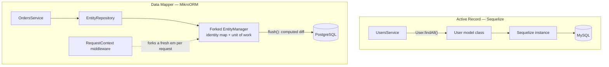

# Chapter 20 — Sequelize and MikroORM

> **한눈에 보기**
> TypeORM만이 답은 아닙니다. 이 장은 Nest가 공식 지원하는 두 번째 SQL 통합인
> **Sequelize**(`@nestjs/sequelize`)와, 커뮤니티가 관리하지만 설계 품질이 가장 높다고
> 평가받는 **MikroORM**(`@mikro-orm/nestjs`)을 다룹니다. Sequelize는 Active Record,
> MikroORM은 Data Mapper + Unit of Work + Identity Map입니다. 이 차이는 문법이 아니라
> **요청마다 무엇을 초기화해야 하는가**를 바꿉니다. 19장의 모듈 배선 패턴이 반복되므로,
> 이 장의 진짜 주제는 "어떤 ORM을 언제 고를 것인가"입니다.

**What you will learn**

- How `SequelizeModule.forRoot()` / `forFeature()` wire up, and what each Nest-specific option (`retryAttempts`, `autoLoadModels`, `keepConnectionAlive`, `synchronize`) changes at bootstrap.
- Why `@InjectModel()` gives you `typeof User` rather than `User`, and why Sequelize has no lazy loading of relations.
- How to run a managed Sequelize transaction without making the service untestable.
- How to build the same integration by hand with custom providers — and exactly what you lose.
- What MikroORM's identity map and Unit of Work buy you, and the failure — cross-request data leakage — that follows when `RequestContext` is missing.
- When to use `@CreateRequestContext()` vs `@EnsureRequestContext()` vs a manual `em.fork()`.
- A defensible way to choose between TypeORM, Sequelize, MikroORM, and Prisma.

**Why this matters**

A team ships a NestJS service on MikroORM. CI is green. In production, under load, a user occasionally sees another user's profile — maybe one request in five hundred. No cache, no shared mutable service state, no obvious bug. The reason: somebody set `registerRequestContext: false` to silence a warning, and the global `EntityManager`'s identity map is now shared by every request in the process. One request loads `User#7`; another asks for `User#7` and gets the *same object instance*, including half-applied changes. That is not a MikroORM bug. It is what an identity map does when its lifetime is wrong.

Chapter 19 taught you TypeORM, and it would be easy to conclude that all ORMs are the same modulo decorator names. Sequelize is Active Record: a model class *is* the table, instances save themselves, there is no session. MikroORM is Data Mapper: entities are plain objects, an `EntityManager` tracks them, and `flush()` computes the minimal set of statements. The Active Record ORM carries almost no per-request state, so it is hard to get wrong and hard to optimize. The Data Mapper ORM carries a lot, so it is easy to make fast and easy to get catastrophically wrong.

There is also a migration reason to know Sequelize: it predates TypeScript, it powers an enormous amount of existing Node code, and if you are adding NestJS to a legacy Express service, the data layer you inherit is more likely to be Sequelize than anything else.

## Active Record, Data Mapper, and why the choice leaks

Both patterns map rows to objects; they disagree about where persistence logic lives. **Active Record** puts it on the model — `user.save()`, `User.findAll()` — so the object needs a live connection reference. **Data Mapper** puts it in a separate object — `em.persist(user)`, `em.flush()` — so the entity is a plain class with no database knowledge.

The consequence people miss is *statefulness*. A Data Mapper must remember which entities it loaded (the **identity map**) and which changed (the **unit of work**), so `flush()` can emit one `UPDATE` per changed entity rather than one per assignment. That memory needs a lifetime, and in a request/response server the only correct lifetime is the request.



Everything difficult about MikroORM in Nest is that dotted line; everything easy about Sequelize is its absence.

## Sequelize: connecting the application

```bash
$ npm install --save @nestjs/sequelize sequelize sequelize-typescript mysql2
$ npm install --save-dev @types/sequelize
```

Swap `mysql2` for `pg pg-hstore`, `sqlite3`, `tedious`, or `mariadb`; nothing else in the chapter changes.

```typescript title="app.module.ts"
import { Module } from '@nestjs/common';
import { SequelizeModule } from '@nestjs/sequelize';
import { User } from './users/user.model';

@Module({
  imports: [
    SequelizeModule.forRoot({
      dialect: 'mysql',
      host: 'localhost',
      port: 3306,
      username: 'root',
      password: 'root',
      database: 'test',
      models: [User],
    }),
  ],
})
export class AppModule {}
```

`forRoot()` accepts every property the Sequelize constructor accepts — `pool`, `logging`, `timezone`, `dialectOptions`, `define` — plus five that belong to the Nest wrapper:

| Option | Default | What it changes |
|---|---|---|
| `retryAttempts` | `10` | Connection attempts before bootstrap fails |
| `retryDelay` | `3000` | Milliseconds between attempts |
| `autoLoadModels` | `false` | Models registered via `forFeature()` are appended to `models` |
| `keepConnectionAlive` | `false` | If `true`, the connection is **not** closed on shutdown |
| `synchronize` | `true` | Auto-loaded models are synchronized (DDL emitted) at startup |

The retry options exist because containers start in arbitrary order: ten attempts three seconds apart gives the database thirty seconds to become ready. Set `retryAttempts: 1` if you prefer fail-fast on a platform that restarts crashed pods anyway.

`keepConnectionAlive: true` looks harmless and is usually wrong. Nest closes the connection during shutdown so in-flight queries drain and the pool releases sockets; leaving it open means `SIGTERM` produces a process that will not exit. Its one legitimate use is a serverless runtime that freezes rather than terminates the container between invocations.

`SequelizeModule` registers the `Sequelize` object globally, so it is injectable anywhere without importing anything:

```typescript title="app.service.ts"
import { Injectable } from '@nestjs/common';
import { Sequelize } from 'sequelize-typescript';

@Injectable()
export class AppService {
  constructor(private sequelize: Sequelize) {}
}
```

> **Hint** — Import `Sequelize` from `sequelize-typescript`, not from `sequelize`. They are different classes; only the former is decorator-aware, and it is the one Nest registers.

## Modeling with `sequelize-typescript`

```typescript title="users/user.model.ts"
import { Column, Model, Table, DataType, HasMany } from 'sequelize-typescript';
import { Photo } from '../photos/photo.model';

@Table
export class User extends Model {
  @Column firstName: string;
  @Column lastName: string;

  @Column({ defaultValue: true })
  isActive: boolean;

  @Column({ type: DataType.ENUM('draft', 'active', 'archived'), defaultValue: 'draft' })
  status: 'draft' | 'active' | 'archived';

  @HasMany(() => Photo)
  photos: Photo[];
}
```

Three things happen implicitly, and all three bite people:

1. **The table name is pluralized.** `User` maps to `users`. Override with `@Table({ tableName: 'app_users' })` or `define: { freezeTableName: true }`.
2. **`id`, `createdAt`, `updatedAt` are added for you.** Disable with `@Table({ timestamps: false })`.
3. **Column types are inferred from TypeScript metadata**, which only works for `string`, `number`, `boolean`, and `Date`. Arrays, JSON, enums, and precise decimals must be declared explicitly with `DataType`, as `status` is above. `DataType.DECIMAL(12, 2)` in particular comes back as a *string*, not a number.

```typescript title="users/users.module.ts"
import { Module } from '@nestjs/common';
import { SequelizeModule } from '@nestjs/sequelize';
import { User } from './user.model';
import { UsersService } from './users.service';
import { UsersController } from './users.controller';

@Module({
  imports: [SequelizeModule.forFeature([User])],
  providers: [UsersService],
  controllers: [UsersController],
  exports: [SequelizeModule],   // only if another module needs @InjectModel(User)
})
export class UsersModule {}
```

```typescript title="users/users.service.ts"
import { Injectable, NotFoundException } from '@nestjs/common';
import { InjectModel } from '@nestjs/sequelize';
import { User } from './user.model';

@Injectable()
export class UsersService {
  constructor(
    @InjectModel(User)
    private userModel: typeof User,
  ) {}

  findAll(): Promise<User[]> {
    return this.userModel.findAll();
  }

  findOne(id: string): Promise<User | null> {
    return this.userModel.findOne({ where: { id } });
  }

  async remove(id: string): Promise<void> {
    const user = await this.findOne(id);
    if (!user) throw new NotFoundException(`User ${id} not found`);
    await user.destroy();
  }
}
```

Note the injected type: **`typeof User`, not `User`.** In Active Record, queries are static methods on the class, so what you inject is the class itself. Declaring `private userModel: User` compiles and then fails at runtime with `this.userModel.findAll is not a function`.

Re-exporting `SequelizeModule` (above) makes `@InjectModel(User)` usable in any module importing `UsersModule`. I recommend against doing it routinely: exporting a `UsersService` with domain methods keeps the model private and lets you change the persistence layer without touching consumers.

## Relations and eager loading

| Relation | Meaning |
|---|---|
| One-to-one | Every row in the primary table has exactly one associated row |
| One-to-many / Many-to-one | Every row in the primary table has one or more related rows |
| Many-to-many | Both sides may have many related rows, via a join table |

```typescript title="photos/photo.model.ts"
import { Column, Model, Table, ForeignKey, BelongsTo } from 'sequelize-typescript';
import { User } from '../users/user.model';

@Table
export class Photo extends Model {
  @Column url: string;

  @ForeignKey(() => User)
  @Column userId: number;

  @BelongsTo(() => User)
  user: User;
}
```

The arrow functions are not stylistic: they defer resolution so circular imports between two model files do not evaluate to `undefined` at decoration time. Many-to-many uses `@BelongsToMany(() => Tag, () => PostTag)` with an explicit join model.

Sequelize has **no lazy loading of relations**. `user.photos` is `undefined` unless you asked for it:

```typescript
// Wrong — photos is undefined, and nothing throws until you touch it.
const user = await this.userModel.findByPk(id);
return user.photos.length;

// Right — eager load with `include`.
const user = await this.userModel.findByPk(id, { include: [Photo] });
return user.photos.length;
```

This is a feature for predictability — no surprise N+1 from property access — and a nuisance for ergonomics, since forgetting `include` fails silently. Guard against it in the service layer: expose `findOneWithPhotos()` rather than letting callers guess.

## `autoLoadModels`, `synchronize`, and migrations

Listing every model in the root module forces `AppModule` to import from every feature directory — a dependency arrow pointing the wrong way. Auto-load instead:

```typescript
SequelizeModule.forRoot({
  // ...connection options
  autoLoadModels: true,
  synchronize: true,
});
```

Every model registered through `forFeature()` is now appended to `models` automatically. The caveat matters: **models only reachable through an association, and never registered via `forFeature()`, are not included.** If `User` is registered and `Photo` is only referenced by `@HasMany(() => Photo)`, the association blows up at sync time. Register both.

`synchronize: true` emits DDL to make the database match your models. It is a development accelerator and a production catastrophe: `sync` has no concept of intent, so a renamed column reads as "drop the old one, add a new one" and its data is gone. Drive it from the environment:

```typescript
SequelizeModule.forRootAsync({
  imports: [ConfigModule],
  inject: [ConfigService],
  useFactory: (config: ConfigService) => ({
    dialect: 'mysql',
    host: config.get<string>('DB_HOST'),
    port: config.get<number>('DB_PORT'),
    username: config.get<string>('DB_USER'),
    password: config.get<string>('DB_PASSWORD'),
    database: config.get<string>('DB_NAME'),
    autoLoadModels: true,
    synchronize: config.get('NODE_ENV') !== 'production',
    logging: config.get('NODE_ENV') === 'development' ? console.log : false,
  }),
});
```

Everywhere else, use **migrations**. `sequelize-cli` provides `migration:generate`, `db:migrate`, and `db:migrate:undo`. Migration files live outside your Nest source tree and are run by the CLI, so **you cannot use dependency injection, `ConfigService`, or any Nest feature inside one**:

```javascript title="migrations/20250401120000-add-user-status.js"
'use strict';

module.exports = {
  async up(queryInterface, Sequelize) {
    await queryInterface.addColumn('users', 'status', {
      type: Sequelize.ENUM('draft', 'active', 'archived'),
      allowNull: false,
      defaultValue: 'draft',
    });
  },
  async down(queryInterface) {
    await queryInterface.removeColumn('users', 'status');
  },
};
```

Unlike TypeORM, Sequelize's CLI cannot diff models against the database; `migration:generate` scaffolds an empty file and you write the DDL. More work — and, in my experience, better migrations, because you are forced to think about the data already in the table.

## Transactions

Sequelize supports *managed* transactions (auto-commit/auto-rollback around a callback) and *unmanaged* ones. Prefer managed.

```typescript
@Injectable()
export class UsersService {
  constructor(
    private sequelize: Sequelize,                       // from 'sequelize-typescript'
    @InjectModel(User) private userModel: typeof User,
  ) {}

  async createMany() {
    try {
      await this.sequelize.transaction(async (t) => {
        const transactionHost = { transaction: t };
        await this.userModel.create({ firstName: 'Abraham', lastName: 'Lincoln' }, transactionHost);
        await this.userModel.create({ firstName: 'John', lastName: 'Boothe' }, transactionHost);
      });
    } catch (err) {
      // Transaction has been rolled back.
      // `err` is whatever rejected the promise chain returned to the callback.
    }
  }
}
```

Every statement that should participate must receive `{ transaction: t }`. Sequelize does not thread it implicitly unless you enable CLS (`Sequelize.useCLS()`), which relies on `cls-hooked` and should not be adopted in a new Node 20 codebase — see [Chapter 43 — AsyncLocalStorage and Request Context Propagation](../part3-advanced/43-async-local-storage.md). Forgetting the option is the number-one Sequelize transaction bug: the statement runs on a *different* pooled connection, outside the transaction, and commits even when the transaction rolls back.

Injecting `Sequelize` directly also makes the service nearly untestable — the class exposes dozens of methods. Introduce a narrow seam:

```typescript title="database/transaction-runner.ts"
import { Injectable } from '@nestjs/common';
import { Sequelize, Transaction } from 'sequelize-typescript';

export abstract class TransactionRunner {
  abstract run<T>(work: (t: Transaction) => Promise<T>): Promise<T>;
}

@Injectable()
export class SequelizeTransactionRunner extends TransactionRunner {
  constructor(private readonly sequelize: Sequelize) { super(); }
  run<T>(work: (t: Transaction) => Promise<T>): Promise<T> {
    return this.sequelize.transaction(work);
  }
}
```

Bind it with `{ provide: TransactionRunner, useClass: SequelizeTransactionRunner }` and a unit test mocks exactly one method.

## Multiple databases, async configuration, and testing

**Multiple connections.** Call `forRoot()` more than once. Naming becomes mandatory: an unnamed connection is called `default`, and two unnamed (or identically named) connections silently overwrite each other.

```typescript
const defaultOptions = {
  dialect: 'postgres' as const,
  port: 5432, username: 'user', password: 'password', database: 'db', synchronize: true,
};

@Module({
  imports: [
    SequelizeModule.forRoot({ ...defaultOptions, host: 'user_db_host', models: [User] }),
    SequelizeModule.forRoot({
      ...defaultOptions, name: 'albumsConnection', host: 'album_db_host', models: [Album],
    }),
    SequelizeModule.forFeature([User]),
    SequelizeModule.forFeature([Album], 'albumsConnection'),
  ],
})
export class AppModule {}
```

```typescript
@Injectable()
export class AlbumsService {
  constructor(
    @InjectModel(Album, 'albumsConnection') private albumModel: typeof Album,
    @InjectConnection('albumsConnection') private sequelize: Sequelize,
  ) {}
}
```

Custom providers resolve the connection token explicitly with `getDataSourceToken`:

```typescript
{
  provide: AlbumsService,
  useFactory: (albumsSequelize: Sequelize) => new AlbumsService(albumsSequelize),
  inject: [getDataSourceToken('albumsConnection')],
}
```

**Async configuration.** `forRootAsync()` supports three shapes. `useFactory` (above) is the default choice. `useClass` instantiates a config class *inside* `SequelizeModule`; it must implement `SequelizeOptionsFactory`:

```typescript
SequelizeModule.forRootAsync({ useClass: SequelizeConfigService });

@Injectable()
class SequelizeConfigService implements SequelizeOptionsFactory {
  createSequelizeOptions(): SequelizeModuleOptions {
    return { dialect: 'mysql', host: 'localhost', port: 3306,
             username: 'root', password: 'root', database: 'test', models: [] };
  }
}
```

`useExisting` looks identical but reuses a provider from an imported module instead of constructing a private copy — the right choice when your `ConfigService` holds state you do not want duplicated:

```typescript
SequelizeModule.forRootAsync({ imports: [ConfigModule], useExisting: ConfigService });
```

**Testing.** Unit tests should not open a connection. Each registered model gets a `<ModelName>Model` token, produced by `getModelToken()`:

```typescript
import { getModelToken } from '@nestjs/sequelize';

const mockModel = { findAll: jest.fn().mockResolvedValue([{ id: 1, firstName: 'Ada' }]) };

const moduleRef = await Test.createTestingModule({
  providers: [UsersService, { provide: getModelToken(User), useValue: mockModel }],
}).compile();
```

Any class asking for `@InjectModel(User)` now receives `mockModel`. For a named connection: `getModelToken(Album, 'albumsConnection')`.

## Sequelize without `@nestjs/sequelize`

Build the integration by hand once. It demystifies the package, and you will occasionally need it — for example, to mount a `Sequelize` instance legacy code already created.

The connection is an **async provider**: a `useFactory` returning a promise. Nest awaits it before instantiating anything that depends on it.

```typescript title="database/database.providers.ts"
import { Sequelize } from 'sequelize-typescript';
import { Cat } from '../cats/cat.entity';
import { SEQUELIZE } from './constants';

export const databaseProviders = [
  {
    provide: SEQUELIZE,
    useFactory: async () => {
      const sequelize = new Sequelize({
        dialect: 'mysql', host: 'localhost', port: 3306,
        username: 'root', password: 'password', database: 'nest',
      });
      sequelize.addModels([Cat]);
      await sequelize.sync();
      return sequelize;
    },
  },
];
```

`DatabaseModule` both provides and exports that array. Because Sequelize is Active Record, the "repository" provider is just an alias for the model class:

```typescript title="cats/cats.providers.ts"
import { Cat } from './cat.entity';
import { CATS_REPOSITORY } from '../database/constants';

export const catsProviders = [{ provide: CATS_REPOSITORY, useValue: Cat }];
```

> **⚠️ Notice** — Never inline these strings. Keep `SEQUELIZE` and `CATS_REPOSITORY` in a `constants.ts`; a typo in a magic string produces a bootstrap error naming a token you cannot grep for.

```typescript title="cats/cats.service.ts"
import { Injectable, Inject } from '@nestjs/common';
import { Cat } from './cat.entity';
import { CATS_REPOSITORY } from '../database/constants';

@Injectable()
export class CatsService {
  constructor(
    @Inject(CATS_REPOSITORY)
    private catsRepository: typeof Cat,
  ) {}

  findAll(): Promise<Cat[]> {
    return this.catsRepository.findAll<Cat>();
  }
}
```

`CatsModule` then imports `DatabaseModule` and lists `[CatsService, ...catsProviders]`. The connection is asynchronous, but nothing in the application has to know: `CATS_REPOSITORY` waits for the connection, `CatsService` waits for `CATS_REPOSITORY`, and the HTTP server does not listen until the graph resolves. That transparent async resolution is the most valuable thing Nest's container gives you here. What you *lose* going manual: `retryAttempts`, `autoLoadModels`, shutdown handling, `getModelToken()`, and multi-connection tokens. Use `@nestjs/sequelize` unless you have a specific reason not to.

## MikroORM: the Unit of Work ORM

MikroORM is a TypeScript-first ORM built on Data Mapper, Unit of Work, and Identity Map. `@mikro-orm/nestjs` is maintained by the MikroORM team, not the Nest core team — file issues in the MikroORM repository.

```bash
$ npm i @mikro-orm/core @mikro-orm/nestjs @mikro-orm/sqlite
```

```typescript title="app.module.ts"
import { MikroOrmModule } from '@mikro-orm/nestjs';
import { SqliteDriver } from '@mikro-orm/sqlite';

@Module({
  imports: [
    MikroOrmModule.forRoot({
      entities: ['./dist/entities'],
      entitiesTs: ['./src/entities'],
      dbName: 'my-db-name.sqlite3',
      driver: SqliteDriver,
    }),
  ],
})
export class AppModule {}
```

`forRoot()` takes the same object as MikroORM's own `init()`. The `entities` / `entitiesTs` split exists because glob paths must point at compiled output at runtime and at sources when the CLI runs under ts-node. You can instead keep configuration in `mikro-orm.config.ts` and call `forRoot()` with no arguments — but that relies on runtime file discovery, which tree-shaking bundlers break. If you bundle with webpack, esbuild, or SWC, import the config explicitly and pass it: `MikroOrmModule.forRoot(config)`.

`MikroORM` and `EntityManager` are then injectable everywhere with no further imports:

```typescript
import { EntityManager, MikroORM } from '@mikro-orm/sqlite';

@Injectable()
export class MyService {
  constructor(
    private readonly orm: MikroORM,
    private readonly em: EntityManager,
  ) {}
}
```

> **⚠️ Notice** — Import `EntityManager` from your **driver** package (`@mikro-orm/sqlite`, `@mikro-orm/postgresql`, …) or from `@mikro-orm/knex`, never from `@mikro-orm/core`. The driver class carries the SQL-only methods (`createQueryBuilder`, `execute`) and the correct generics; the core import compiles but leaves you without them.

`forFeature()` declares which repositories exist in the current scope:

```typescript title="photo/photo.module.ts"
@Module({
  imports: [MikroOrmModule.forFeature([Photo])],
  providers: [PhotoService],
})
export class PhotoModule {}
```

```typescript title="photo/photo.service.ts"
import { InjectRepository } from '@mikro-orm/nestjs';
import { EntityRepository } from '@mikro-orm/sqlite';

@Injectable()
export class PhotoService {
  constructor(
    @InjectRepository(Photo)
    private readonly photoRepository: EntityRepository<Photo>,
  ) {}
}
```

> **Hint** — Do **not** register base entities via `forFeature()`; there are no repositories for them. Base entities still need to appear in `forRoot()` (or in the ORM config).

**Custom repositories drop the decorator entirely.** The custom repository class name *is* what `getRepositoryToken()` returns, so Nest resolves it by class reference:

```typescript
// author.entity.ts
@Entity({ repository: () => AuthorRepository })
export class Author {
  [EntityRepositoryType]?: AuthorRepository;   // lets em.getRepository(Author) infer it
}

// author.repository.ts
export class AuthorRepository extends EntityRepository<Author> {
  findActive() { return this.find({ active: true }); }
}

// my.service.ts — no @InjectRepository needed
@Injectable()
export class MyService {
  constructor(private readonly repo: AuthorRepository) {}
}
```

**Auto-loading** works like Sequelize's `autoLoadModels`: set `autoLoadEntities: true` in `forRoot()` and every entity passed to `forFeature()` is added to `entities`. Same two caveats — entities reachable *only* through a relation are not included, and `autoLoadEntities` has no effect on the MikroORM CLI, which still needs a config file with the full list (globs are fine there, since the CLI does not go through your bundler).

## The identity map, `RequestContext`, and what breaks without it

MikroORM's `EntityManager` keeps an **identity map**: a per-manager cache keyed by entity type and primary key. Load `Author#1` twice through the same `em` and you get the same object *instance*. That is what makes the Unit of Work possible — `flush()` compares each managed entity against the snapshot taken at load time and issues exactly the statements needed.

Now suppose that `em` is a single application-wide singleton in a server handling concurrent requests:

- Request A loads `Author#1` and sets `author.name = 'temp'` without flushing.
- Request B loads `Author#1`, gets the *same instance*, and reads `'temp'` — a value never committed, belonging to another user.
- Request C calls `flush()` for unrelated reasons and writes A's half-finished change to the database.
- The map never clears, so memory grows for the life of the process.

Cross-request leakage, phantom writes, and an unbounded cache — all from one lifetime mistake. The fix is that **every request gets its own forked `EntityManager`**. MikroORM's `RequestContext` helper does this using `AsyncLocalStorage`: it forks the manager, runs the request inside a context, and makes `em` resolve to that fork for the whole async call tree. `@mikro-orm/nestjs` registers the middleware automatically when you call `forRoot()` — which is why the happy path just works, and why disabling it "to remove a warning" is so dangerous.

```mermaid
sequenceDiagram
  participant C as Client
  participant M as RequestContext middleware
  participant S as PhotoService
  participant EM as Forked EntityManager
  participant DB as Database

  C->>M: HTTP request
  M->>M: RequestContext.create(orm.em, next)
  Note over M: AsyncLocalStorage now holds a fresh fork
  M->>S: handler runs inside the context
  S->>EM: repo.find(...) resolves to the fork
  EM->>DB: SELECT
  DB-->>EM: rows hydrated into the identity map
  S->>EM: entity.name = 'new'; em.flush()
  EM->>DB: UPDATE (computed diff only)
  M-->>C: response; fork and identity map discarded
```

### Outside the HTTP pipeline

Middleware only runs for HTTP requests. A BullMQ processor, a `@Cron()` job, a Kafka consumer, or a bootstrap script has none — so `em` resolves to the global instance and you are back to shared state.

`@CreateRequestContext()` fixes this. It requires a `MikroORM` instance injected into the class; the decorator uses it to create a context and runs the method inside it.

```typescript
import { MikroORM, CreateRequestContext } from '@mikro-orm/core';

@Injectable()
export class ReportService {
  constructor(private readonly orm: MikroORM) {}

  @CreateRequestContext()
  async nightlyRollup() {
    // runs in its own context, with its own identity map
  }
}
```

> **⚠️ Notice** — As the name says, `@CreateRequestContext()` **always** creates a new context, even inside an existing one. `@EnsureRequestContext()` creates one only if the method is not already running in a context. Use `@EnsureRequestContext()` for a method callable both from an HTTP handler and from a job; use `@CreateRequestContext()` for a genuine entry point such as a queue processor, where a fresh unit of work per job is exactly what you want.

The third option is explicit forking, which needs neither a decorator nor an injected `MikroORM`:

```typescript
async processBatch(ids: number[]) {
  for (const id of ids) {
    const em = this.em.fork();          // fresh identity map per item
    const author = await em.findOneOrFail(Author, id);
    author.processedAt = new Date();
    await em.flush();
  }
}
```

For long loops this is the right shape regardless: one identity map across ten thousand iterations is a memory leak with a Unit of Work attached.

### Serialization, multiple databases, testing

MikroORM wraps relations in `Reference<T>` and `Collection<T>` for type safety around lazy loading. Nest's `ClassSerializerInterceptor` ([Chapter 16](./16-serialization.md)) cannot see through those wrappers, so relations quietly vanish from the JSON if you return entities from a controller. Use MikroORM's own serialization API:

```typescript
@Entity()
export class Book {
  @Property({ hidden: true })            // equivalent of class-transformer's @Exclude
  hiddenField = Date.now();

  @Property({ persist: false })          // memory only, still serialized — like @Expose
  count?: number;

  @ManyToOne({
    serializer: (value) => value.name,   // equivalent of @Transform
    serializedName: 'authorName',
  })
  author!: Author;
}
```

My recommendation is stronger: map entities to explicit response DTOs in the service layer. That removes the wrapper problem, removes accidental field leakage, and gives OpenAPI something concrete to document.

`forRootAsync()` mirrors the Sequelize API (`useFactory` with `imports`/`inject`, `useClass`, `useExisting`). For **multiple databases**, give each connection a `contextName`, disable the automatic middleware on all of them, and register it once so it can fork every manager:

```typescript
@Module({
  imports: [
    MikroOrmModule.forRoot({
      contextName: 'users', registerRequestContext: false,
      driver: PostgreSqlDriver, dbName: 'users_db', entities: [User],
    }),
    MikroOrmModule.forRoot({
      contextName: 'albums', registerRequestContext: false,
      driver: PostgreSqlDriver, dbName: 'albums_db', entities: [Album],
    }),
    MikroOrmModule.forMiddleware(),
    MikroOrmModule.forFeature([Album], 'albums'),
  ],
})
export class AppModule {}
```

`registerRequestContext: false` is safe **only** because `forMiddleware()` takes over the job. Injection points then name the context: `@InjectRepository(Album, 'albums')`, `@InjectEntityManager('albums')`, `@InjectMikroORM('albums')`.

Testing uses `getRepositoryToken()`:

```typescript
import { getRepositoryToken } from '@mikro-orm/nestjs';

@Module({
  providers: [
    PhotoService,
    // with a custom repository, use `provide: PhotoRepository` instead
    { provide: getRepositoryToken(Photo), useValue: mockedRepository },
  ],
})
export class PhotoModule {}
```

For integration tests, the SQLite driver plus `orm.schema.createSchema()` gives you a real database per suite in milliseconds — usually a better investment than mocking repositories, because Unit of Work bugs only surface against a real driver.

## Choosing an ORM

| | **TypeORM** | **Sequelize** | **MikroORM** | **Prisma** |
|---|---|---|---|---|
| **Pattern** | Data Mapper (+ optional Active Record) | Active Record | Data Mapper + Unit of Work | Generated query client |
| **Typing strength** | Moderate — `Partial<T>` in `save()`, weak `where` typing | Weak — `where` largely untyped | Strong — typed filters and populate hints | Strongest — return type derived from the exact selection |
| **Unit of work** | Only inside an explicit transaction / `EntityManager` | None | Always; `flush()` emits a computed diff | No — every call is a statement |
| **Lazy loading** | Yes (`Promise<T>` relations, proxies) | No — `include` only | Yes, via `Reference`/`Collection` | No, by design |
| **Migrations** | CLI diffs entities → migration; good | CLI scaffolds empty files; you write the SQL | CLI diffs entities → migration; very good | Best-in-class: declarative schema, `migrate dev` generates and applies |
| **Raw SQL ergonomics** | Solid `QueryBuilder`, `query()` | `sequelize.query()`, loosely typed results | Excellent — knex query builder underneath | `$queryRaw` tagged template, typed via generic |
| **Ecosystem** | Largest Nest ecosystem, uneven maintenance history | Oldest, huge legacy footprint, TS bolted on | Smaller, very actively maintained | Large and growing fast |
| **NestJS integration** | First-party `@nestjs/typeorm` | First-party `@nestjs/sequelize` | Third-party `@mikro-orm/nestjs`, high quality | No official module; a 10-line `PrismaService` |
| **Main hazard** | Behaviour drift between minors; `synchronize` | Untyped queries; no lazy loading | Identity-map lifetime (`RequestContext`) | Schema is a separate language; no lazy loading |

How I would actually choose:

- **New service, PostgreSQL, type safety over ORM features** → Prisma ([Chapter 22](./22-prisma.md)).
- **Rich domain model with heavy graph mutation per request** → MikroORM. The Unit of Work is worth the `RequestContext` discipline.
- **Existing Sequelize codebase, or a team that already knows it** → `@nestjs/sequelize`. Do not rewrite a working data layer to change patterns.
- **You want the largest pool of Nest tutorials and sample repos** → TypeORM ([Chapter 19](./19-sql-with-typeorm.md)).

There is no wrong answer on this list, only mismatches between an ORM's strengths and a team's habits.

## Common mistakes

1. **Injecting `User` instead of `typeof User`.** *Symptom:* `this.userModel.findAll is not a function`. *Cause:* Sequelize queries are static methods, so the injected value is the class. *Fix:* `private userModel: typeof User`.
2. **Leaving `synchronize: true` on in production.** *Symptom:* a column disappears after a deploy, taking its data. *Cause:* `sync()` matches schema to models with no notion of intent. *Fix:* drive it from `NODE_ENV`; use migrations elsewhere.
3. **Using `autoLoadModels` but registering only some models.** *Symptom:* `Photo is not associated to User` at startup. *Cause:* auto-loading picks up only models passed to `forFeature()`. *Fix:* register every model in some feature module.
4. **Forgetting `{ transaction: t }` inside a transaction.** *Symptom:* a rollback leaves partial data behind. *Cause:* the statement ran on a different pooled connection. *Fix:* pass the transaction to every call, or use a `TransactionRunner` that makes it hard to forget.
5. **Reading `user.photos` without `include`.** *Symptom:* `Cannot read properties of undefined`. *Cause:* Sequelize has no lazy loading. *Fix:* `findByPk(id, { include: [Photo] })` behind an intent-revealing service method.
6. **Setting `registerRequestContext: false` in a single-database MikroORM app.** *Symptom:* intermittent cross-request data leakage and growing memory. *Cause:* every request shares one identity map. *Fix:* leave it on; only disable it when `forMiddleware()` handles multiple contexts.
7. **Running MikroORM work in a queue or cron job with no context.** *Symptom:* stale entities, or `Using global EntityManager instance methods for context specific actions is disallowed`. *Cause:* no middleware outside HTTP. *Fix:* `@CreateRequestContext()` / `@EnsureRequestContext()`, or an explicit `em.fork()`.
8. **Returning MikroORM entities directly from a controller.** *Symptom:* relations missing from the response. *Cause:* the serializer cannot see through `Reference`/`Collection`. *Fix:* MikroORM serialization options, or response DTOs.

## Putting it together

A small orders domain on MikroORM: entity with a custom repository, a service using the Unit of Work, and a job method that creates its own context.

```typescript title="src/entities/order.entity.ts"
import {
  Entity, PrimaryKey, Property, ManyToOne, Enum, EntityRepositoryType,
} from '@mikro-orm/core';
import { EntityRepository } from '@mikro-orm/postgresql';
import { Customer } from './customer.entity';

export enum OrderStatus { Pending = 'pending', Paid = 'paid', Cancelled = 'cancelled' }

export class OrderRepository extends EntityRepository<Order> {
  findStale(before: Date) {
    return this.find(
      { status: OrderStatus.Pending, createdAt: { $lt: before } },
      { populate: ['customer'], limit: 500 },
    );
  }
}

@Entity({ repository: () => OrderRepository })
export class Order {
  [EntityRepositoryType]?: OrderRepository;

  @PrimaryKey() id!: number;
  @ManyToOne(() => Customer) customer!: Customer;
  @Property({ type: 'decimal', precision: 12, scale: 2 }) total!: string;
  @Enum(() => OrderStatus) status: OrderStatus = OrderStatus.Pending;
  @Property() createdAt: Date = new Date();
  @Property({ nullable: true }) paidAt?: Date;
}
```

```typescript title="src/orders/orders.service.ts"
import { Injectable, NotFoundException } from '@nestjs/common';
import { EntityManager } from '@mikro-orm/postgresql';
import { MikroORM, CreateRequestContext } from '@mikro-orm/core';
import { Order, OrderRepository, OrderStatus } from '../entities/order.entity';

@Injectable()
export class OrdersService {
  constructor(
    private readonly orm: MikroORM,
    private readonly em: EntityManager,
    private readonly orders: OrderRepository,
  ) {}

  async markPaid(id: number): Promise<Order> {
    const order = await this.orders.findOne(id, { populate: ['customer'] });
    if (!order) throw new NotFoundException(`Order ${id} not found`);

    order.status = OrderStatus.Paid;    // no update builder — mutate the managed entity
    order.paidAt = new Date();

    await this.em.flush();              // one UPDATE, only the two changed columns
    return order;
  }

  // Runs from a cron job or queue processor — no HTTP middleware here,
  // so the decorator supplies the context the identity map needs.
  @CreateRequestContext()
  async expireStaleOrders(olderThanMinutes = 30): Promise<number> {
    const cutoff = new Date(Date.now() - olderThanMinutes * 60_000);
    const stale = await this.orders.findStale(cutoff);
    for (const order of stale) order.status = OrderStatus.Cancelled;
    await this.em.flush();              // N updates batched by the Unit of Work
    return stale.length;
  }
}
```

`OrdersModule` imports `MikroOrmModule.forFeature([Order, Customer])`, provides `OrdersService`, and exports it.

Trace `markPaid(42)`. The middleware forked an `EntityManager` before the controller ran, so `this.em` and `this.orders` both point at that fork. `findOne` issues one `SELECT` with a join for `customer`, stores both entities in the fork's identity map, and snapshots their loaded state. The two assignments mutate plain fields — no I/O. `flush()` diffs each managed entity against its snapshot, finds two changed columns on one entity and nothing on `Customer`, and emits a single `UPDATE "order" SET status = $1, paid_at = $2 WHERE id = $3` inside an implicit transaction. When the response is written, the fork and its identity map are discarded.

Now trace `expireStaleOrders()` from a cron trigger. Without `@CreateRequestContext()`, `this.em` would be the global manager: MikroORM would either throw the "global EntityManager" validation error or silently accumulate five hundred entities in a map that never clears. With the decorator, a fresh context wraps the method, five hundred entities load into a fork, the loop mutates them without I/O, one `flush()` emits five hundred batched updates in one transaction, and the fork dies when the method returns.

> **핵심 정리**
> - Active Record(Sequelize)는 모델 클래스가 곧 테이블이다. `@InjectModel(User)`로 받는 값의 타입은 `User`가 아니라 **`typeof User`**다.
> - `SequelizeModule.forRoot()`의 Nest 전용 옵션은 다섯 개다: `retryAttempts`, `retryDelay`, `autoLoadModels`, `keepConnectionAlive`, `synchronize`.
> - `synchronize: true`는 개발 전용이다. 운영에서는 컬럼과 데이터를 말없이 지운다. 마이그레이션을 써라.
> - Sequelize에는 관계 지연 로딩이 없다. `include`를 빠뜨리면 오류가 아니라 `undefined`가 나온다.
> - Sequelize 트랜잭션은 모든 쿼리에 `{ transaction: t }`를 넘겨야 한다. `Sequelize`를 직접 주입하는 대신 `TransactionRunner` 같은 좁은 인터페이스를 두면 테스트가 쉬워진다.
> - MikroORM은 Data Mapper + Unit of Work + Identity Map이다. 엔티티 필드를 바꾸고 `em.flush()`를 부르면 **변경된 컬럼만** UPDATE된다.
> - Identity Map의 수명은 반드시 요청 단위여야 한다. `RequestContext` 미들웨어가 요청마다 `em`을 fork한다. 이를 끄면 요청 간 데이터 유출과 메모리 누수가 생긴다.
> - HTTP 밖(큐, 크론, 부트스트랩)에서는 `@CreateRequestContext()`(항상 생성), `@EnsureRequestContext()`(없을 때만 생성), 또는 명시적 `em.fork()`를 써라.
> - MikroORM 엔티티를 컨트롤러에서 그대로 반환하면 `Reference`/`Collection` 래퍼 때문에 관계가 직렬화되지 않는다. 응답 DTO로 변환하라.

> **연습 문제**
> 1. `@InjectModel(User) private userModel: User`로 선언하면 어떤 런타임 오류가 나는가? Active Record 패턴의 어떤 성질 때문인지 설명하라.
> 2. `autoLoadModels: true`인데 `Photo`를 어떤 `forFeature()`에도 등록하지 않았다. 무슨 일이 벌어지며, 왜 컴파일 타임에 잡히지 않는가?
> 3. MikroORM에서 `registerRequestContext: false`로 두었을 때 생길 수 있는 세 가지 문제를 identity map의 동작으로 설명하라.
> 4. **직접 만들어 보라.** `@nestjs/sequelize` 없이 커스텀 프로바이더만으로 두 개의 연결(`WRITE_DB`, `READ_DB`)을 만들고, 읽기 쿼리는 read 연결로 가도록 리포지토리를 구성하라.
> 5. **직접 만들어 보라.** BullMQ 프로세서에서 1만 건의 주문을 순회하며 상태를 바꾸는 MikroORM 작업을 작성하라. 메모리가 선형으로 증가하지 않도록 하고, 그 이유를 주석으로 남겨라.
> 6. 결정 표를 근거로 (a) 엔티티 100개짜리 복잡한 도메인 모델, (b) 레거시 Express + Sequelize 서비스의 Nest 이전, (c) 타입 안정성이 최우선인 신규 PostgreSQL 서비스에 각각 어떤 ORM을 고를지 답하라.

**Next:** SQL is not the only shape data takes. [Chapter 21 — MongoDB with Mongoose](./21-mongodb-mongoose.md) moves to a document store, where schemas live in application code rather than in the database, and shows how `@nestjs/mongoose` turns decorated classes into Mongoose models — including hooks, discriminators, population, and transactions with sessions.
