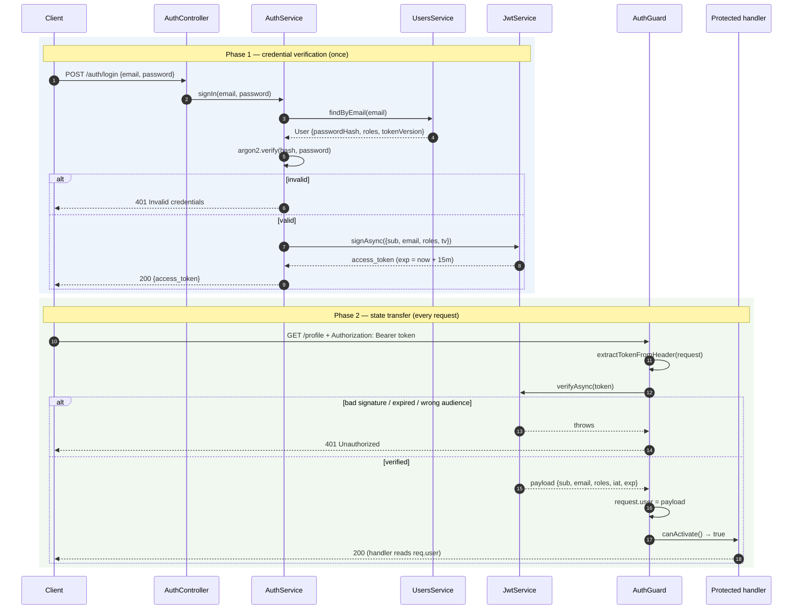

# Chapter 23 — Authentication: Sessions, JWT, and Passport

> **한눈에 보기**
> 11장에서 가드가 요청 통과 여부를 결정하는 지점임을 배웠고, 17장에서 비밀 값을 설정으로
> 분리하는 법을 배웠습니다. 이 장은 그 둘을 합쳐 **"이 요청을 보낸 사람이 누구인가"** 를
> 결정하는 층 전체를 손으로 만듭니다. `UsersModule`/`AuthModule` 골격, 로그인 엔드포인트,
> JWT 페이로드 설계, `verifyAsync`를 쓰는 `AuthGuard` 직접 구현, `@Public()` + 전역 가드,
> 만료와 리프레시 토큰 회전까지 다룹니다. 여기서 만든 두 모듈은 24장(Passport)과
> 25장(인가)에서 그대로 이어집니다.

**What you will learn**

- Why authentication is a *state transfer* problem, and the trade-off table that decides between session cookies and bearer tokens.
- How to split `UsersModule` and `AuthModule` so the dependency runs one way only.
- How to design a JWT payload — what `sub`, `iat`, `exp`, `iss`, `aud`, `jti` are for, and what must never go inside a token.
- How to move the signing secret out of source with `JwtModule.registerAsync()` and `ConfigService`.
- How to write an `AuthGuard` from scratch with `verifyAsync()`, attach `request.user`, and type it so it is not `any`.
- How to flip the default from "open unless guarded" to "closed unless `@Public()`" with `APP_GUARD` and `Reflector.getAllAndOverride()`.
- How refresh-token rotation and reuse detection work — the part the official docs declare out of scope.

**Why this matters**

Almost every authentication bug that reaches production is architectural rather than cryptographic. A login endpoint that returns a different error for "unknown user" than for "wrong password", handing an attacker a free user-enumeration oracle. A guard applied to eleven controllers and forgotten on the twelfth. A one-hour JWT with no revocation path, so the "disable account" button in your admin panel does nothing for the next hour. A refresh token in `localStorage` next to the access token, so one XSS is permanent access. A signing secret committed to git in `auth/constants.ts` because the tutorial put it there.

None of those are caught by a test asserting that `POST /auth/login` returns a token. They are caught by knowing which piece of the mechanism owns what: where identity enters, where it is verified, where it lives between requests, and where it can be withdrawn.

This chapter implements all of it **by hand** — no Passport. `@nestjs/jwt` is a thin wrapper over `jsonwebtoken`, and the guard is forty lines you write yourself. Once you have written those forty lines, [Chapter 24](./24-passport-strategies.md) can show what Passport adds and you can judge whether you want it. Doing it in the other order leaves you with a working app and no model.

---

## 1. What authentication actually has to solve

HTTP is stateless: every request arrives with no memory of the last. Authentication is therefore two problems that get conflated:

1. **Credential verification** (once): the client proves it knows a secret.
2. **State transfer** (every subsequent request): the client proves it *already* did step 1, without resending the secret.

Step 1 is a lookup plus a hash comparison. Step 2 is the design decision, and there are two families of answer.

**Server-side sessions.** Login generates an opaque random ID, stored as `sessionId → userId` in Redis or a table, returned in an `httpOnly` cookie. The token means nothing by itself; all authority lives in the store.

**Bearer tokens (JWT).** Login signs a small JSON document holding the user id and an expiry. The client returns it in `Authorization: Bearer <token>`. The server verifies the signature and trusts the contents. Nothing is stored.

| | Session cookie | JWT bearer token |
|---|---|---|
| Server-side state | Required | None |
| Revocation | Instant — delete the row | Hard — valid until `exp` |
| Scaling | Needs a shared store | Any node can verify |
| Transport | Cookie, sent automatically | Header, set by client code |
| CSRF exposure | Yes ([Ch. 26](./26-web-security-hardening.md)) | No, if kept out of cookies |
| XSS exposure | Low with `httpOnly` | High if in `localStorage` |
| Mobile / third-party clients | Awkward | Natural |

Neither wins outright. The honest rule: **if your only client is a browser you also serve, prefer session cookies** — the revocation story and `httpOnly` are worth a shared store. For mobile apps, third-party clients, or a fleet of services, use JWTs and take responsibility for revocation yourself (§10). This chapter builds the JWT variant because it is the one that forces you to understand the mechanism; session plumbing is [Chapter 32](./32-http-cookies-sessions.md), and Passport's session integration is [Chapter 24](./24-passport-strategies.md).

---

## 2. The two modules: `users` and `auth`

```bash
$ nest g module auth && nest g controller auth && nest g service auth
$ nest g module users && nest g service users
```

The split matters more than it looks. `UsersModule` owns the user *record*; `AuthModule` owns *credentials and tokens*. The dependency runs one way: auth imports users, never the reverse. When an admin panel or a GraphQL resolver later needs user data, it depends on `UsersModule` and inherits nothing from auth.

The in-memory array in the official docs is fine for a first run, but its field names (`userId`, a plaintext `password`) teach the wrong habits, so we start from a realistic shape.

```typescript title="src/users/user.entity.ts"
export enum Role {
  User = 'user',
  Editor = 'editor',
  Admin = 'admin',
}

export class User {
  id: number;
  email: string;
  /** argon2id hash — never plaintext, never sent to a client */
  passwordHash: string;
  roles: Role[];
  isActive: boolean;
  /** Bumped on password change / forced logout; see §10 */
  tokenVersion: number;
}
```

`Role` lives here, not in `auth`: roles are a property of the user, not of the login process. [Chapter 25](./25-authorization.md) picks it up unchanged.

```typescript title="src/users/users.service.ts"
import { Injectable } from '@nestjs/common';
import { User } from './user.entity';

@Injectable()
export class UsersService {
  // Swap for a repository from Ch. 19–22. The two methods below are the
  // entire surface the auth layer depends on.
  private readonly users: User[] = [/* ... */];

  async findByEmail(email: string): Promise<User | undefined> {
    return this.users.find((u) => u.email === email.toLowerCase());
  }

  async findById(id: number): Promise<User | undefined> {
    return this.users.find((u) => u.id === id);
  }
}
```

```typescript title="src/users/users.module.ts"
import { Module } from '@nestjs/common';
import { UsersService } from './users.service';

@Module({
  providers: [UsersService],
  exports: [UsersService], // ← without this, AuthService cannot inject it
})
export class UsersModule {}
```

That `exports` line is the whole module system at work: `UsersService` is visible to `AuthModule` only because `UsersModule` publishes it ([Chapter 6](../part1-beginner/06-modules.md)).

---

## 3. The sign-in endpoint

Give the body a DTO rather than `Record<string, any>`: with a global `ValidationPipe` ([Chapter 15](./15-validation-in-depth.md)) malformed logins are rejected before your service runs, and Swagger gets something to document.

```typescript title="src/auth/dto/sign-in.dto.ts"
import { IsEmail, IsString, MinLength } from 'class-validator';

export class SignInDto {
  @IsEmail() email: string;
  @IsString() @MinLength(8) password: string;
}
```

```typescript title="src/auth/auth.controller.ts"
import { Body, Controller, HttpCode, HttpStatus, Post } from '@nestjs/common';
import { AuthService } from './auth.service';
import { SignInDto } from './dto/sign-in.dto';

@Controller('auth')
export class AuthController {
  constructor(private readonly authService: AuthService) {}

  @HttpCode(HttpStatus.OK) // POST defaults to 201, but a login creates nothing
  @Post('login')
  signIn(@Body() dto: SignInDto) {
    return this.authService.signIn(dto.email, dto.password);
  }
}
```

The docs' service compares `user?.password !== pass`. Two things are wrong with that outside a tutorial:

```typescript
// ❌ Wrong twice over
const user = await this.usersService.findByEmail(email);
if (!user) throw new NotFoundException('No such user');       // enumeration oracle
if (user.password !== pass) throw new UnauthorizedException(); // plaintext + timing leak
```

A distinct `404` for an unknown email tells an attacker which addresses are registered, and `!==` on secrets short-circuits at the first differing byte. The corrected version returns one error and burns roughly equal time in both branches:

```typescript title="src/auth/auth.service.ts"
import { Injectable, UnauthorizedException } from '@nestjs/common';
import * as argon2 from 'argon2';
import { UsersService } from '../users/users.service';
import { User } from '../users/user.entity';

/** A real hash of a value nobody knows — equalises timing for unknown users. */
const DUMMY_HASH = '$argon2id$v=19$m=65536,t=3,p=4$Y2Fubm90bWF0Y2g$00000000';

@Injectable()
export class AuthService {
  constructor(private readonly usersService: UsersService) {}

  private async validateCredentials(email: string, pass: string): Promise<User> {
    const user = await this.usersService.findByEmail(email);
    // Always verify *something*, so response time does not reveal existence.
    const ok = await argon2.verify(user?.passwordHash ?? DUMMY_HASH, pass);
    if (!user || !ok || !user.isActive) {
      throw new UnauthorizedException('Invalid credentials');
    }
    return user;
  }
}
```

One message, one status, one code path. The returned `User` still holds `passwordHash`, so never send it to a client: strip it (`const { passwordHash, ...safe } = user`) or, better, `@Exclude()` the field and enable `ClassSerializerInterceptor` so it cannot leak from *any* endpoint ([Chapter 16](./16-serialization.md)).

---

## 4. Password storage, briefly

The rule has no exceptions: **you never store a password, and never anything reversible into one.** You store the output of a deliberately slow, salted, one-way hash, and compare by hashing the incoming attempt with the stored parameters.

| | `argon2` (argon2id) | `bcrypt` |
|---|---|---|
| Recommendation | Preferred for new systems | Fine; ubiquitous |
| GPU/ASIC resistance | Yes — memory-hard | Partial |
| Tuning | memory, time, parallelism | cost factor |
| Input limit | None | Silently truncates at 72 bytes |
| API | `argon2.hash(pw)` / `argon2.verify(hash, pw)` | `bcrypt.hash(pw, 12)` / `bcrypt.compare(pw, hash)` |

Both embed salt and parameters in the output string, so one column suffices, and both comparison functions are constant-time. Cost calibration, rehash-on-login when you raise the cost factor, and breach-list checks are [Chapter 26](./26-web-security-hardening.md). Here, the only thing that matters is that `AuthService` calls `argon2.verify()` and never applies a comparison operator to a secret.

---

## 5. Issuing a JWT

```bash
$ npm install --save @nestjs/jwt
```

`@nestjs/jwt` gives you `JwtModule` (configuration) and `JwtService` (`sign`, `signAsync`, `verify`, `verifyAsync`, `decode`) over `jsonwebtoken`.

### 5.1 Payload design

A JWT is three base64url segments: header, payload, signature. **The payload is signed, not encrypted** — anyone holding the token can read it with `atob()`. That single fact drives every decision below.

```typescript title="src/auth/token-payload.interface.ts"
import { Role } from '../users/user.entity';

/** What we put in. */
export interface AccessTokenPayload {
  sub: number;   // subject: the user id (a registered JWT claim)
  email: string; // convenience, so guards need no DB read
  roles: Role[]; // consumed by Chapter 25's RolesGuard
  tv: number;    // token version, for revocation — see §10
}

/** What verifyAsync() returns: our claims plus the registered ones. */
export type VerifiedAccessToken = AccessTokenPayload & {
  iat: number; exp: number; iss?: string; aud?: string; jti?: string;
};
```

| Claim | Set by | Purpose |
|---|---|---|
| `sub` | you | The subject. Use the immutable primary key, never the email — emails change. |
| `iat` | the library | Issued-at, in seconds. Lets you invalidate "everything issued before T". |
| `exp` | `signOptions.expiresIn` | Hard expiry; verification fails past it automatically. |
| `nbf` | `signOptions.notBefore` | Not-valid-before. Rare outside scheduled credentials. |
| `iss` / `aud` | `signOptions` | Issuer / audience. Without them, a token minted for service A is accepted by service B. |
| `jti` | you, or `signOptions.jwtid` | Unique token id, so one token can be denylisted. |

For your own claims: include the *minimum* that lets a guard decide without a database round trip. Never anything secret (it is public), anything large (it rides on every request), or anything that changes faster than the token lives — a stale `roles` array in a 15-minute token means a demoted admin keeps admin powers for 15 minutes. If that window is unacceptable, keep roles out of the token and pay for a lookup in the guard.

### 5.2 Signing

```typescript title="src/auth/auth.service.ts (continued)"
import { JwtService } from '@nestjs/jwt';

@Injectable()
export class AuthService {
  constructor(
    private readonly usersService: UsersService,
    private readonly jwtService: JwtService,
  ) {}

  async signIn(email: string, pass: string): Promise<{ access_token: string }> {
    const user = await this.validateCredentials(email, pass);
    const payload: AccessTokenPayload = {
      sub: user.id, email: user.email, roles: user.roles, tv: user.tokenVersion,
    };
    // Signed with the secret configured on JwtModule.
    return { access_token: await this.jwtService.signAsync(payload) };
  }
}
```

Prefer `signAsync`/`verifyAsync` over the synchronous pair. HMAC over a small payload is fast, but RSA/ECDSA is not, and a sync call blocks the event loop for every logging-in user. Starting async means an `HS256` → `RS256` switch is a config change rather than a latency incident.

### 5.3 Configuring `JwtModule` — and where the secret comes from

The tutorial version hardcodes a constant and passes it to `register()`:

```typescript title="src/auth/constants.ts"
// ❌ Never ship this — it puts your signing key in git.
export const jwtConstants = { secret: 'DO NOT USE THIS VALUE.' };
```

```typescript
JwtModule.register({ global: true, secret: jwtConstants.secret, signOptions: { expiresIn: '60s' } });
```

`register()` takes a static object. The production form is `registerAsync()`, fed by the `ConfigModule` from [Chapter 17](./17-configuration.md):

```typescript title="src/auth/auth.module.ts"
JwtModule.registerAsync({
  global: true,
  imports: [ConfigModule],
  inject: [ConfigService],
  useFactory: (config: ConfigService) => ({
    secret: config.getOrThrow<string>('JWT_SECRET'),
    signOptions: {
      expiresIn: config.get<string>('JWT_EXPIRES_IN', '15m'),
      issuer: 'api.example.com',
      audience: 'example-web',
    },
    verifyOptions: { issuer: 'api.example.com', audience: 'example-web' },
  }),
});
```

Three things to notice.

**`getOrThrow()`, not `get()`.** If `JWT_SECRET` is missing the app must refuse to boot. With `get()` the secret becomes `undefined`, the failure surfaces at the first sign attempt, and some setups end up signing with the literal string `"undefined"`.

**`global: true`** registers `JwtService` in the global injector scope so `AuthGuard` can inject it anywhere without importing `JwtModule`. Convenient, but it means exactly one JWT configuration exists app-wide. The moment you need a second (refresh tokens with their own secret — §10), either drop `global` or override per call: `signAsync(payload, { secret, expiresIn })`.

**`verifyOptions` mirroring `signOptions`.** Claims that are never checked are decoration; setting `issuer`/`audience` only on the signing side accomplishes nothing.

For asymmetric signing, replace `secret` with `privateKey`/`publicKey` and set `signOptions.algorithm: 'RS256'`. Verifying services then need only the public key — they can validate tokens without being able to mint them.

---

## 6. The flow, end to end



Phase 2 touches neither `UsersService` nor the database. That is the entire benefit of a stateless token — and the source of the revocation problem in §10.

---

## 7. Writing the `AuthGuard` from scratch

A guard is a class with `canActivate()` returning `true`, `false`, or a promise of either ([Chapter 11](../part1-beginner/11-guards.md)). Authentication fits: it runs after middleware, before pipes and the handler, and it can inject dependencies.

```typescript title="src/auth/auth.guard.ts"
import {
  CanActivate, ExecutionContext, Injectable, UnauthorizedException,
} from '@nestjs/common';
import { JwtService } from '@nestjs/jwt';
import { Request } from 'express';
import { VerifiedAccessToken } from './token-payload.interface';

@Injectable()
export class AuthGuard implements CanActivate {
  constructor(private readonly jwtService: JwtService) {}

  async canActivate(context: ExecutionContext): Promise<boolean> {
    const request = context.switchToHttp().getRequest<Request>();
    const token = this.extractTokenFromHeader(request);
    if (!token) {
      throw new UnauthorizedException('Missing bearer token');
    }
    try {
      // Verifies signature, exp, nbf, iss and aud from the JwtModule config.
      const payload =
        await this.jwtService.verifyAsync<VerifiedAccessToken>(token);
      request.user = payload; // hand the identity to the rest of the pipeline
    } catch {
      // Deliberately opaque: never tell the caller *why* it failed.
      throw new UnauthorizedException('Invalid or expired token');
    }
    return true;
  }

  private extractTokenFromHeader(request: Request): string | undefined {
    const [type, token] = request.headers.authorization?.split(' ') ?? [];
    return type === 'Bearer' ? token : undefined;
  }
}
```

**Throw, do not return `false`.** Returning `false` makes Nest raise `ForbiddenException` → `403`. For a missing or bad credential the correct status is `401` ("unauthenticated"); `403` means "authenticated but not allowed", which is [Chapter 25](./25-authorization.md)'s job. Getting the pair right is what lets a client tell "log in again" apart from "you will never be allowed".

**The empty `catch`.** `verifyAsync` throws `TokenExpiredError`, `JsonWebTokenError` ("invalid signature", "jwt malformed") or `NotBeforeError`. Log them; never forward them — they are a probing aid. One distinction is worth exposing, because clients need to know whether to refresh, and the standard place for it is a header rather than the body:

```typescript
} catch (err) {
  this.logger.debug(`JWT rejected: ${err.name}`);
  if (err instanceof TokenExpiredError) {
    // RFC 6750 §3 — tells the client to refresh rather than re-login.
    response.setHeader('WWW-Authenticate',
      'Bearer error="invalid_token", error_description="The access token expired"');
  }
  throw new UnauthorizedException();
}
```

**`request.user = payload`.** Nothing magical: the guard mutates the platform request object, and every later stage — interceptors, pipes, the handler, Chapter 25's `RolesGuard` — reads it back. Express's `Request` has no `user` property, so instead of writing `request['user']` or casting at each use site, augment the type once:

```typescript title="src/types/express.d.ts"
import { VerifiedAccessToken } from '../auth/token-payload.interface';

declare global {
  namespace Express {
    interface Request { user?: VerifiedAccessToken }
  }
}
export {};
```

**`switchToHttp()`** makes this guard HTTP-specific; under GraphQL or a microservice transport `getRequest()` returns something else ([Chapter 40](../part3-advanced/40-execution-context.md), and §12 here).

```typescript
@UseGuards(AuthGuard)
@Get('profile')
getProfile(@Req() req: Request) {
  return req.user;
}
```

```bash
$ curl http://localhost:3000/auth/profile
{"statusCode":401,"message":"Missing bearer token","error":"Unauthorized"}

$ curl -X POST http://localhost:3000/auth/login -H 'Content-Type: application/json' \
    -d '{"email":"john@example.com","password":"changeme"}'
{"access_token":"eyJhbGciOiJIUzI1NiIsInR5cCI6IkpXVCJ9.eyJzdWIiOjEs..."}

$ curl http://localhost:3000/auth/profile -H 'Authorization: Bearer eyJhbGci...'
{"sub":1,"email":"john@example.com","roles":["user"],"tv":0,"iat":...,"exp":...}
```

Wait past `expiresIn` and the last call returns `401` with none of your code involved: `jsonwebtoken` checks `exp` during verification. That is the one piece of revocation you get for free.

---

## 8. Secure by default: global guard plus `@Public()`

`@UseGuards(AuthGuard)` per route is *opt-in security*, and opt-in security fails by omission — the twelfth controller someone adds on a Friday is unprotected and nothing about it looks wrong. Invert it: register the guard globally and mark the few genuinely public routes.

```typescript title="src/auth/decorators/public.decorator.ts"
import { SetMetadata } from '@nestjs/common';

export const IS_PUBLIC_KEY = 'isPublic';
export const Public = () => SetMetadata(IS_PUBLIC_KEY, true);
```

Name it `@SkipAuth()` or `@AllowAnon()` if you prefer; what matters is that the metadata key is a shared constant, not a literal repeated in two files.

```typescript title="src/auth/auth.guard.ts (final)"
constructor(
  private readonly jwtService: JwtService,
  private readonly reflector: Reflector,
) {}

async canActivate(context: ExecutionContext): Promise<boolean> {
  const isPublic = this.reflector.getAllAndOverride<boolean>(IS_PUBLIC_KEY, [
    context.getHandler(), // method-level metadata wins…
    context.getClass(),   // …over controller-level metadata
  ]);
  if (isPublic) return true;
  // …unchanged token verification…
}
```

`getAllAndOverride()` reads the key from both targets and returns the **first defined** value in the order given. Handler first means a `@Public()` method inside a protected controller is public — and, importantly, that a `@Public()` controller cannot be re-protected by a method. Reverse the array for the opposite precedence; use `getAllAndMerge()` when you want to combine values rather than override (roles sometimes do).

```typescript title="src/auth/auth.module.ts (providers)"
import { APP_GUARD } from '@nestjs/core';

providers: [AuthService, { provide: APP_GUARD, useClass: AuthGuard }],
```

Use `APP_GUARD`, not `app.useGlobalGuards(new AuthGuard(...))`. The manual form makes you construct the guard yourself, outside any module, so it cannot inject `JwtService` or `Reflector`. `APP_GUARD` registers it as an ordinary provider of the declaring module, fully injectable.

```typescript
@Public()
@Post('login')
signIn(@Body() dto: SignInDto) { /* ... */ }
```

Forget `@Public()` here and you have built a system where you must be logged in to log in — the most commonly lost five minutes in this pattern.

> **⚠️ Notice** — Global guards run for *every* handler, including health checks and webhooks. Audit those: a payment provider's webhook cannot present a bearer token, and it authenticates with a signature header, which needs its own guard rather than a bare `@Public()`.

When guards coexist, global runs first, then controller-level, then method-level, and **all** must pass. So a global `AuthGuard` plus a route-level `RolesGuard` gives authentication-then-authorization for free — the chain [Chapter 25](./25-authorization.md) builds on.

---

## 9. Reading the current user

`@Req() req` then `req.user` works, but it drags the request object into handler signatures and makes tests build fake requests. Write the param decorator once ([Chapter 13](../part1-beginner/13-custom-decorators-and-lifecycle.md)):

```typescript title="src/auth/decorators/current-user.decorator.ts"
import { createParamDecorator, ExecutionContext } from '@nestjs/common';
import { VerifiedAccessToken } from '../token-payload.interface';

export const CurrentUser = createParamDecorator(
  (data: keyof VerifiedAccessToken | undefined, ctx: ExecutionContext) => {
    const user: VerifiedAccessToken | undefined =
      ctx.switchToHttp().getRequest().user;
    return data ? user?.[data] : user;
  },
);
```

```typescript
@Get('profile')
getProfile(@CurrentUser() user: VerifiedAccessToken) { return user; }

@Get('my-articles')
mine(@CurrentUser('sub') userId: number) {
  return this.articlesService.findByAuthor(userId);
}
```

When a *service* needs the current user, there are three options, in order of preference:

1. **Pass it as an argument** — `articles.update(id, dto, currentUser)`. Explicit, testable, no framework coupling. Use this unless you have a reason not to.
2. **Inject `REQUEST` into a request-scoped provider:**

   ```typescript
   @Injectable({ scope: Scope.REQUEST })
   export class AuditService {
     constructor(@Inject(REQUEST) private readonly request: Request) {}
     get actorId() { return this.request.user?.sub; }
   }
   ```

   The cost is real and viral: every provider that injects it becomes request-scoped too, all the way up the chain, which adds latency and breaks singleton assumptions ([Chapter 38](../part3-advanced/38-injection-scopes.md)).
3. **`AsyncLocalStorage`** — request context available anywhere without changing scopes or signatures. The right tool when the consumer is deep, such as a logger or an ORM subscriber writing `updatedBy` ([Chapter 43](../part3-advanced/43-async-local-storage.md)).

The mistake is reaching for option 2 by default because it looks the most framework-native. It is the most expensive of the three.

---

## 10. Expiry, refresh tokens, and revocation

`expiresIn: '60s'` in the tutorial is unrealistic, but the instinct is right: a stateless token cannot be withdrawn, so its lifetime *is* your worst-case exposure window. The standard resolution is two tokens with different jobs.

| | Access token | Refresh token |
|---|---|---|
| Lifetime | 5–15 minutes | 7–30 days |
| Sent with | Every request | Only `POST /auth/refresh` |
| Client storage | In memory | `httpOnly; Secure; SameSite=Strict` cookie |
| Server storage | Nothing | A **hash** of the token, per session |
| Revocable | No (until `exp`) | Yes — delete the row |
| Contents | `sub`, roles, `tv` | `sub`, `jti`, nothing else |

Two rules make this safe, and both are routinely skipped. **Rotate on every use:** each refresh returns a new refresh token and invalidates the old one; if an already-rotated token is presented again, the explanations are theft or a race, so revoke the whole session family — turning silent long-term compromise into an early forced logout. **Store only a hash:** a leaked backup of the session table must not hand out live sessions.

```typescript title="src/auth/auth.service.ts (refresh)"
private async issueTokens(user: User) {
  const jti = randomUUID();
  const access_token = await this.jwtService.signAsync(
    { sub: user.id, email: user.email, roles: user.roles, tv: user.tokenVersion },
  );
  // A second secret, so an access token can never be replayed as a refresh
  // token even if a verification call is miswired.
  const refresh_token = await this.jwtService.signAsync(
    { sub: user.id, jti },
    {
      secret: this.config.getOrThrow('JWT_REFRESH_SECRET'),
      expiresIn: this.config.get('JWT_REFRESH_EXPIRES_IN', '7d'),
    },
  );
  await this.sessions.save({
    jti, userId: user.id, tokenHash: await argon2.hash(refresh_token),
  });
  return { access_token, refresh_token };
}

async refresh(presented: string) {
  let payload: { sub: number; jti: string };
  try {
    payload = await this.jwtService.verifyAsync(presented, {
      secret: this.config.getOrThrow('JWT_REFRESH_SECRET'),
    });
  } catch {
    throw new UnauthorizedException();
  }

  const session = await this.sessions.findByJti(payload.jti);
  if (!session) {
    // Valid signature but no session → already rotated. Treat as theft.
    await this.sessions.revokeAllForUser(payload.sub);
    throw new UnauthorizedException('Refresh token reuse detected');
  }
  if (!(await argon2.verify(session.tokenHash, presented))) {
    throw new UnauthorizedException();
  }

  await this.sessions.delete(payload.jti); // single use
  const user = await this.usersService.findById(payload.sub);
  if (!user?.isActive) throw new UnauthorizedException();
  return this.issueTokens(user);
}
```

```typescript
@Public() // the access token is expired by definition at this point
@HttpCode(HttpStatus.OK)
@Post('refresh')
refresh(@Body('refresh_token') token: string) {
  return this.authService.refresh(token);
}
```

`@Public()` here is not a hole: the endpoint authenticates the caller itself with the refresh token, and only bypasses the *access-token* guard. ([Chapter 24](./24-passport-strategies.md) shows the alternative — a dedicated `jwt-refresh` strategy guarding this route, which reads better once Passport is in play.)

**Revoking access tokens before they expire.** Three levels, chosen by requirement:

- *Accept the window.* With a 5-minute expiry, "disable user" takes effect within 5 minutes. Free, and usually fine.
- *Token version.* The `tv` claim carries `user.tokenVersion`; bump the column on password change, forced logout, or role change, and have the guard reject mismatches. Costs one primary-key read per request, buys instant revocation.
- *Denylist by `jti`.* Revoked ids in Redis with a TTL equal to the remaining lifetime. Precise, per-token, one Redis read per request.

Levels 2 and 3 reintroduce exactly the server-side state JWTs promised to remove. That is the honest trade: **stateless verification and instant revocation are mutually exclusive.** Choosing consciously is what separates a designed auth layer from a copied one.

On the client, `localStorage` is readable by any script on the origin, so one XSS is a full takeover *and* exfiltration of a 7-day refresh token. Keep the access token in a JS variable (lost on reload — fine, the refresh endpoint restores it) and the refresh token in an `httpOnly` cookie. That combination needs CSRF protection on the refresh route ([Chapter 26](./26-web-security-hardening.md)).

---

## 11. Telling Swagger about the bearer token

An API whose docs have no "Authorize" button is documentation nobody can use ([Chapter 29](./29-openapi-fundamentals.md), [Chapter 30](./30-openapi-advanced.md)):

```typescript title="src/main.ts"
const config = new DocumentBuilder()
  .setTitle('Example API')
  .addBearerAuth(
    { type: 'http', scheme: 'bearer', bearerFormat: 'JWT' },
    'access-token', // ← the name @ApiBearerAuth() refers to
  )
  .build();
```

```typescript
@ApiBearerAuth('access-token')
@Controller('articles')
export class ArticlesController {}
```

`@ApiBearerAuth()` only *documents* the requirement; it enforces nothing. At controller level it covers every route inside. Since most of your API is protected, apply it at controller level everywhere and rely on `@Public()` for exceptions — the default-closed posture of §8, mirrored in the docs.

---

## 12. The Passport alternative, in one page

Everything above is roughly 150 lines you own. [Passport](https://www.passportjs.org/) is the incumbent Node auth library, and `@nestjs/passport` adapts it to Nest constructs: you write a `PassportStrategy` subclass with a `validate()` method, and Passport builds `req.user` from its return value.

```typescript
// The same JWT verification, expressed as a Passport strategy.
@Injectable()
export class JwtStrategy extends PassportStrategy(Strategy) {
  constructor(config: ConfigService) {
    super({
      jwtFromRequest: ExtractJwt.fromAuthHeaderAsBearerToken(),
      ignoreExpiration: false,
      secretOrKey: config.getOrThrow('JWT_SECRET'),
    });
  }
  async validate(payload: AccessTokenPayload) {
    return { userId: payload.sub, email: payload.email };
  }
}
```

| | Hand-rolled guard | `@nestjs/passport` |
|---|---|---|
| Code you maintain | ~50 lines per mechanism | ~20 lines per strategy |
| Extraction / expiry | Yours | Strategy options |
| Social login, SAML, LDAP | From scratch | 500+ published strategies |
| Sessions | Manual | `session: true` + `SessionSerializer` |
| Debuggability | Fully visible | Callback indirection |
| Best when | One mechanism you control | Several mechanisms, or any external identity provider |

The recommendation: if your app authenticates one way and you own it, the hand-rolled guard is less code and has no hidden behaviour. The moment you add "Sign in with Google", API keys for machine clients, or sessions alongside tokens, the strategy abstraction pays for itself — and the rewrite is short, because the pieces map one to one. [Chapter 24](./24-passport-strategies.md) performs exactly that conversion on this module.

---

## Common mistakes

1. **Different errors for "unknown user" and "wrong password".** *Symptom:* an attacker enumerates registered emails from `404` vs `401`. *Cause:* early return on a failed lookup. *Fix:* one `UnauthorizedException('Invalid credentials')` for every failure, plus a dummy-hash verify so timing matches too.
2. **Secret in `auth/constants.ts`.** *Symptom:* anyone with repo access can mint admin tokens, and rotating the key needs a code deploy. *Cause:* following the tutorial literally. *Fix:* `registerAsync()` + `getOrThrow('JWT_SECRET')` from your secrets manager.
3. **`app.useGlobalGuards(new AuthGuard())`.** *Symptom:* `Cannot read properties of undefined (reading 'verifyAsync')`. *Cause:* a hand-constructed guard receives no injection. *Fix:* `{ provide: APP_GUARD, useClass: AuthGuard }`.
4. **`@Public()` missing on `POST /auth/login`.** *Symptom:* every login returns `401`; the only way in is to already be in. *Fix:* mark login, refresh, register and password-reset public — and add an e2e test asserting login works with no `Authorization` header.
5. **Returning the user entity from `/profile`.** *Symptom:* `passwordHash` appears in a response. *Cause:* returning a persistence object directly. *Fix:* an explicit DTO, or `@Exclude()` plus `ClassSerializerInterceptor` ([Chapter 16](./16-serialization.md)).
6. **`403` for a missing token.** *Symptom:* clients never trigger their re-login flow. *Cause:* `return false`, which Nest maps to `ForbiddenException`. *Fix:* throw `UnauthorizedException`; reserve `403` for authorization.
7. **Roles baked into a long-lived token.** *Symptom:* a demoted admin keeps access; "log out everywhere" does nothing. *Cause:* using the token as a cache with no invalidation. *Fix:* short tokens plus a `tv` check, or read authority in the guard.
8. **Refresh tokens stored in plaintext and never rotated.** *Symptom:* a database leak yields permanent sessions and theft is undetectable. *Fix:* store `argon2.hash(token)`, rotate on every use, revoke the family on reuse.

---

## Putting it together

The complete module: global-by-default protection, config-driven secrets, `@Public()` opt-outs, typed current user.

```typescript title="src/auth/auth.module.ts"
import { Module } from '@nestjs/common';
import { ConfigModule, ConfigService } from '@nestjs/config';
import { APP_GUARD } from '@nestjs/core';
import { JwtModule } from '@nestjs/jwt';
import { UsersModule } from '../users/users.module';
import { AuthController } from './auth.controller';
import { AuthGuard } from './auth.guard';
import { AuthService } from './auth.service';

@Module({
  imports: [
    UsersModule,
    JwtModule.registerAsync({
      global: true,
      imports: [ConfigModule],
      inject: [ConfigService],
      useFactory: (config: ConfigService) => ({
        secret: config.getOrThrow<string>('JWT_SECRET'),
        signOptions: {
          expiresIn: config.get('JWT_EXPIRES_IN', '15m'),
          issuer: 'api.example.com',
          audience: 'example-web',
        },
        verifyOptions: { issuer: 'api.example.com', audience: 'example-web' },
      }),
    }),
  ],
  controllers: [AuthController],
  providers: [AuthService, { provide: APP_GUARD, useClass: AuthGuard }],
  exports: [AuthService],
})
export class AuthModule {}
```

```typescript title="src/auth/auth.controller.ts"
import { Body, Controller, Get, HttpCode, HttpStatus, Post } from '@nestjs/common';
import { ApiBearerAuth, ApiTags } from '@nestjs/swagger';
import { AuthService } from './auth.service';
import { CurrentUser } from './decorators/current-user.decorator';
import { Public } from './decorators/public.decorator';
import { SignInDto } from './dto/sign-in.dto';
import { VerifiedAccessToken } from './token-payload.interface';

@ApiTags('auth')
@ApiBearerAuth('access-token')
@Controller('auth')
export class AuthController {
  constructor(private readonly authService: AuthService) {}

  @Public()
  @HttpCode(HttpStatus.OK)
  @Post('login')
  signIn(@Body() dto: SignInDto) {
    return this.authService.signIn(dto.email, dto.password);
  }

  @Public()
  @HttpCode(HttpStatus.OK)
  @Post('refresh')
  refresh(@Body('refresh_token') token: string) {
    return this.authService.refresh(token);
  }

  // No decorator needed — the global AuthGuard already protects this.
  @Get('profile')
  getProfile(@CurrentUser() user: VerifiedAccessToken) {
    return { id: user.sub, email: user.email, roles: user.roles };
  }
}
```

```typescript title="src/app.module.ts"
ConfigModule.forRoot({
  isGlobal: true,
  // Boot fails loudly if a secret is missing — never sign with undefined.
  validationSchema: Joi.object({
    JWT_SECRET: Joi.string().min(32).required(),
    JWT_REFRESH_SECRET: Joi.string().min(32).required(),
    JWT_EXPIRES_IN: Joi.string().default('15m'),
  }),
});
```

Boot with a `.env` holding two long random secrets. Every route is now closed unless it carries a valid, unexpired, correctly-audienced bearer token or is explicitly `@Public()`. `req.user` is typed. The secret rotates without a code change. That is a complete authentication layer.

---

> **핵심 정리**
> - 인증은 **자격 증명 검증(1회)** 과 **상태 전달(매 요청)** 두 문제다. 세션 쿠키와 JWT는 두 번째 문제에 대한 서로 다른 답이며, 취소 가능성과 무상태성을 맞바꾼다.
> - `UsersModule`은 사용자 레코드를, `AuthModule`은 자격 증명과 토큰을 소유한다. 의존 방향은 auth → users 한 방향뿐이다.
> - 로그인 실패는 원인과 무관하게 **하나의 401**로 응답하라. 사용자 없음과 비밀번호 불일치를 구분하면 계정 열거 취약점이 된다. 더미 해시 검증으로 응답 시간까지 맞춘다.
> - JWT 페이로드는 **서명될 뿐 암호화되지 않는다.** `sub`에는 불변 PK를, 나머지는 가드가 DB 없이 판단할 최소한만 담는다. `iss`/`aud`는 서명과 검증 **양쪽**에 설정해야 의미가 있다.
> - 비밀 키는 `registerAsync()` + `getOrThrow()`로 주입한다. 값이 없으면 부팅이 실패해야 한다. `global: true`는 편리하지만 JWT 설정이 앱 전체에 하나뿐이라는 뜻이다.
> - 가드는 `verifyAsync`로 검증하고 `request.user`에 페이로드를 붙인다. 실패는 `return false`(→403)가 아니라 `UnauthorizedException`(→401)으로 던지고, 실패 원인은 클라이언트에 알리지 않는다.
> - `APP_GUARD` + `@Public()` + `getAllAndOverride`로 **기본 차단(default-closed)** 으로 뒤집어라. `app.useGlobalGuards(new Guard())`는 의존성 주입을 받지 못한다.
> - 무상태 검증과 즉시 취소는 양립할 수 없다. 짧은 액세스 토큰 + 회전하는 리프레시 토큰, 그리고 `tv`(토큰 버전) 또는 `jti` 거부 목록 중에서 의식적으로 선택하라.
> - 리프레시 토큰은 **해시해서 저장**하고 **1회용으로 회전**시키며, 재사용이 감지되면 해당 사용자의 세션 전체를 폐기한다.

> **연습 문제**
> 1. 존재하지 않는 이메일과 존재하는 이메일(잘못된 비밀번호)로 각각 1000회 로그인 요청을 보내 응답 시간 분포를 비교하라. 더미 해시 검증을 제거하면 분포가 어떻게 달라지는가?
> 2. 발급된 액세스 토큰의 두 번째 세그먼트를 base64url 디코딩해 보라. 페이로드에 절대 넣으면 안 되는 값 세 가지를 들고 각각 이유를 설명하라.
> 3. `signOptions`에만 `audience`를 설정하고 `verifyOptions`에는 설정하지 않은 상태에서, 다른 `audience`로 서명한 토큰이 통과하는지 실험하라. 무엇이 문제인가?
> 4. **구현 과제**: `@Public()`을 인식하는 전역 `AuthGuard`를 구현하고, 로그인 라우트에서 `@Public()`을 일부러 제거해 증상을 확인하라. 그다음 "Authorization 헤더 없이 로그인이 성공한다"를 검증하는 e2e 테스트로 이 실수를 영구히 막아라.
> 5. **구현 과제**: 리프레시 토큰 회전과 재사용 탐지를 구현하라. 같은 토큰을 두 번 제출했을 때 해당 사용자의 모든 세션이 폐기되는지 테스트로 증명하고, 정상 회전 흐름은 계속 동작하는지도 확인하라.
> 6. **구현 과제**: 페이로드의 `tv`를 검사하도록 가드를 확장하고, 비밀번호 변경 시 `tokenVersion`을 증가시켜 기존 토큰이 즉시 무효화되게 하라. 요청당 추가되는 DB 조회 비용을 측정하고 어떤 시스템에서 이 비용이 정당화되는지 논하라.

**Next:** You now have a JWT auth layer you wrote every line of — exactly the position from which Passport's abstractions make sense. [Chapter 24 — Passport in Practice: Strategies, Guards, and Refresh Flows](./24-passport-strategies.md) rebuilds this module on `@nestjs/passport`, then goes where hand-rolling stops paying: local, JWT and refresh strategies side by side, session serialization, and GraphQL.
