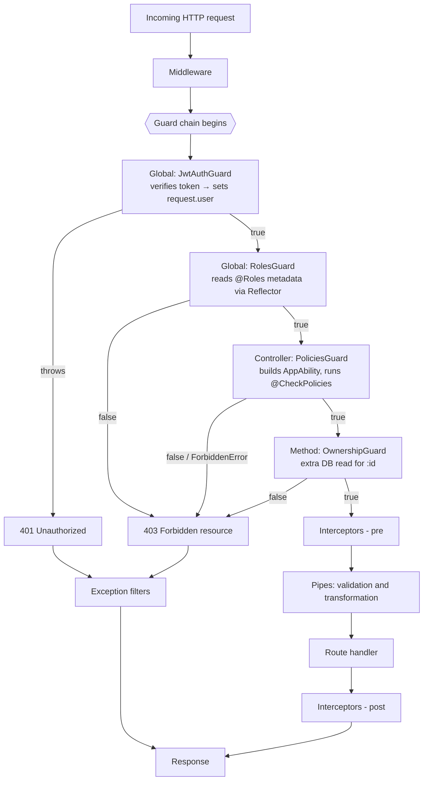

# Chapter 25 — Authorization: RBAC, Claims, and CASL

> **한눈에 보기**
> 23장에서 "당신이 누구인가"(인증)를 해결했다면, 이 장은 "당신이 무엇을 할 수 있는가"(인가)를
> 다룹니다. 역할 하나만 비교하는 가장 단순한 RBAC부터 시작해, 권한(claim) 기반으로 넘어가고,
> 마지막에는 CASL로 "자신이 쓴 글만 수정 가능", "이미 발행된 글은 삭제 불가" 같은 **조건부·속성
> 기반** 규칙까지 표현합니다. 특히 가드가 볼 수 없는 것 — 아직 DB에서 로드되지 않은 엔티티 —
> 이 무엇이며, 소유권 검사를 가드·인터셉터·서비스 중 어디에 둘지 그 트레이드오프를 깊게 다룹니다.

**What you will learn**

- Why authorization is a *different problem* from authentication, and the precise moment in the request lifecycle where each one belongs.
- How to build a complete RBAC layer — a `Role` enum, a typed `@Roles()` decorator, and a `RolesGuard` — and why `Reflector.getAllAndOverride` is almost always the right lookup, not `get`.
- How claims-based (permission) authorization differs from roles, and why a system with more than about a dozen roles is really a permission system wearing a costume.
- How to model authorization as *rules over subjects* with CASL: an `Action` enum, an `AppAbility` type, a `CaslAbilityFactory`, `detectSubjectType`, conditions, and field-level restrictions.
- How to turn CASL checks into declarative route metadata with `@CheckPolicies()` and a `PoliciesGuard`, and when to prefer a callback handler over an `IPolicyHandler` class.
- Exactly why a guard cannot enforce "you may only edit your own article" without an extra database read — and the three places that check can live, with the cost of each.
- How to choose between RBAC, ABAC, and policy-based authorization, and how to migrate from one to the next without rewriting every controller.

**Why this matters**

The most expensive class of security bug is not the missing check. It is the check that exists in nineteen of twenty places. A team ships `GET /articles/:id`, `PATCH /articles/:id`, and `DELETE /articles/:id`, and each one begins with a hand-rolled `if (article.authorId !== user.id) throw new ForbiddenException()`. Then someone adds `POST /articles/:id/publish` under deadline pressure, copies the handler above it, and forgets the two lines. Nothing fails. No test breaks, because the test suite only tests the happy path with the article's own author. The bug ships and is discovered nine months later by a customer who noticed they could publish someone else's draft.

Authorization is uniquely prone to this because the *default* is permissive. A missing validation pipe produces a crash. A missing authorization check produces a working endpoint that quietly does the wrong thing for the wrong person. The only structural defense is to make authorization declarative — visible in the route table, enforced by something that runs whether or not the handler author remembered — and then to make the *absence* of a declaration the thing that fails.

There is a second, subtler reason to care. Role checks (`user.role === 'admin'`) do not compose. As soon as a requirement says "editors may update articles, but only their own, and only while unpublished," a boolean role comparison cannot express it, so the logic leaks into the service layer, then into the repository query, then into three different places that must agree. What you actually need is a way to say the rule *once*, in a form that can be asked two different questions: "may this user, in principle, do this?" (for the route guard) and "may this user do this *to this specific object*?" (for the handler). CASL exists precisely to provide one rule set that answers both.

This chapter builds all three layers in order — roles, claims, abilities — using one evolving domain: users writing and publishing articles. Each layer is a strict superset of the one before it, so you can stop at whichever level your application actually needs.

## Authentication versus authorization, precisely

The two words are so often paired that the boundary between them blurs. Draw it sharply:

| | Authentication | Authorization |
|---|---|---|
| Question | Who are you? | May you do this? |
| Input | Credentials — a token, cookie, API key | An identity plus an action plus a resource |
| Frequency | Once per request, identically for every route | Per route, and often per *object* |
| Output | A populated `request.user` | A boolean, or a thrown `ForbiddenException` |
| Failure status | `401 Unauthorized` | `403 Forbidden` |
| Depends on | Nothing but the request | The result of authentication |

The last row is the important one. **Authorization is orthogonal to authentication but strictly downstream of it.** An authorization layer that has to figure out who the caller is has been handed the wrong job; by the time your `RolesGuard` runs, `request.user` must already exist. That ordering constraint is what dictates the design of every guard in this chapter, and it is why guard ordering (covered below) is not a stylistic preference.

The status codes matter too, and teams get them backwards. `401` means "I do not know who you are — authenticate and try again." `403` means "I know exactly who you are, and the answer is still no; retrying will not help." Returning `401` for an authorization failure invites clients to loop on token refresh forever. Returning `403` for a missing token hides from the client that a login would fix it.

> **Hint** — There is a legitimate third option for sensitive resources: return `404` instead of `403` when merely *knowing the resource exists* is itself information you do not want to leak. If `GET /admin/users/42` returns `403`, an attacker has learned that user 42 exists. This is a deliberate trade-off — it makes debugging harder — and it should be applied selectively, not globally.

## Basic RBAC: roles as route metadata

Role-based access control is policy-neutral: it says nothing about *what* a role means, only that permissions are grouped under names and users are assigned those names. It is the right starting point for most applications, and for a surprising number of them it is also the right ending point.

Start with the roles themselves.

```typescript title="src/auth/enums/role.enum.ts"
export enum Role {
  User = 'user',
  Editor = 'editor',
  Admin = 'admin',
}
```

A string enum rather than a numeric one, deliberately. Roles travel through JWTs, database columns, and log lines; `'admin'` survives a round-trip through JSON and stays readable in a stack trace, while `2` does not and will silently break the day someone reorders the enum.

> **Hint** — In larger systems, roles live in a database table or come from an external identity provider (Auth0, Keycloak, Cognito) as a claim in the token. The enum is then a *mirror* of that source, kept in sync so TypeScript can check your call sites. Do not treat the enum as the source of truth if something else already is.

### A typed `@Roles()` decorator

Nest's `SetMetadata` attaches arbitrary key/value metadata to a class or method. Wrapping it in a named decorator gives you type safety and one place to change the key.

```typescript title="src/auth/decorators/roles.decorator.ts"
import { SetMetadata } from '@nestjs/common';
import { Role } from '../enums/role.enum';

export const ROLES_KEY = 'roles';
export const Roles = (...roles: Role[]) => SetMetadata(ROLES_KEY, roles);
```

The variadic signature is what makes this readable at the call site — `@Roles(Role.Admin, Role.Editor)` reads as "admin *or* editor," which will match the `some()` semantics of the guard below.

Nest 9 introduced a second form that removes the loose string key entirely:

```typescript title="src/auth/decorators/roles.decorator.ts (alternative)"
import { Reflector } from '@nestjs/core';
import { Role } from '../enums/role.enum';

export const Roles = Reflector.createDecorator<Role[]>();
```

With this form there is no `ROLES_KEY` constant to import and no place to typo the string; the decorator object *is* the key, and `reflector.getAllAndOverride(Roles, [...])` returns `Role[] | undefined` with no generic parameter needed. The trade-off is that the variadic call style is gone — you write `@Roles([Role.Admin])` with an explicit array. Both forms are current in v11. This chapter uses the `SetMetadata` form because the CASL sections need multi-argument decorators anyway, and mixing styles within one auth module is worse than either style alone.

Apply it to a controller:

```typescript title="src/articles/articles.controller.ts"
import { Body, Controller, Delete, Get, Param, Post } from '@nestjs/common';
import { Roles } from '../auth/decorators/roles.decorator';
import { Role } from '../auth/enums/role.enum';
import { ArticlesService } from './articles.service';
import { CreateArticleDto } from './dto/create-article.dto';

@Controller('articles')
export class ArticlesController {
  constructor(private readonly articlesService: ArticlesService) {}

  @Get()
  findAll() {
    return this.articlesService.findAll();
  }

  @Post()
  @Roles(Role.Editor, Role.Admin)
  create(@Body() dto: CreateArticleDto) {
    return this.articlesService.create(dto);
  }

  @Delete(':id')
  @Roles(Role.Admin)
  remove(@Param('id') id: string) {
    return this.articlesService.remove(+id);
  }
}
```

### The guard that reads it back

```typescript title="src/auth/guards/roles.guard.ts"
import { CanActivate, ExecutionContext, Injectable } from '@nestjs/common';
import { Reflector } from '@nestjs/core';
import { ROLES_KEY } from '../decorators/roles.decorator';
import { Role } from '../enums/role.enum';

@Injectable()
export class RolesGuard implements CanActivate {
  constructor(private readonly reflector: Reflector) {}

  canActivate(context: ExecutionContext): boolean {
    const requiredRoles = this.reflector.getAllAndOverride<Role[]>(ROLES_KEY, [
      context.getHandler(),
      context.getClass(),
    ]);

    if (!requiredRoles) {
      return true;
    }

    const { user } = context.switchToHttp().getRequest();
    return requiredRoles.some((role) => user?.roles?.includes(role));
  }
}
```

Four details in twenty lines, each of which is a decision:

**`getAllAndOverride` and not `get`.** `reflector.get(KEY, context.getHandler())` looks at the method only. If you put `@Roles(Role.Admin)` on the *controller class* to protect every route in it, `get` on the handler returns `undefined` and the guard waves the request through — a fail-open bug that produces no error and no log line. `getAllAndOverride` walks the array in order and returns the **first** non-undefined value, so a handler-level `@Roles()` overrides a class-level one and a class-level one applies when the handler has none. That is the semantics you want: the more specific declaration wins.

The sibling method `getAllAndMerge` concatenates instead of overriding. For roles that is usually wrong — a controller marked `@Roles(Role.Admin)` with a handler marked `@Roles(Role.User)` would merge to "admin or user," *widening* access on the more specific declaration. Merge semantics make sense for additive metadata (tags, interceptor options), not for restrictions.

**`if (!requiredRoles) return true`.** An undecorated route is public. This is the pragmatic default and it is also the dangerous one, because it means forgetting a decorator fails open. The "Common mistakes" section returns to this with a fail-closed alternative.

**`requiredRoles.some(...)`** — required roles are an **OR**, not an AND. `@Roles(Role.Editor, Role.Admin)` means "editor or admin." If you genuinely need "must hold all of these," that is a permission-set intersection, and you have already outgrown roles; see the claims section.

**Optional chaining on `user?.roles?`.** If `RolesGuard` somehow runs before authentication, `request.user` is `undefined`. Without the `?.` you get a `TypeError`, which the exceptions layer converts into a `500` — an internal error masking what should be a `401`. With it you get a clean `403`. Neither is ideal; the real fix is guard ordering.

For this to typecheck cleanly, your user shape must carry roles:

```typescript title="src/users/entities/user.entity.ts"
import { Role } from '../../auth/enums/role.enum';

export class User {
  id: number;
  email: string;
  isAdmin: boolean;
  roles: Role[];
}
```

### Registering the guard, and why ordering is not optional

Bind at the method level, the controller level, or globally:

```typescript title="src/app.module.ts"
import { Module } from '@nestjs/common';
import { APP_GUARD } from '@nestjs/core';
import { JwtAuthGuard } from './auth/guards/jwt-auth.guard';
import { RolesGuard } from './auth/guards/roles.guard';

@Module({
  providers: [
    { provide: APP_GUARD, useClass: JwtAuthGuard },
    { provide: APP_GUARD, useClass: RolesGuard },
  ],
})
export class AppModule {}
```

`APP_GUARD` is the only global binding form that participates in dependency injection — `app.useGlobalGuards(new RolesGuard(???))` cannot construct a `Reflector` for you, which is exactly why the token exists (see [Chapter 11 — Guards](../part1-beginner/11-guards.md)).

Guards registered via `APP_GUARD` execute **in the order the providers are declared in the module**. Since `RolesGuard` reads `request.user`, the authentication guard must be declared first. Reverse those two lines and every authenticated route starts returning `403` (or `500`, without the optional chaining), and the cause is a two-line reordering in a file nobody thinks of as security-relevant. Write a comment there.

More generally, the full ordering across all binding levels is: **global guards → controller guards → method guards**, and within each level, declaration order. Nest evaluates them sequentially and short-circuits on the first one that returns `false` or throws — a later guard never runs after an earlier one denies.



Two things this diagram makes concrete. First, **guards run before pipes**. Your guard sees raw, unvalidated, untransformed route parameters — `context.switchToHttp().getRequest().params.id` is the string `"42"`, not the number `42`, and it has not been checked against your DTO. Second, **guards run before the handler**, which means the entity the handler is about to load does not exist yet. That single fact drives the entire ownership discussion later in this chapter.

### What a denial looks like

When a guard returns `false`, Nest throws `ForbiddenException` for you and the client receives:

```json
{
  "statusCode": 403,
  "message": "Forbidden resource",
  "error": "Forbidden"
}
```

That message is deliberately uninformative — it does not tell an attacker *which* role was missing. If you want a more specific response, throw your own exception instead of returning `false`:

```typescript
if (!requiredRoles.some((role) => user?.roles?.includes(role))) {
  throw new ForbiddenException(
    `This action requires one of: ${requiredRoles.join(', ')}`,
  );
}
return true;
```

Do this only for internal or admin APIs. On a public API, enumerating your role names in an error body is free reconnaissance.

> **⚠️ Notice** — This RBAC implementation is called *basic* for a real reason. It checks roles only at the route-handler boundary. Real endpoints often perform several operations, each needing different permissions: a single `PATCH /articles/:id` might update the body (needs `article:update`), change the author (needs `article:reassign`), and flip the published flag (needs `article:publish`). A route-level role check cannot distinguish them, so the finer checks migrate into your business logic and there is no longer one place that maps permissions to actions. That decentralization is the cost of stopping at basic RBAC, and it is the problem CASL solves.

## Claims-based authorization

A **claim** is a name–value pair issued by a trusted party that describes what a subject *can do*, rather than what the subject *is*. `role: admin` says what you are. `permissions: ['article:create', 'article:delete']` says what you may do. The mechanical change is small; the modelling change is significant.

The implementation is the RBAC implementation with the enum swapped:

```typescript title="src/auth/enums/permission.enum.ts"
export enum Permission {
  CreateArticle = 'article:create',
  ReadArticle = 'article:read',
  UpdateArticle = 'article:update',
  DeleteArticle = 'article:delete',
  PublishArticle = 'article:publish',
  ManageUsers = 'user:manage',
}
```

```typescript title="src/auth/decorators/require-permissions.decorator.ts"
import { SetMetadata } from '@nestjs/common';
import { Permission } from '../enums/permission.enum';

export const PERMISSIONS_KEY = 'permissions';
export const RequirePermissions = (...permissions: Permission[]) =>
  SetMetadata(PERMISSIONS_KEY, permissions);
```

```typescript title="src/auth/guards/permissions.guard.ts"
import { CanActivate, ExecutionContext, Injectable } from '@nestjs/common';
import { Reflector } from '@nestjs/core';
import { PERMISSIONS_KEY } from '../decorators/require-permissions.decorator';
import { Permission } from '../enums/permission.enum';

@Injectable()
export class PermissionsGuard implements CanActivate {
  constructor(private readonly reflector: Reflector) {}

  canActivate(context: ExecutionContext): boolean {
    const required = this.reflector.getAllAndOverride<Permission[]>(
      PERMISSIONS_KEY,
      [context.getHandler(), context.getClass()],
    );
    if (!required) return true;

    const { user } = context.switchToHttp().getRequest();
    const granted: Permission[] = user?.permissions ?? [];
    // AND semantics: every declared permission must be held.
    return required.every((permission) => granted.includes(permission));
  }
}
```

```typescript title="src/articles/articles.controller.ts (excerpt)"
@Post()
@RequirePermissions(Permission.CreateArticle)
create(@Body() dto: CreateArticleDto) {
  return this.articlesService.create(dto);
}
```

Note the deliberate difference from `RolesGuard`: `every` rather than `some`. Permissions are capabilities you accumulate, so requiring several of them at once is a meaningful and common statement ("this endpoint needs both `article:update` and `article:publish`"). Roles are identities, so requiring several at once rarely is. Keeping AND for permissions and OR for roles is the convention this book recommends — pick one and document it, because a reader cannot tell from the call site which you chose.

### Roles and permissions together

In practice you want both, and the relationship is: **roles are named bundles of permissions**. Users are assigned roles; roles expand to permissions; guards check permissions. The expansion happens once, at login, when you mint the token:

```typescript title="src/auth/role-permissions.ts"
import { Permission } from './enums/permission.enum';
import { Role } from './enums/role.enum';

export const ROLE_PERMISSIONS: Record<Role, Permission[]> = {
  [Role.User]: [Permission.ReadArticle],
  [Role.Editor]: [
    Permission.ReadArticle,
    Permission.CreateArticle,
    Permission.UpdateArticle,
    Permission.PublishArticle,
  ],
  [Role.Admin]: Object.values(Permission),
};

export function permissionsFor(roles: Role[]): Permission[] {
  return [...new Set(roles.flatMap((role) => ROLE_PERMISSIONS[role] ?? []))];
}
```

```typescript title="src/auth/auth.service.ts (excerpt)"
async login(user: User) {
  const payload = {
    sub: user.id,
    email: user.email,
    roles: user.roles,
    permissions: permissionsFor(user.roles),
  };
  return { access_token: await this.jwtService.signAsync(payload) };
}
```

This gives you the readability of roles at the org-chart level and the precision of permissions at the endpoint level. It also introduces a real operational hazard: **permissions baked into a JWT are stale until the token expires.** Revoke an editor's `article:publish` and they keep it for the remaining lifetime of their access token. If that is unacceptable, either keep access-token lifetimes short (5–15 minutes, with refresh — see [Chapter 24 — Passport in Practice](./24-passport-strategies.md)) or resolve permissions from a cache-backed store on each request instead of from the token. There is no third option; this is the fundamental trade-off of stateless auth.

### When you have outgrown roles

A practical diagnostic. You have outgrown pure RBAC when any of these is true:

1. You have roles named `EditorButNotForFinance` or `AdminReadOnly` — you are encoding a permission matrix into role names.
2. A requirement contains the word *own*: "users may edit their **own** profile." No role name can express a relationship between the subject and the object.
3. A requirement contains a state condition: "published articles cannot be deleted." The rule depends on the object's attributes, not the user's.
4. Your role count is growing roughly linearly with your feature count.

Requirements 2 and 3 are the ones roles fundamentally cannot express, at any level of naming discipline, because the rule is a function of the *resource*, not just the *subject*. That is attribute-based access control, and it is where CASL earns its place.

## Integrating CASL

[CASL](https://casl.js.org/) is an isomorphic authorization library: the same rule definitions run in your Nest server and, if you want, in a browser client to decide which buttons to render. It is incrementally adoptable — you can start with rules that are indistinguishable from RBAC and add conditions later without changing your guards.

```bash
$ npm install @casl/ability
```

> **Hint** — CASL is the library the official docs demonstrate, but it is not the only option; `accesscontrol` and `acl` cover similar ground with different trade-offs. The *pattern* in this section — centralize rules in a factory, express them over (action, subject) pairs, check them in a guard — transfers to any of them.

### The domain

Two entities, deliberately small:

```typescript title="src/users/entities/user.entity.ts"
export class User {
  id: number;
  isAdmin: boolean;
}
```

```typescript title="src/articles/entities/article.entity.ts"
export class Article {
  id: number;
  isPublished: boolean;
  authorId: number;
  title: string;
  body: string;
}
```

And four requirements that are impossible to express with roles alone:

- Admins can **manage** (create/read/update/delete) all entities.
- Users have **read-only** access to everything.
- Users can **update their own** articles (`article.authorId === user.id`).
- Articles that are already published **cannot be deleted** (`article.isPublished === true`), by anyone.

### The `Action` enum

```typescript title="src/casl/action.enum.ts"
export enum Action {
  Manage = 'manage',
  Create = 'create',
  Read = 'read',
  Update = 'update',
  Delete = 'delete',
}
```

> **⚠️ Notice** — `manage` is a **special keyword** in CASL meaning "any action." It is not just a nicer name for a CRUD bundle: `can(Action.Manage, Article)` matches a check for `Action.Publish` too, including actions you have not defined yet. That is usually what you want for admins and almost never what you want for anyone else. Never grant `manage` as shorthand for "all four CRUD verbs" — define them explicitly if that is what you mean.

Nothing forces you to stop at CRUD. `Publish`, `Archive`, and `Assign` are perfectly good actions, and modelling them explicitly is exactly how you avoid the "one PATCH does three privileged things" problem from the RBAC section.

### The ability factory

```bash
$ nest g module casl
$ nest g class casl/casl-ability.factory
```

```typescript title="src/casl/casl-ability.factory.ts"
import { Injectable } from '@nestjs/common';
import {
  AbilityBuilder,
  createMongoAbility,
  ExtractSubjectType,
  InferSubjects,
  MongoAbility,
} from '@casl/ability';
import { Article } from '../articles/entities/article.entity';
import { User } from '../users/entities/user.entity';
import { Action } from './action.enum';

type Subjects = InferSubjects<typeof Article | typeof User> | 'all';

export type AppAbility = MongoAbility<[Action, Subjects]>;

@Injectable()
export class CaslAbilityFactory {
  createForUser(user: User): AppAbility {
    const { can, cannot, build } = new AbilityBuilder<AppAbility>(
      createMongoAbility,
    );

    if (user.isAdmin) {
      can(Action.Manage, 'all'); // read-write access to everything
    } else {
      can(Action.Read, 'all'); // read-only access to everything
    }

    can(Action.Update, Article, { authorId: user.id });
    cannot(Action.Delete, Article, { isPublished: true });

    return build({
      detectSubjectType: (item) =>
        item.constructor as ExtractSubjectType<Subjects>,
    });
  }
}
```

Unpack every line, because each one carries meaning that is easy to skim past.

**`MongoAbility`, not `Ability`.** Since CASL v6, `MongoAbility` is the default ability class and replaces the legacy `Ability`. The name is misleading and worth stating plainly: **it has nothing to do with MongoDB.** It is called that because the condition objects use MongoDB's query syntax (`{ authorId: 5 }`, `{ views: { $gt: 100 } }`, `{ status: { $in: ['draft', 'review'] } }`), and CASL evaluates those conditions against plain JavaScript objects in memory. It works identically with Postgres, Prisma, or an in-memory array.

**`InferSubjects<typeof Article | typeof User>`.** Note `typeof` — you pass the *class constructors*, not instance types. `InferSubjects` produces a union that accepts both the class itself (for "may this user update articles in general?") and instances of it (for "may this user update *this* article?"). That dual nature is the single most useful property of CASL for a Nest application, and the guard/handler split later depends on it.

**`'all'`.** A special CASL keyword meaning "any subject." `can(Action.Manage, 'all')` is the maximal grant: any action, any subject type. Reserve it for genuine superusers.

**`can` versus `cannot`.** Both take up to four arguments — `(action, subject, fields?, conditions?)` — and both are *rules*, not imperative checks. `can` grants, `cannot` forbids. Order matters in one specific way: **`cannot` rules that come later override earlier `can` rules for the same subject.** That is why the `cannot(Action.Delete, Article, { isPublished: true })` line sits *after* the admin's `can(Action.Manage, 'all')` — it carves an exception out of the admin grant, which is exactly requirement four ("published articles cannot be deleted, by anyone"). Move that line above the `if` block and admins regain the ability to delete published articles, silently.

**`can(Action.Update, Article, { authorId: user.id })` sits outside the if/else** and therefore applies to admins too. It is redundant for them (they already have `manage all`) and load-bearing for everyone else. Rules are additive; extra grants never remove access.

**`detectSubjectType`.** This is the option people forget and then spend an afternoon debugging. CASL needs to map an object it is given back to the subject type its rules were written against. By default it looks for a `modelName` or `__caslSubjectType__` property, which your plain classes do not have. Supplying `detectSubjectType: (item) => item.constructor as ExtractSubjectType<Subjects>` tells CASL to use the object's constructor, which is what makes `ability.can(Action.Update, someArticleInstance)` work with ordinary `class Article`. Without it, instance checks return `false` for everything and you will suspect your conditions when the problem is type detection.

There is a corollary that bites in real applications: **the object must actually be an instance of the class.** A plain object literal from `JSON.parse`, or a raw row from a query builder that returns POJOs, has `constructor === Object` and matches nothing. Prisma and knex return plain objects; TypeORM and Mongoose return class instances. If your ORM returns POJOs, either instantiate the class (`Object.assign(new Article(), row)`) or use CASL's `subject()` helper: `ability.can(Action.Update, subject('Article', row))`.

Register and export the factory:

```typescript title="src/casl/casl.module.ts"
import { Module } from '@nestjs/common';
import { CaslAbilityFactory } from './casl-ability.factory';

@Module({
  providers: [CaslAbilityFactory],
  exports: [CaslAbilityFactory],
})
export class CaslModule {}
```

Import `CaslModule` wherever you need it, then inject normally:

```typescript
constructor(private readonly caslAbilityFactory: CaslAbilityFactory) {}
```

### Asking the ability questions

Two shapes of question, and the difference between them is the whole point.

**Type-level** — "in principle, may this user do this to articles at all?"

```typescript
const user = new User();
user.isAdmin = false;

const ability = this.caslAbilityFactory.createForUser(user);
ability.can(Action.Read, Article);   // true  — read-only access to everything
ability.can(Action.Create, Article); // false — no create rule for non-admins
ability.can(Action.Delete, Article); // false
```

**Instance-level** — "may this user do this to *this specific object*?"

```typescript
const user = new User();
user.id = 1;

const article = new Article();
article.authorId = 1;

const ability = this.caslAbilityFactory.createForUser(user);
ability.can(Action.Update, article); // true  — authorId matches

article.authorId = 2;
ability.can(Action.Update, article); // false — condition fails
```

One rule set, two questions. A guard can only ask the first (it has no entity yet); a service can ask the second. Because both derive from the same `createForUser`, they cannot drift apart — which is the structural property that fixes the "nineteen of twenty places" problem from the chapter opening.

> **Hint** — `AbilityBuilder` and `MongoAbility` both expose `can` and `cannot`, and they are *different methods*. On the builder they **define** rules and return nothing useful. On the ability they **check** rules and return a boolean. Destructuring `const { can } = new AbilityBuilder(...)` in the same scope where you also call `ability.can(...)` is a well-known way to confuse yourself; name the ability variable clearly.

### Conditions and field-level rules

Conditions are Mongo-style query objects evaluated against the subject instance:

```typescript
can(Action.Read, Article, { isPublished: true });
can(Action.Update, Article, { authorId: user.id, isPublished: false });
can(Action.Read, Article, { views: { $gt: 1000 } });
can(Action.Update, Article, { status: { $in: ['draft', 'review'] } });
```

Multiple keys in one object are ANDed. Two separate `can` calls are ORed. So `can(Action.Update, Article, { authorId: user.id, isPublished: false })` means "your own *and* unpublished," while calling `can` twice with each condition means "your own *or* unpublished" — a materially different rule that reads almost the same. This is the single most common CASL modelling error; write a test for every compound condition.

The third argument, before conditions, restricts **fields**:

```typescript
// Editors may update only the title and body of their own articles.
can(Action.Update, Article, ['title', 'body'], { authorId: user.id });
// Nobody may ever change the author.
cannot(Action.Update, Article, ['authorId']);
```

Field rules are checked by passing a field name as a third argument to `can`:

```typescript
ability.can(Action.Update, article, 'title');    // true
ability.can(Action.Update, article, 'authorId'); // false
```

This is genuinely useful for partial updates, and it comes with a sharp edge: **`ability.can(Action.Update, article)` with no field argument returns `true` if the user may update *any* field.** Field-level rules therefore do not protect you unless you actually check per field. The practical pattern is to iterate the DTO's own keys:

```typescript title="src/articles/articles.service.ts (excerpt)"
import { ForbiddenException } from '@nestjs/common';

async update(id: number, dto: UpdateArticleDto, user: User) {
  const article = await this.repo.findOneByOrFail({ id });
  const ability = this.caslAbilityFactory.createForUser(user);

  for (const field of Object.keys(dto)) {
    if (!ability.can(Action.Update, article, field)) {
      throw new ForbiddenException(`You may not update "${field}".`);
    }
  }

  Object.assign(article, dto);
  return this.repo.save(article);
}
```

Combine that with a `whitelist: true, forbidNonWhitelisted: true` validation pipe ([Chapter 15](./15-validation-in-depth.md)) so `Object.keys(dto)` cannot contain properties you never declared.

### `ForbiddenError.from(...).throwUnlessCan()`

Writing `if (!ability.can(...)) throw new ForbiddenException()` everywhere is fine but loses information: the resulting error does not say which rule failed. CASL ships a purpose-built error:

```typescript title="src/articles/articles.service.ts (excerpt)"
import { ForbiddenError } from '@casl/ability';
import { ForbiddenException } from '@nestjs/common';

async remove(id: number, user: User) {
  const article = await this.repo.findOneByOrFail({ id });
  const ability = this.caslAbilityFactory.createForUser(user);

  ForbiddenError.from(ability)
    .setMessage('You are not allowed to delete this article')
    .throwUnlessCan(Action.Delete, article);

  return this.repo.remove(article);
}
```

`throwUnlessCan` throws a `ForbiddenError` (CASL's own class) carrying `action`, `subjectType`, and `field`, which is excellent for logging. But it is **not** a Nest `HttpException`, so left unhandled it becomes a `500`. Bridge it with a small exception filter, registered once:

```typescript title="src/casl/casl-forbidden.filter.ts"
import {
  ArgumentsHost,
  Catch,
  ExceptionFilter,
  HttpStatus,
  Logger,
} from '@nestjs/common';
import { ForbiddenError } from '@casl/ability';
import { Response } from 'express';

@Catch(ForbiddenError)
export class CaslForbiddenFilter implements ExceptionFilter {
  private readonly logger = new Logger(CaslForbiddenFilter.name);

  catch(error: ForbiddenError<any>, host: ArgumentsHost) {
    this.logger.warn(
      `Denied: ${error.action} on ${String(error.subjectType)}` +
        (error.field ? ` (field: ${error.field})` : ''),
    );

    host
      .switchToHttp()
      .getResponse<Response>()
      .status(HttpStatus.FORBIDDEN)
      .json({
        statusCode: HttpStatus.FORBIDDEN,
        message: error.message,
        error: 'Forbidden',
      });
  }
}
```

```typescript title="src/main.ts (excerpt)"
app.useGlobalFilters(new CaslForbiddenFilter());
```

Now `throwUnlessCan` produces a clean `403` with a useful log line, and you never write the boolean-check-then-throw dance again. This book recommends `throwUnlessCan` plus this filter over manual `if` checks for exactly that reason: the guard rail is uniform and the logging is free.

## Advanced: declarative policies with `PoliciesGuard`

CASL checks in the service layer solve correctness. They do not solve *visibility* — you still cannot read a controller and see what each route requires. A policies guard restores that, by letting a route declare, as metadata, the ability checks it needs.

The design goal: support **both** object handlers (a class implementing an interface — testable, reusable, DI-adjacent) and **callback** handlers (an inline arrow function — concise, good for one-off checks).

```typescript title="src/casl/policy-handler.ts"
import { AppAbility } from './casl-ability.factory';

export interface IPolicyHandler {
  handle(ability: AppAbility): boolean;
}

export type PolicyHandlerCallback = (ability: AppAbility) => boolean;

export type PolicyHandler = IPolicyHandler | PolicyHandlerCallback;
```

```typescript title="src/casl/check-policies.decorator.ts"
import { SetMetadata } from '@nestjs/common';
import { PolicyHandler } from './policy-handler';

export const CHECK_POLICIES_KEY = 'check_policy';
export const CheckPolicies = (...handlers: PolicyHandler[]) =>
  SetMetadata(CHECK_POLICIES_KEY, handlers);
```

```typescript title="src/casl/policies.guard.ts"
import { CanActivate, ExecutionContext, Injectable } from '@nestjs/common';
import { Reflector } from '@nestjs/core';
import { AppAbility, CaslAbilityFactory } from './casl-ability.factory';
import { CHECK_POLICIES_KEY } from './check-policies.decorator';
import { PolicyHandler } from './policy-handler';

@Injectable()
export class PoliciesGuard implements CanActivate {
  constructor(
    private readonly reflector: Reflector,
    private readonly caslAbilityFactory: CaslAbilityFactory,
  ) {}

  async canActivate(context: ExecutionContext): Promise<boolean> {
    const policyHandlers =
      this.reflector.getAllAndMerge<PolicyHandler[]>(CHECK_POLICIES_KEY, [
        context.getHandler(),
        context.getClass(),
      ]) ?? [];

    if (policyHandlers.length === 0) return true;

    const { user } = context.switchToHttp().getRequest();
    const ability = this.caslAbilityFactory.createForUser(user);

    return policyHandlers.every((handler) =>
      this.execPolicyHandler(handler, ability),
    );
  }

  private execPolicyHandler(handler: PolicyHandler, ability: AppAbility) {
    if (typeof handler === 'function') {
      return handler(ability);
    }
    return handler.handle(ability);
  }
}
```

The official example uses `reflector.get(CHECK_POLICIES_KEY, context.getHandler())`, which reads method metadata only. This version uses **`getAllAndMerge`** across handler and class, and that is a considered deviation: unlike roles, policies are genuinely additive. A controller-level policy ("you must be able to read articles at all") plus a method-level policy ("and you must be able to delete them") composing into an AND is precisely the semantics you want, and it lets you hoist a shared precondition to the class. `every()` on the merged array enforces the AND.

The dispatch in `execPolicyHandler` is a plain `typeof handler === 'function'` check. Classes in JavaScript *are* functions, which is why the decorator must receive an **instance** (`new ReadArticlePolicyHandler()`), not the class itself — pass the class and it takes the callback branch, gets called without `new`, and throws.

Use it with a callback:

```typescript title="src/articles/articles.controller.ts (excerpt)"
import { Controller, Get, UseGuards } from '@nestjs/common';
import { Action } from '../casl/action.enum';
import { AppAbility } from '../casl/casl-ability.factory';
import { CheckPolicies } from '../casl/check-policies.decorator';
import { PoliciesGuard } from '../casl/policies.guard';
import { Article } from './entities/article.entity';

@Controller('articles')
export class ArticlesController {
  @Get()
  @UseGuards(PoliciesGuard)
  @CheckPolicies((ability: AppAbility) => ability.can(Action.Read, Article))
  findAll() {
    return this.articlesService.findAll();
  }
}
```

Or with an object handler:

```typescript title="src/articles/policies/read-article.handler.ts"
import { Action } from '../../casl/action.enum';
import { AppAbility } from '../../casl/casl-ability.factory';
import { IPolicyHandler } from '../../casl/policy-handler';
import { Article } from '../entities/article.entity';

export class ReadArticlePolicyHandler implements IPolicyHandler {
  handle(ability: AppAbility) {
    return ability.can(Action.Read, Article);
  }
}
```

```typescript
@Get()
@UseGuards(PoliciesGuard)
@CheckPolicies(new ReadArticlePolicyHandler())
findAll() {
  return this.articlesService.findAll();
}
```

### Which handler form to use

| | Callback handler | `IPolicyHandler` class |
|---|---|---|
| Verbosity | One line at the call site | Separate file, ~10 lines |
| Reuse across controllers | Copy-paste | Import once |
| Unit testable in isolation | Awkward (it lives in a decorator) | Trivially |
| Can use DI | No | No — see below |
| Named in stack traces / logs | Anonymous | Class name appears |
| Best for | One-off checks unique to a route | Checks repeated across ≥3 routes |

Use callbacks by default; promote to a class the third time you write the same check.

> **⚠️ Notice** — Because you must instantiate the handler in place with `new`, **`ReadArticlePolicyHandler` cannot use dependency injection.** Its constructor runs at *decorator evaluation time* — while the module file is being loaded, long before the DI container exists. There is no injector to ask.

The workaround is to let `@CheckPolicies()` also accept a `Type<IPolicyHandler>` and resolve it through `ModuleRef` inside the guard:

```typescript title="src/casl/policies.guard.ts (DI-capable variant)"
import { CanActivate, ExecutionContext, Injectable, Type } from '@nestjs/common';
import { ModuleRef, Reflector } from '@nestjs/core';
import { AppAbility, CaslAbilityFactory } from './casl-ability.factory';
import { CHECK_POLICIES_KEY } from './check-policies.decorator';
import { IPolicyHandler, PolicyHandler } from './policy-handler';

type PolicyHandlerRef = PolicyHandler | Type<IPolicyHandler>;

@Injectable()
export class PoliciesGuard implements CanActivate {
  constructor(
    private readonly reflector: Reflector,
    private readonly moduleRef: ModuleRef,
    private readonly caslAbilityFactory: CaslAbilityFactory,
  ) {}

  async canActivate(context: ExecutionContext): Promise<boolean> {
    const handlers =
      this.reflector.getAllAndMerge<PolicyHandlerRef[]>(CHECK_POLICIES_KEY, [
        context.getHandler(),
        context.getClass(),
      ]) ?? [];
    if (handlers.length === 0) return true;

    const { user } = context.switchToHttp().getRequest();
    const ability = this.caslAbilityFactory.createForUser(user);

    for (const handler of handlers) {
      if (!(await this.exec(handler, ability))) return false;
    }
    return true;
  }

  private async exec(handler: PolicyHandlerRef, ability: AppAbility) {
    // A registered provider class: resolve it from the container.
    if (typeof handler === 'function' && handler.prototype?.handle) {
      const instance = this.moduleRef.get<IPolicyHandler>(
        handler as Type<IPolicyHandler>,
        { strict: false },
      );
      return instance.handle(ability);
    }
    if (typeof handler === 'function') {
      return (handler as (a: AppAbility) => boolean)(ability);
    }
    return handler.handle(ability);
  }
}
```

`moduleRef.get(..., { strict: false })` searches the entire application, so the handler class must be registered as a provider somewhere. For handlers that are themselves request-scoped or transient, use `await this.moduleRef.resolve(handler)` instead ([Chapter 41 — ModuleRef, DiscoveryService, Lazy Loading](../part3-advanced/41-module-ref-discovery-lazy.md)).

Before you reach for this, ask whether you need it. A policy handler that needs DI usually needs it to *load an entity* — and if that is the case, the guard is the wrong layer entirely. Which brings us to the central limitation.

## Ownership checks and the limits of guards

Requirement three was "users can update their own articles." Consider `PATCH /articles/42`. Can a guard enforce it?

The guard has: `request.user` (from authentication) and `request.params.id === '42'` (a raw string). It does **not** have the `Article` with id 42, because nothing has loaded it — the handler has not run, the service has not been called, the repository has not been queried. A guard runs strictly before all of that.

So `ability.can(Action.Update, article)` is unanswerable in a guard, because there is no `article`. This is not a Nest limitation to work around; it is the direct consequence of guards being a *routing-boundary* concern. There are three real options.

### Option A — the guard performs its own database read

```typescript title="src/articles/guards/article-ownership.guard.ts"
import {
  CanActivate,
  ExecutionContext,
  Injectable,
  NotFoundException,
} from '@nestjs/common';
import { ForbiddenError } from '@casl/ability';
import { Action } from '../../casl/action.enum';
import { CaslAbilityFactory } from '../../casl/casl-ability.factory';
import { ArticlesService } from '../articles.service';

@Injectable()
export class ArticleOwnershipGuard implements CanActivate {
  constructor(
    private readonly articles: ArticlesService,
    private readonly caslAbilityFactory: CaslAbilityFactory,
  ) {}

  async canActivate(context: ExecutionContext): Promise<boolean> {
    const request = context.switchToHttp().getRequest();
    const id = Number(request.params.id);
    if (!Number.isInteger(id)) return false;

    const article = await this.articles.findOne(id);
    if (!article) throw new NotFoundException();

    const ability = this.caslAbilityFactory.createForUser(request.user);
    ForbiddenError.from(ability).throwUnlessCan(Action.Update, article);

    // Stash it so the handler need not query again.
    request.article = article;
    return true;
  }
}
```

Works, and keeps the check declarative. Costs: an extra query per request unless you stash the entity on the request (which is a side channel the handler must know about and TypeScript cannot type), the guard now depends on a service and therefore on a module import, and the guard is bound to the parameter name `id`. Note also the raw `Number(request.params.id)` — pipes have not run yet, so validation is your problem here.

### Option B — an interceptor loads the entity

An interceptor runs *after* guards but still before the handler, and it can put the entity into the request in a way that a custom `@CurrentArticle()` parameter decorator can retrieve cleanly. This reads better than the guard's `request.article` side channel, but it inherits the same extra-query cost and adds a subtlety: interceptors cannot deny the request as cleanly as guards. You throw from inside the interceptor, which works but muddles "this layer transforms" with "this layer decides."

### Option C — the service performs the check (recommended)

```typescript title="src/articles/articles.service.ts (excerpt)"
async update(id: number, dto: UpdateArticleDto, user: User) {
  const article = await this.repo.findOneBy({ id });
  if (!article) throw new NotFoundException();

  const ability = this.caslAbilityFactory.createForUser(user);
  ForbiddenError.from(ability).throwUnlessCan(Action.Update, article);

  Object.assign(article, dto);
  return this.repo.save(article);
}
```

One query, no side channels, and — decisively — the check protects the *method*, not the route. If a queue consumer, a GraphQL resolver, a CLI command, or another service calls `articles.update(...)`, the check still runs. A guard protects one HTTP route; a service check protects every caller.

### The recommendation

| Concern | Guard | Interceptor | Service |
|---|---|---|---|
| Sees the loaded entity | ❌ never | ✅ if it loads it | ✅ |
| Visible in the controller | ✅ | ✅ | ❌ |
| Extra DB round-trip | ✅ (unless stashed) | ✅ (unless stashed) | ❌ |
| Protects non-HTTP callers | ❌ | ❌ | ✅ |
| Runs before validation pipes | ✅ (a problem) | ❌ | ❌ |
| Clean denial semantics | ✅ | ⚠️ throws | ✅ |

**Use both layers, for different questions.** Put the *type-level* check in a guard — "may this user update articles at all?" — so the route table stays readable and the obviously-unauthorized request is rejected before you touch the database. Put the *instance-level* check in the service — "may this user update *this* article?" — where the entity exists and every caller is covered. Because both call `createForUser`, they enforce one rule set and cannot diverge.

```typescript title="src/articles/articles.controller.ts (excerpt)"
@Patch(':id')
@UseGuards(PoliciesGuard)
@CheckPolicies((ability: AppAbility) => ability.can(Action.Update, Article))
update(
  @Param('id', ParseIntPipe) id: number,
  @Body() dto: UpdateArticleDto,
  @CurrentUser() user: User,
) {
  // Instance-level ownership check happens inside the service.
  return this.articlesService.update(id, dto, user);
}
```

The guard rejects a plain `user` who has no update rule at all, with zero database cost. The service rejects the editor trying to touch someone else's draft.

### Filtering lists

There is a fourth question guards cannot answer at all: not "may you see this?" but "which of these may you see?" CASL's companion packages solve this by translating rules into query conditions:

```bash
$ npm install @casl/mongoose   # or @casl/prisma
```

```typescript
import { accessibleBy } from '@casl/prisma';

const articles = await this.prisma.article.findMany({
  where: { AND: [accessibleBy(ability).Article, { isPublished: true }] },
});
```

This is strictly better than fetching everything and filtering in memory, which is both slow and prone to leaking counts and pagination totals. Without such a package, the fallback is `rules.filter((a) => ability.can(Action.Read, a))` after the query — acceptable for small, bounded collections and wrong for anything paginated.

## Choosing a model: RBAC, ABAC, and policy-based

| | RBAC | Claims / permissions | ABAC (CASL conditions) | Policy-based (`PoliciesGuard`) |
|---|---|---|---|---|
| Unit of decision | Role name | Permission string | (action, subject, conditions) | Named policy composed of ability checks |
| Can express "own resource" | ❌ | ❌ | ✅ | ✅ |
| Can express resource state ("published") | ❌ | ❌ | ✅ | ✅ |
| Field-level control | ❌ | Only by inventing `article:update:title` | ✅ native | ✅ |
| Decidable in a guard alone | ✅ | ✅ | Type-level only | Type-level only |
| Rules live in | Enum + guard | Enum + guard | One ability factory | Factory + handler classes |
| Changing rules without redeploy | Hard | Possible (DB-backed roles) | Possible (data-driven rules) | Possible |
| Cost of adding a new resource | Low | Low | Low | Medium (new handlers) |
| Auditability ("who can do X?") | Easy | Easy | Requires evaluation | Requires evaluation |
| Good fit for | < ~10 roles, no ownership rules | Many fine-grained endpoint permissions | Ownership, tenancy, state machines | Large apps wanting declarative routes |

Three practical notes on this table.

**Auditability is the underrated column.** With RBAC you answer "who can delete articles?" by grepping the enum. With ABAC you answer it by *evaluating rules against every user*, because the answer is conditional. Compliance-driven organizations sometimes choose the weaker model for exactly this reason, and that is a legitimate engineering decision, not a mistake.

**These layers stack; they are not alternatives.** The recommended progression is: start with RBAC. When roles start encoding permission matrices in their names, expand roles into permissions at login and keep the roles as labels. When a requirement mentions ownership or resource state, introduce CASL — and note that your existing `RolesGuard` keeps working unchanged, because `user.isAdmin` in the ability factory can just as well be `user.roles.includes(Role.Admin)`. Add `PoliciesGuard` last, when the number of CASL-protected routes makes controller-level visibility worth the extra indirection.

**Do not start at CASL.** An application with three roles and no ownership rules pays the full conceptual cost of abilities, subject detection, and policy handlers to express something a fifteen-line guard already does. The best authorization system is the least powerful one that expresses your actual requirements.

## Common mistakes

1. **`reflector.get` where `getAllAndOverride` belongs.**
   *Symptom:* a `@Roles(Role.Admin)` decorator on the controller class has no effect; every route is public.
   *Cause:* `get(KEY, context.getHandler())` inspects the method only and returns `undefined` for class-level metadata; the guard's `if (!requiredRoles) return true` then waves everything through.
   *Fix:* always pass both targets — `getAllAndOverride(KEY, [context.getHandler(), context.getClass()])`. Add an e2e test that decorates a controller and asserts a `403`.

2. **Guard order reversed in `APP_GUARD` registration.**
   *Symptom:* every authenticated request returns `403` (or `500`), including from genuine admins.
   *Cause:* `RolesGuard` was declared before `JwtAuthGuard`, so it read `request.user` before authentication populated it.
   *Fix:* `APP_GUARD` providers run in declaration order — authentication first, always. Guard against regression by throwing an explicit error when `request.user` is missing in `RolesGuard` rather than silently returning `false`, so the misconfiguration is loud.

3. **Fail-open on missing metadata.**
   *Symptom:* a new endpoint ships with no authorization at all and nobody notices, because it behaves normally.
   *Cause:* `if (!requiredRoles) return true` treats "undecorated" as "public."
   *Fix:* invert the default. Require an explicit `@Public()` decorator and deny anything with neither `@Public()` nor `@Roles()`:
   ```typescript
   const isPublic = this.reflector.getAllAndOverride<boolean>(IS_PUBLIC_KEY, [
     context.getHandler(),
     context.getClass(),
   ]);
   if (isPublic) return true;
   if (!requiredRoles) {
     throw new ForbiddenException('Route is missing an authorization policy');
   }
   ```
   This is noisy on day one and it is the single highest-value change in this chapter.

4. **`cannot` rules placed before the `can` they are meant to restrict.**
   *Symptom:* admins can delete published articles even though a `cannot(Action.Delete, Article, { isPublished: true })` rule exists.
   *Cause:* later rules take precedence in CASL. A `can(Action.Manage, 'all')` declared *after* the `cannot` overrides it.
   *Fix:* put broad grants first and narrowing `cannot` rules last in `createForUser`. Write a unit test per `cannot` rule — they are the ones with ordering semantics.

5. **`detectSubjectType` omitted, or entities that are plain objects.**
   *Symptom:* `ability.can(Action.Update, article)` returns `false` for an article the user definitely owns, while `ability.can(Action.Update, Article)` returns `true`.
   *Cause:* CASL cannot map the instance back to a subject type. Either the `detectSubjectType` option is missing, or the "instance" is a POJO from Prisma/knex whose `constructor` is `Object`.
   *Fix:* supply `detectSubjectType: (item) => item.constructor as ExtractSubjectType<Subjects>`, and for POJO-returning data layers wrap rows with CASL's `subject('Article', row)` helper or rehydrate them into class instances.

6. **Compound conditions ANDed when they were meant to be ORed (or vice versa).**
   *Symptom:* editors cannot update their own published articles, even though the rules "look right."
   *Cause:* `can(Action.Update, Article, { authorId: user.id, isPublished: false })` is one rule with two ANDed conditions, not two rules.
   *Fix:* two `can` calls for OR, one call with multiple keys for AND. Add a truth-table test for each compound rule.

7. **Passing a policy handler class instead of an instance.**
   *Symptom:* `TypeError: Class constructor ReadArticlePolicyHandler cannot be invoked without 'new'` at request time.
   *Cause:* `@CheckPolicies(ReadArticlePolicyHandler)` — classes are functions, so `typeof handler === 'function'` takes the callback branch.
   *Fix:* pass `new ReadArticlePolicyHandler()`, or adopt the `ModuleRef` variant that detects `handler.prototype?.handle` and resolves from the container.

8. **Trusting client-supplied identity fields.**
   *Symptom:* a user creates an article with someone else's `authorId`, or updates one to reassign ownership.
   *Cause:* `authorId` came from the request body and the ability check compared the *submitted* value against itself.
   *Fix:* never accept identity fields from the body. Derive them from `request.user`, strip them with `whitelist: true` in your validation pipe, and add `cannot(Action.Update, Article, ['authorId'])` as defense in depth.

9. **Letting `ForbiddenError` escape as a 500.**
   *Symptom:* denied requests return `500 Internal Server Error` with a stack trace in the logs.
   *Cause:* `ForbiddenError` from `@casl/ability` is not a Nest `HttpException`.
   *Fix:* register the `@Catch(ForbiddenError)` filter shown earlier, globally, the same day you introduce `throwUnlessCan`.

## Putting it together

A complete, coherent slice: RBAC for coarse access, CASL for conditional rules, a policies guard for route-level declarations, and instance-level enforcement in the service.

```typescript title="src/casl/casl-ability.factory.ts"
import { Injectable } from '@nestjs/common';
import {
  AbilityBuilder,
  createMongoAbility,
  ExtractSubjectType,
  InferSubjects,
  MongoAbility,
} from '@casl/ability';
import { Article } from '../articles/entities/article.entity';
import { User } from '../users/entities/user.entity';
import { Role } from '../auth/enums/role.enum';
import { Action } from './action.enum';

type Subjects = InferSubjects<typeof Article | typeof User> | 'all';
export type AppAbility = MongoAbility<[Action, Subjects]>;

@Injectable()
export class CaslAbilityFactory {
  createForUser(user: User): AppAbility {
    const { can, cannot, build } = new AbilityBuilder<AppAbility>(
      createMongoAbility,
    );

    // 1. Broad grants first.
    if (user.roles.includes(Role.Admin)) {
      can(Action.Manage, 'all');
    } else {
      can(Action.Read, Article, { isPublished: true });
    }

    // 2. Editors may create, and may edit their own drafts (title/body only).
    if (user.roles.includes(Role.Editor)) {
      can(Action.Create, Article);
      can(Action.Read, Article, { authorId: user.id }); // incl. own drafts
      can(Action.Update, Article, ['title', 'body'], { authorId: user.id });
    }

    // 3. Narrowing rules last — these override everything above.
    cannot(Action.Update, Article, ['authorId']);
    cannot(Action.Delete, Article, { isPublished: true }).because(
      'Published articles cannot be deleted',
    );

    return build({
      detectSubjectType: (item) =>
        item.constructor as ExtractSubjectType<Subjects>,
    });
  }
}
```

```typescript title="src/articles/articles.controller.ts"
import {
  Body,
  Controller,
  Delete,
  Get,
  Param,
  ParseIntPipe,
  Patch,
  Post,
  UseGuards,
} from '@nestjs/common';
import { Action } from '../casl/action.enum';
import { AppAbility } from '../casl/casl-ability.factory';
import { CheckPolicies } from '../casl/check-policies.decorator';
import { PoliciesGuard } from '../casl/policies.guard';
import { CurrentUser } from '../auth/decorators/current-user.decorator';
import { User } from '../users/entities/user.entity';
import { ArticlesService } from './articles.service';
import { Article } from './entities/article.entity';
import { CreateArticleDto } from './dto/create-article.dto';
import { UpdateArticleDto } from './dto/update-article.dto';

@Controller('articles')
@UseGuards(PoliciesGuard) // JwtAuthGuard is global; it already ran.
export class ArticlesController {
  constructor(private readonly articles: ArticlesService) {}

  @Get()
  @CheckPolicies((a: AppAbility) => a.can(Action.Read, Article))
  findAll(@CurrentUser() user: User) {
    return this.articles.findAllVisibleTo(user);
  }

  @Post()
  @CheckPolicies((a: AppAbility) => a.can(Action.Create, Article))
  create(@Body() dto: CreateArticleDto, @CurrentUser() user: User) {
    // authorId is never taken from the body.
    return this.articles.create(dto, user);
  }

  @Patch(':id')
  @CheckPolicies((a: AppAbility) => a.can(Action.Update, Article))
  update(
    @Param('id', ParseIntPipe) id: number,
    @Body() dto: UpdateArticleDto,
    @CurrentUser() user: User,
  ) {
    return this.articles.update(id, dto, user);
  }

  @Delete(':id')
  @CheckPolicies((a: AppAbility) => a.can(Action.Delete, Article))
  remove(@Param('id', ParseIntPipe) id: number, @CurrentUser() user: User) {
    return this.articles.remove(id, user);
  }
}
```

```typescript title="src/articles/articles.service.ts"
import { Injectable, NotFoundException } from '@nestjs/common';
import { ForbiddenError } from '@casl/ability';
import { InjectRepository } from '@nestjs/typeorm';
import { Repository } from 'typeorm';
import { Action } from '../casl/action.enum';
import { CaslAbilityFactory } from '../casl/casl-ability.factory';
import { User } from '../users/entities/user.entity';
import { Article } from './entities/article.entity';
import { CreateArticleDto } from './dto/create-article.dto';
import { UpdateArticleDto } from './dto/update-article.dto';

@Injectable()
export class ArticlesService {
  constructor(
    @InjectRepository(Article) private readonly repo: Repository<Article>,
    private readonly abilities: CaslAbilityFactory,
  ) {}

  async findAllVisibleTo(user: User): Promise<Article[]> {
    const ability = this.abilities.createForUser(user);
    const candidates = await this.repo.find({ take: 100 });
    return candidates.filter((a) => ability.can(Action.Read, a));
  }

  create(dto: CreateArticleDto, user: User): Promise<Article> {
    const article = this.repo.create({ ...dto, authorId: user.id });
    return this.repo.save(article);
  }

  async update(id: number, dto: UpdateArticleDto, user: User) {
    const article = await this.repo.findOneBy({ id });
    if (!article) throw new NotFoundException();

    const ability = this.abilities.createForUser(user);
    const check = ForbiddenError.from(ability);
    for (const field of Object.keys(dto)) {
      check.throwUnlessCan(Action.Update, article, field);
    }

    Object.assign(article, dto);
    return this.repo.save(article);
  }

  async remove(id: number, user: User) {
    const article = await this.repo.findOneBy({ id });
    if (!article) throw new NotFoundException();

    ForbiddenError.from(this.abilities.createForUser(user)).throwUnlessCan(
      Action.Delete,
      article,
    );
    await this.repo.remove(article);
  }
}
```

Trace one request. `PATCH /articles/42 { "title": "New" }` from an editor with id 7:

1. Global `JwtAuthGuard` verifies the token and sets `request.user`.
2. Controller-level `PoliciesGuard` builds the ability and evaluates `a.can(Action.Update, Article)` — a *type-level* check. The editor has `can(Action.Update, Article, ['title','body'], {...})`, so this passes without a query. A plain reader is rejected here, with zero database cost.
3. `ParseIntPipe` converts `"42"` to `42`; the validation pipe strips any `authorId` the client tried to smuggle in.
4. `ArticlesService.update` loads article 42 and runs the *instance-level* check per submitted field. If article 42 belongs to user 9, `throwUnlessCan` throws; `CaslForbiddenFilter` converts it to a `403` and logs which action and field failed.
5. Otherwise the update is applied and saved.

Two checks, one rule set, and no way for a future handler to skip step 4 — because it lives in the method every caller must go through.

> **핵심 정리**
> - 인증은 "누구인가", 인가는 "무엇을 할 수 있는가"입니다. 인가 가드는 항상 인증 가드 **뒤에** 등록해야 하며, `APP_GUARD` 프로바이더는 선언 순서대로 실행됩니다.
> - `Reflector.get`이 아니라 `getAllAndOverride(KEY, [getHandler(), getClass()])`를 쓰세요. 핸들러 전용 조회는 클래스 레벨 데코레이터를 조용히 무시해 fail-open 버그를 만듭니다.
> - 역할은 OR(`some`), 권한은 AND(`every`)가 관례입니다. 어느 쪽을 택했든 문서화하세요 — 호출부만 봐서는 알 수 없습니다.
> - 역할 이름에 권한 행렬이 스며들기 시작하거나, 요구사항에 "자기 것" 또는 리소스 상태 조건이 등장하면 RBAC를 벗어날 때입니다.
> - CASL의 `manage`는 "정의하지 않은 미래의 액션까지 포함한 모든 액션"입니다. CRUD 네 개의 줄임말로 쓰면 안 됩니다.
> - CASL 규칙은 **나중 규칙이 우선**합니다. 넓은 `can`을 먼저, 좁히는 `cannot`을 마지막에 두세요.
> - `detectSubjectType`을 빠뜨리면 인스턴스 검사가 전부 `false`가 됩니다. Prisma처럼 POJO를 반환하는 데이터 계층은 `subject()` 헬퍼로 감싸야 합니다.
> - 가드는 **로드되지 않은 엔티티를 볼 수 없습니다.** 타입 레벨 검사는 가드에, 인스턴스 레벨(소유권) 검사는 서비스에 두세요. 서비스 검사는 HTTP가 아닌 호출자(큐, CLI, 다른 서비스)까지 보호합니다.
> - `ForbiddenError.from(ability).throwUnlessCan()`은 `HttpException`이 아니므로, `@Catch(ForbiddenError)` 필터를 반드시 함께 등록하세요.
> - 가장 좋은 인가 시스템은 실제 요구사항을 표현할 수 있는 **가장 단순한** 시스템입니다. 처음부터 CASL로 시작하지 마세요.

> **연습 문제**
> 1. `RolesGuard`를 fail-closed로 바꾸세요. `@Public()` 데코레이터를 만들고, `@Public()`도 `@Roles()`도 없는 라우트는 `403`과 함께 "authorization policy 누락" 메시지를 던지도록 구현한 뒤, 기존 컨트롤러 전체를 통과시키려면 몇 개의 데코레이터를 추가해야 하는지 세어 보세요.
> 2. `getAllAndOverride`와 `getAllAndMerge`의 차이를 e2e 테스트로 증명하세요. 컨트롤러에 `@Roles(Role.Admin)`, 한 핸들러에 `@Roles(Role.User)`를 붙이고 두 메서드 각각에서 admin과 user의 접근 결과가 어떻게 달라지는지 표로 정리하세요.
> 3. 이 장의 `CaslAbilityFactory`에서 `cannot(Action.Delete, Article, { isPublished: true })` 줄을 `if (user.isAdmin)` 블록보다 **위로** 옮긴 뒤, 관리자가 발행된 글을 삭제할 수 있게 되는지 단위 테스트로 확인하세요. 왜 그런지 CASL의 규칙 우선순위로 설명하세요.
> 4. (구현 과제) `Action` enum에 `Publish`를 추가하고, "에디터는 자기 초안만 발행할 수 있다 / 이미 발행된 글은 다시 발행할 수 없다"를 CASL 규칙으로 표현하세요. `POST /articles/:id/publish` 라우트를 만들고, 타입 레벨 검사는 `@CheckPolicies()`로, 인스턴스 레벨 검사는 서비스에서 `throwUnlessCan`으로 처리하세요.
> 5. (구현 과제) `IPolicyHandler` 구현체가 DI를 쓸 수 있도록 `PoliciesGuard`를 `ModuleRef` 버전으로 교체하고, `ConfigService`를 주입받아 "유지보수 모드에서는 모든 쓰기 작업을 거부한다"는 정책 핸들러 클래스를 작성하세요.
> 6. `findAllVisibleTo`는 100건을 가져와 메모리에서 거르기 때문에 페이지네이션이 깨집니다. `@casl/prisma`의 `accessibleBy` 또는 직접 작성한 조건 변환기로 이를 DB 쿼리 조건으로 옮기고, 두 방식의 결과 개수가 동일함을 테스트로 확인하세요.

**Next:** [Chapter 26 — Hardening the Application](./26-web-security-hardening.md) moves from "who may do what" to the transport and infrastructure layer — CORS, Helmet, CSRF, rate limiting, and password hashing — the protections that matter even when your authorization rules are perfect.
