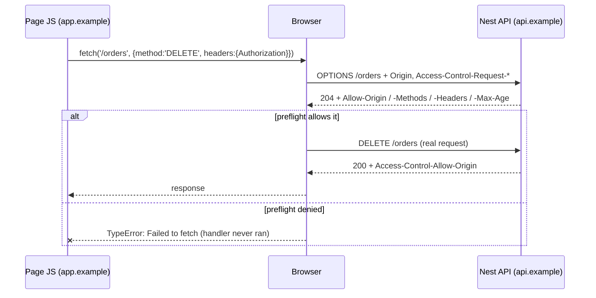

# Chapter 26 — Hardening the Application: CORS, Helmet, CSRF, Rate Limiting, Hashing

> **한눈에 보기**
> 23장의 인증이 "누구인가"를, 25장의 인가가 "무엇을 할 수 있는가"를 다뤘다면, 이 장은 그
> 바깥의 방어선을 다룹니다. CORS와 Helmet은 브라우저에 규칙을 알려주는 헤더 계층이고,
> CSRF는 쿠키 세션이 만들어 내는 고유한 취약점이며, 레이트 리미팅은 정상 인증된 요청도
> 남용될 수 있다는 사실에 대한 답입니다. 마지막으로 비밀번호 해싱과 대칭 암호화를 통해
> "무엇을 저장하고 무엇을 절대 저장하면 안 되는가"를 정리합니다. 이 모든 장치는 8장의
> 미들웨어 순서 규칙 위에서 동작합니다.

**What you will learn**

- Why CORS is a *browser* policy, not a server policy — and why a blocked request still reached your handler.
- Every option of `app.enableCors()`, when to use a dynamic origin function, and the `credentials: true` + `origin: '*'` combination that silently breaks every browser.
- What each header Helmet sets actually prevents, and why registering Helmet after a route leaves that route unprotected.
- When CSRF protection is required (cookie sessions) and when it is pure cost (bearer tokens), with a working double-submit setup for Express and Fastify.
- `@nestjs/throttler` end to end: named throttler sets, `@Throttle`/`@SkipThrottle`, `blockDuration`, custom `getTracker`/`generateKey`, Redis storage, proxies, WebSockets, and GraphQL.
- How to hash passwords with bcrypt or argon2, encrypt reversible secrets with `node:crypto`, and decide which a given field needs.

**Why this matters**

A typical incident report reads like this: a login endpoint had no rate limit, a credential-stuffing bot made four hundred thousand attempts in an hour, found eleven reused passwords, and signed in as eleven real users. Nothing in that story is an authentication bug. The password check worked perfectly, four hundred thousand times. The failure was that nobody put a budget on how often an anonymous client may *ask*.

Every control in this chapter has that shape. None of them decide who you are or what you may do; they constrain the shape of traffic and of the browser environment your API lives in. That makes them easy to postpone and easy to get subtly wrong, because the application works fine without them right until it doesn't. A missing `Content-Security-Policy` costs nothing until one reflected-XSS bug becomes full session theft. `origin: true` with credentials costs nothing until someone notices that any site on the internet can issue authenticated requests using a victim's cookies.

There is a matching failure in the other direction: security theatre. Teams bolt CSRF middleware onto a bearer-token API, spend two days debugging 403s, and gain zero security, because a cross-site form post cannot set an `Authorization` header. Knowing *when a control applies* matters as much as configuring it, so each section starts with the threat.

| Control | Stops | Enforced by | Applies when |
|---|---|---|---|
| CORS | Another origin's JS reading your responses | The browser | You serve browsers from other origins |
| Helmet | Clickjacking, MIME sniffing, XSS escalation, referrer leaks | The browser | Always (cheap) |
| CSRF tokens | Forged state-changing requests riding on cookies | Your server | Cookie/session auth only |
| Rate limiting | Brute force, scraping, cost amplification | Your server | Always |
| Hashing | Credential disclosure after a database breach | Your server | You store credentials |

## CORS: a browser policy your server merely advertises

The most useful fact about CORS is that **your server blocks nothing**. When a page on `https://evil.example` runs `fetch('https://api.yours.com/orders', { method: 'DELETE' })` and the browser reports a CORS error, the request may well have reached your controller and deleted the order. What the browser blocked was the *response* being handed back to the calling JavaScript.

The exception is a *preflighted* request. For anything beyond a "simple" request — a method other than `GET`/`HEAD`/`POST`, an unusual `Content-Type`, or any custom header such as `Authorization` — the browser first sends an `OPTIONS` request describing what it intends to do, and only proceeds if the answer permits it.



Two consequences. CORS is **not** authorization: curl, a server-side proxy, and a mobile app ignore it entirely, so a private endpoint still needs a guard. And when preflight fails you get *no* application log, because the `OPTIONS` request was answered by the CORS middleware before reaching your handler.

### Enabling CORS

Nest delegates to Express's [`cors`](https://github.com/expressjs/cors) or Fastify's `@fastify/cors` depending on the adapter. Two equivalent entry points exist:

```typescript title="main.ts"
const app = await NestFactory.create(AppModule);
app.enableCors();                                          // or: enableCors({ ... })
await app.listen(process.env.PORT ?? 3000);

// Equivalent, applied earlier in bootstrap:
const app2 = await NestFactory.create(AppModule, { cors: true });
```

Prefer the `create()` form: it applies before any other middleware registers, removing a class of ordering bugs (see Helmet below). `cors` accepts `true`, a configuration object, or an async callback function. Both forms take the same options:

| Option | Type | Meaning |
|---|---|---|
| `origin` | `boolean \| string \| RegExp \| Array \| function` | Which origins may read responses. `true` reflects the request origin; `'*'` sends a literal wildcard. |
| `methods` | `string \| string[]` | `Access-Control-Allow-Methods`. Default `GET,HEAD,PUT,PATCH,POST,DELETE`. |
| `allowedHeaders` | `string \| string[]` | `Access-Control-Allow-Headers`. Defaults to echoing the request's list. |
| `exposedHeaders` | `string \| string[]` | Response headers the page's JS may *read* (`X-Total-Count`, `Content-Disposition`). |
| `credentials` | `boolean` | Sends `Access-Control-Allow-Credentials: true`, permitting cookies. |
| `maxAge` | `number` | Seconds the browser may cache the preflight result. |
| `preflightContinue` | `boolean` | Pass `OPTIONS` to the next handler instead of answering it. |
| `optionsSuccessStatus` | `number` | Preflight status; `204` by default, `200` for legacy browsers. |

### Dynamic origins

A hard-coded list is right for two or three known front-ends. When origins live in configuration or a database (multi-tenant SaaS with custom domains), pass a function receiving the incoming origin and a Node-style callback:

```typescript title="main.ts"
const allowed = new Set(config.getOrThrow<string>('CORS_ORIGINS').split(','));

app.enableCors({
  origin(origin, callback) {
    // `origin` is undefined for same-origin requests, curl, and server-to-server calls.
    if (!origin || allowed.has(origin)) return callback(null, true);
    return callback(new Error(`Origin not allowed: ${origin}`), false);
  },
  credentials: true,
  exposedHeaders: ['X-Total-Count'],
  maxAge: 86_400,
});
```

> **Hint** — `callback(null, false)` omits the allow header, which the browser reports as a CORS failure. Passing an `Error` additionally produces a 500 in your logs; use that form only when unexpected origins should page someone.

### The `credentials` + wildcard trap

```typescript
// WRONG — silently broken in every browser
app.enableCors({ origin: '*', credentials: true });
```

The Fetch specification forbids the literal wildcard when credentials are involved. The browser sees `Access-Control-Allow-Origin: *` alongside `Access-Control-Allow-Credentials: true` and rejects the response regardless of intent. Reflect a *specific* origin instead:

```typescript
app.enableCors({
  origin: ['https://app.example.com', 'https://admin.example.com'],
  credentials: true,
});
```

Note what `origin: true` means: reflect *whatever origin asked*. Combined with credentials, that is "any website may make authenticated requests as the logged-in user". Use it only in development, gated on `NODE_ENV`.

## Helmet: the headers you would otherwise forget

Helmet is a bundle of tiny middlewares, each setting one security header. It defends the *browser* against the consequences of bugs elsewhere in your stack.

```bash
npm i --save helmet
```

```typescript title="main.ts (Express, default)"
import helmet from 'helmet';
app.use(helmet());
```

```typescript title="main.ts (Fastify)"
import helmet from '@fastify/helmet';
await app.register(helmet);
```

On Fastify, `@fastify/helmet` is a **plugin**, not middleware — `app.register()`, never `app.use()`. Calling `app.use()` on Fastify appears to work and protects nothing.

| Header | Default value (roughly) | What it prevents |
|---|---|---|
| `Content-Security-Policy` | `default-src 'self'; …` | Turns a stored/reflected XSS into a no-op by refusing third-party script |
| `Strict-Transport-Security` | `max-age=15552000; includeSubDomains` | Downgrade / SSL-stripping after the first visit |
| `X-Content-Type-Options` | `nosniff` | The browser guessing your JSON is HTML and executing it |
| `X-Frame-Options` | `SAMEORIGIN` | Clickjacking via an invisible iframe (CSP `frame-ancestors` supersedes it) |
| `Referrer-Policy` | `no-referrer` | Leaking URLs (with tokens in the path) to third parties |
| `Cross-Origin-Opener-Policy` | `same-origin` | Cross-window scripting through `window.opener` |
| `Cross-Origin-Resource-Policy` | `same-origin` | Other sites embedding your resources (Spectre-class channels) |
| `Cross-Origin-Embedder-Policy` | *(off by default in v7+)* | Needed for `SharedArrayBuffer`; commonly breaks embeds |
| `Origin-Agent-Cluster` | `?1` | Requests process isolation for your origin |
| `X-DNS-Prefetch-Control` | `off` | Silent DNS lookups of links in your content |
| `X-Download-Options` | `noopen` | Legacy IE executing downloads in your origin's context |
| `X-Permitted-Cross-Domain-Policies` | `none` | Flash/PDF cross-domain policy abuse |
| `X-XSS-Protection` | `0` | Deliberately *disables* the buggy legacy XSS auditor |

Helmet also removes `X-Powered-By`, which Nest's Express adapter otherwise emits; `app.disable('x-powered-by')` does the same.

### Ordering matters more than configuration

> **⚠️ Notice** — Applying `helmet` globally must happen *before* any other `app.use()` call and before any setup function that itself calls `app.use()`. Express and Fastify both build an ordered chain: middleware registered after a route is never consulted for that route.

In practice Helmet goes on the first line after `NestFactory.create()` — before session middleware, before `cookie-parser`, before `SwaggerModule.setup()` (which mounts routes), before your logging middleware. The symptom of getting it wrong is subtle: most endpoints carry the headers, one or two do not, and nothing errors. The same rule governs middleware registered through `configure(consumer)`, covered in [Chapter 8 — Middleware](../part1-beginner/08-middleware.md).

### Tuning the CSP

The default CSP breaks any page loading third-party assets, which includes the Apollo Sandbox and CDN-hosted Swagger assets. Narrow it rather than switching it off:

```typescript title="main.ts"
app.use(
  helmet({
    crossOriginEmbedderPolicy: false,
    contentSecurityPolicy: {
      directives: {
        imgSrc: [`'self'`, 'data:', 'apollo-server-landing-page.cdn.apollographql.com'],
        scriptSrc: [`'self'`, `https: 'unsafe-inline'`],
        manifestSrc: [`'self'`, 'apollo-server-landing-page.cdn.apollographql.com'],
        frameSrc: [`'self'`, 'sandbox.embed.apollographql.com'],
      },
    },
  }),
);
```

Fastify takes the same shape via `app.register(fastifyHelmet, { … })` — typically widening `defaultSrc`, `styleSrc`, `fontSrc`, and `scriptSrc` to the CDN hosts the playground loads from. `contentSecurityPolicy: false` disables it entirely: defensible for a pure JSON API that renders no HTML, wrong for anything serving a page.

## CSRF: only if you authenticate with cookies

A CSRF attack works because browsers attach cookies to cross-site requests automatically. A form on `evil.example` can `POST` to `https://bank.example/transfer` and the victim's session cookie rides along. The attacker cannot *read* the response (CORS), but the transfer already happened.

| Auth mechanism | CSRF protection needed? | Why |
|---|---|---|
| Cookie session / cookie-stored JWT | **Yes** | Browser attaches it automatically |
| `Authorization: Bearer` header | No | Cross-site HTML cannot set custom headers |
| HTTP Basic | Yes | Same automatic-credential problem |
| Cookie + `SameSite=Lax/Strict` | Yes, as defence in depth | `Lax` still allows top-level GET; support varies |

`SameSite=Lax` (the modern default) blocks the classic cross-site `POST` and substantially reduces risk, but does not eliminate it: `Lax` permits top-level navigations, some embedded clients ignore the attribute, and one misconfigured `SameSite=None` cookie reopens the hole. For cookie-session apps handling money, permissions, or destructive operations, use tokens as well.

### Double-submit cookies with `csrf-csrf` (Express)

```bash
npm i csrf-csrf
```

The double-submit pattern issues two things: a cookie holding a signed value, and a token the client must echo in a header. An attacker can cause the cookie to be sent but cannot read it, so cannot produce the matching header.

> **⚠️ Notice** — `csrf-csrf` requires session middleware or `cookie-parser` to be registered *first*.

```typescript title="main.ts"
import cookieParser from 'cookie-parser';
import { doubleCsrf } from 'csrf-csrf';

const app = await NestFactory.create(AppModule);
app.use(helmet());
app.use(cookieParser());

const {
  invalidCsrfTokenError, // exported for building your own middleware
  generateToken,         // call in a route to mint a token and set the cookie
  validateRequest,       // also for custom middleware
  doubleCsrfProtection,  // the ready-made middleware
} = doubleCsrf({
  getSecret: () => process.env.CSRF_SECRET!,
  cookieName: '__Host-psifi.x-csrf-token',
  cookieOptions: { sameSite: 'lax', secure: true, path: '/' },
  getTokenFromRequest: (req) => req.headers['x-csrf-token'] as string,
});

app.use(doubleCsrfProtection);
```

The middleware ignores safe methods (`GET`, `HEAD`, `OPTIONS`) and rejects unsafe ones without a valid token, so your SPA needs one route to obtain the token. Keep the `doubleCsrf(...)` result behind a provider so controllers stay testable:

```typescript title="csrf.controller.ts"
@Controller('csrf')
export class CsrfController {
  constructor(@Inject(CSRF_UTILS) private readonly csrf: DoubleCsrfUtilities) {}

  @Get('token')
  token(@Req() req: Request, @Res({ passthrough: true }) res: Response) {
    return { csrfToken: this.csrf.generateToken(req, res) };
  }
}
```

### Fastify

```bash
npm i --save @fastify/csrf-protection
```

```typescript title="main.ts"
import fastifyCookie from '@fastify/cookie';
import fastifyCsrf from '@fastify/csrf-protection';

await app.register(fastifyCookie, { secret: process.env.COOKIE_SECRET });
await app.register(fastifyCsrf);
```

> **⚠️ Notice** — `@fastify/csrf-protection` requires a storage plugin (`@fastify/cookie` or `@fastify/session`) registered beforehand; registering it first throws at bootstrap, which is the good kind of failure.

## Rate limiting with `@nestjs/throttler`

```bash
npm i --save @nestjs/throttler
```

The package is a guard plus a storage abstraction. The guard computes a **tracker** (who is this?) and a **key** (which counter?), increments the counter in storage, and throws `ThrottlerException` (429) when it exceeds the limit.

```typescript title="app.module.ts"
import { Module } from '@nestjs/common';
import { APP_GUARD } from '@nestjs/core';
import { ThrottlerModule, ThrottlerGuard } from '@nestjs/throttler';

@Module({
  imports: [ThrottlerModule.forRoot({ throttlers: [{ ttl: 60_000, limit: 10 }] })],
  providers: [{ provide: APP_GUARD, useClass: ThrottlerGuard }],
})
export class AppModule {}
```

`ttl` is in **milliseconds** — this changed in v5 and is the number-one migration bug. The package exports `seconds`, `minutes`, `hours`, `days`, and `weeks` helpers that just multiply for you. Binding via `APP_GUARD` throttles every route; `@UseGuards(ThrottlerGuard)` scopes it, following the mechanics of [Chapter 11 — Guards](../part1-beginner/11-guards.md).

### Multiple named throttler sets

One limit is rarely right — burst protection and sustained-abuse protection want different windows:

```typescript title="app.module.ts"
ThrottlerModule.forRoot([
  { name: 'short',  ttl: seconds(1),  limit: 3 },
  { name: 'medium', ttl: seconds(10), limit: 20 },
  { name: 'long',   ttl: minutes(1),  limit: 100 },
]);
```

All three run on every request; the first exceeded set throws. Names are what the decorators address.

### Per-route overrides

```typescript title="auth.controller.ts"
import { Throttle, SkipThrottle } from '@nestjs/throttler';

@Controller('auth')
export class AuthController {
  @Throttle({ default: { limit: 5, ttl: 900_000 } })  // 5 per 15 minutes
  @Post('login')
  login(@Body() dto: LoginDto) { /* … */ }

  @SkipThrottle()
  @Post('heartbeat')
  heartbeat() { return { ok: true }; }
}
```

`@SkipThrottle()` with no argument means `{ default: true }`. It also inverts — skip a whole controller, then re-enable one route:

```typescript title="users.controller.ts"
@SkipThrottle()
@Controller('users')
export class UsersController {
  @SkipThrottle({ default: false })
  @Get()
  findAll() { return 'List users works with rate limiting.'; }

  @Get('me')
  me() { return 'List users works without rate limiting.'; }
}
```

`@Throttle()` takes an object keyed by throttler name (use `'default'` when you named nothing) and may be applied to a class or a method.

### Full option reference

Per throttler set:

| Option | Meaning |
|---|---|
| `name` | Identifier for the set; defaults to `default` |
| `ttl` | Window length in milliseconds |
| `limit` | Maximum requests within `ttl` |
| `blockDuration` | Milliseconds to keep blocking *after* the limit trips, independent of `ttl` |
| `ignoreUserAgents` | Array of `RegExp`; matching user agents bypass throttling |
| `skipIf` | `(context: ExecutionContext) => boolean` — dynamic bypass |

At the root level, applying to all sets:

| Option | Meaning |
|---|---|
| `storage` | A `ThrottlerStorage` implementation (importable from `@nestjs/throttler`). Defaults to in-memory |
| `throttlers` | The array of sets above |
| `errorMessage` | String, or `(context, detail: ThrottlerLimitDetail) => string` |
| `getTracker` | `(req) => string` — override tracker extraction without subclassing |
| `generateKey` | `(context, tracker, name) => string` — override the storage key |
| `ignoreUserAgents` / `skipIf` | As above, globally |

`blockDuration` deserves emphasis: without it, a bot that hits the limit waits for the window to slide and resumes. With `blockDuration: minutes(15)` on a login route, tripping the limit costs the attacker fifteen minutes regardless of the one-minute window.

```typescript
ThrottlerModule.forRoot({
  throttlers: [{ ttl: minutes(1), limit: 20, blockDuration: minutes(15) }],
  errorMessage: (ctx, detail) =>
    `Too many requests. Retry in ${Math.ceil(detail.timeToBlockExpire / 1000)}s.`,
  skipIf: (ctx) => ctx.switchToHttp().getRequest().ip === '127.0.0.1',
});
```

`forRootAsync()` gives you injection, either through `useFactory` (returning the array or the options object) or `useClass` with a class implementing `ThrottlerOptionsFactory` and its `createThrottlerOptions()` method — the same shapes as every other dynamic module in [Chapter 17 — Configuration](./17-configuration.md).

### Proxies and the real client IP

Behind a load balancer every request appears to come from the proxy, so one bucket serves your entire user base and a single abusive client locks out everyone. Two things must line up.

```typescript title="main.ts"
import { NestExpressApplication } from '@nestjs/platform-express';

const app = await NestFactory.create<NestExpressApplication>(AppModule);
app.set('trust proxy', 'loopback'); // Trust requests from the loopback address
await app.listen(3000);
```

Fastify uses `new FastifyAdapter({ trustProxy: true })`. With that enabled, `req.ip` reflects `X-Forwarded-For`. Second, control *which* entry of that header you use:

```typescript title="throttler-behind-proxy.guard.ts"
import { Injectable } from '@nestjs/common';
import { ThrottlerGuard } from '@nestjs/throttler';

@Injectable()
export class ThrottlerBehindProxyGuard extends ThrottlerGuard {
  protected async getTracker(req: Record<string, any>): Promise<string> {
    return req.ips?.length ? req.ips[0] : req.ip;
  }
}
```

> **⚠️ Notice** — `X-Forwarded-For` is client-supplied unless a trusted proxy overwrites it. A blanket `trust proxy: true` lets any client spoof their IP and evade the limit entirely. Scope trust to your actual proxy addresses.

For authenticated routes, tracking by user id beats IP — it survives mobile NAT and IPv6 rotation. Overriding `generateKey` gives each handler its own counter:

```typescript title="user-throttler.guard.ts"
@Injectable()
export class UserThrottlerGuard extends ThrottlerGuard {
  protected async getTracker(req: Record<string, any>): Promise<string> {
    return req.user?.id ? `user:${req.user.id}` : `ip:${req.ip}`;
  }

  protected generateKey(context: ExecutionContext, tracker: string, name: string): string {
    return `throttle:${name}:${context.getHandler().name}:${tracker}`;
  }
}
```

### Distributed storage

The default storage is a `Map` in the process. With three replicas your "10 per minute" becomes 30 per minute, and it resets on every deploy.

```bash
npm i @nest-lab/throttler-storage-redis ioredis
```

```typescript title="app.module.ts"
import { ThrottlerStorageRedisService } from '@nest-lab/throttler-storage-redis';
import Redis from 'ioredis';

ThrottlerModule.forRoot({
  throttlers: [{ ttl: minutes(1), limit: 100 }],
  storage: new ThrottlerStorageRedisService(new Redis(process.env.REDIS_URL!)),
});
```

Any class implementing `ThrottlerStorage` works; the interface is a single `increment()` returning hit count, expiry, block state, and block expiry.

### WebSockets

A WebSocket message has no HTTP request, so `getTracker` cannot read `req.ip`. Override `handleRequest`:

```typescript title="ws-throttler.guard.ts"
import { Injectable } from '@nestjs/common';
import { ThrottlerGuard, ThrottlerRequest } from '@nestjs/throttler';

@Injectable()
export class WsThrottlerGuard extends ThrottlerGuard {
  async handleRequest(requestProps: ThrottlerRequest): Promise<boolean> {
    const { context, limit, ttl, throttler, blockDuration, generateKey } = requestProps;

    const client = context.switchToWs().getClient();
    const tracker = client._socket.remoteAddress; // use `client.conn` with `ws`
    const key = generateKey(context, tracker, throttler.name);

    const { totalHits, timeToExpire, isBlocked, timeToBlockExpire } =
      await this.storageService.increment(key, ttl, limit, blockDuration, throttler.name);

    if (isBlocked) {
      await this.throwThrottlingException(context, {
        limit, ttl, key, tracker, totalHits, timeToExpire, isBlocked, timeToBlockExpire,
      });
    }
    return true;
  }
}
```

Three constraints. The guard **cannot** be registered with `APP_GUARD` or `useGlobalGuards()` — bind it on the gateway with `@UseGuards()`. When the limit trips, Nest emits an `exception` event on the socket, so the client needs a listener or the failure is invisible. And with several named sets, `handleRequest()` runs once per set, so always derive the key from `throttler.name` as above or all sets share one counter.

### GraphQL

A GraphQL `ExecutionContext` does not expose `req`/`res` through `switchToHttp()`. Override `getRequestResponse`:

```typescript title="gql-throttler.guard.ts"
@Injectable()
export class GqlThrottlerGuard extends ThrottlerGuard {
  getRequestResponse(context: ExecutionContext) {
    const gqlCtx = GqlExecutionContext.create(context);
    const ctx = gqlCtx.getContext();
    return { req: ctx.req, res: ctx.res };
  }
}
```

Per-request throttling is a weak defence for GraphQL, where one request can fetch ten thousand nested nodes; pair it with query complexity limits ([Chapter 52](../part3-advanced/52-graphql-advanced.md)).

## Hashing and encryption

Two operations, two purposes, and confusing them is a classic audit finding. **Encryption** is reversible — use it when you need the plaintext back (OAuth refresh tokens, third-party API keys, payout bank details). **Hashing** is one-way — use it when you only ever *verify* (passwords, above all). Encrypting a password is a bug, because the decryption key lives on the same server as the database dump.

### Symmetric encryption with `node:crypto`

Nest deliberately ships no crypto wrapper — Node's built-in module is enough, and an abstraction over it would only obscure the two things that must be right: the key (derived with a slow KDF or read from a secrets manager) and the IV (random per message, stored beside the ciphertext).

```typescript title="crypto.service.ts (AES-256-CTR)"
import { createCipheriv, createDecipheriv, randomBytes, scrypt } from 'node:crypto';
import { promisify } from 'node:util';

const iv = randomBytes(16);
const password = 'Password used to generate key';
// Key length depends on the algorithm; aes-256 needs 32 bytes.
const key = (await promisify(scrypt)(password, 'salt', 32)) as Buffer;

const cipher = createCipheriv('aes-256-ctr', key, iv);
const encryptedText = Buffer.concat([cipher.update('Nest'), cipher.final()]);

const decipher = createDecipheriv('aes-256-ctr', key, iv);
const decryptedText = Buffer.concat([decipher.update(encryptedText), decipher.final()]);
```

**Prefer GCM over CTR for anything real.** CTR gives confidentiality but no integrity: an attacker who flips bits in the ciphertext flips the same bits in the plaintext, undetected. GCM adds an authentication tag:

```typescript title="crypto.service.ts (AES-256-GCM — recommended)"
import { Injectable } from '@nestjs/common';

@Injectable()
export class CryptoService {
  private keyPromise = promisify(scrypt)(
    process.env.ENCRYPTION_PASSWORD!, process.env.ENCRYPTION_SALT!, 32,
  ) as Promise<Buffer>;

  async encrypt(plaintext: string) {
    const key = await this.keyPromise;
    const iv = randomBytes(12);                  // 12 bytes is the GCM standard
    const cipher = createCipheriv('aes-256-gcm', key, iv);
    const data = Buffer.concat([cipher.update(plaintext, 'utf8'), cipher.final()]);
    return {
      iv: iv.toString('base64'),
      data: data.toString('base64'),
      tag: cipher.getAuthTag().toString('base64'),
    };
  }

  async decrypt(p: { iv: string; data: string; tag: string }) {
    const key = await this.keyPromise;
    const decipher = createDecipheriv('aes-256-gcm', key, Buffer.from(p.iv, 'base64'));
    decipher.setAuthTag(Buffer.from(p.tag, 'base64'));   // throws on tampering
    return Buffer.concat([
      decipher.update(Buffer.from(p.data, 'base64')),
      decipher.final(),
    ]).toString('utf8');
  }
}
```

Never reuse an IV with the same key in GCM — that failure leaks the authentication key. `randomBytes(12)` per message is the rule. `randomBytes` is also your only acceptable source for password-reset tokens, API keys, and session identifiers; `Math.random()` is not cryptographically secure and must never appear in that role.

```typescript
import { randomBytes, createHash, timingSafeEqual } from 'node:crypto';

const resetToken = randomBytes(32).toString('base64url');              // email this
const stored = createHash('sha256').update(resetToken).digest('hex');  // persist this
```

Storing the *hash* of a reset token means a leaked database cannot be used to take over accounts. Compare with `timingSafeEqual`, not `===`, so response timing does not reveal a prefix match.

### Password hashing: bcrypt

```bash
npm i bcrypt
npm i -D @types/bcrypt
```

```typescript title="users.service.ts"
import * as bcrypt from 'bcrypt';

const saltOrRounds = 12;
const hash = await bcrypt.hash('random_password', saltOrRounds);
const isMatch = await bcrypt.compare('random_password', hash);
```

You may also generate a salt explicitly with `await bcrypt.genSalt()` and pass that instead of the round count, but the numeric form is preferred: bcrypt embeds the salt and cost factor inside the `$2b$12$…` string, so `compare()` needs nothing else.

The cost factor is a wall-clock budget, and each increment doubles the work. Ten was the 2015 recommendation; **12 is the current floor**, 13–14 for high-value accounts. Measure on production hardware and aim for 100–250 ms per hash: slower is safer, but a login endpoint costing 800 ms per attempt is a self-inflicted denial-of-service vector — which is exactly why the throttler section came first. Two caveats: bcrypt silently truncates input at **72 bytes**, and it is a native module, so your Docker build needs build tooling (or `bcryptjs`, at a performance cost).

### Password hashing: argon2

```bash
npm i argon2
```

```typescript title="users.service.ts"
import * as argon2 from 'argon2';

const options: argon2.Options = {
  type: argon2.argon2id,
  memoryCost: 19_456,  // 19 MiB — OWASP minimum
  timeCost: 2,
  parallelism: 1,
};

const hash = await argon2.hash(plain, options);
const ok = await argon2.verify(hash, plain);
```

Argon2id is memory-hard, so a GPU or ASIC cannot parallelise it as cheaply as bcrypt. For a new application, choose it. For an existing bcrypt corpus, rehash lazily at the next successful login rather than forcing a reset:

```typescript
if (await bcrypt.compare(plain, user.passwordHash)) {
  if (user.passwordHash.startsWith('$2')) {
    user.passwordHash = await argon2.hash(plain, options);
    await this.repo.save(user);
  }
  return user;
}
```

### What to store, and what never to store

| Data | Store as | Never |
|---|---|---|
| Password | argon2id / bcrypt hash | Plaintext, encrypted, MD5/SHA-1, unsalted SHA-256 |
| Session id | Random 128+ bit value, hashed at rest | Anything derived from the user id |
| Password reset token | SHA-256 of `randomBytes(32)`, with an expiry | The raw token |
| API key you issue | SHA-256 hash + a short displayable prefix | The raw key |
| OAuth refresh token | AES-256-GCM ciphertext, key in a KMS | A plaintext column |
| Payment card PAN | Do not store it — tokenise via the processor | Anything, ever |
| Encryption key | Secrets manager / KMS | The repo, the image, the same DB as the ciphertext |

Never log anything in the left column. A `console.log(dto)` in a login controller writes plaintext passwords into a log aggregator with multi-year retention — one of the most common real breaches. [Chapter 18 — Logging](./18-logging.md) covers redaction.

## Common mistakes

1. **Symptom:** the browser reports a CORS error, but the record really was deleted. **Cause:** CORS blocks the *response*, not simple requests. **Fix:** protect state-changing endpoints with a guard; CORS is not authorization.
2. **Symptom:** cookies never arrive even though `credentials: true` is set. **Cause:** `origin: '*'` with credentials, forbidden by the Fetch spec. **Fix:** reflect explicit origins, and use `fetch(..., { credentials: 'include' })` client-side.
3. **Symptom:** Helmet headers appear on most routes but not `/docs`. **Cause:** `app.use(helmet())` ran after `SwaggerModule.setup()` mounted those routes. **Fix:** register Helmet first, immediately after `NestFactory.create()`.
4. **Symptom:** rate limiting allows 3× the configured limit in production. **Cause:** default in-memory storage with three replicas. **Fix:** a Redis-backed `ThrottlerStorage`.
5. **Symptom:** one abusive client causes 429s for every user. **Cause:** all traffic arrives from a load balancer, so `req.ip` is the balancer. **Fix:** scoped `trust proxy` plus a `getTracker()` reading `req.ips[0]`.
6. **Symptom:** after upgrading `@nestjs/throttler`, limits reset a thousand times faster than expected. **Cause:** `ttl` is milliseconds since v5. **Fix:** multiply by 1000, or use `seconds()`/`minutes()`.
7. **Symptom:** the mobile client gets 403 `invalid csrf token` on every `POST`. **Cause:** CSRF middleware applied to a bearer-token API. **Fix:** remove it, or scope it to cookie-authenticated routes only.
8. **Symptom:** decryption succeeds on tampered ciphertext and returns garbage your code then trusts. **Cause:** `aes-256-ctr` provides no integrity. **Fix:** `aes-256-gcm` with `setAuthTag()`.

## Putting it together

```typescript title="main.ts"
import { NestFactory } from '@nestjs/core';
import { ValidationPipe } from '@nestjs/common';
import { NestExpressApplication } from '@nestjs/platform-express';
import { ConfigService } from '@nestjs/config';
import helmet from 'helmet';
import cookieParser from 'cookie-parser';
import { AppModule } from './app.module';

async function bootstrap() {
  const app = await NestFactory.create<NestExpressApplication>(AppModule, {
    rawBody: true, // needed for webhook signature checks — see Chapter 28
  });
  const config = app.get(ConfigService);

  // 1. Security headers FIRST — before any other middleware or route mount.
  app.use(helmet());
  app.disable('x-powered-by');

  // 2. Trust only the proxy we actually run behind, so req.ip is meaningful.
  app.set('trust proxy', config.get('TRUSTED_PROXY', 'loopback'));

  // 3. Cookies, then CSRF (registered by CsrfModule for cookie-auth routes).
  app.use(cookieParser(config.getOrThrow('COOKIE_SECRET')));

  // 4. CORS with an explicit allow-list.
  app.enableCors({
    origin: config.getOrThrow<string>('CORS_ORIGINS').split(','),
    credentials: true,
    exposedHeaders: ['X-Total-Count'],
    maxAge: 86_400,
  });

  app.useGlobalPipes(new ValidationPipe({ whitelist: true, transform: true }));
  await app.listen(config.get('PORT', 3000));
}
bootstrap();
```

```typescript title="app.module.ts"
import { Module } from '@nestjs/common';
import { APP_GUARD } from '@nestjs/core';
import { ConfigModule, ConfigService } from '@nestjs/config';
import { ThrottlerModule, seconds, minutes } from '@nestjs/throttler';
import { ThrottlerStorageRedisService } from '@nest-lab/throttler-storage-redis';
import Redis from 'ioredis';
import { UserThrottlerGuard } from './security/user-throttler.guard';
import { AuthModule } from './auth/auth.module';

@Module({
  imports: [
    ConfigModule.forRoot({ isGlobal: true }),
    ThrottlerModule.forRootAsync({
      inject: [ConfigService],
      useFactory: (config: ConfigService) => ({
        storage: new ThrottlerStorageRedisService(new Redis(config.getOrThrow('REDIS_URL'))),
        throttlers: [
          { name: 'burst',     ttl: seconds(1), limit: 5 },
          { name: 'sustained', ttl: minutes(1), limit: 120, blockDuration: minutes(5) },
        ],
        errorMessage: (_ctx, detail) =>
          `Rate limit exceeded. Try again in ${Math.ceil(detail.timeToExpire / 1000)}s.`,
        skipIf: (ctx) => ctx.switchToHttp().getRequest().path === '/health',
      }),
    }),
    AuthModule,
  ],
  providers: [{ provide: APP_GUARD, useClass: UserThrottlerGuard }],
})
export class AppModule {}
```

```typescript title="auth/password.service.ts"
import { Injectable } from '@nestjs/common';
import * as argon2 from 'argon2';
import { randomBytes, createHash, timingSafeEqual } from 'node:crypto';

@Injectable()
export class PasswordService {
  private readonly options: argon2.Options = {
    type: argon2.argon2id, memoryCost: 19_456, timeCost: 2, parallelism: 1,
  };

  hash(plain: string) { return argon2.hash(plain, this.options); }
  verify(hash: string, plain: string) { return argon2.verify(hash, plain); }

  /** Returns the token to email and the digest to persist. */
  issueResetToken() {
    const token = randomBytes(32).toString('base64url');
    return { token, digest: createHash('sha256').update(token).digest('hex') };
  }

  matchesResetToken(token: string, storedHex: string) {
    const a = createHash('sha256').update(token).digest();
    const b = Buffer.from(storedHex, 'hex');
    return a.length === b.length && timingSafeEqual(a, b);
  }
}
```

### Production security checklist

| Area | Check | Chapter |
|---|---|---|
| Headers | Helmet registered before every other `app.use()`; `x-powered-by` disabled | this |
| CORS | Explicit origin allow-list; never `'*'` or `true` with credentials in production | this |
| CSRF | Enabled iff auth uses cookies; cookies `SameSite=Lax`, `Secure`, `HttpOnly` | this |
| Rate limiting | Global `APP_GUARD`; tighter `@Throttle` on login/signup/reset | this |
| Rate limiting | Shared Redis storage when running more than one replica | this |
| Rate limiting | `trust proxy` scoped; `getTracker` identifies the real client | this |
| Passwords | argon2id (or bcrypt cost ≥ 12); never logged | this |
| Reversible data | AES-256-GCM with a per-message IV, not CTR | this |
| Secrets | Keys in a secrets manager, never in the image or repo | [17](./17-configuration.md) |
| Validation | Global `ValidationPipe` with `whitelist: true` | [15](./15-validation-in-depth.md) |
| Serialization | `@Exclude()` on password and token fields | [16](./16-serialization.md) |
| Errors | Filters never leak stack traces in production | [9](../part1-beginner/09-exception-filters.md) |
| Logging | Password, token, and PII fields redacted | [18](./18-logging.md) |
| Uploads | Size limits, type validation, storage outside the web root | [28](./28-file-upload-and-streaming.md) |

> **핵심 정리**
> - CORS는 **브라우저**가 강제하는 정책입니다. 서버는 헤더로 규칙을 알려줄 뿐이고, 차단된 요청도 이미 핸들러에 도달했을 수 있습니다. 접근 제어는 가드로 하세요.
> - `credentials: true`와 `origin: '*'`는 함께 쓸 수 없습니다. 구체적인 오리진 목록을 반사(reflect)해야 합니다.
> - Helmet은 **가장 먼저** 등록해야 합니다. 라우트가 먼저 등록되면 그 라우트에는 헤더가 붙지 않습니다. Fastify에서는 `app.use()`가 아니라 `app.register()`입니다.
> - CSRF는 쿠키 기반 인증에서만 필요합니다. Bearer 토큰 API에 붙이면 보안 이득 없이 버그만 늘어납니다.
> - `@nestjs/throttler`의 `ttl`은 **밀리초**입니다. `seconds()`, `minutes()` 헬퍼를 쓰면 실수를 줄일 수 있습니다.
> - 인스턴스가 둘 이상이면 기본 인메모리 스토리지는 한도를 인스턴스 수만큼 곱해 버립니다. Redis 스토리지를 쓰세요.
> - 프록시 뒤에서는 `trust proxy`를 **신뢰할 수 있는 주소로만** 켜고 `getTracker()`로 실제 클라이언트를 식별하세요. 무조건 `true`는 IP 위조를 허용합니다.
> - 되돌려야 하는 데이터는 암호화(AES-256-GCM), 검증만 하면 되는 데이터는 해싱(argon2id/bcrypt)입니다. 비밀번호를 암호화하는 것은 버그입니다.
> - `aes-256-ctr`은 무결성을 보장하지 않습니다. 실무에서는 인증 태그가 있는 GCM을 쓰세요.
> - 무작위 값이 필요하면 항상 `randomBytes`입니다. `Math.random()`은 암호학적으로 안전하지 않습니다.

> **연습 문제**
> 1. `origin: true, credentials: true`로 설정된 API가 왜 위험한지, 공격자가 어떤 시나리오로 악용할 수 있는지 설명하세요.
> 2. Helmet이 설정하는 헤더 중 `X-Content-Type-Options: nosniff`가 없을 때 실제로 발생할 수 있는 공격을 한 가지 서술하세요.
> 3. 로그인 라우트에 "IP당 15분에 5회, 초과 시 30분 차단"을 구현하는 `@Throttle` 설정과 `ThrottlerModule` 옵션을 작성해 보세요.
> 4. **직접 만들어 보라** — 인증된 요청은 `user.id`로, 익명 요청은 IP로 추적하고 라우트 핸들러마다 별도 카운터를 쓰는 `ThrottlerGuard` 서브클래스를 작성하고, e2e 테스트로 429가 나오는지 검증하세요.
> 5. **직접 만들어 보라** — 서드파티 OAuth 리프레시 토큰을 AES-256-GCM으로 암호화해 저장하고 복호화해 반환하는 `SecretVaultService`를 작성하세요. 저장 포맷에 IV와 태그를 포함하고, 변조된 ciphertext가 예외를 던지는지 테스트로 확인하세요.
> 6. bcrypt의 72바이트 절단 문제를 재현하는 테스트를 작성하고, 이를 회피하는 전처리 방식을 구현하세요.

**Next:** [Chapter 27 — Caching](./27-caching.md) turns from keeping bad traffic out to making good traffic cheap — and raises its own security question, because a cache keyed on the wrong thing will happily serve one user's data to another.
