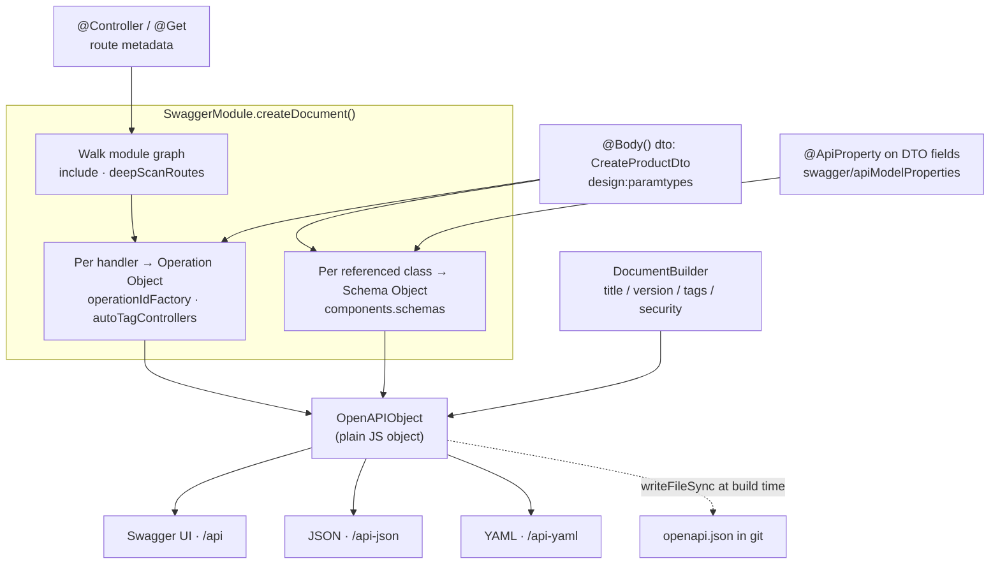

# Chapter 29 — OpenAPI I: Documenting Your API

> **한눈에 보기**
> API 문서는 손으로 쓰는 순간부터 낡기 시작합니다. `@nestjs/swagger`는 라우터와 DTO에
> 이미 붙어 있는 메타데이터를 읽어 OpenAPI 명세를 **생성**하므로, 문서가 코드와 갈라질
> 여지를 구조적으로 줄입니다. 이 장에서는 `DocumentBuilder`로 문서를 부트스트랩하고,
> `SwaggerDocumentOptions`·`SwaggerCustomOptions`로 생성과 서빙을 조정하고,
> `@ApiProperty()`를 중심으로 타입·배열·열거형·제네릭·원시 스키마를 정확히 기술합니다.
> 15장에서 붙인 검증 데코레이터가 여기서 문서로 재사용된다는 점이 핵심 연결 고리입니다.

**What you will learn**

- Why a spec *derived from* routing metadata is a different artifact from one you maintain by hand — and what it still cannot know.
- How `SwaggerModule.createDocument()` walks the module graph, and what `include`, `deepScanRoutes`, `ignoreGlobalPrefix`, `operationIdFactory`, and `autoTagControllers` change about that walk.
- How to serve the UI, the JSON, and the YAML on exactly the paths you want — including serving none of them in production.
- Every option `@ApiProperty()` accepts, and which of them TypeScript can never infer for you.
- How to describe arrays, circular references, enums (with a reusable `enumName` schema), examples, and hand-written raw schemas.
- How to make a generic `PaginatedDto<T>` emit a correct `$ref` using `@ApiExtraModels()` and `getSchemaPath()`.
- When to reach for `@ApiQuery`, `@ApiParam`, `@ApiHeader`, `@ApiBody`, `@ApiTags`, and the two exclusion decorators.

**Why this matters**

Here is a failure mode you have probably lived through. A frontend team integrates against a wiki page. The page says `POST /orders` returns `{ id, total }`. Six weeks ago someone renamed `total` to `totalCents` and changed it from a decimal string to an integer. Nobody updated the page, because nothing forced them to. The frontend ships, the numbers are off by a factor of one hundred, and a customer finds the bug.

The structural problem is that the documentation and the code were two independent sources of truth, and only one of them was executed. `@nestjs/swagger` collapses them. Your controller already carries routing metadata — Nest needs it to route at all. Your DTOs already carry validation metadata from [Chapter 15](./15-validation-in-depth.md) — Nest needs it to reject bad payloads. The Swagger module reads that same metadata and emits an [OpenAPI](https://swagger.io/specification/) document. Rename the field and the spec changes on the next boot, whether you remembered to or not.

Be precise about how far that extends. TypeScript erases types at compile time. `reflect-metadata` preserves enough for Nest to know a parameter is a `CreateOrderDto` — never enough to know that the class *has* a `total` property, that it is optional, or that `string[]` holds strings rather than being an anonymous `Array`. A generated spec is only as good as the metadata you put there. This chapter is about putting it there deliberately; [Chapter 30](./30-openapi-advanced.md) covers the compiler plugin that infers most of it automatically.

And an OpenAPI document is *machine-readable*, which a wiki page is not. It generates typed clients, drives contract tests, feeds gateways and developer portals, and — as you will build at the end of Chapter 30 — can fail CI when the committed spec drifts from the code.

## 1. What OpenAPI is, and what "generated" buys you

OpenAPI (formerly Swagger) is a language-agnostic JSON or YAML description of a REST API: its servers, paths, the operations on each path, the parameters and bodies those operations accept, the responses they return, the reusable schemas those payloads reference, and the security schemes protecting them. "Swagger UI" is one *consumer* of that document — the interactive HTML explorer — not the document itself. Keep the two ideas separate, because you will often want the document without the UI.

| Approach | Source of truth | Drift risk | Characteristic failure |
|---|---|---|---|
| Hand-written YAML | The YAML file | High — nothing links it to code | Spec describes an endpoint deleted last quarter |
| Spec-first codegen | The YAML file | Low, but inverted | Regenerating stubs clobbers hand-written server code |
| **Generated from code** (Nest) | Controllers and DTOs | Low | Spec is silently *incomplete* where metadata is missing |

Internalise Nest's characteristic failure now: a generated spec is rarely *wrong*, but it is easily *empty*. A DTO with no `@ApiProperty()` decorators produces a schema with no properties — an object that validates against `{}`. Nothing warns you. Recognising empty schemas in the UI is the most useful debugging reflex in this chapter.

## 2. Installing and bootstrapping

```bash
$ npm install --save @nestjs/swagger
```

We will use a catalog API — products and orders — throughout both OpenAPI chapters.

```typescript title="src/main.ts"
import { NestFactory } from '@nestjs/core';
import { SwaggerModule, DocumentBuilder } from '@nestjs/swagger';
import { AppModule } from './app.module';

async function bootstrap() {
  const app = await NestFactory.create(AppModule);

  const config = new DocumentBuilder()
    .setTitle('Catalog API')
    .setDescription('Products, inventory, and orders for the storefront')
    .setVersion('1.0')
    .addTag('products', 'Catalog items and their variants')
    .build();

  const documentFactory = () => SwaggerModule.createDocument(app, config);
  SwaggerModule.setup('api', app, documentFactory);

  await app.listen(process.env.PORT ?? 3000);
}
bootstrap();
```

Three moving parts:

**`DocumentBuilder`** builds the *static* half of the document — what describes the API as a whole rather than any route: `setTitle()`, `setDescription()`, `setVersion()`, `setTermsOfService()`, `setContact()`, `setLicense()`, `addServer()`, `addTag()`, plus the security and global-parameter methods in Chapter 30. `build()` returns a plain object.

**`SwaggerModule.createDocument(app, config, options?)`** is where reflection happens: it walks the module graph, collects every controller and route handler, reads their metadata, and merges the result into a complete `OpenAPIObject`.

**`SwaggerModule.setup(path, app, documentOrFactory, options?)`** registers the routes that serve the UI and the raw definitions.

> **Hint** — `documentFactory` is a *function*, not a document. Passing a factory defers the reflection pass to the first request instead of running it during boot, which matters for serverless cold starts ([Chapter 58](../part3-advanced/58-deployment-and-serverless.md)). `setup()` accepts either form.

Open `http://localhost:3000/api` and every endpoint is already listed. `/api-json` serves the JSON and `/api-yaml` the YAML — those suffixes derive from the mount path and are configurable. The document is an ordinary serializable object; you need not serve it over HTTP at all, and writing it to a file at build time is a first-class use case.

> **⚠️ Notice** — With Fastify plus `helmet`, the default Content-Security-Policy blocks Swagger UI's inline styles and scripts:
>
> ```typescript
> app.register(helmet, {
>   contentSecurityPolicy: {
>     directives: {
>       defaultSrc: [`'self'`],
>       styleSrc: [`'self'`, `'unsafe-inline'`],
>       imgSrc: [`'self'`, 'data:', 'validator.swagger.io'],
>       scriptSrc: [`'self'`, `https:`, `'unsafe-inline'`],
>     },
>   },
> });
> // Or, if you are not using CSP at all:
> app.register(helmet, { contentSecurityPolicy: false });
> ```
>
> See [Chapter 26](./26-web-security-hardening.md) for what you give up.

## 3. How metadata becomes a spec

Understanding this pipeline explains nearly every "why is my schema empty?" question you will ask.



Read the inputs carefully. `design:paramtypes` — emitted by TypeScript when `emitDecoratorMetadata` is on — tells Nest that a handler parameter is a `CreateProductDto`. It says nothing about that class's *fields*. Field information exists only in the metadata `@ApiProperty()` writes. No decorator, no properties, empty schema. That is the whole mystery.

## 4. Document options: controlling the walk

`createDocument()` accepts a third argument of type `SwaggerDocumentOptions`:

```typescript
export interface SwaggerDocumentOptions {
  include?: Function[];
  extraModels?: Function[];
  ignoreGlobalPrefix?: boolean;
  deepScanRoutes?: boolean;
  operationIdFactory?: OperationIdFactory;
  linkNameFactory?: (
    controllerKey: string,
    methodKey: string,
    fieldKey: string,
  ) => string;
  autoTagControllers?: boolean;
}
```

| Option | Default | What it does | When you need it |
|---|---|---|---|
| `include` | all modules | Restricts the scan to the listed modules | Separate specs for separate audiences (§5) |
| `deepScanRoutes` | `false` | Also collects routes from modules *imported by* the `include`d modules | An included module re-exports controllers from a shared submodule |
| `extraModels` | `[]` | Emit schemas for classes no route references | Document-wide alternative to `@ApiExtraModels()` (§12) |
| `ignoreGlobalPrefix` | `false` | Strips the `setGlobalPrefix()` value from generated paths | A reverse proxy already adds `/api/v1` before Nest sees the request |
| `operationIdFactory` | `` `${controllerKey}_${methodKey}_${version}` `` | Names each operation | Client generators use `operationId` as the method name |
| `linkNameFactory` | `` `${controllerKey}_${methodKey}_from_${fieldKey}` `` | Names entries in a response's `links` field | You use OpenAPI Link Objects |
| `autoTagControllers` | `true` | Derives a tag from the class name minus the `Controller` suffix | Set `false` to make `@ApiTags()` mandatory and explicit |

`operationIdFactory` leaks straight into generated client code. By default `ProductsController#findAll` becomes `ProductsController_findAll`, producing a client method named `productsControllerFindAll`. The docs' suggestion is to strip the controller entirely:

```typescript
const options: SwaggerDocumentOptions = {
  operationIdFactory: (controllerKey: string, methodKey: string) => methodKey,
};
const documentFactory = () => SwaggerModule.createDocument(app, config, options);
```

Now the method is `findAll()` — but `operationId` must be unique across the whole document, and bare method names collide the moment two controllers both have a `findAll`. A safer factory keeps the controller and drops the noise:

```typescript
operationIdFactory: (controllerKey: string, methodKey: string) =>
  `${controllerKey.replace(/Controller$/, '').toLowerCase()}_${methodKey}`,
// => "products_findAll", "orders_findAll"
```

If you use API versioning ([Chapter 33](./33-mvc-and-versioning.md)), the factory receives a third `version` argument — include it, or two versions of one route collide.

## 5. Setup options: controlling what is served

The fourth argument to `setup()` is a `SwaggerCustomOptions`:

| Option | Default | Purpose |
|---|---|---|
| `ui` | `true` | Serve the Swagger UI HTML (`swaggerUiEnabled` is the deprecated alias) |
| `raw` | `true` | Serve raw definitions; accepts `boolean` or `Array<'json' \| 'yaml'>` |
| `jsonDocumentUrl` | `<path>-json` | Path of the JSON definition |
| `yamlDocumentUrl` | `<path>-yaml` | Path of the YAML definition |
| `swaggerUrl` | — | URL of the definition the UI should load |
| `useGlobalPrefix` | `false` | Prefix Swagger's *own* routes with the app's global prefix |
| `explorer` | `false` | Show the definition selector in the UI top bar |
| `swaggerOptions` | `{}` | Passed to Swagger UI (`persistAuthorization`, `docExpansion`, `tagsSorter`, `urls`, …) |
| `customCss` / `customCssUrl` | — | Inline CSS / external stylesheet URL(s) |
| `customJs` / `customJsStr` | — | External script URL(s) / inline script source |
| `customfavIcon` | — | Favicon URL |
| `customSiteTitle` | — | `<title>` of the UI page |
| `customSwaggerUiPath` | — | Filesystem path to static `swagger-ui-dist` assets |
| `patchDocumentOnRequest` | — | Hook `(req, res, document) => OpenAPIObject`, called per request |

`ui` and `raw` are **independent** — disabling the UI does not disable the JSON, and vice versa:

```typescript
SwaggerModule.setup('api', app, documentFactory, {
  customSiteTitle: 'Catalog API — Reference',
  customCss: '.swagger-ui .topbar { display: none }',
  jsonDocumentUrl: 'api/openapi.json',
  yamlDocumentUrl: 'api/openapi.yaml',
  useGlobalPrefix: true,
  swaggerOptions: {
    persistAuthorization: true, // survive reloads — a large quality-of-life win
    docExpansion: 'none',
    tagsSorter: 'alpha',
    displayRequestDuration: true,
  },
});
```

To ship the machine-readable spec but not the human explorer — the common production setting for an internal API:

```typescript
SwaggerModule.setup('api', app, documentFactory, {
  ui: false,     // GET /api      -> 404
  raw: ['json'], // GET /api-json -> the spec; YAML is not served
});
```

To disable everything in production, guard the `setup()` call itself with `if (process.env.NODE_ENV !== 'production')`.

`patchDocumentOnRequest` is the escape hatch for per-request documents — for example, giving each tenant its own `servers` entry:

```typescript
SwaggerModule.setup('api', app, documentFactory, {
  patchDocumentOnRequest: (req: Request, _res, document) => ({
    ...document,
    servers: [{ url: `https://${req.headers.host}` }],
  }),
});
```

### Serving multiple specifications

`include` plus several `setup()` calls gives you several documents on several paths — useful when a public partner API and an internal admin API live in one process.

```typescript title="src/main.ts"
const publicConfig = new DocumentBuilder()
  .setTitle('Catalog API (public)').setVersion('1.0').build();

SwaggerModule.setup('api/public', app, () =>
  SwaggerModule.createDocument(app, publicConfig, {
    include: [ProductsModule],
    deepScanRoutes: true,
  }),
);

const adminConfig = new DocumentBuilder()
  .setTitle('Catalog API (admin)').setVersion('1.0').build();

SwaggerModule.setup('api/admin', app, () =>
  SwaggerModule.createDocument(app, adminConfig, { include: [AdminModule] }),
);
```

`deepScanRoutes: true` matters here: without it, only controllers declared *directly* on `ProductsModule` are collected, so a controller living in an imported `VariantsModule` silently disappears. Chapter 30 shows how to gather these documents into one dropdown with `explorer` and `swaggerOptions.urls`.

## 6. `@ApiProperty()`: the complete option surface

`SwaggerModule` searches route handlers for `@Body()`, `@Query()`, and `@Param()` and builds model definitions from the classes it finds. A bare DTO produces an empty schema:

```typescript title="src/products/dto/create-product.dto.ts — EMPTY schema"
export class CreateProductDto {
  name: string;
  priceCents: number;
}
```

Annotate the properties and the schema appears:

```typescript title="src/products/dto/create-product.dto.ts"
import { ApiProperty } from '@nestjs/swagger';

export class CreateProductDto {
  @ApiProperty()
  name: string;

  @ApiProperty()
  priceCents: number;
}
```

`@ApiProperty()` accepts every relevant [Schema Object](https://swagger.io/specification/#schemaObject) key:

| Option | Type | Effect |
|---|---|---|
| `description` | `string` | Text shown under the field in the UI |
| `required` | `boolean` | Whether the field joins the schema's `required` array. Default `true` |
| `type` | `Type \| Function \| string \| [Type]` | Explicit type, overriding reflection. Use a thunk for circular refs |
| `isArray` | `boolean` | Wrap the type in an array |
| `default` | `any` | Default value shown in the UI and honoured by client generators |
| `enum` | `any[] \| object` | Allowed values |
| `enumName` | `string` | Extract the enum into a reusable named schema instead of inlining it |
| `example` | `any` | A single example value |
| `examples` | `Record<string, { value: any }>` | Several named examples |
| `format` | `string` | `date-time`, `uuid`, `email`, `binary`, `int32`, … |
| `minimum` / `maximum` | `number` | Numeric bounds |
| `exclusiveMinimum` / `exclusiveMaximum` | `boolean` | Make those bounds exclusive |
| `multipleOf` | `number` | Numeric step |
| `minLength` / `maxLength` | `number` | String length bounds |
| `pattern` | `string` | Regex the string must match |
| `minItems` / `maxItems` / `uniqueItems` | `number` / `boolean` | Array constraints |
| `nullable` | `boolean` | `null` is an accepted value |
| `readOnly` | `boolean` | Present in responses, rejected in requests |
| `writeOnly` | `boolean` | Accepted in requests, never returned |
| `deprecated` | `boolean` | Marks the field deprecated in the UI |
| `oneOf` / `anyOf` / `allOf` | `SchemaObject[]` | Schema composition (§11) |
| `additionalProperties` | `boolean \| SchemaObject` | Controls free-form keys on an object |
| `name` | `string` | Override the property name in the spec (rare; legacy wire formats) |

On a realistic entity:

```typescript title="src/products/entities/product.entity.ts"
import { ApiProperty, ApiPropertyOptional } from '@nestjs/swagger';

export class Product {
  @ApiProperty({ format: 'uuid', readOnly: true, example: '3f1a7b2e-2c4d-4f0a-9b31-8a1c2e5d7f90' })
  id: string;

  @ApiProperty({ minLength: 2, maxLength: 120, example: 'Ceramic pour-over kettle' })
  name: string;

  @ApiProperty({
    description: 'Price in the smallest currency unit. Never a float.',
    minimum: 0,
    default: 0,
  })
  priceCents: number;

  @ApiPropertyOptional({ description: 'Marketing copy. Absent for drafts.', nullable: true })
  description?: string | null;

  @ApiProperty({ type: [String], description: 'Free-form search tags.' })
  tags: string[];

  @ApiProperty({ format: 'date-time', readOnly: true })
  createdAt: Date;
}
```

`@ApiPropertyOptional()` is exactly `@ApiProperty({ required: false })` with a shorter name; prefer it, because a reader scanning the class sees optionality without parsing an options object.

Two distinctions people routinely blur:

- **`required: false` vs `nullable: true`.** The first says the key may be *absent*. The second says the key may be *present with the value `null`*. They are orthogonal, and consumers deserve to know which you mean.
- **`readOnly` / `writeOnly` vs `@Exclude()`.** The OpenAPI flags are documentation: they tell a client generator that `id` should not be sent on create and `password` should never come back. They enforce nothing. Enforcement is serialization ([Chapter 16](./16-serialization.md)) and validation ([Chapter 15](./15-validation-in-depth.md)). Marking a field `writeOnly` while your service still returns it is a lie the spec cannot detect.

There is also `@ApiResponseProperty()`, a response-only shorthand accepting the narrow set `{ type, example, examples, format, enum, deprecated }`. It implies `required: false` and suits classes that only ever leave the server:

```typescript
import { ApiResponseProperty } from '@nestjs/swagger';

export class ProductSummary {
  @ApiResponseProperty({ type: String, example: 'KTL-0042' })
  sku: string;

  @ApiResponseProperty({ type: Number })
  priceCents: number;
}
```

And `@ApiHideProperty()` removes a property — the only way to hide a field once the CLI plugin from Chapter 30 is annotating everything automatically.

## 7. Arrays, circular references, and generics

TypeScript's emitted metadata for `string[]` is simply `Array`; the element type is gone. Declare it:

```typescript
@ApiProperty({ type: [String] })
tags: string[];

// equivalent
@ApiProperty({ type: String, isArray: true })
tags: string[];
```

Circular references are the second casualty. If `Category` has `children: Category[]`, evaluating `Category` inside its own class body throws. Pass a thunk, which defers evaluation until the document is built:

```typescript title="src/catalog/entities/category.entity.ts"
import { ApiProperty } from '@nestjs/swagger';

export class Category {
  @ApiProperty()
  name: string;

  @ApiProperty({ type: () => Category, isArray: true })
  children: Category[];

  @ApiProperty({ type: () => Category, required: false, nullable: true })
  parent?: Category | null;
}
```

Generics and interfaces are the third. TypeScript stores no runtime metadata for either, so this handler produces a body schema of bare `object`:

```typescript
// The spec will NOT know these are CreateProductDto items
createBulk(@Body() productsDto: CreateProductDto[]) {}
```

State it explicitly:

```typescript
import { ApiBody } from '@nestjs/swagger';

@Post('bulk')
@ApiBody({ type: [CreateProductDto] })
createBulk(@Body() productsDto: CreateProductDto[]) {}
```

The general rule: **anything the type system erases, you must restate as a decorator argument.** Arrays, generics, interfaces, unions, and circular references are exactly that set.

## 8. Enums and enum schemas

An `enum` type also erases to its underlying primitive, so declare it:

```typescript
@ApiProperty({ enum: ['draft', 'active', 'discontinued'] })
status: string;
```

Better, use a real TypeScript enum so the values have one home:

```typescript title="src/products/product-status.enum.ts"
export enum ProductStatus {
  Draft = 'draft',
  Active = 'active',
  Discontinued = 'discontinued',
}
```

```typescript
@ApiProperty({ enum: ProductStatus, default: ProductStatus.Draft })
status: ProductStatus;
```

Enums work on parameters too, and the UI renders them as a dropdown — a multi-select if you add `isArray: true`:

```typescript
@Get()
@ApiQuery({ name: 'status', enum: ProductStatus, required: false })
findAll(@Query('status') status: ProductStatus = ProductStatus.Active) {}
```

### Why `enumName` is almost always right

By default an `enum` is **inlined** into the schema of whatever property references it:

```yaml
- status:
    type: 'string'
    enum:
      - draft
      - active
      - discontinued
```

Valid, and fine for humans. It breaks down for client generators. If `ProductStatus` appears on both `Product` and `ProductSummary`, a generator such as NSwag sees two structurally identical but unrelated inline enums and emits two unrelated types:

```typescript
// generated client-side code — note the duplication
export class Product { status: ProductStatusEnum; }
export class ProductSummary { status: ProductSummaryStatusEnum; }

export enum ProductStatusEnum { Draft = 'draft', /* … */ }
export enum ProductSummaryStatusEnum { Draft = 'draft', /* … */ }
```

Your consumers now cannot assign one to the other. `enumName` hoists the enum into its own reusable component schema:

```typescript
@ApiProperty({ enum: ProductStatus, enumName: 'ProductStatus' })
status: ProductStatus;
```

```yaml
Product:
  type: 'object'
  properties:
    status:
      $ref: '#/components/schemas/ProductStatus'
ProductStatus:
  type: string
  enum:
    - draft
    - active
    - discontinued
```

One type, referenced twice. **Recommendation: always pass `enumName`.** Every decorator that takes `enum` also takes `enumName` — `@ApiProperty`, `@ApiQuery`, `@ApiParam`, `@ApiHeader`.

## 9. Examples

A single example goes in `example`; several named ones go in `examples`, keyed by label:

```typescript
@ApiProperty({ example: 'KTL-0042' })
sku: string;

@ApiProperty({
  examples: {
    Kettle: { value: 'KTL-0042' },
    Grinder: { value: 'GRD-0117' },
    'Legacy format': { value: 'legacy-88123' },
  },
})
sku: string;
```

Examples are cheap and disproportionately valuable: they populate Swagger UI's "Try it out" body, so a reader can execute a real call without first inventing plausible data. Good examples turn the UI from a reference into a playground.

## 10. Raw definitions

When no combination of options expresses your shape — matrices, nested arrays, dictionaries — write the schema by hand:

```typescript
@ApiProperty({
  type: 'array',
  items: { type: 'array', items: { type: 'number' } },
})
boundingBox: number[][];

@ApiProperty({
  type: 'object',
  properties: {
    code: { type: 'string', example: 'OUT_OF_STOCK' },
    status: { type: 'number', example: 409 },
  },
  required: ['code', 'status'],
})
failure: Record<string, any>;
```

For a genuine dictionary, use `additionalProperties`:

```typescript
@ApiProperty({
  type: 'object',
  additionalProperties: { type: 'string' },
  example: { colour: 'matte black', capacity: '1.0L' },
})
attributes: Record<string, string>;
```

`additionalProperties: false` says the opposite — no keys beyond those declared — which pairs naturally with `forbidNonWhitelisted` on your `ValidationPipe`. The same `schema` key exists on method-level decorators when the shape lives in a controller rather than a DTO:

```typescript
@Post('bounds')
@ApiBody({
  schema: { type: 'array', items: { type: 'array', items: { type: 'number' } } },
})
async setBounds(@Body() coords: number[][]) {}
```

Use raw definitions sparingly. They are hand-maintained, which is exactly the drift problem this chapter exists to solve — but for a genuinely structural shape they beat a fictional class.

## 11. Composition: `oneOf`, `anyOf`, `allOf`

To say "this is a `Kettle` or a `Grinder`":

```typescript
import { ApiExtraModels, ApiProperty, getSchemaPath } from '@nestjs/swagger';

@ApiExtraModels(Kettle, Grinder)
export class OrderLine {
  @ApiProperty({
    oneOf: [{ $ref: getSchemaPath(Kettle) }, { $ref: getSchemaPath(Grinder) }],
  })
  item: Kettle | Grinder;
}
```

For a polymorphic *array* there is no shorthand — drop to a raw definition:

```typescript
type CatalogItem = Kettle | Grinder;

@ApiProperty({
  type: 'array',
  items: {
    oneOf: [{ $ref: getSchemaPath(Kettle) }, { $ref: getSchemaPath(Grinder) }],
  },
})
items: CatalogItem[];
```

Semantics, briefly: `oneOf` = valid against exactly one; `anyOf` = valid against at least one; `allOf` = valid against all, which is how OpenAPI 3 models inheritance and is the key to the pagination trick below. Both `Kettle` and `Grinder` must be registered as extra models, or `getSchemaPath()` yields a `$ref` pointing at nothing.

## 12. Extra models, `getSchemaPath()`, and generics

`SwaggerModule` only emits a schema for a class it *reaches* — one referenced by a `@Body()`, `@Query()`, `@Param()`, or a response `type`. A class referenced only from inside a hand-written schema is invisible. Register it:

```typescript
import { ApiExtraModels } from '@nestjs/swagger';

@ApiExtraModels(PaginatedDto, ProblemDetails)
@Controller('products')
export class ProductsController {}
```

Once per class is enough, at controller *or* method level. The document-wide alternative is `extraModels: [PaginatedDto, ProblemDetails]` in the `createDocument()` options. `getSchemaPath(SomeClass)` returns the JSON pointer `#/components/schemas/SomeClass` — never hand-write that string, because `@ApiSchema()` (§14) can rename the schema out from under you.

### A generic `PaginatedDto<T>`

Every list endpoint returns the same envelope with a different payload. TypeScript expresses that with a generic; OpenAPI cannot, because the type parameter does not survive to runtime. The workaround is `allOf`: reference the envelope's schema, then override the one property whose type varies.

Define the envelope, deliberately leaving `results` undecorated:

```typescript title="src/common/dto/paginated.dto.ts"
import { ApiProperty } from '@nestjs/swagger';

export class PaginatedDto<TData> {
  @ApiProperty({ description: 'Total matching rows, ignoring pagination.' })
  total: number;

  @ApiProperty({ minimum: 1, maximum: 100, default: 25 })
  limit: number;

  @ApiProperty({ minimum: 0, default: 0 })
  offset: number;

  // Intentionally NOT decorated — supplied per endpoint via a raw definition.
  results: TData[];
}
```

Compose it at the call site:

```typescript title="src/products/products.controller.ts"
@Get()
@ApiOkResponse({
  schema: {
    allOf: [
      { $ref: getSchemaPath(PaginatedDto) },
      {
        properties: {
          results: { type: 'array', items: { $ref: getSchemaPath(Product) } },
        },
      },
    ],
  },
})
async findAll(): Promise<PaginatedDto<Product>> { /* … */ }
```

The emitted response reads:

```json
"responses": {
  "200": {
    "description": "",
    "content": {
      "application/json": {
        "schema": {
          "allOf": [
            { "$ref": "#/components/schemas/PaginatedDto" },
            {
              "properties": {
                "results": {
                  "type": "array",
                  "items": { "$ref": "#/components/schemas/Product" }
                }
              }
            }
          ]
        }
      }
    }
  }
}
```

Writing that block on twenty endpoints is untenable. [Chapter 30](./30-openapi-advanced.md) turns it into a single reusable `@ApiPaginatedResponse(Product)` decorator and fixes the ambiguous type names client generators produce from anonymous `allOf` schemas.

## 13. Documenting parameters and grouping operations

Reflection covers parameters that map to a DTO class. Everything else — a `@Query('sort')` string, a header your guard reads, a path parameter with a format — is described explicitly.

```typescript title="src/products/products.controller.ts"
import { Controller, Get, Param, Query } from '@nestjs/common';
import { ApiHeader, ApiParam, ApiQuery, ApiTags } from '@nestjs/swagger';
import { ProductStatus } from './product-status.enum';

@ApiTags('products')
@ApiHeader({ name: 'X-Tenant-Id', description: 'Tenant whose catalog to query.', required: true })
@Controller('products')
export class ProductsController {
  @Get()
  @ApiQuery({ name: 'status', enum: ProductStatus, enumName: 'ProductStatus', required: false })
  @ApiQuery({ name: 'q', type: String, required: false, description: 'Full-text search.' })
  @ApiQuery({ name: 'limit', type: Number, required: false, example: 25 })
  findAll(
    @Query('status') status?: ProductStatus,
    @Query('q') q?: string,
    @Query('limit') limit = 25,
  ) {}

  @Get(':sku')
  @ApiParam({
    name: 'sku',
    description: 'Stock-keeping unit.',
    schema: { type: 'string', pattern: '^[A-Z]{3}-\\d{4}$' },
    example: 'KTL-0042',
  })
  findOne(@Param('sku') sku: string) {}
}
```

| Decorator | Level | Use it for |
|---|---|---|
| `@ApiQuery()` | Method / Controller | Query strings not backed by a DTO class |
| `@ApiParam()` | Method / Controller | Path parameter description, format, or enum |
| `@ApiHeader()` | Method / Controller | Request headers your code reads (tenant, idempotency key) |
| `@ApiBody()` | Method | Supplying or overriding the request body schema |
| `@ApiTags()` | Method / Controller | Grouping operations in the UI |

With `autoTagControllers` at its default `true`, `ProductsController` is tagged `Products` even without `@ApiTags()` — set it to `false` if you want tags to be a conscious choice rather than a naming accident.

### Hiding things

Health probes, internal webhooks, and admin escape hatches are routes, but not documentation.

```typescript
import { ApiExcludeController, ApiExcludeEndpoint } from '@nestjs/swagger';

@ApiExcludeController()          // whole controller vanishes from the spec
@Controller('internal/debug')
export class DebugController {}

@Controller('products')
export class ProductsController {
  @Get('_reindex')
  @ApiExcludeEndpoint()          // this route only
  reindex() {}
}
```

Both accept a boolean, so exclusion can be conditional: `@ApiExcludeEndpoint(process.env.NODE_ENV === 'production')`.

> **⚠️ Notice** — Excluding a route from the spec does not protect it. The endpoint still exists and still answers requests. Security is guards ([Chapter 11](../part1-beginner/11-guards.md)) and network policy, never documentation.

## 14. Schema names and descriptions

A schema is named after its class by default. Since that name becomes a type name in every generated client, `@ApiSchema()` lets you choose something publishable:

```typescript
import { ApiSchema } from '@nestjs/swagger';

@ApiSchema({
  name: 'CreateProductRequest',
  description: 'Payload accepted by POST /products.',
})
export class CreateProductDto {}
```

```yaml
schemas:
  CreateProductRequest:
    type: object
    description: Payload accepted by POST /products.
```

This is also the fix for a real collision: two `UpdateDto` classes in different modules would otherwise both claim the schema name `UpdateDto`, and one silently wins.

## 15. The complete decorator reference

Every decorator `@nestjs/swagger` exports, and where it may be applied. Those marked ▸ are covered in [Chapter 30](./30-openapi-advanced.md).

| Decorator | Applies to | Purpose |
|---|---|---|
| `@ApiBasicAuth()` ▸ | Method / Controller | Marks the operation as requiring HTTP Basic |
| `@ApiBearerAuth()` ▸ | Method / Controller | Marks the operation as requiring a bearer token |
| `@ApiBody()` | Method | Declares or overrides the request body |
| `@ApiCallbacks()` ▸ | Method / Controller | Declares OpenAPI callback objects (webhooks) |
| `@ApiConsumes()` ▸ | Method / Controller | Request `Content-Type`(s) |
| `@ApiCookieAuth()` ▸ | Method / Controller | Marks the operation as requiring a cookie |
| `@ApiExcludeController()` | Controller | Omits the whole controller |
| `@ApiExcludeEndpoint()` | Method | Omits one route |
| `@ApiExtension()` ▸ | Method | Adds an `x-` vendor extension |
| `@ApiExtraModels()` | Method / Controller | Emits schemas for otherwise unreferenced classes |
| `@ApiHeader()` | Method / Controller | Declares an expected request header |
| `@ApiHideProperty()` | Model | Suppresses a property (mainly against the CLI plugin) |
| `@ApiOAuth2()` ▸ | Method / Controller | Marks the operation OAuth2-protected, with scopes |
| `@ApiOperation()` ▸ | Method | `summary`, `description`, `operationId`, `deprecated`, `tags` |
| `@ApiParam()` | Method / Controller | Describes a path parameter |
| `@ApiProduces()` ▸ | Method / Controller | Response `Content-Type`(s) |
| `@ApiProperty()` | Model | Describes a model property |
| `@ApiPropertyOptional()` | Model | `@ApiProperty({ required: false })` |
| `@ApiResponseProperty()` | Model | Response-only property shorthand |
| `@ApiQuery()` | Method / Controller | Describes a query parameter |
| `@ApiResponse()` ▸ | Method / Controller | Describes a response, plus ~25 status shortcuts |
| `@ApiSchema()` | Model | Renames or describes the generated schema |
| `@ApiSecurity()` ▸ | Method / Controller | References a named security scheme |
| `@ApiTags()` | Method / Controller | Groups operations |

## Common mistakes

1. **Empty schema in the UI.** *Symptom:* your DTO renders as `{}`. *Cause:* no `@ApiProperty()` on the properties — TypeScript metadata carries the class, never its fields. *Fix:* decorate them, or enable the CLI plugin (Chapter 30).

2. **`string[]` documented as a bare `array`.** *Symptom:* generated clients type the field `any[]`. *Cause:* `design:type` for any array is `Array`; the element type is erased. *Fix:* `@ApiProperty({ type: [String] })` or `isArray: true`.

3. **Duplicated enums in generated clients.** *Symptom:* the client has `StatusEnum`, `StatusEnum2`, `StatusEnum3` that cannot be assigned to one another. *Cause:* inline enums with no `enumName`. *Fix:* pass the same `enumName` everywhere the enum is used.

4. **`$ref` points at a schema that does not exist.** *Symptom:* the UI shows "Could not resolve reference", or the resolver silently yields `{}`. *Cause:* `getSchemaPath(X)` where `X` is not reachable from any route. *Fix:* `@ApiExtraModels(X)` on the controller, or `extraModels: [X]` in the document options.

5. **`RangeError: Maximum call stack size exceeded` while building the document.** *Symptom:* boot crashes on a self-referential entity. *Cause:* `@ApiProperty({ type: Category })` evaluated inside `Category`. *Fix:* the lazy form, `type: () => Category`.

6. **Spec paths missing the global prefix — or duplicating it.** *Symptom:* "Try it out" 404s. *Cause:* confusing two different knobs. *Fix:* `ignoreGlobalPrefix` (a *document* option) controls the prefix on *your routes* inside the spec; `useGlobalPrefix` (a *setup* option) controls the prefix on *Swagger's own* routes.

7. **`operationId` collisions after simplifying the factory.** *Symptom:* a client generator emits one method where you have two endpoints. *Cause:* `operationIdFactory: (_, methodKey) => methodKey` with two `findAll` handlers. *Fix:* include the controller name, and the version if you use versioning.

8. **Treating `writeOnly` or `@ApiExcludeEndpoint()` as security.** *Symptom:* a `writeOnly` field appears in a response; a hidden route is found and called. *Cause:* both are documentation metadata with zero runtime effect. *Fix:* enforce with serialization (Chapter 16) and guards (Chapter 11).

## Putting it together

A documented slice of the catalog API: a reusable status enum, a fully described DTO whose validation and documentation live side by side, a generic paginated response, and a bootstrap that serves the UI only outside production.

```typescript title="src/products/dto/create-product.dto.ts"
import { ApiProperty, ApiPropertyOptional, ApiSchema } from '@nestjs/swagger';
import { IsEnum, IsInt, IsOptional, Length, Matches, Min } from 'class-validator';
import { ProductStatus } from '../product-status.enum';

@ApiSchema({ name: 'CreateProductRequest', description: 'Payload accepted by POST /products.' })
export class CreateProductDto {
  @ApiProperty({ minLength: 2, maxLength: 120, example: 'Ceramic pour-over kettle' })
  @Length(2, 120)
  name: string;

  @ApiProperty({ pattern: '^[A-Z]{3}-\\d{4}$', example: 'KTL-0042' })
  @Matches(/^[A-Z]{3}-\d{4}$/)
  sku: string;

  @ApiProperty({ minimum: 0, default: 0, description: 'Price in cents.' })
  @IsInt()
  @Min(0)
  priceCents: number;

  @ApiProperty({ enum: ProductStatus, enumName: 'ProductStatus', default: ProductStatus.Draft })
  @IsEnum(ProductStatus)
  status: ProductStatus = ProductStatus.Draft;

  @ApiPropertyOptional({ type: [String], description: 'Free-form search tags.' })
  @IsOptional()
  tags?: string[];
}
```

```typescript title="src/products/products.controller.ts"
import { Body, Controller, Get, Param, Post, Query } from '@nestjs/common';
import {
  ApiExtraModels, ApiOkResponse, ApiParam, ApiQuery, ApiTags, getSchemaPath,
} from '@nestjs/swagger';
import { PaginatedDto } from '../common/dto/paginated.dto';
import { CreateProductDto } from './dto/create-product.dto';
import { Product } from './entities/product.entity';
import { ProductStatus } from './product-status.enum';
import { ProductsService } from './products.service';

@ApiTags('products')
@ApiExtraModels(PaginatedDto)
@Controller('products')
export class ProductsController {
  constructor(private readonly products: ProductsService) {}

  @Get()
  @ApiQuery({ name: 'status', enum: ProductStatus, enumName: 'ProductStatus', required: false })
  @ApiQuery({ name: 'limit', type: Number, required: false, example: 25 })
  @ApiOkResponse({
    schema: {
      allOf: [
        { $ref: getSchemaPath(PaginatedDto) },
        { properties: { results: { type: 'array', items: { $ref: getSchemaPath(Product) } } } },
      ],
    },
  })
  findAll(
    @Query('status') status?: ProductStatus,
    @Query('limit') limit = 25,
  ): Promise<PaginatedDto<Product>> {
    return this.products.findAll({ status, limit });
  }

  @Get(':sku')
  @ApiParam({ name: 'sku', example: 'KTL-0042' })
  @ApiOkResponse({ type: Product })
  findOne(@Param('sku') sku: string): Promise<Product> {
    return this.products.findOne(sku);
  }

  @Post()
  @ApiOkResponse({ type: Product })
  create(@Body() dto: CreateProductDto): Promise<Product> {
    return this.products.create(dto);
  }
}
```

```typescript title="src/main.ts"
import { NestFactory } from '@nestjs/core';
import { ValidationPipe } from '@nestjs/common';
import { DocumentBuilder, SwaggerModule } from '@nestjs/swagger';
import { AppModule } from './app.module';

async function bootstrap() {
  const app = await NestFactory.create(AppModule);
  app.setGlobalPrefix('api/v1');
  app.useGlobalPipes(new ValidationPipe({ whitelist: true, transform: true }));

  const config = new DocumentBuilder()
    .setTitle('Catalog API')
    .setDescription('Products, inventory, and orders for the storefront')
    .setVersion('1.0')
    .addTag('products', 'Catalog items and their variants')
    .build();

  const documentFactory = () =>
    SwaggerModule.createDocument(app, config, {
      deepScanRoutes: true,
      autoTagControllers: false,
      operationIdFactory: (controllerKey, methodKey) =>
        `${controllerKey.replace(/Controller$/, '').toLowerCase()}_${methodKey}`,
    });

  if (process.env.NODE_ENV !== 'production') {
    SwaggerModule.setup('docs', app, documentFactory, {
      useGlobalPrefix: true,
      customSiteTitle: 'Catalog API — Reference',
      jsonDocumentUrl: 'docs/openapi.json',
      swaggerOptions: { persistAuthorization: true, docExpansion: 'none', tagsSorter: 'alpha' },
    });
  }

  await app.listen(process.env.PORT ?? 3000);
}
bootstrap();
```

Visit `http://localhost:3000/api/v1/docs`. Every field carries constraints, `ProductStatus` is a single reusable schema, and the list endpoint declares a paginated envelope of `Product` — all derived from code that had to exist anyway.

> **핵심 정리**
> - OpenAPI 문서는 **생성물**이어야 합니다. 손으로 쓴 문서는 반드시 코드와 어긋나고, 그 사실을 아무도 알려주지 않습니다.
> - `DocumentBuilder`는 문서의 정적인 부분, `createDocument()`는 라우트 반영, `setup()`은 서빙을 담당합니다. 세 역할을 분리해 기억하세요.
> - `createDocument()`에 팩토리 함수를 넘기면 리플렉션이 요청 시점으로 지연되어 부팅이 빨라집니다.
> - TypeScript가 지우는 것(배열 요소 타입, 제네릭, 인터페이스, 유니온, 순환 참조)은 전부 데코레이터 인자로 다시 적어야 합니다.
> - `@ApiProperty()`가 없으면 스키마는 **틀리는 게 아니라 비어 있게** 됩니다. UI에서 빈 스키마를 알아채는 감각을 기르세요.
> - `enumName`은 클라이언트 생성기가 열거형을 중복 생성하는 문제를 막습니다. 습관적으로 붙이십시오.
> - 참조되지 않는 클래스는 `@ApiExtraModels()`로 등록해야 `getSchemaPath()`의 `$ref`가 유효해집니다.
> - 제네릭 응답은 `allOf` + `$ref` 조합으로 표현합니다. `PaginatedDto`의 `results`만 덮어쓰면 됩니다.
> - `ui`와 `raw`는 독립적입니다. UI 없이 JSON만, 또는 그 반대도 가능합니다.
> - `@ApiExcludeEndpoint()`와 `writeOnly`는 문서용 표시일 뿐 **보안 장치가 아닙니다**.

> **연습 문제**
> 1. `@ApiProperty()`를 하나도 붙이지 않은 DTO로 엔드포인트를 만들고 `/api-json`을 확인하십시오. 생성된 스키마가 어떤 모습인지 서술하고, 왜 그런지 `design:paramtypes`의 한계로 설명해 보십시오.
> 2. `required: false`와 `nullable: true`가 각각 어떤 와이어 포맷을 허용하는지 JSON 예시로 구분하십시오. 두 옵션을 동시에 켜면 무엇이 허용됩니까?
> 3. `operationIdFactory`를 `(_, methodKey) => methodKey`로 설정하고 `findAll` 메서드를 가진 컨트롤러를 두 개 만들어 보십시오. 생성된 문서에서 어떤 문제가 발생하며, 어떻게 고쳐야 합니까?
> 4. **직접 만들어 보기** — 자기 자신을 참조하는 `Category` 엔티티(`children`, `parent`)를 만들고, 순환 참조로 부팅이 실패하는 버전과 지연 thunk로 고친 버전을 모두 작성해 스택 오버플로가 발생하는 시점을 확인하십시오.
> 5. **직접 만들어 보기** — `PaginatedDto<T>`로 `GET /orders`의 응답을 `allOf`로 문서화하고, 생성된 `openapi.json`에서 그 블록이 정확히 어떤 모양인지 확인하십시오. `@ApiExtraModels()`를 제거하면 `$ref`가 어떻게 깨지는지도 관찰하십시오.
> 6. **직접 만들어 보기** — 한 애플리케이션에서 공개용과 관리자용 두 명세를 각각 `/docs/public`, `/docs/admin`에 서빙하고, 관리자 명세는 `NODE_ENV === 'production'`일 때 UI 없이 JSON만 노출되도록 구성하십시오.

**Next:** [Chapter 30](./30-openapi-advanced.md) turns these building blocks into an operational documentation practice — responses and file uploads, security schemes wired to your real auth, mapped types that stop you repeating DTOs, the CLI plugin that writes `@ApiProperty()` for you, and a CI step that fails the build when the committed spec drifts from the code.
