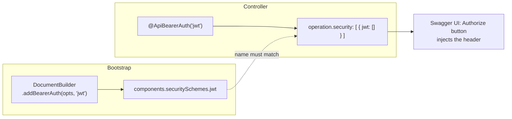
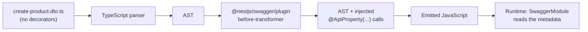

# Chapter 30 — OpenAPI II: Operations, Security, Mapped Types, and the CLI Plugin

> **한눈에 보기**
> 29장에서 만든 문서는 "어떤 모델이 오간다"까지만 말합니다. 이 장은 나머지 절반을
> 채웁니다. 오퍼레이션 단위의 설명·태그·응답을 기술하고, 보안 스킴을 선언한 뒤 각
> 라우트에 요구사항으로 연결하고, `@nestjs/swagger`의 매핑 타입으로 DTO 계열을 파생하고,
> CLI 플러그인으로 `@ApiProperty` 수백 개를 컴파일 타임에 자동 생성합니다. 마지막에는
> 명세를 파일로 내보내고 코드와 어긋나면 빌드를 실패시키는 CI 단계를 직접 만듭니다.

**What you will learn**

- Where each operation-level decorator lands in the emitted document, so you can debug a spec by reading it instead of guessing.
- Every `@ApiResponse` shortcut, what `@ApiDefaultResponse` means in OpenAPI terms, and when a global response beats twenty per-route ones.
- How to turn a repeated `allOf` block into a single reusable `@ApiPaginatedResponse(Product)` decorator that generates *readable* client types.
- Why security in OpenAPI has two halves — a scheme *declaration* and an operation *requirement* — and what breaks when you write only one of them.
- How to put Swagger UI behind Basic auth, and why "it's only on the internal network" is not a plan.
- Why `PartialType` from `@nestjs/swagger` and `PartialType` from `@nestjs/mapped-types` produce DTOs that validate identically but document differently.
- What the CLI plugin does to your TypeScript AST, every option it accepts, how to make it work under `ts-jest` and SWC, and the five things it cannot infer.
- How to export the spec to a file and fail CI when the committed spec drifts from the code.

**Why this matters**

[Chapter 29](./29-openapi-fundamentals.md) left you with a document that describes shapes. That is the easy half. The hard half is everything a consumer needs in order to actually *call* the API: which endpoint is deprecated, what a 409 means here as opposed to there, which token goes in which header, and what the error body looks like when it goes wrong. None of that is inferable from types, because none of it is in the type system.

There is a second problem, and it is the one that quietly kills OpenAPI adoption in real codebases. Decorating one DTO is pleasant. Decorating four hundred is not. A team starts with `@ApiProperty()` on everything, then a deadline arrives, then new DTOs ship undecorated, then the spec has empty schemas in it, then nobody trusts the spec, then nobody maintains it. The CLI plugin exists to remove that decay path entirely: it reads the TypeScript AST at compile time and writes the decorators for you, so a new DTO is documented by virtue of existing. Getting the plugin configured correctly — including under Jest and SWC, where it is easy to think it is running when it is not — is worth more to a long-lived project than any individual decorator in this chapter.

Finally, a generated spec is only trustworthy if something enforces the generation. A `swagger.json` committed to the repository and refreshed by hand is a wiki page with extra steps. The chapter ends by wiring the spec into CI so that changing a DTO without regenerating the spec fails the build — which is the mechanism that makes every other claim in these two chapters actually hold.

## 1. Where operation metadata goes

An OpenAPI document has a `paths` object. Each key is a path template; each value is a *path item*; each key in the path item is an HTTP method; each value there is an **operation object**. Almost everything in this chapter writes a field on an operation object.

```json
"paths": {
  "/products/{id}": {
    "get": {
      "operationId": "ProductsController_findOne",
      "tags": ["products"],
      "summary": "Fetch one product",
      "description": "Returns the product…",
      "deprecated": false,
      "parameters": [ /* @ApiParam, @ApiQuery, @ApiHeader */ ],
      "requestBody": { /* @ApiBody, @ApiConsumes */ },
      "responses": { /* @ApiResponse and friends */ },
      "security": [ /* @ApiBearerAuth and friends */ ],
      "x-audience": "partner"
    }
  }
}
```

| Decorator | Field it writes | Applied to |
|---|---|---|
| `@ApiOperation()` | `summary`, `description`, `operationId`, `deprecated`, `tags`, `externalDocs` | Method |
| `@ApiTags()` | `tags` | Method or controller |
| `@ApiHeader()` / `@ApiHeaders()` | an entry in `parameters` with `in: header` | Method or controller |
| `@ApiResponse()` + shortcuts | an entry in `responses` | Method or controller |
| `@ApiDefaultResponse()` | `responses.default` | Method or controller |
| `@ApiConsumes()` | `requestBody.content` media-type keys | Method or controller |
| `@ApiProduces()` | `responses.*.content` media-type keys | Method or controller |
| `@ApiSecurity()` and the auth shortcuts | `security` | Method or controller |
| `@ApiExtension()` | any `x-*` key | Method or controller |

The mental model to carry: **controller-level decorators are defaults that method-level decorators extend.** `@ApiTags('products')` on the class puts the tag on every operation; `@ApiTags('admin')` on one method *adds* to it rather than replacing it. The same is true of security. This is why "I removed `@ApiBearerAuth` from the method and it's still showing the lock icon" — it is on the controller.

## 2. `@ApiOperation`

```typescript title="src/products/products.controller.ts"
import { Controller, Get, Param } from '@nestjs/common';
import { ApiOperation, ApiTags } from '@nestjs/swagger';

@ApiTags('products')
@Controller('products')
export class ProductsController {
  @Get(':id')
  @ApiOperation({
    summary: 'Fetch one product',
    description:
      'Returns the product including its current price and stock level. ' +
      'Prices are integer minor units in the currency named by `currency`.',
    operationId: 'getProduct',
    deprecated: false,
    externalDocs: {
      description: 'Pricing model',
      url: 'https://docs.example.com/pricing',
    },
  })
  findOne(@Param('id') id: string) {}
}
```

`summary` is a single line — Swagger UI shows it next to the collapsed route, and it must be readable at a glance. `description` supports CommonMark and is where the actual semantics go. Splitting them correctly is the difference between a spec people skim and a spec people read.

`operationId` deserves more attention than it usually gets, because **it becomes the method name in every generated client.** Nest's default is `ControllerName_methodName` — `ProductsController_findOne` — which produces `api.productsControllerFindOne()` in a TypeScript client. Two ways to fix this. Per operation, as above. Or globally, with `operationIdFactory` in the document options ([Chapter 29](./29-openapi-fundamentals.md) §4):

```typescript title="src/main.ts"
const document = SwaggerModule.createDocument(app, config, {
  operationIdFactory: (controllerKey, methodKey) => methodKey,
});
```

Beware: bare method names collide. `findOne` exists on every controller you have, and duplicate `operationId` values make a spec invalid. A safer factory keeps disambiguation without the noise:

```typescript
operationIdFactory: (controllerKey: string, methodKey: string) =>
  `${controllerKey.replace(/Controller$/, '').toLowerCase()}_${methodKey}`,
// -> products_findOne
```

`deprecated: true` renders the operation struck through in the UI and sets the `deprecated` flag that client generators emit as an `@deprecated` tag. Combine it with a description that names the replacement and a sunset date — a deprecation with no migration path is just a warning nobody can act on.

## 3. Tags, including OpenAPI 3.2 hierarchies

`@ApiTags(...tags)` groups operations in the UI:

```typescript
@ApiTags('products')
@Controller('products')
export class ProductsController {}
```

Declaring tags up front in `DocumentBuilder` gives them descriptions and fixes their display order:

```typescript
const config = new DocumentBuilder()
  .addTag('products', 'Catalog items and their prices')
  .addTag('orders', 'Checkout and fulfilment')
  .build();
```

OpenAPI 3.2 extends the Tag Object so tags can nest and carry a presentation hint. Both extra fields are set through `addTag()` — the third argument is `externalDocs`, the fourth is the options object:

```typescript title="src/main.ts"
const config = new DocumentBuilder()
  .setOpenAPIVersion('3.2.0')
  .addTag('Catalog', 'Everything about the catalog', undefined, { kind: 'nav' })
  .addTag('Products', 'Product operations', undefined, { parent: 'Catalog' })
  .addTag('Variants', 'Variant operations', undefined, { parent: 'Catalog' })
  .build();
```

`parent` references another tag by name; `kind` is a free-form machine-readable hint, commonly `nav`, `badge`, or `audience`.

> **⚠️ Notice** — `parent` and `kind` are OpenAPI 3.2 fields. Without `setOpenAPIVersion('3.2.0')` the document still declares `openapi: 3.0.0`, and a strict validator rejects it. The hierarchy fields can *only* be set through `DocumentBuilder.addTag()`; passing them to `@ApiTags()` has no effect at all — the decorator takes plain strings.

If your controller names already match the tags you want, `autoTagControllers` (on by default) saves you the decorator entirely; set it to `false` in the document options when you tag by hand and do not want the automatic ones as well.

## 4. Headers

```typescript
import { ApiHeader, ApiHeaders } from '@nestjs/swagger';

@ApiHeader({
  name: 'X-Tenant-Id',
  description: 'Tenant whose catalog to read.',
  required: true,
  schema: { type: 'string', format: 'uuid' },
})
@Controller('products')
export class ProductsController {}
```

`@ApiHeaders([...])` takes an array for the common case of several at once. Two things to know. First, these are *request* headers — response headers are described with the `headers` key on `@ApiResponse` (§5.3). Second, `Authorization` should **not** be declared with `@ApiHeader`: use a security scheme (§8), which makes the UI render an Authorize button that injects the header into every try-it-out request, instead of an editable text field the user must fill on every call.

A header every request needs is better declared once, globally:

```typescript
const config = new DocumentBuilder()
  .addGlobalParameters({ name: 'X-Tenant-Id', in: 'header', required: true })
  .build();
```

## 5. Responses

### 5.1 `@ApiResponse` and the shortcuts

```typescript
@Post()
@ApiResponse({ status: 201, description: 'The product has been created.', type: Product })
@ApiResponse({ status: 409, description: 'A product with this SKU already exists.' })
create(@Body() dto: CreateProductDto) {}
```

Every status has a shortcut with the description as the only thing you must supply. They are exactly equivalent to `@ApiResponse({ status: N, ... })`:

| Decorator | Status | Decorator | Status |
|---|---|---|---|
| `@ApiOkResponse()` | 200 | `@ApiRequestTimeoutResponse()` | 408 |
| `@ApiCreatedResponse()` | 201 | `@ApiConflictResponse()` | 409 |
| `@ApiAcceptedResponse()` | 202 | `@ApiGoneResponse()` | 410 |
| `@ApiNoContentResponse()` | 204 | `@ApiPreconditionFailedResponse()` | 412 |
| `@ApiMovedPermanentlyResponse()` | 301 | `@ApiPayloadTooLargeResponse()` | 413 |
| `@ApiFoundResponse()` | 302 | `@ApiUnsupportedMediaTypeResponse()` | 415 |
| `@ApiBadRequestResponse()` | 400 | `@ApiUnprocessableEntityResponse()` | 422 |
| `@ApiUnauthorizedResponse()` | 401 | `@ApiTooManyRequestsResponse()` | 429 |
| `@ApiForbiddenResponse()` | 403 | `@ApiInternalServerErrorResponse()` | 500 |
| `@ApiNotFoundResponse()` | 404 | `@ApiNotImplementedResponse()` | 501 |
| `@ApiMethodNotAllowedResponse()` | 405 | `@ApiBadGatewayResponse()` | 502 |
| `@ApiNotAcceptableResponse()` | 406 | `@ApiServiceUnavailableResponse()` | 503 |
| | | `@ApiGatewayTimeoutResponse()` | 504 |
| | | `@ApiDefaultResponse()` | `default` |

Rewritten with shortcuts, the intent reads better:

```typescript
@Post()
@ApiCreatedResponse({ description: 'The product has been created.', type: Product })
@ApiConflictResponse({ description: 'A product with this SKU already exists.' })
@ApiForbiddenResponse({ description: 'Caller lacks the catalog:write scope.' })
create(@Body() dto: CreateProductDto) {}
```

Use `type` to attach a model, which is the whole point — a documented status with no schema tells a client generator nothing:

```typescript
export class Product {
  @ApiProperty() id: string;
  @ApiProperty() sku: string;
  @ApiProperty() priceCents: number;
}
```

```typescript
@Get()
@ApiOkResponse({ description: 'All products.', type: Product, isArray: true })
findAll(): Promise<Product[]> {}
```

### 5.2 `@ApiDefaultResponse`

`default` is not a status code. In OpenAPI it means "the response for any status not explicitly listed" — the catch-all. It is the correct place for your standard error envelope:

```typescript
export class ProblemDetails {
  @ApiProperty({ example: 422 }) statusCode: number;
  @ApiProperty({ example: 'VALIDATION_FAILED' }) code: string;
  @ApiProperty({ example: 'priceCents must be a positive integer' }) message: string;
  @ApiProperty({ format: 'date-time' }) timestamp: string;
}
```

```typescript
@ApiDefaultResponse({ description: 'Unexpected error', type: ProblemDetails })
@Controller('products')
export class ProductsController {}
```

Client generators use `default` to type the error branch, which is the difference between `catch (e: unknown)` and `catch (e: ProblemDetails)` in consumer code.

### 5.3 Response headers, links, and multiple content types

`@ApiResponse` takes more than `status`, `description`, and `type`:

```typescript
@Get()
@ApiOkResponse({
  description: 'A page of products.',
  type: Product,
  isArray: true,
  headers: {
    'X-Total-Count': {
      description: 'Total number of matching products.',
      schema: { type: 'integer' },
    },
    'X-RateLimit-Remaining': {
      description: 'Requests left in the current window.',
      schema: { type: 'integer' },
    },
  },
  links: {
    nextPage: {
      operationId: 'products_findAll',
      parameters: { offset: '$response.body#/nextOffset' },
    },
  },
})
findAll() {}
```

```typescript
@Get(':id/export')
@ApiProduces('text/csv', 'application/json')
@ApiOkResponse({
  content: {
    'text/csv': { schema: { type: 'string' } },
    'application/json': { schema: { $ref: getSchemaPath(Product) } },
  },
})
export(@Param('id') id: string) {}
```

`content` and `type` are alternatives: `type` is shorthand for `content['application/json'].schema`. Reach for `content` when a route genuinely negotiates formats.

### 5.4 Global responses

Declaring `@ApiUnauthorizedResponse()` on eighty routes is noise. Declare it once:

```typescript title="src/main.ts"
const config = new DocumentBuilder()
  .setTitle('Catalog API')
  .setVersion('1.0')
  .addGlobalResponse(
    { status: 401, description: 'Missing or invalid credentials' },
    { status: 429, description: 'Rate limit exceeded' },
    { status: 500, description: 'Internal server error' },
  )
  .build();
```

Global responses apply to every operation in the document. Use them for cross-cutting concerns produced by guards, filters, and the throttler — things true of every route by construction. Keep route-specific meanings (a 409 that means "duplicate SKU") at the route, where the description can say what it actually means.

An alternative worth knowing: bundle the repeated decorators into one with `applyDecorators`, so you can apply them selectively:

```typescript title="src/common/decorators/api-standard-errors.decorator.ts"
import { applyDecorators } from '@nestjs/common';
import {
  ApiForbiddenResponse,
  ApiTooManyRequestsResponse,
  ApiUnauthorizedResponse,
} from '@nestjs/swagger';
import { ProblemDetails } from '../dto/problem-details.dto';

export const ApiStandardErrors = () =>
  applyDecorators(
    ApiUnauthorizedResponse({ description: 'Missing or invalid token', type: ProblemDetails }),
    ApiForbiddenResponse({ description: 'Insufficient scope', type: ProblemDetails }),
    ApiTooManyRequestsResponse({ description: 'Rate limited', type: ProblemDetails }),
  );
```

## 6. Documenting file uploads

Reflection cannot see a `multipart/form-data` body, because there is no DTO class in the handler signature — the file arrives through an interceptor. You describe it explicitly with `@ApiConsumes()` plus a body class whose file property carries `format: 'binary'`.

```typescript title="src/products/dto/product-image.dto.ts"
import { ApiProperty } from '@nestjs/swagger';

export class ProductImageDto {
  @ApiProperty({ type: 'string', format: 'binary' })
  image: any;

  @ApiProperty({ example: 'front' })
  angle: string;
}

export class ProductImagesDto {
  @ApiProperty({ type: 'array', items: { type: 'string', format: 'binary' } })
  images: any[];
}
```

```typescript title="src/products/products.controller.ts"
@Post(':id/image')
@UseInterceptors(FileInterceptor('image'))
@ApiConsumes('multipart/form-data')
@ApiBody({ description: 'Product photograph', type: ProductImageDto })
@ApiCreatedResponse({ type: Product })
uploadImage(
  @Param('id') id: string,
  @UploadedFile() file: Express.Multer.File,
) {}
```

`format: 'binary'` is what makes Swagger UI render a file picker. The property type is `any` deliberately — no TypeScript type describes "bytes on the wire", and annotating it `Express.Multer.File` would make the CLI plugin (§11) emit a schema for multer's descriptor object rather than a binary field. [Chapter 28](./28-file-upload-and-streaming.md) covers the upload side of this in full.

## 7. Generic responses that generate readable clients

[Chapter 29](./29-openapi-fundamentals.md) §12 built a `PaginatedDto<T>` with a hand-written `allOf` block. It works and it does not scale — twenty list endpoints means twenty copies. Collapse it into a decorator:

```typescript title="src/common/decorators/api-paginated-response.decorator.ts"
import { Type, applyDecorators } from '@nestjs/common';
import { ApiExtraModels, ApiOkResponse, getSchemaPath } from '@nestjs/swagger';
import { PaginatedDto } from '../dto/paginated.dto';

export const ApiPaginatedResponse = <TModel extends Type<unknown>>(
  model: TModel,
) =>
  applyDecorators(
    ApiExtraModels(PaginatedDto, model),
    ApiOkResponse({
      description: `A page of ${model.name} records.`,
      schema: {
        title: `PaginatedResponseOf${model.name}`,
        allOf: [
          { $ref: getSchemaPath(PaginatedDto) },
          {
            properties: {
              results: { type: 'array', items: { $ref: getSchemaPath(model) } },
            },
          },
        ],
      },
    }),
  );
```

```typescript
@Get()
@ApiPaginatedResponse(Product)
findAll(): Promise<PaginatedDto<Product>> {}
```

Two details carry all the value here.

`ApiExtraModels(PaginatedDto, model)` is inside the composed decorator, so every use site registers both schemas automatically. Forget it and `getSchemaPath(PaginatedDto)` emits a `$ref` to a schema that does not exist — the UI shows a broken reference and validators fail.

`title` is the fix for a problem you only discover after running a client generator. An anonymous `allOf` schema has no name, so the generator inlines it:

```typescript
// Without title — Angular client
findAll(): Observable<{ total: number; limit: number; offset: number; results: ProductDto[] }>
```

With `title: 'PaginatedResponseOfProduct'` the generator emits a named interface:

```typescript
// With title
findAll(): Observable<PaginatedResponseOfProduct>
```

The second one is the type your consumers can actually pass around. Adding `title` to composed schemas costs nothing and should be automatic.

## 8. Security

### 8.1 Two halves, and what breaks when you write only one

OpenAPI splits authentication into a **declaration** and a **requirement**:



Declare without requiring: the Authorize button appears, but no operation is marked protected and the credential is never attached to a try-it-out request. Require without declaring: the operation references a scheme name that does not exist, the UI shows a lock that does nothing, and strict validators reject the document. **You always write both, and the name string must match exactly.**

| Decorator | Matching `DocumentBuilder` call | Scheme emitted |
|---|---|---|
| `@ApiBasicAuth(name?)` | `.addBasicAuth(options?, name?)` | `{ type: 'http', scheme: 'basic' }` |
| `@ApiBearerAuth(name?)` | `.addBearerAuth(options?, name?)` | `{ type: 'http', scheme: 'bearer' }` |
| `@ApiOAuth2(scopes, name?)` | `.addOAuth2(options?, name?)` | `{ type: 'oauth2', flows: {...} }` |
| `@ApiCookieAuth(name?)` | `.addCookieAuth(cookieName?, options?, name?)` | `{ type: 'apiKey', in: 'cookie' }` |
| `@ApiSecurity(name, scopes?)` | `.addApiKey(options?, name?)` or `.addSecurity(name, options)` | whatever you declared |

Note the naming trap on `@ApiCookieAuth` and `@ApiSecurity`: the name you pass is the **security scheme name**, not the cookie name. `addCookieAuth('session_id')` sets the *cookie* name and defaults the *scheme* name to `cookie`.

### 8.2 Bearer tokens — the common case

```typescript title="src/main.ts"
const config = new DocumentBuilder()
  .setTitle('Catalog API')
  .setVersion('1.0')
  .addBearerAuth(
    {
      type: 'http',
      scheme: 'bearer',
      bearerFormat: 'JWT',
      name: 'Authorization',
      in: 'header',
      description: 'Paste the access token returned by POST /auth/login.',
    },
    'access-token', // <- scheme name
  )
  .build();
```

```typescript title="src/products/products.controller.ts"
import { ApiBearerAuth } from '@nestjs/swagger';

@ApiBearerAuth('access-token')
@UseGuards(JwtAuthGuard)
@Controller('products')
export class ProductsController {}
```

`addBearerAuth()` with no arguments works and defaults the scheme name to `bearer`, matching a bare `@ApiBearerAuth()`. Name the scheme explicitly anyway — an API that later grows a second bearer scheme (a service token alongside a user token) cannot retrofit names without breaking every client.

Two UI conveniences worth setting:

```typescript
SwaggerModule.setup('docs', app, documentFactory, {
  swaggerOptions: {
    persistAuthorization: true, // survive a page reload
    tagsSorter: 'alpha',
    operationsSorter: 'alpha',
  },
});
```

### 8.3 Basic, API key, and cookie

```typescript
// Basic
new DocumentBuilder().addBasicAuth();          // scheme name: 'basic'
@ApiBasicAuth()

// API key in a custom header
new DocumentBuilder().addApiKey(
  { type: 'apiKey', name: 'X-Api-Key', in: 'header' },
  'partner-key',
);
@ApiSecurity('partner-key')

// Session cookie
new DocumentBuilder().addCookieAuth('catalog.sid', {
  type: 'apiKey',
  in: 'cookie',
  name: 'catalog.sid',
}, 'session');
@ApiCookieAuth('session')
```

For anything the helpers do not cover, `addSecurity(name, definition)` takes a raw `SecuritySchemeObject`:

```typescript
new DocumentBuilder().addSecurity('mtls', {
  type: 'mutualTLS',
  description: 'Client certificate issued by the partner CA.',
});
```

```typescript
@ApiSecurity('mtls')
@Controller('partner')
export class PartnerController {}
```

### 8.4 OAuth2 and scopes

```typescript title="src/main.ts"
const config = new DocumentBuilder()
  .addOAuth2(
    {
      type: 'oauth2',
      flows: {
        authorizationCode: {
          authorizationUrl: 'https://auth.example.com/oauth/authorize',
          tokenUrl: 'https://auth.example.com/oauth/token',
          scopes: {
            'catalog:read': 'Read products and prices',
            'catalog:write': 'Create and modify products',
          },
        },
      },
    },
    'oauth',
  )
  .build();
```

```typescript
@ApiOAuth2(['catalog:read'], 'oauth')
@Get()
findAll() {}

@ApiOAuth2(['catalog:write'], 'oauth')
@Post()
create(@Body() dto: CreateProductDto) {}
```

The scope array goes into `security: [{ oauth: ['catalog:write'] }]`, which is how a consumer knows which grant to request. To let the UI perform the flow itself, configure the client in the setup options:

```typescript
SwaggerModule.setup('docs', app, documentFactory, {
  swaggerOptions: {
    persistAuthorization: true,
    oauth2RedirectUrl: 'http://localhost:3000/docs/oauth2-redirect.html',
    // Forwarded to Swagger UI's initOAuth()
    initOAuth: { clientId: 'swagger-ui', scopes: ['catalog:read'] },
  },
});
```

Never put a client *secret* there. The document is public to anyone who can reach the UI.

### 8.5 Global security

When nearly every route is protected, declaring the requirement on each controller is churn. `addSecurityRequirements()` applies it document-wide:

```typescript
const config = new DocumentBuilder()
  .addBearerAuth({ type: 'http', scheme: 'bearer', bearerFormat: 'JWT' }, 'access-token')
  .addSecurityRequirements('access-token')
  .build();
```

or with scopes:

```typescript
.addSecurityRequirements({ oauth: ['catalog:read'] })
```

Then mark the exceptions. There is no "unset" decorator, but an empty requirement array is the OpenAPI idiom for "this operation needs nothing":

```typescript
@ApiSecurity({})       // security: [{}] — opts this operation out
@Public()              // your own guard-bypass decorator
@Post('auth/login')
login(@Body() dto: LoginDto) {}
```

My recommendation: prefer explicit per-controller decorators unless the ratio is extreme. Global security plus scattered opt-outs makes it hard to answer "is this route protected?" by reading one file — and that question gets asked during incidents.

### 8.6 Composing the guard and the documentation

The decorator documents; the guard enforces. Nothing links them, so they drift — someone removes `@UseGuards` and the lock icon stays. Bind them into one decorator so they cannot:

```typescript title="src/auth/auth.decorator.ts"
import { UseGuards, applyDecorators } from '@nestjs/common';
import { ApiBearerAuth, ApiForbiddenResponse, ApiUnauthorizedResponse } from '@nestjs/swagger';
import { JwtAuthGuard } from './jwt-auth.guard';
import { ScopesGuard } from './scopes.guard';
import { Scopes } from './scopes.decorator';

export const Auth = (...scopes: string[]) =>
  applyDecorators(
    Scopes(...scopes),
    UseGuards(JwtAuthGuard, ScopesGuard),
    ApiBearerAuth('access-token'),
    ApiUnauthorizedResponse({ description: 'Missing or invalid token' }),
    ApiForbiddenResponse({ description: `Requires: ${scopes.join(', ')}` }),
  );
```

```typescript
@Auth('catalog:write')
@Post()
create(@Body() dto: CreateProductDto) {}
```

Now the enforcement, the required scopes, the OpenAPI requirement, and the documented failure responses all come from one line. This is the single highest-value pattern in the chapter.

### 8.7 Protecting the Swagger UI route itself

Your spec is a map of your attack surface: every route, every parameter, every field name. Serving it publicly on `/api` is a decision, and usually the wrong one.

Three options, in ascending order of effort.

**Do not serve it in production.**

```typescript title="src/main.ts"
if (process.env.NODE_ENV !== 'production') {
  SwaggerModule.setup('docs', app, documentFactory);
}
```

Ship the JSON as a build artefact instead (§13) and publish it to whoever needs it through a channel you control.

**Put it behind Basic auth (Express).** Register the middleware *before* `SwaggerModule.setup()` and cover every path the module serves — the UI, the JSON, and the YAML:

```bash
$ npm i express-basic-auth
```

```typescript title="src/main.ts"
import basicAuth from 'express-basic-auth';

app.use(
  ['/docs', '/docs-json', '/docs-yaml'],
  basicAuth({
    challenge: true,
    users: { [process.env.DOCS_USER!]: process.env.DOCS_PASSWORD! },
  }),
);

SwaggerModule.setup('docs', app, documentFactory, {
  jsonDocumentUrl: 'docs-json',
  yamlDocumentUrl: 'docs-yaml',
});
```

The ordering is not optional: `app.use()` after `setup()` registers the middleware behind the already-mounted route and protects nothing. And listing only `/docs` leaves `/docs-json` wide open, which is the more valuable target anyway.

**Fastify** has no `express-basic-auth`; use a hook or `@fastify/basic-auth`:

```typescript
const instance = app.getHttpAdapter().getInstance();
await instance.register(fastifyBasicAuth, {
  validate: async (username, password) => {
    if (username !== process.env.DOCS_USER || password !== process.env.DOCS_PASSWORD) {
      return new Error('Unauthorized');
    }
  },
  authenticate: { realm: 'docs' },
});
instance.addHook('onRequest', (req, reply, done) => {
  if (!req.url.startsWith('/docs')) return done();
  instance.basicAuth(req, reply, done);
});
```

A Nest guard cannot do this job: `SwaggerModule.setup()` mounts platform middleware, not a Nest route, so guards never run for it.

## 9. Mapped types from `@nestjs/swagger`

A CRUD resource needs several shapes of the same data. Writing them by hand guarantees they drift.

```typescript title="src/products/dto/create-product.dto.ts"
import { ApiProperty } from '@nestjs/swagger';
import { IsInt, IsString, Length, Min } from 'class-validator';

export class CreateProductDto {
  @ApiProperty({ example: 'SKU-1042' })
  @IsString()
  @Length(3, 32)
  sku: string;

  @ApiProperty({ example: 'Cast iron skillet' })
  @IsString()
  name: string;

  @ApiProperty({ example: 4990, description: 'Price in minor units.' })
  @IsInt()
  @Min(0)
  priceCents: number;
}
```

| Utility | Result |
|---|---|
| `PartialType(T)` | every property of `T`, all optional |
| `PickType(T, keys)` | only the listed properties |
| `OmitType(T, keys)` | everything except the listed keys |
| `IntersectionType(A, B)` | the union of both property sets |

```typescript title="src/products/dto/update-product.dto.ts"
import { OmitType, PartialType, PickType, IntersectionType } from '@nestjs/swagger';
import { CreateProductDto } from './create-product.dto';

// Everything optional
export class PatchProductDto extends PartialType(CreateProductDto) {}

// Only the price
export class UpdatePriceDto extends PickType(CreateProductDto, ['priceCents'] as const) {}

// Everything except the immutable SKU
export class ReplaceProductDto extends OmitType(CreateProductDto, ['sku'] as const) {}

// Composition: everything creatable except the SKU, all optional
export class UpdateProductDto extends PartialType(
  OmitType(CreateProductDto, ['sku'] as const),
) {}

// Merge two decorated classes
export class AdminProductDto extends IntersectionType(
  CreateProductDto,
  InternalFlagsDto,
) {}
```

The `as const` is load-bearing. Without it TypeScript widens the array to `string[]` and a typo in a property name compiles cleanly, producing a DTO that silently keeps the field you meant to remove.

### Why the package you import from matters

Three packages export functions with these exact names, and they differ in *which metadata they copy*:

| Package | Copies validation metadata | Copies `@ApiProperty` metadata | Copies GraphQL field metadata |
|---|---|---|---|
| `@nestjs/mapped-types` | ✅ | ❌ | ❌ |
| `@nestjs/swagger` | ✅ | ✅ | ❌ |
| `@nestjs/graphql` | ✅ | ❌ | ✅ |

`@nestjs/swagger`'s versions are a strict superset of `@nestjs/mapped-types`' for a REST app: they re-export the validation behaviour *and* copy the OpenAPI metadata. Import from `@nestjs/mapped-types` in a documented API and your derived DTOs validate correctly but appear as **empty schemas** in the spec — a `{}` in the UI where `UpdateProductDto` should be. The symptom looks like a Swagger bug; the cause is one import line.

The rule: in a REST app with `@nestjs/swagger` installed, import mapped types from `@nestjs/swagger`, always. Never from both in the same project. [Chapter 15](./15-validation-in-depth.md) covers the validation-side mechanics of how `PartialType` rebuilds a class at runtime.

Mechanically, `PartialType(T)` creates a new class, copies `T`'s property metadata onto it, adds `@IsOptional()` to each validation entry and `required: false` to each `@ApiProperty` entry. The result is a real constructor, so you can extend it with additional decorated properties:

```typescript
export class UpdateProductDto extends PartialType(CreateProductDto) {
  @ApiPropertyOptional({ description: 'Reason for the change, for the audit log.' })
  @IsString()
  @IsOptional()
  changeReason?: string;
}
```

## 10. The CLI plugin: what it actually does

Everything above assumes you decorate your DTOs. TypeScript's `emitDecoratorMetadata` gives Nest the *type* of a constructor parameter, and nothing else — it cannot tell you what properties a class has, whether one is optional, or what a `string[]` contains. That is a compile-time-only fact, so Nest solves it with a compile-time tool: a TypeScript **transformer** that runs before emit and inserts the decorators you would have written.



The plugin sees the AST, where the types still exist. It reads `priceCents: number`, the `?` on `isEnabled?`, the `= []` default, and the `@Min(0)` from class-validator — then writes the equivalent `@ApiProperty({ type: Number, required: true, minimum: 0 })` into the tree. Your source file stays clean; the emitted JavaScript carries the metadata.

Concretely, the plugin will:

- add `@ApiProperty()` to every DTO property, unless it carries `@ApiHideProperty()`
- set `required` from the question mark (`name?: string` → `required: false`)
- set `type` or `enum` from the TypeScript type, arrays included
- set `default` from an assigned default value
- translate class-validator decorators into schema constraints, when `classValidatorShim` is on
- add a response decorator to every endpoint with the right status and response model
- generate descriptions and examples from JSDoc comments, when `introspectComments` is on

So this:

```typescript
export class CreateUserDto {
  @ApiProperty()
  email: string;

  @ApiProperty()
  password: string;

  @ApiProperty({ enum: RoleEnum, default: [], isArray: true })
  roles: RoleEnum[] = [];

  @ApiProperty({ required: false, default: true })
  isEnabled?: boolean = true;
}
```

becomes this:

```typescript
export class CreateUserDto {
  email: string;
  password: string;
  roles: RoleEnum[] = [];
  isEnabled?: boolean = true;
}
```

> **⚠️ Notice** — The plugin generates *documentation*, not validation. It reads your class-validator decorators; it does not create them. `email: string` with no `@IsEmail()` is documented as a string and accepted at runtime as any string. Keep the validators.

> **Hint** — Explicit decorators always win. The plugin fills in what is missing; `@ApiProperty({ description: 'Primary contact address' })` on one property overrides the inferred value for that property only.

### File-name conventions

The plugin only analyses files whose names end in one of the configured suffixes: `.dto.ts` or `.entity.ts` for models, `.controller.ts` for controllers. A DTO in `types.ts` is invisible to it — the most common "why is the plugin not working" cause by a wide margin. Either rename the file or extend `dtoFileNameSuffix`.

## 11. Configuring the plugin

```json title="nest-cli.json"
{
  "collection": "@nestjs/schematics",
  "sourceRoot": "src",
  "compilerOptions": {
    "plugins": ["@nestjs/swagger"]
  }
}
```

With options:

```json title="nest-cli.json"
{
  "collection": "@nestjs/schematics",
  "sourceRoot": "src",
  "compilerOptions": {
    "plugins": [
      {
        "name": "@nestjs/swagger",
        "options": {
          "dtoFileNameSuffix": [".dto.ts", ".entity.ts", ".model.ts"],
          "controllerFileNameSuffix": [".controller.ts"],
          "classValidatorShim": true,
          "dtoKeyOfComment": "description",
          "controllerKeyOfComment": "summary",
          "introspectComments": true,
          "skipAutoHttpCode": false,
          "esmCompatible": false
        }
      }
    ]
  }
}
```

| Option | Default | Effect |
|---|---|---|
| `dtoFileNameSuffix` | `['.dto.ts', '.entity.ts']` | Which files are treated as models |
| `controllerFileNameSuffix` | `['.controller.ts']` | Which files are treated as controllers |
| `classValidatorShim` | `true` | Translate class-validator decorators into schema constraints (`@Max(10)` → `maximum: 10`) |
| `dtoKeyOfComment` | `'description'` | Which `@ApiProperty` key receives an introspected comment |
| `controllerKeyOfComment` | `'summary'` | Which `@ApiOperation` key receives an introspected comment |
| `introspectComments` | `false` | Read JSDoc for descriptions and examples |
| `skipAutoHttpCode` | `false` | Stop the plugin adding `@HttpCode()` to controllers |
| `esmCompatible` | `false` | Fix syntax errors in ESM projects (`"type": "module"`) |

Two operational notes. **Delete `/dist` and rebuild after changing any option** — the plugin runs at compile time, so stale output keeps the old behaviour and you will chase a ghost. And `classValidatorShim` should stay on: it is what turns `@Length(3, 32)` into `minLength: 3, maxLength: 32` in the schema, which is how consumers learn your constraints without reading your source.

If you build with webpack and `ts-loader` instead of the Nest CLI, register the transformer yourself:

```javascript title="webpack.config.js"
getCustomTransformers: (program) => ({
  before: [require('@nestjs/swagger/plugin').before({}, program)],
}),
```

### Comments introspection

With `introspectComments: true`, JSDoc becomes documentation:

```typescript title="src/products/dto/create-product.dto.ts"
export class CreateProductDto {
  /**
   * Stock keeping unit, unique across the catalog.
   * @example 'SKU-1042'
   */
  @IsString()
  @Length(3, 32)
  sku: string;

  /**
   * Price in minor units of the listing currency.
   * @example 4990
   */
  @IsInt()
  @Min(0)
  priceCents: number;
}
```

Controllers get more vocabulary — remarks, deprecation, and documented throws:

```typescript title="src/products/products.controller.ts"
export class ProductsController {
  /**
   * Create a product
   *
   * @remarks Creates a catalog entry. The SKU must not already exist.
   *
   * @deprecated Use POST /v2/products instead.
   * @throws {409} A product with this SKU already exists.
   * @throws {422} Validation failed.
   */
  @Post()
  create(@Body() dto: CreateProductDto): Promise<Product> {}
}
```

The first line becomes `@ApiOperation({ summary })`; `@remarks` becomes `description`; `@deprecated` sets `deprecated: true`; each `@throws {N}` becomes a response entry. `dtoKeyOfComment` and `controllerKeyOfComment` let you retarget where the comment text lands — set `controllerKeyOfComment: 'description'` if you would rather write long-form prose and supply summaries explicitly.

This is the configuration I recommend for a new project: plugin on, `classValidatorShim: true`, `introspectComments: true`. It makes documenting an endpoint indistinguishable from commenting it, which is the only way documentation survives contact with a deadline.

## 12. The plugin under `ts-jest` and SWC

Both of these are places where the plugin appears to work and does not, so read this section even if your build is fine.

### `ts-jest` (e2e tests)

Jest compiles your sources in memory with `ts-jest`. That bypasses the Nest CLI entirely, so no transformer runs and every DTO is undecorated — which means an e2e test asserting on the generated document passes locally under `nest build` and fails under `npm test`. Register the transformer with Jest:

```javascript title="test/swagger-transformer.js"
const transformer = require('@nestjs/swagger/plugin');

module.exports.name = 'nestjs-swagger-transformer';
// Bump this whenever you change the options below, or Jest will not
// notice and will keep using its cached transform.
module.exports.version = 1;

module.exports.factory = (cs) =>
  transformer.before(
    {
      introspectComments: true,
      classValidatorShim: true,
    },
    cs.program, // "cs.tsCompiler.program" on Jest <= 27
  );
```

For `jest@^29`:

```json title="test/jest-e2e.json"
{
  "moduleFileExtensions": ["js", "json", "ts"],
  "rootDir": ".",
  "testEnvironment": "node",
  "testRegex": ".e2e-spec.ts$",
  "transform": {
    "^.+\\.(t|j)s$": [
      "ts-jest",
      {
        "astTransformers": {
          "before": ["<rootDir>/swagger-transformer.js"]
        }
      }
    ]
  }
}
```

For `jest@<29` the old `globals` form applies:

```json
{
  "globals": {
    "ts-jest": {
      "astTransformers": {
        "before": ["<path to the file created above>"]
      }
    }
  }
}
```

That `version` field is not decoration. Jest caches transform output keyed partly on it, so editing the options without bumping the version leaves the old transform in place and your change appears to do nothing. When behaviour still will not budge:

```bash
$ npx jest --clearCache

# If that fails, find and remove the directory manually:
$ npx jest --showConfig | grep cache
#   "cacheDirectory": "/tmp/jest_rs"
$ rm -rf /tmp/jest_rs
```

### SWC

SWC is a Rust compiler with no TypeScript type checker, and the plugin needs types. Nest's answer is to run type checking alongside:

```bash
$ nest start -b swc --type-check
```

For monorepos, or whenever you want the metadata produced ahead of time rather than during the build, use the `PluginMetadataGenerator`. It runs the plugin in **readonly** mode: instead of rewriting the AST it serialises everything it learned into a `metadata.ts` file that you load at runtime.

```typescript title="src/generate-metadata.ts"
import { PluginMetadataGenerator } from '@nestjs/cli/lib/compiler/plugins/plugin-metadata-generator';
import { ReadonlyVisitor } from '@nestjs/swagger/dist/plugin';

const generator = new PluginMetadataGenerator();

generator.generate({
  visitors: [
    new ReadonlyVisitor({
      introspectComments: true,
      classValidatorShim: true,
      // Root of the sources this visitor walks. Required — the visitor
      // resolves relative imports against it.
      pathToSource: __dirname,
    }),
  ],
  outputDir: __dirname,
  watch: true,
  tsconfigPath: 'tsconfig.build.json',
});
```

```bash
$ npx ts-node src/generate-metadata.ts
# monorepo: npx ts-node apps/api/src/generate-metadata.ts
```

Then load it before creating the document:

```typescript title="src/main.ts"
import metadata from './metadata'; // generated by PluginMetadataGenerator

await SwaggerModule.loadPluginMetadata(metadata);
const document = SwaggerModule.createDocument(app, config);
```

The two knobs specific to this mode: `readonly` — what the visitor sets internally to emit a metadata file rather than mutate the tree — and `pathToSource`, the directory the visitor treats as the source root when resolving imports. Point `pathToSource` at the wrong directory and the generator produces a metadata file with missing or wrongly-resolved model references, and the resulting spec has empty schemas with no error anywhere.

`loadPluginMetadata()` must be awaited **before** `createDocument()`. Reversing the two lines is silent: the document is built from whatever runtime metadata exists, which in an SWC build is close to nothing.

### Limitations

The plugin is a static analyser, and static analysis has edges:

1. **File-name suffixes are mandatory.** A model in `types.ts` or `shared.ts` is never visited.
2. **Only classes.** `interface` and `type` aliases do not exist at runtime and cannot become schemas. Every DTO must be a class.
3. **Generics are not resolved.** `class Page<T> { items: T[] }` yields no useful type for `items`; you still need `@ApiExtraModels` and `getSchemaPath` (§7).
4. **Types imported from `node_modules` are usually not followed.** A DTO property typed with a third-party class documents as an opaque object.
5. **Mapped types must come from `@nestjs/swagger`.** Import `PartialType` from `@nestjs/mapped-types` and the plugin does not see the derived schema (§9).
6. **It never adds runtime validation.** Documentation and validation stay separate concerns.
7. **Options changes need a clean rebuild.** Delete `dist/` and clear the Jest cache.

## 13. Multiple specs, extra models, and exporting the document

### Multiple specifications

One process can serve several documents on several paths — a public partner API and an internal admin API, for instance. `createDocument()`'s third argument takes `include`, an array of modules:

```typescript title="src/main.ts"
import { NestFactory } from '@nestjs/core';
import { DocumentBuilder, SwaggerModule } from '@nestjs/swagger';
import { AppModule } from './app.module';
import { ProductsModule } from './products/products.module';
import { AdminModule } from './admin/admin.module';

async function bootstrap() {
  const app = await NestFactory.create(AppModule);

  const publicConfig = new DocumentBuilder()
    .setTitle('Catalog API (public)')
    .setVersion('1.0')
    .addTag('products')
    .build();

  SwaggerModule.setup(
    'docs/public',
    app,
    () => SwaggerModule.createDocument(app, publicConfig, {
      include: [ProductsModule],
      deepScanRoutes: true,
    }),
    { jsonDocumentUrl: 'docs/public/openapi.json' },
  );

  const adminConfig = new DocumentBuilder()
    .setTitle('Catalog API (admin)')
    .setVersion('1.0')
    .build();

  SwaggerModule.setup(
    'docs/admin',
    app,
    () => SwaggerModule.createDocument(app, adminConfig, { include: [AdminModule] }),
    { jsonDocumentUrl: 'docs/admin/openapi.json' },
  );

  await app.listen(process.env.PORT ?? 3000);
}
bootstrap();
```

Gather them into one UI with a dropdown by enabling the explorer and pointing `swaggerOptions.urls` at the **JSON** endpoints — not the UI paths, a mistake that produces an empty explorer with no error:

```typescript
SwaggerModule.setup('docs', app, mainDocumentFactory, {
  explorer: true,
  jsonDocumentUrl: 'docs/openapi.json',
  swaggerOptions: {
    urls: [
      { name: '1. Full API', url: '/docs/openapi.json' },
      { name: '2. Public', url: '/docs/public/openapi.json' },
      { name: '3. Admin', url: '/docs/admin/openapi.json' },
    ],
  },
});
```

`deepScanRoutes: true` matters whenever `include` is used: without it, only controllers declared *directly* on the included module are collected, so a controller living in an imported sub-module silently vanishes from the spec.

### `ignoreGlobalPrefix` and global parameters

If you call `app.setGlobalPrefix('api')` but serve the spec to a gateway that strips the prefix, the paths in the document are wrong. Drop it:

```typescript
const document = SwaggerModule.createDocument(app, config, {
  ignoreGlobalPrefix: true,
});
```

### `@ApiExtraModels`

`SwaggerModule` only emits a schema for a class it *reaches* — one referenced by a `@Body()`, a parameter DTO, or a response `type`. A class referenced only from inside a hand-written `schema` (as in §7) is invisible and its `$ref` dangles. Register it explicitly:

```typescript
@ApiExtraModels(PaginatedDto, ProblemDetails)
@Controller('products')
export class ProductsController {}
```

Once per class is enough, at controller or method level. The document-wide equivalent:

```typescript
SwaggerModule.createDocument(app, config, {
  extraModels: [PaginatedDto, ProblemDetails],
});
```

### Exporting JSON and YAML to a file

`jsonDocumentUrl` and `yamlDocumentUrl` serve the document over HTTP. For CI, code generation, and publishing to an API gateway you want it on disk, produced without starting a server. Build the app, do **not** listen, write the file, exit:

```typescript title="src/generate-openapi.ts"
import { NestFactory } from '@nestjs/core';
import { SwaggerModule } from '@nestjs/swagger';
import { writeFileSync, mkdirSync } from 'node:fs';
import { dirname, resolve } from 'node:path';
import { dump } from 'js-yaml';
import { AppModule } from './app.module';
import { swaggerConfig } from './swagger.config';

async function generate() {
  // `create` builds the DI graph without binding a port.
  const app = await NestFactory.create(AppModule, { logger: false });
  await app.init();

  const document = SwaggerModule.createDocument(app, swaggerConfig);

  const target = resolve(process.cwd(), process.argv[2] ?? 'openapi/openapi.json');
  mkdirSync(dirname(target), { recursive: true });

  writeFileSync(target, `${JSON.stringify(document, null, 2)}\n`);
  writeFileSync(
    target.replace(/\.json$/, '.yaml'),
    dump(document, { noRefs: true, sortKeys: false }),
  );

  await app.close();
}

generate().catch((error) => {
  console.error(error);
  process.exit(1);
});
```

The key move is extracting the `DocumentBuilder` configuration into a shared module so `main.ts` and this script cannot disagree:

```typescript title="src/swagger.config.ts"
import { DocumentBuilder } from '@nestjs/swagger';

export const swaggerConfig = new DocumentBuilder()
  .setTitle('Catalog API')
  .setDescription('Products, variants, and pricing.')
  .setVersion(process.env.npm_package_version ?? '0.0.0')
  .addBearerAuth(
    { type: 'http', scheme: 'bearer', bearerFormat: 'JWT' },
    'access-token',
  )
  .addGlobalResponse({ status: 500, description: 'Internal server error' })
  .build();
```

> **⚠️ Notice** — `setVersion()` from `npm_package_version` makes the spec change on every release, which defeats the drift check in the next section. Either pin the version to a hand-maintained API version (`'2024-11-01'`), or exclude `info.version` from the comparison.

`await app.init()` is required: `NestFactory.create()` without `listen()` leaves the app uninitialised on some paths, and `createDocument` then walks an empty route registry, producing a spec with no paths. `app.close()` releases database connections so the script exits instead of hanging — a very common CI timeout.

## Common mistakes

1. **A security decorator with no matching scheme.** *Symptom:* the lock icon appears but no header is ever sent, and strict validators reject the document. *Cause:* `@ApiBearerAuth('jwt')` without `.addBearerAuth(..., 'jwt')`, or a name typo between the two. *Fix:* write both halves and keep the scheme name in a shared constant.

2. **Derived DTO renders as `{}`.** *Symptom:* `UpdateProductDto` documents as an empty object while validation still works. *Cause:* `PartialType` imported from `@nestjs/mapped-types`, which copies validation metadata but not `@ApiProperty` metadata. *Fix:* import mapped types from `@nestjs/swagger`.

3. **The plugin "doesn't run".** *Symptom:* DTOs stay undecorated in the spec. *Cause, in order of likelihood:* the file does not end in `.dto.ts`/`.entity.ts`; `dist/` was not deleted after changing options; the model is an `interface`; or you are running under `ts-jest`/SWC without the transformer registered. *Fix:* work down that list before suspecting the plugin.

4. **Basic auth on `/docs` leaves `/docs-json` open.** *Symptom:* the UI prompts for a password; `curl /docs-json` returns the whole spec. *Cause:* the middleware path list only covers the UI route. *Fix:* protect the UI, JSON, and YAML paths, and register the middleware **before** `SwaggerModule.setup()`.

5. **`operationId` collisions.** *Symptom:* the generated client has one method where two endpoints should be, or the generator errors. *Cause:* an `operationIdFactory` returning bare method names — every controller has a `findOne`. *Fix:* include the controller in the identifier, or set `operationId` per operation.

6. **`getSchemaPath()` produces a dangling `$ref`.** *Symptom:* the UI shows an unresolved reference. *Cause:* the class is not reachable from any handler signature and was never registered. *Fix:* `@ApiExtraModels(TheClass)`, ideally inside the composed decorator that uses it.

7. **Explorer dropdown is empty.** *Symptom:* `explorer: true` renders a dropdown that loads nothing. *Cause:* `swaggerOptions.urls` points at UI paths instead of JSON documents. *Fix:* point each URL at the corresponding `jsonDocumentUrl`.

8. **The export script hangs in CI.** *Symptom:* the job times out after writing the file. *Cause:* database and Redis connections opened during `app.init()` keep the event loop alive. *Fix:* `await app.close()`, and in CI prefer a build that does not eagerly connect — or run the generator with `--detectOpenHandles` locally to find the culprit.

## Putting it together: a CI step that fails on spec drift

Everything in these two chapters is worth exactly as much as the enforcement behind it. Here is the enforcement: the spec lives in the repository, a script regenerates it, and CI fails if the two differ. A developer who renames a DTO field and does not regenerate gets a red build with a diff showing exactly what changed — which is also a free contract review on every pull request.

```json title="package.json"
{
  "scripts": {
    "openapi:generate": "ts-node -r tsconfig-paths/register src/generate-openapi.ts openapi/openapi.json",
    "openapi:check": "ts-node -r tsconfig-paths/register src/check-openapi.ts"
  }
}
```

```typescript title="src/check-openapi.ts"
import { NestFactory } from '@nestjs/core';
import { SwaggerModule } from '@nestjs/swagger';
import { readFileSync } from 'node:fs';
import { resolve } from 'node:path';
import { AppModule } from './app.module';
import { swaggerConfig } from './swagger.config';

const COMMITTED = resolve(process.cwd(), 'openapi/openapi.json');

async function check() {
  const app = await NestFactory.create(AppModule, { logger: false });
  await app.init();

  const generated = `${JSON.stringify(
    SwaggerModule.createDocument(app, swaggerConfig),
    null,
    2,
  )}\n`;

  await app.close();

  let committed: string;
  try {
    committed = readFileSync(COMMITTED, 'utf8');
  } catch {
    console.error(`✗ ${COMMITTED} is missing. Run: npm run openapi:generate`);
    process.exit(1);
  }

  if (committed === generated) {
    console.log('✓ openapi.json is up to date');
    return;
  }

  // Report the first differing line so the failure is actionable.
  const a = committed.split('\n');
  const b = generated.split('\n');
  const i = a.findIndex((line, idx) => line !== b[idx]);

  console.error('✗ openapi.json is out of date with the code.\n');
  console.error(`  first difference at line ${i + 1}:`);
  console.error(`    committed: ${a[i] ?? '<end of file>'}`);
  console.error(`    generated: ${b[i] ?? '<end of file>'}`);
  console.error('\n  Fix with: npm run openapi:generate && git add openapi/');
  process.exit(1);
}

check().catch((error) => {
  console.error(error);
  process.exit(1);
});
```

```yaml title=".github/workflows/ci.yml"
name: CI

on: [push, pull_request]

jobs:
  build:
    runs-on: ubuntu-latest
    steps:
      - uses: actions/checkout@v4
      - uses: actions/setup-node@v4
        with:
          node-version: 20
          cache: npm

      - run: npm ci

      # The CLI plugin runs at build time, so build before generating.
      - run: npm run build

      - run: npm run lint
      - run: npm run test

      - name: Check the OpenAPI spec is in sync with the code
        run: npm run openapi:check

      # Optional: block breaking changes against the base branch.
      - name: Detect breaking API changes
        if: github.event_name == 'pull_request'
        run: |
          git show origin/${{ github.base_ref }}:openapi/openapi.json > /tmp/base.json
          npx @redocly/cli diff /tmp/base.json openapi/openapi.json --fail-on breaking
```

Three notes on making this stick.

**Build before you check.** The CLI plugin is a compile-time transformer; a check that runs against unbuilt sources under `ts-node` sees undecorated DTOs and generates a spec that never matches the committed one. If your `check-openapi.ts` runs through `ts-node`, register the transformer there too — the simplest route is to run the check against the compiled output in `dist/` instead.

**Make the version stable.** Anything in the document that changes on every run — a timestamp, a package version, an unstable key order — turns the check into permanent noise, and a check that is always red gets deleted within a week.

**`--fail-on breaking` is a separate, stronger gate.** Drift detection asks "did you regenerate?"; a diff tool asks "did you break your consumers?" Removing a response field is a legitimate, deliberate change and also a breaking one; catching it at review time — where a human can decide to version the endpoint instead — is where the OpenAPI investment finally pays for itself.

> **핵심 정리**
> - 오퍼레이션 데코레이터는 대부분 OpenAPI operation object의 한 필드를 씁니다. 컨트롤러 레벨 데코레이터는 기본값이고, 메서드 레벨은 그 위에 *추가*됩니다(덮어쓰지 않습니다).
> - `operationId`는 생성된 클라이언트의 메서드 이름이 됩니다. 기본값 `Controller_method`를 그대로 두면 클라이언트 API가 지저분해지고, 메서드 이름만 쓰면 충돌합니다.
> - `@ApiDefaultResponse`의 `default`는 상태 코드가 아니라 "명시되지 않은 모든 응답"이며, 공통 오류 봉투를 두기에 알맞은 자리입니다.
> - 반복되는 `allOf` 블록은 `applyDecorators`로 `@ApiPaginatedResponse(Model)` 하나로 접을 수 있고, `title`을 넣어야 클라이언트 제너레이터가 읽을 만한 타입 이름을 만듭니다.
> - 보안은 **선언**(`DocumentBuilder.addXxx`)과 **요구**(`@ApiXxxAuth`)의 두 부분이며, 스킴 이름이 정확히 일치해야 합니다. 한쪽만 쓰면 자물쇠 아이콘만 남습니다.
> - `applyDecorators`로 가드와 문서 데코레이터를 하나로 묶으면 "가드를 지웠는데 문서에는 남아 있는" 드리프트가 구조적으로 불가능해집니다.
> - Swagger UI는 공격 표면 지도입니다. 프로덕션에서는 서빙하지 않거나, UI·JSON·YAML 경로를 모두 `SwaggerModule.setup()` **이전에** Basic auth로 감싸십시오.
> - 매핑 타입은 REST 앱에서 반드시 `@nestjs/swagger`에서 임포트합니다. `@nestjs/mapped-types`는 검증 메타데이터만 복사하므로 스키마가 비어 보입니다.
> - CLI 플러그인은 컴파일 타임 AST 변환기입니다. 파일 접미사 규칙, 클래스만 지원, 제네릭 미해석이라는 한계가 있고, `ts-jest`와 SWC에서는 별도 설정 없이는 **동작하지 않습니다**.
> - 명세를 파일로 커밋하고 CI에서 재생성 결과와 비교해 드리프트에 빌드를 실패시키는 것이, 앞의 모든 내용을 실제로 지켜 주는 유일한 장치입니다.

> **연습 문제**
> 1. `@ApiBearerAuth('jwt')`를 컨트롤러에 붙였는데 `DocumentBuilder`에는 `addBearerAuth()`만 호출했습니다. 생성된 문서의 `components.securitySchemes`와 `paths.*.security`가 각각 어떻게 되는지 쓰고, Swagger UI에서 어떤 증상이 나타나는지 설명하십시오.
> 2. `@nestjs/mapped-types`의 `PartialType`으로 만든 `UpdateProductDto`가 검증은 정상 동작하는데 문서에서는 `{}`로 보입니다. 두 패키지가 복사하는 메타데이터의 차이로 이 현상을 설명하십시오.
> 3. **직접 만들어 보라.** `applyDecorators`를 사용해 `@Auth('catalog:write')` 데코레이터를 작성하십시오. 가드 적용, 스코프 메타데이터, `@ApiBearerAuth`, 401/403 응답 문서화를 한 번에 처리해야 합니다.
> 4. **직접 만들어 보라.** 커서 기반 페이지네이션 봉투(`CursorPageDto<T>`: `items`, `nextCursor`, `hasMore`)를 위한 `@ApiCursorPagedResponse(Model)` 데코레이터를 작성하십시오. `@ApiExtraModels` 등록과 `title` 설정을 포함해야 합니다.
> 5. CLI 플러그인을 켰는데도 `src/products/types.ts`에 정의한 DTO가 문서에 나타나지 않습니다. 가능한 원인을 세 가지 이상 들고, 각각의 확인 방법을 함께 제시하십시오.
> 6. 이 장의 `openapi:check` 스크립트를 `ts-node`로 실행하면 항상 드리프트가 감지됩니다. 왜 그런지 설명하고, 컴파일된 `dist/` 산출물을 사용하도록 스크립트와 CI 단계를 어떻게 바꿀지 서술하십시오.

**Next:** [Chapter 31 — Testing: Unit, Integration, and End-to-End](./31-testing.md) picks up where the CI step here leaves off, replacing "the spec still matches" with "the behaviour still matches" — the `Test.createTestingModule` API, mocking providers, and the e2e harness that exercises the pipeline you have been assembling since Part I.
