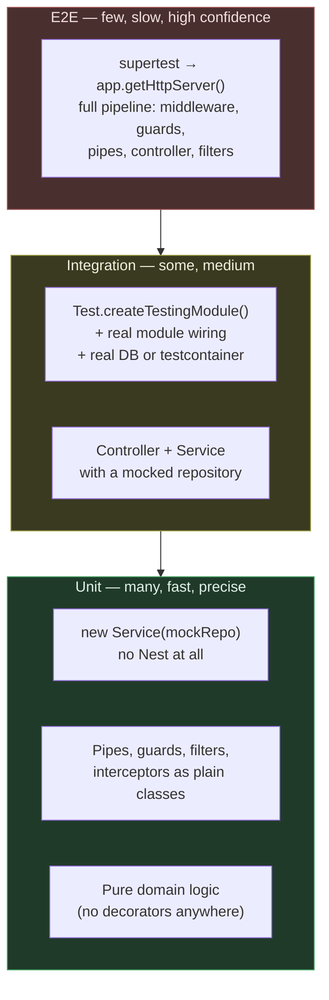

# Chapter 31 — Testing: Unit, Integration, and End-to-End

> **한눈에 보기**
> Nest는 테스트를 위해 DI 컨테이너 전체를 테스트 환경에 노출합니다. 이 장은
> CLI가 만들어 주는 Jest 설정에서 시작해, Nest를 전혀 쓰지 않는 순수 단위 테스트,
> `Test.createTestingModule()`의 모든 override API, `get`과 `resolve`의 차이,
> `useMocker`·`@golevelup/ts-jest`·Suites를 이용한 자동 모킹, 그리고 `supertest`
> 기반 e2e 테스트까지 다룹니다. 마지막으로 거의 모든 프로젝트에 존재하는 버그 하나를
> 짚습니다 — **e2e 테스트에는 전역 파이프가 없어서, 운영에서는 막히는 요청이 테스트에서는
> 통과합니다.** 7장의 DI와 14장의 CRUD 앱이 여기서 검증 가능해집니다.

**What you will learn**

- Where each kind of test belongs in a Nest application, and why the "unit" layer of the pyramid should mostly contain tests that never import `@nestjs/testing` at all.
- Exactly what `Test.createTestingModule().compile()` does — and the one thing it does *not* do, which is create an HTTP adapter.
- Every override on `TestingModuleBuilder`: `overrideProvider`, `overrideGuard`, `overrideInterceptor`, `overrideFilter`, `overridePipe`, `overrideModule`, plus `useMocker` and `setLogger`.
- Why globally registered `APP_GUARD` enhancers cannot be overridden as written, and the one-word change that makes them overridable.
- The difference between `module.get()` and `module.resolve()`, why request-scoped providers require the latter, and how `ContextIdFactory.getByRequest` lets you reach into a request's DI sub-tree.
- How to write e2e tests with `supertest` and `app.getHttpServer()`, including the `beforeAll`/`afterAll` lifecycle that stops your test suite from hanging.
- The global-pipes gap: a whole class of bugs where validation works in production and is entirely absent from your tests.
- When Suites' `TestBed.solitary()` / `.sociable()` beats both hand-written mocks and `Test.createTestingModule()`.

**Why this matters**

Consider a `POST /users` handler with a DTO that has `@IsEmail()` on it. The e2e test posts `{ "email": "not-an-email" }` and asserts a `400`. It fails — the test gets a `201`. The developer investigates, finds that validation "does not work in tests", and adds `.expect(201)` with a `// TODO` comment. Six months later, a malformed email reaches the database.

Validation *did* work in production. `app.useGlobalPipes(new ValidationPipe())` lives in `main.ts`, and `main.ts` is never executed by any test — the testing module builds the app from `AppModule` and calls `app.init()` directly. Every global setting in `main.ts` — pipes, filters, interceptors, versioning, CORS, `enableShutdownHooks`, prefix — is absent from your e2e suite unless you re-apply it by hand. Almost every Nest codebase has this gap, and it makes the e2e suite test an application that does not exist.

The second reason this chapter matters is inverted. Teams reach for `Test.createTestingModule()` for *everything*, including a service whose only dependency is a repository. That test now boots a DI container, resolves a module graph, and runs the whole `onModuleInit` lifecycle to verify a three-line method. It takes 400 ms instead of 2 ms, and — worse — it couples the test to the module wiring, so an unrelated change to `imports` breaks it. The Nest testing utilities are excellent and you should not use them most of the time. Knowing *when* to reach for the container is the actual skill.

Third: tests are the only place where the DI container becomes visible as a tool rather than as magic. `overrideProvider(Foo).useValue(bar)` works because a provider is a token-to-instance binding and nothing more ([Chapter 7](../part1-beginner/07-dependency-injection-basics.md)). If DI still feels like something that happens to your code, writing twenty tests will fix that faster than reading twenty pages.

---

## 1. The pyramid, mapped onto Nest

The testing pyramid is usually drawn abstractly. Here it is with Nest's actual layers on it.



The mapping is opinionated, so here is the reasoning.

**Unit tests need no framework.** A Nest service is a class with constructor parameters. `new CatsService(mockRepo)` is a complete, valid instantiation — the `@Injectable()` decorator is a metadata marker, not a requirement for construction. The same is true of guards, pipes, filters and interceptors: they are classes with one method. Test them by calling that method.

**Integration tests are where `@nestjs/testing` earns its place.** The question they answer is "is the wiring right?" — does this module actually provide what that module imports, does the custom provider factory return the right thing, does the interceptor stack compose. That question cannot be answered without the container.

**E2E tests answer "does an HTTP request produce the right HTTP response?"** They go through the whole pipeline, which is exactly why the missing-global-pipes gap in §9 is so damaging: it silently removes a pipeline stage from the only tests that were supposed to include it.

A rough target for a service-sized codebase: 70% unit, 20% integration, 10% e2e — by count, not by importance. Ten good e2e tests covering your critical paths are worth more than a hundred more unit tests.

---

## 2. What the CLI gives you

`nest new` writes a Jest configuration into `package.json`:

```json title="package.json"
{
  "scripts": {
    "test": "jest",
    "test:watch": "jest --watch",
    "test:cov": "jest --coverage",
    "test:debug": "node --inspect-brk -r tsconfig-paths/register -r ts-node/register node_modules/.bin/jest --runInBand",
    "test:e2e": "jest --config ./test/jest-e2e.json"
  },
  "jest": {
    "moduleFileExtensions": ["js", "json", "ts"],
    "rootDir": "src",
    "testRegex": ".*\\.spec\\.ts$",
    "transform": { "^.+\\.(t|j)s$": "ts-jest" },
    "collectCoverageFrom": ["**/*.(t|j)s"],
    "coverageDirectory": "../coverage",
    "testEnvironment": "node"
  }
}
```

Read that block closely, because two entries determine your whole file layout.

`rootDir: "src"` plus `testRegex: ".*\\.spec\\.ts$"` means `npm test` finds **only** `*.spec.ts` files **inside `src/`**. Anything in `test/` is invisible to it. That is the intended split: unit and integration specs live next to the code they test, e2e specs live in `test/`.

```text
src/
  cats/
    cats.service.ts
    cats.service.spec.ts        ← npm test
    cats.controller.ts
    cats.controller.spec.ts     ← npm test
test/
  cats.e2e-spec.ts              ← npm run test:e2e
  jest-e2e.json
```

The separate e2e config:

```json title="test/jest-e2e.json"
{
  "moduleFileExtensions": ["js", "json", "ts"],
  "rootDir": ".",
  "testEnvironment": "node",
  "testRegex": ".e2e-spec.ts$",
  "transform": { "^.+\\.(t|j)s$": "ts-jest" }
}
```

Install the testing package if it is not already there:

```bash
$ npm i --save-dev @nestjs/testing supertest @types/supertest
```

Three adjustments worth making immediately:

| Change | Why |
|---|---|
| Add `"maxWorkers": 1` or run `test:e2e` with `--runInBand` | E2E tests that share a database will corrupt each other under Jest's default parallelism. |
| Add `"forceExit": false` and fix hangs properly | `forceExit: true` hides unclosed handles. The correct fix is `await app.close()` (§8). |
| Exclude `main.ts`, `*.module.ts`, `*.dto.ts` from `collectCoverageFrom` | Otherwise coverage measures declaration files and your real number is meaningless. |

For large TypeScript codebases, replace `ts-jest` with `@swc/jest`. Type checking during tests is largely redundant when CI runs `tsc --noEmit` separately, and SWC transpilation typically cuts suite startup by 3–5×. See [Chapter 55](../part3-advanced/55-performance-and-compilation.md).

---

## 3. Unit tests with no Nest at all

Start here, because most of your tests belong here.

```typescript title="cats.service.ts"
import { Injectable, NotFoundException } from '@nestjs/common';
import { CatsRepository } from './cats.repository';
import { Cat } from './cat.entity';

@Injectable()
export class CatsService {
  constructor(private readonly repo: CatsRepository) {}

  async findOne(id: string): Promise<Cat> {
    const cat = await this.repo.findById(id);
    if (!cat) {
      throw new NotFoundException(`Cat ${id} not found`);
    }
    return cat;
  }

  async adopt(id: string, ownerId: string): Promise<Cat> {
    const cat = await this.findOne(id);
    if (cat.ownerId) {
      throw new ConflictException(`Cat ${id} is already adopted`);
    }
    return this.repo.update(id, { ownerId, adoptedAt: new Date() });
  }
}
```

```typescript title="cats.service.spec.ts"
import { ConflictException, NotFoundException } from '@nestjs/common';
import { CatsService } from './cats.service';
import { CatsRepository } from './cats.repository';

describe('CatsService', () => {
  let service: CatsService;
  let repo: jest.Mocked<Pick<CatsRepository, 'findById' | 'update'>>;

  beforeEach(() => {
    repo = { findById: jest.fn(), update: jest.fn() };
    service = new CatsService(repo as unknown as CatsRepository);
  });

  describe('findOne', () => {
    it('returns the cat when it exists', async () => {
      const cat = { id: '1', name: 'Mittens', ownerId: null };
      repo.findById.mockResolvedValue(cat);

      await expect(service.findOne('1')).resolves.toEqual(cat);
      expect(repo.findById).toHaveBeenCalledWith('1');
    });

    it('throws NotFoundException when it does not', async () => {
      repo.findById.mockResolvedValue(null);
      await expect(service.findOne('404')).rejects.toBeInstanceOf(NotFoundException);
    });
  });

  describe('adopt', () => {
    it('refuses to adopt an already-adopted cat', async () => {
      repo.findById.mockResolvedValue({ id: '1', name: 'Mittens', ownerId: 'u2' });

      await expect(service.adopt('1', 'u9')).rejects.toBeInstanceOf(ConflictException);
      expect(repo.update).not.toHaveBeenCalled();
    });
  });
});
```

No `@nestjs/testing` import. No `await compile()`. No module metadata. The test constructs the class the same way the container would and runs in single-digit milliseconds.

This is called **isolated testing** in the official docs, and the docs slightly undersell it by presenting it as the trivial starting point before "more advanced capabilities". It is not a stepping stone; it is the destination for most service and domain tests. Three concrete advantages:

**It fails for one reason.** If this test breaks, `CatsService` changed. It cannot break because someone added an import to `CatsModule`.

**It documents the real contract.** The `Pick<CatsRepository, 'findById' | 'update'>` type is a written statement that this service uses exactly two repository methods. When it grows to eight, the type change appears in the diff.

**It is fast enough to run on save.** A 2 ms test can run in watch mode on every keystroke. A 400 ms test cannot, so it runs in CI, so you find out about failures twenty minutes later.

Guards, pipes, interceptors and filters are the same story — plain classes with one method:

```typescript title="roles.guard.spec.ts"
import { ExecutionContext } from '@nestjs/common';
import { Reflector } from '@nestjs/core';
import { RolesGuard } from './roles.guard';

const contextWith = (user: unknown, handler = () => undefined): ExecutionContext =>
  ({
    switchToHttp: () => ({ getRequest: () => ({ user }) }),
    getHandler: () => handler,
    getClass: () => class {},
  }) as unknown as ExecutionContext;

describe('RolesGuard', () => {
  it('allows a request whose user has the required role', () => {
    const reflector = { getAllAndOverride: jest.fn().mockReturnValue(['admin']) };
    const guard = new RolesGuard(reflector as unknown as Reflector);

    expect(guard.canActivate(contextWith({ roles: ['admin'] }))).toBe(true);
  });

  it('denies a request whose user does not', () => {
    const reflector = { getAllAndOverride: jest.fn().mockReturnValue(['admin']) };
    const guard = new RolesGuard(reflector as unknown as Reflector);

    expect(guard.canActivate(contextWith({ roles: ['user'] }))).toBe(false);
  });
});
```

The `contextWith` helper is worth extracting into a shared test utility. `ExecutionContext` is a wide interface, but any given guard touches two or three of its methods, and a hand-rolled partial cast is clearer than a full mock.

---

## 4. `Test.createTestingModule()`

When you do need the container, this is the entry point.

```typescript title="cats.controller.spec.ts"
import { Test, TestingModule } from '@nestjs/testing';
import { CatsController } from './cats.controller';
import { CatsService } from './cats.service';
import { CatsRepository } from './cats.repository';

describe('CatsController', () => {
  let moduleRef: TestingModule;
  let controller: CatsController;
  let service: CatsService;

  beforeEach(async () => {
    moduleRef = await Test.createTestingModule({
      controllers: [CatsController],
      providers: [
        CatsService,
        { provide: CatsRepository, useValue: { findById: jest.fn(), findAll: jest.fn() } },
      ],
    }).compile();

    controller = moduleRef.get(CatsController);
    service = moduleRef.get(CatsService);
  });

  afterEach(async () => {
    await moduleRef.close();
  });

  it('delegates findAll to the service', async () => {
    const result = [{ id: '1', name: 'Mittens' }];
    jest.spyOn(service, 'findAll').mockResolvedValue(result);

    await expect(controller.findAll()).resolves.toBe(result);
  });
});
```

`createTestingModule()` takes the same metadata object as `@Module()` — `imports`, `controllers`, `providers`, `exports`. `compile()` is asynchronous and must be awaited; it builds the injector, instantiates every provider, and runs `onModuleInit` hooks, exactly as `NestFactory.create()` would.

One thing `compile()` deliberately does *not* do: **create an HTTP adapter**. There is no server, no Express instance, and `HttpAdapterHost#httpAdapter` is `undefined`. If a provider's constructor or `onModuleInit` reads the adapter, it will fail in a compiled testing module. Either use `createNestApplication()` (§8) or refactor the provider to look up the adapter lazily.

`moduleRef.close()` in `afterEach` shuts down the module and runs `onModuleDestroy`. Skip it and any provider holding a timer, a database pool, or a socket keeps the Node process alive; Jest reports "a worker process has failed to exit gracefully" and someone eventually "fixes" it with `forceExit`.

### The compiled module's API

| Method | Returns | Use for |
|---|---|---|
| `get(token)` | The **static** instance bound to the token | Everything default-scoped |
| `resolve(token, contextId?)` | A **new** scoped instance (`Promise`) | `Scope.REQUEST` / `Scope.TRANSIENT` providers |
| `select(Module)` | A module-scoped reference | Reaching into a specific module under `strict: true` |
| `createNestApplication(adapter?)` | `INestApplication` | E2E tests; needs `await app.init()` |
| `createNestMicroservice(opts)` | `INestMicroservice` | Testing message handlers over a transport |
| `close()` | `Promise<void>` | Teardown |

`TestingModule` extends `ModuleRef` ([Chapter 41](../part3-advanced/41-module-ref-discovery-lazy.md)), which is where `get`, `resolve` and `select` come from.

---

## 5. Overrides

Everything before `.compile()` is the `TestingModuleBuilder`, and it exposes a fluent override API. This is the mechanism that makes Nest testable: because a provider is only a token-to-instance binding, replacing one is a single call.

```typescript
const moduleRef = await Test.createTestingModule({ imports: [AppModule] })
  .overrideProvider(CatsRepository).useValue(fakeRepo)
  .overrideProvider(MailService).useClass(NoopMailService)
  .overrideProvider(CLOCK).useFactory({ factory: () => () => new Date('2026-01-01') })
  .overrideGuard(JwtAuthGuard).useValue({ canActivate: () => true })
  .overrideInterceptor(MetricsInterceptor).useValue({ intercept: (_, n) => n.handle() })
  .overrideFilter(SentryFilter).useClass(NoopFilter)
  .overridePipe(ValidationPipe).useValue({ transform: (v) => v })
  .overrideModule(PaymentsModule).useModule(FakePaymentsModule)
  .setLogger(new SilentLogger())
  .compile();
```

| Override | Targets | Terminal methods |
|---|---|---|
| `overrideProvider(token)` | Any provider, including custom tokens | `useValue`, `useClass`, `useFactory` |
| `overrideGuard(Class)` | Guards bound with `@UseGuards` | same three |
| `overrideInterceptor(Class)` | Interceptors bound with `@UseInterceptors` | same three |
| `overrideFilter(Class)` | Filters bound with `@UseFilters` | same three |
| `overridePipe(Class)` | Pipes bound with `@UsePipes` | same three |
| `overrideModule(Module)` | A whole module in the import graph | `useModule(OtherModule)` |

Each returns the builder, so calls chain; `compile()` terminates the chain.

`setLogger()` replaces the logger used while the testing module boots. By default only `error` level is printed, which is usually right; pass a silent logger when even that is noise, or a capturing logger when you want to assert on log output.

### Which terminal method to use

`useValue` for a hand-built object literal — the most common, the most explicit, the one to reach for. `useClass` when the replacement is a real class with its own dependencies that Nest should inject (a `NoopMailService`, an `InMemoryRepository`). `useFactory` when construction needs a computed value; note its distinct shape — `.useFactory({ factory, inject })`, an object, not a bare function.

### The `APP_GUARD` problem

This is the override that does not work, and the reason is worth understanding because it generalises.

```typescript title="app.module.ts — NOT overridable"
providers: [{ provide: APP_GUARD, useClass: JwtAuthGuard }],
```

`APP_GUARD` is a *multi-provider* token. Nest collects every binding under it and applies them all globally. `JwtAuthGuard` is never registered as a provider in its own right — it exists only as the `useClass` value behind `APP_GUARD`. So `.overrideGuard(JwtAuthGuard)` finds nothing to override, silently succeeds, and your e2e tests all get 401.

The fix is one word:

```typescript title="app.module.ts — overridable"
providers: [
  JwtAuthGuard,                                       // a real provider
  { provide: APP_GUARD, useExisting: JwtAuthGuard },  // useExisting, not useClass
],
```

Now `JwtAuthGuard` is a token the container knows about, and `APP_GUARD` points at it. Overriding the provider replaces what the global slot resolves to:

```typescript
const moduleRef = await Test.createTestingModule({ imports: [AppModule] })
  .overrideProvider(JwtAuthGuard)
  .useClass(MockAuthGuard)
  .compile();
```

Do this for every global enhancer in your application, on day one. It costs nothing in production — `useExisting` resolves to the same singleton — and it is the difference between an e2e suite you can write and one you cannot.

> **Hint** — This pattern also lets you inject dependencies into the guard normally and inspect the *real* instance in a test via `moduleRef.get(JwtAuthGuard)`, which `useClass` behind `APP_GUARD` does not allow.

---

## 6. `get` vs `resolve`, and request-scoped providers

`get()` returns the singleton bound to a token. If the provider is `Scope.REQUEST` or `Scope.TRANSIENT`, there is no singleton, and `get()` throws.

```typescript
// Scope.DEFAULT — one instance for the application lifetime.
const service = moduleRef.get(CatsService);

// Scope.REQUEST or Scope.TRANSIENT — a new instance per DI sub-tree.
const scoped = await moduleRef.resolve(ScopedCatsService);
```

`resolve()` is asynchronous and, critically, **returns a different instance on every call**. Each call creates its own DI container sub-tree with a fresh context identifier, so this assertion fails:

```typescript
const a = await moduleRef.resolve(ScopedCatsService);
const b = await moduleRef.resolve(ScopedCatsService);
expect(a).toBe(b);   // ✗ different sub-trees, different instances
```

To get the same instance twice, pass the same context id:

```typescript
import { ContextIdFactory } from '@nestjs/core';

const contextId = ContextIdFactory.create();
const a = await moduleRef.resolve(ScopedCatsService, contextId);
const b = await moduleRef.resolve(ScopedCatsService, contextId);
expect(a).toBe(b);   // ✓ same sub-tree
```

### Reaching into a real request's sub-tree

Here is the harder problem. A request-scoped provider is created per incoming request and garbage collected afterwards. In an e2e test you fire a request through supertest and then want to assert on the instance that handled it — but you have no handle on its sub-tree, because the sub-tree was created inside the framework.

The strategy from the docs: create a context id yourself and force Nest to use *that* id for every incoming request, by stubbing the factory method Nest calls.

```typescript title="scoped.e2e-spec.ts"
import { ContextIdFactory } from '@nestjs/core';
import { Test } from '@nestjs/testing';
import * as request from 'supertest';

describe('Request-scoped CatsService', () => {
  let app: INestApplication;
  let moduleRef: TestingModule;
  const contextId = ContextIdFactory.create();

  beforeAll(async () => {
    jest.spyOn(ContextIdFactory, 'getByRequest').mockImplementation(() => contextId);

    moduleRef = await Test.createTestingModule({ imports: [AppModule] }).compile();
    app = moduleRef.createNestApplication();
    await app.init();
  });

  it('records the tenant on the request-scoped service', async () => {
    await request(app.getHttpServer())
      .get('/cats')
      .set('x-tenant-id', 't-42')
      .expect(200);

    // Same contextId the request used → the very instance that handled it.
    const service = await moduleRef.resolve(CatsService, contextId);
    expect(service.tenantId).toBe('t-42');
  });

  afterAll(async () => {
    jest.restoreAllMocks();
    await app.close();
  });
});
```

Two caveats the docs do not spell out. The stub makes **all** requests in that file share one sub-tree, so a test asserting on request isolation cannot use this technique. And `jest.restoreAllMocks()` in `afterAll` is not optional — a leaked spy on a static factory affects every subsequent test file in the same worker.

Most of the time you should not need this. Request-scoped providers are a performance cost and a testing cost ([Chapter 38](../part3-advanced/38-injection-scopes.md)); `AsyncLocalStorage` ([Chapter 43](../part3-advanced/43-async-local-storage.md)) usually delivers request context without either.

---

## 7. Auto-mocking

A service with eight dependencies needs eight mocks, and writing them by hand is both tedious and fragile — add a ninth constructor parameter and every spec file breaks with `Nest can't resolve dependencies`.

### `useMocker`

`useMocker` takes a factory called for each dependency the testing module cannot resolve. It receives the token and returns a mock.

```typescript title="cats.controller.spec.ts"
import { Test } from '@nestjs/testing';
import { ModuleMocker, MockMetadata } from 'jest-mock';
import { CatsController } from './cats.controller';
import { CatsService } from './cats.service';

const moduleMocker = new ModuleMocker(global);

describe('CatsController', () => {
  let controller: CatsController;

  beforeEach(async () => {
    const moduleRef = await Test.createTestingModule({
      controllers: [CatsController],
    })
      .useMocker((token) => {
        // A specific mock for one dependency...
        if (token === CatsService) {
          return { findAll: jest.fn().mockResolvedValue(['test1', 'test2']) };
        }
        // ...and an auto-generated mock for everything else that is a class.
        if (typeof token === 'function') {
          const metadata = moduleMocker.getMetadata(token) as MockMetadata<any, any>;
          const Mock = moduleMocker.generateFromMetadata(metadata) as ObjectConstructor;
          return new Mock();
        }
      })
      .compile();

    controller = moduleRef.get(CatsController);
  });

  it('returns what the service returns', async () => {
    await expect(controller.findAll()).resolves.toEqual(['test1', 'test2']);
  });
});
```

Note that `providers` is empty — `CatsService` is never registered, and `useMocker` supplies it. Retrieve the generated mocks with `moduleRef.get(CatsService)` like any provider, then assert on their calls.

Two tokens cannot be auto-mocked: `REQUEST` and `INQUIRER`. Nest pre-defines them in the context. Replace them with the custom-provider syntax or `.overrideProvider()` instead.

### `@golevelup/ts-jest`

`createMock` produces a deeply-typed mock of an entire interface, auto-stubbing every method including nested ones. It can be passed straight to `useMocker`:

```typescript
import { createMock } from '@golevelup/ts-jest';

.useMocker(() => createMock())
```

It is also the fastest way to fake a wide framework interface in a plain unit test:

```typescript
import { createMock } from '@golevelup/ts-jest';
import { ExecutionContext } from '@nestjs/common';

const context = createMock<ExecutionContext>({
  switchToHttp: () => ({ getRequest: () => ({ user: { roles: ['admin'] } }) }),
});
```

That replaces the hand-rolled `contextWith` helper from §3 with something type-checked. For `ExecutionContext`, `CallHandler` and `ArgumentsHost`, `createMock` is the author's recommendation.

---

## 8. Suites: solitary and sociable tests

[Suites](https://suites.dev) (formerly Automock) takes auto-mocking further: it reads the DI metadata a Nest class already carries and generates a fully typed mock for **every** constructor dependency, with no container and no module metadata.

```bash
$ npm install --save-dev @suites/unit @suites/di.nestjs @suites/doubles.jest
```

The doubles adapter wraps your test framework's mocking primitives; swap `@suites/doubles.vitest` or `@suites/doubles.sinon` for the equivalents. Add a type reference at the project root:

```typescript title="global.d.ts"
/// <reference types="@suites/doubles.jest/unit" />
/// <reference types="@suites/di.nestjs/types" />
```

Suites needs `"emitDecoratorMetadata": true` in `tsconfig.json` — the Nest default — because that is where the constructor parameter types it reflects on come from.

### Solitary: everything mocked

```typescript title="user.service.spec.ts"
import { TestBed, type Mocked } from '@suites/unit';
import { Logger } from '@nestjs/common';
import { UserService } from './user.service';
import { UserRepository } from './user.repository';

describe('UserService (solitary)', () => {
  let userService: UserService;
  let repository: Mocked<UserRepository>;
  let logger: Mocked<Logger>;

  beforeAll(async () => {
    const { unit, unitRef } = await TestBed.solitary(UserService).compile();

    userService = unit;
    repository = unitRef.get(UserRepository);
    logger = unitRef.get(Logger);
  });

  it('finds a user by id and logs it', async () => {
    const user = { id: '1', email: 'test@example.com', name: 'Test' };
    repository.findById.mockResolvedValue(user);

    await expect(userService.findById('1')).resolves.toEqual(user);
    expect(logger.log).toHaveBeenCalled();
  });
});
```

`TestBed.solitary(UserService)` analyses the constructor and builds typed mocks for both dependencies. `unit` is the real instance under test; `unitRef` is the registry of its mocked collaborators. `Mocked<UserRepository>` gives full IntelliSense on `findById.mockResolvedValue` — the argument and return types are checked, which hand-written `jest.fn()` mocks do not give you.

### Pre-configuring a mock

```typescript
const { unit, unitRef } = await TestBed.solitary(UserService)
  .mock(UserRepository)
  .impl((stubFn) => ({
    findById: stubFn().mockResolvedValue({ id: '1', email: 'test@example.com', name: 'Test' }),
  }))
  .compile();
```

`stubFn` is the adapter's stub factory — `jest.fn()`, `vi.fn()`, or `sinon.stub()` depending on which doubles package you installed. Use `.mock().impl()` when the behaviour is needed during construction or in `beforeAll`; otherwise configure the mock inside the test where the arrangement is visible.

### Sociable: selected real implementations

```typescript
const { unit, unitRef } = await TestBed.sociable(UserService)
  .expose(Logger)
  .compile();
```

`.expose(Logger)` instantiates the real `Logger`; everything else stays mocked. This is the useful middle ground the classic pyramid has no name for: a test that exercises a small cluster of collaborating classes without booting a module. Use it when a dependency is pure logic (a policy object, a formatter, a domain calculator) whose behaviour you want to include rather than fake.

### Token-based dependencies

Suites resolves `@Inject(TOKEN)` parameters too:

```typescript
const { unit, unitRef } = await TestBed.solitary(ConfigService).compile();
const options = unitRef.get<ConfigOptions>(CONFIG_OPTIONS);
```

### Direct doubles

Without `TestBed` at all, the doubles adapter exports typed `mock()` and `stub()`:

```typescript
import { mock } from '@suites/unit';

const repository = mock<UserRepository>();
const logger = mock<Logger>();
const service = new UserService(repository, logger);
```

This is the §3 pattern with types, and it is an alternative to `createMock` from `@golevelup/ts-jest`.

### When Suites beats the alternatives

| Situation | Reach for |
|---|---|
| 1–3 dependencies, behaviour is the point | `new Service(mock)` by hand |
| 5+ dependencies, constructor changes often | `TestBed.solitary()` |
| You want a real collaborator or two | `TestBed.sociable().expose()` |
| Verifying module wiring, imports, exports | `Test.createTestingModule()` |
| Testing guards/interceptors/pipes *in a pipeline* | `Test.createTestingModule()` + e2e |
| Full HTTP behaviour | `createNestApplication()` + supertest |

The dividing line: **Suites tests a class, `Test.createTestingModule()` tests a configuration.** If your assertion mentions a module, an import, or a decorator, you need the container. If it mentions only a method's behaviour, you do not.

---

## 9. End-to-end tests

```typescript title="test/cats.e2e-spec.ts"
import * as request from 'supertest';
import { Test, TestingModule } from '@nestjs/testing';
import { INestApplication } from '@nestjs/common';
import { CatsModule } from '../src/cats/cats.module';
import { CatsService } from '../src/cats/cats.service';

describe('Cats (e2e)', () => {
  let app: INestApplication;
  const catsService = { findAll: () => ['test'] };

  beforeAll(async () => {
    const moduleRef: TestingModule = await Test.createTestingModule({
      imports: [CatsModule],
    })
      .overrideProvider(CatsService)
      .useValue(catsService)
      .compile();

    app = moduleRef.createNestApplication();
    await app.init();
  });

  it('GET /cats', () => {
    return request(app.getHttpServer())
      .get('/cats')
      .expect(200)
      .expect({ data: catsService.findAll() });
  });

  afterAll(async () => {
    await app.close();
  });
});
```

`createNestApplication()` builds a real `INestApplication` with a real HTTP adapter — this is the difference from `compile()` alone. `await app.init()` is mandatory; without it routes are not registered and every request 404s.

`app.getHttpServer()` returns the underlying Node HTTP server. supertest binds to it on an ephemeral port, issues a genuine HTTP request, and the request travels the entire pipeline: middleware, guards, interceptors, pipes, the handler, then interceptors and filters on the way out.

**`await app.close()` in `afterAll` is not optional.** It closes the server, drains the DI container, and runs shutdown hooks. Without it, Jest keeps the worker alive on an open handle and you get the "did not exit one second after test run completed" warning. Reaching for `--forceExit` at that point papers over a leak that is also present in your production shutdown path.

Use `beforeAll`/`afterAll` rather than `beforeEach`/`afterEach` for the app. Booting a Nest application takes 200 ms to several seconds; doing it per test turns a 5-second suite into a 5-minute one. Reset *state* per test (truncate tables, `jest.clearAllMocks()`), not the application.

### Fastify

```typescript
import { FastifyAdapter, NestFastifyApplication } from '@nestjs/platform-fastify';

let app: NestFastifyApplication;

beforeAll(async () => {
  app = moduleRef.createNestApplication<NestFastifyApplication>(new FastifyAdapter());
  await app.init();
  await app.getHttpAdapter().getInstance().ready();   // Fastify-specific
});

it('GET /cats', () =>
  app
    .inject({ method: 'GET', url: '/cats' })
    .then((result) => {
      expect(result.statusCode).toEqual(200);
      expect(JSON.parse(result.payload)).toEqual({ data: ['test'] });
    }));
```

Fastify needs the extra `.ready()` await, and `app.inject()` — Fastify's built-in light-my-request injector — replaces supertest. It skips the network stack entirely and is measurably faster.

### The global-pipes gap

This is the bug promised at the top of the chapter, and it is present in most Nest repositories.

```typescript title="main.ts"
async function bootstrap() {
  const app = await NestFactory.create(AppModule);
  app.useGlobalPipes(new ValidationPipe({ whitelist: true, transform: true }));
  app.useGlobalFilters(new AllExceptionsFilter());
  app.setGlobalPrefix('api');
  app.enableVersioning({ type: VersioningType.URI });
  await app.listen(3000);
}
```

`bootstrap()` is never called by any test. `createNestApplication()` gives you an app with **none** of those five settings. Consequences:

- `@IsEmail()` on a DTO is not enforced → an e2e test asserting `400` gets `201`, and the developer concludes validation is untestable.
- `whitelist: true` does not strip unknown properties → mass-assignment vulnerabilities pass your tests.
- `transform: true` does not run → a `@Param('id') id: number` arrives as the string `"42"`, and a test comparing against `42` fails for reasons that look like a framework bug.
- Your global exception filter is absent → error-shape assertions test Nest's default filter, not yours.
- The global prefix is absent → `/cats` works in tests and `/api/cats` in production. Somebody eventually "fixes" the test by removing the prefix from the client.

The fix is to extract bootstrap configuration into a function both `main.ts` and the tests call:

```typescript title="src/setup-app.ts"
import { INestApplication, ValidationPipe, VersioningType } from '@nestjs/common';
import { AllExceptionsFilter } from './common/all-exceptions.filter';

export function setupApp(app: INestApplication): INestApplication {
  app.useGlobalPipes(new ValidationPipe({ whitelist: true, transform: true }));
  app.useGlobalFilters(new AllExceptionsFilter());
  app.setGlobalPrefix('api');
  app.enableVersioning({ type: VersioningType.URI });
  return app;
}
```

```typescript title="main.ts"
const app = await NestFactory.create(AppModule);
setupApp(app);
await app.listen(3000);
```

```typescript title="test/cats.e2e-spec.ts"
app = moduleRef.createNestApplication();
setupApp(app);              // ← the one line that closes the gap
await app.init();
```

Do this in every project. It takes five minutes and it makes your e2e suite test the application you actually deploy. A useful review rule: **anything in `main.ts` after `NestFactory.create` and before `listen` belongs in `setupApp`.**

---

## 10. Real database or mocked repository?

The most consequential decision in your integration tier.

| | Mocked repository | In-memory (SQLite/mongodb-memory-server) | Testcontainers (real engine) |
|---|---|---|---|
| Speed | ~1 ms | ~10 ms | ~50 ms + 5–30 s startup |
| Catches SQL/query errors | No | Partly | Yes |
| Catches migration errors | No | No | Yes |
| Catches constraint/FK violations | No | Partly | Yes |
| Dialect-specific SQL, JSONB, CTEs | No | No | Yes |
| Transaction & isolation behaviour | No | Poorly | Yes |
| CI requirements | none | none | Docker |
| Setup cost | low | medium | medium-high |
| Fails for the right reason | Often not | Sometimes | Yes |

The author's recommendation, in three lines:

**Mock the repository in unit tests.** You are testing branching logic, not SQL.

**Use testcontainers for repository and e2e tests.** The queries your ORM generates are code, they can be wrong, and only the real engine tells you. An in-memory SQLite standing in for Postgres will happily accept SQL that Postgres rejects and reject SQL that Postgres accepts — you get a test suite that is green and a deploy that is not.

**Avoid the in-memory substitute** except where the engine really is the same one you run in production (SQLite in production → SQLite in tests is fine).

```typescript title="test/db.ts"
import { PostgreSqlContainer, StartedPostgreSqlContainer } from '@testcontainers/postgresql';

let container: StartedPostgreSqlContainer;

export async function startDatabase(): Promise<string> {
  container = await new PostgreSqlContainer('postgres:16-alpine').start();
  return container.getConnectionUri();
}

export async function stopDatabase(): Promise<void> {
  await container?.stop();
}
```

```typescript title="test/cats.e2e-spec.ts"
beforeAll(async () => {
  const url = await startDatabase();
  const moduleRef = await Test.createTestingModule({ imports: [AppModule] })
    .overrideProvider(DATABASE_URL)
    .useValue(url)
    .compile();

  app = setupApp(moduleRef.createNestApplication());
  await app.init();
  await runMigrations(url);          // migrations are code too — test them
}, 60_000);                          // container startup needs a longer timeout

afterAll(async () => {
  await app.close();
  await stopDatabase();
});
```

Two practical notes. Start **one** container per test file, not per test, and isolate tests by truncating tables in `beforeEach` or wrapping each test in a rolled-back transaction. And pass an explicit Jest timeout to `beforeAll` — the default 5 seconds is not enough to pull and boot an image, and the resulting failure looks like a hang rather than a timeout.

---

## 11. Common mistakes

1. **E2E tests that do not apply `main.ts` configuration.** *Symptom:* validation, the global prefix, or a global filter behave differently in tests than in production; tests pass on code that 400s in the real world (or vice versa). *Cause:* `createNestApplication()` does not run `bootstrap()`. *Fix:* the shared `setupApp(app)` function from §9.

2. **No `await app.close()` / `moduleRef.close()`.** *Symptom:* "Jest did not exit one second after the test run completed", or CI jobs that hang until the runner kills them. *Cause:* open database pools, timers, or sockets held by providers. *Fix:* close in `afterAll`; use `--detectOpenHandles` to find the culprit; never `--forceExit`.

3. **`overrideGuard(JwtAuthGuard)` on an `APP_GUARD`-registered guard.** *Symptom:* the override is silently ignored, every e2e request returns 401. *Cause:* `useClass` behind `APP_GUARD` never registers the guard as its own provider. *Fix:* register `JwtAuthGuard` as a provider and use `useExisting` (§5).

4. **`module.get()` on a request-scoped provider.** *Symptom:* `Error: ... is marked as a scoped provider. Request and transient-scoped providers can't be used in combination with "get()"`. *Cause:* there is no singleton to return. *Fix:* `await module.resolve(Token)`, with a shared `contextId` if you need instance identity.

5. **Booting the application in `beforeEach`.** *Symptom:* a suite that takes minutes and times out in CI. *Cause:* a full Nest bootstrap per test. *Fix:* `beforeAll` for the app, `beforeEach` for state reset.

6. **Asserting on mock call counts instead of behaviour.** *Symptom:* tests break on every refactor while real bugs ship. *Cause:* `expect(repo.save).toHaveBeenCalledTimes(1)` tests the implementation, not the contract. *Fix:* assert on the returned value and on state; keep call assertions for genuine side effects (an email sent, an event published).

7. **Shared mutable state across test files.** *Symptom:* tests pass alone, fail together, and the failing test changes between runs. *Cause:* one database shared by parallel Jest workers, or a module-level singleton. *Fix:* `--runInBand` for e2e, or a schema/database per worker keyed on `process.env.JEST_WORKER_ID`.

8. **A leaked `jest.spyOn` on a static.** *Symptom:* an unrelated test file fails only when the whole suite runs. *Cause:* `ContextIdFactory.getByRequest` (or similar) stubbed and never restored. *Fix:* `jest.restoreAllMocks()` in `afterAll`, and `restoreMocks: true` in the Jest config so it happens automatically.

9. **Chasing 100% coverage.** *Symptom:* tests for DTOs, module files, and getters; still no test for the payment flow. *Cause:* coverage as a target rather than a signal. *Fix:* exclude `*.module.ts`, `*.dto.ts` and `main.ts` from `collectCoverageFrom`, then read the report as a map of untested branches rather than a score.

---

## 12. Putting it together

One feature, tested at all three levels — the shape to copy into a real project.

```typescript title="src/cats/cats.service.spec.ts — unit, no framework"
import { ConflictException, NotFoundException } from '@nestjs/common';
import { createMock } from '@golevelup/ts-jest';
import { CatsService } from './cats.service';
import { CatsRepository } from './cats.repository';
import { EventsService } from '../events/events.service';

describe('CatsService (unit)', () => {
  const repo = createMock<CatsRepository>();
  const events = createMock<EventsService>();
  const service = new CatsService(repo, events);

  afterEach(() => jest.resetAllMocks());

  it('adopts an available cat and emits an event', async () => {
    repo.findById.mockResolvedValue({ id: '1', name: 'Mittens', ownerId: null });
    repo.update.mockImplementation(async (id, patch) => ({ id, name: 'Mittens', ...patch }));

    const result = await service.adopt('1', 'user-9');

    expect(result.ownerId).toBe('user-9');
    expect(events.emit).toHaveBeenCalledWith('cat.adopted', { catId: '1', ownerId: 'user-9' });
  });

  it('refuses an already-adopted cat and emits nothing', async () => {
    repo.findById.mockResolvedValue({ id: '1', name: 'Mittens', ownerId: 'user-2' });

    await expect(service.adopt('1', 'user-9')).rejects.toBeInstanceOf(ConflictException);
    expect(repo.update).not.toHaveBeenCalled();
    expect(events.emit).not.toHaveBeenCalled();
  });

  it('throws NotFoundException for an unknown cat', async () => {
    repo.findById.mockResolvedValue(null);
    await expect(service.adopt('404', 'user-9')).rejects.toBeInstanceOf(NotFoundException);
  });
});
```

```typescript title="src/cats/cats.controller.spec.ts — integration, container + auto-mocks"
import { Test } from '@nestjs/testing';
import { createMock } from '@golevelup/ts-jest';
import { CatsController } from './cats.controller';
import { CatsService } from './cats.service';

describe('CatsController (integration)', () => {
  let controller: CatsController;
  let service: jest.Mocked<CatsService>;

  beforeEach(async () => {
    const moduleRef = await Test.createTestingModule({ controllers: [CatsController] })
      .useMocker(() => createMock())
      .compile();

    controller = moduleRef.get(CatsController);
    service = moduleRef.get(CatsService);
  });

  it('passes the authenticated user id through to adopt()', async () => {
    service.adopt.mockResolvedValue({ id: '1', name: 'Mittens', ownerId: 'user-9' } as never);

    await controller.adopt('1', { id: 'user-9' } as never);

    expect(service.adopt).toHaveBeenCalledWith('1', 'user-9');
  });
});
```

```typescript title="test/cats.e2e-spec.ts — e2e, real pipeline, real database"
import * as request from 'supertest';
import { Test } from '@nestjs/testing';
import { INestApplication } from '@nestjs/common';
import { AppModule } from '../src/app.module';
import { setupApp } from '../src/setup-app';
import { JwtAuthGuard } from '../src/auth/jwt-auth.guard';
import { startDatabase, stopDatabase, truncateAll } from './db';

describe('Cats (e2e)', () => {
  let app: INestApplication;

  beforeAll(async () => {
    const url = await startDatabase();

    const moduleRef = await Test.createTestingModule({ imports: [AppModule] })
      .overrideProvider('DATABASE_URL')
      .useValue(url)
      // Works because AppModule registers JwtAuthGuard with useExisting (§5).
      .overrideProvider(JwtAuthGuard)
      .useValue({ canActivate: (ctx) => {
        ctx.switchToHttp().getRequest().user = { id: 'user-9', roles: ['user'] };
        return true;
      } })
      .compile();

    app = setupApp(moduleRef.createNestApplication());
    await app.init();
  }, 60_000);

  beforeEach(() => truncateAll());
  afterAll(async () => {
    await app.close();
    await stopDatabase();
  });

  it('rejects an invalid body with 400 (proves global pipes are active)', () =>
    request(app.getHttpServer())
      .post('/api/cats')
      .send({ name: '' })
      .expect(400)
      .expect((res) => {
        expect(res.body.message).toEqual(
          expect.arrayContaining([expect.stringContaining('name')]),
        );
      }));

  it('creates, then adopts, then refuses a second adoption', async () => {
    const created = await request(app.getHttpServer())
      .post('/api/cats')
      .send({ name: 'Mittens' })
      .expect(201);

    const id = created.body.id;

    await request(app.getHttpServer()).post(`/api/cats/${id}/adopt`).expect(201);
    await request(app.getHttpServer()).post(`/api/cats/${id}/adopt`).expect(409);
  });
});
```

The first e2e test is doing double duty: it verifies a validation rule *and* it is a regression test for the `setupApp` wiring. If someone removes that line, this test goes red immediately instead of six months later.

---

> **핵심 정리**
> - Nest 서비스는 그냥 클래스입니다. 대부분의 단위 테스트는 `new Service(mock)`으로 충분하며, `@nestjs/testing`을 import할 필요조차 없습니다.
> - `Test.createTestingModule()`은 "배선이 맞는가"를 검증할 때 쓰세요. 메서드 동작만 검증한다면 컨테이너는 비용일 뿐입니다.
> - `compile()`은 HTTP 어댑터를 만들지 않습니다. `HttpAdapterHost#httpAdapter`가 필요하면 `createNestApplication()`을 쓰세요.
> - `overrideProvider`·`overrideGuard`·`overrideInterceptor`·`overrideFilter`·`overridePipe`는 `useValue`/`useClass`/`useFactory`를, `overrideModule`은 `useModule`을 반환합니다.
> - `APP_GUARD`에 `useClass`로 등록한 가드는 override할 수 없습니다. 가드를 provider로 등록하고 `useExisting`을 쓰세요 — 프로젝트 시작 시점에 해두어야 할 일입니다.
> - `get()`은 싱글턴만, `resolve()`는 스코프 provider를 반환하며 호출마다 새 인스턴스입니다. 같은 인스턴스가 필요하면 같은 `contextId`를 넘기세요.
> - `ContextIdFactory.getByRequest`를 스텁하면 실제 요청이 만든 DI 서브트리에 접근할 수 있지만, `afterAll`에서 반드시 복원해야 합니다.
> - e2e 테스트는 `main.ts`를 실행하지 않습니다. 전역 파이프·필터·prefix·버저닝을 `setupApp(app)` 함수로 뽑아 양쪽에서 호출하세요. 이 한 줄이 가장 흔한 테스트 버그를 막습니다.
> - `await app.close()`를 빠뜨리면 Jest가 종료되지 않습니다. `--forceExit`는 해결이 아니라 은폐입니다.
> - Suites의 `TestBed.solitary()`/`.sociable()`은 의존성이 많은 클래스에서 손으로 쓴 mock보다 낫습니다. 타입이 붙은 mock이 자동 생성되고, 생성자가 바뀌어도 스펙이 깨지지 않습니다.
> - 리포지토리·e2e 테스트에는 testcontainers로 진짜 DB를 쓰세요. 인메모리 대체품은 실제 엔진이 거부하는 SQL을 통과시킵니다.

> **연습 문제**
> 1. 여러분의 프로젝트에서 `main.ts`의 `NestFactory.create`와 `listen` 사이에 있는 모든 설정을 `setupApp()` 함수로 추출하고, e2e 테스트에 적용하세요. 그 전후로 실패하는(또는 새로 통과하는) 테스트가 있다면 그것이 곧 이 장의 버그입니다.
> 2. `APP_GUARD`로 등록된 인증 가드를 `useExisting` 방식으로 바꾸고, e2e 테스트에서 가짜 사용자를 주입하는 `overrideProvider`를 작성하세요.
> 3. `Scope.REQUEST` provider를 하나 만들고, `module.get()`이 던지는 정확한 에러 메시지를 확인한 뒤 `resolve()`로 고치세요. 이어서 같은 `contextId`를 두 번 넘겼을 때와 넘기지 않았을 때 인스턴스 동일성이 어떻게 달라지는지 테스트로 증명하세요.
> 4. 의존성이 5개 이상인 서비스를 골라 (a) 손으로 쓴 mock, (b) `useMocker` + `createMock`, (c) `TestBed.solitary()` 세 가지 방식으로 같은 테스트를 작성하고 코드 길이와 생성자 변경 내성을 비교하세요.
> 5. testcontainers로 PostgreSQL을 띄우고, 마이그레이션을 실행한 뒤 리포지토리 테스트를 작성하세요. 각 테스트 사이의 격리는 어떤 방식으로 보장했으며, 왜 그 방식을 골랐습니까?
> 6. 직접 만들어 보기 — 커스텀 인터셉터 하나를 골라 두 개의 테스트를 작성하세요. 하나는 `intercept()`를 직접 호출하는 단위 테스트, 다른 하나는 실제 라우트를 통과시키는 e2e 테스트입니다. 두 테스트가 각각 잡을 수 있는 버그와 잡을 수 없는 버그를 정리하세요.

**Next:** [Chapter 32 — HTTP Client, Cookies, Sessions, and Compression](32-http-cookies-sessions.md) turns outward: making HTTP calls from inside a Nest service, and the request-state mechanisms — cookies and sessions — that your new e2e tests will need to drive.
