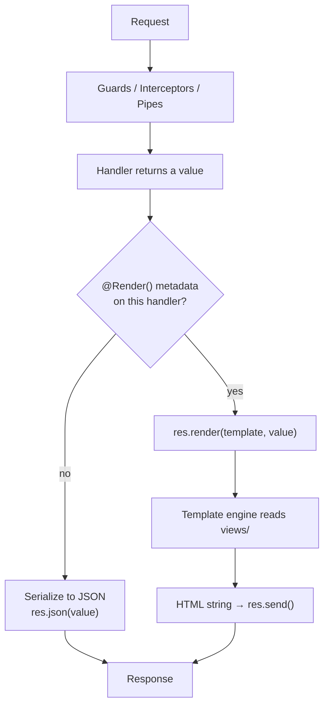
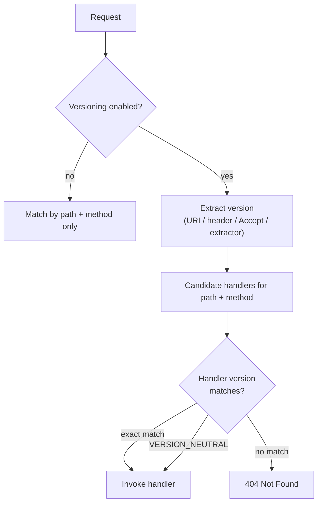

# Chapter 33 — Server-Side Rendering (MVC) and API Versioning

> **한눈에 보기**
> 이 장은 서로 달라 보이지만 하나의 질문을 공유하는 두 주제를 다룹니다. "핸들러의
> 반환값을 무엇으로 바꿀 것인가"와 "같은 경로를 어떤 규칙으로 여러 구현에 나눠 줄
> 것인가"입니다. 앞부분에서는 `@Render()`와 템플릿 엔진으로 JSON 대신 HTML을 내보내고,
> 뒷부분에서는 `enableVersioning()`의 네 가지 방식으로 v1과 v2를 한 프로세스 안에서 동시에
> 운영합니다. 4장에서 배운 응답 처리 방식이 두 경우 모두의 토대가 됩니다.

**What you will learn**

- What `setViewEngine()` actually changes inside the Express instance, and why an `@Render()` handler returns a plain object rather than a string.
- How to lay out `views/`, `public/`, partials, and layouts so that `hbs`, `ejs`, or `pug` all work without restructuring your controllers.
- How to render a 404 and a 500 page from an exception filter that still returns JSON to API clients on the same server.
- How to run the same MVC application on Fastify with `@fastify/view`, and the three concrete differences that will break a copy-pasted Express controller.
- How Nest's route matcher uses version metadata, and the exact semantics of all four `VersioningType` values including the `extractor` contract for `CUSTOM`.
- When to put `@Version()` on a method versus `version` on `@Controller()`, what `VERSION_NEUTRAL` means for each versioning type, and how versions compose with a global prefix and with middleware.
- A versioning *strategy*: when a breaking change actually justifies a new version, how to signal deprecation with `Deprecation` and `Sunset` headers, and how to retire a version without breaking clients.

**Why this matters**

Two decisions in this chapter are frequently made by accident and then paid for over years.

The first is server-side rendering. Nest can render HTML, and for admin panels, internal dashboards, OAuth consent screens, webhooks-with-a-UI, and transactional pages that must work without JavaScript, it is the right answer — one deployable, one auth model, no API-versus-page duplication. But teams also reach for `@Render()` because "we already have Nest" and end up building a single-page application out of Handlebars partials and jQuery, at which point every interaction is a full page reload and the codebase has two competing view layers. Knowing where the line is saves a rewrite.

The second is versioning. The moment a public API has a second consumer you do not control, "just change the field name" stops being an option. Teams that never planned for versioning end up with the worst possible outcome: `POST /orders` that behaves differently depending on an undocumented `X-Client` header, or a duplicated `orders-v2` module that copies 3,000 lines to change three of them. Nest's versioning support is small — one bootstrap call and one decorator — but it only pays off if you understand *what* deserves a version bump and *how* you retire the old one. A version you can never delete is not a version, it is technical debt with a number on it.

---

## 1. What server-side rendering means in Nest

Nest itself does not render anything. `setViewEngine()` is a pass-through to the underlying HTTP platform: on Express it calls `app.set('view engine', ...)` and `app.set('views', ...)` on the raw Express instance. What Nest contributes is the `@Render()` decorator and one branch in the response pipeline.



The important consequence: **an `@Render()` handler returns the template's data context, not the HTML.** The return value is a plain object whose keys become the template's variables. Everything else in the pipeline — guards, interceptors, pipes, exception filters — behaves exactly as it does for a JSON route. An interceptor that wraps responses in `{ data: ... }` will silently break your templates, because now every variable lives under `data`; that is a real bug and §6 shows how to scope such interceptors.

### Installing a template engine

```bash
npm i hbs        # Handlebars — the docs' default
# or
npm i ejs        # plain JS in templates
# or
npm i pug        # indentation-based, no closing tags
```

| Engine | Syntax feel | Logic in templates | Good fit |
|---|---|---|---|
| `hbs` (Handlebars) | `{{ value }}`, `{{#each}}` | Deliberately limited; you register helpers | Teams that want logic kept in controllers |
| `ejs` | `<%= value %>`, `<% for %>` | Full JavaScript | Quick internal pages; risk of logic creeping into views |
| `pug` | indentation, `h1= value` | Full, plus mixins | Terse markup; steep onboarding cost for HTML-fluent designers |

All three plug into the same three bootstrap calls. This chapter uses `hbs` because its escaping defaults are the safest and its partial/layout model maps cleanly onto both Express and Fastify.

---

## 2. Bootstrapping an Express MVC application

Three calls in `main.ts`, and one type parameter that makes them exist.

```typescript title="main.ts"
import { NestFactory } from '@nestjs/core';
import { NestExpressApplication } from '@nestjs/platform-express';
import { join } from 'node:path';
import { AppModule } from './app.module';

async function bootstrap() {
  const app = await NestFactory.create<NestExpressApplication>(AppModule);

  app.useStaticAssets(join(__dirname, '..', 'public'), { prefix: '/static/' });
  app.setBaseViewsDir(join(__dirname, '..', 'views'));
  app.setViewEngine('hbs');

  await app.listen(process.env.PORT ?? 3000);
}
bootstrap();
```

> **⚠️ Notice** — `NestFactory.create<NestExpressApplication>(...)` is not decorative. `useStaticAssets`, `setBaseViewsDir`, and `setViewEngine` exist only on `NestExpressApplication`; with the plain `INestApplication` type TypeScript rejects all three. This is the single most common first error.

What each call does:

| Call | Underlying effect | Notes |
|---|---|---|
| `app.useStaticAssets(path, options?)` | Mounts `express.static` | `options` are `serve-static` options: `prefix`, `maxAge`, `index`, `etag`, `immutable`, `fallthrough`. Chapter 28 covers static asset serving in depth. |
| `app.setBaseViewsDir(pathOrPaths)` | `app.set('views', ...)` | Accepts an **array** of directories; Express searches them in order. Useful when a shared library ships templates. |
| `app.setViewEngine(name)` | `app.set('view engine', name)` | The name is also the default file extension, so `@Render('index')` resolves `views/index.hbs`. |

The `join(__dirname, '..', 'public')` is not arbitrary. After `nest build`, `__dirname` is `dist/`, so `..` climbs back to the project root where `public/` and `views/` live. If you instead put templates inside `src/`, they will **not** be copied to `dist/` unless you tell the CLI:

```json title="nest-cli.json"
{
  "compilerOptions": {
    "assets": [{ "include": "views/**/*.hbs", "outDir": "dist" }],
    "watchAssets": true
  }
}
```

Both layouts work. Keeping `views/` at the project root and pointing `__dirname/..` at it is simpler and is what this chapter assumes.

### The project layout

```text
project/
├── public/
│   ├── css/site.css
│   └── js/app.js
├── views/
│   ├── layouts/main.hbs
│   ├── partials/header.hbs
│   ├── partials/flash.hbs
│   ├── errors/404.hbs
│   ├── errors/500.hbs
│   ├── cats/index.hbs
│   └── cats/detail.hbs
└── src/
    ├── main.ts
    └── cats/cats.controller.ts
```

---

## 3. `@Render()` and passing data

```typescript title="cats/cats.controller.ts"
import { Controller, Get, NotFoundException, Param, Render } from '@nestjs/common';
import { CatsService } from './cats.service';

@Controller('cats')
export class CatsController {
  constructor(private readonly catsService: CatsService) {}

  @Get()
  @Render('cats/index')
  async index() {
    const cats = await this.catsService.findAll();
    return {
      title: 'All cats',
      cats,
      count: cats.length,
      hasCats: cats.length > 0,
    };
  }

  @Get(':id')
  @Render('cats/detail')
  async detail(@Param('id') id: string) {
    const cat = await this.catsService.findOne(id);
    if (!cat) throw new NotFoundException(`Cat ${id} not found`);
    return { title: cat.name, cat };
  }
}
```

```html title="views/cats/index.hbs"
<h1>{{ title }}</h1>

{{#if hasCats}}
  <p>{{ count }} cats.</p>
  <ul>
    {{#each cats}}
      <li><a href="/cats/{{ this.id }}">{{ this.name }}</a> — {{ this.breed }}</li>
    {{/each}}
  </ul>
{{else}}
  <p>No cats yet.</p>
{{/if}}
```

Four things worth stating explicitly:

**The template path is relative to the views directory and omits the extension.** `@Render('cats/index')` resolves `views/cats/index.hbs`. Forward slashes work on Windows too — Express normalizes them.

**Async handlers work.** Nest awaits the returned promise before calling `res.render()`. There is no separate async API.

**Handlebars has no truthiness for expressions.** `{{#if cats.length}}` works in Handlebars but `{{#if count > 0}}` does not — Handlebars has no expression parser. Precompute booleans (`hasCats`) in the controller, or register a helper. This is the constraint that pushes logic back where it belongs.

**`{{ }}` escapes HTML; `{{{ }}}` does not.** Triple braces are how XSS enters a server-rendered Nest app. Use them only for content you generated yourself, never for anything derived from user input.

### Layouts and partials

`hbs` supports both, but you must register the partials directory yourself — Nest does not do it:

```typescript title="main.ts"
import * as hbs from 'hbs';

app.setBaseViewsDir(join(__dirname, '..', 'views'));
app.setViewEngine('hbs');

hbs.registerPartials(join(__dirname, '..', 'views', 'partials'));
hbs.registerHelper('formatDate', (value: Date) =>
  new Intl.DateTimeFormat('en-GB', { dateStyle: 'medium' }).format(value),
);
hbs.registerHelper('gt', (a: number, b: number) => a > b);
```

A partial is referenced with `>`:

```html title="views/partials/header.hbs"
<header>
  <a href="/">Home</a>
  <a href="/cats">Cats</a>
  {{#if user}}<span>{{ user.email }}</span>{{/if}}
</header>
```

```html title="views/cats/index.hbs"
{{> header }}
<h1>{{ title }}</h1>
```

A layout wraps a rendered view around `{{{ body }}}`:

```html title="views/layouts/main.hbs"
<!DOCTYPE html>
<html lang="en">
  <head>
    <meta charset="utf-8" />
    <title>{{ title }} · Cattery</title>
    <link rel="stylesheet" href="/static/css/site.css" />
  </head>
  <body>
    {{> header }}
    <main>{{{ body }}}</main>
  </body>
</html>
```

```typescript title="main.ts"
app.set('view options', { layout: 'layouts/main' });
```

`{{{ body }}}` uses triple braces deliberately — the inner view is already-escaped HTML and must not be escaped again. The equivalents in other engines: `ejs` composes with `<%- include('partials/header') %>`; `pug` uses `extends layouts/main` plus `block content`.

> **Hint** — Data that every page needs (the current user, a flash message, a nav highlight) does not belong in every controller's return object. Put it in `res.locals` from a middleware ([Chapter 8](../part1-beginner/08-middleware.md)) — template engines merge `res.locals` into the render context automatically.

```typescript title="common/view-context.middleware.ts"
import { Injectable, NestMiddleware } from '@nestjs/common';
import { NextFunction, Request, Response } from 'express';

@Injectable()
export class ViewContextMiddleware implements NestMiddleware {
  use(req: Request, res: Response, next: NextFunction) {
    res.locals.user = (req as any).user ?? null;
    res.locals.currentPath = req.path;
    res.locals.buildId = process.env.BUILD_ID ?? 'dev';
    next();
  }
}
```

---

## 4. Dynamic rendering with `@Res()`

`@Render('cats/index')` bakes the template name into metadata at class-definition time. When the template must be chosen at runtime — A/B tests, per-tenant themes, a wizard whose step decides the view — drop to the response object.

```typescript title="cats/cats.controller.ts"
import { Controller, Get, Query, Res } from '@nestjs/common';
import { Response } from 'express';
import { CatsService } from './cats.service';

@Controller('cats')
export class CatsController {
  constructor(private readonly catsService: CatsService) {}

  @Get('list')
  async list(@Query('view') view: string, @Res() res: Response) {
    const cats = await this.catsService.findAll();
    const template = view === 'grid' ? 'cats/grid' : 'cats/index';
    return res.render(template, { title: 'All cats', cats });
  }
}
```

Note the trade-off you just made. With a bare `@Res()`, Nest hands the response to you and stops managing it: interceptors that transform the body do nothing, and if you forget to call `res.render()` on some code path the request hangs until the client times out. Unlike the cookie case in Chapter 32, `passthrough: true` does **not** help here — passthrough means "Nest still sends the body", and you want to send it yourself. So use `@Res()` for rendering only when the template genuinely varies, and keep every branch terminated.

A middle path that keeps Nest in control is to make the *data* dynamic and the template fixed, choosing the layout inside the template instead:

```typescript
@Get('list')
@Render('cats/list')
async list(@Query('view') view: string) {
  return { cats: await this.catsService.findAll(), grid: view === 'grid' };
}
```

Prefer this when it is expressible. It keeps interceptors, filters, and testability intact.

---

## 5. Error pages: 404 and 500 from an exception filter

A rendered application that returns `{"statusCode":404,"message":"Not Found"}` as raw JSON in the browser is broken UX. The fix is an exception filter ([Chapter 9](../part1-beginner/09-exception-filters.md)) that renders — but only for clients that want HTML, so that an API route on the same server still gets JSON.

```typescript title="common/filters/view-exception.filter.ts"
import {
  ArgumentsHost,
  Catch,
  ExceptionFilter,
  HttpException,
  HttpStatus,
  Logger,
} from '@nestjs/common';
import { HttpAdapterHost } from '@nestjs/core';
import { Request, Response } from 'express';

@Catch()
export class ViewExceptionFilter implements ExceptionFilter {
  private readonly logger = new Logger(ViewExceptionFilter.name);

  constructor(private readonly adapterHost: HttpAdapterHost) {}

  catch(exception: unknown, host: ArgumentsHost): void {
    const ctx = host.switchToHttp();
    const req = ctx.getRequest<Request>();
    const res = ctx.getResponse<Response>();

    const status =
      exception instanceof HttpException
        ? exception.getStatus()
        : HttpStatus.INTERNAL_SERVER_ERROR;

    if (status >= 500) {
      this.logger.error(`${req.method} ${req.originalUrl}`, (exception as Error)?.stack);
    }

    // Content negotiation: HTML for browsers, JSON for API clients.
    const wantsHtml = req.accepts(['html', 'json']) === 'html';

    if (!wantsHtml) {
      const body =
        exception instanceof HttpException
          ? exception.getResponse()
          : { statusCode: status, message: 'Internal server error' };
      this.adapterHost.httpAdapter.reply(res, body, status);
      return;
    }

    const template = status === 404 ? 'errors/404' : 'errors/500';
    res.status(status).render(template, {
      title: status === 404 ? 'Page not found' : 'Something went wrong',
      status,
      path: req.originalUrl,
      // Never leak internals in production.
      detail:
        process.env.NODE_ENV !== 'production' && exception instanceof Error
          ? exception.message
          : undefined,
    });
  }
}
```

```typescript title="main.ts"
import { HttpAdapterHost } from '@nestjs/core';

app.useGlobalFilters(new ViewExceptionFilter(app.get(HttpAdapterHost)));
```

Three details that make this filter production-grade rather than a demo:

- **`@Catch()` with no argument** catches everything, including non-`HttpException` throws. Without that, an unexpected `TypeError` still produces the framework's JSON 500 in the browser.
- **`req.accepts(['html', 'json'])`** is the negotiation. A browser sends `Accept: text/html,...` and gets a page; `fetch` and curl send `*/*` or `application/json` and get JSON. This is what lets one server host `/cats` (HTML) and `/api/cats` (JSON).
- **Never render the stack trace in production.** The `NODE_ENV` guard is the whole reason `detail` exists as a separate field.

For a catch-all 404 route (a path that matches no controller), Nest's router already throws `NotFoundException`, so the filter above covers it. You do not need a wildcard controller.

---

## 6. Interceptors and rendered routes

If you have a global response-shaping interceptor from [Chapter 12](../part1-beginner/12-interceptors.md) — the common `map(data => ({ data, timestamp }))` pattern — it runs on rendered routes too, and your template's `{{ title }}` becomes `{{ data.title }}`. The symptom is a page that renders with every variable blank.

Scope it explicitly. The cleanest way is to check for the `@Render()` metadata Nest itself sets:

```typescript title="common/interceptors/envelope.interceptor.ts"
import { CallHandler, ExecutionContext, Injectable, NestInterceptor } from '@nestjs/common';
import { Reflector } from '@nestjs/core';
import { RENDER_METADATA } from '@nestjs/common/constants';
import { Observable, map } from 'rxjs';

@Injectable()
export class EnvelopeInterceptor implements NestInterceptor {
  constructor(private readonly reflector: Reflector) {}

  intercept(context: ExecutionContext, next: CallHandler): Observable<unknown> {
    const isRendered = !!this.reflector.get<string>(
      RENDER_METADATA,
      context.getHandler(),
    );
    if (isRendered) return next.handle();
    return next.handle().pipe(map((data) => ({ data, timestamp: Date.now() })));
  }
}
```

If you prefer not to depend on an internal constant, apply the interceptor at the controller level on your API controllers only, and never globally. Separating rendered controllers from API controllers into different modules makes this a non-issue and is the layout the author recommends.

---

## 7. MVC on Fastify

Fastify supports the same three concepts through plugins.

```bash
npm i --save @fastify/static @fastify/view handlebars
```

```typescript title="main.ts"
import { NestFactory } from '@nestjs/core';
import { FastifyAdapter, NestFastifyApplication } from '@nestjs/platform-fastify';
import { join } from 'node:path';
import * as handlebars from 'handlebars';
import { AppModule } from './app.module';

async function bootstrap() {
  const app = await NestFactory.create<NestFastifyApplication>(
    AppModule,
    new FastifyAdapter(),
  );

  app.useStaticAssets({
    root: join(__dirname, '..', 'public'),
    prefix: '/static/',
  });

  app.setViewEngine({
    engine: { handlebars },
    templates: join(__dirname, '..', 'views'),
    options: {
      partials: {
        header: 'partials/header.hbs',
        flash: 'partials/flash.hbs',
      },
    },
    layout: 'layouts/main.hbs',
  });

  await app.listen(process.env.PORT ?? 3000, '0.0.0.0');
}
bootstrap();
```

The differences that will break a copy-pasted Express setup:

| | Express | Fastify |
|---|---|---|
| App type | `NestExpressApplication` | `NestFastifyApplication` |
| Static assets | `useStaticAssets(path, opts)` — path first | `useStaticAssets({ root, prefix })` — one object, `root` required |
| Views dir | `setBaseViewsDir(path)` | part of `setViewEngine({ templates })`; there is no `setBaseViewsDir` |
| Engine | `setViewEngine('hbs')` — a string | `setViewEngine({ engine: { handlebars } })` — the module itself |
| Template name | `@Render('cats/index')` — extension omitted | `@Render('cats/index.hbs')` — **extension required** |
| Manual render | `res.render(name, data)` | `res.view(name, data)` |
| Partials | `hbs.registerPartials(dir)` | declared in `options.partials` as a name → path map |

The template-extension difference is the one that silently costs an afternoon: `@Render('index')` on Fastify throws a "template not found" error at request time, not at boot.

```typescript title="cats/cats.controller.ts (Fastify)"
import { Controller, Get, Render, Res } from '@nestjs/common';
import { FastifyReply } from 'fastify';

@Controller()
export class AppController {
  @Get()
  @Render('index.hbs')
  root() {
    return { message: 'Hello world!' };
  }

  @Get('dynamic')
  dynamic(@Res() res: FastifyReply) {
    return res.view('index.hbs', { message: 'Chosen at runtime' });
  }
}
```

`@fastify/view` also accepts `viewExt: 'hbs'`, which lets you write `@Render('index')` again — set it if you want one controller to run unchanged on both adapters. Chapter 55 covers when Fastify is worth the migration at all; for a rendered application the answer is usually "not for the templates" — Fastify's advantage is JSON serialization throughput, which SSR does not exercise.

---

## 8. When SSR in Nest is the right answer — and when it is not

Be honest about this, because the failure mode is expensive.

**Nest SSR is a good fit for:**

- Admin panels and internal tools where the audience is small, the interactions are form-shaped, and shipping a second frontend build is pure overhead.
- OAuth/OIDC consent screens, login pages, and password reset flows — pages that must work with JavaScript disabled and must live on the same origin as your session cookie (Chapter 32).
- Emails and PDFs rendered from the same Handlebars templates.
- Public pages where crawlability and time-to-first-byte matter more than interactivity: marketing pages, documentation, listing pages.
- Webhook receivers and status pages bolted onto a service that is otherwise an API.

**A dedicated frontend framework is the better answer when:**

- The UI is genuinely stateful — drag-and-drop, live collaboration, complex client-side validation, optimistic updates. Reimplementing that over full-page reloads is a losing battle.
- You already have a design system in React/Vue/Svelte. Two view layers cost more than a separate deployment.
- You want SSR *plus* hydration, streaming, islands, or route-level code splitting. Next.js, Nuxt, Remix, and SvelteKit do this properly; Nest + `hbs` does not do it at all.
- The frontend team ships on a different cadence than the backend team. Coupling them into one deployable is an organizational cost, not a technical one.

The author's recommendation: **use Nest SSR for pages that are part of the backend's own responsibility** — auth flows, admin, ops dashboards, error pages — and a dedicated frontend for the product UI. That split holds up well and avoids the trap where a Handlebars app slowly grows a homemade client-side framework. If you do want React with Nest, run the frontend as a separate application and have Nest serve the API; Chapter 54 covers the monorepo layout for exactly this.

---

## 9. Versioning: what Nest actually does

Switching topics. Nest's versioning is a route-matching feature, nothing more. At bootstrap, the router registers each handler along with its version metadata. At request time, the configured *extraction strategy* produces a version string (or array) from the request, and the router picks the handler whose version matches.



Enable it in `main.ts`:

```typescript title="main.ts"
import { VersioningType } from '@nestjs/common';

const app = await NestFactory.create(AppModule);
app.enableVersioning({ type: VersioningType.URI });
await app.listen(process.env.PORT ?? 3000);
```

Calling `app.enableVersioning()` with no argument defaults to `VersioningType.URI`.

> **⚠️ Notice** — Once versioning is enabled, **every** controller and route must declare a version or match `defaultVersion`, or requests to it return `404`. This surprises teams who enable versioning on an existing app: half the API disappears. Either set `defaultVersion: '1'` or mark unversioned resources `VERSION_NEUTRAL`. Likewise, a request carrying a version with no matching handler is a `404`, not a `400`.

### `VersioningOptions`

| Key | Applies to | Type | Meaning |
|---|---|---|---|
| `type` | all | `VersioningType` | `URI`, `HEADER`, `MEDIA_TYPE`, or `CUSTOM`. Required. |
| `defaultVersion` | all | `string \| string[] \| VERSION_NEUTRAL` | Version used for controllers/routes that declare none. |
| `prefix` | `URI` | `string \| false` | Prefix before the version segment. Default `'v'` → `/v1/cats`. `false` → `/1/cats`. |
| `header` | `HEADER` | `string` | Name of the request header carrying the version. Required for this type. |
| `key` | `MEDIA_TYPE` | `string` | The key-and-separator inside `Accept`, e.g. `'v='` for `Accept: application/json;v=2`. Required for this type. |
| `extractor` | `CUSTOM` | `(request) => string \| string[]` | Function that derives the version(s). Required for this type. |

---

## 10. The four versioning types

### URI versioning

```typescript
app.enableVersioning({ type: VersioningType.URI });
```

`GET /v1/cats` and `GET /v2/cats`. The version segment is inserted **after the global prefix and before controller and route paths**, so with `app.setGlobalPrefix('api')` the URL is `/api/v1/cats`.

Change or remove the `v`:

```typescript
app.enableVersioning({ type: VersioningType.URI, prefix: 'api-v' }); // /api-v1/cats
app.enableVersioning({ type: VersioningType.URI, prefix: false });   // /1/cats
```

**Pros:** visible in logs, browser address bars, curl commands, and CDN cache keys. Trivially testable. Cacheable per version with no `Vary` header gymnastics. **Cons:** purists object that `/v1/cats` and `/v2/cats` are different URIs for the same resource, which is arguably a REST violation. Every hard-coded client URL must change on upgrade.

**Recommended for public APIs.** The operational clarity outweighs the theoretical objection, and every large public API you have used works this way.

### Header versioning

```typescript
app.enableVersioning({
  type: VersioningType.HEADER,
  header: 'X-API-Version',
});
```

```bash
curl -H 'X-API-Version: 2' https://api.example.com/cats
```

**Pros:** URIs stay stable; a client upgrades by changing one header in one place. **Cons:** invisible in a browser and in most access logs unless you add the header to the log format. Caches must be told to `Vary: X-API-Version` or a v1 response gets served to a v2 client — this is a real production incident waiting to happen behind a CDN. Debugging by URL alone becomes impossible.

### Media type versioning

```typescript
app.enableVersioning({
  type: VersioningType.MEDIA_TYPE,
  key: 'v=',
});
```

```bash
curl -H 'Accept: application/json;v=2' https://api.example.com/cats
```

The `key` is the prefix *including* the separator: for `;v=2` set `key: 'v='`; for `;version=2` set `key: 'version='`. Nest looks for that key inside the `Accept` header value and takes what follows as the version.

**Pros:** the most standards-correct answer — a version is a representation of a resource, which is precisely what `Accept` negotiates. **Cons:** the highest friction of the four. Every client must construct a compound `Accept` header, `Vary: Accept` is mandatory, and any tooling that sets `Accept: */*` silently gets `defaultVersion`. Choose it when your consumers are sophisticated and standards adherence is a stated requirement.

### Custom versioning

`CUSTOM` hands you the request and asks for the version(s).

```typescript title="main.ts"
import { FastifyRequest } from 'fastify';
import { VersioningType } from '@nestjs/common';

// Pulls a comma-separated list from a custom header and sorts it highest-first.
const extractor = (request: FastifyRequest): string | string[] =>
  [(request.headers['custom-versioning-field'] as string) ?? '']
    .flatMap((v) => v.split(','))
    .filter((v) => !!v)
    .sort()
    .reverse();

app.enableVersioning({ type: VersioningType.CUSTOM, extractor });
```

The `extractor` contract:

- Return a **string** for a single version, or an **array of strings** when the client advertises several.
- The array **must be sorted highest version first**. Nest walks it in order and takes the first version that has a registered handler. If the client supports `1, 2, 3` you return `['3','2','1']`; if only v1 and v2 handlers exist, v2 wins and v3 is ignored.
- Returning an **empty string or empty array** matches nothing and produces a `404`.

> **⚠️ Notice** — Highest-matching-version selection from a multi-element array **does not work reliably on the Express adapter**, due to how Express's router resolves routes. A single version (a string, or an array of exactly one element) works fine on Express. Fastify supports both single and highest-matching selection correctly. If you need multi-version negotiation, use `FastifyAdapter`.

Real uses for `CUSTOM`: deriving the version from a subdomain (`v2.api.example.com`), from a field inside a JWT so a client's version is pinned to its API key, from a query parameter for browser testing, or from a per-tenant setting during a staged migration.

```typescript
// Version pinned to the API key's registered contract, with a query override for testing.
const extractor = (req: Request): string => {
  const override = (req.query?.api_version as string) ?? '';
  if (override) return override;
  return (req as any).apiKey?.pinnedVersion ?? '1';
};
```

### Choosing

| | URI | Header | Media Type | Custom |
|---|---|---|---|---|
| Visible in logs/browser | ✅ | ❌ | ❌ | depends |
| Cache-friendly | ✅ (distinct URI) | needs `Vary` | needs `Vary` | depends |
| REST purity | ⚠️ | ✅ | ✅✅ | ⚠️ |
| Client effort to adopt | low | low | high | varies |
| Works fully on Express | ✅ | ✅ | ✅ | single version only |
| Best for | public APIs | internal service-to-service | standards-driven APIs | migrations, tenant pinning |

---

## 11. Applying versions to controllers and routes

**Controller level** — sets the version for every route inside:

```typescript title="cats/cats.controller.v1.ts"
import { Controller, Get } from '@nestjs/common';

@Controller({ path: 'cats', version: '1' })
export class CatsControllerV1 {
  @Get()
  findAll(): string {
    return 'all cats, version 1';
  }
}
```

**Route level** — `@Version()` on a method **overrides** the controller's version:

```typescript title="cats/cats.controller.ts"
import { Controller, Get, Version } from '@nestjs/common';

@Controller('cats')
export class CatsController {
  @Version('1')
  @Get()
  findAllV1(): string {
    return 'all cats, version 1';
  }

  @Version('2')
  @Get()
  findAllV2(): string {
    return 'all cats, version 2';
  }
}
```

**Multiple versions on one handler** — pass an array when nothing changed between versions:

```typescript
@Controller({ path: 'cats', version: ['1', '2'] })
export class CatsController {
  @Get()
  findAll(): string {
    return 'all cats for version 1 or 2';
  }
}

// or per-route
@Version(['1', '2'])
@Get('health')
health() {
  return { ok: true };
}
```

This is the single most valuable feature in the versioning API, because it is what stops a version bump from forking your whole application. When you release v2 to change `POST /orders`, only that handler needs a v2 implementation; every other route stays `['1','2']` and continues to serve both. Without it, "v2" means copying the entire controller layer.

**`VERSION_NEUTRAL`** — matched by *any* version and by requests with no version at all:

```typescript
import { Controller, Get, VERSION_NEUTRAL } from '@nestjs/common';

@Controller({ path: 'health', version: VERSION_NEUTRAL })
export class HealthController {
  @Get()
  check() {
    return { status: 'ok' };
  }
}
```

For URI versioning a `VERSION_NEUTRAL` resource has **no version segment in its URI** — the route above is `/health`, not `/v1/health`. Use it for health checks, metrics, webhooks whose payload shape is owned by a third party, and OAuth callbacks.

**Global default** — for everything that declares nothing:

```typescript
app.enableVersioning({
  type: VersioningType.URI,
  defaultVersion: '1',
  // or defaultVersion: ['1', '2'],
  // or defaultVersion: VERSION_NEUTRAL,
});
```

Setting `defaultVersion: '1'` is the migration-friendly choice when you enable versioning on an existing application: every existing controller becomes v1 with no code change, and you add `@Version('2')` only where behaviour diverges.

| Declaration | Precedence |
|---|---|
| `@Version()` on the handler | highest — overrides everything |
| `version` in `@Controller({})` | applies to all routes in the controller |
| `defaultVersion` in `enableVersioning()` | applies when neither of the above is present |
| nothing anywhere | `404` for every request to that route |

### Versioning and the global prefix

```typescript
app.setGlobalPrefix('api');
app.enableVersioning({ type: VersioningType.URI });
```

produces `/api/v1/cats` — global prefix, then version, then controller path, then route path. The order is fixed and not configurable.

Routes excluded from the global prefix keep their exclusion, and versioning still applies to them:

```typescript
app.setGlobalPrefix('api', { exclude: [{ path: 'health', method: RequestMethod.GET }] });
```

### Versioning and middleware

`MiddlewareConsumer.forRoutes()` accepts a `version` alongside `path` and `method`, so middleware can be scoped to one version of one route ([Chapter 8](../part1-beginner/08-middleware.md)):

```typescript title="app.module.ts"
import { MiddlewareConsumer, Module, NestModule, RequestMethod } from '@nestjs/common';
import { LegacyPayloadMiddleware } from './common/legacy-payload.middleware';
import { CatsModule } from './cats/cats.module';

@Module({ imports: [CatsModule] })
export class AppModule implements NestModule {
  configure(consumer: MiddlewareConsumer) {
    consumer
      .apply(LegacyPayloadMiddleware)
      .forRoutes({ path: 'cats', method: RequestMethod.GET, version: '1' });
  }
}
```

Here `LegacyPayloadMiddleware` applies only to v1 of `GET /cats` — precisely the tool for a compatibility shim you want to delete when v1 retires. Version-scoped middleware works with all four versioning types.

### Versioning and OpenAPI

Versioning does not integrate with `@nestjs/swagger` automatically ([Chapter 29](29-openapi-fundamentals.md)). For **URI** versioning the version appears in the paths, so a single document is technically correct but mixes v1 and v2 endpoints in one list. For **header** and **media type** versioning the version is invisible to the generated spec, which is worse: the document claims one `GET /cats` with the v2 schema, and v1 clients get no documentation at all.

Generate one document per version, using `include` to select modules:

```typescript title="main.ts"
import { DocumentBuilder, SwaggerModule } from '@nestjs/swagger';

function buildDoc(app: INestApplication, version: string, modules: any[]) {
  const config = new DocumentBuilder()
    .setTitle('Cattery API')
    .setVersion(version)
    .addBearerAuth()
    .build();
  return SwaggerModule.createDocument(app, config, { include: modules });
}

SwaggerModule.setup('docs/v1', app, buildDoc(app, '1', [CatsV1Module, HealthModule]));
SwaggerModule.setup('docs/v2', app, buildDoc(app, '2', [CatsV2Module, HealthModule]));
```

For header or media-type versioning, also declare the version header on the operations so the "Try it out" button sends it:

```typescript
@ApiHeader({ name: 'X-API-Version', required: true, schema: { default: '2' } })
@Controller({ path: 'cats', version: '2' })
export class CatsControllerV2 {}
```

### Versioning and microservices

`app.enableVersioning()` configures the **HTTP router only**. It has no effect on message patterns, event patterns, gRPC methods, or WebSocket events. In a hybrid application (`app.connectMicroservice(...)`), the HTTP side is versioned and the transport side is not ([Chapter 45](../part3-advanced/45-microservices-fundamentals.md)).

Version transport contracts inside the pattern itself:

```typescript
@MessagePattern({ cmd: 'cats.findAll', version: 2 })
findAllV2(payload: FindAllV2Dto) {}
```

The consequence for architecture is worth stating: an HTTP gateway can expose `/v1` and `/v2` while translating both onto a **single** internal message contract. That is usually the right design — version the public edge, keep one internal shape, and put the translation in the gateway. Versioning every internal service multiplies the combinations you must test.

---

## 12. Versioning strategy

The API is easy. Knowing when to use it is the hard part.

### When a change deserves a new version

A version bump is for **breaking** changes only. These are not breaking, and shipping them as v2 trains your clients to ignore version numbers:

- Adding a new optional request field.
- Adding a new field to a response. (Clients that break on unknown fields have a bug; say so in your API contract from day one.)
- Adding a new endpoint.
- Relaxing a validation rule.
- Fixing a bug where the documented behaviour and the actual behaviour disagreed.

These *are* breaking:

- Removing or renaming a response field.
- Changing a field's type (`"42"` → `42`) or its semantics (a timestamp switching from local to UTC).
- Making an optional request field required, or tightening validation.
- Changing default values, pagination shape, sort order, or error codes clients branch on.
- Changing the meaning of an HTTP status for an existing case.

The cheapest version bump is the one you avoid. Before creating v2, ask whether the change can ship as an additive field, an opt-in query parameter, or a new endpoint alongside the old one. A codebase with `v1` through `v7` usually reflects a team that reached for versioning instead of designing extensibly.

### Signalling deprecation

Announce a version's retirement in the responses themselves, not only in a changelog nobody reads.

```typescript title="common/interceptors/deprecation.interceptor.ts"
import { CallHandler, ExecutionContext, Injectable, NestInterceptor } from '@nestjs/common';
import { Observable, tap } from 'rxjs';

const SUNSET = new Date('2026-12-31T23:59:59Z');

@Injectable()
export class DeprecationInterceptor implements NestInterceptor {
  intercept(context: ExecutionContext, next: CallHandler): Observable<unknown> {
    const res = context.switchToHttp().getResponse();
    res.setHeader('Deprecation', `@${Math.floor(Date.UTC(2026, 0, 1) / 1000)}`);
    res.setHeader('Sunset', SUNSET.toUTCString());
    res.setHeader(
      'Link',
      '<https://docs.example.com/migrate-v1-to-v2>; rel="deprecation"; type="text/html"',
    );
    res.setHeader('Warning', '299 - "API v1 is deprecated; migrate to v2 before 2026-12-31"');
    return next.handle().pipe(tap());
  }
}
```

```typescript
@UseInterceptors(DeprecationInterceptor)
@Controller({ path: 'cats', version: '1' })
export class CatsControllerV1 {}
```

| Header | Spec | Value | Meaning |
|---|---|---|---|
| `Deprecation` | RFC 9745 | `@<unix-seconds>`, or `@0` for "already" | The date the version became (or becomes) deprecated. |
| `Sunset` | RFC 8594 | HTTP-date | The date after which the resource stops responding. This is the one clients should automate against. |
| `Link` with `rel="deprecation"` | RFC 8288 | URL | Points at the migration guide. |
| `Warning: 299` | legacy (deprecated field) | free text | Human-readable; still shows up in many HTTP clients' output. Optional. |

Headers alone are not a deprecation plan. Pair them with server-side telemetry: log the version and API key of every request so you know exactly who is still on v1, and email those consumers directly. "We announced it in the headers" is not a defence when a customer's integration breaks.

### A migration plan

| Phase | Duration (typical) | Server | Client signal | Success criterion |
|---|---|---|---|---|
| 1 — Design | — | v2 spec published; v1 untouched | Changelog + migration guide | v2 OpenAPI spec reviewed by at least one consumer |
| 2 — Dual-run | ≥ 1 release | v1 and v2 both live; shared handlers use `@Version(['1','2'])` | v2 announced as available | v2 has feature parity and passing e2e tests |
| 3 — Deprecate | 3–12 months | v1 serves `Deprecation` + `Sunset` headers | Direct outreach to identified v1 consumers | v1 traffic share trending down weekly |
| 4 — Brownout | 2–4 windows | v1 returns `410 Gone` for scheduled 1–4 hour windows | Announced dates | Remaining consumers discover the dependency before it is fatal |
| 5 — Sunset | on the announced date | v1 routes removed; `410 Gone` with a `Link` to the guide | Final notice one week prior | v1 code deleted from the repository |

Two notes on that table. **The brownout phase is the one teams skip and the one that works** — a scheduled short outage surfaces forgotten integrations while everyone is watching, instead of at 3 a.m. on sunset day. And **phase 5 must actually delete the code.** A "retired" version that still compiles will still be maintained, still appear in security scans, and still tempt someone to route traffic back to it.

Finally: version the *contract*, not the *implementation*. Two version numbers should never mean two copies of your service layer. A v1 controller should adapt to and from the same domain service that v2 uses, with the version-specific mapping living in DTOs. When v1 dies you delete a controller and two DTOs, not a subsystem.

---

## Common mistakes

1. **Calling `useStaticAssets` without the app type parameter.** *Symptom:* `Property 'useStaticAssets' does not exist on type 'INestApplication'`. *Cause:* the generic defaults to `INestApplication`. *Fix:* `NestFactory.create<NestExpressApplication>(AppModule)` (or `NestFastifyApplication`).

2. **Templates missing from `dist/` after `nest build`.** *Symptom:* works with `npm run start:dev`, fails in production with "Failed to lookup view". *Cause:* the CLI copies only `.js`; your `.hbs` files live under `src/`. *Fix:* keep `views/` at the project root and resolve with `join(__dirname, '..', 'views')`, or add an `assets` entry in `nest-cli.json`.

3. **A global response interceptor applied to rendered routes.** *Symptom:* the page renders with every variable empty. *Cause:* the interceptor wrapped the render context in `{ data: ... }`. *Fix:* skip handlers carrying `@Render()` metadata, or scope the interceptor to API controllers.

4. **Using `{{{ triple braces }}}` on user-supplied content.** *Symptom:* stored XSS. *Cause:* triple braces disable Handlebars escaping. *Fix:* double braces everywhere except for HTML you generated yourself; sanitize before ever using triple braces.

5. **`@Render('index')` on Fastify.** *Symptom:* "template not found" at request time; the same code works on Express. *Cause:* `@fastify/view` requires the file extension. *Fix:* `@Render('index.hbs')`, or set `viewExt: 'hbs'` in `setViewEngine`.

6. **`@Res()` without terminating every branch.** *Symptom:* a request hangs until the client times out. *Cause:* a code path returns without calling `res.render()` or `res.send()`, and Nest is no longer managing the response. *Fix:* prefer `@Render()`; when you must use `@Res()`, make every path end in a response call.

7. **Enabling versioning on an existing app with no `defaultVersion`.** *Symptom:* every previously working route returns `404` immediately after deploy. *Cause:* versioning is enabled but no controller declares a version. *Fix:* `defaultVersion: '1'` in `enableVersioning()`, or `VERSION_NEUTRAL` on the controllers that should never be versioned.

8. **Header or media-type versioning behind a CDN with no `Vary`.** *Symptom:* clients occasionally receive the wrong version's response body. *Cause:* the cache key ignores the version header. *Fix:* set `Vary: X-API-Version` (or `Vary: Accept`) on every versioned response, or use URI versioning where the version is part of the cache key.

9. **A `CUSTOM` extractor returning versions in ascending order.** *Symptom:* a client that supports v1 and v2 is served v1. *Cause:* Nest takes the first match in array order. *Fix:* sort descending (`.sort().reverse()`), and remember that multi-version selection is Fastify-only.

10. **Forking the entire controller layer for v2.** *Symptom:* a three-field change produces a 2,000-line duplicate module and two places to fix every future bug. *Cause:* not using `@Version(['1','2'])` for unchanged routes. *Fix:* version individual handlers; share the service layer; keep version differences in DTOs.

---

## Putting it together

An application that serves both a rendered admin UI and a versioned JSON API from one process — the exact combination this chapter argues for.

```typescript title="main.ts"
import { NestFactory } from '@nestjs/core';
import { NestExpressApplication } from '@nestjs/platform-express';
import { RequestMethod, VersioningType } from '@nestjs/common';
import { HttpAdapterHost } from '@nestjs/core';
import { join } from 'node:path';
import * as hbs from 'hbs';
import { AppModule } from './app.module';
import { ViewExceptionFilter } from './common/filters/view-exception.filter';

async function bootstrap() {
  const app = await NestFactory.create<NestExpressApplication>(AppModule);

  // --- Rendered side -------------------------------------------------
  app.useStaticAssets(join(__dirname, '..', 'public'), {
    prefix: '/static/',
    maxAge: '30d',
    immutable: true,
  });
  app.setBaseViewsDir(join(__dirname, '..', 'views'));
  app.setViewEngine('hbs');
  app.set('view options', { layout: 'layouts/main' });
  hbs.registerPartials(join(__dirname, '..', 'views', 'partials'));
  hbs.registerHelper('json', (v: unknown) => JSON.stringify(v, null, 2));

  // --- API side ------------------------------------------------------
  app.setGlobalPrefix('api', {
    // Admin pages and health must not live under /api.
    exclude: [
      { path: 'admin/(.*)', method: RequestMethod.ALL },
      { path: 'health', method: RequestMethod.GET },
    ],
  });
  app.enableVersioning({
    type: VersioningType.URI,
    defaultVersion: '1',
  });

  app.useGlobalFilters(new ViewExceptionFilter(app.get(HttpAdapterHost)));

  await app.listen(process.env.PORT ?? 3000);
}
bootstrap();
```

```typescript title="cats/cats.controller.v1.ts"
import { Controller, Get, Param, UseInterceptors } from '@nestjs/common';
import { ApiTags } from '@nestjs/swagger';
import { CatsService } from './cats.service';
import { DeprecationInterceptor } from '../common/interceptors/deprecation.interceptor';
import { CatV1Dto } from './dto/cat-v1.dto';

@ApiTags('cats')
@UseInterceptors(DeprecationInterceptor)
@Controller({ path: 'cats', version: '1' })
export class CatsControllerV1 {
  constructor(private readonly cats: CatsService) {}

  // v1 shape: { id, name, age } with age as a string. Kept for old clients.
  @Get()
  async findAll(): Promise<CatV1Dto[]> {
    const cats = await this.cats.findAll();
    return cats.map((c) => ({ id: c.id, name: c.name, age: String(c.ageYears) }));
  }

  @Get(':id')
  async findOne(@Param('id') id: string): Promise<CatV1Dto> {
    const c = await this.cats.findOneOrFail(id);
    return { id: c.id, name: c.name, age: String(c.ageYears) };
  }
}
```

```typescript title="cats/cats.controller.v2.ts"
import { Controller, Get, Param, Query, Version } from '@nestjs/common';
import { ApiTags } from '@nestjs/swagger';
import { CatsService } from './cats.service';
import { CatV2Dto } from './dto/cat-v2.dto';

@ApiTags('cats')
@Controller({ path: 'cats', version: '2' })
export class CatsControllerV2 {
  constructor(private readonly cats: CatsService) {}

  // v2 breaking changes: `age` is a number named `ageYears`, and the list is paginated.
  @Get()
  async findAll(@Query('cursor') cursor?: string) {
    const page = await this.cats.findPage(cursor);
    return {
      items: page.items.map(toV2),
      nextCursor: page.nextCursor,
    };
  }

  @Get(':id')
  async findOne(@Param('id') id: string): Promise<CatV2Dto> {
    return toV2(await this.cats.findOneOrFail(id));
  }

  // Unchanged between versions — one handler serves both.
  @Version(['1', '2'])
  @Get(':id/photo')
  photo(@Param('id') id: string) {
    return this.cats.photoUrl(id);
  }
}

function toV2(c: { id: string; name: string; ageYears: number; breed: string }): CatV2Dto {
  return { id: c.id, name: c.name, ageYears: c.ageYears, breed: c.breed };
}
```

```typescript title="admin/admin.controller.ts"
import { Controller, Get, Render, UseGuards } from '@nestjs/common';
import { CatsService } from '../cats/cats.service';
import { SessionAuthGuard } from '../auth/session-auth.guard';

// Excluded from the global prefix and from versioning: a UI, not an API.
@UseGuards(SessionAuthGuard)
@Controller('admin')
export class AdminController {
  constructor(private readonly cats: CatsService) {}

  @Get('cats')
  @Render('cats/index')
  async index() {
    const cats = await this.cats.findAll();
    return { title: 'Cats', cats, count: cats.length, hasCats: cats.length > 0 };
  }
}
```

```typescript title="health/health.controller.ts"
import { Controller, Get, VERSION_NEUTRAL } from '@nestjs/common';

@Controller({ path: 'health', version: VERSION_NEUTRAL })
export class HealthController {
  @Get()
  check() {
    return { status: 'ok', build: process.env.BUILD_ID ?? 'dev' };
  }
}
```

The resulting route table shows every rule in this chapter at work:

| URL | Handler | Why |
|---|---|---|
| `/static/css/site.css` | `express.static` | `useStaticAssets` with a prefix |
| `/admin/cats` | `AdminController.index` | Excluded from the global prefix; rendered via `@Render` |
| `/api/v1/cats` | `CatsControllerV1.findAll` | Global prefix + URI version + controller version |
| `/api/v2/cats` | `CatsControllerV2.findAll` | The breaking change lives only here |
| `/api/v1/cats/:id/photo` | `CatsControllerV2.photo` | `@Version(['1','2'])` — one handler, both versions |
| `/api/v2/cats/:id/photo` | `CatsControllerV2.photo` | same handler |
| `/health` | `HealthController.check` | `VERSION_NEUTRAL` — no version segment, excluded from the prefix |
| anything else | `ViewExceptionFilter` | HTML 404 for browsers, JSON 404 for API clients |

---

> **핵심 정리**
> - `setViewEngine()`은 Nest가 아니라 하부 Express/Fastify 인스턴스를 설정합니다. Nest가 더하는 것은 `@Render()` 메타데이터와 응답 파이프라인의 분기 하나뿐입니다.
> - `@Render()` 핸들러의 반환값은 HTML이 아니라 **템플릿 데이터 컨텍스트**입니다. 응답을 감싸는 전역 인터셉터는 이 값을 망가뜨리므로 렌더링 라우트에서 제외해야 합니다.
> - `NestFactory.create<NestExpressApplication>(...)`의 타입 인자가 없으면 `useStaticAssets`·`setBaseViewsDir`·`setViewEngine`이 아예 존재하지 않습니다.
> - Fastify에서는 `@Render()`에 확장자를 반드시 포함해야 하고(`index.hbs`), 정적 자산은 객체 인자(`{ root, prefix }`)로 넘기며, 뷰 디렉터리는 `setViewEngine({ templates })`에 들어갑니다.
> - 404/500 페이지는 예외 필터에서 `req.accepts()`로 콘텐츠 협상을 한 뒤 렌더링해야 같은 서버가 브라우저에는 HTML을, API 클라이언트에는 JSON을 돌려줄 수 있습니다.
> - Nest SSR은 관리자 화면·인증 플로우·오류 페이지처럼 백엔드의 책임에 속한 페이지에 적합하고, 상태가 풍부한 제품 UI에는 전용 프런트엔드 프레임워크가 옳은 답입니다.
> - 버전 관리를 켜는 순간 버전을 선언하지 않은 모든 라우트는 `404`가 됩니다. 기존 앱에는 `defaultVersion: '1'`부터 적용하세요.
> - 네 가지 방식 중 공개 API에는 URI 방식이 실무적으로 가장 유리하며, 헤더·미디어 타입 방식은 CDN 앞에서 `Vary` 헤더가 없으면 잘못된 버전이 캐시됩니다.
> - `CUSTOM`의 `extractor`는 버전을 **높은 순서대로** 정렬해 반환해야 하고, 다중 버전 선택은 Fastify에서만 정확히 동작합니다.
> - `@Version(['1','2'])`는 버전 업이 컨트롤러 전체 복제로 번지는 것을 막는 핵심 도구입니다. 계약(DTO)을 버전 관리하고 구현(서비스)은 공유하세요.
> - 폐기는 `Deprecation`·`Sunset`·`Link` 헤더로 알리되, 헤더만으로는 부족합니다. 버전별 트래픽을 계측해 남은 소비자에게 직접 연락하고, 마지막에는 코드를 실제로 삭제하세요.

> **연습 문제**
> 1. `@Render('cats/index')`가 붙은 핸들러가 문자열 `'<h1>Hi</h1>'`을 반환하면 무슨 일이 일어납니까? 이유를 응답 파이프라인 관점에서 설명하세요.
> 2. URI 버전 관리와 `setGlobalPrefix('api')`를 동시에 사용할 때 `@Controller({ path: 'cats', version: '2' })`의 `@Get(':id')`가 만들어 내는 최종 경로는 무엇입니까? `VERSION_NEUTRAL`로 바꾸면 어떻게 달라집니까?
> 3. 어떤 팀이 헤더 버전 관리를 쓰면서 CloudFront 뒤에 서비스를 두었습니다. v2 클라이언트가 간헐적으로 v1 응답을 받는 이유와 두 가지 해결책을 제시하세요.
> 4. **직접 만들어 보기** — 하나의 Nest 앱에서 `/admin/*`는 hbs로 렌더링하고 `/api/v1`·`/api/v2`는 JSON을 반환하도록 구성하세요. 전역 예외 필터가 `Accept` 헤더에 따라 HTML 오류 페이지와 JSON 오류 본문을 구분해 반환해야 합니다.
> 5. **직접 만들어 보기** — `CUSTOM` 버전 관리를 사용해, JWT 클레임에 담긴 `apiVersion`을 우선 사용하고 없으면 `X-API-Version` 헤더, 그것도 없으면 `'1'`을 반환하는 `extractor`를 작성하세요. Fastify 어댑터에서 다중 버전 배열이 올바르게 동작하는지 e2e 테스트로 검증하세요.
> 6. v1의 `GET /cats`가 반환하던 `age: "3"`을 v2에서 `ageYears: 3`으로 바꾸려 합니다. 이것이 왜 파괴적 변경인지 설명하고, 본문 §12의 5단계 마이그레이션 계획을 이 변경에 맞춰 날짜를 넣어 구체화하세요.

**Next:** [Chapter 34 — Task Scheduling and In-Process Events](34-scheduling-and-events.md) moves off the request path entirely: cron jobs, intervals, timeouts, and the in-process event emitter — the work your application does when nobody is calling it.
