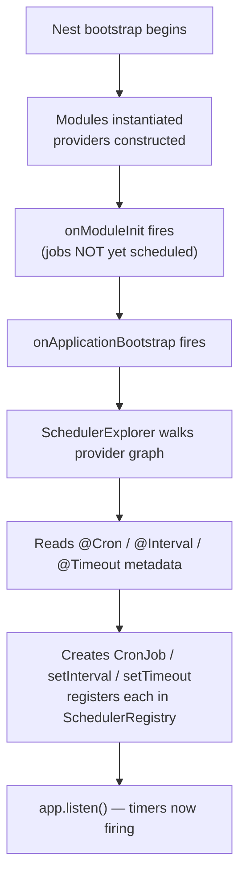
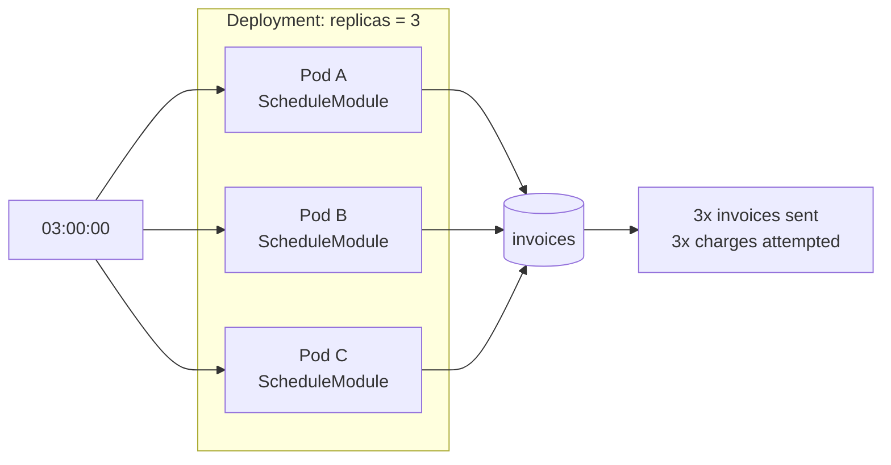

# Chapter 34 — Task Scheduling and In-Process Events

> **한눈에 보기**
> 이 장은 "요청 없이 스스로 도는 코드"를 다룹니다. `@nestjs/schedule`로 크론·인터벌·
> 타임아웃을 선언하고 `SchedulerRegistry`로 런타임에 조작하는 법, 그리고
> `@nestjs/event-emitter`로 모듈 간 결합을 끊는 인프로세스 이벤트를 배웁니다.
> 공식 문서가 빼먹은 두 가지 — 레플리카가 여러 대일 때 크론이 중복 실행되는 문제와,
> 리스너에서 터진 예외가 프로세스를 죽이는 경로 — 를 정면으로 다룹니다.
> 17장의 설정과 6장의 모듈 그래프 위에서, 35장(큐)으로 넘어가기 직전의 다리 역할을 합니다.

**What you will learn**

- How `ScheduleModule.forRoot()` actually registers your jobs — why registration happens at `onApplicationBootstrap` and what that implies for jobs declared in lazily loaded modules.
- How to read and write a six-field cron expression field by field, and when the optional seconds field silently changes the meaning of a pattern you copied from `crontab`.
- Every `@Cron()` option (`name`, `timeZone`, `utcOffset`, `disabled`, `waitForCompletion`) and which of them you actually need in production.
- How to create, inspect, stop, and delete jobs at runtime through `SchedulerRegistry`, including the trap in `nextDate()` that throws.
- Why a three-replica deployment fires every cron three times, and the four real answers — distributed lock, leader election, external scheduler, dedicated worker — with the trade-offs of each.
- How to emit and consume in-process events with `EventEmitter2`, including `emitAsync`, wildcards, and the `suppressErrors` flag that stands between you and an `unhandledRejection` crash.
- Where in-process events stop being adequate and a real queue or broker has to take over.

**Why this matters**

Almost every non-trivial service grows a second identity. The first is the HTTP application you designed: a request arrives, a controller runs, a response leaves. The second is a set of things that happen on their own — a nightly billing run, a five-minute health sweep, a cleanup of expired sessions, a webhook retry pass. That second identity has no request to hang off, no interceptor pipeline, no filter to catch its exceptions, and no natural place in your module graph. It is the part of the system that fails silently at 3am.

There is a specific failure that catches nearly everyone the first time. You write a `@Cron('0 0 3 * * *')` that emails every customer an invoice. It works perfectly in development, where you run one process. You deploy to production behind an autoscaler with three replicas. Every customer receives three invoices. Nothing in the NestJS documentation warns you about this, because from the framework's point of view nothing went wrong: three independent processes each honoured the schedule you gave them. The fix is not a NestJS feature — it is a distributed systems decision you have to make deliberately, and this chapter makes you make it.

The second half of the chapter is about a different kind of decoupling. When an order is placed you may need to decrement inventory, send a confirmation email, write an audit row, and notify a fraud service. Wiring four dependencies into `OrdersService` makes the order flow fragile: an SMTP timeout now fails a checkout. In-process events invert that — `OrdersService` announces what happened and stops caring who listens. But in-process events buy you decoupling, not durability. If the process dies between the emit and the listener finishing, the work is simply gone. Understanding exactly what an in-process event does and does not guarantee is the prerequisite for the next chapter, where durability becomes the whole point.

---

## Installing and activating the scheduler

`@nestjs/schedule` wraps the [`cron`](https://github.com/kelektiv/node-cron) package and adds a Nest-shaped registration layer on top of it. Install it:

```bash
$ npm install --save @nestjs/schedule
```

Then activate it once, in the root module:

```typescript title="app.module.ts"
import { Module } from '@nestjs/common';
import { ScheduleModule } from '@nestjs/schedule';
import { ReportsModule } from './reports/reports.module';

@Module({
  imports: [ScheduleModule.forRoot(), ReportsModule],
})
export class AppModule {}
```

`forRoot()` is a global registration: you call it exactly once, in the root module, and every `@Cron()`, `@Interval()`, and `@Timeout()` anywhere in the application graph becomes live. You do **not** import `ScheduleModule` again in feature modules to "enable" scheduling there — the decorators are discovered globally.

### What happens at bootstrap

Understanding the mechanism prevents a whole class of confusion. `ScheduleModule.forRoot()` registers an internal explorer service. That explorer does nothing at construction time. It waits for the `onApplicationBootstrap` lifecycle hook — the last hook Nest fires before the application starts listening (see [Chapter 39 — Lifecycle Events and Graceful Shutdown](../part3-advanced/39-lifecycle-and-shutdown.md)). At that point it walks the entire provider graph, reads the scheduling metadata that the decorators attached to your methods, and instantiates a real `CronJob`, `setInterval`, or `setTimeout` for each one.



Three consequences follow directly from that diagram:

1. **Nothing fires before the app has fully bootstrapped.** A `@Timeout(0)` does not run during module initialisation; it runs after every module is ready. This is deliberate and it is what you want — a job that runs while half the graph is uninitialised would be a source of intermittent nulls.
2. **A provider in a lazily loaded module has no schedule until that module is loaded.** If you use `LazyModuleLoader` ([Chapter 41](../part3-advanced/41-module-ref-discovery-lazy.md)), its cron jobs are registered when the module is loaded, not at bootstrap.
3. **The decorators are markers, not registrations** — the same relationship `@Injectable()` has to the DI container. A class carrying `@Cron()` that you forgot to list in a module's `providers` array is invisible to the explorer, and its job never runs. This is the single most common "my cron doesn't fire" cause.

> **Hint** — Because scheduling is process-wide, the natural home for job classes is a small dedicated `TasksModule` (or one `*.tasks.ts` provider per feature module). Do not scatter `@Cron()` across controllers; controllers are about requests, and a scheduled method on a controller is a category error even though it technically works.

---

## Cron expressions, field by field

A cron expression is a whitespace-separated list of fields, read left to right. The `cron` package that Nest uses accepts **six** fields, where the leftmost — seconds — is optional. This is the source of more bugs than any other part of the API, because standard Unix `crontab` uses five fields and every expression you find on the internet is a five-field expression.

```text
 *    *    *    *    *    *
 |    |    |    |    |    |
 |    |    |    |    |    day of week   (0-7, 0 and 7 = Sunday; SUN-SAT)
 |    |    |    |    month        (1-12; JAN-DEC)
 |    |    |    day of month (1-31)
 |    |    hours        (0-23)
 |    minutes      (0-59)
 seconds      (0-59)  <- OPTIONAL, and it comes FIRST
```

Each field accepts four constructs:

| Construct | Syntax | Example | Meaning |
|---|---|---|---|
| Wildcard | `*` | `* * * * *` | every value of that field |
| Value | `n` | `30 * * * *` | at minute 30 |
| List | `a,b,c` | `0 9,13,17 * * *` | at 09:00, 13:00, 17:00 |
| Range | `a-b` | `0 9-17 * * *` | hourly from 09:00 through 17:00 |
| Step | `*/n` or `a-b/n` | `*/15 * * * *` | every 15 minutes; `9-17/2` = every 2h in range |

The critical rule: **if you pass five fields, the leftmost is minutes; if you pass six, the leftmost is seconds.** So `*/5 * * * *` means "every five minutes", while `*/5 * * * * *` means "every five seconds" — a 60× difference produced by one extra asterisk. If you paste a five-field expression from a Linux crontab into `@Cron()`, it behaves correctly. If you paste a six-field expression from a tutorial and delete what you think is a redundant field, you have quietly created a job that hammers your database.

> **⚠️ Notice** — Adopt one convention for the whole codebase and enforce it in review. This book's recommendation: **always write six fields**, with an explicit leading `0` when you do not care about seconds. `0 */5 * * * *` is unambiguous to any reader; `*/5 * * * *` requires the reader to count fields.

### A reference table of patterns

| Expression | Fires |
|---|---|
| `* * * * * *` | every second |
| `45 * * * * *` | every minute, at the 45-second mark |
| `0 * * * * *` | every minute, on the minute |
| `0 10 * * * *` | every hour, at 10 minutes past |
| `0 */30 9-17 * * *` | every 30 minutes between 09:00 and 17:59 |
| `0 30 11 * * 1-5` | Monday–Friday at 11:30:00 |
| `0 0 3 * * *` | every day at 03:00:00 |
| `0 0 0 1 * *` | midnight on the 1st of every month |
| `0 0 0 * * 0` | midnight every Sunday |
| `0 0 6 1 1 *` | 06:00 on January 1st |

### The `CronExpression` enum

For the common cases, `@nestjs/schedule` ships an enum so you never count asterisks:

```typescript title="reports.tasks.ts"
import { Injectable, Logger } from '@nestjs/common';
import { Cron, CronExpression } from '@nestjs/schedule';

@Injectable()
export class ReportsTasks {
  private readonly logger = new Logger(ReportsTasks.name);

  @Cron(CronExpression.EVERY_30_SECONDS)
  pollExportQueue() {
    this.logger.debug('Polling export queue');
  }

  @Cron(CronExpression.EVERY_DAY_AT_3AM)
  rebuildDailyRollups() {
    this.logger.log('Rebuilding rollups');
  }
}
```

The enum covers members such as `EVERY_SECOND`, `EVERY_5_SECONDS`, `EVERY_10_SECONDS`, `EVERY_30_SECONDS`, `EVERY_MINUTE`, `EVERY_5_MINUTES`, `EVERY_10_MINUTES`, `EVERY_30_MINUTES`, `EVERY_HOUR`, `EVERY_2_HOURS` through `EVERY_12_HOURS`, `EVERY_DAY_AT_MIDNIGHT`, `EVERY_DAY_AT_NOON`, `EVERY_DAY_AT_1AM` through `EVERY_DAY_AT_11PM`, `EVERY_WEEK`, `EVERY_WEEKDAY`, `EVERY_WEEKEND`, `EVERY_1ST_DAY_OF_MONTH_AT_MIDNIGHT`, `EVERY_QUARTER`, and `EVERY_YEAR`. Prefer the enum whenever it fits: it is self-documenting and it cannot be miscounted.

### A `Date` instead of an expression

`@Cron()` also accepts a JavaScript `Date`, which schedules the method to run exactly once at that instant:

```typescript
// Runs 10 seconds after the app finishes bootstrapping.
@Cron(new Date(Date.now() + 10 * 1000))
warmCaches() {}
```

The `Date` is evaluated when the decorator is applied — at module load — not at bootstrap, so `Date.now()` here is "process start", not "app ready". For a one-shot delay relative to *readiness*, `@Timeout()` is the honest tool.

---

## `@Cron()` options

The second argument to `@Cron()` is an options object.

| Option | Type | What it does |
|---|---|---|
| `name` | `string` | Registers the job under this key in `SchedulerRegistry`. Required if you ever want to stop, restart, or inspect the job. |
| `timeZone` | `string` | IANA timezone (`'Europe/Paris'`, `'Asia/Seoul'`). The expression is interpreted in this zone, including DST transitions. Throws at registration if the zone name is invalid. |
| `utcOffset` | `number \| string` | Fixed offset instead of a named zone (e.g. `540` or `'+09:00'`). Mutually exclusive with `timeZone`. Does **not** follow DST. |
| `disabled` | `boolean` | If `true`, the job is registered but never scheduled. Useful for feature-flagging a job off via config. |
| `waitForCompletion` | `boolean` | If `true`, a tick that arrives while the previous `onTick` is still running is **skipped entirely** — not queued. Default `false`. |

```typescript title="notifications.tasks.ts"
import { Injectable } from '@nestjs/common';
import { Cron } from '@nestjs/schedule';
import { ConfigService } from '@nestjs/config';

@Injectable()
export class NotificationsTasks {
  constructor(private readonly config: ConfigService) {}

  @Cron('0 0 9 * * 1-5', {
    name: 'daily-digest',
    timeZone: 'Asia/Seoul',
  })
  async sendDailyDigest() {
    // 09:00 Seoul time, Monday to Friday.
  }
}
```

### `timeZone` versus `utcOffset`: pick the named zone

Use `timeZone` unless you have a specific reason not to. A named IANA zone tracks daylight saving transitions; a numeric `utcOffset` does not. If you schedule a job for `'0 0 9 * * *'` with `utcOffset: -300` (US Eastern in winter), it silently drifts to 10:00 local time the day DST begins. With `timeZone: 'America/New_York'` it stays at 09:00 all year. The only case for `utcOffset` is when you genuinely mean a fixed offset — for instance, aligning with a partner system that reports in a fixed offset regardless of local time.

Note also that a named zone introduces two edge cases per year in the spring-forward/fall-back windows. A job scheduled at 02:30 local time will not run at all on the day the clock jumps from 02:00 to 03:00, and may run twice on the day it falls back. **Schedule anything financially significant outside the 01:00–03:00 local window**, or schedule it in UTC and convert when you display it.

### `disabled` as a configuration switch

`disabled` combines well with the config patterns from [Chapter 17 — Configuration and Environment Management](./17-configuration.md), but there is a wrinkle: decorator arguments are evaluated at class-definition time, before the DI container exists, so you cannot inject `ConfigService` into the decorator. The usual workaround is to read `process.env` directly in the decorator argument:

```typescript
@Cron(CronExpression.EVERY_HOUR, {
  name: 'reconcile-payments',
  disabled: process.env.ENABLE_RECONCILIATION !== 'true',
})
reconcile() {}
```

This is acceptable for a boolean kill-switch, but it bypasses your validated config schema. The cleaner alternative — and the one this book recommends for anything more subtle than an on/off flag — is to skip the decorator entirely and register the job dynamically through `SchedulerRegistry`, where you have full access to injected configuration. That is the next section but one.

### `waitForCompletion` and overlapping executions

By default a cron job's callback is fired on schedule regardless of whether the previous invocation has finished. If your `EVERY_MINUTE` job takes 90 seconds under load, you accumulate overlapping executions until something breaks — usually the database connection pool.

```typescript
// WRONG: a slow run overlaps the next tick, and they pile up.
@Cron(CronExpression.EVERY_MINUTE)
async syncInventory() {
  await this.slowFullTableSync(); // sometimes takes 3 minutes
}

// RIGHT: ticks that arrive during a run are skipped.
@Cron(CronExpression.EVERY_MINUTE, {
  name: 'sync-inventory',
  waitForCompletion: true,
})
async syncInventory() {
  await this.slowFullTableSync();
}
```

Read the semantics carefully: skipped ticks are **discarded, not deferred**. If a run takes four minutes, three minute-ticks are dropped and the next run starts on the following minute boundary. That is almost always what you want for a sync job (you only need the latest state) and almost never what you want for a job that must process each interval exactly once (an hourly billing window, say). For the latter, make the job idempotent and range-based: have it process "everything since the last successful watermark" rather than "the last hour".

---

## `@Interval()` and `@Timeout()`

These are thin wrappers over `setInterval` and `setTimeout`, expressed in milliseconds.

```typescript title="health.tasks.ts"
import { Injectable, Logger } from '@nestjs/common';
import { Interval, Timeout } from '@nestjs/schedule';

@Injectable()
export class HealthTasks {
  private readonly logger = new Logger(HealthTasks.name);

  @Interval(10_000)
  pingUpstream() {
    this.logger.debug('Called every 10 seconds');
  }

  @Timeout(5_000)
  warmUp() {
    this.logger.debug('Called once, 5 seconds after bootstrap');
  }

  // Named variants, controllable via SchedulerRegistry:
  @Interval('metrics-flush', 2_500)
  flushMetrics() {}

  @Timeout('license-check', 30_000)
  checkLicense() {}
}
```

The name, when present, is the **first** argument and the duration the second. This overload is easy to get backwards.

| | `@Cron()` | `@Interval()` | `@Timeout()` |
|---|---|---|---|
| Underlying primitive | `cron` package `CronJob` | `setInterval` | `setTimeout` |
| Schedule reference point | wall-clock time | app bootstrap | app bootstrap |
| Repeats | yes | yes | no |
| Timezone-aware | yes | no | no |
| Drifts under load | no (re-anchors to clock) | yes (interval starts after previous callback returns for async fns is *not* guaranteed — see below) | n/a |
| Registry accessor | `getCronJob` | `getInterval` | `getTimeout` |

**Which should you use?** A cron job anchors to wall-clock time: `EVERY_HOUR` fires at :00 regardless of when the process started. An interval anchors to bootstrap: `@Interval(3_600_000)` fires one hour after *this replica* started, so a rolling deploy silently re-phases all your intervals. For anything a human reasons about in calendar terms ("nightly", "hourly", "every Monday"), use `@Cron()`. Reserve `@Interval()` for internal housekeeping where the phase does not matter — a metrics flush, a connection-pool reaper.

Note also that `setInterval` does not wait for an async callback. An `@Interval(1000)` on an async method that takes 3 seconds produces three concurrent in-flight executions, and there is no `waitForCompletion` equivalent for intervals. If you need overlap protection on an interval, either use a cron with `waitForCompletion: true`, or guard the body with an instance-level boolean:

```typescript
private running = false;

@Interval(1_000)
async poll() {
  if (this.running) return;
  this.running = true;
  try {
    await this.doWork();
  } finally {
    this.running = false;
  }
}
```

### Exceptions inside scheduled methods

Every method decorated with `@Cron()`, `@Interval()`, or `@Timeout()` is wrapped by Nest in a try/catch, so a synchronous throw is logged rather than propagated. Do not read that as full protection. The wrapper catches what the callback throws; for an `async` method, that is a rejected promise the wrapper awaits, and recent versions handle it. But work you kick off without awaiting — a floating `void this.somethingAsync()` — escapes the wrapper entirely and becomes an `unhandledRejection`. Always `await` inside a scheduled method, and add your own `try/catch` when you want structured logging or a metric on failure:

```typescript
@Cron(CronExpression.EVERY_DAY_AT_3AM, { name: 'nightly-rollup' })
async nightlyRollup() {
  try {
    const rows = await this.rollups.rebuild();
    this.logger.log(`Rebuilt ${rows} rollups`);
  } catch (err) {
    this.logger.error('Nightly rollup failed', err instanceof Error ? err.stack : err);
    this.metrics.increment('job.failed', { job: 'nightly-rollup' });
    // Deliberately swallowed: the next run will retry.
  }
}
```

---

## `SchedulerRegistry`: controlling jobs at runtime

`SchedulerRegistry` is the dynamic half of the module. It is an injectable provider holding three maps — cron jobs, intervals, timeouts — each keyed by name.

```typescript title="tasks.service.ts"
import { Injectable, Logger } from '@nestjs/common';
import { SchedulerRegistry } from '@nestjs/schedule';
import { CronJob } from 'cron';

@Injectable()
export class TasksService {
  private readonly logger = new Logger(TasksService.name);

  constructor(private readonly schedulerRegistry: SchedulerRegistry) {}
}
```

| Method | Returns / does |
|---|---|
| `getCronJob(name)` | the `CronJob` instance; throws if the name is unknown |
| `addCronJob(name, job)` | registers a `CronJob` you constructed yourself |
| `deleteCronJob(name)` | stops and unregisters the job |
| `getCronJobs()` | `Map<string, CronJob>` of every registered cron job |
| `doesExist('cron', name)` | boolean existence check without throwing |
| `getInterval(name)` / `addInterval(name, id)` / `deleteInterval(name)` / `getIntervals()` | same, for `setInterval` handles; `getIntervals()` returns `string[]` of names |
| `getTimeout(name)` / `addTimeout(name, id)` / `deleteTimeout(name)` / `getTimeouts()` | same, for `setTimeout` handles |

### Inspecting and controlling a declared job

Given a declaratively named job:

```typescript
@Cron('0 0 8 * * *', { name: 'notifications' })
triggerNotifications() {}
```

you can reach it from anywhere:

```typescript
const job = this.schedulerRegistry.getCronJob('notifications');

job.stop();                      // stop a scheduled job
job.start();                     // restart a stopped job
job.setTime(new CronTime('0 0 9 * * *')); // stop, re-time, restart
console.log(job.lastDate());     // DateTime of the last execution, or null
console.log(job.nextDate());     // DateTime of the next scheduled execution
console.log(job.nextDates(5));   // array of the next 5 DateTimes
```

The returned values are Luxon `DateTime` objects, not JavaScript `Date`s. Call `.toJSDate()` when you need to interoperate with code expecting a `Date`, or `.toISO()` for logging.

Two sharp edges. First, `getCronJob()` **throws** when the name is not registered, so guard with `doesExist('cron', name)` in any code path where the job may legitimately be absent. Second, `nextDate()` throws if the job has already fired its last occurrence and has no future date — which is exactly the case for a `@Cron(new Date(...))` one-shot. Iterating the whole registry therefore needs a try/catch:

```typescript
listCronJobs() {
  const jobs = this.schedulerRegistry.getCronJobs();
  jobs.forEach((job, name) => {
    let next: string;
    try {
      next = job.nextDate().toJSDate().toISOString();
    } catch {
      next = 'no future fire date';
    }
    this.logger.log(`job: ${name} -> next: ${next}`);
  });
}
```

### Creating jobs at runtime

This is the pattern for schedules that are data, not code — a user-configurable report time, a per-tenant sync cadence read from the database at bootstrap.

```typescript title="dynamic-jobs.service.ts"
import { Injectable, Logger, OnApplicationBootstrap } from '@nestjs/common';
import { SchedulerRegistry } from '@nestjs/schedule';
import { CronJob } from 'cron';

@Injectable()
export class DynamicJobsService implements OnApplicationBootstrap {
  private readonly logger = new Logger(DynamicJobsService.name);

  constructor(
    private readonly schedulerRegistry: SchedulerRegistry,
    private readonly schedules: SchedulesRepository,
  ) {}

  async onApplicationBootstrap() {
    const rows = await this.schedules.findAllEnabled();
    for (const row of rows) {
      this.addTenantJob(row.tenantId, row.cronExpression, row.timeZone);
    }
  }

  addTenantJob(tenantId: string, expression: string, timeZone: string) {
    const name = `tenant-sync:${tenantId}`;

    if (this.schedulerRegistry.doesExist('cron', name)) {
      this.schedulerRegistry.deleteCronJob(name); // replace, don't duplicate
    }

    const job = new CronJob(
      expression,
      async () => {
        try {
          await this.runTenantSync(tenantId);
        } catch (err) {
          this.logger.error(`Sync failed for ${tenantId}`, err as Error);
        }
      },
      null,        // onComplete
      false,       // start immediately? no — we start it explicitly below
      timeZone,
    );

    this.schedulerRegistry.addCronJob(name, job);
    job.start();
    this.logger.log(`Registered ${name} with "${expression}" in ${timeZone}`);
  }

  removeTenantJob(tenantId: string) {
    this.schedulerRegistry.deleteCronJob(`tenant-sync:${tenantId}`);
  }

  private async runTenantSync(tenantId: string) { /* ... */ }
}
```

Points worth stating explicitly:

- `addCronJob()` **registers but does not start**. You must call `job.start()` yourself. Forgetting this is the second most common "my dynamic cron doesn't fire" cause.
- Import `CronJob` from `cron`, not from `@nestjs/schedule`.
- Because you construct the callback yourself, there is no Nest try/catch wrapper. Your own error handling is mandatory.
- `onApplicationBootstrap` is the right hook: the repository is guaranteed constructed and its connection open.

Intervals and timeouts follow the same shape, with plain Node handles:

```typescript
addPoller(name: string, ms: number) {
  const handle = setInterval(() => this.poll(name), ms);
  this.schedulerRegistry.addInterval(name, handle);
}

removePoller(name: string) {
  this.schedulerRegistry.deleteInterval(name); // clears the interval for you
}
```

`deleteInterval` and `deleteTimeout` call `clearInterval`/`clearTimeout` on your behalf. If you obtain the handle with `getInterval(name)` and clear it manually, the registry still holds a stale entry — always prefer the `delete*` methods.

---

## The problem the docs don't mention: scheduling across replicas

Here is the fact that turns a working cron into a production incident.

`ScheduleModule` schedules jobs **inside the Node.js process**. It has no coordination layer, no shared state, no awareness of any other process. Run three replicas of your service and you have three independent schedulers, each perfectly executing the same expression at the same moment.



For an idempotent job — recomputing a cache, sweeping expired rows with a `WHERE expires_at < now()` — triple execution is wasteful but harmless. For anything with an external side effect — sending mail, charging a card, calling a partner API, posting to a webhook — it is a correctness bug and often a customer-visible one.

There are four workable answers. Choose deliberately.

| Approach | Mechanism | Guarantee | Complexity | Best for |
|---|---|---|---|---|
| **Distributed lock** | Every replica fires; each tries to acquire a short-lived lock in Redis/Postgres keyed by job name + tick; only the winner runs | At-most-once per tick (assuming lock correctness); no run if the winner crashes mid-job | Low | Most applications. The default recommendation. |
| **Leader election** | Replicas elect one leader (Redis lease, Kubernetes `Lease`, Consul); only the leader starts `ScheduleModule` jobs | At-most-once; leader failover leaves a gap of one lease TTL | Medium | Many jobs, where per-tick locking is noisy |
| **External scheduler** | No in-app cron. Kubernetes `CronJob`, cloud scheduler, or Temporal triggers an HTTP endpoint or a one-shot pod | At-least-once, with platform-level retries and visibility | Medium | Regulated or audited jobs; teams already on K8s |
| **Dedicated worker replica** | Deploy the same image twice: `replicas: N` with scheduling off, `replicas: 1` with scheduling on (`ENABLE_SCHEDULER=true`) | Exactly one scheduler while that pod is up; no run while it restarts | Low | Small teams; a good first step |

### Implementing a distributed lock

The lock is short, keyed by job identity plus the tick it belongs to, and set with `NX` (only if not exists) and a TTL slightly longer than the expected job duration.

```typescript title="cron-lock.service.ts"
import { Injectable } from '@nestjs/common';
import Redis from 'ioredis';

@Injectable()
export class CronLockService {
  constructor(private readonly redis: Redis) {}

  /**
   * Returns true if this process won the lock for this tick.
   * The lock is never released explicitly — it expires. That makes a
   * crashed holder self-healing at the cost of skipping one tick.
   */
  async acquire(jobName: string, ttlSeconds: number): Promise<boolean> {
    const key = `cron-lock:${jobName}`;
    const result = await this.redis.set(key, process.env.HOSTNAME ?? 'unknown', 'EX', ttlSeconds, 'NX');
    return result === 'OK';
  }
}
```

```typescript title="invoices.tasks.ts"
import { Injectable, Logger } from '@nestjs/common';
import { Cron, CronExpression } from '@nestjs/schedule';
import { CronLockService } from './cron-lock.service';

@Injectable()
export class InvoicesTasks {
  private readonly logger = new Logger(InvoicesTasks.name);

  constructor(
    private readonly lock: CronLockService,
    private readonly invoices: InvoicesService,
  ) {}

  @Cron(CronExpression.EVERY_DAY_AT_3AM, {
    name: 'send-invoices',
    waitForCompletion: true,
  })
  async sendInvoices() {
    // TTL must exceed the longest plausible run, and be shorter than the interval.
    const won = await this.lock.acquire('send-invoices', 30 * 60);
    if (!won) {
      this.logger.debug('Another replica holds the lock; skipping');
      return;
    }
    await this.invoices.sendAllDue();
  }
}
```

Choosing the TTL is the whole design. Too short and a second replica acquires the lock while the first is still working — you are back to double execution. Too long and a crash during the job blocks the next several ticks. The rule: **TTL > p99 job duration, and TTL < the interval between ticks.** If a job's p99 duration exceeds its interval, the schedule itself is wrong.

Do not release the lock in a `finally` block for jobs with external side effects. Releasing early re-opens the window; letting the TTL expire is the safer failure mode. If you do want early release for fast idempotent jobs, release with a Lua compare-and-delete that checks the holder token, never a bare `DEL` — a bare delete can remove a lock a *different* replica has since acquired.

For a battle-tested implementation rather than a hand-rolled one, `redlock` (Redis) or a Postgres advisory lock (`pg_try_advisory_lock`) are both good choices. A Postgres advisory lock has a genuinely attractive property here: it is bound to the session, so it releases automatically if the process dies, with no TTL to tune.

### The dedicated-worker pattern

The simplest thing that works, and a fine place to start:

```typescript title="app.module.ts"
import { Module } from '@nestjs/common';
import { ConfigModule } from '@nestjs/config';
import { ScheduleModule } from '@nestjs/schedule';

const schedulingEnabled = process.env.ENABLE_SCHEDULER === 'true';

@Module({
  imports: [
    ConfigModule.forRoot({ isGlobal: true }),
    ...(schedulingEnabled ? [ScheduleModule.forRoot(), TasksModule] : []),
  ],
})
export class AppModule {}
```

Deploy the same image as two workloads: an `api` deployment with `ENABLE_SCHEDULER=false` and `replicas: 3`, and a `scheduler` deployment with `ENABLE_SCHEDULER=true` and `replicas: 1`. You get one scheduler, and the API pods stay stateless and freely scalable. The cost is a small availability gap: while the scheduler pod is being replaced during a deploy, ticks in that window are lost. For a nightly job, schedule your deploys away from 03:00 and the gap never matters. For a job that runs every minute, combine this with a lock so you can safely run two scheduler replicas.

**Recommendation.** Start with the dedicated worker if you have a handful of jobs. Add the distributed lock as soon as any job has an irreversible external side effect — the lock is fifteen lines and it makes the system correct under any replica count, including the one you get accidentally during a rolling deploy when old and new pods overlap. Reach for an external scheduler when the job needs an audit trail and retry semantics that your application should not be responsible for.

---

## In-process events: `EventEmitterModule`

The second half of this chapter is about decoupling within a single process. `@nestjs/event-emitter` wraps [`eventemitter2`](https://github.com/EventEmitter2/EventEmitter2) and adds decorator-based subscription.

```bash
$ npm i --save @nestjs/event-emitter
```

```typescript title="app.module.ts"
import { Module } from '@nestjs/common';
import { EventEmitterModule } from '@nestjs/event-emitter';

@Module({
  imports: [
    EventEmitterModule.forRoot({
      wildcard: true,
      delimiter: '.',
      maxListeners: 20,
      verboseMemoryLeak: true,
    }),
  ],
})
export class AppModule {}
```

Like `ScheduleModule`, this is a once-only root registration, and listener discovery also happens at `onApplicationBootstrap`.

| Option | Default | Effect |
|---|---|---|
| `wildcard` | `false` | Enables namespaced event names and `*` / `**` patterns. Turning this on changes name parsing globally. |
| `delimiter` | `'.'` | The namespace separator used when `wildcard` is on. |
| `newListener` | `false` | Emit a `newListener` meta-event whenever a listener is added. |
| `removeListener` | `false` | Emit a `removeListener` meta-event whenever one is removed. |
| `maxListeners` | `10` | Per-event listener cap before a memory-leak warning is printed. |
| `verboseMemoryLeak` | `false` | Include the offending event name in that warning. Turn this on — the default warning is useless without it. |
| `ignoreErrors` | `false` | If `false` (default), emitting an `'error'` event with no listener throws an uncaught exception, matching Node's `EventEmitter` semantics. |

Two opinionated defaults for a real application: set `wildcard: true` (you will want namespaces the moment you have more than a dozen events, and retrofitting it later changes how every name is parsed), and set `verboseMemoryLeak: true` (a warning that does not name the event costs you an hour of bisecting).

### Emitting

```typescript title="orders.service.ts"
import { Injectable } from '@nestjs/common';
import { EventEmitter2 } from '@nestjs/event-emitter';
import { OrderCreatedEvent } from './events/order-created.event';

@Injectable()
export class OrdersService {
  constructor(private readonly eventEmitter: EventEmitter2) {}

  async create(dto: CreateOrderDto, userId: string) {
    const order = await this.repo.save({ ...dto, userId });

    this.eventEmitter.emit(
      'order.created',
      new OrderCreatedEvent(order.id, userId, order.totalCents),
    );

    return order;
  }
}
```

`emit()` is **synchronous**. It returns a boolean (whether any listener matched), not a promise. Every registered listener runs to its first `await` before `emit()` returns; an `async` listener's remaining work continues in the background, entirely unobserved by the caller. This is the single most important property of in-process events, and everything else in this section follows from it.

### Event classes, not loose objects

You can emit any payload. Do not emit a bare object literal.

```typescript title="events/order-created.event.ts"
export class OrderCreatedEvent {
  constructor(
    public readonly orderId: string,
    public readonly userId: string,
    public readonly totalCents: number,
  ) {}
}
```

```typescript title="events/order.events.ts"
export const ORDER_EVENTS = {
  CREATED: 'order.created',
  PAID: 'order.paid',
  CANCELLED: 'order.cancelled',
} as const;
```

Two reasons. First, the class gives listeners a real type — `handleOrderCreated(event: OrderCreatedEvent)` is checked, whereas `payload: any` is not. Second, a class plus a name constant makes the event greppable: you can find every producer and every consumer of `ORDER_EVENTS.CREATED` in one search, which is the only thing that keeps an event-driven codebase navigable. Loose string names scattered across files are how event systems become unmaintainable.

> **⚠️ Notice** — `EventEmitter2` does not type-check the pairing of name and payload. Emitting `'order.created'` with a `UserRegisteredEvent` compiles fine and fails at runtime inside the listener. Keep the name constant and the event class in the same file so the pairing is visually obvious, and consider a small typed wrapper (`emitOrderCreated(e: OrderCreatedEvent)`) around `emit` for high-traffic events.

---

## Listening with `@OnEvent()`

```typescript title="notifications.listener.ts"
import { Injectable, Logger } from '@nestjs/common';
import { OnEvent } from '@nestjs/event-emitter';
import { OrderCreatedEvent } from '../orders/events/order-created.event';
import { ORDER_EVENTS } from '../orders/events/order.events';

@Injectable()
export class NotificationsListener {
  private readonly logger = new Logger(NotificationsListener.name);

  constructor(private readonly mailer: MailerService) {}

  @OnEvent(ORDER_EVENTS.CREATED)
  async handleOrderCreated(event: OrderCreatedEvent) {
    await this.mailer.sendOrderConfirmation(event.userId, event.orderId);
  }
}
```

The class must be registered as a provider — same rule as consumers and scheduled tasks. `@OnEvent()` is a marker; the module's `EventSubscribersLoader` finds it by walking the provider graph.

The first argument is a `string` or `symbol`, or — when `wildcard` is enabled — an array of them, which subscribes one method to several events. The second argument is an options object:

| Option | Default | Effect |
|---|---|---|
| `async` | `false` | Tells the emitter this listener returns a promise. Required for `emitAsync` to await it. |
| `promisify` | `false` | Wraps the listener's return value in a promise so `emitAsync` always receives one. |
| `suppressErrors` | `true` | When `true`, an error thrown by the listener is swallowed. When `false`, it propagates. |
| `prependListener` | `false` | Inserts this listener at the front of the listener array rather than appending. |
| `objectify`, `nextTick`, ... | — | Passed straight through to `eventemitter2`'s `OnOptions`. |

```typescript
@OnEvent('order.created', { async: true })
async handleOrderCreated(event: OrderCreatedEvent) { /* ... */ }
```

`prependListener` matters only when listener order is load-bearing — for instance, an audit listener that must record the event before a listener that mutates it. If your listener order is load-bearing, that is a strong signal you wanted a pipeline (or CQRS, [Chapter 53](../part3-advanced/53-cqrs.md)), not an event bus.

### Wildcards and namespaces

With `wildcard: true`, event names are split on the delimiter and can be matched with patterns:

```typescript
// Matches order.created, order.paid, order.cancelled.
// Does NOT match order.payment.failed — a single * covers exactly one segment.
@OnEvent('order.*')
handleOrderEvents(payload: OrderCreatedEvent | OrderPaidEvent | OrderCancelledEvent) {}

// Multi-level wildcard: matches order.payment.failed and any depth below.
@OnEvent('order.**')
auditOrderEverything(payload: unknown) {}

// Catch-all, typically for a debug or metrics listener.
@OnEvent('**')
recordEventMetric(payload: unknown) {}
```

Adopt a naming convention and hold to it: `<aggregate>.<past-tense-verb>` — `order.created`, `user.registered`, `invoice.voided`, `payment.refund.succeeded`. Past tense is not stylistic pedantry: an event is a statement about something that already happened, and naming it `order.create` invites listeners to treat it as a command they can refuse, which they cannot.

`EventEmitter2` also exposes imperative helpers worth knowing about, usable directly on the injected instance: `onAny(listener)` for a global tap, `waitFor(event, options)` which returns a promise resolving on the next matching emission (useful in tests), `listenerCount(event)`, and `removeAllListeners(event)`.

---

## `emitAsync`, error handling, and how a listener crashes your process

This section is the reason in-process events deserve a chapter rather than a paragraph.

### `emitAsync` awaits listeners

```typescript
const results = await this.eventEmitter.emitAsync(
  'order.created',
  new OrderCreatedEvent(order.id, userId, order.totalCents),
);
// results: an array with one entry per listener's resolved value
```

`emitAsync` calls every listener and returns a promise that resolves once all of them settle, collecting their return values. It is the tool for "fan out, then wait" — for example, asking several validators whether an operation may proceed.

But it re-couples what you decoupled. With `emitAsync`, the emitter's latency becomes the sum (or at least the max) of its listeners' latencies, and a slow listener slows the checkout you were trying to keep fast. Worse, `emitAsync` rejects if any listener rejects and `suppressErrors` is `false`, so an unrelated subsystem can now fail your order creation. **Use `emit` for notifications and `emitAsync` only when the emitter genuinely needs the listeners' results.** If you find yourself using `emitAsync` to guarantee the work completed, you do not want an event — you want a direct method call, or a queue.

### The crash path

`suppressErrors` defaults to `true`, which means a throwing listener is silently ignored. That default is a trade: it protects the process, and it hides bugs. A failed confirmation email leaves no trace at all unless you catch and log it yourself.

Set `suppressErrors: false` and errors propagate — but consider *where* they propagate to. For a synchronous `emit()`, the throw surfaces inside `emit()` and therefore inside `OrdersService.create()`, failing the HTTP request because a mail server was down. For an `async` listener, `emit()` has already returned; the rejection has no caller left to catch it, and Node raises `unhandledRejection`. Under Node's default in modern versions, **that terminates the process**.

```typescript
// DANGEROUS: an async listener that rejects, with errors unsuppressed,
// and no caller awaiting it -> unhandledRejection -> process exit.
@OnEvent('order.created', { async: true, suppressErrors: false })
async handleOrderCreated(event: OrderCreatedEvent) {
  await this.flakyThirdParty.notify(event); // throws on timeout
}
```

The correct pattern is to keep `suppressErrors` at its default and own the error handling inside the listener:

```typescript
@OnEvent(ORDER_EVENTS.CREATED)
async handleOrderCreated(event: OrderCreatedEvent) {
  try {
    await this.mailer.sendOrderConfirmation(event.userId, event.orderId);
  } catch (err) {
    this.logger.error(
      `Failed to send confirmation for order ${event.orderId}`,
      err instanceof Error ? err.stack : String(err),
    );
    this.metrics.increment('listener.failed', { event: ORDER_EVENTS.CREATED });
    // If this must not be lost, enqueue a retry — see Chapter 35.
  }
}
```

Every listener is an independent failure domain and should be written as one: try/catch, log with the event identity, emit a metric, decide explicitly whether to retry. The moment "decide explicitly whether to retry" becomes a real requirement, you have outgrown the event emitter.

Related: `ignoreErrors` in `forRoot()` controls a different case — Node's convention that an `'error'` event with no listener throws. Leave it `false` (the default) so that an unlistened `'error'` is loud, and register a listener for `'error'` if you emit one.

### Events emitted too early

Listeners are registered during `onApplicationBootstrap`. An event emitted from a constructor or from `onModuleInit` may therefore reach nobody. `EventEmitterReadinessWatcher` exists for exactly this:

```typescript title="seed.service.ts"
import { Injectable, OnApplicationBootstrap } from '@nestjs/common';
import { EventEmitter2, EventEmitterReadinessWatcher } from '@nestjs/event-emitter';

@Injectable()
export class SeedService implements OnApplicationBootstrap {
  constructor(
    private readonly eventEmitter: EventEmitter2,
    private readonly watcher: EventEmitterReadinessWatcher,
  ) {}

  async onApplicationBootstrap() {
    await this.watcher.waitUntilReady();
    this.eventEmitter.emit('app.seeded', { at: new Date() });
  }
}
```

This is only necessary for events emitted before bootstrap completes. Anything emitted from a request handler is long past this window.

### Request context is not propagated

A listener runs outside the request pipeline. It has no `ExecutionContext`, no request-scoped providers ([Chapter 38](../part3-advanced/38-injection-scopes.md)) — subscribers explicitly cannot be request-scoped — and, critically, no correlation ID. A trace that reads cleanly through your controller stops dead at `emit()`, and the listener's logs appear orphaned.

For synchronous listeners the `AsyncLocalStorage` context does survive, because `emit()` runs the listener on the caller's stack. For anything asynchronous, or if you use `nextTick`, the store can be lost. The reliable answer is to **put the correlation ID in the event payload** and re-establish context in the listener:

```typescript
export class OrderCreatedEvent {
  constructor(
    public readonly orderId: string,
    public readonly userId: string,
    public readonly totalCents: number,
    public readonly correlationId: string,
  ) {}
}
```

[Chapter 43 — AsyncLocalStorage and Request Context Propagation](../part3-advanced/43-async-local-storage.md) covers the general mechanism and how to re-enter a store inside a listener.

---

## Where in-process events stop being enough

Be precise about what `EventEmitter2` gives you and what it does not.

| Property | In-process events | Queue (BullMQ, Ch. 35) | Broker (Kafka/NATS/Rabbit, Ch. 45–47) |
|---|---|---|---|
| Crosses process boundaries | no | yes | yes |
| Survives a process crash | no | yes (Redis-persisted) | yes |
| Retries | you write them | built in (`attempts`, `backoff`) | consumer- or broker-managed |
| Ordering guarantee | registration order, same tick | per-queue, subject to concurrency | partition-ordered (Kafka) |
| Backpressure | none — unbounded work in-flight | concurrency limits, rate limiters | consumer groups, lag |
| Observability | your logs only | job states, Bull Board | broker tooling, consumer lag |
| Latency | microseconds | milliseconds | milliseconds |
| Operational cost | zero | Redis | a broker cluster |

The decision rule is short:

- **Use in-process events** when the work is fast, in the same process, and losing it on a crash is acceptable. Cache invalidation, in-memory counters, WebSocket fan-out to connected clients, domain-internal notifications.
- **Use a queue** ([Chapter 35 — Queues and Background Jobs with BullMQ](./35-queues.md)) when the work is slow, must survive a restart, needs retries, or must be spread across workers. Emails, PDF generation, third-party API calls, image processing.
- **Use a broker** ([Chapter 45 — Microservices I](../part3-advanced/45-microservices-fundamentals.md)) when *other services* need to react, when you need durable multi-consumer fan-out, or when you need an ordered, replayable log.

A pattern that composes all three well: emit the in-process event for local reactions, and let one small listener enqueue the durable work.

```typescript
@OnEvent(ORDER_EVENTS.CREATED)
async enqueueDurableWork(event: OrderCreatedEvent) {
  // Fast, local, in-memory: safe to lose.
  this.metrics.increment('orders.created');

  // Slow, must not be lost: hand it to the queue.
  await this.emailQueue.add('order-confirmation', {
    orderId: event.orderId,
    userId: event.userId,
  }, { jobId: `confirm:${event.orderId}` });
}
```

Note the `jobId`: it makes the enqueue itself idempotent, so a duplicated event does not produce a duplicated email. That is the thread Chapter 35 picks up.

---

## Common mistakes

1. **The task class is not a provider.** *Symptom:* the cron never fires and nothing is logged. *Cause:* `ScheduleModule`'s explorer only walks registered providers; a `@Cron()` on an unregistered class is invisible metadata. *Fix:* add the class to a module's `providers` array. The same applies to `@OnEvent()` listener classes.

2. **Five-field expression pasted where six were intended (or vice versa).** *Symptom:* a job meant to run every five minutes runs every five seconds and saturates the database. *Cause:* the optional leading seconds field. *Fix:* always write six fields with an explicit leading `0`, or use `CronExpression`.

3. **`addCronJob()` without `job.start()`.** *Symptom:* `getCronJobs()` shows the job, it never fires. *Cause:* registering and starting are separate steps. *Fix:* call `job.start()`, or pass `true` as the fourth `CronJob` constructor argument.

4. **`nextDate()` inside a registry loop throws.** *Symptom:* a `/admin/jobs` endpoint 500s once a one-shot job has fired. *Cause:* `nextDate()` throws when there is no future occurrence. *Fix:* wrap it in try/catch, as shown earlier.

5. **The same cron runs on every replica.** *Symptom:* duplicate emails, double charges, duplicate rows — proportional to the replica count, and it appears the day you scale up. *Cause:* `ScheduleModule` is process-local with no coordination. *Fix:* a distributed lock, a leader election, an external scheduler, or a dedicated scheduler workload. Decide before you scale, not after.

6. **An overlapping cron exhausts the connection pool.** *Symptom:* `TimeoutError: ResourceRequest timed out` under load, correlating with a schedule. *Cause:* a job slower than its interval, with no overlap protection. *Fix:* `waitForCompletion: true` for crons, a re-entrancy guard for intervals, and re-examine whether the interval is realistic.

7. **`suppressErrors: false` on an async listener.** *Symptom:* the process exits with `unhandledRejection` when a downstream service is slow. *Cause:* `emit()` has already returned, so nothing awaits the rejected promise. *Fix:* keep the default and handle errors inside the listener with try/catch.

8. **Using `emitAsync` to make work reliable.** *Symptom:* checkout latency tracks a third-party API, and one bad listener fails unrelated requests. *Cause:* `emitAsync` re-couples emitter to listener. *Fix:* use `emit` for notification and a queue for work that must complete.

9. **Assuming the correlation ID survives into the listener.** *Symptom:* listener logs cannot be joined to the request that caused them. *Cause:* listeners run outside the request pipeline. *Fix:* carry the correlation ID in the event payload.

10. **Emitting during `onModuleInit`.** *Symptom:* a startup event has no effect in production but works locally. *Cause:* listeners are wired at `onApplicationBootstrap`, after `onModuleInit`. *Fix:* `await eventEmitterReadinessWatcher.waitUntilReady()` first, or move the emit to `onApplicationBootstrap`.

---

## Putting it together

A small, complete slice: a `ReportsModule` that runs a nightly export under a Redis lock, exposes an admin API to inspect and reschedule jobs at runtime, and emits a domain event that two independent listeners consume.

```typescript title="reports/reports.module.ts"
import { Module } from '@nestjs/common';
import { ScheduleModule } from '@nestjs/schedule';
import { EventEmitterModule } from '@nestjs/event-emitter';
import { ReportsTasks } from './reports.tasks';
import { ReportsAdminController } from './reports-admin.controller';
import { ReportAuditListener } from './listeners/report-audit.listener';
import { ReportNotifyListener } from './listeners/report-notify.listener';
import { CronLockService } from './cron-lock.service';

@Module({
  imports: [
    ScheduleModule.forRoot(),
    EventEmitterModule.forRoot({ wildcard: true, verboseMemoryLeak: true }),
  ],
  controllers: [ReportsAdminController],
  providers: [
    ReportsTasks,
    CronLockService,
    ReportAuditListener,
    ReportNotifyListener,
  ],
})
export class ReportsModule {}
```

```typescript title="reports/events/report-generated.event.ts"
export const REPORT_EVENTS = {
  GENERATED: 'report.generated',
  FAILED: 'report.failed',
} as const;

export class ReportGeneratedEvent {
  constructor(
    public readonly reportId: string,
    public readonly rowCount: number,
    public readonly durationMs: number,
    public readonly correlationId: string,
  ) {}
}
```

```typescript title="reports/reports.tasks.ts"
import { Injectable, Logger } from '@nestjs/common';
import { Cron, CronExpression, SchedulerRegistry } from '@nestjs/schedule';
import { EventEmitter2 } from '@nestjs/event-emitter';
import { randomUUID } from 'node:crypto';
import { CronJob, CronTime } from 'cron';
import { CronLockService } from './cron-lock.service';
import { REPORT_EVENTS, ReportGeneratedEvent } from './events/report-generated.event';

@Injectable()
export class ReportsTasks {
  private readonly logger = new Logger(ReportsTasks.name);

  constructor(
    private readonly registry: SchedulerRegistry,
    private readonly lock: CronLockService,
    private readonly events: EventEmitter2,
    private readonly reports: ReportsService,
  ) {}

  @Cron(CronExpression.EVERY_DAY_AT_3AM, {
    name: 'nightly-export',
    timeZone: 'Asia/Seoul',
    waitForCompletion: true,
  })
  async nightlyExport() {
    // One replica wins; the others return immediately.
    if (!(await this.lock.acquire('nightly-export', 20 * 60))) {
      this.logger.debug('Lock held elsewhere; skipping this tick');
      return;
    }

    const correlationId = randomUUID();
    const startedAt = Date.now();
    try {
      const { reportId, rowCount } = await this.reports.generateDailyExport();
      this.events.emit(
        REPORT_EVENTS.GENERATED,
        new ReportGeneratedEvent(reportId, rowCount, Date.now() - startedAt, correlationId),
      );
    } catch (err) {
      this.logger.error(`Nightly export failed [${correlationId}]`, err as Error);
      this.events.emit(REPORT_EVENTS.FAILED, { correlationId, error: String(err) });
    }
  }

  /** Reschedule the nightly export at runtime, e.g. from an admin UI. */
  reschedule(expression: string) {
    const job = this.registry.getCronJob('nightly-export');
    job.setTime(new CronTime(expression, 'Asia/Seoul'));
    this.logger.log(`nightly-export rescheduled to "${expression}"`);
  }

  /** Register an ad-hoc one-off export for a single tenant. */
  scheduleOneOff(tenantId: string, at: Date) {
    const name = `one-off-export:${tenantId}`;
    if (this.registry.doesExist('cron', name)) this.registry.deleteCronJob(name);

    const job = new CronJob(at, async () => {
      try {
        await this.reports.generateForTenant(tenantId);
      } catch (err) {
        this.logger.error(`One-off export failed for ${tenantId}`, err as Error);
      } finally {
        this.registry.deleteCronJob(name); // self-cleanup
      }
    });

    this.registry.addCronJob(name, job);
    job.start();
  }
}
```

```typescript title="reports/listeners/report-audit.listener.ts"
import { Injectable, Logger } from '@nestjs/common';
import { OnEvent } from '@nestjs/event-emitter';
import { REPORT_EVENTS, ReportGeneratedEvent } from '../events/report-generated.event';

@Injectable()
export class ReportAuditListener {
  private readonly logger = new Logger(ReportAuditListener.name);

  constructor(private readonly audit: AuditRepository) {}

  // Wildcard: one listener for both report.generated and report.failed.
  @OnEvent('report.*')
  async record(payload: ReportGeneratedEvent | { correlationId: string }) {
    try {
      await this.audit.write({ payload, at: new Date() });
    } catch (err) {
      // Independent failure domain: never let auditing take down the emitter.
      this.logger.error('Audit write failed', err as Error);
    }
  }
}
```

```typescript title="reports/reports-admin.controller.ts"
import { Controller, Get, Post, Body, UseGuards } from '@nestjs/common';
import { SchedulerRegistry } from '@nestjs/schedule';
import { ReportsTasks } from './reports.tasks';

@UseGuards(AdminGuard)
@Controller('admin/jobs')
export class ReportsAdminController {
  constructor(
    private readonly registry: SchedulerRegistry,
    private readonly tasks: ReportsTasks,
  ) {}

  @Get()
  list() {
    return [...this.registry.getCronJobs().entries()].map(([name, job]) => {
      let nextRun: string;
      try {
        nextRun = job.nextDate().toISO() ?? 'unknown';
      } catch {
        nextRun = 'no future fire date';
      }
      return { name, nextRun, lastRun: job.lastDate()?.toISOString() ?? null };
    });
  }

  @Post('nightly-export/reschedule')
  reschedule(@Body('expression') expression: string) {
    this.tasks.reschedule(expression);
    return { ok: true, expression };
  }
}
```

Trace the design decisions: the cron is named so the registry can reach it; it is timezone-aware so "3am" means 3am in Seoul; `waitForCompletion` prevents pile-up; the Redis lock makes it safe on any replica count; the event carries a correlation ID because the listener has no request context; each listener owns its own try/catch; and the admin endpoint guards `nextDate()` because it throws.

---

> **핵심 정리**
> - `ScheduleModule.forRoot()`는 루트 모듈에서 **한 번만** 호출한다. 잡 등록은 `onApplicationBootstrap` 시점에 일어나며, 프로바이더로 등록되지 않은 클래스의 `@Cron()`은 영원히 실행되지 않는다.
> - 크론 표현식의 맨 앞 필드는 **선택적인 초(seconds)** 다. 다섯 필드와 여섯 필드는 60배 차이를 만든다. 항상 여섯 필드로 쓰거나 `CronExpression` 열거형을 쓴다.
> - `timeZone`(IANA 이름)은 서머타임을 따라가고 `utcOffset`은 따라가지 않는다. 특별한 이유가 없으면 `timeZone`을 쓴다.
> - `waitForCompletion: true`는 실행 중 도착한 틱을 **건너뛴다**(미루지 않는다). 인터벌에는 이 옵션이 없으므로 직접 재진입 가드를 만든다.
> - `SchedulerRegistry`는 런타임 제어의 유일한 통로다. `addCronJob()`은 등록만 하므로 `job.start()`를 반드시 직접 호출하고, `getCronJob()`과 `nextDate()`는 던질 수 있으니 감싼다.
> - **레플리카가 N개면 크론도 N번 실행된다.** 분산 락 / 리더 선출 / 외부 스케줄러 / 전용 워커 중 하나를 의도적으로 고른다. 외부 부작용이 있는 잡이라면 락은 선택이 아니라 필수다.
> - `emit()`은 동기이고 리스너의 완료를 보장하지 않는다. `emitAsync()`는 기다려 주지만 그 대가로 결합도가 돌아온다.
> - `suppressErrors`의 기본값 `true`를 유지하고, 리스너 안에서 직접 try/catch·로깅·메트릭을 처리한다. `false` + async 리스너는 `unhandledRejection`으로 프로세스를 죽일 수 있다.
> - 리스너에는 요청 컨텍스트가 없다. 상관관계 ID는 이벤트 페이로드에 실어 보낸다.
> - 인프로세스 이벤트는 **결합도**를 사 주지 **내구성**을 사 주지 않는다. 재시도·영속성·프로세스 간 전달이 필요해지는 순간 큐(35장)나 브로커(45장)로 넘어간다.

> **연습 문제**
> 1. `0 30 9 * * 1-5`, `*/10 * * * *`, `0 0 */6 * * *` 세 표현식이 각각 언제 실행되는지 필드별로 설명하라. 두 번째 표현식을 "10초마다"로 바꾸려면 어떻게 고쳐야 하는가?
> 2. `@Cron()`의 `waitForCompletion: true`와, 인터벌에 직접 만든 재진입 가드는 동작이 어떻게 다른가? "매 시간 구간을 정확히 한 번씩 처리해야 하는" 정산 잡에 둘 중 어느 것도 충분하지 않은 이유를 설명하라.
> 3. 레플리카 3개 환경에서 `@Cron(EVERY_DAY_AT_3AM)`으로 결제를 청구하는 잡이 있다. 분산 락, 리더 선출, 외부 스케줄러, 전용 워커 네 가지 중 하나를 골라 이유를 쓰고, 고른 방식의 실패 모드(무엇이 잘못되면 어떤 일이 벌어지는지)를 서술하라.
> 4. **직접 구현:** Redis `SET NX EX` 기반 `CronLockService`를 만들고, TTL이 잡 실행 시간보다 짧을 때와 틱 간격보다 길 때 각각 어떤 문제가 생기는지 실제로 재현해 보라. Postgres 어드바이저리 락으로 같은 것을 구현하면 TTL 튜닝이 왜 사라지는가?
> 5. **직접 구현:** `user.registered` 이벤트를 발행하고, (a) 환영 메일을 보내는 리스너, (b) `user.*`를 감사 로그에 남기는 리스너 두 개를 만들어라. (a)에서 의도적으로 예외를 던졌을 때 `suppressErrors`가 `true`일 때와 `false`일 때 프로세스 동작이 어떻게 달라지는지 관찰하고, 안전한 최종 형태를 작성하라.
> 6. `emit()`과 `emitAsync()`를 각각 써서 주문 생성 API의 응답 시간을 측정하라. 리스너에 500ms 지연을 넣었을 때 두 경우의 p95는 어떻게 달라지는가? 이 결과가 "이벤트로 결합을 끊었다"는 주장에 어떤 조건을 붙이는가?

**Next:** [Chapter 35 — Queues and Background Jobs with BullMQ](./35-queues.md) takes the work you just learned to emit and gives it durability: jobs that survive a restart, retry with exponential backoff, report progress, and run on workers you can scale independently of your API.
