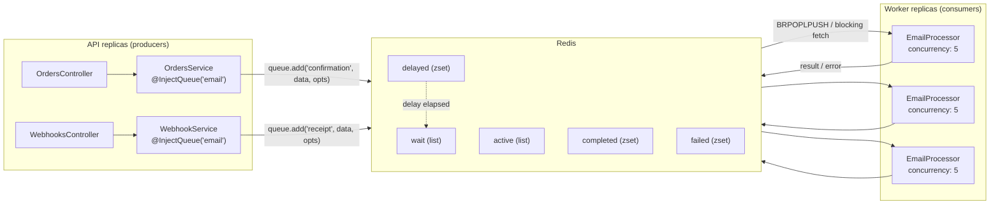
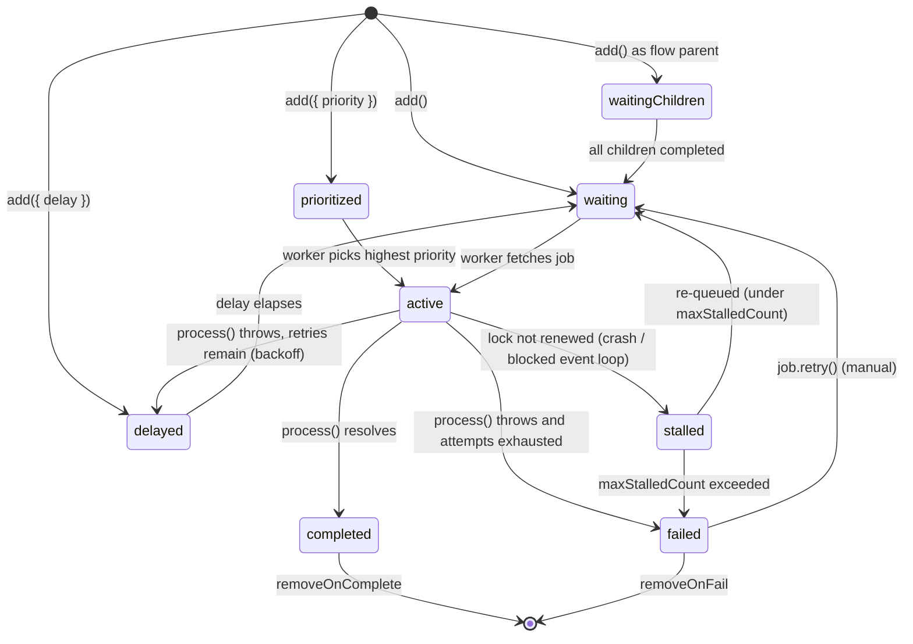

# Chapter 35 — Queues and Background Jobs with BullMQ

> **한눈에 보기**
> 34장의 인프로세스 이벤트가 사 주지 못한 것 — 내구성, 재시도, 프로세스 간 전달, 백프레셔 —
> 를 큐가 채웁니다. 이 장은 `@nestjs/bullmq`로 Redis 기반 작업 큐를 구축합니다.
> 프로듀서(`add`, 잡 옵션 전체), 컨슈머(`WorkerHost`, 동시성, 이름별 분기),
> 이벤트 리스너, 샌드박스 프로세서, 플로우(부모/자식 잡), 큐 운영 API를 다루고,
> 마지막에 문서가 말해 주지 않는 프로덕션 문제 — 멱등성, 독약 메시지와 DLQ,
> at-least-once 전달, 워커의 우아한 종료, Redis 메모리 증가 — 를 정면으로 다룹니다.

**What you will learn**

- When a queue is the right answer and when it is expensive ceremony around a function call you could have awaited.
- How `BullModule.forRoot()`, `forRootAsync()`, `registerQueue()`, and named configurations compose, and what each one actually creates in Redis.
- Every meaningful job option — `delay`, `attempts`, `backoff` (fixed, exponential, and custom strategies), `priority`, `lifo`, `jobId`, `removeOnComplete`/`removeOnFail`, `repeat` — and the ones that changed meaning between Bull and BullMQ.
- How to write a consumer with `WorkerHost`, dispatch on job name, set `concurrency`, report progress, and subscribe to worker and queue-level events.
- When to move a processor into a forked process and what you give up by doing so (all of dependency injection).
- The complete job lifecycle as a state machine, so you can reason about `stalled`, `delayed`, and `failed` instead of guessing.
- The production practices the docs omit: making handlers idempotent, quarantining poison messages, shutting workers down without losing in-flight jobs, and stopping Redis from growing without bound.

**Why this matters**

Every HTTP request has a budget. A user waiting on a spinner will tolerate a few hundred milliseconds; a load balancer will cut the connection at thirty seconds; a mobile network will drop it sooner. Meanwhile the work your application actually needs to do keeps getting slower and less reliable, because more of it involves someone else's server. Generating a PDF, transcoding audio, calling a payment provider, sending an email through a third-party API, syncing a CRM — none of these belong inside a request. When you do them inline, three things happen: your p99 latency becomes a function of your slowest vendor, a vendor outage becomes your outage, and a deploy in the middle of a long request silently destroys half-finished work.

Chapter 34 gave you a way to decouple: emit an event, let a listener handle it. That solves the coupling problem and none of the reliability problems. An in-process listener that throws loses the work. A process that restarts loses every in-flight listener. There is no retry, no visibility into what failed, no way to spread the load across machines, and no backpressure — if a thousand orders arrive at once, a thousand listener invocations start at once, and your database connection pool decides how the incident goes.

A queue is the answer to exactly those problems, and its cost is honest and bounded: you need Redis, and you need to think about semantics you could previously ignore. Jobs are persisted before they are processed, so a crash loses nothing. They are retried with backoff. They are consumed by workers you can scale independently of your API. And they arrive **at least once**, not exactly once — which means the burden of correctness shifts to you, in the form of idempotent handlers. That trade is the real content of this chapter. The API surface takes twenty minutes to learn; the discipline of writing handlers that are safe to run twice is what separates a queue that helps from a queue that quietly duplicates charges.

---

## The shape of the system

Before any API, understand the topology. A BullMQ queue is not an object in your process — it is a set of data structures in Redis, and your process holds two kinds of client to it.



Three facts follow from this picture and they explain most of BullMQ's behaviour:

1. **Redis is the queue.** Producers and consumers never talk to each other. They can live in different processes, different containers, even different languages. `registerQueue({ name: 'email' })` in two separate applications pointed at the same Redis gives you one shared queue.
2. **A job is JSON.** Whatever you pass as job data is serialised. A class instance arrives at the worker as a plain object with no prototype; a `Date` arrives as an ISO string; a `Buffer` arrives as `{ type: 'Buffer', data: [...] }`. Design the payload as a wire format, not as an in-memory object.
3. **Workers pull.** Nothing pushes a job to a worker. Each worker blocks on Redis waiting for work, takes a job, and moves it to `active`. This is why adding worker replicas scales throughput linearly with no coordination, and why a queue provides natural backpressure: work accumulates in Redis rather than in your event loop.

### When *not* to use a queue

Opinionated guidance, because the failure mode of over-adoption is real: a queue adds a Redis dependency, a second deployment, an at-least-once contract, and a latency floor of a few milliseconds. Do not queue work that is fast, in-process, and must be visible to the caller immediately. Writing a row, invalidating a cache, incrementing a counter — `await` those. Queue work that is slow, fallible, external, or bursty. If you cannot articulate which of those four applies, you probably want a direct call.

### BullMQ or Bull?

Nest ships two packages. They are not interchangeable.

| | `@nestjs/bullmq` + `bullmq` | `@nestjs/bull` + `bull` |
|---|---|---|
| Upstream status | actively developed | maintenance mode (bug fixes only) |
| Implementation | modern TypeScript | JavaScript with typings |
| Consumer API | `@Processor` class extends `WorkerHost`, single `process()` method | `@Processor` class with multiple `@Process()` methods |
| Named-job dispatch | manual `switch (job.name)` | `@Process('name')` per name |
| Worker events | `@OnWorkerEvent('completed')` | `@OnQueueCompleted()` and ~11 sibling decorators |
| Queue-level events | `@QueueEventsListener` + `@OnQueueEvent` | `@OnGlobalQueue*()` decorators |
| Connection option key | `connection` | `redis` |
| Progress API | `job.updateProgress(v)` | `job.progress(v)` |
| Flows / parent-child jobs | yes (`FlowProducer`) | no |
| Rate limiting, job schedulers | richer | basic |

**Use BullMQ for anything new.** This chapter is written against `@nestjs/bullmq`; where Bull differs in a way that will bite someone maintaining an older codebase, the difference is called out inline. If you are on Bull today and it meets your needs, it remains reliable and battle-tested — migrate when you need flows, better rate limiting, or the newer worker model, not on principle.

---

## Installation and module setup

```bash
$ npm install --save @nestjs/bullmq bullmq
```

BullMQ requires Redis. For local development:

```bash
$ docker run -d --name redis -p 6379:6379 redis:7-alpine
```

> **⚠️ Notice** — BullMQ needs `maxmemory-policy` set to `noeviction` on the Redis instance it uses. Any eviction policy (`allkeys-lru` and friends) can delete keys that BullMQ considers durable, corrupting queue state. If you share a Redis with a cache, use a **separate database index or, better, a separate instance** — the caching chapter's Redis is not a safe home for your queue.

### Static root configuration

```typescript title="app.module.ts"
import { Module } from '@nestjs/common';
import { BullModule } from '@nestjs/bullmq';

@Module({
  imports: [
    BullModule.forRoot({
      connection: {
        host: 'localhost',
        port: 6379,
      },
    }),
  ],
})
export class AppModule {}
```

`forRoot()` registers a shared configuration used by every queue in the application unless a queue overrides it. Its properties:

| Property | Type | Purpose |
|---|---|---|
| `connection` | `ConnectionOptions` | ioredis connection options, or an existing `IORedis` instance. Accepts `host`/`port`/`password`/`db`/`tls`, or a URL. |
| `prefix` | `string` | Key prefix for every queue key. Defaults to `bull`. Use it to isolate environments sharing one Redis. |
| `defaultJobOptions` | `JobsOptions` | Defaults applied to every `add()` call. The right place for `attempts`, `backoff`, and removal policy. |
| `settings` | `AdvancedOptions` | Low-level strategy overrides — chiefly `backoffStrategy` and repeat internals. Note that `lockDuration`, `stalledInterval` and `maxStalledCount` are **top-level `WorkerOptions` properties in BullMQ**, not members of `settings`; that grouping is a leftover from Bull. See the stalled-jobs section. |
| `extraOptions` | `{ manualRegistration?: boolean }` | Controls whether Nest auto-registers BullMQ components at `onModuleInit`. |

A production-shaped root configuration sets defaults once so that individual `add()` calls stay readable:

```typescript title="app.module.ts"
BullModule.forRoot({
  connection: { host: 'redis', port: 6379 },
  prefix: `{app-${process.env.NODE_ENV}}`,
  defaultJobOptions: {
    attempts: 3,
    backoff: { type: 'exponential', delay: 1_000 },
    removeOnComplete: { age: 3600, count: 1_000 },
    removeOnFail: { age: 24 * 3600 },
  },
});
```

Note the braces in `prefix`. If you run Redis Cluster, BullMQ's Lua scripts require all keys for a queue to land on the same hash slot, and `{...}` is the Redis hash-tag syntax that guarantees it. On single-node Redis the braces are harmless.

### Async configuration

Hard-coded connection details do not survive contact with an environment. Use `forRootAsync()` with the `ConfigService` from [Chapter 17 — Configuration and Environment Management](./17-configuration.md):

```typescript title="app.module.ts"
import { Module } from '@nestjs/common';
import { ConfigModule, ConfigService } from '@nestjs/config';
import { BullModule } from '@nestjs/bullmq';

@Module({
  imports: [
    ConfigModule.forRoot({ isGlobal: true }),
    BullModule.forRootAsync({
      imports: [ConfigModule],
      inject: [ConfigService],
      useFactory: async (config: ConfigService) => ({
        connection: {
          host: config.getOrThrow<string>('REDIS_HOST'),
          port: config.getOrThrow<number>('REDIS_PORT'),
          password: config.get<string>('REDIS_PASSWORD'),
          tls: config.get('REDIS_TLS') === 'true' ? {} : undefined,
        },
        defaultJobOptions: {
          attempts: config.get<number>('QUEUE_ATTEMPTS', 3),
          backoff: { type: 'exponential', delay: 1_000 },
          removeOnComplete: { age: 3600, count: 1_000 },
          removeOnFail: { age: 7 * 24 * 3600 },
        },
      }),
    }),
  ],
})
export class AppModule {}
```

Two alternatives to `useFactory` exist, matching the async-provider pattern used throughout Nest:

```typescript
// useClass — Nest instantiates BullConfigService inside BullModule.
BullModule.forRootAsync({ useClass: BullConfigService });

// useExisting — reuse a provider from an imported module rather than making a new one.
BullModule.forRootAsync({ imports: [ConfigModule], useExisting: ConfigService });
```

Either class must implement `SharedBullConfigurationFactory`:

```typescript title="bull-config.service.ts"
import { Injectable } from '@nestjs/common';
import { SharedBullConfigurationFactory } from '@nestjs/bullmq';
import { QueueOptions } from 'bullmq';

@Injectable()
export class BullConfigService implements SharedBullConfigurationFactory {
  constructor(private readonly config: ConfigService) {}

  createSharedConfiguration(): QueueOptions {
    return {
      connection: {
        host: this.config.getOrThrow('REDIS_HOST'),
        port: this.config.getOrThrow('REDIS_PORT'),
      },
    };
  }
}
```

### Registering queues

`forRoot()` configures; `registerQueue()` creates. A queue is identified by name, and that name is simultaneously the Redis key namespace, the DI injection token, and the argument to `@Processor()`.

```typescript title="email/email.module.ts"
import { Module } from '@nestjs/common';
import { BullModule } from '@nestjs/bullmq';
import { EmailService } from './email.service';
import { EmailProcessor } from './email.processor';

@Module({
  imports: [
    BullModule.registerQueue(
      { name: 'email' },
      { name: 'email-priority' },   // multiple queues in one call
    ),
  ],
  providers: [EmailService, EmailProcessor],
  exports: [BullModule],            // let other modules @InjectQueue('email')
})
export class EmailModule {}
```

`registerQueue()` goes in the **feature** module, not the root. Export `BullModule` from the feature module if another module needs to inject the queue — the injection token is created by `registerQueue()` and is only visible where that dynamic module is imported. Forgetting the `exports` line produces the error "Nest can't resolve dependencies of the X (BullQueue_email)", which is one of the most common setup failures.

Per-queue overrides and async registration work as you would expect:

```typescript
// Override just the port for this queue.
BullModule.registerQueue({ name: 'video', connection: { port: 6380 } });

// Async: note that `name` sits OUTSIDE the factory.
BullModule.registerQueueAsync({
  name: 'video',
  imports: [ConfigModule],
  inject: [ConfigService],
  useFactory: (config: ConfigService) => ({
    connection: { host: config.getOrThrow('VIDEO_REDIS_HOST'), port: 6379 },
    defaultJobOptions: { attempts: 5 },
  }),
});
```

### Named configurations for multiple Redis instances

When different queues live on different Redis instances, register each configuration under a key and point queues at it:

```typescript
// Register an alternative shared config under an arbitrary key.
BullModule.forRoot('alternative-config', {
  connection: { host: 'redis-video', port: 6381 },
});

// Point a queue at it.
BullModule.registerQueue({
  configKey: 'alternative-config',
  name: 'video',
});
```

This is worth reaching for when one queue's traffic could starve another — a high-volume analytics queue and a low-volume billing queue on the same Redis compete for the same connection pool and the same memory budget.

### Manual registration

By default `BullModule` wires up queues, processors, and event listeners during `onModuleInit`. Occasionally you need to decide at runtime — a shared image where API pods must not start workers, for example:

```typescript
BullModule.forRoot({
  connection: { host: 'redis', port: 6379 },
  extraOptions: { manualRegistration: true },
});
```

```typescript title="worker-bootstrap.service.ts"
import { Injectable, OnModuleInit } from '@nestjs/common';
import { BullRegistrar } from '@nestjs/bullmq';
import { ConfigService } from '@nestjs/config';

@Injectable()
export class WorkerBootstrapService implements OnModuleInit {
  constructor(
    private readonly registrar: BullRegistrar,
    private readonly config: ConfigService,
  ) {}

  onModuleInit() {
    if (this.config.get('ROLE') === 'worker') {
      this.registrar.register();
    }
  }
}
```

> **⚠️ Notice** — With `manualRegistration: true`, **nothing works until you call `register()`**. No processor runs, no job is consumed, and there is no warning. If you enable this flag, make the `register()` call impossible to miss and cover it with a test.

---

## Producing jobs

Inject the queue by name and call `add()`.

```typescript title="email/email.service.ts"
import { Injectable } from '@nestjs/common';
import { InjectQueue } from '@nestjs/bullmq';
import { Queue } from 'bullmq';

export interface ConfirmationJobData {
  orderId: string;
  userId: string;
  locale: string;
}

@Injectable()
export class EmailService {
  constructor(
    @InjectQueue('email') private readonly emailQueue: Queue,
  ) {}

  async queueOrderConfirmation(data: ConfirmationJobData) {
    const job = await this.emailQueue.add('order-confirmation', data, {
      jobId: `confirmation:${data.orderId}`,
      attempts: 5,
      backoff: { type: 'exponential', delay: 2_000 },
      removeOnComplete: true,
    });
    return job.id;
  }
}
```

`add(name, data, options)` takes three arguments in BullMQ; the job **name is mandatory** (Bull allowed an unnamed `add(data)`). The name is a routing label, not an identity — many jobs share a name. It returns a promise resolving to a `Job` instance once Redis has acknowledged the write, which is the moment the job becomes durable.

Type the data. `Queue` is generic — `Queue<ConfirmationJobData>` gives you a checked `add()` and a checked `job.data` on the consumer side, and it is free:

```typescript
constructor(
  @InjectQueue('email') private readonly emailQueue: Queue<ConfirmationJobData>,
) {}
```

### Bulk adds

Adding a thousand jobs in a loop is a thousand round trips. `addBulk()` pipelines them:

```typescript
async queueDigestForAll(userIds: string[]) {
  const jobs = userIds.map((userId) => ({
    name: 'weekly-digest',
    data: { userId },
    opts: { jobId: `digest:${userId}:${this.currentWeek()}` },
  }));
  return this.emailQueue.addBulk(jobs);
}
```

`addBulk` is not transactional — a partial failure can leave some jobs added — but it is dramatically faster and it is the right tool for fan-out. Chunk very large batches (a few thousand at a time) to avoid a single enormous pipeline.

---

## Job options in full

Options can be set per job in `add()`, or as `defaultJobOptions` at the root or queue level. Per-job options win.

| Option | Type | Meaning |
|---|---|---|
| `delay` | `number` (ms) | Do not make the job available until this many milliseconds have passed. Job sits in `delayed`. Requires producer and worker clocks to be reasonably in sync. |
| `attempts` | `number` | Total attempts, including the first. `attempts: 3` means one try plus two retries. Default `1`. |
| `backoff` | `number \| BackoffOptions` | Delay between retries. A bare number is a fixed delay in ms; the object form takes `{ type, delay }`. |
| `priority` | `number` | 1 = highest, `MAX_INT` = lowest. Jobs with priority are stored in a sorted set, which costs performance — use sparingly. Omitting it entirely is faster than setting a default. |
| `lifo` | `boolean` | Push to the front of the queue instead of the back. Default `false` (FIFO). |
| `jobId` | `string` | Override the generated id. **Adding a job whose id already exists is a silent no-op** — this is the built-in deduplication primitive. |
| `removeOnComplete` | `boolean \| number \| KeepJobs` | `true` deletes immediately; a number keeps the newest N; `{ age, count }` keeps by seconds and count. |
| `removeOnFail` | `boolean \| number \| KeepJobs` | Same, for the failed set. |
| `repeat` | `RepeatOptions` | Turns the job into a repeating job: `{ pattern }` (cron), `{ every }` (ms), plus `limit`, `startDate`, `endDate`, `tz`. |
| `stackTraceLimit` | `number` | Cap the number of stack frames recorded on failure. Useful when failures are large and numerous. |
| `parent` | `{ id, queue }` | Marks this job as a child of another; used by flows. |
| `keepLogs` | `number` | Cap the per-job log lines written with `job.log()`. |
| `deduplication` | `{ id, ttl }` | BullMQ's explicit deduplication window — ignores a job with the same dedup id within `ttl` ms. |

Bull had a `timeout` option that failed a job after N milliseconds. **BullMQ removed it.** There is no per-job timeout; you enforce deadlines inside the handler yourself, typically with `AbortSignal.timeout()` or `Promise.race`. This is the single most surprising Bull → BullMQ difference and it silently drops from configs during migration.

### Retries and backoff

```typescript
// Fixed: wait 5s before every retry.
await queue.add('sync', data, { attempts: 4, backoff: 5_000 });

// Exponential: 1s, 2s, 4s, 8s ...
await queue.add('sync', data, {
  attempts: 5,
  backoff: { type: 'exponential', delay: 1_000 },
});
```

Exponential backoff is the correct default for anything that calls a network. A fixed short backoff against a struggling upstream is a denial-of-service attack you launch against your own vendor: the moment they degrade, your retries multiply the load that degraded them.

For anything more nuanced — honouring a `Retry-After` header, adding jitter so a thousand simultaneous failures do not retry in lockstep — register a **custom backoff strategy** on the worker:

```typescript title="email/email.processor.ts"
import { Processor, WorkerHost } from '@nestjs/bullmq';

@Processor('email', {
  settings: {
    backoffStrategy: (attemptsMade: number, type: string, err: Error) => {
      if (type === 'jittered') {
        const base = Math.min(2 ** attemptsMade * 1_000, 60_000);
        return Math.round(base * (0.5 + Math.random() * 0.5)); // 50–100% jitter
      }
      if (type === 'respect-retry-after' && err instanceof RateLimitedError) {
        return err.retryAfterMs;
      }
      return 5_000;
    },
  },
})
export class EmailProcessor extends WorkerHost { /* ... */ }
```

```typescript
await queue.add('send', data, {
  attempts: 6,
  backoff: { type: 'jittered', delay: 1_000 },
});
```

The strategy lives on the **worker**, not the producer, because it is evaluated when a job fails. A producer can name a strategy the worker does not implement, in which case the fallback applies.

### Failing without retrying

Not every error deserves a retry. A malformed payload will fail identically five times and then land in `failed` five attempts later than it should. BullMQ gives you two escape hatches, and using them is the difference between a queue you can read and a queue full of noise:

```typescript
import { UnrecoverableError } from 'bullmq';

async process(job: Job<ConfirmationJobData>) {
  const user = await this.users.findById(job.data.userId);
  if (!user) {
    // Skip remaining attempts: this will never succeed.
    throw new UnrecoverableError(`User ${job.data.userId} no longer exists`);
  }
  // ...
}
```

```typescript
// Or discard the job entirely from inside the handler:
await job.discard(); // no further attempts after the current one fails
```

Classify errors deliberately: **retryable** (timeout, 5xx, connection reset, rate limit) versus **terminal** (4xx from a validation error, missing entity, malformed data). Retry the first class, `UnrecoverableError` the second.

### `jobId` and deduplication

```typescript
// Two calls, one job. The second add() resolves with the existing job.
await queue.add('confirmation', { orderId: 'o_123' }, { jobId: 'confirmation:o_123' });
await queue.add('confirmation', { orderId: 'o_123' }, { jobId: 'confirmation:o_123' });
```

This is the cheapest correctness tool in the chapter. If a webhook is delivered twice, or a user double-clicks, or an in-process event listener runs twice, a deterministic `jobId` collapses the duplicates into one job.

There is a catch worth internalising: the id is only unique while the job **exists in Redis**. Once `removeOnComplete` deletes it, the same id can be added again. That is usually what you want (a nightly job with a date-stamped id), but it means `jobId` gives you deduplication over a *window*, not forever. For permanent idempotency you still need the handler-side guard described later.

### Repeatable jobs

`repeat` turns a job into a schedule owned by Redis rather than by a process:

```typescript
await this.reportQueue.add(
  'nightly-rollup',
  {},
  {
    repeat: { pattern: '0 0 3 * * *', tz: 'Asia/Seoul' },
    jobId: 'nightly-rollup',      // stable id keeps one schedule, not N
    removeOnComplete: { count: 30 },
  },
);
```

This is the answer to the multi-replica cron problem from [Chapter 34](./34-scheduling-and-events.md). Every replica can call this on boot; because the repeat key is derived from the name, pattern, and id, they converge on **one** schedule in Redis, and exactly one worker picks up each occurrence. If you already run Redis for queues, repeatable jobs are a better default than `@nestjs/schedule` plus a distributed lock for any recurring work that produces a job.

Two operational notes. First, changing a pattern does not replace the old schedule — remove it explicitly with `queue.removeJobScheduler(key)` (`removeRepeatableByKey` on older versions), or you accumulate orphaned schedules that keep firing forever. List them with `queue.getJobSchedulers()`. Second, a repeatable job only fires while at least one process holds a connection to the queue; there is no server-side timer in Redis. If every replica is down at 03:00, that occurrence is missed, not deferred.

---

## The job lifecycle

Everything about debugging a queue becomes easier once you can name the state a job is in.



| State | Meaning | How to inspect |
|---|---|---|
| `waiting` | Ready, no worker has taken it | `queue.getWaiting()`, `getWaitingCount()` |
| `delayed` | Scheduled for the future (initial `delay`, or backoff between retries) | `queue.getDelayed()` |
| `prioritized` | Waiting, but ordered by priority rather than FIFO | `queue.getPrioritized()` |
| `active` | A worker is running `process()` right now | `queue.getActive()` |
| `completed` | Resolved successfully; return value stored on the job | `queue.getCompleted()` |
| `failed` | Threw and exhausted `attempts` | `queue.getFailed()`, `job.failedReason`, `job.stacktrace` |
| `stalled` | The worker stopped renewing its lock | `@OnWorkerEvent('stalled')` |
| `waiting-children` | A flow parent waiting on its children | `queue.getJobs(['waiting-children'])` |

### Stalled jobs: the state everyone misdiagnoses

A worker holds a **lock** on each active job and renews it periodically. If the lock expires without renewal, BullMQ concludes the worker died and returns the job to `waiting` so another worker can take it. Three settings govern this:

| Setting | Default | Meaning |
|---|---|---|
| `lockDuration` | 30 000 ms | How long a lock is valid before it must be renewed |
| `stalledInterval` | 30 000 ms | How often the worker checks for stalled jobs |
| `maxStalledCount` | 1 | How many times a job may stall before being moved to `failed` |

There are exactly two causes of a stall, and they need opposite fixes:

1. **The worker actually died** — a crash, an OOM kill, a `SIGKILL` during deploy. Re-queueing is correct, and this is the mechanism working as designed.
2. **The worker is alive but its event loop is blocked** — synchronous CPU work (image resizing, a large `JSON.parse`, a tight loop) prevents the lock-renewal timer from running. The job is still executing while a second worker picks it up and executes it again. This is a duplicate-execution bug that looks like a queue bug.

Do not "fix" case 2 by raising `lockDuration`. That hides the symptom and lengthens the window during which a genuine crash goes undetected. Fix it by moving the blocking work out of the event loop — a sandboxed processor (below) or a worker thread.

---

## Consumers

A consumer is a class decorated with `@Processor()` that extends `WorkerHost` and implements a single `process()` method.

```typescript title="email/email.processor.ts"
import { Processor, WorkerHost } from '@nestjs/bullmq';
import { Logger } from '@nestjs/common';
import { Job, UnrecoverableError } from 'bullmq';
import { ConfirmationJobData } from './email.service';

@Processor('email', { concurrency: 10 })
export class EmailProcessor extends WorkerHost {
  private readonly logger = new Logger(EmailProcessor.name);

  constructor(
    private readonly mailer: MailerService,
    private readonly users: UsersService,
  ) {
    super();
  }

  async process(job: Job<ConfirmationJobData, void, string>): Promise<void> {
    switch (job.name) {
      case 'order-confirmation':
        return this.sendConfirmation(job);
      case 'weekly-digest':
        return this.sendDigest(job);
      default:
        // Never silently ignore: an unknown name means a producer/consumer mismatch.
        throw new UnrecoverableError(`Unknown job name: ${job.name}`);
    }
  }

  private async sendConfirmation(job: Job<ConfirmationJobData>) {
    const user = await this.users.findById(job.data.userId);
    if (!user) throw new UnrecoverableError(`User ${job.data.userId} not found`);

    await job.log(`Sending confirmation to ${user.email}`);
    await this.mailer.send({
      to: user.email,
      template: 'order-confirmation',
      locale: job.data.locale,
      context: { orderId: job.data.orderId },
    });
  }

  private async sendDigest(job: Job<any>) { /* ... */ }
}
```

Non-negotiable details:

- **The class must be a provider.** `@Processor()` is a marker; `BullModule` finds it by walking the provider graph, exactly like `@Cron()` in the previous chapter.
- **`super()` is required** in the constructor, because `WorkerHost` has state to initialise. Omitting it produces a confusing "must call super" TypeScript error at best and a broken worker at worst.
- **`process()` is the only handler.** Its return value is stored on the job and delivered to `completed` listeners. Throwing marks the attempt failed.
- **Job type parameters are `<Data, Return, Name>`.** Spelling them out gives you a checked `job.data` and a checked `job.name` in the switch.

### Named-job dispatch

Bull let you write `@Process('transcode')` and have BullMQ route by name. **BullMQ removed this**, deliberately — it caused confusion around concurrency, because concurrency was per-worker but appeared per-handler. In BullMQ you dispatch yourself with a `switch`, as above.

The pattern that keeps this clean as the number of names grows is a handler map, which also makes each handler independently testable:

```typescript
type Handler = (job: Job) => Promise<unknown>;

@Processor('email', { concurrency: 10 })
export class EmailProcessor extends WorkerHost {
  private readonly handlers: Record<string, Handler> = {
    'order-confirmation': (job) => this.sendConfirmation(job),
    'weekly-digest': (job) => this.sendDigest(job),
    'password-reset': (job) => this.sendPasswordReset(job),
  };

  async process(job: Job) {
    const handler = this.handlers[job.name];
    if (!handler) throw new UnrecoverableError(`Unknown job name: ${job.name}`);
    return handler(job);
  }
}
```

### Concurrency

`concurrency` is how many jobs one worker instance processes simultaneously.

```typescript
@Processor('email', { concurrency: 25 })
```

Total throughput is `concurrency × worker replicas`. Choose it by asking what the work is bound by:

| Work is bound by | Sensible concurrency | Why |
|---|---|---|
| Network I/O (HTTP calls, SMTP) | 10–100 | The event loop is idle while waiting; high concurrency is nearly free |
| Database queries | ≤ connection pool size | Exceeding the pool converts queue pressure into pool timeouts |
| CPU (transcoding, PDF, image) | 1, plus a sandboxed processor | Node is single-threaded; concurrency ≥2 on CPU work just interleaves badly and stalls locks |

The database case deserves emphasis, because it is how a queue causes an outage. A worker with `concurrency: 50` against a pool of 10 does not run 50 queries — it runs 10 and makes 40 wait, and if the pool's acquire timeout is shorter than the query time, jobs fail with pool timeouts under exactly the load the queue was supposed to smooth. **Set concurrency at or below your pool size**, and remember the pool is shared with your HTTP handlers if the worker and API run in the same process.

Other `@Processor()` options worth knowing:

| Option | Purpose |
|---|---|
| `concurrency` | jobs in flight per worker |
| `limiter: { max, duration }` | rate limit: at most `max` jobs per `duration` ms across this worker |
| `autorun` | if `false`, the worker does not start until you call `worker.run()` |
| `settings` | `backoffStrategy`, `lockDuration`, `stalledInterval`, `maxStalledCount` |
| `scope` | `Scope.REQUEST` for a fresh consumer instance per job |
| `useWorkerThreads` | run the processor in a worker thread pool |

The rate limiter is how you respect a vendor's quota without hand-rolling a token bucket:

```typescript
// SendGrid free tier: 100 emails per minute.
@Processor('email', { concurrency: 10, limiter: { max: 100, duration: 60_000 } })
```

### Request-scoped consumers

Marking a processor request-scoped creates a fresh instance per job, garbage-collected when the job ends ([Chapter 38 — Injection Scopes](../part3-advanced/38-injection-scopes.md)):

```typescript
import { Processor, WorkerHost, JOB_REF } from '@nestjs/bullmq';
import { Inject, Scope } from '@nestjs/common';
import { Job } from 'bullmq';

@Processor({ name: 'audio', scope: Scope.REQUEST })
export class AudioProcessor extends WorkerHost {
  constructor(@Inject(JOB_REF) private readonly jobRef: Job) {
    super();
  }

  async process(job: Job) { /* ... */ }
}
```

`JOB_REF` gives the instance and its request-scoped dependencies access to the current job — useful for a per-job logger that automatically stamps the job id. The cost is that the entire dependency subtree is reinstantiated per job, which at high throughput is measurable. Prefer the default singleton scope and pass what you need through `job.data`; reach for request scope only when a genuinely request-scoped dependency (a tenant-aware connection, say) must be present.

### Progress

```typescript
async process(job: Job<TranscodeData>) {
  const chunks = await this.splitInput(job.data.fileId);
  for (const [i, chunk] of chunks.entries()) {
    await this.transcodeChunk(chunk);
    await job.updateProgress(Math.round(((i + 1) / chunks.length) * 100));
  }
  return { outputId: job.data.fileId };
}
```

`updateProgress()` accepts a number or an arbitrary object, which is more useful for a UI:

```typescript
await job.updateProgress({ phase: 'encoding', done: 42, total: 100 });
```

Progress writes to Redis, so it is not free. Update it at meaningful boundaries — every few percent, or once per chunk — not on every loop iteration. A tight loop calling `updateProgress` can generate more Redis traffic than the job's actual work.

Reading progress from a producer or an HTTP endpoint completes the loop:

```typescript
@Get(':id/progress')
async progress(@Param('id') id: string) {
  const job = await this.audioQueue.getJob(id);
  if (!job) throw new NotFoundException();
  return { state: await job.getState(), progress: job.progress };
}
```

---

## Events

BullMQ emits events at two levels, and the distinction matters when your workers are distributed.

### Worker events — local to this process

`@OnWorkerEvent()` methods live inside a `@Processor()` class and fire for jobs **this worker** handled.

```typescript title="email/email.processor.ts"
import { Processor, WorkerHost, OnWorkerEvent } from '@nestjs/bullmq';
import { Logger } from '@nestjs/common';
import { Job } from 'bullmq';

@Processor('email', { concurrency: 10 })
export class EmailProcessor extends WorkerHost {
  private readonly logger = new Logger(EmailProcessor.name);

  async process(job: Job) { /* ... */ }

  @OnWorkerEvent('active')
  onActive(job: Job) {
    this.logger.debug(`Job ${job.id} (${job.name}) started`);
  }

  @OnWorkerEvent('completed')
  onCompleted(job: Job, result: unknown) {
    this.metrics.observe('queue.job.duration', Date.now() - (job.processedOn ?? 0), {
      queue: 'email', name: job.name,
    });
  }

  @OnWorkerEvent('failed')
  onFailed(job: Job | undefined, err: Error) {
    this.logger.error(
      `Job ${job?.id} failed on attempt ${job?.attemptsMade}: ${err.message}`,
      err.stack,
    );
    if (job && job.attemptsMade >= (job.opts.attempts ?? 1)) {
      this.alerts.notify(`Email job ${job.id} exhausted retries`);
    }
  }

  @OnWorkerEvent('stalled')
  onStalled(jobId: string) {
    this.logger.warn(`Job ${jobId} stalled — worker died or event loop blocked`);
  }

  @OnWorkerEvent('error')
  onError(err: Error) {
    this.logger.error('Worker-level error (often a Redis connection issue)', err.stack);
  }
}
```

| Event | Handler signature | Fires when |
|---|---|---|
| `active` | `(job, prev)` | A job moves into processing |
| `completed` | `(job, result)` | `process()` resolved |
| `failed` | `(job \| undefined, error, prev)` | An attempt threw. Fires on **every** attempt, not just the last |
| `progress` | `(job, progress)` | `updateProgress()` was called |
| `stalled` | `(jobId)` | The lock expired without renewal |
| `error` | `(error)` | Worker-level error, typically a Redis connection problem |
| `drained` | `()` | The queue has no more waiting jobs (delayed jobs may remain) |
| `paused` / `resumed` | `()` | The worker was paused or resumed |
| `closing` / `closed` | `()` | The worker is shutting down |
| `ready` | `()` | The worker connected to Redis |

The `failed` handler is where teams go wrong most often. It fires on **each attempt**, so alerting from it unconditionally means five pages for one job with `attempts: 5`. Guard on `attemptsMade >= opts.attempts` as above, or alert from a queue-events listener instead.

Note also that `job` can be `undefined` in `failed` — it happens when the job could not be loaded from Redis, for instance because it was removed concurrently. Handle the optional; a naive `job.id` here is a crash inside your error handler.

### Queue events — global across processes

Producers usually run in a different process from workers, so a producer's worker-event listeners never fire. `@QueueEventsListener()` subscribes to Redis's queue event stream instead, so it sees events regardless of which worker did the work.

```typescript title="email/email-events.listener.ts"
import {
  QueueEventsHost,
  QueueEventsListener,
  OnQueueEvent,
} from '@nestjs/bullmq';
import { Logger } from '@nestjs/common';

@QueueEventsListener('email')
export class EmailEventsListener extends QueueEventsHost {
  private readonly logger = new Logger(EmailEventsListener.name);

  @OnQueueEvent('completed')
  onCompleted({ jobId, returnvalue }: { jobId: string; returnvalue: string }) {
    this.logger.log(`Job ${jobId} completed somewhere in the fleet`);
  }

  @OnQueueEvent('failed')
  onFailed({ jobId, failedReason }: { jobId: string; failedReason: string }) {
    this.metrics.increment('queue.failed', { queue: 'email' });
  }

  @OnQueueEvent('waiting')
  onWaiting({ jobId }: { jobId: string }) { /* ... */ }
}
```

Register it as a provider like any other consumer. The critical difference from worker events: **queue-event handlers receive ids and strings, not `Job` objects**, because the event travelled through Redis. To get the job, load it:

```typescript
@OnQueueEvent('completed')
async onCompleted({ jobId }: { jobId: string }) {
  const job = await this.emailQueue.getJob(jobId);
  // job may be null if removeOnComplete already deleted it.
}
```

| Use case | Listener type |
|---|---|
| Per-worker metrics, structured logging of the job you ran | `@OnWorkerEvent` |
| Fleet-wide dashboards, alerting, notifying a user their job finished | `@OnQueueEvent` |
| Reacting in the producer process to work done elsewhere | `@OnQueueEvent` |

For readers maintaining a Bull codebase: Bull expressed exactly this distinction with paired decorators — `@OnQueueCompleted()` (local) and `@OnGlobalQueueCompleted()` (global), and likewise for `Error`, `Waiting`, `Active`, `Stalled`, `Progress`, `Failed`, `Paused`, `Resumed`, `Cleaned`, `Drained`, `Removed`. Global handlers received a `jobId` where local ones received a `Job`, exactly as BullMQ's queue events do. The concept survived the rewrite; only the spelling changed.

---

## Sandboxed (separate-process) processors

A processor can run in a forked child process instead of the main one:

```typescript title="audio/audio.module.ts"
import { Module } from '@nestjs/common';
import { BullModule } from '@nestjs/bullmq';
import { join } from 'node:path';

@Module({
  imports: [
    BullModule.registerQueue({
      name: 'audio',
      processors: [join(__dirname, 'audio.sandboxed-processor.js')],
    }),
  ],
})
export class AudioModule {}
```

```typescript title="audio/audio.sandboxed-processor.ts"
import { SandboxedJob } from 'bullmq';

// No DI here. Everything this needs must be created inside the file.
export default async function (job: SandboxedJob<TranscodeData>) {
  const ffmpeg = require('fluent-ffmpeg');
  await job.updateProgress(0);
  const output = await transcode(ffmpeg, job.data.inputPath);
  await job.updateProgress(100);
  return { output };
}
```

What you gain:

- The child is sandboxed — a crash or an OOM kills the child, not the worker.
- Blocking synchronous code cannot stall the main event loop, so locks keep renewing and jobs do not falsely stall.
- Real multi-core utilisation; the OS schedules children on separate cores.
- Fewer Redis connections, since the parent owns the connection.

> **⚠️ Notice** — **Dependency injection is not available in a sandboxed processor.** There is no Nest container in the child process. Your `ConfigService`, your repositories, your logger — none of them exist. The processor file must construct or import everything it needs, and it receives configuration only through `job.data` and `process.env`.

That constraint is severe enough to make sandboxed processors a specialist tool rather than a default. Use them when the work is genuinely CPU-bound and self-contained: image resizing, video transcoding, PDF rendering, cryptographic work, large parsing. Do not use them for I/O-bound work — an async HTTP call does not block the event loop and gains nothing from a fork, while paying the cost of losing DI.

Also mind the path: `processors` points at a **compiled `.js` file**. During development with `ts-node` or `nest start --watch`, `join(__dirname, 'x.js')` may not exist. Either point at the built output, or register the sandboxed processor only in production and use an in-process processor in development.

BullMQ additionally supports `useWorkerThreads: true` on the processor options, which runs the handler in a worker thread rather than a forked process — cheaper to start, shared memory, but a crash is more likely to take the process with it. Threads are a reasonable middle ground for short CPU bursts; forks are safer for long or memory-hungry work.

---

## Flows: parent and child jobs

`FlowProducer` builds trees of jobs where a parent does not become available until every child has completed. This is how you express "fan out, then aggregate" without polling.

```typescript title="reports/reports.module.ts"
BullModule.registerFlowProducer({ name: 'report-flow' });
```

```typescript title="reports/reports.service.ts"
import { Injectable } from '@nestjs/common';
import { InjectFlowProducer } from '@nestjs/bullmq';
import { FlowProducer } from 'bullmq';

@Injectable()
export class ReportsService {
  constructor(
    @InjectFlowProducer('report-flow') private readonly flow: FlowProducer,
  ) {}

  async buildMonthlyReport(month: string, regionIds: string[]) {
    return this.flow.add({
      name: 'assemble-report',
      queueName: 'reports',
      data: { month },
      opts: { removeOnComplete: false },
      children: regionIds.map((regionId) => ({
        name: 'compute-region',
        queueName: 'reports',
        data: { month, regionId },
        opts: { attempts: 3 },
      })),
    });
  }
}
```

The parent sits in `waiting-children` until every child completes, then moves to `waiting` and is picked up like any other job. The parent reads its children's return values with `getChildrenValues()`:

```typescript title="reports/reports.processor.ts"
@Processor('reports')
export class ReportsProcessor extends WorkerHost {
  async process(job: Job) {
    if (job.name === 'compute-region') {
      return this.computeRegion(job.data.month, job.data.regionId); // returned value stored
    }
    if (job.name === 'assemble-report') {
      // Keys are `${queueName}:${childJobId}`; values are the children's return values.
      const childValues = await job.getChildrenValues<RegionTotals>();
      return this.assemble(job.data.month, Object.values(childValues));
    }
  }
}
```

Children can be nested arbitrarily deep, and children may live in **different queues** — a common pattern is children in a high-concurrency `compute` queue and the parent in a low-concurrency `assemble` queue.

Two caveats. If a child fails permanently, the parent never becomes available and sits in `waiting-children` forever; monitor that count and decide explicitly whether a partial result is acceptable (`ignoreDependencyOnFailure` or `failParentOnFailure` on the child options control this). And note the documented quirk that `defaultJobOptions` set at the module level do **not** apply to jobs created through a `FlowProducer` — set options explicitly on every node of a flow.

---

## Managing queues in production

The `Queue` object is also an admin API. These are the methods you will actually use.

```typescript title="queues/queue-admin.service.ts"
import { Injectable } from '@nestjs/common';
import { InjectQueue } from '@nestjs/bullmq';
import { Queue } from 'bullmq';

@Injectable()
export class QueueAdminService {
  constructor(@InjectQueue('email') private readonly queue: Queue) {}

  // Stop taking NEW jobs. In-flight jobs run to completion.
  pause() { return this.queue.pause(); }
  resume() { return this.queue.resume(); }

  // Counts per state — the basis of every dashboard and alert.
  counts() {
    return this.queue.getJobCounts(
      'waiting', 'active', 'delayed', 'completed', 'failed', 'paused',
    );
  }

  // Page through jobs in a given state.
  failedPage(start = 0, end = 49) {
    return this.queue.getJobs(['failed'], start, end, /* asc */ false);
  }

  // Delete waiting + delayed jobs. Does NOT touch active/completed/failed.
  drain(delayed = true) { return this.queue.drain(delayed); }

  // Remove jobs of a state older than `graceMs`, up to `limit`.
  cleanCompleted() {
    return this.queue.clean(24 * 3600 * 1000, 1_000, 'completed');
  }

  // Nuclear: delete the queue and ALL its data.
  async obliterate() { return this.queue.obliterate({ force: true }); }

  // Retry a specific failed job.
  async retry(jobId: string) {
    const job = await this.queue.getJob(jobId);
    await job?.retry();
  }

  // Bulk-retry everything currently failed.
  async retryAllFailed() {
    const failed = await this.queue.getJobs(['failed']);
    await Promise.all(failed.map((j) => j.retry()));
  }
}
```

| Method | Effect | When you reach for it |
|---|---|---|
| `pause()` / `resume()` | Stop/start job intake globally for the queue | A vendor outage; a risky migration |
| `getJobCounts(...states)` | Counts per state | Metrics, alerting on `waiting` depth |
| `getJobs(states, start, end, asc)` | Paginated job list | Admin UI, debugging |
| `getJob(id)` | One job, or `null` | Progress endpoints, retry flows |
| `drain(delayed?)` | Removes `waiting` (and optionally `delayed`) | Discarding a backlog of now-irrelevant work |
| `clean(graceMs, limit, state)` | Removes jobs of a state older than the grace period | Scheduled housekeeping |
| `obliterate({ force })` | Deletes the queue entirely | Tests, and essentially nothing else |
| `job.retry()` | Moves a failed job back to `waiting` | Recovering after fixing a bug |
| `job.remove()` | Deletes a single job | Removing a poison message |

`pause()` is worth understanding precisely: it prevents workers from **taking new** jobs. Jobs already `active` continue to completion, and producers can still `add()` — the queue keeps accepting work, it just stops handing it out. That is exactly the behaviour you want during a vendor incident: nothing is lost, everything resumes when you call `resume()`.

Expose these behind a guarded admin controller, never publicly. `obliterate()` reachable from an unauthenticated endpoint is a data-loss vulnerability.

### Monitoring: Bull Board

Counts and logs get you a long way, but a UI where you can inspect a failed job's stack trace and retry it is worth the twenty minutes it takes to mount.

```bash
$ npm install --save @bull-board/api @bull-board/express @bull-board/nestjs
```

```typescript title="app.module.ts"
import { BullBoardModule } from '@bull-board/nestjs';
import { ExpressAdapter } from '@bull-board/express';
import { BullMQAdapter } from '@bull-board/api/bullMQAdapter';

@Module({
  imports: [
    BullBoardModule.forRoot({
      route: '/admin/queues',
      adapter: ExpressAdapter,
    }),
    BullBoardModule.forFeature({ name: 'email', adapter: BullMQAdapter }),
  ],
})
export class AppModule {}
```

Bull Board gives you per-queue counts, job payloads, stack traces, retry and remove buttons, and a live view of active jobs. **Put it behind authentication.** It exposes every job payload — which, for an email queue, means every user's email address, and for a payments queue, considerably worse. A guard on the route, or a separate internal-only port, is not optional.

For metrics-based alerting rather than a UI, export `getJobCounts()` to Prometheus on a short interval and alert on two things: `failed` increasing, and `waiting` growing monotonically. The second is the early warning that your workers cannot keep up, and it appears well before users notice.

---

## Production concerns the documentation does not cover

Everything so far is API. This section is the part that decides whether the queue helps you at 3am.

### At-least-once delivery, and therefore idempotency

BullMQ guarantees **at-least-once** delivery. A job can be processed more than once, and the cases are ordinary rather than exotic:

- A worker is `SIGKILL`ed after sending an email but before acknowledging completion; the lock expires; another worker re-runs the job.
- The event loop blocks past `lockDuration`; the job is declared stalled and picked up by a second worker while the first is still running it.
- Someone clicks retry in Bull Board on a job that had actually succeeded.
- A retry fires after a partial success — three of five emails sent, then a timeout.

There is no configuration that makes this go away. **Every handler must be safe to run twice.** Three techniques, in increasing order of strength:

```typescript
// 1. Natural idempotency — the operation has no incremental effect.
async process(job: Job<{ userId: string; tier: string }>) {
  await this.users.update(job.data.userId, { tier: job.data.tier }); // set, not increment
}
```

```typescript
// 2. Conditional write — make the database enforce it.
async process(job: Job<{ orderId: string }>) {
  const { affected } = await this.orders
    .createQueryBuilder()
    .update()
    .set({ status: 'confirmed', confirmedAt: new Date() })
    .where('id = :id AND status = :from', { id: job.data.orderId, from: 'pending' })
    .execute();

  if (affected === 0) {
    this.logger.log(`Order ${job.data.orderId} already confirmed; skipping`);
    return;
  }
  await this.mailer.sendConfirmation(job.data.orderId);
}
```

```typescript
// 3. Idempotency key — a unique row that a second run cannot insert.
async process(job: Job<{ chargeId: string; amountCents: number }>) {
  const key = `charge:${job.data.chargeId}`;
  try {
    await this.idempotency.insert({ key, jobId: String(job.id) }); // UNIQUE constraint
  } catch (e) {
    if (isUniqueViolation(e)) {
      this.logger.log(`Charge ${job.data.chargeId} already processed`);
      return;
    }
    throw e;
  }
  // Pass the same key to the vendor so THEY deduplicate too.
  await this.payments.charge({
    amountCents: job.data.amountCents,
    idempotencyKey: key,
  });
}
```

Technique 3 is the one to use for anything involving money or an external side effect, and the final detail is the important one: propagate your idempotency key to the vendor. Stripe, and every payment API worth using, accepts an idempotency key precisely so that your retry does not become their second charge.

### Poison messages and the dead-letter pattern

A poison message is a job that fails every time — a malformed payload, a reference to a deleted entity, a bug triggered by one specific input. With `attempts: 5` and exponential backoff it consumes five worker slots and a fair amount of logging before landing in `failed`, where by default it stays forever.

BullMQ has no built-in dead-letter queue. Build one; it is ten lines:

```typescript title="email/email.processor.ts"
@Processor('email')
export class EmailProcessor extends WorkerHost {
  constructor(
    @InjectQueue('email-dlq') private readonly dlq: Queue,
  ) { super(); }

  async process(job: Job) { /* ... */ }

  @OnWorkerEvent('failed')
  async onFailed(job: Job | undefined, err: Error) {
    if (!job) return;
    const exhausted = job.attemptsMade >= (job.opts.attempts ?? 1);
    if (!exhausted) return;

    await this.dlq.add('dead-letter', {
      originalQueue: 'email',
      originalJobId: job.id,
      name: job.name,
      data: job.data,
      failedReason: err.message,
      stacktrace: job.stacktrace,
      failedAt: new Date().toISOString(),
    }, { removeOnComplete: false, removeOnFail: false });

    this.alerts.notify(`Email job ${job.id} dead-lettered: ${err.message}`);
  }
}
```

The DLQ has no processor. It is a durable inbox that a human inspects, and its value is that `failed` on the main queue stays a transient state you can safely clean while genuinely dead work is preserved with full context. Pair it with the `UnrecoverableError` classification from earlier: terminal errors go straight to the DLQ after one attempt instead of burning five.

### Graceful shutdown

This is the failure mode that turns a deploy into an incident. When Kubernetes rolls a worker pod, it sends `SIGTERM` and then `SIGKILL` after `terminationGracePeriodSeconds`. If your worker is mid-job when `SIGKILL` lands, the job stalls and is re-run — at-least-once in action, and precisely the situation your idempotency work was for. But you can usually avoid it entirely.

```typescript title="main.ts"
import { NestFactory } from '@nestjs/core';
import { AppModule } from './app.module';

async function bootstrap() {
  const app = await NestFactory.create(AppModule);
  // Required: without this, Nest does not listen for SIGTERM/SIGINT
  // and onModuleDestroy / onApplicationShutdown never run.
  app.enableShutdownHooks();
  await app.listen(3000);
}
bootstrap();
```

`@nestjs/bullmq` closes workers on shutdown, and BullMQ's `worker.close()` stops fetching new jobs and waits for in-flight ones to finish. Two things you must get right around it:

1. **`app.enableShutdownHooks()` must be called.** Without it, Nest's shutdown lifecycle never fires and the worker is killed abruptly. See [Chapter 39 — Lifecycle Events and Graceful Shutdown](../part3-advanced/39-lifecycle-and-shutdown.md).
2. **The grace period must exceed your longest job.** If jobs can take five minutes and `terminationGracePeriodSeconds` is 30, every deploy `SIGKILL`s in-flight work. Either raise the grace period, or cap job duration so it fits.

For explicit control — for instance, to pause intake early and log what is still running:

```typescript title="worker-shutdown.service.ts"
import { Injectable, OnApplicationShutdown, Logger } from '@nestjs/common';
import { InjectQueue } from '@nestjs/bullmq';
import { Queue } from 'bullmq';

@Injectable()
export class WorkerShutdownService implements OnApplicationShutdown {
  private readonly logger = new Logger(WorkerShutdownService.name);

  constructor(@InjectQueue('email') private readonly queue: Queue) {}

  async onApplicationShutdown(signal?: string) {
    this.logger.log(`Received ${signal}; draining worker`);
    const active = await this.queue.getActiveCount();
    this.logger.log(`${active} job(s) still active; waiting for completion`);
    // BullModule closes the worker after this hook; jobs finish or stall.
  }
}
```

Design long jobs to be **interruptible and resumable**: checkpoint progress into `job.data` or a database row, and on re-run resume from the checkpoint rather than starting over. A three-hour job that cannot be interrupted is a job that will never survive a deploy.

### Redis memory growth

The default behaviour is to keep completed and failed jobs forever. That is convenient for a week and then it is an incident: Redis fills, and with `noeviction` (which you correctly set) writes start failing, which means `add()` starts throwing, which means requests start failing. Your queue takes down your API.

Set removal policy from day one, at the root so no queue is forgotten:

```typescript
BullModule.forRoot({
  connection: { /* ... */ },
  defaultJobOptions: {
    // Keep completed jobs for 1 hour, and at most 1000 of them.
    removeOnComplete: { age: 3600, count: 1_000 },
    // Keep failures for a week — you need them for debugging.
    removeOnFail: { age: 7 * 24 * 3600 },
  },
});
```

Guidance that holds up in practice:

- **Completed jobs:** remove aggressively. Their value is a few minutes of "did it run?", after which metrics and logs serve better. `{ age: 3600, count: 1000 }` is a reasonable default; `removeOnComplete: true` is right for very high-volume queues.
- **Failed jobs:** keep for days, and combine with a DLQ so that cleaning the failed set does not destroy evidence.
- **Payload size:** job data is stored in Redis. Never put a file, an image, or a large document in `job.data` — store it in S3 or on disk and put the **key** in the job. A queue carrying 5 MB payloads at a thousand jobs an hour needs 5 GB an hour of Redis, and Redis is the most expensive place per byte in your stack.
- **Repeatable jobs:** audit `getJobSchedulers()` periodically. Orphaned schedules from changed patterns are a slow leak that also generates work forever.
- **Monitor `used_memory` against `maxmemory`** and alert well before the ceiling, because the failure mode is write rejection, not graceful degradation.

---

## Testing queues

There are three levels, and you want all three.

**1. Unit-test the producer with a mock queue.** The service under test only needs `add`:

```typescript title="email.service.spec.ts"
import { Test } from '@nestjs/testing';
import { getQueueToken } from '@nestjs/bullmq';
import { EmailService } from './email.service';

describe('EmailService', () => {
  let service: EmailService;
  const queueMock = { add: jest.fn().mockResolvedValue({ id: '1' }) };

  beforeEach(async () => {
    const moduleRef = await Test.createTestingModule({
      providers: [
        EmailService,
        { provide: getQueueToken('email'), useValue: queueMock },
      ],
    }).compile();
    service = moduleRef.get(EmailService);
  });

  it('enqueues a deduplicated confirmation job', async () => {
    await service.queueOrderConfirmation({ orderId: 'o_1', userId: 'u_1', locale: 'ko' });
    expect(queueMock.add).toHaveBeenCalledWith(
      'order-confirmation',
      expect.objectContaining({ orderId: 'o_1' }),
      expect.objectContaining({ jobId: 'confirmation:o_1' }),
    );
  });
});
```

`getQueueToken(name)` is the exported helper that produces the same injection token `@InjectQueue(name)` resolves. Use it rather than guessing the string.

**2. Unit-test the processor by calling `process()` directly.** A processor is an ordinary class; construct it with mocked dependencies and hand it a fake job. No Redis required:

```typescript
it('marks a missing user as unrecoverable', async () => {
  const processor = new EmailProcessor(mailerMock, { findById: async () => null } as any);
  const job = { name: 'order-confirmation', data: { userId: 'gone' }, log: jest.fn() } as any;
  await expect(processor.process(job)).rejects.toBeInstanceOf(UnrecoverableError);
});
```

This is where the handler-map pattern pays off: each private handler is independently testable.

**3. Integration-test against a real Redis.** Mocks cannot tell you whether your backoff, dedup, or flow configuration is right. Use a throwaway Redis (Testcontainers, or a dedicated `db` index in CI) and assert on real state:

```typescript title="email.queue.e2e-spec.ts"
let app: INestApplication;
let queue: Queue;

beforeAll(async () => {
  const moduleRef = await Test.createTestingModule({ imports: [AppModule] }).compile();
  app = moduleRef.createNestApplication();
  await app.init();
  queue = app.get<Queue>(getQueueToken('email'));
});

afterEach(async () => {
  await queue.obliterate({ force: true }); // clean slate between tests
});

afterAll(async () => {
  await app.close(); // closes workers and Redis connections
});

it('deduplicates by jobId', async () => {
  await service.queueOrderConfirmation({ orderId: 'o_1', userId: 'u_1', locale: 'ko' });
  await service.queueOrderConfirmation({ orderId: 'o_1', userId: 'u_1', locale: 'ko' });
  expect(await queue.getWaitingCount()).toBe(1);
});

it('processes the job', async () => {
  const job = await queue.add('order-confirmation', { orderId: 'o_2', userId: 'u_1', locale: 'ko' });
  await job.waitUntilFinished(new QueueEvents('email', { connection }));
  expect(await job.getState()).toBe('completed');
});
```

Three practices keep these tests from becoming flaky: `obliterate()` between tests so state never leaks; `job.waitUntilFinished(queueEvents)` instead of `setTimeout`; and `await app.close()` in `afterAll`, without which Jest hangs on open Redis handles and you spend an afternoon on `--detectOpenHandles`. More on test structure in [Chapter 31 — Testing](./31-testing.md).

---

## Common mistakes

1. **The processor is not registered as a provider.** *Symptom:* jobs pile up in `waiting` and nothing consumes them. *Cause:* `@Processor()` is discovered by walking the provider graph. *Fix:* add the class to `providers`. Confirm with `getWaitingCount()` climbing while `getActiveCount()` stays at zero.

2. **`BullModule` is not exported from the feature module.** *Symptom:* `Nest can't resolve dependencies of the OrdersService (?). Please make sure that the argument BullQueue_email at index [0] is available`. *Cause:* the queue token only exists where `registerQueue()` was imported. *Fix:* `exports: [BullModule]` in the module that registers the queue.

3. **Forgetting `super()` in the processor constructor.** *Symptom:* a TypeScript error, or a worker that never starts. *Cause:* `WorkerHost` requires base initialisation. *Fix:* call `super()` first in the constructor.

4. **Assuming `@Process('name')` works in BullMQ.** *Symptom:* nothing is consumed after migrating from Bull. *Cause:* BullMQ removed per-name handler methods. *Fix:* one `process()` with a `switch (job.name)` or a handler map.

5. **Concurrency higher than the database pool.** *Symptom:* jobs fail with connection-acquire timeouts under exactly the load the queue was meant to absorb. *Cause:* the worker requests more connections than exist. *Fix:* set `concurrency` ≤ pool size, remembering the pool is shared with HTTP handlers in a combined process.

6. **Alerting from `failed` without checking `attemptsMade`.** *Symptom:* five pages for one job. *Cause:* `failed` fires on every attempt. *Fix:* guard on `job.attemptsMade >= job.opts.attempts`, or alert from a queue-events listener.

7. **Handlers that are not idempotent.** *Symptom:* duplicate emails, double charges, duplicate rows after a deploy or a crash. *Cause:* at-least-once delivery is the contract, not a bug. *Fix:* conditional writes, unique idempotency keys, and vendor-side idempotency keys.

8. **Retrying terminal errors.** *Symptom:* the `failed` set fills with the same malformed payload, five entries at a time. *Cause:* every error is treated as retryable. *Fix:* classify errors and throw `UnrecoverableError` for terminal ones; add a DLQ.

9. **No removal policy.** *Symptom:* Redis reaches `maxmemory`, `add()` starts throwing, the API begins failing. *Cause:* completed and failed jobs are kept forever by default. *Fix:* `removeOnComplete` / `removeOnFail` in `defaultJobOptions` from day one, and monitor `used_memory`.

10. **Large payloads in `job.data`.** *Symptom:* Redis memory grows far faster than job count suggests; latency rises. *Cause:* files or documents stored inline. *Fix:* store the artefact in object storage; put the key in the job.

11. **No `app.enableShutdownHooks()`.** *Symptom:* every deploy leaves stalled jobs and duplicate side effects. *Cause:* Nest never runs its shutdown lifecycle, so workers are killed mid-job. *Fix:* enable the hooks and set a grace period longer than your longest job.

12. **A shared cache Redis with an eviction policy.** *Symptom:* jobs vanish, or queue state becomes inconsistent in ways that look like BullMQ bugs. *Cause:* `allkeys-lru` evicts keys BullMQ treats as durable. *Fix:* a separate instance, or at minimum a separate database with `noeviction`.

13. **Changing a repeatable job's pattern without removing the old one.** *Symptom:* a job that fires on both the old and the new schedule. *Cause:* the repeat key is derived from the pattern, so a new pattern creates a new schedule. *Fix:* `getJobSchedulers()` and `removeJobScheduler(key)` before adding the new one.

14. **`obliterate()` reachable from an unguarded route.** *Symptom:* a queue disappears. *Cause:* an admin API without a guard. *Fix:* guard admin endpoints and Bull Board; treat them as production-destructive.

---

## Putting it together

An order-confirmation pipeline that exercises most of the chapter: an idempotent producer, a consumer with typed named-job dispatch, a rate limiter, error classification, a dead-letter queue, metrics from worker events, and a guarded admin endpoint.

```typescript title="email/email.module.ts"
import { Module } from '@nestjs/common';
import { ConfigModule, ConfigService } from '@nestjs/config';
import { BullModule } from '@nestjs/bullmq';
import { EmailService } from './email.service';
import { EmailProcessor } from './email.processor';
import { EmailEventsListener } from './email-events.listener';
import { EmailAdminController } from './email-admin.controller';

@Module({
  imports: [
    BullModule.registerQueueAsync({
      name: 'email',
      imports: [ConfigModule],
      inject: [ConfigService],
      useFactory: (config: ConfigService) => ({
        defaultJobOptions: {
          attempts: config.get<number>('EMAIL_ATTEMPTS', 5),
          backoff: { type: 'exponential', delay: 2_000 },
          removeOnComplete: { age: 3_600, count: 1_000 },
          removeOnFail: { age: 7 * 24 * 3_600 },
        },
      }),
    }),
    // Dead-letter queue: no processor, deliberately never auto-cleaned.
    BullModule.registerQueue({ name: 'email-dlq' }),
  ],
  controllers: [EmailAdminController],
  providers: [EmailService, EmailProcessor, EmailEventsListener],
  exports: [BullModule, EmailService],
})
export class EmailModule {}
```

```typescript title="email/email.types.ts"
export interface OrderConfirmationData {
  orderId: string;
  userId: string;
  locale: string;
  correlationId: string;
}

export interface PasswordResetData {
  userId: string;
  token: string;
  correlationId: string;
}

export type EmailJobData = OrderConfirmationData | PasswordResetData;

export const EMAIL_JOBS = {
  ORDER_CONFIRMATION: 'order-confirmation',
  PASSWORD_RESET: 'password-reset',
} as const;
```

```typescript title="email/email.service.ts"
import { Injectable } from '@nestjs/common';
import { InjectQueue } from '@nestjs/bullmq';
import { Queue } from 'bullmq';
import { EMAIL_JOBS, OrderConfirmationData, PasswordResetData } from './email.types';

@Injectable()
export class EmailService {
  constructor(
    @InjectQueue('email') private readonly queue: Queue,
  ) {}

  /** Idempotent: a duplicated call collapses into the existing job. */
  queueOrderConfirmation(data: OrderConfirmationData) {
    return this.queue.add(EMAIL_JOBS.ORDER_CONFIRMATION, data, {
      jobId: `confirm:${data.orderId}`,
    });
  }

  /** Time-sensitive: jump the queue ahead of bulk mail. */
  queuePasswordReset(data: PasswordResetData) {
    return this.queue.add(EMAIL_JOBS.PASSWORD_RESET, data, {
      priority: 1,
      jobId: `reset:${data.token}`,
      attempts: 3,
    });
  }

  /** Fan-out: one pipeline instead of N round trips. */
  queueDigests(userIds: string[], week: string) {
    return this.queue.addBulk(
      userIds.map((userId) => ({
        name: 'weekly-digest',
        data: { userId, week },
        opts: { jobId: `digest:${userId}:${week}`, priority: 10 },
      })),
    );
  }
}
```

```typescript title="email/email.processor.ts"
import { Processor, WorkerHost, OnWorkerEvent, InjectQueue } from '@nestjs/bullmq';
import { Logger } from '@nestjs/common';
import { Job, Queue, UnrecoverableError } from 'bullmq';
import { EMAIL_JOBS, EmailJobData, OrderConfirmationData } from './email.types';

@Processor('email', {
  concurrency: 20,
  limiter: { max: 100, duration: 60_000 }, // vendor quota: 100/min
})
export class EmailProcessor extends WorkerHost {
  private readonly logger = new Logger(EmailProcessor.name);

  constructor(
    private readonly mailer: MailerService,
    private readonly users: UsersService,
    private readonly metrics: MetricsService,
    @InjectQueue('email-dlq') private readonly dlq: Queue,
  ) {
    super();
  }

  async process(job: Job<EmailJobData, void, string>): Promise<void> {
    switch (job.name) {
      case EMAIL_JOBS.ORDER_CONFIRMATION:
        return this.sendConfirmation(job as Job<OrderConfirmationData>);
      case EMAIL_JOBS.PASSWORD_RESET:
        return this.sendPasswordReset(job as any);
      case 'weekly-digest':
        return this.sendDigest(job as any);
      default:
        throw new UnrecoverableError(`Unknown job name: ${job.name}`);
    }
  }

  private async sendConfirmation(job: Job<OrderConfirmationData>) {
    const user = await this.users.findById(job.data.userId);
    // Terminal: no number of retries will conjure a deleted user.
    if (!user) throw new UnrecoverableError(`User ${job.data.userId} not found`);

    await job.log(`[${job.data.correlationId}] sending to ${user.email}`);
    await job.updateProgress({ phase: 'rendering' });

    try {
      await this.mailer.send({
        to: user.email,
        template: 'order-confirmation',
        locale: job.data.locale,
        context: { orderId: job.data.orderId },
        // Vendor-side idempotency: our retry is not their second send.
        idempotencyKey: `confirm:${job.data.orderId}`,
      });
    } catch (err) {
      // Classify: 4xx is terminal, everything else is worth retrying.
      if (err instanceof MailerError && err.status >= 400 && err.status < 500) {
        throw new UnrecoverableError(`Rejected by provider: ${err.message}`);
      }
      throw err;
    }

    await job.updateProgress({ phase: 'sent' });
  }

  private async sendPasswordReset(job: Job<any>) { /* ... */ }
  private async sendDigest(job: Job<any>) { /* ... */ }

  @OnWorkerEvent('completed')
  onCompleted(job: Job) {
    const ms = Date.now() - (job.processedOn ?? Date.now());
    this.metrics.observe('queue.duration_ms', ms, { queue: 'email', name: job.name });
  }

  @OnWorkerEvent('failed')
  async onFailed(job: Job | undefined, err: Error) {
    if (!job) return;
    this.logger.warn(`Job ${job.id} attempt ${job.attemptsMade} failed: ${err.message}`);

    const exhausted = job.attemptsMade >= (job.opts.attempts ?? 1);
    if (!exhausted) return;

    await this.dlq.add('dead-letter', {
      originalQueue: 'email',
      originalJobId: job.id,
      name: job.name,
      data: job.data,
      failedReason: err.message,
      stacktrace: job.stacktrace,
      failedAt: new Date().toISOString(),
    }, { removeOnComplete: false, removeOnFail: false });

    this.metrics.increment('queue.dead_lettered', { queue: 'email', name: job.name });
  }

  @OnWorkerEvent('stalled')
  onStalled(jobId: string) {
    this.logger.error(`Job ${jobId} stalled — check for blocking work or OOM kills`);
    this.metrics.increment('queue.stalled', { queue: 'email' });
  }
}
```

```typescript title="email/email-admin.controller.ts"
import { Controller, Get, Post, Param, UseGuards } from '@nestjs/common';
import { InjectQueue } from '@nestjs/bullmq';
import { Queue } from 'bullmq';

@UseGuards(AdminGuard)
@Controller('admin/queues/email')
export class EmailAdminController {
  constructor(
    @InjectQueue('email') private readonly queue: Queue,
    @InjectQueue('email-dlq') private readonly dlq: Queue,
  ) {}

  @Get('stats')
  async stats() {
    return {
      email: await this.queue.getJobCounts('waiting', 'active', 'delayed', 'failed'),
      dlq: await this.dlq.getWaitingCount(),
      paused: await this.queue.isPaused(),
    };
  }

  @Get('jobs/:id')
  async job(@Param('id') id: string) {
    const job = await this.queue.getJob(id);
    if (!job) return null;
    return {
      id: job.id,
      name: job.name,
      state: await job.getState(),
      attemptsMade: job.attemptsMade,
      progress: job.progress,
      failedReason: job.failedReason,
    };
  }

  @Post('pause')  pause()  { return this.queue.pause(); }
  @Post('resume') resume() { return this.queue.resume(); }

  @Post('jobs/:id/retry')
  async retry(@Param('id') id: string) {
    const job = await this.queue.getJob(id);
    await job?.retry();
    return { retried: Boolean(job) };
  }
}
```

Trace the decisions: a deterministic `jobId` makes enqueueing idempotent; `priority: 1` lets password resets overtake bulk digests; the `limiter` respects a vendor quota without any custom code; `UnrecoverableError` distinguishes terminal from retryable failures so the `failed` set stays meaningful; the DLQ preserves genuinely dead work with its stack trace; worker events feed metrics rather than alerts; and the admin controller is guarded, because everything it exposes is destructive or sensitive.

---

> **핵심 정리**
> - 큐는 Redis에 있다. 프로듀서와 컨슈머는 서로를 모르며, 같은 이름의 큐를 같은 Redis에 등록한 모든 프로세스가 하나의 큐를 공유한다.
> - 잡 데이터는 JSON으로 직렬화된다. 클래스 인스턴스는 평범한 객체로, `Date`는 문자열로 도착한다. 페이로드는 메모리 객체가 아니라 **와이어 포맷**으로 설계한다. 파일은 절대 넣지 말고 키만 넣는다.
> - `registerQueue()`는 **기능 모듈**에서 호출하고, 다른 모듈이 주입하려면 `exports: [BullModule]`이 필요하다.
> - BullMQ 컨슈머는 `WorkerHost`를 상속한 클래스의 단일 `process()`다. `super()` 호출은 필수이고, 이름별 분기는 `switch (job.name)`으로 직접 한다(`@Process('name')`은 Bull 전용).
> - `concurrency`는 DB 커넥션 풀 크기를 넘지 않게 잡는다. 넘기면 큐가 흡수하려던 부하가 풀 타임아웃으로 바뀐다.
> - 재시도는 지수 백오프가 기본이고, 재시도해도 소용없는 오류는 `UnrecoverableError`로 즉시 끝낸다. 재시도 가능/불가능의 분류가 `failed` 목록의 가독성을 결정한다.
> - 결정적인 `jobId`는 가장 값싼 정확성 도구다. 다만 잡이 Redis에서 삭제되면 중복 제거 창도 닫힌다.
> - **전달 보장은 at-least-once다.** 모든 핸들러는 두 번 실행돼도 안전해야 한다. 조건부 UPDATE, 유니크 제약 기반 멱등 키, 그리고 벤더에게도 같은 멱등 키를 전달하는 것이 정석이다.
> - `failed` 이벤트는 **매 시도마다** 발생한다. `attemptsMade >= opts.attempts`로 가드하지 않으면 잡 하나에 알림이 다섯 번 온다.
> - DLQ는 직접 만든다. 소진된 잡을 컨슈머 없는 큐로 옮겨 두면 `failed`는 마음 놓고 청소할 수 있는 일시적 상태가 된다.
> - `removeOnComplete` / `removeOnFail`를 첫날부터 설정한다. 설정하지 않으면 Redis가 차고, `noeviction` 때문에 `add()`가 실패하며, 큐가 API를 죽인다.
> - `app.enableShutdownHooks()`를 켜고 종료 유예 시간을 가장 긴 잡보다 길게 잡는다. 긴 잡은 체크포인트로 재개 가능하게 설계한다.
> - CPU 바운드 작업만 샌드박스 프로세서로 보낸다. 자식 프로세스에는 **DI가 없다**.

> **연습 문제**
> 1. `attempts: 5`, `backoff: { type: 'exponential', delay: 1000 }`인 잡이 매번 실패할 때, 첫 시도부터 최종 `failed`까지 걸리는 총 시간을 계산하라. `@OnWorkerEvent('failed')` 핸들러는 몇 번 호출되는가?
> 2. 워커가 `stalled` 이벤트를 내는 두 가지 원인을 구분해 설명하고, 각각에 대해 `lockDuration`을 늘리는 것이 왜 옳거나 그른 대응인지 논하라.
> 3. `jobId`로 중복을 막았는데도 같은 이메일이 두 번 발송될 수 있는 시나리오를 최소 두 개 서술하라. 그 시나리오를 막으려면 핸들러 안에 무엇이 있어야 하는가?
> 4. **직접 구현:** 이미지 리사이즈 큐를 만들어라. 원본은 S3에 두고 잡에는 키만 싣는다. `concurrency: 1`인 인프로세스 프로세서와 샌드박스 프로세서 두 버전을 만들고, 큰 이미지를 처리하는 동안 같은 프로세스의 HTTP 엔드포인트 응답 시간이 어떻게 달라지는지 측정해 비교하라.
> 5. **직접 구현:** `UnrecoverableError` 분류와 DLQ를 갖춘 결제 알림 큐를 만들어라. 유니크 제약을 쓰는 멱등 키 테이블을 추가하고, 같은 잡을 강제로 두 번 실행시켰을 때 부작용이 한 번만 일어나는지 통합 테스트로 증명하라.
> 6. 34장의 `@Cron` + 분산 락 조합과, 이 장의 `repeat` 반복 잡을 비교하라. 각각이 더 나은 상황을 하나씩 들고, 반복 잡이 놓칠 수 있는 실행(missed occurrence)은 어떤 경우에 발생하는지 설명하라.
> 7. 큐 하나에 대해 반드시 걸어야 할 알림 두 가지를 고르고(무엇을, 어떤 임계값으로), 그 알림이 사용자가 문제를 알아채기 **전에** 울린다는 것을 어떻게 확인할지 설명하라.

**Next:** Part II ends here. [Chapter 36 — Custom Providers and Advanced DI Patterns](../part3-advanced/36-custom-providers.md) opens Part III by going back to the container itself: how `useValue`, `useClass`, `useFactory`, and `useExisting` really work, and how the dynamic modules you have been *consuming* all through this part — `BullModule.forRootAsync`, `ConfigModule.forRoot` — are built.
