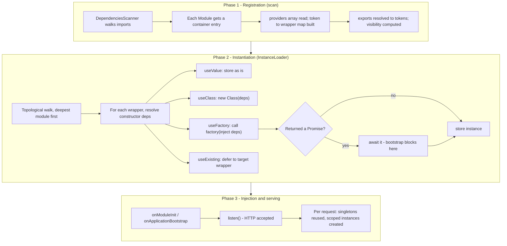

# Chapter 36 — Custom Providers and Advanced DI Patterns

> **한눈에 보기**
> 7장에서 `useClass`·`useValue`·`useFactory`·`useExisting`을 "쓰는 법" 수준으로 배웠습니다.
> 이 장은 그 아래 계층으로 내려갑니다. `Provider` 유니온 타입의 모든 필드, 심볼 토큰이 문자열 토큰보다
> 나은 이유, 타입이 살아 있는 토큰 헬퍼, `inject` 배열의 `{ token, optional: true }` 문법,
> 비동기 프로바이더가 부트스트랩을 멈춰 세우는 정확한 지점과 영원히 resolve되지 않을 때의 증상,
> 별칭을 이용한 무중단 이름 변경, 상속과 추상 클래스 토큰, 그리고 Nest에 없는 `multi: true`를
> 대신할 관용적 패턴까지 다룹니다. Part III 전체(동적 모듈·스코프·`ModuleRef`)의 토대입니다.

**What you will learn**

- The exact shape of the `Provider` union type — every field of `ClassProvider`, `ValueProvider`, `FactoryProvider`, and `ExistingProvider`, and which fields are mutually exclusive.
- Why `Symbol` tokens are strictly safer than string tokens in libraries, and how to build a *typed* token helper so `@Inject(TOKEN)` and the constructor parameter type can never drift apart.
- How to mark a factory dependency optional with `{ token, optional: true }`, and what the factory actually receives when that token is missing.
- What Nest does to the bootstrap sequence while an `async` factory is pending — and how to diagnose the specific failure where the process starts, prints nothing, and never listens.
- How to rename a provider without breaking consumers using `useExisting`, and how to register one implementation under several tokens deliberately.
- The idiomatic replacement for Angular's `multi: true`, which Nest does not have, and when to prefer `DiscoveryService` instead.
- Why "exported but not provided" is the single most common module-wiring error, and the five-line rule that prevents it.

**Why this matters**

Here is a production incident that is entirely a custom-provider problem. A team ships a `PaymentsModule` that exports a provider under the string token `'STRIPE'`. A second team, in an unrelated feature module, registers a totally different object under the same string token `'STRIPE'` for their sandbox integration. Both modules are imported into the root module. One of them silently wins. The other team's code now talks to the wrong Stripe account — not with a crash, but with successful HTTP 200 responses charging real cards in a test suite. No compiler could have caught it, because a string token carries no identity beyond its characters. A `Symbol` token would have made the collision structurally impossible.

Here is a second one. A service registers `{ provide: DB, useFactory: async () => createPool(url) }`. The database is unreachable in a new region. `createPool` does not reject — it retries internally, forever. The container never starts serving traffic, the health check never gets an answer, and the logs stop after `Starting Nest application...`. The orchestrator restarts the pod every 60 seconds and the incident channel fills with "the deploy is stuck". Nothing is stuck; the DI container is doing exactly what it was told, which is to await a promise that will never settle. Knowing *where* in bootstrap that await happens turns a two-hour outage into a two-minute diagnosis.

Chapter 7 gave you the four recipes. This chapter gives you the mechanism underneath them, the type-level tools to use them safely, and the failure modes to recognise when they go wrong. Everything in Chapter 37 (dynamic modules) and Chapter 38 (scopes) is built directly on top of it.

---

## 1. The `Provider` union type, in full

Everything you can put in a module's `providers` array is one of five things. In Nest v11 the type is:

```typescript
export type Provider<T = any> =
  | Type<any>
  | ClassProvider<T>
  | ValueProvider<T>
  | FactoryProvider<T>
  | ExistingProvider<T>;
```

The first member — a bare `Type<any>`, i.e. a class reference — is the shorthand you write 95% of the time. The other four are object literals with a `provide` key. Here they are with every field:

```typescript
export interface ClassProvider<T = any> {
  provide: InjectionToken;
  useClass: Type<T>;
  scope?: Scope;
  durable?: boolean;
  inject?: never;          // <- structurally forbidden
}

export interface ValueProvider<T = any> {
  provide: InjectionToken;
  useValue: T;
  inject?: never;          // <- structurally forbidden
}

export interface FactoryProvider<T = any> {
  provide: InjectionToken;
  useFactory: (...args: any[]) => T | Promise<T>;
  inject?: Array<InjectionToken | OptionalFactoryDependency>;
  scope?: Scope;
  durable?: boolean;
}

export interface ExistingProvider<T = any> {
  provide: InjectionToken;
  useExisting: any;
}
```

Read the `inject?: never` lines carefully — they are not decoration. TypeScript uses them to discriminate the union. If you write `useClass` and `inject` together, the object matches no member of the union and you get a type error rather than silently-ignored metadata. That is a deliberate design choice by the Nest maintainers, and it encodes an important truth: **only factories take an `inject` list.** A `useClass` provider gets its dependencies from the class's own constructor metadata, not from the provider object.

Two supporting types matter:

```typescript
export type InjectionToken<T = any> =
  | string
  | symbol
  | Type<T>
  | Abstract<T>
  | Function;

export type OptionalFactoryDependency = {
  token: InjectionToken;
  optional: boolean;
};
```

`InjectionToken` is a *type alias*, not a class. This is the single biggest difference from Angular, where `InjectionToken` is a constructible class with generic type information attached. In Nest a token is just a value that can be a map key. That makes the API simpler and makes type-safety your responsibility — §3 shows how to get it back.

| Field | Appears on | Meaning |
|---|---|---|
| `provide` | all four | The lookup key. Whatever a consumer asks for. |
| `useClass` | `ClassProvider` | Class Nest will instantiate (once per scope). |
| `useValue` | `ValueProvider` | Value injected verbatim. Never instantiated, never awaited. |
| `useFactory` | `FactoryProvider` | Function called once per scope; its return value is the instance. |
| `useExisting` | `ExistingProvider` | Another token. Creates an alias, not a copy. |
| `inject` | `FactoryProvider` only | Positional dependency list passed to the factory. |
| `scope` | `ClassProvider`, `FactoryProvider` | `DEFAULT` / `REQUEST` / `TRANSIENT` (Chapter 38). |
| `durable` | `ClassProvider`, `FactoryProvider` | Sub-tree caching for multi-tenancy (Chapter 38). |

Note what is *absent*: `ValueProvider` and `ExistingProvider` have no `scope`. A value has no lifecycle to scope, and an alias inherits the scope of its target.

---

## 2. Three phases: registration, instantiation, injection

Before going further, fix the mental model of what the container does. Nest's bootstrap runs three distinct passes over your module graph, and almost every confusing DI error is a symptom of one phase failing while you were thinking about a different one.



Three consequences follow immediately, and each is worth memorising:

1. **Registration errors surface before any of your code runs.** `Nest cannot export a provider that is not a part of the currently processed module` is a Phase-1 error. Your factory never executed.
2. **`Nest can't resolve dependencies of the X (?)`** is a Phase-2 error. Registration succeeded; a token was requested that no visible wrapper owns. The `?` marks the failing *position* in the parameter list, so `(DataSource, ?, Logger)` tells you it is the second argument.
3. **A hang with no error is Phase 2 too** — specifically step `B7`. Nest is awaiting a promise. See §7.

Setting `NEST_DEBUG=true` makes the container log each token as it resolves it, which turns "it hangs" into "it hangs immediately after `DATABASE_POOL`".

```bash
NEST_DEBUG=true node dist/main.js
```

---

## 3. Tokens: strings, symbols, and typed helpers

### Why string tokens are a liability

A string token is compared by value. `'CONNECTION'` registered by your module and `'CONNECTION'` registered by a dependency's module are the *same token*. In a single application module graph, the last registration processed for a given token in a given module wins, and across modules the nearest visible one wins. Neither outcome produces an error. You get a wrong object.

The failure is silent, cross-team, and only manifests when two modules that were developed independently are imported into the same graph — which is exactly what happens as an application grows or when you extract code into a shared library.

```typescript
// packages/payments/src/payments.module.ts  — team A
@Module({ providers: [{ provide: 'STRIPE', useValue: liveStripe }], exports: ['STRIPE'] })
export class PaymentsModule {}

// packages/billing/src/billing.module.ts    — team B, no knowledge of team A
@Module({ providers: [{ provide: 'STRIPE', useValue: sandboxStripe }], exports: ['STRIPE'] })
export class BillingModule {}
```

Import both into `AppModule` and any consumer of `'STRIPE'` gets whichever one its own module's import order resolves to. No warning is printed.

### Symbols make collisions impossible

`Symbol('STRIPE') !== Symbol('STRIPE')`. Two calls to `Symbol()` produce values that are never equal, no matter what description string you pass. The description exists purely so error messages and debugger output are readable. That single property removes the entire class of bug above:

```typescript title="src/payments/payments.tokens.ts"
export const STRIPE_CLIENT = Symbol('STRIPE_CLIENT');
export const PAYMENTS_OPTIONS = Symbol('PAYMENTS_OPTIONS');
```

The rule that makes symbols work: **export the symbol from exactly one module and import that module everywhere.** If two files each call `Symbol('STRIPE_CLIENT')`, you have two different tokens and you are back to a resolution error — a loud one this time, which is still an improvement.

> **⚠️ Notice** — `Symbol.for('STRIPE')` uses the *global symbol registry* and **is** shared by value across the whole realm, including across duplicate copies of a package in `node_modules`. That makes it behave like a string token with a fancier syntax. Use plain `Symbol()` unless you specifically need cross-copy identity.

The one real cost of symbols: they cannot be serialised, so a `Symbol` token cannot come from a JSON config file, and error messages print `Symbol(STRIPE_CLIENT)` rather than a class name. Both are acceptable trade-offs.

### Abstract classes: token and contract in one artifact

When the thing you are injecting is a *service with a shape*, an abstract class is often better than a symbol, because it collapses two artifacts into one and removes the need for `@Inject()` entirely:

```typescript title="src/notifications/mailer.ts"
export abstract class Mailer {
  abstract send(to: string, subject: string, body: string): Promise<void>;
}

@Injectable()
export class SesMailer implements Mailer {
  async send(to: string, subject: string, body: string) { /* ... */ }
}
```

```typescript
@Module({ providers: [{ provide: Mailer, useClass: SesMailer }], exports: [Mailer] })
export class NotificationsModule {}

@Injectable()
export class WelcomeService {
  constructor(private readonly mailer: Mailer) {}   // no @Inject() needed
}
```

An abstract class survives compilation (it emits a real class with a prototype), so `design:paramtypes` can carry it. An `interface` cannot — it is erased, and `design:paramtypes` emits `Object`, which is why interface-typed constructor parameters produce `Nest can't resolve dependencies of the WelcomeService (?)`.

### A typed token helper

The weakness of symbol tokens is that nothing connects `@Inject(STRIPE_CLIENT)` to the declared parameter type. Write `private readonly stripe: Date` and TypeScript is perfectly happy. You can fix this with a branded type and two helpers:

```typescript title="src/common/di/token.ts"
import { Inject } from '@nestjs/common';

declare const TYPE: unique symbol;

/** A symbol token that remembers, at the type level, what it resolves to. */
export type Token<T> = symbol & { readonly [TYPE]?: T };

export function createToken<T>(description: string): Token<T> {
  return Symbol(description) as Token<T>;
}

/** Typed @Inject(): the parameter type must match the token's payload type. */
export function InjectToken<T>(token: Token<T>): ParameterDecorator {
  return Inject(token);
}
```

Used together with a typed provider factory, the token and the value can no longer drift:

```typescript title="src/common/di/provide.ts"
import { FactoryProvider } from '@nestjs/common';
import { Token } from './token';

export function provideFactory<T>(
  token: Token<T>,
  useFactory: (...args: any[]) => T | Promise<T>,
  inject: FactoryProvider['inject'] = [],
): FactoryProvider<T> {
  return { provide: token, useFactory, inject };
}
```

```typescript title="src/payments/payments.tokens.ts"
import Stripe from 'stripe';
import { createToken } from '../common/di/token';

export const STRIPE_CLIENT = createToken<Stripe>('STRIPE_CLIENT');
```

```typescript
const stripeProvider = provideFactory(
  STRIPE_CLIENT,
  (config: ConfigService) => new Stripe(config.getOrThrow('STRIPE_KEY')),
  [ConfigService],
);
// returning a `string` here is now a compile error.

@Injectable()
export class CheckoutService {
  constructor(@InjectToken(STRIPE_CLIENT) private readonly stripe: Stripe) {}
}
```

This is 20 lines of infrastructure that eliminates an entire category of runtime surprise. In an application team it is optional; in a published library it is close to mandatory, because your consumers cannot see your provider definitions.

| Token kind | Collision-safe | Needs `@Inject()` | Carries a type | Best for |
|---|---|---|---|---|
| `string` | ❌ | yes | no | Prototypes, single-app constants in one file |
| `Symbol()` | ✅ | yes | no (unless branded) | Libraries, non-class values (config, connections) |
| `Symbol.for()` | ❌ | yes | no | Deliberate cross-realm sharing only |
| `enum` member | ❌ (string enums are strings) | yes | no | Grouping related tokens readably |
| Abstract class | ✅ | no | ✅ | Swappable services with a stable interface |
| Concrete class | ✅ | no | ✅ | The default; one implementation |
| Branded `Token<T>` | ✅ | yes (`InjectToken`) | ✅ | Libraries that want both safety and types |

---

## 4. `useClass`, inheritance, and abstract-class tokens

`useClass` decouples *what is asked for* from *what is built*. The token is the contract; the class is one implementation of it.

```typescript title="src/storage/storage.providers.ts"
import { Provider } from '@nestjs/common';
import { StoragePort } from './storage.port';
import { S3Storage } from './s3.storage';
import { LocalDiskStorage } from './local-disk.storage';
import { InMemoryStorage } from './in-memory.storage';

export const storageProvider: Provider = {
  provide: StoragePort,
  useClass:
    process.env.NODE_ENV === 'test'
      ? InMemoryStorage
      : process.env.STORAGE_DRIVER === 's3'
        ? S3Storage
        : LocalDiskStorage,
};
```

Two things to note. First, the class chosen by `useClass` still has **its own** dependencies resolved normally — `S3Storage` can inject `ConfigService` through its constructor, and Nest will build it. `useClass` is not a bypass of DI; it is a redirection inside it. Second, the chosen class does **not** need to be listed separately in `providers`. Listing it as well creates a *second, independent instance* under its own class token, which is almost never what you want.

```typescript
// WRONG — two S3Storage instances, two connection pools
providers: [{ provide: StoragePort, useClass: S3Storage }, S3Storage]

// RIGHT — one instance, reachable through the port token
providers: [{ provide: StoragePort, useClass: S3Storage }]
```

If you genuinely want it reachable under both tokens, that is what `useExisting` is for (§8).

### Provider inheritance

Derived provider classes work, but with one sharp edge that is worth internalising.

```typescript title="src/common/base-repository.ts"
import { Inject, Injectable } from '@nestjs/common';
import { DataSource } from 'typeorm';
import { LOGGER } from './tokens';
import type { Logger } from './logger.port';

@Injectable()
export class BaseRepository {
  constructor(
    protected readonly dataSource: DataSource,
    @Inject(LOGGER) protected readonly logger: Logger,
  ) {}
}
```

```typescript title="src/orders/orders.repository.ts"
@Injectable()
export class OrdersRepository extends BaseRepository {}   // ✅ works
```

`reflect-metadata` reads through the prototype chain, so `design:paramtypes` and Nest's own `self:paramtypes` metadata defined on `BaseRepository` are visible on `OrdersRepository`. Nest builds it with both dependencies.

Now add a constructor to the subclass and it breaks:

```typescript
@Injectable()
export class OrdersRepository extends BaseRepository {
  constructor(private readonly clock: Clock) {   // ❌
    super(/* what goes here? */);
  }
}
```

The moment the derived class declares a constructor, TypeScript emits `design:paramtypes` **on the derived class**, shadowing the parent's. Nest now believes `OrdersRepository` takes exactly one argument, `Clock`. The parent's `dataSource` and `logger` are never passed, and `super()` receives whatever you wrote by hand — typically `undefined`. The symptom is a `TypeError: Cannot read properties of undefined` deep inside the base class, several requests after startup.

The fix is mechanical: **when a derived provider declares a constructor, it must declare every parent dependency too, and re-apply every parent `@Inject()`.**

```typescript
@Injectable()
export class OrdersRepository extends BaseRepository {
  constructor(
    dataSource: DataSource,
    @Inject(LOGGER) logger: Logger,
    private readonly clock: Clock,
  ) {
    super(dataSource, logger);
  }
}
```

Because this is easy to get wrong silently, the recommendation in this book is to prefer **composition over inheritance for providers**: inject the base as a collaborator instead of extending it. Reserve inheritance for base classes with *no* constructor dependencies at all, where the edge case cannot arise.

---

## 5. `useValue`: what it does and does not do

`useValue` short-circuits the container entirely. The value you hand over is stored as the instance. Nest does not instantiate it, does not inspect it for dependencies, and — this catches people — **does not await it**.

```typescript
// ❌ Consumers receive a pending Promise, not a Pool.
{ provide: DB, useValue: createPool(url) }

// ✅ Awaiting is a factory's job.
{ provide: DB, useFactory: () => createPool(url) }
```

That asymmetry exists because `useValue` is defined as "this exact value", and awaiting would violate it. Only `useFactory` return values are awaited (§7).

`useValue` shines in four places:

```typescript title="src/app.providers.ts"
import { Provider } from '@nestjs/common';
import Redis from 'ioredis';
import { CLOCK, FEATURE_FLAGS, REDIS } from './tokens';

// 1. Constants and computed config objects
export const flagsProvider: Provider = {
  provide: FEATURE_FLAGS,
  useValue: Object.freeze({ newCheckout: true, betaSearch: false }),
};

// 2. Third-party objects created outside Nest's world
export const redisProvider: Provider = {
  provide: REDIS,
  useValue: new Redis(process.env.REDIS_URL!),
};

// 3. Injectable primitives that make code testable
export const clockProvider: Provider = {
  provide: CLOCK,
  useValue: { now: () => new Date() },
};
```

And the fourth: test doubles, which is the same mechanism used by `overrideProvider()`:

```typescript
const moduleRef = await Test.createTestingModule({ imports: [OrdersModule] })
  .overrideProvider(CLOCK)
  .useValue({ now: () => new Date('2026-01-01T00:00:00Z') })
  .compile();
```

Because TypeScript is structurally typed, the replacement only needs the members actually used. `Object.freeze` on config objects is a cheap habit worth adopting — a shared singleton value that some request handler mutates is a genuinely nasty bug, and freezing turns it into an immediate `TypeError`.

---

## 6. `useFactory` and the `inject` array

A factory runs once per scope instance and its return value becomes the provider. The `inject` array is **positional**: entry *n* of `inject` becomes argument *n* of the factory. TypeScript cannot check this correspondence — `useFactory` is typed as `(...args: any[]) => T` — so the discipline is yours.

```typescript title="src/database/database.providers.ts"
import { Provider } from '@nestjs/common';
import { ConfigService } from '@nestjs/config';
import { Pool } from 'pg';
import { DB_POOL, METRICS } from './tokens';
import type { MetricsSink } from './metrics.port';

export const poolProvider: Provider = {
  provide: DB_POOL,
  useFactory: (config: ConfigService, metrics?: MetricsSink) => {
    const pool = new Pool({
      connectionString: config.getOrThrow<string>('DATABASE_URL'),
      max: config.get<number>('DB_POOL_MAX', 10),
    });
    metrics?.gauge('db.pool.max', pool.options.max ?? 0);
    return pool;
  },
  inject: [
    ConfigService,                        // -> config   (required)
    { token: METRICS, optional: true },   // -> metrics  (may be undefined)
  ],
};
```

### Optional dependencies

`{ token, optional: true }` is the `OptionalFactoryDependency` form. If no provider is registered for `METRICS`, Nest passes `undefined` at that position instead of throwing. Without `optional: true`, a missing token is a hard bootstrap failure.

This is the mechanism that makes *optional integrations* possible in libraries: your module works standalone, and lights up extra behaviour when the host application happens to provide a metrics sink or a tracer. Note the two rules people trip over:

- The corresponding factory parameter must be declared optional (`metrics?:`) or nullable, or strict mode will let you dereference `undefined`.
- `optional: true` means "may be absent". It does **not** mean "may fail to construct". If the provider exists but its own factory throws, bootstrap still fails.

The constructor-injection equivalent is the `@Optional()` decorator:

```typescript
import { Inject, Injectable, Optional } from '@nestjs/common';

@Injectable()
export class OrdersService {
  constructor(@Optional() @Inject(METRICS) private readonly metrics?: MetricsSink) {}
}
```

### Keeping `inject` and the parameter list in sync

Two habits prevent nearly all positional mistakes. First, format the provider so the two lists sit vertically adjacent, as above. Second, for factories with more than three dependencies, take a single object and destructure — you lose nothing and the positions stop mattering to the reader:

```typescript
export const searchProvider: Provider = {
  provide: SEARCH_CLIENT,
  useFactory: (config: ConfigService, logger: LoggerService, http: HttpService) =>
    buildSearchClient({ config, logger, http }),
  inject: [ConfigService, LoggerService, HttpService],
};
```

Factories may also declare `scope` and `durable` (Chapter 38). A `Scope.TRANSIENT` factory runs once per consumer; a `Scope.REQUEST` factory runs once per request, and may inject the `REQUEST` token.

---

## 7. Async providers and the bootstrap sequence

An `async` factory — or any factory returning a promise — makes the provider *asynchronous*. Nest awaits the promise before it constructs anything that depends on the token.

```typescript title="src/database/database.providers.ts"
export const connectionProvider: Provider = {
  provide: DB_CONNECTION,
  useFactory: async (config: ConfigService) => {
    const connection = await createConnection({
      url: config.getOrThrow<string>('DATABASE_URL'),
    });
    await connection.query('select 1');   // fail fast on a bad credential
    return connection;
  },
  inject: [ConfigService],
};
```

Consumers see the resolved value, never the promise:

```typescript
@Injectable()
export class OrdersRepository {
  constructor(@Inject(DB_CONNECTION) private readonly db: Connection) {}
}
```

### What actually happens to bootstrap

`NestFactory.create()` runs the scanner, then hands the graph to the `InstanceLoader`, which walks modules deepest-first and instantiates each provider. When it reaches an async factory it awaits it *inline*. Concretely:

1. `NestFactory.create(AppModule)` does not resolve until every async provider in the graph has settled.
2. Lifecycle hooks (`onModuleInit`, `onApplicationBootstrap`) run **after** all instances exist — so by the time `onModuleInit` fires, your connection is open.
3. `app.listen()` is called by *your* `bootstrap()` function after `create()` resolves. Therefore **no HTTP request can be accepted while an async provider is pending.** That is the entire point: the first request never sees a half-open pool.
4. Providers in *sibling* modules are not necessarily created in parallel. Do not rely on concurrency here; assume the awaits are effectively sequential and budget your startup time accordingly.

This ordering is what makes async providers the correct tool for "the app must not serve traffic until X is ready", and the wrong tool for "run this task at startup". For the latter, use `onApplicationBootstrap` (Chapter 39), which does not block dependency construction.

### The failure modes

**Rejection.** If the factory throws or rejects, `NestFactory.create()` rejects. Handle it, or your process exits with an unhandled rejection and a stack trace that may not mention your factory at all:

```typescript title="src/main.ts"
async function bootstrap() {
  const app = await NestFactory.create(AppModule);
  await app.listen(3000);
}

bootstrap().catch((err) => {
  console.error('Bootstrap failed:', err);
  process.exit(1);
});
```

**Never settling.** This is the dangerous one. A factory that hangs produces *no error, no log line, and no timeout*. The process is alive, the event loop is busy, and the last thing printed is `Starting Nest application...`. Kubernetes sees a container that started but never becomes ready, kills it after the liveness grace period, and restarts it — forever.

Prevent it structurally. Every async provider that talks to the network should carry its own deadline:

```typescript title="src/common/with-timeout.ts"
export function withTimeout<T>(p: Promise<T>, ms: number, label: string): Promise<T> {
  return Promise.race([
    p,
    new Promise<never>((_, reject) =>
      setTimeout(() => reject(new Error(`${label} did not resolve within ${ms}ms`)), ms).unref(),
    ),
  ]);
}
```

```typescript
export const connectionProvider: Provider = {
  provide: DB_CONNECTION,
  useFactory: (config: ConfigService) =>
    withTimeout(createConnection({ url: config.getOrThrow('DATABASE_URL') }),
                10_000, 'DB_CONNECTION'),
  inject: [ConfigService],
};
```

The `.unref()` matters: without it, the timer keeps the event loop alive for 10 seconds after a *successful* connection, delaying clean shutdown in short-lived processes such as tests and CLI apps (Chapter 42).

When a hang has already happened in an environment you cannot easily change, `NEST_DEBUG=true` narrows it to a single token, and `kill -SIGUSR1 <pid>` plus a debugger attach will show the pending promise.

---

## 8. `useExisting`: aliasing, renaming, and multiple tokens

`useExisting` maps one token onto another. Both tokens resolve to the **same instance** — it is an alias, not a copy.

```typescript
@Module({
  providers: [
    Mailer,                                        // the real provider
    { provide: 'MAILER', useExisting: Mailer },    // alias
  ],
  exports: [Mailer, 'MAILER'],
})
export class NotificationsModule {}
```

`app.get('MAILER') === app.get(Mailer)` is `true`. Contrast with `{ provide: 'MAILER', useClass: Mailer }`, which constructs a *second* `Mailer` — a second connection pool, a second cache, a second set of timers.

### Backwards-compatible renames

The best use of `useExisting` is shipping a rename without a breaking change. Say your library exported `LEGACY_HTTP_CLIENT` and you now want `HTTP_CLIENT`:

```typescript title="src/http/http.module.ts"
import { Module, Provider, Logger } from '@nestjs/common';
import { HTTP_CLIENT, LEGACY_HTTP_CLIENT } from './tokens';
import { httpClientProvider } from './http.providers';

const deprecatedAlias: Provider = {
  provide: LEGACY_HTTP_CLIENT,
  useExisting: HTTP_CLIENT,
};

@Module({
  providers: [httpClientProvider, deprecatedAlias],
  exports: [HTTP_CLIENT, LEGACY_HTTP_CLIENT],
})
export class HttpClientModule {}
```

Both tokens work; both yield the same client; consumers migrate at their own pace; you delete the alias in the next major version. Because an alias is resolved lazily through the target's wrapper, it also inherits the target's scope automatically — you cannot accidentally give the alias a different lifetime.

If you want to nudge consumers, add a factory in front of the alias instead of a bare `useExisting`:

```typescript
const deprecatedAlias: Provider = {
  provide: LEGACY_HTTP_CLIENT,
  useFactory: (client: HttpClient) => {
    new Logger('HttpClientModule').warn(
      'LEGACY_HTTP_CLIENT is deprecated; inject HTTP_CLIENT instead.',
    );
    return client;
  },
  inject: [HTTP_CLIENT],
};
```

This still returns the same instance (the factory returns what it was given), but logs once at bootstrap.

### One implementation under several tokens, deliberately

The same technique registers one class under a narrow and a wide contract:

```typescript
@Module({
  providers: [
    PostgresUserStore,
    { provide: UserReader, useExisting: PostgresUserStore },
    { provide: UserWriter, useExisting: PostgresUserStore },
  ],
  exports: [UserReader, UserWriter],
})
export class UsersModule {}
```

Read-only consumers inject `UserReader` and cannot call `save()` because the abstract class does not declare it — an interface-segregation boundary enforced by the type system, backed by a single runtime object. When you later split reads onto a replica, you change one provider line and no consumer.

---

## 9. Multi-providers: what Nest does not have, and what to do instead

Angular lets several providers register under one token with `multi: true`, and injecting that token yields an array. **Nest has no `multi` flag.** Registering twice under one token replaces, it does not accumulate. There is no warning.

Three idiomatic replacements, in increasing order of power.

### Pattern A — an explicit array factory (recommended default)

Register the individual strategies normally, then build the array in a factory:

```typescript title="src/notifications/notifications.module.ts"
import { Module, Provider } from '@nestjs/common';
import { NOTIFICATION_CHANNELS } from './tokens';
import { EmailChannel } from './channels/email.channel';
import { SmsChannel } from './channels/sms.channel';
import { WebhookChannel } from './channels/webhook.channel';
import type { NotificationChannel } from './channels/channel.port';

const channelsProvider: Provider = {
  provide: NOTIFICATION_CHANNELS,
  useFactory: (...channels: NotificationChannel[]) => channels,
  inject: [EmailChannel, SmsChannel, WebhookChannel],
};

@Module({
  providers: [EmailChannel, SmsChannel, WebhookChannel, channelsProvider],
  exports: [NOTIFICATION_CHANNELS],
})
export class NotificationsModule {}
```

```typescript
@Injectable()
export class Notifier {
  constructor(
    @Inject(NOTIFICATION_CHANNELS) private readonly channels: NotificationChannel[],
  ) {}

  async broadcast(userId: string, message: string) {
    const results = await Promise.allSettled(
      this.channels.map((c) => c.send(userId, message)),
    );
    return results.filter((r) => r.status === 'fulfilled').length;
  }
}
```

Each channel is a fully-fledged provider with its own dependencies. Order is explicit — which matters when the array is a pipeline rather than a fan-out. The cost is that adding a channel touches two places.

### Pattern B — a composable `extend` helper for libraries

If consumers of *your* module need to contribute entries, expose a helper that concatenates a per-module array under a feature token, and aggregate in the root:

```typescript title="src/plugins/plugins.module.ts"
import { DynamicModule, Module, Provider } from '@nestjs/common';
import { PLUGIN, PLUGIN_REGISTRY } from './tokens';
import type { Plugin } from './plugin.port';

@Module({})
export class PluginsModule {
  static forFeature(plugins: Provider[]): DynamicModule {
    return { module: PluginsModule, providers: plugins, exports: plugins };
  }

  static forRoot(tokens: symbol[]): DynamicModule {
    return {
      module: PluginsModule,
      providers: [
        {
          provide: PLUGIN_REGISTRY,
          useFactory: (...plugins: Plugin[]) => plugins,
          inject: tokens,
        },
      ],
      exports: [PLUGIN_REGISTRY],
    };
  }
}
```

This is Pattern A with the array construction deferred to the application root. Chapter 37 develops the dynamic-module machinery this depends on.

### Pattern C — discovery by decorator

When you want contributors to register by simply *existing*, mark them with a custom decorator and collect them at bootstrap with `DiscoveryService`:

```typescript
import { DiscoveryService, Reflector } from '@nestjs/core';

@Injectable()
export class ChannelRegistry implements OnModuleInit {
  private readonly channels: NotificationChannel[] = [];

  constructor(
    private readonly discovery: DiscoveryService,
    private readonly reflector: Reflector,
  ) {}

  onModuleInit() {
    for (const wrapper of this.discovery.getProviders()) {
      if (!wrapper.instance || !wrapper.metatype) continue;
      if (this.reflector.get(IS_CHANNEL, wrapper.metatype)) {
        this.channels.push(wrapper.instance as NotificationChannel);
      }
    }
  }
}
```

This gives true open extension — a new channel is one decorated class and nothing else — at the price of a registry that is only populated after `onModuleInit`, and of a wiring you cannot see by reading the module file. Chapter 41 covers `DiscoveryService` properly. My recommendation: **Pattern A until it hurts, Pattern C only for genuine plugin architectures.**

---

## 10. `forwardRef` at the provider level

Circular dependencies between *providers* in the same module are resolved with `forwardRef` at the injection site. In class constructors:

```typescript
@Injectable()
export class OrdersService {
  constructor(
    @Inject(forwardRef(() => PaymentsService))
    private readonly payments: PaymentsService,
  ) {}
}

@Injectable()
export class PaymentsService {
  constructor(
    @Inject(forwardRef(() => OrdersService))
    private readonly orders: OrdersService,
  ) {}
}
```

`forwardRef` takes a function so the class reference is evaluated lazily, after both module files have finished executing. Without it, one of the two identifiers is `undefined` at decoration time and you get `Nest can't resolve dependencies of the OrdersService (?)` — or, more confusingly, a `paramtypes` entry of `undefined` with no name to report.

In factory providers, `forwardRef` goes in the `inject` array:

```typescript
const auditProvider: Provider = {
  provide: AUDIT_SINK,
  useFactory: (orders: OrdersService) => new AuditSink(orders),
  inject: [forwardRef(() => OrdersService)],
};
```

Two caveats that matter more than the syntax:

- **Both sides must use it.** `forwardRef` on only one end still fails, because the other end still evaluates an undefined identifier.
- **A circular dependency is a design smell, not a feature.** In every case I have reviewed, the cycle indicated a missing third concept — an `OrderPaymentCoordinator`, or an event (Chapter 34) replacing one direction of the call. `forwardRef` is the tool for when you cannot refactor today. Chapter 41 covers module-level `forwardRef` and the trade-offs in depth.

---

## 11. Exporting custom providers, and the "exported but not provided" trap

A custom provider is module-scoped like any other. To expose it you export it — by **token** or by the full provider object:

```typescript
const connectionFactory: Provider = {
  provide: DB_CONNECTION,
  useFactory: (config: ConfigService) => createConnection(config.get('DATABASE_URL')),
  inject: [ConfigService],
};

@Module({
  providers: [connectionFactory],
  exports: [DB_CONNECTION],       // by token — preferred
})
export class DatabaseModule {}
```

```typescript
@Module({
  providers: [connectionFactory],
  exports: [connectionFactory],   // by provider object — equivalent
})
export class DatabaseModule {}
```

Exporting by token is preferred: it makes the module's public surface a readable list of tokens rather than a repetition of implementation objects, and it is the only form available when the provider object lives in another file you would rather not import twice.

### The trap

The most common module-wiring error in real code is this:

```typescript
@Module({
  imports: [DatabaseModule],
  exports: [DB_CONNECTION],      // ❌ not provided here
})
export class OrdersModule {}
```

```text
Nest cannot export a provider/module that is not a part of the currently processed
module (OrdersModule). Please verify whether the exported DB_CONNECTION is available
in this particular context.
```

The rule Nest enforces is precise, and worth stating exactly:

> **You may export a token only if the same module also `provides` it. To pass along something you merely imported, re-export the *module*, not the token.**

```typescript
@Module({
  imports: [DatabaseModule],
  exports: [DatabaseModule],     // ✅ re-export the module
})
export class OrdersModule {}
```

Consumers of `OrdersModule` now see everything `DatabaseModule` exports. If you want to narrow the surface — expose the connection but nothing else `DatabaseModule` exports — provide an alias locally and export that:

```typescript
@Module({
  imports: [DatabaseModule],
  providers: [{ provide: ORDERS_DB, useExisting: DB_CONNECTION }],
  exports: [ORDERS_DB],          // ✅ provided here, so exportable
})
export class OrdersModule {}
```

That is a genuinely useful pattern: it lets a module narrow, rename, or re-badge a dependency at its boundary without duplicating the instance.

Related error, different cause: `Nest can't resolve dependencies of the X (?). Please make sure that the argument "TOKEN" at index [0] is available in the Y context.` This means the token was never made *visible* to the consuming module — either the owning module does not export it, or the consumer does not import the owner. The word "context" in the message is the consuming module's name; start your search there.

---

## 12. Choosing between the five forms

| You want to… | Use | Because |
|---|---|---|
| Register one class under its own name | `Type` shorthand (`providers: [Foo]`) | Shortest form of `useClass`; token and class coincide |
| Pick an implementation by environment or config | `useClass` | Token stays the contract; the choice lives in one file |
| Inject a constant, a frozen config object, or a third-party instance you already built | `useValue` | Skips the container entirely; never awaited |
| Replace something in a test | `useValue` (via `overrideProvider`) | Structural typing means partial doubles work |
| Compute a value from other providers | `useFactory` + `inject` | The only form that takes an `inject` list |
| Tolerate a missing dependency | `useFactory` + `{ token, optional: true }` | Passes `undefined` instead of failing bootstrap |
| Delay serving traffic until a connection is open | `async useFactory` | Bootstrap awaits it before `listen()` |
| Expose one instance under a second token | `useExisting` | Alias, not a copy — identity is preserved |
| Rename a token without a breaking change | `useExisting` | Old and new tokens coexist for one major version |
| Collect several implementations into an array | `useFactory` with `inject: [A, B, C]` | Nest has no `multi: true` |
| Break a provider cycle | `forwardRef` in `@Inject()` / `inject` | Defers class-reference evaluation |

Two negative rules, stated as opinions:

- **Do not use `useClass` where `useExisting` is meant.** If you find two instances of the same class in a heap dump, this is why.
- **Do not use an async factory as a startup hook.** If the work does not need to complete before the first request, put it in `onApplicationBootstrap` (Chapter 39) where a failure is reportable and a hang is visible.

---

## Common mistakes

1. **Two modules register the same string token.** *Symptom:* a consumer receives the wrong object, with no error; behaviour depends on import order. *Cause:* string tokens compare by value across the whole graph. *Fix:* use `Symbol()` tokens exported from one file, or abstract-class tokens. Audit with a grep for `provide: '`.

2. **Listing both the port provider and the implementation class.** *Symptom:* two connection pools, duplicated timers, a cache that never hits. *Cause:* `providers: [{ provide: Port, useClass: Impl }, Impl]` creates two independent instances under two tokens. *Fix:* remove the bare class, or replace it with `{ provide: Impl, useExisting: Port }` if both tokens are genuinely needed.

3. **`inject` array out of order.** *Symptom:* `TypeError: config.getOrThrow is not a function` inside a factory. *Cause:* positional correspondence between `inject` and the factory parameters is not type-checked. *Fix:* keep the two lists vertically aligned in the source; for four or more dependencies, pass an object to a builder function instead.

4. **`useValue` with a promise.** *Symptom:* `db.query is not a function`; logging the injected value prints `Promise { <pending> }`. *Cause:* `useValue` stores the value verbatim and never awaits. *Fix:* switch to `useFactory`, which awaits its return value.

5. **A derived provider declares a constructor and drops the parent's dependencies.** *Symptom:* `Cannot read properties of undefined` inside a base class method. *Cause:* `design:paramtypes` on the subclass shadows the parent's. *Fix:* re-declare every parent parameter and re-apply every parent `@Inject()`, then pass them to `super()`. Prefer composition.

6. **Exporting a token the module does not provide.** *Symptom:* `Nest cannot export a provider/module that is not a part of the currently processed module`. *Cause:* you can only export what you provide. *Fix:* re-export the owning module, or add a local `useExisting` alias and export that.

7. **An async factory that never settles.** *Symptom:* the process starts, logs `Starting Nest application...`, and never listens; the orchestrator restarts it in a loop. *Cause:* the `InstanceLoader` is awaiting a promise. *Fix:* wrap every network-touching factory in a timeout with `.unref()`, and run with `NEST_DEBUG=true` to identify the token.

8. **Expecting `multi: true`.** *Symptom:* only the last-registered strategy runs. *Cause:* Nest replaces on duplicate tokens rather than accumulating. *Fix:* build the array explicitly in a factory (§9, Pattern A) or discover by decorator (Pattern C).

---

## Putting it together

A `PaymentsModule` that uses every technique in this chapter: a branded token, an abstract-class port, an async factory with a timeout, an optional dependency, an explicit multi-provider array, a deprecated alias, and a narrowed export.

```typescript title="src/payments/payments.tokens.ts"
import { createToken } from '../common/di/token';
import type Stripe from 'stripe';
import type { FraudCheck } from './fraud/fraud-check.port';
import type { MetricsSink } from '../common/metrics.port';

export const STRIPE_CLIENT = createToken<Stripe>('STRIPE_CLIENT');
export const FRAUD_CHECKS = createToken<FraudCheck[]>('FRAUD_CHECKS');
export const METRICS = createToken<MetricsSink>('METRICS');
export const LEGACY_STRIPE = createToken<Stripe>('LEGACY_STRIPE'); // deprecated
```

```typescript title="src/payments/gateway.port.ts"
export abstract class PaymentGateway {
  abstract charge(customerId: string, amountCents: number): Promise<string>;
}
```

```typescript title="src/payments/payments.providers.ts"
import { Provider, Logger } from '@nestjs/common';
import { ConfigService } from '@nestjs/config';
import Stripe from 'stripe';
import { withTimeout } from '../common/with-timeout';
import { FRAUD_CHECKS, LEGACY_STRIPE, METRICS, STRIPE_CLIENT } from './payments.tokens';
import { VelocityCheck } from './fraud/velocity.check';
import { BlocklistCheck } from './fraud/blocklist.check';
import type { FraudCheck } from './fraud/fraud-check.port';
import type { MetricsSink } from '../common/metrics.port';

// Async provider: bootstrap blocks until Stripe answers, with a hard deadline.
export const stripeProvider: Provider = {
  provide: STRIPE_CLIENT,
  useFactory: async (config: ConfigService, metrics?: MetricsSink) => {
    const client = new Stripe(config.getOrThrow<string>('STRIPE_KEY'), {
      apiVersion: '2025-04-30.basil',
    });
    await withTimeout(client.balance.retrieve(), 8_000, 'STRIPE_CLIENT');
    metrics?.increment('stripe.client.ready');
    return client;
  },
  inject: [ConfigService, { token: METRICS, optional: true }],
};

// Nest has no multi:true — assemble the array explicitly, order is meaningful.
export const fraudChecksProvider: Provider = {
  provide: FRAUD_CHECKS,
  useFactory: (...checks: FraudCheck[]) => checks,
  inject: [BlocklistCheck, VelocityCheck],
};

// Deprecated alias: same instance, one warning at bootstrap.
export const legacyStripeAlias: Provider = {
  provide: LEGACY_STRIPE,
  useFactory: (client: Stripe) => {
    new Logger('PaymentsModule').warn('LEGACY_STRIPE is deprecated; use STRIPE_CLIENT.');
    return client;
  },
  inject: [STRIPE_CLIENT],
};
```

```typescript title="src/payments/stripe.gateway.ts"
import { Injectable, ForbiddenException } from '@nestjs/common';
import Stripe from 'stripe';
import { InjectToken } from '../common/di/token';
import { FRAUD_CHECKS, STRIPE_CLIENT } from './payments.tokens';
import { PaymentGateway } from './gateway.port';
import type { FraudCheck } from './fraud/fraud-check.port';

@Injectable()
export class StripeGateway implements PaymentGateway {
  constructor(
    @InjectToken(STRIPE_CLIENT) private readonly stripe: Stripe,
    @InjectToken(FRAUD_CHECKS) private readonly checks: FraudCheck[],
  ) {}

  async charge(customerId: string, amountCents: number): Promise<string> {
    for (const check of this.checks) {
      if (!(await check.allows(customerId, amountCents))) {
        throw new ForbiddenException(`Blocked by ${check.name}`);
      }
    }
    const intent = await this.stripe.paymentIntents.create({
      customer: customerId,
      amount: amountCents,
      currency: 'usd',
      confirm: true,
    });
    return intent.id;
  }
}
```

```typescript title="src/payments/payments.module.ts"
import { Module } from '@nestjs/common';
import { ConfigModule } from '@nestjs/config';
import { PaymentGateway } from './gateway.port';
import { StripeGateway } from './stripe.gateway';
import { VelocityCheck } from './fraud/velocity.check';
import { BlocklistCheck } from './fraud/blocklist.check';
import { fraudChecksProvider, legacyStripeAlias, stripeProvider } from './payments.providers';
import { LEGACY_STRIPE, STRIPE_CLIENT } from './payments.tokens';

@Module({
  imports: [ConfigModule],
  providers: [
    stripeProvider,
    BlocklistCheck,
    VelocityCheck,
    fraudChecksProvider,
    legacyStripeAlias,
    { provide: PaymentGateway, useClass: StripeGateway },  // port -> implementation
  ],
  exports: [PaymentGateway, STRIPE_CLIENT, LEGACY_STRIPE], // narrow public surface
})
export class PaymentsModule {}
```

Consumers inject `PaymentGateway` and know nothing about Stripe. Tests replace it with `.overrideProvider(PaymentGateway).useValue({ charge: async () => 'pi_test' })`. Bootstrap refuses to serve traffic until Stripe has answered, and fails loudly after eight seconds rather than hanging. `app.get(LEGACY_STRIPE) === app.get(STRIPE_CLIENT)` is `true`. Adding a third fraud check is one class and one entry in `inject`.

---

> **핵심 정리**
> - `Provider`는 다섯 가지 형태의 유니온이며, `inject?: never` 필드가 `useClass`/`useValue`에 `inject`를 쓰지 못하도록 **타입 수준에서** 막는다. `inject`를 받는 것은 오직 팩토리뿐이다.
> - 문자열 토큰은 값으로 비교되므로 서로 모르는 두 모듈이 같은 토큰을 등록해도 **오류 없이** 하나가 이긴다. 라이브러리에서는 `Symbol()` 토큰을, 서비스 계약에는 추상 클래스 토큰을 쓰라. `Symbol.for()`는 전역 레지스트리를 쓰므로 문자열 토큰과 같은 위험을 가진다.
> - 브랜디드 `Token<T>` + `InjectToken<T>()` 헬퍼 20줄이면 토큰과 주입 대상 타입이 어긋나는 버그를 컴파일 타임에 잡을 수 있다.
> - `useValue`는 값을 **그대로** 저장한다 — 절대 `await`하지 않는다. 프로미스를 넣으면 소비자는 pending 프로미스를 받는다. 비동기는 팩토리의 일이다.
> - `inject` 배열은 **순서 기반**이며 타입 검사가 되지 않는다. `{ token, optional: true }`로 선택적 의존성을 선언하면 없을 때 `undefined`가 전달된다(생성자 주입에서는 `@Optional()`).
> - 비동기 팩토리는 `InstanceLoader` 단계에서 `await`되므로 **`listen()` 이전에** 반드시 완료된다. resolve되지 않으면 오류도 로그도 없이 부팅이 멈춘다 — 모든 네트워크 팩토리에 `.unref()`가 붙은 타임아웃을 걸어라.
> - `useExisting`은 복사가 아니라 별칭이라 인스턴스 동일성이 보장된다. 무중단 토큰 이름 변경, 읽기/쓰기 포트 분리에 가장 알맞다. `useClass`로 같은 일을 하면 인스턴스가 두 개 생긴다.
> - Nest에는 `multi: true`가 없다. 중복 토큰은 누적이 아니라 **교체**된다. 팩토리로 배열을 명시적으로 조립하는 것이 기본이고, 진짜 플러그인 구조에서만 `DiscoveryService`를 쓰라.
> - 파생 프로바이더가 생성자를 선언하는 순간 부모의 `design:paramtypes`가 가려진다. 부모의 모든 파라미터와 `@Inject()`를 다시 써야 한다 — 그래서 상속보다 합성을 권한다.
> - 모듈은 **자신이 provide한 토큰만 export**할 수 있다. 남에게서 받은 것을 넘기려면 토큰이 아니라 **모듈을 re-export**하거나, 지역 `useExisting` 별칭을 만들어 그것을 export하라.

> **연습 문제**
> 1. 서로 다른 두 모듈에서 같은 문자열 토큰 `'CACHE'`로 서로 다른 객체를 등록하고, 소비자가 어느 쪽을 받는지 확인하라. import 순서를 바꾸면 결과가 달라지는가? 같은 실험을 `Symbol()` 토큰으로 반복하고 어떤 오류가 나는지 비교하라.
> 2. `{ provide: Port, useClass: Impl }`와 `providers: [Port 프로바이더, Impl]`을 함께 등록한 뒤, 각 인스턴스에 카운터를 두어 인스턴스가 몇 개 생성되는지 증명하라. `useExisting`으로 바꾸면 어떻게 달라지는가?
> 3. `useValue: createPool(url)`로 등록한 프로바이더를 주입받아 로그로 찍어 보라. 무엇이 출력되는가? 왜 Nest는 이것을 오류로 잡아 주지 못하는가?
> 4. **구현 과제**: 10초 뒤에도 resolve되지 않는 `async useFactory`를 만들어 앱을 띄우고, `NEST_DEBUG=true`로 어느 토큰에서 멈췄는지 확인하라. 그다음 `withTimeout` 헬퍼를 적용해 실패 메시지가 토큰 이름을 포함하도록 만들고, `.unref()`를 뺐을 때 프로세스 종료가 얼마나 늦어지는지 측정하라.
> 5. **구현 과제**: `ValidationRule` 포트를 정의하고 세 개의 구현을 만든 뒤, `VALIDATION_RULES` 토큰에 배열로 모으는 팩토리 프로바이더를 작성하라. 그다음 같은 기능을 `@ValidationRule()` 커스텀 데코레이터 + `DiscoveryService`로 다시 구현하고, 두 방식의 장단점을 표로 정리하라.
> 6. **구현 과제**: 라이브러리 모듈 하나를 골라 브랜디드 `Token<T>` 헬퍼를 도입하라. 토큰과 생성자 파라미터 타입이 어긋나는 코드를 일부러 작성해 컴파일 오류가 나는지 확인하고, `provideFactory` 헬퍼로 팩토리 반환 타입까지 검사되게 만들라.

**Next:** Custom providers configure a module *from the inside*. The next question is how a module lets its **consumer** configure it from the outside — [Chapter 37 — Dynamic Modules and Configurable Module Builders](./37-dynamic-modules.md) turns everything here into a reusable, parameterised module API.
