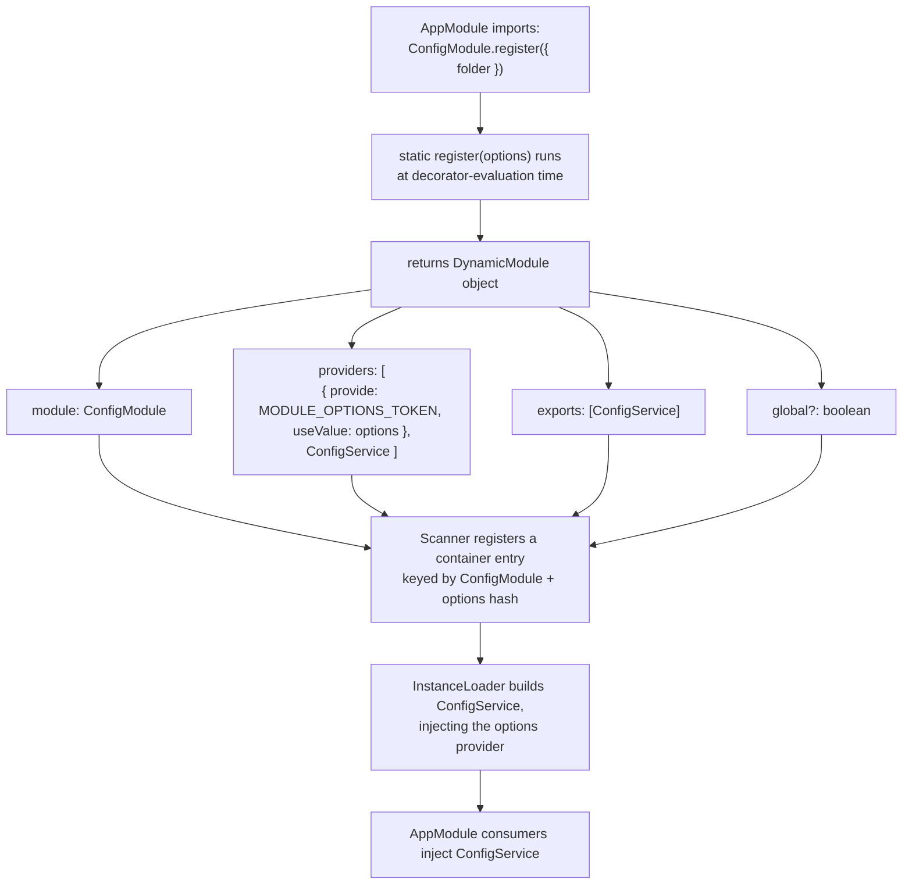

# Chapter 37 — Dynamic Modules and Configurable Module Builders

> **한눈에 보기**
> 6장의 정적 모듈은 소비자가 모듈의 동작에 개입할 방법이 없습니다. 이 장은 그 한계를 푸는
> **동적 모듈**을 다룹니다. `DynamicModule` 인터페이스의 모든 필드, `register`/`forRoot`/`forFeature`
> 이름 규약이 각각 무엇을 암시하는지, `ConfigModule`을 맨손으로 만들어 보는 과정,
> 커뮤니티 표준인 `forRootAsync`(`useFactory`/`useClass`/`useExisting`) 보일러플레이트를 직접 작성한 뒤,
> 그 전부를 대신해 주는 `ConfigurableModuleBuilder`를 끝까지 파헤칩니다.
> 36장의 커스텀 프로바이더가 여기서 재사용 가능한 **모듈 API**로 승격됩니다.

**What you will learn**

- Why a static module cannot be configured by its consumer, and exactly which line of the `@Module()` decorator is the obstacle.
- Every field of the `DynamicModule` return type, including the two — `module` and `global` — that have no static equivalent.
- What `register`, `forRoot`, and `forFeature` each *promise* about statefulness, and why picking the wrong one misleads your users.
- How to build a configurable `ConfigModule` from an empty `@Module({})` in six steps.
- How to write the `forRootAsync` triple (`useFactory` / `useClass` / `useExisting`) by hand, so you recognise the 60 lines that `ConfigurableModuleBuilder` deletes.
- Every knob on `ConfigurableModuleBuilder`: `setClassMethodName`, `setFactoryMethodName`, `setExtras`, `build()`, `MODULE_OPTIONS_TOKEN`, `OPTIONS_TYPE`, `ASYNC_OPTIONS_TYPE`, and how to extend the generated class.
- Where to validate module options so a misconfiguration fails at boot rather than on the thousandth request.

**Why this matters**

Every module you have written so far knows its own configuration at compile time. `TypeOrmModule` does not — it has no idea what database you use, and it must work for Postgres in one application and MySQL in another, with credentials that only exist at runtime, sometimes fetched from a secrets manager over the network. The mechanism that makes that possible is the dynamic module, and it is the single most reused pattern in the Nest ecosystem: `TypeOrmModule.forRoot()`, `JwtModule.register()`, `BullModule.registerQueue()`, `GraphQLModule.forRoot()`, `ThrottlerModule.forRootAsync()` are all the same idea.

You need this even if you never publish a package. The moment two applications in a monorepo share a `NotificationsModule` and need different providers — SES in one, a local mail catcher in the other — a static module forces you to either duplicate the module or reach for an environment variable inside the service, which turns a configuration concern into a business-logic concern and makes the service untestable. A dynamic module keeps the decision at the composition root, where it belongs.

The chapter has a second, subtler payoff. Writing `forRootAsync` by hand is tedious in a very specific way: three mutually exclusive option shapes, an options-factory interface, a provider that adapts each shape into a single token. Nest's `ConfigurableModuleBuilder` generates all of it. But if you adopt the builder without ever having written the boilerplate, `MODULE_OPTIONS_TOKEN` and `ASYNC_OPTIONS_TYPE` are magic names you cannot debug. So we write it out first, then delete it.

---

## 1. Where static modules stop

Recall the shape of a static module from Chapter 6:

```typescript
@Module({
  providers: [ConfigService],
  exports: [ConfigService],
})
export class ConfigModule {}
```

The obstacle is that the `@Module()` decorator's argument is evaluated **once, when the file is first loaded**. It is a literal. There is no parameter, no closure over a caller, nowhere for a consumer to reach. The consumer writes `imports: [ConfigModule]` — a bare class reference — and has supplied nothing.

Suppose `ConfigService` must read `.env` files from a folder that differs per application. With a static module your options are all bad:

- Hard-code the folder. Works for one app.
- Read `process.env.CONFIG_FOLDER` inside `ConfigService`. Now the service depends on an ambient global, cannot be unit-tested without mutating `process.env`, and the contract is invisible at the import site.
- Export a mutable singleton the consumer pokes before bootstrap. Order-dependent, and broken in tests that build two apps.

What you actually want is for the import site to say what it needs:

```typescript
@Module({
  imports: [ConfigModule.register({ folder: './config' })],
})
export class AppModule {}
```

Three deductions from that one line, and they are the whole design:

1. `register` is a **static method** — it is called on the class, not an instance.
2. Its arguments are whatever you define. Usually a single options object.
3. Its return value appears in `imports`, so it must be something `imports` accepts.

That something is a `DynamicModule`.

---

## 2. The `DynamicModule` interface, field by field

```typescript
export interface DynamicModule extends ModuleMetadata {
  module: Type<any>;
  global?: boolean;
}

export interface ModuleMetadata {
  imports?: Array<Type<any> | DynamicModule | Promise<DynamicModule> | ForwardReference>;
  controllers?: Type<any>[];
  providers?: Provider[];
  exports?: Array<DynamicModule | Promise<DynamicModule> | string | symbol | Provider | ForwardReference | Abstract<any> | Function>;
}
```

A dynamic module is "a `@Module()` metadata object, computed at runtime, plus a `module` field". Everything you know about static modules transfers unchanged.

| Field | Required | Meaning |
|---|---|---|
| `module` | ✅ | The class this metadata belongs to. Nest keys the container by it. Must be the enclosing class. |
| `imports` | — | Modules this instance needs. Computable — you can import different things based on the options. |
| `controllers` | — | Rarely used dynamically, but supported (e.g. mount a health controller only if `options.exposeHealth`). |
| `providers` | — | Where the options object is bound to a token, alongside the real services. |
| `exports` | — | Public surface. Same rule as Chapter 36: you may only export what this metadata provides, or re-export a module. |
| `global` | — | Registers the module globally, equivalent to `@Global()` but decided per call. |

Two properties of this design are worth stating explicitly.

**`module` must be the class itself.** Returning `{ module: SomeOtherModule, ... }` compiles and produces bewildering behaviour: Nest registers the metadata under the other class's identity, so a second import of that other module merges or conflicts unpredictably. Write `module: ConfigModule` inside `ConfigModule`, always.

**Merging with the decorator.** A class can carry both `@Module({...})` and a static factory. Nest merges the two: decorator metadata forms the base, and the dynamic metadata is added to it. This is genuinely useful — put the invariant providers in the decorator and only the options-dependent ones in the returned object:

```typescript
@Module({
  providers: [ConfigService],          // always present
  exports: [ConfigService],
})
export class ConfigModule {
  static register(options: ConfigModuleOptions): DynamicModule {
    return {
      module: ConfigModule,
      providers: [{ provide: CONFIG_OPTIONS, useValue: options }],  // only this varies
    };
  }
}
```

> **Hint** — `imports` also accepts a `Promise<DynamicModule>`. That lets a module be produced by an async function (`imports: [buildFeatureModule()]`). Use it sparingly; it makes the graph harder to read and delays scanning. An async *provider* inside a normal dynamic module is almost always the better tool.

Here is what the mechanism produces:



Note step `H`: Nest computes a token for the dynamic module from the class **and** the metadata it returned. Two calls with different options produce two distinct module instances; two calls with identical options are deduplicated. That is why `register()` can be called from several feature modules with different settings and each gets its own configuration.

---

## 3. Naming conventions: `register`, `forRoot`, `forFeature`

The method name is not enforced by Nest — you could call it `configure()`. But the `@nestjs/*` packages follow a convention, and users read it as a promise about statefulness. Breaking it is a documentation bug.

| Name | Promise to the consumer | Called how many times | Typical payload |
|---|---|---|---|
| `register(options)` | This configuration is **for the calling module only**. Other modules may register the same module differently. | Once per consuming module | Client/transport settings |
| `forRoot(options)` | One global, application-wide configuration, imported once and reused everywhere — often invisibly. | Exactly once, in the root module | Connections, pools, engines |
| `forFeature(options)` | Refines an existing `forRoot` configuration for one slice of the app. Does **not** create a connection. | Once per feature module | Which entities/queues/schemas this module uses |
| `*Async(options)` | Same as above, but the options themselves come from DI. | Same as the sync form | A factory reading `ConfigService` |

The distinction matters because it tells the user whether calling the method twice is safe. `HttpModule.register({ baseURL })` in two feature modules gives each its own Axios instance — correct and intended. `TypeOrmModule.forRoot()` in two modules gives you two connection pools to the same database — almost certainly a bug. The name is the only signal, so choose it truthfully:

> **Use `forRoot` when a second call would create a second expensive resource. Use `register` when a second call is a legitimate second configuration. Use `forFeature` when you are consuming a resource somebody else's `forRoot` created.**

`forFeature` deserves a note on how it works. It does not re-run `forRoot`; it registers *additional providers* that depend on tokens the root module exported. `TypeOrmModule.forFeature([Order])` provides `getRepositoryToken(Order)` with a factory that injects the `DataSource` from the root module. That is why `forFeature` alone fails with "Nest can't resolve dependencies of the OrderRepository" — the root was never registered.

### The real ecosystem

| Package | Module | Convention used |
|---|---|---|
| `@nestjs/config` | `ConfigModule` | `forRoot`, `forFeature` (namespaced config) |
| `@nestjs/typeorm` | `TypeOrmModule` | `forRoot`, `forRootAsync`, `forFeature` |
| `@nestjs/mongoose` | `MongooseModule` | `forRoot`, `forRootAsync`, `forFeature`, `forFeatureAsync` |
| `@nestjs/sequelize` | `SequelizeModule` | `forRoot`, `forRootAsync`, `forFeature` |
| `@nestjs/jwt` | `JwtModule` | `register`, `registerAsync` |
| `@nestjs/axios` | `HttpModule` | `register`, `registerAsync` |
| `@nestjs/cache-manager` | `CacheModule` | `register`, `registerAsync` (+ `isGlobal` extra) |
| `@nestjs/bullmq` | `BullModule` | `forRoot`, `forRootAsync`, `registerQueue`, `registerQueueAsync` |
| `@nestjs/graphql` | `GraphQLModule` | `forRoot`, `forRootAsync` |
| `@nestjs/throttler` | `ThrottlerModule` | `forRoot`, `forRootAsync` |
| `@nestjs/microservices` | `ClientsModule` | `register`, `registerAsync` |
| `@nestjs/schedule` | `ScheduleModule` | `forRoot` (no options) |
| `@nestjs/event-emitter` | `EventEmitterModule` | `forRoot` |
| `@nestjs/serve-static` | `ServeStaticModule` | `forRoot`, `forRootAsync` |
| `@nestjs/platform-express` | `MulterModule` | `register`, `registerAsync` |
| `@nestjs/passport` | `PassportModule` | `register` |
| `@nestjs/terminus` | `TerminusModule` | static — nothing to configure at import |

Read the table as a design cheat sheet: `BullModule` is the complete pattern (one connection at the root, per-queue refinement in features), and `TerminusModule` is the reminder that a module with nothing to configure should stay static.

---

## 4. Building `ConfigModule` from scratch

Six steps, starting from nothing.

**Step 1 — the options interface and the token.** Both live in their own files so consumers can import the interface without importing the module.

```typescript title="src/config/config.interface.ts"
export interface ConfigModuleOptions {
  folder: string;
  expandVariables?: boolean;
}
```

```typescript title="src/config/config.constants.ts"
export const CONFIG_OPTIONS = Symbol('CONFIG_OPTIONS');
```

**Step 2 — an empty module with a static factory.** Empty decorator; everything comes from the method.

```typescript title="src/config/config.module.ts"
import { DynamicModule, Module } from '@nestjs/common';
import { ConfigService } from './config.service';
import { CONFIG_OPTIONS } from './config.constants';
import { ConfigModuleOptions } from './config.interface';

@Module({})
export class ConfigModule {
  static register(options: ConfigModuleOptions): DynamicModule {
    return {
      module: ConfigModule,
      providers: [
        { provide: CONFIG_OPTIONS, useValue: options },
        ConfigService,
      ],
      exports: [ConfigService],
    };
  }
}
```

**Step 3 — bind the options as a provider.** That is the `useValue` line above, and it is the crux of the whole chapter: *the consumer's argument becomes an injectable value*. Everything else is plumbing around that one idea.

**Step 4 — inject the options into the service.**

```typescript title="src/config/config.service.ts"
import * as fs from 'node:fs';
import * as path from 'node:path';
import * as dotenv from 'dotenv';
import { Inject, Injectable } from '@nestjs/common';
import { CONFIG_OPTIONS } from './config.constants';
import { ConfigModuleOptions } from './config.interface';

@Injectable()
export class ConfigService {
  private readonly envConfig: Record<string, string>;

  constructor(@Inject(CONFIG_OPTIONS) private readonly options: ConfigModuleOptions) {
    const fileName = `${process.env.NODE_ENV ?? 'development'}.env`;
    const envFile = path.resolve(process.cwd(), options.folder, fileName);
    this.envConfig = dotenv.parse(fs.readFileSync(envFile));
  }

  get(key: string): string | undefined {
    return this.envConfig[key];
  }

  getOrThrow(key: string): string {
    const value = this.envConfig[key];
    if (value === undefined) {
      throw new Error(`Missing configuration key "${key}" in ${this.options.folder}`);
    }
    return value;
  }
}
```

**Step 5 — consume it.**

```typescript title="src/app.module.ts"
@Module({
  imports: [ConfigModule.register({ folder: './config' })],
  controllers: [AppController],
  providers: [AppService],
})
export class AppModule {}
```

**Step 6 — check the boundaries.** `ConfigService` is exported; `CONFIG_OPTIONS` is not, which is correct — the options token is an implementation detail. Notice too that `ConfigService` reads the file *in its constructor*, so a bad path fails during Phase 2 of bootstrap (Chapter 36 §2), before any request. That is the behaviour you want.

This module is complete and useful. What it lacks is the ability to compute its options from other providers — you cannot yet write `folder: someService.getFolder()`. That is §6.

---

## 5. Global dynamic modules

`@Global()` makes a module's exports visible everywhere without importing it. For dynamic modules the equivalent is the `global` field, which lets the **consumer** decide:

```typescript
static register(options: ConfigModuleOptions & { isGlobal?: boolean }): DynamicModule {
  return {
    module: ConfigModule,
    global: options.isGlobal ?? false,
    providers: [
      { provide: CONFIG_OPTIONS, useValue: options },
      ConfigService,
    ],
    exports: [ConfigService],
  };
}
```

```typescript
imports: [ConfigModule.register({ folder: './config', isGlobal: true })]
```

Now every module in the application can inject `ConfigService` without importing `ConfigModule`. That is exactly what `@nestjs/config`'s `isGlobal: true` and `CacheModule.register({ isGlobal: true })` do.

Two rules for using it well.

**Only the root registration should be global.** A `forFeature`-style call must never set `global: true`, or feature-local configuration leaks application-wide.

**Global is a convenience, not an architecture.** It removes an `imports` line and, with it, the documentation of what a module depends on. My recommendation matches Chapter 6: reserve `global` for genuinely cross-cutting infrastructure that nearly every module uses — configuration, logging, the request context — and import everything else explicitly. A globally-provided domain service is a dependency you can no longer see, and it makes a module impossible to test in isolation because its real dependencies are undeclared.

---

## 6. The async pattern, written by hand

The limitation of `register(options)` is that `options` must be a literal available at decoration time. Real configuration comes from somewhere: a `ConfigService`, a secrets client, a file read at startup. The community solution is `registerAsync` / `forRootAsync`, accepting three mutually exclusive shapes. Here it is in full, because you need to see the boilerplate before you appreciate its removal.

**The options-factory interface** — the contract a `useClass`/`useExisting` provider must satisfy:

```typescript title="src/config/config.interface.ts"
export interface ConfigModuleOptions {
  folder: string;
  expandVariables?: boolean;
}

export interface ConfigModuleOptionsFactory {
  createConfigOptions(): Promise<ConfigModuleOptions> | ConfigModuleOptions;
}

export interface ConfigModuleAsyncOptions extends Pick<ModuleMetadata, 'imports'> {
  useExisting?: Type<ConfigModuleOptionsFactory>;
  useClass?: Type<ConfigModuleOptionsFactory>;
  useFactory?: (...args: any[]) => Promise<ConfigModuleOptions> | ConfigModuleOptions;
  inject?: any[];
  isGlobal?: boolean;
}
```

`Pick<ModuleMetadata, 'imports'>` is the detail everyone forgets. If the consumer's factory injects `ConfigService` from `@nestjs/config`, that module must be importable *inside your dynamic module*, and the only way to say so is to let the consumer pass `imports`.

**The module:**

```typescript title="src/config/config.module.ts"
import { DynamicModule, Module, Provider, Type } from '@nestjs/common';
import { ConfigService } from './config.service';
import { CONFIG_OPTIONS } from './config.constants';
import {
  ConfigModuleAsyncOptions,
  ConfigModuleOptions,
  ConfigModuleOptionsFactory,
} from './config.interface';

@Module({})
export class ConfigModule {
  static register(options: ConfigModuleOptions & { isGlobal?: boolean }): DynamicModule {
    return {
      module: ConfigModule,
      global: options.isGlobal,
      providers: [{ provide: CONFIG_OPTIONS, useValue: options }, ConfigService],
      exports: [ConfigService],
    };
  }

  static registerAsync(options: ConfigModuleAsyncOptions): DynamicModule {
    return {
      module: ConfigModule,
      global: options.isGlobal,
      imports: options.imports ?? [],
      providers: [...this.createAsyncProviders(options), ConfigService],
      exports: [ConfigService],
    };
  }

  private static createAsyncProviders(options: ConfigModuleAsyncOptions): Provider[] {
    if (options.useExisting || options.useFactory) {
      return [this.createAsyncOptionsProvider(options)];
    }
    if (!options.useClass) {
      throw new Error(
        'ConfigModule.registerAsync requires one of useFactory, useClass or useExisting.',
      );
    }
    // useClass: the factory class must itself be instantiated by the container.
    return [
      this.createAsyncOptionsProvider(options),
      { provide: options.useClass, useClass: options.useClass },
    ];
  }

  private static createAsyncOptionsProvider(options: ConfigModuleAsyncOptions): Provider {
    if (options.useFactory) {
      return {
        provide: CONFIG_OPTIONS,
        useFactory: options.useFactory,
        inject: options.inject ?? [],
      };
    }
    const factoryToken = (options.useExisting ?? options.useClass) as Type<ConfigModuleOptionsFactory>;
    return {
      provide: CONFIG_OPTIONS,
      useFactory: (factory: ConfigModuleOptionsFactory) => factory.createConfigOptions(),
      inject: [factoryToken],
    };
  }
}
```

Read what `createAsyncOptionsProvider` does: all three shapes collapse into **one factory provider bound to `CONFIG_OPTIONS`**. `ConfigService` is unchanged and still injects that single token — it has no idea whether the options were a literal or came from a network call. That indirection is the entire value of the pattern.

The three shapes in use:

```typescript
// useFactory — most common
ConfigModule.registerAsync({
  imports: [NestConfigModule],
  useFactory: (config: NestConfigService) => ({ folder: config.getOrThrow('CONFIG_FOLDER') }),
  inject: [NestConfigService],
});

// useClass — Nest instantiates the factory class for you
ConfigModule.registerAsync({ useClass: ConfigOptionsProvider });

// useExisting — reuse a provider that already exists in an imported module
ConfigModule.registerAsync({
  imports: [SecretsModule],
  useExisting: SecretsService,
});
```

```typescript title="src/config/config-options.provider.ts"
@Injectable()
export class ConfigOptionsProvider implements ConfigModuleOptionsFactory {
  async createConfigOptions(): Promise<ConfigModuleOptions> {
    return { folder: await resolveFolderFromSecretsManager() };
  }
}
```

Note that `createConfigOptions` may be async: the provider is an async factory, so bootstrap blocks until it settles — with all the consequences from Chapter 36 §7, including the hang risk. Put a timeout around any network call in an options factory.

That is roughly 60 lines you would rewrite, correctly, for every configurable module you ship. Which is why Nest generates it.

---

## 7. `ConfigurableModuleBuilder`

`ConfigurableModuleBuilder` (from `@nestjs/common`) produces a base class that already implements `register` and `registerAsync` exactly as above, plus the options token.

```typescript title="src/config/config.module-definition.ts"
import { ConfigurableModuleBuilder } from '@nestjs/common';
import { ConfigModuleOptions } from './config.interface';

export const { ConfigurableModuleClass, MODULE_OPTIONS_TOKEN } =
  new ConfigurableModuleBuilder<ConfigModuleOptions>().build();
```

```typescript title="src/config/config.module.ts"
import { Module } from '@nestjs/common';
import { ConfigService } from './config.service';
import { ConfigurableModuleClass } from './config.module-definition';

@Module({
  providers: [ConfigService],
  exports: [ConfigService],
})
export class ConfigModule extends ConfigurableModuleClass {}
```

```typescript title="src/config/config.service.ts"
@Injectable()
export class ConfigService {
  constructor(
    @Inject(MODULE_OPTIONS_TOKEN) private readonly options: ConfigModuleOptions,
  ) { /* ... */ }
}
```

Six lines replace sixty. `ConfigModule` now exposes both:

```typescript
@Module({
  imports: [
    ConfigModule.register({ folder: './config' }),
    // or
    // ConfigModule.registerAsync({
    //   imports: [NestConfigModule],
    //   useFactory: (c: NestConfigService) => ({ folder: c.getOrThrow('CONFIG_FOLDER') }),
    //   inject: [NestConfigService],
    // }),
  ],
})
export class AppModule {}
```

`build()` returns four things. Destructure only what you need:

| Export | Type | Use |
|---|---|---|
| `ConfigurableModuleClass` | class | Base class for your module; carries the static methods |
| `MODULE_OPTIONS_TOKEN` | `string \| symbol` | Inject the resolved options with `@Inject()` |
| `OPTIONS_TYPE` | type-only value | `typeof OPTIONS_TYPE` = the sync options shape **including extras** |
| `ASYNC_OPTIONS_TYPE` | type-only value | `typeof ASYNC_OPTIONS_TYPE` = the async options shape including extras |

`OPTIONS_TYPE` and `ASYNC_OPTIONS_TYPE` exist only to be used with `typeof`. They have no runtime value worth reading; they are the builder's way of exporting a type that depends on generics you supplied at call time.

The `registerAsync` argument the builder generates is exactly the union you wrote by hand:

```typescript
{
  useClass?: Type<ConfigurableModuleOptionsFactory<ModuleOptions, FactoryClassMethodKey>>;
  useFactory?: (...args: any[]) => Promise<ModuleOptions> | ModuleOptions;
  inject?: FactoryProvider['inject'];
  useExisting?: Type<ConfigurableModuleOptionsFactory<ModuleOptions, FactoryClassMethodKey>>;
}
```

with `imports` available alongside. The three are mutually exclusive — supply exactly one.

The constructor also takes options of its own. The one worth knowing is `optionsInjectionToken`, which fixes the token's name instead of letting the builder generate one:

```typescript
export const { ConfigurableModuleClass, MODULE_OPTIONS_TOKEN } =
  new ConfigurableModuleBuilder<ConfigModuleOptions>({
    optionsInjectionToken: 'CONFIG_MODULE_OPTIONS',
  }).build();
```

Use it when migrating a hand-written module to the builder and you need the old token to keep working for consumers who injected it directly.

---

## 8. Renaming the generated methods

By default you get `register` / `registerAsync`. §3 says the name is a promise about statefulness, so for a module that owns a connection you want `forRoot`:

```typescript title="src/database/database.module-definition.ts"
export const { ConfigurableModuleClass, MODULE_OPTIONS_TOKEN } =
  new ConfigurableModuleBuilder<DatabaseModuleOptions>()
    .setClassMethodName('forRoot')
    .build();
```

The generated class now exposes `forRoot` and `forRootAsync`. `setClassMethodName` takes the *base* name; the builder appends `Async` itself.

The companion knob renames the method on the consumer's options-factory class. By default `useClass`/`useExisting` require a `create()` method:

```typescript
@Injectable()
export class DatabaseOptionsFactory {
  create(): DatabaseModuleOptions { return { url: process.env.DATABASE_URL! }; }
}
```

If your library's convention is `createDatabaseOptions()`, say so:

```typescript
export const { ConfigurableModuleClass, MODULE_OPTIONS_TOKEN } =
  new ConfigurableModuleBuilder<DatabaseModuleOptions>()
    .setClassMethodName('forRoot')
    .setFactoryMethodName('createDatabaseOptions')
    .build();
```

Now `useClass: DatabaseOptionsFactory` requires that class to expose `createDatabaseOptions()`. The generated `ConfigurableModuleOptionsFactory<Options, 'createDatabaseOptions'>` type enforces it at compile time — a consumer passing a class with the wrong method name gets a type error rather than a runtime `factory.create is not a function`.

Both calls are chainable and order-independent.

---

## 9. `setExtras`: options that configure the module, not the service

Some options describe *how the module is registered* rather than how the service behaves. `isGlobal` is the canonical example: `ConfigService` has no business knowing whether its host module is global. If you fold `isGlobal` into `ConfigModuleOptions`, it shows up in `MODULE_OPTIONS_TOKEN` and pollutes the service's view of its own configuration.

`setExtras` separates the two:

```typescript title="src/config/config.module-definition.ts"
import { ConfigurableModuleBuilder } from '@nestjs/common';
import { ConfigModuleOptions } from './config.interface';

export const {
  ConfigurableModuleClass,
  MODULE_OPTIONS_TOKEN,
  OPTIONS_TYPE,
  ASYNC_OPTIONS_TYPE,
} = new ConfigurableModuleBuilder<ConfigModuleOptions>()
  .setExtras<{ isGlobal?: boolean }>(
    { isGlobal: false },                      // 1. defaults
    (definition, extras) => ({                // 2. transform
      ...definition,
      global: extras.isGlobal,
    }),
  )
  .build();
```

The first argument is the defaults object. The second is a function receiving the auto-generated `DynamicModule` definition and the merged extras, returning a modified definition. Here it maps `extras.isGlobal` onto the definition's `global` field.

Consumers pass extras alongside normal options:

```typescript
imports: [ConfigModule.register({ isGlobal: true, folder: './config' })]
```

and `ConfigService` still sees only `{ folder }`:

```typescript
@Injectable()
export class ConfigService {
  constructor(@Inject(MODULE_OPTIONS_TOKEN) private readonly options: ConfigModuleOptions) {
    // options.isGlobal does not exist here — by design.
  }
}
```

`setExtras` is not limited to `global`. The transform receives the whole definition, so you can conditionally add providers, controllers, or imports:

```typescript
.setExtras<{ isGlobal?: boolean; exposeHealth?: boolean }>(
  { isGlobal: false, exposeHealth: false },
  (definition, extras) => ({
    ...definition,
    global: extras.isGlobal,
    controllers: extras.exposeHealth
      ? [...(definition.controllers ?? []), ConfigHealthController]
      : definition.controllers,
  }),
)
```

Spread `definition` first and add to its arrays rather than replacing them — the definition already contains the generated options provider, and dropping it produces a resolution error for `MODULE_OPTIONS_TOKEN` that is hard to trace back to this function.

---

## 10. Extending the generated class

Sometimes you need to run your own logic *around* the generated methods — validate options, register a side-effect provider, log a deprecation. Override the static method and call `super`:

```typescript title="src/config/config.module.ts"
import { DynamicModule, Module } from '@nestjs/common';
import { ConfigService } from './config.service';
import {
  ASYNC_OPTIONS_TYPE,
  ConfigurableModuleClass,
  OPTIONS_TYPE,
} from './config.module-definition';

@Module({
  providers: [ConfigService],
  exports: [ConfigService],
})
export class ConfigModule extends ConfigurableModuleClass {
  static register(options: typeof OPTIONS_TYPE): DynamicModule {
    validateOptions(options);
    return {
      ...super.register(options),
      exports: [ConfigService, ConfigWatcher],
      providers: [...(super.register(options).providers ?? []), ConfigWatcher],
    };
  }

  static registerAsync(options: typeof ASYNC_OPTIONS_TYPE): DynamicModule {
    return {
      ...super.registerAsync(options),
      providers: [...(super.registerAsync(options).providers ?? []), ConfigWatcher],
    };
  }
}
```

Three things to get right here.

**Use `typeof OPTIONS_TYPE`, not your own interface.** `OPTIONS_TYPE` is `ConfigModuleOptions & Partial<Extras>`. Typing the override with the bare interface makes extras a type error at every call site.

**Call `super` once and reuse the result.** The version above calls `super.register(options)` twice, which is wasteful and — if your extras transform is not pure — potentially inconsistent. Prefer:

```typescript
static register(options: typeof OPTIONS_TYPE): DynamicModule {
  validateOptions(options);
  const base = super.register(options);
  return {
    ...base,
    providers: [...(base.providers ?? []), ConfigWatcher],
    exports: [...(base.exports ?? []), ConfigWatcher],
  };
}
```

**Override both the sync and async variants,** or your extra provider exists in one registration path and not the other — a bug that only appears in whichever environment happens to use `registerAsync`.

---

## 11. Validating module options

A dynamic module accepts arbitrary input from a consumer whose code you cannot see. Validate it, and validate it at **registration time** so the failure lands in Phase 1 of bootstrap with a message naming your module.

The cheapest useful version is a plain function:

```typescript title="src/config/validate-options.ts"
import { ConfigModuleOptions } from './config.interface';

export function validateOptions(options: ConfigModuleOptions): void {
  if (!options?.folder || typeof options.folder !== 'string') {
    throw new Error('ConfigModule: "folder" is required and must be a string.');
  }
}
```

For richer shapes, reuse the validation stack from Chapter 15:

```typescript title="src/config/config-module-options.dto.ts"
import { plainToInstance } from 'class-transformer';
import { IsBoolean, IsOptional, IsString, validateSync } from 'class-validator';

export class ConfigModuleOptionsDto {
  @IsString() folder!: string;
  @IsOptional() @IsBoolean() expandVariables?: boolean;
}

export function validateOptions(raw: unknown): ConfigModuleOptionsDto {
  const dto = plainToInstance(ConfigModuleOptionsDto, raw, {
    enableImplicitConversion: true,
  });
  const errors = validateSync(dto, { whitelist: true, forbidNonWhitelisted: true });
  if (errors.length) {
    throw new Error(
      `Invalid ConfigModule options:\n${errors.map((e) => `  - ${Object.values(e.constraints ?? {}).join(', ')}`).join('\n')}`,
    );
  }
  return dto;
}
```

Where you call it depends on the path:

- **Sync (`register`)** — in the overridden static method, as in §10. The error is thrown while the decorator metadata is being evaluated, so it fires before anything else in the app.
- **Async (`registerAsync`)** — the options do not exist yet at registration time. Validate inside a factory that wraps the options token, or in the consuming service's constructor. A neat trick is to override the async path's options provider:

```typescript
static registerAsync(options: typeof ASYNC_OPTIONS_TYPE): DynamicModule {
  const base = super.registerAsync(options);
  return {
    ...base,
    providers: [
      ...(base.providers ?? []).filter((p: any) => p.provide !== MODULE_OPTIONS_TOKEN),
      {
        provide: MODULE_OPTIONS_TOKEN,
        useFactory: async (...args: any[]) => validateOptions(await options.useFactory!(...args)),
        inject: options.inject ?? [],
      },
    ],
  };
}
```

That only handles the `useFactory` shape; handling all three is exactly the boilerplate the builder removed, so for most libraries validating in the service constructor is the better trade. What matters is that it happens during bootstrap, not on request 1,000.

---

## Common mistakes

1. **`module:` points at the wrong class.** *Symptom:* providers appear in a module you did not expect, or two registrations of an unrelated module merge. *Cause:* copy-paste from another module's definition. *Fix:* `module` is always the enclosing class.

2. **Forgetting `Pick<ModuleMetadata, 'imports'>` in the async options.** *Symptom:* `Nest can't resolve dependencies of the CONFIG_OPTIONS (?)` when the consumer's factory injects a service from another module. *Cause:* the consumer has no way to make that module visible inside yours. *Fix:* accept and forward `imports`. The builder does this for you.

3. **Naming a stateful module's method `register`.** *Symptom:* a user calls it in three feature modules and creates three connection pools. *Cause:* the name promised per-module configuration. *Fix:* `setClassMethodName('forRoot')`, and document that it is called once.

4. **`forFeature` without `forRoot`.** *Symptom:* `Nest can't resolve dependencies of the OrderRepository (?)`. *Cause:* `forFeature` registers providers that depend on tokens the root registration exports. *Fix:* register the root module, once, in `AppModule`.

5. **Extras leaking into the options token.** *Symptom:* `ConfigService` receives `isGlobal` and someone eventually branches on it. *Cause:* the flag was declared in the options interface instead of `setExtras`. *Fix:* move it to `setExtras` and map it onto the definition.

6. **Replacing `definition.providers` in a `setExtras` transform.** *Symptom:* `Nest can't resolve dependencies of the ConfigService (?)` naming `MODULE_OPTIONS_TOKEN`. *Cause:* the generated options provider lives in `definition.providers` and was overwritten. *Fix:* spread it — `providers: [...(definition.providers ?? []), Extra]`.

7. **Typing an override with the raw options interface.** *Symptom:* `Object literal may only specify known properties, and 'isGlobal' does not exist`. *Cause:* extras are part of `OPTIONS_TYPE`, not of your interface. *Fix:* `options: typeof OPTIONS_TYPE`.

8. **Global by default.** *Symptom:* a module that cannot be tested in isolation because half its dependencies were never imported anywhere. *Cause:* `global: true` hard-coded in the definition. *Fix:* expose it as an extra and default it to `false`.

---

## Putting it together

A publishable `RateLimiterModule`: builder-generated, `forRoot`-named, with a custom factory method name, an `isGlobal` extra, validated options, and a per-feature refinement written by hand.

```typescript title="src/rate-limiter/rate-limiter.interface.ts"
export interface RateLimiterModuleOptions {
  redisUrl: string;
  defaultLimit: number;
  windowSeconds: number;
}

export interface RateLimiterFeatureOptions {
  name: string;
  limit: number;
}
```

```typescript title="src/rate-limiter/rate-limiter.module-definition.ts"
import { ConfigurableModuleBuilder } from '@nestjs/common';
import { RateLimiterModuleOptions } from './rate-limiter.interface';

export const {
  ConfigurableModuleClass,
  MODULE_OPTIONS_TOKEN,
  OPTIONS_TYPE,
  ASYNC_OPTIONS_TYPE,
} = new ConfigurableModuleBuilder<RateLimiterModuleOptions>({
  optionsInjectionToken: 'RATE_LIMITER_OPTIONS',
})
  .setClassMethodName('forRoot')
  .setFactoryMethodName('createRateLimiterOptions')
  .setExtras<{ isGlobal?: boolean }>(
    { isGlobal: false },
    (definition, extras) => ({ ...definition, global: extras.isGlobal }),
  )
  .build();
```

```typescript title="src/rate-limiter/rate-limiter.module.ts"
import { DynamicModule, Module, Provider } from '@nestjs/common';
import Redis from 'ioredis';
import {
  ASYNC_OPTIONS_TYPE,
  ConfigurableModuleClass,
  MODULE_OPTIONS_TOKEN,
  OPTIONS_TYPE,
} from './rate-limiter.module-definition';
import { RateLimiterService } from './rate-limiter.service';
import { RateLimiterFeatureOptions, RateLimiterModuleOptions } from './rate-limiter.interface';

export const REDIS = Symbol('RATE_LIMITER_REDIS');

const redisProvider: Provider = {
  provide: REDIS,
  useFactory: (options: RateLimiterModuleOptions) => new Redis(options.redisUrl),
  inject: [MODULE_OPTIONS_TOKEN],
};

function validate(options: RateLimiterModuleOptions): void {
  if (!options?.redisUrl?.startsWith('redis://')) {
    throw new Error('RateLimiterModule: "redisUrl" must be a redis:// URL.');
  }
  if (!Number.isInteger(options.defaultLimit) || options.defaultLimit <= 0) {
    throw new Error('RateLimiterModule: "defaultLimit" must be a positive integer.');
  }
}

@Module({
  providers: [redisProvider, RateLimiterService],
  exports: [RateLimiterService],
})
export class RateLimiterModule extends ConfigurableModuleClass {
  // forRoot: one Redis connection for the whole application.
  static forRoot(options: typeof OPTIONS_TYPE): DynamicModule {
    validate(options);
    return super.forRoot(options);
  }

  static forRootAsync(options: typeof ASYNC_OPTIONS_TYPE): DynamicModule {
    return super.forRootAsync(options);   // validated in the service constructor
  }

  // forFeature: no new connection — only a named bucket, hand-written.
  static forFeature(feature: RateLimiterFeatureOptions): DynamicModule {
    const token = `RATE_LIMIT_BUCKET_${feature.name}`;
    return {
      module: RateLimiterModule,
      providers: [
        {
          provide: token,
          useFactory: (service: RateLimiterService) => service.bucket(feature.name, feature.limit),
          inject: [RateLimiterService],
        },
      ],
      exports: [token],
    };
  }
}
```

```typescript title="src/app.module.ts"
import { Module } from '@nestjs/common';
import { ConfigModule, ConfigService } from '@nestjs/config';
import { RateLimiterModule } from './rate-limiter/rate-limiter.module';
import { OrdersModule } from './orders/orders.module';

@Module({
  imports: [
    ConfigModule.forRoot({ isGlobal: true }),
    RateLimiterModule.forRootAsync({
      isGlobal: true,
      imports: [ConfigModule],
      useFactory: (config: ConfigService) => ({
        redisUrl: config.getOrThrow<string>('REDIS_URL'),
        defaultLimit: config.get<number>('RATE_LIMIT', 100),
        windowSeconds: 60,
      }),
      inject: [ConfigService],
    }),
    OrdersModule,
  ],
})
export class AppModule {}
```

```typescript title="src/orders/orders.module.ts"
@Module({
  imports: [RateLimiterModule.forFeature({ name: 'checkout', limit: 5 })],
  controllers: [OrdersController],
})
export class OrdersModule {}
```

Every convention from §3 is visible: `forRoot` owns the connection and is called once; `forRootAsync` reads it from `ConfigService`; `forFeature` refines without reconnecting; `isGlobal` is an extra that never reaches `RateLimiterService`. A consumer could also pass `useClass: MyOptionsFactory` — a class exposing `createRateLimiterOptions()` — and the module would not notice the difference.

---

> **핵심 정리**
> - 정적 모듈의 한계는 `@Module()` 인자가 **파일 로드 시점의 리터럴**이라는 점이다. 소비자가 개입할 지점이 없다.
> - `DynamicModule`은 `@Module()` 메타데이터에 `module`(필수)과 `global`(선택)을 더한 객체다. `module`은 **반드시 자기 자신 클래스**여야 한다.
> - 데코레이터 메타데이터와 정적 메서드 반환값은 **병합**된다. 항상 있는 프로바이더는 데코레이터에, 옵션에 따라 달라지는 것만 반환값에 두라.
> - 동적 모듈의 핵심 한 줄은 `{ provide: OPTIONS_TOKEN, useValue: options }`이다. 소비자의 인자를 주입 가능한 값으로 바꾸는 것, 나머지는 전부 그 주변 배관이다.
> - 이름 규약은 사용자에게 하는 **약속**이다. 두 번 호출하면 값비싼 자원이 두 개 생기는 모듈은 `forRoot`, 모듈마다 다른 설정이 정당하면 `register`, 남이 만든 자원을 슬라이스별로 쓰는 것이면 `forFeature`.
> - 수작업 `registerAsync`는 `useFactory`/`useClass`/`useExisting` 세 형태를 **하나의 팩토리 프로바이더**로 접는다. `Pick<ModuleMetadata, 'imports'>`를 빼먹으면 소비자 팩토리가 다른 모듈의 서비스를 주입할 수 없다.
> - `ConfigurableModuleBuilder().build()`는 `ConfigurableModuleClass`, `MODULE_OPTIONS_TOKEN`, `OPTIONS_TYPE`, `ASYNC_OPTIONS_TYPE`를 돌려준다. 뒤의 둘은 `typeof`로만 쓰는 타입 전용 값이다.
> - `setClassMethodName('forRoot')`은 `forRoot`/`forRootAsync`를 만들고, `setFactoryMethodName`은 소비자 옵션 팩토리 클래스가 구현해야 할 메서드 이름을 바꾼다.
> - `setExtras`는 "모듈 등록 방식"에 관한 옵션(`isGlobal` 등)을 서비스가 보는 옵션에서 분리한다. transform 안에서는 `definition`을 반드시 spread하라 — 생성된 옵션 프로바이더가 그 안에 있다.
> - 생성된 메서드를 override할 때는 `typeof OPTIONS_TYPE`으로 타입을 잡고, `super`를 한 번만 호출해 결과를 재사용하며, 동기·비동기 두 경로를 **모두** 수정하라.
> - 모듈 옵션은 부팅 시점에 검증하라. 요청 1,000번째에 터지는 설정 오류보다 부팅 0초에 터지는 오류가 언제나 낫다.

> **연습 문제**
> 1. `register()`가 반환하는 객체에서 `module` 필드만 다른 모듈 클래스로 바꿔 보라. 애플리케이션은 부팅되는가? 프로바이더는 어느 모듈에 등록되는가?
> 2. 같은 옵션으로 `HttpModule.register({ baseURL })`를 두 개의 피처 모듈에서 호출하고, 서로 다른 옵션으로도 호출해 보라. 인스턴스는 각각 몇 개 생성되는가? Nest가 어떤 기준으로 중복을 제거하는지 설명하라.
> 3. `registerAsync`의 옵션 타입에서 `Pick<ModuleMetadata, 'imports'>`를 제거한 뒤, 소비자가 `useFactory`에서 `ConfigService`를 주입하도록 해 보라. 어떤 오류 메시지가 나오며 그 이유는 무엇인가?
> 4. **구현 과제**: §6의 수작업 `registerAsync`를 완성해 세 형태(`useFactory`/`useClass`/`useExisting`)를 모두 동작시키고, 각각에 대한 e2e 테스트를 작성하라. 그다음 같은 모듈을 `ConfigurableModuleBuilder`로 다시 구현하고, 삭제된 줄 수를 세어 보라.
> 5. **구현 과제**: `setExtras`로 `isGlobal`과 `exposeMetricsController` 두 개의 extra를 받는 모듈을 만들라. 후자가 `true`일 때만 컨트롤러가 등록되도록 transform을 작성하고, `MODULE_OPTIONS_TOKEN`에는 두 플래그가 들어가지 않음을 테스트로 증명하라.
> 6. **구현 과제**: 옵션 검증을 `class-validator`로 구현하고, 잘못된 옵션으로 앱을 띄웠을 때의 오류 메시지가 어느 모듈·어느 필드가 문제인지 정확히 알려 주도록 다듬어라. 동기 경로와 비동기 경로에서 오류가 발생하는 **시점**이 어떻게 다른지 로그로 확인하라.

**Next:** Dynamic modules decide *what* a module provides. The remaining question is *how long each instance lives* — [Chapter 38 — Injection Scopes and Request-Scoped Providers](./38-injection-scopes.md) covers singleton, request, and transient scope, and the bubbling rule that quietly turns a whole application request-scoped.
