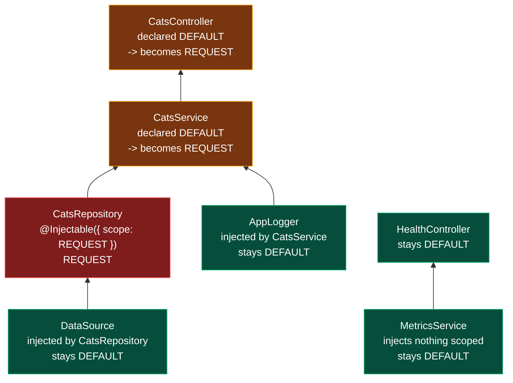

# Chapter 38 — Injection Scopes and Request-Scoped Providers

> **한눈에 보기**
> 지금까지 모든 프로바이더는 싱글턴이었습니다. 이 장은 그 가정을 깨는 `REQUEST`와 `TRANSIENT` 스코프를 다룹니다.
> 세 스코프의 정확한 수명, 커스텀 프로바이더와 컨트롤러에 스코프를 주는 법,
> 그리고 Nest에서 가장 비싼 실수인 **스코프 전파(bubbling)** — 싱글턴 하나가 요청 스코프 프로바이더에 의존하는 순간
> 트리 전체가 요청마다 재생성되는 현상 — 을 원리·탐지법·비용까지 파고듭니다.
> 멀티테넌시를 위한 `durable` 프로바이더와 `ContextIdStrategy`를 실제로 구현해 보고,
> 마지막에는 "대부분의 경우 `AsyncLocalStorage`(43장)가 더 낫다"는 결론에 이릅니다.

**What you will learn**

- The exact lifetime of `DEFAULT`, `REQUEST`, and `TRANSIENT` providers, and why Node's single-threaded model makes singletons safe by default.
- How to set scope on `@Injectable()`, on a custom provider object, and on a controller — and which of those you should almost never do.
- The scope-bubbling rule, the reason it exists, and a one-line unit test that fails the build when a provider accidentally becomes request-scoped.
- What request scope actually costs, measured with a method you can run yourself rather than a number you have to trust.
- How `durable: true` plus a `ContextIdStrategy` gives you per-tenant DI sub-trees instead of per-request ones, with a complete worked strategy.
- Which token to inject for the incoming request on HTTP (`REQUEST`), GraphQL, WebSockets, and microservices (`CONTEXT`), and why `INQUIRER` only makes sense on transient providers.
- Why guards, interceptors, and filters have a surprising instantiation order under request scope — and why `AsyncLocalStorage` is usually the better answer to the problem that sent you here.

**Why this matters**

A team adds request-scoped logging: a `RequestContextService` that injects `REQUEST`, pulls the trace ID from a header, and exposes it to anything that logs. It is 15 lines and it works beautifully. Three weeks later, p99 latency has tripled and memory allocation rate has gone up by an order of magnitude. Nothing in the diff explains it — the logger is cheap.

What happened is that `RequestContextService` was injected into `AppLogger`, which is injected into `DatabaseService`, which is injected into every repository, which is injected into every service, which is injected into every controller. Scope bubbles upward through the dependency graph, so a single request-scoped leaf converted essentially the entire application into per-request construction. At 30,000 concurrent requests there are 30,000 copies of every controller, every service, and every repository, all allocated and all collected. The framework did nothing wrong; it did precisely what the rule says. But nothing warned anybody.

This is, in my experience, the single most expensive misunderstanding in Nest applications, and it is entirely preventable — both by understanding the rule and by writing a test that enforces it. This chapter covers the mechanism, the escape hatch (`durable` providers), the measurement technique, and the alternative that avoids the whole problem.

---

## 1. Why singletons are the default

Developers coming from Java or C# often expect request-per-thread semantics: each request runs on its own thread with its own object graph, and sharing state between requests is a bug. Node is not that. One thread handles interleaved requests through the event loop. There is no thread-local storage to leak into, and there is no per-request stack to hang objects from.

That makes singletons *safe* in the way that matters. A shared connection pool, a compiled schema, a warmed LRU cache, a Redis client — all of these are correct as one instance for the lifetime of the process, and expensive to build more than once. Nest therefore builds every provider exactly once during bootstrap and reuses it forever.

Singleton state is only dangerous if you *mutate per-request data* on a shared instance:

```typescript
// ❌ A shared field holding request data. The next request overwrites it,
// and any await in between makes the value belong to somebody else.
@Injectable()
export class OrdersService {
  private currentUserId!: string;

  async handle(userId: string) {
    this.currentUserId = userId;
    await this.repo.slowQuery();      // another request runs here
    return this.repo.forUser(this.currentUserId);  // possibly the wrong user
  }
}
```

The fix is not request scope. The fix is to stop storing request data on the instance and pass it as an argument. Reach for a scope only when passing it is genuinely impossible.

---

## 2. The three scopes

```typescript
export enum Scope {
  DEFAULT,
  TRANSIENT,
  REQUEST,
}
```

| | `DEFAULT` (singleton) | `REQUEST` | `TRANSIENT` |
|---|---|---|---|
| Instances created | 1 per application | 1 per request (per DI sub-tree) | 1 per consumer that injects it |
| Created when | Bootstrap, before `listen()` | Lazily, during request handling | With each consumer |
| Lives until | Process exit | Request completes, then GC | As long as its consumer |
| Can inject `REQUEST` | ❌ | ✅ | only if also request-scoped |
| Bubbles to consumers | — | ✅ consumers become request-scoped | ❌ consumers stay as they are |
| Reachable via `app.get()` | ✅ | ❌ (`resolve()` instead) | ❌ (`resolve()` instead) |
| Lifecycle hooks per instance | once | per instance created | per instance created |
| Typical use | Everything | Multi-tenancy, per-request cache | Loggers that need their consumer's identity |
| Cost | Zero after bootstrap | Instantiation + GC per request, ×N in the sub-tree | Instantiation per injection site, at bootstrap |

Two rows deserve emphasis.

**`TRANSIENT` does not bubble.** A singleton that injects a transient provider gets its own dedicated instance and *remains a singleton*. Transient means "not shared between consumers", not "recreated over time". A transient provider injected into a singleton is created once, at bootstrap, and lives forever — it is simply not shared with the next consumer. If you want per-request-and-unshared, mark it `REQUEST`.

**`REQUEST` bubbles.** That is §4, and it is the whole chapter.

---

## 3. Declaring scope

On a class, through the `@Injectable()` options:

```typescript
import { Injectable, Scope } from '@nestjs/common';

@Injectable({ scope: Scope.REQUEST })
export class TenantContext {}
```

On a custom provider, through the `scope` field of the long-hand form (available on `ClassProvider` and `FactoryProvider` only — see Chapter 36 §1):

```typescript
{
  provide: CACHE_MANAGER,
  useClass: CacheManager,
  scope: Scope.TRANSIENT,
}

{
  provide: TENANT_DB,
  useFactory: (req: Request) => pools.get(req.headers['x-tenant-id'] as string),
  inject: [REQUEST],
  scope: Scope.REQUEST,
}
```

`Scope.DEFAULT` is the default and never needs writing, though stating it explicitly on a provider whose neighbours are scoped is reasonable documentation.

On a controller, through `ControllerOptions` — this applies to every handler in the controller:

```typescript
@Controller({ path: 'cats', scope: Scope.REQUEST })
export class CatsController {}
```

Setting scope on a controller directly is rarely what you want. A controller becomes request-scoped automatically if any of its dependencies is; doing it by hand adds cost without adding capability. The one legitimate case is a controller that itself injects `REQUEST` for something a `@Req()` parameter cannot express — and even then, `@Req()` usually can.

> **⚠️ Notice** — Some providers **must** be singletons and will misbehave or throw if you scope them. WebSocket gateways each wrap a real socket server and cannot be instantiated per request. Passport strategies are registered once with Passport at startup (there is a documented request-scoped strategy pattern, but it is a special construction, not a plain `scope: Scope.REQUEST`). Cron/scheduled providers are registered with the scheduler at bootstrap; a request-scoped one is never registered at all, and your job silently never runs.

---

## 4. Scope bubbling

**The rule: if any provider in a class's dependency graph is request-scoped, that class is request-scoped too, transitively, all the way up to the controller.**

Consider `CatsController ← CatsService ← CatsRepository`. If `CatsService` is request-scoped, `CatsController` becomes request-scoped because it depends on it. `CatsRepository` depends on nothing scoped and stays a singleton.

Now invert it. If `CatsRepository` is the request-scoped one, then `CatsService` becomes request-scoped, and therefore `CatsController` does too. Scope propagates *from dependency to dependent* — upward, toward the entry point.



Read the arrows as "is injected into". Scope travels along them. `AppLogger` and `DataSource` are *below* the scoped node and are unaffected — a singleton dependency of a request-scoped provider stays a singleton and is shared. Only things *above* are converted. `HealthController`, in a different branch, is untouched.

### Why the rule must be this way

It follows from a lifetime constraint that has no alternative. If `CatsController` were a singleton holding a reference to a `CatsService` instance created for request #1, then request #2 would use request #1's service — which is precisely the state-leak bug that request scope exists to prevent. A consumer can never outlive its dependency, so the consumer must adopt the shorter lifetime.

Transient scope escapes this because a transient instance is dedicated but *not time-bounded*: giving a singleton its own private copy for the life of the process is consistent.

### The mechanism

At bootstrap, Nest's `InstanceLoader` computes each wrapper's effective scope by walking its dependencies. Providers whose effective scope is `DEFAULT` are constructed immediately and cached. Providers whose effective scope is `REQUEST` are **not constructed at all** at bootstrap — only their metadata is prepared.

At request time, the router creates a `ContextId` (an opaque object, effectively an identity key), and every scoped instance needed for that request is constructed and stored in the wrapper's per-context instance map, keyed by that `ContextId`. When the request completes, Nest drops the entry and the instances become garbage.

Two consequences you can observe:

- A request-scoped provider's constructor errors surface on the **first request**, not at boot. A typo that would have failed bootstrap now fails as an HTTP 500.
- `onModuleInit` on a request-scoped provider runs **per instance**, i.e. per request. It is not a startup hook any more.

### Detecting bubbling — the test that saves you

`app.get(Token)` throws for scoped providers with a very specific message:

```text
CatsService is marked as a scoped provider. Request and transient-scoped providers
can't be used in combination with "get()" method. Please, use "resolve()" instead.
```

That error is a gift. Turn it into a regression test that pins the scope of everything you intend to stay a singleton:

```typescript title="test/scopes.e2e-spec.ts"
import { Test } from '@nestjs/testing';
import { INestApplication } from '@nestjs/common';
import { AppModule } from '../src/app.module';
import { OrdersService } from '../src/orders/orders.service';
import { OrdersRepository } from '../src/orders/orders.repository';
import { AppLogger } from '../src/common/app.logger';
import { OrdersController } from '../src/orders/orders.controller';

describe('injection scopes', () => {
  let app: INestApplication;

  beforeAll(async () => {
    app = (await Test.createTestingModule({ imports: [AppModule] }).compile())
      .createNestApplication();
    await app.init();
  });

  afterAll(() => app.close());

  // If any of these becomes request-scoped by accident, get() throws and CI fails.
  it.each([OrdersController, OrdersService, OrdersRepository, AppLogger])(
    '%p stays singleton-scoped',
    (token) => {
      expect(() => app.get(token as any)).not.toThrow();
    },
  );
});
```

Add every controller and every hot-path service to that list. It costs one file and it converts an invisible, gradual performance regression into a red build on the pull request that introduces it.

Two supporting techniques:

- `NEST_DEBUG=true` prints resolution details at startup and makes the tree visible.
- Nest Devtools (Chapter 56) renders the dependency graph with scopes colour-coded, which is the fastest way to find *why* something bubbled once you know that it did.

---

## 5. Transient scope and `INQUIRER`

Transient providers exist for one main use case: a helper that needs to know **who injected it**.

```typescript
import { Inject, Injectable, Scope } from '@nestjs/common';
import { INQUIRER } from '@nestjs/core';

@Injectable({ scope: Scope.TRANSIENT })
export class ContextualLogger {
  private readonly context: string;

  constructor(@Inject(INQUIRER) parentClass: object) {
    this.context = parentClass?.constructor?.name ?? 'Application';
  }

  log(message: string) {
    console.log(`[${this.context}] ${message}`);
  }
}
```

```typescript
@Injectable()
export class OrdersService {
  constructor(private readonly logger: ContextualLogger) {}

  create() {
    this.logger.log('creating order');   // "[OrdersService] creating order"
  }
}
```

`INQUIRER` resolves to the instance of the class that requested this provider. It only has meaning for transient providers — a singleton has many inquirers and Nest cannot pick one, so `INQUIRER` on a singleton is not useful. This pattern removes the `new Logger(OrdersService.name)` boilerplate from every service in the codebase.

Note the cost profile: a transient provider injected into 50 singletons produces 50 instances, all at bootstrap, all permanent. That is fine for loggers. It is not fine for anything holding a connection or a buffer.

---

## 6. `REQUEST`, `CONTEXT`, and the platform difference

In an HTTP application, inject the `REQUEST` token to reach the underlying request object:

```typescript
import { Inject, Injectable, Scope } from '@nestjs/common';
import { REQUEST } from '@nestjs/core';
import { Request } from 'express';

@Injectable({ scope: Scope.REQUEST })
export class TenantContext {
  readonly tenantId: string;

  constructor(@Inject(REQUEST) private readonly request: Request) {
    this.tenantId = (request.headers['x-tenant-id'] as string) ?? 'public';
  }
}
```

Under Fastify the only change is the imported type (`FastifyRequest` from `fastify`); the token and mechanism are identical.

`REQUEST` is *inherently* request-scoped. You do not need to declare `scope: Scope.REQUEST` on a class that injects it — the bubbling rule makes it request-scoped anyway. Writing it is documentation, not behaviour. Equally, you cannot opt out: declaring `Scope.DEFAULT` on a class that injects `REQUEST` is ignored.

For non-HTTP transports there is no HTTP request, so Nest exposes `CONTEXT` instead:

| Platform | Token | Import from | Resolves to |
|---|---|---|---|
| HTTP (Express/Fastify) | `REQUEST` | `@nestjs/core` | The native request object |
| GraphQL | `CONTEXT` | `@nestjs/graphql` | Whatever your `context` function returned |
| Microservices | `CONTEXT` | `@nestjs/microservices` | `{ data, context }` for the inbound message |
| WebSockets | `CONTEXT` | `@nestjs/websockets` | The client/data payload — but see the gateway caveat |

For GraphQL you configure what `CONTEXT` contains:

```typescript
GraphQLModule.forRoot<ApolloDriverConfig>({
  driver: ApolloDriver,
  context: ({ req }) => ({ req }),
});
```

```typescript
import { CONTEXT } from '@nestjs/graphql';

@Injectable({ scope: Scope.REQUEST })
export class TenantContext {
  constructor(@Inject(CONTEXT) private readonly ctx: { req: Request }) {}
}
```

The GraphQL case is the one place where request scope genuinely earns its cost more often than not — per-request DataLoader instances are the canonical example, since a DataLoader's whole purpose is a cache with request lifetime.

Remember the gateway caveat from §3: a WebSocket gateway itself must stay a singleton, because it wraps the server. Request-scoped providers can be resolved inside a gateway *handler* via `ModuleRef` (§10), but the gateway class cannot be scoped.

---

## 7. Enhancers under request scope

Guards, interceptors, pipes, and filters can be request-scoped, but only when registered through the DI container. The distinction is sharp:

```typescript
// ✅ Registered through DI — may be request-scoped, may inject other providers.
@Module({
  providers: [{ provide: APP_GUARD, useClass: TenantGuard }],
})
export class AppModule {}

// ❌ Registered outside DI — always a singleton, cannot inject anything.
app.useGlobalGuards(new TenantGuard());
```

`app.useGlobalGuards(new X())` takes an instance *you* constructed. Nest cannot give it dependencies and cannot re-create it per request. If your global guard needs `ConfigService` or a request-scoped context, it must be registered with `APP_GUARD`.

### The instantiation order surprise

When a request arrives at a route whose tree contains scoped providers, Nest creates the `ContextId` first and then instantiates scoped components **in pipeline order, not in dependency-declaration order**:

1. Middleware (never request-scoped in the DI sense — it is Express/Fastify middleware, see Chapter 8)
2. Guards
3. Interceptors (pre-handler half)
4. Pipes
5. **The controller**
6. The handler runs
7. Interceptors (post-handler half)
8. Filters, only if something threw

The surprise is step 5: **the controller is instantiated after the guards and interceptors have already run.** If you assumed a request-scoped controller's constructor is the first thing to touch the request, it is not. A guard that authenticates the user runs before the controller exists.

The reason this matters practically is that a shared request-scoped provider — say `TenantContext` — is created on **first use** within the request and then reused for the rest of it, because all components in one request share a `ContextId`. So:

```typescript
@Injectable()
export class TenantGuard implements CanActivate {
  constructor(private readonly tenant: TenantContext) {}   // TenantContext created here

  canActivate(ctx: ExecutionContext) {
    return this.tenant.tenantId !== 'public';
  }
}

@Controller('orders')
export class OrdersController {
  constructor(private readonly tenant: TenantContext) {}   // same instance, not a new one
}
```

One `TenantContext` per request, created when the guard is built, seen by the controller and everything below it. That sharing is what makes request scope coherent — and it is also what makes it expensive, because *both* the guard and the controller are now per-request objects.

Filters are the exception worth remembering: a request-scoped filter registered via `APP_FILTER` is instantiated only when an exception actually occurs, so it costs nothing on the happy path.

---

## 8. What request scope actually costs

The official documentation says a well-designed application using request-scoped providers "should not slow down by more than ~5% latency-wise". That figure is true for the case it describes — a small number of scoped providers at the edge of the graph — and badly misleading for the case people actually hit, which is a scoped provider near the root of the graph that converts everything above it.

The honest model is arithmetic rather than a percentage. Per request you pay, for every provider whose effective scope is `REQUEST`:

- one constructor call and its object allocation,
- a `Map` insertion keyed by `ContextId`, plus the wrapper bookkeeping,
- whatever the constructor itself does (parse a header: free; open a connection: catastrophic),
- garbage collection pressure proportional to the total.

So the cost is `N × (allocation + constructor work)` where `N` is the number of converted providers, not the number you annotated. In the opening story, the team annotated one provider and `N` was over 200.

Measure it rather than guessing. The method:

```bash
# baseline
npx autocannon -c 100 -d 20 http://localhost:3000/orders
```

Then instrument the count of converted providers with the same `app.get()` trick from §4:

```typescript title="scripts/count-scoped.ts"
import { NestFactory } from '@nestjs/core';
import { AppModule } from '../src/app.module';

async function main() {
  const app = await NestFactory.create(AppModule, { logger: false });
  // In a real script, enumerate tokens with DiscoveryService (Chapter 41).
  const tokens = [/* ...your providers... */];
  const scoped = tokens.filter((t) => {
    try { app.get(t as any); return false; } catch { return true; }
  });
  console.log(`${scoped.length}/${tokens.length} providers are scoped`);
  await app.close();
}
main();
```

Rules of thumb that hold up in practice:

- Under ~10 converted providers with trivial constructors, the overhead is small enough to be lost in network noise — this is the docs' 5% case.
- Once the controller and its whole service/repository chain convert (tens to hundreds of providers), expect a materially worse p99 and a much higher allocation rate. The exact number depends entirely on your constructors.
- Any constructor doing I/O under request scope is a per-request I/O operation. That is not a percentage regression; it is a different application.

The actionable version: **the number that matters is how many providers converted, and you can count it in an afternoon.**

---

## 9. Durable providers: per-tenant sub-trees

Request scope recreates the sub-tree per request. But if the thing that varies is not the request — it is the *tenant* — then recreating per request is waste. With 10 tenants and 30,000 concurrent requests you want 10 sub-trees, not 30,000.

That is what `durable: true` provides. A durable provider is still request-scoped in the sense that it is not a global singleton, but its `ContextId` is chosen by a **strategy** you supply, so requests that share a tenant share instances.

**Step 1 — write the strategy.**

```typescript title="src/tenancy/tenant-context-id.strategy.ts"
import {
  ContextId,
  ContextIdFactory,
  ContextIdStrategy,
  HostComponentInfo,
} from '@nestjs/core';
import { Request } from 'express';

const tenants = new Map<string, ContextId>();

export class AggregateByTenantContextIdStrategy implements ContextIdStrategy {
  attach(contextId: ContextId, request: Request) {
    const tenantId = (request.headers['x-tenant-id'] as string) ?? 'public';

    let tenantSubTreeId = tenants.get(tenantId);
    if (!tenantSubTreeId) {
      tenantSubTreeId = ContextIdFactory.create();
      tenants.set(tenantId, tenantSubTreeId);
    }

    return {
      // Durable components reuse the tenant sub-tree; everything else
      // keeps the per-request contextId.
      resolve: (info: HostComponentInfo) =>
        info.isTreeDurable ? tenantSubTreeId! : contextId,
      // What @Inject(REQUEST) resolves to inside the durable sub-tree.
      payload: { tenantId },
    };
  }
}
```

The `attach` method may return either a bare resolver function or the `{ resolve, payload }` object shown here. The difference matters: with only a resolver, **no payload is registered**, and injecting `REQUEST` inside the durable sub-tree gives you nothing useful. With a `payload`, `@Inject(REQUEST)` resolves to that payload object — `{ tenantId }` here — instead of the HTTP request. This is the right call: a durable instance is shared across many requests, so it must not close over any single request.

**Step 2 — register it before any traffic arrives.**

```typescript title="src/main.ts"
import { NestFactory, ContextIdFactory } from '@nestjs/core';
import { AppModule } from './app.module';
import { AggregateByTenantContextIdStrategy } from './tenancy/tenant-context-id.strategy';

async function bootstrap() {
  ContextIdFactory.apply(new AggregateByTenantContextIdStrategy());

  const app = await NestFactory.create(AppModule);
  await app.listen(3000);
}
bootstrap().catch((e) => { console.error(e); process.exit(1); });
```

`ContextIdFactory.apply` is global and process-wide. Call it before `listen()`.

**Step 3 — mark providers durable.**

```typescript title="src/tenancy/tenant-connection.ts"
import { Inject, Injectable, Scope } from '@nestjs/common';
import { REQUEST } from '@nestjs/core';
import { DataSource } from 'typeorm';

@Injectable({ scope: Scope.REQUEST, durable: true })
export class TenantConnection {
  private dataSource?: DataSource;

  constructor(@Inject(REQUEST) private readonly payload: { tenantId: string }) {}

  async get(): Promise<DataSource> {
    if (!this.dataSource) {
      this.dataSource = await new DataSource({
        type: 'postgres',
        url: process.env.DATABASE_URL,
        schema: this.payload.tenantId,       // one schema per tenant
      }).initialize();
    }
    return this.dataSource;
  }
}
```

Custom providers use the long-hand form:

```typescript
{
  provide: TENANT_CACHE,
  useFactory: (payload: { tenantId: string }) => new LruCache(payload.tenantId),
  inject: [REQUEST],
  scope: Scope.REQUEST,
  durable: true,
}
```

Now there is one `TenantConnection` per tenant, not per request. Ten tenants, ten connections, regardless of load.

> **Hint** — Durability bubbles just like scope: if `A` depends on durable `B`, `A` becomes durable too, unless you set `durable: false` on `A` explicitly.

### The limits, stated plainly

- **The tenant map grows without bound.** The docs warn that this strategy "is not ideal for applications operating with a large number of tenants", and the reason is right there in the `Map` — nothing evicts. With ten tenants that is fine; with a hundred thousand it is a leak, and every sub-tree holds a live connection. Add an LRU with eviction, or do not use this pattern.
- **Durable instances outlive requests.** Anything you store on one is shared by every subsequent request from that tenant. Storing a user ID on a durable provider is the cross-tenant leak's little brother — a cross-*user* leak within a tenant.
- **The classification key must be coarse and stable.** If it is anything close to unique per request (a request ID, a user ID in a large user base), you have reinvented request scope with extra bookkeeping and a memory leak.

---

## 10. Resolving scoped providers manually with `ModuleRef`

`app.get()` and `moduleRef.get()` fail on scoped providers because there is no single instance to return. Use `resolve()`, which returns a promise for a **new** instance:

```typescript
const service = await this.moduleRef.resolve(TenantContext);
```

Each call to `resolve()` with no arguments creates a fresh DI sub-tree. To share instances with the current request — which is almost always what you want — pass the request's `ContextId`:

```typescript
import { Injectable, Scope } from '@nestjs/common';
import { ModuleRef, ContextIdFactory } from '@nestjs/core';

@Injectable()
export class OrdersProcessor {
  constructor(private readonly moduleRef: ModuleRef) {}

  async handle(request: Request) {
    const contextId = ContextIdFactory.getByRequest(request);
    // Optional: make @Inject(REQUEST) work inside this sub-tree.
    this.moduleRef.registerRequestByContextId(request, contextId);

    const tenant = await this.moduleRef.resolve(TenantContext, contextId);
    // Resolving again with the same contextId returns the SAME instance.
  }
}
```

This is the escape hatch for the places where scope cannot bubble to you: WebSocket gateways, scheduled jobs, and queue consumers that need per-message context. Chapter 41 covers `ModuleRef` in full, including `strict` mode and resolving from other modules.

---

## 11. Why `AsyncLocalStorage` is usually the better answer

Step back and ask what problem sent you to request scope. In nearly every real case it is: *"I need the trace ID / user / tenant available deep in the call stack without threading it through 12 function signatures."*

Request scope solves that by making the objects themselves per-request. `AsyncLocalStorage` (Node's built-in, Chapter 43) solves it by making the *data* ambient while leaving every provider a singleton:

```typescript title="src/context/request-context.ts"
import { AsyncLocalStorage } from 'node:async_hooks';

export interface RequestStore {
  traceId: string;
  tenantId: string;
  userId?: string;
}

export const requestContext = new AsyncLocalStorage<RequestStore>();
```

```typescript title="src/context/context.middleware.ts"
import { Injectable, NestMiddleware } from '@nestjs/common';
import { randomUUID } from 'node:crypto';
import { requestContext } from './request-context';

@Injectable()
export class ContextMiddleware implements NestMiddleware {
  use(req: any, _res: any, next: () => void) {
    requestContext.run(
      {
        traceId: (req.headers['x-trace-id'] as string) ?? randomUUID(),
        tenantId: (req.headers['x-tenant-id'] as string) ?? 'public',
      },
      next,
    );
  }
}
```

```typescript
@Injectable()                       // still a singleton
export class OrdersService {
  create() {
    const { traceId } = requestContext.getStore()!;
    this.logger.log({ traceId, msg: 'creating order' });
  }
}
```

The comparison:

| | Request scope | `AsyncLocalStorage` |
|---|---|---|
| Per-request allocations | One per converted provider | One store object |
| Bubbling risk | High — invisible and transitive | None |
| Works in gateways, cron, queue consumers | Only via `ModuleRef.resolve` | Yes, if you enter the context |
| Constructor injection of context | ✅ natural | ❌ read it inside methods |
| Failure mode | Silent performance collapse | `getStore()` returns `undefined` outside a context |
| Testability | Needs a request | Wrap the call in `run()` |

The `AsyncLocalStorage` failure mode is loud and local: forget to enter the context and `getStore()` is `undefined` at that call site. The request-scope failure mode is silent and global. That asymmetry is the argument.

My recommendation for this book: **use `AsyncLocalStorage` for request-scoped data, and reserve request scope for request-scoped objects** — a per-request DataLoader, a per-request transaction handle, a database connection that must be chosen from the request. If what you need is a value rather than an object with a lifecycle, `AsyncLocalStorage` is the right tool and it costs nothing.

### Decision table

| Situation | Use |
|---|---|
| Anything, by default | `Scope.DEFAULT` |
| Trace ID, user, tenant available deep in the stack | `AsyncLocalStorage` (Chapter 43) |
| GraphQL DataLoader with per-request caching | `Scope.REQUEST` |
| Transaction handle that must span a request | `Scope.REQUEST`, or ALS holding the handle |
| Per-tenant connection, few tenants | `Scope.REQUEST` + `durable: true` + strategy |
| Per-tenant connection, many tenants | Singleton pool map keyed by tenant, LRU-evicted |
| Logger that needs its consumer's class name | `Scope.TRANSIENT` + `INQUIRER` |
| Context inside a gateway, cron job, or queue consumer | `ModuleRef.resolve(token, contextId)` or ALS |
| Anything holding a socket, a schedule, or a Passport strategy | `Scope.DEFAULT` — it is not optional |

---

## Common mistakes

1. **One scoped leaf converts the whole app.** *Symptom:* p99 latency and allocation rate rise with no obvious cause. *Cause:* scope bubbles from dependency to dependent. *Fix:* count the converted providers; move the scoped provider to a leaf, or replace it with `AsyncLocalStorage`. Add the `app.get()` regression test from §4.

2. **Expecting `TRANSIENT` to mean "per request".** *Symptom:* a transient provider holds stale state between requests. *Cause:* transient means unshared, not short-lived; injected into a singleton it lives forever. *Fix:* use `Scope.REQUEST` if you need per-request lifetime.

3. **`onModuleInit` on a request-scoped provider.** *Symptom:* the "startup" hook runs on every request, and startup work never happens at startup. *Cause:* lifecycle hooks fire per instance. *Fix:* move initialisation to a singleton and inject it.

4. **`app.get()` on a scoped provider.** *Symptom:* `X is marked as a scoped provider... use "resolve()" instead`. *Cause:* there is no single instance. *Fix:* `await moduleRef.resolve(X, contextId)` — and pass the `contextId` if you want the request's instance rather than a brand-new sub-tree.

5. **Scoping a gateway, a Passport strategy, or a cron provider.** *Symptom:* the socket server misbehaves, authentication silently fails, or a scheduled job simply never runs. *Cause:* these are registered with an external system once at bootstrap; a scoped provider is never constructed then. *Fix:* keep them singletons and resolve scoped dependencies inside handlers via `ModuleRef`.

6. **`app.useGlobalGuards(new Guard())` with a guard that needs DI.** *Symptom:* `Cannot read properties of undefined` on an injected dependency. *Cause:* you constructed the instance, so Nest injected nothing. *Fix:* register with `{ provide: APP_GUARD, useClass: Guard }`.

7. **A durable strategy keyed by something near-unique.** *Symptom:* memory grows monotonically and never recovers. *Cause:* the tenant `Map` gains an entry (and a live sub-tree) per distinct key, with no eviction. *Fix:* key on a genuinely coarse attribute, and bound the map with an LRU.

8. **Calling `ContextIdFactory.apply` after `listen()`.** *Symptom:* durability works intermittently, or not at all under load. *Cause:* requests that arrived before registration used the default factory. *Fix:* apply the strategy as the first statement of `bootstrap()`.

---

## Putting it together

Multi-tenant order handling: a durable per-tenant connection, an `AsyncLocalStorage` trace context for everything that is merely a value, and a scope-pinning test.

```typescript title="src/tenancy/tenant-context-id.strategy.ts"
import { ContextId, ContextIdFactory, ContextIdStrategy, HostComponentInfo } from '@nestjs/core';
import { Request } from 'express';
import { LRUCache } from 'lru-cache';

// Bounded: evicting a tenant simply causes its sub-tree to be rebuilt on next use.
const tenants = new LRUCache<string, ContextId>({ max: 50 });

export class AggregateByTenantContextIdStrategy implements ContextIdStrategy {
  attach(contextId: ContextId, request: Request) {
    const tenantId = (request.headers['x-tenant-id'] as string) ?? 'public';
    let subTreeId = tenants.get(tenantId);
    if (!subTreeId) {
      subTreeId = ContextIdFactory.create();
      tenants.set(tenantId, subTreeId);
    }
    return {
      resolve: (info: HostComponentInfo) => (info.isTreeDurable ? subTreeId! : contextId),
      payload: { tenantId },
    };
  }
}
```

```typescript title="src/tenancy/tenant-connection.ts"
import { Inject, Injectable, OnModuleDestroy, Scope } from '@nestjs/common';
import { REQUEST } from '@nestjs/core';
import { DataSource } from 'typeorm';

@Injectable({ scope: Scope.REQUEST, durable: true })
export class TenantConnection implements OnModuleDestroy {
  private dataSource?: DataSource;

  constructor(@Inject(REQUEST) private readonly payload: { tenantId: string }) {}

  async get(): Promise<DataSource> {
    this.dataSource ??= await new DataSource({
      type: 'postgres',
      url: process.env.DATABASE_URL,
      schema: this.payload.tenantId,
      entities: [__dirname + '/../**/*.entity.js'],
    }).initialize();
    return this.dataSource;
  }

  async onModuleDestroy() {
    await this.dataSource?.destroy();
  }
}
```

```typescript title="src/orders/orders.service.ts"
import { Injectable } from '@nestjs/common';
import { TenantConnection } from '../tenancy/tenant-connection';
import { requestContext } from '../context/request-context';
import { Order } from './order.entity';

// Durable, because TenantConnection is. NOT per request.
@Injectable()
export class OrdersService {
  constructor(private readonly connection: TenantConnection) {}

  async create(total: number): Promise<Order> {
    const { traceId } = requestContext.getStore() ?? { traceId: 'none' };
    const ds = await this.connection.get();
    // traceId comes from ALS — no provider had to become request-scoped for it.
    return ds.getRepository(Order).save({ total, traceId });
  }
}
```

```typescript title="src/main.ts"
import { NestFactory, ContextIdFactory } from '@nestjs/core';
import { AppModule } from './app.module';
import { AggregateByTenantContextIdStrategy } from './tenancy/tenant-context-id.strategy';

async function bootstrap() {
  ContextIdFactory.apply(new AggregateByTenantContextIdStrategy());
  const app = await NestFactory.create(AppModule);
  app.enableShutdownHooks();          // so onModuleDestroy closes connections
  await app.listen(3000);
}
bootstrap().catch((e) => { console.error('Bootstrap failed:', e); process.exit(1); });
```

```typescript title="test/scopes.e2e-spec.ts"
it('AppLogger and MetricsService are still singletons', async () => {
  // If someone injects TenantConnection into AppLogger, this fails loudly.
  expect(() => app.get(AppLogger)).not.toThrow();
  expect(() => app.get(MetricsService)).not.toThrow();
});
```

The result: at most 50 live tenant sub-trees regardless of request volume; trace IDs flow through singletons via `AsyncLocalStorage` at zero per-provider cost; connections are closed on shutdown; and the day somebody injects `TenantConnection` into the logger, CI says so instead of production.

---

> **핵심 정리**
> - Node는 요청당 스레드 모델이 아니므로 싱글턴이 **기본적으로 안전**하다. 요청 데이터를 인스턴스 필드에 저장하는 것이 문제이지, 싱글턴 자체가 문제가 아니다 — 해결책은 보통 스코프가 아니라 인자 전달이다.
> - `DEFAULT`는 앱당 1개, `REQUEST`는 요청당 1개, `TRANSIENT`는 **주입 지점당 1개**다. TRANSIENT는 "공유되지 않음"이지 "짧게 삶"이 아니다 — 싱글턴에 주입되면 프로세스 내내 살아 있다.
> - **스코프는 의존성 → 소비자 방향으로 전파된다.** 요청 스코프 프로바이더 하나가 그 위의 서비스·컨트롤러 전부를 요청 스코프로 바꾼다. 소비자가 의존성보다 오래 살 수 없기 때문에 이 규칙에는 대안이 없다.
> - 전파는 눈에 보이지 않는다. `app.get(Token)`이 스코프 프로바이더에서 던지는 오류를 **회귀 테스트**로 바꿔 두면, 성능이 서서히 무너지는 대신 PR에서 빌드가 깨진다.
> - 비용은 퍼센트가 아니라 산수다: `변환된 프로바이더 수 × (할당 + 생성자 작업)`. 문서의 "~5%"는 스코프 프로바이더가 그래프 말단에 있을 때의 이야기다. 세어 보면 알 수 있다.
> - 요청 스코프 프로바이더의 생성자 오류는 부팅이 아니라 **첫 요청**에서 터지고, `onModuleInit`은 시작 훅이 아니라 요청마다 실행된다.
> - `REQUEST`(HTTP)와 `CONTEXT`(GraphQL·마이크로서비스·WebSocket)는 같은 역할의 플랫폼별 토큰이다. `INQUIRER`는 TRANSIENT에서만 의미가 있다.
> - 가드·인터셉터·필터는 `APP_GUARD` 같은 DI 등록으로만 스코프를 가질 수 있다. `app.useGlobalGuards(new X())`는 언제나 싱글턴이며 주입을 받지 못한다. 컨트롤러는 가드·인터셉터 **이후에** 생성된다.
> - `durable: true` + `ContextIdStrategy`는 요청당이 아니라 **테넌트당** DI 서브트리를 만든다. 분류 키는 반드시 성기고 안정적이어야 하며, 테넌트 맵은 반드시 크기를 제한해야 한다.
> - 게이트웨이·크론·큐 컨슈머처럼 스코프가 전파되지 않는 곳에서는 `moduleRef.resolve(token, contextId)`를 쓴다(41장).
> - 필요한 것이 "객체의 수명"이 아니라 "값의 전달"이라면 답은 거의 언제나 `AsyncLocalStorage`(43장)다. 실패 모드가 조용한 전역 성능 붕괴가 아니라, 시끄럽고 국소적인 `undefined`이기 때문이다.

> **연습 문제**
> 1. `CatsController ← CatsService ← CatsRepository` 체인을 만들고 각 클래스 생성자에 로그를 넣어라. `CatsRepository`만 `Scope.REQUEST`로 바꾼 뒤 요청을 3번 보내고, 어떤 생성자가 몇 번 호출되는지 기록하라. 그다음 `CatsService`만 스코프로 바꿔 같은 실험을 반복하고 차이를 설명하라.
> 2. `Scope.TRANSIENT` 프로바이더를 서로 다른 두 싱글턴에 주입하고, 각 인스턴스에 생성 시각을 기록하라. 요청을 여러 번 보내면 시각이 바뀌는가? 왜 그런가?
> 3. 전역 가드를 `app.useGlobalGuards(new AuthGuard(configService))`로 등록해 보고, 그다음 `APP_GUARD`로 등록해 보라. 두 방식에서 `ConfigService` 주입과 요청 스코프가 각각 어떻게 동작하는지 비교하라.
> 4. **구현 과제**: §4의 스코프 고정 테스트를 여러분의 프로젝트에 도입하라. 그다음 일부러 `REQUEST` 스코프 프로바이더를 공용 로거에 주입해 테스트가 실패하는지 확인하고, 실패 메시지만 보고도 원인을 찾을 수 있는지 평가하라.
> 5. **구현 과제**: `x-tenant-id` 헤더로 분류하는 `ContextIdStrategy`와 `durable: true` 프로바이더를 구현하라. 테넌트 3개에 대해 각 100개의 동시 요청을 보내고, 인스턴스가 정확히 3개만 생성되는지 생성자 카운터로 증명하라. 그다음 `durable`을 떼고 같은 부하를 반복해 인스턴스 수와 p99 지연을 비교하라.
> 6. **구현 과제**: 요청 스코프 `RequestContextService`로 구현된 trace ID 전파를 `AsyncLocalStorage` 기반으로 다시 작성하라. 두 버전에서 `autocannon`으로 처리량과 지연을 측정하고, 변환된(=스코프가 전파된) 프로바이더 수를 세어 결과를 설명하라.

**Next:** Scoped instances are created and destroyed constantly, which raises the question of when *anything* in Nest is safely initialised or torn down — [Chapter 39 — Lifecycle Events and Graceful Shutdown](./39-lifecycle-and-shutdown.md) covers the full hook sequence, `enableShutdownHooks()`, and how to drain in-flight work before the process exits.
