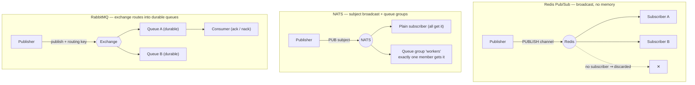
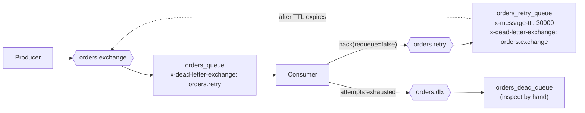

# Chapter 46 — Microservices II: Redis, MQTT, NATS, and RabbitMQ

> **한눈에 보기**
> 45장에서 배운 API는 네 개의 브로커에서 문자 그대로 동일합니다. 달라지는 것은
> **보증**입니다 — 전달, 순서, 영속성, 팬아웃, 백프레셔. 이 장은 Redis, MQTT, NATS,
> RabbitMQ를 같은 구조(설치 → 서버 옵션 → 클라이언트 옵션 → 프로듀서/컨슈머 →
> 고유 시맨틱 → 컨텍스트 클래스)로 훑고, 각 브로커가 실제로 무엇을 보장하고
> 무엇을 보장하지 않는지 밝힙니다. 마지막의 의사결정 표는 Kafka(47장)까지 포함해
> "어떤 트랜스포터를 왜 고를 것인가"에 답합니다.

**What you will learn**

- Why Redis Pub/Sub loses messages by design, when that is acceptable, and what `wildcards` changes under the hood.
- What MQTT's QoS 0, 1, and 2 actually guarantee — and the three things people wrongly believe QoS 2 gives them.
- How NATS queue groups turn a fan-out subject into a load-balanced worker pool with one configuration line, and why Nest does not use NATS's native request–reply.
- The full RabbitMQ option surface — `noAck`, `prefetchCount`, `persistent`, `queueOptions`, `wildcards`/`exchangeType` — and how to build retry with backoff and a dead-letter exchange that does not spin.
- How each transport's record builder (`MqttRecordBuilder`, `NatsRecordBuilder`, `RmqRecordBuilder`) attaches per-message metadata, and how to read it back through the context class.
- How to read the status streams and `unwrap()` each driver when the abstraction runs out.
- A decision table across all five brokers so you can choose a transport for stated reasons rather than by familiarity.

**Why this matters**

Every one of these transporters presents the same two decorators and the same `ClientProxy`. That uniformity is genuinely valuable — and it is also a trap, because it makes four systems with wildly different guarantees look interchangeable in your source code. The line `this.client.emit('payment.captured', dto)` is byte-identical whether the message is durably persisted to disk with an acknowledgement protocol or evaporates because no subscriber happened to be connected at that microsecond. Nothing in the type system distinguishes those cases. Only the transporter configuration in `main.ts` does, and it is fifty lines away in a different file.

I have watched a team ship an event-driven billing flow on Redis Pub/Sub because Redis was already in the stack for caching. It worked in staging, where the consumer was always running. In production, during a rolling deploy, the consumer was down for eleven seconds. Every invoice event published in those eleven seconds was silently discarded — not queued, not retried, not logged. Redis Pub/Sub delivers to whoever is subscribed *right now*, and to nobody else, ever. That is not a Redis bug; it is the documented and intended behaviour of the pattern. The bug was choosing a fire-and-forget broadcast bus for work that had to survive a deploy.

So the real content of this chapter is not option tables — though the tables are here and they are complete. It is the mapping from *what your messages mean* to *what the broker guarantees*. Are you broadcasting a cache invalidation that will be superseded in thirty seconds anyway? Redis is perfect and cheap. Are you fanning telemetry out from ten thousand devices on a flaky cellular link? MQTT was designed for exactly that, down to the retained-message feature. Do you need a load-balanced worker pool with sub-millisecond latency and no operational burden? NATS queue groups. Do you need per-message acknowledgement, durable queues that survive a broker restart, and dead-lettering with a retry policy? RabbitMQ, and nothing else on this list.

One more framing point before the details. Chapter 45 established that Nest normalizes *addressing and serialization*. It cannot normalize *delivery semantics*, because those are not expressible in the `send`/`emit` interface. When you read "Nest supports Redis and RabbitMQ" as "these are interchangeable," you have confused an interface with a contract. Read each section below asking one question: **what happens to a message when the consumer is down?**

---

## Reading each transport the same way

The four brokers differ in topology more than in API. Before the details, the shapes:



MQTT is topologically Redis-with-a-protocol: a broker, topics, wildcard subscriptions, broadcast to all matching subscribers — plus per-message QoS and retention, which is what makes it usable over unreliable links.

Each section below follows the same order: installation, server options, client options, a worked producer/consumer pair, the transport's own semantics, and its context class.

---

## Redis

Redis's transporter uses **Pub/Sub**, not Streams and not Lists. Published messages are categorized into channels. The publisher does not know, and cannot find out, whether anyone is subscribed. If nobody is, the message is discarded immediately and is unrecoverable. A single message is delivered to **every** subscriber on that channel — there is no built-in way to load-balance across a worker pool.

> **⚠️ Notice** — Redis Pub/Sub offers **no persistence, no acknowledgement, and no delivery guarantee**. This is the whole design, not a limitation of the Nest binding. If a message must survive a consumer restart, this transporter is the wrong tool. Use RabbitMQ, Kafka, or the BullMQ queues from [Chapter 35](../part2-intermediate/35-queues.md) — which do use durable Redis data structures, and are a different thing entirely from Pub/Sub.

### Installation

```bash
$ npm i --save ioredis
```

### Server

```typescript title="main.ts"
import { NestFactory } from '@nestjs/core';
import { MicroserviceOptions, Transport } from '@nestjs/microservices';
import { AppModule } from './app.module';

async function bootstrap() {
  const app = await NestFactory.createMicroservice<MicroserviceOptions>(AppModule, {
    transport: Transport.REDIS,
    options: { host: 'localhost', port: 6379 },
  });
  await app.listen();
}
bootstrap();
```

| Option | Meaning |
|---|---|
| `host` | Connection host. |
| `port` | Connection port. |
| `retryAttempts` | Number of times to retry a message (default `0`). |
| `retryDelay` | Delay between retry attempts in ms (default `0`). |
| `wildcards` | Use `psubscribe`/`pmessage` instead of `subscribe`/`message`, enabling glob patterns (default `false`). |

Every option supported by the official [ioredis](https://redis.github.io/ioredis/) client is also accepted — `password`, `db`, `tls`, `sentinels`, `enableOfflineQueue`, and the rest. That is how you point the transporter at Sentinel or a TLS-terminated managed Redis.

### Client

```typescript title="app.module.ts"
import { Module } from '@nestjs/common';
import { ClientsModule, Transport } from '@nestjs/microservices';

@Module({
  imports: [
    ClientsModule.register([
      {
        name: 'NOTIFICATIONS',
        transport: Transport.REDIS,
        options: { host: 'localhost', port: 6379 },
      },
    ]),
  ],
})
export class AppModule {}
```

The client options are the same table. `ClientProxyFactory` and `@Client()` work here too, with the caveats from [Chapter 45](./45-microservices-fundamentals.md).

### A worked pair

```typescript title="cache/cache-invalidation.service.ts"
import { Inject, Injectable } from '@nestjs/common';
import { ClientProxy } from '@nestjs/microservices';

@Injectable()
export class CacheInvalidationService {
  constructor(@Inject('NOTIFICATIONS') private readonly client: ClientProxy) {}

  // Broadcast: every replica must drop this key from its local cache.
  invalidate(key: string) {
    this.client.emit('cache.invalidate', { key, at: Date.now() });
  }
}
```

```typescript title="cache/cache.controller.ts"
import { Controller } from '@nestjs/common';
import { EventPattern, Payload, Ctx, RedisContext } from '@nestjs/microservices';

@Controller()
export class CacheController {
  @EventPattern('cache.invalidate')
  onInvalidate(@Payload() data: { key: string }, @Ctx() context: RedisContext) {
    console.log(`Channel: ${context.getChannel()}`);
    this.local.delete(data.key);
  }
}
```

This is Redis Pub/Sub used correctly. Every replica gets the message; a replica that was down misses it and will simply serve a stale entry until the TTL expires. The cost of a miss is bounded and small, which is precisely the condition under which fire-and-forget broadcast is the right choice.

### Wildcards

Set `wildcards: true` on **both** server and client. Under the hood the transporter switches from `subscribe`/`message` to `psubscribe`/`pmessage`.

```typescript
const app = await NestFactory.createMicroservice<MicroserviceOptions>(AppModule, {
  transport: Transport.REDIS,
  options: { host: 'localhost', port: 6379, wildcards: true },
});
```

```typescript
@EventPattern('notifications.*')
onAnyNotification(@Payload() data: unknown, @Ctx() ctx: RedisContext) {
  console.log(ctx.getChannel()); // the concrete channel, e.g. notifications.email
}
```

`RedisContext.getChannel()` becomes essential here: with a pattern subscription the handler no longer knows which concrete channel produced the message unless it asks.

### `RedisContext`, status, events, and the driver

`RedisContext` exposes one method, `getChannel()`. The status stream emits `connected`, `disconnected`, and `reconnecting`:

```typescript
this.client.status.subscribe((status: RedisStatus) => console.log(status));
server.on<RedisEvents>('error', (err) => console.error(err));
```

`unwrap()` is unusual for Redis: because Pub/Sub requires a dedicated subscriber connection, it returns a **tuple of two `ioredis` instances** — publisher first, subscriber second.

```typescript
const [pub, sub] = this.client.unwrap<[import('ioredis').Redis, import('ioredis').Redis]>();
```

Remember that a connection in subscriber mode cannot run ordinary commands. If you unwrap and call `sub.get(...)`, Redis will reject it.

---

## MQTT

MQTT is a lightweight publish/subscribe protocol built for constrained devices and unreliable, high-latency networks — cellular IoT, in a word. Three roles exist: publishers, a broker, and subscribers. Its distinguishing features are hierarchical topics with wildcards, three quality-of-service levels, and retained messages.

### Installation

```bash
$ npm i --save mqtt
```

### Server and client options

```typescript title="main.ts"
const app = await NestFactory.createMicroservice<MicroserviceOptions>(AppModule, {
  transport: Transport.MQTT,
  options: {
    url: 'mqtt://localhost:1883',
    subscribeOptions: { qos: 1 },
  },
});
```

The MQTT transporter accepts the full option set of the [MQTT.js client](https://github.com/mqttjs/MQTT.js/#mqttclientstreambuilder-options). The ones that matter in practice:

| Option | Meaning |
|---|---|
| `url` | Broker URL — `mqtt://`, `mqtts://`, `ws://`, `wss://`. |
| `clientId` | Client identifier. **Must be unique per connection**; a duplicate causes the broker to disconnect the older client, producing a reconnect loop between two replicas. |
| `clean` | `false` requests a *persistent session*: the broker retains subscriptions and queues QoS 1/2 messages while you are offline. Requires a stable `clientId`. |
| `subscribeOptions` | Options applied to every subscription the transporter creates — notably `{ qos }`. |
| `username` / `password` | Broker credentials. |
| `will` | Last Will and Testament: a message the broker publishes on your behalf if you disconnect ungracefully. |
| `keepalive` | Seconds between pings; how quickly a dead connection is noticed. |
| `userProperties` | MQTT 5 user properties attached to every outgoing message (client side). |

The client uses the same shape:

```typescript title="app.module.ts"
ClientsModule.register([
  {
    name: 'DEVICES',
    transport: Transport.MQTT,
    options: { url: 'mqtt://localhost:1883', clientId: 'api-gateway-1', clean: false },
  },
]),
```

### A worked pair

```typescript title="telemetry/telemetry.publisher.ts"
import { Inject, Injectable } from '@nestjs/common';
import { ClientProxy, MqttRecordBuilder } from '@nestjs/microservices';

@Injectable()
export class TelemetryPublisher {
  constructor(@Inject('DEVICES') private readonly client: ClientProxy) {}

  publishReading(deviceId: string, celsius: number) {
    const record = new MqttRecordBuilder({ celsius })
      .setQoS(1)
      .setRetain(true)
      .setProperties({ userProperties: { 'x-schema': 'v2' } })
      .build();

    this.client.emit(`sensors/${deviceId}/temperature/current`, record);
  }
}
```

```typescript title="telemetry/telemetry.controller.ts"
import { Controller } from '@nestjs/common';
import { EventPattern, Payload, Ctx, MqttContext } from '@nestjs/microservices';

@Controller()
export class TelemetryController {
  @EventPattern('sensors/+/temperature/+', { extras: { qos: 1 } })
  onReading(@Payload() data: { celsius: number }, @Ctx() context: MqttContext) {
    const topic = context.getTopic();            // sensors/dev-42/temperature/current
    const deviceId = topic.split('/')[1];
    const packet = context.getPacket();          // raw mqtt-packet
    const schema = packet.properties?.userProperties?.['x-schema'];
    this.store.record(deviceId, data.celsius, schema);
  }
}
```

### Topics and wildcards

Topics are `/`-delimited hierarchies. Two wildcards exist, and only in **subscriptions** — never in a published topic:

| Wildcard | Scope | `sensors/dev-1/temp` | `sensors/dev-1/hum/raw` |
|---|---|---|---|
| `sensors/+/temp` | exactly one level | matches | no |
| `sensors/#` | zero or more levels | matches | matches |
| `sensors/+/+` | exactly two levels | matches | no |

`#` must be the last character of the filter. `sensors/#/temp` is invalid and most brokers will reject the subscription outright.

### Quality of Service — what it does and does not guarantee

This is where MQTT is most often misunderstood.

| QoS | Name | Wire behaviour | Guarantee |
|---|---|---|---|
| 0 | At most once | Fire and forget; no acknowledgement | May be lost. Never duplicated. |
| 1 | At least once | PUBLISH → PUBACK, resend until acknowledged | Will arrive, **may arrive more than once**. |
| 2 | Exactly once | Four-step handshake: PUBLISH → PUBREC → PUBREL → PUBCOMP | Delivered exactly once **for that hop**. |

Three corrections to the common beliefs:

1. **QoS is per hop, not end-to-end.** It governs publisher↔broker and broker↔subscriber separately. A message published at QoS 2 and delivered to a subscriber that subscribed at QoS 0 arrives at QoS 0 — the *effective* QoS is the minimum of the two.
2. **QoS 2 does not make your handler idempotent.** It guarantees the broker delivers the packet once. If your process crashes after handling and before the final acknowledgement, the message is redelivered on reconnect. Write idempotent handlers regardless of QoS.
3. **QoS 1/2 buffering while offline requires `clean: false` and a stable `clientId`.** With a clean session, the broker forgets you the moment you disconnect, and QoS 2 buys nothing across a restart.

In Nest, subscriptions created by `@MessagePattern`/`@EventPattern` default to **QoS 0**. Raise it globally with `subscribeOptions.qos`, or per pattern through `extras`:

```typescript
@EventPattern('critical-events', { extras: { qos: 2 } })
handleCriticalEvent(@Payload() data: unknown) {}

@EventPattern('metrics', { extras: { qos: 0 } })
handleMetrics(@Payload() data: unknown) {}
```

When `extras.qos` is absent, the global `subscribeOptions.qos` applies. This is the right default structure: QoS 0 for high-volume telemetry you can afford to drop, QoS 1 for commands.

### Retained messages

Setting the retain flag tells the broker to keep the message as the *last known value* for that topic and hand it to every future subscriber immediately on subscribe. For a device state topic — `devices/dev-42/status` — this is exactly right: a dashboard that connects at 3 a.m. learns the current state without waiting for the next heartbeat. For an event topic, retention is a bug: every new subscriber replays a stale event as if it just happened. Retain state; do not retain events.

### `MqttRecordBuilder` and `MqttContext`

`MqttRecordBuilder` wraps a payload with per-message options — `setQoS`, `setRetain`, `setDupFlag`, `setProperties` — and `build()` produces the record you pass to `send()` or `emit()`. For options that apply to every message from a client, set `userProperties` on the client options instead:

```typescript title="api.module.ts"
import { Module } from '@nestjs/common';
import { ClientProxyFactory, Transport } from '@nestjs/microservices';

@Module({
  providers: [
    {
      provide: 'API_v1',
      useFactory: () =>
        ClientProxyFactory.create({
          transport: Transport.MQTT,
          options: {
            url: 'mqtt://localhost:1883',
            userProperties: { 'x-version': '1.0.0' },
          },
        }),
    },
  ],
})
export class ApiModule {}
```

`MqttContext` gives you `getTopic()` and `getPacket()`. The packet is the raw `mqtt-packet` object, which is where retained flags, dup flags, and MQTT 5 properties live:

```typescript
@MessagePattern('replace-emoji')
replaceEmoji(@Payload() data: string, @Ctx() context: MqttContext): string {
  const { properties: { userProperties } } = context.getPacket();
  return userProperties['x-version'] === '1.0.0' ? 'cat-v1' : 'cat-v0';
}
```

The status stream emits `connected`, `disconnected`, `reconnecting`, and `closed`. `unwrap()` returns the `MqttClient`.

---

## NATS

NATS is a high-performance messaging system written in Go, with a text protocol, sub-millisecond latency, and an operational footprint small enough that a single binary handles most deployments. Core NATS supports **at-most-once** delivery; **at-least-once** requires JetStream, its persistence layer.

### Installation

```bash
$ npm i --save nats
```

### Server options

```typescript title="main.ts"
const app = await NestFactory.createMicroservice<MicroserviceOptions>(AppModule, {
  transport: Transport.NATS,
  options: {
    servers: ['nats://localhost:4222'],
    queue: 'orders_workers',
    gracefulShutdown: true,
    gracePeriod: 10000,
  },
});
```

Beyond the full [node-nats connection options](https://github.com/nats-io/node-nats#connection-options) — `servers`, `token`, `user`/`pass`, `tls`, `reconnect`, `maxReconnectAttempts`, `name` — the transporter adds three:

| Option | Meaning |
|---|---|
| `queue` | The queue group this server joins. Leave `undefined` to receive every message (pure fan-out). |
| `gracefulShutdown` | When `true`, unsubscribe from all subjects before closing the connection (default `false`). |
| `gracePeriod` | Milliseconds to wait after unsubscribing, so in-flight messages finish (default `10000`). |

`gracefulShutdown` deserves emphasis: without it, a rolling deploy tears the connection down with messages in flight, and those messages are simply gone — core NATS will not redeliver. Turn it on in every deployment that is not a laptop, and pair it with `app.enableShutdownHooks()` ([Chapter 39](./39-lifecycle-and-shutdown.md)).

### Client options

```typescript title="app.module.ts"
ClientsModule.register([
  {
    name: 'ORDERS',
    transport: Transport.NATS,
    options: { servers: ['nats://localhost:4222'] },
  },
]),
```

The client accepts the same connection options plus a `headers` object applied to every outgoing message. It does **not** take `queue` — queue groups are a subscriber-side concept.

### Subjects and wildcards

NATS subjects are `.`-delimited: `time.us.east`, `orders.created.eu`. Two wildcards:

- `*` matches exactly one token — `time.*.east` matches `time.us.east`.
- `>` matches one or more trailing tokens — `time.>` matches `time.us.east.nyc`.

```typescript
@MessagePattern('time.us.*')
getDate(@Payload() data: unknown, @Ctx() context: NatsContext) {
  console.log(`Subject: ${context.getSubject()}`); // e.g. "time.us.east"
  return new Date().toLocaleTimeString();
}
```

### Queue groups: fan-out and load balancing in one system

This is NATS's best feature, and it is one line of configuration. Subscribers that join the same **queue group** on a subject form a pool: the server delivers each message to exactly one member, chosen at random. Subscribers *not* in a group still receive every message.

```typescript title="main.ts"
const app = await NestFactory.createMicroservice<MicroserviceOptions>(AppModule, {
  transport: Transport.NATS,
  options: { servers: ['nats://localhost:4222'], queue: 'cats_queue' },
});
```

Run three replicas of that service and you have a load-balanced worker pool with no broker configuration, no queue declaration, and no partition assignment. Run an analytics service on the same subject *without* a `queue`, and it sees every message. One subject, two consumption models, simultaneously — no other broker in this chapter does that as cleanly.

The catch, and it is a real one: membership is entirely in memory. A message delivered to a worker that then crashes is lost. Core NATS has no acknowledgement.

### Request–reply: what Nest actually does

NATS has a native request–reply mechanism. **Nest does not use it.** Instead, for `send()` the transporter publishes on the target subject with a *unique reply subject* attached, and the responder publishes its answer to that subject. Reply subjects route back to the requester dynamically, regardless of where either party sits in the cluster.

Why does this matter? Because it means `send()` over NATS carries the same correlation-id machinery described in [Chapter 45](./45-microservices-fundamentals.md), including support for multi-value streaming responses, which native NATS request–reply does not provide. The trade is one extra subscription per in-flight request.

### Headers with `NatsRecordBuilder`

```typescript
import * as nats from 'nats';
import { NatsRecordBuilder } from '@nestjs/microservices';

const headers = nats.headers();
headers.set('x-version', '1.0.0');
headers.set('x-correlation-id', correlationId);

const record = new NatsRecordBuilder({ sku, qty }).setHeaders(headers).build();
this.client.send('inventory.reserve', record).subscribe(/* ... */);
```

Read them back through `NatsContext`:

```typescript
@MessagePattern('inventory.reserve')
reserve(@Payload() data: ReserveDto, @Ctx() context: NatsContext) {
  const headers = context.getHeaders();
  const version = headers.get('x-version');
  // ...
}
```

Headers work for event-based flows too, and they are the correct place for cross-cutting metadata — trace ids, tenant ids, schema versions — precisely because they stay out of your business payload. For headers common to every message from a client, set them once on the client options:

```typescript
ClientProxyFactory.create({
  transport: Transport.NATS,
  options: { servers: ['nats://localhost:4222'], headers: { 'x-version': '1.0.0' } },
});
```

`NatsContext` provides `getSubject()` and `getHeaders()`. The status stream emits `connected`, `disconnected`, and `reconnecting`; `unwrap()` returns the `NatsConnection`.

### A note on JetStream

JetStream is the persistence layer built into modern NATS servers: durable streams, consumer acknowledgements, replay from a sequence number, at-least-once and exactly-once semantics. It turns NATS from an at-most-once bus into something in Kafka's territory.

The built-in Nest NATS transporter **does not use JetStream**. It uses core NATS. If you need durability from NATS, you have two routes: unwrap the connection and drive `jetstream()` directly from a provider, or write a custom transporter ([Chapter 49](./49-custom-transporters.md)) that binds JetStream consumers to `@EventPattern` handlers. Do not assume that "we run NATS with JetStream enabled" means your Nest microservice messages are durable — they are not, unless you did one of those two things.

---

## RabbitMQ

RabbitMQ is the most operationally capable broker in this chapter and the most configurable. It is the only one here that gives you, out of the box: durable queues that survive broker restart, per-message acknowledgement with redelivery, consumer prefetch as real backpressure, priorities, TTLs, and dead-letter routing.

### Installation

```bash
$ npm i --save amqplib amqp-connection-manager
```

Both packages are required. `amqp-connection-manager` is what gives the transporter automatic reconnection and channel re-establishment.

### Server options

```typescript title="main.ts"
const app = await NestFactory.createMicroservice<MicroserviceOptions>(AppModule, {
  transport: Transport.RMQ,
  options: {
    urls: ['amqp://localhost:5672'],
    queue: 'orders_queue',
    noAck: false,
    prefetchCount: 10,
    queueOptions: { durable: true },
  },
});
```

| Option | Meaning |
|---|---|
| `urls` | Array of connection URLs, tried in order. |
| `queue` | Queue name the server consumes from. |
| `prefetchCount` | Unacknowledged messages the broker will hand this consumer at once. Real backpressure. |
| `isGlobalPrefetchCount` | Apply prefetch per channel rather than per consumer. |
| `noAck` | `true` (default) auto-acknowledges on delivery. `false` enables **manual acknowledgement**. |
| `consumerTag` | Name distinguishing this consumer on the channel; omit and the broker generates one. |
| `queueOptions` | Passed to `assertQueue` — `durable`, `exclusive`, `autoDelete`, `arguments` (TTL, DLX, max length, quorum type). |
| `socketOptions` | Passed to `connect` — heartbeats, TLS, connection timeout. |
| `headers` | Headers attached to every message. |
| `replyQueue` | Reply queue for the producer. Default `amq.rabbitmq.reply-to` (direct reply-to). |
| `persistent` | If truthy, mark messages persistent so they survive a broker restart — **provided the queue is also durable**. |
| `noAssert` | When `false` (default) the queue is asserted before consuming; set `true` when infrastructure owns topology. |
| `wildcards` | Route via a **topic exchange**, enabling `*` and `#` in patterns. |
| `exchange` | Exchange name. Defaults to the queue name when `wildcards` is true. |
| `exchangeType` | `direct`, `fanout`, `topic` (default), or `headers`. |
| `routingKey` | Additional routing key for the topic exchange. |
| `maxConnectionAttempts` | Consumer-side connection attempts; `-1` means infinite. |

### Client options

Identical shape, with `name` as the injection token:

```typescript title="app.module.ts"
ClientsModule.register([
  {
    name: 'ORDERS',
    transport: Transport.RMQ,
    options: {
      urls: ['amqp://localhost:5672'],
      queue: 'orders_queue',
      persistent: true,
      queueOptions: { durable: true },
    },
  },
]),
```

> **⚠️ Notice** — `persistent: true` and `queueOptions.durable: true` are **both** required for a message to survive a broker restart, and they are separate settings for a reason: durability is a property of the queue, persistence a property of the message. Setting only one gives you the illusion of durability. The docs' introductory example uses `durable: false`, which is fine for a tutorial and wrong for anything you deploy.

### Queues versus exchanges

AMQP has a routing layer that Redis, MQTT, and core NATS do not. Publishers never write to a queue; they publish to an **exchange** with a routing key, and bindings decide which queues receive a copy.

By default the Nest transporter uses the simplest possible arrangement: the default exchange with the routing key set to the queue name, which behaves like publishing straight into one queue. Set `wildcards: true` and the transporter declares a **topic exchange** instead, binding the queue with your patterns as binding keys:

```typescript
const app = await NestFactory.createMicroservice<MicroserviceOptions>(AppModule, {
  transport: Transport.RMQ,
  options: { urls: ['amqp://localhost:5672'], queue: 'cats_queue', wildcards: true },
});
```

```typescript
@MessagePattern('cats.#')
getCats(@Payload() data: { message: string }, @Ctx() context: RmqContext) {
  console.log(`Routing key: ${context.getPattern()}`);
  return { message: 'Hello from the cats service!' };
}
```

```typescript
this.client.send('cats.meow', { message: 'Meow!' }).subscribe((r) => console.log(r));
```

Topic-exchange wildcards mirror MQTT's but with different symbols: `#` matches zero or more words, `*` matches exactly one. So `cats.#` matches `cats`, `cats.meow`, and `cats.meow.purr`; `cats.*` matches `cats.meow` but not `cats.meow.purr`.

Choosing `exchangeType` changes the routing rule: `direct` for exact routing-key equality, `fanout` to ignore keys and copy to every bound queue, `topic` for pattern matching, `headers` to route on header values.

### Manual acknowledgement

By default `noAck: true` — RabbitMQ considers the message delivered and deletes it the instant it hits the socket. If your process crashes mid-handler, the work is gone. That is fine for telemetry and wrong for orders.

Set `noAck: false` and you own the acknowledgement:

```typescript title="orders/orders.controller.ts"
import { Controller, Logger } from '@nestjs/common';
import { EventPattern, Payload, Ctx, RmqContext } from '@nestjs/microservices';

@Controller()
export class OrdersController {
  private readonly logger = new Logger(OrdersController.name);

  @EventPattern('order.created')
  async onOrderCreated(@Payload() data: OrderCreated, @Ctx() context: RmqContext) {
    const channel = context.getChannelRef();
    const originalMsg = context.getMessage();

    try {
      await this.orders.process(data);
      channel.ack(originalMsg);
    } catch (err) {
      this.logger.error(`order ${data.id} failed`, err);
      // requeue = false → routes to the dead-letter exchange if one is configured
      channel.nack(originalMsg, false, false);
    }
  }
}
```

The three-argument forms matter:

| Call | Effect |
|---|---|
| `channel.ack(msg)` | Done. Broker deletes the message. |
| `channel.nack(msg, false, true)` | Failed, **requeue**. Goes back to the head of the queue. |
| `channel.nack(msg, false, false)` | Failed, **do not requeue**. Dead-lettered if a DLX is bound, otherwise dropped. |
| `channel.nack(msg, true, false)` | Same, but also applies to every unacknowledged message up to this one. |

> **⚠️ Notice** — `nack(msg, false, true)` on a message that always fails produces an **infinite redelivery loop** that will saturate a CPU core in seconds. This is the single most damaging mistake in this chapter. Never requeue unconditionally; count attempts and dead-letter after a bound.

And the corollary: with `noAck: false`, **every** path out of your handler must acknowledge. A handler that returns early without `ack` or `nack` leaves the message unacknowledged forever. Those messages count against `prefetchCount`, so after `prefetchCount` leaks the consumer stops receiving anything at all and looks, from the outside, exactly like a hung process.

### Prefetch as backpressure

`prefetchCount` is the number of unacknowledged messages the broker will give this consumer at once. It is the only real backpressure control in this chapter.

- `prefetchCount: 1` — strict one-at-a-time. Slowest, fairest, and correct when handlers are heavy and you have many replicas.
- `prefetchCount: 10`–`50` — a good default for I/O-bound handlers.
- unset or very high — the broker floods you. Node buffers everything in memory, and a burst becomes an out-of-memory kill.

Set it deliberately, in relation to handler duration and memory per message. This is the knob that decides whether a traffic spike degrades your service or destroys it.

### Retry with backoff and dead-letter exchanges

RabbitMQ has no native "retry in 30 seconds." The standard construction uses a *wait queue* with a message TTL whose dead-letter target is the original queue.



The message flows: consumer nacks without requeue, the DLX routes it into the retry queue, it sits there until the TTL expires, and expiry dead-letters it *back* to the main exchange. That is your delay. Declare it through `queueOptions.arguments`:

```typescript title="main.ts"
const app = await NestFactory.createMicroservice<MicroserviceOptions>(AppModule, {
  transport: Transport.RMQ,
  options: {
    urls: ['amqp://rabbit:5672'],
    queue: 'orders_queue',
    noAck: false,
    prefetchCount: 20,
    persistent: true,
    queueOptions: {
      durable: true,
      arguments: {
        'x-dead-letter-exchange': 'orders.retry',
        'x-queue-type': 'quorum', // replicated; survives a node failure
      },
    },
  },
});
```

Count attempts using the `x-death` header RabbitMQ maintains automatically:

```typescript
@EventPattern('order.created')
async onOrderCreated(@Payload() data: OrderCreated, @Ctx() ctx: RmqContext) {
  const channel = ctx.getChannelRef();
  const msg = ctx.getMessage();
  const deaths = (msg.properties.headers?.['x-death'] ?? []) as Array<{ count: number }>;
  const attempts = deaths.reduce((n, d) => n + d.count, 0);

  try {
    await this.orders.process(data);
    channel.ack(msg);
  } catch (err) {
    if (attempts >= 5) {
      await this.deadLetters.publish(data, err); // to orders.dlx, for human inspection
      channel.ack(msg);                          // ack: we have taken ownership
    } else {
      channel.nack(msg, false, false);           // to the retry queue via the DLX
    }
  }
}
```

Note the deliberate `ack` in the exhausted branch. Once you have moved the message somewhere durable, acknowledging is correct — nacking again would send it back around the retry loop forever.

For fixed exponential backoff, declare several retry queues with TTLs of 5s, 30s, 5m and route by attempt count. That is more machinery than most systems need; a single retry delay plus a dead-letter queue covers the overwhelming majority of transient failures.

### `RmqRecordBuilder` and `RmqContext`

```typescript
import { RmqRecordBuilder } from '@nestjs/microservices';

const record = new RmqRecordBuilder({ sku: 'ABC', qty: 2 })
  .setOptions({
    headers: { 'x-version': '1.0.0', 'x-tenant': tenantId },
    priority: 3,
    expiration: '60000', // per-message TTL, in ms, as a string
  })
  .build();

this.client.send('replace-emoji', record).subscribe(/* ... */);
```

`RmqContext` is the richest context class in this chapter:

| Method | Returns |
|---|---|
| `getPattern()` | The pattern (routing key) that matched. |
| `getMessage()` | The raw AMQP message: `content`, `fields`, `properties`. |
| `getChannelRef()` | The channel, for `ack`/`nack`/`reject`. |

```typescript
@MessagePattern('replace-emoji')
replaceEmoji(@Payload() data: string, @Ctx() context: RmqContext): string {
  const { properties: { headers } } = context.getMessage();
  return headers['x-version'] === '1.0.0' ? 'cat-v1' : 'cat-v0';
}
```

The status stream emits `connected` and `disconnected`. `unwrap()` returns the `AmqpConnectionManager`:

```typescript
const managerRef = this.client.unwrap<import('amqp-connection-manager').AmqpConnectionManager>();
```

---

## Choosing a transport

Everything above, compressed into the table you will actually consult. Kafka is included and covered fully in [Chapter 47](./47-kafka.md); gRPC is request–response only and belongs to [Chapter 48](./48-grpc.md).

| | **Redis Pub/Sub** | **MQTT** | **NATS (core)** | **RabbitMQ** | **Kafka** |
|---|---|---|---|---|---|
| Delivery guarantee | at-most-once, none | QoS 0/1/2 per hop | at-most-once (JetStream adds more) | at-least-once with manual ack | at-least-once (exactly-once with transactions) |
| Survives consumer downtime | no — discarded | only with `clean:false` + QoS ≥ 1 | no | **yes** — queued durably | **yes** — retained by policy |
| Persistence | none | session/retained only | none in core | durable queues on disk | append-only log, days to forever |
| Ordering | per channel, best effort | per topic per client | per subject, best effort | per queue (single consumer) | **strict per partition** |
| Fan-out | native — all subscribers | native — all subscribers | native + queue groups | via exchange bindings | native — independent consumer groups |
| Load balancing | none | none (broker-specific shared subs) | **queue groups, one line** | competing consumers on a queue | partition assignment within a group |
| Backpressure | none — you buffer | flow control at QoS ≥ 1 | none in core | **`prefetchCount`** | consumer pull + `maxBytes` |
| Replay history | no | no | JetStream only | no (dead-letter only) | **yes — seek to offset** |
| Dead-lettering | no | no | no | **native DLX** | manual DLT topic |
| Latency | very low | low | **lowest** | low–medium | medium (batching) |
| Operational cost | trivial if Redis exists | low | **low — one binary** | medium — topology to manage | **high — ZooKeeper/KRaft, partitions, retention** |
| Wire pattern in Nest | `wildcards` → `psubscribe` | topic filters `+` `#` | subjects `*` `>` | topic exchange `*` `#` | topic + `.reply` topic |

Reading the table as advice:

- **Redis** — only for ephemeral broadcast where a miss is harmless: cache invalidation, presence, dashboard ticks. Free if Redis is already deployed. Never for work that must happen.
- **MQTT** — the right answer for device fleets and constrained networks, and rarely the right answer for backend-to-backend traffic between your own services.
- **NATS** — my default recommendation for internal service-to-service RPC and events. The lowest latency and the lowest operational cost, and queue groups solve worker pools with one configuration line. Accept that core NATS is at-most-once, or commit to JetStream through a custom transporter.
- **RabbitMQ** — the right answer when individual messages have business value: orders, payments, provisioning. Acknowledgement, prefetch, and dead-lettering are worth the topology you have to maintain.
- **Kafka** — the right answer for high-throughput event streams, replay, and multiple independent consumers of the same history. The wrong answer for request–response, and expensive to run well.

One more honest note: for **in-process background work with retries**, none of these is your first choice — BullMQ ([Chapter 35](../part2-intermediate/35-queues.md)) gives you durability, retries, and backoff without introducing a broker to your architecture diagram. Reach for a transporter when messages genuinely cross a service boundary.

---

## Common mistakes

1. **Using Redis Pub/Sub for work that must not be lost.** *Symptom:* events vanish during deploys, and only during deploys. *Cause:* Pub/Sub delivers only to currently-connected subscribers. *Fix:* move to RabbitMQ or Kafka; or, if the work is internal, to a BullMQ queue.

2. **Setting `wildcards: true` on only one side (Redis).** *Symptom:* the handler never fires for `notifications.*`. *Cause:* the server uses `psubscribe` but the client still publishes through a non-pattern path, or vice versa. *Fix:* set the flag on server **and** client options.

3. **Believing MQTT QoS 2 means exactly-once processing.** *Symptom:* duplicate side effects after a client reconnect. *Cause:* QoS is per hop and does not cover a crash between handling and acknowledgement; effective QoS is the minimum of publish and subscribe levels. *Fix:* idempotent handlers keyed on a message id, regardless of QoS.

4. **Reusing an MQTT `clientId` across replicas.** *Symptom:* two pods disconnect each other in a loop; message delivery is erratic. *Cause:* MQTT brokers evict the older session on a duplicate client id. *Fix:* derive the id from the pod name or a UUID; use a stable id only with `clean: false` on a single-instance consumer.

5. **Assuming NATS is durable because JetStream is enabled on the server.** *Symptom:* messages published while a consumer was restarting are gone. *Cause:* the built-in Nest NATS transporter uses core NATS, not JetStream. *Fix:* unwrap the connection and drive JetStream yourself, write a custom transporter, or choose a different broker.

6. **`noAck: false` with a code path that never acknowledges.** *Symptom:* the consumer processes exactly `prefetchCount` messages, then goes silent while the queue grows. *Cause:* unacknowledged messages occupy the prefetch window forever. *Fix:* `ack` or `nack` on every path, including early returns and caught errors. Wrap the handler body in `try/catch/finally`.

7. **`channel.nack(msg, false, true)` on a permanently failing message.** *Symptom:* CPU pinned at 100%, millions of log lines, the same message id. *Cause:* unconditional requeue is an infinite loop. *Fix:* count `x-death` attempts and dead-letter past a bound.

8. **Durable-looking RabbitMQ that is not durable.** *Symptom:* the queue is empty after a broker restart. *Cause:* `persistent` set without `queueOptions.durable`, or the reverse. *Fix:* set both. Verify in the management UI that the queue shows the `D` flag.

9. **No `prefetchCount`.** *Symptom:* a traffic burst produces an out-of-memory kill rather than a slowdown. *Cause:* with no prefetch limit the broker delivers as fast as the socket allows and Node buffers it. *Fix:* set a value proportional to handler duration; start at 10.

---

## Putting it together

One producer, two consumers, three transports — the same domain event routed by cost of loss. Cache invalidation goes over Redis because a miss is harmless. Device commands go over MQTT at QoS 1 because the link is unreliable. Order fulfilment goes over RabbitMQ with manual acknowledgement because losing one costs money.

```typescript title="messaging/messaging.module.ts"
import { Global, Module } from '@nestjs/common';
import { ConfigModule, ConfigService } from '@nestjs/config';
import { ClientsModule, Transport } from '@nestjs/microservices';

@Global()
@Module({
  imports: [
    ClientsModule.registerAsync([
      {
        name: 'BROADCAST', // Redis: ephemeral fan-out
        imports: [ConfigModule],
        inject: [ConfigService],
        useFactory: (c: ConfigService) => ({
          transport: Transport.REDIS,
          options: { host: c.getOrThrow('REDIS_HOST'), port: 6379, wildcards: true },
        }),
      },
      {
        name: 'DEVICES', // MQTT: unreliable links, QoS 1
        imports: [ConfigModule],
        inject: [ConfigService],
        useFactory: (c: ConfigService) => ({
          transport: Transport.MQTT,
          options: {
            url: c.getOrThrow('MQTT_URL'),
            clientId: `api-${process.env.HOSTNAME ?? crypto.randomUUID()}`,
            subscribeOptions: { qos: 1 },
          },
        }),
      },
      {
        name: 'WORK', // RabbitMQ: durable, acknowledged
        imports: [ConfigModule],
        inject: [ConfigService],
        useFactory: (c: ConfigService) => ({
          transport: Transport.RMQ,
          options: {
            urls: [c.getOrThrow('AMQP_URL')],
            queue: 'orders_queue',
            persistent: true,
            queueOptions: {
              durable: true,
              arguments: { 'x-dead-letter-exchange': 'orders.retry' },
            },
          },
        }),
      },
    ]),
  ],
  exports: [ClientsModule],
})
export class MessagingModule {}
```

```typescript title="orders/orders.service.ts"
import { Inject, Injectable } from '@nestjs/common';
import { ClientProxy, MqttRecordBuilder } from '@nestjs/microservices';

@Injectable()
export class OrdersService {
  constructor(
    @Inject('BROADCAST') private readonly broadcast: ClientProxy,
    @Inject('DEVICES') private readonly devices: ClientProxy,
    @Inject('WORK') private readonly work: ClientProxy,
  ) {}

  async place(order: Order) {
    await this.repo.save(order);

    // Loss is harmless: replicas will expire the entry anyway.
    this.broadcast.emit('cache.invalidate.orders', { customerId: order.customerId });

    // Loss is expensive: durable queue, manual ack on the consumer.
    this.work.emit('order.created', { id: order.id, items: order.items });

    // Unreliable link: QoS 1 so the broker retries until the printer acknowledges.
    const ticket = new MqttRecordBuilder({ orderId: order.id }).setQoS(1).build();
    this.devices.emit(`printers/${order.storeId}/tickets`, ticket);
  }
}
```

```typescript title="fulfilment/fulfilment.controller.ts"
import { Controller, Logger } from '@nestjs/common';
import { EventPattern, Payload, Ctx, RmqContext } from '@nestjs/microservices';

@Controller()
export class FulfilmentController {
  private readonly logger = new Logger(FulfilmentController.name);

  @EventPattern('order.created')
  async onOrderCreated(@Payload() data: { id: string }, @Ctx() ctx: RmqContext) {
    const channel = ctx.getChannelRef();
    const msg = ctx.getMessage();
    const deaths = (msg.properties.headers?.['x-death'] ?? []) as Array<{ count: number }>;
    const attempts = deaths.reduce((n, d) => n + d.count, 0);

    try {
      await this.fulfilment.reserveAndShip(data.id); // idempotent by order id
      channel.ack(msg);
    } catch (err) {
      this.logger.error(`order ${data.id} attempt ${attempts + 1} failed`, err);
      if (attempts >= 5) {
        await this.deadLetters.park(data, err);
        channel.ack(msg); // ownership transferred; stop the retry loop
      } else {
        channel.nack(msg, false, false); // to the retry queue via the DLX
      }
    }
  }
}
```

```typescript title="main.ts"
import { NestFactory } from '@nestjs/core';
import { MicroserviceOptions, Transport } from '@nestjs/microservices';
import { AppModule } from './app.module';

async function bootstrap() {
  const app = await NestFactory.create(AppModule);
  app.enableShutdownHooks();

  app.connectMicroservice<MicroserviceOptions>(
    {
      transport: Transport.RMQ,
      options: {
        urls: [process.env.AMQP_URL!],
        queue: 'orders_queue',
        noAck: false,        // manual acknowledgement
        prefetchCount: 20,   // backpressure
        queueOptions: {
          durable: true,
          arguments: { 'x-dead-letter-exchange': 'orders.retry' },
        },
      },
    },
    { inheritAppConfig: true },
  );

  app.connectMicroservice<MicroserviceOptions>(
    { transport: Transport.REDIS, options: { host: process.env.REDIS_HOST, wildcards: true } },
    { inheritAppConfig: true },
  );

  await app.startAllMicroservices();
  await app.listen(3000);
}
bootstrap();
```

Three transports, one process, one set of controllers, and each message on the transport whose guarantees match its cost of loss. That last sentence is the design principle this chapter exists to teach.

---

> **핵심 정리**
> - 네 브로커의 Nest API는 동일하지만 **보증은 전혀 다릅니다**. 코드만 보고 판단할 수 없으니, 항상 "컨슈머가 죽어 있을 때 메시지는 어떻게 되는가"를 물으십시오.
> - Redis Pub/Sub은 영속성·확인응답·전달 보증이 **전혀 없습니다**. 손실이 무해한 브로드캐스트에만 쓰십시오. `wildcards`는 `psubscribe`로 전환하며 서버·클라이언트 **양쪽**에 설정해야 합니다.
> - MQTT의 QoS는 **홉 단위**이고, 실효 QoS는 발행·구독 레벨의 최솟값입니다. QoS 2도 핸들러를 멱등하게 만들어 주지는 않습니다. 오프라인 버퍼링은 `clean: false` + 고정 `clientId`가 있어야 동작합니다.
> - NATS 큐 그룹은 설정 한 줄로 워커 풀을 만듭니다. 그룹에 속하지 않은 구독자는 여전히 모든 메시지를 받으므로, 하나의 subject로 로드밸런싱과 팬아웃을 동시에 얻습니다. 다만 코어 NATS는 at-most-once이고, **내장 트랜스포터는 JetStream을 쓰지 않습니다**.
> - RabbitMQ만이 확인응답·prefetch·데드레터를 기본 제공합니다. `noAck: false`를 켰다면 **모든 경로에서** `ack` 또는 `nack`해야 하며, 그러지 않으면 prefetch 창이 막혀 컨슈머가 조용히 멈춥니다.
> - `nack(msg, false, true)`(무조건 재큐)는 영구 실패 메시지에서 무한 루프를 만듭니다. `x-death`로 시도 횟수를 세고 한계를 넘으면 DLQ로 보내고 `ack`하십시오.
> - 내구성은 `persistent`(메시지)와 `queueOptions.durable`(큐) **둘 다** 필요합니다. `prefetchCount`는 이 장에서 유일한 실질적 백프레셔 장치입니다.
> - 레코드 빌더(`MqttRecordBuilder`, `NatsRecordBuilder`, `RmqRecordBuilder`)는 페이로드를 오염시키지 않고 메타데이터를 붙이는 올바른 자리입니다. 트레이스 ID·테넌트·스키마 버전은 헤더로 보내십시오.

> **연습 문제**
> 1. Redis 트랜스포터로 이벤트를 발행하면서 컨슈머를 정지시켰다가 재시작해 보십시오. 메시지가 몇 개 유실되는지 확인하고, 같은 실험을 RabbitMQ(`durable: true`, `persistent: true`)로 반복해 차이를 기록하십시오.
> 2. MQTT에서 발행은 QoS 2, 구독은 QoS 0으로 설정한 뒤 실효 QoS가 무엇인지 브로커 로그로 증명하십시오.
> 3. NATS에서 `queue`를 지정한 서비스 3개와 지정하지 않은 서비스 1개를 동시에 실행하고, 메시지 100개를 발행했을 때 각 프로세스가 몇 개를 받는지 세어 보십시오.
> 4. **직접 만들기:** RabbitMQ에서 재시도 큐(TTL 5초)와 DLQ를 갖춘 토폴로지를 구성하고, 항상 실패하는 핸들러가 정확히 5회 재시도된 뒤 DLQ로 이동하는 것을 확인하십시오. `x-death` 헤더의 내용을 로그로 출력하십시오.
> 5. **직접 만들기:** `prefetchCount`를 1, 10, 100으로 바꿔 가며 3초짜리 핸들러에 메시지 500개를 밀어 넣고, 처리량과 프로세스 메모리 사용량을 표로 정리하십시오. 어느 값이 최적이며 그 이유는 무엇입니까?
> 6. `noAck: false`인 핸들러에서 `ack`도 `nack`도 하지 않는 조기 반환 경로를 일부러 만들어, `prefetchCount`개의 메시지 이후 컨슈머가 멈추는 것을 재현하십시오. 관리 UI에서 unacked 카운트가 어떻게 보이는지 서술하십시오.

**Next:** [Chapter 47](./47-kafka.md) takes on the transporter that breaks every assumption in this chapter — Kafka is not a queue but a partitioned, replayable log, and getting it right means thinking in offsets, consumer groups, and partition keys rather than in messages and acknowledgements.
