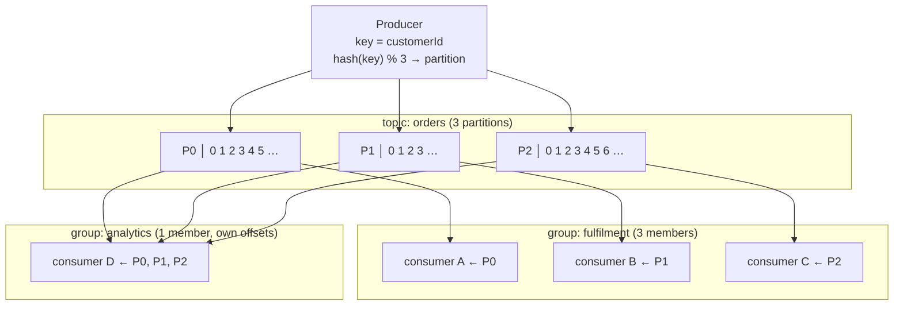
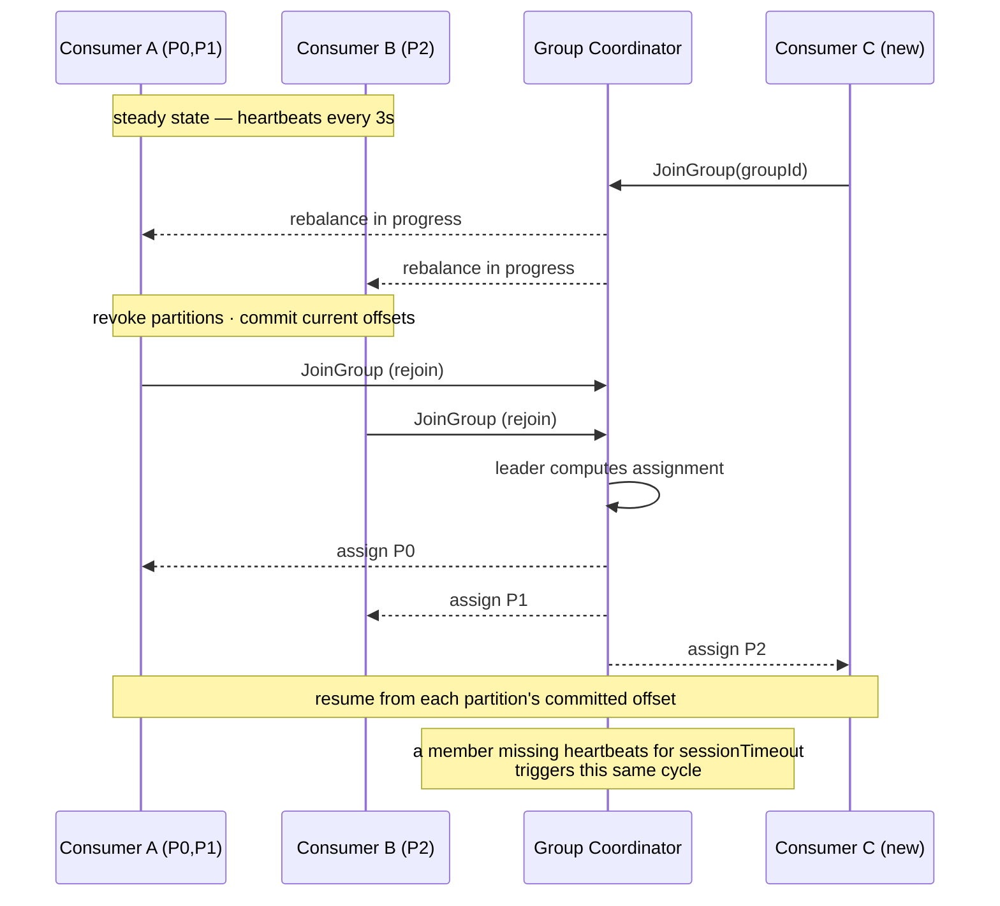

# Chapter 47 — Microservices III: Kafka

> **한눈에 보기**
> Kafka는 큐가 아니라 **분할된(partitioned) 로그**입니다. 메시지는 소비돼도 사라지지 않고,
> 컨슈머는 오프셋이라는 커서를 들고 자기 속도로 읽습니다. 46장에서 익힌 ack·prefetch·DLX의
> 사고방식이 여기서는 전부 오프셋·파티션·컨슈머 그룹으로 바뀝니다. 이 장은
> `Transport.KAFKA`의 모든 옵션, `ClientKafkaProxy`와 `.reply` 토픽 규약(그리고 왜
> Kafka에서 요청-응답이 대개 잘못된 선택인지), `KafkaContext`, 파티션 키와 순서 보장,
> 수동 커밋과 하트비트 문제, 커스텀 직렬화와 Schema Registry, 재시도와 독약 메시지,
> 그리고 Docker Compose 로컬 개발까지 다룹니다.

**What you will learn**

- Why Kafka is a log and not a queue, and which of your instincts from RabbitMQ actively mislead you here.
- Every `Transport.KAFKA` option — `client`, `consumer`, `producer`, `run`, `subscribe`, `send`, `producerOnlyMode`, `postfixId`, `parser` — and the naming transformations Nest applies to `clientId` and `groupId` behind your back.
- The `<topic>.reply` convention that request–response requires, why `subscribeToResponseOf()` must run before `connect()`, and the partition-count constraint that breaks your fourth replica.
- How message keys decide partitions, and therefore how they decide ordering — the single most important design decision in a Kafka system.
- Manual offset commits with `commitOffsets`, when `autoCommit: false` is worth it, and the long-processing heartbeat problem that silently rebalances your consumer group mid-handler.
- How to plug in custom serializers, a Schema Registry, and Avro without touching a handler.
- Retries, `KafkaRetriableException`, the poison-pill failure mode, and a dead-letter topic filter that stops the loop.
- Exactly-once versus at-least-once in practice, and why the answer is almost always "at-least-once plus an idempotent consumer."

**Why this matters**

Kafka punishes analogy. Everything you learned in [Chapter 46](./46-message-brokers.md) has a name here, and almost every name means something different. There is no acknowledgement; there is an offset commit, which is a *cursor position*, not a per-message receipt. There is no queue depth; there is consumer lag, measured in offsets behind the log head. There is no requeue; you either reprocess from an earlier offset or you republish. There is no per-message dead-lettering built in; you write to another topic yourself. Treating Kafka as "RabbitMQ with more throughput" is how teams end up with a system that loses ordering, reprocesses a day of history on every deploy, or stalls an entire partition on one malformed record.

The concrete failure I see most often is the stalled partition, and it is worth describing precisely because it explains the whole model. A consumer reads offset 4,201 from partition 3 and throws. Kafka does not move the message aside; there is no "aside." The consumer group's committed offset for partition 3 is still 4,200, so on the next poll the consumer reads 4,201 again. And again. Meanwhile offsets 4,202 through 190,000 sit behind it, untouched, because a partition is consumed strictly in order by exactly one member of the group. One malformed record has halted a sixth of your throughput, and your dashboards show rising lag with a healthy consumer. Nothing in the Nest API warns you about this. Everything in this chapter's retry section exists to prevent it.

The compensations are enormous, which is why Kafka is worth the trouble. Messages are not consumed away — they are retained by policy, for days or forever, so a new service can be deployed today and read the last week of events to build its own state. Multiple consumer groups read the same topic independently, at their own speeds, without coordinating. Throughput scales by adding partitions. Ordering is guaranteed strictly per partition, which — combined with a well-chosen message key — gives you exactly the ordering guarantee that matters (all events for one aggregate, in order) without paying for global ordering you never needed. That combination is what makes event sourcing, stream processing, and change-data-capture pipelines possible, and none of the brokers in Chapter 46 offers it.

Finally, one opinion up front, because it shapes half this chapter. Nest supports request–response over Kafka, with a whole reply-topic apparatus behind `ClientKafkaProxy.send()`. It works. You should almost never use it. The machinery is documented here in full because you will encounter it in existing code and need to understand what it does — but "we need a synchronous answer from another service" is a signal that the call belongs on gRPC, NATS, or HTTP, not on a durable append-only log.

---

## Kafka's model: topics, partitions, offsets, consumer groups

Four concepts, and every operational property follows from them.

A **topic** is a named stream of records, split into one or more **partitions**. A partition is an append-only, immutable, ordered sequence. Each record within a partition has an **offset** — a monotonically increasing integer that is its permanent address. Producers append; the broker never rewrites. Records are removed only when a retention policy — age or size — expires them, never because someone read them.

A **consumer group** is a set of consumers sharing a `groupId`. Kafka assigns each partition of a subscribed topic to exactly one member of the group. That assignment is the load-balancing mechanism, and it has a hard consequence: **the number of partitions is the maximum useful parallelism for one group**. Six partitions means at most six consumers do work; a seventh sits idle. Kafka tracks one committed offset per (group, topic, partition), so different groups read the same records independently and at different positions.



Where a queue and a log differ, precisely:

| | Queue (RabbitMQ) | Log (Kafka) |
|---|---|---|
| After consumption | message deleted | record retained until retention expires |
| Progress tracking | per-message acknowledgement | one committed offset per partition |
| Redelivery | broker requeues | consumer seeks back to an earlier offset |
| Parallelism limit | any number of competing consumers | number of partitions |
| Ordering | per queue, lost with >1 consumer | **strict per partition, always** |
| Second independent reader | needs a second queue and binding | second `groupId`, zero producer changes |
| Replay from history | not possible | seek to any retained offset |
| One bad message | dead-letter it, move on | **blocks the partition until you act** |

Read that last row again. It is the row that costs people a production incident.

---

## Installation and bootstrap

```bash
$ npm i --save kafkajs
```

```typescript title="main.ts"
import { NestFactory } from '@nestjs/core';
import { MicroserviceOptions, Transport } from '@nestjs/microservices';
import { AppModule } from './app.module';

async function bootstrap() {
  const app = await NestFactory.createMicroservice<MicroserviceOptions>(AppModule, {
    transport: Transport.KAFKA,
    options: {
      client: { clientId: 'orders', brokers: ['localhost:9092'] },
      consumer: { groupId: 'orders-consumer' },
    },
  });
  await app.listen();
}
bootstrap();
```

### The complete option surface

Nest passes these blocks through to KafkaJS almost verbatim.

| Block | Meaning |
|---|---|
| `client` | KafkaJS client configuration: `brokers`, `clientId`, `ssl`, `sasl`, `connectionTimeout`, `requestTimeout`, `retry`, `logLevel`. |
| `consumer` | Consumer configuration: `groupId`, `allowAutoTopicCreation`, `sessionTimeout`, `heartbeatInterval`, `rebalanceTimeout`, `maxBytesPerPartition`, `maxWaitTimeInMs`, `readUncommitted`. |
| `run` | Run configuration: `autoCommit`, `autoCommitInterval`, `autoCommitThreshold`, `eachBatchAutoResolve`, `partitionsConsumedConcurrently`. |
| `subscribe` | Subscribe configuration, most importantly `fromBeginning`. |
| `producer` | Producer configuration: `allowAutoTopicCreation`, `idempotent`, `transactionalId`, `maxInFlightRequests`, `retry`. |
| `send` | Send configuration: `acks`, `timeout`, `compression`. |
| `producerOnlyMode` | Skip consumer-group registration entirely; this instance only produces. |
| `postfixId` | Override the suffix appended to `clientId` (see below). |
| `parser` | Custom parser for incoming message values. |
| `serializer` / `deserializer` | Custom wire format for outgoing/incoming messages. |

The ones that decide whether your deployment behaves:

**`client.brokers`** — a bootstrap list, not the full cluster. Kafka discovers the rest. Give it two or three for redundancy, not all forty.

**`client.ssl` and `client.sasl`** — how you talk to a managed cluster. Confluent Cloud, MSK, and Aiven all require both:

```typescript
client: {
  clientId: 'orders',
  brokers: process.env.KAFKA_BROKERS!.split(','),
  ssl: true,
  sasl: {
    mechanism: 'scram-sha-512',
    username: process.env.KAFKA_USER!,
    password: process.env.KAFKA_PASSWORD!,
  },
},
```

**`consumer.groupId`** — the identity of your consumer group. Change it in production and you start reading from wherever `auto.offset.reset` says, which for a new group with `fromBeginning: true` means *the whole retained history*. Treat `groupId` as part of your deployment contract; never derive it from a pod name or a random value.

**`consumer.allowAutoTopicCreation`** — set it `false` in production. Left `true`, a typo in a topic name silently creates a topic with the cluster's default partition count and no one notices until throughput is wrong.

**`consumer.sessionTimeout` and `consumer.heartbeatInterval`** — how long the group coordinator waits before declaring a member dead, and how often the member says it is alive. Defaults are 30,000 ms and 3,000 ms. These interact badly with slow handlers; see the heartbeat section below.

**`subscribe.fromBeginning`** — where a *new* consumer group starts. `true` reads all retained history; `false` starts at the current head. The right choice depends on whether your consumer is building state (true) or reacting to events (false). Note this only applies when the group has no committed offset — an existing group always resumes from its commit.

**`run.autoCommit`** — `true` by default, committing periodically in the background. Discussed in full below.

**`producerOnlyMode`** — a real optimization. An API gateway that only publishes should not join a consumer group, hold partition assignments, or participate in rebalances:

```typescript
ClientsModule.register([
  {
    name: 'EVENTS',
    transport: Transport.KAFKA,
    options: {
      client: { clientId: 'gateway', brokers: ['localhost:9092'] },
      producerOnlyMode: true,
    },
  },
]),
```

### The naming transformation nobody expects

Nest **rewrites** your `clientId` and `groupId` so that a hybrid application's client and server components do not collide in the same consumer group. Server components get `-server`; client components get `-client`.

```typescript title="main.ts"
const app = await NestFactory.createMicroservice<MicroserviceOptions>(AppModule, {
  transport: Transport.KAFKA,
  options: {
    client: { clientId: 'hero', brokers: ['localhost:9092'] },  // becomes hero-server
    consumer: { groupId: 'hero-consumer' },                     // becomes hero-consumer-server
  },
});
```

```typescript title="heroes.controller.ts"
@Client({
  transport: Transport.KAFKA,
  options: {
    client: { clientId: 'hero', brokers: ['localhost:9092'] },  // becomes hero-client
    consumer: { groupId: 'hero-consumer' },                     // becomes hero-consumer-client
  },
})
client: ClientKafkaProxy;
```

This is why the group you configured never appears in `kafka-consumer-groups --list` and a group with a suffix does. Override the suffix with `postfixId`, or take full control by subclassing `ClientKafkaProxy` and `ServerKafka` in a custom provider and overriding the constructor. Do not fight it casually — the collision it prevents is real, and it manifests as a client stealing the server's partitions.

---

## Producing and consuming: the normal case

Events are what Kafka is for. `emit()` on the producer, `@EventPattern` on the consumer, no reply channel, no correlation state.

```typescript title="orders/orders.service.ts"
import { Inject, Injectable } from '@nestjs/common';
import { ClientKafkaProxy } from '@nestjs/microservices';

@Injectable()
export class OrdersService {
  constructor(@Inject('EVENTS') private readonly client: ClientKafkaProxy) {}

  async place(order: Order) {
    await this.repo.save(order);

    this.client.emit('order.created', {
      key: order.customerId,           // decides the partition → decides ordering
      value: { id: order.id, total: order.total },
      headers: { 'x-correlation-id': this.trace.id, 'x-schema': 'order.created.v2' },
    });
  }
}
```

```typescript title="fulfilment/fulfilment.controller.ts"
import { Controller, Logger } from '@nestjs/common';
import { EventPattern, Payload, Ctx, KafkaContext } from '@nestjs/microservices';

@Controller()
export class FulfilmentController {
  private readonly logger = new Logger(FulfilmentController.name);

  @EventPattern('order.created')
  async onOrderCreated(@Payload() data: OrderCreated, @Ctx() context: KafkaContext) {
    const { offset, headers, timestamp } = context.getMessage();
    this.logger.log(
      `${context.getTopic()}[${context.getPartition()}]@${offset} ` +
      `corr=${headers['x-correlation-id']}`,
    );
    await this.fulfilment.reserve(data.id); // must be idempotent
  }
}
```

### How Nest handles the bytes

**Incoming.** Kafka hands Nest `key`, `value`, and `headers` as `Buffer`s. Nest converts them to strings; if a string looks "object like" it attempts `JSON.parse`. The parsed `value` is what reaches your handler as the payload.

**Outgoing.** Values passed to `emit()`/`send()`, and values returned from a `@MessagePattern` handler, are serialized: anything that is not a string or a `Buffer` is stringified with `JSON.stringify()` or `toString()`.

Two consequences. A payload that is a plain number arrives as a number; a payload that is a date object arrives as an ISO string, not a `Date`. And a value that happens to look like JSON but is not intended as JSON — a raw CSV line beginning with `{` — will be mangled. That is what the `parser` and `deserializer` options exist to override.

### Message keys and the ordering guarantee

This is the design decision that matters most, so state it plainly:

> Kafka guarantees ordering **within a partition**, and the message key determines the partition via `hash(key) % partitionCount`. Therefore: **the key is your ordering unit.**

Key every event for one order by `orderId`, and every event about that order lands in the same partition and is consumed strictly in order. Key by `customerId` and every event about one customer is ordered relative to the others. Omit the key entirely and messages are distributed round-robin — maximum spread, **zero ordering guarantee**, which is how `order.updated` gets processed before `order.created`.

You can key from a `@MessagePattern` return value too, using the same object shape, with headers alongside:

```typescript title="heroes.controller.ts"
@Controller()
export class HeroesController {
  @MessagePattern('hero.kill.dragon')
  killDragon(@Payload() message: KillDragonMessage) {
    const items = [
      { id: 1, name: 'Mythical Sword' },
      { id: 2, name: 'Key to Dungeon' },
    ];

    return {
      headers: { kafka_nestRealm: 'Nest' }, // values must be string or Buffer
      key: message.heroId,
      value: items,
    };
  }
}
```

Keying is also what satisfies Kafka's **co-partitioning requirement**: two topics can be joined by a stream processor only if records that should join share a key and both topics have the same partition count.

The trade is honest: a key with poor cardinality creates hot partitions. Keying every event by a `region` field with three values means three partitions do all the work no matter how many you provision. Choose a key with high cardinality *and* the ordering scope you actually need — usually an aggregate id.

---

## Request–response over Kafka, and why to avoid it

Nest supports it. Here is exactly what it does, followed by why you should hesitate.

Instead of `ClientProxy` you get **`ClientKafkaProxy`**. `send()` publishes to the request topic with a correlation id, a reply topic, and a reply partition attached — the Return Address pattern. The responder publishes the answer to the reply topic; the proxy matches the correlation id and resolves your Observable.

The reply topic name is derived by convention: **`<topic>.reply`**. The client must be *subscribed and assigned a partition on that reply topic before the first `send()`*, which is what `subscribeToResponseOf()` declares:

```typescript title="heroes.controller.ts"
import { Controller, Inject, OnModuleInit } from '@nestjs/common';
import { ClientKafkaProxy } from '@nestjs/microservices';

@Controller()
export class HeroesController implements OnModuleInit {
  constructor(@Inject('HERO_SERVICE') private readonly client: ClientKafkaProxy) {}

  async onModuleInit() {
    this.client.subscribeToResponseOf('hero.kill.dragon'); // → hero.kill.dragon.reply
    await this.client.connect(); // must come AFTER the subscribeToResponseOf calls
  }
}
```

> **⚠️ Notice** — If the client is created asynchronously, `subscribeToResponseOf()` must be called **before** `connect()`. Reversed, the reply topic is not in the subscription set, and every `send()` times out with no error on the server side. Customize the derivation by extending `ClientKafkaProxy` and overriding `getResponsePatternName`.

Three structural problems follow from this design.

**The partition-count constraint.** Every running Nest application instance needs at least one partition of the reply topic. Four instances against a three-partition reply topic means one instance is assigned nothing and **errors out when it tries to send**. Your reply topic's partition count is now a ceiling on your replica count — an operational coupling nobody wants.

**Rebalance loses in-flight replies.** When a new `ClientKafkaProxy` starts, it joins the group and triggers a rebalance. With the default round-robin partitioner, consumers are sorted by names randomly set at launch, so a newcomer can land anywhere in the ordering and shift existing members onto different partitions — and those members lose the replies to requests they sent before the rebalance. Nest mitigates this with a **custom partitioner that sorts consumers by high-resolution launch timestamps (`process.hrtime()`)**, so existing members keep their positions and a newcomer appends. Good engineering, and it narrows the window rather than closing it.

**You are using a durable log for an ephemeral question.** Every request and every reply is appended to disk and replicated, then retained for the topic's retention period. You are paying persistence costs for data whose value expires in milliseconds, and adding Kafka's batching latency to a synchronous path.

**The recommendation.** Use `@EventPattern`/`emit()` for Kafka. When you genuinely need a synchronous answer, use gRPC ([Chapter 48](./48-grpc.md)) or NATS ([Chapter 46](./46-message-brokers.md)) alongside Kafka. A hybrid application ([Chapter 45](./45-microservices-fundamentals.md)) hosts both listeners in one process, so this is not an architectural burden — it is two `connectMicroservice()` calls.

---

## `KafkaContext`

| Method | Returns |
|---|---|
| `getTopic()` | Topic name — essential with wildcard or multi-topic handlers. |
| `getPartition()` | Partition number — needed for `commitOffsets` and for lag diagnostics. |
| `getMessage()` | The raw `IncomingMessage`. |
| `getConsumer()` | The KafkaJS `Consumer` — `commitOffsets`, `pause`, `resume`, `seek`. |
| `getProducer()` | The KafkaJS `Producer`, when available. |
| `getHeartbeat()` | A function to call during long processing to keep group membership. |

`IncomingMessage`:

```typescript
interface IncomingMessage {
  topic: string;
  partition: number;
  timestamp: string;
  size: number;
  attributes: number;
  offset: string;   // note: a string, not a number
  key: any;
  value: any;
  headers: Record<string, any>;
}
```

`offset` is a string because Kafka offsets are 64-bit and exceed `Number.MAX_SAFE_INTEGER` on long-lived topics. Arithmetic on it needs care — `(Number(offset) + 1).toString()` is what the framework itself does, and it is correct for realistic offsets, but never store an offset as a JS number in a database.

---

## Offsets, commits, and the heartbeat problem

### Auto-commit

By default `run.autoCommit` is `true`: KafkaJS commits offsets periodically in the background — after `autoCommitInterval` milliseconds or `autoCommitThreshold` messages. Simple, and it gives **at-least-once with a wide window**: if the process dies after handling messages but before the next commit, everything since the last commit is reprocessed on restart.

Turn it off when you need the commit to mean "this work is durably done":

```typescript title="main.ts"
const app = await NestFactory.createMicroservice<MicroserviceOptions>(AppModule, {
  transport: Transport.KAFKA,
  options: {
    client: { brokers: ['localhost:9092'] },
    consumer: { groupId: 'orders-consumer' },
    run: { autoCommit: false },
  },
});
```

### Manual commits

```typescript title="orders/orders.controller.ts"
@EventPattern('user.created')
async handleUserCreated(@Payload() data: UserCreated, @Ctx() context: KafkaContext) {
  await this.users.provision(data); // business logic first

  const { offset } = context.getMessage();
  const partition = context.getPartition();
  const topic = context.getTopic();
  const consumer = context.getConsumer();

  // Commit the NEXT offset — a committed offset is "where to resume", not "what I did".
  await consumer.commitOffsets([
    { topic, partition, offset: (Number(offset) + 1).toString() },
  ]);
}
```

That off-by-one is the classic Kafka bug. A committed offset is the position to resume *from*. Commit `offset` rather than `offset + 1` and every restart reprocesses the last record. The docs' short example commits `offset` directly; the retry filter later in the same doc commits `offset + 1` with a comment explaining why. Follow the filter.

Commit **after** the work, never before. Committing first converts at-least-once into at-most-once and you will lose records on a crash.

### `pause` and `resume`

`getConsumer()` also gives you flow control. When a downstream dependency is failing, pausing beats hammering it and beats crashing:

```typescript
@EventPattern('order.created')
async onOrderCreated(@Payload() data: OrderCreated, @Ctx() ctx: KafkaContext) {
  const consumer = ctx.getConsumer();
  const topic = ctx.getTopic();
  const partition = ctx.getPartition();

  try {
    await this.downstream.call(data);
  } catch (err) {
    if (err instanceof CircuitOpenError) {
      consumer.pause([{ topic, partitions: [partition] }]);
      setTimeout(() => consumer.resume([{ topic, partitions: [partition] }]), 30_000);
      throw err; // do not commit; we will reprocess from here
    }
    throw err;
  }
}
```

Pausing does not leave the group — the consumer keeps heartbeating and keeps its assignment. This is Kafka's answer to `prefetchCount`, and it operates at partition granularity rather than per message.

### The long-processing heartbeat problem

Here is a failure that looks like a mystery until you know it.

A consumer must send a heartbeat every `heartbeatInterval` (default 3 s), and the coordinator declares it dead after `sessionTimeout` (default 30 s) without one. KafkaJS sends heartbeats between messages, from the same loop that runs your handler. So an `await` of forty seconds inside a handler means no heartbeat for forty seconds. The coordinator evicts the member and rebalances. Your handler finishes, tries to commit, and gets `The coordinator is not aware of this member` — while the partition has already been reassigned to someone else who is reprocessing the same record.

The symptom: a consumer group that rebalances continuously, throughput near zero, duplicate processing, and no exception in your business code.

Three fixes, in order of preference:

**1. Heartbeat during the work.** `getHeartbeat()` gives you the function directly:

```typescript
@MessagePattern('hero.kill.dragon')
async killDragon(@Payload() message: KillDragonMessage, @Ctx() context: KafkaContext) {
  const heartbeat = context.getHeartbeat();

  await doWorkPart1();
  await heartbeat();          // stay a member of the group
  await doWorkPart2();
  await heartbeat();
  return this.result();
}
```

**2. Raise `sessionTimeout`.** Legitimate when work is genuinely slow and bounded, but it also delays detection of a genuinely dead consumer by the same amount. `sessionTimeout` must stay below the broker's `group.max.session.timeout.ms`.

**3. Do not do slow work in the handler.** The best answer for anything unbounded: the handler validates, persists an intent record, commits, and a queue ([Chapter 35](../part2-intermediate/35-queues.md)) does the heavy lifting with its own retries. Kafka delivers; BullMQ works.

---

## Serialization, Schema Registry, and Avro

Default JSON is fine to start and becomes a liability at scale: no schema enforcement, no compatibility checking, and verbose on the wire. `serializer` and `deserializer` are the seam.

```typescript title="kafka/avro.serializer.ts"
import { Serializer, Deserializer } from '@nestjs/microservices';
import { SchemaRegistry } from '@kafkajs/confluent-schema-registry';

export class AvroSerializer implements Serializer {
  constructor(
    private readonly registry: SchemaRegistry,
    private readonly schemaIdByTopic: Map<string, number>,
  ) {}

  async serialize(value: any): Promise<any> {
    const id = this.schemaIdByTopic.get(value.topic)!;
    return { ...value, value: await this.registry.encode(id, value.value) };
  }
}

export class AvroDeserializer implements Deserializer {
  constructor(private readonly registry: SchemaRegistry) {}

  async deserialize(message: any): Promise<any> {
    // Confluent framing: magic byte + 4-byte schema id + Avro payload
    return { ...message, value: await this.registry.decode(message.value) };
  }
}
```

```typescript title="main.ts"
const registry = new SchemaRegistry({ host: process.env.SCHEMA_REGISTRY_URL! });

const app = await NestFactory.createMicroservice<MicroserviceOptions>(AppModule, {
  transport: Transport.KAFKA,
  options: {
    client: { brokers: ['localhost:9092'] },
    consumer: { groupId: 'orders-consumer' },
    serializer: new AvroSerializer(registry, schemaIds),
    deserializer: new AvroDeserializer(registry),
  },
});
```

Handlers are unchanged — they receive decoded objects. That is the value of putting the concern here rather than in every controller.

`parser` is a lighter-weight hook that overrides only how the incoming `value` buffer is turned into a JS value, without replacing the whole deserializer. Use it when you want the framework's envelope handling but a different body format.

The reason to invest in a registry is not efficiency, it is **compatibility**. A registry rejects a producer whose new schema would break existing consumers, at deploy time, instead of letting the breakage arrive as a runtime error in a consumer owned by another team. In a system where topics outlive services, that check is the difference between a schema you can evolve and a schema you can never change.

---

## Batch consumption

By default each record is processed individually (`eachMessage`). For high-throughput pipelines whose sinks are batch-friendly — a warehouse, a bulk index, a `COPY` into Postgres — per-record processing wastes most of the achievable throughput.

Nest's `@EventPattern` binds to per-message consumption. Two routes to batches:

**Batch at the sink.** Buffer in the handler and flush on size or time. Simple, and it composes with manual commits — commit only after a successful flush:

```typescript
@EventPattern('metrics.raw')
async onMetric(@Payload() data: Metric, @Ctx() ctx: KafkaContext) {
  this.buffer.push({ data, ctx });
  if (this.buffer.length >= 500) await this.flush(); // flush(), then commit the highest offset
}
```

Pair it with a timer so a partial buffer is not stranded, and flush on `onApplicationShutdown`.

**Drive `eachBatch` yourself.** Unwrap the consumer, or run a KafkaJS consumer in a provider outside the transporter, and use `eachBatch` with `resolveOffset` and `heartbeat` per record. You give up `@EventPattern` routing and take on the full batch protocol, including `eachBatchAutoResolve` semantics. Worth it for genuinely high-volume pipelines; overkill for anything else.

`run.partitionsConsumedConcurrently` is the middle ground and is often the real answer: it lets one consumer process several assigned partitions concurrently while preserving order *within* each partition. Raise it before you reach for batching.

---

## Retries, poison pills, and dead-letter topics

### How exceptions behave

Nest wraps unhandled exceptions into an `RpcException` and formats them. Sometimes you want the opposite — you want KafkaJS to see the error, so it does **not** commit the offset and the record is redelivered:

```typescript
import { KafkaRetriableException } from '@nestjs/microservices';

throw new KafkaRetriableException('downstream unavailable');
```

> **⚠️ Notice** — For **event handlers**, all unhandled exceptions are treated as retriable by default. That is precisely the poison-pill mechanism: a record that always throws is retried forever, and because a partition is strictly ordered, everything behind it waits. Unbounded retry is the default. Bound it deliberately.

### A dead-letter filter that stops the loop

The construction: republish the record to the same topic with an incremented `retry-count` header and commit the current offset, so the partition advances. Past a maximum, hand it to a skip handler — write it to a dead-letter topic — and commit.

```typescript title="kafka-max-retry-exception.filter.ts"
import { Catch, ArgumentsHost, Logger } from '@nestjs/common';
import { BaseExceptionFilter } from '@nestjs/core';
import { KafkaContext } from '@nestjs/microservices';
import { Producer } from 'kafkajs';

@Catch()
export class KafkaMaxRetryExceptionFilter extends BaseExceptionFilter {
  private readonly logger = new Logger(KafkaMaxRetryExceptionFilter.name);

  constructor(
    private readonly producer: Producer,
    private readonly maxRetries: number,
    private readonly skipHandler?: (message: any) => Promise<void>,
  ) {
    super();
  }

  async catch(exception: unknown, host: ArgumentsHost) {
    const ctx = host.switchToRpc().getContext<KafkaContext>();
    const message = ctx.getMessage();
    const attempts = this.retryCount(ctx);

    if (attempts >= this.maxRetries) {
      this.logger.warn(`max retries (${this.maxRetries}) exceeded at offset ${message.offset}`);
      if (this.skipHandler) {
        try { await this.skipHandler(message); } catch (e) { this.logger.error('skipHandler failed', e); }
      }
      try { await this.commit(ctx); } catch (e) { this.logger.error('commit failed', e); }
      return; // stop propagating: the partition advances
    }

    try {
      await this.republish(ctx, attempts + 1);
      await this.commit(ctx);
    } catch (e) {
      this.logger.error('republish failed', e);
      super.catch(exception, host); // fall back to default handling
    }
  }

  private retryCount(ctx: KafkaContext): number {
    const raw = ctx.getMessage().headers?.['retry-count'];
    if (!raw) return 0;
    const value = Buffer.isBuffer(raw) ? raw.toString() : String(raw);
    return parseInt(value, 10) || 0;
  }

  private async republish(ctx: KafkaContext, retryCount: number) {
    const message = ctx.getMessage();
    await this.producer.send({
      topic: ctx.getTopic(),
      messages: [{
        key: message.key,                                   // same key → same partition → order kept
        value: message.value,
        headers: { ...message.headers, 'retry-count': retryCount.toString() },
      }],
    });
  }

  private async commit(ctx: KafkaContext) {
    const consumer = ctx.getConsumer();
    if (!consumer) throw new Error('Consumer instance is not available from KafkaContext.');
    const message = ctx.getMessage();
    await consumer.commitOffsets([{
      topic: ctx.getTopic(),
      partition: ctx.getPartition(),
      offset: (Number(message.offset) + 1).toString(), // commit the NEXT offset
    }]);
  }
}
```

Wire it up with a producer:

```typescript title="app.module.ts"
import { Inject, Injectable, Module } from '@nestjs/common';
import { Kafka, Producer } from 'kafkajs';

@Injectable()
export class AppKafkaRetryFilter extends KafkaMaxRetryExceptionFilter {
  constructor(@Inject('KAFKA_PRODUCER') producer: Producer) {
    super(producer, 5, async (message) => {
      await producer.send({ topic: 'orders.dlt', messages: [{ key: message.key, value: message.value }] });
    });
  }
}

@Module({
  providers: [
    AppKafkaRetryFilter,
    {
      provide: 'KAFKA_PRODUCER',
      useFactory: async () => {
        const kafka = new Kafka({ brokers: ['localhost:9092'] });
        const producer = kafka.producer();
        await producer.connect();
        return producer;
      },
    },
  ],
})
export class AppModule {}
```

```typescript title="my-event.handler.ts"
@Controller()
@UseFilters(AppKafkaRetryFilter)
export class MyEventHandler {
  @EventPattern('order.created')
  async handleEvent(@Payload() data: any, @Ctx() context: KafkaContext) {
    // processing that may fail
  }
}
```

Two design notes the docs leave implicit. Republishing with the **same key** keeps the record in the same partition, preserving order relative to its siblings — but it does append it *after* newer records, so a retried record is now out of order relative to the original stream. If strict ordering is essential, prefer pausing the partition and retrying in place over republishing. And a dead-letter topic is only useful if someone looks at it: alert on `orders.dlt` producing anything at all, and keep the original headers so you can replay the record after fixing the bug.

### Rebalancing, seen whole



Everything about rebalancing follows from this picture: it is why a slow handler stalls a group, why offsets must be committed before revocation, why duplicates appear around a deploy, and why Nest bothered to write a timestamp-ordered partitioner for reply topics.

---

## Delivery semantics: at-least-once and the idempotent consumer

Kafka can be configured for at-least-once, at-most-once, or exactly-once. Only two of those are practical.

**At-most-once** — commit before processing. A crash loses records. Almost never what you want.

**At-least-once** — commit after processing. A crash reprocesses. This is the default and the right choice.

**Exactly-once (EOS)** — requires an idempotent producer (`producer: { idempotent: true }`), transactions (`transactionalId`), and reading with `readUncommitted: false`. Kafka's transactions are genuinely exactly-once, with a critical qualifier: **only within Kafka.** A transaction can atomically commit "consume from A, produce to B, commit offsets." It cannot include your Postgres write, your Stripe charge, or your email. The moment a side effect leaves Kafka, EOS becomes at-least-once again at that boundary.

So the practical answer, for nearly every application:

> Configure at-least-once, and make consumers idempotent.

Three techniques, in ascending order of rigour:

```typescript
// 1. Natural idempotency — the operation is already safe to repeat.
await this.repo.upsert({ id: data.id, status: 'reserved' });

// 2. A processed-messages table, checked in the same transaction as the effect.
await this.db.transaction(async (tx) => {
  const inserted = await tx.processedMessages.insertIgnore({
    topic, partition, offset, // (topic, partition, offset) is globally unique
  });
  if (!inserted) return;      // already handled — a duplicate delivery
  await tx.orders.reserve(data.id);
});

// 3. Conditional writes — only advance a state machine forwards.
await this.repo.update(
  { id: data.id, version: data.version - 1 },
  { status: 'reserved', version: data.version },
);
```

Technique 2 is the general one and the one to reach for by default. The composite `(topic, partition, offset)` is a permanent, globally unique identifier for a record — better than any id you might put in the payload, because it cannot be forged by a buggy producer. Prune the table on the same schedule as your topic retention.

### `emit` versus `send`, restated for Kafka

| | `emit()` + `@EventPattern` | `send()` + `@MessagePattern` |
|---|---|---|
| Topics used | one | two — request and `<topic>.reply` |
| Client class | `ClientKafkaProxy` (producer-only mode possible) | `ClientKafkaProxy` joined to a consumer group |
| Extra setup | none | `subscribeToResponseOf()` before `connect()` |
| Replica ceiling | none | reply-topic partition count |
| Latency | producer batching only | batching on both legs plus round trip |
| Failure visible to caller | no | yes |
| Recommended | **yes, by default** | only when no other transport is available |

---

## Local development with Docker Compose

Local Kafka used to mean ZooKeeper and a page of environment variables. With KRaft mode it is one container.

```yaml title="docker-compose.yml"
services:
  kafka:
    image: confluentinc/cp-kafka:7.7.1
    container_name: kafka
    ports:
      - "9092:9092"
    environment:
      KAFKA_NODE_ID: 1
      KAFKA_PROCESS_ROLES: broker,controller
      KAFKA_CONTROLLER_QUORUM_VOTERS: "1@kafka:29093"
      KAFKA_LISTENERS: "PLAINTEXT://:29092,CONTROLLER://:29093,PLAINTEXT_HOST://:9092"
      KAFKA_ADVERTISED_LISTENERS: "PLAINTEXT://kafka:29092,PLAINTEXT_HOST://localhost:9092"
      KAFKA_LISTENER_SECURITY_PROTOCOL_MAP: "CONTROLLER:PLAINTEXT,PLAINTEXT:PLAINTEXT,PLAINTEXT_HOST:PLAINTEXT"
      KAFKA_CONTROLLER_LISTENER_NAMES: CONTROLLER
      KAFKA_INTER_BROKER_LISTENER_NAME: PLAINTEXT
      KAFKA_OFFSETS_TOPIC_REPLICATION_FACTOR: 1
      KAFKA_TRANSACTION_STATE_LOG_REPLICATION_FACTOR: 1
      KAFKA_TRANSACTION_STATE_LOG_MIN_ISR: 1
      KAFKA_GROUP_INITIAL_REBALANCE_DELAY_MS: 0
      CLUSTER_ID: "MkU3OEVBNTcwNTJENDM2Qk"

  kafka-ui:
    image: provectuslabs/kafka-ui:latest
    ports:
      - "8080:8080"
    environment:
      KAFKA_CLUSTERS_0_NAME: local
      KAFKA_CLUSTERS_0_BOOTSTRAPSERVERS: kafka:29092
    depends_on: [kafka]
```

The dual-listener setup is the part that trips everyone up: containers reach the broker at `kafka:29092`, your host process at `localhost:9092`. A single advertised listener cannot serve both, and the symptom — a client that connects to the bootstrap broker and then times out — looks like a network problem rather than a configuration one.

`KAFKA_GROUP_INITIAL_REBALANCE_DELAY_MS: 0` removes the three-second rebalance delay that otherwise makes every local restart feel broken.

Create topics explicitly, with the partition counts you intend, rather than relying on auto-creation:

```bash
$ docker compose exec kafka kafka-topics --bootstrap-server localhost:29092 \
    --create --topic order.created --partitions 3 --replication-factor 1
$ docker compose exec kafka kafka-topics --bootstrap-server localhost:29092 \
    --create --topic orders.dlt --partitions 1 --replication-factor 1
```

The command you will use most in an incident:

```bash
$ docker compose exec kafka kafka-consumer-groups --bootstrap-server localhost:29092 \
    --describe --group orders-consumer-server
```

It prints current offset, log-end offset, and **lag** per partition. Lag rising on one partition while the others are flat is the signature of a stuck consumer. Lag rising everywhere is under-provisioning. Remember the `-server` suffix Nest appended.

For integration tests, prefer Testcontainers over a shared compose stack, so each run gets a clean cluster and tests do not inherit committed offsets from the last run. And test handlers as plain classes — call `controller.onOrderCreated(payload, fakeContext)` with a hand-built `KafkaContext` double. See [Chapter 31](../part2-intermediate/31-testing.md).

---

## Common mistakes

1. **Publishing without a key.** *Symptom:* `order.updated` is processed before `order.created`. *Cause:* keyless records are distributed round-robin, so related events land in different partitions with no ordering relationship. *Fix:* key every record by its aggregate id.

2. **Committing the current offset instead of the next.** *Symptom:* the last record of every batch is reprocessed on every restart. *Cause:* a committed offset is the resume position. *Fix:* commit `(Number(offset) + 1).toString()`.

3. **Slow handler, default `sessionTimeout`.** *Symptom:* continuous rebalancing, near-zero throughput, `The coordinator is not aware of this member` on commit, duplicate processing. *Cause:* no heartbeat for longer than 30 seconds. *Fix:* call `context.getHeartbeat()` during the work, raise `sessionTimeout`, or move the slow work to a queue.

4. **Unbounded retry on a poison pill.** *Symptom:* one partition's lag grows without limit while the others are healthy; the same offset in the logs forever. *Cause:* unhandled event-handler exceptions are retriable by default, and a partition is consumed strictly in order. *Fix:* a max-retry exception filter that dead-letters and commits.

5. **Looking for a consumer group that does not exist.** *Symptom:* `kafka-consumer-groups --describe` reports the group does not exist, but the service is clearly consuming. *Cause:* Nest appends `-server` to `groupId` and `clientId` for servers, `-client` for clients. *Fix:* query the suffixed name, or set `postfixId`.

6. **`subscribeToResponseOf()` after `connect()`.** *Symptom:* every `send()` times out; the server logs show the request handled and a reply produced. *Cause:* the client is not subscribed to the reply topic. *Fix:* call it in `onModuleInit` before `connect()`.

7. **More replicas than reply-topic partitions.** *Symptom:* the fourth pod errors on its first `send()` while the first three are fine. *Cause:* each instance needs at least one reply-topic partition. *Fix:* increase reply-topic partitions — or stop using request–response over Kafka.

8. **Changing `groupId` on deploy.** *Symptom:* a deploy reprocesses days of history and saturates the database. *Cause:* a new group has no committed offsets and starts per `fromBeginning`/`auto.offset.reset`. *Fix:* treat `groupId` as stable configuration; never derive it from a hostname or a build number.

9. **`allowAutoTopicCreation: true` in production.** *Symptom:* a topic exists with one partition and the wrong retention, and nobody created it. *Cause:* a typo in a topic name auto-created it with cluster defaults. *Fix:* set it `false` and provision topics as infrastructure.

10. **Assuming exactly-once because transactions are enabled.** *Symptom:* duplicate rows or duplicate charges despite EOS configuration. *Cause:* Kafka transactions are atomic only within Kafka; external side effects are outside them. *Fix:* at-least-once plus an idempotent consumer keyed on `(topic, partition, offset)`.

---

## Putting it together

An order-events consumer with everything this chapter argued for: keyed production, event-based messaging, manual commits after work, heartbeats during slow steps, idempotency by `(topic, partition, offset)`, and a bounded retry with a dead-letter topic.

```typescript title="messaging/kafka.module.ts"
import { Module } from '@nestjs/common';
import { ConfigModule, ConfigService } from '@nestjs/config';
import { ClientsModule, Transport } from '@nestjs/microservices';

@Module({
  imports: [
    ClientsModule.registerAsync([
      {
        name: 'EVENTS',
        imports: [ConfigModule],
        inject: [ConfigService],
        useFactory: (c: ConfigService) => ({
          transport: Transport.KAFKA,
          options: {
            client: {
              clientId: 'orders',
              brokers: c.getOrThrow<string>('KAFKA_BROKERS').split(','),
              ssl: c.get('KAFKA_SSL') === 'true',
            },
            producer: { idempotent: true, allowAutoTopicCreation: false },
            send: { acks: -1 },        // wait for all in-sync replicas
            producerOnlyMode: true,    // this app publishes; it does not join a group
          },
        }),
      },
    ]),
  ],
  exports: [ClientsModule],
})
export class KafkaModule {}
```

```typescript title="orders/orders.producer.ts"
import { Inject, Injectable } from '@nestjs/common';
import { ClientKafkaProxy } from '@nestjs/microservices';

@Injectable()
export class OrdersProducer {
  constructor(@Inject('EVENTS') private readonly client: ClientKafkaProxy) {}

  emitCreated(order: Order, correlationId: string) {
    this.client.emit('order.created', {
      key: order.id, // ordering unit: all events for this order share a partition
      value: { id: order.id, customerId: order.customerId, total: order.total },
      headers: { 'x-correlation-id': correlationId, 'x-schema': 'order.created.v1' },
    });
  }
}
```

```typescript title="fulfilment/fulfilment.controller.ts"
import { Controller, Logger, UseFilters } from '@nestjs/common';
import { EventPattern, Payload, Ctx, KafkaContext } from '@nestjs/microservices';
import { AppKafkaRetryFilter } from '../kafka/app-kafka-retry.filter';
import { InboxService } from './inbox.service';
import { FulfilmentService } from './fulfilment.service';

@Controller()
@UseFilters(AppKafkaRetryFilter) // bounded retry, then orders.dlt
export class FulfilmentController {
  private readonly logger = new Logger(FulfilmentController.name);

  constructor(
    private readonly inbox: InboxService,
    private readonly fulfilment: FulfilmentService,
  ) {}

  @EventPattern('order.created')
  async onOrderCreated(@Payload() data: OrderCreated, @Ctx() ctx: KafkaContext) {
    const topic = ctx.getTopic();
    const partition = ctx.getPartition();
    const message = ctx.getMessage();
    const heartbeat = ctx.getHeartbeat();

    // 1. Idempotency: (topic, partition, offset) is a permanent unique id.
    const isNew = await this.inbox.claim(topic, partition, message.offset);
    if (!isNew) {
      this.logger.debug(`duplicate ${topic}[${partition}]@${message.offset}, skipping`);
      await this.commit(ctx);
      return;
    }

    // 2. Do the work, heartbeating so the coordinator does not evict us.
    await this.fulfilment.reserveStock(data);
    await heartbeat();
    await this.fulfilment.scheduleShipment(data);
    await heartbeat();

    // 3. Commit only after the work is durable. autoCommit is false.
    await this.commit(ctx);
  }

  private async commit(ctx: KafkaContext) {
    const consumer = ctx.getConsumer();
    await consumer.commitOffsets([{
      topic: ctx.getTopic(),
      partition: ctx.getPartition(),
      offset: (Number(ctx.getMessage().offset) + 1).toString(),
    }]);
  }
}
```

```typescript title="main.ts"
import { NestFactory } from '@nestjs/core';
import { MicroserviceOptions, Transport } from '@nestjs/microservices';
import { AppModule } from './app.module';

async function bootstrap() {
  const app = await NestFactory.create(AppModule);
  app.enableShutdownHooks();

  const kafka = app.connectMicroservice<MicroserviceOptions>(
    {
      transport: Transport.KAFKA,
      options: {
        client: {
          clientId: 'fulfilment',
          brokers: process.env.KAFKA_BROKERS!.split(','),
        },
        consumer: {
          groupId: 'fulfilment-consumer',   // becomes fulfilment-consumer-server
          allowAutoTopicCreation: false,
          sessionTimeout: 45_000,           // room for a slow-but-bounded handler
          heartbeatInterval: 3_000,
        },
        subscribe: { fromBeginning: false }, // react to new events, do not replay history
        run: { autoCommit: false, partitionsConsumedConcurrently: 3 },
      },
    },
    { inheritAppConfig: true },
  );

  kafka.status.subscribe((s) => console.log(`kafka: ${s}`)); // connected | rebalancing | crashed | stopped

  await app.startAllMicroservices();
  await app.listen(3000); // also serves HTTP: health checks, admin endpoints
}
bootstrap();
```

Watch `kafka.status` in a real deployment and you will see `rebalancing` on every scale event, every deploy, and every time a handler runs long. That stream is the most useful single signal Kafka gives you, and wiring it into a health indicator ([Chapter 56](./56-observability.md)) turns a class of silent stalls into an alert.

---

> **핵심 정리**
> - Kafka는 큐가 아니라 **분할된 append-only 로그**입니다. 소비해도 레코드는 사라지지 않고, 진행 상황은 파티션별 **커밋된 오프셋**(다음에 읽을 위치)으로 표현됩니다.
> - 파티션 수가 한 컨슈머 그룹의 최대 병렬도입니다. 순서는 **파티션 내부에서만** 보장되고, 파티션은 **메시지 키**가 결정합니다. 따라서 키가 곧 순서 단위입니다.
> - 하나의 잘못된 레코드는 파티션 전체를 막습니다(독약 메시지). 이벤트 핸들러의 미처리 예외는 기본적으로 무한 재시도이므로, 최대 재시도 필터로 반드시 경계를 두고 DLT로 보내십시오.
> - 오프셋은 작업이 **끝난 뒤** `offset + 1`로 커밋합니다. 현재 오프셋을 커밋하면 재시작마다 마지막 레코드를 재처리합니다.
> - 느린 핸들러는 하트비트를 굶겨 리밸런스를 유발합니다. `getHeartbeat()`를 호출하거나 `sessionTimeout`을 늘리거나, 무거운 작업은 큐로 넘기십시오.
> - Nest는 `clientId`/`groupId`에 `-server`/`-client`를 자동으로 붙입니다. 운영 도구에서 그룹이 안 보이면 이것이 원인입니다.
> - 요청-응답은 `<topic>.reply` 토픽과 `subscribeToResponseOf()`(반드시 `connect()` 이전)를 요구하고, 리플라이 토픽 파티션 수가 레플리카 수의 상한이 됩니다. Kafka에서는 대개 잘못된 선택이므로 `emit`/`@EventPattern`을 쓰고, 동기 응답이 필요하면 gRPC나 NATS를 함께 쓰십시오.
> - Kafka 트랜잭션의 exactly-once는 **Kafka 내부에서만** 성립합니다. 외부 부수효과가 있는 순간 at-least-once로 돌아오므로, `(topic, partition, offset)` 기반 멱등 컨슈머가 현실적인 정답입니다.
> - `serializer`/`deserializer`/`parser`는 핸들러를 건드리지 않고 Avro와 Schema Registry를 끼워 넣는 자리입니다. 레지스트리의 진짜 가치는 효율이 아니라 **호환성 검사**입니다.

> **연습 문제**
> 1. 파티션 3개짜리 토픽에 키 없이 메시지 100개를 발행한 뒤, 컨슈머에서 `getPartition()`을 로그로 찍어 분포를 확인하십시오. 그다음 키를 넣어 같은 실험을 반복하고 무엇이 달라지는지 설명하십시오.
> 2. 항상 예외를 던지는 `@EventPattern` 핸들러를 만들고 `kafka-consumer-groups --describe`로 해당 파티션의 lag이 어떻게 변하는지 관찰하십시오. 다른 파티션의 lag과 비교해 서술하십시오.
> 3. 핸들러 안에 40초 `sleep`을 넣고 기본 `sessionTimeout`으로 실행해 리밸런스 로그를 재현하십시오. `getHeartbeat()`를 추가한 뒤 무엇이 달라지는지 기록하십시오.
> 4. **직접 만들기:** `(topic, partition, offset)` 유니크 제약을 가진 inbox 테이블을 만들고, 같은 트랜잭션 안에서 중복을 걸러 내는 멱등 컨슈머를 구현하십시오. 같은 레코드를 두 번 처리하도록 강제해 부수효과가 한 번만 일어나는지 확인하십시오.
> 5. **직접 만들기:** 최대 3회 재시도 후 `orders.dlt`로 보내는 예외 필터를 작성하고, `retry-count` 헤더가 증가하는 과정과 최종 DLT 레코드를 캡처하십시오. 재발행 시 키를 유지할 때와 유지하지 않을 때 순서가 어떻게 달라집니까?
> 6. Docker Compose로 KRaft 모드 Kafka를 띄운 뒤 `KAFKA_ADVERTISED_LISTENERS`에서 `PLAINTEXT_HOST` 리스너를 제거해 보십시오. 호스트에서 실행한 Nest 앱이 어떤 방식으로 실패하는지, 그 증상이 왜 네트워크 문제처럼 보이는지 설명하십시오.

**Next:** [Chapter 48](./48-grpc.md) turns to the transporter that is the right answer to the request–response question this chapter kept deferring — gRPC, with a typed contract in a `.proto` file, HTTP/2 multiplexing, and genuine bidirectional streaming.
