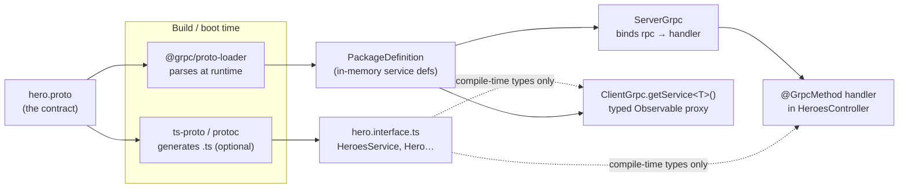
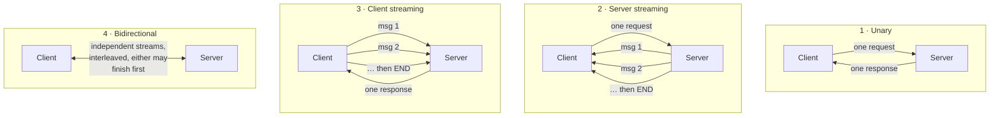

# Chapter 48 — Microservices IV: gRPC

> **한눈에 보기**
> gRPC는 브로커가 없는 **직접 호출** 방식의 마이크로서비스 트랜스포터입니다. HTTP/2 위에서
> Protocol Buffers로 직렬화하고, `.proto` 파일 하나가 서버와 클라이언트 양쪽의 계약이자
> 타입 정의가 됩니다. 45장에서 배운 `@MessagePattern`은 여기서 쓰이지 않습니다 —
> 패턴 대신 **서비스와 rpc 이름**이 라우팅 키입니다. 이 장은 `.proto` 문법, `Transport.GRPC`의
> 모든 옵션, 단항·서버 스트리밍·클라이언트 스트리밍·양방향 네 가지 호출 형태, `ClientGrpc`와
> 타입 인터페이스 패턴, 메타데이터·데드라인·취소, gRPC 상태 코드와 예외 필터, TLS/mTLS,
> 헬스 체크와 리플렉션, 그리고 gRPC-Web과 REST 게이트웨이까지 다룹니다.

**What you will learn**

- Why gRPC's three parts — HTTP/2 transport, Protocol Buffers encoding, generated stubs — each solve a different problem, and which of the three you actually gain from.
- How to write a `.proto` file that survives five years of schema evolution: field numbers, reserved ranges, `repeated`, enums with a zero value, nested messages, and the `google.protobuf` well-known types.
- Every option on `Transport.GRPC` — including the `loader` block whose `keepCase`, `longs`, `enums`, and `defaults` settings silently change the shape of every object your handlers receive.
- The four gRPC call types, each with a working Nest handler and the client code that drives it, plus which decorator (`@GrpcMethod`, `@GrpcStreamMethod`, `@GrpcStreamCall`) belongs to which.
- How `ClientGrpc.getService<T>()` turns a proto service into a typed, `Observable`-returning object, and why `getClientByServiceName()` exists alongside it.
- Mapping domain errors onto the 17 gRPC status codes with `RpcException` and an exception filter, instead of leaking `UNKNOWN` to every caller.
- Deadlines, cancellation, TLS/mTLS credentials, the health-checking and reflection protocols, and how to expose the same service over REST for browsers.

**Why this matters**

Every transporter in the last three chapters put a broker between two services. That broker buys you decoupling, buffering, and fan-out — and charges you latency, an extra operational dependency, and a message format that nobody validates. gRPC makes the opposite trade. There is no broker. Service A opens an HTTP/2 connection directly to service B and calls a method on it. The wire format is a compact binary encoding derived from a schema that both sides compile against, so a field-name typo is a build error rather than an `undefined` at 3 a.m.

The failure mode gRPC eliminates is the silent contract drift that JSON-over-a-broker invites. A team renames `user_id` to `userId` in a producer, deploys, and three consumers start reading `undefined` — no error, no alert, just wrong data flowing into a report. With a `.proto` file, that field has a *number*, the number is what goes on the wire, and renaming the field changes nothing at all for existing consumers. That property — the wire format keys on integers, not names — is the single most important thing to understand about protobuf, and it is why gRPC systems tolerate independent deploy schedules that JSON systems do not.

The failure mode gRPC *introduces* is coupling of availability. When you call a broker, the broker holds your message while the consumer is restarting. When you call gRPC, a restarting server means `UNAVAILABLE` in your caller's face, right now. That is not a defect — it is the honest shape of a synchronous call — but it means every gRPC call site needs a deadline, a retry policy, and an answer to "what do we do when this is down." Teams that migrate a fire-and-forget event onto gRPC because "it's faster" discover this the first time the callee deploys.

My recommendation, stated up front: use gRPC for **synchronous internal service-to-service calls where you need a typed contract and low latency** — a checkout service asking a pricing service for a quote, an API gateway fanning out to three domain services. Use a broker (Chapters 46–47) for **anything where the caller does not need the answer to continue**. Use REST at the edge, where browsers and third parties live. Most mature systems run all three, and the skill is knowing which boundary is which.

---

## What gRPC actually is

gRPC is three independent technologies bundled under one name. Understanding them separately tells you which of gRPC's benefits you get and which you can obtain elsewhere.

**HTTP/2 as the transport.** HTTP/2 multiplexes many logical streams over one TCP connection, with binary framing and header compression. For RPC this matters in three ways: connection setup cost is paid once and amortised over thousands of calls; a slow call does not block others on the same connection (no head-of-line blocking at the HTTP layer); and because a stream is bidirectional and long-lived, *streaming* is a first-class call shape rather than a bolt-on like WebSockets over HTTP/1.1.

**Protocol Buffers as the encoding.** A `.proto` file defines messages; a compiler or a runtime loader turns them into serializers. The encoded form is a sequence of `(field number, wire type, value)` triples. Field *names* never travel. This produces payloads typically 3–10× smaller than the equivalent JSON, parses faster, and — crucially — makes the schema evolvable: unknown fields are skipped, missing fields take defaults, and adding an optional field is always backwards compatible.

**Generated stubs as the API.** From the same `.proto`, tooling produces a client object whose methods mirror the service's rpcs, and a server interface you implement. You call `pricing.getQuote(req)` instead of assembling a URL and a body. The types are checked at compile time on both ends.

Nest uses the *dynamic* variant of the third part: `@grpc/proto-loader` parses your `.proto` at runtime and builds the service definitions in memory. You get the wiring for free, but you do **not** get TypeScript types for free — you declare an interface by hand or generate one with `ts-proto`. We cover both below.

### When gRPC beats a broker or REST

| Requirement | Best fit | Why |
|---|---|---|
| Caller needs the answer to proceed | **gRPC** | Request–response is the native shape; no reply-queue machinery |
| Caller does not need the answer | Broker (Ch. 46/47) | The broker absorbs downtime and bursts |
| Many independent consumers of one fact | Kafka (Ch. 47) | Fan-out and replay are the point |
| Called by a browser | REST or GraphQL | Browsers cannot speak gRPC natively (see gRPC-Web below) |
| Called by a third party | REST | No `.proto` distribution problem, no tooling requirement |
| High call volume, low latency, internal | **gRPC** | Binary encoding + one persistent connection |
| Large payloads or long transfers | **gRPC streaming** | Chunked without buffering the whole thing |
| Polyglot services (Go, Java, Python, Node) | **gRPC** | One `.proto`, N generated clients |

The honest summary: gRPC's advantage over REST is not primarily speed — a tuned JSON API over keep-alive HTTP/1.1 is fast enough for most workloads. It is the **enforced schema** and the **streaming call shapes**. If you would not benefit from either, REST is less machinery.

### Installation and project setup

```bash
$ npm i --save @nestjs/microservices @grpc/grpc-js @grpc/proto-loader
```

`.proto` files are not TypeScript, so `tsc` will not copy them to `dist/`. Tell the Nest CLI to:

```json title="nest-cli.json"
{
  "$schema": "https://json.schemastore.org/nest-cli",
  "collection": "@nestjs/schematics",
  "sourceRoot": "src",
  "compilerOptions": {
    "assets": ["**/*.proto"],
    "watchAssets": true
  }
}
```

Forgetting this is the single most common first-run failure: `ENOENT: no such file or directory, open '.../dist/hero/hero.proto'`. In a Docker build, verify the file exists in the image — `RUN ls -la dist/**/*.proto` in a scratch layer costs nothing and saves an hour.

---

## Writing a `.proto` file

The proto file is the contract. It is the artefact you review most carefully, because it is the thing you cannot casually change.

```protobuf title="src/heroes/hero.proto"
syntax = "proto3";

package hero;

import "google/protobuf/timestamp.proto";
import "google/protobuf/empty.proto";

service HeroesService {
  rpc FindOne (HeroById) returns (Hero) {}
  rpc FindMany (stream HeroById) returns (stream Hero) {}
  rpc ListByTeam (TeamQuery) returns (stream Hero) {}
  rpc ImportHeroes (stream Hero) returns (ImportSummary) {}
  rpc Ping (google.protobuf.Empty) returns (google.protobuf.Empty) {}
}

message HeroById {
  int32 id = 1;
}

message TeamQuery {
  string team = 1;
  int32 limit = 2;
}

enum Alignment {
  ALIGNMENT_UNSPECIFIED = 0;
  ALIGNMENT_HERO = 1;
  ALIGNMENT_VILLAIN = 2;
}

message Hero {
  int32 id = 1;
  string name = 2;
  repeated string powers = 3;
  Alignment alignment = 4;
  google.protobuf.Timestamp created_at = 5;

  message Stats {
    int32 strength = 1;
    int32 speed = 2;
  }
  Stats stats = 6;
}

message ImportSummary {
  int32 imported = 1;
  repeated string errors = 2;
}
```

Read it top to bottom.

**`syntax = "proto3"`** — always proto3 for new work. proto2's `required` keyword was a design mistake (a required field can never be removed) and proto3 dropped it.

**`package hero;`** — a namespace. It must match the `package` option you pass to Nest exactly. Packages can be dotted (`acme.billing.v1`), which is the convention once you have more than a handful of services. Versioning the package (`v1`, `v2`) rather than the service is how you make a breaking change without breaking anyone.

**`service` / `rpc`** — the callable surface. Each rpc takes exactly one message and returns exactly one message. That constraint is deliberate: a wrapper message can gain fields, a bare `string` parameter cannot. Never write `rpc FindOne (int32) returns (string)` — protobuf will not let you, and this is why.

**`message`** — a struct. Fields are `type name = number;`.

### Field numbers, and why they matter more than anything else

The number is the wire identity. On the wire, `name = 2` is encoded as tag `2`, not as the string `"name"`. Three consequences follow, and they define how you evolve a schema:

1. **Renaming a field is free.** `string name = 2` → `string display_name = 2` changes nothing on the wire. Old clients keep working.
2. **Changing a field's number is a breaking change.** The new number is a different field; old peers see the old number as unknown and skip it, and the new number as a field they have never heard of. Data silently disappears.
3. **Reusing a deleted field's number is the worst possible change.** Old peers decode the new field with the old field's type and semantics. You get corrupt data with no error.

Rule 3 is why `reserved` exists:

```protobuf
message Hero {
  reserved 4, 7 to 9;
  reserved "alignment", "legacy_rank";

  int32 id = 1;
  string name = 2;
  repeated string powers = 3;
}
```

Once you delete a field, reserve its number and name forever. The compiler then refuses to let a future colleague reuse them.

Two more numbering details worth knowing: numbers 1–15 encode their tag in a single byte, 16–2047 in two, so give your **hottest fields the low numbers**. And 19000–19999 are reserved by protobuf itself; you cannot use them.

### `repeated`, enums, nested messages, `oneof`, and maps

**`repeated`** is a list. In proto3 it is packed by default for scalar types, which is compact. On the JavaScript side it arrives as an array — but see the `arrays` loader option: with default settings, an *empty* repeated field arrives as `undefined`, not `[]`. That asymmetry causes more null-checks than any other single thing in a Nest gRPC codebase.

**Enums** must have a zero value, and by convention it is `*_UNSPECIFIED`. The reason is that proto3 has no concept of "field absent" for scalars — an unset enum decodes as 0. If 0 means `HERO`, you cannot distinguish "this hero is a hero" from "the sender is an old build that does not know about alignment." Enum value names share the enclosing scope's namespace, which is why they are conventionally prefixed with the enum name.

**Nested messages** (`Hero.Stats` above) scope a type to its parent. They cost nothing extra on the wire and keep the top-level namespace clean.

**`oneof`** models mutually exclusive fields:

```protobuf
message SearchRequest {
  oneof criteria {
    int32 id = 1;
    string name = 2;
    string team = 3;
  }
}
```

Setting one clears the others. With the `oneofs: true` loader option, the decoded object gains a `criteria` property holding the name of the field that was set — the only reliable way to distinguish "id is 0" from "id was not set."

**Maps** are sugar for a repeated entry message:

```protobuf
message Hero {
  map<string, string> labels = 10;
}
```

They arrive as plain objects. Note that map ordering is not preserved and map fields cannot be `repeated`.

### `google.protobuf` well-known types

The protobuf distribution ships a small standard library. The ones you will actually use:

| Type | Import | Purpose | Decoded JS shape |
|---|---|---|---|
| `Timestamp` | `google/protobuf/timestamp.proto` | An instant, UTC | `{ seconds, nanos }` (see below) |
| `Duration` | `google/protobuf/duration.proto` | A span of time | `{ seconds, nanos }` |
| `Empty` | `google/protobuf/empty.proto` | No request or no response | `{}` |
| `Any` | `google/protobuf/any.proto` | A packed arbitrary message | `{ type_url, value }` |
| `Struct` / `Value` | `google/protobuf/struct.proto` | Arbitrary JSON-ish data | nested wrapper objects |
| `FieldMask` | `google/protobuf/field_mask.proto` | Which fields a partial update touches | `{ paths: string[] }` |
| `StringValue`, `Int32Value`, … | `google/protobuf/wrappers.proto` | Nullable scalars | `{ value }` or absent |

The wrapper types deserve a note. In proto3, `int32 count = 1` set to 0 is indistinguishable from unset. If you genuinely need nullability, either use `google.protobuf.Int32Value` (a message, so absence is observable) or mark the field `optional` — proto3 reinstated the `optional` keyword for exactly this, and `@grpc/proto-loader` supports it.

`Timestamp` is the one that trips people. It is `{ seconds, nanos }`, and `seconds` is an `int64`. How that reaches your handler depends entirely on the `longs` loader option, discussed next.

For `includeDirs` to resolve `import "google/protobuf/timestamp.proto"`, point it at the directory that `google-proto-files` or `@grpc/proto-loader` ships — in practice `join(__dirname, 'proto')` for your own imports, plus the loader's bundled well-known types, which `@grpc/proto-loader` resolves automatically.



The dotted lines carry the important point: **the generated interface is documentation for the compiler, nothing more.** At runtime, only the `.proto` and the loader exist. If your hand-written interface drifts from the `.proto`, TypeScript will happily lie to you.

---

## The server: `Transport.GRPC` and every option

```typescript title="src/main.ts"
import { NestFactory } from '@nestjs/core';
import { MicroserviceOptions, Transport } from '@nestjs/microservices';
import { join } from 'node:path';
import { AppModule } from './app.module';

async function bootstrap() {
  const app = await NestFactory.createMicroservice<MicroserviceOptions>(AppModule, {
    transport: Transport.GRPC,
    options: {
      package: 'hero',
      protoPath: join(__dirname, 'heroes/hero.proto'),
      url: '0.0.0.0:50051',
      loader: {
        keepCase: false,
        longs: String,
        enums: String,
        defaults: true,
        oneofs: true,
        arrays: true,
        objects: true,
        includeDirs: [join(__dirname, 'proto')],
      },
      maxSendMessageLength: 16 * 1024 * 1024,
      maxReceiveMessageLength: 16 * 1024 * 1024,
      gracefulShutdown: true,
    },
  });
  await app.listen();
}
bootstrap();
```

### Top-level options

| Option | Type | Default | Notes |
|---|---|---|---|
| `package` | `string \| string[]` | — | **Required.** Must match the `.proto` `package`. An array loads several packages (see below). |
| `protoPath` | `string \| string[]` | — | **Required.** Absolute, or relative to the process root. An array loads several files. |
| `url` | `string` | `'localhost:5000'` | `host:port`. Use `0.0.0.0:50051` in containers — `localhost` binds only the loopback and your service is unreachable from outside the container. |
| `protoLoader` | `string` | `'@grpc/proto-loader'` | Package name of the loader utility. Change only if you have a fork. |
| `packageDefinition` | `PackageDefinition` | — | Supply an already-loaded definition instead of `protoPath`/`loader`. Useful when you generate definitions at build time. |
| `loader` | object | see below | `@grpc/proto-loader` options. Behaviour-changing — read the next table carefully. |
| `credentials` | `ServerCredentials` | insecure | TLS/mTLS. See the credentials section. |
| `maxSendMessageLength` | `number` | 4 MB | Bytes. Exceeding it fails the call with `RESOURCE_EXHAUSTED`. |
| `maxReceiveMessageLength` | `number` | 4 MB | Same, inbound. Raise both ends or you get an asymmetric failure. |
| `maxMetadataSize` | `number` | 8 KB | Total metadata bytes. JWTs in metadata can exceed this. |
| `keepalive` | object | off | HTTP/2 keepalive pings — `keepaliveTimeMs`, `keepaliveTimeoutMs`, `keepalivePermitWithoutCalls`, `http2MaxPingsWithoutData`, `http2MinTimeBetweenPingsMs`, `http2MinPingIntervalWithoutDataMs`, `http2MaxPingStrikes`. Essential behind load balancers that idle-timeout connections. |
| `channelOptions` | object | — | Raw `grpc-js` channel options, e.g. `'grpc.max_concurrent_streams'`, `'grpc.default_compression_algorithm'`, `'grpc.service_config'` for retry policy. The escape hatch for anything Nest does not surface. |
| `gracefulShutdown` | `boolean` | `false` | On `close()`, call `tryShutdown()` — drain in-flight calls — instead of `forceShutdown()`. Turn this **on** in production. |
| `onLoadPackageDefinition` | `(pkg, server) => void` | — | Hook invoked with the loaded definition and the raw `grpc.Server`. Used for reflection and health checks. |

`gracefulShutdown` deserves a sentence of emphasis. With it off, a rolling deploy aborts every in-flight RPC on the terminating pod, which your callers see as `CANCELLED`. With it on — and with `app.enableShutdownHooks()` from [Chapter 39](./39-lifecycle-and-shutdown.md) — the server stops accepting new calls, finishes the ones it has, and exits.

### Loader options — the ones that change your data

These are `@grpc/proto-loader` options, and they determine the JavaScript shape of every message. Choose them once, write them down, and use the identical block on client and server.

| Option | Default | Effect | Recommendation |
|---|---|---|---|
| `keepCase` | `false` | `false` converts `created_at` → `createdAt`. `true` keeps snake_case. | Pick one and never change it. Note the warning below. |
| `longs` | `Long` object | `String` decodes `int64`/`uint64` as strings; `Number` as numbers (lossy above 2^53). | `String`. Money and IDs live in int64s. |
| `enums` | number | `String` decodes enums as their name. | `String` — logs and errors become readable. |
| `bytes` | `Buffer` | `String` decodes as base64. | Leave as `Buffer`. |
| `defaults` | `false` | `true` populates unset fields with their type default (`0`, `''`, `false`). | `true` — kills a whole class of `undefined` bugs. |
| `arrays` | `false` | `true` makes an empty `repeated` decode as `[]` rather than `undefined`. | `true`, always. |
| `objects` | `false` | `true` makes an unset message field decode as `{}` rather than `undefined`. | `true` if you prefer total shapes; be aware it hides "was it sent?" |
| `oneofs` | `false` | `true` adds a virtual field naming the set member of each `oneof`. | `true` if you use `oneof` at all. |
| `json` | `false` | Represent well-known types in canonical JSON form. | Off unless bridging to a JSON API. |
| `includeDirs` | `[]` | Search paths for `import` statements in your protos. | Set it as soon as you split protos across files. |

> **⚠️ Notice** — The gRPC client will not send fields whose names contain an underscore unless `keepCase: true` is set in the loader options (`options.loader.keepCase`). If you write `.proto` fields in snake_case (which is the protobuf style guide's recommendation) and use default loader options, you must send `createdAt` from JavaScript, not `created_at`. Mixing the two conventions between client and server produces fields that silently vanish. Configure the loader identically on both sides — I keep the block in a shared `grpc-loader.config.ts` and import it everywhere.

```typescript title="src/grpc/loader.config.ts"
import { join } from 'node:path';
import type { GrpcOptions } from '@nestjs/microservices';

export const grpcLoader: NonNullable<GrpcOptions['options']>['loader'] = {
  keepCase: false,
  longs: String,
  enums: String,
  defaults: true,
  arrays: true,
  objects: true,
  oneofs: true,
  includeDirs: [join(__dirname, '..', 'proto')],
};
```

### Multiple proto packages

One microservice can serve several packages. Pass arrays — the indices do not need to correspond, the loader unions everything:

```typescript
const app = await NestFactory.createMicroservice<MicroserviceOptions>(AppModule, {
  transport: Transport.GRPC,
  options: {
    package: ['hero', 'villain', 'grpc.health.v1'],
    protoPath: [
      join(__dirname, 'heroes/hero.proto'),
      join(__dirname, 'villains/villain.proto'),
      healthCheckProtoPath,
    ],
    url: '0.0.0.0:50051',
    loader: grpcLoader,
  },
});
```

Handlers for both packages can live in the same controller or in separate ones; Nest routes by `(service, rpc)` regardless of which controller declared the handler.

---

## Handlers: `@GrpcMethod` and how names resolve

`@MessagePattern()` is **not** used with gRPC. The routing key is the pair `(service name, rpc name)` from the `.proto`, and `@GrpcMethod()` supplies it.

```typescript title="src/heroes/heroes.controller.ts"
import { Controller } from '@nestjs/common';
import { GrpcMethod } from '@nestjs/microservices';
import { Metadata, ServerUnaryCall } from '@grpc/grpc-js';
import { Hero, HeroById } from './hero.interface';

@Controller()
export class HeroesController {
  private readonly heroes: Hero[] = [
    { id: 1, name: 'John', powers: ['flight'], alignment: 'ALIGNMENT_HERO' },
    { id: 2, name: 'Doe', powers: [], alignment: 'ALIGNMENT_HERO' },
  ];

  @GrpcMethod('HeroesService', 'FindOne')
  findOne(
    data: HeroById,
    metadata: Metadata,
    call: ServerUnaryCall<HeroById, Hero>,
  ): Hero {
    const hero = this.heroes.find(({ id }) => id === data.id);
    if (!hero) {
      throw new RpcException({ code: status.NOT_FOUND, message: `Hero ${data.id} not found` });
    }
    return hero;
  }
}
```

The handler receives three arguments, always in this order:

1. **`data`** — the decoded request message.
2. **`metadata`** — a `grpc-js` `Metadata` instance holding the call's key–value headers.
3. **`call`** — the raw call object. For a unary rpc this is `ServerUnaryCall`, which carries `sendMetadata()`, `cancelled`, `getDeadline()`, and `getPeer()`.

Both decorator arguments are optional, and the fallback rules are worth memorising because they cause confusing "handler not found" errors:

| Written as | Service resolved from | Rpc resolved from |
|---|---|---|
| `@GrpcMethod('HeroesService', 'FindOne')` | the literal | the literal |
| `@GrpcMethod('HeroesService')` | the literal | handler name, upper-camel-cased (`findOne` → `FindOne`) |
| `@GrpcMethod()` | the **class name** | handler name, upper-camel-cased |

So `@GrpcMethod()` inside `class HeroesService` works, and the same decorator inside `class HeroesController` does not — because there is no `HeroesController` service in the proto. My recommendation is to **always pass both arguments explicitly**. The implicit forms save eighteen characters and cost you a debugging session the first time someone renames a class.

> **Hint** — `@GrpcMethod` is exported from `@nestjs/microservices`; `Metadata`, `ServerUnaryCall`, `ServerReadableStream`, `ServerWritableStream`, `ServerDuplexStream`, and `status` come from `@grpc/grpc-js`.

Because the handler is an ordinary Nest controller method, the full pipeline from Part I applies: guards, interceptors, and pipes run around it, and `@Payload()` / `@Ctx()` work as they do for any microservice handler ([Chapter 45](./45-microservices-fundamentals.md)). The one difference is that `@Ctx()` for gRPC gives you the `Metadata`, not a transport-specific context class.

---

## The client: `ClientGrpc` and typed interfaces

Register the package the same way you register any client, but note the class you receive is `ClientGrpc`, not `ClientProxy`:

```typescript title="src/app.module.ts"
import { Module } from '@nestjs/common';
import { ClientsModule, Transport } from '@nestjs/microservices';
import { join } from 'node:path';
import { grpcLoader } from './grpc/loader.config';

@Module({
  imports: [
    ClientsModule.register([
      {
        name: 'HERO_PACKAGE',
        transport: Transport.GRPC,
        options: {
          package: 'hero',
          protoPath: join(__dirname, 'heroes/hero.proto'),
          url: process.env.HERO_URL ?? 'localhost:50051',
          loader: grpcLoader,
        },
      },
    ]),
  ],
})
export class AppModule {}
```

`ClientsModule.registerAsync()` with a `useFactory` is the right call once the URL comes from `ConfigService` ([Chapter 17](../part2-intermediate/17-configuration.md)).

Then declare the shape you expect and ask for it:

```typescript title="src/heroes/hero.interface.ts"
import { Observable } from 'rxjs';

export interface Hero {
  id: number;
  name: string;
  powers: string[];
  alignment: 'ALIGNMENT_UNSPECIFIED' | 'ALIGNMENT_HERO' | 'ALIGNMENT_VILLAIN';
  createdAt?: { seconds: string; nanos: number };
}

export interface HeroById {
  id: number;
}

export interface TeamQuery {
  team: string;
  limit: number;
}

export interface ImportSummary {
  imported: number;
  errors: string[];
}

/** Mirrors `service HeroesService` in hero.proto. Methods are lowerCamelCase. */
export interface HeroesServiceClient {
  findOne(request: HeroById, metadata?: Metadata): Observable<Hero>;
  listByTeam(request: TeamQuery): Observable<Hero>;          // server streaming
  importHeroes(upstream: Observable<Hero>): Observable<ImportSummary>; // client streaming
  findMany(upstream: Observable<HeroById>): Observable<Hero>;          // bidirectional
}
```

```typescript title="src/heroes/heroes.gateway.service.ts"
import { Inject, Injectable, OnModuleInit } from '@nestjs/common';
import { ClientGrpc } from '@nestjs/microservices';
import { Observable } from 'rxjs';
import { Hero, HeroesServiceClient } from './hero.interface';

@Injectable()
export class HeroesGatewayService implements OnModuleInit {
  private heroes: HeroesServiceClient;

  constructor(@Inject('HERO_PACKAGE') private readonly client: ClientGrpc) {}

  onModuleInit() {
    this.heroes = this.client.getService<HeroesServiceClient>('HeroesService');
  }

  getHero(id: number): Observable<Hero> {
    return this.heroes.findOne({ id });
  }
}
```

Four things about this code are load-bearing.

**`getService()` must be called in `onModuleInit`, not in the constructor.** The `ClientGrpc` has not loaded its package definition when the constructor runs.

**The service name argument is the proto name (`'HeroesService'`), PascalCase.** The *methods* on the returned object are lowerCamelCase (`findOne`), because that is the JavaScript convention and `getService` performs the conversion. Passing `'heroesService'` yields `undefined`.

**Every method returns an `Observable`, even a unary call.** It is a cold observable — nothing is sent until you subscribe. Returning it directly from a controller is fine (Nest subscribes for you); calling it and ignoring the result sends nothing at all. Use `firstValueFrom()` when you need a promise.

**The interface is unverified.** `getService<HeroesServiceClient>` is a cast. Nothing checks it against the proto. This is why `ts-proto` is worth adopting on any project with more than a couple of services:

```bash
$ npm i -D ts-proto
$ protoc --plugin=./node_modules/.bin/protoc-gen-ts_proto \
    --ts_proto_out=./src/generated \
    --ts_proto_opt=nestJs=true \
    --proto_path=./src/proto ./src/proto/hero.proto
```

With `nestJs=true`, `ts-proto` emits the client interface, the server interface, and the `@GrpcMethod` metadata constants, all derived from the proto. Drift becomes a compile error, which is the entire point of using gRPC.

### `getClientByServiceName` and the `@Client()` decorator

`getService<T>()` returns a *wrapped* client: each method is adapted to return an RxJS `Observable`, and streaming semantics are translated. Sometimes you want the raw `grpc-js` client — to pass call options, set a deadline object, or use the callback API directly. That is `getClientByServiceName`:

```typescript
const raw = this.client.getClientByServiceName<any>('HeroesService');

raw.findOne(
  { id: 1 },
  new Metadata(),
  { deadline: Date.now() + 2_000 },
  (err: ServiceError | null, res: Hero) => { /* node-style callback */ },
);
```

Use `getService()` by default; reach for `getClientByServiceName()` when you need per-call options that the wrapper does not expose.

For quick prototypes and tests, `@Client()` instantiates a client inline without module registration:

```typescript
@Injectable()
export class AppService implements OnModuleInit {
  @Client({
    transport: Transport.GRPC,
    options: { package: 'hero', protoPath: join(__dirname, 'heroes/hero.proto') },
  })
  client: ClientGrpc;

  private heroes: HeroesServiceClient;
  onModuleInit() { this.heroes = this.client.getService('HeroesService'); }
}
```

It hard-codes configuration into a class and cannot be overridden in a test module, so use `ClientsModule` for anything real. For dynamic construction, `ClientProxyFactory.create()` works here as it does for other transports.

---

## The four call types



The `.proto` decides which shape an rpc has, purely by where the `stream` keyword appears:

| Proto signature | Call type | Server decorator | Client method shape |
|---|---|---|---|
| `rpc F (Req) returns (Res)` | Unary | `@GrpcMethod` | `f(req): Observable<Res>` (one value) |
| `rpc F (Req) returns (stream Res)` | Server streaming | `@GrpcMethod` returning an `Observable` | `f(req): Observable<Res>` (many values) |
| `rpc F (stream Req) returns (Res)` | Client streaming | `@GrpcStreamMethod` or `@GrpcStreamCall` | `f(upstream$): Observable<Res>` |
| `rpc F (stream Req) returns (stream Res)` | Bidirectional | `@GrpcStreamMethod` or `@GrpcStreamCall` | `f(upstream$): Observable<Res>` |

### 1 · Unary

Covered above. Handler returns a value or a `Promise`; Nest resolves it and sends one message.

### 2 · Server streaming

```protobuf
rpc ListByTeam (TeamQuery) returns (stream Hero) {}
```

The handler is still `@GrpcMethod`. Return an `Observable` and every emission becomes a message; completion closes the stream.

```typescript
import { Observable, from, interval, map, take, zipWith } from 'rxjs';

@GrpcMethod('HeroesService', 'ListByTeam')
listByTeam(query: TeamQuery): Observable<Hero> {
  const matches = this.heroes.filter((h) => h.team === query.team).slice(0, query.limit);
  // Emit one hero every 100 ms to demonstrate incremental delivery.
  return from(matches).pipe(zipWith(interval(100)), map(([hero]) => hero));
}
```

The client consumes it as an ordinary multi-value observable:

```typescript
@Get('teams/:team')
listTeam(@Param('team') team: string): Observable<Hero> {
  return this.heroes.listByTeam({ team, limit: 50 });
}
```

Returned from an HTTP controller, this yields an array once the stream completes. To stream to the browser, pipe it into SSE ([Chapter 57](./57-advanced-http.md)).

Server streaming is the right shape for exports, tailing logs, and any result set large enough that buffering it in memory is a problem. It is not free: the whole stream occupies one HTTP/2 stream on one connection for its lifetime, so ten thousand concurrent tails need tuning of `grpc.max_concurrent_streams`.

### 3 · Client streaming

```protobuf
rpc ImportHeroes (stream Hero) returns (ImportSummary) {}
```

Two handler styles. **Subject strategy** with `@GrpcStreamMethod` gives you an `Observable` of inbound messages, and you return an `Observable` of the single response:

```typescript
import { GrpcStreamMethod } from '@nestjs/microservices';
import { Metadata, ServerReadableStream } from '@grpc/grpc-js';
import { Observable, Subject } from 'rxjs';

@GrpcStreamMethod('HeroesService', 'ImportHeroes')
importHeroes(messages: Observable<Hero>, metadata: Metadata): Observable<ImportSummary> {
  const result = new Subject<ImportSummary>();
  let imported = 0;
  const errors: string[] = [];

  messages.subscribe({
    next: (hero) => {
      if (!hero.name) { errors.push(`hero ${hero.id} has no name`); return; }
      this.heroes.push(hero);
      imported++;
    },
    error: (err) => result.error(err),
    complete: () => { result.next({ imported, errors }); result.complete(); },
  });

  return result.asObservable();
}
```

**Call-stream strategy** with `@GrpcStreamCall` hands you the raw Node stream and a callback:

```typescript
import { GrpcStreamCall } from '@nestjs/microservices';

@GrpcStreamCall('HeroesService', 'ImportHeroes')
importHeroes(
  requestStream: ServerReadableStream<Hero, ImportSummary>,
  callback: (err: unknown, value: ImportSummary) => void,
) {
  let imported = 0;
  requestStream.on('data', (hero: Hero) => { this.heroes.push(hero); imported++; });
  requestStream.on('end', () => callback(null, { imported, errors: [] }));
  requestStream.on('error', (err) => callback(err, null as never));
}
```

Use `@GrpcStreamCall` when you want to hand the stream to something else — a `pipeline()` into a database writer, a CSV parser — and do not want RxJS in the middle. Use `@GrpcStreamMethod` for everything else.

Driving it from the client means passing an observable *in*. A `ReplaySubject` is the usual choice, because it buffers emissions that happen before the transport subscribes:

```typescript
import { ReplaySubject, firstValueFrom } from 'rxjs';

async importAll(heroes: Hero[]): Promise<ImportSummary> {
  const upstream$ = new ReplaySubject<Hero>();
  for (const hero of heroes) upstream$.next(hero);
  upstream$.complete();
  return firstValueFrom(this.heroes.importHeroes(upstream$));
}
```

Forgetting `complete()` is the classic bug: the server's `end` event never fires, the callback is never called, and the RPC hangs until the deadline.

### 4 · Bidirectional

```protobuf
rpc BidiHello (stream HelloRequest) returns (stream HelloResponse);
```

Both directions are independent. The server may respond before the client has finished sending, may send several responses per request, or none.

```typescript
@GrpcStreamMethod('HelloService', 'BidiHello')
bidiHello(
  messages: Observable<HelloRequest>,
  metadata: Metadata,
  call: ServerDuplexStream<HelloRequest, HelloResponse>,
): Observable<HelloResponse> {
  const subject = new Subject<HelloResponse>();
  messages.subscribe({
    next: (message) => subject.next({ reply: `Hello, ${message.greeting}!` }),
    complete: () => subject.complete(),
  });
  return subject.asObservable();
}
```

> **⚠️ Notice** — For full-duplex interaction with `@GrpcStreamMethod()`, the controller method **must** return an RxJS `Observable`. Returning a value, a promise, or nothing produces a stream that never emits.

The raw equivalent, useful when you want to write into the stream from an event source rather than an observable:

```typescript
@GrpcStreamCall('HelloService', 'BidiHello')
bidiHello(requestStream: ServerDuplexStream<HelloRequest, HelloResponse>) {
  requestStream.on('data', (message) => {
    requestStream.write({ reply: `Hello, ${message.greeting}!` });
  });
  requestStream.on('end', () => requestStream.end());
}
```

Client side:

```typescript
const helloService = this.client.getService<HelloService>('HelloService');
const helloRequest$ = new ReplaySubject<HelloRequest>();

helloRequest$.next({ greeting: 'Hello (1)!' });
helloRequest$.next({ greeting: 'Hello (2)!' });
helloRequest$.complete();

return helloService.bidiHello(helloRequest$);
```

Note that `LotsOfGreetings`-style rpcs (`stream` in, single out) can also be implemented with plain `@GrpcMethod` when the returned observable emits exactly one value — but the stream-aware decorators express the intent better.

---

## Metadata, `@Ctx()`, deadlines, and cancellation

**Metadata** is the gRPC equivalent of HTTP headers: a multimap of string keys to string or binary values, opaque to gRPC itself. Auth tokens, correlation IDs, and tenant identifiers belong here.

Reading it on the server is the second handler argument, or `@Ctx()`:

```typescript
import { Ctx, GrpcMethod, Payload } from '@nestjs/microservices';

@GrpcMethod('HeroesService', 'FindOne')
findOne(@Payload() data: HeroById, @Ctx() metadata: Metadata): Hero {
  const [traceId] = metadata.get('x-trace-id');
  this.logger.log(`FindOne(${data.id}) trace=${traceId ?? 'none'}`);
  return this.lookup(data.id);
}
```

Sending metadata **back** uses `sendMetadata()` on the call object (third argument) — `ServerUnaryCall#sendMetadata()` for unary, `ServerDuplexStream#sendMetadata()` for bidi:

```typescript
@GrpcMethod('HeroesService', 'FindOne')
findOne(data: HeroById, metadata: Metadata, call: ServerUnaryCall<HeroById, Hero>): Hero {
  const serverMetadata = new Metadata();
  serverMetadata.add('x-cache', 'miss');
  call.sendMetadata(serverMetadata);
  return this.lookup(data.id);
}
```

In `@GrpcStreamCall` handlers there is no separate metadata argument — listen for the event instead:

```typescript
requestStream.on('metadata', (metadata: Metadata) => {
  const meta = metadata.get('X-Meta');
});
```

Sending metadata from the client is the second argument to a `getService()` method — which is why your interface must declare it:

```typescript
call(): Observable<Hero> {
  const metadata = new Metadata();
  metadata.add('authorization', `Bearer ${this.token}`);
  return this.heroesService.findOne({ id: 1 }, metadata);
}
```

Metadata keys are lowercased by the runtime. Keys ending in `-bin` carry binary values as `Buffer`; everything else must be ASCII.

**Deadlines** are gRPC's killer feature over naive HTTP. A deadline is an absolute time, propagated on the wire, and every hop downstream inherits the remaining budget. When it expires, the call fails with `DEADLINE_EXCEEDED` on the client *and* the server's `call.cancelled` flips to `true`, so the server can stop working.

```typescript
const raw = this.client.getClientByServiceName<any>('HeroesService');
raw.findOne({ id: 1 }, new Metadata(), { deadline: Date.now() + 2_000 }, cb);
```

Through the `getService()` wrapper, the natural expression is RxJS:

```typescript
import { timeout, catchError, of } from 'rxjs';

this.heroes.findOne({ id }).pipe(
  timeout(2_000),
  catchError(() => of(null)),
);
```

Be clear about the difference: RxJS `timeout` unsubscribes locally, which cancels the gRPC call, but it does **not** put a deadline on the wire, so a second hop downstream gets no budget. For genuine deadline propagation across a chain of services, use the raw client's `deadline` call option, or forward the remaining time yourself in metadata.

**Cancellation** flows the other way. If the client unsubscribes, disconnects, or hits its deadline, the server sees it:

```typescript
@GrpcMethod('HeroesService', 'ListByTeam')
listByTeam(query: TeamQuery, metadata: Metadata, call: ServerWritableStream<TeamQuery, Hero>) {
  const subject = new Subject<Hero>();
  call.on('cancelled', () => subject.complete());  // stop the expensive work
  this.streamFromDatabase(query, subject);
  return subject.asObservable();
}
```

Wiring `cancelled` is what stops a disconnected client's query from continuing to burn database time for the next four minutes. Do it for every long-running or streaming handler.

---

## Errors and status codes

Every gRPC call terminates with a status code. There are 17, and they are the vocabulary your callers program against. Returning `UNKNOWN` (which is what an unhandled `Error` produces) tells the caller nothing and makes retry logic impossible.

| Code | Name | Retryable? | Use for |
|---:|---|---|---|
| 0 | `OK` | — | Success |
| 1 | `CANCELLED` | No | The caller cancelled |
| 2 | `UNKNOWN` | No | An unmapped error — a bug in your mapping |
| 3 | `INVALID_ARGUMENT` | No | Malformed request, independent of state |
| 4 | `DEADLINE_EXCEEDED` | Maybe | Ran out of time |
| 5 | `NOT_FOUND` | No | Entity does not exist |
| 6 | `ALREADY_EXISTS` | No | Uniqueness violation |
| 7 | `PERMISSION_DENIED` | No | Authenticated but not allowed |
| 8 | `RESOURCE_EXHAUSTED` | Yes, backoff | Quota, rate limit, message too large |
| 9 | `FAILED_PRECONDITION` | No | System state forbids it (e.g. delete non-empty dir) |
| 10 | `ABORTED` | Yes | Concurrency conflict, optimistic-lock failure |
| 11 | `OUT_OF_RANGE` | No | Past the end of a valid range |
| 12 | `UNIMPLEMENTED` | No | This rpc is not implemented here |
| 13 | `INTERNAL` | No | An invariant was broken |
| 14 | `UNAVAILABLE` | **Yes** | Transient — server down, connection lost |
| 15 | `DATA_LOSS` | No | Unrecoverable corruption |
| 16 | `UNAUTHENTICATED` | No | Missing or invalid credentials |

The distinction between 3, 9, and 11 is the one people get wrong. `INVALID_ARGUMENT` means the request is bad *regardless of system state* — retrying with the same argument will never work. `FAILED_PRECONDITION` means it is bad *given the current state* — the client can fix the state and retry. `OUT_OF_RANGE` is the special case of reading past a stream's end, which lets a client detect completion without a separate call.

Throw an `RpcException` with a code and a message:

```typescript
import { RpcException } from '@nestjs/microservices';
import { status } from '@grpc/grpc-js';

@GrpcMethod('HeroesService', 'FindOne')
async findOne(data: HeroById): Promise<Hero> {
  if (!Number.isInteger(data.id) || data.id <= 0) {
    throw new RpcException({ code: status.INVALID_ARGUMENT, message: 'id must be a positive integer' });
  }
  const hero = await this.repo.findById(data.id);
  if (!hero) {
    throw new RpcException({ code: status.NOT_FOUND, message: `Hero ${data.id} not found` });
  }
  return hero;
}
```

The object form matters. `new RpcException('not found')` — a bare string — arrives at the client as `UNKNOWN` with `"not found"` in the details, which no retry policy can act on.

Doing this at every throw site is repetitive and easy to skip. Centralise it in a filter, so your domain code throws domain errors:

```typescript title="src/grpc/grpc-exception.filter.ts"
import { ArgumentsHost, Catch, RpcExceptionFilter } from '@nestjs/common';
import { RpcException } from '@nestjs/microservices';
import { status } from '@grpc/grpc-js';
import { Observable, throwError } from 'rxjs';
import { EntityNotFoundError, ConflictError, ValidationError } from '../domain/errors';

@Catch()
export class GrpcExceptionFilter implements RpcExceptionFilter {
  catch(exception: unknown, host: ArgumentsHost): Observable<never> {
    if (exception instanceof RpcException) {
      return throwError(() => exception.getError());
    }
    if (exception instanceof EntityNotFoundError) {
      return throwError(() => ({ code: status.NOT_FOUND, message: exception.message }));
    }
    if (exception instanceof ValidationError) {
      return throwError(() => ({ code: status.INVALID_ARGUMENT, message: exception.message }));
    }
    if (exception instanceof ConflictError) {
      return throwError(() => ({ code: status.ABORTED, message: exception.message }));
    }
    // Never leak internals. Log the real thing, return a generic status.
    console.error('unmapped gRPC error', exception);
    return throwError(() => ({ code: status.INTERNAL, message: 'Internal error' }));
  }
}
```

Register it globally on the microservice:

```typescript
app.useGlobalFilters(new GrpcExceptionFilter());
```

On the client side, errors surface as the `error` channel of the observable, carrying `code` and `details`:

```typescript
this.heroes.findOne({ id }).pipe(
  catchError((err: ServiceError) => {
    if (err.code === status.NOT_FOUND) return of(null);
    if (err.code === status.UNAVAILABLE) return this.retryWithBackoff({ id });
    return throwError(() => err);
  }),
);
```

Mapping gRPC statuses back to HTTP statuses at a REST gateway is a small, worth-writing function: `NOT_FOUND` → 404, `INVALID_ARGUMENT` → 400, `PERMISSION_DENIED` → 403, `UNAUTHENTICATED` → 401, `ALREADY_EXISTS` → 409, `RESOURCE_EXHAUSTED` → 429, `UNAVAILABLE` → 503, everything else → 500.

---

## TLS and mTLS

By default a Nest gRPC server is **insecure** — plaintext HTTP/2. That is acceptable inside a service mesh that does mTLS for you (Istio, Linkerd) and unacceptable everywhere else.

**Server-side TLS**:

```typescript title="src/main.ts"
import { ServerCredentials } from '@grpc/grpc-js';
import { readFileSync } from 'node:fs';

const app = await NestFactory.createMicroservice<MicroserviceOptions>(AppModule, {
  transport: Transport.GRPC,
  options: {
    package: 'hero',
    protoPath: join(__dirname, 'heroes/hero.proto'),
    url: '0.0.0.0:50051',
    credentials: ServerCredentials.createSsl(
      null,                                             // no client CA → server-side TLS only
      [{
        private_key: readFileSync('./certs/server.key'),
        cert_chain: readFileSync('./certs/server.crt'),
      }],
      false,                                            // checkClientCertificate
    ),
  },
});
```

**mTLS** — the server also verifies the client's certificate. Pass a root CA and flip the last flag:

```typescript
credentials: ServerCredentials.createSsl(
  readFileSync('./certs/ca.crt'),                       // CA that signed client certs
  [{
    private_key: readFileSync('./certs/server.key'),
    cert_chain: readFileSync('./certs/server.crt'),
  }],
  true,                                                 // require and verify a client cert
),
```

The client side uses `ChannelCredentials`:

```typescript
import { ChannelCredentials } from '@grpc/grpc-js';

ClientsModule.register([{
  name: 'HERO_PACKAGE',
  transport: Transport.GRPC,
  options: {
    package: 'hero',
    protoPath: join(__dirname, 'heroes/hero.proto'),
    url: 'heroes.internal:50051',
    credentials: ChannelCredentials.createSsl(
      readFileSync('./certs/ca.crt'),
      readFileSync('./certs/client.key'),
      readFileSync('./certs/client.crt'),
    ),
  },
}]);
```

Two operational notes. The `url` hostname must match the server certificate's SAN, or the handshake fails with a confusing `UNAVAILABLE`; if you must connect by IP, set `channelOptions: { 'grpc.ssl_target_name_override': 'heroes.internal' }` for local testing only. And certificates expire — put a rotation mechanism in place before you ship, because "everything returned UNAVAILABLE at midnight" is a memorable outage.

For per-call authentication that is not certificate-based, put a token in metadata and validate it in a guard:

```typescript
@Injectable()
export class GrpcAuthGuard implements CanActivate {
  canActivate(ctx: ExecutionContext): boolean {
    const metadata = ctx.switchToRpc().getContext<Metadata>();
    const [token] = metadata.get('authorization');
    if (!token) throw new RpcException({ code: status.UNAUTHENTICATED, message: 'missing token' });
    return this.verify(String(token));
  }
}
```

Guards, pipes, and interceptors all work for gRPC handlers exactly as described in [Chapter 40](./40-execution-context.md) — `ctx.getType()` returns `'rpc'`.

---

## Health checks, reflection, and gRPC-Web

### Health checking

Kubernetes needs to know whether your gRPC server is alive. It cannot make an HTTP request, so gRPC defines a standard health service (`grpc.health.v1.Health`). Wire it in with `onLoadPackageDefinition`:

```bash
$ npm i --save grpc-health-check
```

```typescript title="src/main.ts"
import { HealthImplementation, protoPath as healthCheckProtoPath } from 'grpc-health-check';

const app = await NestFactory.createMicroservice<MicroserviceOptions>(AppModule, {
  transport: Transport.GRPC,
  options: {
    package: ['hero', 'grpc.health.v1'],
    protoPath: [healthCheckProtoPath, join(__dirname, 'heroes/hero.proto')],
    url: '0.0.0.0:50051',
    onLoadPackageDefinition: (pkg, server) => {
      const healthImpl = new HealthImplementation({ '': 'UNKNOWN' });
      healthImpl.addToServer(server);
      healthImpl.setStatus('', 'SERVING');
    },
  },
});
```

Note `protoPath` and `package` both become arrays. The empty-string service name is the convention for "the whole server." You can register per-service statuses (`healthImpl.setStatus('hero.HeroesService', 'NOT_SERVING')`) and flip them from a `TerminusModule` indicator ([Chapter 56](./56-observability.md)) when a database goes away.

In the pod spec, use the native gRPC probe (Kubernetes 1.24+):

```yaml
livenessProbe:
  grpc:
    port: 50051
  initialDelaySeconds: 10
```

Older clusters use the [`grpc-health-probe`](https://github.com/grpc-ecosystem/grpc-health-probe) binary as an `exec` probe.

### Server reflection

Reflection lets a client ask the server what services it exposes — the gRPC analogue of serving an OpenAPI document. Without it, `grpcurl`, Postman, and grpc-ui all need a copy of your `.proto`. With it, they discover everything.

```bash
$ npm i --save @grpc/reflection
```

```typescript
import { ReflectionService } from '@grpc/reflection';

options: {
  package: 'hero',
  protoPath: join(__dirname, 'heroes/hero.proto'),
  onLoadPackageDefinition: (pkg, server) => {
    new ReflectionService(pkg).addToServer(server);
  },
}
```

Then:

```bash
$ grpcurl -plaintext localhost:50051 list
$ grpcurl -plaintext -d '{"id":1}' localhost:50051 hero.HeroesService/FindOne
```

This is transformative for developer experience. My recommendation: enable reflection in development and staging unconditionally, and in production only behind network policy — it is a complete description of your internal API surface.

Both hooks can coexist; `onLoadPackageDefinition` is a single function, so do both things in it:

```typescript
onLoadPackageDefinition: (pkg, server) => {
  new ReflectionService(pkg).addToServer(server);
  const health = new HealthImplementation({ '': 'UNKNOWN' });
  health.addToServer(server);
  health.setStatus('', 'SERVING');
},
```

### gRPC-Web and a REST gateway

Browsers cannot speak gRPC. The HTTP/2 features gRPC requires — trailers, full control of framing — are not exposed by `fetch` or `XMLHttpRequest`. Two standard answers:

**gRPC-Web** is a modified protocol that fits in what browsers can do. It needs a proxy that translates gRPC-Web to gRPC — typically Envoy with the `grpc_web` filter, or a Node process using `@improbable-eng/grpc-web-proxy`. Nest does not ship a gRPC-Web transporter; you deploy the proxy in front of your existing gRPC server and it needs no changes. The browser uses a generated gRPC-Web client. Note that gRPC-Web supports unary and server streaming only — client and bidirectional streaming are not available.

**A REST gateway** is the approach I recommend for most teams, because it is less infrastructure and produces an API you can document with OpenAPI. Run an ordinary Nest HTTP app that injects `ClientGrpc` and forwards:

```typescript title="src/gateway/heroes.controller.ts"
import { Controller, Get, NotFoundException, Param, ParseIntPipe } from '@nestjs/common';
import { Observable, catchError, throwError } from 'rxjs';
import { status } from '@grpc/grpc-js';

@Controller('heroes')
export class HeroesRestController {
  constructor(private readonly gateway: HeroesGatewayService) {}

  @Get(':id')
  findOne(@Param('id', ParseIntPipe) id: number): Observable<Hero> {
    return this.gateway.getHero(id).pipe(
      catchError((err) =>
        err.code === status.NOT_FOUND
          ? throwError(() => new NotFoundException(`Hero ${id} not found`))
          : throwError(() => err),
      ),
    );
  }
}
```

A hybrid application ([Chapter 57](./57-advanced-http.md)) can be both at once — HTTP for the edge, gRPC for internal callers, one process:

```typescript
const app = await NestFactory.create(AppModule);
app.connectMicroservice<MicroserviceOptions>({
  transport: Transport.GRPC,
  options: { package: 'hero', protoPath: join(__dirname, 'heroes/hero.proto'), url: '0.0.0.0:50051' },
});
await app.startAllMicroservices();
await app.listen(3000);
```

---

## Common mistakes

1. **`.proto` files missing from `dist/`.**
   *Symptom:* `ENOENT ... dist/heroes/hero.proto` on first boot, only in the built image.
   *Cause:* `tsc` copies `.ts` output, not assets.
   *Fix:* `"assets": ["**/*.proto"], "watchAssets": true` in `nest-cli.json`. Verify inside the Docker image, not only locally.

2. **Binding to `localhost` in a container.**
   *Symptom:* The server logs that it is listening; every external client gets `UNAVAILABLE`.
   *Cause:* `localhost:5000` (the default) binds the loopback interface only.
   *Fix:* `url: '0.0.0.0:50051'`. Always. There is no case where a containerised server should bind loopback.

3. **Mismatched `keepCase` between client and server.**
   *Symptom:* Fields arrive `undefined`; no error anywhere.
   *Cause:* One side sends `created_at`, the other expects `createdAt`.
   *Fix:* Share one loader-options object across every service. Snake_case in the proto, `keepCase: false` everywhere, camelCase in TypeScript — and never mix.

4. **Calling `getService()` in the constructor.**
   *Symptom:* `Cannot read properties of undefined (reading 'findOne')`.
   *Cause:* The package definition is loaded during module init, after constructors run.
   *Fix:* Call it in `onModuleInit()`.

5. **Not subscribing to the returned observable.**
   *Symptom:* The RPC never happens; no request reaches the server.
   *Cause:* `getService()` methods return cold observables.
   *Fix:* Return it from a controller (Nest subscribes), `subscribe()` it, or `await firstValueFrom(...)`.

6. **Throwing a bare `Error` or a string `RpcException`.**
   *Symptom:* Every client-side failure is `code 2 UNKNOWN`; retry logic cannot distinguish a missing row from a dead server.
   *Cause:* No status mapping.
   *Fix:* `new RpcException({ code: status.NOT_FOUND, message })`, plus a global `GrpcExceptionFilter` as the safety net.

7. **Forgetting `complete()` on a client-streaming upstream subject.**
   *Symptom:* The call hangs until the deadline; the server's `end` handler never runs.
   *Cause:* The server cannot know the client is finished until the stream is half-closed.
   *Fix:* Always `upstream$.complete()`. In a `try/finally` if the producer can throw.

8. **A 4 MB response that used to be 3 MB.**
   *Symptom:* `RESOURCE_EXHAUSTED: Received message larger than max`.
   *Cause:* The 4 MB default on both `maxSendMessageLength` and `maxReceiveMessageLength`.
   *Fix:* Raise both, on both sides — but treat it as a signal that the rpc should be *server streaming* instead of returning one giant message.

9. **Reusing a deleted field number.**
   *Symptom:* Garbage data in one service after an unrelated deploy.
   *Cause:* Field 4 used to be `int32 rank`, is now `bool banned`; old peers still send integers.
   *Fix:* `reserved 4;` and `reserved "rank";` the moment you delete it. Enforce in code review.

---

## Putting it together

A heroes microservice with all four call shapes, health, reflection, graceful shutdown, and status-code-correct errors.

```protobuf title="src/proto/hero.proto"
syntax = "proto3";
package hero;

service HeroesService {
  rpc FindOne (HeroById) returns (Hero) {}
  rpc ListByTeam (TeamQuery) returns (stream Hero) {}
  rpc ImportHeroes (stream Hero) returns (ImportSummary) {}
  rpc Watch (stream HeroById) returns (stream Hero) {}
}

message HeroById { int32 id = 1; }
message TeamQuery { string team = 1; int32 limit = 2; }
message ImportSummary { int32 imported = 1; repeated string errors = 2; }

message Hero {
  reserved 5;
  int32 id = 1;
  string name = 2;
  string team = 3;
  repeated string powers = 4;
}
```

```typescript title="src/heroes/heroes.controller.ts"
import { Controller, UseFilters } from '@nestjs/common';
import { GrpcMethod, GrpcStreamMethod, RpcException } from '@nestjs/microservices';
import { Metadata, ServerWritableStream, status } from '@grpc/grpc-js';
import { Observable, Subject, from, map } from 'rxjs';
import { GrpcExceptionFilter } from '../grpc/grpc-exception.filter';
import { HeroesRepository } from './heroes.repository';
import { Hero, HeroById, ImportSummary, TeamQuery } from './hero.interface';

@Controller()
@UseFilters(new GrpcExceptionFilter())
export class HeroesController {
  constructor(private readonly repo: HeroesRepository) {}

  @GrpcMethod('HeroesService', 'FindOne')
  async findOne(data: HeroById, metadata: Metadata): Promise<Hero> {
    if (!Number.isInteger(data.id) || data.id <= 0) {
      throw new RpcException({ code: status.INVALID_ARGUMENT, message: 'id must be positive' });
    }
    const hero = await this.repo.findById(data.id);
    if (!hero) {
      throw new RpcException({ code: status.NOT_FOUND, message: `Hero ${data.id} not found` });
    }
    return hero;
  }

  @GrpcMethod('HeroesService', 'ListByTeam')
  listByTeam(
    query: TeamQuery,
    _metadata: Metadata,
    call: ServerWritableStream<TeamQuery, Hero>,
  ): Observable<Hero> {
    const out$ = new Subject<Hero>();
    let cancelled = false;
    call.on('cancelled', () => { cancelled = true; out$.complete(); });

    (async () => {
      for await (const hero of this.repo.iterateByTeam(query.team, query.limit)) {
        if (cancelled) return;
        out$.next(hero);
      }
      out$.complete();
    })().catch((err) => out$.error(err));

    return out$.asObservable();
  }

  @GrpcStreamMethod('HeroesService', 'ImportHeroes')
  importHeroes(messages: Observable<Hero>): Observable<ImportSummary> {
    const result = new Subject<ImportSummary>();
    let imported = 0;
    const errors: string[] = [];

    messages.subscribe({
      next: async (hero) => {
        if (!hero.name) { errors.push(`hero ${hero.id}: missing name`); return; }
        await this.repo.upsert(hero);
        imported++;
      },
      error: (err) => result.error(err),
      complete: () => { result.next({ imported, errors }); result.complete(); },
    });

    return result.asObservable();
  }

  @GrpcStreamMethod('HeroesService', 'Watch')
  watch(ids: Observable<HeroById>): Observable<Hero> {
    return ids.pipe(map(({ id }) => this.repo.snapshot(id)));
  }
}
```

```typescript title="src/main.ts"
import { NestFactory } from '@nestjs/core';
import { MicroserviceOptions, Transport } from '@nestjs/microservices';
import { ReflectionService } from '@grpc/reflection';
import { HealthImplementation, protoPath as healthProtoPath } from 'grpc-health-check';
import { join } from 'node:path';
import { AppModule } from './app.module';
import { grpcLoader } from './grpc/loader.config';
import { GrpcExceptionFilter } from './grpc/grpc-exception.filter';

async function bootstrap() {
  const app = await NestFactory.createMicroservice<MicroserviceOptions>(AppModule, {
    transport: Transport.GRPC,
    options: {
      package: ['hero', 'grpc.health.v1'],
      protoPath: [healthProtoPath, join(__dirname, 'proto/hero.proto')],
      url: process.env.GRPC_URL ?? '0.0.0.0:50051',
      loader: grpcLoader,
      maxReceiveMessageLength: 16 * 1024 * 1024,
      gracefulShutdown: true,
      onLoadPackageDefinition: (pkg, server) => {
        if (process.env.NODE_ENV !== 'production') new ReflectionService(pkg).addToServer(server);
        const health = new HealthImplementation({ '': 'UNKNOWN' });
        health.addToServer(server);
        health.setStatus('', 'SERVING');
      },
    },
  });

  app.useGlobalFilters(new GrpcExceptionFilter());
  app.enableShutdownHooks();
  await app.listen();
}
bootstrap();
```

---

> **핵심 정리**
> - gRPC는 HTTP/2(전송) + Protocol Buffers(인코딩) + 생성 스텁(API) 세 가지의 조합이며, 진짜 이점은 속도보다 **강제되는 스키마**와 **스트리밍 호출 형태**입니다.
> - `.proto`의 **필드 번호가 곧 와이어 식별자**입니다. 이름 변경은 무해, 번호 변경은 파괴적, 삭제된 번호의 재사용은 최악 — 삭제 즉시 `reserved`로 봉인하세요.
> - `loader` 옵션(`keepCase`, `longs`, `enums`, `defaults`, `arrays`, `objects`, `oneofs`)은 모든 메시지의 JS 형태를 바꿉니다. 클라이언트와 서버가 **같은 블록**을 공유해야 합니다.
> - gRPC에서는 `@MessagePattern`을 쓰지 않습니다. `@GrpcMethod(service, rpc)`가 라우팅 키이며, 인자를 생략하면 클래스명·메서드명으로 추론되므로 **항상 명시**하는 편이 안전합니다.
> - 네 가지 호출 형태는 `.proto`의 `stream` 키워드 위치가 결정합니다. 단항·서버 스트리밍은 `@GrpcMethod`(Observable 반환), 클라이언트·양방향은 `@GrpcStreamMethod`(반드시 Observable 반환) 또는 원시 스트림용 `@GrpcStreamCall`을 씁니다.
> - `getService<T>()`는 **타입 캐스트일 뿐** 검증되지 않습니다. 서비스가 여러 개라면 `ts-proto`로 인터페이스를 생성해 드리프트를 컴파일 에러로 만드세요.
> - 오류는 반드시 `RpcException({ code, message })` 형태로 던지고, 전역 필터에서 도메인 예외를 17개 상태 코드로 매핑하세요. 문자열 예외는 전부 `UNKNOWN`이 됩니다.
> - 데드라인은 와이어를 타고 전파되며 서버의 `call.cancelled`를 켭니다. 스트리밍·장시간 핸들러에는 반드시 `cancelled` 리스너를 달아 낭비를 끊으세요.
> - 컨테이너에서는 `0.0.0.0:50051`, 프로덕션에서는 `gracefulShutdown: true`, 개발·스테이징에서는 리플렉션, 오케스트레이터가 있다면 헬스 체크 — 네 가지는 기본값으로 삼으세요.

> **연습 문제**
> 1. `order.proto`를 작성하세요. `OrderService`에 단항 `GetOrder`, 서버 스트리밍 `ListOrders`, 클라이언트 스트리밍 `BulkCreate`, 양방향 `SyncOrders`를 정의하고, `Order` 메시지에 `repeated`, `enum`(0값 포함), 중첩 메시지, `google.protobuf.Timestamp`를 각각 하나씩 사용하세요.
> 2. 위 `.proto`를 Nest 마이크로서비스로 구현하세요. 네 개 핸들러를 모두 작성하고, `ListOrders`에는 `cancelled` 리스너를, `BulkCreate`에는 부분 실패를 담는 `errors` 배열을 넣으세요.
> 3. `Order`의 필드 하나를 삭제하고 `reserved`로 봉인한 뒤, 그 번호를 다른 타입으로 재사용해 보세요. 구버전 클라이언트가 신버전 서버에 요청했을 때 어떤 값이 도착하는지 직접 관찰하고, 왜 그런지 와이어 포맷 관점에서 설명하세요.
> 4. `loader.keepCase`를 클라이언트에서만 `true`로 바꾸면 어떤 필드가 사라지는지 실험하고, 로그로 확인하세요. 왜 예외가 발생하지 않는지 설명하세요.
> 5. 도메인 예외 3종(`OrderNotFound`, `OrderAlreadyPaid`, `InvalidCurrency`)을 각각 알맞은 gRPC 상태 코드로 매핑하는 전역 예외 필터를 작성하고, REST 게이트웨이에서 그 코드를 HTTP 상태로 되돌리는 함수를 만드세요.
> 6. 서버에 mTLS를 적용하고, 클라이언트 인증서 없이 접속했을 때의 오류를 관찰하세요. 이어서 리플렉션과 헬스 체크를 `onLoadPackageDefinition` 하나에서 함께 등록하고, `grpcurl`로 두 기능이 모두 동작하는지 확인하세요.

**Next:** [Chapter 49 — Microservices V: Writing a Custom Transporter](./49-custom-transporters.md) turns the microservices package inside out: you will implement `CustomTransportStrategy` and `ClientProxy` yourself, which is both how you integrate a broker Nest does not ship and the clearest possible explanation of what every transporter in Chapters 45–48 has been doing on your behalf.
