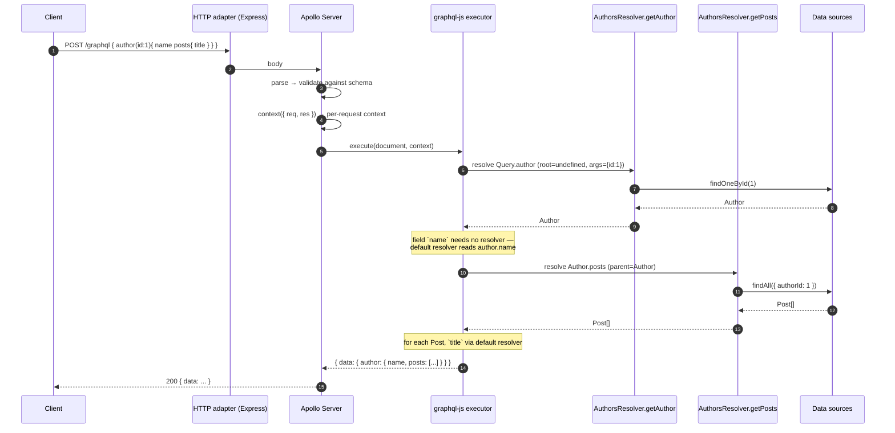

# Chapter 50 — GraphQL I: Code First, Schema First, and Resolvers

> **한눈에 보기**
> GraphQL은 "더 좋은 REST"가 아니라 **다른 트레이드오프**입니다. 클라이언트가 응답의 모양을
> 결정하는 대가로 서버는 HTTP 캐시, 예측 가능한 쿼리 수, 단순한 라우팅을 내놓습니다.
> 이 장은 `@nestjs/graphql`이 데코레이터 메타데이터를 어떻게 실행 가능한 **리졸버 맵**으로
> 바꾸는지를 부트스트랩 순서까지 따라가며 설명하고, code first와 schema first를 나란히
> 비교한 뒤 하나를 권고합니다. 그리고 모든 GraphQL API가 결국 마주치는 N+1 문제를
> DataLoader로 끝까지 해결합니다. 45~49장의 마이크로서비스가 "서버 간" 통신이었다면,
> 이 장부터 세 장은 "브라우저와 서버 사이"의 가장 표현력 높은 계약을 다룹니다.

**What you will learn**

- What GraphQL actually buys you and what it actually costs — stated as concrete engineering bills (HTTP caching, N+1, unbounded query cost), not as marketing bullets.
- How `GraphQLModule.forRoot()` differs from every other Nest dynamic module: it does not just register providers, it *scans the whole application graph* at bootstrap and builds an executable schema from decorator metadata.
- Every meaningful `ApolloDriverConfig` option — `autoSchemaFile`, `sortSchema`, `typePaths`, `definitions`, `context`, `formatError`, `path`, `include`, `buildSchemaOptions`, `csrfPrevention`, `introspection`, `graphiql` — and which of them you must change before production.
- How to choose between code first and schema first with an honest comparison, and why this book recommends code first for most Nest teams.
- How `@Resolver()`, `@Query()`, `@ResolveField()` and `@Parent()` compose into a resolver map, and why the argument to `@Resolver()` is load-bearing the moment you write your first field resolver.
- How to build generic base resolvers and paginated types with TypeScript generics — abstractions that would be copy-paste in SDL.
- How `GraphQLDefinitionsFactory` turns SDL into TypeScript, in watch mode, with custom scalar mappings.
- Why the CLI plugin exists, what it infers from the AST, and the two places it will bite you (file suffixes, and `ts-jest`).
- The N+1 problem — how it arises structurally from field resolvers, how to *see* it, and a complete request-scoped DataLoader implementation that fixes it.

**Why this matters**

Here is a bug report you will eventually receive. "The authors page got slow." Nobody deployed anything. The query the frontend sends looks harmless:

```graphql
query {
  authors(limit: 50) {
    id
    name
    posts { id title }
  }
}
```

Your logs show 51 database queries for one HTTP request: one for the authors, then one per author for their posts. Nobody wrote a loop. The loop is *structural* — GraphQL resolves fields, and a field resolver that runs once per parent object runs fifty times when the parent list has fifty items. Add `posts { comments { author { name } } }` and you are at 2,551 queries. This is the N+1 problem, and it is not an edge case; it is the default behavior of every naive GraphQL server ever written. The last third of this chapter exists to kill it.

The second thing that surprises teams migrating from REST is that your CDN stops working. A REST endpoint `GET /authors/42` is a URL: Varnish caches it, the browser caches it, Cloudflare caches it, and a conditional request with `ETag` costs you 0 bytes of database. A GraphQL request is `POST /graphql` with a body — one URL for your entire API, unCacheable by any HTTP intermediary, with cache invalidation pushed down into your application as a normalized client cache (Apollo Client, urql) plus whatever you build server-side. You are not eliminating that work; you are *relocating* it, from infrastructure you get for free to code you must write.

So why do it anyway? Because the alternative bill is also real. Every REST API of nontrivial size eventually grows `?include=posts,comments`, `?fields=id,name`, three "views" of the same resource for three clients, and a mobile team asking for a compound endpoint because six round-trips on 3G is unusable. GraphQL replaces that ad-hoc query language — which you were going to invent badly — with a typed, introspectable, standardized one. The schema becomes a genuine contract: a machine-readable document that tools verify, that generates client types, and that a CI job can check for breaking changes. That is worth a great deal on a team with more than one frontend.

Nest's contribution is narrower than it looks, and worth stating precisely: `@nestjs/graphql` does not implement GraphQL. Apollo Server, Mercurius, or Yoga executes queries; `graphql-js` validates them. What Nest provides is (a) a driver abstraction so the executor is swappable, (b) a **schema builder** that turns TypeScript decorator metadata into a `GraphQLSchema` at bootstrap, and (c) the wiring that makes your resolvers ordinary providers, so DI, guards, interceptors, and pipes work exactly as they do in a controller. Understanding which layer owns which behavior is what lets you debug the thing when it misbehaves.

---

## GraphQL versus REST, honestly

Skip this section only if you have already made the decision and lost the argument. Otherwise, here is the trade in full.

**What you gain.**

*The client specifies the response shape.* One `/graphql` endpoint serves a mobile client that wants three fields and a dashboard that wants forty, with no server change and no versioned endpoints. Over-fetching and under-fetching both go away by construction.

*One round trip for a graph.* "Give me the order, its line items, each item's product, and the customer's default address" is one request. In REST it is four to six, serialized by data dependencies.

*A typed, introspectable contract.* The schema is queryable at runtime (`__schema`). That single fact powers GraphiQL, client codegen (`graphql-codegen` produces exact TypeScript types for every operation), editor autocompletion inside `.graphql` template literals, and automated breaking-change detection in CI. REST gets some of this from OpenAPI ([Chapter 29](../part2-intermediate/29-openapi-fundamentals.md)), but OpenAPI is a document you maintain; a GraphQL schema is the executable itself.

*Field-level deprecation.* `@deprecated(reason: "...")` on one field, then watch analytics until usage hits zero, then delete it. Compare with versioning a whole REST resource because one field changed.

**What you pay.**

*HTTP caching, essentially in full.* Discussed above. Mitigations exist — persisted queries (send a hash instead of a document, which makes `GET` viable and CDN-cacheable), `@cacheControl` hints with Apollo's response cache — but they are opt-in work.

*N+1 by default.* Field resolvers are per-object. Without DataLoader or an equivalent, your resolver graph maps one-to-one onto a query storm.

*Unbounded query cost.* A REST endpoint has a cost you measured once. A GraphQL endpoint's cost is chosen by the caller, and a malicious or careless caller can write a deeply nested cyclic query (`author { posts { author { posts { ... } } } }`) that costs you the database. Depth limiting and complexity analysis are mandatory for a public graph, not optional. [Chapter 52](./52-graphql-advanced.md) builds them.

*Errors are not status codes.* GraphQL returns `200 OK` with an `errors` array, including for validation failures. Every monitor, alert, and load balancer health check you own that keys on status code goes blind. You must rewire observability around the response body.

*File upload, streaming, and binary payloads are awkward.* They need an out-of-spec multipart extension, and most teams end up keeping a REST endpoint for uploads anyway. That is fine — Nest happily serves both from one app.

*Operational surface.* Introspection, playgrounds, and stack traces in errors are all things you must remember to disable. The defaults are tuned for local development.

**The honest recommendation.** Use GraphQL when you have multiple heterogeneous clients consuming a genuinely graph-shaped domain and the client teams outnumber the backend teams. Use REST for machine-to-machine APIs, webhook receivers, file transfer, and anything where a CDN is doing real work for you. Use both in one Nest app when that is the right answer — the module system makes it cheap, and `@nestjs/graphql` shares models with your REST DTOs (see "Sharing models" below).

---

## Installing and wiring the module

Three moving parts: `@nestjs/graphql` (the schema builder and the decorators), a *driver* package, and the underlying server.

```bash
# Express + Apollo (the default combination in this book)
$ npm i @nestjs/graphql @nestjs/apollo @apollo/server @as-integrations/express5 graphql

# Fastify + Apollo
$ npm i @nestjs/graphql @nestjs/apollo @apollo/server @as-integrations/fastify graphql

# Fastify + Mercurius
$ npm i @nestjs/graphql @nestjs/mercurius graphql mercurius
```

Note `@as-integrations/express5`: Nest 11 defaults to Express 5, and Apollo's Express integration is version-specific. Installing the Express 4 integration against Nest 11 produces a bootstrap-time failure that reads like a middleware type error.

```typescript title="src/app.module.ts"
import { Module } from '@nestjs/common';
import { GraphQLModule } from '@nestjs/graphql';
import { ApolloDriver, ApolloDriverConfig } from '@nestjs/apollo';
import { join } from 'node:path';
import { AuthorsModule } from './authors/authors.module';
import { PostsModule } from './posts/posts.module';

@Module({
  imports: [
    GraphQLModule.forRoot<ApolloDriverConfig>({
      driver: ApolloDriver,
      autoSchemaFile: join(process.cwd(), 'src/schema.gql'),
      sortSchema: true,
      graphiql: true,
    }),
    AuthorsModule,
    PostsModule,
  ],
})
export class AppModule {}
```

The generic parameter is not decoration. `GqlModuleOptions` is a union across drivers; `<ApolloDriverConfig>` is what makes TypeScript accept `csrfPrevention` and reject Mercurius-only keys such as `subscription`. Get in the habit — a mistyped option object is otherwise silently ignored at runtime.

### The three drivers

| Driver | Package | Server | IDE | Federation | Notes |
|---|---|---|---|---|---|
| `ApolloDriver` | `@nestjs/apollo` | Apollo Server 4/5 | GraphiQL, Apollo Sandbox | Yes (`ApolloFederationDriver`) | The default. Largest plugin ecosystem. |
| `MercuriusDriver` | `@nestjs/mercurius` | Mercurius (Fastify) | GraphiQL (`graphiql: true`) | Federation 1 only | Fastify-only, JIT-compiles resolvers, fastest of the three. |
| Yoga (community) | `@graphql-yoga/nestjs` | GraphQL Yoga | GraphiQL | via `@graphql-yoga/nestjs-federation` | Envelop plugin system; smallest dependency footprint. |

The driver is a strategy object implementing `AbstractGraphQLDriver` with `start()` and `stop()`. Because it is an ordinary class, you can write your own — the pattern is covered in [Chapter 52](./52-graphql-advanced.md).

Mercurius, for the Fastify users of [Chapter 55](./55-performance-and-compilation.md):

```typescript
import { MercuriusDriver, MercuriusDriverConfig } from '@nestjs/mercurius';

GraphQLModule.forRoot<MercuriusDriverConfig>({
  driver: MercuriusDriver,
  autoSchemaFile: true,
  graphiql: true, // Mercurius ships no Playground; GraphiQL at /graphiql
});
```

### The options that matter

| Option | Type | Purpose / production advice |
|---|---|---|
| `driver` | class | Required. `ApolloDriver`, `MercuriusDriver`, … |
| `autoSchemaFile` | `string \| true \| { federation }` | **Code first.** Path to write generated SDL, or `true` for in-memory only. Commit the file — its diff is your breaking-change review. |
| `sortSchema` | `boolean` | Sort the generated SDL lexicographically. Without it, ordering follows module import order and every unrelated refactor produces schema diff noise. Set it to `true`. |
| `typePaths` | `string[]` | **Schema first.** Globs of `.graphql` files, merged in memory. |
| `definitions` | `{ path, outputAs, emitTypenameField, skipResolverArgs, enumsAsTypes, defaultScalarType, customScalarTypeMapping, additionalHeader }` | **Schema first.** Generates TypeScript from SDL at boot. Prefer the standalone script (below) in production. |
| `resolvers` | `object` | Raw resolver map merged into the generated one. The wiring point for custom scalars and schema-first enum internal values. |
| `playground` | `boolean \| object` | Legacy Apollo Playground. **Deprecated**; use `graphiql`. Must be `false` in production. |
| `graphiql` | `boolean` | Serve the GraphiQL IDE. Not compatible with `subscriptions-transport-ws`; use `graphql-ws`. |
| `introspection` | `boolean` | Allow `__schema` queries. Apollo disables it automatically when `NODE_ENV=production`; set it explicitly rather than relying on that. |
| `context` | `(ctx) => object` | Builds the per-request `context` object handed to every resolver. Where `req`, `res`, the authenticated user, and per-request DataLoaders live. |
| `formatError` | `(formattedError, error) => GraphQLFormattedError` | Last chance to shape what the client sees. Strip `extensions.stacktrace` here. |
| `path` | `string` | Endpoint path. Default `/graphql`. |
| `include` | `Module[]` | Restrict resolver scanning to these modules. The mechanism behind multiple endpoints. |
| `buildSchemaOptions` | `{ dateScalarMode, numberScalarMode, orphanedTypes, directives, fieldMiddleware, skipCheck }` | Options for the code-first schema factory. |
| `csrfPrevention` | `boolean \| object` | Apollo 4+ default `true`. Blocks simple cross-origin `POST`s unless `content-type: application/json` or `apollo-require-preflight`. |
| `subscriptions` | `{ 'graphql-ws'?, 'subscriptions-transport-ws'? }` | WebSocket transports. [Chapter 51](./51-graphql-types-and-operations.md). |
| `transformSchema` | `(schema) => schema` | Post-process the built schema. Where directive transformers attach. |
| `plugins` | `ApolloServerPlugin[]` | Apollo plugins. [Chapter 52](./52-graphql-advanced.md). |
| `fieldResolverEnhancers` | `('guards'\|'interceptors'\|'filters')[]` | Run enhancers on `@ResolveField()` too. Off by default for performance. |
| `inheritResolversFromInterfaces` | `boolean` | Required for interface field resolvers. [Chapter 51](./51-graphql-types-and-operations.md). |
| `metadata` | object | Precomputed CLI-plugin metadata, for SWC monorepo builds. |
| `disableHealthCheck` | `boolean` | Required when running multiple GraphQL endpoints on Fastify. |
| `installSubscriptionHandlers` | `boolean` | Legacy. Removed upstream; do not use. |

A production baseline, assembled:

```typescript title="src/app.module.ts"
GraphQLModule.forRootAsync<ApolloDriverConfig>({
  driver: ApolloDriver,
  imports: [ConfigModule],
  inject: [ConfigService],
  useFactory: (config: ConfigService) => ({
    autoSchemaFile: join(process.cwd(), 'src/schema.gql'),
    sortSchema: true,
    graphiql: config.get('NODE_ENV') !== 'production',
    introspection: config.get('NODE_ENV') !== 'production',
    csrfPrevention: true,
    path: '/graphql',
    context: ({ req, res }) => ({ req, res }),
    formatError: (formatted) => {
      const { stacktrace, ...extensions } = (formatted.extensions ?? {}) as Record<string, unknown>;
      return { ...formatted, extensions };
    },
  }),
});
```

`forRootAsync` accepts the same four shapes as every other Nest dynamic module — `useFactory`, `useClass` (implementing `GqlOptionsFactory` with a `createGqlOptions()` method), `useExisting`, and plain `imports`/`inject` — exactly as described in [Chapter 37](./37-dynamic-modules.md).

### What forRoot actually does at bootstrap

This is the part the docs never spell out, and it explains most surprising behavior.

1. `GraphQLModule` is registered like any dynamic module. Nothing GraphQL-specific has happened yet.
2. On `onModuleInit`, the module resolves its driver and asks the `GraphQLFactory` for a schema.
3. In **code first**, the factory uses `DiscoveryService` ([Chapter 41](./41-module-ref-discovery-lazy.md)) to walk *every* provider in *every* module — unless you passed `include` — collecting classes carrying `@Resolver()` metadata, plus the `@ObjectType()`/`@InputType()`/`@ArgsType()`/`@InterfaceType()` classes those resolvers reference through their type functions. From that metadata it constructs a `GraphQLSchema` object in memory, and writes SDL to `autoSchemaFile` if set.
4. In **schema first**, it reads and merges `typePaths` into an SDL document, then attaches your `@Resolver()` methods to it by name.
5. `transformSchema` runs. The driver starts the server and mounts it on the HTTP adapter at `path`.

Three consequences follow directly.

*A type nothing references does not appear in the schema.* Declaring `@ObjectType() class Audit {}` and never returning it from a resolver or a field means it is invisible. That is what `buildSchemaOptions.orphanedTypes` is for.

*A resolver in a module nobody imports does not exist.* Discovery walks the module graph. An unimported module is not in the graph.

*The schema is built once, at boot.* There is no per-request schema. Anything you want the schema to know must be knowable at bootstrap time.

### Multiple endpoints, and getting the schema in tests

`include` narrows the scan, which lets one application serve several independent graphs — a public one and an internal admin one, for example:

```typescript
imports: [
  GraphQLModule.forRoot<ApolloDriverConfig>({
    driver: ApolloDriver,
    include: [PublicModule],
    path: '/graphql',
    autoSchemaFile: 'src/public.gql',
  }),
  GraphQLModule.forRoot<ApolloDriverConfig>({
    driver: ApolloDriver,
    include: [AdminModule],
    path: '/admin/graphql',
    autoSchemaFile: 'src/admin.gql',
  }),
],
```

> **⚠️ Notice** — On Fastify with `@as-integrations/fastify`, multiple GraphQL endpoints in one app require `disableHealthCheck: true`; otherwise both instances try to register the same health route and Fastify refuses to boot.

For end-to-end tests, grab the built schema and execute against it directly, with no HTTP listener at all:

```typescript
import { GraphQLSchemaHost } from '@nestjs/graphql';
import { graphql } from 'graphql';

const { schema } = app.get(GraphQLSchemaHost); // only valid after app.init()
const result = await graphql({ schema, source: '{ authors { id name } }' });
```

The getter throws before initialization — the schema does not exist until `onModuleInit` has run, so call `app.init()` (or `app.listen()`) first. See [Chapter 31](../part2-intermediate/31-testing.md) for the surrounding test harness.

You can also generate SDL with no application at all, using `GraphQLSchemaBuilderModule` — useful as a CI step or a `package.json` script that keeps a checked-in schema honest:

```typescript title="scripts/generate-schema.ts"
import { NestFactory } from '@nestjs/core';
import { GraphQLSchemaBuilderModule, GraphQLSchemaFactory } from '@nestjs/graphql';
import { printSchema } from 'graphql';
import { AuthorsResolver } from '../src/authors/authors.resolver';
import { PostsResolver } from '../src/posts/posts.resolver';
import { DateScalar } from '../src/common/date.scalar';

async function generateSchema() {
  const app = await NestFactory.create(GraphQLSchemaBuilderModule, { logger: false });
  await app.init();

  const factory = app.get(GraphQLSchemaFactory);
  const schema = await factory.create(
    [AuthorsResolver, PostsResolver], // resolver classes
    [DateScalar],                     // optional: scalar classes
    { skipCheck: false, orphanedTypes: [] },
  );
  console.log(printSchema(schema));
  await app.close();
}
generateSchema();
```

`skipCheck: true` suppresses schema validation (useful while iterating on a partial schema); `orphanedTypes` forces generation of classes nothing references. No database, no HTTP, no resolvers actually executing — just the type metadata.

---

## Code first or schema first: choose once

This decision shapes every file you write for the next three chapters, so make it deliberately.

| | **Code first** | **Schema first** |
|---|---|---|
| Source of truth | TypeScript classes + decorators | `.graphql` SDL files |
| Schema is | *generated* from code | *authored*, then code conforms |
| Types stay in sync | By construction — one definition | By generation — `definitions` produces TS from SDL |
| Reviewing schema changes | Read the `schema.gql` diff (commit it!) | Read the SDL diff directly |
| Non-TypeScript consumers | Need the generated file | Native — SDL is language-agnostic |
| Schema-first design workflow | Awkward; you write TS to shape SDL | Natural; design SDL, then implement |
| Custom directives | `@Directive('@upper')`, **absent from the generated SDL file** | Written directly in SDL, always visible |
| Refactoring | Rename in the IDE; schema follows | Rename in two places; drift is possible |
| Union / interface resolution | Works from class instances automatically | You write `__resolveType` by hand |
| Mapped types (`PartialType`, …) | Supported | **Not supported** — no code to map |
| CLI plugin (less boilerplate) | Supported | Not applicable |
| Federation | Both supported | Both supported |
| Learning curve | Decorator soup at first | Two languages, two files per concept |

**The recommendation: use code first**, unless a specific condition forces otherwise.

The reason is drift. Schema first has exactly one source of truth *for the schema*, but two for the *implementation* — the SDL and the resolver methods that must match it by name and shape. Nest cannot check that correspondence at compile time; you find out at boot, or worse, when a field silently returns `null` because a resolver method was named `getPosts` while the SDL says `posts` and you forgot `@ResolveField('posts')`. Code first collapses the two into one artifact that the TypeScript compiler checks. You give up authoring SDL by hand, and get it back as a generated file you commit and review.

Choose schema first when: a schema design team owns the contract and hands it to multiple language implementations; you are adopting an existing SDL you do not control; or your organization runs schema linting and registry tooling that consumes SDL as input rather than output.

Both approaches are shown throughout these three chapters, because you will read both in real codebases.

---

## Code-first object types

An object type is a TypeScript class decorated with `@ObjectType()`, whose exposed fields carry `@Field()`.

```typescript title="src/authors/models/author.model.ts"
import { Field, Int, ID, ObjectType } from '@nestjs/graphql';
import { Post } from '../../posts/models/post.model';

@ObjectType({ description: 'A person who writes posts' })
export class Author {
  @Field(() => ID)
  id: number;

  @Field({ nullable: true })
  firstName?: string;

  @Field({ nullable: true })
  lastName?: string;

  @Field(() => Int, { description: 'Number of published posts' })
  postCount: number;

  @Field(() => [Post])
  posts: Post[];

  // No @Field(): present on the class, absent from the schema.
  passwordHash: string;
}
```

Which generates:

```graphql
"""A person who writes posts"""
type Author {
  id: ID!
  firstName: String
  lastName: String
  """Number of published posts"""
  postCount: Int!
  posts: [Post!]!
}
```

Note what did *not* happen: `passwordHash` is not in the schema. `@Field()` is an allow-list, and that is a security property worth internalizing — code first fails closed. (Serialization interceptors, [Chapter 16](../part2-intermediate/16-serialization.md), are a separate mechanism and not needed here.)

### The type function, and why it is not optional

`@Field()` takes an optional *type function* — `() => Int`, `() => [Post]` — and an options object. The type function exists because TypeScript's `emitDecoratorMetadata` cannot express GraphQL's type system:

- `string` → `String`, `boolean` → `Boolean`: unambiguous, function optional.
- `number` → `Int` or `Float`? **Ambiguous.** The function is required.
- `Post[]` → reflected metadata is just `Array`. The element type is erased. **Required.**
- `Date` → maps to `GraphQLISODateTime` by default; explicit is better.
- Optionality (`firstName?`) is invisible to reflection. You must say `nullable: true`.

Forgetting the type function on a `number` produces `Float` where you meant `Int`; forgetting it on an array produces a boot-time error that reads *"Undefined type error. Make sure you are providing an explicit type for the 'posts' … "*. The [CLI plugin](#the-graphql-cli-plugin) removes most of this ceremony by reading the AST at compile time — but understand the manual form first, because the plugin is opt-in and you will read code without it.

### `@Field()` options

| Option | Type | Effect |
|---|---|---|
| `nullable` | `boolean \| 'items' \| 'itemsAndList'` | Fields are **non-null by default** in `@nestjs/graphql` — the inverse of GraphQL's own default. `true` → `String`; `'items'` → `[Post]!` (list required, items nullable); `'itemsAndList'` → `[Post]`. |
| `description` | `string` | Becomes an SDL docstring, visible in GraphiQL. |
| `deprecationReason` | `string` | Emits `@deprecated(reason: "…")`. |
| `defaultValue` | `any` | Default for input fields and arguments. |
| `name` | `string` | Decouple the schema field name from the property name. |
| `complexity` | `number \| fn` | Cost for query-complexity analysis ([Chapter 52](./52-graphql-advanced.md)). |
| `middleware` | `FieldMiddleware[]` | Field middleware chain ([Chapter 52](./52-graphql-advanced.md)). |

Nesting brackets expresses depth: `() => [[Int]]` is an integer matrix. `@ObjectType()` itself accepts `description`, `implements`, and `isAbstract` (suppresses SDL generation — used for generic base classes).

### Class inheritance

Ordinary TypeScript inheritance works, and it is the cheapest abstraction in the code-first toolkit:

```typescript
@ObjectType({ isAbstract: true })
abstract class Node {
  @Field(() => ID)
  id: string;

  @Field()
  createdAt: Date;
}

@ObjectType()
export class Author extends Node {
  @Field()
  name: string;
}
```

`isAbstract: true` tells the factory not to emit `Node` as a standalone type; its fields are copied into every subclass. This is *not* a GraphQL interface — for that, see `@InterfaceType()` in [Chapter 51](./51-graphql-types-and-operations.md).

---

## Arguments: `@Args`, `@InputType`, and `@ArgsType`

Arguments arrive through `@Args()`, which behaves like `@Param()`/`@Query()` in a controller ([Chapter 3](../part1-beginner/03-controllers-routing.md)) but feeds a typed schema.

The simplest form plucks one named argument:

```typescript
@Query(() => Author, { nullable: true })
author(@Args('id', { type: () => Int }) id: number) {
  return this.authorsService.findOneById(id);
}
```

`@Args()` options are `type`, `defaultValue`, `description`, `deprecationReason`, and `nullable`. Multiple calls are fine:

```typescript
@Query(() => [Author])
searchAuthors(
  @Args('firstName', { nullable: true }) firstName?: string,
  @Args('lastName', { defaultValue: '' }) lastName?: string,
) { /* … */ }
```

> **Hint** — A nullable GraphQL argument can arrive as `null` *or* `undefined`. TypeScript's `?` does not protect you; guard both in the resolver body.

### Three type kinds, three decorators

This is the distinction people get wrong most often:

| Decorator | GraphQL construct | Used for | Can be a return type? |
|---|---|---|---|
| `@ObjectType()` | `type X { … }` | Output | Yes |
| `@InputType()` | `input X { … }` | A single structured argument | **No** |
| `@ArgsType()` | *(inlined)* | A *bag of arguments* flattened into the field | No |

GraphQL keeps input and output types strictly separate — an `input` cannot contain an `interface`, a `union`, or an output type, and no type may be both. Trying to pass an `@ObjectType()` as an argument produces `Input Object type ... must define one or more fields` or a hard "cannot use output type as input" error at boot. Write a separate `@InputType()` even when the fields look identical; `PartialType`/`PickType` from `@nestjs/graphql` ([Chapter 51](./51-graphql-types-and-operations.md)) make that cheap.

`@InputType()` becomes one named argument:

```typescript title="src/authors/dto/create-author.input.ts"
import { Field, InputType } from '@nestjs/graphql';
import { IsEmail, MinLength } from 'class-validator';

@InputType({ description: 'Payload for creating an author' })
export class CreateAuthorInput {
  @Field()
  @MinLength(2)
  firstName: string;

  @Field()
  @MinLength(2)
  lastName: string;

  @Field()
  @IsEmail()
  email: string;
}
```

```typescript
@Mutation(() => Author)
createAuthor(@Args('input') input: CreateAuthorInput) { /* … */ }
// → createAuthor(input: CreateAuthorInput!): Author!
```

`@ArgsType()` is *flattened* into the field signature instead:

```typescript title="src/authors/dto/get-authors.args.ts"
import { ArgsType, Field, Int } from '@nestjs/graphql';
import { Max, Min, MinLength } from 'class-validator';

@ArgsType()
export class PaginationArgs {
  @Field(() => Int, { defaultValue: 0 })
  @Min(0)
  offset: number = 0;

  @Field(() => Int, { defaultValue: 10 })
  @Min(1) @Max(100)
  limit: number = 10;
}

@ArgsType()
export class GetAuthorsArgs extends PaginationArgs {
  @Field({ nullable: true })
  firstName?: string;

  @Field({ defaultValue: '' })
  @MinLength(3)
  lastName: string;
}
```

```typescript
@Query(() => [Author])
authors(@Args() args: GetAuthorsArgs) { /* … */ }
// → authors(offset: Int! = 0, limit: Int! = 10, firstName: String, lastName: String! = ""): [Author!]!
```

Note `@Args()` with no name. Inheritance gives you a reusable `PaginationArgs` that composes into every list query — the thing you would copy-paste in SDL.

Both `@InputType` and `@ArgsType` classes work with `ValidationPipe` exactly as REST DTOs do ([Chapter 15](../part2-intermediate/15-validation-in-depth.md)); register it globally and `class-validator` decorators are enforced before your resolver runs.

### Built-in scalar wrappers

`Int`, `Float`, and `ID` are exported from `@nestjs/graphql` as aliases for `GraphQLInt`, `GraphQLFloat`, and `GraphQLID`. Use `ID` for anything a client treats as an opaque key — it serializes as a string, which spares you the day someone's `id` exceeds 2^31 and `Int` overflows. Two global switches live in `buildSchemaOptions`: `dateScalarMode: 'timestamp'` maps `Date` to `GraphQLTimestamp` instead of `GraphQLISODateTime`, and `numberScalarMode: 'integer'` makes bare `number` default to `Int` instead of `Float`. Custom scalars are [Chapter 51](./51-graphql-types-and-operations.md).

---

## Resolvers

A resolver class is an ordinary Nest provider. Constructor injection, scopes, guards, and interceptors behave exactly as in a controller — a resolver *is* the GraphQL analogue of a controller.

```typescript title="src/authors/authors.resolver.ts"
import { Args, Int, Parent, Query, ResolveField, Resolver } from '@nestjs/graphql';
import { Author } from './models/author.model';
import { Post } from '../posts/models/post.model';
import { AuthorsService } from './authors.service';
import { PostsService } from '../posts/posts.service';

@Resolver(() => Author)
export class AuthorsResolver {
  constructor(
    private readonly authorsService: AuthorsService,
    private readonly postsService: PostsService,
  ) {}

  @Query(() => Author, { name: 'author', nullable: true })
  async getAuthor(@Args('id', { type: () => Int }) id: number) {
    return this.authorsService.findOneById(id);
  }

  @ResolveField('posts', () => [Post])
  async getPosts(@Parent() author: Author) {
    return this.postsService.findAll({ authorId: author.id });
  }
}
```

Register it as a provider, in a module that is reachable from the root:

```typescript title="src/authors/authors.module.ts"
@Module({
  imports: [PostsModule],
  providers: [AuthorsService, AuthorsResolver],
})
export class AuthorsModule {}
```

Four things are happening here that deserve to be named.

**`@Query()` generates the `Query` type.** There is no central `Query` class. Every `@Query()` across every resolver in every module is merged into one `type Query`. That is what lets you keep queries next to the models and services they use.

**Method name ≠ schema name.** `@Query(() => Author, { name: 'author' })` on a method called `getAuthor` yields `author(id: Int!): Author`. Decouple them; internal naming conventions should not leak into your public contract. `@Query()` options are `name`, `description`, `deprecationReason`, `nullable`, and `complexity`.

**The `@Resolver(() => Author)` argument is load-bearing.** It declares the *parent type* for every `@ResolveField()` in the class. Without it Nest cannot know which type `posts` belongs to, and you get `Cannot determine a GraphQL output type for the "posts"` at boot. It does not affect `@Query()` or `@Mutation()` — those are always attached to the root types.

**`@ResolveField()` splits resolution across sources.** `Author.posts` is not populated by the query resolver; it is resolved lazily, per author object, only when the client asks for it. That is GraphQL's central mechanism — and the source of N+1, which we come to shortly.

### The parameter decorators

| Nest decorator | GraphQL resolver argument | What it holds |
|---|---|---|
| `@Root()` / `@Parent()` | `root` / `parent` | The value returned by the parent field's resolver. For a root `Query` field, the server's `rootValue`. The two decorators are aliases. |
| `@Args(param?, ...pipes)` | `args` / `args[param]` | Arguments for this field. No argument → the whole args object (or an `@ArgsType()` instance). |
| `@Context(param?)` | `context` / `context[param]` | Per-request state, built by the `context` factory. `req`, `res`, `user`, DataLoaders. |
| `@Info(param?)` | `info` / `info[param]` | Execution state: `fieldName`, `parentType`, `path`, `fieldNodes`, `schema`, `variableValues`. |

`@Info()` is the escape hatch that makes real optimization possible. `info.fieldNodes` is the AST of the current selection set — you can inspect it to decide whether a JOIN is worth doing:

```typescript
import { GraphQLResolveInfo } from 'graphql';

@Query(() => [Author])
async authors(@Info() info: GraphQLResolveInfo) {
  const selections = info.fieldNodes[0].selectionSet?.selections ?? [];
  const wantsPosts = selections.some(
    (s) => s.kind === 'Field' && s.name.value === 'posts',
  );
  // Eager-load only when the client actually asked for the relation.
  return this.authorsService.findAll({ relations: wantsPosts ? ['posts'] : [] });
}
```

That is a legitimate technique, and libraries such as `graphql-parse-resolve-info` package it. Reach for it when a relation is cheap to JOIN and expensive to batch; reach for DataLoader otherwise.

`@Context()` is where per-request state lives, because GraphQL resolvers are not request-scoped by default. Making a resolver `Scope.REQUEST` ([Chapter 38](./38-injection-scopes.md)) works but instantiates the whole dependency subtree per request — significant overhead when field resolvers fire hundreds of times. The context object is the cheap alternative:

```typescript
GraphQLModule.forRoot<ApolloDriverConfig>({
  driver: ApolloDriver,
  context: ({ req, res }) => ({
    req,
    res,
    loaders: createLoaders(),   // fresh DataLoaders per request — see below
  }),
});
```

### How a query walks the resolver graph



Two facts to carry away. First, **the default resolver**: for any field with no `@ResolveField()`, `graphql-js` simply reads the property of the parent object. That is why `Author.name` needs no code. Second, **fields at the same level resolve concurrently** — `graphql-js` does not await one sibling before starting the next. Your resolvers must be safe under concurrency, and a shared mutable object on `context` is a race waiting to happen.

### Resolver inheritance and generic base resolvers

Because resolvers are classes, you can factor common operations into a generic base — an abstraction schema first cannot express at all:

```typescript title="src/common/base.resolver.ts"
import { Type } from '@nestjs/common';
import { Args, ID, Query, Resolver } from '@nestjs/graphql';

export interface IBaseResolver<T> {
  findAll(): Promise<T[]>;
  findOne(id: string): Promise<T | null>;
}

export function BaseResolver<T extends Type<unknown>>(classRef: T): any {
  @Resolver({ isAbstract: true })
  abstract class BaseResolverHost {
    @Query(() => [classRef], { name: `findAll${classRef.name}` })
    async findAll(): Promise<T[]> {
      return [];
    }

    @Query(() => classRef, { name: `findOne${classRef.name}`, nullable: true })
    async findOne(@Args('id', { type: () => ID }) id: string): Promise<T | null> {
      return null;
    }
  }
  return BaseResolverHost;
}
```

```typescript
@Resolver(() => Recipe)
export class RecipesResolver extends BaseResolver(Recipe) {
  constructor(private readonly recipesService: RecipesService) {
    super();
  }

  // Override with the real implementation
  async findAll(): Promise<Recipe[]> {
    return this.recipesService.findAll();
  }
}
```

```graphql
type Query {
  findAllRecipe: [Recipe!]!
  findOneRecipe(id: ID!): Recipe
}
```

Three rules make this work. `@Resolver({ isAbstract: true })` suppresses SDL generation for the host class — without it the factory tries to emit the abstract class and fails. The explicit return type (`any`, or better, a declared interface) is required, or TypeScript complains about using a private class definition in an exported signature. And `super()` must be called, as in any subclass.

The same generic trick builds Relay-style pagination types once:

```typescript title="src/common/paginated.ts"
import { Type } from '@nestjs/common';
import { Field, Int, ObjectType } from '@nestjs/graphql';

interface IEdgeType<T> { cursor: string; node: T }
export interface IPaginatedType<T> {
  edges: IEdgeType<T>[];
  nodes: T[];
  totalCount: number;
  hasNextPage: boolean;
}

export function Paginated<T>(classRef: Type<T>): Type<IPaginatedType<T>> {
  @ObjectType(`${classRef.name}Edge`)
  abstract class EdgeType {
    @Field(() => String) cursor: string;
    @Field(() => classRef) node: T;
  }

  @ObjectType({ isAbstract: true })
  abstract class PaginatedType implements IPaginatedType<T> {
    @Field(() => [EdgeType], { nullable: true }) edges: EdgeType[];
    @Field(() => [classRef], { nullable: true }) nodes: T[];
    @Field(() => Int) totalCount: number;
    @Field() hasNextPage: boolean;
  }
  return PaginatedType as Type<IPaginatedType<T>>;
}

@ObjectType()
export class PaginatedAuthor extends Paginated(Author) {}
```

Note `@ObjectType(\`${classRef.name}Edge\`)`: GraphQL type names must be unique across the schema, so the edge type is named dynamically. Forget that and the second `Paginated(...)` call collides with the first.

---

## Schema first: SDL plus generated typings

In the schema-first approach the `.graphql` files are the truth.

```graphql title="src/authors/authors.graphql"
type Author {
  id: Int!
  firstName: String
  lastName: String
  posts: [Post]
}

type Post {
  id: Int!
  title: String!
  votes: Int
}

type Query {
  author(id: Int!): Author
}
```

```typescript
GraphQLModule.forRoot<ApolloDriverConfig>({
  driver: ApolloDriver,
  typePaths: ['./**/*.graphql'],
});
```

The resolver mirrors the code-first shape, but the decorators take **strings** instead of type functions:

```typescript title="src/authors/authors.resolver.ts"
@Resolver('Author')
export class AuthorsResolver {
  constructor(
    private readonly authorsService: AuthorsService,
    private readonly postsService: PostsService,
  ) {}

  @Query('author')
  async getAuthor(@Args('id') id: number) {
    return this.authorsService.findOneById(id);
  }

  @ResolveField('posts')
  async getPosts(@Parent() author) {
    return this.postsService.findAll({ authorId: author.id });
  }
}
```

`@Resolver('Author')` names the parent type for the field resolvers. It can alternatively be applied per method — but then *every* `@ResolveField()` method needs its own `@Resolver()`, which costs extra metadata and is not the recommended style. Method-level `@Resolver()` is **not supported in code first at all**.

### Generating TypeScript from SDL

Hand-writing the TypeScript counterparts of your SDL is exactly the duplication schema first was supposed to avoid, so let Nest generate them from the AST:

```typescript
GraphQLModule.forRoot<ApolloDriverConfig>({
  driver: ApolloDriver,
  typePaths: ['./**/*.graphql'],
  definitions: {
    path: join(process.cwd(), 'src/graphql.ts'),
    outputAs: 'class',
  },
});
```

Output:

```typescript title="src/graphql.ts (generated)"
export class Author {
  id: number;
  firstName?: string;
  lastName?: string;
  posts?: Post[];
}

export abstract class IQuery {
  abstract author(id: number): Author | Promise<Author>;
}
```

`outputAs: 'class'` (instead of the default `'interface'`) matters: classes can carry `class-validator` decorators, so validation works the same way it does in REST. But **never edit the generated file** — it is rewritten on every boot. Extend it instead:

```typescript title="src/posts/dto/create-post.input.ts"
import { MinLength, MaxLength } from 'class-validator';
import { CreatePostInput as GeneratedCreatePostInput } from '../../graphql';

export class CreatePostInput extends GeneratedCreatePostInput {
  @MinLength(3)
  @MaxLength(50)
  title: string;
}
```

Generating on every boot is convenient in development and wasteful in production. Prefer a standalone script using `GraphQLDefinitionsFactory`, run as an npm script and committed:

```typescript title="scripts/generate-typings.ts"
import { GraphQLDefinitionsFactory } from '@nestjs/graphql';
import { join } from 'node:path';

const definitionsFactory = new GraphQLDefinitionsFactory();

definitionsFactory.generate({
  typePaths: ['./src/**/*.graphql'],
  path: join(process.cwd(), 'src/graphql.ts'),
  outputAs: 'class',
  watch: true,               // regenerate on any .graphql change
  emitTypenameField: true,   // add __typename to every object type
  skipResolverArgs: false,   // true → resolvers become plain fields, no args
  enumsAsTypes: false,       // true → union types instead of TS enums
  defaultScalarType: 'unknown',
  customScalarTypeMapping: {
    DateTime: 'Date',
    BigNumber: '_BigNumber',
  },
  additionalHeader: "import _BigNumber from 'bignumber.js';",
});
```

```bash
$ ts-node scripts/generate-typings.ts
```

The scalar options are the ones people discover too late. By default *every* custom scalar generates as `any`, which quietly destroys type safety across your whole schema. `defaultScalarType: 'unknown'` makes unmapped scalars force an explicit narrowing at the use site; `customScalarTypeMapping` names the real types; `additionalHeader` injects the imports those types need. Given:

```graphql
scalar DateTime
scalar BigNumber
scalar Payload
```

you get:

```typescript
import _BigNumber from 'bignumber.js';

export type DateTime = Date;
export type BigNumber = _BigNumber;
export type Payload = unknown;
```

> **Hint** — `customScalarTypeMapping` also accepts a type reference (`DateTime: Date`), from which the factory reads `.name`. The alias `_BigNumber` in the import is deliberate: importing `BigNumber` under its own name would create a circular type reference with the generated `export type BigNumber`.

---

## The GraphQL CLI plugin

> **⚠️ Notice** — Code first only. There is nothing for it to do in schema first.

The plugin is a TypeScript AST transformer that runs during compilation and writes the decorators you would otherwise write by hand. It:

- annotates every property of `@ObjectType()`, `@InputType()`, and `@ArgsType()` classes with `@Field()`, unless marked `@HideField()`;
- sets `nullable` from the question mark — `name?: string` becomes `nullable: true`;
- sets the GraphQL type from the TypeScript type, including arrays;
- with `introspectComments: true`, turns JSDoc comments into schema descriptions.

Before:

```typescript title="src/authors/models/author.model.ts"
@ObjectType()
export class Author {
  @Field(() => ID)
  id: number;

  @Field({ nullable: true })
  firstName?: string;

  @Field({ nullable: true })
  lastName?: string;

  @Field(() => [Post])
  posts: Post[];
}
```

After:

```typescript title="src/authors/models/author.model.ts"
@ObjectType()
export class Author {
  @Field(() => ID)
  id: number;

  /** The author's given name */
  firstName?: string;

  lastName?: string;

  posts: Post[];
}
```

Both compile to the same schema, and with `introspectComments` the JSDoc becomes `"""The author's given name"""` in SDL — one place to write documentation instead of two.

Enable it in `nest-cli.json`:

```json title="nest-cli.json"
{
  "collection": "@nestjs/schematics",
  "sourceRoot": "src",
  "compilerOptions": {
    "plugins": [
      {
        "name": "@nestjs/graphql",
        "options": {
          "typeFileNameSuffix": [".input.ts", ".args.ts", ".entity.ts", ".model.ts"],
          "introspectComments": true
        }
      }
    ]
  }
}
```

| Option | Default | Meaning |
|---|---|---|
| `typeFileNameSuffix` | `['.input.ts', '.args.ts', '.entity.ts', '.model.ts']` | Only files with these suffixes are analyzed. |
| `introspectComments` | `false` | Generate `description` from JSDoc comments. |

**The suffix rule is the number one source of confusion.** Name a model `author.ts` instead of `author.model.ts` and the plugin skips it entirely; you get `Object type Author must define one or more fields` at boot, with nothing in the file to suggest why. Either follow the convention or extend `typeFileNameSuffix`.

For a custom webpack build with `ts-loader`:

```javascript title="webpack.config.js"
getCustomTransformers: (program) => ({
  before: [require('@nestjs/graphql/plugin').before({}, program)],
}),
```

With the SWC builder, the plugin needs type information, so enable type checking:

```bash
$ nest start -b swc --type-check
```

In a monorepo, generate the metadata ahead of time and hand it to the module:

```bash
$ npx ts-node src/generate-metadata.ts
```

```typescript
import metadata from './metadata'; // generated by PluginMetadataGenerator

GraphQLModule.forRoot<ApolloDriverConfig>({
  driver: ApolloDriver,
  autoSchemaFile: true,
  metadata,
});
```

**The second gotcha is `ts-jest`.** Jest compiles with its own transformer pipeline and never loads the plugin, so e2e tests fail with `Object type <name> must define one or more fields` while `npm start` works fine. Register the transformer in Jest too:

```javascript title="test/graphql-transformer.js"
const transformer = require('@nestjs/graphql/plugin');

module.exports.name = 'nestjs-graphql-transformer';
// bump this whenever you change the options below, or jest will reuse its cache
module.exports.version = 1;

module.exports.factory = (cs) =>
  transformer.before({ /* plugin options */ }, cs.program);
```

```json title="test/jest-e2e.json"
{
  "transform": {
    "^.+\\.(t|j)s$": [
      "ts-jest",
      { "astTransformers": { "before": ["<rootDir>/graphql-transformer.js"] } }
    ]
  }
}
```

(On Jest ≤ 27, use `cs.tsCompiler.program`; the deprecated `globals.ts-jest` form still appears in older projects.)

---

## Sharing models with a TypeScript frontend

> **⚠️ Notice** — Code first only.

The appeal of a shared package of model classes between backend and browser is obvious. The problem is that code-first models are covered in `@nestjs/graphql` decorators, which drag the whole GraphQL runtime into your bundle for zero frontend benefit.

Nest ships an inert shim that replaces every decorator with a no-op. Alias the package in your bundler:

```javascript title="webpack.config.js (frontend)"
const path = require('path');

module.exports = {
  resolve: {
    alias: {
      '@nestjs/graphql': path.resolve(
        __dirname,
        '../node_modules/@nestjs/graphql/dist/extra/graphql-model-shim',
      ),
    },
  },
};
```

The equivalent in Vite is `resolve.alias`; in tsconfig-path-based setups, a `paths` entry. TypeORM ships the same trick for entity classes.

That said: for the client's *operation* types, prefer `graphql-codegen` pointed at your committed `schema.gql`. It produces exact result types per query, including selection sets — strictly better than reusing whole server models, which describe what *could* be fetched rather than what *was*.

---

## The N+1 problem, and DataLoader

Now the important part.

### How it arises

Take the resolvers from earlier and add a list query:

```typescript
@Query(() => [Author])
authors() {
  return this.authorsService.findAll();     // 1 query
}

@ResolveField('posts', () => [Post])
posts(@Parent() author: Author) {
  return this.postsService.findAll({ authorId: author.id });   // 1 query per author
}
```

```graphql
query { authors { name posts { title } } }
```

With 50 authors: 1 + 50 = 51 queries. Add a `Post.author` field resolver and ask for `posts { author { name } }` beneath that, and you multiply again. Nothing is wrong with the code — this is the direct consequence of resolving fields per object. And the executor makes it worse in a helpful way: because siblings resolve concurrently, all 50 queries hit the database *at once*, so the symptom is a connection-pool spike rather than a slow serial trickle.

You will not notice in development with three seeded rows. You will notice in production.

### Seeing it

Before optimizing, measure. Turn on ORM query logging in development and count per request ([Chapter 18](../part2-intermediate/18-logging.md) for structured logging, [Chapter 56](./56-observability.md) for tracing):

```typescript
// TypeORM: logging: ['query'] — count lines per request
// Prisma:
prisma.$on('query', () => queryCount++);
```

An Apollo plugin that logs the query count per operation makes the regression visible in CI. [Chapter 52](./52-graphql-advanced.md) builds exactly that plugin.

### The fix: batch and cache per request

DataLoader (Facebook's `dataloader` package) does two things:

1. **Batching.** Collects every `.load(key)` call made within one tick of the event loop and calls your batch function once with the array of keys.
2. **Per-request caching.** `.load(1)` twice returns the same promise, so a key is fetched at most once per loader instance.

Both properties depend on the loader being **per request**. A loader shared across requests is a cache with no invalidation — it will serve user A's data to user B. This is the single most dangerous mistake in this chapter.

```bash
$ npm i dataloader
```

```typescript title="src/posts/posts.loader.ts"
import DataLoader from 'dataloader';
import { Post } from './models/post.model';
import { PostsService } from './posts.service';

export function createPostsByAuthorLoader(postsService: PostsService) {
  return new DataLoader<number, Post[]>(async (authorIds) => {
    // ONE query for all requested authors
    const posts = await postsService.findByAuthorIds([...authorIds]);

    // Group, then return results in the SAME ORDER as the keys.
    const byAuthor = new Map<number, Post[]>();
    for (const post of posts) {
      const bucket = byAuthor.get(post.authorId);
      bucket ? bucket.push(post) : byAuthor.set(post.authorId, [post]);
    }
    return authorIds.map((id) => byAuthor.get(id) ?? []);
  });
}
```

> **⚠️ Notice** — The batch function's contract is strict: it must return an array of exactly the same length as `keys`, in the same order, with `null`/`undefined`/`[]` for misses. Returning rows in database order silently gives every author someone else's posts. This bug does not throw; it produces plausible wrong data.

Wire loaders into the per-request context, which is what makes them per-request:

```typescript title="src/graphql/loaders.ts"
import { Injectable } from '@nestjs/common';
import DataLoader from 'dataloader';
import { Post } from '../posts/models/post.model';
import { PostsService } from '../posts/posts.service';
import { createPostsByAuthorLoader } from '../posts/posts.loader';

export interface IDataLoaders {
  postsByAuthor: DataLoader<number, Post[]>;
}

@Injectable()
export class LoaderFactory {
  constructor(private readonly postsService: PostsService) {}

  create(): IDataLoaders {
    return { postsByAuthor: createPostsByAuthorLoader(this.postsService) };
  }
}
```

```typescript title="src/app.module.ts"
GraphQLModule.forRootAsync<ApolloDriverConfig>({
  driver: ApolloDriver,
  imports: [LoadersModule],
  inject: [LoaderFactory],
  useFactory: (loaderFactory: LoaderFactory) => ({
    autoSchemaFile: join(process.cwd(), 'src/schema.gql'),
    sortSchema: true,
    // Called once per HTTP request → one fresh set of loaders per request.
    context: ({ req, res }) => ({ req, res, loaders: loaderFactory.create() }),
  }),
});
```

And the field resolver becomes a `.load()`:

```typescript
import { Context, Parent, ResolveField, Resolver } from '@nestjs/graphql';
import { IDataLoaders } from '../graphql/loaders';

@Resolver(() => Author)
export class AuthorsResolver {
  @ResolveField('posts', () => [Post])
  posts(
    @Parent() author: Author,
    @Context('loaders') loaders: IDataLoaders,
  ) {
    return loaders.postsByAuthor.load(author.id);
  }
}
```

51 queries become 2. The field resolver still runs 50 times — but the 50 `.load()` calls made in the same tick are collapsed into one `findByAuthorIds([...])`.

`DataLoader` options worth knowing: `cacheKeyFn` (for object keys — the default cache is an identity `Map`), `maxBatchSize` (some drivers choke on a 10,000-element `IN` clause), and `batchScheduleFn` (widen the batching window beyond one microtask tick). Turn caching off with `cache: false` only if you truly need re-reads within a request to see writes.

### When DataLoader is the wrong tool

DataLoader batches *by key*. It does nothing for a field resolver that runs a different query shape per parent — an aggregate with per-parent filters, say. Options there:

- **Eager-load in the parent resolver** when the selection set asks for the relation (the `@Info()` inspection shown earlier), letting the ORM produce one JOIN.
- **A single aggregate query** with `GROUP BY` in a batch function keyed by parent id, if the filter is the same for every parent.
- **A cache in front of the loader.** DataLoader's cache dies with the request. For data that is stable across requests, layer a Redis or in-memory cache ([Chapter 27](../part2-intermediate/27-caching.md)) behind the batch function. Loader-then-cache-then-database is the standard three-tier arrangement.

---

## Common mistakes

1. **`Undefined type error. Make sure you are providing an explicit type for … 'posts'` at boot.**
   *Cause:* a `@Field()` on an array or a `number` with no type function; TypeScript erases the element type.
   *Fix:* `@Field(() => [Post])`, `@Field(() => Int)`. Or enable the CLI plugin — and confirm the file matches `typeFileNameSuffix`.

2. **`Object type Author must define one or more fields`.**
   *Cause:* usually the CLI plugin not running on that file — wrong suffix, or Jest compiling without the transformer. Occasionally a class with no `@Field()` at all.
   *Fix:* rename to `author.model.ts`, extend `typeFileNameSuffix`, or register the transformer in `jest-e2e.json`.

3. **A field resolver is never called and the field returns `null`.**
   *Cause (code first):* `@Resolver()` missing its type argument, so Nest attached the field to nothing. *Cause (schema first):* the method name does not match the SDL field and no name was passed to `@ResolveField('posts')`.
   *Fix:* `@Resolver(() => Author)` / `@Resolver('Author')`, and always name the field explicitly.

4. **A type exists in code but not in the generated schema.**
   *Cause:* nothing references it, so the factory skipped it — or its module is never imported, so discovery never saw it.
   *Fix:* `buildSchemaOptions.orphanedTypes: [MyType]`, or import the module. Check `include` is not excluding it.

5. **A DataLoader shared between requests leaks data across users.**
   *Cause:* the loader was constructed once — as a module-level `const`, or as a singleton provider — instead of inside the `context` factory.
   *Fix:* build loaders in `context: () => ({ loaders: factory.create() })`. Treat any loader outside that factory as a bug.

6. **A batch function returns the wrong rows for each key.**
   *Cause:* returning database-ordered rows rather than reindexing by key.
   *Fix:* always end with `return keys.map(k => byKey.get(k) ?? null)`. Write a unit test that passes keys out of order.

7. **Passing an `@ObjectType()` where an argument is expected.**
   *Cause:* GraphQL forbids output types in input position; the class was reused to save typing.
   *Fix:* declare a separate `@InputType()`, derived with `PickType`/`OmitType` ([Chapter 51](./51-graphql-types-and-operations.md)) so the fields stay in sync.

8. **Introspection and the playground are live in production.**
   *Cause:* `graphiql: true` and default `introspection` shipped from the dev config.
   *Fix:* drive both from `NODE_ENV` in `forRootAsync`, and strip `extensions.stacktrace` in `formatError`.

9. **A REST-shaped resolver — one query resolver fetching the entire graph eagerly.**
   *Cause:* treating `@Query()` like a controller action and JOINing everything unconditionally.
   *Fix:* push relations into `@ResolveField()` + DataLoader so the cost tracks the selection set. Eager-load only when `@Info()` shows the client asked.

10. **`schema.gql` produces a huge diff on every unrelated change.**
    *Cause:* `sortSchema` is off, so type order follows module import order.
    *Fix:* `sortSchema: true`, regenerate once, commit.

---

## Putting it together

A complete blog graph: two models, two resolvers, a DataLoader wired through context, and the module configuration.

```typescript title="src/posts/models/post.model.ts"
import { Field, ID, Int, ObjectType } from '@nestjs/graphql';
import { Author } from '../../authors/models/author.model';

@ObjectType({ description: 'A published post' })
export class Post {
  @Field(() => ID) id: number;
  @Field() title: string;
  @Field(() => Int, { nullable: true }) votes?: number;
  @Field(() => Int) authorId: number;
  @Field(() => Author) author: Author;
}
```

```typescript title="src/authors/models/author.model.ts"
import { Field, ID, ObjectType } from '@nestjs/graphql';
import { Post } from '../../posts/models/post.model';

@ObjectType()
export class Author {
  @Field(() => ID) id: number;
  @Field({ nullable: true }) firstName?: string;
  @Field({ nullable: true }) lastName?: string;
  @Field(() => [Post]) posts: Post[];
}
```

```typescript title="src/authors/dto/get-authors.args.ts"
import { ArgsType, Field, Int } from '@nestjs/graphql';
import { Max, Min } from 'class-validator';

@ArgsType()
export class GetAuthorsArgs {
  @Field(() => Int, { defaultValue: 0 }) @Min(0) offset = 0;
  @Field(() => Int, { defaultValue: 10 }) @Min(1) @Max(100) limit = 10;
  @Field({ nullable: true }) nameContains?: string;
}
```

```typescript title="src/authors/authors.resolver.ts"
import { Args, Context, ID, Parent, Query, ResolveField, Resolver } from '@nestjs/graphql';
import { Author } from './models/author.model';
import { Post } from '../posts/models/post.model';
import { GetAuthorsArgs } from './dto/get-authors.args';
import { AuthorsService } from './authors.service';
import { IDataLoaders } from '../graphql/loaders';

@Resolver(() => Author)
export class AuthorsResolver {
  constructor(private readonly authorsService: AuthorsService) {}

  @Query(() => Author, { name: 'author', nullable: true })
  getAuthor(@Args('id', { type: () => ID }) id: number) {
    return this.authorsService.findOneById(id);
  }

  @Query(() => [Author], { name: 'authors' })
  getAuthors(@Args() args: GetAuthorsArgs) {
    return this.authorsService.findAll(args);
  }

  // Batched: 1 query for the whole page of authors, not one per author.
  @ResolveField('posts', () => [Post])
  getPosts(@Parent() author: Author, @Context('loaders') loaders: IDataLoaders) {
    return loaders.postsByAuthor.load(author.id);
  }
}
```

```typescript title="src/posts/posts.resolver.ts"
import { Context, Parent, ResolveField, Resolver } from '@nestjs/graphql';
import { Post } from './models/post.model';
import { Author } from '../authors/models/author.model';
import { IDataLoaders } from '../graphql/loaders';

@Resolver(() => Post)
export class PostsResolver {
  // The reverse edge — also batched, so posts { author { … } } stays at 1 query.
  @ResolveField('author', () => Author)
  getAuthor(@Parent() post: Post, @Context('loaders') loaders: IDataLoaders) {
    return loaders.authorById.load(post.authorId);
  }
}
```

```typescript title="src/app.module.ts"
import { Module } from '@nestjs/common';
import { GraphQLModule } from '@nestjs/graphql';
import { ApolloDriver, ApolloDriverConfig } from '@nestjs/apollo';
import { ConfigModule, ConfigService } from '@nestjs/config';
import { join } from 'node:path';
import { LoadersModule, LoaderFactory } from './graphql/loaders.module';
import { AuthorsModule } from './authors/authors.module';
import { PostsModule } from './posts/posts.module';

@Module({
  imports: [
    ConfigModule.forRoot({ isGlobal: true }),
    GraphQLModule.forRootAsync<ApolloDriverConfig>({
      driver: ApolloDriver,
      imports: [LoadersModule],
      inject: [LoaderFactory, ConfigService],
      useFactory: (loaders: LoaderFactory, config: ConfigService) => {
        const isProd = config.get('NODE_ENV') === 'production';
        return {
          autoSchemaFile: join(process.cwd(), 'src/schema.gql'),
          sortSchema: true,
          graphiql: !isProd,
          introspection: !isProd,
          csrfPrevention: true,
          context: ({ req, res }) => ({ req, res, loaders: loaders.create() }),
          formatError: (formatted) => {
            const { stacktrace, ...extensions } =
              (formatted.extensions ?? {}) as Record<string, unknown>;
            return { ...formatted, extensions };
          },
        };
      },
    }),
    AuthorsModule,
    PostsModule,
  ],
})
export class AppModule {}
```

The generated `src/schema.gql`, which you commit and review like any other interface:

```graphql
type Author {
  firstName: String
  id: ID!
  lastName: String
  posts: [Post!]!
}

"""A published post"""
type Post {
  author: Author!
  authorId: Int!
  id: ID!
  title: String!
  votes: Int
}

type Query {
  author(id: ID!): Author
  authors(limit: Int! = 10, nameContains: String, offset: Int! = 0): [Author!]!
}
```

Run `{ authors { firstName posts { title author { firstName } } } }` against this and count queries: three, regardless of page size — authors, posts-by-author, authors-by-id (and the last one is served entirely from the loader cache, since those ids were already loaded). That is the shape a healthy GraphQL server has.

---

> **핵심 정리**
> - GraphQL은 REST보다 우월한 것이 아니라 **다른 청구서**를 받습니다. 응답 모양의 자유와 타입 계약을 얻는 대신 HTTP 캐시, 예측 가능한 쿼리 수, 상태 코드 기반 관측을 내놓습니다. 이 교환이 유리한지 먼저 판단하십시오.
> - `@nestjs/graphql`은 GraphQL을 구현하지 않습니다. Apollo/Mercurius/Yoga가 실행하고, Nest는 **드라이버 추상화 + 스키마 빌더 + DI 배선**을 제공합니다. 문제가 생기면 어느 층의 문제인지부터 가르십시오.
> - `forRoot()`는 부트스트랩 시점에 `DiscoveryService`로 **전체 모듈 그래프를 스캔**해 스키마를 한 번 만듭니다. 임포트되지 않은 모듈의 리졸버는 존재하지 않고, 아무도 참조하지 않는 타입은 스키마에 나오지 않습니다(`orphanedTypes`).
> - 이 책은 **code first**를 권합니다. schema first는 스키마의 단일 진실은 확보하지만 SDL과 리졸버 사이의 대응을 컴파일러가 검사해 주지 못합니다. 생성된 `schema.gql`을 커밋해 diff로 리뷰하고, `sortSchema: true`로 잡음을 없애십시오.
> - `@Field()`는 화이트리스트입니다. 데코레이터가 없는 프로퍼티는 스키마에 존재하지 않습니다 — 이것이 code first의 보안 기본값입니다. `nullable`은 GraphQL과 반대로 **기본 non-null**임을 기억하십시오.
> - `@ObjectType`(출력), `@InputType`(하나의 구조화된 인자), `@ArgsType`(필드 시그니처로 펼쳐지는 인자 묶음)은 서로 대체할 수 없습니다. 출력 타입을 인자로 쓰면 부트 실패입니다.
> - `@Resolver(() => Author)`의 인자는 장식이 아니라 `@ResolveField()`의 **부모 타입 선언**입니다. 빠뜨리면 필드가 조용히 `null`이 됩니다.
> - 형제 필드는 **동시에** 해석됩니다. 리졸버는 동시성 안전해야 하고, `context`에 둔 가변 상태는 경쟁 조건입니다.
> - N+1은 예외 상황이 아니라 필드 리졸버의 **구조적 기본값**입니다. DataLoader를 `context` 팩토리 안에서 **요청마다 새로** 만들고, 배치 함수는 반드시 키와 같은 길이·같은 순서로 반환하십시오.
> - CLI 플러그인은 파일 접미사(`.model.ts` 등)로만 동작하며, `ts-jest`에는 별도로 트랜스포머를 등록해야 합니다. 이 두 가지가 "must define one or more fields" 오류의 거의 전부입니다.

> **연습 문제**
> 1. `Author`와 `Post` 모델을 code first로 작성하고 `autoSchemaFile`로 SDL을 생성한 뒤, `sortSchema`를 껐다 켜면서 생성된 파일의 diff가 어떻게 달라지는지 비교하십시오. 왜 커밋 대상으로 삼아야 하는지 설명하십시오.
> 2. `@Field()` 데코레이터를 뺀 프로퍼티(예: `passwordHash`)를 두고, GraphiQL에서 해당 필드를 질의해 보십시오. 어떤 오류가 어느 단계(파싱/검증/실행)에서 발생합니까?
> 3. `@ObjectType()` 클래스를 `@Args()`의 타입으로 사용해 부팅해 보고, 오류 메시지를 근거로 GraphQL이 입력 타입과 출력 타입을 왜 분리하는지 서술하십시오.
> 4. **직접 만들기:** 저자 50명과 각 저자의 게시글을 시드한 뒤, DataLoader 없이 `{ authors { posts { title } } }`를 실행해 ORM 쿼리 로그 수를 세십시오. 그다음 `context` 팩토리에 DataLoader를 붙여 다시 세고, 두 숫자와 응답 시간을 표로 정리하십시오.
> 5. **직접 만들기:** 배치 함수가 키 순서를 지키지 않도록 일부러 망가뜨린 뒤(예: DB 반환 순서 그대로 반환), 어떤 잘못된 응답이 나오는지 관찰하십시오. 이 버그를 잡는 단위 테스트를 작성하십시오.
> 6. **직접 만들기:** `Paginated()` 제네릭 팩토리를 사용해 `PaginatedAuthor`와 `PaginatedPost`를 만들고, 두 번째 호출에서 `@ObjectType(\`${classRef.name}Edge\`)`의 동적 이름을 고정 문자열로 바꾸면 어떤 오류가 나는지 확인하십시오.
> 7. schema first로 동일한 스키마를 작성하고 `GraphQLDefinitionsFactory`를 `watch: true`, `outputAs: 'class'`, `defaultScalarType: 'unknown'`으로 실행하십시오. `scalar DateTime`을 추가했을 때 `customScalarTypeMapping` 유무에 따라 생성 결과가 어떻게 달라집니까?

**Next:** [Chapter 51](./51-graphql-types-and-operations.md) completes the type system — mutations and their payload design, subscriptions over WebSockets with a production PubSub, custom scalars, unions, enums, interfaces, and the mapped types that keep your input DTOs from drifting away from your models.
