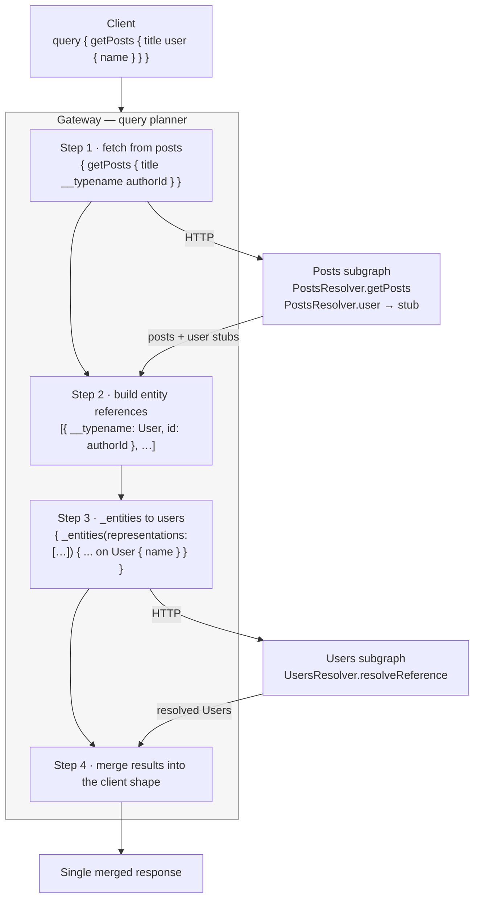

# Chapter 52 — GraphQL III: Federation, Directives, Plugins, and Complexity

> **한눈에 보기**
> 50~51장이 스키마를 *기술하는* 방법이었다면, 이 장은 스키마를 *둘러싸는* 모든 것입니다.
> 가드·인터셉터·필터가 GraphQL에서 왜 다르게 동작하는지(`GqlExecutionContext`),
> 필드 단위 권한을 field middleware와 extensions로 구현하는 법, 커스텀 디렉티브,
> 공개 그래프를 무기화하지 못하게 막는 쿼리 복잡도 제한, Apollo 플러그인으로 요청
> 라이프사이클을 관측하는 법, 그리고 하나의 그래프를 여러 Nest 서비스로 쪼개는
> Apollo Federation까지 다룹니다. 45~49장의 마이크로서비스 논의가 GraphQL 층에서
> 다시 등장하며, 같은 트레이드오프가 그대로 반복됩니다.

**What you will learn**

- Why a guard written for a controller returns `undefined` when a resolver invokes it, and exactly what `GqlExecutionContext.create()` fixes.
- Why enhancers do **not** run on `@ResolveField()` by default, what `fieldResolverEnhancers` changes, and the helper that keeps that from costing you a thousand guard invocations per request.
- How to shape GraphQL errors with a `GqlExceptionFilter` and `GraphQLError`, and how to keep stack traces out of production responses.
- The three levels at which you can authorize — operation, field resolver, and field middleware — and how to choose.
- `@Extensions()` as a metadata channel, and the field middleware that reads it to build a field-level RBAC system.
- How to declare, apply, and implement custom directives with `buildSchemaOptions.directives` and `transformSchema`, plus the one thing `@Directive()` does not do.
- Query complexity with `graphql-query-complexity`, field-level costs, custom estimators, and depth limiting — the two controls a public graph cannot ship without.
- The Apollo plugin lifecycle, and a request-logging plugin that gives you per-operation timing and query counts.
- Apollo Federation 2 end to end: subgraphs with `@key`, `@ResolveReference`, extending types across services, a gateway with `IntrospectAndCompose` and a `RemoteGraphQLDataSource` that forwards auth headers — and an honest account of what federation costs.

**Why this matters**

Start with the security failure, because it is the one that ships. A guard that works perfectly on your REST controllers is applied to a resolver:

```typescript
@Injectable()
export class RolesGuard implements CanActivate {
  canActivate(context: ExecutionContext): boolean {
    const request = context.switchToHttp().getRequest(); // ← undefined under GraphQL
    return request.user?.roles.includes('admin');
  }
}
```

`context.switchToHttp().getRequest()` returns `undefined`, `undefined?.roles` is `undefined`, `undefined.includes` throws — or, in the version someone wrote defensively with `?.`, the whole expression evaluates to `undefined`, which is falsy, so the guard denies everyone and someone "fixes" it by returning `true`. The reason is structural: a REST handler's arguments are `(req, res, next)`; a resolver's are `(root, args, context, info)`. There is no `req` in position zero. `GqlExecutionContext` is the adapter, and understanding *why* it exists is what keeps you from patching around it.

The second thing that ships and shouldn't is an unbounded public graph. Your schema has `Author.posts` and `Post.author`. That cycle means a client can write a query nested twenty levels deep, and each level multiplies. One HTTP request, a few hundred bytes, and your database is doing millions of row reads. There is no rate limiter that helps — it is *one* request. REST never had this problem because each endpoint's cost was fixed at design time. In GraphQL the caller picks the cost, so you must put a ceiling on it, and depth limiting plus complexity analysis is that ceiling.

Federation is the third theme and the one to approach most carefully. It genuinely solves an organizational problem: five teams cannot all commit to one `schema.gql` without constant conflict, and a monolithic graph makes every deploy a coordination event. Federation lets each team own a subgraph, deploy independently, and still present clients with one graph. What it costs is a new distributed system — a gateway that must be highly available, a query planner whose fan-out is invisible until you trace it, composition errors that only appear when two independently-valid subgraphs are merged, and N+1 problems that now cross the network instead of hitting the same database. The chapter shows the mechanism completely and then tells you when not to use it.

---

## Enhancers in GraphQL: guards, interceptors, filters, pipes

Everything from Part I works — the same classes, the same decorators, the same DI:

```typescript
@Query(() => Author, { name: 'author' })
@UseGuards(GqlAuthGuard)
async getAuthor(@Args('id', ParseIntPipe) id: number) {
  return this.authorsService.findOneById(id);
}

@Mutation(() => Post)
@UseInterceptors(EventsInterceptor)
async upvotePost(@Args('postId', { type: () => Int }) postId: number) {
  return this.postsService.upvoteById({ id: postId });
}
```

Pipes are the easy case — a pipe operates on a value, and `@Args('id', ParseIntPipe)` needs no adaptation at all. Guards, interceptors, and filters are the hard case, because they receive an `ExecutionContext` whose shape depends on the transport.

### `GqlExecutionContext`

`ExecutionContext` ([Chapter 40](./40-execution-context.md)) wraps a handler's raw arguments. Under HTTP those are `[req, res, next]`; under GraphQL they are `[root, args, context, info]`. `switchToHttp()` assumes the first shape. `GqlExecutionContext.create()` rewraps the same arguments with GraphQL-aware accessors:

```typescript title="src/auth/gql-auth.guard.ts"
import { CanActivate, ExecutionContext, Injectable } from '@nestjs/common';
import { GqlExecutionContext } from '@nestjs/graphql';

@Injectable()
export class GqlAuthGuard implements CanActivate {
  canActivate(context: ExecutionContext): boolean {
    const ctx = GqlExecutionContext.create(context);
    const gqlContext = ctx.getContext();     // the per-request context object
    return Boolean(gqlContext.user);
  }
}
```

| Method | Returns |
|---|---|
| `getRoot()` | The parent object (`root`/`parent`) |
| `getArgs()` | The field's arguments |
| `getContext()` | The per-request context built by the `context` factory |
| `getInfo()` | `GraphQLResolveInfo` — `fieldName`, `parentType`, `path`, … |

The rest of `ExecutionContext` — `getHandler()`, `getClass()`, `getType()` — is unchanged, so `Reflector` metadata lookups work identically to REST.

**The request object is on `context`, not in position zero.** Whether `context.req` exists at all depends on *your* `context` factory:

```typescript
GraphQLModule.forRoot<ApolloDriverConfig>({
  driver: ApolloDriver,
  context: ({ req, res }) => ({ req, res }),   // without this, there is no req
});
```

That is why the Passport-based `AuthGuard` from [Chapter 24](../part2-intermediate/24-passport-strategies.md) needs an override — Passport strategies read from an Express request, so you must hand it the one hiding on the context:

```typescript title="src/auth/gql-jwt-auth.guard.ts"
import { ExecutionContext, Injectable } from '@nestjs/common';
import { AuthGuard } from '@nestjs/passport';
import { GqlExecutionContext } from '@nestjs/graphql';

@Injectable()
export class GqlJwtAuthGuard extends AuthGuard('jwt') {
  getRequest(context: ExecutionContext) {
    const ctx = GqlExecutionContext.create(context);
    return ctx.getContext().req;
  }
}
```

Custom parameter decorators ([Chapter 13](../part1-beginner/13-custom-decorators-and-lifecycle.md)) follow the same pattern:

```typescript title="src/auth/current-user.decorator.ts"
import { createParamDecorator, ExecutionContext } from '@nestjs/common';
import { GqlExecutionContext } from '@nestjs/graphql';

export const CurrentUser = createParamDecorator(
  (data: unknown, ctx: ExecutionContext) =>
    GqlExecutionContext.create(ctx).getContext().user,
);
```

```typescript
@Mutation(() => Post)
createPost(@CurrentUser() user: UserEntity, @Args('input') input: CreatePostInput) {
  return this.postsService.create(user, input);
}
```

To write **one** guard that serves both a REST controller and a resolver, branch on `context.getType()`:

```typescript
import { GqlContextType } from '@nestjs/graphql';

function getRequest(context: ExecutionContext) {
  if (context.getType<GqlContextType>() === 'graphql') {
    return GqlExecutionContext.create(context).getContext().req;
  }
  return context.switchToHttp().getRequest();
}
```

### Exception filters

Filters transform to `GqlArgumentsHost` instead:

```typescript title="src/common/filters/gql-http-exception.filter.ts"
import { ArgumentsHost, Catch, HttpException } from '@nestjs/common';
import { GqlArgumentsHost, GqlExceptionFilter } from '@nestjs/graphql';
import { GraphQLError } from 'graphql';

@Catch(HttpException)
export class GqlHttpExceptionFilter implements GqlExceptionFilter {
  catch(exception: HttpException, host: ArgumentsHost) {
    const gqlHost = GqlArgumentsHost.create(host);
    const info = gqlHost.getInfo();

    // Return (do not send) — there is no response object to write to.
    return new GraphQLError(exception.message, {
      extensions: {
        code: exception.getStatus() === 403 ? 'FORBIDDEN' : 'BAD_REQUEST',
        status: exception.getStatus(),
        field: info?.fieldName,
      },
    });
  }
}
```

The critical difference from REST: a GraphQL filter **returns** the error instead of writing to a response. There is no `res` to call `.status().json()` on — the executor collects the returned error into the `errors` array and continues resolving sibling fields. Calling `response.status(...)` in a GraphQL filter is the most common porting bug, and it throws on `undefined`.

`ApolloError` from Apollo Server 2/3 is gone in Apollo Server 4+. Use `GraphQLError` from the `graphql` package with an `extensions.code`, which is what Apollo's own error classes now compile to. The conventional codes are `UNAUTHENTICATED`, `FORBIDDEN`, `BAD_USER_INPUT`, `GRAPHQL_VALIDATION_FAILED`, and `INTERNAL_SERVER_ERROR`.

Global shaping belongs in `formatError`, which runs on every error regardless of origin:

```typescript
GraphQLModule.forRoot<ApolloDriverConfig>({
  driver: ApolloDriver,
  formatError: (formattedError, error) => {
    const isProd = process.env.NODE_ENV === 'production';
    const { stacktrace, ...extensions } =
      (formattedError.extensions ?? {}) as Record<string, unknown>;

    if (isProd && extensions.code === 'INTERNAL_SERVER_ERROR') {
      // Log the original, return something safe.
      console.error(error);
      return { message: 'Internal server error', extensions: { code: 'INTERNAL_SERVER_ERROR' } };
    }
    return { ...formattedError, extensions };
  },
});
```

Apollo includes `extensions.stacktrace` whenever `NODE_ENV` is not `production`. Strip it explicitly rather than trusting an environment variable to be set correctly on every host.

### Field-level versus operation-level enhancers

Here is the behavior that surprises people. **Nest does not run enhancers on `@ResolveField()` methods by default** — guards, interceptors, and filters fire only for top-level `@Query()` and `@Mutation()` handlers.

That is a deliberate performance decision. A field resolver on a list of 500 items runs 500 times; running a guard 500 times means 500 `Reflector` lookups and possibly 500 permission checks. Opt in per application:

```typescript
GraphQLModule.forRoot<ApolloDriverConfig>({
  driver: ApolloDriver,
  fieldResolverEnhancers: ['guards', 'interceptors', 'filters'],
});
```

> **⚠️ Notice** — Enabling this makes every enhancer bound to a field resolver run once per resolved object. On a paginated list with nested relations that is easily thousands of invocations per request.

Mitigate by short-circuiting enhancers that only make sense at the root:

```typescript title="src/common/is-resolving-field.ts"
import { ExecutionContext } from '@nestjs/common';
import { GqlContextType, GqlExecutionContext } from '@nestjs/graphql';

export function isResolvingGraphQLField(context: ExecutionContext): boolean {
  if (context.getType<GqlContextType>() === 'graphql') {
    const info = GqlExecutionContext.create(context).getInfo();
    const parentType = info.parentType.name;
    return parentType !== 'Query' && parentType !== 'Mutation';
  }
  return false;
}
```

```typescript
@Injectable()
export class AuditInterceptor implements NestInterceptor {
  intercept(context: ExecutionContext, next: CallHandler) {
    if (isResolvingGraphQLField(context)) return next.handle(); // skip
    return next.handle().pipe(tap(() => this.audit.record(context)));
  }
}
```

**So which layer authorizes what?** Three levels, three jobs:

| Level | Mechanism | Runs | Use for |
|---|---|---|---|
| Operation | `@UseGuards()` on `@Query`/`@Mutation` | Once per operation | Authentication, coarse RBAC ("admins only"), rate limits |
| Field resolver | `@UseGuards()` on `@ResolveField` + `fieldResolverEnhancers` | Once per parent object | Relation-level rules needing DI and full context |
| Field | Field middleware + `@Extensions()` | Once per field value | Cheap per-field masking and role checks with no I/O |

Default to the operation level. Reach down only when a specific field genuinely needs different rules from its parent operation — `User.email` visible to the owner and admins but not to everyone, say.

---

## Field middleware

> **⚠️ Notice** — Code first only.

Field middleware runs immediately around a single field's resolution — the lightest hook GraphQL gives you.

```typescript title="src/common/middleware/logger.middleware.ts"
import { FieldMiddleware, MiddlewareContext, NextFn } from '@nestjs/graphql';

const loggerMiddleware: FieldMiddleware = async (
  ctx: MiddlewareContext,
  next: NextFn,
) => {
  const value = await next();
  console.log(`${ctx.info.parentType.name}.${ctx.info.fieldName} = ${value}`);
  return value;
};
```

`MiddlewareContext` is `{ source, args, context, info }` — the same four arguments a resolver gets. `NextFn` invokes the next middleware in the chain, or the actual field resolver at the end of it.

Attach it to a field, to a field resolver, or globally:

```typescript
@ObjectType()
export class Recipe {
  @Field({ middleware: [loggerMiddleware] })
  title: string;
}
```

```typescript
@ResolveField(() => String, { middleware: [loggerMiddleware] })
title() {
  return 'Placeholder';
}
```

```typescript
GraphQLModule.forRoot<ApolloDriverConfig>({
  driver: ApolloDriver,
  autoSchemaFile: 'schema.gql',
  buildSchemaOptions: {
    fieldMiddleware: [loggerMiddleware],   // every field of every object type
  },
});
```

**Ordering.** Middleware nests like an onion: the first entry in the array is the outermost layer, so it runs first on the way in and last on the way out. Globally registered middleware runs before locally registered middleware. When enhancers are enabled at the field-resolver level, field middleware runs *before* any interceptor or guard bound to that method, but *after* root-level enhancers on the query or mutation.

**The value it returns replaces the field's value**, which is what makes transformation possible:

```typescript
const upperCaseMiddleware: FieldMiddleware = async (ctx, next) => {
  const value = await next();
  return typeof value === 'string' ? value.toUpperCase() : value;
};

const maskMiddleware: FieldMiddleware = async (ctx, next) => {
  const value = (await next()) as string | null;
  if (!value) return value;
  return ctx.context.user?.isAdmin ? value : value.replace(/.(?=.{4})/g, '*');
};
```

Return the original value when you do not intend to change anything — forgetting to return at all makes the field `undefined`, which becomes `null` and fails if the field is non-null.

### The two hard limits

**No dependency injection.** Field middleware are plain functions, outside the DI container. There is no `@Injectable()`, no constructor, no `ModuleRef`. Anything a middleware needs must already be on `ctx.context` — put it there from a guard or interceptor bound to the root operation.

**No I/O.** This is the performance warning, and it is the load-bearing one. A middleware on `Recipe.title` runs once per recipe. On a 500-item page that is 500 executions; add a global middleware and it is 500 × (number of fields selected). A single 5 ms database call in that position is 2.5 seconds of added latency for a page of results.

Good uses: masking, formatting, unit conversion, cheap per-field role checks against data already on the context, and adding tracing spans. Bad uses: anything that awaits a network or a database, and anything needing a service you would have to inject.

Field middleware can only be applied to `ObjectType` classes — not to input types, and not to interfaces.

---

## Extensions: arbitrary metadata on schema elements

> **⚠️ Notice** — Code first only.

`@Extensions()` attaches an arbitrary object to a field, type, or handler. It changes nothing at runtime by itself; it is a channel for metadata that middleware, plugins, or estimators read back out.

```typescript
import { Extensions, Field, ObjectType } from '@nestjs/graphql';
import { Role } from '../auth/role.enum';

@ObjectType()
export class User {
  @Field() id: string;
  @Field() email: string;

  @Field()
  @Extensions({ role: Role.ADMIN })
  ssn: string;
}
```

The decorator works at class level and method level too, so you can tag a whole type or a query handler.

Reading it back requires knowing where it lands in the built schema — `info.parentType.getFields()[info.fieldName].extensions`:

```typescript title="src/auth/check-role.middleware.ts"
import { ForbiddenException } from '@nestjs/common';
import { FieldMiddleware, MiddlewareContext, NextFn } from '@nestjs/graphql';
import { Role } from './role.enum';

export const checkRoleMiddleware: FieldMiddleware = async (
  ctx: MiddlewareContext,
  next: NextFn,
) => {
  const { info, context } = ctx;
  const { extensions } = info.parentType.getFields()[info.fieldName];
  const requiredRole = extensions?.role as Role | undefined;

  if (!requiredRole) return next();          // unguarded field

  // The user was placed on the context by a guard on the root operation —
  // middleware cannot fetch it itself.
  const userRole = context.user?.role as Role | undefined;
  if (userRole !== requiredRole) {
    throw new ForbiddenException(
      `Insufficient permissions to access "${info.fieldName}".`,
    );
  }
  return next();
};
```

```typescript
@Field({ middleware: [checkRoleMiddleware] })
@Extensions({ role: Role.ADMIN })
ssn: string;
```

Register it globally in `buildSchemaOptions.fieldMiddleware` and every `@Extensions({ role })` in the schema becomes enforced, declaratively, with one line per field.

A design decision worth making explicitly: **throw or return `null`?** Throwing puts an error in the `errors` array and nulls the field — which, if the field is non-null, propagates upward and can null out the entire parent object, a behavior clients find baffling. Returning `null` silently hides the field but requires it to be nullable in the schema. For a field-level permission system, nullable fields plus a silent `null` is usually the kinder contract; reserve throwing for cases where the client genuinely needs to know it was denied.

`@Extensions()` is not only for permissions. Complexity estimators read extensions, Apollo caching plugins read `cacheControl` hints from them, and your own plugins can read anything you put there — it is the general-purpose annotation mechanism for a code-first schema.

---

## Custom directives

A directive is an `@`-prefixed annotation in SDL that can change execution. GraphQL defines three: `@include(if:)`, `@skip(if:)`, and `@deprecated(reason:)`. Adding your own takes three pieces: a **declaration** so the schema knows the directive exists, an **application** on some schema element, and a **transformer** that gives it behavior.

**1. The transformer.** Directives have no runtime meaning to `graphql-js` — you implement them by rewriting the schema's resolvers with `mapSchema`:

```typescript title="src/common/directives/upper-case.directive.ts"
import { getDirective, MapperKind, mapSchema } from '@graphql-tools/utils';
import { defaultFieldResolver, GraphQLSchema } from 'graphql';

export function upperDirectiveTransformer(
  schema: GraphQLSchema,
  directiveName: string,
): GraphQLSchema {
  return mapSchema(schema, {
    [MapperKind.OBJECT_FIELD]: (fieldConfig) => {
      const upperDirective = getDirective(schema, fieldConfig, directiveName)?.[0];
      if (!upperDirective) return undefined;   // leave the field untouched

      const { resolve = defaultFieldResolver } = fieldConfig;
      fieldConfig.resolve = async function (source, args, context, info) {
        const result = await resolve(source, args, context, info);
        return typeof result === 'string' ? result.toUpperCase() : result;
      };
      return fieldConfig;
    },
  });
}
```

`MapperKind` has entries for every schema location — `OBJECT_TYPE`, `ARGUMENT`, `ENUM_VALUE`, `INPUT_OBJECT_FIELD` — so a directive can transform whatever it is attached to.

**2. Registration.**

```typescript
import { DirectiveLocation, GraphQLDirective } from 'graphql';

GraphQLModule.forRoot<ApolloDriverConfig>({
  driver: ApolloDriver,
  autoSchemaFile: 'schema.gql',
  transformSchema: (schema) => upperDirectiveTransformer(schema, 'upper'),
  buildSchemaOptions: {
    directives: [
      new GraphQLDirective({
        name: 'upper',
        locations: [DirectiveLocation.FIELD_DEFINITION],
      }),
    ],
  },
});
```

`buildSchemaOptions.directives` *declares* the directive (code first only — schema first declares it in SDL); `transformSchema` *implements* it. Miss the declaration and you get "Unknown directive"; miss the transformer and the directive is inert.

**3. Application, code first:**

```typescript
@Directive('@upper')
@Field()
title: string;
```

Directives apply to fields, field resolvers, input and object types, queries, mutations, and subscriptions:

```typescript
@Directive('@deprecated(reason: "This query will be removed in the next version")')
@Query(() => Author, { name: 'author' })
async getAuthor(@Args('id', { type: () => Int }) id: number) { /* … */ }
```

> **⚠️ Notice** — Directives applied through `@Directive()` **do not appear in the generated `autoSchemaFile`**. The in-memory schema has them; the file you commit and review does not. If your review process or a schema registry consumes that file, directive changes are invisible to it — a real argument for schema first when directives carry meaning (federation keys, auth policies).

**Schema first** is more direct: declare and apply in SDL, and the transformer registration is identical.

```graphql
directive @upper on FIELD_DEFINITION

type Post {
  id: Int!
  title: String! @upper
  votes: Int
}
```

**Directive or field middleware?** They overlap. Middleware is TypeScript, is easier to debug, and requires no schema declaration. Directives are visible in the SDL — self-documenting to clients and readable by external tooling — and are the only option in schema first. Federation forces the issue: `@key`, `@external`, and `@shareable` *are* directives, and there is no middleware equivalent.

---

## Query complexity and depth limiting

The security control this chapter opened with. Any schema with a cycle — `Author.posts` and `Post.author` is a cycle — admits queries whose cost grows exponentially with depth.

```bash
$ npm i graphql-query-complexity
```

```typescript title="src/common/plugins/complexity.plugin.ts"
import { GraphQLSchemaHost } from '@nestjs/graphql';
import { Plugin } from '@nestjs/apollo';
import { ApolloServerPlugin, BaseContext, GraphQLRequestListener } from '@apollo/server';
import { GraphQLError } from 'graphql';
import {
  fieldExtensionsEstimator,
  getComplexity,
  simpleEstimator,
} from 'graphql-query-complexity';

@Plugin()
export class ComplexityPlugin implements ApolloServerPlugin {
  constructor(private readonly gqlSchemaHost: GraphQLSchemaHost) {}

  async requestDidStart(): Promise<GraphQLRequestListener<BaseContext>> {
    const maxComplexity = 20;
    const { schema } = this.gqlSchemaHost;

    return {
      async didResolveOperation({ request, document }) {
        const complexity = getComplexity({
          schema,
          operationName: request.operationName,
          query: document,
          variables: request.variables,
          estimators: [
            fieldExtensionsEstimator(),
            simpleEstimator({ defaultComplexity: 1 }),
          ],
        });
        if (complexity > maxComplexity) {
          throw new GraphQLError(
            `Query is too complex: ${complexity}. Maximum allowed complexity: ${maxComplexity}`,
            { extensions: { code: 'QUERY_TOO_COMPLEX', complexity, maxComplexity } },
          );
        }
      },
    };
  }
}
```

Register it as a provider — `@Plugin()` makes Nest instantiate it and hand it to Apollo:

```typescript
@Module({ providers: [ComplexityPlugin] })
export class CommonModule {}
```

`didResolveOperation` is the right hook: the document has been parsed and validated, so you have a real AST, but **no resolver has run yet**. Rejecting here costs one parse and zero database queries.

**Estimators** run in order per field; the first to return a number wins. `fieldExtensionsEstimator()` reads the cost you declared on the field; `simpleEstimator({ defaultComplexity: 1 })` is the fallback and must be last.

Declare per-field costs:

```typescript
@Field({ complexity: 3 })
title: string;
```

The interesting case is a cost that depends on arguments — a list query's cost should scale with the page size:

```typescript
import { ComplexityEstimatorArgs } from 'graphql-query-complexity';

@Query(() => [Item], {
  complexity: (options: ComplexityEstimatorArgs) =>
    options.args.count * options.childComplexity,
})
items(@Args('count', { type: () => Int }) count: number) {
  return this.itemsService.getItems({ count });
}
```

`childComplexity` is the summed cost of the selection set beneath this field. Multiplying by `count` models the fact that asking for 100 items costs 100× what asking for one costs — which is what actually stops the exponential nesting attack. A query nested five levels deep at 100 items per level scores in the billions and is rejected instantly.

**Depth limiting** is the cheaper, cruder companion, and worth having as well:

```bash
$ npm i graphql-depth-limit
```

```typescript
import depthLimit from 'graphql-depth-limit';

GraphQLModule.forRoot<ApolloDriverConfig>({
  driver: ApolloDriver,
  validationRules: [depthLimit(10)],
});
```

Depth limiting runs during *validation*, before complexity analysis, and catches the pathological nesting case with no configuration. Complexity catches the wide-and-shallow case that depth misses (`items(count: 100000) { id }`). Ship both.

A third control for a truly public graph is **persisted queries** — the server accepts only a preregistered allow-list of operation hashes. That turns an open query language into a fixed API surface, at the cost of a build step. Apollo's `ApolloServerPluginPersistedQueries` and the operation registry plugin implement it.

Complexity limits, like any limit, need a number. Instrument first: log complexity for every operation for a week, look at the p99 of your legitimate traffic, and set the ceiling comfortably above it. A limit tuned by guesswork either blocks real clients or stops nothing.

---

## Apollo plugins

Plugins are the observability and policy layer. They hook the server's lifecycle and the request lifecycle, and they are ordinary Nest providers, so they can inject anything.

```typescript title="src/common/plugins/logging.plugin.ts"
import { Plugin } from '@nestjs/apollo';
import { Logger } from '@nestjs/common';
import { ApolloServerPlugin, GraphQLRequestListener } from '@apollo/server';

@Plugin()
export class LoggingPlugin implements ApolloServerPlugin {
  private readonly logger = new Logger(LoggingPlugin.name);

  async serverWillStart() {
    this.logger.log('GraphQL server starting');
    return {
      async serverWillStop() {
        /* drain connections, flush metrics */
      },
    };
  }

  async requestDidStart(requestContext): Promise<GraphQLRequestListener<any>> {
    const start = process.hrtime.bigint();
    const logger = this.logger;

    return {
      async didResolveOperation(ctx) {
        // operationName is known here; the AST is available for inspection
      },
      async didEncounterErrors(ctx) {
        for (const error of ctx.errors) {
          logger.error(`${ctx.operationName ?? 'anonymous'}: ${error.message}`, error.stack);
        }
      },
      async willSendResponse(ctx) {
        const ms = Number(process.hrtime.bigint() - start) / 1e6;
        logger.log(
          `${ctx.operation?.operation ?? 'unknown'} ${ctx.operationName ?? 'anonymous'} ${ms.toFixed(1)}ms`,
        );
      },
    };
  }
}
```

```typescript
@Module({ providers: [LoggingPlugin] })
export class CommonModule {}
```

The request lifecycle, in order:

| Hook | When | Typical use |
|---|---|---|
| `didResolveSource` | Query text obtained | Persisted-query resolution |
| `parsingDidStart` | Before parse | Parse timing |
| `validationDidStart` | Before validation | Custom validation timing |
| `didResolveOperation` | AST validated, nothing executed | **Complexity limits, depth limits, allow-lists** |
| `responseForOperation` | Before execution | Full-response caching — return a response to skip execution |
| `executionDidStart` | Execution begins | Per-field instrumentation via `willResolveField` |
| `didEncounterErrors` | Any error occurred | Error reporting to Sentry ([Chapter 56](./56-observability.md)) |
| `willSendResponse` | Response ready | Timing, metrics, response headers |

`executionDidStart` can return `{ willResolveField }`, which fires for *every* field — the hook behind per-field tracing, and the way to count resolver invocations. That is how you turn the N+1 discussion from [Chapter 50](./50-graphql-fundamentals.md) into a CI check:

```typescript
async executionDidStart() {
  const counts = new Map<string, number>();
  return {
    willResolveField({ info }) {
      const key = `${info.parentType.name}.${info.fieldName}`;
      counts.set(key, (counts.get(key) ?? 0) + 1);
    },
    executionDidEnd: async () => {
      for (const [field, n] of counts) {
        if (n > 50) this.logger.warn(`Possible N+1: ${field} resolved ${n} times`);
      }
    },
  };
}
```

External plugins go in the `plugins` array:

```typescript
import { ApolloServerPluginLandingPageLocalDefault } from '@apollo/server/plugin/landingPage/default';

GraphQLModule.forRoot<ApolloDriverConfig>({
  driver: ApolloDriver,
  playground: false,
  plugins: [ApolloServerPluginLandingPageLocalDefault()],   // Apollo Sandbox
});
```

**Mercurius plugins** are Fastify plugins, and most mercurius-specific ones must load *after* the mercurius plugin. The driver takes a `plugins` array of `{ plugin, options }` pairs and handles the ordering:

```typescript
import cache from 'mercurius-cache';

GraphQLModule.forRoot<MercuriusDriverConfig>({
  driver: MercuriusDriver,
  plugins: [
    { plugin: cache, options: { ttl: 10, policy: { Query: { add: true } } } },
  ],
});
```

`mercurius-upload` is the exception — register it in `main.ts` before the driver starts.

If none of the drivers fits, write one. `AbstractGraphQLDriver` needs `start()` and `stop()`:

```typescript
import { AbstractGraphQLDriver, GqlModuleOptions } from '@nestjs/graphql';
import { graphqlHTTP } from 'express-graphql';

class ExpressGraphQLDriver extends AbstractGraphQLDriver {
  async start(options: GqlModuleOptions<any>): Promise<void> {
    options = await this.graphQlFactory.mergeWithSchema(options);
    const { httpAdapter } = this.httpAdapterHost;
    httpAdapter.use('/graphql', graphqlHTTP({ schema: options.schema, graphiql: true }));
  }
  async stop() {}
}
```

```typescript
GraphQLModule.forRoot({ driver: ExpressGraphQLDriver });
```

`mergeWithSchema` is the important call — it builds the schema from your decorator metadata and hands it back, so a custom driver inherits everything from Chapters 50 and 51.

---

## Apollo Federation

Federation splits one graph across independently deployed services. Each **subgraph** owns part of the schema; a **gateway** composes them into a **supergraph** and plans queries across them. Clients see one endpoint and one schema.

Apollo states four principles: composition should be *declarative* (in the schema, not in stitching code); code should be separated by *concern* rather than by type, since no one team owns every aspect of `User`; the composed graph should be simple for clients; and it should be *just GraphQL* — spec-compliant, so any language can implement a subgraph.

We build two subgraphs (Users, Posts) and a gateway. Federation 2 is assumed throughout; Federation 1 differences are noted at the end.

```bash
# in each subgraph
$ npm i @apollo/subgraph
# in the gateway
$ npm i @apollo/gateway
```

> **⚠️ Notice** — Federation does not support subscriptions. Serve them from a separate, non-federated service.

### Subgraph 1: Users

```typescript title="users/src/users/user.entity.ts"
import { Directive, Field, ID, ObjectType } from '@nestjs/graphql';

@ObjectType()
@Directive('@key(fields: "id")')
export class User {
  @Field(() => ID)
  id: number;

  @Field()
  name: string;
}
```

`@key(fields: "id")` makes `User` an **entity**: a type any subgraph can reference, and that this subgraph can resolve from just an `id`. That is the whole mechanism — the key is the join column of the distributed graph.

```typescript title="users/src/users/users.resolver.ts"
import { Args, Query, ResolveReference, Resolver } from '@nestjs/graphql';
import { User } from './user.entity';
import { UsersService } from './users.service';

@Resolver(() => User)
export class UsersResolver {
  constructor(private readonly usersService: UsersService) {}

  @Query(() => User)
  getUser(@Args('id') id: number): User {
    return this.usersService.findById(id);
  }

  @ResolveReference()
  resolveReference(reference: { __typename: string; id: number }): User {
    return this.usersService.findById(reference.id);
  }
}
```

`@ResolveReference()` is the federation-specific piece. When another subgraph returns a `User` *stub* — `{ __typename: 'User', id: 5 }` — the gateway routes it here to be turned into a real `User`. Every entity needs one.

```typescript title="users/src/app.module.ts"
import { ApolloFederationDriver, ApolloFederationDriverConfig } from '@nestjs/apollo';
import { Module } from '@nestjs/common';
import { GraphQLModule } from '@nestjs/graphql';

@Module({
  imports: [
    GraphQLModule.forRoot<ApolloFederationDriverConfig>({
      driver: ApolloFederationDriver,
      autoSchemaFile: { federation: 2 },
    }),
  ],
  providers: [UsersResolver, UsersService],
})
export class AppModule {}
```

`autoSchemaFile: { federation: 2 }` is what selects Federation 2 — it adds the `@link` directive to the generated SDL and enables the v2 directive set. Schema first uses `typePaths` with the directives written in SDL:

```graphql title="users/src/users/users.graphql"
type User @key(fields: "id") {
  id: ID!
  name: String!
}

type Query {
  getUser(id: ID!): User
}
```

(In Federation 1 you would write `extend type Query`. Federation 2 removed the notion of an originating subgraph, so plain `type Query` is correct.)

### Subgraph 2: Posts, extending `User`

The Posts service owns `Post`, and adds a `posts` field to the `User` type it does not own.

```typescript title="posts/src/posts/post.entity.ts"
import { Directive, Field, ID, Int, ObjectType } from '@nestjs/graphql';
import { User } from './user.entity';

@ObjectType()
@Directive('@key(fields: "id")')
export class Post {
  @Field(() => ID) id: number;
  @Field() title: string;
  @Field(() => Int) authorId: number;
  @Field(() => User) user?: User;
}
```

```typescript title="posts/src/posts/user.entity.ts"
import { Directive, Field, ID, ObjectType } from '@nestjs/graphql';
import { Post } from './post.entity';

// A local stub of a type owned elsewhere. In Federation 2 no @extends
// or @external is needed — only the same @key.
@ObjectType()
@Directive('@key(fields: "id")')
export class User {
  @Field(() => ID)
  id: number;

  @Field(() => [Post])
  posts?: Post[];
}
```

Two resolvers. One adds the new field to `User`; the other returns `User` stubs from `Post`:

```typescript title="posts/src/posts/users.resolver.ts"
import { Parent, ResolveField, Resolver } from '@nestjs/graphql';
import { Post } from './post.entity';
import { User } from './user.entity';
import { PostsService } from './posts.service';

@Resolver(() => User)
export class UsersResolver {
  constructor(private readonly postsService: PostsService) {}

  @ResolveField(() => [Post])
  posts(@Parent() user: User): Post[] {
    // `user` arrives carrying only the @key fields the gateway sent.
    return this.postsService.forAuthor(user.id);
  }
}
```

```typescript title="posts/src/posts/posts.resolver.ts"
import { Args, Parent, Query, ResolveField, Resolver } from '@nestjs/graphql';
import { Post } from './post.entity';
import { User } from './user.entity';
import { PostsService } from './posts.service';

@Resolver(() => Post)
export class PostsResolver {
  constructor(private readonly postsService: PostsService) {}

  @Query(() => [Post])
  getPosts(): Post[] {
    return this.postsService.all();
  }

  @ResolveField(() => User)
  user(@Parent() post: Post): any {
    // Return a REFERENCE, not a User. The gateway resolves it
    // against the Users subgraph via its @ResolveReference.
    return { __typename: 'User', id: post.authorId };
  }
}
```

That `{ __typename: 'User', id }` stub is the heart of federation. This service has no user data and makes no HTTP call; it declares *which* user, and the gateway does the rest.

```typescript title="posts/src/app.module.ts"
GraphQLModule.forRoot<ApolloFederationDriverConfig>({
  driver: ApolloFederationDriver,
  autoSchemaFile: { federation: 2 },
  buildSchemaOptions: {
    orphanedTypes: [User],   // nothing in this subgraph *returns* User directly
  },
});
```

`orphanedTypes` is required and easy to forget: the local `User` stub is referenced only as a field type, so the code-first factory would otherwise omit it and composition would fail with a confusing "unknown type" from the gateway.

Schema first, Federation 2:

```graphql title="posts/src/posts/posts.graphql"
type Post @key(fields: "id") {
  id: ID!
  title: String!
  body: String!
  user: User
}

type User @key(fields: "id") {
  id: ID!
  posts: [Post]
}

type Query {
  getPosts: [Post]
}
```

In **Federation 1** the same file needs `extend` and `@external`, which is the clearest visible difference between the versions:

```graphql
extend type User @key(fields: "id") {
  id: ID! @external
  posts: [Post]
}
```

and code first needs `@Directive('@extends')` plus `@Directive('@external')` on the `id` field.

### The gateway

```typescript title="gateway/src/app.module.ts"
import { IntrospectAndCompose } from '@apollo/gateway';
import { ApolloGatewayDriver, ApolloGatewayDriverConfig } from '@nestjs/apollo';
import { Module } from '@nestjs/common';
import { GraphQLModule } from '@nestjs/graphql';

@Module({
  imports: [
    GraphQLModule.forRoot<ApolloGatewayDriverConfig>({
      driver: ApolloGatewayDriver,
      server: {
        cors: true,
      },
      gateway: {
        supergraphSdl: new IntrospectAndCompose({
          subgraphs: [
            { name: 'users', url: 'http://user-service/graphql' },
            { name: 'posts', url: 'http://post-service/graphql' },
          ],
        }),
      },
    }),
  ],
})
export class AppModule {}
```

The gateway has no resolvers and no models — it is pure composition, identical for code-first and schema-first subgraphs.

> **⚠️ Notice** — `IntrospectAndCompose` introspects every subgraph **at gateway startup**. That means: the gateway cannot start until every subgraph is reachable, composition errors surface at boot as a crash loop, and a subgraph deployed with an incompatible schema breaks the gateway rather than only itself. For production, precompose the supergraph in CI (Rover) and hand the gateway a static `supergraphSdl` string, or use Apollo's managed federation with a schema registry. Use `IntrospectAndCompose` in development.

### Forwarding authentication through the gateway

By default the gateway sends its own requests to subgraphs with none of the client's headers. Subgraphs therefore see anonymous traffic, and every guard denies. The fix is a custom `RemoteGraphQLDataSource`:

```typescript title="gateway/src/authenticated-data-source.ts"
import { RemoteGraphQLDataSource } from '@apollo/gateway';

export class AuthenticatedDataSource extends RemoteGraphQLDataSource {
  willSendRequest({ request, context }: { request: any; context: any }) {
    const req = context?.req;
    if (!req) return;

    // Forward only what subgraphs need — never blanket-copy every header.
    const authorization = req.headers?.authorization;
    if (authorization) request.http.headers.set('authorization', authorization);

    const requestId = req.headers?.['x-request-id'];
    if (requestId) request.http.headers.set('x-request-id', requestId);
  }
}
```

```typescript title="gateway/src/app.module.ts"
GraphQLModule.forRoot<ApolloGatewayDriverConfig>({
  driver: ApolloGatewayDriver,
  gateway: {
    supergraphSdl: new IntrospectAndCompose({ subgraphs }),
    buildService: ({ url }) => new AuthenticatedDataSource({ url }),
  },
  server: {
    context: ({ req }) => ({ req }),   // makes req reachable in willSendRequest
  },
});
```

Two design choices here, both deliberate. **Forward an allow-list, not everything** — copying `host`, `content-length`, or cookies wholesale causes routing bugs and leaks. And decide whether the *gateway* verifies the token and forwards claims, or each subgraph verifies independently. Verifying once at the gateway is faster and centralizes key rotation; verifying per subgraph means a subgraph reachable inside the cluster is still safe on its own. In a zero-trust network, verify in both places — cheap, since JWT verification is local ([Chapter 23](../part2-intermediate/23-authentication.md)).

Propagating the request id is what makes distributed tracing possible; combine it with `AsyncLocalStorage` ([Chapter 43](./43-async-local-storage.md)) inside each subgraph and one client query becomes one correlated trace across three services.

### How a federated query is planned



Read that carefully, because it is where federation's costs live.

The gateway makes **two sequential HTTP calls** for a two-level query. Each additional entity hop adds another round trip, and hops are serial because step 3 depends on the ids from step 1. A query touching four subgraphs at four levels of nesting is four sequential network round trips before the first byte reaches the client.

The `_entities` query batches — all user references from step 1 go in one call, not one per post. That is federation's built-in DataLoader-equivalent at the gateway level. But it does **not** batch inside the subgraph: `resolveReference` is invoked once per representation, so a `_entities` call with 500 references calls your resolver 500 times. Unless you batch there with a DataLoader ([Chapter 50](./50-graphql-fundamentals.md)), you have simply moved N+1 across a network boundary, where each query is more expensive.

### When not to federate

Federation is an organizational tool with a technical bill. Take it when: several teams need independent deploy cadences on one graph; the domain splits cleanly along entity ownership; and you have the operational maturity to run a highly available gateway and schema-composition checks in CI.

Do not take it when you have one team. A single Nest app with well-separated modules gives you the same schema with none of the round trips, none of the composition failures, and one deployment. "We might need to split it later" is not a reason — extracting a subgraph later is mechanical, precisely because the entity boundaries you would draw now are the same ones you would draw then.

The concrete costs, so the decision is informed:

| Cost | Detail |
|---|---|
| Latency | One serial round trip per entity hop. Nested cross-subgraph queries add up quickly. |
| Availability | The gateway is a hard dependency for every client. With `IntrospectAndCompose`, a failed subgraph can prevent gateway startup. |
| Composition failures | Two independently valid subgraphs can fail to compose — a field type changed in one is a deploy-time failure for the whole graph. Run composition checks in CI. |
| N+1, again | `resolveReference` runs per representation. Batch it or pay for it. |
| No subscriptions | Not supported. Plan a separate path. |
| Debugging | A slow query is now a distributed trace. Instrument before you need it. |

**Alternatives worth knowing.** Schema stitching (`@graphql-tools/stitch`) merges schemas at the gateway with imperative glue — more flexible, less declarative, and no subgraph-side directives. A **modular monolith** — one Nest app, one graph, strict module boundaries — is the right answer far more often than the federation literature suggests. And a plain **BFF**, one GraphQL server calling REST or gRPC services ([Chapter 48](./48-grpc.md)), gets you a single graph over a distributed backend without any federation machinery at all; it is often the correct first step, and it is where most teams should stop.

### Federation with Mercurius

`@nestjs/mercurius` exports `MercuriusFederationDriver` and `MercuriusGatewayDriver` with the same shape, plus a `federationMetadata: true` flag:

```typescript
GraphQLModule.forRoot<MercuriusFederationDriverConfig>({
  driver: MercuriusFederationDriver,
  autoSchemaFile: true,
  federationMetadata: true,
});
```

```typescript
GraphQLModule.forRoot<MercuriusGatewayDriverConfig>({
  driver: MercuriusGatewayDriver,
  gateway: {
    services: [
      { name: 'users', url: 'http://user-service/graphql' },
      { name: 'posts', url: 'http://post-service/graphql' },
    ],
  },
});
```

> **⚠️ Notice** — Mercurius does not fully support Federation 2. If you need Federation 2, use the Apollo drivers.

---

## Common mistakes

1. **A guard denies everyone, or throws on `undefined`.**
   *Cause:* `context.switchToHttp().getRequest()` in a GraphQL guard.
   *Fix:* `GqlExecutionContext.create(context).getContext()`, and make sure the module's `context` factory actually puts `req` there.

2. **An exception filter throws "Cannot read properties of undefined (reading 'status')".**
   *Cause:* a ported REST filter calling `response.status().json()`.
   *Fix:* `GqlArgumentsHost.create(host)` and **return** a `GraphQLError`; there is no response object.

3. **A guard on `@ResolveField()` never runs.**
   *Cause:* enhancers are disabled at field level by default.
   *Fix:* `fieldResolverEnhancers: ['guards']` — then use `isResolvingGraphQLField()` to skip enhancers that only make sense at the root.

4. **Adding `fieldResolverEnhancers` makes the API 10× slower.**
   *Cause:* the guard now runs once per resolved object, and it hits the database.
   *Fix:* short-circuit with `isResolvingGraphQLField()`, or move the check into field middleware reading data already on the context.

5. **A custom directive has no effect.**
   *Cause:* it was declared in `buildSchemaOptions.directives` but no `transformSchema` implements it — or the reverse, producing "Unknown directive".
   *Fix:* both pieces are required. Verify by printing the schema after `transformSchema`.

6. **A directive is missing from the committed `schema.gql`.**
   *Cause:* by design — `@Directive()` metadata is not written to `autoSchemaFile`.
   *Fix:* do not rely on that file for directive review; introspect the running schema, or use schema first where directives matter.

7. **Field middleware needs a service and there is no way to inject one.**
   *Cause:* field middleware are plain functions, outside DI.
   *Fix:* put what it needs on `context` from a guard or interceptor on the root operation.

8. **Complexity limits reject legitimate client queries.**
   *Cause:* the limit was guessed, and list fields have no argument-aware estimator, so a 1,000-item page scores the same as a 1-item page.
   *Fix:* add `complexity: (o) => o.args.count * o.childComplexity` to list queries, log real complexity for a week, and set the ceiling from the data.

9. **The gateway will not start.**
   *Cause:* `IntrospectAndCompose` cannot reach a subgraph, or composition failed.
   *Fix:* read the composition error — it names the conflicting type. Precompose in CI and serve a static supergraph in production.

10. **Every subgraph sees anonymous requests behind the gateway.**
    *Cause:* the gateway does not forward client headers.
    *Fix:* a `RemoteGraphQLDataSource` with `willSendRequest` forwarding an allow-list, plus `server.context: ({ req }) => ({ req })`.

11. **A federated query is slow and no single service looks slow.**
    *Cause:* serial entity hops at the gateway, or `resolveReference` being called once per representation.
    *Fix:* trace the query plan, batch `resolveReference` with a DataLoader, and reduce hops by putting frequently co-queried fields in the same subgraph.

12. **Composition fails with "unknown type User" in the Posts subgraph.**
    *Cause:* the local `User` stub is referenced only as a field type, so the schema factory omitted it.
    *Fix:* `buildSchemaOptions: { orphanedTypes: [User] }`.

---

## Putting it together

A hardened, observable single-service graph: field-level RBAC through extensions and middleware, complexity and depth limits, a lifecycle plugin that flags N+1, and a guard that serves both REST and GraphQL.

```typescript title="src/auth/roles.ts"
export enum Role { USER = 'USER', ADMIN = 'ADMIN' }
```

```typescript title="src/auth/field-role.middleware.ts"
import { FieldMiddleware, MiddlewareContext, NextFn } from '@nestjs/graphql';
import { Role } from './roles';

/** Reads @Extensions({ role }) and nulls the field for unauthorized callers. */
export const fieldRoleMiddleware: FieldMiddleware = async (
  ctx: MiddlewareContext,
  next: NextFn,
) => {
  const { info, context } = ctx;
  const required = info.parentType.getFields()[info.fieldName]?.extensions?.role as Role | undefined;
  if (!required) return next();

  // Silently null rather than throwing: the field is declared nullable,
  // so an unauthorized client simply does not see it.
  return context.user?.role === required ? next() : null;
};
```

```typescript title="src/users/user.model.ts"
import { Extensions, Field, ID, ObjectType } from '@nestjs/graphql';
import { Role } from '../auth/roles';

@ObjectType()
export class User {
  @Field(() => ID) id: string;
  @Field() name: string;

  @Field({ nullable: true })
  @Extensions({ role: Role.ADMIN })
  email?: string;

  @Field(() => [Post], {
    // A page of posts costs proportionally to its size.
    complexity: (o) => (o.args.first ?? 10) * o.childComplexity,
  })
  posts: Post[];
}
```

```typescript title="src/common/plugins/observability.plugin.ts"
import { Plugin } from '@nestjs/apollo';
import { Logger } from '@nestjs/common';
import { ApolloServerPlugin, GraphQLRequestListener } from '@apollo/server';
import { GraphQLSchemaHost } from '@nestjs/graphql';
import { GraphQLError } from 'graphql';
import { fieldExtensionsEstimator, getComplexity, simpleEstimator } from 'graphql-query-complexity';

const MAX_COMPLEXITY = 1000;

@Plugin()
export class ObservabilityPlugin implements ApolloServerPlugin {
  private readonly logger = new Logger('GraphQL');

  constructor(private readonly schemaHost: GraphQLSchemaHost) {}

  async requestDidStart(): Promise<GraphQLRequestListener<any>> {
    const start = process.hrtime.bigint();
    const { schema } = this.schemaHost;
    const logger = this.logger;
    const fieldCounts = new Map<string, number>();

    return {
      // Reject before a single resolver runs.
      async didResolveOperation({ request, document }) {
        const complexity = getComplexity({
          schema,
          operationName: request.operationName,
          query: document,
          variables: request.variables,
          estimators: [fieldExtensionsEstimator(), simpleEstimator({ defaultComplexity: 1 })],
        });
        if (complexity > MAX_COMPLEXITY) {
          throw new GraphQLError(`Query is too complex: ${complexity}.`, {
            extensions: { code: 'QUERY_TOO_COMPLEX', complexity, max: MAX_COMPLEXITY },
          });
        }
      },

      async executionDidStart() {
        return {
          willResolveField({ info }) {
            const key = `${info.parentType.name}.${info.fieldName}`;
            fieldCounts.set(key, (fieldCounts.get(key) ?? 0) + 1);
          },
        };
      },

      async didEncounterErrors(ctx) {
        for (const e of ctx.errors) logger.error(e.message, e.stack);
      },

      async willSendResponse(ctx) {
        const ms = Number(process.hrtime.bigint() - start) / 1e6;
        for (const [field, n] of fieldCounts) {
          if (n > 50) logger.warn(`Possible N+1: ${field} resolved ${n} times`);
        }
        logger.log(`${ctx.operationName ?? 'anonymous'} ${ms.toFixed(1)}ms`);
      },
    };
  }
}
```

```typescript title="src/app.module.ts"
import { ApolloDriver, ApolloDriverConfig } from '@nestjs/apollo';
import { Module } from '@nestjs/common';
import { GraphQLModule } from '@nestjs/graphql';
import { ConfigModule, ConfigService } from '@nestjs/config';
import depthLimit from 'graphql-depth-limit';
import { join } from 'node:path';
import { fieldRoleMiddleware } from './auth/field-role.middleware';
import { ObservabilityPlugin } from './common/plugins/observability.plugin';

@Module({
  imports: [
    ConfigModule.forRoot({ isGlobal: true }),
    GraphQLModule.forRootAsync<ApolloDriverConfig>({
      driver: ApolloDriver,
      inject: [ConfigService],
      useFactory: (config: ConfigService) => {
        const isProd = config.get('NODE_ENV') === 'production';
        return {
          autoSchemaFile: join(process.cwd(), 'src/schema.gql'),
          sortSchema: true,
          graphiql: !isProd,
          introspection: !isProd,
          csrfPrevention: true,
          // Cheap structural ceiling, checked during validation.
          validationRules: [depthLimit(10)],
          // The user, put here by the auth guard, is what field middleware reads.
          context: ({ req, res }) => ({ req, res, user: req?.user }),
          buildSchemaOptions: {
            fieldMiddleware: [fieldRoleMiddleware],
          },
          formatError: (formatted) => {
            const { stacktrace, ...extensions } =
              (formatted.extensions ?? {}) as Record<string, unknown>;
            return { ...formatted, extensions };
          },
        };
      },
    }),
  ],
  providers: [ObservabilityPlugin],
})
export class AppModule {}
```

Four controls, each at the cheapest layer that can enforce it: depth during validation, complexity after parsing and before execution, field authorization during resolution, and observability across the whole lifecycle. That is the shape of a GraphQL API you can put on the public internet.

---

> **핵심 정리**
> - REST용 가드를 리졸버에 그대로 쓰면 `switchToHttp().getRequest()`가 `undefined`를 돌려줍니다. 리졸버의 인자는 `(root, args, context, info)`이기 때문입니다. `GqlExecutionContext.create()`가 그 어댑터이고, `req`는 여러분이 만든 `context` 팩토리에 있을 때만 존재합니다.
> - GraphQL 예외 필터는 응답 객체에 쓰는 것이 아니라 `GraphQLError`를 **반환**합니다. Apollo 4+에는 `ApolloError`가 없으므로 `extensions.code`로 분류하십시오.
> - 인핸서는 기본적으로 `@ResolveField()`에서 **실행되지 않습니다**. `fieldResolverEnhancers`로 켤 수 있지만, 켜는 순간 객체 수만큼 실행되므로 `isResolvingGraphQLField()`로 반드시 걸러 내십시오.
> - 권한은 세 층에서 걸 수 있습니다: 오퍼레이션(가드), 필드 리졸버(가드+인핸서), 필드(미들웨어+`@Extensions`). 기본은 오퍼레이션 층이고, 아래로 내려갈수록 실행 횟수가 곱해집니다.
> - field middleware는 **DI가 없고 I/O를 하면 안 됩니다**. 필요한 것은 루트 가드가 `context`에 올려 두게 하십시오. 마스킹·포맷팅·값이 이미 있는 권한 검사에만 쓰십시오.
> - 커스텀 디렉티브는 **선언(`buildSchemaOptions.directives`)과 구현(`transformSchema`)** 두 조각이 모두 있어야 동작합니다. 그리고 `@Directive()`로 붙인 디렉티브는 생성된 `schema.gql`에 나타나지 않습니다.
> - 공개 그래프에는 **깊이 제한과 복잡도 제한 둘 다** 필요합니다. 깊이는 검증 단계에서 중첩 폭탄을, 복잡도는 `didResolveOperation`에서 넓고 얕은 대량 조회를 막습니다. 리스트 쿼리에는 `args.count * childComplexity` 형태의 추정기를 반드시 붙이십시오.
> - Apollo 플러그인의 `didResolveOperation`은 "AST는 있고 리졸버는 아직 안 돈" 지점입니다. 거부 정책은 전부 여기에 두는 것이 가장 쌉니다. `willResolveField`는 N+1을 자동 탐지하는 자리입니다.
> - Federation의 핵심은 `@key`(분산 그래프의 조인 키)와 `@ResolveReference`(스텁 → 실제 객체)입니다. 다른 서비스의 타입을 참조할 때는 `{ __typename, id }` **참조 스텁**을 반환하고, 코드 퍼스트에서는 `orphanedTypes`에 등록하십시오.
> - 게이트웨이는 엔티티 홉마다 **직렬 라운드트립**을 추가하고, `resolveReference`는 representation 하나당 한 번 호출됩니다. 배칭하지 않으면 N+1이 네트워크를 건너 재현됩니다. 그리고 federation은 subscription을 지원하지 않습니다.
> - 팀이 하나라면 federation을 도입하지 마십시오. 모듈 경계가 분명한 단일 Nest 앱이 같은 스키마를 라운드트립·합성 실패·게이트웨이 가용성 부담 없이 제공합니다.

> **연습 문제**
> 1. REST 컨트롤러용으로 작성된 가드를 리졸버에 그대로 붙여 실패를 재현하고, `GqlExecutionContext`로 고친 뒤 `context.getType()`으로 분기해 두 환경 모두에서 동작하는 단일 가드로 만드십시오.
> 2. `fieldResolverEnhancers`를 켜고 리스트 쿼리에 로깅 인터셉터를 붙여 몇 번 실행되는지 세십시오. `isResolvingGraphQLField()`를 적용한 뒤 다시 세고 차이를 서술하십시오.
> 3. `@Extensions({ role })`과 field middleware로 필드 단위 RBAC을 구현하되, 권한이 없을 때 (a) 예외를 던지는 버전과 (b) `null`을 반환하는 버전을 각각 만드십시오. non-null 필드에서 (a)를 쓰면 응답이 어떻게 망가집니까?
> 4. **직접 만들기:** `@upper` 디렉티브를 선언·구현·적용하고, `transformSchema`만 빼거나 `directives` 선언만 빼서 각각 어떤 오류가 나는지 기록하십시오. 그다음 생성된 `schema.gql`에서 디렉티브를 찾아보고 결과를 설명하십시오.
> 5. **직접 만들기:** `Author.posts`/`Post.author` 순환을 가진 스키마에 8단계 중첩 쿼리를 던져 DB 쿼리 수를 측정하십시오. `depthLimit`과 `ComplexityPlugin`을 차례로 추가하며 각각이 어떤 공격을 막고 어떤 것을 못 막는지 표로 정리하십시오.
> 6. **직접 만들기:** `willResolveField`로 필드별 호출 횟수를 세는 플러그인을 작성하고, DataLoader가 없는 리졸버와 있는 리졸버에서 로그가 어떻게 달라지는지 비교하십시오.
> 7. **직접 만들기:** Users/Posts 두 서브그래프와 게이트웨이를 Federation 2로 띄우고 `{ getPosts { title user { name } } }`를 실행하십시오. 각 서브그래프에 요청 로그를 남겨 게이트웨이가 몇 번, 어떤 순서로 호출하는지 확인하고, `_entities` 요청의 본문을 캡처해 서술하십시오.
> 8. 위 구성에서 `RemoteGraphQLDataSource` 없이 인증이 필요한 필드를 질의해 실패를 재현한 뒤, 헤더 전달을 구현해 해결하십시오. 모든 헤더를 무조건 복사하면 어떤 문제가 생길 수 있습니까?
> 9. Posts 서브그래프의 `resolveReference`에 로그를 넣고 게시글 100개를 조회하십시오. 몇 번 호출됩니까? DataLoader로 배칭한 뒤 다시 측정하십시오.

**Next:** [Chapter 53](./53-cqrs.md) turns from the API surface to the shape of the application behind it — CQRS, sagas, and event sourcing, where the read model that GraphQL serves so well becomes an explicit architectural artifact rather than a happy accident.
