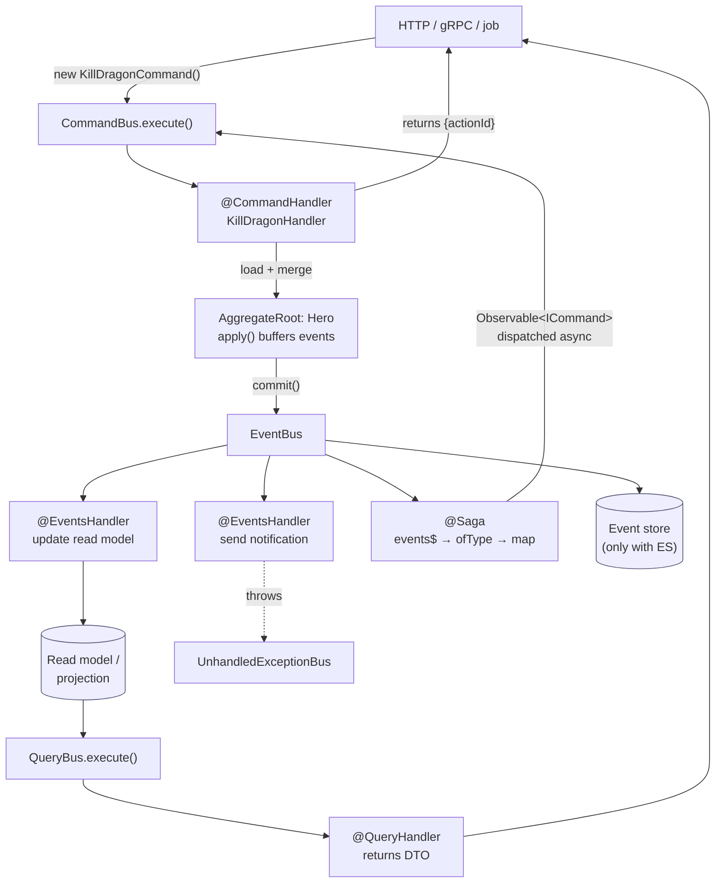

# Chapter 53 — CQRS, Sagas, and Event Sourcing

> **한눈에 보기**
> CQRS는 "쓰기 모델과 읽기 모델을 분리한다"는 한 줄로 요약되지만, 실제로 도입하면
> 서비스 하나가 커맨드·핸들러·이벤트·프로젝션 대여섯 개로 늘어납니다. 이 장은
> `@nestjs/cqrs`의 모든 부품 — `CommandBus`, `QueryBus`, `EventBus`, `AggregateRoot`,
> `EventPublisher`, `@Saga`, `UnhandledExceptionBus`, `AsyncContext` — 을 빠짐없이 다루되,
> 그보다 먼저 **"당신은 아직 이게 필요 없을 가능성이 높다"** 는 정직한 절을 둡니다.
> 36장의 커스텀 프로바이더와 41장의 `DiscoveryService`가 어떻게 이 모듈의 기반이 되는지,
> 그리고 CQRS 위에 이벤트 소싱을 얹었을 때 무엇을 얻고 무엇을 영구히 감당해야 하는지까지 봅니다.

**What you will learn**

- Precisely which problems CQRS solves — and the four cheaper fixes you should try first.
- How to route state changes through `CommandBus` with typed `Command<T>` return values, and reads through `QueryBus`, without turning your codebase into indirection soup.
- Why `AggregateRoot.apply()` *buffers* events instead of publishing them, and what `commit()`, `autoCommit`, `mergeObjectContext()`, and `mergeClassContext()` each do about it.
- Three ways to make a domain object an aggregate root — inheritance, the `WithAggregateRoot` mixin, and implementing `IAggregateRoot` — and when each is right.
- How to write a saga as an RxJS process manager, plus the ordering, error, and at-most-once caveats that make naive sagas dangerous.
- Why exception filters cannot catch errors in event handlers, and how `UnhandledExceptionBus` fills the gap.
- Request scoping in CQRS via `AsyncContext`, and how a saga recovers the originating request context.
- What event sourcing adds on top: the event store, rehydration, snapshots, projections, eventual consistency — and an honest accounting of the operational cost.

**Why this matters**

The layered CRUD application is a good default. Controller → service → repository → entity, with the entity carrying getters and setters. It is easy to teach, easy to read, and correct for the overwhelming majority of features anyone will ever ship. This chapter is about the minority of cases where it stops working, and about recognising which case you are in before you rewrite anything.

The specific failure looks like this. A `OrdersService` starts at 80 lines. Two years later it is 2,400 lines, because `placeOrder` must also reserve inventory, charge a card, award loyalty points, email a receipt, notify the warehouse, and update three analytics tables. Every one of those was a reasonable one-line addition at the time. Now the method takes four seconds, any of six external systems can fail it halfway, and nobody can change the loyalty rules without risking checkout. Meanwhile the read side has its own problem: the order list page needs data from six tables, so it either does six joins on every page load or maintains a hand-rolled denormalised table that drifts.

CQRS addresses both by refusing to let them share a model. Writes go through **commands** — one intent, one handler, one transaction — and the side effects become **events** that other handlers subscribe to. Reads go through **queries** against a model shaped for reading, which may be a different table, a different database, or a materialised view. The `placeOrder` handler shrinks back to eighty lines because awarding loyalty points is now somebody else's subscription.

What it costs is real and worth stating up front: more files, indirection between an HTTP request and the code that runs, eventual consistency you must explain to your product team, and a class of bug — the event handler that failed silently — that does not exist in a transactional CRUD app. My recommendation is unambiguous: **do not adopt CQRS across an application.** Adopt it inside the one or two bounded contexts whose complexity actually demands it, keep the rest CRUD, and never adopt event sourcing at the same time as CQRS. They are separable, and coupling the two decisions is how teams end up with a system nobody can operate.

---

## What CQRS actually separates

The name is Command Query Responsibility Segregation, and every word is load-bearing except "Segregation."

A **command** expresses an intent to change state. It is imperative and task-based: `KillDragonCommand`, `CancelSubscriptionCommand`, `ApplyDiscountCommand`. It is not data-centric: `UpdateOrderCommand(orderId, patch)` is a CRUD update wearing a costume, and it teaches you nothing about why the order changed. That distinction is the single highest-value idea in the pattern, and you get most of the benefit from it even without a bus.

A **query** expresses a request for data. It is declarative and data-centric: `GetHeroQuery`, `ListOrdersForCustomerQuery`. It must not change state — not a "last accessed" timestamp, not a counter. That prohibition is what lets you route queries to a replica, a cache, or a completely different store.

The **responsibility segregation** is between the *write model* and the *read model*. This is the part people skip, and skipping it means adopting the ceremony without the benefit.

| | Write model | Read model |
|---|---|---|
| Optimised for | Enforcing invariants | Answering one screen's question |
| Shape | Normalised, aggregate-oriented | Denormalised, per-view |
| Consistency | Strong, transactional | Often eventual |
| Volume | Low (a few writes/sec) | High (many reads/sec) |
| Scaling | Vertical, single writer | Horizontal, many replicas |
| Typical store | Postgres | Postgres view, Elasticsearch, Redis, a projection table |

If your read model and write model are the same tables accessed through the same repository, you have adopted `CommandBus` and `QueryBus` as a message-passing convention. That is defensible — it does buy you decoupling and a natural place for cross-cutting concerns — but call it what it is, and do not expect the scalability benefits.

### An honest "you probably do not need this yet"

Before writing a single command class, try these. Each is cheaper, reversible, and solves a large share of what people reach for CQRS to solve.

1. **Split the fat service by use case.** `PlaceOrderService`, `CancelOrderService`, `RefundOrderService` — three classes, three files, no bus. You get most of the single-responsibility benefit for none of the indirection. If this feels good and the pain goes away, stop here.
2. **Use in-process events.** `@nestjs/event-emitter` ([Chapter 34](../part2-intermediate/34-scheduling-and-events.md)) decouples side effects from the primary action with a tenth of the machinery. Loyalty points move out of checkout; nothing else changes.
3. **Add a read-optimised view.** A materialised view or a denormalised table refreshed by a trigger fixes the six-join list page without touching the write path.
4. **Move slow side effects to a queue.** BullMQ ([Chapter 35](../part2-intermediate/35-queues.md)) makes checkout fast and makes retries somebody's job. This is usually the highest-value change of the four.

Reach for CQRS when you have done those and still face at least two of:

- Genuinely different read and write **scaling** profiles (orders of magnitude, not 2×).
- A domain with **real invariants** that span several entities and must be enforced in one place.
- Many **independent reactions** to one state change, owned by different teams.
- A requirement for an **audit log of intent** — not just what the row says now, but who did what and why.
- A read model that must live in a **different store** (search, analytics) than the write model.

And here is the decision table for the three positions:

| | **CRUD** | **CQRS** | **CQRS + Event Sourcing** |
|---|---|---|---|
| Source of truth | Current-state rows | Current-state rows | Append-only event stream |
| Read a record | `SELECT` | Query handler → read model | Rehydrate from events, or read a projection |
| History | Whatever you audit-logged | Domain events, if you persist them | Complete, by construction |
| "What did it look like on 3 March?" | Impossible | Impossible | Free |
| Fix a bug in derived data | Data migration | Rebuild the projection | Rebuild the projection |
| Fix a bug in domain logic | Data migration | Data migration | Replay events through new logic |
| Consistency | Strong | Strong writes, eventual reads | Eventual, plus versioning concerns |
| Schema change | Migration | Migration | **Event versioning — forever** |
| Delete a user's data (GDPR) | `DELETE` | `DELETE` | Hard. Crypto-shredding or rewriting history |
| New files per feature | ~3 | ~8 | ~12 |
| Onboarding a new engineer | Hours | Days | Weeks |
| Right for | Almost everything | Complex domains, divergent read/write load | Finance, audit, temporal domains |

The row I want you to look at twice is **event versioning**. In CRUD you migrate a table once and the old shape is gone. In event sourcing, every event you have ever written is immutable and must remain readable by every future version of your code, forever. That is a permanent tax on every schema change, and it is the reason event sourcing is a domain-level decision rather than an architectural preference.

---

## Setup

```bash
$ npm install --save @nestjs/cqrs
```

```typescript title="src/app.module.ts"
import { Module } from '@nestjs/common';
import { CqrsModule } from '@nestjs/cqrs';

@Module({
  imports: [CqrsModule.forRoot()],
})
export class AppModule {}
```

`forRoot()` registers the three buses globally and starts a discovery pass — the same `DiscoveryService` mechanism from [Chapter 41](./41-module-ref-discovery-lazy.md) — that finds every `@CommandHandler`, `@QueryHandler`, `@EventsHandler`, and `@Saga` in the container and binds them. This is why handlers must be registered as ordinary providers: if the container does not know about a class, discovery cannot see it, and your command silently has no handler.

The optional configuration object:

| Attribute | Description | Default |
|---|---|---|
| `commandPublisher` | Publisher responsible for dispatching commands to the system. | `DefaultCommandPubSub` |
| `eventPublisher` | Publisher used to publish events, allowing them to be broadcast or processed. | `DefaultPubSub` |
| `queryPublisher` | Publisher used for publishing queries, which trigger data-retrieval operations. | `DefaultQueryPubSub` |
| `unhandledExceptionPublisher` | Publisher responsible for handling unhandled exceptions, ensuring they are tracked and reported. | `DefaultUnhandledExceptionPubSub` |
| `eventIdProvider` | Service that provides unique event IDs by generating them or retrieving them from event instances. | `DefaultEventIdProvider` |
| `rethrowUnhandled` | Whether unhandled exceptions should be rethrown after being processed — useful for debugging and error management. | `false` |

The publishers are the extension point for taking a bus off-process. Swapping `eventPublisher` for one that writes to Kafka ([Chapter 47](./47-kafka.md)) is how a single-process CQRS app becomes a distributed one without changing a handler. Do not do this on day one; the in-process defaults are correct until they are not.

`rethrowUnhandled: true` is worth turning on in development. It converts a silently-swallowed event-handler error into a crash you cannot ignore.

---

## Commands

A command is a plain class carrying intent. Extending `Command<T>` is optional and buys you a typed result:

```typescript title="src/heroes/commands/kill-dragon.command.ts"
import { Command } from '@nestjs/cqrs';

export class KillDragonCommand extends Command<{
  actionId: string; // This type represents the command execution result
}> {
  constructor(
    public readonly heroId: string,
    public readonly dragonId: string,
  ) {
    super();
  }
}
```

Dispatch it:

```typescript title="src/heroes/heroes-game.service.ts"
import { Injectable } from '@nestjs/common';
import { CommandBus } from '@nestjs/cqrs';
import { KillDragonCommand } from './commands/kill-dragon.command';

@Injectable()
export class HeroesGameService {
  constructor(private commandBus: CommandBus) {}

  async killDragon(heroId: string, killDragonDto: KillDragonDto) {
    return this.commandBus.execute(
      new KillDragonCommand(heroId, killDragonDto.dragonId),
    );
  }
}
```

Because `KillDragonCommand extends Command<{ actionId: string }>`, `execute()` is inferred as `Promise<{ actionId: string }>`. No cast, no `any`. That inference is the entire reason the `Command` base class exists.

> **Hint** — Inheritance from `Command` is optional. It is only necessary if you want to define the return type of the command.

The handler:

```typescript title="src/heroes/commands/kill-dragon.handler.ts"
import { CommandHandler, ICommandHandler } from '@nestjs/cqrs';
import { randomUUID } from 'node:crypto';
import { HeroesRepository } from '../heroes.repository';
import { KillDragonCommand } from './kill-dragon.command';

@CommandHandler(KillDragonCommand)
export class KillDragonHandler implements ICommandHandler<KillDragonCommand> {
  constructor(private repository: HeroesRepository) {}

  async execute(command: KillDragonCommand) {
    const { heroId, dragonId } = command;
    const hero = this.repository.findOneById(+heroId);

    hero.killEnemy(dragonId);
    await this.repository.persist(hero);

    // "ICommandHandler<KillDragonCommand>" forces you to return a value
    // that matches the command's return type
    return {
      actionId: randomUUID(), // This value will be returned to the caller
    };
  }
}
```

Register it as a provider — discovery only sees what the container knows:

```typescript
providers: [KillDragonHandler];
```

Four rules that keep commands useful rather than ceremonial:

**Exactly one handler per command.** Registering two for the same command is an error; the bus routes by constructor identity, not by pattern. If two things must happen, the second one subscribes to an *event*.

**Commands may be rejected.** A command is a request, not a fact. Throwing from a handler is the correct way to say no, and — unlike event handlers — those exceptions propagate back through `execute()` and are caught by ordinary [exception filters](../part1-beginner/09-exception-filters.md), so an HTTP caller gets a proper 409.

**Return the minimum.** An id, a status, nothing. The moment a command returns a full entity, callers start using `execute()` as a read path and you have lost the separation. `{ actionId }` above is a good shape.

**Name them in the imperative, after the intent.** `CancelSubscriptionCommand`, not `UpdateSubscriptionStatusCommand`. Six months later the name is the only documentation of why the change was allowed.

---

## Queries

Structurally identical, semantically opposite.

```typescript title="src/heroes/queries/get-hero.query.ts"
import { Query } from '@nestjs/cqrs';
import { Hero } from '../models/hero.model';

export class GetHeroQuery extends Query<Hero> {
  constructor(public readonly heroId: string) {
    super();
  }
}
```

```typescript title="src/heroes/queries/get-hero.handler.ts"
import { IQueryHandler, QueryHandler } from '@nestjs/cqrs';
import { HeroesRepository } from '../heroes.repository';
import { GetHeroQuery } from './get-hero.query';

@QueryHandler(GetHeroQuery)
export class GetHeroHandler implements IQueryHandler<GetHeroQuery> {
  constructor(private repository: HeroesRepository) {}

  async execute(query: GetHeroQuery) {
    return this.repository.findOneById(query.heroId);
  }
}
```

```typescript
providers: [GetHeroHandler];
```

```typescript
const hero = await this.queryBus.execute(new GetHeroQuery(heroId));
// "hero" is auto-inferred as "Hero"
```

The query handler is where the read/write split becomes concrete. Nothing forces `GetHeroHandler` to use the same repository as `KillDragonHandler`. In a mature CQRS module it does not: the command handler talks to a domain repository that loads aggregates and enforces invariants; the query handler talks to a read-model repository that runs one flat SQL statement against a projection table and returns a DTO. Neither knows the other exists.

The discipline that makes this pay off is that **query handlers return DTOs, not entities**. An entity has behaviour and invariants that only make sense on the write side. Returning it from a query invites a caller to mutate it, and couples your API shape to your domain shape — the exact coupling [Chapter 16](../part2-intermediate/16-serialization.md) exists to prevent.

---

## Events

Events are statements of fact in the past tense. They have already happened; nobody can veto them.

```typescript title="src/heroes/events/hero-killed-dragon.event.ts"
export class HeroKilledDragonEvent {
  constructor(
    public readonly heroId: string,
    public readonly dragonId: string,
  ) {}
}
```

Publish directly when you have no aggregate to speak of:

```typescript
this.eventBus.publish(new HeroKilledDragonEvent(heroId, dragonId));
this.eventBus.publishAll([evt1, evt2, evt3]);
```

> **Hint** — The `EventBus` is an injectable class.

Handle it — and note that **each event can have multiple handlers**, unlike commands:

```typescript title="src/heroes/events/hero-killed-dragon.handler.ts"
import { EventsHandler, IEventHandler } from '@nestjs/cqrs';
import { HeroKilledDragonEvent } from './hero-killed-dragon.event';

@EventsHandler(HeroKilledDragonEvent)
export class HeroKilledDragonHandler implements IEventHandler<HeroKilledDragonEvent> {
  constructor(private repository: HeroesRepository) {}

  handle(event: HeroKilledDragonEvent) {
    // Business logic
  }
}
```

```typescript
providers: [HeroKilledDragonHandler];
```

One decorator can register a handler for several events, which is how you build a projection that reacts to a whole family:

```typescript
@EventsHandler(HeroKilledDragonEvent, HeroLeveledUpEvent, HeroDiedEvent)
export class HeroStatsProjection
  implements IEventHandler<HeroKilledDragonEvent | HeroLeveledUpEvent | HeroDiedEvent>
{
  async handle(event: HeroKilledDragonEvent | HeroLeveledUpEvent | HeroDiedEvent) {
    if (event instanceof HeroKilledDragonEvent) { /* … */ }
  }
}
```

### The rule that surprises everyone

> **⚠️ Notice** — Be aware that when you start using event handlers you get out of the traditional HTTP web context.
>
> - Errors in `CommandHandlers` can still be caught by built-in [exception filters](../part1-beginner/09-exception-filters.md).
> - Errors in `EventHandlers` **cannot** be caught by exception filters. You have to handle them manually — a `try/catch`, a saga triggering a compensating event, or whatever other solution you choose.
> - HTTP responses in `CommandHandlers` can still be sent back to the client.
> - HTTP responses in `EventHandlers` cannot. To push information to the client, use [WebSockets](./44-websockets.md), [SSE](./57-advanced-http.md), or another mechanism.

This is not a limitation of the library; it is the definition of the pattern. By the time an event handler runs, the command has returned and the HTTP response may already be on the wire. There is no request to attach an error to. The consequence for your code is concrete: **every event handler needs its own error strategy**, and "let it throw" is not one. Wrap the body, log with the event's identity, and either retry, emit a compensating event, or record a failure for a reconciliation job.

---

## Aggregate roots and the event buffer

Publishing events from a command handler works, but it puts domain knowledge in the wrong place. The handler has to know that killing an enemy is worth an event. The model should know that.

```typescript title="src/heroes/models/hero.model.ts"
import { AggregateRoot } from '@nestjs/cqrs';
import { HeroKilledDragonEvent } from '../events/hero-killed-dragon.event';

export class Hero extends AggregateRoot {
  constructor(private id: string) {
    super();
  }

  killEnemy(enemyId: string) {
    // Business logic — invariants enforced here
    this.apply(new HeroKilledDragonEvent(this.id, enemyId));
  }
}
```

`apply()` does **not** publish. It appends to an internal uncommitted-events array. That buffering is deliberate and is the most important mechanic in this section:

- The aggregate can apply several events across several method calls and they are published **together, in order**, or not at all.
- If the transaction that persists the aggregate fails, you simply never call `commit()`, and no subscriber ever hears about a change that did not happen.
- Handlers do not run in the middle of your domain logic, so the aggregate cannot be observed half-mutated.

The model has no reference to `EventBus` — good, since a domain object should not import framework infrastructure. `EventPublisher` supplies the connection:

```typescript title="src/heroes/commands/kill-dragon.handler.ts"
import { CommandHandler, EventPublisher, ICommandHandler } from '@nestjs/cqrs';

@CommandHandler(KillDragonCommand)
export class KillDragonHandler implements ICommandHandler<KillDragonCommand> {
  constructor(
    private repository: HeroesRepository,
    private publisher: EventPublisher,
  ) {}

  async execute(command: KillDragonCommand) {
    const { heroId, dragonId } = command;
    const hero = this.publisher.mergeObjectContext(
      await this.repository.findOneById(+heroId),
    );
    hero.killEnemy(dragonId);
    hero.commit();
  }
}
```

`mergeObjectContext()` attaches the publisher to the instance — it must implement `IAggregateRoot` or extend `AggregateRoot` — and returns it. `commit()` then flushes every buffered event to the `EventBus` and clears the buffer.

Forgetting `commit()` is the number-one CQRS bug. There is no error. `apply()` succeeded, the aggregate saved, the HTTP response is 200, and no projection ever updates. The symptom shows up hours later as "the dashboard is wrong."

Two ways to avoid it. Set `autoCommit`:

```typescript
export class Hero extends AggregateRoot {
  constructor(private id: string) {
    super();
    this.autoCommit = true;
  }
}
```

With `autoCommit = true`, each `apply()` publishes immediately. You lose the atomic-batch property, so use it only when the aggregate performs exactly one mutation per command — which is common enough to make this a reasonable default in simple domains, and wrong in any domain where a command can apply three events and then fail validation on the fourth.

Or merge into the class rather than an instance:

```typescript
const HeroModel = this.publisher.mergeClassContext(Hero);
const hero = new HeroModel('id'); // <-- HeroModel is a class
```

Now every instance of `HeroModel` can publish without a per-instance `mergeObjectContext()` call. This is the right tool when the handler *creates* aggregates rather than loading them: a freshly-constructed `new Hero(id)` has no publisher merged into it, and calling `commit()` on it does nothing at all.

The reliable pattern is to put the merge inside the repository so no handler can forget:

```typescript title="src/heroes/heroes.repository.ts"
@Injectable()
export class HeroesRepository {
  constructor(private readonly publisher: EventPublisher) {}

  async findOneById(id: number): Promise<Hero> {
    const row = await this.db.heroes.findUnique({ where: { id } });
    return this.publisher.mergeObjectContext(Hero.fromRow(row));
  }

  create(id: string): Hero {
    const HeroModel = this.publisher.mergeClassContext(Hero);
    return new HeroModel(id);
  }
}
```

### Three ways to be an aggregate root

`AggregateRoot` is a concrete class, and JavaScript has single inheritance. If your entities already extend `BaseEntity`, `Monster`, or a TypeORM base class, you are stuck. `@nestjs/cqrs` offers three approaches.

**Approach 1: Traditional (class inheritance).** The default, correct for greenfield code and simple hierarchies.

```typescript
export class Hero extends AggregateRoot {
  constructor(private id: string) {
    super();
  }

  killEnemy(enemyId: string) {
    this.apply(new HeroKilledDragonEvent(this.id, enemyId));
  }
}
```

**Approach 2: Mixin (for existing hierarchies).** `WithAggregateRoot<EventBase, TBase>()` applies aggregate-root behaviour to any base class.

```typescript title="src/monsters/dragon.model.ts"
import { WithAggregateRoot } from '@nestjs/cqrs';

abstract class Monster {
  constructor(protected readonly id: string) {}
  abstract roar(): void;
}

export class Dragon extends WithAggregateRoot(Monster) {
  roar(): void {
    console.log('Roarrrr!');
  }

  die(): void {
    this.roar();
    this.apply(new DragonDiedEvent(this.id)); // Now available via mixin!
  }
}
```

**Approach 3: Custom implementation.** For maximum control, or to keep the domain layer framework-agnostic, implement `IAggregateRoot` directly. `EventPublisher` accepts anything satisfying the interface.

```typescript
import { IAggregateRoot, IEvent } from '@nestjs/cqrs';

export class CustomEntity implements IAggregateRoot {
  private events: IEvent[] = [];

  getUncommittedEvents() {
    return this.events;
  }

  publish(event: IEvent) {
    // custom logic
  }

  commit() {
    // custom logic
  }

  uncommit() {
    // custom logic
  }

  apply(event: IEvent) {
    this.events.push(event);
  }

  loadFromHistory(history: IEvent[]) {
    // custom logic
  }
}
```

All three work with `EventPublisher`. My recommendation: start with inheritance; move to the mixin when an ORM base class forces your hand; use approach 3 only when you have a genuine policy of zero framework imports in the domain layer — and note that `loadFromHistory()` in that interface is the hook event sourcing uses, which we return to below.

---

## Sagas

A saga is a **process manager**: a long-running listener that watches the event stream and issues new commands in response. It is how you express "when X happens, eventually Y should happen" without X's handler knowing about Y.

```typescript title="src/heroes/sagas/heroes-game.saga.ts"
import { Injectable } from '@nestjs/common';
import { ICommand, Saga, ofType } from '@nestjs/cqrs';
import { Observable, map } from 'rxjs';
import { HeroKilledDragonEvent } from '../events/hero-killed-dragon.event';
import { DropAncientItemCommand } from '../commands/drop-ancient-item.command';

@Injectable()
export class HeroesGameSagas {
  @Saga()
  dragonKilled = (events$: Observable<any>): Observable<ICommand> => {
    return events$.pipe(
      ofType(HeroKilledDragonEvent),
      map((event) => new DropAncientItemCommand(event.heroId, fakeItemID)),
    );
  };
}
```

```typescript
providers: [HeroesGameSagas];
```

> **Hint** — The `ofType` operator and the `@Saga()` decorator are exported from `@nestjs/cqrs`.

The mechanics: `@Saga()` marks a **property** (an arrow function, not a method — `this` binding matters) that receives an `Observable` of every event on the bus and returns an `Observable<ICommand>`. Every command emitted is dispatched **asynchronously** by the `CommandBus`. `ofType()` filters by constructor; `map` transforms.

The full RxJS vocabulary is available, which is what makes sagas powerful. A single saga may listen for many event types, and correlate them:

```typescript
@Saga()
orderFulfilment = (events$: Observable<any>): Observable<ICommand> =>
  events$.pipe(
    ofType(PaymentCapturedEvent),
    // Wait for stock reservation for the same order, but no longer than 30 s
    mergeMap((payment) =>
      events$.pipe(
        ofType(StockReservedEvent),
        filter((stock) => stock.orderId === payment.orderId),
        take(1),
        timeout(30_000),
        map(() => new ShipOrderCommand(payment.orderId)),
        catchError(() => of(new CancelOrderCommand(payment.orderId, 'stock timeout'))),
      ),
    ),
  );
```

That is a two-step distributed workflow with a compensating action, in twelve lines. It is also where the caveats begin, and they are severe enough that I want them itemised.

**The stream is hot and unbuffered.** A saga sees events published *after* it subscribes. Events during startup, or while the process was down, are gone. A saga is not a durable workflow engine.

**A thrown error kills the saga.** In RxJS, an error terminates the observable. If a `map` throws, that saga stops processing events for the lifetime of the process — silently. Every saga must be defensive:

```typescript
@Saga()
dragonKilled = (events$: Observable<any>): Observable<ICommand> =>
  events$.pipe(
    ofType(HeroKilledDragonEvent),
    mergeMap((event) =>
      of(event).pipe(
        map((e) => new DropAncientItemCommand(e.heroId, this.pickItem(e))),
        catchError((err) => {
          this.logger.error({ err, event }, 'saga step failed');
          return EMPTY; // swallow this one; keep the saga alive
        }),
      ),
    ),
  );
```

The inner-observable-plus-`catchError` shape is the idiom. `catchError` on the outer stream would catch the error and then complete the outer stream — killing the saga anyway.

**Ordering is not guaranteed across sagas.** Two sagas reacting to the same event issue their commands concurrently. If `DropAncientItemCommand` must run after `AwardExperienceCommand`, express that with a second event, not with hope.

**Delivery is at-most-once, in-process.** No retry, no persistence, no dead-letter. If the process dies between the event and the command, nothing replays it. For workflows where a lost step means a lost customer order, put a durable queue ([Chapter 35](../part2-intermediate/35-queues.md)) or a broker ([Chapter 46](./46-message-brokers.md)) underneath, and treat the saga as a dispatcher into it rather than as the workflow itself.

**Sagas are always singletons.** They manage long-running processes, so request scoping does not apply — see the request-scoping section for how to recover context anyway.



Trace the loop: a command mutates one aggregate, the aggregate emits events, events fan out to projections and to sagas, and a saga can issue another command — closing the cycle. The dashed line is the escape hatch for the one path that has no caller to report to.

---

## Unhandled exceptions

Because event-handler errors have nowhere to go, the `EventBus` catches them, wraps them in an `UnhandledExceptionInfo`, and pushes them onto the `UnhandledExceptionBus` — an `Observable` you subscribe to.

```typescript title="src/observability/exception-monitor.service.ts"
import { Injectable, OnModuleDestroy } from '@nestjs/common';
import { UnhandledExceptionBus } from '@nestjs/cqrs';
import { Subject, takeUntil } from 'rxjs';

@Injectable()
export class ExceptionMonitor implements OnModuleDestroy {
  private destroy$ = new Subject<void>();

  constructor(private unhandledExceptionsBus: UnhandledExceptionBus) {
    this.unhandledExceptionsBus
      .pipe(takeUntil(this.destroy$))
      .subscribe((exceptionInfo) => {
        // Handle exception here
        // e.g. send it to an external service, terminate the process,
        // or publish a new (compensating) event
      });
  }

  onModuleDestroy() {
    this.destroy$.next();
    this.destroy$.complete();
  }
}
```

The `takeUntil(this.destroy$)` + `onModuleDestroy` pair is not optional boilerplate. Without it the subscription outlives the module, which leaks in tests and in [lazily-loaded modules](./41-module-ref-discovery-lazy.md).

Filter by exception type:

```typescript
this.unhandledExceptionsBus
  .pipe(
    takeUntil(this.destroy$),
    UnhandledExceptionBus.ofType(TransactionNotAllowedException),
  )
  .subscribe((exceptionInfo) => {
    // Handle exception here
  });
```

The payload:

```typescript
export interface UnhandledExceptionInfo<
  Cause = IEvent | ICommand,
  Exception = any,
> {
  /** The exception that was thrown. */
  exception: Exception;
  /** The cause of the exception (event or command reference). */
  cause: Cause;
}
```

`cause` is the actual event or command object, which makes this stream genuinely actionable: you can log the aggregate id, re-dispatch, or emit a compensating event with the original data in hand.

Wire this up on day one. An unmonitored `UnhandledExceptionBus` means every projection failure is invisible, and a CQRS system whose projections silently drift is worse than the CRUD app it replaced.

### Subscribing to all events

`CommandBus`, `QueryBus`, and `EventBus` are all `Observable`s. Subscribing to the whole stream is how you build an audit log, a debug tracer, or — as we will see — an event store.

```typescript
private destroy$ = new Subject<void>();

constructor(private eventBus: EventBus) {
  this.eventBus
    .pipe(takeUntil(this.destroy$))
    .subscribe((event) => {
      // Save events to database
    });
}

onModuleDestroy() {
  this.destroy$.next();
  this.destroy$.complete();
}
```

A caveat worth being explicit about: this subscription runs *after* the command has returned, and it is not transactional with the write. If the process dies between the database commit and this subscriber, the event is lost. That gap is exactly what the transactional outbox pattern exists to close, and it is why "subscribe to `EventBus` and write to a table" is a fine audit log and a poor event store.

---

## Request scoping in CQRS

In Nest, most things are shared across requests: connection pools, singleton services with state, everything. Node.js does not use a thread-per-request model, so singletons are safe — a fact worth restating because engineers arriving from Java or .NET often assume otherwise.

Occasionally you do need per-request state: multi-tenancy, per-request caching, request tracking. The buses are singletons, so mixing them with request-scoped providers ([Chapter 38](./38-injection-scopes.md)) would normally be impossible. `@nestjs/cqrs` solves it by creating a new instance of a request-scoped handler for each processed command, query, or event.

Make a handler request-scoped either by depending on a request-scoped provider, or explicitly:

```typescript
@CommandHandler(KillDragonCommand, {
  scope: Scope.REQUEST,
})
export class KillDragonHandler {
  // Implementation here
}
```

The "request" in a CQRS handler is not necessarily an HTTP request — it could be a scheduled job, a message from a broker, or a CLI invocation. So the payload must be an instance of a class extending `AsyncContext`:

```typescript
import { AsyncContext } from '@nestjs/cqrs';

export class MyRequest extends AsyncContext {
  constructor(public readonly user: User) {
    super();
  }
}
```

Pass it as the second argument to `execute()`:

```typescript
const myRequest = new MyRequest(user);
await this.commandBus.execute(
  new KillDragonCommand(heroId, killDragonDto.dragonId),
  myRequest,
);
```

And inject it with the standard `REQUEST` token:

```typescript
@CommandHandler(KillDragonCommand, {
  scope: Scope.REQUEST,
})
export class KillDragonHandler {
  constructor(
    @Inject(REQUEST) private request: MyRequest, // Inject the request context
  ) {}
}
```

Queries work identically:

```typescript
const myRequest = new MyRequest(user);
const hero = await this.queryBus.execute(new GetHeroQuery(heroId), myRequest);
```

```typescript
@QueryHandler(GetHeroQuery, { scope: Scope.REQUEST })
export class GetHeroHandler {
  constructor(@Inject(REQUEST) private request: MyRequest) {}
}
```

For events, passing the context to `EventBus#publish` is possible but uncommon. The idiomatic route is to merge it into the model alongside the publisher, so every event the aggregate emits carries it:

```typescript
const hero = this.publisher.mergeObjectContext(
  await this.repository.findOneById(+heroId),
  this.request, // Inject the request context here
);
```

Request-scoped event handlers subscribing to those events then get the context.

Sagas are always singletons, but they can pull the context back off an event and forward it into the command they produce:

```typescript
@Saga()
dragonKilled = (events$: Observable<any>): Observable<ICommand> => {
  return events$.pipe(
    ofType(HeroKilledDragonEvent),
    map((event) => {
      const request = AsyncContext.of(event); // Retrieve the request context
      const command = new DropAncientItemCommand(event.heroId, fakeItemID);

      AsyncContext.merge(request, command); // Merge the request context into the command
      return command;
    }),
  );
};
```

`request.attachTo(command)` is the equivalent shorthand.

A note on cost: request-scoped handlers are instantiated per command, which means the whole injection subtree below them is too. That is measurably slower and it defeats provider-level caching. Compare against [`AsyncLocalStorage`](./43-async-local-storage.md), which propagates a request context to singletons with none of the instantiation cost. My recommendation is ALS for tracing and tenancy, and request-scoped CQRS handlers only when you genuinely need per-request *dependency resolution* rather than per-request *data*.

---

## Event sourcing

Everything so far is CQRS. Event sourcing is a separate decision, and this is where it goes.

### The idea

In a normal system the database holds current state, and events (if you emit them) are a notification side-channel. In event sourcing that is inverted: **the ordered stream of events is the source of truth**, and current state is a derived value you compute by folding over it.

A bank account is the canonical example because it is literally how banks work. You do not store a balance; you store deposits and withdrawals, and the balance is their sum. The advantages fall out immediately: complete history, the ability to answer "what was the balance on 3 March?", and a full audit trail nobody has to remember to write.

```typescript title="src/accounts/models/account.model.ts"
import { AggregateRoot, IEvent } from '@nestjs/cqrs';

export class Account extends AggregateRoot {
  private balance = 0;
  private closed = false;

  constructor(public readonly id: string) {
    super();
  }

  // ---- Commands: enforce invariants, then apply an event. -----------------
  deposit(amount: number) {
    if (this.closed) throw new AccountClosedError(this.id);
    if (amount <= 0) throw new InvalidAmountError(amount);
    this.apply(new MoneyDepositedEvent(this.id, amount));
  }

  withdraw(amount: number) {
    if (this.closed) throw new AccountClosedError(this.id);
    if (amount > this.balance) throw new InsufficientFundsError(this.id, amount, this.balance);
    this.apply(new MoneyWithdrawnEvent(this.id, amount));
  }

  // ---- Reducers: mutate state from an event. Never validate here. ---------
  onMoneyDepositedEvent(event: MoneyDepositedEvent) {
    this.balance += event.amount;
  }

  onMoneyWithdrawnEvent(event: MoneyWithdrawnEvent) {
    this.balance -= event.amount;
  }

  onAccountClosedEvent(_event: AccountClosedEvent) {
    this.closed = true;
  }
}
```

The naming convention is the mechanism: `AggregateRoot` looks for a method named `on<EventClassName>` and calls it when an event is applied *or* replayed. That gives you one set of state transitions used by both paths.

The split between the two halves of that class is the discipline event sourcing demands. **Command methods validate and emit. Reducer methods mutate and never throw.** If a reducer can reject an event, replay can fail — and replay must never fail, because those events are history and history is not negotiable.

### Rehydration

Loading an aggregate means reading its stream and folding:

```typescript title="src/accounts/accounts.repository.ts"
import { Injectable } from '@nestjs/common';
import { EventPublisher } from '@nestjs/cqrs';
import { EventStore } from '../event-store/event-store';
import { Account } from './models/account.model';

@Injectable()
export class AccountsRepository {
  constructor(
    private readonly store: EventStore,
    private readonly publisher: EventPublisher,
  ) {}

  async load(id: string): Promise<Account> {
    const snapshot = await this.store.latestSnapshot(id);
    const account = snapshot
      ? Account.fromSnapshot(snapshot)
      : new Account(id);

    const history = await this.store.readStream(id, snapshot?.version ?? 0);
    account.loadFromHistory(history);   // replays through on<Event> methods

    return this.publisher.mergeObjectContext(account);
  }

  async save(account: Account, expectedVersion: number): Promise<void> {
    const events = account.getUncommittedEvents();
    if (events.length === 0) return;

    // Optimistic concurrency: fails if another writer advanced the stream.
    await this.store.append(account.id, events, expectedVersion);

    account.commit();  // publish to the in-process EventBus for projections
  }
}
```

`loadFromHistory()` is the `AggregateRoot` method that replays events through your `on<Event>` reducers **without** adding them to the uncommitted buffer. Using `apply()` for replay instead would re-publish your entire history on every load — a bug that is spectacular in production and invisible in a unit test with three events.

`expectedVersion` is how event-sourced systems do concurrency control. The store's `append` refuses if the stream's current version is not what you read, and the command handler retries. It is optimistic locking with the stream position as the version, and you get it essentially for free.

### Snapshots

Folding 400,000 events to answer one query is not viable. A snapshot is a cached fold: serialise the aggregate's state at version N, and on the next load start from the snapshot and replay only events after N.

```typescript
// Every 100 events, write a snapshot.
if (newVersion % 100 === 0) {
  await this.store.saveSnapshot(account.id, newVersion, account.toSnapshot());
}
```

Two rules. Snapshots are a **cache, never a source of truth** — deleting them all must leave the system correct, only slower, and that is the property you should test. And snapshots are versioned data: when the aggregate's shape changes, either version the snapshot format or discard existing snapshots and let them rebuild.

### Projections and eventual consistency

The write side is now events, which nothing can query usefully. Projections build the read models:

```typescript title="src/accounts/projections/account-balance.projection.ts"
@EventsHandler(MoneyDepositedEvent, MoneyWithdrawnEvent, AccountClosedEvent)
export class AccountBalanceProjection
  implements IEventHandler<MoneyDepositedEvent | MoneyWithdrawnEvent | AccountClosedEvent>
{
  constructor(private readonly db: PrismaService) {}

  async handle(event: MoneyDepositedEvent | MoneyWithdrawnEvent | AccountClosedEvent) {
    try {
      if (event instanceof MoneyDepositedEvent) {
        await this.db.accountBalance.upsert({
          where: { accountId: event.accountId },
          create: { accountId: event.accountId, balance: event.amount },
          update: { balance: { increment: event.amount } },
        });
      } else if (event instanceof MoneyWithdrawnEvent) {
        await this.db.accountBalance.update({
          where: { accountId: event.accountId },
          data: { balance: { decrement: event.amount } },
        });
      } else {
        await this.db.accountBalance.update({
          where: { accountId: event.accountId },
          data: { closed: true },
        });
      }
    } catch (err) {
      // Event handlers get no exception filter. This is the only safety net.
      this.logger.error({ err, event }, 'projection failed');
      throw err; // → UnhandledExceptionBus
    }
  }
}
```

Because the projection runs after the command returns, the read model is **eventually consistent**. Usually the lag is milliseconds. Occasionally it is seconds. Always it is non-zero, and your UI must cope:

- Read-your-writes: return the new state from the command (an id and a version), and have the client render optimistically.
- Version tokens: the command returns a version; the read endpoint can wait briefly for the projection to reach it.
- Explicit UI: "Processing…" is an honest answer and better than showing stale data as if it were fresh.

The compensation is the property that justifies the whole approach: **you can delete a projection and rebuild it from the event stream.** A bug in the balance calculation is not a data migration; it is a code fix plus a replay. A new report someone wants next quarter can be computed over three years of history that you already have. Nothing in a CRUD system offers that.

### The operational cost — stated plainly

Everything below is permanent. Read it before, not after.

**Event versioning is forever.** An event written in 2024 must be deserialisable by your 2029 code. In practice: never remove a field, never change a field's meaning, add new fields as optional, and when a change is genuinely breaking, write `MoneyDepositedEventV2` and an upcaster that converts V1 to V2 on read. Nobody enjoys this, and everybody who does event sourcing does it.

**Deletion is hard.** "Delete all data for this user" meets an append-only immutable log. The standard answer is crypto-shredding: encrypt personal fields with a per-subject key, and delete the key. Design this in from the start; retrofitting it means rewriting history, which defeats the point.

**Debugging requires new tools.** "Why is this balance wrong?" is answered by reading a stream, not by looking at a row. You need a way to dump a stream, replay it locally, and diff the result. Build that tooling in week one; you will use it every week thereafter.

**Testing changes shape.** The natural unit test becomes given-events → when-command → then-events:

```typescript
it('rejects a withdrawal that exceeds the balance', () => {
  const account = new Account('acc-1');
  account.loadFromHistory([
    new MoneyDepositedEvent('acc-1', 100),
    new MoneyWithdrawnEvent('acc-1', 30),
  ]);

  expect(() => account.withdraw(100)).toThrow(InsufficientFundsError);
  expect(account.getUncommittedEvents()).toHaveLength(0);
});
```

This style is genuinely excellent — expressive, fast, no database — and is one of the real pleasures of the approach.

**Storage grows without bound**, and archival is a project of its own.

**Every new engineer needs weeks, not hours.** In a team of four with turnover, that is a material and recurring cost.

Which is why the recommendation stands: event-source the one aggregate whose history is genuinely part of the product — the ledger, the policy, the audit trail — and leave everything else as rows in a table.

---

## Common mistakes

1. **Forgetting `commit()`.**
   *Symptom:* Business logic runs, the write succeeds, no projection updates and no handler fires. No error.
   *Cause:* `apply()` only buffers.
   *Fix:* Call `commit()` after persisting, set `autoCommit = true` for single-event aggregates, or centralise both merge and commit in the repository.

2. **Constructing an aggregate with `new` and expecting events.**
   *Symptom:* `commit()` on a freshly-created aggregate publishes nothing.
   *Cause:* No publisher was merged into that instance.
   *Fix:* `mergeClassContext(Hero)` and construct from the returned class, or `mergeObjectContext()` on the instance.

3. **Letting an event handler throw into the void.**
   *Symptom:* One projection is quietly out of date for weeks.
   *Cause:* Exception filters do not cover event handlers.
   *Fix:* `try/catch` in every handler, subscribe to `UnhandledExceptionBus`, and run with `rethrowUnhandled: true` in development.

4. **A saga that dies on its first error.**
   *Symptom:* The workflow works, then stops permanently after one bad event, with no log line.
   *Cause:* An RxJS error terminates the stream.
   *Fix:* `mergeMap` into an inner observable with `catchError(() => EMPTY)`. Never rely on the outer pipe.

5. **Registering two handlers for one command.**
   *Symptom:* A startup error, or one handler silently winning.
   *Cause:* Commands are one-to-one by design.
   *Fix:* The second concern subscribes to an event instead.

6. **Data-centric commands.**
   *Symptom:* `UpdateOrderCommand(id, patch)` and a handler full of `if (patch.status)` branches.
   *Cause:* CRUD thinking in CQRS clothing.
   *Fix:* Split by intent: `CancelOrderCommand`, `ShipOrderCommand`, `ApplyDiscountCommand`.

7. **Query handlers returning entities.**
   *Symptom:* API responses change shape when the domain model is refactored; callers mutate returned objects.
   *Cause:* No read DTO.
   *Fix:* Return a purpose-built DTO from the read model.

8. **Validating inside an event reducer.**
   *Symptom:* Replaying history throws; an aggregate becomes unloadable.
   *Cause:* An `on<Event>` method that can reject.
   *Fix:* Validate in the command method, before `apply()`. Reducers only mutate.

9. **Using `apply()` to replay history.**
   *Symptom:* Loading one aggregate republishes its entire history; projections double-count.
   *Cause:* `apply()` buffers for publication; `loadFromHistory()` does not.
   *Fix:* `loadFromHistory(events)` for replay, always.

10. **Adopting CQRS and event sourcing in the same sprint.**
    *Symptom:* Six weeks in, nothing works and nobody can explain why.
    *Cause:* Two independent, hard changes entangled.
    *Fix:* CQRS first, in one module, in production, for a quarter. Then decide about event sourcing separately.

---

## Putting it together

One bounded context — accounts — with a command, a query, an aggregate, an event, a projection, a saga, and exception monitoring.

```typescript title="src/accounts/accounts.module.ts"
import { Module } from '@nestjs/common';
import { CqrsModule } from '@nestjs/cqrs';
import { AccountsController } from './accounts.controller';
import { AccountsRepository } from './accounts.repository';
import { WithdrawMoneyHandler } from './commands/withdraw-money.handler';
import { GetBalanceHandler } from './queries/get-balance.handler';
import { AccountBalanceProjection } from './projections/account-balance.projection';
import { OverdraftSagas } from './sagas/overdraft.saga';

@Module({
  imports: [CqrsModule],
  controllers: [AccountsController],
  providers: [
    AccountsRepository,
    WithdrawMoneyHandler,
    GetBalanceHandler,
    AccountBalanceProjection,
    OverdraftSagas,
  ],
})
export class AccountsModule {}
```

```typescript title="src/accounts/commands/withdraw-money.command.ts"
import { Command } from '@nestjs/cqrs';

export class WithdrawMoneyCommand extends Command<{ transactionId: string; version: number }> {
  constructor(
    public readonly accountId: string,
    public readonly amount: number,
  ) {
    super();
  }
}
```

```typescript title="src/accounts/commands/withdraw-money.handler.ts"
import { ConflictException } from '@nestjs/common';
import { CommandHandler, ICommandHandler } from '@nestjs/cqrs';
import { randomUUID } from 'node:crypto';
import { AccountsRepository } from '../accounts.repository';
import { WithdrawMoneyCommand } from './withdraw-money.command';
import { ConcurrencyError } from '../../event-store/errors';

@CommandHandler(WithdrawMoneyCommand)
export class WithdrawMoneyHandler implements ICommandHandler<WithdrawMoneyCommand> {
  constructor(private readonly repository: AccountsRepository) {}

  async execute(command: WithdrawMoneyCommand) {
    // Optimistic concurrency: retry a few times on a version clash.
    for (let attempt = 0; attempt < 3; attempt++) {
      const { account, version } = await this.repository.loadWithVersion(command.accountId);
      account.withdraw(command.amount);          // throws → caught by exception filters
      try {
        await this.repository.save(account, version);
        return { transactionId: randomUUID(), version: version + 1 };
      } catch (err) {
        if (!(err instanceof ConcurrencyError)) throw err;
      }
    }
    throw new ConflictException('Account is being modified concurrently; retry.');
  }
}
```

```typescript title="src/accounts/queries/get-balance.handler.ts"
import { IQueryHandler, QueryHandler } from '@nestjs/cqrs';
import { Query } from '@nestjs/cqrs';
import { PrismaService } from '../../prisma/prisma.service';

export class GetBalanceQuery extends Query<{ accountId: string; balance: number; closed: boolean }> {
  constructor(public readonly accountId: string) {
    super();
  }
}

@QueryHandler(GetBalanceQuery)
export class GetBalanceHandler implements IQueryHandler<GetBalanceQuery> {
  constructor(private readonly db: PrismaService) {}

  // Reads the PROJECTION, not the aggregate. One flat row, no folding.
  async execute(query: GetBalanceQuery) {
    const row = await this.db.accountBalance.findUniqueOrThrow({
      where: { accountId: query.accountId },
    });
    return { accountId: row.accountId, balance: row.balance, closed: row.closed };
  }
}
```

```typescript title="src/accounts/sagas/overdraft.saga.ts"
import { Injectable, Logger } from '@nestjs/common';
import { ICommand, Saga, ofType } from '@nestjs/cqrs';
import { EMPTY, Observable, catchError, filter, map, mergeMap, of } from 'rxjs';
import { MoneyWithdrawnEvent } from '../events/money-withdrawn.event';
import { NotifyLowBalanceCommand } from '../commands/notify-low-balance.command';

@Injectable()
export class OverdraftSagas {
  private readonly logger = new Logger(OverdraftSagas.name);

  @Saga()
  lowBalanceWarning = (events$: Observable<any>): Observable<ICommand> =>
    events$.pipe(
      ofType(MoneyWithdrawnEvent),
      filter((event) => event.balanceAfter < 1000),
      mergeMap((event) =>
        of(event).pipe(
          map((e) => new NotifyLowBalanceCommand(e.accountId, e.balanceAfter)),
          // Never let one bad event terminate the saga for the process lifetime.
          catchError((err) => {
            this.logger.error({ err, event }, 'lowBalanceWarning saga step failed');
            return EMPTY;
          }),
        ),
      ),
    );
}
```

```typescript title="src/accounts/accounts.controller.ts"
import { Body, Controller, Get, Param, Post } from '@nestjs/common';
import { CommandBus, QueryBus } from '@nestjs/cqrs';
import { WithdrawMoneyCommand } from './commands/withdraw-money.command';
import { GetBalanceQuery } from './queries/get-balance.handler';

@Controller('accounts')
export class AccountsController {
  constructor(
    private readonly commandBus: CommandBus,
    private readonly queryBus: QueryBus,
  ) {}

  @Post(':id/withdrawals')
  async withdraw(@Param('id') id: string, @Body() dto: WithdrawDto) {
    // Inferred as { transactionId: string; version: number }
    return this.commandBus.execute(new WithdrawMoneyCommand(id, dto.amount));
  }

  @Get(':id/balance')
  async balance(@Param('id') id: string) {
    // Inferred from Query<...>; served from the projection, eventually consistent.
    return this.queryBus.execute(new GetBalanceQuery(id));
  }
}
```

Note the shape of the controller: it constructs messages and returns bus results, and contains no business logic at all. That is the readable, testable end state CQRS is aiming at — and it is worth checking, honestly, whether your application would look meaningfully better than the equivalent `AccountsService` with three methods. For a ledger, it would. For a settings page, it would not.

---

> **핵심 정리**
> - CQRS가 진짜로 분리하는 것은 버스가 아니라 **쓰기 모델과 읽기 모델**입니다. 두 모델이 같은 테이블·같은 리포지토리라면 확장성 이점은 오지 않고 파일 수만 늘어납니다.
> - 도입 전에 더 싼 네 가지를 먼저 시도하세요: 유스케이스별 서비스 분리, 인프로세스 이벤트, 읽기 전용 뷰, 큐로 부수효과 이동. 이 중 하나로 해결되면 거기서 멈추세요.
> - 커맨드는 **의도**(명령형·1핸들러·거부 가능), 쿼리는 **데이터**(상태 변경 금지), 이벤트는 **사실**(과거형·N핸들러·거부 불가)입니다. `Command<T>`/`Query<T>` 상속은 반환 타입 추론만을 위한 것입니다.
> - `apply()`는 발행하지 않고 **버퍼링**합니다. `commit()`을 잊으면 아무 오류 없이 프로젝션이 갱신되지 않습니다. 리포지토리 안에서 merge와 commit을 함께 처리하는 것이 가장 안전합니다.
> - 애그리게이트 루트는 세 가지 방식이 있습니다: 상속(기본), `WithAggregateRoot` 믹스인(기존 상속 계층이 있을 때), `IAggregateRoot` 직접 구현(프레임워크 비의존 도메인).
> - 이벤트 핸들러의 예외는 **예외 필터가 잡지 못합니다.** 모든 핸들러에 try/catch를 두고 `UnhandledExceptionBus`를 반드시 구독하세요. 개발 환경에서는 `rethrowUnhandled: true`를 켜세요.
> - 사가는 RxJS 스트림이므로 **에러 하나로 영구히 죽습니다.** `mergeMap` + 내부 `catchError(() => EMPTY)` 관용구를 항상 쓰고, 사가는 지속성 없는 at-most-once 디스패처임을 기억하세요.
> - 요청 스코프가 필요하면 `AsyncContext`를 상속한 클래스를 `execute()`의 두 번째 인자로 넘기고 `@Inject(REQUEST)`로 받습니다. 다만 대부분의 추적·테넌시 요구는 `AsyncLocalStorage`가 더 저렴합니다.
> - 이벤트 소싱은 CQRS와 **별개의 결정**입니다. 얻는 것은 완전한 이력·프로젝션 재구축·시점 조회이고, 영구히 감당하는 것은 이벤트 버저닝·삭제 난이도·전용 디버깅 도구·긴 온보딩입니다. 이력 자체가 제품인 애그리게이트 하나에만 적용하세요.
> - `loadFromHistory()`로 재생하고 `apply()`로는 절대 재생하지 마세요. 리듀서(`on<Event>`)는 절대 예외를 던지면 안 됩니다 — 역사는 거부할 수 없습니다.

> **연습 문제**
> 1. 현재 담당 중인 서비스에서 가장 큰 클래스를 하나 고르고, 그 안의 public 메서드를 커맨드·쿼리로 분류하세요. 그런 다음 이 장의 결정 표를 근거로 "CRUD 유지 / CQRS 도입 / CQRS+ES 도입" 중 하나를 고르고 그 이유를 세 문장으로 쓰세요.
> 2. `ReserveSeatCommand`와 `GetSeatMapQuery`를 만드세요. `Command<{ reservationId: string }>`와 `Query<SeatMapDto>`를 상속해 `execute()`의 반환 타입이 실제로 추론되는지 IDE에서 확인하세요.
> 3. `Screening` 애그리게이트를 만들어 `reserve()`가 `SeatReservedEvent`를 `apply()`하도록 하세요. 그런 다음 `commit()` 호출을 **일부러 빼고** 실행해, 예외 없이 프로젝션만 갱신되지 않는 현상을 재현하고 로그로 확인하세요.
> 4. `SeatReservedEvent`를 구독하는 프로젝션 핸들러를 작성하되, 의도적으로 예외를 던지게 만드세요. 예외 필터가 이를 잡지 못한다는 것을 확인한 뒤, `UnhandledExceptionBus` 구독으로 잡아 `cause`에서 원본 이벤트를 꺼내 로그로 남기세요.
> 5. 결제 완료 후 30초 안에 좌석 확정 이벤트가 오지 않으면 예약을 취소하는 사가를 작성하세요. `timeout`, `take(1)`, `catchError`를 사용하고, 내부 스트림 패턴으로 사가가 죽지 않도록 만드세요.
> 6. `Account` 애그리게이트를 이벤트 소싱으로 구현하세요. `loadFromHistory()`로 재생하는 리포지토리, 100 이벤트마다의 스냅샷, 그리고 **스냅샷을 전부 삭제해도 잔액이 동일한지** 검증하는 테스트를 작성하세요.
> 7. `MoneyDepositedEvent`에 `currency` 필드를 추가해야 한다고 가정하세요. 이미 저장된 100만 개의 구버전 이벤트를 깨뜨리지 않고 이를 처리하는 두 가지 전략(옵셔널 필드 vs V2 + 업캐스터)을 코드로 작성하고 장단점을 비교하세요.

**Next:** [Chapter 54 — Monorepos, Workspaces, and Publishable Libraries](./54-monorepo-and-libraries.md) turns from the shape of the code inside one service to the shape of the repository that holds many — including how to share the command, event, and DTO classes this chapter created across every service that needs them.
