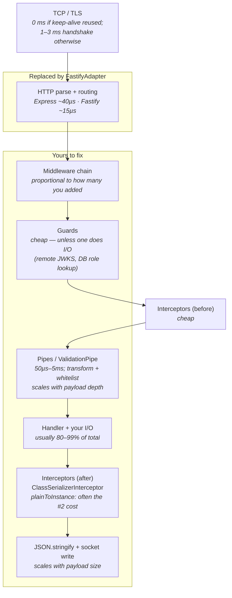

# Chapter 55 — Performance: Fastify, SWC, and Build Pipelines

> **한눈에 보기**
> 40장에서 Nest가 플랫폼 비의존적으로 설계된 이유를 봤습니다. 이 장은 그 설계가 실제로 무엇을
> 사주는지 — Express를 Fastify로 바꾸는 일이 얼마나 쉬운지, 그리고 무엇이 깨지는지 — 를 다룹니다.
> 이어서 컴파일러 자체를 바꿉니다. `tsc` 대신 SWC를 쓰면 개발 재시작이 20배 빨라지지만 타입 체크를
> 잃습니다. 그 거래를 정확히 이해하고 `--type-check`로 되사는 방법, `.swcrc`·CLI 플러그인·Jest·
> 모노레포 조합, 그리고 SWC가 순환 임포트에서 실패하는 지점을 봅니다. 마지막으로 로드밸런서 뒤에서
> 무작위 502를 만들어내는 keep-alive 경쟁 조건과, 애플리케이션 비용이 실제로 어디서 발생하는지를
> 측정 기반으로 정리합니다. 핵심 메시지 하나: **플랫폼은 대개 여러분의 병목이 아닙니다.**

**What you will learn**

- How to swap Express for Fastify in three lines, and the complete list of things that break when you do — response API, middleware signatures, plugin ecosystem, `@Res()` typing, static files, Swagger, CORS.
- Why Fastify's ~2× benchmark advantage almost never shows up as a 2× improvement in your service, and how to determine whether the HTTP layer is your bottleneck at all.
- What `nest build --builder swc` actually runs, why it is roughly 20× faster than `tsc`, and precisely what safety you give up.
- How `--type-check` restores type safety without giving back the speed, and why it is also what makes CLI plugins work under SWC.
- Why SWC needs a different setup in a monorepo (webpack + `swc-loader`) and how to generate plugin metadata manually with `PluginMetadataGenerator`.
- Why SWC breaks TypeORM circular relations, and the `Relation<>` / `WrapperType<>` workaround that fixes it.
- The exact relationship between `server.keepAliveTimeout` and `server.headersTimeout` that eliminates intermittent 502s behind a load balancer — and when `forceCloseConnections` is the right knob instead.
- Where Nest genuinely costs you cycles: request-scoped providers, `ValidationPipe` with `transform`, class-transformer serialization, and synchronous logging — with the measurement technique for each.

**Why this matters**

A team benchmarks Fastify, sees "2× faster than Express", migrates over a sprint, fixes forty broken middleware call sites, and measures the result in production: p99 latency drops from 412 ms to 409 ms. The benchmark was not wrong. It measured a handler that returns `{hello:'world'}` — a workload where framework overhead is 100% of the cost. In the real service, 380 of those 412 milliseconds were two sequential database queries and a `JSON.stringify` of a 400 KB payload. Framework overhead was under 1% of the request. Two engineer-weeks bought 3 ms.

The same team then switches the compiler from `tsc` to SWC and gets something they can feel every day: the watch-mode restart after a save goes from 6 seconds to 400 milliseconds. Nobody wrote a blog post about it, but it changed how the team works — you stop context-switching while waiting for a rebuild. That is the honest ranking of these two optimisations for most teams, and it is the opposite of the order they are usually attempted in.

There is also a class of performance problem that is not about speed at all but about *correctness under load*. A service behind an AWS ALB starts returning 502s to about one request in two thousand. There is no error in the application logs, no failed health check, no pattern in the affected routes. The cause is that Node's default `keepAliveTimeout` is 5 seconds and the ALB's idle timeout is 60: the load balancer holds a connection it believes is alive, the server closes it, and a request lands in the gap. The fix is two lines. Finding it without knowing the mechanism takes days.

This chapter gives you the mechanism for all three.

## Where a Nest request's time actually goes

Before changing anything, understand the shape of the cost. A request through a Nest HTTP application passes through a fixed pipeline, and each stage has a characteristic cost profile.



Read the diagram as a budget. Switching platforms optimises exactly one box, and it is the smallest one in almost every real service. Everything in the "Yours to fix" group is under your direct control and is usually where the milliseconds are. We will come back to each of those in [Where Nest actually costs you](#where-nest-actually-costs-you); first, the platform swap, because it is the thing everyone asks about.

## Fastify: the platform swap

Nest achieves framework independence through an **adapter** whose job is to proxy middleware and handlers to library-specific implementations. Express is the default because it is ubiquitous and has an enormous compatible middleware ecosystem that Nest users get for free. Fastify is the built-in alternative: it solves the same design problems in a similar way (which is what makes an adapter possible at all) and is substantially faster.

### Installation and bootstrap

```bash
$ npm i --save @nestjs/platform-fastify
```

```typescript title="main.ts"
import { NestFactory } from '@nestjs/core';
import { FastifyAdapter, NestFastifyApplication } from '@nestjs/platform-fastify';
import { AppModule } from './app.module';

async function bootstrap() {
  const app = await NestFactory.create<NestFastifyApplication>(
    AppModule,
    new FastifyAdapter(),
  );
  await app.listen(process.env.PORT ?? 3000);
}
bootstrap();
```

Two things are load-bearing here. The generic parameter `NestFastifyApplication` is what gives you Fastify-specific methods (`useStaticAssets`, `setViewEngine`, `register`) with correct types; without it you get the base `INestApplication` and the platform-specific methods do not exist. And `new FastifyAdapter()` is where Fastify's own options go.

### `listen('0.0.0.0')` in containers

Fastify listens only on `127.0.0.1` by default. Express binds to all interfaces. This difference produces one of the most confusing container failures there is: the app logs `Nest application successfully started`, the health check from inside the container passes, and every request from outside times out.

```typescript
async function bootstrap() {
  const app = await NestFactory.create<NestFastifyApplication>(
    AppModule,
    new FastifyAdapter(),
  );
  await app.listen(3000, '0.0.0.0');
}
```

Make this unconditional in any containerised deployment. There is no scenario in Docker, Kubernetes, ECS, or Cloud Run where binding to loopback is what you want.

### Fastify options

Fastify's constructor options pass through the adapter:

```typescript
new FastifyAdapter({
  logger: true,              // Fastify's own pino logger
  bodyLimit: 5 * 1024 * 1024,
  trustProxy: true,          // required behind a load balancer for correct req.ip
  maxParamLength: 200,       // raise this if you route on long tokens
  requestIdHeader: 'x-request-id',
});
```

> **Hint** — `logger: true` gives you Fastify's pino instance, which is *separate* from Nest's `Logger`. Running both means two log formats in one stream. Pick one: either `logger: false` here and use `nestjs-pino` (see [Chapter 18](../part2-intermediate/18-logging.md)), or keep Fastify's logger and route Nest's `Logger` into it.

### What changes when you switch

This is the honest inventory. Nothing here is hard, but all of it is work.

#### Redirects

Fastify handles redirects differently from Express. Set the status and the URL together:

```typescript
// Express
@Get('old')
old(@Res() res: Response) {
  res.redirect(302, '/login');
}

// Fastify
@Get('old')
old(@Res() res: FastifyReply) {
  res.status(302).redirect('/login');
}
```

If you can, avoid `@Res()` entirely and use `@Redirect('/login', 302)`, which is platform-agnostic and keeps the rest of the interceptor pipeline working. Reaching for `@Res()` opts you out of Nest's response handling — see [Chapter 4](../part1-beginner/04-controllers-responses.md).

#### `@Res()` typing

The response object is a `FastifyReply`, not an Express `Response`, and the method surface differs (`send` rather than `json`, `header` rather than `set`, `code`/`status` rather than only `status`).

```typescript
import { Controller, Get, Res } from '@nestjs/common';
import type { FastifyReply } from 'fastify';

@Controller('reports')
export class ReportsController {
  @Get('csv')
  csv(@Res() res: FastifyReply) {
    res
      .header('Content-Type', 'text/csv')
      .header('Content-Disposition', 'attachment; filename="report.csv"')
      .send('id,total\n1,4200\n');
  }
}
```

The single biggest migration cost in most codebases is finding every `@Res() res: Response` and deciding, one by one, whether it should become a `FastifyReply` or should be rewritten to not need `@Res()` at all. Prefer the rewrite.

#### Middleware receives raw Node objects

Nest's Fastify adapter uses `middie` under the hood. Middleware functions therefore get the **raw** `IncomingMessage` and `ServerResponse` — not Fastify's `FastifyRequest`/`FastifyReply` wrappers. Type them accordingly:

```typescript title="logger.middleware.ts"
import { Injectable, NestMiddleware } from '@nestjs/common';
import type { FastifyRequest, FastifyReply } from 'fastify';

@Injectable()
export class LoggerMiddleware implements NestMiddleware {
  use(req: FastifyRequest['raw'], res: FastifyReply['raw'], next: () => void) {
    console.log('Request...');
    next();
  }
}
```

Practically, this means anything in your middleware that used `req.params`, `req.query` parsed by Fastify, or `res.status()` will not exist. Middleware that only reads headers and calls `next()` ports unchanged; middleware that used Fastify/Express conveniences does not. Guards and interceptors are unaffected — they receive the framework objects through `ExecutionContext` ([Chapter 40](40-execution-context.md)).

#### Plugin equivalents

Every recipe that relies on an Express package needs a Fastify counterpart:

| Express package | Fastify equivalent | Notes |
|---|---|---|
| `helmet` | `@fastify/helmet` | Register with `app.register(helmet)`; adjust CSP if you serve Swagger UI. |
| `cors` | built in | Use `app.enableCors()` — Nest routes it to the adapter. `@fastify/cors` also works. |
| `cookie-parser` | `@fastify/cookie` | Also provides signed cookies. |
| `express-session` | `@fastify/secure-session` or `@fastify/session` | `secure-session` is stateless and generally preferable. |
| `compression` | `@fastify/compress` | Set `global: true` or register per-route. |
| `csurf` | `@fastify/csrf-protection` | Requires `@fastify/cookie` or a session plugin first. |
| `express-rate-limit` | `@fastify/rate-limit` | `@nestjs/throttler` works on both platforms — prefer it. |
| `serve-static` | `@fastify/static` | Needed by `useStaticAssets()` and by `ServeStaticModule`. |
| `multer` (`FileInterceptor`) | `@fastify/multipart` | **The biggest gap.** Nest's `FileInterceptor`/`FilesInterceptor` are Multer-based and Express-only. |
| `express-handlebars` / view engines | `@fastify/view` | Needed by `setViewEngine()`. |
| `passport` middleware | `@nestjs/passport` | Works on Fastify for stateless strategies (JWT, bearer). Session-based strategies need extra wiring. |

The multipart row deserves emphasis. If your application accepts file uploads through `@UseInterceptors(FileInterceptor('file'))` ([Chapter 28](../part2-intermediate/28-file-upload-and-streaming.md)), that code does not port. You register `@fastify/multipart` and consume `req.file()` / `req.files()` yourself, or you adopt a community wrapper. Budget for this explicitly before committing to a migration.

#### Static files and views

```typescript
import { join } from 'node:path';
import { NestFactory } from '@nestjs/core';
import { FastifyAdapter, NestFastifyApplication } from '@nestjs/platform-fastify';

const app = await NestFactory.create<NestFastifyApplication>(
  AppModule,
  new FastifyAdapter(),
);

// requires @fastify/static
app.useStaticAssets({
  root: join(__dirname, '..', 'public'),
  prefix: '/public/',
});

// requires @fastify/view + the engine
app.setViewEngine({
  engine: { handlebars: require('handlebars') },
  templates: join(__dirname, '..', 'views'),
});
```

Note the shape difference: Express's `useStaticAssets(path, options)` takes a path first; Fastify's takes a single options object with `root`. This is a compile error, not a silent bug, which is a small mercy.

#### Swagger

`@nestjs/swagger` supports both platforms, and `SwaggerModule.setup()` is unchanged. Two Fastify-specific gotchas:

- Serving Swagger UI needs static file support. Install `@fastify/static` even if you serve no other assets.
- If you registered `@fastify/helmet` globally, its default `contentSecurityPolicy` blocks the inline scripts Swagger UI uses. Either disable CSP for the docs path or relax the directives:

```typescript
await app.register(helmet, {
  contentSecurityPolicy: {
    directives: {
      defaultSrc: [`'self'`],
      styleSrc: [`'self'`, `'unsafe-inline'`],
      imgSrc: [`'self'`, 'data:', 'validator.swagger.io'],
      scriptSrc: [`'self'`, `https: 'unsafe-inline'`],
    },
  },
});
```

#### CORS

`app.enableCors()` works identically on both platforms; Nest delegates to the adapter. You can also pass CORS options at creation time:

```typescript
const app = await NestFactory.create<NestFastifyApplication>(
  AppModule,
  new FastifyAdapter(),
  { cors: { origin: ['https://app.acme.io'], credentials: true } },
);
```

### Fastify-only features Nest exposes

Two decorators from `@nestjs/platform-fastify` surface Fastify capabilities that Express has no analogue for.

**Route config** attaches arbitrary data to a route, readable from the request:

```typescript
import { Controller, Get, Req } from '@nestjs/common';
import { RouteConfig } from '@nestjs/platform-fastify';
import type { FastifyRequest } from 'fastify';

@Controller()
export class AppController {
  @RouteConfig({ output: 'hello world' })
  @Get()
  index(@Req() req: FastifyRequest & { routeConfig: { output: string } }) {
    return req.routeConfig.output;
  }
}
```

**Route constraints** (supported since `@nestjs/platform-fastify` v10.3.0) let Fastify's router dispatch on version or host headers:

```typescript
import { RouteConstraints } from '@nestjs/platform-fastify';

@RouteConstraints({ version: '1.2.x' })
@Get('feature')
newFeature() {
  return 'This works only for version >= 1.2.x';
}
```

This is a genuinely different mechanism from Nest's own `@Version()` ([Chapter 33](../part2-intermediate/33-mvc-and-versioning.md)) — the constraint is evaluated inside Fastify's radix-tree router, so unmatched versions never enter the Nest pipeline at all.

### Benchmarks, honestly

Published Fastify-vs-Express numbers typically show Fastify at roughly **2× the requests per second** on a trivial handler. That number is real and it is also the *ceiling* on what a platform swap can give you. Here is how to translate it into an expectation for your service.

Let `F` be per-request framework overhead and `W` be everything else (your handler, your I/O, your serialization). Total is `F + W`. A platform swap changes `F` to roughly `F/2`. The improvement is `F/2` milliseconds, and the *relative* improvement is `F / (2(F + W))`.

| Your handler's non-framework cost | Framework overhead saved | Realistic end-to-end gain |
|---|---|---|
| ~0 ms (echo endpoint, benchmark) | ~0.05 ms | ~2× throughput |
| 2 ms (in-memory cache hit) | ~0.05 ms | ~2% |
| 20 ms (one indexed DB query) | ~0.05 ms | ~0.25% |
| 200 ms (three sequential queries + big JSON) | ~0.05 ms | ~0.02% |

**Switch to Fastify when** you are running a genuinely thin service — a gateway, a proxy, an auth token endpoint, an edge validator — where the framework really is a large fraction of the work, *or* when you are starting a new project and have no Express-specific dependencies to port. In the second case, the migration cost is zero, so take the free 2× on the box you can optimise.

**Do not switch when** you have an existing service with Multer uploads, Express-specific middleware, session-based Passport strategies, and a p99 dominated by the database. You will spend weeks and measure nothing.

## SWC: replacing the compiler

The second optimisation is about *your* time rather than your users'. [SWC](https://swc.rs/) is a Rust-based TypeScript/JavaScript compiler. The Nest CLI supports it as a builder, and it is approximately **20× faster** than `tsc`.

```bash
$ npm i --save-dev @swc/cli @swc/core
```

```bash
$ nest start -b swc
# equivalently: nest start --builder swc
$ nest start -b swc -w        # watch mode
$ nest build -b swc
```

Rather than passing the flag, set it in the workspace manifest:

```json title="nest-cli.json"
{
  "compilerOptions": {
    "builder": "swc"
  }
}
```

The object form lets you configure the builder:

```json title="nest-cli.json"
{
  "compilerOptions": {
    "builder": {
      "type": "swc",
      "options": {
        "swcrcPath": "infrastructure/.swcrc"
      }
    }
  }
}
```

To make SWC compile JSX/TSX as well:

```json
{
  "compilerOptions": {
    "builder": {
      "type": "swc",
      "options": { "extensions": [".ts", ".tsx", ".js", ".jsx"] }
    }
  }
}
```

### The trade-off: SWC does not type-check

This is the entire deal, and it is worth stating without hedging. **SWC strips types; it does not verify them.** It parses your TypeScript, discards the annotations, emits JavaScript, and never asks whether the annotations were consistent. A file with `const n: number = "hello"` compiles cleanly and fast.

That is *why* it is 20× faster. Type checking is the expensive part of `tsc`; SWC skips it.

For a watch-mode development loop this is often fine, because your editor's TypeScript language server is already type-checking every keystroke. What is not fine is a CI pipeline or a production build that never runs a type check at all — you will ship a type error to production eventually.

The `--type-check` flag runs `tsc` in `noEmit` mode **asynchronously alongside** SWC:

```bash
$ nest start -b swc --type-check
```

```json title="nest-cli.json"
{
  "compilerOptions": {
    "builder": "swc",
    "typeCheck": true
  }
}
```

Understand what "asynchronously" means: SWC does not wait for `tsc`. Your server restarts immediately and the type errors appear a moment later in the terminal. You get the fast feedback loop *and* the type errors, just not in that order. This is the right default for local development.

For CI, do not rely on the async check finishing. Run the type check as its own explicit, blocking step:

```json title="package.json"
{
  "scripts": {
    "start:dev": "nest start -b swc --type-check --watch",
    "build": "nest build -b swc",
    "typecheck": "tsc --noEmit -p tsconfig.json",
    "ci": "npm run typecheck && npm run build && npm test"
  }
}
```

| | `tsc` | SWC | SWC + `--type-check` |
|---|---|---|---|
| Speed (cold) | baseline | ~20× faster | ~as fast as `tsc` overall |
| Speed (incremental restart) | seconds | milliseconds | milliseconds to restart, seconds to error |
| Type errors reported | Yes, blocking | **No** | Yes, non-blocking |
| CLI plugin metadata | Yes | **No** | Yes (that is what enables it) |
| Suitable for local watch | Adequate | Yes | **Recommended** |
| Suitable for CI/production build | Yes | Only with a separate blocking `tsc --noEmit` | Yes, with a separate blocking check |

### CLI plugins under SWC

Nest's CLI plugins — `@nestjs/swagger` and `@nestjs/graphql` — are TypeScript *transformers*. They run inside `tsc`'s compilation and read the type checker to infer DTO property types, so that you do not have to write `@ApiProperty()` on every field ([Chapter 30](../part2-intermediate/30-openapi-advanced.md)).

SWC has no type checker, so it cannot run them. This is the second, less obvious consequence of switching builders, and it appears as an empty Swagger schema: your DTOs document as `{}`.

The `--type-check` flag fixes this too. It automatically executes the CLI plugins during the `tsc` pass and produces a serialized **metadata file** that the application loads at runtime. So the combination that actually works is:

```json title="nest-cli.json"
{
  "compilerOptions": {
    "builder": "swc",
    "typeCheck": true,
    "plugins": ["@nestjs/swagger"]
  }
}
```

and then in `main.ts`, load the generated metadata before building the document:

```typescript title="main.ts"
import metadata from './metadata';   // generated by the type-check pass

await SwaggerModule.loadPluginMetadata(metadata);
const document = SwaggerModule.createDocument(app, config);
```

### SWC configuration: `.swcrc`

The SWC builder ships pre-configured for Nest's requirements, so you usually need no `.swcrc` at all. When you do — to change targets, add plugins, or tune source maps — create one in the root:

```json title=".swcrc"
{
  "$schema": "https://swc.rs/schema.json",
  "sourceMaps": true,
  "jsc": {
    "parser": {
      "syntax": "typescript",
      "decorators": true,
      "dynamicImport": true
    },
    "baseUrl": "./"
  },
  "minify": false
}
```

The non-negotiable settings for Nest are `parser.decorators: true` (Nest is decorators all the way down) and, for anything that reads design-time types via `reflect-metadata`, the transform pair shown in the Jest section below.

### SWC in a monorepo

In a monorepo the `swc` builder is not what you use. Monorepo mode compiles through webpack (see [Chapter 54](54-monorepo-and-libraries.md)), so you configure webpack to use `swc-loader` instead of `ts-loader`:

```bash
$ npm i --save-dev swc-loader
```

```javascript title="webpack.config.js"
const swcDefaultConfig =
  require('@nestjs/cli/lib/compiler/defaults/swc-defaults').swcDefaultsFactory()
    .swcOptions;

module.exports = {
  module: {
    rules: [
      {
        test: /\.ts$/,
        exclude: /node_modules/,
        use: {
          loader: 'swc-loader',
          options: swcDefaultConfig,
        },
      },
    ],
  },
};
```

Pulling `swcDefaultsFactory()` from the CLI rather than hand-writing options matters: those defaults encode the decorator and metadata settings Nest needs, and they track the CLI version.

### Monorepo + CLI plugins: `PluginMetadataGenerator`

`swc-loader` will not run CLI plugins automatically, and in a monorepo there is no `--type-check` pass to piggyback on. You run the metadata generation yourself. Create a `generate-metadata.ts` next to `main.ts`:

```typescript title="apps/api/src/generate-metadata.ts"
import { PluginMetadataGenerator } from '@nestjs/cli/lib/compiler/plugins/plugin-metadata-generator';
import { ReadonlyVisitor } from '@nestjs/swagger/dist/plugin';

const generator = new PluginMetadataGenerator();
generator.generate({
  visitors: [
    new ReadonlyVisitor({ introspectComments: true, pathToSource: __dirname }),
  ],
  outputDir: __dirname,
  watch: true,
  tsconfigPath: 'apps/api/tsconfig.app.json',
});
```

The example uses the Swagger plugin's visitor; `@nestjs/graphql/dist/plugin` exports an equivalent one.

| `generate()` option | Meaning |
|---|---|
| `watch` | Watch the project for changes and regenerate. |
| `tsconfigPath` | Path to the `tsconfig.json`, relative to `process.cwd()`. |
| `outputDir` | Directory where the metadata file is written. |
| `visitors` | Array of visitors used to generate metadata. |
| `filename` | Name of the metadata file. Defaults to `metadata.ts`. |
| `printDiagnostics` | Whether to print diagnostics. Defaults to `true`. |

Run it in a second terminal alongside your dev server:

```bash
$ npx ts-node apps/api/src/generate-metadata.ts
```

In CI, run it once with `watch: false` before the build.

### Jest with `@swc/jest`

Test runs benefit from SWC as much as builds do, often more — a suite that takes 90 seconds under `ts-jest` frequently drops under 15.

```bash
$ npm i --save-dev jest @swc/core @swc/jest
```

```json title="package.json"
{
  "jest": {
    "transform": {
      "^.+\\.(t|j)s?$": ["@swc/jest"]
    }
  }
}
```

And — this is the step that is easy to miss and produces baffling failures — add the decorator transform options to `.swcrc`:

```json title=".swcrc"
{
  "$schema": "https://swc.rs/schema.json",
  "sourceMaps": true,
  "jsc": {
    "parser": {
      "syntax": "typescript",
      "decorators": true,
      "dynamicImport": true
    },
    "transform": {
      "legacyDecorator": true,
      "decoratorMetadata": true
    },
    "baseUrl": "./"
  },
  "minify": false
}
```

Without `decoratorMetadata: true`, SWC does not emit `design:paramtypes`. Nest's DI reads that metadata to resolve constructor parameters, so every `Test.createTestingModule` fails with `Nest can't resolve dependencies of the XService (?)` — for services that work perfectly in the running application. If you see that error *only in tests* after adopting `@swc/jest`, this is why.

If you use CLI plugins, `@swc/jest` will not run them either; use `PluginMetadataGenerator` as above.

### Vitest

Vitest is a fast alternative runner that uses SWC through `unplugin-swc`:

```bash
$ npm i --save-dev vitest unplugin-swc @swc/core @vitest/coverage-v8
```

```typescript title="vitest.config.ts"
import { resolve } from 'node:path';
import swc from 'unplugin-swc';
import { defineConfig } from 'vitest/config';

export default defineConfig({
  test: { globals: true, root: './' },
  plugins: [
    // Required to build the test files with SWC.
    // Set module type explicitly so it is not inherited from .swcrc.
    swc.vite({ module: { type: 'es6' } }),
  ],
  resolve: {
    // Vitest does not read tsconfig paths — map them here.
    alias: { src: resolve(__dirname, './src') },
  },
});
```

A separate config for e2e tests, distinguished by an `include` pattern:

```typescript title="vitest.config.e2e.ts"
import swc from 'unplugin-swc';
import { defineConfig } from 'vitest/config';

export default defineConfig({
  test: {
    include: ['**/*.e2e-spec.ts'],
    globals: true,
    alias: { '@src': './src', '@test': './test' },
    root: './',
  },
  resolve: { alias: { '@src': './src', '@test': './test' } },
  plugins: [swc.vite()],
});
```

```json title="package.json"
{
  "scripts": {
    "test": "vitest run",
    "test:watch": "vitest",
    "test:cov": "vitest run --coverage",
    "test:debug": "vitest --inspect-brk --inspect --logHeapUsage --threads=false",
    "test:e2e": "vitest run --config ./vitest.config.e2e.ts"
  }
}
```

One migration detail: change `import * as request from 'supertest'` to `import request from 'supertest'`. Vitest, bundled with Vite, expects the default import; the namespace import breaks in this setup.

### Known limitation: circular imports

SWC handles **circular imports** poorly, and the symptom is specific to ORMs. If `User` references `Profile` and `Profile` references `User`, the emitted decorator metadata captures the class reference at module-evaluation time, one of which is still `undefined`. You get `Cannot read properties of undefined` during entity metadata construction, or a relation that resolves to `Object`.

TypeORM ships a wrapper type for exactly this:

```typescript
import { Entity, OneToOne, Relation } from 'typeorm';

@Entity()
export class User {
  @OneToOne(() => Profile, (profile) => profile.user)
  profile: Relation<Profile>;   // <-- Relation<> instead of bare Profile
}
```

`Relation<T>` is a type-only indirection. Because the property's type is no longer a direct class reference, the transpiler does not save it in the property metadata, and the circular dependency never materialises at runtime.

If your ORM has no equivalent, define your own:

```typescript
/**
 * Wrapper type used to circumvent the ESM circular dependency issue
 * caused by reflect-metadata saving the type of the property.
 */
export type WrapperType<T> = T;   // WrapperType === Relation
```

The same applies to every `forwardRef` circular injection in your project ([Chapter 41](41-module-ref-discovery-lazy.md)):

```typescript
import { forwardRef, Inject, Injectable } from '@nestjs/common';

@Injectable()
export class UsersService {
  constructor(
    @Inject(forwardRef(() => ProfileService))
    private readonly profileService: WrapperType<ProfileService>,
  ) {}
}
```

## Keep-alive, timeouts, and the 502 race

This section is short and it will save you a day.

### The race

Node's HTTP server has two relevant timeouts:

| Property | Node default | Meaning |
|---|---|---|
| `server.keepAliveTimeout` | 5,000 ms | How long an idle keep-alive connection stays open after a response. |
| `server.headersTimeout` | 60,000 ms | How long the server waits for the complete request headers. |
| `server.requestTimeout` | 300,000 ms | How long the server waits for the complete request. |

Now put that server behind an AWS ALB (default idle timeout **60 s**), an nginx upstream with `keepalive` (default `keepalive_timeout 60s`), or a GCP load balancer (600 s). The load balancer holds a pooled connection open for far longer than 5 seconds. At second 5, your server sends `FIN`. If the load balancer dispatches a request in the microseconds before it processes that `FIN`, the request is written to a socket the server has already closed. The load balancer cannot safely retry a non-idempotent request, so it returns **502 Bad Gateway** to the client.

The application never sees the request. There is nothing in your logs. The rate is low — a fraction of a percent — and it correlates with traffic volume, not with any route.

### The fix

Make the server's idle timeout **longer** than the load balancer's, and keep `headersTimeout` above `keepAliveTimeout`:

```typescript title="main.ts (Express)"
import { NestFactory } from '@nestjs/core';
import { AppModule } from './app.module';

async function bootstrap() {
  const app = await NestFactory.create(AppModule);

  const server = app.getHttpServer();
  server.keepAliveTimeout = 65_000;   // > ALB idle timeout (60s)
  server.headersTimeout = 66_000;     // must exceed keepAliveTimeout

  await app.listen(process.env.PORT ?? 3000);
}
bootstrap();
```

On Fastify, pass the timeouts to the adapter:

```typescript title="main.ts (Fastify)"
const app = await NestFactory.create<NestFastifyApplication>(
  AppModule,
  new FastifyAdapter({
    keepAliveTimeout: 65_000,
    connectionTimeout: 0,
  }),
);
await app.listen(3000, '0.0.0.0');
```

The invariant to remember: **`headersTimeout > keepAliveTimeout > load balancer idle timeout`.** Getting the middle inequality backwards reintroduces the race in a subtler form, because the header-read window can expire on a connection that is still considered alive.

### `forceCloseConnections`

A related but distinct problem: by default Nest's HTTP adapters wait for in-flight responses to finish before closing the application. With long-lived `Connection: Keep-Alive` connections, "finish" can be a long time away, and the process appears to hang on shutdown.

The symptom is precise: **your application does not exit when you expect it to** — most often during development with `--watch`, where a save no longer restarts the server, or in production where `app.enableShutdownHooks()` is on and the pod sits in `Terminating` until the grace period expires and the orchestrator sends `SIGKILL`.

```typescript title="main.ts"
import { NestFactory } from '@nestjs/core';
import { AppModule } from './app.module';

async function bootstrap() {
  const app = await NestFactory.create(AppModule, {
    forceCloseConnections: true,
  });
  await app.listen(process.env.PORT ?? 3000);
}
bootstrap();
```

> **⚠️ Notice** — Most applications do not need this. Enabling it means idle keep-alive sockets are destroyed on shutdown rather than drained, which is what you want, but it interacts with graceful shutdown: combine it with a readiness probe that fails *before* shutdown begins, so the load balancer stops sending traffic first. See [Chapter 39](39-lifecycle-and-shutdown.md) and the probe timeline in [Chapter 56](56-observability.md).

## Where Nest actually costs you

Return to the cost diagram. Here are the four boxes that are yours, ranked by how often they matter in real profiles.

### 1. Request-scoped providers

This is by far the largest self-inflicted performance cost in Nest, and it is easy to inflict accidentally. A `Scope.REQUEST` provider forces Nest to instantiate a fresh sub-tree of the DI container **on every request** — and scope *bubbles up*: any provider that injects a request-scoped provider becomes request-scoped, and so does any controller that injects that.

One request-scoped logger injected into a base service can turn your entire application request-scoped without a single line acknowledging it. The result is 10–40% throughput loss and a garbage-collection profile that looks like a sawtooth.

Diagnose it by counting instantiations:

```typescript
@Injectable()
export class OrdersService {
  private static instances = 0;
  constructor() {
    OrdersService.instances++;
    if (OrdersService.instances > 1) {
      console.warn(`OrdersService instantiated ${OrdersService.instances} times — request-scoped?`);
    }
  }
}
```

The fix is almost always [AsyncLocalStorage](43-async-local-storage.md) instead of request scope for context propagation. See [Chapter 38](38-injection-scopes.md) for the full mechanism and the durable-provider escape hatch.

### 2. `ValidationPipe` with `transform: true`

`ValidationPipe` runs `plainToInstance` and then `validate` on every request body. Cost scales with object depth and array length, not with byte size — a body with a 5,000-element array of nested DTOs is genuinely expensive (tens of milliseconds), while a 200 KB flat object is cheap.

```typescript
app.useGlobalPipes(
  new ValidationPipe({
    transform: true,
    whitelist: true,
    forbidNonWhitelisted: true,
    // Skips class-transformer's plainToInstance for primitive-typed
    // params (:id, ?page) — a real saving on high-traffic GET routes.
    transformOptions: { enableImplicitConversion: false },
  }),
);
```

If validation shows up in a profile, the answer is usually a size limit (`@ArrayMaxSize`) rather than turning validation off. See [Chapter 15](../part2-intermediate/15-validation-in-depth.md).

### 3. Serialization

`ClassSerializerInterceptor` also runs class-transformer, on the way out, on every response. For list endpoints returning hundreds of entities, this is frequently the number-two cost after the database.

Measure it directly with an interceptor:

```typescript
import { CallHandler, ExecutionContext, Injectable, Logger, NestInterceptor } from '@nestjs/common';
import { tap } from 'rxjs/operators';

@Injectable()
export class TimingInterceptor implements NestInterceptor {
  private readonly logger = new Logger('Timing');

  intercept(ctx: ExecutionContext, next: CallHandler) {
    const start = process.hrtime.bigint();
    const { method, url } = ctx.switchToHttp().getRequest();
    return next.handle().pipe(
      tap(() => {
        const ms = Number(process.hrtime.bigint() - start) / 1e6;
        if (ms > 50) this.logger.warn(`${method} ${url} handler+pipeline ${ms.toFixed(1)}ms`);
      }),
    );
  }
}
```

If serialization dominates, the fix is to stop round-tripping through class instances for hot list endpoints: select only the columns you return, and hand back plain objects.

### 4. Logging

Nest's built-in `ConsoleLogger` writes synchronously to stdout. When stdout is a pipe (which it is in every container) and the consumer is slow, `process.stdout.write` **blocks the event loop**. A service logging one line per request at 2,000 rps can spend meaningful time blocked in `write(2)`.

Use a structured, asynchronous logger in production — `nestjs-pino` or `pino` with a transport on a worker thread — and never log request bodies at `info`. [Chapter 18](../part2-intermediate/18-logging.md) covers the setup.

## Profiling

Guessing is not allowed. Three tools, in the order you should reach for them.

### `--inspect` and the Chrome DevTools profiler

```bash
$ node --inspect dist/main.js
# or with the CLI:
$ nest start --debug --watch
```

Open `chrome://inspect`, attach, and record a CPU profile while you drive load at the process. The flame chart shows you exactly which functions own the samples. This is the highest-signal tool and requires no extra dependencies.

For startup cost specifically, use `--inspect-brk` so you can start recording before bootstrap runs:

```bash
$ node --inspect-brk dist/main.js
```

### clinic.js

```bash
$ npm i -g clinic autocannon

# Is the event loop blocked? Start here.
$ clinic doctor --autocannon [ -c 50 -d 20 http://localhost:3000/orders ] -- node dist/main.js

# Flame graph of CPU time.
$ clinic flame --autocannon [ -c 50 -d 20 http://localhost:3000/orders ] -- node dist/main.js

# Memory: is something retained across requests?
$ clinic heapprofiler -- node dist/main.js
```

`clinic doctor` is the right first command because it *classifies* the problem — event-loop blocking, I/O bound, GC pressure, or fine — instead of handing you a flame graph to interpret.

### 0x

```bash
$ npx 0x -- node dist/main.js
```

`0x` produces a single self-contained flame-graph HTML file with no daemon and no instrumentation. It is the fastest way to get a flame graph out of a container.

### Nest Devtools bootstrap analysis

For startup time specifically — which matters enormously in serverless, where every cold start pays it — Nest Devtools has a **Bootstrap performance** view that lists every class node (controllers, providers, enhancers) with its instantiation time. It is the only tool that attributes startup cost to *your DI graph* rather than to V8 internals. Setup and usage are covered in [Chapter 56 — Observability](56-observability.md).

## Production checklist

| Area | Setting | Why |
|---|---|---|
| Runtime | `NODE_ENV=production` | Disables dev-only paths in Express and many libraries. |
| Build | Compile ahead of time; never `ts-node` in production | Removes per-start compilation entirely. |
| Build | Blocking `tsc --noEmit` in CI when using SWC | SWC does not type-check. |
| Platform | `listen(port, '0.0.0.0')` under Fastify | Fastify binds loopback by default. |
| HTTP | `keepAliveTimeout` > LB idle timeout; `headersTimeout` above it | Eliminates the intermittent-502 race. |
| Shutdown | `app.enableShutdownHooks()` + failing readiness probe first | Drains traffic before closing ([Chapter 39](39-lifecycle-and-shutdown.md)). |
| Shutdown | `forceCloseConnections: true` only if the process hangs | Destroys idle keep-alive sockets on close. |
| DI | Zero `Scope.REQUEST` providers unless proven necessary | Scope bubbles; use `AsyncLocalStorage` ([Chapter 43](43-async-local-storage.md)). |
| Validation | `whitelist: true`, array size limits on DTOs | Bounds the worst-case validation cost. |
| Serialization | Select only returned columns on list endpoints | class-transformer cost scales with object count. |
| Logging | Async structured logger; no request bodies at `info` | Synchronous stdout writes block the event loop. |
| Caching | `CacheInterceptor` or an explicit cache in front of hot reads ([Chapter 27](../part2-intermediate/27-caching.md)) | The only change with an order-of-magnitude ceiling. |
| Process | One process per CPU (orchestrator replicas, not `cluster`) | Node is single-threaded; scale horizontally. |
| Observability | Health checks + tracing before optimising | You cannot fix what you have not measured ([Chapter 56](56-observability.md)). |

## Common mistakes

1. **Migrating to Fastify to fix a database-bound service.**
   *Symptom:* two weeks of work, no measurable latency change. *Cause:* framework overhead was under 1% of the request. *Fix:* profile first. If `clinic doctor` says you are I/O bound, the platform is not your problem — indexes, N+1 queries, and caching are.

2. **Fastify app unreachable from outside the container.**
   *Symptom:* "successfully started" in the logs, connection timeouts from everywhere else. *Cause:* Fastify binds `127.0.0.1` by default. *Fix:* `await app.listen(3000, '0.0.0.0')`.

3. **Empty Swagger schemas after switching to SWC.**
   *Symptom:* every DTO documents as `{}`. *Cause:* CLI plugins are `tsc` transformers and SWC has no type checker to run them. *Fix:* enable `typeCheck: true` (single project) or run `PluginMetadataGenerator` (monorepo), and call `SwaggerModule.loadPluginMetadata(metadata)`.

4. **`Nest can't resolve dependencies` only in tests, after adopting `@swc/jest`.**
   *Symptom:* the app runs fine; every testing module fails. *Cause:* `.swcrc` is missing `jsc.transform.decoratorMetadata: true`, so `design:paramtypes` is never emitted. *Fix:* add `legacyDecorator: true` and `decoratorMetadata: true`.

5. **`Cannot read properties of undefined` from TypeORM after switching to SWC.**
   *Symptom:* entity metadata construction fails on a bidirectional relation. *Cause:* SWC does not handle circular imports well and the reflected property type is `undefined`. *Fix:* wrap the property type in `Relation<T>` (or your own `WrapperType<T>`), and do the same for every `forwardRef` injection.

6. **Random 502s behind a load balancer with nothing in the application logs.**
   *Symptom:* a fraction of a percent of requests fail, uncorrelated with route. *Cause:* `keepAliveTimeout` (5 s) is shorter than the LB idle timeout (60 s). *Fix:* `keepAliveTimeout = 65_000; headersTimeout = 66_000`.

7. **Enabling `forceCloseConnections` and getting truncated responses on deploy.**
   *Symptom:* clients see aborted responses during rolling restarts. *Cause:* connections are destroyed immediately on shutdown, including ones mid-response, because the readiness probe was still passing. *Fix:* fail readiness first, wait one probe interval, then shut down — the sequencing in [Chapter 56](56-observability.md).

8. **Trusting the async `--type-check` output as a CI gate.**
   *Symptom:* a type error reaches `main`. *Cause:* `--type-check` is non-blocking by design; the build succeeded and the process exited before `tsc` finished. *Fix:* a separate blocking `tsc --noEmit` step in CI.

## Putting it together

A Fastify application built with SWC, with correct timeouts, a blocking type check in CI, and a timing interceptor to keep the team honest.

```typescript title="main.ts"
import { NestFactory } from '@nestjs/core';
import { ValidationPipe } from '@nestjs/common';
import {
  FastifyAdapter,
  NestFastifyApplication,
} from '@nestjs/platform-fastify';
import helmet from '@fastify/helmet';
import compression from '@fastify/compress';
import { SwaggerModule, DocumentBuilder } from '@nestjs/swagger';
import metadata from './metadata';
import { AppModule } from './app.module';
import { TimingInterceptor } from './common/timing.interceptor';

async function bootstrap() {
  const app = await NestFactory.create<NestFastifyApplication>(
    AppModule,
    new FastifyAdapter({
      trustProxy: true,          // correct req.ip behind an LB
      bodyLimit: 2 * 1024 * 1024,
      keepAliveTimeout: 65_000,  // MUST exceed the LB idle timeout (60s)
      logger: false,             // Nest's logger owns the stream
    }),
    { forceCloseConnections: true },
  );

  await app.register(helmet, {
    contentSecurityPolicy: {
      directives: {
        defaultSrc: [`'self'`],
        styleSrc: [`'self'`, `'unsafe-inline'`],
        imgSrc: [`'self'`, 'data:', 'validator.swagger.io'],
        scriptSrc: [`'self'`, `https: 'unsafe-inline'`],
      },
    },
  });
  await app.register(compression, { global: true });

  app.enableCors({ origin: ['https://app.acme.io'], credentials: true });
  app.enableShutdownHooks();

  app.useGlobalPipes(
    new ValidationPipe({
      transform: true,
      whitelist: true,
      forbidNonWhitelisted: true,
      transformOptions: { enableImplicitConversion: false },
    }),
  );
  app.useGlobalInterceptors(new TimingInterceptor());

  // Plugin metadata generated by the SWC type-check pass.
  await SwaggerModule.loadPluginMetadata(metadata);
  SwaggerModule.setup(
    'docs',
    app,
    SwaggerModule.createDocument(
      app,
      new DocumentBuilder().setTitle('Orders API').setVersion('1.0').build(),
    ),
  );

  // Fastify binds 127.0.0.1 by default — always bind 0.0.0.0 in a container.
  await app.listen(process.env.PORT ?? 3000, '0.0.0.0');
}
bootstrap();
```

```json title="nest-cli.json"
{
  "$schema": "https://json.schemastore.org/nest-cli",
  "collection": "@nestjs/schematics",
  "sourceRoot": "src",
  "compilerOptions": {
    "builder": "swc",
    "typeCheck": true,
    "deleteOutDir": true,
    "plugins": ["@nestjs/swagger"]
  }
}
```

```json title="package.json (scripts)"
{
  "scripts": {
    "start:dev": "nest start -b swc --type-check --watch",
    "start:debug": "nest start -b swc --debug --watch",
    "build": "nest build -b swc",
    "typecheck": "tsc --noEmit -p tsconfig.json",
    "test": "jest",
    "ci": "npm run typecheck && npm run build && npm test",
    "bench": "autocannon -c 50 -d 20 http://localhost:3000/orders",
    "profile": "clinic doctor --autocannon [ -c 50 -d 20 http://localhost:3000/orders ] -- node dist/main.js"
  }
}
```

Verify the result rather than assuming it:

```bash
$ npm run build && node dist/main.js &
$ npm run bench          # establish a baseline number
$ npm run profile        # then ask clinic what the bottleneck actually is
```

> **핵심 정리**
> - 성능 작업의 첫 단계는 **측정**입니다. `clinic doctor`가 I/O 바운드라고 말한다면 프레임워크 교체는 답이 아닙니다.
> - Fastify는 벤치마크에서 Express 대비 약 2배지만, 그 이득은 프레임워크 오버헤드가 전체 요청 비용에서 차지하는 비율만큼만 실현됩니다. DB 쿼리 20ms짜리 엔드포인트에서는 0.25% 수준입니다.
> - Fastify로 바꾸면 리디렉트 API, 미들웨어 시그니처(원시 `req`/`res`), `@Res()` 타입, 정적 파일 API, 그리고 무엇보다 **Multer 기반 `FileInterceptor`** 가 깨집니다. 마이그레이션 비용을 먼저 산정하세요.
> - Fastify는 기본적으로 `127.0.0.1`만 바인딩합니다. 컨테이너에서는 예외 없이 `listen(port, '0.0.0.0')`.
> - SWC는 `tsc`보다 약 20배 빠르지만 **타입 검사를 하지 않습니다.** `--type-check`(`typeCheck: true`)는 `tsc --noEmit`을 비동기로 병행 실행해 타입 오류를 되찾아 주고, **CLI 플러그인 메타데이터도 이 패스에서 생성**됩니다. CI에서는 별도의 블로킹 `tsc --noEmit` 단계를 반드시 두세요.
> - 모노레포에서는 `swc` 빌더 대신 webpack + `swc-loader`를 쓰고, CLI 플러그인은 `PluginMetadataGenerator`로 직접 생성합니다.
> - `@swc/jest`를 쓸 때 `.swcrc`의 `jsc.transform.decoratorMetadata: true`가 없으면 `design:paramtypes`가 생성되지 않아 **테스트에서만** DI가 실패합니다.
> - SWC는 순환 임포트에 약합니다. TypeORM 양방향 관계는 `Relation<T>`(또는 직접 정의한 `WrapperType<T>`)로 감싸고, `forwardRef` 주입에도 동일하게 적용하세요.
> - 로드밸런서 뒤 무작위 502의 원인은 대부분 `keepAliveTimeout`(기본 5초)이 LB idle timeout(보통 60초)보다 짧기 때문입니다. 불변식은 **`headersTimeout > keepAliveTimeout > LB idle timeout`**.
> - `forceCloseConnections: true`는 "앱이 종료되지 않는" 증상에만 쓰는 옵션입니다. readiness 실패 → 트래픽 차단 → 종료 순서와 반드시 함께 설계하세요.
> - Nest에서 실제로 비용이 큰 곳은 순서대로 **요청 스코프 프로바이더 → 직렬화 → `ValidationPipe` transform → 동기 로깅**입니다. 플랫폼 교체보다 이쪽이 거의 항상 이득이 큽니다.

> **연습 문제**
> 1. `autocannon`으로 (a) `return { hello: 'world' }` 핸들러와 (b) 인덱스된 DB 쿼리 하나를 하는 핸들러를 Express와 Fastify에서 각각 측정하세요. 두 경우의 상대 개선율 차이를 이 장의 비용 모델(`F / (2(F+W))`)로 설명하세요.
> 2. 기존 프로젝트를 `nest start -b swc`로 전환하고, 의도적으로 `const n: number = 'x'` 같은 타입 오류를 넣은 뒤 (a) `--type-check` 없이, (b) `--type-check`와 함께, (c) `tsc --noEmit` 단독으로 실행해 각각 언제 어떤 형태로 오류가 보이는지 비교하세요.
> 3. **직접 만들어 보기.** `TimingInterceptor`를 확장해 `ValidationPipe` 구간, 핸들러 구간, 직렬화 구간의 소요 시간을 각각 분리 측정하는 인터셉터를 작성하세요(힌트: 파이프 전후는 커스텀 파이프로, 직렬화 전후는 `ClassSerializerInterceptor` 바깥/안쪽 인터셉터로 감싸면 됩니다). 200개 엔티티를 반환하는 리스트 엔드포인트에서 세 구간의 비율을 보고하세요.
> 4. **직접 만들어 보기.** 하나의 프로바이더를 `Scope.REQUEST`로 바꾼 뒤, 그 스코프가 어디까지 전파되는지 인스턴스 카운터로 추적하고 `autocannon`으로 전후 처리량을 측정하세요. 그런 다음 `AsyncLocalStorage`로 대체해 처리량을 회복시키세요.
> 5. `keepAliveTimeout`을 기본값(5초)으로 둔 서버 앞에 nginx를 `keepalive_timeout 60s`로 두고 부하를 걸어 502를 재현하세요. 그 뒤 이 장의 불변식을 적용해 사라지는지 확인하고, `headersTimeout`만 `keepAliveTimeout`보다 낮게 설정했을 때 무슨 일이 생기는지도 관찰하세요.
> 6. 여러분 서비스에 `clinic doctor`를 실행하고, 진단 결과(event-loop blocked / I/O bound / GC pressure)에 따라 이 장의 프로덕션 체크리스트에서 실제로 적용할 항목 세 개를 근거와 함께 고르세요.

**Next:** You now have a fast build and a correctly configured server — but "fast" and "correct" are claims you can only make if you can see the running system. [Chapter 56 — Observability: Health Checks, Sentry, and Devtools](56-observability.md) covers the probes, error tracking, and graph introspection that turn those claims into evidence.
