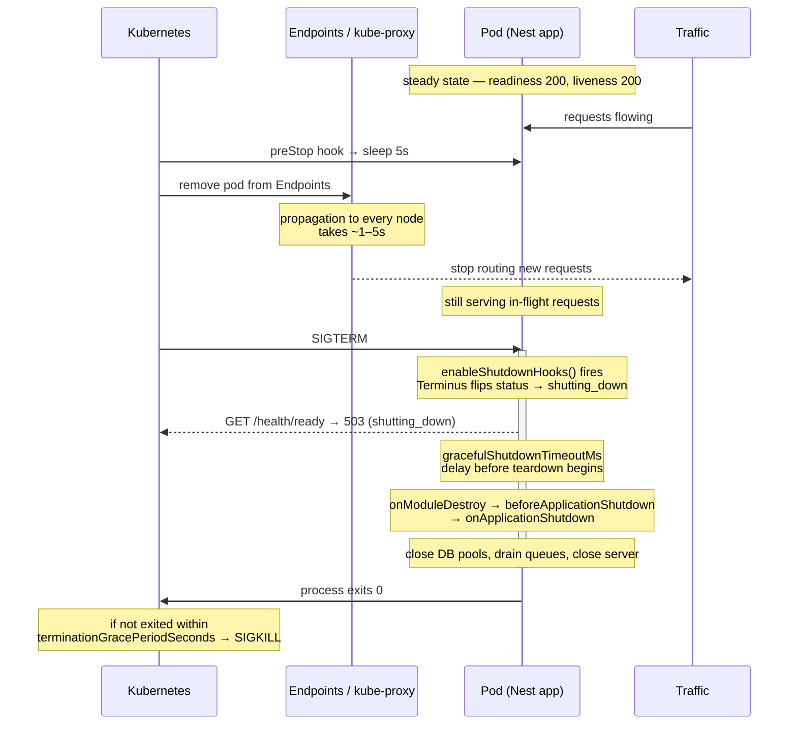

# Chapter 56 — Observability: Health Checks, Sentry, and Devtools

> **한눈에 보기**
> 18장에서 로그를, 39장에서 종료 훅을 배웠습니다. 이 장은 그 둘을 운영 관점에서 하나로 묶습니다.
> 오케스트레이터가 "이 컨테이너는 살아 있는가", "지금 트래픽을 보내도 되는가"를 어떻게 묻는지,
> `@nestjs/terminus`의 모든 헬스 인디케이터가 각각 무엇을 검사하는지, 그리고 대부분의 팀이 틀리는
> **liveness / readiness / startup 프로브의 구분**을 다룹니다. 이어서 처리되지 않은 예외를
> Sentry로 보내되 `HttpException`은 보내지 않는 방법, 그리고 Nest Devtools로 DI 그래프를 시각화하고
> CI에서 그래프 변경을 diff하는 방법까지 봅니다. 목표는 하나입니다 — 무슨 일이 벌어지는지 추측하지
> 않고 **보는** 것.

**What you will learn**

- Where a Nest application sits in the three pillars of observability, and which pillar each tool in this chapter serves.
- Every `@nestjs/terminus` health indicator — HTTP, five ORMs, memory, disk, microservice transports, gRPC — with the exact call signature and what each one actually executes against the dependency.
- The precise shape of `HealthCheckResult` (`status`/`info`/`error`/`details`), the three possible statuses including `shutting_down`, and which HTTP status code each produces.
- How to write a custom indicator with `HealthIndicatorService` rather than the deprecated base class.
- The distinction between liveness, readiness, and startup probes — stated as a rule you can apply mechanically — and why putting a database check in a liveness probe causes cascading restarts of a healthy fleet.
- How `gracefulShutdownTimeoutMs` interacts with `enableShutdownHooks()` to produce a genuinely zero-downtime rolling deploy.
- How to wire `@sentry/nestjs` so unhandled errors are captured with user and request context, while `HttpException` control flow is not.
- What Nest Devtools introspects, how the graph explorer diagnoses "Cannot resolve dependency", and how to diff the application graph in CI so an accidentally removed guard shows up in a pull request.

**Why this matters**

Here is an outage that a health check caused. A team wires a single `/health` endpoint that pings Postgres, and points both the Kubernetes liveness and readiness probes at it. The database has a brief connection-pool exhaustion event lasting 40 seconds. Every pod's liveness probe fails three times in a row. Kubernetes kills **all** of them, simultaneously. They restart, all reconnect to the same saturated database at once, fail again, and enter `CrashLoopBackOff`. A 40-second database blip becomes a 20-minute total outage — caused entirely by a probe answering the wrong question. Liveness asks "is this process broken beyond recovery?" The answer was no. The pods were fine; their dependency was busy.

Here is a second one, quieter. A team ships a refactor that moves a controller into a different module. In the move, `@UseGuards(JwtAuthGuard)` is dropped from one route. There is no test for that route's authorization because there never was one. The code review approves it — the diff shows a file move and the guard removal is buried in it. The endpoint is publicly readable for eleven weeks. Nothing in the logs, nothing in Sentry, nothing in the metrics. A dependency-graph diff in CI would have flagged it on the pull request as "route `GET /invoices/:id` lost an enhancer".

Observability is not dashboards. It is the set of mechanisms that make the invisible visible *before* someone gets paged. This chapter builds three of them.

## The three pillars, and where Nest fits

| Pillar | Question it answers | Tooling | Nest's role |
|---|---|---|---|
| **Logs** | What happened, in order, for this one request? | pino / Winston, shipped to Loki, CloudWatch, Datadog | `Logger`, custom logger, correlation IDs ([Chapter 18](../part2-intermediate/18-logging.md), [Chapter 43](43-async-local-storage.md)) |
| **Metrics** | How is the system behaving in aggregate, over time? | Prometheus, OpenTelemetry metrics | Interceptors emitting counters/histograms; `@nestjs/terminus` for the up/down signal |
| **Traces** | Where did the time go across service boundaries? | OpenTelemetry, Sentry performance, Jaeger | Auto-instrumentation at bootstrap; context propagation across microservice transports |

Health checks are a fourth thing that sits slightly outside the model: they are not observability for *humans*, they are an interface for the **orchestrator**. A human reads a log; Kubernetes reads a status code. Getting the health check right is what keeps the orchestrator from making things worse.

The rest of this chapter covers the orchestrator interface (Terminus), the error pillar (Sentry), and a Nest-specific tool with no equivalent elsewhere (Devtools' application-graph introspection).

## Terminus: health checks

```bash
$ npm install --save @nestjs/terminus
```

A **health check** is a summary of **health indicators**. An indicator checks one dependency and reports `up` or `down`. The check is healthy only if every assigned indicator is up.

Start with a dedicated module:

```bash
$ nest g module health
$ nest g controller health
```

```typescript title="health.module.ts"
import { Module } from '@nestjs/common';
import { TerminusModule } from '@nestjs/terminus';
import { HttpModule } from '@nestjs/axios';
import { HealthController } from './health.controller';

@Module({
  imports: [TerminusModule, HttpModule],
  controllers: [HealthController],
})
export class HealthModule {}
```

> **Hint** — Enable shutdown hooks in your application. Terminus uses the shutdown lifecycle event when it is available, and without it the `shutting_down` status and `gracefulShutdownTimeoutMs` cannot work. See [Chapter 39](39-lifecycle-and-shutdown.md).

### `TerminusModule.forRoot()` options

`TerminusModule` works with no configuration, but `forRoot()` gives you three settings that matter in production:

| Option | Type | Effect |
|---|---|---|
| `logger` | `Type<LoggerService>` \| `false` | Custom logger class for Terminus's own messages, or `false` to suppress all Terminus logging including errors. |
| `errorLogStyle` | `'json'` \| `'pretty'` | How a failed health check is rendered in the log. `json` (default) prints a one-line JSON summary; `pretty` prints a formatted box with successes and failures highlighted. |
| `gracefulShutdownTimeoutMs` | `number` | Delay, in milliseconds, before the shutdown process proceeds — used to give the orchestrator time to notice the readiness failure. |

```typescript title="health.module.ts"
@Module({
  imports: [
    TerminusModule.forRoot({
      errorLogStyle: 'pretty',            // 'json' in production, 'pretty' locally
      gracefulShutdownTimeoutMs: 5_000,   // > one readiness probe interval
    }),
  ],
  controllers: [HealthController],
})
export class HealthModule {}
```

Use `pretty` in local development, where a human reads the terminal, and `json` in production, where a log aggregator parses it. `pretty` output in a JSON log pipeline produces unparseable multi-line garbage.

### The first check

```typescript title="health.controller.ts"
import { Controller, Get } from '@nestjs/common';
import { HealthCheck, HealthCheckService, HttpHealthIndicator } from '@nestjs/terminus';

@Controller('health')
export class HealthController {
  constructor(
    private readonly health: HealthCheckService,
    private readonly http: HttpHealthIndicator,
  ) {}

  @Get()
  @HealthCheck()
  check() {
    return this.health.check([
      () => this.http.pingCheck('nestjs-docs', 'https://docs.nestjs.com'),
    ]);
  }
}
```

`HealthCheckService.check()` takes an array of **thunks**, not results. That matters: the functions are invoked by Terminus, in parallel, and Terminus owns the error handling. Calling the indicator eagerly (`this.http.pingCheck(...)` without the arrow) would throw before Terminus could catch it, and you would get a 500 instead of a structured 503.

`@HealthCheck()` is what maps the result to the right HTTP status code — and, incidentally, marks the route for Swagger.

### The result shape

```json
{
  "status": "ok",
  "info": { "nestjs-docs": { "status": "up" } },
  "error": {},
  "details": { "nestjs-docs": { "status": "up" } }
}
```

The interface is exported as `HealthCheckResult`:

| Field | Type | Meaning |
|---|---|---|
| `status` | `'ok'` \| `'error'` \| `'shutting_down'` | `'error'` if **any** indicator failed. `'shutting_down'` if the app is shutting down but still accepting HTTP requests. |
| `info` | `object` | Every indicator whose status is `'up'`. |
| `error` | `object` | Every indicator whose status is `'down'`. |
| `details` | `object` | Every indicator, up or down. Superset of `info` and `error`. |

| `status` | HTTP status code |
|---|---|
| `ok` | `200 OK` |
| `error` | `503 Service Unavailable` |
| `shutting_down` | `503 Service Unavailable` |

The `shutting_down` status is the one that makes zero-downtime deploys possible, and it is covered in [Graceful shutdown](#graceful-shutdown-and-the-probe-timeline).

Consume `details` in dashboards, not `info`/`error` — it is stable regardless of outcome, so a Grafana panel keyed on `details.database.status` does not break when the database goes down.

## The indicator catalogue

### HTTP: `pingCheck` and `responseCheck`

Requires `@nestjs/axios`:

```bash
$ npm i --save @nestjs/axios axios
```

```typescript
// Healthy if the GET returns a 2xx.
() => this.http.pingCheck('nestjs-docs', 'https://docs.nestjs.com')

// Healthy only if the predicate returns true.
() => this.http.responseCheck(
  'my-external-service',
  'https://my-external-service.com',
  (res) => res.status === 204,
)
```

`responseCheck`'s third parameter is a sync-or-async function returning a boolean: `true` means healthy. Use it when a 2xx is not sufficient — an upstream that returns `200 {"status":"degraded"}`, or one that signals health with `204`.

> **⚠️ Notice** — Be extremely careful about putting third-party HTTP checks in a probe that an orchestrator consumes. If Stripe has an outage and your readiness probe pings Stripe, Kubernetes removes every one of your pods from the load balancer and your entire API goes dark — including the 95% of routes that never touch Stripe. Check third parties in a *separate*, human-facing `/health/dependencies` endpoint that no probe reads.

### Database indicators

All five ORM indicators expose `pingCheck(key, options?)` and execute a trivial query against the connection.

```typescript title="health.controller.ts"
import { Controller, Get } from '@nestjs/common';
import {
  HealthCheck,
  HealthCheckService,
  TypeOrmHealthIndicator,
  MongooseHealthIndicator,
  SequelizeHealthIndicator,
  MikroOrmHealthIndicator,
  PrismaHealthIndicator,
} from '@nestjs/terminus';
import { PrismaService } from '../prisma/prisma.service';

@Controller('health')
export class HealthController {
  constructor(
    private readonly health: HealthCheckService,
    private readonly typeorm: TypeOrmHealthIndicator,
    private readonly mongoose: MongooseHealthIndicator,
    private readonly sequelize: SequelizeHealthIndicator,
    private readonly mikroOrm: MikroOrmHealthIndicator,
    private readonly prismaHealth: PrismaHealthIndicator,
    private readonly prisma: PrismaService,
  ) {}

  @Get('db')
  @HealthCheck()
  db() {
    return this.health.check([
      () => this.typeorm.pingCheck('typeorm'),
      () => this.mongoose.pingCheck('mongo'),
      () => this.sequelize.pingCheck('sequelize'),
      () => this.mikroOrm.pingCheck('mikroorm'),
      () => this.prismaHealth.pingCheck('prisma', this.prisma),
    ]);
  }
}
```

| Indicator | Package requirement | What it executes |
|---|---|---|
| `TypeOrmHealthIndicator` | `@nestjs/typeorm` | `SELECT 1` — or `SELECT 1 FROM DUAL` on Oracle |
| `MongooseHealthIndicator` | `@nestjs/mongoose` | Connection readiness / ping |
| `SequelizeHealthIndicator` | `@nestjs/sequelize` | `SELECT 1` |
| `MikroOrmHealthIndicator` | `@mikro-orm/nestjs` | Connection ping |
| `PrismaHealthIndicator` | `@prisma/client` | `SELECT 1` via the client you pass in |

`PrismaHealthIndicator` is the odd one out: it takes the `PrismaService` instance as a second argument rather than resolving a connection itself, because Prisma clients are not registered in a Nest-visible connection registry.

#### Multiple connections

With more than one database ([Chapter 19](../part2-intermediate/19-sql-with-typeorm.md)), inject each connection and pass it explicitly:

```typescript
import { InjectConnection } from '@nestjs/typeorm';
import { Connection } from 'typeorm';

@Controller('health')
export class HealthController {
  constructor(
    private readonly health: HealthCheckService,
    private readonly db: TypeOrmHealthIndicator,
    @InjectConnection('albumsConnection') private readonly albums: Connection,
    @InjectConnection() private readonly defaultConnection: Connection,
  ) {}

  @Get()
  @HealthCheck()
  check() {
    return this.health.check([
      () => this.db.pingCheck('albums-database', { connection: this.albums }),
      () => this.db.pingCheck('database', { connection: this.defaultConnection }),
    ]);
  }
}
```

Without the explicit `connection`, the indicator checks the default connection twice and reports a healthy secondary database that may be entirely down.

### Memory: heap and RSS

```typescript
// Unhealthy if the process heap exceeds 150 MB.
() => this.memory.checkHeap('memory_heap', 150 * 1024 * 1024)

// Unhealthy if the process RSS exceeds 150 MB.
() => this.memory.checkRSS('memory_rss', 150 * 1024 * 1024)
```

**Heap** is the region where dynamically allocated memory lives. Memory allocated from the heap stays allocated until it is freed or the program terminates.

**RSS** (Resident Set Size) is how much memory is allocated to the process and currently in RAM. It excludes swapped-out memory and includes memory from shared libraries whose pages are resident, plus all stack and heap memory.

Choose deliberately. `checkHeap` catches a JavaScript-level leak — an ever-growing cache, an unbounded array of listeners. `checkRSS` catches everything including native allocations (sharp, node-canvas, a leaking native driver) and is what correlates with your container's memory limit and OOMKill.

Set the threshold *below* the container limit with headroom, so the health check fires before the kernel kills the process:

```typescript
const LIMIT = Number(process.env.MEMORY_LIMIT_BYTES ?? 512 * 1024 * 1024);
() => this.memory.checkRSS('memory_rss', LIMIT * 0.85)
```

### Disk

```typescript
// Unhealthy if more than 50% of the volume at "/" is used.
() => this.disk.checkStorage('storage', { path: '/', thresholdPercent: 0.5 })

// Unhealthy if the volume at "/" has more than 250 GB used.
() => this.disk.checkStorage('storage', { path: '/', threshold: 250 * 1024 * 1024 * 1024 })
```

`thresholdPercent` is a fraction between 0 and 1; `threshold` is an absolute byte count. On Windows the path is a drive root such as `C:\\`.

Disk checks are worth having on any service that writes: upload staging areas, log files that are not shipped, SQLite databases, and — the classic — a container whose `/tmp` fills with orphaned multipart temp files.

### Microservice transports

```typescript
import { MicroserviceHealthIndicator } from '@nestjs/terminus';
import { Transport, RedisOptions } from '@nestjs/microservices';

@Get('mq')
@HealthCheck()
mq() {
  return this.health.check([
    () =>
      this.microservice.pingCheck<RedisOptions>('redis', {
        transport: Transport.REDIS,
        options: { host: 'localhost', port: 6379 },
      }),
  ]);
}
```

`MicroserviceHealthIndicator.pingCheck` opens a client for the given transport, connects, and closes it. It works for every built-in transport ([Chapters 45–48](45-microservices-fundamentals.md)) — `TCP`, `REDIS`, `NATS`, `MQTT`, `RMQ`, `KAFKA`, `GRPC` — by passing the corresponding options type as the generic parameter.

Note what this verifies: that the broker is reachable, not that your consumer is keeping up. Queue depth is a *metric*, not a health indicator, and it belongs in Prometheus.

### gRPC

```typescript
import { GRPCHealthIndicator } from '@nestjs/terminus';

@Get('grpc')
@HealthCheck()
grpc() {
  return this.health.check([
    () =>
      this.grpcHealth.checkService<{ service: string }>(
        'grpc-hero-service',
        'hero.health.v1',
        { timeout: 2_000 },
      ),
  ]);
}
```

`GRPCHealthIndicator.checkService` speaks the **standard gRPC health-checking protocol** (`grpc.health.v1.Health/Check`), so it works against any conformant gRPC server regardless of implementation language. The second argument is the service name to query; passing an empty string checks overall server health.

## Writing a custom indicator

The predefined indicators cover infrastructure. Business-level health — "is the feature-flag cache warm?", "did the last nightly import succeed?" — needs a custom indicator. Use `HealthIndicatorService`, which is the current API.

```typescript title="dog.health.ts"
import { Injectable } from '@nestjs/common';
import { HealthIndicatorService } from '@nestjs/terminus';

export interface Dog {
  name: string;
  type: string;
}

@Injectable()
export class DogHealthIndicator {
  constructor(private readonly healthIndicatorService: HealthIndicatorService) {}

  private dogs: Dog[] = [
    { name: 'Fido', type: 'goodboy' },
    { name: 'Rex', type: 'badboy' },
  ];

  async isHealthy(key: string) {
    const indicator = this.healthIndicatorService.check(key);

    const badboys = this.dogs.filter((dog) => dog.type === 'badboy');
    const isHealthy = badboys.length === 0;

    if (!isHealthy) {
      return indicator.down({ badboys: badboys.length });
    }
    return indicator.up();
  }
}
```

The API is three calls. `healthIndicatorService.check(key)` creates an indicator bound to a key; `indicator.up(details?)` and `indicator.down(details?)` produce the result. **Never throw** from an indicator — return `indicator.down(...)` with a payload explaining why. The payload lands in `error[key]` and `details[key]`, so put the diagnostic there: last successful timestamp, error message, count.

Register it and add it to the check:

```typescript title="health.module.ts"
import { Module } from '@nestjs/common';
import { TerminusModule } from '@nestjs/terminus';
import { HealthController } from './health.controller';
import { DogHealthIndicator } from './dog.health';

@Module({
  imports: [TerminusModule],
  controllers: [HealthController],
  providers: [DogHealthIndicator],
})
export class HealthModule {}
```

```typescript title="health.controller.ts"
@Get()
@HealthCheck()
check() {
  return this.health.check([() => this.dogHealthIndicator.isHealthy('dog')]);
}
```

> **Hint** — In a real application the indicator belongs in the module that owns the domain (`DogModule`), which `HealthModule` then imports. Keeping indicators next to the thing they measure is what stops `HealthModule` from becoming a module that imports everything and therefore couples everything.

A more realistic custom indicator, with a timeout — because an indicator that hangs is worse than one that fails:

```typescript title="import-freshness.health.ts"
import { Injectable } from '@nestjs/common';
import { HealthIndicatorService } from '@nestjs/terminus';
import { ImportRunRepository } from './import-run.repository';

const MAX_AGE_MS = 26 * 60 * 60 * 1000; // nightly job + 2h grace

@Injectable()
export class ImportFreshnessIndicator {
  constructor(
    private readonly health: HealthIndicatorService,
    private readonly runs: ImportRunRepository,
  ) {}

  async isHealthy(key: string) {
    const indicator = this.health.check(key);
    try {
      const last = await this.withTimeout(this.runs.findLastSuccessful(), 2_000);
      if (!last) return indicator.down({ reason: 'no successful import on record' });

      const ageMs = Date.now() - last.finishedAt.getTime();
      return ageMs > MAX_AGE_MS
        ? indicator.down({ ageMs, maxAgeMs: MAX_AGE_MS, lastRunId: last.id })
        : indicator.up({ ageMs, lastRunId: last.id });
    } catch (err) {
      return indicator.down({ reason: (err as Error).message });
    }
  }

  private withTimeout<T>(p: Promise<T>, ms: number): Promise<T> {
    return Promise.race([
      p,
      new Promise<never>((_, reject) =>
        setTimeout(() => reject(new Error(`indicator timed out after ${ms}ms`)), ms),
      ),
    ]);
  }
}
```

## Liveness, readiness, and startup probes

This is the section most teams need and most teams skip. The three probes answer three different questions, and answering them with one endpoint is the single most common production mistake in this chapter.

| Probe | Question | On failure | What it must check | What it must **never** check |
|---|---|---|---|---|
| **Liveness** | Is this process broken beyond recovery? | Container is **killed and restarted** | Only the process itself — that the event loop responds | Any external dependency |
| **Readiness** | Should this instance receive traffic *right now*? | Instance removed from the load balancer; **not** restarted | Dependencies this instance needs to serve requests: its database, its cache, its own warm-up state | Third-party APIs you cannot control |
| **Startup** | Has the process finished booting? | Container killed after `failureThreshold × periodSeconds` | Same as liveness, but with a generous budget | — |

The rule, stated so you can apply it without thinking:

> **A restart must be able to fix it.** If restarting the process would not help, it does not belong in the liveness probe.

Restarting your pod does not fix a saturated Postgres. That is why the opening outage happened: a database check in a liveness probe converts a dependency's bad minute into a fleet-wide crash loop. Restarting *does* fix a deadlocked event loop, a wedged native addon, or an unrecoverable internal state — that, and nothing else, is liveness.

Readiness is the opposite. If your database is down, this instance genuinely cannot serve requests, so it should leave the load-balancer pool — without being killed, so that it can rejoin the moment the database recovers.

Startup exists because liveness and readiness have short timeouts suited to a running process, and a cold JVM-style boot (migrations, cache warm-up, JIT) can exceed them. Without a startup probe you have to set `initialDelaySeconds` high on liveness, which delays detection of real hangs for the entire lifetime of the pod. With one, the startup probe covers boot generously and liveness takes over — aggressively — the moment startup succeeds.

### Three endpoints

```typescript title="health.controller.ts"
import { Controller, Get } from '@nestjs/common';
import {
  HealthCheck,
  HealthCheckService,
  MemoryHealthIndicator,
  TypeOrmHealthIndicator,
} from '@nestjs/terminus';
import { CacheWarmupIndicator } from './cache-warmup.health';

@Controller('health')
export class HealthController {
  constructor(
    private readonly health: HealthCheckService,
    private readonly db: TypeOrmHealthIndicator,
    private readonly memory: MemoryHealthIndicator,
    private readonly warmup: CacheWarmupIndicator,
  ) {}

  /** LIVENESS — process only. A restart must be able to fix anything checked here. */
  @Get('live')
  @HealthCheck()
  liveness() {
    return this.health.check([
      () => this.memory.checkRSS('memory_rss', 900 * 1024 * 1024),
    ]);
  }

  /** READINESS — can this instance serve a request right now? */
  @Get('ready')
  @HealthCheck()
  readiness() {
    return this.health.check([
      () => this.db.pingCheck('database', { timeout: 1_500 }),
      () => this.warmup.isHealthy('cache-warmup'),
    ]);
  }

  /** STARTUP — same shape as liveness, consumed with a generous budget. */
  @Get('startup')
  @HealthCheck()
  startup() {
    return this.health.check([
      () => this.memory.checkRSS('memory_rss', 900 * 1024 * 1024),
    ]);
  }

  /** HUMAN-FACING — everything, including third parties. No probe reads this. */
  @Get('dependencies')
  @HealthCheck()
  dependencies() {
    return this.health.check([
      () => this.db.pingCheck('database'),
      () => this.warmup.isHealthy('cache-warmup'),
      () => this.memory.checkHeap('memory_heap', 700 * 1024 * 1024),
    ]);
  }
}
```

Note the `timeout` on the readiness database ping. Without it, a hung connection makes the probe hang, Kubernetes times out the probe anyway, and you lose the structured error that would have told you which dependency failed.

### The Kubernetes manifest

```yaml title="deployment.yaml"
apiVersion: apps/v1
kind: Deployment
metadata:
  name: orders-api
spec:
  replicas: 4
  strategy:
    type: RollingUpdate
    rollingUpdate:
      maxUnavailable: 0
      maxSurge: 1
  template:
    spec:
      # Must exceed: preStop sleep + gracefulShutdownTimeoutMs + in-flight drain
      terminationGracePeriodSeconds: 45
      containers:
        - name: api
          image: acme/orders-api:sha-abc123
          ports:
            - containerPort: 3000

          startupProbe:
            httpGet: { path: /health/startup, port: 3000 }
            periodSeconds: 2
            failureThreshold: 45      # up to 90s to boot
            timeoutSeconds: 2

          livenessProbe:
            httpGet: { path: /health/live, port: 3000 }
            periodSeconds: 10
            failureThreshold: 3       # ~30s of hard failure before a restart
            timeoutSeconds: 2

          readinessProbe:
            httpGet: { path: /health/ready, port: 3000 }
            periodSeconds: 3
            failureThreshold: 2       # out of the pool within ~6s
            successThreshold: 1
            timeoutSeconds: 2

          lifecycle:
            preStop:
              exec:
                # Let the endpoints controller notice we are going away
                # BEFORE the process starts refusing connections.
                command: ['sh', '-c', 'sleep 5']

          resources:
            limits: { memory: 1Gi }
            requests: { memory: 512Mi, cpu: 250m }
```

Four details do the real work:

- **`maxUnavailable: 0`** means a new pod must become *ready* before an old one is removed. Without correct readiness, this guarantee is worthless.
- **`startupProbe` with a large `failureThreshold`** lets liveness stay aggressive (30 s) while still allowing 90 s to boot.
- **`preStop: sleep 5`** is not superstition. Kubernetes sends `SIGTERM` and updates the Endpoints object *concurrently*; kube-proxy on every node takes a moment to catch up. Without the sleep, requests keep arriving at a process that has already begun closing its server, and clients see connection resets.
- **`terminationGracePeriodSeconds`** must exceed the whole drain sequence, or `SIGKILL` truncates it.

### Graceful shutdown and the probe timeline



`gracefulShutdownTimeoutMs` is the delay Terminus inserts between "shutdown started" and "teardown proceeds". Its purpose is to hold the pod in the `shutting_down` state — answering readiness with 503 — long enough for the orchestrator to complete at least one readiness cycle and stop sending traffic.

The sizing rule: **`gracefulShutdownTimeoutMs` should slightly exceed `readinessProbe.periodSeconds × failureThreshold`.** With `periodSeconds: 3` and `failureThreshold: 2`, that is 6 seconds, so `gracefulShutdownTimeoutMs: 7_000` is a safe choice — the manifest above uses 5 s of `preStop` plus Terminus's delay, comfortably covering it.

Two things this requires from your `main.ts` ([Chapter 39](39-lifecycle-and-shutdown.md)):

```typescript title="main.ts"
const app = await NestFactory.create(AppModule);
app.enableShutdownHooks();   // without this, SIGTERM does not run your hooks
await app.listen(3000, '0.0.0.0');
```

And if your process refuses to exit because of long-lived keep-alive connections, add `forceCloseConnections: true` — but only after the readiness sequencing above is in place, or you truncate responses. See [Chapter 55](55-performance-and-compilation.md).

### Logging health-check failures

Terminus logs **only** error messages — a passing check is silent, which is what you want when a probe runs every 3 seconds.

To take over the logging entirely, supply a custom logger class. It is a normal Nest logger, so you can extend `ConsoleLogger` and override just the parts you care about:

```typescript title="terminus-logger.service.ts"
import { ConsoleLogger, Injectable, Scope } from '@nestjs/common';

@Injectable({ scope: Scope.TRANSIENT })
export class TerminusLogger extends ConsoleLogger {
  error(message: any, stack?: string, context?: string): void;
  error(message: any, ...optionalParams: any[]): void;
  error(
    message: unknown,
    stack?: unknown,
    context?: unknown,
    ...rest: unknown[]
  ): void {
    // Route health-check failures to your structured logger, add a
    // `probe` field, or rate-limit them so a 10-minute outage does not
    // produce 200 identical lines.
  }
}
```

```typescript title="health.module.ts"
@Module({
  imports: [TerminusModule.forRoot({ logger: TerminusLogger })],
})
export class HealthModule {}
```

To suppress Terminus logging completely, including errors:

```typescript
TerminusModule.forRoot({ logger: false })
```

Do this only if you are certain something else surfaces the failure. A silent health check that has been failing for a week because a secondary database was decommissioned is a real and embarrassing failure mode. The middle ground — log, but deduplicate — is almost always the right answer, and it is exactly what the custom logger above is for.

## Sentry: error tracking

Health checks tell the orchestrator that something is wrong. Sentry tells *you* what.

```bash
$ npm install --save @sentry/nestjs @sentry/profiling-node
```

`@sentry/profiling-node` is optional but recommended — it adds CPU profiles to your traces.

### `instrument.ts` and why import order is everything

Sentry works by monkey-patching Node's modules — `http`, `pg`, `ioredis`, and dozens more — so that it can observe calls without you instrumenting them. Patching only works on modules that have not yet been required. If `AppModule` (and transitively `pg`) loads before `Sentry.init()`, Sentry patches a module nobody is using and you get errors with no spans, no breadcrumbs, and no database queries in the trace.

Create the init file:

```typescript title="instrument.ts"
const Sentry = require('@sentry/nestjs');
const { nodeProfilingIntegration } = require('@sentry/profiling-node');

// Ensure this runs before requiring any other modules!
Sentry.init({
  dsn: process.env.SENTRY_DSN,
  environment: process.env.NODE_ENV,
  release: process.env.GIT_SHA,          // ties errors to a deploy
  integrations: [nodeProfilingIntegration()],

  // Tracing. Lower this in production.
  tracesSampleRate: 1.0,
  // Profiling rate, relative to tracesSampleRate.
  profilesSampleRate: 1.0,
});
```

The file uses `require` deliberately: `import` statements are hoisted by the TypeScript/ESM compiler, so an `import * as Sentry` here plus an `import { AppModule }` in `main.ts` could still evaluate `AppModule` first. `require` runs where it is written.

```typescript title="main.ts"
// Import this FIRST — before anything else.
import './instrument';

import { NestFactory } from '@nestjs/core';
import { AppModule } from './app.module';

async function bootstrap() {
  const app = await NestFactory.create(AppModule);
  await app.listen(process.env.PORT ?? 3000);
}
bootstrap();
```

If you build with SWC or webpack and the bundler reorders things, verify with a deliberate throw (see [Testing the integration](#testing-the-integration) below) rather than assuming.

### `SentryModule`

```typescript title="app.module.ts"
import { Module } from '@nestjs/common';
import { SentryModule } from '@sentry/nestjs/setup';
import { AppController } from './app.controller';
import { AppService } from './app.service';

@Module({
  imports: [SentryModule.forRoot(), /* ...other modules */],
  controllers: [AppController],
  providers: [AppService],
})
export class AppModule {}
```

### Exception handling: two paths

Which path you take depends on whether you already have a global catch-all filter.

**If you do not have one**, register `SentryGlobalFilter`. It reports any unhandled error not caught by another filter:

```typescript title="app.module.ts"
import { Module } from '@nestjs/common';
import { APP_FILTER } from '@nestjs/core';
import { SentryGlobalFilter } from '@sentry/nestjs/setup';

@Module({
  providers: [
    { provide: APP_FILTER, useClass: SentryGlobalFilter },
    // ...other providers
  ],
})
export class AppModule {}
```

> **⚠️ Notice** — `SentryGlobalFilter` **must be registered before any other exception filters.** Nest applies `APP_FILTER` providers in reverse registration order when matching, and a filter registered after it can swallow the exception before Sentry sees it.

**If you already have a global catch-all filter** — one registered via `app.useGlobalFilters()`, or an `APP_FILTER` provider whose `@Catch()` has no arguments — do not add `SentryGlobalFilter`. Decorate your filter's `catch()` method instead:

```typescript title="all-exceptions.filter.ts"
import { ArgumentsHost, Catch, ExceptionFilter, HttpException, HttpStatus, Logger } from '@nestjs/common';
import { SentryExceptionCaptured } from '@sentry/nestjs';

@Catch()
export class AllExceptionsFilter implements ExceptionFilter {
  private readonly logger = new Logger(AllExceptionsFilter.name);

  @SentryExceptionCaptured()
  catch(exception: unknown, host: ArgumentsHost): void {
    const ctx = host.switchToHttp();
    const res = ctx.getResponse();

    const status =
      exception instanceof HttpException
        ? exception.getStatus()
        : HttpStatus.INTERNAL_SERVER_ERROR;

    if (status >= 500) {
      this.logger.error(exception instanceof Error ? exception.stack : String(exception));
    }

    res.status(status).json({
      statusCode: status,
      message: exception instanceof HttpException ? exception.getResponse() : 'Internal server error',
      timestamp: new Date().toISOString(),
    });
  }
}
```

Combining both — your filter *and* `SentryGlobalFilter` — is the common misconfiguration. Your filter catches everything, so `SentryGlobalFilter` never fires, and you get zero events while believing you are covered.

### What is and is not reported

By default Sentry reports **only unhandled exceptions that no error filter caught**. `HttpException` and its derivatives ([Chapter 9](../part1-beginner/09-exception-filters.md)) are **not** captured, because they are control flow: a `404 NotFoundException` is your API working correctly, not an incident.

This default is right, and you should resist the urge to change it globally. If you want a specific 4xx tracked — repeated `403`s from one user suggesting a broken client — capture it explicitly at the site where you know it matters:

```typescript
import * as Sentry from '@sentry/nestjs';

if (attempt.count > 10) {
  Sentry.captureMessage('Repeated authorization failures', {
    level: 'warning',
    tags: { route: 'invoices.read' },
    extra: { userId: user.id, attempts: attempt.count },
  });
}
```

### Context, user, and tags

An error without context is a stack trace you cannot act on. Attach identity and request metadata with an interceptor:

```typescript title="sentry-context.interceptor.ts"
import { CallHandler, ExecutionContext, Injectable, NestInterceptor } from '@nestjs/common';
import * as Sentry from '@sentry/nestjs';

@Injectable()
export class SentryContextInterceptor implements NestInterceptor {
  intercept(context: ExecutionContext, next: CallHandler) {
    const req = context.switchToHttp().getRequest();

    Sentry.getCurrentScope().setUser(
      req.user ? { id: req.user.sub, email: req.user.email } : null,
    );
    Sentry.getCurrentScope().setTags({
      tenant: req.headers['x-tenant-id'] ?? 'unknown',
      route: `${context.getClass().name}.${context.getHandler().name}`,
    });
    Sentry.getCurrentScope().setContext('request', {
      requestId: req.headers['x-request-id'],
      method: req.method,
      url: req.url,
    });

    return next.handle();
  }
}
```

Never put secrets, tokens, or full request bodies in `setContext`. Sentry retains them, and a leaked `Authorization` header in an error report is a real incident. Use `beforeSend` in `instrument.ts` to scrub defensively:

```typescript
Sentry.init({
  // ...
  beforeSend(event) {
    delete event.request?.headers?.authorization;
    delete event.request?.headers?.cookie;
    return event;
  },
});
```

### Performance tracing and sampling

`tracesSampleRate: 1.0` sends a trace for every request. That is correct in development and expensive in production. Use a sampling function so you keep 100% of the interesting traffic and a small slice of the rest:

```typescript
Sentry.init({
  dsn: process.env.SENTRY_DSN,
  tracesSampler: (ctx) => {
    const url = ctx.request?.url ?? '';
    if (url.startsWith('/health')) return 0;        // never trace probes
    if (url.startsWith('/admin')) return 1.0;       // low volume, high value
    if (ctx.parentSampled !== undefined) return ctx.parentSampled; // honour upstream
    return 0.05;                                    // 5% of everything else
  },
  profilesSampleRate: 0.1,
});
```

Excluding `/health` is not an optimisation detail — a probe every 3 seconds across 4 replicas is 115,000 traces a day of a route that always returns the same 200.

### Source maps

Unless you upload source maps, your stack traces point at bundled, minified JavaScript. The wizard configures the upload for you:

```bash
$ npx @sentry/wizard@latest -i sourcemaps
```

Make sure the `release` in `Sentry.init()` matches the release the source maps are uploaded under — a commit SHA is the natural choice — or the maps will not be applied.

### Testing the integration

```typescript
@Get('debug-sentry')
getError() {
  throw new Error('My first Sentry error!');
}
```

Hit `/debug-sentry` and confirm the event appears. Check three things, not one: that the event arrives, that the stack trace shows *your* source (source maps work), and that the trace includes downstream spans such as database queries (`instrument.ts` was imported early enough). If the third is missing, your import order is wrong.

## Nest Devtools

Devtools introspects something no generic APM can see: **your application's dependency-injection graph**. Nest constructs a graph of modules, providers, controllers, and enhancers at bootstrap; Devtools serialises it and renders it.

### Setup

```typescript title="main.ts"
async function bootstrap() {
  const app = await NestFactory.create(AppModule, {
    snapshot: true,      // collect the graph metadata
  });
  await app.listen(process.env.PORT ?? 3000);
}
```

```bash
$ npm i @nestjs/devtools-integration
```

```typescript title="app.module.ts"
import { Module } from '@nestjs/common';
import { DevtoolsModule } from '@nestjs/devtools-integration';

@Module({
  imports: [
    DevtoolsModule.register({
      http: process.env.NODE_ENV !== 'production',
    }),
  ],
  controllers: [AppController],
  providers: [AppService],
})
export class AppModule {}
```

> **⚠️ Notice** — Never enable this module in production. `DevtoolsModule` exposes an **additional HTTP server on port 8000** that serves your full application graph — every provider name, every module relationship, and, through the Sandbox, arbitrary code execution against your running application. The `NODE_ENV` guard above is mandatory, not stylistic.

> **Hint** — If you use `@nestjs/graphql`, make sure you are on the latest major (`npm i @nestjs/graphql@11`) — older versions do not serialise correctly for the graph.

Start the app and open [devtools.nestjs.com](https://devtools.nestjs.com) to see the introspected graph.

### The graph explorer

The modules view shows your module graph. Every module connects to `InternalCoreModule`, a global module Nest always imports into the root; because it is registered globally, Nest creates an edge from it to every module. That makes the graph look denser than your architecture actually is — use the **"Hide global modules"** checkbox in the sidebar to see the real shape.

Switch the view to **Classes** to see providers and controllers rather than modules. Click a node for a popup with a **Focus** button; use the sidebar search to find a node by name; use the edge-proximity controls to isolate a sub-tree.

Two uses justify the setup cost on their own:

- **Onboarding.** Showing a new engineer the module graph communicates in thirty seconds what a `README` cannot.
- **Decomposition.** When you are extracting a module into its own service, visualising that module with all its dependencies tells you exactly what the extraction will drag along.

Export the current view with **Export as PNG** for design docs and RFCs.

### Diagnosing "Cannot resolve dependency"

The most common Nest error — `Nest can't resolve dependencies of the TasksService (?)` — is a graph problem, and Devtools reads it directly.

```typescript title="main.ts"
import * as fs from 'node:fs';
import { NestFactory, PartialGraphHost } from '@nestjs/core';

async function bootstrap() {
  const app = await NestFactory.create(AppModule, {
    snapshot: true,
    abortOnError: false,   // <-- required
  });
  await app.listen(process.env.PORT ?? 3000);
}

bootstrap().catch(() => {
  fs.writeFileSync('graph.json', PartialGraphHost.toString() ?? '');
  process.exit(1);
});
```

`abortOnError: false` tells Nest to keep enough state for a *partial* graph instead of tearing down immediately. Now every failed bootstrap writes `graph.json` to the project root. Drag that file into Devtools with the mode switched from **Interactive** to **Preview**.

The modules view highlights the offending module and the dialog explains the failure. The Classes view is more direct: it shows that `DiagnosticsService`, which you tried to inject into `TasksService`, was not found in `TasksModule`'s context — so you need to import `DiagnosticsModule` into `TasksModule`. This is the same conclusion you would eventually reach by reading the error text, arrived at in seconds rather than minutes, and it scales to graphs where the text is ambiguous.

> **Hint** — This feature requires `@nestjs/core` v9.3.10 or later.

### Routes explorer

The **Routes explorer** page lists every registered entrypoint — not only HTTP routes but WebSocket handlers, gRPC methods, microservice message patterns, and GraphQL resolvers — grouped by host controller.

Click an entrypoint to get a **flow graph** of its execution: the guards, interceptors, and pipes bound to that specific route, in order. This is the single best tool for the question "why is my guard not running?", because it shows you what Nest actually bound rather than what you believe you bound.

### Sandbox

The **Sandbox** page executes JavaScript against your running application in real time. You can call a service directly, bypassing the authentication layer — no login step, no test account — and trigger events in event-driven applications to watch how the system reacts. Anything logged is streamed to the playground console; `console.table()` renders arrays of objects as a table.

The value is the loop: change nothing, rebuild nothing, restart nothing, and still probe live behaviour. The risk is identical to the value, which is why the production guard is non-negotiable.

### Bootstrap performance analyzer

The **Bootstrap performance** page lists every class node — controllers, providers, enhancers — with its instantiation time. This is the tool referenced in [Chapter 55](55-performance-and-compilation.md) for startup optimisation, and it matters most in serverless, where every cold start pays the full bootstrap cost. It attributes time to *your* classes, which no V8 profiler will do for you.

### Audit

The **Audit** page shows auto-generated errors, warnings, and hints produced by analysing the serialized graph — unused providers, suspicious global modules, scope mismatches, and more. Treat it as a linter for your architecture: not everything it flags is wrong, but everything it flags is worth a look.

### Serialising the graph to a file

You do not need the HTTP server to use Devtools. Write the graph after initialisation and upload the file:

```typescript
import * as fs from 'node:fs';
import { SerializedGraph } from '@nestjs/core';

await app.listen(process.env.PORT ?? 3000);   // or: await app.init()
fs.writeFileSync('./graph.json', app.get(SerializedGraph).toString());
```

Drag and drop the file into Devtools. This is how you share a graph with a colleague, analyse one offline, or capture a snapshot from an environment you cannot expose a port on.

## Devtools in CI/CD: diffing the graph

This is the feature that would have caught the missing guard from the chapter opening. It is available on the **Enterprise** plan.

### Publishing a graph from a pipeline

```typescript title="main.ts"
import { NestFactory } from '@nestjs/core';
import { GraphPublisher } from '@nestjs/devtools-integration';
import { AppModule } from './app.module';

async function bootstrap() {
  const shouldPublishGraph = process.env.PUBLISH_GRAPH === 'true';

  const app = await NestFactory.create(AppModule, {
    snapshot: true,
    preview: shouldPublishGraph,
  });

  if (shouldPublishGraph) {
    await app.init();

    const publishOptions = {
      apiKey: process.env.DEVTOOLS_API_KEY,
      repository: process.env.REPOSITORY_NAME,
      owner: process.env.GITHUB_REPOSITORY_OWNER,
      sha: process.env.COMMIT_SHA,
      target: process.env.TARGET_SHA,
      trigger: process.env.GITHUB_BASE_REF ? 'pull' : 'push',
      branch: process.env.BRANCH_NAME,
    };

    const graphPublisher = new GraphPublisher(app);
    await graphPublisher.publish(publishOptions);

    await app.close();
  } else {
    await app.listen(process.env.PORT ?? 3000);
  }
}
bootstrap();
```

The `preview: true` flag is the key to making this practical. In preview mode Nest builds the full graph but **does not execute constructors or lifecycle hooks** of controllers, enhancers, or providers. Your CI job therefore does not need a database, a Redis instance, or any secret beyond the Devtools API key. It is not strictly required, but without it you are standing up your entire infrastructure in CI to produce a static graph.

### GitHub Actions

```yaml title=".github/workflows/publish-graph.yml"
name: Devtools

on:
  push:
    branches: [master]
  pull_request:
    branches: ['*']

jobs:
  publish:
    if: github.actor != 'dependabot[bot]'
    name: Publish graph
    runs-on: ubuntu-latest
    steps:
      - uses: actions/checkout@v4
      - uses: actions/setup-node@v4
        with:
          node-version: '22'
          cache: 'npm'
      - name: Install dependencies
        run: npm ci
      - name: Setup Environment (PR)
        if: ${{ github.event_name == 'pull_request' }}
        shell: bash
        run: echo "COMMIT_SHA=${{ github.event.pull_request.head.sha }}" >> ${GITHUB_ENV}
      - name: Setup Environment (Push)
        if: ${{ github.event_name == 'push' }}
        shell: bash
        run: echo "COMMIT_SHA=${GITHUB_SHA}" >> ${GITHUB_ENV}
      - name: Publish
        run: PUBLISH_GRAPH=true npm run start
        env:
          DEVTOOLS_API_KEY: ${{ secrets.DEVTOOLS_API_KEY }}
          REPOSITORY_NAME: ${{ github.event.repository.name }}
          BRANCH_NAME: ${{ github.head_ref || github.ref_name }}
          TARGET_SHA: ${{ github.event.pull_request.base.sha }}
```

Generate the project API key on the Devtools **Manage API keys** page and store it in GitHub Secrets — never in the workflow file. Optionally install the Devtools **GitHub app** ("Integrate GitHub app") so preview/report status appears directly on the pull request.

### GitLab

```yaml title=".gitlab-ci.yml"
image: node:22

stages: [build]

cache:
  key:
    files: [package-lock.json]
  paths: [node_modules/]

workflow:
  rules:
    - if: $CI_PIPELINE_SOURCE == "merge_request_event"
      when: always
    - if: $CI_COMMIT_BRANCH == "master" && $CI_PIPELINE_SOURCE == "push"
      when: always
    - when: never

install_dependencies:
  stage: build
  script:
    - npm ci

publish_graph:
  stage: build
  needs: [install_dependencies]
  script: npm run start
  variables:
    PUBLISH_GRAPH: 'true'
    DEVTOOLS_API_KEY: $DEVTOOLS_API_KEY
```

### Any other CI system

The integration works anywhere; only the environment variables change. The GitLab-flavoured `publishOptions` looks like this:

```typescript
const publishOptions = {
  apiKey: process.env.DEVTOOLS_API_KEY,
  repository: process.env.CI_PROJECT_NAME,
  owner: process.env.CI_PROJECT_ROOT_NAMESPACE,
  sha: process.env.CI_COMMIT_SHA,
  target: process.env.CI_MERGE_REQUEST_DIFF_BASE_SHA,
  trigger: process.env.CI_MERGE_REQUEST_DIFF_BASE_SHA ? 'pull' : 'push',
  branch:
    process.env.CI_COMMIT_BRANCH ??
    process.env.CI_MERGE_REQUEST_SOURCE_BRANCH_NAME,
};
```

CircleCI, Bitbucket Pipelines, and others expose equivalent built-in variables. Recommended triggers:

- **`push`** — only when the branch is a deployment environment (`master`, `main`, `staging`, `production`).
- **`pull request`** — always, or at least when the target branch is a deployment environment.

### Reading the reports

A report is generated for a build **only if a snapshot already exists** for the target. A PR against `master` gets a report because `master`'s graph was published; the very first publish on a new branch gets none.

In the **Build preview**, differences are colour-coded:

- **green** — added elements
- **light white** — updated elements
- **red** — deleted elements

What this catches that code review does not:

- Someone changes the scope of a **deeply nested provider** to `REQUEST`. The diff is one word; the report shows the scope change and its blast radius ([Chapter 38](38-injection-scopes.md)).
- Someone removes a guard from an endpoint. If no integration test covered that route's authorization, the report is the only signal — and it appears on the PR.
- Someone makes a module `@Global()`. The report shows a large number of added edges, which is nearly always a design smell.

Because every published graph is retained, you can go back in time and compare any two builds. Think of it as Git that understands how Nest assembles your application, and can draw it.

## Common mistakes

1. **One `/health` endpoint wired to both liveness and readiness.**
   *Symptom:* a brief database outage causes every pod to restart simultaneously and enter `CrashLoopBackOff`. *Cause:* a dependency check in a liveness probe. *Fix:* split into `/health/live` (process only), `/health/ready` (dependencies), and `/health/startup`. Apply the rule: if a restart cannot fix it, it is not liveness.

2. **A third-party API in the readiness probe.**
   *Symptom:* an upstream vendor's outage takes your entire API out of the load-balancer pool, including routes that never call it. *Cause:* `http.pingCheck('stripe', ...)` in `/health/ready`. *Fix:* move third-party checks to a human-facing `/health/dependencies` that no probe reads.

3. **Calling indicators eagerly instead of passing thunks.**
   *Symptom:* `500 Internal Server Error` from the health endpoint instead of a structured `503`. *Cause:* `this.health.check([this.db.pingCheck('db')])` — the promise rejects before Terminus can wrap it. *Fix:* always pass arrow functions: `[() => this.db.pingCheck('db')]`.

4. **Rolling deploys drop requests despite `maxUnavailable: 0`.**
   *Symptom:* clients see connection resets during every deploy. *Cause:* the pod stops accepting connections before kube-proxy has removed it from the routing table. *Fix:* add a `preStop` sleep of a few seconds, set `gracefulShutdownTimeoutMs` above `periodSeconds × failureThreshold`, and confirm `app.enableShutdownHooks()` is called.

5. **Sentry reports errors with no spans and no breadcrumbs.**
   *Symptom:* events arrive, but with no database queries or HTTP calls in the trace. *Cause:* `instrument.ts` was imported after other modules, so Sentry patched already-loaded modules. *Fix:* make `import './instrument'` the literal first line of `main.ts` and use `require` inside the file; verify with `/debug-sentry` that downstream spans appear.

6. **Sentry receives nothing at all despite the module being registered.**
   *Symptom:* zero events in production. *Cause:* an existing global catch-all `@Catch()` filter handles every exception, so `SentryGlobalFilter` never runs. *Fix:* pick one path — either register `SentryGlobalFilter` (before all other filters) or add `@SentryExceptionCaptured()` to your own filter's `catch()`. Never both.

7. **`DevtoolsModule` left enabled in production.**
   *Symptom:* an unauthenticated HTTP server on port 8000 exposing your full application graph and an arbitrary-code Sandbox. *Cause:* `DevtoolsModule.register({ http: true })` with no environment guard. *Fix:* `http: process.env.NODE_ENV !== 'production'`, and verify with a port scan of a production pod.

8. **Health-check noise drowning the logs.**
   *Symptom:* thousands of identical error lines during a ten-minute outage. *Cause:* every probe cycle logs the same failure; four replicas × every 3 seconds. *Fix:* a custom `TerminusLogger` that deduplicates or rate-limits, or `errorLogStyle: 'json'` plus an aggregation rule. `logger: false` suppresses errors entirely — use it only when something else surfaces the failure.

## Putting it together

A production health module with all three probes, a custom domain indicator, correct shutdown timing, and Sentry wired without double-reporting.

```typescript title="cache-warmup.health.ts"
import { Injectable } from '@nestjs/common';
import { HealthIndicatorService } from '@nestjs/terminus';
import { FeatureFlagCache } from '../flags/feature-flag.cache';

@Injectable()
export class CacheWarmupIndicator {
  constructor(
    private readonly health: HealthIndicatorService,
    private readonly cache: FeatureFlagCache,
  ) {}

  async isHealthy(key: string) {
    const indicator = this.health.check(key);
    const size = this.cache.size();
    return size > 0
      ? indicator.up({ entries: size, loadedAt: this.cache.loadedAt })
      : indicator.down({ reason: 'feature flag cache not yet warmed' });
  }
}
```

```typescript title="health.module.ts"
import { Module } from '@nestjs/common';
import { TerminusModule } from '@nestjs/terminus';
import { HttpModule } from '@nestjs/axios';
import { FlagsModule } from '../flags/flags.module';
import { HealthController } from './health.controller';
import { CacheWarmupIndicator } from './cache-warmup.health';
import { TerminusLogger } from './terminus-logger.service';

@Module({
  imports: [
    TerminusModule.forRoot({
      logger: TerminusLogger,
      errorLogStyle: process.env.NODE_ENV === 'production' ? 'json' : 'pretty',
      // Must exceed readinessProbe.periodSeconds * failureThreshold (3 * 2 = 6s)
      gracefulShutdownTimeoutMs: 7_000,
    }),
    HttpModule,
    FlagsModule,
  ],
  controllers: [HealthController],
  providers: [CacheWarmupIndicator],
})
export class HealthModule {}
```

```typescript title="main.ts"
// MUST be first — Sentry patches modules that are not yet loaded.
import './instrument';

import { NestFactory } from '@nestjs/core';
import { Logger, ValidationPipe } from '@nestjs/common';
import { AppModule } from './app.module';
import { SentryContextInterceptor } from './common/sentry-context.interceptor';

async function bootstrap() {
  const app = await NestFactory.create(AppModule, {
    snapshot: process.env.NODE_ENV !== 'production',
    abortOnError: false,
  });

  app.enableShutdownHooks();                  // required for shutting_down status
  app.useGlobalPipes(new ValidationPipe({ transform: true, whitelist: true }));
  app.useGlobalInterceptors(new SentryContextInterceptor());

  await app.listen(process.env.PORT ?? 3000, '0.0.0.0');
  Logger.log(`Listening on ${await app.getUrl()}`, 'Bootstrap');
}

bootstrap().catch(async (err) => {
  // Write a partial graph so a failed bootstrap can be diagnosed in Devtools.
  const { PartialGraphHost } = await import('@nestjs/core');
  const fs = await import('node:fs');
  fs.writeFileSync('graph.json', PartialGraphHost.toString() ?? '');
  Logger.error(err, 'Bootstrap');
  process.exit(1);
});
```

```typescript title="app.module.ts"
import { Module } from '@nestjs/common';
import { APP_FILTER } from '@nestjs/core';
import { SentryModule } from '@sentry/nestjs/setup';
import { DevtoolsModule } from '@nestjs/devtools-integration';
import { AllExceptionsFilter } from './common/all-exceptions.filter';
import { HealthModule } from './health/health.module';
import { OrdersModule } from './orders/orders.module';

@Module({
  imports: [
    SentryModule.forRoot(),
    // NEVER enable in production — exposes the graph and a code sandbox.
    DevtoolsModule.register({ http: process.env.NODE_ENV !== 'production' }),
    HealthModule,
    OrdersModule,
  ],
  providers: [
    // We own the catch-all filter, so it carries @SentryExceptionCaptured().
    // Do NOT also register SentryGlobalFilter.
    { provide: APP_FILTER, useClass: AllExceptionsFilter },
  ],
})
export class AppModule {}
```

Verify the whole thing before you trust it:

```bash
$ curl -si localhost:3000/health/live    | head -1   # expect 200
$ curl -si localhost:3000/health/ready   | head -1   # expect 200
$ docker stop -t 45 <container>                      # watch: ready → 503, then clean exit
$ curl -s  localhost:3000/debug-sentry               # expect an event WITH db spans
```

> **핵심 정리**
> - 헬스 체크는 사람이 아니라 **오케스트레이터를 위한 인터페이스**입니다. 사람은 로그를 읽고, 쿠버네티스는 상태 코드를 읽습니다.
> - `HealthCheckService.check()`에는 결과가 아니라 **함수(thunk)** 배열을 넘겨야 합니다. 즉시 호출하면 Terminus가 오류를 감싸지 못해 503 대신 500이 납니다.
> - `HealthCheckResult`의 `status`는 `'ok'`(200) / `'error'`(503) / `'shutting_down'`(503) 셋입니다. 대시보드는 `info`/`error`가 아니라 항상 존재하는 `details`를 읽으세요.
> - **liveness / readiness / startup은 서로 다른 질문입니다.** 판단 기준 한 줄: **재시작으로 고칠 수 없다면 liveness에 넣지 마세요.** DB 체크를 liveness에 넣으면 DB의 40초 장애가 전체 함대의 CrashLoopBackOff로 증폭됩니다.
> - 서드파티 API는 어떤 프로브에도 넣지 말고, 프로브가 읽지 않는 `/health/dependencies`에 두세요.
> - `gracefulShutdownTimeoutMs`는 `readinessProbe.periodSeconds × failureThreshold`보다 약간 커야 하며, `preStop` sleep + `enableShutdownHooks()`와 함께여야 무중단 배포가 성립합니다.
> - `checkHeap`은 JS 레벨 누수를, `checkRSS`는 네이티브 할당까지 포함한 컨테이너 메모리 한도를 잡습니다. 임계값은 컨테이너 limit보다 낮게 두세요.
> - 커스텀 인디케이터는 `HealthIndicatorService`의 `check(key)` → `indicator.up()/down(details)` 패턴을 쓰고, **절대 throw하지 말고** 진단 정보를 `down()`의 payload에 담으세요.
> - Sentry의 `instrument.ts`는 반드시 **가장 먼저** 로드되어야 합니다. 다른 모듈이 먼저 로드되면 몽키패치가 적용되지 않아 span 없는 이벤트만 남습니다.
> - 전역 catch-all 필터가 이미 있다면 `SentryGlobalFilter`를 추가하지 말고 `@SentryExceptionCaptured()`를 쓰세요. 둘을 함께 쓰면 이벤트가 하나도 안 옵니다. `HttpException`은 기본적으로 보고되지 않으며, 그것이 옳은 기본값입니다.
> - `DevtoolsModule`은 8000번 포트에 그래프와 코드 실행 Sandbox를 노출합니다. **프로덕션에서 절대 켜지 마세요.** `abortOnError: false` + `PartialGraphHost`로 부트스트랩 실패를 그래프로 진단할 수 있습니다.
> - CI에서 `GraphPublisher`(+ `preview: true`)로 그래프를 게시하면, 코드 리뷰가 놓치는 변화 — 사라진 가드, 바뀐 프로바이더 스코프, `@Global()` 승격 — 를 PR에서 diff로 볼 수 있습니다.

> **연습 문제**
> 1. 단일 `/health` 엔드포인트에 DB 핑을 넣고 liveness·readiness 프로브 양쪽에 연결한 뒤, DB를 30초간 중단시켜 보세요. 파드에 무슨 일이 생기는지 관찰하고, 세 개의 엔드포인트로 분리한 뒤 같은 실험을 반복해 차이를 서술하세요.
> 2. `TerminusModule.forRoot({ errorLogStyle: 'pretty' })`와 `'json'`을 각각 적용하고 인디케이터 하나를 실패시켜 로그 출력을 비교하세요. JSON 로그 파이프라인에서 `'pretty'`가 왜 문제가 되는지 설명하세요.
> 3. **직접 만들어 보기.** `HealthIndicatorService`로 "마지막 배치 작업이 26시간 이내에 성공했는가"를 검사하는 커스텀 인디케이터를 작성하세요. 조회에 2초 타임아웃을 걸고, 실패 시 `down()` payload에 `ageMs`·`lastRunId`·`reason`을 포함시키세요. 그리고 이 인디케이터를 readiness가 아니라 `/health/dependencies`에 넣어야 하는 이유를 3줄로 논증하세요.
> 4. **직접 만들어 보기.** `preStop` sleep, `gracefulShutdownTimeoutMs`, `terminationGracePeriodSeconds`가 모두 설정된 Deployment 매니페스트를 작성하고, 롤링 배포 중 `autocannon`으로 부하를 주면서 실패 요청이 0인지 확인하세요. 그런 다음 `preStop`을 제거하고 같은 실험을 반복해 차이를 측정하세요.
> 5. `instrument.ts`를 `main.ts`의 첫 줄이 아니라 `AppModule` import 뒤로 옮긴 뒤 `/debug-sentry`를 호출하세요. Sentry 이벤트에서 정확히 무엇이 사라지는지 확인하고 그 이유를 설명하세요.
> 6. `abortOnError: false`와 `PartialGraphHost`를 설정한 상태에서 일부러 모듈 import를 빠뜨려 부트스트랩을 실패시키고, 생성된 `graph.json`을 Devtools의 Preview 모드에 올려 보세요. 텍스트 오류 메시지만 읽었을 때와 비교해 진단 속도가 어떻게 달라지는지 기록하세요.

**Next:** Your application is now observable and correctly wired into an orchestrator — but so far it has been one HTTP server per process. [Chapter 57 — Advanced HTTP: Hybrid Apps, Multiple Servers, Adapters, Raw Body, SSE](57-advanced-http.md) breaks that assumption apart, running HTTP and microservice listeners side by side in a single Nest application.
