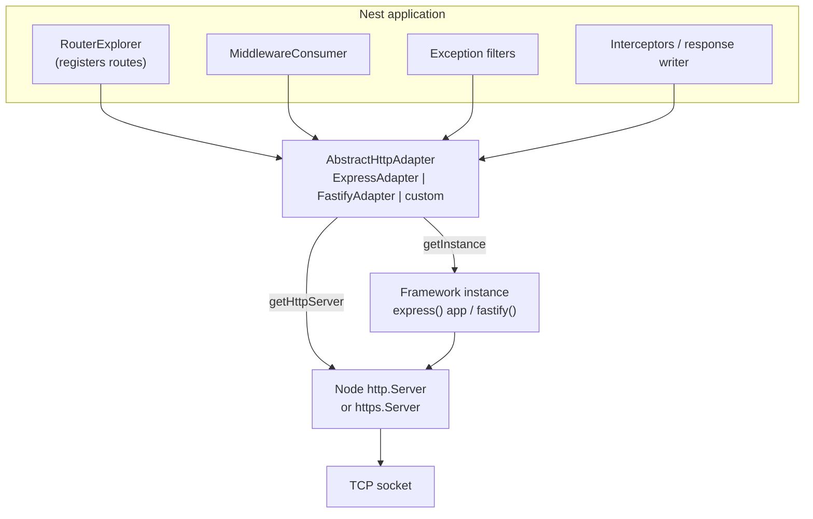
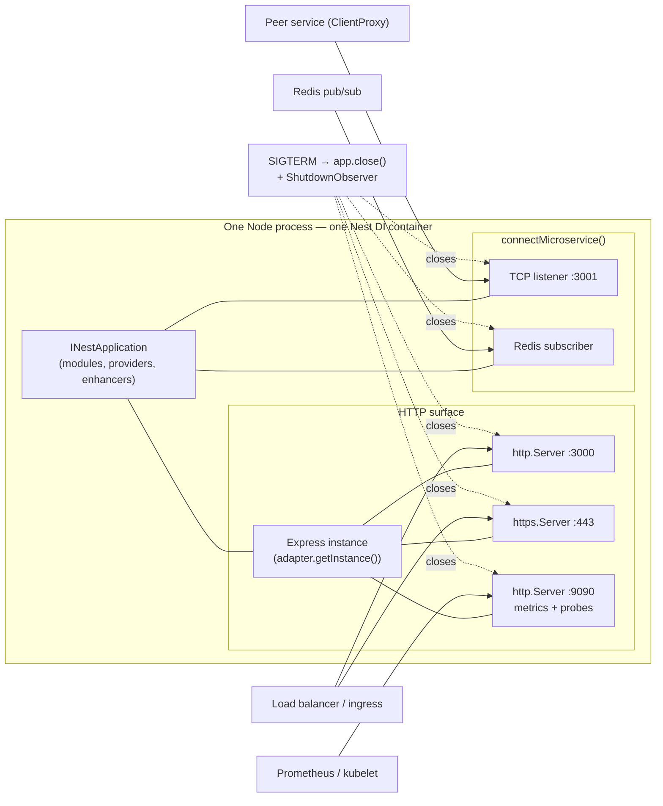

# Chapter 57 — Advanced HTTP: Hybrid Apps, Multiple Servers, Adapters, Raw Body, SSE

> **한눈에 보기**
> Nest의 HTTP 계층은 Express나 Fastify를 감싼 **어댑터** 한 겹 위에 서 있습니다. 평소에는
> 그 존재를 몰라도 되지만, 전역 예외 필터에서 응답을 직접 써야 할 때·HTTP와 HTTPS를 동시에
> 열어야 할 때·SSE 스트림이 프록시에 갇혀 있을 때는 반드시 그 아래로 내려가야 합니다.
> 이 장은 `HttpAdapterHost`와 `AbstractHttpAdapter`, 한 프로세스에서 여러 서버를 띄우는 법,
> 45장에서 배운 하이브리드 앱의 HTTP 쪽 관점, `RouterModule`, 그리고 `@Sse()` 기반 서버 푸시를
> 프로덕션 수준까지 끌어올리는 방법을 다룹니다. 40장의 `ExecutionContext`가 "누가 요청을
> 보냈는가"였다면, 이 장은 "그 요청이 어떤 서버 소켓으로 들어왔는가"입니다.

**What you will learn**

- What the `HttpAdapter` layer actually is, why `HttpAdapterHost` is a *holder* rather than the adapter itself, and the exact bootstrap window in which `httpAdapterHost.httpAdapter` is still `undefined`.
- How to write a catch-all exception filter that works on both Express and Fastify by going through the adapter instead of `response.status().json()` — the one use case that justifies reaching for the adapter in application code.
- How to run HTTP and HTTPS (or two ports, or a private admin port) from a single Nest application, why `app.init()` replaces `app.listen()` there, and why you now own the shutdown of those servers.
- How `connectMicroservice()` composes with an HTTP server, what `inheritAppConfig` really inherits, and how to bind one handler to exactly one transport.
- When `RouterModule.register()` with nested `children` is the right tool and when it is a maintenance trap that hides your URL space from `grep`.
- How to build Server-Sent Events endpoints that survive real networks: `MessageEvent` fields, `EventSource` reconnection, `Last-Event-ID` resume, heartbeats, proxy buffering, and the six-connection browser limit.
- Where SSE beats WebSockets and long polling — and where it loses.

**Why this matters**

Two production incidents motivate this chapter, and they look nothing alike until you know the mechanism.

The first: a team switches from Express to Fastify for throughput ([Chapter 55](./55-performance-and-compilation.md)), and every unhandled error starts returning an empty `200 OK`. The cause is a global exception filter written months earlier that does `const res = host.switchToHttp().getResponse(); res.status(500).json({...})`. On Fastify, `getResponse()` hands you a `FastifyReply`, whose method is `send()`, not `json()`, and whose `status()` is `code()`. The filter throws inside the error handler, the framework swallows it, and the socket closes with whatever was already written. The fix is one line long and it goes through the HTTP adapter, which is the whole reason the adapter abstraction exists.

The second: a dashboard streams live metrics over SSE. It works perfectly on every developer machine and in staging. In production, behind nginx, the browser shows nothing for ninety seconds and then all ninety events arrive at once — and thirty seconds later the connection drops and reconnects, repeating forever. Nothing in the Nest code is wrong. The proxy is buffering a response that must never be buffered, and the idle timeout is killing a stream that emits an event every two minutes. Neither problem is visible in a unit test, an e2e test, or a local `curl`. They are visible in the response headers and in the proxy config, which is where the second half of this chapter lives.

The through-line is that Nest's platform abstraction is excellent right up to the boundary where you need the platform. This chapter is a map of that boundary: what the adapter gives you, what it deliberately does not, and how the escape hatches — the adapter host, a second `http.createServer`, `connectMicroservice`, a raw body buffer — are designed so that using one does not force you to abandon the rest of the framework.

---

## The adapter layer: what sits between Nest and Express

Nest does not talk to Express. It talks to an object that implements an interface, and `ExpressAdapter` is one implementation of that interface. `FastifyAdapter` is another. Everything in the framework that touches HTTP — the router explorer that registers your routes, the middleware consumer, the interceptor that writes a response, the built-in exception filter, `useStaticAssets`, `setViewEngine`, CORS, the body parsers — goes through that interface.

The base class is `AbstractHttpAdapter<TServer, TRequest, TResponse>` from `@nestjs/core`. Its shape is worth reading once, because it tells you precisely which HTTP concepts Nest considers universal:

| Method | What Nest uses it for |
|---|---|
| `get/post/put/delete/patch/options/head/all(path, handler)` | Registering routes discovered by the router explorer |
| `use(...args)` | Mounting middleware (global, and `MiddlewareConsumer` output) |
| `reply(response, body, statusCode?)` | Writing a handler's return value to the wire |
| `status(response, statusCode)` | `@HttpCode()`, exception filters, redirects |
| `end(response, message?)` | Terminating a response with no body |
| `redirect(response, statusCode, url)` | `@Redirect()` and `res.redirect` equivalents |
| `render(response, view, options)` | MVC rendering ([Chapter 33](../part2-intermediate/33-mvc-and-versioning.md)) |
| `setHeader(response, name, value)` | `@Header()`, CORS, SSE headers |
| `isHeadersSent(response)` | Deciding whether a filter can still write |
| `getRequestUrl/getRequestMethod/getRequestHostname(request)` | Logging, versioning, exception context |
| `createMiddlewareFactory(method)` | Turning `forRoutes()` paths into platform route matchers |
| `registerParserMiddleware(prefix?, rawBody?)` | Installing the JSON/urlencoded parsers, and the raw-body hook |
| `enableCors(options)` | `app.enableCors()` |
| `initHttpServer(options)` | Creating the underlying `http.Server`, including `httpsOptions` |
| `listen(port, host?, cb?)` / `close()` | `app.listen()` / `app.close()` |
| `getType()` | Returns `'express'` or `'fastify'` — the platform discriminator |
| `getInstance()` | The raw framework instance (the Express app, the Fastify instance) |
| `getHttpServer()` | The Node `http.Server` / `https.Server` underneath |

Two of those matter for the rest of the chapter. `getInstance()` returns the *framework* object — the thing you would have called `express()` to get. `getHttpServer()` returns the *Node* object — the thing you would have gotten from `http.createServer()`. They are different layers, and reaching for the wrong one is a common mistake: `app.getHttpServer()` is what you pass to Supertest ([Chapter 31](../part2-intermediate/31-testing.md)), while `app.getHttpAdapter().getInstance()` is what you pass to `serverless-express` ([Chapter 58](./58-deployment-and-serverless.md)) or hand to `http.createServer()`.



### Getting the adapter from outside the application context

If you hold the `INestApplication` — which in practice means you are inside `bootstrap()` in `main.ts` — the shortest path is `getHttpAdapter()`:

```typescript title="main.ts"
import { NestFactory } from '@nestjs/core';
import { NestExpressApplication } from '@nestjs/platform-express';
import { AppModule } from './app.module';

async function bootstrap() {
  const app = await NestFactory.create<NestExpressApplication>(AppModule);

  const adapter = app.getHttpAdapter();
  console.log(adapter.getType()); // 'express'

  // The Express application object itself.
  const expressApp = adapter.getInstance();
  expressApp.set('query parser', 'extended');
  expressApp.disable('x-powered-by');

  await app.listen(process.env.PORT ?? 3000);
}
bootstrap();
```

> **Hint** — `NestExpressApplication` also proxies the common Express settings directly: `app.set(...)`, `app.disable(...)`, `app.engine(...)`. Prefer those over `getInstance()` when they exist; they keep the typing honest and survive adapter upgrades.

### `HttpAdapterHost`: the injectable holder

Inside the application — in a provider, a filter, an interceptor — you cannot reach `app`. Nest solves this by registering a globally available provider, `HttpAdapterHost`, which *holds* a reference to the adapter:

```typescript title="metrics.service.ts"
import { Injectable } from '@nestjs/common';
import { HttpAdapterHost } from '@nestjs/core';

@Injectable()
export class MetricsService {
  constructor(private readonly adapterHost: HttpAdapterHost) {}

  describePlatform(): string {
    // WRONG: the host is not an adapter.
    // return this.adapterHost.getType();

    // RIGHT: unwrap it.
    return this.adapterHost.httpAdapter.getType();
  }
}
```

The distinction trips up almost everyone once. `HttpAdapterHost` is a one-field container whose `httpAdapter` property is assigned by `NestFactory` **after** the adapter has been created. That indirection is not gratuitous: it is what lets a provider be constructed before the HTTP server exists and still end up pointing at the right adapter later.

Which brings us to the caveat that actually bites.

### The bootstrap window: when `httpAdapter` is `undefined`

`HttpAdapterHost` is registered in the container as an empty holder very early. It is filled in during application creation. Any code that reads `.httpAdapter` **during provider instantiation** may therefore read `undefined`:

```typescript
// DANGEROUS: reads the adapter at construction time.
@Injectable()
export class BadFilter implements ExceptionFilter {
  private readonly adapter: AbstractHttpAdapter;

  constructor(adapterHost: HttpAdapterHost) {
    this.adapter = adapterHost.httpAdapter; // may be undefined here
  }
  // ...
}
```

```typescript
// SAFE: keeps the holder, reads the adapter at use time.
@Injectable()
export class GoodFilter implements ExceptionFilter {
  constructor(private readonly adapterHost: HttpAdapterHost) {}

  catch(exception: unknown, host: ArgumentsHost) {
    const { httpAdapter } = this.adapterHost; // resolved by now
    // ...
  }
}
```

The rule is simple and absolute: **store the host, not the adapter.** Read `.httpAdapter` at the moment you need it — inside `catch()`, inside a request handler, inside `onApplicationBootstrap()`. Never in a constructor, never in a `useFactory` that runs during module initialization.

This is sometimes described as a "circular dependency" caveat, and the phrasing is worth unpacking because it explains the design. A filter registered with `APP_FILTER` is a provider inside the container; the container is built by `NestFactory`; the adapter is also owned by `NestFactory`. If providers could demand a fully-initialised adapter at construction time, the framework would have a genuine ordering cycle. The holder breaks it by deferring the read.

### Knowing when the server is actually listening

`HttpAdapterHost` exposes two more members that are easy to miss and occasionally exactly what you need:

```typescript
import { Injectable, OnApplicationBootstrap } from '@nestjs/common';
import { HttpAdapterHost } from '@nestjs/core';

@Injectable()
export class ReadinessAnnouncer implements OnApplicationBootstrap {
  constructor(private readonly adapterHost: HttpAdapterHost) {}

  onApplicationBootstrap() {
    if (this.adapterHost.listening) {
      this.announce();
      return;
    }
    this.adapterHost.listen$.subscribe(() => this.announce());
  }

  private announce() {
    // e.g. register with a service registry, flip a readiness flag,
    // notify a supervisor that the socket is accepting connections.
  }
}
```

`listening` is a boolean snapshot; `listen$` is an Observable that emits when the server begins accepting connections. The distinction matters because `onApplicationBootstrap()` runs *before* `app.listen()` completes — so a naive "we are up" announcement fires while the socket is still closed. Combining the two, as above, is race-free: if the server is already listening you announce immediately, otherwise you wait for the event.

---

## The canonical use case: a platform-agnostic catch-all filter

Almost every legitimate use of `HttpAdapterHost` in application code is the same one: an exception filter that must produce a response without knowing whether it is on Express or Fastify.

Why does a filter need the adapter at all? Because when you catch *everything* — including exceptions thrown before or outside Nest's normal response path — you cannot assume that the built-in `HttpException` handling will run. You have to write the response yourself, and writing a response is exactly the operation whose API differs per platform.

```typescript title="all-exceptions.filter.ts"
import {
  ArgumentsHost,
  Catch,
  ExceptionFilter,
  HttpException,
  HttpStatus,
  Logger,
} from '@nestjs/common';
import { HttpAdapterHost } from '@nestjs/core';

@Catch()
export class AllExceptionsFilter implements ExceptionFilter {
  private readonly logger = new Logger(AllExceptionsFilter.name);

  // Store the HOST, never the adapter itself.
  constructor(private readonly httpAdapterHost: HttpAdapterHost) {}

  catch(exception: unknown, host: ArgumentsHost): void {
    const { httpAdapter } = this.httpAdapterHost;
    const ctx = host.switchToHttp();
    const request = ctx.getRequest();
    const response = ctx.getResponse();

    const httpStatus =
      exception instanceof HttpException
        ? exception.getStatus()
        : HttpStatus.INTERNAL_SERVER_ERROR;

    // If a stream already started (SSE, file download), we cannot write a
    // JSON envelope — the headers are gone. Destroy instead of corrupting.
    if (httpAdapter.isHeadersSent(response)) {
      this.logger.error('Exception after headers were sent', exception as Error);
      httpAdapter.getHttpServer(); // no-op; kept for clarity
      response.destroy?.();
      return;
    }

    const body = {
      statusCode: httpStatus,
      timestamp: new Date().toISOString(),
      path: httpAdapter.getRequestUrl(request),
      method: httpAdapter.getRequestMethod(request),
      requestId: request.headers?.['x-request-id'] ?? null,
    };

    if (httpStatus >= 500) {
      this.logger.error(
        `${body.method} ${body.path} -> ${httpStatus}`,
        exception instanceof Error ? exception.stack : String(exception),
      );
    }

    httpAdapter.reply(response, body, httpStatus);
  }
}
```

Register it globally in `main.ts`, where the host is trivially available:

```typescript title="main.ts"
const app = await NestFactory.create(AppModule);
const httpAdapterHost = app.get(HttpAdapterHost);
app.useGlobalFilters(new AllExceptionsFilter(httpAdapterHost));
```

…or, better, with `APP_FILTER` so the filter itself is injectable and can pull in a logger, a config service, or a Sentry client ([Chapter 56](./56-observability.md)):

```typescript title="app.module.ts"
import { Module } from '@nestjs/common';
import { APP_FILTER } from '@nestjs/core';
import { AllExceptionsFilter } from './all-exceptions.filter';

@Module({
  providers: [{ provide: APP_FILTER, useClass: AllExceptionsFilter }],
})
export class AppModule {}
```

Three details in that filter repay attention.

`httpAdapter.reply(response, body, status)` is the single call that replaces `res.status(s).json(b)` on Express and `reply.code(s).send(b)` on Fastify. Nest's own `BaseExceptionFilter` does exactly this, which is why swapping platforms does not break the default error format.

`isHeadersSent()` guards a real failure mode. If an error is thrown mid-stream — during an SSE feed, a `StreamableFile` download, or a chunked render — the status line and headers are already on the wire. Writing a JSON body at that point appends garbage to a response the client is already parsing. Destroying the socket is ugly but honest; a truncated response is at least detectable by the client, whereas a JSON object glued onto the end of a CSV download is not.

Reading `path` and `method` through the adapter rather than `request.url` and `request.method` costs nothing and keeps the filter free of platform assumptions. On Fastify, `request.url` happens to exist too — but `getRequestUrl()` is the contract, and contracts are what survive upgrades.

---

## Writing and extending an adapter

You will rarely write an adapter from scratch. You will occasionally *extend* one, and that is a supported, low-risk pattern.

The common reason is a platform-level behaviour that has no Nest-level hook. Suppose you want every response Nest writes to carry a server-timing header, or you want to normalise the way `reply()` handles `null` bodies:

```typescript title="tuned-express.adapter.ts"
import { ExpressAdapter } from '@nestjs/platform-express';
import type { Response } from 'express';

export class TunedExpressAdapter extends ExpressAdapter {
  reply(response: Response, body: unknown, statusCode?: number) {
    if (statusCode) {
      response.status(statusCode);
    }
    // A handler that returns `undefined` should be 204, not an empty 200.
    if (body === undefined || body === null) {
      return response.status(response.statusCode === 200 ? 204 : response.statusCode).end();
    }
    return super.reply(response, body, undefined);
  }
}
```

```typescript title="main.ts"
import express from 'express';
import { NestFactory } from '@nestjs/core';
import { NestExpressApplication } from '@nestjs/platform-express';
import { TunedExpressAdapter } from './tuned-express.adapter';
import { AppModule } from './app.module';

const server = express();
const app = await NestFactory.create<NestExpressApplication>(
  AppModule,
  new TunedExpressAdapter(server),
);
```

Writing a genuinely new adapter — for a framework that is neither Express nor Fastify — means extending `AbstractHttpAdapter` and implementing every abstract member in the table above, plus `createMiddlewareFactory()` (which converts a Nest route path into a matcher your framework understands) and `registerParserMiddleware()` (which must honour the `rawBody` flag). It is a multi-week project with a long tail of edge cases: HEAD handling, 404 fallthrough, versioning, CORS preflight, static assets, view engines. The honest recommendation is: do not. The two supported adapters cover the performance and ecosystem range that Node HTTP servers actually offer ([Chapter 55](./55-performance-and-compilation.md) compares them), and a third-party adapter that is one contributor deep is a liability in your dependency tree. Extend, do not replace.

---

## Multiple simultaneous servers from one application

A Nest application and an HTTP server are not the same object. `app.listen()` conflates them because that is what 95% of applications want — one app, one port. But the adapter's framework instance is a plain request handler, and a Node `http.Server` will happily accept any request handler you give it. That decoupling is what lets one Nest application serve several sockets.

The classic case is HTTP plus HTTPS. First, the simple version — a single HTTPS server:

```typescript title="main.ts"
import * as fs from 'node:fs';
import { NestFactory } from '@nestjs/core';
import { AppModule } from './app.module';

async function bootstrap() {
  const httpsOptions = {
    key: fs.readFileSync('./secrets/private-key.pem'),
    cert: fs.readFileSync('./secrets/public-certificate.pem'),
  };

  const app = await NestFactory.create(AppModule, { httpsOptions });
  await app.listen(process.env.PORT ?? 3000);
}
bootstrap();
```

On Fastify the TLS options belong to the adapter, not to the Nest options object:

```typescript title="main.ts"
import { NestFactory } from '@nestjs/core';
import { FastifyAdapter, NestFastifyApplication } from '@nestjs/platform-fastify';

const app = await NestFactory.create<NestFastifyApplication>(
  AppModule,
  new FastifyAdapter({ https: httpsOptions }),
);
```

### Two ports, one application

Now the interesting version. Create the Express instance yourself, hand it to `ExpressAdapter`, initialise Nest without starting a server, and then create as many Node servers around that instance as you need:

```typescript title="main.ts"
import * as fs from 'node:fs';
import * as http from 'node:http';
import * as https from 'node:https';
import express from 'express';
import { NestFactory } from '@nestjs/core';
import { ExpressAdapter, NestExpressApplication } from '@nestjs/platform-express';
import { AppModule } from './app.module';
import { ShutdownObserver } from './shutdown-observer';

async function bootstrap() {
  const httpsOptions = {
    key: fs.readFileSync('./secrets/private-key.pem'),
    cert: fs.readFileSync('./secrets/public-certificate.pem'),
  };

  const server = express();
  const app = await NestFactory.create<NestExpressApplication>(
    AppModule,
    new ExpressAdapter(server),
  );
  app.enableShutdownHooks();

  // Everything that would normally go before `listen()` still goes here.
  app.useGlobalPipes(new ValidationPipe({ whitelist: true }));
  app.setGlobalPrefix('api');

  // init() runs the full bootstrap — module init, lifecycle hooks, route
  // registration — WITHOUT binding a socket.
  await app.init();

  const httpServer = http.createServer(server).listen(3000);
  const httpsServer = https.createServer(httpsOptions, server).listen(443);

  const shutdownObserver = app.get(ShutdownObserver);
  shutdownObserver.addHttpServer(httpServer);
  shutdownObserver.addHttpServer(httpsServer);
}
bootstrap();
```

**`app.init()` versus `app.listen()`** is the pivot. `listen()` is `init()` plus "create a server via the adapter and bind it". When you create the servers yourself, you must call `init()` — otherwise routes are never registered, `onModuleInit` never runs, and every request 404s. Conversely, calling `listen()` *and* creating your own servers gives you a third, orphaned socket on whatever port you passed.

### You now own shutdown

This is the part people forget, and it turns a graceful deployment into a hung pod. Nest closes the server it created. It knows nothing about servers you created, so `app.close()` and SIGTERM handling ([Chapter 39](./39-lifecycle-and-shutdown.md)) will leave both sockets open, keep the event loop alive, and let your orchestrator's grace period expire into a SIGKILL.

The fix is a provider that hooks the shutdown lifecycle:

```typescript title="shutdown-observer.ts"
import { Injectable, OnApplicationShutdown } from '@nestjs/common';
import type * as http from 'node:http';

@Injectable()
export class ShutdownObserver implements OnApplicationShutdown {
  private readonly httpServers: http.Server[] = [];

  addHttpServer(server: http.Server): void {
    this.httpServers.push(server);
  }

  async onApplicationShutdown(): Promise<void> {
    await Promise.all(
      this.httpServers.map(
        (server) =>
          new Promise<void>((resolve, reject) => {
            server.close((error) => (error ? reject(error) : resolve()));
          }),
      ),
    );
  }
}
```

Register it in `AppModule`'s providers, call `app.enableShutdownHooks()`, and SIGTERM once again drains both listeners. Note that `server.close()` stops accepting new connections but waits for in-flight ones; for keep-alive connections you may also want `server.closeIdleConnections()` (Node 18+) or a deadline, exactly as in Chapter 39.

> **⚠️ Notice** — This recipe does not work with GraphQL subscriptions. The subscription server binds to the HTTP server that Nest created, and there isn't one. If you need subscriptions plus a second port, run two processes.

### When is a second port actually the right answer?

Genuine cases, in rough order of frequency:

1. **A private admin/metrics port.** Prometheus scraping and health probes on `:9090`, bound to the pod network only, while `:3000` faces the load balancer. This removes an entire class of "someone can hit `/metrics` from the internet" findings without any authentication code.
2. **HTTP → HTTPS redirect during a migration**, where port 80 must answer with a 301 rather than refuse the connection.
3. **A local development TLS listener** so that cookies with `Secure` and `SameSite=None` behave the way they will in production.

Cases where it is the *wrong* answer: anything a reverse proxy already does. In a containerised deployment, TLS termination belongs at the ingress ([Chapter 58](./58-deployment-and-serverless.md)), not in your Node process — the process should speak plain HTTP on one port and let infrastructure own certificates, renewal, and ciphers.

---

## Hybrid applications: HTTP plus transports in one process

[Chapter 45](./45-microservices-fundamentals.md) covers microservices in depth; this section is the HTTP-side view, and the topology diagram that ties the chapter together.

A **hybrid application** is a single Nest application that listens on more than one kind of inbound channel. The HTTP server is created by `NestFactory.create()`; each additional transport is attached with `connectMicroservice()`:

```typescript title="main.ts"
import { NestFactory } from '@nestjs/core';
import { MicroserviceOptions, Transport } from '@nestjs/microservices';
import { AppModule } from './app.module';

async function bootstrap() {
  const app = await NestFactory.create(AppModule);

  // Transport #1 — TCP, for internal RPC.
  app.connectMicroservice<MicroserviceOptions>(
    { transport: Transport.TCP, options: { port: 3001 } },
    { inheritAppConfig: true },
  );

  // Transport #2 — Redis, for fan-out events.
  app.connectMicroservice<MicroserviceOptions>(
    {
      transport: Transport.REDIS,
      options: { host: 'localhost', port: 6379 },
    },
    { inheritAppConfig: true },
  );

  await app.startAllMicroservices();
  await app.listen(3000);
}
bootstrap();
```

Two rules govern this:

**`app.listen()` versus `app.init()` again.** If the process also serves HTTP, call `listen()`. If it only listens on transports but was still created with `NestFactory.create()` (because you want the HTTP pipeline machinery, or you plan to add HTTP later), call `init()` after `startAllMicroservices()` — otherwise you bind a port nothing uses.

**`inheritAppConfig` is opt-in, and its absence is silent.** Global pipes, guards, interceptors, and filters registered with `useGlobalPipes()` and friends apply only to the HTTP server unless you pass `{ inheritAppConfig: true }`. This is the single most common hybrid-app bug: validation works on `POST /orders` and does nothing at all on the `create_order` message pattern, with no error anywhere. (Enhancers registered via `APP_PIPE`/`APP_GUARD`/`APP_FILTER` tokens are container-level and do apply to both — which is one more reason to prefer the token form.)

To bind a handler to exactly one transport in a multi-transport process, pass the transport as the second argument:

```typescript title="time.controller.ts"
import { Controller } from '@nestjs/common';
import { Ctx, MessagePattern, NatsContext, Payload, Transport } from '@nestjs/microservices';

@Controller()
export class TimeController {
  @MessagePattern('time.us.*', Transport.NATS)
  getDate(@Payload() data: number[], @Ctx() context: NatsContext) {
    console.log(`Subject: ${context.getSubject()}`); // e.g. "time.us.east"
    return new Date().toLocaleTimeString();
  }

  @MessagePattern({ cmd: 'time.us' }, Transport.TCP)
  getTcpDate(@Payload() data: number[]) {
    return new Date().toLocaleTimeString();
  }
}
```

Without the second argument, a pattern is registered on *every* connected transport — which is occasionally what you want and usually a source of duplicate processing.

Here is the full topology this chapter has been building toward: one process, one DI container, several inbound channels.



The dashed edges are the part you must build yourself for servers you created; everything else Nest closes for you.

---

## `RouterModule`: module-level path prefixes

A route's path is normally the concatenation of the global prefix, the controller's `@Controller('...')` prefix, and the handler's `@Get('...')` path. `RouterModule` inserts one more segment: a prefix that applies to **every controller in a module**.

```typescript title="app.module.ts"
import { Module } from '@nestjs/common';
import { RouterModule } from '@nestjs/core';
import { DashboardModule } from './dashboard/dashboard.module';

@Module({
  imports: [
    DashboardModule,
    RouterModule.register([
      { path: 'dashboard', module: DashboardModule },
    ]),
  ],
})
export class AppModule {}
```

Note that `DashboardModule` appears **twice**: once in `imports` (which is what actually loads it) and once in the router registration (which only assigns it a prefix). Registering a module you did not import does nothing.

Nested structures compose top-to-bottom:

```typescript title="app.module.ts"
@Module({
  imports: [
    AdminModule,
    DashboardModule,
    MetricsModule,
    RouterModule.register([
      {
        path: 'admin',
        module: AdminModule,
        children: [
          { path: 'dashboard', module: DashboardModule },
          { path: 'metrics', module: MetricsModule },
        ],
      },
    ]),
  ],
})
export class AppModule {}
```

Every controller in `DashboardModule` now answers under `/admin/dashboard/...`, and every controller in `MetricsModule` under `/admin/metrics/...`. The final path for a handler is:

```text
<global prefix> / <version prefix> / <router module path chain> / <controller prefix> / <handler path>
```

### When it beats controller prefixes — and when it does not

| Situation | Better tool | Why |
|---|---|---|
| Five controllers in one feature module all share `/admin/dashboard` | `RouterModule` | The prefix lives in one place; adding a controller cannot forget it |
| A whole subtree must move from `/admin` to `/internal` | `RouterModule` | One string changes, not N decorators |
| A reusable library module whose mount point differs per app | `RouterModule` | The library controllers stay mount-agnostic |
| One controller, one prefix | `@Controller('path')` | Indirection with no payoff |
| API versioning (`/v1`, `/v2`) | Versioning ([Chapter 33](../part2-intermediate/33-mvc-and-versioning.md)) | Versioning understands headers/media types too, and `@Version()` per handler |
| A global `/api` prefix | `app.setGlobalPrefix('api')` | Simpler, and supports `exclude` |

The official documentation warns that this feature "should be used very carefully", and the warning is earned. The cost is **discoverability**: after adding a router module, `grep -r "admin/dashboard"` finds nothing, because no source file contains that string. A developer reading `DashboardController` sees `@Controller('widgets')` and has no local evidence that the real URL is `/api/admin/dashboard/widgets`. On a team, that gap produces wrong client code and wrong OpenAPI expectations.

Two mitigations make it safe. First, keep the registration **flat and in one file** — one `RouterModule.register()` call in `AppModule`, never several scattered across feature modules, so the URL space has a single readable source of truth. Second, verify at boot: Nest's `RoutesResolver`/`RouterExplorer` logs every mapped route at startup. Read that log the first time, and consider asserting on it in an e2e test if the URL contract matters to external consumers.

My recommendation: use `RouterModule` for a genuine subtree of three or more modules that share a mount point, and use plain controller prefixes for everything else. Do not build a nested three-level router tree because the file structure has three levels; module structure and URL structure are allowed to differ, and forcing them to match is how you end up with `/api/v1/platform/core/admin/dashboard/widgets`.

---

## Server-Sent Events

SSE is the forgotten member of the real-time family, and for a large class of features it is the correct one. It is plain HTTP: the client makes a `GET`, the server never ends the response, and it writes text records as they occur. No upgrade handshake, no second protocol, no separate authentication path, and — importantly — no separate infrastructure.

### The handler

```typescript title="events.controller.ts"
import { Controller, MessageEvent, Sse } from '@nestjs/common';
import { interval, map, Observable } from 'rxjs';

@Controller('events')
export class EventsController {
  @Sse('ticks')
  ticks(): Observable<MessageEvent> {
    return interval(1000).pipe(map(() => ({ data: { hello: 'world' } })));
  }
}
```

`@Sse()` marks the route; the handler **must** return an `Observable` (or a `Promise<Observable>`). Returning an array, a promise of data, or nothing is an error — SSE is a stream endpoint by definition.

`MessageEvent` is a four-field interface, and each field maps to one line of the wire format:

```typescript
export interface MessageEvent {
  data: string | object; // required; objects are JSON.stringify-ed
  id?: string;           // becomes the client's Last-Event-ID
  type?: string;         // the DOM event name; default is "message"
  retry?: number;        // reconnection delay hint, in milliseconds
}
```

What goes on the wire for `{ data: { hello: 'world' }, id: '42', type: 'tick', retry: 5000 }`:

```text
id: 42
event: tick
retry: 5000
data: {"hello":"world"}

```

The blank line terminates the record. Multi-line data becomes multiple `data:` lines, which the client rejoins with `\n`. That is the entire protocol.

### The client

```javascript title="client.js"
const source = new EventSource('/events/ticks');

// Fires for records with no `type` (or type === 'message').
source.onmessage = ({ data, lastEventId }) => {
  console.log('message', JSON.parse(data), lastEventId);
};

// Fires only for records with `type: 'tick'`.
source.addEventListener('tick', ({ data }) => {
  render(JSON.parse(data));
});

source.onerror = (err) => {
  // The browser reconnects automatically; readyState tells you where you are.
  console.warn('SSE error, state =', source.readyState);
};

// Explicit teardown — this is what stops the server-side Observable.
source.close();
```

`EventSource` is built into every browser, does automatic reconnection with backoff, and requires zero libraries. Its two real limitations are that it is **GET-only with no custom headers** (so bearer tokens must ride in a cookie or a query parameter — prefer a cookie, and see [Chapter 26](../part2-intermediate/26-web-security-hardening.md)), and that under HTTP/1.1 browsers cap concurrent connections per origin at six. Six open tabs on the same site and the seventh hangs forever. Serving over **HTTP/2 removes this entirely** by multiplexing streams over one connection, which in practice means "terminate HTTP/2 at your ingress" rather than anything in your Nest code.

### Client disconnection and teardown

When the client calls `close()` or the connection dies, Nest unsubscribes from your Observable. Everything RxJS-native — `interval`, `timer`, subscriptions to a `Subject` — is cleaned up for free. External resources are not, and `finalize` is where you release them:

```typescript
import { finalize, map, Observable } from 'rxjs';

@Sse('ticks')
ticks(): Observable<MessageEvent> {
  return interval(1000).pipe(
    map(() => ({ data: { hello: 'world' } })),
    finalize(() => this.logger.log('Client disconnected')),
  );
}
```

`finalize` runs on completion, error, **and** unsubscription, which makes it the correct hook for closing database cursors, file handles, or broker subscriptions tied to the stream.

There is one gap `finalize` cannot cover. An `@Sse()` handler may be `async` — useful when the stream needs expensive setup before its first event:

```typescript
@Sse('stream')
async stream(): Promise<Observable<MessageEvent>> {
  const session = await createSession(); // takes 300ms
  return new Observable((subscriber) => { /* produce from session */ });
}
```

If the client disconnects **while that promise is still pending**, Nest will never subscribe to the returned Observable — correctly, since there is no consumer — which means the Observable's teardown never runs and `session` leaks. Nest closes this gap with `@SseSignal()`, which injects an `AbortSignal` representing the lifetime of the SSE response:

```typescript title="reports.controller.ts"
import { Controller, MessageEvent, Sse, SseSignal } from '@nestjs/common';
import { EMPTY, Observable } from 'rxjs';

@Controller('reports')
export class ReportsController {
  @Sse('stream')
  async stream(
    @SseSignal() signal: AbortSignal,
  ): Promise<Observable<MessageEvent>> {
    const session = await createSession();

    if (signal.aborted) {
      // Client left during setup; the Observable below is never subscribed.
      await session.close();
      return EMPTY;
    }

    return new Observable<MessageEvent>((subscriber) => {
      const stream = session.start();
      stream.on('data', (data) => subscriber.next({ data }));
      stream.on('end', () => subscriber.complete());

      return () => {
        stream.stop();
        session.close();
      };
    });
  }
}
```

The signal aborts when the **response** ends, for any reason: the client disconnected, the Observable completed, or the Observable errored. That makes it a single cleanup hook for every exit path — pass it straight to `fetch(url, { signal })` and an upstream request is cancelled whether the client vanished or the stream simply finished.

Because it also aborts on normal completion, `signal.aborted` is only meaningful as a "did the client leave?" test **during setup**, before you return the Observable; at that point the stream cannot have completed yet, so an aborted signal unambiguously means disconnect. Inside the producer, use it as an end-of-stream trigger:

```typescript
return new Observable<MessageEvent>((subscriber) => {
  const timer = setInterval(() => subscriber.next({ data: 'tick' }), 1000);
  const onAbort = () => subscriber.complete();
  signal.addEventListener('abort', onAbort, { once: true });

  return () => {
    clearInterval(timer);
    signal.removeEventListener('abort', onAbort);
  };
});
```

> **⚠️ Notice** — Cleanup wired to the `abort` event may run alongside the Observable's own teardown function. Make it idempotent: guard with a boolean, or use a close method that tolerates being called twice.

> **Hint** — `@SseSignal()` is populated only on `@Sse()` routes; anywhere else it resolves to `undefined`. It behaves identically on Express and Fastify.

### Reconnection and `Last-Event-ID`

This is where SSE quietly beats hand-rolled streaming. When the connection drops, `EventSource` waits (the `retry` hint, or a browser default around 3 seconds) and reconnects **with the `Last-Event-ID` header set to the `id` of the last record it received**. Your server can therefore resume rather than restart — but only if you emit ids and read the header. Nest does not do this for you.

```typescript title="notifications.controller.ts"
import { Controller, Headers, MessageEvent, Sse } from '@nestjs/common';
import { Observable, concat, from, map } from 'rxjs';
import { NotificationsService } from './notifications.service';

@Controller('notifications')
export class NotificationsController {
  constructor(private readonly notifications: NotificationsService) {}

  @Sse('stream')
  stream(
    @Headers('last-event-id') lastEventId?: string,
  ): Observable<MessageEvent> {
    // 1. Everything the client missed while disconnected.
    const backlog = from(this.notifications.since(lastEventId ?? null));

    // 2. Then the live feed.
    const live = this.notifications.live();

    return concat(backlog, live).pipe(
      map((n) => ({
        id: n.id,              // <- makes the NEXT reconnect resumable
        type: 'notification',
        data: { title: n.title, body: n.body, at: n.createdAt },
      })),
    );
  }
}
```

Three properties make this work in production. Ids must be **monotonic and durable** — a database sequence or a broker offset, not `Math.random()` or an in-process counter that resets on deploy. `since(null)` must have a sane meaning, usually "the last N events" rather than "everything since the beginning of time", or a client that has been offline for a week will melt your database on reconnect. And because a reconnect may deliver an event the client already saw (it acknowledged nothing), **client handlers must be idempotent** — dedupe on the id.

Set `retry` on your first event when the default backoff is wrong for you:

```typescript
map((n, index) => ({
  ...(index === 0 ? { retry: 10_000 } : {}),
  id: n.id,
  data: n,
}));
```

A larger `retry` is a real load-shedding lever: after an incident, thousands of browsers reconnecting every 3 seconds is a thundering herd against a service that is already unwell.

### Heartbeats

Idle SSE connections die. Load balancers, nginx, and cloud gateways all have idle-read timeouts, typically 30–120 seconds, and a stream that emits every five minutes looks exactly like a dead connection. The client will reconnect — forever, in a loop, at exactly the timeout interval, which you will see in logs as a mysteriously regular connection churn.

The fix is a heartbeat merged into the real stream:

```typescript title="events.controller.ts"
import { Controller, MessageEvent, Sse } from '@nestjs/common';
import { Observable, interval, map, merge } from 'rxjs';

@Controller('events')
export class EventsController {
  constructor(private readonly bus: EventBusService) {}

  @Sse('feed')
  feed(): Observable<MessageEvent> {
    const heartbeat = interval(20_000).pipe(
      map((): MessageEvent => ({ type: 'ping', data: '' })),
    );

    const events = this.bus.stream().pipe(
      map((e): MessageEvent => ({ id: e.id, type: 'domain', data: e })),
    );

    return merge(heartbeat, events);
  }
}
```

Two design notes. Give the heartbeat its own `type` so client code that listens on `addEventListener('domain', ...)` never sees it — `onmessage` handlers would otherwise receive empty payloads. And do not attach an `id` to heartbeats, or a reconnect will resume from a heartbeat position rather than the last real event.

Pick an interval comfortably under the *smallest* idle timeout in the path. Twenty to thirty seconds is a safe default; the bandwidth cost of a 20-byte record every 20 seconds is nil.

### Proxies, buffering, and compression

Nest sets the response headers SSE requires — `Content-Type: text/event-stream`, `Cache-Control: no-cache`, `Connection: keep-alive` — and current versions also emit `X-Accel-Buffering: no`, which is nginx's opt-out from response buffering. Verify with a raw request rather than trusting the framework:

```bash
$ curl -N -i http://localhost:3000/events/feed
```

`-N` disables curl's own buffering. If events appear one at a time, the server side is correct. If they arrive in a burst, something between you and the handler is buffering.

The usual culprits, in order:

| Layer | Symptom | Fix |
|---|---|---|
| nginx (`proxy_pass`) | Events batch, then flush together | `proxy_buffering off;` and `proxy_cache off;` on the SSE location; ensure `X-Accel-Buffering: no` survives |
| nginx idle timeout | Reconnect loop at a fixed interval | `proxy_read_timeout 3600s;` plus heartbeats |
| HTTP/1.0 to upstream | Stream never flushes | `proxy_http_version 1.1;` |
| `compression()` middleware | Nothing arrives until the stream ends | Skip compression for `text/event-stream` |
| Cloud load balancer | Connection cut at 60s | Raise the idle timeout; add heartbeats |
| Corporate proxy / antivirus | Works everywhere except one customer | Nothing server-side; document the fallback |

The compression case deserves code, because it is the one entirely inside your application ([Chapter 32](../part2-intermediate/32-http-cookies-sessions.md)):

```typescript title="main.ts"
import compression from 'compression';

app.use(
  compression({
    filter: (req, res) => {
      // Never compress event streams — the compressor buffers.
      if (res.getHeader('Content-Type')?.toString().includes('text/event-stream')) {
        return false;
      }
      return compression.filter(req, res);
    },
  }),
);
```

A minimal nginx location for an SSE endpoint:

```nginx
location /events/ {
  proxy_pass http://app_upstream;
  proxy_http_version 1.1;
  proxy_set_header Connection '';
  proxy_buffering off;
  proxy_cache off;
  proxy_read_timeout 3600s;
  chunked_transfer_encoding off;
}
```

### SSE versus WebSockets versus long polling

| | **SSE** | **WebSockets** | **Long polling** |
|---|---|---|---|
| Direction | Server → client only | Full duplex | Server → client, one message per request |
| Protocol | Plain HTTP response | Upgrade to `ws://`/`wss://` | Plain HTTP |
| Client API | `EventSource` (built in) | `WebSocket` / Socket.IO | `fetch` in a loop |
| Auto-reconnect | Built in, with backoff | You implement it (or the library does) | Trivial (next request) |
| Resume after drop | Built in via `Last-Event-ID` | You implement it | You implement it |
| Custom headers on connect | No (cookies or query only) | No (cookies or query only) | Yes |
| Binary payloads | No (UTF-8 text) | Yes | Yes |
| Works through strict proxies | Usually | Sometimes blocked | Always |
| Per-origin connection limit | 6 on HTTP/1.1, effectively none on HTTP/2 | High | N/A |
| Server cost per client | One held HTTP connection | One held socket | Repeated request overhead |
| Nest support | `@Sse()`, [this chapter] | Gateways, [Chapter 44](./44-websockets.md) | Plain controllers |
| Sticky sessions needed behind LB | Yes (connection is long-lived) | Yes | No |

Choose **SSE** when the data flows one way: notification feeds, job progress, live dashboards, log tails, token streaming from an LLM, deployment status. You get reconnection, resume, and HTTP-native auth for free, and you avoid adding a second protocol to your infrastructure and your security review.

Choose **WebSockets** when the client sends messages too — chat, collaborative editing, multiplayer state, anything with client-driven subscription changes mid-connection — or when you need binary frames.

Choose **long polling** only when a proxy you do not control breaks both, or when updates are so rare that a held connection per client is worse than an occasional request.

A note on scaling that applies to SSE and WebSockets equally: a held connection pins a client to one instance. Every event that instance must deliver has to reach that instance, which means a pub/sub layer (Redis, NATS) between your producers and your streaming endpoints once you run more than one replica. [Chapter 58](./58-deployment-and-serverless.md) has the full table of what breaks when you scale out; SSE is on it.

---

## Raw body access

[Chapter 28](../part2-intermediate/28-file-upload-and-streaming.md) covers body parsing and streaming in depth; this is the short reference for the case that keeps coming back — **webhook signature verification**, where you must HMAC the exact bytes the sender signed, not a re-serialisation of the parsed object.

Enable it at creation time, then read `req.rawBody`:

```typescript title="main.ts"
const app = await NestFactory.create<NestExpressApplication>(AppModule, {
  rawBody: true,
});
```

```typescript title="webhooks.controller.ts"
import { BadRequestException, Controller, Post, RawBodyRequest, Req } from '@nestjs/common';
import { createHmac, timingSafeEqual } from 'node:crypto';
import type { Request } from 'express';

@Controller('webhooks')
export class WebhooksController {
  @Post('stripe')
  handle(@Req() req: RawBodyRequest<Request>) {
    const raw = req.rawBody; // Buffer | undefined
    if (!raw) throw new BadRequestException('Missing raw body');

    const expected = createHmac('sha256', process.env.WEBHOOK_SECRET!)
      .update(raw)
      .digest();
    const provided = Buffer.from(String(req.headers['x-signature']), 'hex');

    if (
      expected.length !== provided.length ||
      !timingSafeEqual(expected, provided)
    ) {
      throw new BadRequestException('Bad signature');
    }
    return { received: true };
  }
}
```

Fastify is identical apart from the adapter and the request type:

```typescript title="main.ts"
const app = await NestFactory.create<NestFastifyApplication>(
  AppModule,
  new FastifyAdapter(),
  { rawBody: true },
);
```

```typescript
create(@Req() req: RawBodyRequest<FastifyRequest>) { /* req.rawBody */ }
```

Three constraints worth memorising:

- **`rawBody` requires the built-in parsers.** If you create the app with `bodyParser: false`, `rawBody` does nothing.
- **The application type must match.** `NestFactory.create<NestExpressApplication>` for Express, `<NestFastifyApplication>` for Fastify — otherwise `app.useBodyParser()` does not exist on the returned type.
- **Only `json` and `urlencoded` are registered by default.** Anything else you add explicitly, and `useBodyParser` honours the `rawBody` flag you passed to `create()`:

```typescript
app.useBodyParser('text');                          // Express
app.useBodyParser('json', { limit: '10mb' });       // Express: default is 100kb
app.useBodyParser('text/plain');                    // Fastify
app.useBodyParser('application/json', { bodyLimit: 10_485_760 }); // Fastify: default 1MiB
```

Raise those limits deliberately. A 10 MB JSON limit is a 10 MB-per-request memory commitment multiplied by your concurrency, and it is a denial-of-service surface ([Chapter 26](../part2-intermediate/26-web-security-hardening.md)).

---

## Common mistakes

1. **Symptom:** `TypeError: Cannot read properties of undefined (reading 'reply')` in a global filter.
   **Cause:** the filter read `adapterHost.httpAdapter` in its constructor, during a bootstrap phase where the holder was still empty.
   **Fix:** store `HttpAdapterHost` and destructure `httpAdapter` inside `catch()`.

2. **Symptom:** every route 404s after switching to a self-created `http.Server`.
   **Cause:** `app.init()` was never called, so the router explorer never registered anything on the Express instance.
   **Fix:** `await app.init()` after `NestFactory.create(...)` and before `http.createServer(server).listen(...)`. Use `init()` *instead of* `listen()`, never both.

3. **Symptom:** SIGTERM is sent, logs show "shutting down", and the pod is SIGKILLed 30 seconds later.
   **Cause:** servers created with `http.createServer` are invisible to `app.close()`, so the event loop never drains.
   **Fix:** a `ShutdownObserver` provider implementing `OnApplicationShutdown` that closes each server, plus `app.enableShutdownHooks()`.

4. **Symptom:** the global `ValidationPipe` validates HTTP bodies but message payloads arrive unvalidated.
   **Cause:** `connectMicroservice()` does not inherit configuration registered with `useGlobalPipes()`.
   **Fix:** pass `{ inheritAppConfig: true }`, or register enhancers with `APP_PIPE`/`APP_GUARD`/`APP_FILTER` tokens so they live in the container.

5. **Symptom:** an SSE endpoint delivers nothing for a minute, then everything at once.
   **Cause:** a buffering layer — nginx `proxy_buffering`, or `compression()` applied to `text/event-stream`.
   **Fix:** `proxy_buffering off` on the SSE location and a compression `filter` that skips event streams. Confirm with `curl -N`.

6. **Symptom:** SSE clients reconnect every 60 seconds, exactly, forever.
   **Cause:** an idle-read timeout on a proxy or load balancer, on a stream with sparse events.
   **Fix:** heartbeat events every 20–30 seconds, and raise `proxy_read_timeout`.

7. **Symptom:** after a reconnect, the UI shows duplicate notifications, or has a hole in its history.
   **Cause:** the stream emits no `id`, or the handler ignores `Last-Event-ID`, or event ids are not durable across restarts.
   **Fix:** emit durable monotonic ids, read the `last-event-id` header, replay the gap, and dedupe on the client.

8. **Symptom:** the seventh browser tab on the same origin never receives events.
   **Cause:** the HTTP/1.1 six-connections-per-origin limit, consumed by six open `EventSource` connections.
   **Fix:** serve over HTTP/2, or share one connection across tabs with a `BroadcastChannel`/`SharedWorker`.

9. **Symptom:** webhook signature verification fails with a correct secret.
   **Cause:** hashing `JSON.stringify(body)` instead of the original bytes — key order and whitespace differ from what was signed.
   **Fix:** `rawBody: true` plus `RawBodyRequest<Request>`, and HMAC the `Buffer`.

10. **Symptom:** a route that worked yesterday returns 404 after a colleague added a `RouterModule` entry.
    **Cause:** the module-level prefix is invisible in the controller file; clients still call the old path.
    **Fix:** keep one flat `RouterModule.register()` in `AppModule`, read the startup route log, and pin the external URL contract with an e2e test.

---

## Putting it together

A single service that: serves a public HTTP API, exposes a private metrics/health port, accepts internal RPC over TCP, streams live order events over SSE with resume support, verifies webhook signatures from raw bytes, and shuts all of it down cleanly.

```typescript title="src/main.ts"
import * as http from 'node:http';
import express from 'express';
import compression from 'compression';
import { ValidationPipe } from '@nestjs/common';
import { HttpAdapterHost, NestFactory } from '@nestjs/core';
import { MicroserviceOptions, Transport } from '@nestjs/microservices';
import { ExpressAdapter, NestExpressApplication } from '@nestjs/platform-express';
import { AppModule } from './app.module';
import { AllExceptionsFilter } from './common/all-exceptions.filter';
import { ShutdownObserver } from './common/shutdown-observer';

async function bootstrap() {
  const server = express();
  const app = await NestFactory.create<NestExpressApplication>(
    AppModule,
    new ExpressAdapter(server),
    { rawBody: true },
  );

  app.enableShutdownHooks();
  app.setGlobalPrefix('api', { exclude: ['healthz', 'metrics'] });
  app.useGlobalPipes(new ValidationPipe({ whitelist: true, transform: true }));
  app.useGlobalFilters(new AllExceptionsFilter(app.get(HttpAdapterHost)));

  app.use(
    compression({
      filter: (req, res) =>
        res.getHeader('Content-Type')?.toString().includes('text/event-stream')
          ? false
          : compression.filter(req, res),
    }),
  );

  // Internal RPC surface, sharing the global pipeline.
  app.connectMicroservice<MicroserviceOptions>(
    { transport: Transport.TCP, options: { host: '0.0.0.0', port: 3001 } },
    { inheritAppConfig: true },
  );
  await app.startAllMicroservices();

  // No app.listen(): we own the sockets.
  await app.init();

  const publicServer = http.createServer(server).listen(3000);
  const adminServer = http.createServer(server).listen(9090, '127.0.0.1');

  const shutdown = app.get(ShutdownObserver);
  shutdown.addHttpServer(publicServer);
  shutdown.addHttpServer(adminServer);
}
bootstrap();
```

```typescript title="src/orders/orders.controller.ts"
import {
  BadRequestException,
  Controller,
  Headers,
  MessageEvent,
  Post,
  RawBodyRequest,
  Req,
  Sse,
} from '@nestjs/common';
import { MessagePattern, Payload, Transport } from '@nestjs/microservices';
import { createHmac, timingSafeEqual } from 'node:crypto';
import type { Request } from 'express';
import { Observable, concat, from, interval, map, merge } from 'rxjs';
import { OrdersService } from './orders.service';

@Controller('orders')
export class OrdersController {
  constructor(private readonly orders: OrdersService) {}

  /** Live order feed: replay the gap, then stream, with heartbeats. */
  @Sse('stream')
  stream(
    @Headers('last-event-id') lastEventId?: string,
  ): Observable<MessageEvent> {
    const replay = from(this.orders.eventsSince(lastEventId ?? null));
    const live = this.orders.liveEvents();

    const data = concat(replay, live).pipe(
      map((e): MessageEvent => ({ id: e.id, type: 'order', data: e })),
    );

    const heartbeat = interval(20_000).pipe(
      map((): MessageEvent => ({ type: 'ping', data: '' })),
    );

    return merge(data, heartbeat);
  }

  /** Payment webhook: HMAC over the exact received bytes. */
  @Post('webhooks/payments')
  webhook(@Req() req: RawBodyRequest<Request>) {
    const raw = req.rawBody;
    if (!raw) throw new BadRequestException('Missing raw body');

    const expected = createHmac('sha256', process.env.WEBHOOK_SECRET!)
      .update(raw)
      .digest();
    const provided = Buffer.from(String(req.headers['x-signature'] ?? ''), 'hex');

    if (expected.length !== provided.length || !timingSafeEqual(expected, provided)) {
      throw new BadRequestException('Bad signature');
    }
    return this.orders.applyPaymentEvent(JSON.parse(raw.toString('utf8')));
  }

  /** Internal RPC, bound to TCP only. */
  @MessagePattern({ cmd: 'orders.get' }, Transport.TCP)
  getOne(@Payload() id: string) {
    return this.orders.findOne(id);
  }
}
```

```javascript title="public/orders.js"
const source = new EventSource('/api/orders/stream', { withCredentials: true });
const seen = new Set();

source.addEventListener('order', ({ data, lastEventId }) => {
  if (seen.has(lastEventId)) return; // reconnects may replay
  seen.add(lastEventId);
  renderOrder(JSON.parse(data));
});

source.addEventListener('ping', () => {}); // keep-alive; ignore

window.addEventListener('beforeunload', () => source.close());
```

Run it and exercise the seams: `curl -N http://localhost:3000/api/orders/stream` to see records flush one by one; `curl -H 'Last-Event-ID: <id>' -N ...` to see the replay; `kill -TERM <pid>` and confirm both sockets close and the process exits within the grace period rather than hanging.

---

> **핵심 정리**
> - Nest는 Express/Fastify를 직접 호출하지 않고 `AbstractHttpAdapter` 인터페이스를 통해 호출합니다. 이 계층 덕분에 플랫폼 교체가 가능하며, 필터에서 `httpAdapter.reply()`를 쓰면 두 플랫폼 모두에서 동작합니다.
> - `HttpAdapterHost`는 어댑터가 **아니라** 어댑터를 담는 홀더입니다. `.httpAdapter`는 부트스트랩 도중 `undefined`일 수 있으므로 **생성자에서 읽지 말고 사용 시점에 읽으십시오**.
> - `getInstance()`는 프레임워크 객체(Express app), `getHttpServer()`는 Node `http.Server`입니다. 서버리스 어댑터에는 전자를, Supertest에는 후자를 넘깁니다.
> - `app.listen()`은 `app.init()` + 소켓 바인딩입니다. 서버를 직접 만들면 `init()`만 호출하고, **그 서버들의 종료도 직접 책임져야** 합니다(`OnApplicationShutdown`).
> - 하이브리드 앱에서 `useGlobalPipes()` 계열 설정은 기본적으로 트랜스포트에 상속되지 않습니다. `inheritAppConfig: true` 또는 `APP_*` 토큰을 쓰십시오.
> - `RouterModule`은 모듈 단위 접두사를 주지만 URL을 소스에서 `grep`으로 찾을 수 없게 만듭니다. 3개 이상 모듈이 실제 서브트리를 이룰 때만, `AppModule` 한 곳에 평평하게 등록하십시오.
> - `@Sse()` 핸들러는 반드시 `Observable<MessageEvent>`(또는 그 `Promise`)를 반환해야 합니다. `data`·`id`·`type`·`retry` 네 필드가 그대로 와이어 포맷 네 줄이 됩니다.
> - 재접속 복구는 **직접 구현**합니다. `id`를 내보내고 `last-event-id` 헤더를 읽어 빠진 구간을 재생하며, 클라이언트는 id로 중복 제거해야 합니다.
> - SSE의 실전 적은 프록시입니다. `proxy_buffering off`, 압축 제외, 20~30초 하트비트, 그리고 HTTP/1.1의 오리진당 6연결 제한(HTTP/2로 해결)을 기억하십시오.
> - 웹훅 서명 검증에는 `rawBody: true` + `RawBodyRequest<Request>`가 유일하게 올바른 방법입니다. `JSON.stringify(body)`는 원본 바이트가 아닙니다.

> **연습 문제**
> 1. 전역 예외 필터를 `response.status().json()` 버전과 `httpAdapter.reply()` 버전 두 가지로 작성하고, `ExpressAdapter`에서 `FastifyAdapter`로 교체했을 때 각각 어떻게 동작하는지 실험으로 비교하십시오.
> 2. `HttpAdapterHost`를 생성자에서 언랩하는 필터를 만들어 `undefined` 에러를 재현한 뒤, 왜 `catch()` 시점에는 값이 존재하는지 부트스트랩 순서로 설명하십시오.
> 3. 공개 포트(3000)와 루프백 전용 관리 포트(9090)를 동시에 여는 앱을 만들고, `enableShutdownHooks()`만 켠 상태에서 SIGTERM을 보냈을 때 프로세스가 종료되지 않음을 확인한 뒤 `ShutdownObserver`로 고치십시오.
> 4. 하이브리드 앱에서 전역 `ValidationPipe`가 TCP 메시지에 적용되지 않음을 보이고, `inheritAppConfig`와 `APP_PIPE` 두 가지 해법의 차이를 설명하십시오.
> 5. **직접 만들기:** `Last-Event-ID`를 지원하는 SSE 알림 엔드포인트를 구현하십시오. 이벤트 id는 DB 시퀀스에서 오고, 재접속 시 누락 구간만 재생하며, 20초 하트비트를 별도 `type`으로 내보내야 합니다. `curl -N -H 'Last-Event-ID: ...'`로 재생을 검증하십시오.
> 6. **직접 만들기:** nginx를 앞에 두고 5번의 엔드포인트를 프록시한 뒤, `proxy_buffering on` 상태에서 나타나는 증상을 기록하고, `compression()`을 전역 적용했을 때의 증상과 구분해 설명하십시오. 두 문제를 각각 고치십시오.

**Next:** [Chapter 58](./58-deployment-and-serverless.md) takes everything you have built — the servers, the shutdown hooks, the health endpoints, the streams that pin a client to one instance — and puts it in production: a real build pipeline, a multi-stage Docker image, a zero-downtime rollout, and an honest account of what horizontal scaling breaks.
