# NestJS 아키텍처 북

> **프레임워크의 구조만 파고든다.** ORM, 인증, 배포, 큐 같은 "무엇으로 만드는가"는 다루지 않는다.
> 이 책은 오직 "**NestJS라는 프레임워크 자체가 어떻게 짜여 있는가**"만 다룬다 — 계층, 모듈 그래프,
> 의존성 주입 컨테이너, 요청 파이프라인, 인스턴스 스코프와 생명주기, 그리고 이 모든 것이
> 부팅 시점에 어떻게 조립되는가.
>
> 근거: 이 저장소의 [`NestJS-내부구조-분석보고서.md`](NestJS-내부구조-분석보고서.md)와
> [`part1-beginner/`](part1-beginner/), [`part3-advanced/`](part3-advanced/) 각 장, 그리고
> [`diagrams/`](diagrams/) 폴더의 이미지 14종(기존 13종 PNG + 13장을 위해 새로 그린
> 패턴 지도 SVG 1종)을 그대로 재사용한다. 모든 코드는 실행 가능한 NestJS 11.x 문법으로
> 작성했다.

## 목차

- [서문 — 이 책이 다루는 것과 다루지 않는 것](#서문)
- **Part I. 토대**
  - [1장. 세 개의 층 — DI 컨테이너, 요청 파이프라인, 플랫폼 어댑터](#1장)
  - [2장. 부팅의 원리 — 데코레이터와 `reflect-metadata`](#2장)
  - [3장. 모듈 그래프 — 애플리케이션의 실체](#3장)
- **Part II. 의존성 주입 컨테이너**
  - [4장. 토큰과 레시피 — DI 해석 알고리즘](#4장)
  - [5장. 커스텀 프로바이더와 동적 모듈](#5장)
  - [6장. 컨테이너를 코드에서 직접 다루기 — `ModuleRef`, `Discovery`, `LazyModuleLoader`](#6장)
- **Part III. 요청 파이프라인**
  - [7장. 고정된 순서 — 미들웨어부터 예외 필터까지](#7장)
  - [8장. `ArgumentsHost`와 `ExecutionContext`](#8장)
  - [9장. 플랫폼 어댑터 — Express와 Fastify](#9장)
- **Part IV. 인스턴스 스코프와 생명주기**
  - [10장. 세 가지 스코프와 스코프 버블링](#10장)
  - [11장. 애플리케이션 생명주기와 정상 종료](#11장)
- **Part V. 아키텍처의 확장**
  - [12장. 하나의 파이프라인, 여러 개의 얼굴](#12장)
- **Part VI. 패턴으로 다시 보기**
  - [13장. Nest 개발에 필수인 디자인 패턴 — 강제, 구조, 컨벤션](#13장)
- [종합 — 요청 하나의 전 생애주기](#종합)
- [부록 — 아키텍처 안티패턴 체크리스트](#부록)

---

<a id="서문"></a>
## 서문 — 이 책이 다루는 것과 다루지 않는 것

Node.js는 좋은 HTTP 라이브러리(Express, Fastify)를 갖고 있지만 "코드를 어떻게 구조화할 것인가"에는
의견이 없다. NestJS는 그 질문 하나에만 답하는 프레임워크다. Angular의 설계(모듈, 의존성 주입,
데코레이터 메타데이터)를 서버로 옮겨왔을 뿐, 템플릿이나 변경 감지 같은 브라우저 개념은 가져오지
않았다.

이 책은 ORM 연결법, 인증 전략, 배포 방법을 다루지 않는다. 그런 것들은 전부 `@nestjs/typeorm`,
`@nestjs/passport` 같은 **선택적 패키지**로 존재한다는 사실 자체가 이 책의 첫 번째 논지다:
**NestJS는 구조(structure)에는 강한 주장을 하고, 기술 스택(stack)에는 중립적이다.**

책 전체에서 하나의 예제를 계속 확장한다 — `CatsModule` → `OrdersModule` → 스코프/생명주기까지.
장이 바뀌어도 같은 클래스 이름이 등장하는 이유다.

---

<a id="1장"></a>
## 1장. 세 개의 층 — DI 컨테이너, 요청 파이프라인, 플랫폼 어댑터

NestJS는 기계적으로 세 개의 독립된 층이 쌓인 구조다.

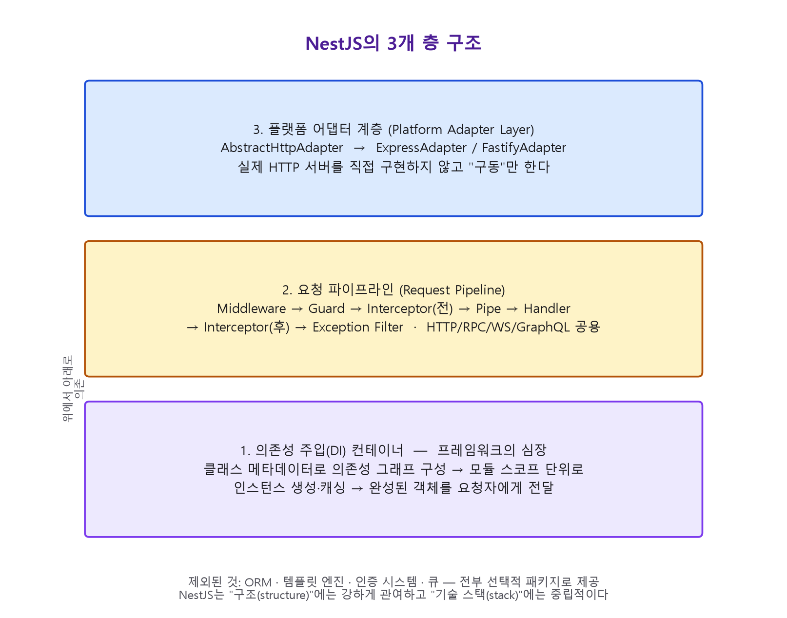

| 층 | 역할 | 비유 |
|---|---|---|
| **DI 컨테이너** | 클래스 메타데이터를 읽어 의존 관계 그래프를 만들고, 순서대로 인스턴스를 생성해 주입한다 | 프레임워크의 심장 |
| **요청 파이프라인** | 미들웨어 → 가드 → 인터셉터 → 파이프 → 핸들러 → 인터셉터 → 예외 필터, 고정된 순서 | 조립 라인 |
| **플랫폼 어댑터** | HTTP 서버를 직접 구현하지 않고 Express/Fastify를 "구동"한다 | 엔진 위의 변속기 |

의도적으로 빠진 것을 보면 이 책의 범위가 분명해진다: ORM, 템플릿 엔진, 인증 시스템, 큐 —
이런 것은 전부 선택적 패키지다.

### 최소 골격 코드

```typescript title="src/main.ts"
import { NestFactory } from '@nestjs/core';
import { AppModule } from './app.module';

async function bootstrap() {
  const app = await NestFactory.create(AppModule);
  await app.listen(process.env.PORT ?? 3000);
}
bootstrap();
```

```typescript title="src/cats/cats.service.ts"
import { Injectable } from '@nestjs/common';

@Injectable()
export class CatsService {
  private readonly cats = [{ id: 1, name: 'Nyan' }];
  findAll() {
    return this.cats;
  }
}
```

```typescript title="src/cats/cats.controller.ts"
import { Controller, Get } from '@nestjs/common';
import { CatsService } from './cats.service';

@Controller('cats')
export class CatsController {
  constructor(private readonly catsService: CatsService) {} // ← DI 컨테이너가 여기를 채운다
  @Get() findAll() {
    return this.catsService.findAll(); // ← 요청 파이프라인이 여기까지 데려온다
  }
}
```

```typescript title="src/cats/cats.module.ts"
import { Module } from '@nestjs/common';
import { CatsController } from './cats.controller';
import { CatsService } from './cats.service';

@Module({ controllers: [CatsController], providers: [CatsService] })
export class CatsModule {} // ← 모듈 그래프가 위 둘을 하나의 단위로 묶는다
```

세 줄짜리 컨트롤러 안에 이미 세 개의 층이 모두 들어 있다. `main.ts`는 어댑터를 리스닝시키고,
생성자 주입은 DI 컨테이너의 몫이고, `@Get()` 핸들러가 호출되는 그 순간은 요청 파이프라인의
끝점이다.

> **핵심** — Nest는 HTTP 서버를 만들지 않는다. `app.getHttpAdapter().getInstance()`로 언제든
> 원본 Express/Fastify 인스턴스를 꺼낼 수 있다는 사실이 이를 증명한다. 이 탈출구는 설계
> 원칙이지 사고가 아니다.

---

<a id="2장"></a>
## 2장. 부팅의 원리 — 데코레이터와 `reflect-metadata`

모든 "마법"은 하나의 언어 기능(데코레이터)과 하나의 작은 라이브러리(`reflect-metadata`)로
환원된다.

### 데코레이터 = 사이드 테이블에 메타데이터를 붙이는 함수

```typescript title="@Controller()의 실제 모습을 단순화한 예 — Nest 소스는 아니지만 형태는 정확하다"
import 'reflect-metadata';

export function Controller(prefix = '/'): ClassDecorator {
  return (target: object) => Reflect.defineMetadata('path', prefix, target);
}

@Controller('cats')
class CatsController {}

console.log(Reflect.getMetadata('path', CatsController)); // 'cats'
```

클래스 자체는 변형되지 않는다. 베이스 클래스도, 인터페이스 구현도, 등록 호출도 없다 — 단지
"이 클래스는 `cats` 접두사를 원한다"는 사이드 테이블 항목이 생길 뿐이다. 부팅 시점에 Nest는
모듈 그래프를 순회하며 이 항목들을 읽어 라우트를 만든다.

### 생성자가 무엇을 원하는지 아는 방법: `design:paramtypes`

`tsconfig.json`에 `emitDecoratorMetadata: true`가 있으면, TypeScript 컴파일러는 **적어도
하나의 데코레이터가 붙은 클래스에 한해** 생성자 파라미터의 런타임 타입을 `design:paramtypes`
아래 방출한다.

```typescript
@Injectable() // ← 데코레이터가 하나라도 있어야 컴파일러가 아래 메타데이터를 방출한다
export class CatsService {
  constructor(private readonly repository: CatsRepository) {}
  // 컴파일 후: Reflect.getMetadata('design:paramtypes', CatsService) === [CatsRepository]
}
```

이것이 프레임워크에서 가장 오해받는 규칙의 근원이다.

> **`@Injectable()`은 등록이 아니라 마커(marker)다.**
> 이 데코레이터가 하는 일은 (1) 컴파일러가 파라미터 메타데이터를 방출하도록 강제하고
> (2) 클래스를 "주입 가능"으로 표시하는 것뿐이다. **실제 등록은 모듈의 `providers` 배열이
> 담당한다.**

두 가지 실무적 함정이 여기서 바로 나온다.

```typescript
// ❌ 인터페이스는 런타임에 소거되므로 타입으로 주입할 수 없다.
export interface CatRepository { findAll(): Cat[]; }

@Injectable()
export class CatsService {
  // design:paramtypes에는 CatRepository가 아니라 Object가 기록된다 → 해석 실패
  constructor(private readonly repo: CatRepository) {}
}

// ✅ 문자열/심볼 토큰 + @Inject(), 또는 abstract class를 쓴다.
export const CAT_REPOSITORY = Symbol('CAT_REPOSITORY');

@Injectable()
export class CatsService {
  constructor(@Inject(CAT_REPOSITORY) private readonly repo: CatRepository) {}
}
```

```typescript
// ❌ 생성자에 의존성이 있는데 @Injectable()을 지우면 조용히 깨진다.
export class CatsService {
  constructor(private readonly repository: CatsRepository) {} // design:paramtypes가 없다
}
// → 부팅은 되지만 repository가 undefined로 들어온다.
```

### 토큰의 네 가지 형태

| 토큰 종류 | 예시 | 주입 방법 | 언제 쓰는가 |
|---|---|---|---|
| 클래스 | `CatsService` | 평범한 생성자 타입 | 클래스 자체가 계약인 일반적인 경우 |
| 문자열 | `'CONNECTION'` | `@Inject('CONNECTION')` | 소규모, 충돌 위험 존재 |
| `Symbol` | `Symbol('LOGGER')` | `@Inject(LOGGER)` | 라이브러리/대규모 앱 |
| 추상 클래스 | `abstract class LoggerService` | 평범한 생성자 타입 | 계약과 런타임 토큰을 하나로 |

### 부팅 시퀀스

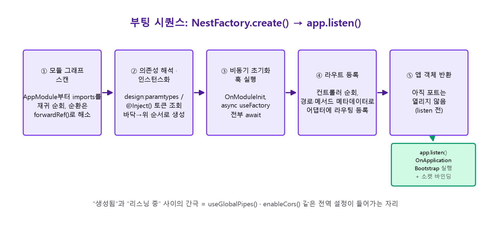

```typescript title="main.ts가 await 한 번에 실제로 수행하는 5단계"
const app = await NestFactory.create(AppModule, { abortOnError: false });
// 1. 모듈 그래프 스캔       — AppModule → imports를 재귀적으로 따라가며 등록
// 2. 의존성 해석·인스턴스화  — design:paramtypes를 읽어 바닥에서 위로 생성
// 3. 비동기 초기화 훅       — OnModuleInit, async useFactory를 await
// 4. 라우트 등록           — 컨트롤러를 순회해 어댑터의 라우팅 API 호출
// 5. 애플리케이션 객체 반환 — 아직 리스닝 전!

app.setGlobalPrefix('api');      // ← "생성됨"과 "리스닝 중" 사이, 전역 설정이 들어가는 자리
app.enableShutdownHooks();
await app.listen(3000);          // ← OnApplicationBootstrap 실행 + 실제 소켓 바인딩
```

`NestFactory`에는 세 번째 진입점 `createApplicationContext()`도 있다. HTTP 어댑터도
트랜스포터도 만들지 않고 **DI 그래프만** 구성한다. CLI 도구, 마이그레이션 러너, 크론
워커가 컨트롤러·서비스·리포지토리를 웹 서버 없이 그대로 재사용하는 표준 방법이다 — 이는
Nest의 진짜 핵심이 "웹 프레임워크"가 아니라 그 아래의 **DI 컨테이너 자체**임을 보여준다.

---

<a id="3장"></a>
## 3장. 모듈 그래프 — 애플리케이션의 실체

애플리케이션은 파일 시스템이 아니라 **루트 모듈(`AppModule`)에서 `imports`를 따라가며
도달 가능한 그래프**다. 어떤 모듈도 임포트하지 않는 파일은, 아무리 `export`가 붙어 있어도
존재하지 않는 것과 같다.

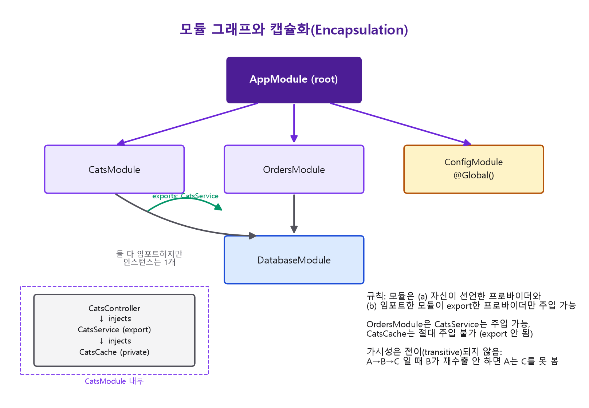

### `@Module()`의 네 개 키와 방향성

```
providers   → 이 모듈이 "생성"하는 것 (인스턴스화)
controllers → 이 모듈이 "생성"하고 HTTP 라우트로 등록하는 것
imports     → 다른 모듈의 export를 "빌려오는" 것 (모듈 단위, 프로바이더 단위 아님)
exports     → 이 모듈이 다른 모듈에게 "빌려주는" 것 (임포트한 쪽에만 영향)
```

### 캡슐화 규칙 — 코드로 보기

```typescript title="src/cats/cats.module.ts"
@Module({
  controllers: [CatsController],
  providers: [CatsService, CatsRepository],
  exports: [CatsService],       // CatsRepository는 의도적으로 비공개
})
export class CatsModule {}
```

```typescript title="src/orders/orders.module.ts"
@Module({
  imports: [CatsModule],        // ← CatsModule이 export한 것만 빌려온다
  providers: [OrdersService],
})
export class OrdersModule {}
```

```typescript title="src/orders/orders.service.ts"
@Injectable()
export class OrdersService {
  // ✅ 가능 — CatsModule이 exports 배열에 CatsService를 넣었다.
  constructor(private readonly catsService: CatsService) {}

  // ❌ 불가능 — CatsRepository는 CatsModule 안에서만 보인다.
  // constructor(private readonly catsRepo: CatsRepository) {}
}
```

> **규칙: 한 모듈은 (a) 자신이 직접 선언한 프로바이더와 (b) 자신이 임포트한 모듈이 export한
> 프로바이더만 주입할 수 있다.** 가시성은 전이(transitive)되지 않는다. `A`가 `B`를, `B`가
> `C`를 임포트해도 `B`가 `C`를 재수출하지 않으면 `A`는 `C`를 볼 수 없다.

### 단일 인스턴스 규칙

```typescript
// CatsModule을 세 모듈이 각각 import해도...
@Module({ imports: [CatsModule] }) export class OrdersModule {}
@Module({ imports: [CatsModule] }) export class ReviewsModule {}
@Module({ imports: [CatsModule] }) export class AppModule {}
// ...셋 모두 동일한 CatsService 인스턴스를 받는다. 프로바이더는 등록 지점당 싱글턴이다.
```

반대로 **같은 클래스를 두 모듈의 `providers`에 각각 등록**하면(중복 등록) 컴파일도 되고
부팅도 되지만, 서로 다른 인스턴스 두 개가 생겨 캐시·커넥션·카운터가 두 갈래로 갈라진다.
공유하려면 반드시 export/import를 거쳐야 한다.

### 전역 모듈과 동적 모듈

```typescript title="전역 모듈 — 로거처럼 프로세스당 구현체가 하나뿐인 인프라에만 사용"
@Global()
@Module({ providers: [LoggerService], exports: [LoggerService] })
export class LoggerModule {} // 루트에서 정확히 한 번만 import되어야 한다
```

```typescript title="동적 모듈 — 정적 메타데이터가 아니라 정적 메서드가 계산하는 모듈"
@Module({})
export class ConfigModule {
  static forRoot(options: ConfigOptions): DynamicModule {
    return {
      module: ConfigModule,
      providers: [{ provide: CONFIG_OPTIONS, useValue: options }, ConfigService],
      exports: [ConfigService],
      global: options.isGlobal, // v8+: DynamicModule 자체를 전역으로 표시할 수 있다
    };
  }
}

// 사용하는 쪽:
@Module({ imports: [ConfigModule.forRoot({ envFilePath: '.env' })] })
export class AppModule {}
```

### 모듈 그래프는 순환이 없어야 한다(DAG)

```typescript
// UsersModule ↔ OrdersModule이 서로를 import하면 부팅이 깨진다.
// 임시 우회책: forwardRef()
@Module({ imports: [forwardRef(() => OrdersModule)] })
export class UsersModule {}
```

`forwardRef()`는 지연 평가로 순환을 임시로 우회할 뿐이다. 근본 해법은 두 모듈이 공통으로
의존하는 개념을 제3의 모듈로 추출하는 것이다.

---

<a id="4장"></a>
## 4장. 토큰과 레시피 — DI 해석 알고리즘

모든 의존성은 세 단계를 거치며, 각각 다른 파일에 존재한다.

1. **선언(Declare)** — `@Injectable()`이 클래스를 관리 가능한 대상으로 표시
2. **요청(Request)** — 소비자가 생성자로 토큰을 원한다고 선언
3. **등록(Register)** — 모듈이 그 토큰을 구체적인 레시피와 연결

### 표준 프로바이더는 축약형이다

```typescript
providers: [CatsService]
// 는 정확히 다음과 같다
providers: [{ provide: CatsService, useClass: CatsService }]
```

토큰(`provide`)과 레시피(`use*`)를 분리하는 순간 문법 전체가 이해된다.

```typescript title="네 가지 레시피"
@Module({
  providers: [
    // useValue — 이미 존재하는 값을 그대로. 의존성 해석을 완전히 건너뜀.
    { provide: 'API_KEY', useValue: process.env.API_KEY },

    // useClass — 지정한 클래스의 의존성을 해석한 뒤 new. 토큰과 구현을 분리.
    { provide: LoggerService, useClass: process.env.NODE_ENV === 'production'
        ? PinoLoggerService
        : ConsoleLoggerService },

    // useFactory — 함수를 실행해 반환값을 사용. inject는 위치 기반.
    {
      provide: 'CONNECTION',
      useFactory: async (config: ConfigService) => {
        const conn = await createConnection(config.get('DB_URL'));
        return conn;
      },
      inject: [ConfigService], // 타입 체크되지 않는 위치 기반 배열
    },

    // useExisting — 다른 토큰의 인스턴스를 그대로 별칭. 복사가 아니다.
    { provide: 'LEGACY_LOGGER', useExisting: LoggerService },
  ],
})
export class CoreModule {}
```

| 레시피 | 동작 | 특징 |
|---|---|---|
| `useValue` | 값을 그대로 사용 | 해석을 완전히 건너뜀. 상수·서드파티 클라이언트·테스트 목에 적합 |
| `useClass` | 클래스를 해석 후 `new` | 환경별 구현 선택에 유용 |
| `useFactory` | 함수 실행 결과 사용 | `async`면 그 Promise가 처리될 때까지 **부팅 전체가 블로킹** |
| `useExisting` | 다른 토큰의 별칭 | 캐시 저장 단계를 건너뛰고 동일 인스턴스 반환 |

### 해석 알고리즘

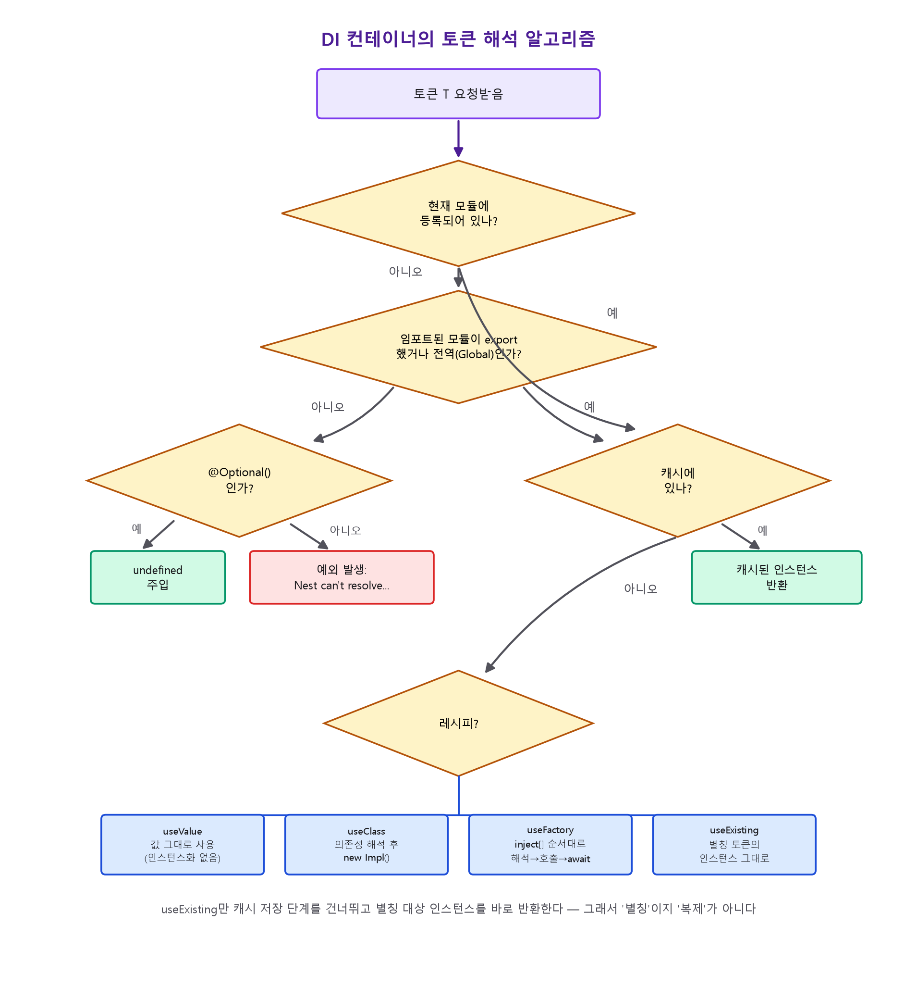

컨테이너가 `CatsController`를 인스턴스화할 때: 생성자의 토큰 목록을 읽고 → 모듈 자신의
`providers` → 임포트된 모듈이 export한 것 → 전역 모듈 순서로 토큰을 찾는다. 이 해석은
**전이적**이다 — 의존성의 의존성이 먼저 해석되고, 그 결과 바닥에서 위로 인스턴스가 만들어진다.
기본(싱글턴) 스코프에 한해 이 전체 과정은 **부팅 시 단 한 번**만 일어난다 — 즉 배선 오류는
새벽 3시의 500 에러가 아니라 시작 시점의 크래시가 된다.

```text
Nest can't resolve dependencies of the CatsController (?).
Please make sure that the argument CatsService at index [0] is available
in the CatsModule context.
```

`(?)`가 정확히 해석에 실패한 파라미터 위치를 가리킨다.

> **비동기 프로바이더의 대가** — `useFactory`가 `async`면 그 토큰에 의존하는 어떤 것도
> Promise가 처리될 때까지 인스턴스화되지 않는다. "DB 연결 전엔 트래픽을 받지 않는다"는
> 요구를 정확히 충족하지만, 타임아웃 없이 쓰면 프로세스가 "시작된 것처럼 보이지만 영원히
> 리스닝하지 않는" 상태가 될 수 있다.

---

<a id="5장"></a>
## 5장. 커스텀 프로바이더와 동적 모듈

`useFactory` + 동적 모듈을 결합하면 라이브러리 수준의 설정 가능한 모듈을 만들 수 있다.

```typescript title="비동기 옵션을 받는 동적 모듈 — @nestjs/typeorm 류 패턴"
export interface DbModuleAsyncOptions {
  useFactory: (...args: any[]) => Promise<DbOptions> | DbOptions;
  inject?: any[];
}

@Module({})
export class DbModule {
  static forRootAsync(options: DbModuleAsyncOptions): DynamicModule {
    return {
      module: DbModule,
      providers: [
        {
          provide: DB_OPTIONS,
          useFactory: options.useFactory,
          inject: options.inject ?? [],
        },
        {
          provide: DB_CONNECTION,
          useFactory: async (opts: DbOptions) => connect(opts),
          inject: [DB_OPTIONS],
        },
      ],
      exports: [DB_CONNECTION],
    };
  }
}

// 사용:
@Module({
  imports: [
    DbModule.forRootAsync({
      useFactory: (config: ConfigService) => ({ url: config.get('DB_URL') }),
      inject: [ConfigService],
    }),
  ],
})
export class AppModule {}
```

동적 모듈이 반환하는 메타데이터는 `@Module()` 데코레이터가 선언한 것을 **덮어쓰지 않고
확장**한다. 다른 모듈에서 재수출할 때는 `forRoot()` 호출 없이 클래스 자체만 `exports`에
나열한다.

```typescript
@Module({
  imports: [DbModule.forRootAsync({ /* ... */ })],
  exports: [DbModule], // ← forRootAsync(...)를 다시 호출하지 않는다
})
export class InfraModule {}
```

---

<a id="6장"></a>
## 6장. 컨테이너를 코드에서 직접 다루기 — `ModuleRef`, `Discovery`, `LazyModuleLoader`

지금까지의 해석은 전부 "생성자가 선언하면 컨테이너가 조립해 준다"는 선언적 경로였다. 하지만
컨테이너를 코드에서 직접 다뤄야 하는 상황이 있다.

```typescript title="ModuleRef.get() — 이미 인스턴스화된 프로바이더를 동기 조회"
@Injectable()
export class CatsExplorer implements OnModuleInit {
  constructor(private readonly moduleRef: ModuleRef) {}

  onModuleInit() {
    const service = this.moduleRef.get(CatsService, { strict: false });
    // strict: false → 현재 모듈이 아니라 전체 컨테이너까지 넓혀 조회
  }
}
```

```typescript title="ModuleRef.resolve() — 스코프 프로바이더용, 생성 자체를 수행"
@Injectable()
export class JobRunner {
  constructor(private readonly moduleRef: ModuleRef) {}

  async run() {
    const contextId = ContextIdFactory.create();
    // REQUEST가 없는 큐 컨슈머/크론 잡에서도 요청 스코프 프로바이더를 쓸 수 있게 등록
    this.moduleRef.registerRequestByContextId({ jobId: 42 }, contextId);
    const scoped = await this.moduleRef.resolve(RequestScopedService, contextId);
    return scoped.handle();
  }
}
```

```typescript title="DiscoveryService — '이 토큰을 달라'가 아니라 '이런 메타데이터가 붙은 것 전부를 달라'"
export const CRON_JOB = Symbol('CRON_JOB');
export const CronJob = () => SetMetadata(CRON_JOB, true);

@Injectable()
export class CronExplorer implements OnApplicationBootstrap {
  constructor(
    private readonly discovery: DiscoveryService,
    private readonly metadataScanner: MetadataScanner,
    private readonly reflector: Reflector,
  ) {}

  onApplicationBootstrap() {
    const providers = this.discovery.getProviders();
    for (const wrapper of providers) {
      const { instance } = wrapper;
      if (!instance) continue;
      const prototype = Object.getPrototypeOf(instance);
      this.metadataScanner.getAllMethodNames(prototype).forEach((name) => {
        if (this.reflector.get(CRON_JOB, instance[name])) {
          // 부팅 시 1회 스캔 → 레지스트리 구축 (실제 @nestjs/schedule이 쓰는 패턴)
          this.registerJob(instance, name);
        }
      });
    }
  }
  private registerJob(instance: any, method: string) { /* ... */ }
}
```

```typescript title="LazyModuleLoader — 부팅 시 즉시 인스턴스화하는 기본 동작을 미룬다"
@Injectable()
export class ReportsService {
  constructor(private readonly lazyModuleLoader: LazyModuleLoader) {}

  async generate() {
    const moduleRef = await this.lazyModuleLoader.load(() => HeavyPdfModule);
    const generator = moduleRef.get(PdfGeneratorService);
    return generator.render();
  }
}
```

> **경고 — 서비스 로케이터 함정.** `ModuleRef.get()`을 쓰는 순간 그 의존성은 생성자
> 시그니처에서 사라지고, 컴파일러도 테스트도 더는 그것을 검증해 주지 않는다. 실무 규칙:
> 런타임에 선택되는 구현체, 비-HTTP 진입점의 스코프 프로바이더 접근, 프레임워크급 플러그인
> 시스템처럼 **정당한 이유가 있는 인프라 코드 한 곳에만** 이 API들을 격리하고, 도메인
> 로직과 컨트롤러는 계속 선언적 생성자 주입만 쓴다.

---

<a id="7장"></a>
## 7장. 고정된 순서 — 미들웨어부터 예외 필터까지

Nest의 요청 처리는 임의의 콜백 배열이 아니라 **이름이 붙은 고정 시퀀스**다. 이 시퀀스는
HTTP·RPC·WebSocket·GraphQL 모두에서 동일하게 재사용된다. 다른 것은 인자의 모양뿐이다.

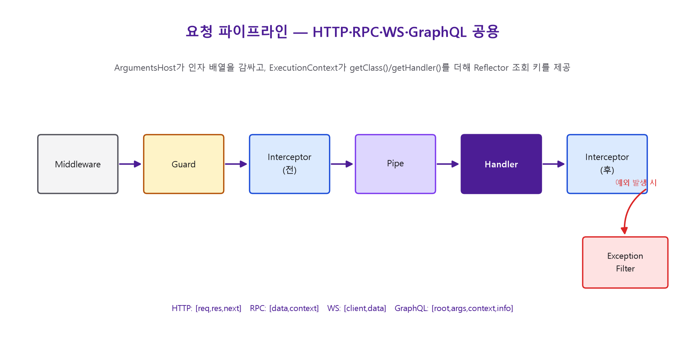

```
요청 → Middleware → Guard → Interceptor(전) → Pipe → Handler
     → Interceptor(후) → (예외 시) Exception Filter → 응답
```

각 지점을 코드로 채워보면 파이프라인 전체가 눈에 보인다.

```typescript title="① Middleware — DI 밖에서 동작하는 가장 바깥 레이어, Express/Fastify에 가장 가깝다"
@Injectable()
export class RequestIdMiddleware implements NestMiddleware {
  use(req: Request, res: Response, next: NextFunction) {
    req['requestId'] = randomUUID();
    next(); // 호출하지 않으면 요청이 여기서 멈춘다
  }
}

@Module({})
export class AppModule implements NestModule {
  configure(consumer: MiddlewareConsumer) {
    consumer.apply(RequestIdMiddleware).forRoutes('*');
  }
}
```

```typescript title="② Guard — canActivate()의 boolean이 다음 단계 진입 여부를 결정"
@Injectable()
export class RolesGuard implements CanActivate {
  constructor(private readonly reflector: Reflector) {}

  canActivate(context: ExecutionContext): boolean {
    const requiredRoles = this.reflector.getAllAndOverride<string[]>(ROLES_KEY, [
      context.getHandler(),
      context.getClass(),
    ]);
    if (!requiredRoles) return true;
    const { user } = context.switchToHttp().getRequest();
    return requiredRoles.some((role) => user?.roles?.includes(role));
  }
}

@Controller('cats')
@UseGuards(RolesGuard)
export class CatsController {
  @Roles('admin')
  @Delete(':id')
  remove(@Param('id') id: string) { /* ... */ }
}
```

```typescript title="③ Pipe — 핸들러 실행 '전', DTO 변환과 검증을 담당"
@Injectable()
export class ParseIntPipe implements PipeTransform<string, number> {
  transform(value: string, metadata: ArgumentMetadata): number {
    const val = parseInt(value, 10);
    if (isNaN(val)) {
      throw new BadRequestException(`${metadata.data}는 숫자여야 합니다`);
    }
    return val;
  }
}

@Get(':id')
findOne(@Param('id', ParseIntPipe) id: number) { /* id는 여기서 이미 number */ }
```

```typescript title="④ Interceptor — RxJS 파이프라인. 핸들러 '전'과 '후' 모두를 감싼다"
@Injectable()
export class TimingInterceptor implements NestInterceptor {
  intercept(context: ExecutionContext, next: CallHandler): Observable<any> {
    const start = Date.now();
    return next.handle().pipe(         // next.handle()이 실제 핸들러 실행
      tap(() => console.log(`${Date.now() - start}ms`)), // 핸들러 실행 '후'
    );
  }
}
```

```typescript title="⑤ Exception Filter — 예외를 응답 형태로 변환하는 마지막 관문"
@Catch(HttpException)
export class HttpExceptionFilter implements ExceptionFilter {
  catch(exception: HttpException, host: ArgumentsHost) {
    const ctx = host.switchToHttp();
    const response = ctx.getResponse<Response>();
    const status = exception.getStatus();
    response.status(status).json({
      statusCode: status,
      timestamp: new Date().toISOString(),
      path: ctx.getRequest<Request>().url,
    });
  }
}
```

각 인핸서는 **전역 / 컨트롤러 / 메서드** 세 단계에 적용할 수 있고, 좁은 스코프가 넓은
스코프를 오버라이드한다(뒤집는 것이 아니라 병합·오버라이드). 전역 등록은 두 갈래로 갈린다.

```typescript title="전역 등록의 두 가지 방법"
// 방법 A — main.ts에서: 간단하지만 DI 컨테이너 밖이라 다른 프로바이더를 주입할 수 없다.
app.useGlobalGuards(new RolesGuard(new Reflector()));

// 방법 B — 토큰으로 모듈에 등록: DI 그래프 안이라 생성자 주입이 가능하다. 권장.
@Module({
  providers: [{ provide: APP_GUARD, useClass: RolesGuard }],
})
export class AppModule {}
```

---

<a id="8장"></a>
## 8장. `ArgumentsHost`와 `ExecutionContext`

`ArgumentsHost`는 Nest가 핸들러에 전달한(또는 전달할) 인자 배열을 감싼 객체다. 배열의 모양은
전송 계층마다 다르다.

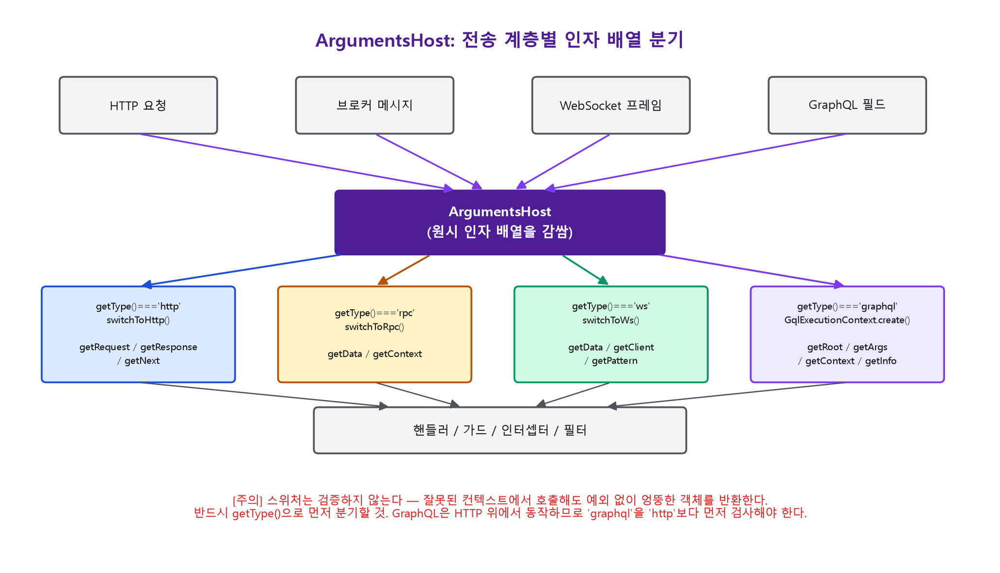

| 컨텍스트 타입 | 인자 배열 |
|---|---|
| `'http'` (Express) | `[req, res, next]` |
| `'rpc'` | `[data, context]` |
| `'ws'` | `[client, data]` |
| `'graphql'` | `[root, args, context, info]` |

```typescript title="getType()으로 먼저 분기해야 하는 이유 — switchToHttp()는 검증하지 않는다"
export class AnyExceptionFilter implements ExceptionFilter {
  catch(exception: unknown, host: ArgumentsHost) {
    const type = host.getType<GqlContextType>();
    if (type === 'graphql') {
      // GraphQL은 HTTP 위에 얹혀 있으므로 반드시 'http'보다 먼저 검사한다.
      return this.handleGraphql(exception, host);
    }
    if (type === 'http') {
      return this.handleHttp(exception, host);
    }
  }
  private handleGraphql(e: unknown, h: ArgumentsHost) { /* ... */ }
  private handleHttp(e: unknown, h: ArgumentsHost) { /* ... */ }
}
```

`ExecutionContext`는 `ArgumentsHost`를 확장해 `getClass()`(호출될 클래스)와
`getHandler()`(호출될 메서드 참조)를 추가한다. 진짜 목적은 **메타데이터 조회 키**다.

```typescript title="Reflector — 데코레이터가 붙인 메타데이터를 런타임에 읽는다"
export const ROLES_KEY = 'roles';
export const Roles = (...roles: string[]) => SetMetadata(ROLES_KEY, roles);

// 가드 안에서:
const roles = this.reflector.getAllAndOverride<string[]>(ROLES_KEY, [
  context.getHandler(), // ← 배열의 첫 원소가 우선한다: 메서드 레벨이 클래스 레벨을 덮는다
  context.getClass(),
]);
```

`getAllAndOverride`는 배열에서 **처음 정의된 값**을 반환한다. `getAllAndMerge`는 값을
병합한다.

---

<a id="9장"></a>
## 9장. 플랫폼 어댑터 — Express와 Fastify

Nest는 HTTP 서버를 구현하지 않고 "구동"한다. `AbstractHttpAdapter`를 `ExpressAdapter`와
`FastifyAdapter`가 확장하며, Nest 코어는 라우트 등록·응답 전송을 이 추상 인터페이스로만
수행한다.

```typescript title="main.ts — 어댑터를 바꿔도 컨트롤러/서비스는 한 줄도 안 바뀌어야 한다"
// 기본값 — 어댑터 생략 시 Express
const app = await NestFactory.create<NestExpressApplication>(AppModule);
app.useStaticAssets(join(__dirname, '..', 'public')); // Express 전용 메서드

// Fastify — 어댑터를 명시해야 한다
const fastifyApp = await NestFactory.create<NestFastifyApplication>(
  AppModule,
  new FastifyAdapter(),
);
await fastifyApp.listen(3000, '0.0.0.0'); // Fastify는 기본적으로 127.0.0.1만 바인딩
```

```typescript title="이식 가능한 코드 vs 플랫폼에 새는 코드"
// ✅ 이식된다 — Nest의 추상화만 사용
@Res({ passthrough: true }) res: Response // 헤더만 설정, 응답 바디는 Nest가 직렬화

// ❌ 이식되지 않는다 — 원본 API를 직접 호출
@Res() res: Response
res.status(200).json({ ok: true }); // Fastify로 옮기면 이 줄은 다시 써야 한다
```

> **일반 규칙**: Nest가 추상화한 것은 이식되고, Nest를 우회해 직접 만진 것은 이식되지 않는다.

---

<a id="10장"></a>
## 10장. 세 가지 스코프와 스코프 버블링

Nest가 실제로 관리하는 "메모리"란 얼마나 많은 인스턴스가 언제 생성되고 언제 GC 대상이
되는가이며, 이는 전적으로 프로바이더 스코프에 달려 있다.

```typescript
export enum Scope {
  DEFAULT,    // 싱글턴 — 등록 지점당 1개, 부팅 시 생성
  REQUEST,    // 요청(서브트리)마다 1개, 지연 생성
  TRANSIENT,  // 주입 지점마다 별도 인스턴스, 그러나 프로세스 생명 내내 유지
}
```

```typescript title="스코프 선언 두 가지 방법"
@Injectable({ scope: Scope.REQUEST })
export class CatsRepository { /* ... */ }

// 또는 커스텀 프로바이더에서:
{ provide: 'CONN', useFactory: () => createConn(), scope: Scope.REQUEST }
```

| | `DEFAULT` | `REQUEST` | `TRANSIENT` |
|---|---|---|---|
| 생성 시점 | 부팅 시 | 요청 처리 중 | 소비자가 주입할 때 |
| `app.get()` | 가능 | 불가(`resolve()`) | 불가(`resolve()`) |
| 소비자에게 전파 | — | **O** | X |

### 스코프 버블링 — 가장 비용이 큰 실수

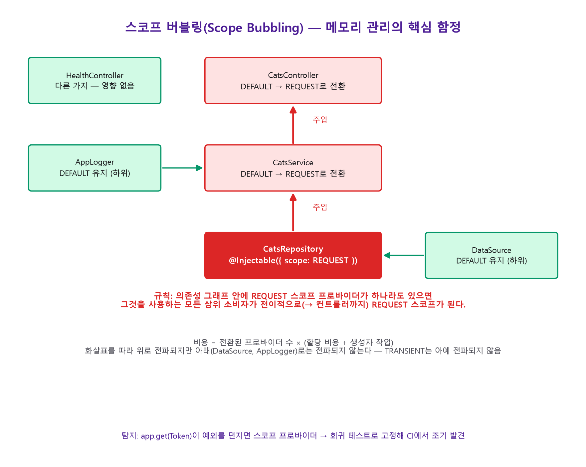

```typescript
@Injectable({ scope: Scope.REQUEST })
export class CatsRepository {}          // 요청 스코프로 선언

@Injectable()
export class CatsService {
  constructor(private readonly repo: CatsRepository) {} // ← 이 클래스도 강제로 REQUEST가 된다
}

@Controller('cats')
export class CatsController {
  constructor(private readonly svc: CatsService) {}      // ← 이 클래스도 강제로 REQUEST가 된다
}
```

> **규칙: 클래스의 의존성 그래프 안에 요청 스코프 프로바이더가 하나라도 있으면, 그 클래스도
> 요청 스코프가 된다. 전파는 소비자 방향으로 전이적이며, 코드로는 보이지 않는다.**
> 로거 하나를 요청 스코프로 만들었는데 그것이 기반 서비스에 주입되어 있다면, 단 한 줄의
> 변경이 애플리케이션 전체를 요청마다 재생성되도록 바꿔버릴 수 있다.

```typescript title="탐지법 — app.get()이 스코프 프로바이더에 명시적 오류를 던진다"
// 회귀 테스트: 싱글턴으로 남아야 하는 서비스에 대해 이 호출이 던지지 않는지 확인
expect(() => app.get(CatsController)).not.toThrow();
// 던진다면: "CatsController is marked as a scoped provider... use 'resolve()' instead"
```

```typescript title="요청 데이터를 전달하는 더 가벼운 대안 — AsyncLocalStorage"
const als = new AsyncLocalStorage<{ requestId: string }>();

@Injectable()
export class ContextMiddleware implements NestMiddleware {
  use(req: Request, res: Response, next: NextFunction) {
    als.run({ requestId: randomUUID() }, () => next()); // 서브트리 전체가 이 값을 본다
  }
}

// 12단계 아래 함수에서도, 모든 프로바이더를 싱글턴으로 유지한 채:
export function currentRequestId(): string | undefined {
  return als.getStore()?.requestId;
}
```

요청 스코프로 도피하게 만드는 요구사항의 대부분은 사실 "객체 수명 관리"가 아니라 "값
전달"이다. 그럴 때는 스코프를 바꾸지 말고 `AsyncLocalStorage`로 데이터만 앰비언트하게
만드는 편이 버블링 위험 없이 더 싸다.

---

<a id="11장"></a>
## 11장. 애플리케이션 생명주기와 정상 종료

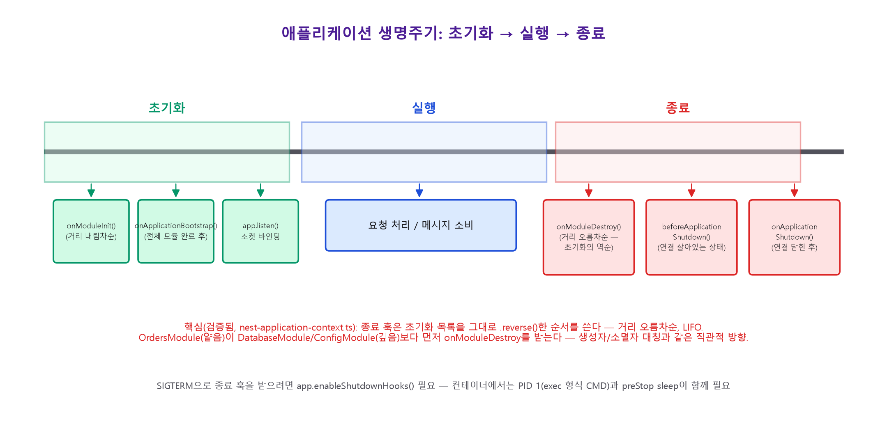

```typescript title="초기화 훅 — 거리 내림차순(가장 깊은 모듈 먼저) 실행"
@Injectable()
export class CatsService implements OnModuleInit, OnApplicationBootstrap {
  onModuleInit() {
    // 부팅 중, 모든 프로바이더가 인스턴스화된 뒤. 아직 app.listen() 전.
  }
  onApplicationBootstrap() {
    // app.listen() 직전. 이 시점 이후에야 실제 소켓이 바인딩된다.
  }
}
```

```typescript title="종료 훅 — 초기화의 정확한 역순(거리 오름차순, 얕은 모듈 먼저)"
@Injectable()
export class CatsService implements OnModuleDestroy, OnApplicationShutdown {
  onModuleDestroy() {
    // 새 작업 유입을 막는다 (레디니스 플래그 내리기). 아직 모든 게 연결된 상태.
  }
  onApplicationShutdown(signal?: string) {
    // beforeApplicationShutdown 이후. 서버·트랜스포트가 이미 닫힌 뒤.
    // 이제야 아무도 쓰지 않을 자원을 해제한다.
  }
}
```

초기화에서 가장 나중에 인스턴스화된 모듈이 종료에서는 가장 먼저 정리되고, 가장 먼저
만들어진 모듈이 가장 나중에 정리된다 — 생성자/소멸자가 대칭을 이루는 LIFO 순서다.

| 하고 싶은 일 | 넣을 곳 |
|---|---|
| 새 작업 유입 차단 | `onModuleDestroy` |
| 진행 중 작업 마무리(DB·브로커 필요) | `beforeApplicationShutdown` |
| 아무도 쓰지 않을 자원 해제 | `onApplicationShutdown` |

```typescript title="main.ts — 시스템 시그널(SIGTERM)로 종료 훅을 켜는 것은 opt-in"
const app = await NestFactory.create(AppModule);
app.enableShutdownHooks(); // 없으면 app.close()를 직접 호출할 때만 훅이 실행된다
await app.listen(3000);
```

> **컨테이너 환경 함정**: `CMD npm run start:prod`(쉘 형식)는 `sh`가 PID 1이 되어
> `SIGTERM`을 자식에게 전달하지 않는다. `CMD ["node", "dist/main.js"]`(exec 형식)를
> 써야 한다.

---

<a id="12장"></a>
## 12장. 하나의 파이프라인, 여러 개의 얼굴

7장에서 본 파이프라인(미들웨어~예외 필터)은 HTTP뿐 아니라 마이크로서비스, WebSocket에도
**동일하게 재사용**된다. 바뀌는 것은 `ArgumentsHost`가 감싸는 인자의 모양과, 어댑터 대신
쓰이는 **트랜스포터**뿐이다.

```typescript title="마이크로서비스 — 같은 DI 그래프, 다른 진입점"
@Controller() // 프로바이더가 아니라 반드시 컨트롤러
export class CatsController {
  @MessagePattern('cats.find')   // 요청-응답: ClientProxy.send()가 콜드 Observable을 반환
  findAll(@Payload() data: unknown) { return this.catsService.findAll(); }

  @EventPattern('cats.created')  // 발행-소비: ClientProxy.emit()이 핫 Observable, 응답 없음
  handleCreated(@Payload() data: unknown) { /* ... */ }
}
```

```typescript title="하이브리드 애플리케이션 — 한 프로세스가 HTTP + 트랜스포터를 동시에 서빙"
const app = await NestFactory.create(AppModule);
app.connectMicroservice({ transport: Transport.TCP }, { inheritAppConfig: true });
// inheritAppConfig: true를 빠뜨리면 전역 파이프/가드/필터가 마이크로서비스 리스너에
// 상속되지 않는다 — "전역 ValidationPipe가 안 먹힌다" 버그의 가장 흔한 원인.
await app.startAllMicroservices();
await app.listen(3000);
```

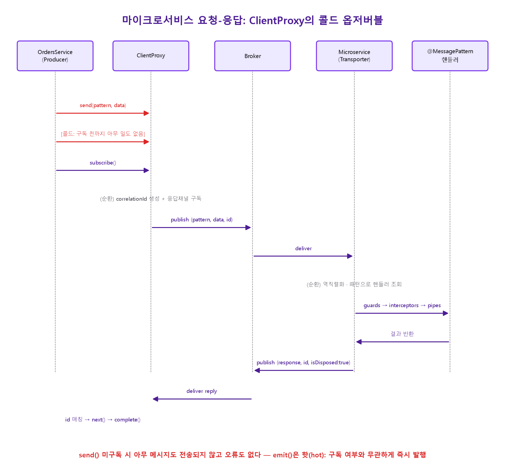

```typescript title="WebSocket 게이트웨이 — 인핸서는 '메시지'에 바인딩되지 '연결'에 바인딩되지 않는다"
@WebSocketGateway()
export class CatsGateway implements OnGatewayConnection {
  handleConnection(client: Socket) {
    // ⚠️ 여기엔 가드가 적용되지 않는다 — 모든 TCP 연결이 일단 수락된다.
    // 인증은 어댑터 미들웨어(server.use())에서 하거나, 여기서 실패 시 disconnect(true).
  }

  @UseGuards(WsAuthGuard) // ← 이 가드는 '메시지'만 막는다, 연결 자체는 막지 못한다
  @SubscribeMessage('cats:find')
  handleFind(@ConnectedSocket() client: Socket) { /* ... */ }
}
```

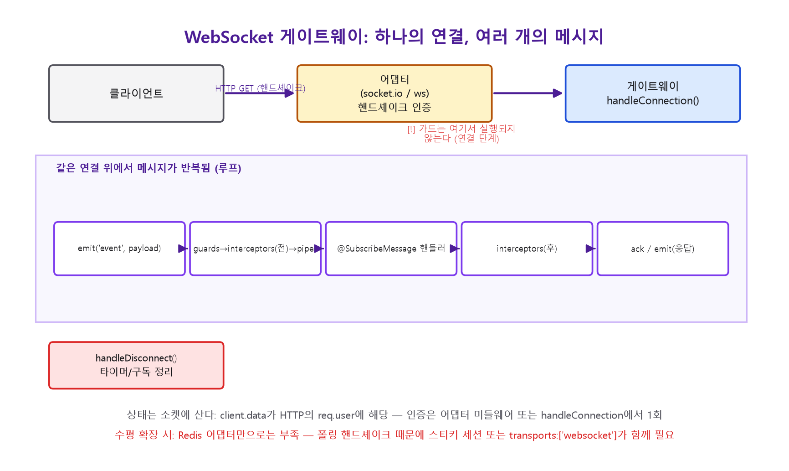

이 장의 요점은 하나다: **트랜스포트가 바뀌어도 모듈 그래프·DI·파이프라인의 형태는
바뀌지 않는다.** NestJS의 "아키텍처"는 전송 계층에 대해 열려 있도록 설계됐다.

---

<a id="13장"></a>
## 13장. Nest 개발에 필수인 디자인 패턴 — 강제, 구조, 컨벤션

앞의 12개 장에서 다룬 내용을 이번에는 **디자인 패턴이라는 이름**으로 다시 정리한다. 코드는
새로 등장하지 않고, 이미 본 코드에 패턴 이름표를 붙이는 장이다. 그래서 "필수"라는 말을
한 단어로 쓰면 틀린다 — Nest는 세 가지 강도로 패턴을 요구한다.

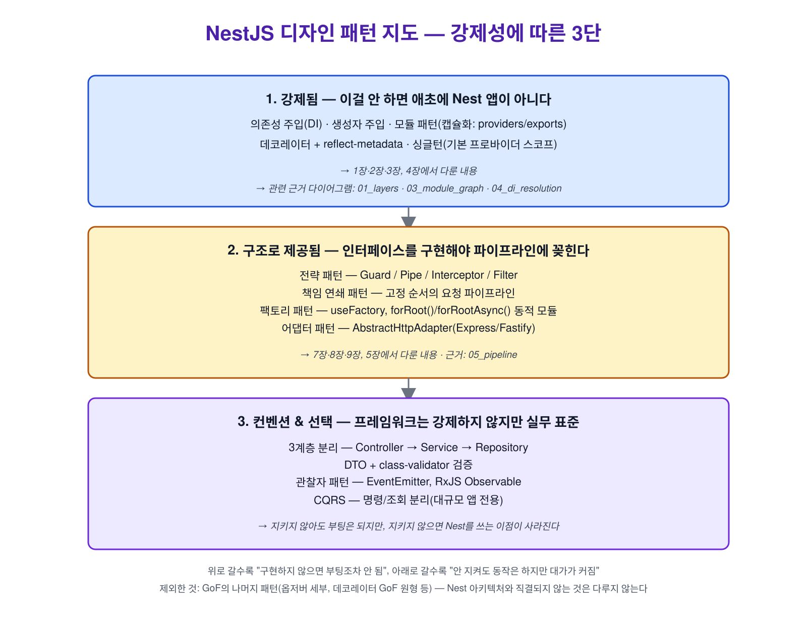

### 13.1 강제됨 — 이걸 안 하면 애초에 Nest 앱이 아니다

프레임워크의 정의 자체인 패턴이다. 구현하지 않는 선택지가 없다.

```typescript title="한 파일에 네 가지 강제 패턴이 모두 들어 있다"
@Injectable()                                   // ← 데코레이터/메타데이터 패턴
export class CatsService {                      // ← 기본 스코프 = 싱글턴 패턴
  constructor(private readonly repo: CatsRepository) {} // ← 의존성 주입(생성자 주입)
}

@Module({                                       // ← 모듈 패턴(캡슐화)
  providers: [CatsService, CatsRepository],
  exports: [CatsService],
})
export class CatsModule {}
```

| 패턴 | Nest 구성요소 | 이 책의 근거 |
|---|---|---|
| 의존성 주입(DI) | 생성자 주입 + `@Injectable()` | [2장](#2장), [4장](#4장) |
| 모듈(캡슐화) | `@Module()`의 `providers`/`exports` | [3장](#3장) |
| 데코레이터/메타데이터 | `Reflect.defineMetadata`, `design:paramtypes` | [2장](#2장) |
| 싱글턴 | 기본 프로바이더 스코프 | [10장](#10장) |

### 13.2 구조로 제공됨 — 인터페이스를 구현해야 파이프라인에 꽂힌다

프레임워크가 자리를 미리 파놓았다. 그 자리를 쓰려면(가드를 걸고, 응답을 가공하고, 설정을
주입하려면) 정해진 인터페이스를 구현하는 수밖에 없다 — "안 쓸 수는 있지만, 쓰려면 이
패턴대로 써야 한다."

```typescript title="전략 패턴(Strategy) — Guard/Pipe/Interceptor/Filter는 교체 가능한 전략 객체"
@Injectable()
export class RolesGuard implements CanActivate {           // 전략 인터페이스
  canActivate(context: ExecutionContext): boolean {
    const roles = Reflect.getMetadata('roles', context.getHandler());
    const { user } = context.switchToHttp().getRequest();
    return !roles || roles.some((r: string) => user?.roles?.includes(r));
  }
}

@Injectable()
export class TrimStringsPipe implements PipeTransform {     // 전략 인터페이스
  transform(value: unknown) {
    return typeof value === 'string' ? value.trim() : value;
  }
}
```

```typescript title="책임 연쇄 패턴(Chain of Responsibility) — 고정 순서의 요청 파이프라인"
// Middleware → Guard → Interceptor(전) → Pipe → Handler → Interceptor(후) → ExceptionFilter
// 각 단계는 다음 단계로 넘길지(next()/next.handle()) 여기서 끊을지(예외/거부) 스스로 결정한다.
@Controller('cats')
@UseGuards(RolesGuard)          // 체인의 2번째 링크
@UseInterceptors(LoggingInterceptor) // 체인의 3번째·6번째 링크
export class CatsController {
  @UsePipes(TrimStringsPipe)    // 체인의 4번째 링크
  @Post()
  create(@Body('name') name: string) { /* 체인의 5번째 링크: 핸들러 */ }
}
```

```typescript title="팩토리 패턴(Factory) — 인스턴스 생성 방법을 컨테이너에 넘긴다"
@Module({
  providers: [
    {
      provide: 'LOGGER',
      useFactory: (config: ConfigService) =>
        config.get('NODE_ENV') === 'production'
          ? new PinoLogger()     // 팩토리가 런타임에 구현체를 선택
          : new ConsoleLogger(),
      inject: [ConfigService],
    },
  ],
})
export class CoreModule {}

// 동적 모듈의 forRootAsync()도 같은 패턴의 모듈 단위 확장이다.
ConfigModule.forRootAsync({ useFactory: () => ({ envFilePath: '.env' }) });
```

```typescript title="어댑터 패턴(Adapter) — HTTP 서버를 직접 만들지 않고 감싼다"
// AbstractHttpAdapter가 ExpressAdapter/FastifyAdapter를 감싸므로
// 컨트롤러 코드는 아래 둘 중 무엇을 골라도 그대로 재사용된다.
await NestFactory.create<NestExpressApplication>(AppModule);
await NestFactory.create<NestFastifyApplication>(AppModule, new FastifyAdapter());
```

| 패턴 | Nest 구성요소 | 이 책의 근거 |
|---|---|---|
| 전략(Strategy) | `CanActivate`/`PipeTransform`/`NestInterceptor`/`ExceptionFilter` | [7장](#7장), [8장](#8장) |
| 책임 연쇄(Chain of Responsibility) | 요청 파이프라인 자체 | [7장](#7장) |
| 팩토리(Factory) | `useFactory`, `forRoot()`/`forRootAsync()` | [4장](#4장), [5장](#5장) |
| 어댑터(Adapter) | `AbstractHttpAdapter` | [9장](#9장) |

### 13.3 컨벤션 & 선택 — 강제하지 않지만 지키지 않으면 대가가 크다

프레임워크는 부팅 여부로 이것들을 검사하지 않는다. 그래서 "필수"라고 부르면 과장이지만,
실무 코드베이스 대부분이 예외 없이 지킨다.

```typescript title="3계층 분리 — Controller는 위임만, Service가 로직, Repository가 데이터 접근"
@Controller('cats')
export class CatsController {
  constructor(private readonly catsService: CatsService) {}
  @Post() create(@Body() dto: CreateCatDto) {
    return this.catsService.create(dto); // 컨트롤러에 if문·DB 접근이 있으면 이미 깨진 경계
  }
}

@Injectable()
export class CatsService {
  constructor(private readonly catsRepository: CatsRepository) {}
  create(dto: CreateCatDto) {
    // 비즈니스 규칙은 여기: 예) 중복 이름 검사, 도메인 검증
    return this.catsRepository.save(dto);
  }
}

@Injectable()
export class CatsRepository {
  // ORM/DB 클라이언트에 대한 지식은 여기 안에만 갇혀 있다 — 리포지토리 패턴
  save(dto: CreateCatDto) { /* ... */ }
}
```

```typescript title="DTO + 검증 — 입력 계약을 클래스로 못박는다"
export class CreateCatDto {
  @IsString() @MinLength(1)
  name: string;

  @IsInt() @Min(0)
  age: number;
}
// main.ts: app.useGlobalPipes(new ValidationPipe({ whitelist: true }));
```

```typescript title="관찰자 패턴(Observer) — 발신자가 수신자를 몰라도 되게 만든다"
@Injectable()
export class CatsService {
  constructor(private readonly events: EventEmitter2) {}
  create(dto: CreateCatDto) {
    const cat = /* ... 저장 ... */ dto;
    this.events.emit('cat.created', cat); // 누가 듣는지 CatsService는 모른다
    return cat;
  }
}

@Injectable()
export class NotifyOnCatCreated {
  @OnEvent('cat.created')
  handle(cat: CreateCatDto) { /* 슬랙 알림 등 부가 로직 */ }
}
```

```typescript title="CQRS — 명령(쓰기)과 조회(읽기)를 별도 객체로 분리 (대규모 앱 전용)"
export class CreateCatCommand { constructor(public readonly name: string) {} }

@CommandHandler(CreateCatCommand)
export class CreateCatHandler implements ICommandHandler<CreateCatCommand> {
  async execute(command: CreateCatCommand) { /* 쓰기 경로만 담당 */ }
}
```

| 패턴 | Nest 구성요소 | 이 책/저장소의 근거 |
|---|---|---|
| 3계층 분리 | Controller → Service → Repository | 관례(강제 아님) |
| DTO + 검증 | `class-validator` + `ValidationPipe` | [`part1-beginner/10-pipes-and-validation.md`](part1-beginner/10-pipes-and-validation.md) |
| 관찰자(Observer) | `@nestjs/event-emitter`, RxJS `Observable` | [`part2-intermediate/34-scheduling-and-events.md`](part2-intermediate/34-scheduling-and-events.md) |
| CQRS | `@nestjs/cqrs`의 `ICommandHandler`/`IQueryHandler` | [`part3-advanced/53-cqrs.md`](part3-advanced/53-cqrs.md) |

> **한 줄 요약** — 위로 갈수록 "구현하지 않으면 부팅조차 안 된다"이고, 아래로 갈수록
> "안 지켜도 동작은 하지만 테스트 불가능·결합도 폭증 같은 대가가 쌓인다." 신입 개발자에게
> "Nest 필수 패턴이 뭐냐"고 물으면 보통 13.1(강제됨)만 답하지만, 실무에서 코드 리뷰가
> 걸리는 지점은 대부분 13.2(전략·책임연쇄를 우회해 `@Res()`로 직접 응답하는 것 같은 경우)와
> 13.3(3계층 경계를 허무는 것)이다.

---

<a id="종합"></a>
## 종합 — 요청 하나의 전 생애주기

앞의 모든 장을 하나의 HTTP 요청이 통과하는 여정으로 합치면 다음과 같다.

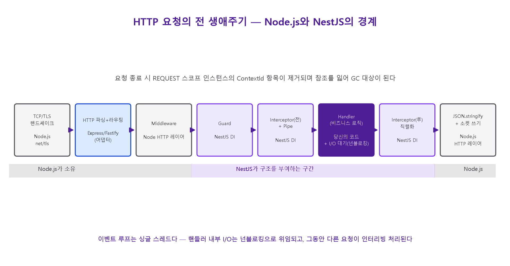

```text
 1. TCP/TLS 핸드셰이크              (Node net/tls — 프레임워크 밖)
 2. HTTP 파싱 + 라우팅              (Express/Fastify → AbstractHttpAdapter)   [9장]
 3. Middleware 체인 실행            (DI 밖의 레이어)                          [7장]
 4. Guard.canActivate()             (ExecutionContext 생성, 요청 스코프 첫 인스턴스화) [7,8,10장]
 5. Interceptor(전)                 (RxJS 파이프라인 진입)                    [7장]
 6. Pipe                            (DTO 변환·검증)                          [7장]
 7. 컨트롤러 핸들러                  (서비스 → 리포지토리 → DB/브로커 I/O)      [1장]
 8. Interceptor(후)                 (응답 매핑, 직렬화)                       [7장]
 9. (예외 시) Exception Filter                                               [7장]
10. JSON.stringify + 소켓 쓰기       (프레임워크 밖)
11. 요청 종료 → ContextId 항목 제거 → GC 대상化                               [10장]
```

프레임워크가 개입하는 지점은 4~9번뿐이다. 나머지(1, 2, 10)는 순수하게 Node.js와 그 위의
HTTP 라이브러리의 몫이다. **NestJS의 가치는 이 4~9번 구간에 일관된 구조(DI, 파이프라인,
메타데이터 기반 선언)를 부여한 것이지, I/O 자체를 더 빠르게 만든 것이 아니다.**

---

<a id="부록"></a>
## 부록 — 아키텍처 안티패턴 체크리스트

| 증상 | 원인 | 이 책의 장 |
|---|---|---|
| `Nest can't resolve dependencies of X (?)` | `providers`에 등록 안 됨, 또는 export 안 함 | [4장](#4장) |
| 다른 모듈에서 프로바이더가 `undefined` | 캡슐화 — export하지 않음 | [3장](#3장) |
| 리팩터링 후 생성자 파라미터가 `undefined` | `@Injectable()` 삭제로 `design:paramtypes` 미방출 | [2장](#2장) |
| interface 타입 주입이 실패 | 인터페이스는 런타임에 소거됨 | [2장](#2장) |
| 전역 `ValidationPipe`가 마이크로서비스에서 안 먹힘 | `inheritAppConfig: true` 누락 | [12장](#12장) |
| 배포 후 p99 지연 급등, 할당률 증가 | 요청 스코프 버블링이 200+ 프로바이더로 전파 | [10장](#10장) |
| `app.get(Token)`이 오류를 던짐 | 그 토큰이 스코프 프로바이더로 전환됨(의도 확인 필요) | [10장](#10장) |
| `SIGTERM`을 보내도 훅이 실행 안 됨 | `enableShutdownHooks()` 미호출, 또는 쉘 형식 `CMD` | [11장](#11장) |
| 같은 클래스인데 캐시/카운터가 따로 동작 | 두 모듈의 `providers`에 각각 등록(중복 등록) | [3장](#3장) |
| 순환 임포트로 `X instance is undefined` | 모듈 그래프에 순환 존재 | [3장](#3장) |
| Fastify로 바꾸자 여러 파일이 깨짐 | 플랫폼 누수 — `@Res()`, Express 전용 미들웨어 타입 | [9장](#9장) |

---

> 이 책은 프로젝트 저장소의 [`NestJS-내부구조-분석보고서.md`](NestJS-내부구조-분석보고서.md)를
> 1차 근거로, [`part1-beginner/01·06·07`](part1-beginner/01-what-is-nestjs.md)과
> [`part3-advanced/36~41`](part3-advanced/36-custom-providers.md) 장을 코드 예제의
> 근거로 삼아 재구성했다. 통신 계층(마이크로서비스/WebSocket/GraphQL)을 더 깊이 보려면
> [`part3-advanced/44~52`](part3-advanced/44-websockets.md)를, Node.js 결합과 컴파일
> 파이프라인은 [`part3-advanced/55`](part3-advanced/55-performance-and-compilation.md)를
> 참고할 것.
