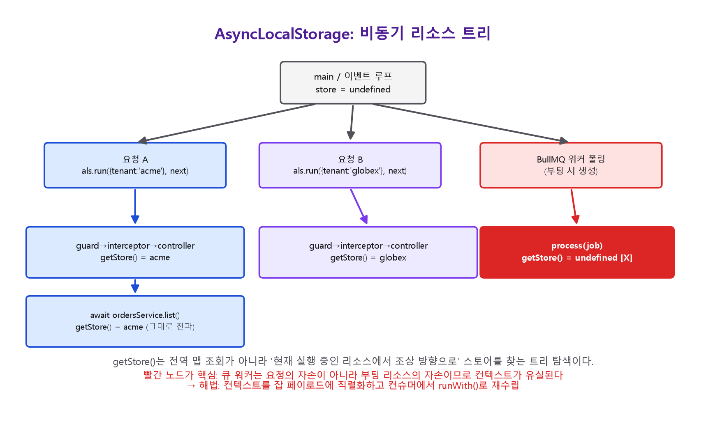
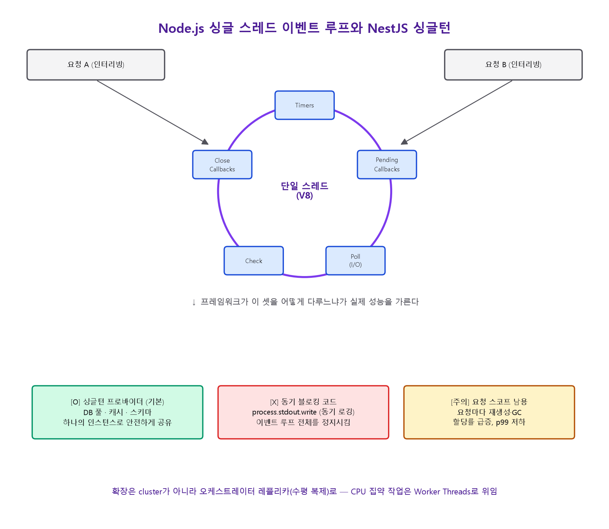

# NestJS 내부 구조 심층 분석 보고서

> 이 문서는 `nest.js-textbook-master` 폴더(59개 장, 부록 4개, 약 286만 자 규모의 NestJS 11.x 교과서)를 전수 분석하고, 여기에 Node.js/NestJS 프레임워크 자체의 공개된 내부 구현 지식을 더해 작성한 보고서입니다. 목적은 "어떻게 코드를 짜는가"가 아니라 **"NestJS라는 프레임워크가 내부적으로 어떤 원리로 구성되고 동작하는가"** 를 설명하는 것입니다. 다루는 축은 다섯 가지입니다: (1) 전체 아키텍처 구성, (2) 동작 원리(부팅·DI 해석·요청 파이프라인), (3) 메모리 관리(인스턴스 스코프와 생명주기), (4) 통신 구조(HTTP/마이크로서비스/WebSocket/GraphQL), (5) Node.js 런타임과의 결합 방식.

---

## 목차

1. [NestJS란 무엇인가 — 문제 정의와 3층 구조](#1)
2. [부팅의 원리: 데코레이터와 reflect-metadata](#2)
3. [모듈 그래프: 애플리케이션의 실체](#3)
4. [의존성 주입(DI) 컨테이너 내부](#4)
5. [요청 파이프라인과 ExecutionContext](#5)
6. [메모리 관리: 인스턴스 스코프와 생명주기](#6)
7. [AsyncLocalStorage와 Node.js 비동기 리소스 그래프](#7)
8. [애플리케이션 생명주기와 정상 종료](#8)
9. [통신 구조 I — HTTP와 플랫폼 어댑터](#9)
10. [통신 구조 II — 마이크로서비스(RPC) 레이어](#10)
11. [통신 구조 III — WebSocket 게이트웨이와 GraphQL](#11)
12. [Node.js와의 결합: 이벤트 루프, 싱글 스레드, 스케일링](#12)
13. [컴파일 파이프라인과 실행 비용](#13)
14. [종합: 요청 하나의 전 생애주기](#14)
15. [참고 문헌 매핑](#15)

---

<a id="1"></a>
## 1. NestJS란 무엇인가 — 문제 정의와 3층 구조

### 1.1 해결하려는 문제

NestJS는 성능이나 신규 기능을 위한 프레임워크가 아니라 **아키텍처**를 위한 프레임워크다. Node.js 생태계는 Express, Koa 같은 훌륭한 HTTP 라이브러리를 갖고 있지만, 정작 "코드를 어떻게 구조화해야 하는가"에 대해서는 아무 의견도 제시하지 않는다. 그 결과 대부분의 Node.js 백엔드는 초기에는 단순하지만 규모가 커지면서 계층 경계가 무너지고, 전역 변수와 미들웨어에 상태가 뒤섞이며, 테스트가 불가능해지는 패턴을 반복한다.

NestJS는 Angular의 설계 철학(모듈, 의존성 주입, 데코레이터 기반 메타데이터)을 서버사이드로 이식하여 이 문제에 대한 하나의 "정답"을 제공한다. 다만 브라우저 전용 개념(변경 감지, Zone.js, 템플릿)은 가져오지 않았다.

### 1.2 기계적으로 본 NestJS: 3개의 층

NestJS는 개념적으로 세 개의 독립적인 층이 쌓인 구조다.


여기서 의도적으로 빠진 것에 주목해야 한다: ORM, 템플릿 엔진, 인증 시스템, 큐 — 이런 것들은 전부 선택적 패키지(`@nestjs/typeorm`, `@nestjs/jwt`, `@nestjs/bullmq` 등)로 제공된다. NestJS는 **구조(structure)에 대해서는 강한 주장을 하고, 기술 스택(stack)에 대해서는 중립적**이다.

### 1.3 부팅 시퀀스 개요

`main.ts`의 `NestFactory.create(AppModule)` 호출부터 `app.listen()`까지 실제로 벌어지는 일은 다음과 같은 순서를 따른다.

1. **모듈 그래프 스캔** — `AppModule`부터 시작해 `@Module()` 메타데이터를 읽고 `imports`를 재귀적으로 따라가며 모든 모듈·컨트롤러·프로바이더·익스포트된 토큰을 등록한다. (순환 임포트는 여기서 드러나며 `forwardRef()`로 해소한다.)
2. **의존성 해석과 인스턴스화** — 각 프로바이더의 `design:paramtypes` 또는 명시적 `@Inject()` 토큰을 읽어, 해당 모듈 자신의 프로바이더 → 임포트된 모듈이 export한 것 → 전역(global) 모듈 순서로 토큰을 찾아 의존성 순서대로(바닥에서 위로) 인스턴스를 만든다.
3. **비동기 초기화 훅 실행** — `OnModuleInit` 구현체와 Promise를 반환하는 `useFactory` 프로바이더를 await한다.
4. **라우트 등록** — 모든 컨트롤러를 순회하며 각 핸들러의 경로·메서드 메타데이터를 읽어 어댑터(Express/Fastify)의 라우팅 API를 호출한다. 이 시점부터 구체적인 HTTP 라우트가 실제로 존재한다.
5. **애플리케이션 객체 반환** — 아직 리스닝은 시작되지 않는다.


`app.listen()`은 별도의 마지막 단계로서, `OnApplicationBootstrap` 훅을 실행하고 실제 소켓을 바인딩한다. "생성됨"과 "리스닝 중"의 간극은 설계상 의도된 것으로, 여기가 바로 `useGlobalPipes()`, `enableCors()`, `setGlobalPrefix()` 같은 전역 설정이 들어가는 자리이며, 테스트에서 `app.init()`을 호출해 포트 없이 그래프만 얻어내는 지점이다.

### 1.4 `NestFactory`의 세 가지 진입점

위에서 본 부팅 시퀀스(그래프 스캔 → 의존성 해석 → 초기화 훅 → 리스너 바인딩)는 `NestFactory`가 제공하는 정적 메서드 중 어느 것을 부르든 **공통으로 거치는 경로**다. 다만 마지막에 "무엇을 리스닝하는가"가 다르다.

| 메서드 | 마지막 단계 | 용도 |
|---|---|---|
| `NestFactory.create` `(AppModule)` | HTTP 어댑터가 포트를 리스닝 | 일반적인 REST/GraphQL API 서버 (§9~§11) |
| `NestFactory.createMicroservice` `(AppModule, options)` | 트랜스포터가 브로커/소켓을 리스닝 | HTTP가 아닌 진입점 전용 애플리케이션 (§10) |
| `NestFactory.createApplicationContext` `(AppModule)` | **아무것도 리스닝하지 않음** | CLI 도구, 마이그레이션 러너, 크론 워커 — DI 그래프만 필요한 경우 |

세 번째가 이 절에서 가장 간과되는 부분이다. `createApplicationContext()`는 모듈 그래프 스캔과 프로바이더 인스턴스화, 생명주기 훅까지 앞의 두 메서드와 동일하게 수행하지만 **HTTP 어댑터도 트랜스포터도 아예 생성하지 않는다.** 즉 NestJS의 진짜 핵심은 "웹 서버 프레임워크"가 아니라 그 아래 있는 DI 컨테이너 자체이며, HTTP는 그 컨테이너에 씌우는 여러 겉옷 중 하나일 뿐이라는 사실이 이 API에서 가장 분명하게 드러난다. `app.get(SomeService)`로 그래프 안의 아무 프로바이더나 꺼내 쓸 수 있으므로, 배치 스크립트나 CLI가 컨트롤러·서비스·리포지토리를 웹 서버 없이 그대로 재사용하는 표준적인 방법이 된다.

---

<a id="2"></a>
## 2. 부팅의 원리: 데코레이터와 reflect-metadata

NestJS의 모든 "마법"은 사실 하나의 언어 기능(데코레이터)과 하나의 작은 라이브러리(`reflect-metadata`)로 환원된다.

### 2.1 데코레이터 = 메타데이터를 클래스에 붙이는 함수

데코레이터는 클래스 정의 시점에 실행되는 함수로서, `Reflect.defineMetadata`를 통해 클래스에 사이드 테이블 형태의 데이터를 붙이는 일을 한다. 예를 들어 `@Controller('cats')`의 본질은 다음과 같다(단순화된 예):

```typescript
import 'reflect-metadata';

export function Controller(prefix = '/'): ClassDecorator {
  return (target: object) => Reflect.defineMetadata('path', prefix, target);
}
```

클래스 자체는 전혀 변형되지 않는다. 베이스 클래스도, 인터페이스 구현도, 등록 호출도 없다 — 단지 "이 클래스는 `cats` 접두사를 원한다"는 사이드 테이블 항목이 생길 뿐이다. 부팅 시점에 NestJS는 모듈 그래프를 순회하며 이 항목들을 읽어 라우트를 만든다.

### 2.2 생성자 파라미터 타입의 런타임 기록: `design:paramtypes`

더 미묘하고 중요한 두 번째 활용은 "생성자가 무엇을 원하는지"를 NestJS가 아는 방법이다. `tsconfig.json`에 `emitDecoratorMetadata: true`가 설정되어 있으면, TypeScript 컴파일러는 **적어도 하나의 데코레이터가 붙은 클래스에 한해** 생성자 파라미터의 런타임 타입을 `design:paramtypes`라는 키 아래 방출한다. 즉 `constructor(private readonly catsService: CatsService)`를 가진 `@Injectable()` 클래스는 컴파일 후 `[CatsService]`라는 배열이 메타데이터로 남는다. NestJS는 이 배열을 읽어 무엇을 주입할지 결정한다.

이것이 프레임워크에서 가장 오해받는 규칙의 근원이다: **`@Injectable()`은 등록이 아니라 마커(marker)다.** 이 데코레이터가 하는 일은 (1) 컴파일러가 파라미터 메타데이터를 방출하도록 강제하고 (2) 클래스를 "주입 가능"으로 표시하는 것뿐이다. 실제 등록은 모듈의 `providers` 배열이 담당한다. 여기서 두 가지 중요한 결과가 나온다.

- **인터페이스는 타입으로 주입할 수 없다.** `constructor(private repo: CatRepository)`는 `CatRepository`가 클래스일 때만 작동한다. 인터페이스는 런타임에 소거되므로 `design:paramtypes`에는 `Object`가 기록된다. 문자열/심볼 토큰과 `@Inject()`를 쓰거나, `abstract class`를 사용해야 런타임까지 살아남는다.
- **의존성을 가진 클래스에서 `@Injectable()`을 지우면 주입이 깨진다.** 파라미터 메타데이터가 방출되지 않기 때문이다. 생성자가 비어 있으면 클래스는 여전히 "작동하는 것처럼" 보이므로 버그가 숨는다.

`tsconfig.json`에는 `"experimentalDecorators": true`와 `"emitDecoratorMetadata": true`가 함께 필요하다. 이는 TypeScript 5.0의 TC39 Stage 3 표준 데코레이터와는 **호환되지 않는 레거시(experimental) 데코레이터**이며, 표준 데코레이터는 `emitDecoratorMetadata`를 지원하지 않으므로 NestJS 11.x 기준으로는 반드시 experimental 방식을 유지해야 한다.

### 2.3 토큰(Token)의 네 가지 형태

컨테이너가 조회하는 키를 토큰이라 부른다.

| 토큰 종류 | 예시 | 주입 방법 | 언제 쓰는가 |
|---|---|---|---|
| 클래스 | `CatsService` | 평범한 생성자 타입 | 클래스 자체가 계약인 일반적인 경우 |
| 문자열 | `'CONNECTION'` | `@Inject('CONNECTION')` | 소규모, 충돌 위험 존재 |
| `Symbol` | `Symbol('LOGGER')` | `@Inject(LOGGER)` | 라이브러리/대규모 앱 — 런타임 유일성 보장 |
| 추상 클래스 | `abstract class LoggerService` | 평범한 생성자 타입 | 계약과 런타임 토큰을 하나로 |

인터페이스가 이 목록에 없는 이유는 위에서 설명한 대로 컴파일 시점에 완전히 소거되기 때문이다.

---

<a id="3"></a>
## 3. 모듈 그래프: 애플리케이션의 실체

### 3.1 애플리케이션 = 루트 모듈에서 도달 가능한 그래프

NestJS에서 "애플리케이션"이란 파일 시스템이 아니라 **루트 모듈(`AppModule`)에서 `imports`를 따라가며 도달 가능한 그래프**를 의미한다. 어떤 모듈도 임포트하지 않는 파일은, 아무리 `export`가 붙어 있어도 존재하지 않는 것과 마찬가지다. 이것이 "왜 내 프로바이더가 undefined인가"라는 질문 대부분의 답이다.

### 3.2 `@Module()`의 네 개 키와 그 방향성

```
providers   → 이 모듈이 "생성"하는 것 (인스턴스화)
controllers → 이 모듈이 "생성"하고 HTTP 라우트로 등록하는 것
imports     → 다른 모듈의 export를 "빌려오는" 것 (모듈 단위, 프로바이더 단위 아님)
exports     → 이 모듈이 다른 모듈에게 "빌려주는" 것 (임포트한 쪽에만 영향)
```

세 가지 규칙이 이로부터 도출된다.

1. **`providers`는 생성이지 "접근 허용"이 아니다.** 이미 존재하는 클래스를 두 번째 모듈의 `providers`에 추가해도 기존 인스턴스를 재사용하지 않는다 — 새 인스턴스를 만든다.
2. **`imports`는 모듈만 받는다.** `imports: [PaymentsService]`는 불가능하다. 가시성의 단위는 모듈이다.
3. **`exports`는 프로바이더 또는 모듈을 받으며, 오직 다른 모듈에만 영향을 준다.** 자기 자신의 가시성에는 영향이 없다.

### 3.3 캡슐화(Encapsulation) 규칙

> **한 모듈은 (a) 자신이 직접 선언한 프로바이더와 (b) 자신이 임포트한 모듈이 export한 프로바이더만 주입할 수 있다.**

가시성은 기본적으로 전이(transitive)되지 않는다. `A`가 `B`를, `B`가 `C`를 임포트해도 `B`가 `C`를 재수출(re-export)하지 않으면 `A`는 `C`의 프로바이더를 볼 수 없다. 이 경계는 우연이 아니라 대규모 코드베이스에 "여기부터가 결제 서브시스템의 공개 API다"라는 이음매(seam)를 만들어주기 위한 설계다.


### 3.4 공유 모듈과 단일 인스턴스 규칙

모든 NestJS 모듈은 자동으로 공유 가능(shareable)하다 — "공유 모듈"이라는 별도 개념은 없으며, export하는 모듈과 그것을 import하는 여러 모듈이 있을 뿐이다. `CatsModule`을 세 모듈이 import하면 **세 모듈 모두 동일한 `CatsService` 인스턴스**를 받는다. 프로바이더는 기본적으로 모듈 컨텍스트당(엄밀히는 애플리케이션 전체에 대해) 싱글턴이며, 그 인스턴스를 소유하는 컨텍스트는 원래 선언한 모듈이다.

같은 클래스를 두 모듈의 `providers`에 각각 등록하는 "중복 등록" 실수는 컴파일되고 부팅도 되지만 프로덕션에서 세 가지 방식으로 실패한다: 상태 분기(인메모리 캐시·카운터·타이머가 두 갈래로 나뉨), 자원 중복(DB 풀이나 AMQP 채널이 두 개가 되어 연결 한도가 절반에서 소진됨), 생명주기 훅 중복 실행(같은 큐를 두 번 구독해 메시지를 두 번 처리).

### 3.5 전역(`@Global()`) 모듈

`@Global()`은 `imports` 없이도 export된 것을 어디서나 보이게 만든다. 다만 그 모듈 자체는 루트/코어 모듈에서 **정확히 한 번** 임포트되어야 한다 — `@Global()`은 그 순간 export 목록을 전역 프로바이더 집합에 등록할 뿐, 모듈이 스스로를 임포트하게 만드는 것은 아니다.

비용은 명확하다: 의존성이 보이지 않게 되고(모듈 헤더만 봐서는 무엇이 필요한지 알 수 없음), 테스트가 무거워지며(전역 의존성은 `Test.createTestingModule`에서 재등록해야 함), 충돌 해결이 어려워진다(같은 토큰을 export하는 전역 모듈 두 개는 해석 순서 문제가 됨). 로거·설정 서비스처럼 프로세스당 구현체가 정확히 하나뿐인 인프라에만 사용해야 한다.

### 3.6 동적 모듈(Dynamic Module)

정적 메타데이터가 아니라 정적 메서드가 계산해내는 모듈이다 (`forRoot()`, `forFeature()`, `registerAsync()` 등). 동적 모듈이 반환하는 메타데이터는 `@Module()` 데코레이터가 선언한 것을 **덮어쓰지 않고 확장**한다. 재수출할 때는 `forRoot()` 호출 없이 클래스 자체만 `exports`에 나열해야 한다.

### 3.7 모듈 그래프는 DAG여야 한다

`imports` 엣지는 방향 그래프를 이루며, 부팅 시 NestJS는 루트에서부터 이를 순회하면서 논리적으로는 **비순환(acyclic)** 을 기대한다. 순환이 생기면 ES 모듈 평가 순서 문제로 인해 한쪽 클래스 참조가 `undefined`가 되어 `Nest cannot create the X instance. The module at index [n] of the Y "imports" array is undefined.` 같은 오류가 난다. `forwardRef()`는 지연 평가로 이를 임시로 우회하지만, 근본 해법은 공유 개념을 제3의 모듈로 추출하는 것이다 — 예를 들어 `UsersModule`과 `OrdersModule`이 서로를 참조한다면, 그 둘이 공통으로 의존하는 개념(가령 `AccountsModule`)이 아직 분리되지 않은 것일 뿐이다.

---

<a id="4"></a>
## 4. 의존성 주입(DI) 컨테이너 내부

### 4.1 세 단계: 선언 → 요청 → 등록

모든 의존성은 다음 세 단계를 거치며, 각각은 서로 다른 파일에 존재한다.

1. **선언(Declare)** — `@Injectable()`이 클래스를 컨테이너가 관리 가능한 대상으로 표시한다.
2. **요청(Request)** — 소비자가 생성자를 통해 어떤 토큰을 원한다고 선언한다.
3. **등록(Register)** — 모듈이 그 토큰을 구체적인 레시피(recipe)와 연결한다.

컨테이너가 `CatsController`를 인스턴스화할 때, 생성자의 토큰 목록을 읽어 모듈 레지스트리에서 `CatsService`의 등록을 찾고, 기본(싱글턴) 스코프라면 캐시된 인스턴스를 반환하거나 새로 만들어 캐시한다. 이 해석은 **전이적**이다 — `CatsService`가 자신의 의존성을 갖고 있다면 그것들이 먼저 해석되고, 그 의존성의 의존성이 또 먼저 해석된다. 컨테이너가 그래프를 만들어 바닥에서 위로 인스턴스화하므로 개발자가 초기화 순서를 손으로 관리할 필요가 없다. 그리고 이 모든 과정은 기본 스코프 프로바이더에 한해 **부팅 시 단 한 번** 일어난다 — 즉 배선 오류는 새벽 3시의 500 에러가 아니라 시작 시점의 크래시가 된다.

### 4.2 표준 프로바이더는 축약형이다

```typescript
providers: [CatsService]
// 는 정확히 다음과 같다
providers: [{ provide: CatsService, useClass: CatsService }]
```

토큰(`provide`)과 레시피(`use*`)를 분리하는 순간 나머지 문법 전체가 이해된다. 레시피는 네 가지다.

| 레시피 | 동작 | 특징 |
|---|---|---|
| `useValue` | 이미 존재하는 값을 그대로 사용 | 의존성 해석을 완전히 건너뜀. 상수, 서드파티 클라이언트, 테스트 목(mock)에 적합 |
| `useClass` | 지정한 클래스의 의존성을 해석한 뒤 `new` | 토큰과 구현 클래스를 분리 — 환경별 구현 선택에 유용 |
| `useFactory` | 함수를 실행해 반환값을 사용 | `inject` 배열은 **위치 기반**이며 타입 체크 안 됨. `async` 팩토리는 부팅 전체를 지연시킴 |
| `useExisting` | 다른 토큰의 인스턴스를 그대로 별칭(alias) | 복사가 아니라 별칭 — 캐시 저장 단계를 건너뛰고 동일 인스턴스를 반환 |

### 4.3 해석 알고리즘 (개념도)


### 4.4 비동기 프로바이더와 부팅 차단

`useFactory`가 `async` 함수면, NestJS는 그 Promise가 처리(resolve/reject)될 때까지 **해당 토큰에 의존하는 어떤 것도 인스턴스화하지 않는다.** 이는 "DB 연결이 완료되기 전에는 트래픽을 받지 않는다"는 요구를 정확히 충족시키지만, 대가도 있다: 비동기 팩토리 하나가 부팅 전체를 지연시키고, 타임아웃이 없으면 프로세스가 "시작된 것처럼 보이지만 영원히 리스닝하지 않는" 상태가 될 수 있다. 이런 이유로 비동기 팩토리에는 반드시 타임아웃을 걸어야 하며, 이것을 일반적인 "시작 시 무언가 실행" 훅으로 오용해서는 안 된다(그 용도는 `onModuleInit`/`onApplicationBootstrap`이다).

### 4.5 `NEST_DEBUG`와 해석 가시성

환경 변수 `NEST_DEBUG=true`를 설정하면 부팅 중 토큰별 해석 로그(어떤 토큰이, 어떤 클래스에 의해, 어떤 모듈에서 발견되었는지)가 출력된다. DI 문제를 디버깅하는 가장 효과적인 도구이며, `@nestjs/devtools-integration`은 이 그래프를 브라우저에서 시각화해준다.

### 4.6 런타임에 컨테이너 자체에 접근하기: `ModuleRef`, `DiscoveryService`, `LazyModuleLoader`

지금까지 다룬 해석은 전부 "생성자가 선언하면 컨테이너가 조립해 준다"는 선언적 경로였다. 그러나 컨테이너를 코드에서 직접 다뤄야 하는 상황들이 있고, NestJS는 크게 세 갈래 — **이미 아는 토큰을 꺼내기(`ModuleRef`), 모르는 것을 메타데이터로 찾아내기(`DiscoveryService`), 생성 자체를 미루기(`LazyModuleLoader`)** — 로 전용 API를 제공한다.

- **`ModuleRef.get(token)`** — 이미 인스턴스화된 프로바이더를 동기적으로 조회한다. 기본은 **현재 모듈 컨텍스트로 제한**되며(`{ strict: false }`로 전체 컨테이너까지 넓힐 수 있다), 요청/트랜지언트 스코프 프로바이더에는 쓸 수 없다(단일 인스턴스가 없으므로).
- **`ModuleRef.resolve(token, contextId?)`** — 스코프 프로바이더용. 조회가 아니라 **생성**이므로 `Promise`를 반환하며, 호출마다 새 DI 서브트리를 만든다. `ContextIdFactory.create()`로 만든 컨텍스트 ID를 여러 `resolve()` 호출에 공유하면 같은 서브트리(예: 같은 요청)로 묶을 수 있고, `registerRequestByContextId()`로 그 서브트리에 가짜 `REQUEST` 객체를 등록하면 **큐 컨슈머·크론 잡·CLI 명령**처럼 HTTP 요청이 없는 진입점에서도 요청 스코프 프로바이더를 그대로 쓸 수 있다.
- **`ModuleRef.create(SomeClass)`** — 프로바이더로 등록조차 되지 않은 클래스에 생성자 주입을 적용해 인스턴스를 만든다. 다만 컨테이너가 그 인스턴스를 관리하지 않으므로 생명주기 훅도, 자동 정리도 없다.
- **`DiscoveryService` + `MetadataScanner`** — "이 토큰을 달라"가 아니라 "이런 메타데이터가 붙은 것 전부를 달라"에 답한다. `DiscoveryModule`을 임포트하면 그래프 전체의 프로바이더/컨트롤러를 열거할 수 있고(`getProviders()`, `getControllers()`), `MetadataScanner.getAllMethodNames(prototype)`으로 각 클래스의 메서드까지 훑을 수 있다. **`@nestjs/schedule`의 `@Cron()`/`@Interval()`/`@Timeout()`이 실제로 이 두 API로 동작한다는 것을 소스코드(`schedule.explorer.ts`)로 직접 확인했다** — 메서드 데코레이터가 메타데이터를 남기고, `onApplicationBootstrap` 시점에 딱 한 번 전체 그래프를 스캔해 레지스트리(맵)를 만들고, 이후에는 그 레지스트리만 조회한다. (`@nestjs/cqrs`의 `@CommandHandler()`/`@EventsHandler()`도 개념적으로 동일한 "부팅 시 1회 스캔 → 레지스트리 조회" 패턴을 쓰지만, 구현은 `DiscoveryService`가 아니라 더 저수준인 `ModulesContainer`를 `ExplorerService`에서 직접 순회하는 방식이다 — 검증 과정에서 확인한 차이이며, 최초 초안은 두 패키지가 동일한 API를 쓴다고 잘못 서술했었다.)
- **`LazyModuleLoader`** — 부팅 시 전부 인스턴스화하는 기본 동작을 미루는 장치다. `await lazyModuleLoader.load(() => SomeModule)`은 처음 호출될 때만 그 모듈을 인스턴스화하고 이후로는 캐시된 `ModuleRef`를 재사용한다. 서버리스 콜드 스타트처럼 "이 호출은 15개 모듈 중 1개만 필요하다"는 상황에 유효하다. 다만 **컨트롤러·게이트웨이·리졸버·전역 인핸서(`APP_GUARD` 등)는 지연 로드할 수 없고, 무엇보다 생명주기 훅이 전혀 호출되지 않는다** — 라우트 등록과 스키마 생성이 부팅 시 한 번만 일어나는 고정 이벤트이기 때문이다.

이 API들은 모두 강력하지만 같은 대가를 공유한다: `ModuleRef.get()`을 쓰는 순간 그 의존성은 생성자 시그니처에서 사라지고, 컴파일러도 테스트도 더 이상 그것을 검증해 주지 않는다 — 사실상 **서비스 로케이터(service locator)** 패턴이며, DI가 원래 없애려던 바로 그 문제다. 그래서 실무 규칙은 명확하다: 런타임에 선택되는 구현체, 비-HTTP 진입점의 스코프 프로바이더 접근, 프레임워크급 플러그인 시스템처럼 **정당한 이유가 있는 인프라 코드 한 곳에만** 이 API들을 격리하고, 도메인 로직과 컨트롤러는 계속 선언적 생성자 주입만 쓰는 것이다.

---

<a id="5"></a>
## 5. 요청 파이프라인과 ExecutionContext

### 5.1 고정된 순서의 파이프라인

NestJS의 요청 처리는 임의의 콜백 배열이 아니라 **이름이 붙은 고정 시퀀스**다.


이 시퀀스는 HTTP, RPC(마이크로서비스), WebSocket, GraphQL 모두에서 **동일하게 재사용**된다. 다른 것은 "인자의 모양(shape)"뿐이다.

### 5.2 `ArgumentsHost`: 핸들러 인자 배열의 추상화

`ArgumentsHost`는 Nest가 핸들러에 전달할(또는 전달한) 인자 배열을 감싼 객체다. 배열의 모양은 전송 계층마다 다르다.

| 컨텍스트 타입 | 인자 배열 | 생성 주체 |
|---|---|---|
| `'http'` (Express) | `[req, res, next]` | `@nestjs/platform-express` |
| `'http'` (Fastify) | `[request, reply, next]` | `@nestjs/platform-fastify` |
| `'rpc'` | `[data, context]` | `@nestjs/microservices` |
| `'ws'` | `[client, data]` | `@nestjs/websockets` |
| `'graphql'` | `[root, args, context, info]` | `@nestjs/graphql` |

`getType()`으로 현재 컨텍스트가 무엇인지 판별한 뒤, `switchToHttp()`/`switchToRpc()`/`switchToWs()`로 전송 계층에 맞는 접근자를 얻는다. **중요한 함정**: 이 스위처들은 검증하지 않는다. 잘못된 컨텍스트에서 `switchToHttp()`를 호출해도 예외를 던지지 않고 배열의 0번, 1번 인덱스를 그럴듯하게 반환하며, 실패는 몇 줄 뒤 `undefined is not an object` 형태로 나타난다. 따라서 반드시 `getType()`으로 먼저 분기해야 한다. GraphQL은 HTTP 위에서 동작하므로 기본 타입 유니언(`'http' | 'rpc' | 'ws'`)에 포함되지 않으며, `getType<GqlContextType>()`으로 타입을 넓혀야 하고 `'graphql'` 분기를 `'http'`보다 먼저 검사해야 한다.


### 5.3 `ExecutionContext`: "누구의 핸들러인가"

`ExecutionContext`는 `ArgumentsHost`를 확장해 `getClass()`(호출될 클래스, 인스턴스 아님)와 `getHandler()`(호출될 메서드 참조)를 추가한다. 이 두 참조는 로깅에도 유용하지만, 진짜 목적은 **메타데이터 조회 키**로 쓰이는 것이다 — 데코레이터가 메서드/클래스에 붙인 메타데이터를 `Reflector`가 읽어낼 때 이 키들을 사용한다.

### 5.4 `Reflector`: 선언적 메타데이터를 런타임에 읽기

`Reflector.createDecorator<T>()`로 타입 안전한 커스텀 데코레이터를 만들고, 가드/인터셉터에서 `reflector.getAllAndOverride(Decorator, [context.getHandler(), context.getClass()])` 형태로 읽는다. `getAllAndOverride`는 배열에서 **처음 정의된** 값을 반환하므로 `[handler, class]` 순서일 때 메서드 레벨 데코레이터가 클래스 레벨을 덮어쓴다. `getAllAndMerge`는 값을 병합한다.

### 5.5 플랫폼 어댑터: Express/Fastify 추상화

NestJS는 HTTP 서버를 구현하지 않고 "구동"한다. `AbstractHttpAdapter`를 두 어댑터(`ExpressAdapter`, `FastifyAdapter`)가 확장하며, Nest 코어는 라우트 등록·응답 전송·리다이렉트 등을 이 추상 인터페이스로만 수행한다. `HttpAdapterHost`는 전역 프로바이더로서 현재 살아있는 어댑터를 담고 있으며, 라이브러리 코드는 `httpAdapter.reply(response, body, status)`처럼 플랫폼 중립적인 API로 응답해야 이식성이 보장된다. `httpAdapter.getInstance()`로 원본 Express/Fastify 인스턴스를 얻을 수 있지만, 이는 "이식 가능한 영역을 벗어난다"는 명시적 인정이다.

플랫폼 이식성의 일반 규칙: **Nest가 추상화한 것은 이식되고, Nest를 우회해 직접 만진 것은 이식되지 않는다.** `@Res()`, `res.status().json()`, Express 전용 미들웨어 시그니처 하나하나가 향후 플랫폼 마이그레이션 비용의 항목이 된다.

---

<a id="6"></a>
## 6. 메모리 관리: 인스턴스 스코프와 생명주기

이 절이 "메모리 관리"라는 질문에 대한 핵심 답변이다. NestJS는 가비지 컬렉터를 직접 제어하지 않는다(V8이 담당) — NestJS가 실제로 관리하는 것은 **얼마나 많은 인스턴스가 언제 생성되고 언제 참조를 잃어 GC 대상이 되는가**이다. 이는 전적으로 프로바이더 스코프(scope) 설정에 달려 있다.

### 6.1 왜 싱글턴이 기본값이고 안전한가

Java/C#과 달리 Node.js는 요청당 스레드 모델이 아니다. 하나의 스레드가 이벤트 루프를 통해 여러 요청을 인터리빙 처리한다. 스레드 로컬 저장소로 새어나갈 위험이 없고, 요청별 스택도 없다. 따라서 공유 커넥션 풀, 컴파일된 스키마, 예열된 LRU 캐시 같은 것은 프로세스 생명주기 동안 하나의 인스턴스로 두는 것이 정확하며 비용 효율적이다. NestJS는 기본적으로 **모든 프로바이더를 부팅 시 정확히 한 번 생성하여 영구히 재사용**한다.

싱글턴이 위험해지는 경우는 딱 하나: **인스턴스 필드에 요청별 데이터를 저장하고 그 사이에 `await`가 끼어드는 경우**다. 해법은 스코프를 바꾸는 것이 아니라 애초에 인스턴스 필드에 요청 데이터를 두지 않고 인자로 전달(혹은 후술할 AsyncLocalStorage 사용)하는 것이다.

### 6.2 세 가지 스코프

```typescript
export enum Scope {
  DEFAULT,    // 싱글턴 — 앱 전체에 1개
  TRANSIENT,  // 주입 지점마다 별도 인스턴스
  REQUEST,    // 요청(또는 DI 서브트리)마다 1개
}
```

| | `DEFAULT` | `REQUEST` | `TRANSIENT` |
|---|---|---|---|
| 생성 시점 | 부팅 시 | 요청 처리 중 지연 생성 | 각 소비자가 주입할 때 |
| 생성 개수 | 등록당 1개* | 요청(서브트리)당 1개 | 소비자당 1개(그러나 프로세스 생명 내내 유지) |
| `app.get()`으로 접근 | 가능 | 불가(`resolve()` 필요) | 불가(`resolve()` 필요) |
| 소비자에게 전파(버블링) | — | O | X |
| 생명주기 훅 | 1회 | 인스턴스마다(=요청마다) | 인스턴스마다(=부팅 시) |

\* "등록당 1개"라고 쓴 이유는 §3.4에서 본 것과 정확히 같은 함정 때문이다: `DEFAULT` 스코프는 "애플리케이션에 정확히 하나"가 아니라 **모듈의 `providers` 배열에 등록된 지점마다 하나**다. 같은 클래스를 두 모듈에 각각 등록하면 두 개의 독립된 싱글턴이 생긴다 — export/import로 하나의 등록을 공유해야 진짜 애플리케이션 전역 싱글턴이 된다.

**`TRANSIENT`는 전파되지 않는다.** 이름과 달리 "시간이 지나면 재생성"이 아니라 "공유되지 않음"을 뜻한다. 싱글턴에 주입된 트랜지언트 프로바이더는 부팅 시 한 번 생성되어 프로세스 내내 살아있으며, 단지 다른 소비자와 공유되지 않을 뿐이다. 진짜 요청별 수명이 필요하면 `REQUEST`를 써야 한다.

### 6.3 스코프 버블링 — 가장 비용이 큰 실수

> **규칙: 클래스의 의존성 그래프 안에 요청 스코프 프로바이더가 하나라도 있으면, 그 클래스도 요청 스코프가 된다. 이는 컨트롤러까지 전이적으로 올라간다.**

예를 들어 `CatsController ← CatsService ← CatsRepository` 체인에서 `CatsRepository`만 요청 스코프로 만들어도 `CatsService`와 `CatsController`가 모두 요청 스코프로 전환된다. 이 규칙에는 대안이 없다 — 소비자는 자신의 의존성보다 오래 살 수 없기 때문이다(그렇지 않으면 요청 #1의 서비스 인스턴스를 요청 #2가 재사용하는, 요청 스코프가 막으려던 바로 그 상태 누수가 생긴다).


전파는 **눈에 보이지 않는다.** 로거 하나를 요청 스코프로 만들었는데 그것이 애플리케이션 전체의 기반 서비스에 주입되어 있다면, 단 한 줄의 코드 변경이 애플리케이션 전체를 요청마다 재생성되도록 바꿔버릴 수 있다. 실제 사례: 팀이 요청 스코프 로깅을 추가한 지 3주 후 p99 지연이 세 배가 되고 할당률이 한 자릿수 증가했는데, 원인은 200개 이상의 프로바이더가 조용히 요청 스코프로 전환된 것이었다.

**비용은 퍼센트가 아니라 산수다**: `전환된 프로바이더 수 × (할당 비용 + 생성자 작업 비용)`. 공식 문서의 "약 5% 지연 증가"는 스코프 프로바이더가 그래프 말단(leaf)에 있을 때의 이야기일 뿐이다.

**탐지법**: `app.get(Token)`은 스코프 프로바이더에 대해 명시적인 오류(`X is marked as a scoped provider... use "resolve()" instead`)를 던진다. 이를 회귀 테스트로 만들어두면(싱글턴으로 남아야 하는 모든 컨트롤러/서비스에 대해 `app.get()`이 던지지 않는지 확인) 성능 저하가 조용히 프로덕션에 도달하기 전에 CI에서 빌드가 깨진다.

### 6.4 요청 스코프의 메커니즘

부팅 시 Nest의 인스턴스 로더는 각 래퍼(wrapper)의 유효 스코프를 의존성을 따라가며 계산한다. `DEFAULT` 스코프 프로바이더는 즉시 생성되어 캐시된다. `REQUEST` 스코프 프로바이더는 **부팅 시 전혀 생성되지 않고** 메타데이터만 준비된다. 요청이 도착하면 라우터가 `ContextId`(불투명한 식별자)를 만들고, 그 요청에 필요한 모든 스코프 인스턴스가 생성되어 래퍼의 컨텍스트별 인스턴스 맵에 그 `ContextId`를 키로 저장된다. 요청이 끝나면 Nest가 그 항목을 제거하고 인스턴스는 가비지가 된다.

이로부터 관찰 가능한 두 가지 결과: (1) 요청 스코프 프로바이더의 생성자 오류는 부팅이 아니라 **첫 요청**에서 터진다. (2) `onModuleInit`은 요청마다 실행되며 더 이상 "시작 훅"이 아니다.

**메모리 누수의 반대 방향 패턴도 존재한다.** 지금까지는 "스코프가 위로 전파되어 인스턴스가 과다 생성되는" 문제를 다뤘지만, 정반대로 **싱글턴이 요청 스코프 인스턴스에 대한 참조를 붙잡아 두는** 경우도 실무에서 자주 나타난다 — 예를 들어 싱글턴 캐시 서비스의 배열이나 `Map`에 요청 스코프 객체(혹은 그것이 감싼 `REQUEST`/`Socket`/대용량 버퍼)를 `push`하고 제거하지 않는 경우다. 요청이 끝나 `ContextId` 항목이 지워져도, 싱글턴이 여전히 그 인스턴스를 참조하고 있으면 V8의 GC는 그것을 회수할 수 없다 — 스코프 시스템은 "누가 참조를 쥐고 있는가"까지는 강제하지 않기 때문이다. 즉 요청 스코프는 "자동으로 짧게 산다"는 보장이 아니라 "**기본 참조 경로**가 요청과 함께 끝난다"는 보장일 뿐이며, 코드가 별도의 참조 경로(싱글턴 필드, 전역 배열, 이벤트 리스너 클로저)를 새로 만들면 그 보장은 깨진다.

### 6.5 `durable` 프로바이더 — 테넌트 단위 서브트리

요청마다가 아니라 **테넌트**마다 변하는 것이 있다면, 요청 스코프로 매 요청 재생성하는 것은 낭비다. `durable: true`와 사용자 정의 `ContextIdStrategy`를 결합하면, 요청이 아니라 전략이 선택한 키(예: 테넌트 ID)에 따라 `ContextId`가 재사용되는 서브트리를 만들 수 있다. 테넌트 10개, 동시 요청 3만 개라면 서브트리도 정확히 10개만 존재한다. 다만 이 전략의 분류 키(classification key)는 반드시 **성기고(coarse) 안정적**이어야 하며, 테넌트 맵은 크기 제한(LRU 등)이 있어야 한다 — 그렇지 않으면 무한히 자라는 메모리 누수가 된다.

### 6.6 `AsyncLocalStorage`가 대체로 더 나은 이유

요청 스코프로 도피하게 만드는 요구사항의 대부분은 사실 "객체의 수명 관리"가 아니라 "값의 전달"이다(상관관계 ID, 테넌트, 사용자 정보를 12단계 아래 함수까지 매개변수로 꿰지 않고 전달하고 싶다). 이 경우 Node.js 내장 `AsyncLocalStorage`(§7 참고)가 모든 프로바이더를 싱글턴으로 유지한 채 "데이터만 앰비언트(ambient)하게" 만들어준다.

| | 요청 스코프 | `AsyncLocalStorage` |
|---|---|---|
| 요청당 할당 | 전환된 프로바이더마다 1개 | 스토어 객체 1개 |
| 버블링 위험 | 높음(비가시적, 전이적) | 없음 |
| 게이트웨이/크론/큐 컨슈머 | `ModuleRef.resolve`로만 가능 | `run()`으로 진입하면 가능 |
| 실패 모드 | 조용한 전역 성능 붕괴 | 시끄럽고 국소적인 `undefined` |

### 6.7 결정 표 (요약)

| 상황 | 선택 |
|---|---|
| 기본값 | `Scope.DEFAULT` |
| 상관관계 ID, 사용자, 테넌트를 깊은 호출 스택에서 사용 | `AsyncLocalStorage` |
| GraphQL DataLoader의 요청별 캐싱 | `Scope.REQUEST` |
| 요청 전체에 걸쳐야 하는 트랜잭션 핸들 | `Scope.REQUEST` 또는 ALS |
| 테넌트별 커넥션(테넌트 수 적음) | `Scope.REQUEST` + `durable: true` |
| 테넌트별 커넥션(테넌트 수 많음) | 테넌트 키로 관리되는 싱글턴 풀 맵(LRU 축출) |
| 소비자 클래스명이 필요한 로거 | `Scope.TRANSIENT` + `INQUIRER` |
| 소켓·스케줄·Passport 전략을 담는 것 | `Scope.DEFAULT` — 협상 불가 |

---

<a id="7"></a>
## 7. AsyncLocalStorage와 Node.js 비동기 리소스 그래프

이 절은 "메모리 관리"와 "Node.js와의 결합"이 만나는 지점이다.

### 7.1 오해: "스레드 로컬 저장소 같은 것"이 아니다

`AsyncLocalStorage`를 "키로 조회하는 전역 맵"으로 이해하면 틀린다. 실제 메커니즘은 **구조적**이다. Node.js는 모든 비동기 연산(타이머, 소켓, Promise, `fs` 요청, `nextTick` 콜백)을 **비동기 리소스(async resource)** 로 추적하며, 리소스가 생성될 때 그 시점에 실행 중이던 리소스(트리거)를 기록해 트리를 계속 재구성한다.

`AsyncLocalStorage`는 이 트리의 한 노드에 스토어를 붙인다. `getStore()`는 전역 맵을 조회하는 것이 아니라 "현재 실행 중인 비동기 리소스, 혹은 스토어를 가진 가장 가까운 조상은 무엇인가"를 질의한다. 요청 내부에서 시작된 모든 비동기 연산은 그 요청 리소스의 자손이므로 요청의 스토어를 보게 되고, 형제 요청의 리소스는 다른 서브트리에 있으므로 자동으로 격리된다.



### 7.2 `run()` vs `enterWith()` — 왜 하나만 안전한가

```typescript
als.run(store, () => { /* 이 콜백과 그 서브트리 전체가 store를 봄 */ });
als.enterWith(store); // 종료 지점이 없음 — 위험
```

`run()`은 스토어의 수명을 콜백의 서브트리로 **한정**한다. `enterWith()`는 현재 실행 중인 리소스의 컨텍스트를 그 자리에서 변경할 뿐 끝이 없다. HTTP keep-alive 연결이나 리소스를 재사용하는 라이브러리에서, `enterWith()`로 설정한 요청 A의 스토어가 같은 리소스에서 처리되는 요청 B에서도 여전히 보일 수 있다 — 이는 이론적 경쟁 상태가 아니라 **ALS 기반 멀티테넌시가 데이터를 유출하는 가장 흔한 방식**이다. 기본은 항상 `run()`이다.

### 7.3 컨텍스트가 유실되는 지점들

이 메커니즘을 이해하면 "컨텍스트가 사라지는" 상황이 예외가 아니라 트리 구조의 당연한 귀결임을 알 수 있다.

- **큐 워커(BullMQ 등)**: 워커의 폴링 루프는 부팅 시 생성된 리소스다. 처리되는 잡들은 그 리소스의 자손이지 요청의 자손이 아니다 — `getStore()`는 정확하게 `undefined`를 반환한다. 해법은 트릭이 아니라 프로토콜이다: **컨텍스트를 잡 페이로드에 직렬화하고, 컨슈머가 `runWith()`로 재수립**해야 한다.
- **이벤트 이미터**: 동기 `emit()`은 리스너를 인라인으로 호출하므로 컨텍스트가 보이지만, 무언가 지연되는 순간(다른 리소스에 등록된 리스너, 타이머로 예약된 작업) 끊긴다. 컨텍스트를 이벤트 페이로드에 명시적으로 실어야 한다.
- **커넥션 풀·서드파티 콜백**: 부팅 시 생성된 풀에서 커넥션을 빌려 콜백을 호출하는 클라이언트는 요청 리소스가 아니라 풀 리소스에서 콜백을 실행한다. `AsyncLocalStorage.bind()`/`snapshot()`(Node 17.2+)으로 경계에서 한 번만 감싸 해결한다.
- **먼저 생성된 프로미스의 재사용**: 메모이즈된 Promise는 그것이 최초로 생성된 컨텍스트에 묶인다. 컨텍스트 의존적인 값을 캐시하려면 값 자체를 캐시하고 컨텍스트 값으로 키를 잡아야 한다.
- **프로세스 경계**: 비동기 리소스 그래프는 프로세스 내부에만 존재한다. 마이크로서비스·큐·이벤트로 프로세스 경계를 넘을 때는 상관관계 ID 등을 헤더/메타데이터에 명시적으로 실어야 한다(OpenTelemetry의 컨텍스트 전파와 동일한 발상).

### 7.4 성능

`AsyncLocalStorage`는 과거 `async_hooks` 기반 구현 때문에 "느리다"는 평판을 얻었다 — 매 `run()` 호출마다 컨텍스트 배열을 복제해 불변성을 유지하는 방식이라 중첩된 컨텍스트에서 사실상 `O(n²)`에 가까운 오버헤드가 있었다. Node.js는 이를 v8의 `SetContinuationPreservedEmbedderData` API를 활용하는 `AsyncContextFrame` 기반 구현으로 재작성했으며(`async_hooks`를 우회해 컨텍스트를 전파), **Node.js 23부터 내부적으로 사용 가능해졌고 Node.js 24부터는 이 방식이 기본값이 되었다.** 즉 이 성능 이점은 "Node 20 이상이면 자동으로 적용"되는 것이 아니라 **Node 23/24 이상에서 뚜렷해지는 개선**이며, 그 이전 버전(20~22)은 여전히 구식 `async_hooks` 경로에 가깝다. 실질적인 비용은 어느 버전이든 CPU가 아니라 **의존성이 함수 시그니처에서 사라진다는 사실**(코드 리뷰 비용)이다.

---

<a id="8"></a>
## 8. 애플리케이션 생명주기와 정상 종료

### 8.1 3단계: 초기화 → 실행 → 종료


`app.listen()`은 **모든** `onModuleInit`과 `onApplicationBootstrap`이 끝난 뒤에만 실행된다 — 어떤 요청도 초기화되지 않은 상태를 관측할 수 없다는 보장이지만, 훅 하나가 40초 걸리면 레디니스 프로브도 40초 지연된다는 뜻이기도 하다.

### 8.2 순서의 실체: "거리(distance)" 기반이며, 종료는 초기화의 정확한 역순이다

> **이 절은 초안 검증 과정에서 정정되었다.** 처음 버전은 "종료 훅도 초기화와 동일한 순서를 쓰며 역순이 아니다"라고 서술했으나, 이는 틀린 내용이었다. NestJS 공식 저장소의 `packages/core/nest-application-context.ts`를 직접 대조한 결과는 아래와 같다.

Nest의 의존성 스캐너는 루트 모듈부터 그래프를 걸으며 각 모듈의 "거리"(루트로부터의 깊이, 여러 경로로 도달 가능하면 가장 긴 경로 채택)를 기록한다. 초기화 훅(`onModuleInit`, `onApplicationBootstrap`)은 이 목록을 **거리 내림차순**(가장 깊은 모듈 먼저)으로 순회하며 호출한다 — 실제 소스 코드의 정렬 비교 함수는 정확히 `(a, b) => b.distance - a.distance`다. 이것이 "바닥부터"의 의미다.

**종료 훅(`onModuleDestroy`, `beforeApplicationShutdown`, `onApplicationShutdown`)은 이 정렬된 목록을 그대로 `.reverse()`한 것을 사용한다** — 즉 **거리 오름차순**(루트에 가까운, 얕은 모듈 먼저)으로 호출된다. 다시 말해 **초기화에서 가장 나중에 인스턴스화된 모듈이 종료에서는 가장 먼저 정리되고, 초기화에서 가장 먼저 만들어진 모듈이 종료에서는 가장 나중에 정리된다** — 생성자/소멸자가 서로 대칭을 이루는 LIFO(스택) 순서이며, 직관적으로 기대할 만한 방향이다. 예를 들어 `OrdersModule`(루트에 가까움)은 `onModuleDestroy`를 `DatabaseModule`/`ConfigModule`(더 깊음)보다 **먼저** 받는다 — 이전 버전에서 서술한 "`ConfigModule`/`DatabaseModule`이 먼저 정리된다"는 예시는 방향이 정반대였다.

이 정정은 프로덕션 조언에도 영향을 준다. **모듈 거리 순서 자체는 대체로 안전한 방향(하부 인프라가 그 위 기능 모듈보다 나중에 정리됨)이다.** 다만 이것을 "그러니 교차 모듈 순서에 기대도 된다"는 뜻으로 받아들이면 안 된다 — 같은 거리에 있는 모듈들 사이의 순서, 동적으로 재배치되는 모듈, 혹은 프레임워크 버전이 바뀌었을 때의 순서까지 보장하는 것은 아니기 때문이다. 그래서 §8.4의 원칙 — **어떤 모듈이 먼저/나중에 정리되는지에 기대지 말고, 무엇을 "단계(phase)"에 넣을지로 설계하라** — 는 순서가 반대였다는 사실과 무관하게 여전히 유효한 조언이다: `onModuleDestroy`에서 새 작업 유입을 막고, `beforeApplicationShutdown`에서 아직 연결이 살아있는 동안 진행 중 작업을 마무리하고, `onApplicationShutdown`에서 더 이상 아무도 쓰지 않을 자원을 해제한다.

**해법은 순서를 예측하는 것이 아니라 단계(phase)에 의존하는 것이다.**

| 하고 싶은 일 | 넣을 곳 | 이유 |
|---|---|---|
| 새 작업 유입 차단(레디니스 플래그) | `onModuleDestroy` | 모든 게 아직 연결된 상태에서 가장 먼저 실행 |
| DB·브로커·HTTP 클라이언트가 필요한 진행 중 작업 마무리 | `beforeApplicationShutdown` | 모든 `onModuleDestroy`가 끝났고 아직 아무것도 닫히지 않음 |
| 아무도 더 이상 쓰지 않을 자원 해제 | `onApplicationShutdown` | 서버·트랜스포트가 이미 닫힘 |

### 8.3 `enableShutdownHooks()`의 opt-in 이유와 컨테이너 신호

`app.close()`를 직접 호출하면 종료 훅은 항상 실행되지만, **시스템 시그널(SIGTERM 등)** 로 실행되려면 `app.enableShutdownHooks()`를 명시적으로 호출해야 한다. 이는 `process` 객체에 시그널 리스너를 붙이는데, Node가 이벤트당 11개 리스너에서 경고를 발생시키기 때문에(Jest 같은 환경에서 여러 앱 인스턴스가 쌓일 때 누수) 기본값이 off다.

컨테이너 환경에서는 두 가지 함정이 있다.

- **PID 1 문제**: `CMD npm run start:prod` 같은 쉘 형식은 `sh`가 PID 1이 되어 `SIGTERM`을 자식에게 전달하지 않는다. `CMD ["node", "dist/main.js"]` (exec 형식)를 써야 하며, 필요하면 `dumb-init`/`tini` 같은 init 프로세스를 앞에 둔다.
- **쿠버네티스 엔드포인트 제거의 비동기성**: `SIGTERM`이 도착한 뒤에도 라우팅 갱신이 모든 노드에 전파되기까지 시간이 걸리므로, 파드는 여전히 트래픽을 받는다. `preStop` 훅에서의 `sleep`과 레디니스 프로브를 즉시 실패시키는 패턴("readiness-probe-first drain")으로, 배포 시마다 502가 발생하는 문제를 없앤다. `terminationGracePeriodSeconds`는 `preStop 지연 + 최장 요청 시간 + 잡 드레인 시간 + 여유`보다 커야 한다.

### 8.4 자원별 해제 위치 요약

| 자원 | 해제 위치 | 방치 시 결과 |
|---|---|---|
| HTTP 서버(진행 중 요청) | Nest가 `beforeApplicationShutdown`~`onApplicationShutdown` 사이에 닫음 | 응답 중간에 연결 끊김 |
| 레디니스 플래그 | `onModuleDestroy`(첫 훅) | LB가 드레이닝 중인 파드로 계속 라우팅 |
| BullMQ 워커 | `onModuleDestroy`에서 일시정지, `beforeApplicationShutdown`에서 진행 중 잡 대기 | 잡이 stalled로 재전달되어 중복 처리(예: 중복 결제) |
| DB 풀 | ORM 통합이 자체 `onModuleDestroy`/`onApplicationShutdown`으로 처리 | 커넥션이 방치되어 DB 타임아웃까지 유지 |
| WebSocket 연결 | `beforeApplicationShutdown`에서 직접 close 프레임 전송 | 클라이언트가 갑작스러운 종료(1006) 후 재연결 폭주 |
| 타이머/인터벌 | `onApplicationShutdown` | `app.close()` 후에도 프로세스가 종료되지 않음 |

---

<a id="9"></a>
## 9. 통신 구조 I — HTTP와 플랫폼 어댑터

### 9.1 Express vs Fastify: 얻는 것과 깨지는 것

NestJS는 어댑터 패턴으로 플랫폼 독립성을 달성한다. 기본은 Express(생태계가 넓고 미들웨어가 풍부), Fastify는 성능 지향 대안이다. 두 어댑터 모두 `AbstractHttpAdapter`를 확장하며, `get/post/put/...`, `reply()`, `status()`, `redirect()`, `listen()`, `close()` 등을 정규화한다.

전환 시 실제로 깨지는 것들: 리다이렉트 API(`res.redirect(302, url)` vs `res.status(302).redirect(url)`), `@Res()` 타입(`Response` vs `FastifyReply`), 미들웨어가 받는 객체(Fastify는 `middie`를 통해 **원시** `IncomingMessage`/`ServerResponse`를 전달), 정적 파일/뷰 엔진 API 시그니처, 그리고 무엇보다 **Multer 기반 `FileInterceptor`**(Express 전용, Fastify에서는 `@fastify/multipart`로 재작성 필요). Fastify는 기본적으로 `127.0.0.1`만 바인딩하므로 컨테이너에서는 반드시 `app.listen(port, '0.0.0.0')`을 명시해야 한다.

벤치마크상 Fastify는 트리비얼한 핸들러에서 Express 대비 약 2배 빠르지만, 이 이득은 "프레임워크 오버헤드가 전체 요청 비용에서 차지하는 비율"만큼만 실현된다. DB 쿼리 20ms짜리 엔드포인트에서는 실질 개선이 0.25% 수준에 불과하다.

### 9.2 Keep-Alive 타이밍과 로드밸런서 뒤의 무작위 502

Node HTTP 서버의 `keepAliveTimeout`(기본 5초)이 로드밸런서(ALB 기본 idle timeout 60초 등)보다 짧으면, LB가 여전히 살아있다고 믿는 커넥션에 요청을 실어 보내는 순간과 서버가 그 커넥션을 닫는 순간이 경합해 **간헐적 502**가 발생한다. 애플리케이션 로그에는 아무것도 남지 않는다. 해법은 불변식 하나: **`headersTimeout > keepAliveTimeout > LB idle timeout`**.

---

<a id="10"></a>
## 10. 통신 구조 II — 마이크로서비스(RPC) 레이어

### 10.1 NestJS가 말하는 "마이크로서비스"의 진짜 의미

> Nest에서 마이크로서비스란 **HTTP가 아닌 전송 계층을 쓰는 애플리케이션**을 의미할 뿐이다.

배포 아키텍처와는 무관하다. `NestFactory.createMicroservice()`를 호출한다고 시스템이 분산되는 것은 아니다. 모듈 그래프, DI, 생명주기 훅 — 전부 HTTP 애플리케이션과 동일하다. 바뀌는 것은 진입점의 모양뿐이다: HTTP 라우트 대신 **메시지 패턴**이, `HttpAdapter` 대신 **트랜스포터(Server 전략)** 가 그 자리를 차지한다.

두 가지 결과가 따른다. (1) `@MessagePattern`/`@EventPattern`은 **컨트롤러에서만** 스캔된다 — 프로바이더에 붙이면 조용히 무시된다. (2) 트랜스포터가 실제로 중요한 전달 보장(딜리버리, 순서, 지속성)을 담당한다 — Nest의 추상화는 "주소 지정과 직렬화"에 대한 것이지 "신뢰성"에 대한 것이 아니다.

### 10.2 지원 트랜스포터

| Transport | 드라이버 | 기본 스타일 |
|---|---|---|
| `TCP` | 없음(Node `net`) | 요청-응답 |
| `REDIS` | `ioredis` | pub/sub, 팬아웃 |
| `MQTT` | `mqtt` | pub/sub + QoS |
| `NATS` | `nats` | pub/sub + 큐 그룹 |
| `RMQ` | `amqplib` | 지속 큐, ack |
| `KAFKA` | `kafkajs` | 파티션 로그, 컨슈머 그룹 |
| `GRPC` | `@grpc/grpc-js` | 타입 RPC, 스트리밍 |

### 10.3 `@MessagePattern` vs `@EventPattern`

`@MessagePattern`(요청-응답)은 논리적으로 **두 채널**(요청 + 응답)을 필요로 하며, 상관관계 ID(correlation id)로 요청과 응답을 짝짓는다. `@EventPattern`(발행-소비)은 한 채널만 쓰고 응답 채널이 없다 — 발신자는 성공·실패·수신 여부를 알 수 없는 대신, 낮은 지연과 다중 구독자(fan-out)를 얻는다.

> 호출자가 답 없이는 진행할 수 없다면 `@MessagePattern`을, 그 외에는 `@EventPattern`을 쓴다.

### 10.4 `ClientProxy`와 콜드/핫 옵저버블

`send()`는 **콜드(cold)** Observable을 반환한다 — 구독하기 전까지는 아무 일도 일어나지 않는다. `emit()`은 **핫(hot)** Observable을 반환해 구독 여부와 무관하게 즉시 발행을 시도한다. 이 비대칭은 설계 의도다: 응답을 아무도 원하지 않는 요청은 거의 항상 실수지만, 아무도 기다리지 않는 이벤트는 정상이다. NestJS 마이크로서비스에서 가장 흔한 버그는 `this.client.send(pattern, payload)`를 호출만 하고 반환값을 구독/반환하지 않아 아무 메시지도 전송되지 않는데도 오류가 전혀 나지 않는 경우다.

### 10.5 와이어 상의 흐름 (요청-응답)


핵심 시사점: **진행 중인 모든 요청은 클라이언트 프로세스의 메모리 상태다.** 프로세스가 재시작되면 상관관계 맵이 사라져 응답은 유실되고 호출자는 타임아웃만 본다. 클라이언트 측 지속성은 없다. 오류도 데이터로 전달된다 — 스택 트레이스나 커스텀 오류 클래스는 살아남지 않고, 예외 필터가 봉투(envelope)에 넣은 내용만 전달된다.

### 10.6 하이브리드 애플리케이션

`app.connectMicroservice(...)`로 하나의 프로세스가 HTTP와 여러 트랜스포터를 동시에 서빙할 수 있다. **기본적으로 HTTP 앱의 전역 파이프/가드/필터는 마이크로서비스 리스너에 상속되지 않는다** — `connectMicroservice(opts, { inheritAppConfig: true })`를 명시해야 한다. 이는 실무에서 "전역 ValidationPipe가 안 먹힌다"는 버그의 가장 흔한 원인이다.

---

<a id="11"></a>
## 11. 통신 구조 III — WebSocket 게이트웨이와 GraphQL

### 11.1 컨트롤러와의 근본적 차이: 연결 vs 요청

HTTP 컨트롤러는 "도착하고, 처리되고, 끝나는" 요청을 다룬다. 게이트웨이는 한 번 수립되어 수 분~수 시간 동안 양방향으로 임의 개수의 메시지를 실어나르는 **연결**을 다룬다. 이 차이에서 세 가지 결과가 나온다.

1. **인핸서(가드·파이프·인터셉터·필터)는 "메시지 핸들러"에 바인딩되지, "연결"에 바인딩되지 않는다.** `handleConnection`에는 아무 인핸서도 적용되지 않는다.
2. **메시지당 요청 객체가 없다.** `switchToWs()`는 클라이언트와 데이터만 준다. 사용자·테넌트처럼 메시지마다 필요한 것은 연결 시점에 소켓에 붙여두고 거기서 읽어야 한다.
3. **상태는 소켓에 산다.** `client.data`가 HTTP의 `req.user`에 해당하는 WS 버전 저장소다.


### 11.2 인증의 함정: 가드는 연결을 보호하지 않는다

가드는 메시지 핸들러에 바인딩되고, `handleConnection`은 어댑터가 어떤 핸들러도 존재하기 전에 호출한다. 따라서 `@UseGuards(JwtWsGuard)`가 붙은 게이트웨이도 **모든 TCP 연결을 일단 수락**한다 — 가드는 오직 첫 *메시지*만 거부한다. 인증되지 않은 클라이언트가 무한정 연결을 유지할 수 있으므로 이는 자원 고갈 공격 벡터가 된다.

올바른 인증 지점은 두 곳이다: (1) 어댑터 미들웨어(`server.use()`, socket.io 핸드셰이크 중 실행되며 연결 자체를 거부 가능 — 권장), (2) `handleConnection` 훅 내부에서 검증 실패 시 `client.disconnect(true)`.

### 11.3 수평 확장: Redis 어댑터와 스티키 세션

복제본이 여러 개일 때 `server.emit()`은 **그 프로세스에 연결된 소켓에만** 도달한다. `@socket.io/redis-adapter`로 모든 복제본이 구독하는 Redis 채널에 발행을 중계해야 한다. 하지만 **Redis만으로는 부족하다** — socket.io의 핸드셰이크는 여러 HTTP 요청으로 이루어지며, 롱폴링은 세션 전체에 걸쳐 HTTP를 계속 사용한다. 이 요청들이 서로 다른 인스턴스에 도착하면 `Session ID unknown` 오류가 나며 클라이언트가 연결에 실패한다. 해법은 클라이언트에서 `transports: ['websocket']`로 폴링을 완전히 끄거나, 로드밸런서에 쿠키 기반 스티키 세션을 설정하는 것이다.

### 11.4 백프레셔(Backpressure)

느린 소비자보다 빠르게 데이터를 발행하면 프로세스 메모리에 큐가 쌓인다. `client.conn.transport.writable` 또는 `bufferedAmount`를 확인해 느린 클라이언트로의 발행을 멈추거나, 오래된 값을 잃어도 되는 브로드캐스트에는 socket.io의 `volatile` 플래그(준비되지 않은 클라이언트에는 큐잉하지 않고 버림)를 사용한다.

### 11.5 GraphQL: HTTP 위에 얹힌 네 번째 얼굴

`@nestjs/graphql`은 지금까지 다룬 세 가지(HTTP·RPC·WS)와 나란한 "네 번째 트랜스포터"가 아니다. **GraphQL 요청은 물리적으로 HTTP 요청이다** — 대부분 하나의 `POST /graphql` 엔드포인트로 들어오고, Apollo(또는 Mercurius) 드라이버가 Express/Fastify 어댑터 위에 얹힌 미들웨어·플러그인으로 동작한다. §5.2에서 본 `getType<GqlContextType>() === 'graphql'` 분기가 왜 "HTTP보다 먼저" 검사되어야 하는지가 바로 이 사실에서 나온다 — GraphQL은 HTTP라는 전송 위에 **얹힌 실행 모델**이지, 그것을 대체하는 전송이 아니다.

이 실행 모델에는 컨트롤러 모델과 근본적으로 다른 지점이 하나 있다. HTTP 컨트롤러는 요청 하나당 핸들러 메서드가 정확히 하나 실행되지만, **GraphQL 쿼리 하나는 요청 필드 개수만큼 리졸버 메서드를 실행시킬 수 있다.** `{ user { id orders { total } } }` 같은 질의는 `Query.user`, `User.orders`, `Order.total` 세 개(혹은 배열이면 더 많이) 리졸버를 같은 HTTP 요청 안에서 순차/병렬로 호출한다. `@Resolver()` 클래스와 `@Query()`/`@Mutation()`/`@Subscription()` 메서드는 컨트롤러·라우트에 대응하는 구조이지만, "요청당 핸들러 1회"라는 HTTP의 전제가 깨진다는 뜻이다. 이로부터 두 가지가 따라온다.

- **N+1 문제와 `DataLoader`.** `User.orders` 리졸버가 사용자마다 개별 쿼리를 날리면, 사용자 100명을 반환하는 하나의 GraphQL 요청이 DB 쿼리 101개(사용자 1 + 주문 100)를 만든다. 표준 해법은 요청 범위에서 결과를 배칭·캐싱하는 `DataLoader`이며, 그 "요청 범위"라는 수명 때문에 DataLoader 인스턴스는 대개 `Scope.REQUEST`로 만든다 — GraphQL이 "요청 스코프가 비용 대비 실익이 있는" 몇 안 되는 실전 사례로 꼽히는 이유이기도 하다(§6.7 결정 표 참고). 다만 앞서 본 스코프 버블링 규칙은 여기서도 그대로 적용되므로, DataLoader가 리졸버 트리 전체에 걸쳐 있으면 그만큼 많은 프로바이더가 요청마다 재생성된다.
- **코드 우선(code-first) vs 스키마 우선(schema-first).** 코드 우선은 `@ObjectType()`/`@Field()` 데코레이터가 붙은 TypeScript 클래스에서 SDL 스키마를 **생성**하고, 스키마 우선은 `.graphql` 파일의 SDL을 파싱해 리졸버 클래스와 **매칭**한다. 코드 우선은 §13에서 다룬 SWC의 CLI 플러그인 메커니즘과 정확히 같은 경로를 쓴다 — 타입 체커가 클래스 필드 타입을 읽어 스키마를 유추해야 하므로, SWC로 빌드할 때 `--type-check` 없이는(그래서 타입 체커가 없으면) 스키마 자체가 생성되지 않는다.

구독(`@Subscription()`)은 요청-응답이 아니라 서버가 클라이언트로 이벤트를 밀어내는 모델이므로, 전송 계층으로 §11.1~§11.4의 WebSocket 게이트웨이(정확히는 `graphql-ws`/`subscriptions-transport-ws` 프로토콜)를 그대로 재사용한다 — 즉 GraphQL 구독의 인증·백프레셔·수평 확장 문제는 앞에서 다룬 WebSocket의 문제와 동일한 뿌리를 갖는다. 마지막으로, 여러 GraphQL 서비스의 스키마를 하나의 게이트웨이 스키마로 합성하는 **연합(federation)** 기법도 있는데, 이는 §10에서 다룬 마이크로서비스 분할과 같은 트레이드오프(네트워크 홉 증가, 부분 실패 처리)를 스키마 계층에서 반복한다.

---

<a id="12"></a>
## 12. Node.js와의 결합: 이벤트 루프, 싱글 스레드, 스케일링

### 12.1 싱글 스레드 이벤트 루프 위에 얹힌 프레임워크

NestJS는 Node.js의 실행 모델을 바꾸지 않는다 — 여전히 단일 스레드가 이벤트 루프를 통해 넌블로킹 I/O를 처리한다. 이것이 §6에서 다룬 "왜 싱글턴이 기본이자 안전한가"의 근본 이유다: 스레드별 격리가 필요 없으므로 공유 상태(커넥션 풀, 캐시)를 프로세스당 하나로 유지하는 것이 정확하고 효율적이다.

동시에 이것은 **동기적으로 블로킹하는 코드가 이벤트 루프 전체를 멈춘다**는 뜻이기도 하다. 대표적 사례가 로깅이다: NestJS 내장 `ConsoleLogger`는 `process.stdout.write`로 동기 쓰기를 하는데, stdout이 파이프(컨테이너 환경에서는 항상 그렇다)이고 소비자가 느리면 이 쓰기가 이벤트 루프를 블로킹한다. 초당 2,000 요청에서 요청마다 한 줄씩 로그를 쓰면 `write(2)`에서 유의미한 시간을 소비하게 된다. 프로덕션에서는 워커 스레드 기반 비동기 트랜스포트를 쓰는 구조화된 로거(`pino`, `nestjs-pino`)를 써야 한다.



### 12.2 CPU 코어 활용: 클러스터가 아니라 수평 복제

Node.js는 단일 스레드이므로 NestJS 프로세스 하나는 CPU 코어 하나만 활용한다. NestJS 자체는 멀티스레딩 메커니즘을 제공하지 않으며, 권장되는 확장 전략은 **오케스트레이터(Kubernetes 등)의 레플리카 수를 늘리는 것**이지 Node의 `cluster` 모듈로 한 컨테이너 안에 여러 워커를 두는 것이 아니다 — 후자는 헬스체크, 로깅, 그레이스풀 셧다운 로직을 복잡하게 만든다. CPU 집약적 작업(이미지 처리, 암호화 연산 등)은 Worker Threads나 별도 프로세스/큐로 오프로드해야 이벤트 루프가 막히지 않는다.

### 12.3 `reflect-metadata`와 V8

DI 컨테이너의 전체 메커니즘(§2, §4)은 `Reflect.defineMetadata`/`getMetadata`라는 V8/JS 엔진 수준의 사이드 테이블에 의존한다. 이는 런타임 오버헤드가 있지만 **부팅 시 단 한 번**만 발생하므로(기본 스코프 기준) 정상 상태(steady-state) 요청 처리 비용에는 거의 기여하지 않는다. 예외는 요청 스코프 프로바이더(§6.3)로, 이 경우 메타데이터 기반 해석이 요청마다 반복된다.

### 12.4 TLS, 소켓, 그리고 Node의 저수준 API

마이크로서비스 트랜스포터(TCP, TLS 등)는 Node 내장 `net`/`tls` 모듈을 그대로 사용한다. `tlsOptions`는 Node의 `tls` 모듈 옵션으로 그대로 전달되며, `keepAliveTimeout`/`headersTimeout`은 Node의 `http.Server` 프로퍼티 그 자체다. 즉 NestJS의 "통신 구조"에 대한 이해는 상당 부분 Node.js의 `http`, `net`, `tls`, `async_hooks`(`AsyncLocalStorage`의 기반) 모듈에 대한 이해로 환원된다. NestJS는 이 위에 라우팅·직렬화·DI라는 구조를 얹을 뿐, I/O 자체의 물리 법칙은 바꾸지 않는다.

---

<a id="13"></a>
## 13. 컴파일 파이프라인과 실행 비용

### 13.1 `tsc` vs SWC — 타입 검사와 속도의 트레이드오프

NestJS 프로젝트는 기본적으로 `tsc`로 컴파일되지만, Rust 기반 컴파일러 SWC를 빌더로 쓰면 약 **20배** 빠른 빌드/재시작을 얻을 수 있다. 대가는 명확하다: **SWC는 타입을 지우기만 하고 검사하지 않는다.** `const n: number = "hello"`도 깨끗하게 컴파일된다. `--type-check` 플래그가 `tsc --noEmit`을 비동기로 병행 실행해 타입 오류를 되찾아주며, 이 패스가 `@nestjs/swagger`/`@nestjs/graphql` 같은 **CLI 플러그인(타입 체커에 의존하는 TypeScript 트랜스포머)** 도 함께 실행해준다 — 그렇지 않으면 Swagger 스키마가 전부 `{}`로 나온다.

### 13.2 데코레이터 메타데이터에 대한 컴파일러 의존성

DI 전체가 `design:paramtypes` 방출에 의존하므로(§2.2), `@swc/jest`를 쓸 때 `.swcrc`에 `jsc.transform.decoratorMetadata: true`가 빠지면 애플리케이션은 정상 작동하지만 **테스트에서만** `Nest can't resolve dependencies` 오류가 난다. 이는 NestJS의 핵심 메커니즘(리플렉션 메타데이터)이 컴파일러 설정에 얼마나 깊이 묶여 있는지를 보여주는 사례다.

### 13.3 SWC와 순환 참조의 상호작용

SWC는 순환 임포트를 잘 처리하지 못한다. TypeORM의 양방향 관계(`User ↔ Profile`)에서 데코레이터 메타데이터가 모듈 평가 시점의 클래스 참조를 캡처하는데, 그중 하나가 아직 `undefined`인 상태로 캡처되어 엔티티 메타데이터 구성이 실패할 수 있다. `Relation<T>`(타입 전용 래퍼)로 프로퍼티 타입을 감싸면 트랜스파일러가 직접 참조를 저장하지 않게 되어 문제가 사라진다.

### 13.4 실제 병목의 우선순위

NestJS 애플리케이션에서 프레임워크 자체가 비용을 발생시키는 지점은 순서대로: **요청 스코프 프로바이더(§6.3) → 응답 직렬화(`ClassSerializerInterceptor`) → `ValidationPipe`의 `transform: true` → 동기적 로깅.** 플랫폼(Express↔Fastify) 교체는 이들보다 거의 항상 개선 폭이 작다 — 프레임워크 오버헤드가 전체 요청 비용에서 차지하는 비율만큼만 실현되기 때문이다.

---

<a id="14"></a>
## 14. 종합: 요청 하나의 전 생애주기

지금까지의 내용을 하나의 HTTP 요청이 시스템을 통과하는 여정으로 종합하면 다음과 같다.


1. TCP/TLS 핸드셰이크 (Node net/tls 모듈)
2. HTTP 파싱 + 라우팅 (Express/Fastify → AbstractHttpAdapter)
3. Middleware 체인 실행 (Express/Fastify 고유 미들웨어, DI 밖의 레이어)
4. Guard.canActivate() 실행
     - ExecutionContext 생성, Reflector로 메타데이터 조회
     - 이 시점에 필요한 요청 스코프 프로바이더가 처음 인스턴스화됨(ContextId 생성)
5. Interceptor(전) 실행 — RxJS 파이프라인 진입
6. Pipe 실행 — DTO 변환·검증 (class-transformer/class-validator)
7. 컨트롤러 핸들러 실행 (비즈니스 로직 위임)
     - 서비스 → 리포지토리 → DB/브로커 I/O (이벤트 루프에 non-blocking으로 위임)
8. Interceptor(후) 실행 — 응답 매핑, 직렬화(ClassSerializerInterceptor)
9. (예외 발생 시) Exception Filter 실행
10. JSON.stringify + 소켓 쓰기
11. 요청 종료 → 요청 스코프 인스턴스의 ContextId 항목 제거 → GC 대상化

이 여정 전체에서 "프레임워크"가 개입하는 지점은 4~9번이며, 나머지(1, 2, 10)는 순수하게 Node.js와 그 위의 HTTP 라이브러리의 몫이다. NestJS의 가치는 4~9번 구간에 **일관된 구조**(DI, 파이프라인, 메타데이터 기반 선언)를 부여한 것이지, I/O 자체를 더 빠르게 만든 것이 아니다.

---

<a id="15"></a>
## 15. 참고 문헌 매핑

이 보고서는 아래 교과서 챕터를 1차 근거로 삼았으며, NestJS/Node.js 공개 문서에 대한 배경 지식으로 세부 사항(예: 내부 클래스 명칭, V8/이벤트 루프 동작)을 보강했다.

| 절 | 핵심 근거 챕터 |
|---|---|
| §1 개요/부팅/진입점 | [01-what-is-nestjs.md](part1-beginner/01-what-is-nestjs.md), [42-standalone-and-cli-apps.md](part3-advanced/42-standalone-and-cli-apps.md) |
| §2 데코레이터/메타데이터 | [01-what-is-nestjs.md](part1-beginner/01-what-is-nestjs.md) |
| §3 모듈 그래프 | [06-modules.md](part1-beginner/06-modules.md) |
| §4 DI 컨테이너, ModuleRef/Discovery/Lazy | [07-dependency-injection-basics.md](part1-beginner/07-dependency-injection-basics.md), [36-custom-providers.md](part3-advanced/36-custom-providers.md), [41-module-ref-discovery-lazy.md](part3-advanced/41-module-ref-discovery-lazy.md) |
| §5 요청 파이프라인/ExecutionContext | [40-execution-context.md](part3-advanced/40-execution-context.md) |
| §6 스코프/메모리 관리 | [38-injection-scopes.md](part3-advanced/38-injection-scopes.md) |
| §7 AsyncLocalStorage | [43-async-local-storage.md](part3-advanced/43-async-local-storage.md) |
| §8 생명주기/종료 | [39-lifecycle-and-shutdown.md](part3-advanced/39-lifecycle-and-shutdown.md) |
| §9 HTTP/플랫폼 어댑터 | [55-performance-and-compilation.md](part3-advanced/55-performance-and-compilation.md) |
| §10 마이크로서비스 | [45-microservices-fundamentals.md](part3-advanced/45-microservices-fundamentals.md) |
| §11 WebSocket/GraphQL | [44-websockets.md](part3-advanced/44-websockets.md); GraphQL 배경 지식은 공식 문서·일반 지식으로 보강(교과서 50~52장은 본 분석에서 원문 대조하지 못함 — §15 하단 유의사항 참고) |
| §12 Node.js 결합 | [55-performance-and-compilation.md](part3-advanced/55-performance-and-compilation.md), [43-async-local-storage.md](part3-advanced/43-async-local-storage.md) |
| §13 컴파일/성능 | [55-performance-and-compilation.md](part3-advanced/55-performance-and-compilation.md) |

전체 목차와 원문 출처는 [INDEX.md](INDEX.md), [부록 C — 공식 문서 매핑](appendix/C-doc-to-chapter-map.md)을 참고할 것.

> **유의사항 — §11.5(GraphQL)의 출처**: 이 보고서의 다른 절과 달리 §11.5는 교과서의 GraphQL 3개 장(50~52장, `part3-advanced/50-graphql-fundamentals.md` 등)을 이번 분석에서 직접 읽고 대조하지 못한 채, NestJS/GraphQL 생태계에 대한 일반 지식만으로 작성했다. 서술된 개념(리졸버당 실행 모델, DataLoader, 코드/스키마 우선, 구독의 WebSocket 재사용, 연합)은 공개적으로 잘 알려진 사실이지만, 정확한 API 이름이나 옵션 플래그가 필요하다면 해당 원문 3개 장을 직접 확인할 것을 권한다. 이 보고서의 다른 모든 절은 교과서 원문을 직접 읽고 이를 1차 근거로 작성했다.

---

*본 보고서는 NestJS 11.x 기준으로 작성되었으며, 코드 작성법이 아니라 프레임워크 내부의 구조적 원리에 집중했다. 실제 구현 예제와 연습 문제는 각 챕터 원문을 참고하기 바란다.*
