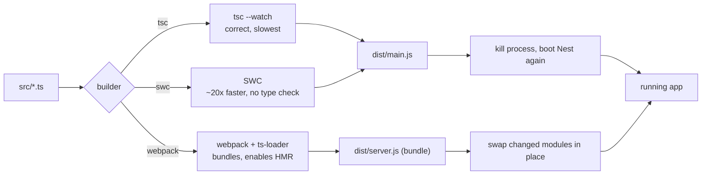

# Chapter 2 — The Nest CLI, Project Layout, and the Development Loop

> **한눈에 보기**
> 1장에서 `nest new`로 만든 프로젝트를, 이 장에서는 여러분이 **제어하는 도구**로 바꿉니다.
> CLI 설치와 명령 문법, 모든 `nest generate` 스키매틱과 별칭, `nest build`/`nest start`의
> 전체 플래그, `nest-cli.json`의 모든 옵션, tsc·SWC·webpack HMR 세 가지 개발 루프, 그리고
> 터미널에서 프로바이더를 호출하는 REPL을 다룹니다. 여기서 익힌 워크플로가 이후 모든
> 실습의 바탕이 됩니다.

**What you will learn**

- Why `build` and `start` should run through `package.json` scripts, never the global `nest` binary.
- Every `generate` schematic with its alias, and how `--flat`, `--no-spec`, and `--dry-run` change what lands on disk.
- Every key in `nest-cli.json` — `compilerOptions`, `generateOptions`, `assets`, `plugins`, `entryFile`, `sourceRoot` — and how to choose among the three builders it can drive.
- The difference between watch-mode restart and true hot module replacement, and how to set up each.
- How to open a REPL against your live dependency graph and call any provider from the terminal.

**Why this matters**

The Nest CLI looks like a scaffolding tool and is mostly a *build tool*. That distinction matters the first time something breaks in a way that has nothing to do with your code: `.graphql` files missing from `dist/` in production, a Swagger schema that lost every DTO property, an eleven-second restart on every keystroke. Each traces back to a setting in `nest-cli.json`, to which builder is active, or to a globally installed CLI nobody pinned.

There is also a productivity argument: the gap between a 400 ms incremental reload and an 11-second restart is the difference between staying inside a problem and losing your place in it. Read this chapter once end to end, then use it as a reference.

## 1. Installing the CLI, and the `nest` binary's three jobs

```bash
$ npm install -g @nestjs/cli               # or: npx @nestjs/cli@latest new my-project
```

A global install is convenient and is what the documentation assumes, but **a globally installed npm package is not managed as a project dependency**: two developers can run different `nest` versions against the same repository, and every project on your machine shares one CLI.

> **⚠️ Notice** — The CLI requires a Node.js binary built with internationalization support (ICU). Check with `node -p process.versions.icu`; `undefined` means no ICU and confusing CLI errors. Official nodejs.org binaries are fine; some minimal Docker images are not.

The `nest` binary covers three areas: **build** (`nest build` wraps `tsc`, `swc`, or webpack with `ts-loader`), **execution** (`nest start` builds, then invokes `node` on the output), and **generation** (`nest new`, `nest generate`). The first two belong to your project's dependency graph; generation does not. That is why `nest new` writes `build` and `start` scripts into `package.json` and installs the compiler toolchain as **dev dependencies** — `npm run build` and `npm run start` invoke the *locally* installed CLI, so everyone runs the same version, while the generators run from your global (or `npx`) CLI.

None of this is lock-in: a Nest application is a **standard** TypeScript application, so your own `tsc`, esbuild, or `ts-node` pipeline keeps working. The CLI exists because most developers would rather not hand-tune compiler options to get one.

### Command syntax and the command list

Every command has the same shape — `nest commandOrAlias requiredArg [optionalArg] [options]` — and most commands and options have aliases, so `nest new my-project --dry-run` and `nest n my-project -d` are equivalent. A missing required argument is prompted for. `nest --help` lists everything; `nest <command> --help` is the authoritative reference for your installed version.

| Command | Alias | Description |
|---|---|---|
| `new` | `n` | Scaffolds a new *standard mode* application with all boilerplate needed to run. |
| `generate` | `g` | Generates and/or modifies files based on a schematic. |
| `build` | | Compiles an application or workspace into an output folder. |
| `start` | | Compiles and runs an application (or the default project in a workspace). |
| `add` | | Imports a library packaged as a **nest library**, running its install schematic. |
| `info` | `i` | Displays installed Nest package versions and system info. |

`nest info` prints your OS and Node versions plus the resolved version of every `@nestjs/*` package — paste it into bug reports. `nest add <name>` is not `npm install`: it installs the package **and runs its install schematic**, which may edit `app.module.ts` and register providers for you.

## 2. `nest new` and what it produces

```bash
$ nest new <name> [options]
```

It prompts for a package manager, creates a folder named `<name>` with configuration files, and populates `/src` and `/test` with default components and tests.

Its options: `--dry-run` (`-d`) reports changes without touching the filesystem; `--skip-git` (`-g`) and `--skip-install` (`-s`) skip repository initialization and package installation; `--package-manager` (`-p`) picks `npm`, `yarn`, or `pnpm`; `--language` (`-l`) selects `TS` or `JS`; `--collection` (`-c`) names another schematics collection; `--strict` enables `strictNullChecks`, `noImplicitAny`, `strictBindCallApply`, `forceConsistentCasingInFileNames`, and `noFallthroughCasesInSwitch`.

Two habits to form now: always pass `--strict`, and use `--dry-run` whenever you are unsure what a command will touch.
Beyond `src/`, the scaffold produces the files that *are* your development loop: `package.json`, `nest-cli.json`, `tsconfig.json` (used by your editor and tests), `tsconfig.build.json` (extends it, excluding `test`, `dist`, and `**/*spec.ts` from production builds), `eslint.config.mjs`, `.prettierrc`, and `test/jest-e2e.json`.

```json title="package.json (scripts, abridged)"
{
  "build": "nest build",
  "start": "nest start",
  "start:dev": "nest start --watch",
  "start:debug": "nest start --debug --watch",
  "start:prod": "node dist/main"
}
```

Note `start:prod`: in production you do not run the CLI at all. Build once, ship `dist/`, run `node dist/main`; keeping `@nestjs/cli` out of the image is smaller and safer.

## 3. `nest generate`: every schematic

```bash
$ nest generate <schematic> <name> [options]
$ nest g <schematic> <name> [options]
```

`<name>` may include a path: `nest g service orders/pricing` creates `src/orders/pricing/pricing.service.ts`. Names are dasherized (`nest g co UserProfile` writes `user-profile.controller.ts` holding `UserProfileController`), and when the target directory contains a module the schematic **updates its `providers` or `controllers` array for you** — the best reason to generate rather than hand-create files.

| Schematic | Alias | Generates |
|---|---|---|
| `module` | `mo` | A module declaration. |
| `controller` | `co` | A controller declaration. |
| `service` | `s` | A service declaration. |
| `provider` | `pr` | A bare provider. |
| `class` | `cl` | A plain class. |
| `interface` | `itf` | An interface. |
| `decorator` | `d` | A custom decorator. |
| `filter` | `f` | An exception filter. |
| `guard` | `gu` | A guard. |
| `interceptor` | `itc` | An interceptor. |
| `middleware` | `mi` | A middleware class. |
| `pipe` | `pi` | A pipe. |
| `gateway` | `ga` | A WebSocket gateway. |
| `resolver` | `r` | A GraphQL resolver. |
| `resource` | `res` | Full CRUD resource: module, controller, service, DTOs, entity, specs (**TS only**). |
| `app` / `library` | / `lib` | A new application / library in a monorepo (converts a standard structure). |

Options: `--dry-run` (`-d`) reports without writing; `--project [name]` (`-p`) selects the target project in a monorepo; `--flat` skips the element's folder; `--collection [name]` (`-c`) picks another collection; `--spec` forces spec generation (the default), `--no-spec` disables it.

> **⚠️ Notice** — `app` and `library` **convert your repository to monorepo mode**: source moves under `apps/`, `nest-cli.json` is rewritten, and the default compiler becomes webpack. Use `--dry-run` first ([Chapter 54](../part3-advanced/54-monorepo-and-libraries.md)).

`nest g resource orders` is the highest-leverage command in the CLI: it asks for a transport layer (REST, GraphQL code- or schema-first, microservice, WebSockets) and whether to include CRUD entry points, then writes a complete wired feature — the structure you will spend Chapters 3–14 building by hand. Generate one and read it.

## 4. `nest-cli.json` in full

Nest keeps the metadata needed to organize, build, and deploy a project here and maintains the file for you, but a handful of settings deserve to be known by heart. A generated standard-mode file has four keys — `$schema`, `collection`, `sourceRoot`, `compilerOptions` — and grows from there.

| Property | Meaning |
|---|---|
| `collection` | The schematics collection used to generate components. Do not change it without reason. |
| `sourceRoot` | Root of the source code for the single project (standard mode) or the *default project* (monorepo). |
| `entryFile` | Compiled entry file name without extension; default `main`. Overridable per run with `--entryFile`. |
| `compilerOptions` | Settings affecting **any** compilation step — table below. |
| `generateOptions` | Defaults for `nest generate` — below. |
| `monorepo` | (monorepo only) always `true`. |
| `root` | (monorepo only) project root of the default project. |
| `projects` | (monorepo only) per-project `type`, `root`, `entryFile`, `sourceRoot`, `compilerOptions`, `generateOptions`. |

### Global compiler options

| Property | Type | Description |
|---|---|---|
| `builder` | string/object | Which builder compiles the project: `tsc`, `swc`, or `webpack`. Object form takes `type` and `options`, e.g. `{ "type": "swc", "options": { "swcrcPath": "infrastructure/.swcrc" } }`. The legacy boolean `webpack` (default `true` in monorepo mode, `false` in standard mode) is **deprecated** in its favour. |
| `typeCheck` | boolean | Type checking for SWC projects (runs `tsc --noEmit` alongside). Default `false`. |
| `tsConfigPath` / `webpackConfigPath` | string | The `tsconfig` used when `build`/`start` runs without `--project` (**monorepo only**) / path to a webpack options file, defaulting to `webpack.config.js`. |
| `deleteOutDir` | boolean | Remove the output directory before each compile. |
| `assets` / `watchAssets` | array / boolean | Copy non-TypeScript files into the output on each compilation / watch **all** of them, overriding per-entry settings. |
| `manualRestart` | boolean | Enable the `rs` shortcut to restart by hand in watch mode. Default `false`. |
| `plugins` | array | CLI plugins that rewrite your code at build time. |

### Assets

Compilation emits `.js` and `.d.ts` and nothing else. `.graphql` schemas, `.hbs` templates, `.proto` files, and images must be declared — and must live under `src/`, or they are not copied:

```json title="nest-cli.json (assets)"
"assets": [
  "**/*.graphql",
  { "include": "proto/**/*.proto", "exclude": "**/draft.proto", "outDir": "dist/contracts" }
],
"watchAssets": true
```

Each entry is a glob-like string or an object with `include`, `exclude`, `outDir` (relative to the project root, defaulting to the compiler output directory), and `watchAssets`.


> **⚠️ Notice** — Asset distribution does **not** happen on incremental compiles in `--watch` mode unless watching is enabled, and a top-level `watchAssets` **overrides** per-entry settings. "Works locally, missing in the container" is almost always this.

### Plugins

CLI plugins run during compilation and rewrite code before it is emitted — `@nestjs/swagger` infers `@ApiProperty()` from DTO types, `@nestjs/graphql` does the same for object types:

```json title="nest-cli.json (plugins)"
"plugins": [
  { "name": "@nestjs/swagger", "options": { "classValidatorShim": false, "introspectComments": true } }
]
```

The short form `"plugins": ["@nestjs/swagger"]` uses defaults. Plugins are a **build-time** feature: documentation that disappears under a custom `tsc` script is a plugin that never ran, and under SWC they run as part of `--type-check` ([Chapter 30](../part2-intermediate/30-openapi-advanced.md)).

### Generate options

`"generateOptions": { "spec": { "service": false, "s": false }, "flat": false }` sets defaults for `nest generate`: `spec` takes a boolean (all schematics) or an object keyed by schematic name, and `flat` makes every command produce a flat structure. Precedence: **CLI flags → project-specific → global**.

> **⚠️ Notice** — When `spec` is an object, keys do **not** resolve aliases: `{"service": false}` still generates a spec if you type `nest g s`. List both spellings, as above.

### Monorepo mode, in one paragraph

`nest g app` or `nest g library` rewrites `nest-cli.json` into monorepo form: `"monorepo": true`, a `"root"` for the default project, and a `"projects"` map giving each application or library its own `root`, `entryFile`, `sourceRoot`, and `compilerOptions.tsConfigPath`. In that mode one file system structure holds every project, `node_modules`, `package.json`, and lint/format configuration are shared, the default compiler becomes webpack, `build` and `start` target the **default project** unless you pass `--project`, and libraries get built-in path management and bundling. You can switch modes at any time, so defer the decision — [Chapter 54](../part3-advanced/54-monorepo-and-libraries.md) covers it in full.

## 5. `nest build` and `nest start`

`nest build` wraps `tsc`, `swc`, or webpack with `ts-loader`, adding no compilation features of its own except `tsconfig-paths` handling — so `@app/common/*` aliases resolve in the emitted JavaScript — and it runs the CLI plugins. `nest start` performs the same build, then invokes `node` on the compiled entry file. Both take an optional `<name>` project, which matters only in a monorepo.

| Option | Alias | Where | Effect |
|---|---|---|---|
| `--path` / `--config` | `-p` / `-c` | both | Path to the `tsconfig` file / to the `nest-cli` config file. |
| `--watch` | `-w` | both | Watch mode. With `tsc`, `rs` restarts when `manualRestart` is `true`. |
| `--builder [name]` | `-b` | both | `tsc`, `swc`, or `webpack`. `--tsc` forces `tsc`; `--webpack`/`--webpackPath` are **deprecated**. |
| `--watchAssets` | | both | Watch non-TS files (assets such as `.graphql`). |
| `--type-check` | | both | Enable type checking when SWC is used. |
| `--preserveWatchOutput` | | both | Keep outdated console output instead of clearing (`tsc` watch only). |
| `--all` | | build | Build all projects in a monorepo. |
| `--debug [host:port]` | `-d` | start | Run with Node's `--inspect` flag. |
| `--exec [binary]` / `--no-shell` | `-e` | start | Binary to run instead of `node` / do not spawn child processes within a shell. |
| `--env-file` | | start | Load environment variables from a file into `process.env`. |
| `--entryFile [name]` | | start | Run a different compiled entry file (used by the REPL). |
| `-- [key=value]` | | start | Everything after `--` reaches your app as `process.argv`. |

`nest start --watch --debug --env-file .env.local` is the everyday development command. `--env-file` populates `process.env` before your application boots, which is *not* `ConfigModule`'s `.env` loading and performs no validation — use it for local convenience only ([Chapter 17](../part2-intermediate/17-configuration.md)).

## 6. The development loop: three strategies



The distinction the diagram encodes: `tsc` and SWC give **restart on change** — the process dies, the module graph is rebuilt, every `OnModuleInit` runs again. Webpack HMR gives **replacement in place**: the process survives and only changed modules are swapped.

### Strategy 1: `tsc` watch (the default)

`npm run start:dev` runs `nest start --watch`: correct, zero configuration, and slow, because it type-checks the whole program on every change. Set `"manualRestart": true` for the `rs` shortcut — type `rs` and enter to force a restart without editing a file — and `--preserveWatchOutput` if you dislike losing errors when the screen clears.

### Strategy 2: SWC (recommended for most projects)

SWC is a Rust-based compiler roughly **20× faster** than `tsc`: install `@swc/cli` and `@swc/core` as dev dependencies, then run `nest start -b swc -w`. Better, set `"compilerOptions": { "builder": "swc", "typeCheck": true }` in `nest-cli.json` so nobody has to remember the flag. SWC does **not** type-check — that is where the speed comes from, and it is a real hazard: a type error will not stop your dev server, it surfaces at runtime or in CI. `typeCheck: true` (or `--type-check`) runs `tsc --noEmit` asynchronously alongside SWC, so you keep nearly all the speed, still see errors, and get the CLI plugins run. Turn it on.

The builder ships pre-configured for Nest. To customize it, add a `.swcrc` with `"jsc": { "parser": { "syntax": "typescript", "decorators": true, "dynamicImport": true } }` and `"sourceMaps": true` — `decorators: true` is non-negotiable, since without it nothing in Nest works. Relocate that file with the object builder form's `swcrcPath`, or add `.jsx`/`.tsx` support with `{ "options": { "extensions": [".ts", ".tsx", ".js", ".jsx"] } }`.

### Strategy 3: webpack HMR

The highest cost in bootstrapping is TypeScript compilation. Webpack Hot-Module Replacement avoids recompiling the whole project on each change, cutting the time to instantiate your application — at the price of a bundler in your dev loop.

> **⚠️ Notice** — webpack will **not** automatically copy assets (for example `.graphql` files) to `dist`, and it is **not compatible with glob static paths** such as TypeORM's `entities: ['dist/**/*.entity.js']`. Convert those to explicit imports before enabling HMR.

Because the CLI already wraps webpack, you install `webpack webpack-node-externals run-script-webpack-plugin` and supply only a config adding the HMR plugins:

```javascript title="webpack-hmr.config.js"
const nodeExternals = require('webpack-node-externals');
const { RunScriptWebpackPlugin } = require('run-script-webpack-plugin');

// options = the CLI's default webpack config; webpack = the CLI's webpack instance.
module.exports = function (options, webpack) {
  return {
    ...options,
    entry: ['webpack/hot/poll?100', options.entry],
    externals: [nodeExternals({ allowlist: ['webpack/hot/poll?100'] })],
    plugins: [
      ...options.plugins,
      new webpack.HotModuleReplacementPlugin(),
      new webpack.WatchIgnorePlugin({ paths: [/\.js$/, /\.d\.ts$/] }),
      new RunScriptWebpackPlugin({ name: options.output.filename, autoRestart: false }),
    ],
  };
};
```

Then enable HMR in the entry file and point the dev script at the config:

```typescript title="src/main.ts"
import { NestFactory } from '@nestjs/core';
import { AppModule } from './app.module';

declare const module: any;

async function bootstrap() {
  const app = await NestFactory.create(AppModule);
  await app.listen(process.env.PORT ?? 3000);

  if (module.hot) {
    module.hot.accept();
    module.hot.dispose(() => app.close());
  }
}
bootstrap();
```

```json title="package.json"
"start:dev": "nest build --webpack --webpackPath webpack-hmr.config.js --watch"
```

`module.hot.dispose(() => app.close())` is the load-bearing line: it shuts the old application down — port, pool, schedulers — before the replacement boots. Omit it and the second reload fails with `EADDRINUSE`.

**Without the CLI** you write the whole `webpack.config.js` yourself — additionally installing `webpack-cli` and `ts-loader`, and declaring `entry: ['webpack/hot/poll?100', './src/main.ts']`, `target: 'node'`, the same `nodeExternals` allowlist, a `ts-loader` rule, `mode: 'development'`, the two plugins, and `output` writing `server.js` into `dist`. The `main.ts` changes are identical and the script becomes `webpack --config webpack.config.js --watch`; a working example lives in the Nest repository under `sample/08-webpack`.

> **Hint** — On **Yarn Berry** (not classic Yarn), use `webpack-pnp-externals` and `WebpackPnpExternals({ exclude: ['webpack/hot/poll?100'] })` in `externals` instead.

**Which to choose.** SWC with `typeCheck: true` for almost everyone: nearly all of HMR's benefit with none of its configuration, asset, or glob caveats. Reserve webpack HMR for applications whose bootstrap is genuinely expensive.

## 7. The REPL: talking to your live graph

The REPL lets you inspect your dependency graph and call methods on providers and controllers straight from the terminal. Create `repl.ts` alongside `main.ts`:

```typescript title="src/repl.ts"
import { repl } from '@nestjs/core';
import { AppModule } from './app.module';

async function bootstrap() {
  await repl(AppModule);
}
bootstrap();
```

Run it as the entry file with `npm run start -- --entryFile repl`.

`repl()` returns a Node.js REPL server object. After the bootstrap logs and `LOG REPL initialized` you have a prompt against a fully constructed container — every provider instantiated, every `OnModuleInit` already run, no HTTP listener:

```typescript
> get(AppService).getHello()             // any JS works: assignment, await, loops
'Hello World!'
> appController = get(AppController)
AppController { appService: AppService {} }
> await appController.getHello()
'Hello World!'
> methods(AppController)                 // Methods: ◻ getHello
> debug()                                // AppModule: ◻ AppController, ◻ AppService
```

| Function | Description | Signature |
|---|---|---|
| `debug` | Print registered modules with their controllers and providers. | `debug(moduleCls?: ClassRef \| string) => void` |
| `get` / `$` | Retrieve an injectable or controller; throws if absent. | `get(token: InjectionToken) => any` |
| `methods` | List public methods of a provider or controller. | `methods(token: ClassRef \| string) => void` |
| `resolve` | Resolve a transient or request-scoped instance. | `resolve(token: InjectionToken, contextId: any) => Promise<any>` |
| `select` | Navigate the module tree to reach a specific module. | `select(token: DynamicModule \| ClassRef) => INestApplicationContext` |

`help()` lists them; `<function>.help` prints one signature in TypeScript function type expression syntax (`$.help` → "Retrieves an instance of either injectable or controller, otherwise, throws exception."). `get` fails on request-scoped and transient providers by design, since they have no single instance — use `resolve` with a context id ([Chapter 38](../part3-advanced/38-injection-scopes.md)). `select` reaches a provider a module registered privately, an inspection privilege your application code does not have.

### Watch mode and persistent history

`npm run start -- --watch --entryFile repl` reflects code changes automatically, with one flaw: history is discarded on every reload. Fix it by capturing the returned server — `const replServer = await repl(AppModule);` — and calling `replServer.setupHistory('.nestjs_repl_history', (err) => { if (err) console.error(err); });`. History then survives reloads; add that file to `.gitignore`.

## 8. A recommended day-to-day workflow

1. **Create** with `nest new project --strict`, then set `"builder": "swc"` and `"typeCheck": true`. Generate rather than hand-create anything a schematic covers.
2. **Run** `npm run start:dev` in one terminal and the REPL in another, using `debug()` whenever a dependency error confuses you; debug with `npm run start:debug` and an attached editor rather than `console.log`.
3. **Before pushing**, run `npm run lint && npm run test` plus `npm run build` once — the only command exercising CLI plugins and asset copying. **In production**, build in CI and run `node dist/main`.

## Common mistakes

1. **Symptom:** `.graphql`, `.hbs`, or `.proto` files are missing from `dist/` in the container, though all is well locally.
   **Cause:** Only `.js`/`.d.ts` are emitted; assets must be declared and must live under `src/`.
   **Fix:** Add `compilerOptions.assets` and `watchAssets`, then verify with `npm run build && ls dist` — not with the dev server.

2. **Symptom:** Swagger shows DTOs with no properties, or GraphQL object types are empty, in one environment only.
   **Cause:** CLI plugins are a build-time transform: they never run under a custom `tsc` script, and under SWC only with `--type-check`.
   **Fix:** Build through `nest build`; enable `typeCheck` when using SWC.

3. **Symptom:** `EADDRINUSE` on the second HMR reload; or, after enabling HMR, TypeORM reports "No metadata found" with an empty entity list.
   **Cause:** The old application instance was never closed and still holds the port; and webpack is incompatible with glob static paths such as `entities: ['dist/**/*.entity.js']`.
   **Fix:** Add `module.hot.dispose(() => app.close())` to `main.ts`, and replace entity globs with explicit imports (or stay on SWC).

4. **Symptom:** The dev server runs happily but CI fails with type errors; or `nest g s foo` writes a spec file though `nest-cli.json` sets `"spec": { "service": false }`.
   **Cause:** SWC without `typeCheck` strips types and never checks them; `spec` object keys do not resolve aliases.
   **Fix:** Set `"typeCheck": true`, and list both spellings: `{ "service": false, "s": false }`.

5. **Symptom:** Two developers get different build results from the same commit, or `nest g app admin` reorganizes the whole repository.
   **Cause:** Globally installed `nest` binaries of differing versions; and `app`/`library` convert a standard project to monorepo mode.
   **Fix:** Build through `npm run build`/`npm run start`, and `--dry-run` any generator you have not run before.

## Putting it together

SWC with asynchronous type checking, the Swagger plugin, GraphQL and i18n assets copied and watched, spec files off for services only:

```json title="nest-cli.json"
{
  "$schema": "https://json.schemastore.org/nest-cli",
  "collection": "@nestjs/schematics",
  "sourceRoot": "src",
  "compilerOptions": {
    "builder": "swc",
    "typeCheck": true,
    "deleteOutDir": true,
    "manualRestart": true,
    "watchAssets": true,
    "assets": [
      "**/*.graphql",
      { "include": "i18n/**/*.json", "exclude": "**/*.draft.json" }
    ],
    "plugins": [
      { "name": "@nestjs/swagger", "options": { "introspectComments": true } }
    ]
  },
  "generateOptions": { "spec": { "service": false, "s": false } }
}
```

Add one script, `"repl": "nest start --watch --entryFile repl"`, and keep the `src/repl.ts` from Section 7. A session using all of it:

```bash
$ nest g resource orders --dry-run     # inspect, then run it for real
$ npm run start:dev                    # SWC watch, types checked asynchronously
$ npm run repl                         # second terminal
> debug()                              # confirm OrdersModule and its providers exist
> await get(OrdersService).findAll()   # call the real service, no HTTP involved
```

If `debug()` does not list `OrdersModule`, it was never imported into `AppModule` — a thirty-second diagnosis that would otherwise be a puzzling 404.

> **핵심 정리**
> - CLI는 스캐폴딩 도구이자 **빌드 도구**입니다. build / start는 반드시 `package.json` 스크립트(= 로컬 CLI)로 실행해 팀 전체의 버전을 고정하세요.
> - `nest generate`는 모든 스키매틱에 별칭이 있고, 대상 디렉터리에 모듈이 있으면 `providers`/`controllers`를 **자동 갱신**합니다. 단 `nest g app` / `library`는 저장소를 **모노레포 모드로 전환**하므로 `--dry-run`이 필수입니다(54장).
> - 빌드의 전부는 `nest-cli.json`의 `compilerOptions`입니다: `builder`, `typeCheck`, `assets`, `watchAssets`, `deleteOutDir`, `manualRestart`, `plugins`.
> - 에셋(`.graphql`, `.hbs`, `.proto`)은 `src/` 아래에 있고 `assets`에 선언해야만 `dist/`로 복사되며, 최상위 `watchAssets`가 개별 설정을 덮어씁니다. CLI 플러그인(Swagger/GraphQL)은 **빌드 타임** 변환이라 SWC에서는 `--type-check`가 켜져 있어야 실행됩니다.
> - 빌더 선택: `tsc`(정확·느림), `swc`(약 20배 빠름, 타입 검사 없음 → `typeCheck: true` 필수), `webpack`(HMR 가능하지만 에셋 복사·glob 경로 비호환).
> - HMR에서 `module.hot.dispose(() => app.close())`를 빠뜨리면 두 번째 리로드에서 `EADDRINUSE`가 납니다. REPL(`--entryFile repl`)은 살아 있는 DI 그래프에 접근하며, `get`/`$`, `methods`, `debug`, `resolve`, `select`와 `setupHistory`를 함께 쓰세요.

> **연습 문제**
> 1. `nest g resource orders --dry-run` 출력을 읽고 어떤 파일이 **생성**되고 어떤 파일이 **수정**되는지 정리한 뒤, 실제로 실행해 예측이 맞았는지 확인하세요.
> 2. `"generateOptions": { "spec": { "service": false } }`만 설정한 상태에서 `nest g s a`와 `nest g service b`를 각각 실행해 결과 차이와 그 이유를 설명하세요.
> 3. **직접 만들어 보기** — `src/i18n/ko.json`을 추가하고 `assets`·`watchAssets`를 설정해 `npm run build` 후 `dist/i18n/ko.json`이 생기게 만든 뒤, `watchAssets`를 끄고 watch 모드에서 수정하면 무엇이 달라지는지 기록하세요.
> 4. **직접 만들어 보기** — 같은 프로젝트를 `tsc`, `swc`, `swc --type-check`로 빌드해 시간을 측정하고, 일부러 타입 오류를 넣어 각 설정에서 오류가 **언제** 드러나는지 비교표로 정리하세요.
> 5. **직접 만들어 보기** — webpack HMR을 설정한 뒤 `module.hot.dispose(() => app.close())`를 넣은 버전과 뺀 버전의 두 번째 리로드 결과를 비교하고, 이어서 REPL을 watch 모드로 띄워 `debug()`·`methods()`·`$()`로 서비스 메서드를 호출하며 `setupHistory` 적용 전후 차이를 확인하세요.

**Next:** [Chapter 3 — Controllers I: Routing, Parameters, and the Request](./03-controllers-routing.md) starts building the application itself: how `@Controller()` and the HTTP method decorators turn classes into routes, how path parameters, query strings, and bodies reach your handlers, and what the router does before your code runs.
