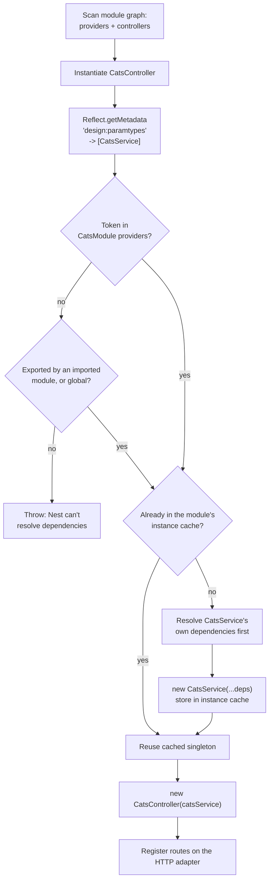

# Chapter 5 — Providers and Services: The Unit of Business Logic

> **한눈에 보기**
> 3~4장에서 만든 컨트롤러는 HTTP 요청을 받아 응답을 돌려주는 얇은 껍데기여야 합니다.
> 실제 업무 로직은 **프로바이더(provider)**, 그중에서도 서비스 클래스가 담당합니다.
> 이 장에서는 `@Injectable()`이 "등록"이 아니라 **메타데이터 표식**일 뿐이라는 점,
> `design:paramtypes` 메타데이터가 생성자 주입을 어떻게 가능하게 하는지,
> 그리고 **토큰과 인스턴스의 구분**이라는 Nest DI의 핵심 개념을 다룹니다.

**What you will learn**

- Why `@Injectable()` is a *marker*, not a registration — and what actually registers a provider.
- What `emitDecoratorMetadata` emits under `design:paramtypes`, and why removing a decorator silently breaks injection.
- How to split a controller (transport) from a service (business rules) so both become testable in isolation.
- How to read a provider as a **(token, recipe)** pair rather than "a class Nest news up".
- When property-based injection with `@Inject()` is genuinely unavoidable, and why the constructor is the default.
- How `@Optional()` lets a dependency be absent without crashing bootstrap, plus the four custom-provider recipes.

**Why this matters**

Here is a failure you will meet within your first week of writing Nest code:

```text
[Nest] ERROR [ExceptionHandler] Nest can't resolve dependencies of the CatsController (?).
Please make sure that the argument CatsService at index [0] is available in the CatsModule context.
```

Nothing in your editor was red. The types were fine. The import was there. The application still refused to boot. That error is the most common thing that stops a Nest application from starting, and it is *not* a TypeScript error — it is a runtime lookup failure in Nest's injector. Nest never sees your types: it sees a list of **tokens** the TypeScript compiler wrote into a metadata table, and looks them up in a per-module registry. If the token is not there, boot fails.

Nearly every architectural problem in a mature Node.js codebase also traces back to business logic living in the wrong place — a route handler, a middleware, a model. Nest's default answer is providers: business logic lives in them, they are injected, and injected things are trivially replaceable in tests. Providers are also what everything else in Nest is built out of — guards, interceptors, pipes, filters, repositories, ORM connections, gateways and CQRS handlers are all providers.

---

## 1. What a provider actually is

A **provider** is an entry in a module's injector that answers: *"given this token, how do I produce a value?"*

That is the whole definition. Note what it does **not** say: not "a class" (a provider can supply a plain object, a string, a function, or a database handle), not "annotated with `@Injectable()`" (many providers are not classes), and not "a service" (`CatsService` is a provider, but so is `'DATABASE_CONNECTION'`).

Every provider has exactly two halves: a **token** (a lookup key — a class constructor, a string, or a `Symbol`) and a **recipe** (the rule that produces the value handed to whoever asks for that token). The shorthand you write most of the time hides this structure — `providers: [CatsService]` is precisely equivalent to:

```typescript
providers: [
  {
    provide: CatsService,   // the token  — a class object used as a key
    useClass: CatsService,  // the recipe — "instantiate this class"
  },
]
```

Read that twice. The `CatsService` on the left is a *key in a map*; the one on the right is a *constructor to call*. They happen to be the same JavaScript value, which is why beginners never notice that two different jobs are being done. The moment you write your first mock in a test they stop being the same value — and every custom-provider form makes sense at once.

> **Hint** — A class object is a perfectly good map key in JavaScript, so Nest uses your class as its own token with zero ceremony. That is the trick behind `constructor(private catsService: CatsService)` needing no configuration.

---

## 2. The service layer: keeping controllers thin

The domain we carry through this chapter is a small catalogue of cats, described by `interface Cat { id: number; name: string; age: number; breed: string }` in `src/cats/interfaces/cat.interface.ts`. The service owns the data and the rules about it, and knows nothing about HTTP.

```typescript title="src/cats/cats.service.ts"
import { Injectable, NotFoundException } from '@nestjs/common';
import { Cat } from './interfaces/cat.interface';

@Injectable()
export class CatsService {
  private readonly cats: Cat[] = [];
  private nextId = 1;

  create(data: Omit<Cat, 'id'>): Cat {
    const cat: Cat = { id: this.nextId++, ...data };
    this.cats.push(cat);
    return cat;
  }

  findAll(): Cat[] {
    return [...this.cats];
  }

  findOne(id: number): Cat {
    const cat = this.cats.find((c) => c.id === id);
    if (!cat) throw new NotFoundException(`Cat with id ${id} not found`);
    return cat;
  }
}
```

The controller owns the transport. It knows nothing about how cats are stored.

```typescript title="src/cats/cats.controller.ts"
import { Body, Controller, Get, Param, ParseIntPipe, Post } from '@nestjs/common';
import { CatsService } from './cats.service';
import { CreateCatDto } from './dto/create-cat.dto';
import { Cat } from './interfaces/cat.interface';

@Controller('cats')
export class CatsController {
  constructor(private readonly catsService: CatsService) {}

  @Post()
  create(@Body() dto: CreateCatDto): Cat {
    return this.catsService.create(dto);
  }

  @Get(':id')
  findOne(@Param('id', ParseIntPipe) id: number): Cat {
    return this.catsService.findOne(id);
  }
}
```

Two details in the constructor deserve attention.

**`private readonly` is not decoration.** TypeScript's *parameter property* shorthand declares the field, assigns it, and sets its visibility in one line: it compiles to `this.catsService = catsService`. Without the modifier the parameter is a plain local and `this.catsService` is `undefined` — producing `TypeError: Cannot read properties of undefined (reading 'findAll')` at request time rather than at boot. Prefer `readonly`: a service reference should never be reassigned.

**The controller never calls `new CatsService()`.** That is the inversion in *inversion of control*: the controller declares *what it needs*, something else decides *which instance it gets* — the module's injector in production, a `Test.createTestingModule()` override in a unit test. Neither touches the controller.

> **Hint** — `nest g service cats` generates the service and its spec file and adds it to the nearest module's `providers` array in one command. Hand-writing the wiring is how you end up with the "can't resolve dependencies" error.

A rule for drawing the line: **if code mentions `req`, `res`, a status code, or a header it belongs in the controller; if it mentions a business rule — a uniqueness constraint, a quota, a state transition — it belongs in the service.** A service written that way is reusable verbatim by a CLI command, a queue consumer, or a gRPC handler; a controller that absorbed the rules is not.

---

## 3. `@Injectable()` is a marker, not a registration

This is the most misunderstood line in Nest. Adding `@Injectable()` to a class does **not** make `CatsService` available anywhere. It does not add it to any container. What it actually does, in `@nestjs/common`, is roughly:

```typescript
// Conceptual — the real implementation lives in @nestjs/common/decorators/core
export function Injectable(options?: InjectableOptions): ClassDecorator {
  return (target: object) => {
    Reflect.defineMetadata(INJECTABLE_WATERMARK, true, target);
    Reflect.defineMetadata(SCOPE_OPTIONS_METADATA, options, target);
  };
}
```

Two flags on the class. That is all. `INJECTABLE_WATERMARK` means "intended to be managed by the container"; `SCOPE_OPTIONS_METADATA` carries `{ scope, durable }`, which Chapter 38 covers.

**What actually registers a provider is the `providers` array of a module.** Nothing else.

### The part that really matters: `design:paramtypes`

So how does Nest know `CatsController`'s constructor wants a `CatsService`? TypeScript types are erased; nothing is left at runtime to inspect. The answer is a compiler feature enabled in every Nest project — `"experimentalDecorators": true` and `"emitDecoratorMetadata": true` in `tsconfig.json`. With the second flag on, whenever the compiler sees a **decorated class** it emits an extra `Reflect.metadata` call describing the constructor's parameter types:

```javascript title="dist/cats/cats.controller.js (abridged)"
const cats_service_1 = require("./cats.service");

let CatsController = class CatsController {
  constructor(catsService) { this.catsService = catsService; }
};

CatsController = __decorate([
  (0, common_1.Controller)('cats'),
  __metadata("design:paramtypes", [cats_service_1.CatsService]),  // <-- this line
], CatsController);
```

That array is Nest's entire source of truth for constructor injection: at bootstrap the injector calls `Reflect.getMetadata('design:paramtypes', CatsController)`, receives `[CatsService]`, and looks that token up in the module's provider registry.

Three consequences follow, each explaining a real bug:

**(a) A class with no decorator emits no metadata.** TypeScript emits `design:paramtypes` only for classes carrying at least one decorator, so `@Injectable()` does double duty: it marks the class *and*, by existing, triggers metadata emission. A service with dependencies must therefore have it.

**(b) A controller does not need `@Injectable()`.** `@Controller()` is already a decorator, so metadata is emitted; adding `@Injectable()` is harmless but redundant, likewise with `@Catch()` and `@WebSocketGateway()`.

**(c) Interfaces cannot be injected.** Type a parameter as an `interface` and TypeScript emits `Object` as the paramtype, because the interface is erased; Nest looks up the token `Object`, finds nothing, and fails. That is type erasure, not a Nest limitation — the fix, a `Symbol` or abstract-class token, appears in Chapter 7.

> **⚠️ Notice** — Switch to a transpiler that does not implement `emitDecoratorMetadata` (esbuild without a plugin, plain Babel without `babel-plugin-transform-typescript-metadata`) and every constructor injection breaks at once. SWC does implement it; see Chapter 55.

---

## 4. How the injector resolves a controller's dependencies

When `NestFactory.create(AppModule)` runs, Nest walks the module graph and, for each module, instantiates providers and then controllers, resolving dependencies bottom-up.



The two decision diamonds are the whole game. **Visibility**: is this token reachable from *this* module? Nest's injector is per-module, not global; a provider declared in `OrdersModule` is invisible to `CatsModule` unless `OrdersModule` exports it and `CatsModule` imports it — Chapter 6 is about exactly this rule. **Identity**: has this token already been instantiated in this module's context? If so the cached instance is returned, and that cache is what "singleton" means in Nest.

Two more properties matter. **Resolution is transitive**: if `CatsService` injects a `CatsRepository` which injects a `'DATABASE_CONNECTION'`, Nest resolves the whole chain bottom-up before any consumer is constructed. And **resolution happens at bootstrap, not per request**: by the time the first request arrives every default-scoped provider exists, which is why a wiring mistake crashes the process on startup instead of returning a 500 at 3 a.m.

> **Hint** — Set `NEST_DEBUG=true` before starting the app and Nest prints per-token resolution logs during bootstrap, including which module each dependency was found in — the fastest way to diagnose a "can't resolve" error in a large graph.

---

## 5. Registering the provider

The controller and the service exist, and neither knows about the other's lifecycle. The module is where they meet — `@Module({ controllers: [CatsController], providers: [CatsService] })` in `src/cats/cats.module.ts`.

Note the asymmetry that trips people up constantly: `controllers` and `providers` **create** instances in this module, `imports` **borrows** instances from other modules, `exports` **lends** this module's providers to importers. A provider you merely *use* does not go in `providers`. Putting `CatsService` in a second module's `providers` array does not "give access" to the existing instance — it creates a **second, independent instance** with its own state. That is the most expensive misunderstanding in the module system, and Chapter 6 dissects it.

---

## 6. Token versus instance: the distinction that unlocks everything

You now have enough to state the idea precisely.

```typescript
// The token is CatsService. The instance comes from CatsService.
{ provide: CatsService, useClass: CatsService }

// The token is still CatsService. The instance comes from somewhere else.
{ provide: CatsService, useClass: InMemoryCatsService }

// The token is still CatsService. The instance is a literal object.
{ provide: CatsService, useValue: { findAll: () => [] } }
```

In all three cases `constructor(private catsService: CatsService)` compiles to the same `design:paramtypes` entry and the injector performs the same lookup; the consumer is unaware which recipe ran. **That indifference is the product** — it makes this test possible without touching a line of controller code:

```typescript title="src/cats/cats.controller.spec.ts"
import { Test } from '@nestjs/testing';
import { CatsController } from './cats.controller';
import { CatsService } from './cats.service';

const mockCatsService = { findAll: jest.fn().mockReturnValue([{ id: 1, name: 'Alice' }]) };

const moduleRef = await Test.createTestingModule({
  controllers: [CatsController],
  providers: [{ provide: CatsService, useValue: mockCatsService }],
}).compile();

expect(moduleRef.get(CatsController).findAll()).toHaveLength(1);
```

No `jest.mock()`, no module-path patching — you replaced the recipe behind a token. Chapter 31 builds on this.

---

## 7. Scope: singleton by default

Every provider so far has **default scope** (`Scope.DEFAULT`), which behaves as a singleton *per module context*: the instance is created once during bootstrap, every consumer that resolves the token receives that same object, and it lives until shutdown, when `onModuleDestroy` and `beforeApplicationShutdown` run (Chapter 39).

The consequence: **provider fields are shared, process-wide, mutable state**. The `cats` array in `CatsService` is one array for the lifetime of the process, visible to every concurrent request. Fine for a cache or a connection pool; catastrophic for anything per-user:

```typescript
// ❌ Never do this in a default-scoped provider
@Injectable()
export class CatsService {
  private currentUserId: number;              // shared across ALL requests

  setUser(id: number) { this.currentUserId = id; }
  findMine() { return this.cats.filter((c) => c.ownerId === this.currentUserId); }
}
```

Under any concurrency, request B overwrites `currentUserId` between A's `setUser` and `findMine`, and A gets B's cats. Pass per-request data as **method arguments**, not instance fields. If you genuinely need a per-request instance, that is `Scope.REQUEST` ([Chapter 38](../part3-advanced/38-injection-scopes.md)); for ambient per-request context without changing scope, see [Chapter 43](../part3-advanced/43-async-local-storage.md). Keep the singleton default: request-scoped providers force Nest to rebuild part of the injection subtree on every request, and the cost propagates to every consumer.

---

## 8. Optional providers with `@Optional()`

Sometimes a dependency is genuinely optional — a configuration override, a metrics sink, a feature-flag client absent locally. An unregistered token is normally a fatal bootstrap error; `@Optional()` downgrades it to `undefined`:

```typescript title="src/http/http.service.ts"
import { Inject, Injectable, Optional } from '@nestjs/common';

const DEFAULT_OPTIONS: HttpOptions = { timeoutMs: 5_000, retries: 0 };

@Injectable()
export class HttpService {
  private readonly options: HttpOptions;

  constructor(@Optional() @Inject('HTTP_OPTIONS') options?: Partial<HttpOptions>) {
    this.options = { ...DEFAULT_OPTIONS, ...options };
  }
}
```

If a provider with token `'HTTP_OPTIONS'` is registered and visible, it is injected; if not, `options` is `undefined` and the defaults apply. Boot succeeds either way.

`@Optional()` decorates the **parameter** and composes with `@Inject()` in either order; mark the TypeScript parameter optional too (`options?:`) or `strictNullChecks` will complain; it works on property injection as well; and factories have their own form, `inject: [{ token: 'SomeOptionalProvider', optional: true }]`, shown in Chapter 7.

Use it sparingly. Every optional dependency is a branch in runtime behaviour no type checker will remind you to test. It is right for library code that must work with or without an integration, and usually wrong inside an application you control, where a missing provider is a bug you want to hear about at boot.

---

## 9. Property-based injection, and when it is unavoidable

Everything so far used **constructor injection**. Nest offers an alternative:

```typescript
import { Inject, Injectable } from '@nestjs/common';

@Injectable()
export class HttpService {
  @Inject('HTTP_OPTIONS')
  private readonly httpOptions: HttpOptions;
}
```

Nest sets the property after constructing the instance. Here `@Inject()` is **required** even for class tokens — there is no `design:paramtypes` for properties, so the token must be named explicitly.

**Keep the constructor as your default.** A constructor signature is an honest, compiler-checked declaration of what a class needs; property injection scatters that contract across the class body and makes plain `new MyService(...)` in a test awkward.

There is one situation where property injection is genuinely the better tool: **inheritance hierarchies where a base class needs a dependency**.

With constructor injection, a `BaseService` taking a `LoggerService` forces every subclass to re-declare that parameter and thread it through `super(logger)` — pure boilerplate, and adding a second base dependency means editing every subclass. Property injection removes the plumbing:

```typescript
@Injectable()
export abstract class BaseService {
  @Inject(LOGGER) protected readonly logger: LoggerPort;
}

@Injectable()
export class CatsService extends BaseService {
  constructor(private readonly repo: CatsRepository) { super(); }
}
```

Subclasses now declare only their own dependencies; adding a base dependency touches one file.

> **⚠️ Notice** — Property-injected fields are `undefined` inside the constructor body: Nest assigns them after construction returns. Move any work that needs them into `onModuleInit()` (Chapter 39).

| | Constructor injection | Property injection |
|---|---|---|
| Token source | `design:paramtypes` (automatic) | `@Inject(token)` (explicit, mandatory) |
| Visible in signature | Yes | No |
| Available in constructor body | Yes | **No** |
| Recommended for | Everything | Base classes in an inheritance chain |

---

## 10. A first look at custom providers

You know the expanded form already. Here are the four recipes at the depth needed to *read* code today; [Chapter 7](./07-dependency-injection-basics.md) works through each with running examples, and [Chapter 36](../part3-advanced/36-custom-providers.md) covers writing them in anger.

| Recipe | Shape | Use it when |
|---|---|---|
| `useClass` | `{ provide: T, useClass: Impl }` | The token resolves to a class Nest instantiates — possibly a different class than the token. |
| `useValue` | `{ provide: T, useValue: obj }` | You already have the value: a constant, config object, client, or test mock. |
| `useFactory` | `{ provide: T, useFactory: fn, inject: [...] }` | Producing the value needs logic, other providers, or `await`. |
| `useExisting` | `{ provide: T, useExisting: Other }` | You want a second name (alias) for a provider that already exists. |

```typescript title="src/app.module.ts (illustrative)"
@Module({
  providers: [
    LoggerService,
    // useClass — pick an implementation per environment
    { provide: ConfigService,
      useClass: process.env.NODE_ENV === 'production' ? ProdConfigService : DevConfigService },
    // useValue — a plain constant behind a string token
    { provide: 'APP_NAME', useValue: 'cats-api' },
    // useFactory — computed, may inject other providers, may be async
    { provide: 'CATS_LIMIT',
      useFactory: (config: ConfigService) => config.getNumber('CATS_LIMIT') ?? 100,
      inject: [ConfigService] },
    // useExisting — an alias; both tokens yield the *same* singleton
    { provide: 'LOGGER', useExisting: LoggerService },
  ],
})
export class AppModule {}
```

Two things to carry forward. `useExisting` creates an **alias, not a copy**: `moduleRef.get('LOGGER') === moduleRef.get(LoggerService)` is `true`. And a `useFactory` may be `async` — Nest awaits the returned promise before instantiating anything that depends on the token, which is how "do not serve traffic until the database connects" is expressed.

Two escape hatches exist for the rare case where the container is not enough. **`ModuleRef`** resolves a token imperatively at runtime, when the implementation is known only from data ([Chapter 41](../part3-advanced/41-module-ref-discovery-lazy.md)); **a standalone application context** (`NestFactory.createApplicationContext(AppModule)`, then `app.get(CatsService)`) resolves providers outside any HTTP request — CLI scripts, migrations, seeding ([Chapter 42](../part3-advanced/42-standalone-and-cli-apps.md)). Both are last resorts.

---

## Common mistakes

1. **Decorating the class but forgetting the module.** *Symptom:* `Nest can't resolve dependencies of the CatsController (?)`. *Cause:* `@Injectable()` marks, it does not register — the token is in no reachable `providers` array. *Fix:* add it to `providers` of the module declaring the controller, or export it from its own module and import that module.

2. **Omitting the access modifier on a constructor parameter.** *Symptom:* boot succeeds; the first request throws `TypeError: Cannot read properties of undefined (reading 'findAll')`. *Cause:* `constructor(catsService: CatsService) {}` creates a local, not a field. *Fix:* `constructor(private readonly catsService: CatsService) {}`.

3. **Typing a dependency as an interface.** *Symptom:* `Nest can't resolve dependencies ... (?)` where the type is obviously imported and correct. *Cause:* interfaces are erased; TypeScript emits `Object` and Nest looks up a token never registered. *Fix:* a `Symbol`/string token with `@Inject()`, or an `abstract class`. See Chapter 7.

4. **Storing per-request state on a default-scoped provider.** *Symptom:* under load, users intermittently see other users' data. *Cause:* providers are singletons; instance fields are shared across concurrent requests. *Fix:* pass request data as method arguments, or use `Scope.REQUEST` (Chapter 38) / `AsyncLocalStorage` (Chapter 43).

5. **Registering the same provider class in two modules to "share" it.** *Symptom:* two caches, two counters, two connection pools; state written in one module is invisible in the other. *Cause:* each `providers` entry creates a distinct instance. *Fix:* declare it once, `exports` it, `imports` the owning module. Chapter 6.

6. **Reading a property-injected dependency inside the constructor.** *Symptom:* `Cannot read properties of undefined` at bootstrap. *Cause:* property injection happens *after* the constructor returns. *Fix:* move the logic into `onModuleInit()`.

7. **Using `@Optional()` to silence a resolution error you do not understand.** *Symptom:* the app boots but a feature silently does nothing. *Cause:* `@Optional()` turned a loud bootstrap failure into a quiet `undefined`. *Fix:* remove it, read the error, fix the wiring.

---

## Putting it together

A runnable feature exercising the chapter: a service with its own injected dependency, an optional configuration behind a `Symbol` token, and a value provider.

```typescript title="src/cats/cats.tokens.ts"
export const CATS_CONFIG = Symbol('CATS_CONFIG');
export interface CatsConfig { maxCats: number }
```

```typescript title="src/cats/cats.repository.ts"
import { Injectable } from '@nestjs/common';
import { Cat } from './interfaces/cat.interface';

@Injectable()
export class CatsRepository {
  private readonly rows: Cat[] = [];
  private nextId = 1;

  insert(data: Omit<Cat, 'id'>): Cat {
    const row: Cat = { id: this.nextId++, ...data };
    this.rows.push(row);
    return row;
  }
  selectAll(): Cat[] { return [...this.rows]; }
  count(): number { return this.rows.length; }
}
```

`CatsService` injects that repository by class token and an optional config by `Symbol` token:

```typescript title="src/cats/cats.service.ts"
import { ConflictException, Inject, Injectable, Optional } from '@nestjs/common';
import { CatsRepository } from './cats.repository';
import { CATS_CONFIG, CatsConfig } from './cats.tokens';
import { Cat } from './interfaces/cat.interface';

const DEFAULT_CONFIG: CatsConfig = { maxCats: 50 };

@Injectable()
export class CatsService {
  private readonly config: CatsConfig;

  constructor(
    private readonly repository: CatsRepository,          // class token, transitive dependency
    @Optional() @Inject(CATS_CONFIG) config?: CatsConfig, // optional, Symbol token
  ) {
    this.config = config ?? DEFAULT_CONFIG;
  }

  create(data: Omit<Cat, 'id'>): Cat {
    if (this.repository.count() >= this.config.maxCats) {
      throw new ConflictException(`Shelter is full (max ${this.config.maxCats})`);
    }
    return this.repository.insert(data);
  }

  findAll(): Cat[] { return this.repository.selectAll(); }
}
```

```typescript title="src/cats/cats.module.ts"
import { Module } from '@nestjs/common';
import { CatsController } from './cats.controller';
import { CatsRepository } from './cats.repository';
import { CatsService } from './cats.service';
import { CATS_CONFIG } from './cats.tokens';

@Module({
  controllers: [CatsController],
  providers: [
    CatsService,                                        // shorthand for { provide, useClass }
    CatsRepository,                                     // resolved transitively, before CatsService
    { provide: CATS_CONFIG, useValue: { maxCats: 3 } }, // value provider behind a Symbol token
  ],
  exports: [CatsService],                               // public API of this module — Chapter 6
})
export class CatsModule {}
```

Boot the app, `POST /cats` four times, and the fourth returns `409 Conflict`. Delete the `CATS_CONFIG` provider line and restart: the app still boots — `@Optional()` supplies `undefined`, the service falls back to `maxCats: 50`, and the limit changes without a line changing in the controller, the repository, or the service constructor. That is the payoff of separating tokens from recipes.

> **핵심 정리**
> - 프로바이더는 **토큰(조회 키)** 과 **인스턴스 생성 방법(recipe)** 의 쌍이다. `providers: [CatsService]`는 `{ provide: CatsService, useClass: CatsService }`의 축약형일 뿐이다.
> - `@Injectable()`은 **등록이 아니라 표식**이다. 실제 등록은 오직 모듈의 `providers` 배열에서 일어난다.
> - 생성자 주입은 TypeScript의 `emitDecoratorMetadata`가 내보내는 `design:paramtypes` 메타데이터에 전적으로 의존한다. 데코레이터가 하나도 없는 클래스는 이 메타데이터를 만들지 않는다.
> - 인터페이스는 컴파일 시 지워지므로 DI 토큰이 될 수 없다. `Symbol`·문자열 토큰이나 추상 클래스를 써야 한다.
> - 기본 스코프는 **싱글턴**이다. 프로바이더의 인스턴스 필드는 프로세스 전체가 공유하는 상태이므로 요청별 데이터를 담으면 안 된다.
> - `@Optional()`은 누락된 의존성을 부팅 실패 대신 `undefined`로 만든다. 라이브러리 코드에 적합하고, 애플리케이션 내부에서는 남용하면 버그를 숨긴다.
> - 프로퍼티 주입(`@Inject()`)은 상속 계층의 베이스 클래스에서만 정당화된다. 프로퍼티는 생성자 본문에서 아직 `undefined`임에 주의하라.
> - 컨트롤러는 전송 계층, 서비스는 비즈니스 계층이다. `req`/`res`/상태 코드는 컨트롤러에, 도메인 규칙은 서비스에 둔다.

> **연습 문제**
> 1. `CatsController`에서 `private readonly` 수식어를 제거하고 앱을 실행해 보라. 오류는 부팅 시점에 나는가, 요청 시점에 나는가? 그 이유를 `design:paramtypes`와 파라미터 프로퍼티 문법으로 설명하라.
> 2. `tsconfig.json`에서 `emitDecoratorMetadata`를 `false`로 바꾸고 빌드한 뒤, 생성된 `dist/cats/cats.controller.js`를 열어 `__metadata("design:paramtypes", ...)` 줄이 사라졌는지 확인하라. 실행하면 어떤 오류가 나는가?
> 3. **구현 과제**: `CatsRepository`를 인터페이스 `CatsRepositoryPort`와 두 구현(`InMemoryCatsRepository`, `LoggingCatsRepository`)으로 분리하라. 인터페이스는 토큰이 될 수 없으므로 `Symbol` 토큰을 정의하고, `NODE_ENV`에 따라 `useClass`로 구현을 선택하도록 `CatsModule`을 수정하라.
> 4. **구현 과제**: 요청마다 증가하는 카운터를 기본 스코프 프로바이더의 인스턴스 필드로 구현하고 동시에 20개의 요청을 보내 값을 관찰하라. 같은 기능을 "메서드 인자 전달" 방식으로 다시 작성해 차이를 설명하라.
> 5. `useExisting`으로 `CatsService`에 `'CATS_SERVICE'` 별칭을 추가한 뒤 `app.get(CatsService) === app.get('CATS_SERVICE')`가 `true`임을 확인하라. `useClass`로 같은 별칭을 만들면 결과가 어떻게 달라지는가?

**Next:** Providers become useful only once you control *who can see them* — [Chapter 6 — Modules: Structuring the Application Graph](./06-modules.md) explains the encapsulation boundary that decides whether a token is reachable at all, and why registering the same class twice gives you two of everything.
