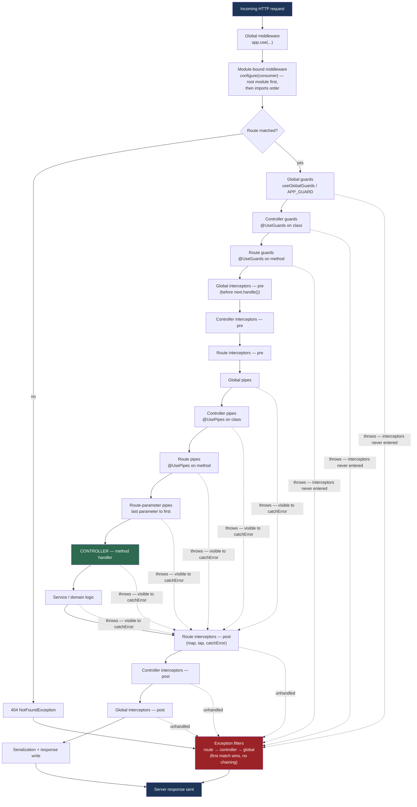

# Chapter 13 — Custom Decorators and the Complete Request Lifecycle

> **한눈에 보기**
> 지금까지 미들웨어, 가드, 인터셉터, 파이프, 예외 필터를 하나씩 배웠습니다. 이 장은
> 그 조각들을 두 방향에서 묶습니다. 앞부분은 "데코레이터는 결국 함수다"에서 출발해
> `SetMetadata`/`Reflector`, `createParamDecorator`, `applyDecorators`를 다루고,
> 뒷부분은 요청이 들어와 응답이 나갈 때까지 이 구성 요소들이 **정확히 어떤 순서로**
> 실행되는지를 전체 그림으로 정리합니다.

**What you will learn**

- Why a decorator is nothing more than a function that runs once at class-definition time, and what Nest's metadata layer does with the result.
- How to attach and read route metadata with `SetMetadata` + `Reflector`, and why `Reflector.createDecorator<T>()` is the type-safe replacement to reach for first.
- How to build a `@User()` param decorator with `createParamDecorator`, how the `data`/`ExecutionContext` signature works, and how to pass a key (`@User('firstName')`).
- How pipes interact with custom param decorators, and why `ValidationPipe` ignores them unless `validateCustomDecorators` is `true`.
- How to collapse four decorators into one reusable `@Auth('admin')` with `applyDecorators`, and which decorators refuse to compose.
- The complete request lifecycle in exact execution order, and where an error surfaces depending on whether a guard, a pipe, the handler, or an interceptor threw it.

**Why this matters**

Here is a bug report you will eventually receive: "the `RolesGuard` reads `request.user`, but it is `undefined` — even though `AuthGuard` clearly sets it." The developer "fixes" it by moving the authentication logic into an interceptor, and now the guard sees `undefined` *always*. That is not a bug in Nest; it is a misunderstanding of ordering. Interceptors run *after* guards, so anything an interceptor attaches to the request is invisible to every guard. Nothing in the type system tells you this. The only way to know is to have the lifecycle in your head.

The other half of this chapter — custom decorators — keeps the pipeline from leaking into your controllers. Once guards start attaching things to the raw request object, every handler ends up with `@Req() req` and `const user = req.user as UserEntity`: a type lie (`req.user` is `any`), a coupling to Express, and something untestable without a fake request. A three-line param decorator removes all three at once. Learn both halves together — they are the same subject: decorators are how you *declare* pipeline participation, and the lifecycle is *when* that declaration is honored.

## 1. A decorator is a function that runs once

Strip away the syntax and a decorator is an expression that evaluates to a function, applied with `@` immediately above a class, method, accessor, property, or parameter. The classic definition: *an ES2016 decorator is an expression which returns a function and can take a target, name and property descriptor as arguments.*

Nest is built on the *legacy* TypeScript decorators (`experimentalDecorators: true`), which is what the generated project enables. Write the simplest possible one:

```typescript title="trace.decorator.ts"
export function Trace(): MethodDecorator {
  return (target, propertyKey) => {
    console.log('Trace applied to', target.constructor.name, String(propertyKey));
  };
}
```

Hang `@Trace()` above a `@Get()` handler and the log line appears **once, at import time** — before `NestFactory.create()` runs, and regardless of how many requests arrive. This is the single most important fact about decorators:

> **⚠️ Notice** — A decorator body executes exactly once, when the class is defined. It does **not** run per request. Anything that must happen per request has to be stored as metadata now and read back later by a guard, interceptor, pipe, or the param-resolution machinery.

`@Get()`, `@Controller()`, `@Injectable()`, and `@UseGuards()` all do exactly this: write metadata onto the class or method via `Reflect.defineMetadata` from the `reflect-metadata` polyfill. At bootstrap Nest walks every controller in the module graph, reads that metadata back, and builds the router. No magic runtime — only a write phase (decorators) and a read phase (bootstrap and per-request resolution).

### The built-in param decorators

Every built-in param decorator is a thin wrapper over a property of the request object:

| Decorator | Resolves to |
|---|---|
| `@Request()`, `@Req()` / `@Response()`, `@Res()` / `@Next()` | `req` / `res` / `next` |
| `@Session()` | `req.session` |
| `@Param(key?)` / `@Body(key?)` / `@Query(key?)` | `req.params` / `req.body` / `req.query`, or `[key]` of each |
| `@Headers(key?)` | `req.headers` / `req.headers[key]` |
| `@Ip()` / `@HostParam()` | `req.ip` / `req.hosts` |

Custom param decorators, built in §4, join this same table — Nest gives them no second-class treatment.

## 2. Attaching metadata: `SetMetadata` and `Reflector`

`SetMetadata(key, value)` is the low-level way to tag a handler or a controller. In [Chapter 11 — Guards](./11-guards.md) you used it for roles; here is the whole loop.

```typescript title="roles.decorator.ts"
import { SetMetadata } from '@nestjs/common';

export type Role = 'admin' | 'editor' | 'reader';

export const ROLES_KEY = 'roles';
export const Roles = (...roles: Role[]) => SetMetadata(ROLES_KEY, roles);
```

A guard reads it back through the injectable `Reflector`, using the same `ROLES_KEY` string. Three `Reflector` methods matter; the wrong one causes "my roles metadata is ignored" bugs:

| Method | Behavior |
|---|---|
| `get(key, target)` | Reads one target only. |
| `getAllAndOverride(key, [handler, class])` | Returns the **first** non-undefined value. Method wins over controller. |
| `getAllAndMerge(key, [handler, class])` | Concatenates/merges both levels into one array or object. |

Use `getAllAndOverride` when the method should *replace* the controller's declaration (roles, cache TTL); `getAllAndMerge` when both levels should *accumulate* (required scopes). The array order matters: `[getHandler(), getClass()]` puts the method first, which is what "method overrides controller" means. Reverse it and you reverse the precedence — silently.

## 3. Type-safe metadata: `Reflector.createDecorator<T>()`

The problem with `SetMetadata` is that the key is a bare string shared by convention across two files, and the value type is merely *asserted* at the read site (`getAllAndOverride<Role[]>`). Nothing checks that writer and reader agree: change `Roles` to accept a single role instead of a rest parameter and the guard still compiles, then fails at runtime. Nest 9 introduced a strictly better tool, and in v11 it is the recommended default:

```typescript title="roles.decorator.ts"
import { Reflector } from '@nestjs/core';

export type Role = 'admin' | 'editor' | 'reader';

export const Roles = Reflector.createDecorator<Role[]>();
```

```typescript title="roles.guard.ts (excerpt)"
// `required` is inferred as Role[] | undefined — no generic, no string key
const required = this.reflector.getAllAndOverride(Roles, [
  context.getHandler(),
  context.getClass(),
]);
```

Usage changes slightly: the decorator now takes exactly one argument of type `T` — `@Roles(['admin'])` instead of `@Roles('admin', 'editor')`. If you prefer rest-parameter ergonomics, keep a thin wrapper around it. The point is that the key is an opaque object owned by one module, and the value type flows automatically from decorator to `Reflector`: no string to typo, no generic to get wrong. `createDecorator` also accepts a `transform` option to normalize values at write time.

**Recommendation:** use `Reflector.createDecorator` for all new metadata; keep `SetMetadata` only to interoperate with a library that publishes a documented string key.

## 4. `createParamDecorator`: making the request disappear

In the Node.js world it is common practice to attach properties to the request object and extract them by hand in each handler — `const user = req.user;`, where `req.user` is typed `any` and the compiler has stopped helping you. `createParamDecorator` takes a factory and returns a decorator you hang on a parameter; the factory's return value *becomes* that parameter:

```typescript title="user.decorator.ts"
import { createParamDecorator, ExecutionContext } from '@nestjs/common';

export const User = createParamDecorator(
  (data: unknown, ctx: ExecutionContext) => {
    const request = ctx.switchToHttp().getRequest();
    return request.user;
  },
);
```

Use it wherever it fits: `async findOne(@User() user: UserEntity)`. The signature is `(data, ctx: ExecutionContext) => any`:

- **`data`** is whatever the caller passed at the decoration site: `@User('firstName')` gives `data === 'firstName'`, plain `@User()` gives `undefined`.
- **`ctx`** is an `ExecutionContext`, the same object your guards and interceptors receive. It extends `ArgumentsHost`, so `ctx.switchToHttp()`, `ctx.switchToWs()`, `ctx.switchToRpc()`, `ctx.getHandler()`, and `ctx.getClass()` are all available — meaning a param decorator can read route metadata, and the same `@User()` works unchanged in a WebSocket gateway if you branch on `ctx.getType()` (see [Chapter 40 — Execution Context](../part3-advanced/40-execution-context.md)).

Unlike the decorator *body* from §1, the **factory runs on every request**, during parameter resolution, immediately before the handler is called. That is the whole trick: the decorator writes metadata once ("for parameter 0, call this factory"), and the factory does the per-request work.

## 5. Passing data to the decorator

Assume your authentication layer validates the request and attaches a user entity such as `{ "id": 101, "firstName": "Alan", "lastName": "Turing", "email": "alan@email.com", "roles": ["admin"] }`. You often want one field, not the whole entity — use `data` as a property key:

```typescript title="user.decorator.ts"
import { createParamDecorator, ExecutionContext } from '@nestjs/common';

export const User = createParamDecorator(
  (data: string | undefined, ctx: ExecutionContext) => {
    const user = ctx.switchToHttp().getRequest().user;
    return data ? user?.[data] : user;
  },
);
```

Now `async findOne(@User('firstName') firstName: string)` gets just the name. The same decorator serves both shapes, and deep or awkward user objects stop leaking into handlers.

> **Hint** — `createParamDecorator<T>()` is generic: `createParamDecorator<string>((data, ctx) => ...)` types `data` as `string`. You can also annotate the factory parameter directly, as above. If you do neither, `data` is `any`.

Tighten it further by declaring an `AuthenticatedUser` interface and typing `data` as `keyof AuthenticatedUser`, so a misspelled key becomes a compile error — the final form appears in "Putting it together".

> **⚠️ Notice** — A param decorator cannot fix a missing user. If no guard ran, or it did not attach `request.user`, the decorator returns `undefined` and the handler crashes one line later with a confusing message. The decorator's job is *extraction*; authentication stays the guard's job. Type the parameter as `AuthenticatedUser` only on routes you know are guarded.

## 6. Pipes on custom param decorators

Nest treats custom param decorators exactly like `@Body()`, `@Param()`, and `@Query()`. So **global and route pipes run over your custom parameter too**, and you can attach a pipe directly to the decorator, as with `@Param('id', ParseIntPipe)`:

```typescript
@Get()
async findOne(
  @User(new ValidationPipe({ validateCustomDecorators: true }))
  user: UserEntity,
) {
  console.log(user);
}
```

> **Hint** — `validateCustomDecorators` **must** be `true`. `ValidationPipe` skips custom-decorator arguments by default, because most of them (like `@User()`) return objects never meant to be validated as DTOs. Turning it on globally would revalidate your session user on every request.

Note the ordering: the *factory* runs first, producing a value; the *pipes* then transform or validate it; only then is the handler invoked. So `@User('id', ParseIntPipe)` yields a `number`, because `ParseIntPipe` sees the string your factory returned.

## 7. Composing decorators with `applyDecorators`

An admin endpoint often needs four decorators that always travel together — metadata, guards, and two Swagger annotations:

```typescript
@Roles(['admin'])
@UseGuards(AuthGuard, RolesGuard)
@ApiBearerAuth()
@ApiUnauthorizedResponse({ description: 'Unauthorized' })
@Get('users')
findAllUsers() {}
```

Repeat that on twenty routes and one will eventually be missing `RolesGuard`. `applyDecorators` folds the stack into one named decorator expressing the *intent*:

```typescript title="auth.decorator.ts"
import { applyDecorators, SetMetadata, UseGuards } from '@nestjs/common';
import { ApiBearerAuth, ApiUnauthorizedResponse } from '@nestjs/swagger';
import { AuthGuard, RolesGuard } from './auth.guards';
import { Role } from './roles.decorator';

export function Auth(...roles: Role[]) {
  return applyDecorators(
    SetMetadata('roles', roles),
    UseGuards(AuthGuard, RolesGuard),
    ApiBearerAuth(),
    ApiUnauthorizedResponse({ description: 'Unauthorized' }),
  );
}
```

```typescript
@Get('users')
@Auth('admin')
findAllUsers() {}
```

One declaration, four effects — and a rule you can no longer break: because `Auth()` always includes `AuthGuard` *and* `RolesGuard`, no route can be "role-checked but not authenticated". `applyDecorators` accepts any mix of class and method decorators, applied in the order listed; `UseGuards(AuthGuard, RolesGuard)` binds both at the same level, so they run left to right — `AuthGuard` first, which is what attaches `request.user` for `RolesGuard`.

> **⚠️ Notice** — `@ApiHideProperty()` from `@nestjs/swagger` is **not** composable and will not work correctly inside `applyDecorators`. It is a property decorator that the Swagger plugin inspects structurally. Apply it directly.

---

## 8. The complete request lifecycle

Everything above declares *participation*; this section is about *order*. Nest processes every request through a fixed pipeline, and knowing it by heart turns most "why didn't my X run" questions into a two-second answer.



The same pipeline as a numbered reference table:

| # | Stage (and how it is bound) | Ordering rule within the stage |
|---|---|---|
| 1 | Incoming request | Platform (Express v5 / Fastify) receives the socket. |
| 2.1 | Global middleware — `app.use(...)` | Registration order, sequential. |
| 2.2 | Module middleware — `configure(consumer)` | Root module first, then `imports` order; within a module, `apply()` order. |
| 3.1 | Global guards — `useGlobalGuards()` / `APP_GUARD` | Binding order. |
| 3.2 | Controller guards — `@UseGuards()` on the class | Left to right in the argument list. |
| 3.3 | Route guards — `@UseGuards()` on the method | Left to right. |
| 4.1 | Global interceptors (pre) — `APP_INTERCEPTOR` | Binding order. |
| 4.2 | Controller interceptors (pre) — `@UseInterceptors()` | Left to right. |
| 4.3 | Route interceptors (pre) — `@UseInterceptors()` | Left to right. |
| 5.1 | Global pipes — `useGlobalPipes()` / `APP_PIPE` | Binding order. |
| 5.2 | Controller pipes — `@UsePipes()` on the class | Left to right. |
| 5.3 | Route pipes — `@UsePipes()` on the method | Left to right. |
| 5.4 | Route-parameter pipes — `@Body(P)`, `@Param('id', P)`, `@User(P)` | **Last parameter to first**, then left to right among that parameter's pipes. |
| 6 | Controller method handler | Your code. |
| 7 | Service / domain layer | Your code. |
| 8.1 | Route interceptors (post) | **Reverse** of the pre-phase: first-in, last-out. |
| 8.2 | Controller interceptors (post) | Reverse. |
| 8.3 | Global interceptors (post) | Reverse. |
| 9.1 | Route exception filters — `@UseFilters()` on the method | Lowest level first. |
| 9.2 | Controller exception filters — `@UseFilters()` on the class | Then controller level. |
| 9.3 | Global exception filters — `useGlobalFilters()` / `APP_FILTER` | Last resort. |
| 10 | Server response | Headers + body written to the socket. |

Read it as three movements: **inbound** widens from global to specific (2 → 5), the **handler** sits in the middle (6 → 7), and the **outbound** path narrows back to global (8). Filters are the exception and run bottom-up.

## 9. Ordering rules, stage by stage

### Middleware

Global middleware bound with `app.use()` runs first, then module-bound middleware from `configure(consumer)`, matched on paths. Across modules the root module's middleware runs first, then each imported module in `imports` order; within a module, in `apply()` order — exactly like Express. Because middleware runs before route resolution it has **no `ExecutionContext`**: it cannot read route metadata, and a route-level `@UseFilters()` cannot catch an exception thrown there ([Chapter 8 — Middleware](./08-middleware.md)).

### Guards

Global → controller → route, in binding order at each level:

```typescript
@UseGuards(Guard1, Guard2)
@Controller('cats')
export class CatsController {
  constructor(private catsService: CatsService) {}

  @UseGuards(Guard3)
  @Get()
  getCats(): Cats[] {
    return this.catsService.getCats();
  }
}
```

`Guard1` runs before `Guard2`, and both before `Guard3`. Any guard returning `false` (or throwing) stops the chain immediately with a `ForbiddenException` and jumps straight to filters — no interceptor, no pipe, no handler.

> **Hint** — "Global" means *where it is bound*, not where the class lives. `useGlobalGuards()` or a provider under the `APP_GUARD` token is global; a decorator above a class is controller-bound; above a method, route-bound. Prefer `APP_GUARD` — only it can inject dependencies.

### Interceptors

Interceptors follow the guard pattern on the way in, with one twist: because each returns an RxJS `Observable`, the response side resolves **first-in, last-out**. Global wraps controller, which wraps route — so a request goes global → controller → route, and the response comes back route → controller → global. That nesting is why the outer (global) interceptor sees the final duration and final response body while the inner (route) interceptor sees the raw handler return value, and why any error thrown by a pipe, the controller, or a service can be observed in an interceptor's `catchError` — but an error thrown by a *guard* never can, because no interceptor had been entered yet.

### Pipes

Pipes follow global → controller → route, first-in-first-out within `@UsePipes()`. The counter-intuitive part is the parameter level: when a handler has several parameters carrying pipes, they run **from the last parameter to the first**.

```typescript
@UsePipes(GeneralValidationPipe)
@Controller('cats')
export class CatsController {
  @UsePipes(RouteSpecificPipe)
  @Patch(':id')
  updateCat(
    @Body() body: UpdateCatDTO,
    @Param() params: UpdateCatParams,
    @Query() query: UpdateCatQuery,
  ) {
    return this.catsService.updateCat(body, params, query);
  }
}
```

`GeneralValidationPipe` runs for `query`, then `params`, then `body`; then `RouteSpecificPipe` runs in that same reversed order. Parameter-specific pipes run last, again last parameter to first. This rarely matters — until you write a pipe with a side effect, at which point it matters a great deal. **Recommendation:** never give a pipe a side effect. Pipes transform and validate; nothing else.

### Filters

Filters are the only component that does **not** resolve global-first: execution starts at the lowest level available — route-bound, then controller, then global. And **exceptions cannot pass from filter to filter**: once a route-level filter catches one, no controller or global filter sees it. The only way to layer behavior is inheritance (extend `BaseExceptionFilter`, call `super.catch(...)`).

> **Hint** — Filters run **only for uncaught exceptions**. An error caught in a `try/catch` inside a service never reaches one. As soon as an uncaught exception appears, the rest of the lifecycle is abandoned and the request jumps straight to the filter stage.

## 10. What runs on the error path — and what does not

The rule: **the pipeline is abandoned at the point of the throw and control transfers to the filter stage.** What differs is how much of it had already been entered.

| Throw site | Interceptors entered? | `catchError` sees it? | Filters run? |
|---|---|---|---|
| Middleware (global or module) | No | No | Global filters only |
| Any guard | No | No | Yes (route → controller → global) |
| Interceptor pre-phase | Outer ones only | Outer ones do | Yes |
| Any pipe (incl. parameter pipes) | Yes | **Yes** | Yes |
| Controller handler or service | Yes | **Yes** | Yes |
| Interceptor post-phase | Yes | Outer ones do | Yes |

Three consequences worth memorizing:

1. **A logging interceptor cannot log authentication failures.** Guards run first; emit 401s from a global exception filter or from middleware instead.
2. **A guard cannot read anything an interceptor attached.** Same fact, other direction: if two components share request state and one is a guard, the producer must be middleware or an earlier guard.
3. **Route-level filters swallow exceptions.** A `@UseFilters()` on a method means your global filter — the one reporting to Sentry — never fires for that route. Bind filters globally by default.

One more: with `@Res()` and no `passthrough: true`, Nest hands you the response object and stops managing it — post-phase interceptors still run, but their `map()` return value is discarded because nothing writes it. Use `@Res({ passthrough: true })` when you only need to set a header or a cookie.

## Common mistakes

1. **Expecting a decorator body to run per request.**
   *Symptom:* a `@CurrentTimestamp()` decorator always returns the boot time. *Cause:* the code sits in the decorator function itself, which runs once at class definition. *Fix:* move per-request work into the `createParamDecorator` factory.

2. **A guard reads state that an interceptor set.**
   *Symptom:* `request.user` is `undefined` inside `RolesGuard`, but logging it in the handler shows a value. *Cause:* guards (stage 3) run before interceptors (stage 4). *Fix:* if a guard must consume it, attach it in middleware or an earlier guard — never in an interceptor.

3. **`ValidationPipe` silently skipping a custom param decorator.**
   *Symptom:* `@User() user: UserDto` accepts garbage even with a global `ValidationPipe`. *Cause:* `validateCustomDecorators` defaults to `false`. *Fix:* `@User(new ValidationPipe({ validateCustomDecorators: true }))` on that parameter — do not flip it globally, or every request revalidates the session user.

4. **Reversing the `Reflector` target array.**
   *Symptom:* a method-level `@Roles(['admin'])` is ignored and the controller value wins. *Cause:* `[context.getClass(), context.getHandler()]` — class listed first. *Fix:* always `[getHandler(), getClass()]`; first non-undefined wins.

5. **Route-level exception filters hiding errors from observability.**
   *Symptom:* one endpoint's 500s never reach Sentry. *Cause:* a route `@UseFilters()` caught the exception, and filters do not chain. *Fix:* remove it, or `extends BaseExceptionFilter` and call `super.catch(exception, host)`.

6. **Using `useGlobalGuards()` for a guard that needs DI.**
   *Symptom:* `Cannot read properties of undefined (reading 'get')` on `this.reflector`. *Cause:* `app.useGlobalGuards(new RolesGuard())` builds the instance outside the DI container. *Fix:* register `{ provide: APP_GUARD, useClass: RolesGuard }` in a module.

7. **Assuming a middleware exception hits a controller-level filter.**
   *Symptom:* a controller `@UseFilters()` never sees an error thrown in middleware; likewise `@ApiHideProperty()` inside `applyDecorators` does nothing. *Cause:* middleware runs before route resolution, so there is no controller context — only global filters apply; and `@ApiHideProperty()` is not composable. *Fix:* handle middleware errors in a global filter, and apply `@ApiHideProperty()` directly on the property.

## Putting it together

One module exercising every idea in this chapter: type-safe metadata, a param decorator with `data` support, a composed `@Auth()`, and an interceptor whose ordering you can observe.

```typescript title="auth/auth.metadata.ts"
import { createParamDecorator, ExecutionContext } from '@nestjs/common';
import { Reflector } from '@nestjs/core';

export type Role = 'admin' | 'editor' | 'reader';
export const Roles = Reflector.createDecorator<Role[]>();

export interface AuthenticatedUser {
  id: number;
  firstName: string;
  roles: Role[];
}

export const User = createParamDecorator(
  (data: keyof AuthenticatedUser | undefined, ctx: ExecutionContext) => {
    const user: AuthenticatedUser | undefined = ctx.switchToHttp().getRequest().user;
    return data ? user?.[data] : user;
  },
);
```

```typescript title="auth/auth.guards.ts"
import {
  CanActivate, ExecutionContext, ForbiddenException,
  Injectable, UnauthorizedException,
} from '@nestjs/common';
import { Reflector } from '@nestjs/core';
import { Roles } from './auth.metadata';

@Injectable()
export class AuthGuard implements CanActivate {
  canActivate(context: ExecutionContext): boolean {
    const request = context.switchToHttp().getRequest();
    // Toy token format: "Bearer 101:Alan:admin"
    const [, token] = (request.headers.authorization ?? '').split(' ');
    if (!token) throw new UnauthorizedException('Missing bearer token');

    const [id, firstName, ...roles] = token.split(':');
    request.user = { id: Number(id), firstName, roles };
    return true;
  }
}

@Injectable()
export class RolesGuard implements CanActivate {
  constructor(private readonly reflector: Reflector) {}

  canActivate(context: ExecutionContext): boolean {
    const required = this.reflector.getAllAndOverride(Roles, [
      context.getHandler(),
      context.getClass(),
    ]);
    if (!required?.length) return true;

    const { user } = context.switchToHttp().getRequest();
    if (!required.some((r) => user?.roles?.includes(r))) {
      throw new ForbiddenException(`Requires one of: ${required.join(', ')}`);
    }
    return true;
  }
}
```

`auth/auth.decorator.ts` is the §7 composition, minus the Swagger pieces:

```typescript
export function Auth(...roles: Role[]) {
  return applyDecorators(Roles(roles), UseGuards(AuthGuard, RolesGuard));
}
```

```typescript title="common/timing.interceptor.ts"
import { CallHandler, ExecutionContext, Injectable, NestInterceptor } from '@nestjs/common';
import { Observable, tap } from 'rxjs';

@Injectable()
export class TimingInterceptor implements NestInterceptor {
  constructor(private readonly label: string) {}

  intercept(context: ExecutionContext, next: CallHandler): Observable<unknown> {
    const started = Date.now();
    console.log(`[${this.label}] ->`);
    return next
      .handle()
      .pipe(tap(() => console.log(`[${this.label}] <- ${Date.now() - started}ms`)));
  }
}
```

```typescript title="articles/articles.controller.ts"
import { Controller, Get, Param, ParseIntPipe, UseInterceptors } from '@nestjs/common';
import { Auth } from '../auth/auth.decorator';
import { AuthenticatedUser, User } from '../auth/auth.metadata';
import { TimingInterceptor } from '../common/timing.interceptor';

@Controller('articles')
@UseInterceptors(new TimingInterceptor('controller'))
export class ArticlesController {
  @Get('me')
  @Auth('reader', 'editor', 'admin')
  @UseInterceptors(new TimingInterceptor('route'))
  whoAmI(@User() user: AuthenticatedUser, @User('firstName') name: string) {
    return { greeting: `Hello ${name}`, user };
  }

  @Get('drafts/:id')
  @Auth('admin')
  findDraft(@Param('id', ParseIntPipe) id: number) {
    return { id, status: 'draft' };
  }
}
```

Call `GET /articles/me` with `Authorization: Bearer 101:Alan:admin` and the console prints `[controller] ->`, `[route] ->`, `[route] <-`, `[controller] <-` — the first-in-last-out rule of §9 in four lines. Call it without the header and *no* timing line appears, because `AuthGuard` threw before any interceptor was entered.

> **핵심 정리**
> - 데코레이터는 클래스 정의 시점에 **한 번** 실행되는 함수다. 요청마다 도는 것이 아니라, 메타데이터를 써 두면 부트스트랩과 요청 처리 단계가 그것을 읽는다.
> - `SetMetadata` + `Reflector`는 문자열 키에 의존한다. 새 코드에는 타입 안전한 `Reflector.createDecorator<T>()`를 쓰라.
> - `getAllAndOverride`는 첫 번째 non-undefined 값을, `getAllAndMerge`는 병합 결과를 준다. `[getHandler(), getClass()]` 순서가 "메서드가 컨트롤러를 덮어쓴다"는 규칙을 만든다.
> - `createParamDecorator((data, ctx) => ...)`의 **팩토리**는 요청마다 실행된다. `ctx`는 `ExecutionContext`이므로 HTTP·WS·RPC 어디서든 동작할 수 있다.
> - `ValidationPipe`는 커스텀 파라미터 데코레이터를 기본적으로 검사하지 않는다. `validateCustomDecorators: true`가 필요하다.
> - `applyDecorators`로 `@Auth(...roles)`를 만들면 "가드 하나를 빠뜨리는" 실수가 구조적으로 사라진다. 단 `@ApiHideProperty()`는 합성되지 않는다.
> - 요청 순서: 미들웨어 → 가드 → 인터셉터(pre) → 파이프 → 핸들러 → 서비스 → 인터셉터(post) → 필터 → 응답. 들어올 때는 global→route, 나갈 때는 route→global.
> - 필터만 유일하게 **아래에서 위로**(route → controller → global) 해석되고 예외를 서로 넘겨주지 않는다. 가드에서 던진 예외는 인터셉터의 `catchError`에 잡히지 않지만, 파이프·핸들러·서비스의 예외는 잡힌다.

> **연습 문제**
> 1. `@Trace()` 메서드 데코레이터를 만들어 `console.log`를 넣고, 서버를 띄운 뒤 요청을 10번 보내라. 로그가 몇 번 찍히는가? 그 이유를 한 문단으로 설명하라.
> 2. `Reflector.createDecorator<number>()`로 `@CacheTtl(30)` 데코레이터를 만들고, 컨트롤러와 메서드 양쪽에 서로 다른 값을 붙여라. `getAllAndOverride`와 `getAllAndMerge`의 결과 차이를 직접 출력해 비교하라.
> 3. **직접 구현:** `@ClientInfo()` 파라미터 데코레이터를 만들어라. 인자 없이 쓰면 `{ ip, userAgent, acceptLanguage }` 객체를, `@ClientInfo('ip')`처럼 키를 주면 해당 값만 반환해야 한다.
> 4. **직접 구현:** `applyDecorators`로 `@PublicJson(description: string)`을 만들어라. `@HttpCode(200)`, `@Header('Cache-Control', 'public, max-age=60')`, 그리고 커스텀 메타데이터 `@IsPublic()`을 한 번에 적용해야 한다.
> 5. 전역·컨트롤러·라우트 인터셉터를 하나씩 만들어 진입/이탈 시점에 이름을 출력하게 하고, 출력 순서가 §9의 first-in-last-out 규칙과 일치하는지 확인하라.
> 6. 가드에서 예외를 던졌을 때와 파이프에서 예외를 던졌을 때 인터셉터의 `catchError`가 각각 호출되는지 실험으로 확인하고, 그 차이를 설명하라.

**Next:** [Chapter 14 — Building Your First Complete CRUD Application](./14-first-crud-application.md) assembles every Part I building block — controllers, providers, modules, DI, pipes, guards, interceptors, filters, and the decorators you just wrote — into one coherent, runnable REST API.
