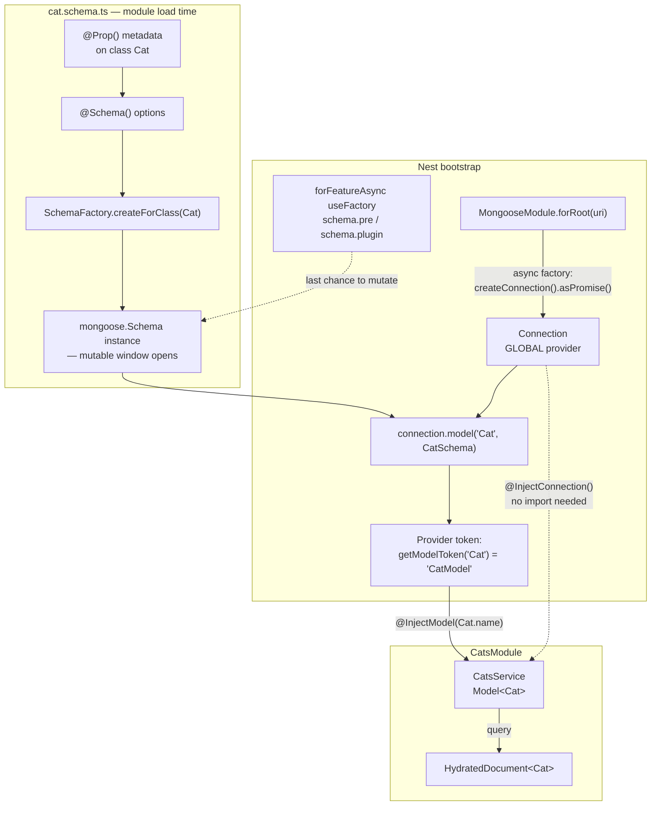

# Chapter 21 — MongoDB with Mongoose

> **한눈에 보기**
> 이 장은 `@nestjs/mongoose`로 MongoDB를 다루는 방법을 처음부터 끝까지 설명합니다.
> `@Schema()`/`@Prop()` 데코레이터가 어떻게 Mongoose 스키마로 컴파일되는지, `Model`이
> 왜 클래스가 아니라 **토큰**으로 주입되는지, 참조와 population·가상 필드·인덱스·
> 디스크리미네이터·훅과 플러그인·트랜잭션을 어떻게 배선하는지를 다룹니다. 19장의
> TypeORM과 같은 모듈 패턴이 반복되지만, MongoDB에는 스키마 마이그레이션이 없다는 점이
> 모든 설계 결정을 바꿉니다. 그 차이가 이 장의 진짜 주제입니다.

**What you will learn**

- What `MongooseModule.forRoot()` registers at bootstrap, and why a `Model` is injectable only where `forFeature()` declared it while `Connection` is injectable everywhere.
- How `SchemaFactory.createForClass()` turns decorator metadata into a real `mongoose.Schema`, and why `HydratedDocument<Cat>` — not `Cat` — is the type of what comes back from a query.
- Every `@Prop()` option that matters, when TypeScript's reflected type is enough, and the three cases where it is not.
- How to model references and use `populate()` without turning a list endpoint into N+1 queries.
- Why a schema hook registered after `SchemaFactory` runs is silently ignored, and how `forFeatureAsync()` fixes it.
- How to run a multi-document transaction with sessions, and the replica-set requirement nobody mentions until it fails in production.
- How to test a service with `getModelToken()` for units and `mongodb-memory-server` for integration.

**Why this matters**

A team ships a Nest service on MongoDB. The `Cat` schema gains a `@Prop({ required: true }) breed: string`. Everything passes. In production, half the read paths start throwing `Cast to string failed` and the other half return `undefined` for `breed`. The reason: MongoDB has no schema. Mongoose's schema is a *client-side* contract that applies to writes made through Mongoose — the two million documents already in the collection were written before `breed` existed, and nothing on the server enforces anything. There was no migration because there was nothing to migrate; there was also no error, because MongoDB happily stored documents of a shape your code no longer expects.

That is the central fact of this chapter. In [Chapter 19](19-sql-with-typeorm.md) the database owned the schema and TypeORM described it. Here Mongoose owns the schema and the database does not know it exists. Everything downstream follows: `required` is a validation rule, not a constraint; a `ref` is a convention, not a foreign key; there is no `JOIN`, so `populate()` is a second query your ORM issues on your behalf. Understanding *where* enforcement happens — application or server — is what separates a MongoDB service that ages well from one that accumulates a decade of undocumented document shapes.

The second reason this chapter matters is the schema decorators themselves. `@Schema()`/`@Prop()` are not a thin wrapper — they are a metadata-driven compiler that produces a Mongoose schema at class-decoration time. Most of the confusing behaviour people hit (hooks that never fire, arrays typed as `Mixed`, virtuals missing from JSON output) comes from not knowing *when* that compilation happens. This chapter makes the timing explicit.

## Connecting: what `forRoot()` registers

```bash
$ npm i @nestjs/mongoose mongoose
```

```typescript title="app.module.ts"
import { Module } from '@nestjs/common';
import { MongooseModule } from '@nestjs/mongoose';

@Module({
  imports: [MongooseModule.forRoot('mongodb://localhost/nest')],
})
export class AppModule {}
```

`forRoot()` takes a connection URI and an optional options object, which is the same options object `mongoose.connect()` accepts, plus a few Nest-specific ones. Like `TypeOrmModule.forRoot()`, it is a dynamic module whose central provider is an **async factory**: it calls `mongoose.createConnection(uri, options).asPromise()` and only resolves once the connection is open. Everything that depends on it — every `Model`, every service holding one — waits.

What ends up in the container:

| Token | Value | Scope |
|---|---|---|
| `getConnectionToken()` (`'DatabaseConnection'`) | The `mongoose.Connection` | **Global** — injectable anywhere |
| `getConnectionToken('cats')` | A named connection | Global |
| `getModelToken(Cat.name)` (`'CatModel'`) | The compiled `Model<Cat>` | Only where `forFeature()` declared it |

That split matters. `@InjectConnection()` works in any provider in any module without importing `MongooseModule` again. `@InjectModel(Cat.name)` works only in modules that called `MongooseModule.forFeature([{ name: Cat.name, schema: CatSchema }])` or that import a module which exports `MongooseModule`.

### Nest-specific options

| Option | Purpose |
|---|---|
| `connectionName` | Names the connection. Mandatory once you have more than one. |
| `retryAttempts` | Connection retries before bootstrap fails (default `10`). |
| `retryDelay` | Milliseconds between retries (default `3000`). |
| `connectionFactory` | Receives the `Connection` before models are compiled — the hook for global plugins. |
| `connectionErrorFactory` | Transforms connection errors before they propagate. |
| `onConnectionCreate` | Receives the `Connection` to attach event listeners. |
| `lazyConnection` | Defers the actual connect until first use. |

Everything else — `dbName`, `user`, `pass`, `authSource`, `maxPoolSize`, `serverSelectionTimeoutMS`, `replicaSet`, `tls` — is passed straight to the driver.

Two of these deserve real attention. `maxPoolSize` defaults to 100, which is far too many if you run 20 replicas against a small Atlas cluster (2,000 connections will exhaust it); set it deliberately. And `serverSelectionTimeoutMS` defaults to 30 seconds, which means a misconfigured URI makes your health check hang for half a minute rather than failing fast.

## Schemas: `@Schema`, `@Prop`, and `SchemaFactory`

With Mongoose everything derives from a **Schema**. A schema maps to a collection and defines the shape of its documents. Schemas produce **Models**, and models create and read documents.

You can write a schema by hand, exactly as in plain Mongoose:

```typescript
export const CatSchema = new mongoose.Schema({
  name: String,
  age: Number,
  breed: String,
});
```

Or you can let Nest's decorators build it, which is what you should do — the class doubles as your TypeScript type, which the handwritten form cannot.

```typescript title="cats/schemas/cat.schema.ts"
import { Prop, Schema, SchemaFactory } from '@nestjs/mongoose';
import { HydratedDocument } from 'mongoose';

export type CatDocument = HydratedDocument<Cat>;

@Schema()
export class Cat {
  @Prop()
  name: string;

  @Prop()
  age: number;

  @Prop()
  breed: string;
}

export const CatSchema = SchemaFactory.createForClass(Cat);
```

Three pieces, and the order they execute in is what most confusion comes down to:

1. **`@Prop()`** runs at class-decoration time. It reads `design:type` metadata that TypeScript's `emitDecoratorMetadata` emits, and stores a property definition on the class.
2. **`@Schema()`** marks the class as a schema definition and records its options. It maps the class to a collection named after it, lowercased and pluralized — `Cat` becomes `cats`. Its single optional argument is the object you would pass as the second argument to `new mongoose.Schema(_, options)`.
3. **`SchemaFactory.createForClass(Cat)`** reads all of that metadata and constructs the actual `mongoose.Schema`. **This is the moment the schema exists.** Anything you want on the schema — hooks, plugins, compound indexes — must happen *after* this call and *before* the model is compiled. That window is what `forFeatureAsync()` exists for.

> **Hint** — You can also generate a raw schema definition with `DefinitionsFactory` (from `@nestjs/mongoose`) and edit it before handing it to `new mongoose.Schema()`. This is an escape hatch for edge cases the decorators cannot express.

### `HydratedDocument` and why `Cat` is not what you get

`this.catModel.findOne()` does not return a `Cat`. It returns a Mongoose *document* — an object that has `_id`, `save()`, `toObject()`, `isModified()`, change tracking, and your properties. `HydratedDocument<Cat>` is the type that expresses this:

```typescript
export type CatDocument = HydratedDocument<Cat>;
```

Use `Cat` when you mean "the shape of the data" (DTO mapping, function arguments), and `CatDocument` when you mean "a live document you might mutate and save". Typing a repository method as `Promise<Cat>` and then calling `.save()` on the result is a type error that reveals a real modelling confusion.

Older Nest material uses `Cat & Document` or an `interface Cat extends Document`. Both are obsolete in Mongoose 7+ — they produce broken types for `_id` and for populated paths. Use `HydratedDocument`.

### `@Prop()` options

The schema type is inferred from the TypeScript type via reflection, which covers `string`, `number`, `boolean`, `Date`, and `Buffer`. It does **not** cover arrays or nested object structures — reflection sees `Array` and `Object` and cannot tell you the element type. Those must be explicit:

```typescript
@Prop([String])
tags: string[];

@Prop({ type: [Number], default: [] })
scores: number[];
```

Otherwise `@Prop()` accepts an options object — the standard Mongoose SchemaType options:

| Option | Effect |
|---|---|
| `type` | Explicit schema type. Required for arrays, nested objects, `ObjectId`, and `Mixed`. |
| `required` | `true`, or `[true, 'message']`, or a function. **Validation on write through Mongoose only.** |
| `default` | A value or a function called per document (`default: () => new Date()`). |
| `unique` | Builds a **unique index**. Not a validator — a duplicate throws a driver `E11000` error, not a Mongoose `ValidationError`. |
| `index` | Builds a plain index on this path. |
| `sparse` | Index skips documents missing the path. Pair with `unique` for optional-unique fields. |
| `immutable` | Value can be set on insert but never changed. |
| `select` | `false` excludes the path from query results unless explicitly selected. Use for password hashes. |
| `ref` | Names the model this `ObjectId` points at, for `populate()`. |
| `enum` | Restricts allowed values (array or TS enum). |
| `min` / `max` | Numeric or `Date` bounds. |
| `minlength` / `maxlength` | String length bounds. |
| `match` | A `RegExp` the string must satisfy. |
| `lowercase` / `uppercase` / `trim` | String setters applied before validation. |
| `validate` | Custom validator function or `{ validator, message }`. |
| `get` / `set` | Getter/setter applied on access and assignment. |
| `alias` | A virtual with a different name that reads/writes the path. |
| `transform` | Applied when the document is converted with `toJSON`/`toObject`. |

Worked examples of each of the ones that matter:

```typescript title="owners/schemas/owner.schema.ts"
import { Prop, Schema, SchemaFactory, Virtual } from '@nestjs/mongoose';
import { HydratedDocument } from 'mongoose';

export type OwnerDocument = HydratedDocument<Owner>;

@Schema({ timestamps: true, collection: 'owners' })
export class Owner {
  @Prop({ required: true, trim: true, maxlength: 80 })
  firstName: string;

  @Prop({ required: true, trim: true, maxlength: 80 })
  lastName: string;

  @Prop({
    required: true,
    unique: true,
    lowercase: true,
    trim: true,
    match: /^[^@\s]+@[^@\s]+\.[^@\s]+$/,
  })
  email: string;

  // Never returned by a query unless you ask: .select('+passwordHash')
  @Prop({ required: true, select: false })
  passwordHash: string;

  @Prop({ type: String, enum: ['free', 'pro', 'enterprise'], default: 'free' })
  plan: string;

  @Prop({ immutable: true, default: () => new Date() })
  signedUpAt: Date;

  @Prop([String])
  roles: string[];

  @Virtual({
    get: function (this: Owner) {
      return `${this.firstName} ${this.lastName}`;
    },
  })
  fullName: string;
}

export const OwnerSchema = SchemaFactory.createForClass(Owner);
```

`@Schema({ timestamps: true })` adds `createdAt` and `updatedAt` and maintains them on every Mongoose write. Note *Mongoose* write: a `updateOne` issued through the native driver bypasses it entirely.

`select: false` on `passwordHash` is the single most valuable option in this table. It makes leaking the hash require an explicit act (`.select('+passwordHash')`) rather than being the default behaviour of every `find()`.

### Raw definitions and nested objects

When a property is a nested object that you do not want to define as its own class, pass a raw definition:

```typescript
import { Prop, raw } from '@nestjs/mongoose';

@Prop(raw({
  firstName: { type: String },
  lastName: { type: String },
}))
details: Record<string, any>;
```

`raw()` tells the decorator "this object literal is a schema definition, not an options object" — without it, `@Prop({ firstName: ... })` would be read as SchemaType options and produce nothing useful.

### Subdocuments

A nested *class* becomes a subdocument:

```typescript title="people/schemas/name.schema.ts"
import { Prop, Schema, SchemaFactory } from '@nestjs/mongoose';

@Schema()
export class Name {
  @Prop()
  firstName: string;

  @Prop()
  lastName: string;
}

export const NameSchema = SchemaFactory.createForClass(Name);
```

```typescript title="people/schemas/person.schema.ts"
import { Prop, Schema, SchemaFactory } from '@nestjs/mongoose';
import { HydratedDocument, Types } from 'mongoose';
import { Name, NameSchema } from './name.schema';

@Schema()
export class Person {
  @Prop(NameSchema)
  name: Name;
}

export const PersonSchema = SchemaFactory.createForClass(Person);

export type PersonDocumentOverride = {
  name: Types.Subdocument<Types.ObjectId> & Name;
};

export type PersonDocument = HydratedDocument<Person, PersonDocumentOverride>;
```

The `PersonDocumentOverride` is not optional pedantry. At runtime, `person.name` is a *subdocument* — it has its own `_id`, its own validation, and its own `parent()`. Typing it as a plain `Name` hides that. For arrays of subdocuments the override changes shape:

```typescript
@Schema()
export class Person {
  @Prop([NameSchema])
  name: Name[];
}

export const PersonSchema = SchemaFactory.createForClass(Person);

export type PersonDocumentOverride = {
  name: Types.DocumentArray<Name>;
};

export type PersonDocument = HydratedDocument<Person, PersonDocumentOverride>;
```

`Types.DocumentArray` is what gives you `person.name.id(someId)` and `person.name.pull(...)`.

**Embed or reference?** Embed when the child has no independent identity, is always loaded with the parent, and the array is bounded. Reference when the child is queried independently, is shared, or the collection is unbounded. The unbounded case is the one that kills services: MongoDB's 16 MB document limit is a hard ceiling, and a document that grows forever will hit it.

## Registering models: `forFeature` and `@InjectModel`

```typescript title="cats/cats.module.ts"
import { Module } from '@nestjs/common';
import { MongooseModule } from '@nestjs/mongoose';
import { CatsController } from './cats.controller';
import { CatsService } from './cats.service';
import { Cat, CatSchema } from './schemas/cat.schema';

@Module({
  imports: [MongooseModule.forFeature([{ name: Cat.name, schema: CatSchema }])],
  controllers: [CatsController],
  providers: [CatsService],
})
export class CatsModule {}
```

`forFeature()` calls `connection.model(name, schema)` — this is where the schema is **compiled into a model** — and registers the result under `getModelToken(name)`. Two consequences follow immediately:

- The registration key is `Cat.name`, the string `'Cat'`, not the class. Mongoose identifies models by name; that is also why `ref: 'Cat'` in a `@Prop` is a string.
- Schema mutation after this point does nothing. Mongoose reads the schema when compiling the model; calling `CatSchema.pre('save', ...)` afterwards is a silent no-op.



The dotted line is the whole hooks-and-plugins story: the only place to touch the schema is between `createForClass` and `connection.model`, and `forFeatureAsync` is the only Nest-supported way into that window.

If another module needs the `Cat` model, add `MongooseModule` to `CatsModule`'s `exports` and import `CatsModule` there. The same caution as Chapter 19 applies: exporting the model exports the collection. Prefer exporting `CatsService`.

## CRUD in a service

```typescript title="cats/cats.service.ts"
import { Injectable, NotFoundException } from '@nestjs/common';
import { InjectModel } from '@nestjs/mongoose';
import { Model, Types } from 'mongoose';
import { Cat, CatDocument } from './schemas/cat.schema';
import { CreateCatDto } from './dto/create-cat.dto';
import { UpdateCatDto } from './dto/update-cat.dto';

@Injectable()
export class CatsService {
  constructor(@InjectModel(Cat.name) private catModel: Model<Cat>) {}

  async create(createCatDto: CreateCatDto): Promise<CatDocument> {
    const createdCat = new this.catModel(createCatDto);
    return createdCat.save();
  }

  async findAll(): Promise<CatDocument[]> {
    return this.catModel.find().exec();
  }

  async findOne(id: string): Promise<CatDocument> {
    if (!Types.ObjectId.isValid(id)) {
      throw new NotFoundException(`Cat ${id} not found`);
    }
    const cat = await this.catModel.findById(id).exec();
    if (!cat) {
      throw new NotFoundException(`Cat ${id} not found`);
    }
    return cat;
  }

  async update(id: string, dto: UpdateCatDto): Promise<CatDocument> {
    const cat = await this.catModel
      .findByIdAndUpdate(id, dto, { new: true, runValidators: true })
      .exec();
    if (!cat) {
      throw new NotFoundException(`Cat ${id} not found`);
    }
    return cat;
  }

  async remove(id: string): Promise<void> {
    const result = await this.catModel.deleteOne({ _id: id }).exec();
    if (result.deletedCount === 0) {
      throw new NotFoundException(`Cat ${id} not found`);
    }
  }
}
```

`@InjectModel(Cat.name)` is `@Inject(getModelToken('Cat'))`. Same story as `@InjectRepository` — no magic, one token.

Four details in this code are load-bearing:

- **`.exec()`**. A Mongoose `Query` is thenable but is not a promise. Without `exec()` you get worse stack traces on failure — the trace points into Mongoose internals rather than your service. Always call it.
- **`Types.ObjectId.isValid(id)`**. `findById('not-an-id')` throws a `CastError`, which surfaces as a 500. Validate first, or use a `ParseObjectIdPipe` at the controller boundary ([Chapter 15](15-validation-in-depth.md)).
- **`{ new: true }`** on `findByIdAndUpdate`. Without it Mongoose returns the document *as it was before* the update, which is almost never what the caller wants and is a bug that survives review because the endpoint returns a plausible-looking object.
- **`{ runValidators: true }`**. Schema validators do **not** run on `findOneAndUpdate`/`updateOne` by default — only on `save()`. This is Mongoose's most surprising default. Every update path that should be validated needs it explicitly, or set it globally in `connectionFactory`.

## References and population

MongoDB has no join. A "relation" is an `ObjectId` stored on one document plus a second query.

```typescript title="cats/schemas/cat.schema.ts"
import { Prop, Schema, SchemaFactory } from '@nestjs/mongoose';
import mongoose, { HydratedDocument } from 'mongoose';
import { Owner } from '../../owners/schemas/owner.schema';

export type CatDocument = HydratedDocument<Cat>;

@Schema({ timestamps: true })
export class Cat {
  @Prop({ required: true, trim: true })
  name: string;

  @Prop({ min: 0, max: 40 })
  age: number;

  @Prop({ index: true })
  breed: string;

  @Prop({ type: mongoose.Schema.Types.ObjectId, ref: 'Owner', index: true })
  owner: Owner;

  @Prop([String])
  tags: string[];
}

export const CatSchema = SchemaFactory.createForClass(Cat);
```

For a many-side reference:

```typescript
@Prop({ type: [{ type: mongoose.Schema.Types.ObjectId, ref: 'Owner' }] })
owners: Owner[];
```

Typing the property as `Owner` is a convenience that lies: before `populate()` runs, `cat.owner` is an `ObjectId`, not an `Owner`. If you do not always populate, be honest about it:

```typescript
@Prop({ type: mongoose.Schema.Types.ObjectId, ref: 'Owner' })
// Typed as ObjectId so it can't be confused with a populated reference.
owner: mongoose.Types.ObjectId;
```

and then narrow the type at the call site that populates:

```typescript
import { Owner } from '../owners/schemas/owner.schema';

async findAllPopulated() {
  return this.catModel.find().populate<{ owner: Owner }>('owner');
}
```

> **Hint** — If there is no matching document, the populated type may be `Owner | null` depending on your Mongoose configuration; with some settings it throws instead, in which case `Owner` is accurate.

This is the honest approach and the one I recommend. The alternative — typing everything as `Owner` and hoping — produces code where `cat.owner._id` compiles and crashes.

### `populate()` is a second query

```typescript
// One query for cats, one query for all referenced owners. Two round trips.
const cats = await this.catModel
  .find({ breed: 'Maine Coon' })
  .populate<{ owner: Owner }>('owner', 'firstName lastName email')
  .lean()
  .exec();
```

Mongoose collects every distinct `owner` id from the result set and issues a single `find({ _id: { $in: [...] } })`. So `populate()` on a list is **2 queries, not N+1** — good. But nested population multiplies:

```typescript
// 3 queries: cats, owners, and each owner's subscription.
.populate({ path: 'owner', populate: { path: 'subscription' } })
```

And `populate()` inside a loop *is* N+1:

```typescript
// WRONG — one extra query per cat.
for (const cat of cats) {
  await cat.populate('owner');
}

// RIGHT — one extra query total.
await this.catModel.populate(cats, { path: 'owner' });
```

`.lean()` is the other lever. It skips hydration and returns plain objects — roughly 3–5× faster for large result sets — at the cost of losing `save()`, virtuals, and getters. Use `.lean()` on every read-only endpoint. Do not use it when you intend to mutate and save.

The design question underneath all of this: MongoDB rewards **denormalization**. If every cat listing shows the owner's name, storing `ownerName` on the cat and accepting the write-time cost of keeping it current is often the right call, and it is not a hack — it is the data model the database is built for. Reach for `populate()` when the referenced data changes often or is large; denormalize when it is small and stable.

## Virtuals, indexes, and timestamps

### Virtuals

A **virtual** is a property computed on access and never persisted:

```typescript
import { Prop, Schema, SchemaFactory, Virtual } from '@nestjs/mongoose';

@Schema()
export class Person {
  @Prop()
  firstName: string;

  @Prop()
  lastName: string;

  @Virtual({
    get: function (this: Person) {
      return `${this.firstName} ${this.lastName}`;
    },
  })
  fullName: string;
}
```

`@Virtual()` comes from `@nestjs/mongoose`. Two things bite people. First, **virtuals are excluded from `toJSON()` by default** — your API returns everything except `fullName` and it looks like the virtual is broken. Fix it on the schema:

```typescript
@Schema({
  toJSON: { virtuals: true },
  toObject: { virtuals: true },
})
export class Person { /* ... */ }
```

Second, **you cannot query a virtual**. `find({ fullName: 'Ada Lovelace' })` matches nothing, silently — the path does not exist in the database. If you need to query it, store it.

### Indexes

Single-path indexes go on `@Prop({ index: true })` or `@Prop({ unique: true })`. Compound and text indexes go on the schema, after `createForClass`:

```typescript
export const CatSchema = SchemaFactory.createForClass(Cat);

// Compound index matching the real query shape: filter by owner, sort by createdAt.
CatSchema.index({ owner: 1, createdAt: -1 });

// Partial index — only documents that have an age.
CatSchema.index({ age: 1 }, { partialFilterExpression: { age: { $exists: true } } });

// Text index for search.
CatSchema.index({ name: 'text', breed: 'text' });
```

> **⚠️ Notice** — Mongoose builds indexes automatically at model compile time (`autoIndex`), which is convenient in development and dangerous in production: building an index on a large collection can block writes for minutes and it happens on every process start. Set `autoIndex: false` in production and create indexes as a deliberate deploy step.
>
> ```typescript
> MongooseModule.forRootAsync({
>   inject: [ConfigService],
>   useFactory: (config: ConfigService) => ({
>     uri: config.getOrThrow<string>('MONGODB_URI'),
>     autoIndex: config.get('NODE_ENV') !== 'production',
>   }),
> });
> ```

### Timestamps

`@Schema({ timestamps: true })` adds `createdAt`/`updatedAt`. Rename them if your existing collection uses different keys:

```typescript
@Schema({ timestamps: { createdAt: 'created_at', updatedAt: 'updated_at' } })
```

## Discriminators

Discriminators are schema inheritance: several models sharing one collection, distinguished by a key.

Suppose you track different event types in one collection. Every event has a timestamp.

```typescript title="events/schemas/event.schema.ts"
import { Prop, Schema, SchemaFactory } from '@nestjs/mongoose';
import { ClickedLinkEvent } from './clicked-link-event.schema';
import { SignUpEvent } from './sign-up-event.schema';

@Schema({ discriminatorKey: 'kind' })
export class Event {
  @Prop({
    type: String,
    required: true,
    enum: [ClickedLinkEvent.name, SignUpEvent.name],
  })
  kind: string;

  @Prop({ type: Date, required: true })
  time: Date;
}

export const EventSchema = SchemaFactory.createForClass(Event);
```

> **Hint** — Mongoose distinguishes discriminator models by the *discriminator key*, which is `__t` by default: Mongoose adds a `String` path called `__t` to your schemas to track which discriminator a document is an instance of. Use the `discriminatorKey` option to choose a different path, as above.

```typescript title="events/schemas/clicked-link-event.schema.ts"
import { Prop, Schema, SchemaFactory } from '@nestjs/mongoose';

@Schema()
export class ClickedLinkEvent {
  kind: string;
  time: Date;

  @Prop({ type: String, required: true })
  url: string;
}

export const ClickedLinkEventSchema =
  SchemaFactory.createForClass(ClickedLinkEvent);
```

```typescript title="events/schemas/sign-up-event.schema.ts"
import { Prop, Schema, SchemaFactory } from '@nestjs/mongoose';

@Schema()
export class SignUpEvent {
  kind: string;
  time: Date;

  @Prop({ type: String, required: true })
  user: string;
}

export const SignUpEventSchema = SchemaFactory.createForClass(SignUpEvent);
```

Note that `kind` and `time` are declared without `@Prop()` on the child classes — they exist for TypeScript only. The parent schema already defines them; redeclaring them with `@Prop()` would produce a duplicate-path error.

Register with the `discriminators` option, which works on both `forFeature` and `forFeatureAsync`:

```typescript title="events/events.module.ts"
import { Module } from '@nestjs/common';
import { MongooseModule } from '@nestjs/mongoose';
import { Event, EventSchema } from './schemas/event.schema';
import {
  ClickedLinkEvent,
  ClickedLinkEventSchema,
} from './schemas/clicked-link-event.schema';
import { SignUpEvent, SignUpEventSchema } from './schemas/sign-up-event.schema';

@Module({
  imports: [
    MongooseModule.forFeature([
      {
        name: Event.name,
        schema: EventSchema,
        discriminators: [
          { name: ClickedLinkEvent.name, schema: ClickedLinkEventSchema },
          { name: SignUpEvent.name, schema: SignUpEventSchema },
        ],
      },
    ]),
  ],
})
export class EventsModule {}
```

`SignUpEvent` and `ClickedLinkEvent` documents are stored in the same `events` collection as generic events. Inject the child model to write a typed event, or the parent model to query across all of them:

```typescript
constructor(
  @InjectModel(Event.name) private events: Model<Event>,
  @InjectModel(SignUpEvent.name) private signUps: Model<SignUpEvent>,
) {}

recordSignUp(user: string) {
  return this.signUps.create({ time: new Date(), user });
}

recentTimeline(): Promise<Event[]> {
  // Returns all discriminator types, correctly hydrated per document.
  return this.events.find().sort({ time: -1 }).limit(50).lean().exec();
}
```

Discriminators are the right tool when the variants share most of their fields and are queried together. They are the wrong tool when the variants share almost nothing — you get one collection with a sparse union of fields and indexes that apply to a fraction of documents.

## Hooks and plugins with `forFeatureAsync`

Middleware — pre and post hooks — are functions given control during the execution of asynchronous operations. They are specified at the schema level and are the mechanism plugins are built on.

**Calling `pre()` or `post()` after compiling a model does not work in Mongoose.** It fails silently: no error, no warning, the hook just never fires. Since `forFeature()` compiles the model, a hook registered anywhere Nest can normally reach is too late.

`forFeatureAsync()` with a factory provider gives you the window:

```typescript
import { Module } from '@nestjs/common';
import { MongooseModule } from '@nestjs/mongoose';
import { Cat, CatSchema } from './schemas/cat.schema';

@Module({
  imports: [
    MongooseModule.forFeatureAsync([
      {
        name: Cat.name,
        useFactory: () => {
          const schema = CatSchema;
          schema.pre('save', function () {
            console.log('Hello from pre save');
          });
          return schema;
        },
      },
    ]),
  ],
})
export class AppModule {}
```

The factory runs before `connection.model()`, so mutations land. And like any factory provider, it can be `async` and inject dependencies:

```typescript
import { ConfigModule, ConfigService } from '@nestjs/config';

@Module({
  imports: [
    MongooseModule.forFeatureAsync([
      {
        name: Cat.name,
        imports: [ConfigModule],
        useFactory: (configService: ConfigService) => {
          const schema = CatSchema;
          schema.pre('save', function () {
            console.log(`${configService.get('APP_NAME')}: Hello from pre save`);
          });
          return schema;
        },
        inject: [ConfigService],
      },
    ]),
  ],
})
export class AppModule {}
```

A realistic use — normalizing on write and emitting an audit record:

```typescript
MongooseModule.forFeatureAsync([
  {
    name: Cat.name,
    imports: [AuditModule],
    inject: [AuditService],
    useFactory: (audit: AuditService) => {
      const schema = CatSchema;

      schema.pre('save', function (next) {
        this.name = this.name.trim();
        next();
      });

      schema.post('save', function (doc) {
        // Fire and forget; never block the write path.
        void audit.record('cat.saved', doc._id.toString());
      });

      // Query middleware — note `this` is the Query, not the Document.
      schema.pre('findOneAndUpdate', function () {
        this.setOptions({ runValidators: true, new: true });
      });

      return schema;
    },
  },
]),
```

The `this` binding differs by hook type and is the most common source of bugs: in document middleware (`save`, `validate`) `this` is the document; in query middleware (`find`, `findOneAndUpdate`, `deleteOne`) `this` is the `Query`; in aggregate middleware it is the `Aggregate`. Also note the hooks must be `function` expressions, never arrow functions — an arrow function captures the enclosing `this` and Mongoose's binding is lost.

### Plugins

Per-schema:

```typescript
MongooseModule.forFeatureAsync([
  {
    name: Cat.name,
    useFactory: () => {
      const schema = CatSchema;
      schema.plugin(require('mongoose-autopopulate'));
      return schema;
    },
  },
]),
```

For all schemas at once, use `connectionFactory` — it receives the connection *before* any model is created:

```typescript title="app.module.ts"
import { Module } from '@nestjs/common';
import { MongooseModule } from '@nestjs/mongoose';

@Module({
  imports: [
    MongooseModule.forRoot('mongodb://localhost/test', {
      connectionFactory: (connection) => {
        connection.plugin(require('mongoose-autopopulate'));
        return connection;
      },
    }),
  ],
})
export class AppModule {}
```

This is also the right place for global defaults you want everywhere — a `toJSON` transform that strips `__v` and renames `_id` to `id`, or a global `pre('findOneAndUpdate')` that forces `runValidators`.

## Multiple databases

Naming becomes **mandatory** the moment you have more than one connection.

```typescript title="app.module.ts"
import { Module } from '@nestjs/common';
import { MongooseModule } from '@nestjs/mongoose';

@Module({
  imports: [
    MongooseModule.forRoot('mongodb://localhost/test', {
      connectionName: 'cats',
    }),
    MongooseModule.forRoot('mongodb://localhost/users', {
      connectionName: 'users',
    }),
  ],
})
export class AppModule {}
```

> **⚠️ Notice** — You must not have multiple connections without a name, or with the same name; they will override each other silently.

Then every downstream registration names its connection:

```typescript
@Module({
  imports: [
    MongooseModule.forFeature([{ name: Cat.name, schema: CatSchema }], 'cats'),
  ],
})
export class CatsModule {}
```

```typescript
import { Injectable } from '@nestjs/common';
import { InjectConnection, InjectModel } from '@nestjs/mongoose';
import { Connection, Model } from 'mongoose';
import { Cat } from './schemas/cat.schema';

@Injectable()
export class CatsService {
  constructor(
    @InjectConnection('cats') private connection: Connection,
    @InjectModel(Cat.name, 'cats') private catModel: Model<Cat>,
  ) {}
}
```

For a custom provider, resolve the connection by token:

```typescript
import { getConnectionToken } from '@nestjs/mongoose';
import { Connection } from 'mongoose';

{
  provide: CatsService,
  useFactory: (catsConnection: Connection) => new CatsService(catsConnection),
  inject: [getConnectionToken('cats')],
}
```

A transaction cannot span two connections. If you need atomicity across databases, you need an outbox or a compensating action, not a session.

## Sessions and transactions

MongoDB supports multi-document transactions through **sessions**. Start one from the injected connection rather than calling `mongoose.startSession()` directly — the injected connection is the one Nest manages, and using it keeps session lifetime tied to the same pool.

```typescript
import { Injectable } from '@nestjs/common';
import { InjectConnection } from '@nestjs/mongoose';
import { Connection } from 'mongoose';

@Injectable()
export class CatsService {
  constructor(@InjectConnection() private readonly connection: Connection) {}

  async startTransaction() {
    const session = await this.connection.startSession();
    session.startTransaction();
    // Your transaction logic here
  }
}
```

That is the minimal shape. In real code, use `withTransaction`, which handles commit, abort, and the retry-on-transient-error logic that MongoDB requires:

```typescript
import { Injectable } from '@nestjs/common';
import { InjectConnection, InjectModel } from '@nestjs/mongoose';
import { Connection, Model } from 'mongoose';
import { Cat } from './schemas/cat.schema';
import { Owner } from '../owners/schemas/owner.schema';

@Injectable()
export class AdoptionService {
  constructor(
    @InjectConnection() private readonly connection: Connection,
    @InjectModel(Cat.name) private readonly catModel: Model<Cat>,
    @InjectModel(Owner.name) private readonly ownerModel: Model<Owner>,
  ) {}

  async adopt(catId: string, ownerId: string): Promise<void> {
    const session = await this.connection.startSession();
    try {
      await session.withTransaction(async () => {
        // EVERY operation must carry the session, or it is not in the transaction.
        const owner = await this.ownerModel
          .findById(ownerId)
          .session(session)
          .exec();
        if (!owner) {
          throw new Error(`Owner ${ownerId} not found`);
        }

        await this.catModel.updateOne(
          { _id: catId, owner: { $exists: false } },
          { $set: { owner: owner._id } },
          { session },
        );

        await this.ownerModel.updateOne(
          { _id: ownerId },
          { $inc: { adoptedCount: 1 } },
          { session },
        );
      });
    } finally {
      await session.endSession();
    }
  }
}
```

Four rules:

1. **Every operation must carry the session** — `.session(session)` on a query, `{ session }` in the options of `updateOne`/`create`/`deleteOne`. An operation without it runs outside the transaction and is not rolled back.
2. **`endSession()` in a `finally`.** A leaked session holds server-side resources.
3. **The callback may run more than once.** `withTransaction` retries transient errors, so the callback must be idempotent — no external side effects (HTTP calls, queue publishes) inside it.
4. **Transactions require a replica set or a sharded cluster.** A standalone `mongod`, which is what a plain `docker run mongo` gives you, returns `Transaction numbers are only allowed on a replica set member or mongos`. Local development needs `--replSet` and an `rs.initiate()`; this is the single most common "works in Atlas, fails locally" surprise.

Before reaching for a transaction, ask whether you need one. MongoDB's single-document operations are atomic, and much of what looks like a transaction in a relational mindset is a single `updateOne` with `$inc`, `$push`, and a filter that encodes the precondition (note `owner: { $exists: false }` above — that filter *is* the optimistic lock). Transactions in MongoDB carry a real performance cost; use them for genuinely multi-document invariants.

## Async configuration and connection events

Same three shapes as every Nest dynamic module.

```typescript
MongooseModule.forRootAsync({
  useFactory: () => ({
    uri: 'mongodb://localhost/nest',
  }),
});
```

With DI, which is what you actually want:

```typescript title="app.module.ts"
import { Module } from '@nestjs/common';
import { ConfigModule, ConfigService } from '@nestjs/config';
import { MongooseModule } from '@nestjs/mongoose';

@Module({
  imports: [
    ConfigModule.forRoot({ isGlobal: true }),
    MongooseModule.forRootAsync({
      imports: [ConfigModule],
      inject: [ConfigService],
      useFactory: async (configService: ConfigService) => ({
        uri: configService.getOrThrow<string>('MONGODB_URI'),
        dbName: configService.get<string>('MONGODB_DB'),
        maxPoolSize: configService.get<number>('MONGODB_POOL_SIZE') ?? 20,
        autoIndex: configService.get('NODE_ENV') !== 'production',
        serverSelectionTimeoutMS: 5000,
      }),
    }),
  ],
})
export class AppModule {}
```

`useClass`, where the class implements `MongooseOptionsFactory` and `MongooseModule` calls `createMongooseOptions()` on an instance it creates privately:

```typescript
MongooseModule.forRootAsync({
  useClass: MongooseConfigService,
});
```

```typescript
import { Injectable } from '@nestjs/common';
import { MongooseModuleOptions, MongooseOptionsFactory } from '@nestjs/mongoose';

@Injectable()
export class MongooseConfigService implements MongooseOptionsFactory {
  createMongooseOptions(): MongooseModuleOptions {
    return {
      uri: 'mongodb://localhost/nest',
    };
  }
}
```

`useExisting`, when you want to reuse an already-instantiated provider rather than a private copy:

```typescript
MongooseModule.forRootAsync({
  imports: [ConfigModule],
  useExisting: ConfigService,
});
```

### Connection events

`onConnectionCreate` gives you the connection to attach listeners to — the basis of any real observability on your database link:

```typescript
MongooseModule.forRoot('mongodb://localhost/test', {
  onConnectionCreate: (connection: Connection) => {
    connection.on('connected', () => console.log('connected'));
    connection.on('open', () => console.log('open'));
    connection.on('disconnected', () => console.log('disconnected'));
    connection.on('reconnected', () => console.log('reconnected'));
    connection.on('disconnecting', () => console.log('disconnecting'));

    return connection;
  },
});
```

| Event | Fires when |
|---|---|
| `connected` | The connection is successfully established. |
| `open` | The connection is fully open and ready for operations. |
| `disconnected` | The connection is lost. |
| `reconnected` | The connection is re-established after being disconnected. |
| `disconnecting` | The connection is in the process of closing. |

It works in async configuration too:

```typescript
MongooseModule.forRootAsync({
  useFactory: () => ({
    uri: 'mongodb://localhost/test',
    onConnectionCreate: (connection: Connection) => {
      // Register event listeners here
      return connection;
    },
  }),
});
```

In production, wire these to your logger ([Chapter 18](18-logging.md)) rather than `console.log`, and use `disconnected`/`reconnected` to drive your readiness probe. A service that reports healthy while its database connection is down will happily absorb traffic it cannot serve.

`connectionFactory` and `onConnectionCreate` look similar. The difference: `connectionFactory` runs *before* models are compiled and is where global plugins belong; `onConnectionCreate` is for observing lifecycle. Use each for its purpose.

## Testing

### Unit tests: `getModelToken()`

Every model is registered under a computable token, so replacing it is a one-line custom provider using any of `useClass`, `useValue`, or `useFactory`:

```typescript
import { getModelToken } from '@nestjs/mongoose';

@Module({
  providers: [
    CatsService,
    {
      provide: getModelToken(Cat.name),
      useValue: catModel,
    },
  ],
})
export class CatsModule {}
```

In a test:

```typescript title="cats/cats.service.spec.ts"
import { Test, TestingModule } from '@nestjs/testing';
import { getModelToken } from '@nestjs/mongoose';
import { Model } from 'mongoose';
import { CatsService } from './cats.service';
import { Cat } from './schemas/cat.schema';

describe('CatsService', () => {
  let service: CatsService;
  let model: jest.Mocked<Partial<Model<Cat>>>;

  beforeEach(async () => {
    model = {
      find: jest.fn(),
      findById: jest.fn(),
      deleteOne: jest.fn(),
    };

    const moduleRef: TestingModule = await Test.createTestingModule({
      providers: [
        CatsService,
        { provide: getModelToken(Cat.name), useValue: model },
      ],
    }).compile();

    service = moduleRef.get(CatsService);
  });

  it('returns every cat', async () => {
    const cats = [{ name: 'Ada' }];
    // find() returns a Query, so the mock must be chainable through exec().
    model.find!.mockReturnValue({ exec: jest.fn().mockResolvedValue(cats) } as any);

    await expect(service.findAll()).resolves.toEqual(cats);
  });
});
```

Note the chainable mock. Because Mongoose's fluent API returns a `Query`, a mock must model that chain — `find().sort().limit().exec()` needs four levels. This is honest friction and a good reason to keep query construction shallow in services, or to wrap it in a repository class you can mock in one line.

`getModelToken()` also takes a connection name: `getModelToken(Cat.name, 'cats')`.

### Integration tests: `mongodb-memory-server`

For anything that exercises real query semantics — `$inc`, aggregation pipelines, index behaviour, discriminators — mock models are useless. Run a real MongoDB in-process:

```bash
$ npm i -D mongodb-memory-server
```

```typescript title="test/mongoose-testing.module.ts"
import { MongooseModule } from '@nestjs/mongoose';
import { MongoMemoryReplSet } from 'mongodb-memory-server';

let mongo: MongoMemoryReplSet;

// A replica set (not MongoMemoryServer) so that transactions work.
export const TestMongooseModule = MongooseModule.forRootAsync({
  useFactory: async () => {
    mongo = await MongoMemoryReplSet.create({ replSet: { count: 1 } });
    return { uri: mongo.getUri() };
  },
});

export const closeTestMongo = async () => {
  if (mongo) await mongo.stop();
};
```

```typescript title="cats/cats.service.int-spec.ts"
import { Test } from '@nestjs/testing';
import { MongooseModule, getConnectionToken } from '@nestjs/mongoose';
import { Connection } from 'mongoose';
import { TestMongooseModule, closeTestMongo } from '../../test/mongoose-testing.module';
import { CatsService } from './cats.service';
import { Cat, CatSchema } from './schemas/cat.schema';

describe('CatsService (integration)', () => {
  let service: CatsService;
  let connection: Connection;

  beforeAll(async () => {
    const moduleRef = await Test.createTestingModule({
      imports: [
        TestMongooseModule,
        MongooseModule.forFeature([{ name: Cat.name, schema: CatSchema }]),
      ],
      providers: [CatsService],
    }).compile();

    service = moduleRef.get(CatsService);
    connection = moduleRef.get(getConnectionToken());
  });

  afterEach(async () => {
    await connection.db.dropDatabase();
  });

  afterAll(async () => {
    await connection.close();
    await closeTestMongo();
  });

  it('persists and reads back a cat', async () => {
    const created = await service.create({ name: 'Ada', age: 3, breed: 'Bengal' });
    const found = await service.findOne(created._id.toString());
    expect(found.name).toBe('Ada');
  });
});
```

Use `MongoMemoryReplSet`, not `MongoMemoryServer`, if any test touches a transaction — a standalone in-memory server rejects sessions exactly as a standalone `mongod` does. Drop the database between tests rather than between files; it is fast and it keeps tests independent. [Chapter 31](31-testing.md) covers the broader strategy.

## Doing it by hand: Mongoose without `@nestjs/mongoose`

The integration package is thin enough that you can reproduce it with custom providers, and doing so once removes any remaining sense that it is magic.

```bash
$ npm install --save mongoose
```

The first step is establishing the connection with `connect()`. It returns a promise, so it becomes an **async provider**:

```typescript title="database/database.providers.ts"
import * as mongoose from 'mongoose';

export const DATABASE_CONNECTION = 'DATABASE_CONNECTION';

export const databaseProviders = [
  {
    provide: DATABASE_CONNECTION,
    useFactory: (): Promise<typeof mongoose> =>
      mongoose.connect('mongodb://localhost/nest'),
  },
];
```

```typescript title="database/database.module.ts"
import { Module } from '@nestjs/common';
import { databaseProviders } from './database.providers';

@Module({
  providers: [...databaseProviders],
  exports: [...databaseProviders],
})
export class DatabaseModule {}
```

Now inject the connection with `@Inject()`. Any class depending on this async provider waits until the promise resolves.

The schema, written by hand:

```typescript title="cats/schemas/cat.schema.ts"
import * as mongoose from 'mongoose';

export const CatSchema = new mongoose.Schema({
  name: String,
  age: Number,
  breed: String,
});
```

And a model provider that compiles it against the connection:

```typescript title="cats/cats.providers.ts"
import { Connection } from 'mongoose';
import { CatSchema } from './schemas/cat.schema';
import { DATABASE_CONNECTION } from '../database/database.providers';

export const CAT_MODEL = 'CAT_MODEL';

export const catsProviders = [
  {
    provide: CAT_MODEL,
    useFactory: (connection: Connection) => connection.model('Cat', CatSchema),
    inject: [DATABASE_CONNECTION],
  },
];
```

> **⚠️ Notice** — Avoid magic strings. `CAT_MODEL` and `DATABASE_CONNECTION` belong in a `constants.ts` file, not scattered as string literals across three modules.

```typescript title="cats/cats.service.ts"
import { Model } from 'mongoose';
import { Injectable, Inject } from '@nestjs/common';
import { Cat } from './interfaces/cat.interface';
import { CreateCatDto } from './dto/create-cat.dto';
import { CAT_MODEL } from './cats.providers';

@Injectable()
export class CatsService {
  constructor(
    @Inject(CAT_MODEL)
    private catModel: Model<Cat>,
  ) {}

  async create(createCatDto: CreateCatDto): Promise<Cat> {
    const createdCat = new this.catModel(createCatDto);
    return createdCat.save();
  }

  async findAll(): Promise<Cat[]> {
    return this.catModel.find().exec();
  }
}
```

The `Cat` interface used above is the legacy pattern from the recipe — it extends `Document`:

```typescript title="cats/interfaces/cat.interface.ts"
import { Document } from 'mongoose';

export interface Cat extends Document {
  readonly name: string;
  readonly age: number;
  readonly breed: string;
}
```

In Mongoose 7+, prefer `HydratedDocument<Cat>` over `interface Cat extends Document`; the latter mistypes `_id` and populated paths.

```typescript title="cats/cats.module.ts"
import { Module } from '@nestjs/common';
import { CatsController } from './cats.controller';
import { CatsService } from './cats.service';
import { catsProviders } from './cats.providers';
import { DatabaseModule } from '../database/database.module';

@Module({
  imports: [DatabaseModule],
  controllers: [CatsController],
  providers: [CatsService, ...catsProviders],
})
export class CatsModule {}
```

The connection is asynchronous, but Nest makes that invisible: the `CAT_MODEL` provider waits for the connection, `CatsService` waits for the model, and the application starts only once every provider is constructed.

**When is this worth it?** Rarely. `@nestjs/mongoose` adds retry logic, named connections, discriminator registration, `forFeatureAsync`'s schema-mutation window, connection-event hooks, graceful shutdown, and `getModelToken` for tests — all of which you would otherwise write yourself, worse. Do it by hand only when you need a connection lifecycle the package does not model (per-tenant databases created at runtime) or when you are wrapping something else entirely — the native `MongoClient`, or a library with no Nest package. In that second case, the shape above *is* the pattern: one async provider for the client, derived providers for each collection, one module exporting both.

## Common mistakes

1. **A hook registered after the model is compiled.**
   *Symptom*: `schema.pre('save', ...)` never fires. No error at all.
   *Cause*: `forFeature()` already called `connection.model()`; Mongoose read the schema then and does not re-read it.
   *Fix*: register hooks and plugins inside a `forFeatureAsync({ useFactory })`, which runs before compilation.

2. **Validators silently skipped on updates.**
   *Symptom*: `required`, `enum`, and `match` are enforced on create but not on `PATCH`.
   *Cause*: Mongoose does not run validators on `findOneAndUpdate`/`updateOne` by default.
   *Fix*: `{ runValidators: true }` on every update, or a global `pre('findOneAndUpdate')` hook that calls `this.setOptions({ runValidators: true })`.

3. **`findByIdAndUpdate` returning the pre-update document.**
   *Symptom*: the API responds with the old values; a second GET shows the new ones.
   *Cause*: the `new` option defaults to `false`.
   *Fix*: `{ new: true }`.

4. **`unique: true` treated as validation.**
   *Symptom*: a duplicate email produces a 500 with `E11000 duplicate key error` instead of a 400 with a field message.
   *Cause*: `unique` builds an index; enforcement happens in the server, and the error is a driver error, not a Mongoose `ValidationError`.
   *Fix*: catch `error.code === 11000` in a filter or service and translate it to `ConflictException`. Do not rely on a pre-check `findOne` — it races.

5. **`populate()` inside a loop.**
   *Symptom*: a list endpoint issues one query per item.
   *Cause*: `await doc.populate('owner')` per document.
   *Fix*: populate the query (`.populate('owner')`) or the array (`Model.populate(docs, { path: 'owner' })`) — one extra query total.

6. **A transaction against a standalone `mongod`.**
   *Symptom*: `Transaction numbers are only allowed on a replica set member or mongos`. Works in Atlas, fails locally and in CI.
   *Cause*: transactions require a replica set; `docker run mongo` gives you a standalone.
   *Fix*: start with `--replSet rs0` and `rs.initiate()`, and use `MongoMemoryReplSet` in tests.

7. **An operation inside `withTransaction` that has no session.**
   *Symptom*: a rollback leaves some writes behind.
   *Cause*: `this.catModel.updateOne(filter, update)` without `{ session }` runs on a different connection outside the transaction.
   *Fix*: thread the session through every single operation in the block.

8. **`autoIndex` left on in production.**
   *Symptom*: deploys cause a latency spike; a large collection stalls writes on rollout.
   *Cause*: Mongoose issues `createIndex` for every schema index every time a process starts.
   *Fix*: `autoIndex: false` in production, create indexes as an explicit deploy step.

9. **Virtuals missing from API responses.**
   *Symptom*: `fullName` exists on the document in a debugger but never appears in JSON.
   *Cause*: `toJSON` excludes virtuals by default.
   *Fix*: `@Schema({ toJSON: { virtuals: true }, toObject: { virtuals: true } })`, or set it globally in `connectionFactory`.

## Putting it together

A complete slice: async config, a schema with references, virtuals and indexes, a hook registered through `forFeatureAsync`, and a service that uses population and an atomic update.

```typescript title="src/app.module.ts"
import { Module } from '@nestjs/common';
import { ConfigModule, ConfigService } from '@nestjs/config';
import { MongooseModule } from '@nestjs/mongoose';
import { Connection } from 'mongoose';
import { CatsModule } from './cats/cats.module';
import { OwnersModule } from './owners/owners.module';

@Module({
  imports: [
    ConfigModule.forRoot({ isGlobal: true }),
    MongooseModule.forRootAsync({
      inject: [ConfigService],
      useFactory: (config: ConfigService) => ({
        uri: config.getOrThrow<string>('MONGODB_URI'),
        maxPoolSize: 20,
        serverSelectionTimeoutMS: 5000,
        autoIndex: config.get('NODE_ENV') !== 'production',
        connectionFactory: (connection: Connection) => {
          // Global defaults for every schema on this connection.
          connection.set('toJSON', {
            virtuals: true,
            versionKey: false,
            transform: (_doc, ret) => {
              ret.id = ret._id;
              delete ret._id;
              return ret;
            },
          });
          return connection;
        },
        onConnectionCreate: (connection: Connection) => {
          connection.on('disconnected', () =>
            console.error('[mongo] disconnected'),
          );
          connection.on('reconnected', () => console.warn('[mongo] reconnected'));
          return connection;
        },
      }),
    }),
    OwnersModule,
    CatsModule,
  ],
})
export class AppModule {}
```

```typescript title="src/cats/cats.module.ts"
import { Module } from '@nestjs/common';
import { MongooseModule } from '@nestjs/mongoose';
import { ConfigModule, ConfigService } from '@nestjs/config';
import { CatsController } from './cats.controller';
import { CatsService } from './cats.service';
import { Cat, CatSchema } from './schemas/cat.schema';

@Module({
  imports: [
    MongooseModule.forFeatureAsync([
      {
        name: Cat.name,
        imports: [ConfigModule],
        inject: [ConfigService],
        useFactory: (config: ConfigService) => {
          const schema = CatSchema;

          // Normalize on write.
          schema.pre('save', function (next) {
            this.name = this.name.trim();
            next();
          });

          // Force validation + fresh document on every update path.
          schema.pre(['findOneAndUpdate', 'updateOne'], function () {
            this.setOptions({ runValidators: true, new: true });
          });

          // Compound index matching the real query shape below.
          schema.index({ owner: 1, createdAt: -1 });

          if (config.get('NODE_ENV') === 'development') {
            schema.post('save', (doc) => console.debug('[cat saved]', doc._id));
          }

          return schema;
        },
      },
    ]),
  ],
  controllers: [CatsController],
  providers: [CatsService],
  exports: [CatsService],
})
export class CatsModule {}
```

```typescript title="src/cats/cats.service.ts"
import { ConflictException, Injectable, NotFoundException } from '@nestjs/common';
import { InjectModel } from '@nestjs/mongoose';
import { FilterQuery, Model, Types } from 'mongoose';
import { Cat, CatDocument } from './schemas/cat.schema';
import { Owner } from '../owners/schemas/owner.schema';
import { CreateCatDto } from './dto/create-cat.dto';

@Injectable()
export class CatsService {
  constructor(@InjectModel(Cat.name) private readonly catModel: Model<Cat>) {}

  async create(ownerId: string, dto: CreateCatDto): Promise<CatDocument> {
    try {
      const cat = new this.catModel({ ...dto, owner: new Types.ObjectId(ownerId) });
      return await cat.save();
    } catch (error: any) {
      // `unique: true` is an index, so a duplicate is a driver error, not a validator.
      if (error?.code === 11000) {
        throw new ConflictException('A cat with that name already exists');
      }
      throw error;
    }
  }

  /** Paginated list with the owner populated in a single extra query. */
  async listByOwner(ownerId: string, limit = 20, cursor?: string) {
    const filter: FilterQuery<Cat> = { owner: new Types.ObjectId(ownerId) };
    if (cursor) {
      filter.createdAt = { $lt: new Date(cursor) };
    }

    return this.catModel
      .find(filter)
      .sort({ createdAt: -1 })       // matches the { owner: 1, createdAt: -1 } index
      .limit(limit)
      .populate<{ owner: Owner }>('owner', 'firstName lastName')
      .lean()                        // read-only path: skip hydration
      .exec();
  }

  /** Atomic: no read-modify-write, no lost updates under concurrency. */
  async addTag(id: string, tag: string): Promise<void> {
    const result = await this.catModel
      .updateOne({ _id: id }, { $addToSet: { tags: tag } })
      .exec();

    if (result.matchedCount === 0) {
      throw new NotFoundException(`Cat ${id} not found`);
    }
  }
}
```

Three choices worth naming. `listByOwner` sorts on exactly the index declared in the module, so the query is index-covered rather than an in-memory sort — a compound index whose order does not match the sort is dead weight. It paginates by cursor rather than `skip`, because `skip(100000)` makes MongoDB walk 100,000 documents. And `addTag` uses `$addToSet` instead of loading the document, pushing, and saving — the atomic operator cannot lose a concurrent write, and the read-modify-write cycle can.

> **핵심 정리**
> - `MongooseModule.forRoot()`는 비동기 팩토리로 `Connection`을 만들고 **전역**으로 내보냅니다. `Connection`은 어디서든 주입되지만 `Model`은 `forFeature()`를 호출한 모듈에만 존재합니다.
> - `@Prop()` → `@Schema()` → `SchemaFactory.createForClass()` 순으로 실행되며, **스키마가 실제로 만들어지는 시점은 `createForClass()`** 입니다. 모델 컴파일 이후의 스키마 변경은 조용히 무시됩니다.
> - 쿼리가 돌려주는 것은 `Cat`이 아니라 `HydratedDocument<Cat>`입니다. `Cat & Document`나 `interface Cat extends Document`는 Mongoose 7+에서 잘못된 타입을 만듭니다.
> - 배열과 중첩 객체는 리플렉션으로 추론되지 않습니다. `@Prop([String])`, `@Prop(raw({...}))`, `@Prop({ type: [{ type: ObjectId, ref: 'Owner' }] })`처럼 명시하십시오.
> - `unique: true`는 검증이 아니라 **인덱스**입니다. 중복은 `ValidationError`가 아니라 `E11000` 드라이버 오류로 옵니다.
> - 업데이트 경로에서는 검증기가 기본적으로 실행되지 않습니다. `runValidators: true`와 `new: true`를 항상 명시하거나 쿼리 미들웨어로 강제하십시오.
> - `populate()`는 조인이 아니라 두 번째 쿼리입니다. 리스트에서는 2회로 끝나지만 루프 안에서는 N+1이 됩니다. 읽기 전용 경로에는 `.lean()`을 쓰십시오.
> - 훅과 플러그인은 `forFeatureAsync({ useFactory })` 안에서만 안전하게 등록할 수 있고, 모든 스키마에 적용하려면 `connectionFactory`를 쓰십시오. 훅은 화살표 함수가 아니라 `function`이어야 합니다.
> - 트랜잭션은 레플리카 셋(또는 mongos)이 필요하고, 블록 안의 **모든** 연산에 `session`을 전달해야 하며, `withTransaction` 콜백은 재시도될 수 있으므로 멱등해야 합니다.
> - MongoDB에는 스키마 마이그레이션이 없습니다. 스키마는 클라이언트 측 계약일 뿐이므로, 필드를 추가할 때는 항상 "기존 문서에는 이 필드가 없다"를 전제로 코드를 작성해야 합니다.

> **연습 문제**
> 1. `CatSchema.pre('save', ...)`를 `cat.schema.ts` 파일 맨 아래(즉 `createForClass` 직후)에 등록했을 때와, `forFeature()`로 등록한 모듈 파일에서 등록했을 때 동작이 어떻게 다른지 설명하십시오. 왜 두 번째는 실패합니까?
> 2. `owner` 필드를 `Owner` 타입으로 선언한 경우와 `mongoose.Types.ObjectId`로 선언한 경우, `populate()`를 하지 않은 코드에서 어떤 런타임 버그가 컴파일을 통과하는지 예를 들어 보이십시오.
> 3. **직접 구현**: `Event` 부모 스키마와 `ClickedLinkEvent`·`SignUpEvent` 디스크리미네이터를 만들고, 부모 모델로 최근 50건을 조회했을 때 각 문서가 올바른 하위 타입으로 하이드레이션되는지 통합 테스트로 검증하십시오.
> 4. **직접 구현**: `mongodb-memory-server`의 `MongoMemoryReplSet`으로 테스트 모듈을 구성하고, `AdoptionService.adopt()`가 중간에 실패했을 때 두 컬렉션 모두 롤백되는지 검증하는 테스트를 작성하십시오. 그다음 `updateOne`에서 `{ session }`을 일부러 빼고 테스트가 어떻게 실패하는지 확인하십시오.
> 5. `listByOwner`의 정렬을 `{ createdAt: -1 }`에서 `{ name: 1 }`로 바꾸면 기존 복합 인덱스 `{ owner: 1, createdAt: -1 }`은 어떻게 됩니까? `explain()` 출력에서 무엇을 확인해야 합니까?
> 6. `@nestjs/mongoose` 없이 `DATABASE_CONNECTION`과 `CAT_MODEL` 커스텀 프로바이더로 같은 서비스를 배선하고, 그 과정에서 잃게 되는 기능을 다섯 가지 이상 나열하십시오.

**Next:** [Chapter 22 — Prisma: Type-Safe Data Access](22-prisma.md) takes a third approach entirely — a generated client with no decorators, no schema classes, and a migration story that is stricter than anything in this chapter.
