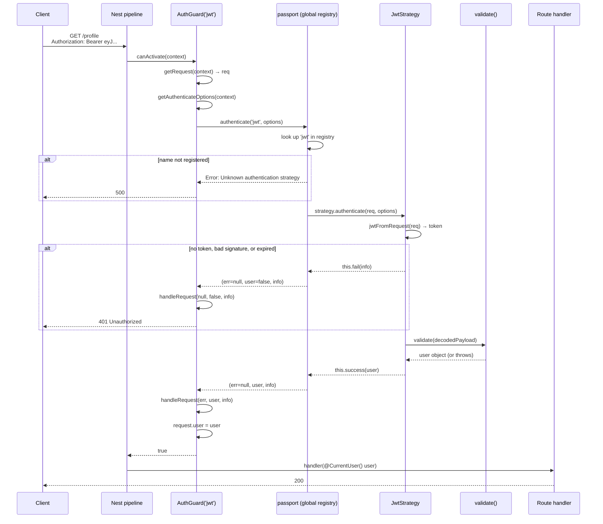

# Chapter 24 — Passport in Practice: Strategies, Guards, and Refresh Flows

> **한눈에 보기**
> 23장에서 인증 계층 전체를 손으로 만들었습니다. 이 장은 같은 모듈을 **Passport 위에
> 다시 세우고**, 손으로는 감당하기 어려운 지점까지 밀고 나갑니다. `PassportStrategy` 믹스인이
> 실제로 무슨 일을 하는지, `validate()`의 반환값이 어떻게 `req.user`가 되는지, `AuthGuard`를
> `handleRequest`/`getAuthenticateOptions`/`canActivate`로 어떻게 확장하는지, 이름 붙은 전략과
> 전략 체인, 세션 직렬화(`SessionSerializer`), GraphQL에서의 `getRequest` 오버라이드,
> 그리고 별도 시크릿·회전·재사용 탐지를 갖춘 리프레시 토큰 전략까지 다룹니다.
> JWT 기초는 다시 설명하지 않습니다 — 그건 23장의 몫입니다.

**What you will learn**

- What Passport is as a runtime — a global registry of named strategies invoked by middleware — and precisely which parts `@nestjs/passport` replaces.
- What the `PassportStrategy(Strategy, 'name')` mixin generates, when the strategy registers itself, and why that makes request-scoped strategies impossible.
- How to write local and JWT strategies whose `validate()` signature you can predict from the underlying Passport package.
- How to extend `AuthGuard` at its three real extension points: `handleRequest` (error and result shaping), `getAuthenticateOptions` (per-request options), and `canActivate` (metadata checks and `super.logIn()`).
- How to run several strategies — named, chained, and a default — without magic strings.
- How to build session-based authentication with `serializeUser`/`deserializeUser` expressed as a Nest `SessionSerializer` provider.
- How to make any `AuthGuard` work inside a GraphQL resolver by overriding `getRequest()`.
- How to implement refresh-token rotation with reuse detection as a third Passport strategy, with its own secret and its own guard.

**Why this matters**

[Chapter 23](./23-authentication.md) ended with a working authentication layer you wrote every line of: a sign-in endpoint, a guard calling `jwtService.verifyAsync`, `@Public()`, a global `APP_GUARD`. That is roughly 150 lines and it has no hidden behaviour. It is also the *last* configuration in which hand-rolling is clearly the better choice.

Add one requirement and the arithmetic changes. "Sign in with Google" means the OAuth 2.0 authorization-code flow: a redirect, a state parameter to defend against CSRF, a code exchange over the back channel, a profile fetch, and a callback that has to create-or-link a local account. That is a few hundred lines of protocol you must get exactly right, and `passport-google-oauth20` is thirty lines of configuration. Add API keys for machine clients, or SAML for an enterprise customer, or a session-cookie flow for a server-rendered admin panel alongside your token API, and you now need a *dispatch* mechanism: something that picks the right credential-verification routine per route and normalises the results into one `request.user`.

That mechanism is what Passport is. It is not a JWT library — `@nestjs/jwt` remained the JWT library in Chapter 23 and remains it here. Passport is the strategy pattern applied to credential verification, plus a 500-strategy ecosystem so that "verify this credential" is usually somebody else's already-audited code.

The cost is indirection. `@UseGuards(AuthGuard('jwt'))` is a guard that calls into a library that looks up a globally-registered strategy that calls a callback that calls your `validate()`, and a `401` can originate at any of those hops. This chapter's real subject is making that chain legible: what runs, in what order, and where you can intervene.

---

## 1. Passport as a runtime

Strip away the Nest wrapper and Passport is three things:

1. **A registry.** `passport.use(name, strategyInstance)` stores a strategy under a name in a module-level singleton. Every strategy in your process lives in one map.
2. **An invoker.** `passport.authenticate('jwt', options, callback)` returns Express middleware. Called, it looks the strategy up, hands it the request, and waits.
3. **A protocol between the two.** The strategy extracts a credential from the request and calls exactly one of `this.success(user, info)`, `this.fail(challenge, status)`, `this.error(err)`, `this.redirect(url)`, or `this.pass()`. Whichever it calls determines what the middleware does next.

A strategy's own job is only the middle part: get a credential out of the request, then call a **verify callback** you supplied, which answers "does this credential correspond to a user?" Passport itself never touches your database.

`@nestjs/passport` replaces layers 2 and 3 with Nest constructs and leaves layer 1 alone:

| Vanilla Passport | `@nestjs/passport` |
|---|---|
| `new Strategy(options, verifyCallback)` | `class X extends PassportStrategy(Strategy)` — options via `super()`, verify via `validate()` |
| `passport.use(strategy)` at bootstrap | Automatic, when Nest instantiates the provider |
| `app.use(passport.authenticate('jwt'))` | `@UseGuards(AuthGuard('jwt'))` |
| Verify callback: `(payload, done) => done(null, user)` | `async validate(payload) { return user; }` — return value is `done(null, ...)`, a thrown exception is `done(err)` |
| Errors handled by Express error middleware | Thrown exceptions, so exception filters apply ([Chapter 9](../part1-beginner/09-exception-filters.md)) |
| No DI | The strategy is a provider; inject services normally |

Two things survive the wrapping and explain most surprises later:

- **The registry is still global and still keyed by string.** Two strategies registered under `'jwt'` — say, in two different modules — silently overwrite one another.
- **Passport still writes to `request.user`.** Not to a Nest-specific context; to the raw platform request object. That is why `@Request() req` and `req.user` show up everywhere in Passport examples, and why a custom `@CurrentUser()` decorator ([Chapter 13](../part1-beginner/13-custom-decorators-and-lifecycle.md)) is a strict improvement.

Install what you need. Every strategy needs the two base packages plus one strategy package:

```bash
$ npm install @nestjs/passport passport
$ npm install passport-local passport-jwt
$ npm install --save-dev @types/passport-local @types/passport-jwt
```

---

## 2. The `PassportStrategy` mixin

`PassportStrategy` is a **mixin factory**: a function that takes a strategy class and returns a new abstract class you extend.

```typescript
export class JwtStrategy extends PassportStrategy(Strategy, 'jwt') {}
```

Conceptually, the class it returns does this:

```typescript
function PassportStrategy(Strategy, name?) {
  abstract class MixinStrategy extends Strategy {
    abstract validate(...args: any[]): any;

    constructor(...args: any[]) {
      // The last constructor argument passport-* strategies expect is the verify
      // callback. The mixin supplies one that delegates to your validate().
      const callback = async (...params: any[]) => {
        const done = params[params.length - 1];
        try {
          const result = await this.validate(...params.slice(0, -1));
          // An array return becomes [user, authInfo].
          Array.isArray(result) ? done(null, ...result) : done(null, result);
        } catch (err) {
          done(err, null);
        }
      };
      super(...args, callback);
    }

    // Called by Nest after the provider is constructed.
    onModuleInit() {
      passport.use(name ?? this.name, this as any);
    }
  }
  return MixinStrategy;
}
```

The real implementation is more careful, but every consequence you will meet is visible here.

**`super()` passes strategy options.** Everything before the injected callback goes to the underlying `passport-*` constructor. `super()` with no arguments for `passport-local`; an options object for `passport-jwt`.

**`validate()` is the verify callback.** Its signature is dictated by the strategy package, not by Nest. `passport-local` calls verify with `(username, password, done)`, so `validate(username, password)`. `passport-jwt` calls it with `(payload, done)`, so `validate(payload)`. When you adopt an unfamiliar strategy, read its README for the verify signature — that is your `validate()` signature minus `done`.

**Registration happens at module init.** The strategy registers itself when Nest constructs it, which is why the class must be listed in `providers` even though nothing injects it. Forget that and `AuthGuard('jwt')` throws `Unknown authentication strategy "jwt"` — a runtime error with no compile-time warning. It is the most common Passport-in-Nest mistake.

**Request-scoped strategies cannot work.** Registration is once, into a global map, at boot. A request-scoped provider is instantiated per request, so there is nothing to register and no way to know which instance a given request should use. Nest will simply never instantiate a request-scoped strategy. If your `validate()` needs a request-scoped dependency, resolve it dynamically — see §10.

Also note the array return: `return [user, info]` becomes `done(null, user, info)`, giving you `request.authInfo` alongside `request.user`. Useful for carrying token metadata (issue time, scope, which key verified it) without polluting the user object.

---

## 3. The local strategy

`AuthService` and `UsersService` come from Chapter 23 unchanged. The only addition is a method Passport's verify callback can call:

```typescript title="src/auth/auth.service.ts"
@Injectable()
export class AuthService {
  constructor(
    private readonly usersService: UsersService,
    private readonly jwtService: JwtService,
  ) {}

  /** Verify credentials. Returns the user without its hash, or null. */
  async validateUser(email: string, password: string): Promise<AuthenticatedUser | null> {
    const user = await this.usersService.findByEmail(email);
    // Always run the comparison, even for an unknown user, so response time
    // does not reveal whether the account exists. (Chapter 23, §3.)
    const hash = user?.passwordHash ?? DUMMY_HASH;
    const ok = await argon2.verify(hash, password);
    if (!user || !ok) return null;

    const { passwordHash, ...rest } = user;
    return rest;
  }
}
```

The strategy is a thin adapter over it:

```typescript title="src/auth/strategies/local.strategy.ts"
import { Injectable, UnauthorizedException } from '@nestjs/common';
import { PassportStrategy } from '@nestjs/passport';
import { Strategy } from 'passport-local';
import { AuthService } from '../auth.service';
import { AuthenticatedUser } from '../types';

@Injectable()
export class LocalStrategy extends PassportStrategy(Strategy) {
  constructor(private readonly authService: AuthService) {
    // passport-local defaults to reading `username` and `password` from the
    // request body. Our API uses `email`, so rename the field.
    super({ usernameField: 'email' });
  }

  async validate(email: string, password: string): Promise<AuthenticatedUser> {
    const user = await this.authService.validateUser(email, password);
    if (!user) {
      throw new UnauthorizedException('Invalid credentials');
    }
    return user; // becomes request.user
  }
}
```

Three details worth stating plainly.

**Passport reads the body itself.** `passport-local` pulls `req.body[usernameField]`, which means the body must already be parsed — true by default in Nest — and, critically, that **your `ValidationPipe` has not run yet**. Guards execute before pipes ([Chapter 13](../part1-beginner/13-custom-decorators-and-lifecycle.md)). So a `LoginDto` with `@IsEmail()` does not protect the strategy; if the client posts `{ "email": { "$ne": null } }`, that object reaches `validateUser`. Type-check inside `validate()` or in the service, never assume the DTO ran.

**Returning `null` and throwing are not equivalent.** Returning `null` calls `done(null, null)`, which Passport treats as an authentication *failure*, producing a generic `401` with no message. Throwing `UnauthorizedException` gives you the message and the shape your API contract specifies. Throw.

**The strategy's default name is `'local'`,** taken from `Strategy.prototype.name` in `passport-local`. Name it explicitly (`PassportStrategy(Strategy, 'local')`) whenever a file might be read out of context.

### 3.1 The guard and the login route

`AuthGuard('local')` works, but a magic string in a decorator is a string that gets typo'd. Wrap it once:

```typescript title="src/auth/guards/local-auth.guard.ts"
import { Injectable } from '@nestjs/common';
import { AuthGuard } from '@nestjs/passport';

@Injectable()
export class LocalAuthGuard extends AuthGuard('local') {}
```

```typescript title="src/auth/auth.controller.ts"
import { Body, Controller, HttpCode, HttpStatus, Post, Req, UseGuards } from '@nestjs/common';
import { Request } from 'express';
import { AuthService } from './auth.service';
import { LocalAuthGuard } from './guards/local-auth.guard';
import { Public } from './decorators/public.decorator';
import { AuthenticatedUser } from './types';
import { LoginDto } from './dto/login.dto';

@Controller('auth')
export class AuthController {
  constructor(private readonly authService: AuthService) {}

  @Public()
  @UseGuards(LocalAuthGuard)
  @HttpCode(HttpStatus.OK)
  @Post('login')
  // `LoginDto` documents and validates the payload for OpenAPI; the guard has
  // already read the raw body by the time the pipe runs.
  async login(@Req() req: Request, @Body() _dto: LoginDto) {
    return this.authService.issueTokens(req.user as AuthenticatedUser);
  }
}
```

The order is the whole point: `LocalAuthGuard` runs, invokes `passport-local`, which calls `validate()`, which returns a user, which Passport assigns to `req.user`. Only then does the handler run — so inside the handler, `req.user` is guaranteed present. That guarantee is what a guard buys you over doing the same work in the controller.

`@Public()` is there because Chapter 23 made the JWT guard global; without it the login route would demand the token it exists to issue.

### 3.2 Logout

For token auth, "logout" is a client-side delete plus server-side refresh-token revocation (§11). For session auth (§8), Passport adds `req.logout()`:

```typescript
@Post('logout')
@HttpCode(HttpStatus.NO_CONTENT)
async logout(@Req() req: Request) {
  // Passport 0.6+: logout is asynchronous and takes a callback.
  await new Promise<void>((resolve, reject) =>
    req.logout((err) => (err ? reject(err) : resolve())),
  );
  await new Promise<void>((resolve, reject) =>
    req.session.destroy((err) => (err ? reject(err) : resolve())),
  );
}
```

Passport 0.6 made `req.logout()` asynchronous — a breaking change that silently does nothing if you call it the old synchronous way. And `req.logout()` alone only removes `req.session.passport.user`; the session record survives. Destroy the session too, and clear the cookie.

---

## 4. The JWT strategy

```typescript title="src/auth/strategies/jwt.strategy.ts"
import { Injectable, UnauthorizedException } from '@nestjs/common';
import { ConfigService } from '@nestjs/config';
import { PassportStrategy } from '@nestjs/passport';
import { ExtractJwt, Strategy } from 'passport-jwt';
import { UsersService } from '../../users/users.service';
import { AccessTokenPayload, AuthenticatedUser } from '../types';

@Injectable()
export class JwtStrategy extends PassportStrategy(Strategy, 'jwt') {
  constructor(
    config: ConfigService,
    private readonly usersService: UsersService,
  ) {
    super({
      jwtFromRequest: ExtractJwt.fromAuthHeaderAsBearerToken(),
      ignoreExpiration: false,
      secretOrKey: config.getOrThrow<string>('JWT_ACCESS_SECRET'),
      issuer: config.getOrThrow<string>('JWT_ISSUER'),
      audience: config.getOrThrow<string>('JWT_AUDIENCE'),
    });
  }

  async validate(payload: AccessTokenPayload): Promise<AuthenticatedUser> {
    // The signature is already verified. This hook is for authorisation state
    // that must not be cached in the token.
    const user = await this.usersService.findById(payload.sub);
    if (!user || user.disabledAt) {
      throw new UnauthorizedException();
    }
    if (user.tokenVersion !== payload.tv) {
      throw new UnauthorizedException('Token has been revoked');
    }
    return { id: user.id, email: user.email, roles: user.roles };
  }
}
```

### 4.1 The options that matter

- **`jwtFromRequest`** — an extractor function. `ExtractJwt.fromAuthHeaderAsBearerToken()` is the standard. Others: `fromUrlQueryParameter('token')` (avoid — tokens land in access logs and `Referer` headers), `fromBodyField('token')`, `fromHeader('x-api-token')`, `fromExtractors([...])` to try several in order. A cookie extractor is a plain function:

  ```typescript
  jwtFromRequest: ExtractJwt.fromExtractors([
    (req: Request) => req?.cookies?.access_token ?? null,
    ExtractJwt.fromAuthHeaderAsBearerToken(),
  ]),
  ```

  Returning `null` from every extractor means "no credential", so the guard fails with `401` and `validate()` is never called.

- **`ignoreExpiration`** — leave `false`. Passport then checks `exp` before calling you, and an expired token becomes a `401` you never wrote code for. Setting `true` is defensible in exactly one place: a token-refresh endpoint that deliberately accepts an expired access token alongside a valid refresh token. Anywhere else it disables expiry entirely.

- **`secretOrKey`** — the symmetric secret, and it is evaluated **once at construction**. Reading it from `ConfigService` is right; expecting rotation to be picked up at runtime is not. For asymmetric verification (RS256, or an external identity provider), use `secretOrKeyProvider` with a JWKS client so keys can rotate:

  ```typescript
  secretOrKeyProvider: passportJwtSecret({
    jwksUri: 'https://tenant.auth0.com/.well-known/jwks.json',
    cache: true,
    rateLimit: true,
  }),
  ```

- **`issuer` / `audience`** — verified only if set here. Chapter 23 made the same point: signing with `aud` and not verifying it means any token signed with that secret, for any audience, is accepted. If you sign with them, verify with them.

- **`passReqToCallback: true`** — changes `validate(payload)` to `validate(req, payload)`. Needed in §10 and §11.

### 4.2 What `validate()`'s return value becomes

Whatever `validate()` returns is `request.user`. This bears repeating because it is the single most consequential design decision in a Passport setup, and the official example makes the minimal choice:

```typescript
// Stateless. Zero database queries per request. req.user is whatever the token said.
async validate(payload: AccessTokenPayload) {
  return { userId: payload.sub, email: payload.email };
}
```

| Return | Cost per request | Revocation | Freshness |
|---|---|---|---|
| The decoded payload | 0 queries | None until `exp` | Stale from issue time |
| A database lookup (above) | 1 indexed query | Immediate | Current |
| Payload + a cached lookup | 1 cache hit | Cache TTL | Near-current |

The trade-off is Chapter 23's revocation problem in a new location. The stateless version cannot honour "disable this account now". The lookup version can, at one primary-key query per request — which for most applications is noise next to the queries the handler itself will run, and is the option I recommend by default. Cache it ([Chapter 27](./27-caching.md)) when profiling says to.

Returning `null` or `undefined` from `validate()` is an authentication failure — a common accident when a code path forgets its `return`.

### 4.3 Protecting routes and setting a default strategy

```typescript title="src/auth/guards/jwt-auth.guard.ts"
import { Injectable } from '@nestjs/common';
import { AuthGuard } from '@nestjs/passport';

@Injectable()
export class JwtAuthGuard extends AuthGuard('jwt') {}
```

```typescript
@UseGuards(JwtAuthGuard)
@Get('profile')
getProfile(@CurrentUser() user: AuthenticatedUser) {
  return user;
}
```

If one strategy dominates, register it as the default and drop the name:

```typescript
PassportModule.register({ defaultStrategy: 'jwt' })
```

Now bare `AuthGuard()` means `AuthGuard('jwt')`. I do not recommend it. It saves four characters and makes every guard in the codebase depend on a setting declared in a different file; a later `defaultStrategy: 'local'` silently repoints every unnamed guard. Name strategies explicitly.

### 4.4 The module

```typescript title="src/auth/auth.module.ts"
@Module({
  imports: [
    UsersModule,
    PassportModule,
    JwtModule.registerAsync({
      imports: [ConfigModule],
      inject: [ConfigService],
      useFactory: (config: ConfigService) => ({
        secret: config.getOrThrow<string>('JWT_ACCESS_SECRET'),
        signOptions: {
          expiresIn: config.get('JWT_ACCESS_TTL', '15m'),
          issuer: config.getOrThrow<string>('JWT_ISSUER'),
          audience: config.getOrThrow<string>('JWT_AUDIENCE'),
        },
      }),
    }),
  ],
  controllers: [AuthController],
  providers: [
    AuthService,
    LocalStrategy,
    JwtStrategy,
    RefreshStrategy,
    { provide: APP_GUARD, useClass: JwtAuthGuard },
  ],
  exports: [AuthService],
})
export class AuthModule {}
```

Strategies are listed in `providers` purely so Nest constructs them, which is what registers them with Passport. Nothing injects `LocalStrategy`.

---

## 5. Strategy resolution: what actually runs



Read the failure branches. A missing or malformed token never reaches `validate()` — the strategy fails first, and `info` carries the reason (`No auth token`, `jwt expired`, `invalid signature`). Anything thrown *inside* `validate()` arrives at `handleRequest` as `err`. That split is why `handleRequest` is the right place to shape error responses: it sees both kinds.

---

## 6. Extending `AuthGuard`

`AuthGuard(name)` returns a class with three methods worth overriding.

### 6.1 `handleRequest(err, user, info, context, status)`

Called after Passport finishes, with whatever it produced. Its return value becomes `request.user`; anything it throws becomes the response. The default implementation is roughly "if there is an error or no user, throw `UnauthorizedException`".

```typescript title="src/auth/guards/jwt-auth.guard.ts"
import {
  ExecutionContext, Injectable, Logger, UnauthorizedException,
} from '@nestjs/common';
import { AuthGuard } from '@nestjs/passport';
import { TokenExpiredError } from 'jsonwebtoken';

@Injectable()
export class JwtAuthGuard extends AuthGuard('jwt') {
  private readonly logger = new Logger(JwtAuthGuard.name);

  handleRequest<TUser = AuthenticatedUser>(
    err: Error | null,
    user: TUser | false,
    info: Error | undefined,
    context: ExecutionContext,
  ): TUser {
    if (err) throw err;                    // thrown by validate() — keep its type

    if (!user) {
      // `info` distinguishes expiry from a malformed or absent token, which
      // lets a client tell "refresh me" from "log in again".
      if (info instanceof TokenExpiredError) {
        throw new UnauthorizedException({
          message: 'Access token expired',
          code: 'TOKEN_EXPIRED',
        });
      }
      this.logger.debug(`Auth failed: ${info?.message ?? 'no credentials'}`);
      throw new UnauthorizedException('Invalid or missing credentials');
    }
    return user;
  }
}
```

Two rules. **Never put `info.message` in a response body** beyond a coarse code — it distinguishes "invalid signature" from "jwt malformed", which tells an attacker whether they guessed the algorithm. And **`handleRequest` is where a shared "optional authentication" guard lives**: return `null` instead of throwing when there is no user, and the handler receives `req.user === null` for anonymous callers.

```typescript
@Injectable()
export class OptionalJwtGuard extends AuthGuard('jwt') {
  handleRequest(err: any, user: any) {
    if (err) throw err;
    return user ?? null;   // anonymous is allowed
  }
}
```

### 6.2 `getAuthenticateOptions(context)`

Returns the options object Passport receives for *this* request. Static options belong in the strategy's `super()` call; this hook is for anything that depends on the request.

```typescript
@Injectable()
export class GoogleAuthGuard extends AuthGuard('google') {
  getAuthenticateOptions(context: ExecutionContext) {
    const req = context.switchToHttp().getRequest<Request>();
    return {
      // Round-trip the caller's intended destination through the OAuth `state`
      // parameter so the callback can redirect back to it.
      state: Buffer.from(JSON.stringify({ next: req.query.next ?? '/' })).toString('base64url'),
      prompt: req.query.force === '1' ? 'consent' : undefined,
      scope: ['email', 'profile'],
    };
  }
}
```

Anything a `passport-*` strategy documents as an `authenticate()` option — `scope`, `state`, `prompt`, `session`, `failureRedirect`, `successRedirect` — can be computed here.

### 6.3 `canActivate(context)` and `super.logIn()`

Override `canActivate` when the decision to run Passport at all depends on metadata — the global-guard-plus-`@Public()` pattern from Chapter 23, now on Passport:

```typescript title="src/auth/guards/jwt-auth.guard.ts (continued)"
@Injectable()
export class JwtAuthGuard extends AuthGuard('jwt') {
  constructor(private readonly reflector: Reflector) {
    super();
  }

  canActivate(context: ExecutionContext) {
    const isPublic = this.reflector.getAllAndOverride<boolean>(IS_PUBLIC_KEY, [
      context.getHandler(),
      context.getClass(),
    ]);
    if (isPublic) return true;      // skip Passport entirely
    return super.canActivate(context);
  }

  // handleRequest as above
}
```

```typescript title="src/auth/decorators/public.decorator.ts"
import { SetMetadata } from '@nestjs/common';

export const IS_PUBLIC_KEY = 'isPublic';
export const Public = () => SetMetadata(IS_PUBLIC_KEY, true);
```

`getAllAndOverride` checks the handler first, then the controller, so `@Public()` on a class covers every route in it and a handler can override. Register globally with `{ provide: APP_GUARD, useClass: JwtAuthGuard }` — a provider, not `app.useGlobalGuards(new JwtAuthGuard())`, which receives no `Reflector`.

The other reason to override `canActivate` is sessions. `super.canActivate()` runs the strategy; establishing a session afterwards requires an explicit `super.logIn()`:

```typescript
@Injectable()
export class LoginGuard extends AuthGuard('local') {
  async canActivate(context: ExecutionContext) {
    const result = (await super.canActivate(context)) as boolean;
    const request = context.switchToHttp().getRequest();
    // Calls passport's req.logIn(), which runs serializeUser and writes
    // the session. Must come AFTER authentication has succeeded.
    await super.logIn(request);
    return result;
  }
}
```

Alternatively, pass `{ session: true }` in `getAuthenticateOptions()` and let Passport call `logIn` itself. `super.logIn()` is more explicit about ordering, and ordering is what people get wrong here.

---

## 7. Named strategies, multiple strategies, and chains

Names are the registry keys, so they are how you run more than one mechanism.

```typescript
export class JwtStrategy extends PassportStrategy(Strategy, 'jwt') {}
export class RefreshStrategy extends PassportStrategy(Strategy, 'jwt-refresh') {}
export class ApiKeyStrategy extends PassportStrategy(HeaderApiKeyStrategy, 'api-key') {}
```

Two strategy classes built from the same `passport-jwt` `Strategy` need distinct names, or the second registration overwrites the first — with no warning, because `passport.use` is a map assignment. The failure looks like "my refresh endpoint accepts access tokens", which is a genuine security hole (§11).

`AuthGuard` also accepts an array, which authenticates through a **chain**:

```typescript
@Injectable()
export class ApiAuthGuard extends AuthGuard(['jwt', 'api-key']) {}
```

Semantics: strategies are tried in order; the first to `success`, `redirect`, or `error` halts the chain. Only `fail` continues to the next. If all fail, the request fails with the last challenge. This is the clean way to let one endpoint accept both a user bearer token and a machine API key — `req.user` is populated by whichever succeeded, so downstream code should not assume which.

Chains are order-sensitive in one respect: a strategy that *errors* stops the chain. A JWT strategy whose `validate()` throws `UnauthorizedException` for a disabled user will prevent the API-key strategy from ever running. If you want "try the next one anyway", `fail` rather than throw — return `null` from `validate()`.

---

## 8. Session-based authentication

Tokens are the right default for APIs. Sessions are the right default for a server-rendered application ([Chapter 33](./33-mvc-and-versioning.md)) and for anything that needs instant, server-side logout. Passport supports both with the same strategies; sessions add a serialization step.

The model: after `logIn`, Passport calls `serializeUser(user, done)` and stores whatever you pass to `done` in `req.session.passport.user`. On every later request, `deserializeUser(stored, done)` turns it back into `req.user`. The session store holds the small value; the full user is reconstructed per request.

Install and wire the session middleware first — Passport's session support is a layer on top of `express-session`, not a replacement for it:

```bash
$ npm install express-session connect-redis redis
$ npm install --save-dev @types/express-session
```

```typescript title="src/main.ts"
import session from 'express-session';
import passport from 'passport';
import { RedisStore } from 'connect-redis';
import { createClient } from 'redis';

const app = await NestFactory.create(AppModule);
const redis = createClient({ url: process.env.REDIS_URL });
await redis.connect();

app.use(
  session({
    store: new RedisStore({ client: redis }),
    secret: process.env.SESSION_SECRET!,   // signs the cookie, not the data
    resave: false,
    saveUninitialized: false,              // no cookie until something is stored
    rolling: true,                         // slide the expiry on activity
    cookie: {
      httpOnly: true,                      // not readable by JavaScript
      secure: process.env.NODE_ENV === 'production',
      sameSite: 'lax',                     // survives top-level navigation
      maxAge: 1000 * 60 * 60 * 24,
    },
  }),
);
app.use(passport.initialize());
app.use(passport.session());               // must come AFTER session()
```

Order is load-bearing: `session()` → `passport.initialize()` → `passport.session()`. And the default `MemoryStore` is a memory leak that also breaks the moment you run two instances — use Redis. See [Chapter 32](./32-http-cookies-sessions.md) for the cookie and store details, and [Chapter 26](./26-web-security-hardening.md) for the CSRF protection that cookie authentication now requires and bearer tokens did not.

Turn on session support in the module and express the two callbacks as a provider:

```typescript
PassportModule.register({ session: true })
```

```typescript title="src/auth/session.serializer.ts"
import { Injectable } from '@nestjs/common';
import { PassportSerializer } from '@nestjs/passport';
import { UsersService } from '../users/users.service';
import { AuthenticatedUser } from './types';

@Injectable()
export class SessionSerializer extends PassportSerializer {
  constructor(private readonly usersService: UsersService) {
    super();
  }

  // user → what goes in the session store. Keep it tiny and non-sensitive.
  serializeUser(user: AuthenticatedUser, done: (err: Error | null, id?: string) => void) {
    done(null, user.id);
  }

  // what came out of the store → req.user, on every request.
  async deserializeUser(id: string, done: (err: Error | null, user?: AuthenticatedUser | null) => void) {
    try {
      const user = await this.usersService.findById(id);
      // A deleted or disabled user must not be resurrected from a live session.
      if (!user || user.disabledAt) return done(null, null);
      done(null, { id: user.id, email: user.email, roles: user.roles });
    } catch (err) {
      done(err as Error);
    }
  }
}
```

Register it in `providers` — like a strategy, it registers itself when constructed, and forgetting it produces `Failed to serialize user into session` on the first login.

`PassportSerializer` is a thin base class; `serializeUser`/`deserializeUser` are exactly the vanilla Passport callbacks, so any Passport documentation applies verbatim.

Two decisions inside it. **Store the id, not the user.** Storing the whole object means every role change needs a session rewrite and a stale session grants stale permissions; it also puts personal data in your session store. **`deserializeUser` runs on every authenticated request**, so it is a per-request database read. That is the cost of instant revocation, and the reason to put a short-TTL cache in front of it if the read shows up in profiles.

Guarding a session route needs no strategy at all — the session already carries the identity:

```typescript title="src/auth/guards/authenticated.guard.ts"
@Injectable()
export class AuthenticatedGuard implements CanActivate {
  canActivate(context: ExecutionContext): boolean {
    const req = context.switchToHttp().getRequest();
    return req.isAuthenticated();   // added by passport.session()
  }
}
```

Use `LoginGuard` (§6.3) on `POST /auth/login` to establish the session, and `AuthenticatedGuard` on everything else.

---

## 9. Passport in GraphQL

Guards run for GraphQL resolvers, but `context.switchToHttp().getRequest()` returns `undefined` there — the execution context is GraphQL's, not HTTP's ([Chapter 40](../part3-advanced/40-execution-context.md)). `AuthGuard` calls `getRequest()` in exactly one place, so one override fixes every strategy:

```typescript title="src/auth/guards/gql-auth.guard.ts"
import { ExecutionContext, Injectable } from '@nestjs/common';
import { AuthGuard } from '@nestjs/passport';
import { GqlExecutionContext } from '@nestjs/graphql';

@Injectable()
export class GqlAuthGuard extends AuthGuard('jwt') {
  getRequest(context: ExecutionContext) {
    const ctx = GqlExecutionContext.create(context);
    return ctx.getContext().req;
  }
}
```

This requires that your GraphQL context actually contains `req` — the default for `@nestjs/apollo` with Express, but if you set a custom `context` factory you must keep `req` on it.

The local strategy needs one extra step, because `passport-local` reads credentials from `req.body` and a GraphQL mutation's credentials are in the *arguments*, not the body. Merge them:

```typescript title="src/auth/guards/gql-local-auth.guard.ts"
@Injectable()
export class GqlLocalAuthGuard extends AuthGuard('local') {
  getRequest(context: ExecutionContext) {
    const gqlContext = GqlExecutionContext.create(context);
    const req = gqlContext.getContext().req;
    const args = gqlContext.getArgs();
    // passport-local reads req.body[usernameField]; GraphQL args live elsewhere.
    req.body = { ...req.body, ...args };
    return req;
  }
}
```

Without this you get a bare `Unauthorized` with no indication why, because the strategy simply found no credentials.

Reading the user in a resolver needs a GraphQL-aware parameter decorator, since `@Req()` does not apply:

```typescript title="src/auth/decorators/current-user.decorator.ts"
import { createParamDecorator, ExecutionContext } from '@nestjs/common';
import { GqlExecutionContext } from '@nestjs/graphql';

export const CurrentUser = createParamDecorator(
  (_data: unknown, context: ExecutionContext) => {
    if (context.getType<'graphql'>() === 'graphql') {
      return GqlExecutionContext.create(context).getContext().req.user;
    }
    return context.switchToHttp().getRequest().user;
  },
);
```

Branching on `context.getType()` gives you one decorator that works in both transports — worth doing in a hybrid application.

```typescript
@Query(() => User)
@UseGuards(GqlAuthGuard)
whoAmI(@CurrentUser() user: AuthenticatedUser) {
  return this.usersService.findById(user.id);
}
```

> **⚠️ Notice** — GraphQL subscriptions over WebSockets do not carry HTTP headers per message. `GqlAuthGuard` will not authenticate a subscription; authenticate in the transport's `onConnect`/`context` hook instead ([Chapter 51](../part3-advanced/51-graphql-types-and-operations.md)).

---

## 10. Request-scoped dependencies inside a strategy

Strategies are registered once, globally, at boot, so they cannot themselves be request-scoped ([Chapter 38](../part3-advanced/38-injection-scopes.md)). When `validate()` needs a request-scoped provider — a tenant-aware service, a request-scoped logger — resolve it dynamically through `ModuleRef`:

```typescript title="src/auth/strategies/local.strategy.ts (request-scoped variant)"
import { ContextIdFactory, ModuleRef } from '@nestjs/core';

@Injectable()
export class LocalStrategy extends PassportStrategy(Strategy) {
  constructor(private readonly moduleRef: ModuleRef) {
    super({
      usernameField: 'email',
      passReqToCallback: true,   // required: we need the request object
    });
  }

  async validate(request: Request, email: string, password: string) {
    // Reuse the request's existing context id so we get THE request-scoped
    // instance for this request, not a new sub-tree.
    const contextId = ContextIdFactory.getByRequest(request);
    const authService = await this.moduleRef.resolve(AuthService, contextId);

    const user = await authService.validateUser(email, password);
    if (!user) throw new UnauthorizedException();
    return user;
  }
}
```

`ContextIdFactory.getByRequest(request)` is the essential call. `moduleRef.resolve(AuthService)` without it creates a *fresh* DI sub-tree per invocation, so the request-scoped provider you get is not the one the rest of the request is using — a bug that presents as "my request context is empty" ([Chapter 41](../part3-advanced/41-module-ref-discovery-lazy.md)). Use this only when you genuinely need request scope; a plain singleton is faster and simpler.

---

## 11. Refresh tokens as a strategy

Chapter 23 described rotation and reuse detection. Passport gives it a natural home: refresh is just a different credential, so it is a different strategy with a different secret and a different guard.

The design, restated in one place:

- **Separate secrets.** An access token must not verify at the refresh endpoint, and a refresh token must not verify anywhere else. One shared secret plus a `type` claim is workable but relies on remembering to check the claim; two secrets fail closed.
- **Rotation.** Every refresh returns a new refresh token and invalidates the one presented. A stolen token is then usable exactly once.
- **Reuse detection.** If an already-rotated token is presented, both the legitimate client and the thief hold tokens from the same family. You cannot tell which is which, so revoke the whole family.
- **Hashed at rest.** Store `argon2.hash(token)`, never the token. A database leak must not yield live sessions.

```typescript title="src/auth/strategies/refresh.strategy.ts"
import { Injectable, UnauthorizedException } from '@nestjs/common';
import { ConfigService } from '@nestjs/config';
import { PassportStrategy } from '@nestjs/passport';
import { ExtractJwt, Strategy } from 'passport-jwt';
import { Request } from 'express';
import { RefreshTokenPayload } from '../types';

@Injectable()
export class RefreshStrategy extends PassportStrategy(Strategy, 'jwt-refresh') {
  constructor(config: ConfigService) {
    super({
      jwtFromRequest: ExtractJwt.fromExtractors([
        (req: Request) => req?.cookies?.refresh_token ?? null,
        ExtractJwt.fromBodyField('refresh_token'),
      ]),
      ignoreExpiration: false,
      secretOrKey: config.getOrThrow<string>('JWT_REFRESH_SECRET'),  // different secret
      passReqToCallback: true,   // the raw token must reach the service
    });
  }

  async validate(req: Request, payload: RefreshTokenPayload) {
    const raw = req.cookies?.refresh_token ?? req.body?.refresh_token;
    if (!raw) throw new UnauthorizedException();
    // The strategy only proves the signature. Rotation state lives in the service.
    return { sub: payload.sub, familyId: payload.fid, jti: payload.jti, raw };
  }
}
```

```typescript title="src/auth/guards/refresh-auth.guard.ts"
@Injectable()
export class RefreshAuthGuard extends AuthGuard('jwt-refresh') {}
```

```typescript title="src/auth/auth.service.ts (refresh)"
@Injectable()
export class AuthService {
  async issueTokens(user: AuthenticatedUser, familyId = randomUUID()) {
    const jti = randomUUID();
    const [accessToken, refreshToken] = await Promise.all([
      this.jwtService.signAsync(
        { sub: user.id, email: user.email, tv: user.tokenVersion },
      ),
      this.jwtService.signAsync(
        { sub: user.id, fid: familyId, jti },
        {
          secret: this.config.getOrThrow('JWT_REFRESH_SECRET'),
          expiresIn: this.config.get('JWT_REFRESH_TTL', '30d'),
        },
      ),
    ]);

    await this.tokens.store({
      jti,
      familyId,
      userId: user.id,
      tokenHash: await argon2.hash(refreshToken),  // hashed at rest
      expiresAt: addDays(new Date(), 30),
    });

    return { accessToken, refreshToken };
  }

  async rotate(claims: { sub: string; familyId: string; jti: string; raw: string }) {
    const stored = await this.tokens.findByJti(claims.jti);

    // Case 1: unknown jti — forged, or the family was already revoked.
    if (!stored) throw new UnauthorizedException('Invalid refresh token');

    // Case 2: REUSE. This jti was already rotated away. Someone holds a copy.
    if (stored.rotatedAt) {
      await this.tokens.revokeFamily(claims.familyId);
      this.logger.warn(`Refresh token reuse detected for user ${claims.sub}`);
      throw new UnauthorizedException('Session revoked');
    }

    // Case 3: the signature was valid but the stored hash does not match —
    // a jti collision or tampering. Treat as hostile.
    if (!(await argon2.verify(stored.tokenHash, claims.raw))) {
      await this.tokens.revokeFamily(claims.familyId);
      throw new UnauthorizedException('Session revoked');
    }

    const user = await this.usersService.findById(claims.sub);
    if (!user || user.disabledAt) throw new UnauthorizedException();

    await this.tokens.markRotated(claims.jti);
    // Same family: the chain of rotations stays linked for reuse detection.
    return this.issueTokens(toAuthenticatedUser(user), claims.familyId);
  }
}
```

```typescript title="src/auth/auth.controller.ts (refresh)"
@Public()                       // the global JwtAuthGuard must not run here
@UseGuards(RefreshAuthGuard)    // the refresh strategy runs instead
@HttpCode(HttpStatus.OK)
@Post('refresh')
async refresh(@Req() req: Request, @Res({ passthrough: true }) res: Response) {
  const tokens = await this.authService.rotate(req.user as RefreshClaims);
  res.cookie('refresh_token', tokens.refreshToken, {
    httpOnly: true,
    secure: true,
    sameSite: 'strict',
    path: '/auth/refresh',       // the cookie is sent to exactly one endpoint
    maxAge: 1000 * 60 * 60 * 24 * 30,
  });
  return { accessToken: tokens.accessToken };
}
```

The `@Public()` on a guarded route looks contradictory and is not: it disables the *global* access-token guard so the route-level refresh guard is the only authentication that runs. Forgetting it produces a refresh endpoint that requires a valid access token — useless precisely when the access token has expired.

`path: '/auth/refresh'` means the browser never sends the refresh token to any other endpoint, which removes it from the blast radius of most XSS and CSRF paths. Combined with `httpOnly`, JavaScript cannot read it at all.

**The rotation race.** A client that fires three requests concurrently after expiry may send the same refresh token three times. Two will look like reuse and revoke the family — a logout that users experience as random. Two mitigations: a short grace window (accept a token rotated within the last ~10 seconds, returning the same replacement), or client-side single-flight refresh. Implement the grace window server-side; you cannot rely on every client behaving.

---

## 12. Hand-rolled guards versus Passport

| | Hand-rolled (Chapter 23) | `@nestjs/passport` |
|---|---|---|
| Lines for one JWT mechanism | ~50 (guard + service) | ~35 (strategy + guard + module option) |
| Adding a second mechanism | Another guard, another extraction path | Another strategy class, one name |
| OAuth / SAML / LDAP / OIDC | Write the protocol | `npm install passport-<x>` |
| Token extraction | You write it | `ExtractJwt.*` combinators |
| Expiry / issuer / audience checks | Explicit `verifyOptions` | Strategy options |
| Sessions | Manual `req.session` handling | `session: true` + `SessionSerializer` |
| Where `req.user` comes from | Your line of code | Passport, from `validate()`'s return |
| Error origin when it fails | One file | Guard → passport → strategy → validate |
| Testing a strategy in isolation | Trivial — it is a class | Needs the mixin's constructor to run |
| Multiple mechanisms on one route | Hand-written fallback logic | `AuthGuard(['a', 'b'])` |
| Runtime dependencies | `@nestjs/jwt` | `passport` + one package per strategy |

My recommendation, unchanged from Chapter 23 and now with the details to justify it: **hand-roll when the application authenticates exactly one way that you fully control, and you value a stack trace that fits on one screen. Adopt Passport the moment a second mechanism appears, or the first time an external identity provider is involved.** The conversion is mechanical — `validateUser` becomes `LocalStrategy.validate`, the guard's `verifyAsync` block becomes `JwtStrategy`'s options — which is exactly why doing it in Chapter 23's order is worth the extra work: you can read what Passport does because you have written it.

What does not change either way: short access tokens, rotated refresh tokens hashed at rest, default-closed routes, and `401` reserved for authentication while `403` belongs to authorization — the subject of [Chapter 25](./25-authorization.md).

---

## Common mistakes

1. **The strategy is not in `providers`.** *Symptom:* `Unknown authentication strategy "jwt"`, a 500, at the first guarded request rather than at boot. *Cause:* registration happens when Nest constructs the provider, and nothing injects a strategy, so it is easy to omit. *Fix:* list every strategy in `providers`, and add an e2e smoke test hitting one guarded route.
2. **Two strategies sharing a name.** *Symptom:* the refresh endpoint accepts access tokens, or vice versa. *Cause:* `passport.use` is a map assignment; the second registration overwrites the first with no warning. *Fix:* an explicit second argument to `PassportStrategy` for every strategy beyond the first of its kind, and separate secrets so an overwrite fails closed.
3. **Trusting `ValidationPipe` to sanitise credentials.** *Symptom:* a non-string reaches `validateUser`, and with some data layers becomes an operator injection. *Cause:* guards run before pipes, and `passport-local` reads `req.body` directly. *Fix:* validate types inside `validate()`; treat the DTO as documentation only.
4. **Returning `null` from `validate()` and expecting a message.** *Symptom:* a bare `401 Unauthorized` no matter what you set. *Cause:* `null` is a Passport failure, which produces the default challenge. *Fix:* throw `UnauthorizedException` with the shape you want, or shape it in `handleRequest`.
5. **`ignoreExpiration: true` to "fix" a refresh flow.** *Symptom:* revoked and years-old tokens are accepted forever. *Cause:* the option disables expiry for the whole strategy, not for one endpoint. *Fix:* a separate refresh strategy with its own secret; leave `ignoreExpiration: false` everywhere else.
6. **No `@Public()` on `POST /auth/refresh`.** *Symptom:* refresh returns `401` exactly when the access token has expired — the only time it is needed. *Cause:* the global `JwtAuthGuard` runs before the route-level refresh guard. *Fix:* `@Public()` plus the explicit `RefreshAuthGuard`.
7. **Session established but `req.user` is empty on the next request.** *Symptom:* login succeeds, every subsequent request is anonymous. *Cause:* usually `SessionSerializer` missing from `providers`, `passport.session()` before `session()`, or `PassportModule.register({ session: true })` omitted. *Fix:* check all three; the middleware order is `session` → `initialize` → `session()`.
8. **`req.logout()` called synchronously.** *Symptom:* logout returns 200 and the user is still logged in. *Cause:* Passport 0.6 made `logout` take a callback; the no-argument call is a no-op. *Fix:* promisify it and destroy the session as well.
9. **`moduleRef.resolve()` without a context id in a strategy.** *Symptom:* request-scoped state is empty or belongs to no request. *Cause:* `resolve()` creates a new DI sub-tree by default. *Fix:* `passReqToCallback: true` plus `ContextIdFactory.getByRequest(request)`.
10. **`GqlAuthGuard` on `passport-local`.** *Symptom:* `Unauthorized` on a login mutation whose arguments are obviously correct. *Cause:* `passport-local` reads `req.body`; GraphQL puts credentials in the args. *Fix:* the `GqlLocalAuthGuard` that merges args into the body.

---

## Putting it together

A complete Passport-based auth module: local login, JWT protection by default, `@Public()` opt-outs, refresh with rotation, and one typed `@CurrentUser()`.

```typescript title="src/auth/auth.module.ts"
import { Module } from '@nestjs/common';
import { ConfigModule, ConfigService } from '@nestjs/config';
import { APP_GUARD } from '@nestjs/core';
import { JwtModule } from '@nestjs/jwt';
import { PassportModule } from '@nestjs/passport';
import { UsersModule } from '../users/users.module';
import { AuthController } from './auth.controller';
import { AuthService } from './auth.service';
import { RefreshTokenStore } from './refresh-token.store';
import { JwtAuthGuard } from './guards/jwt-auth.guard';
import { JwtStrategy } from './strategies/jwt.strategy';
import { LocalStrategy } from './strategies/local.strategy';
import { RefreshStrategy } from './strategies/refresh.strategy';

@Module({
  imports: [
    UsersModule,
    PassportModule,                       // no defaultStrategy: names stay explicit
    JwtModule.registerAsync({
      imports: [ConfigModule],
      inject: [ConfigService],
      useFactory: (config: ConfigService) => ({
        secret: config.getOrThrow<string>('JWT_ACCESS_SECRET'),
        signOptions: {
          expiresIn: config.get('JWT_ACCESS_TTL', '15m'),
          issuer: config.getOrThrow<string>('JWT_ISSUER'),
          audience: config.getOrThrow<string>('JWT_AUDIENCE'),
        },
      }),
    }),
  ],
  controllers: [AuthController],
  providers: [
    AuthService,
    RefreshTokenStore,
    LocalStrategy,                        // registers as 'local'
    JwtStrategy,                          // registers as 'jwt'
    RefreshStrategy,                      // registers as 'jwt-refresh'
    { provide: APP_GUARD, useClass: JwtAuthGuard },   // default-closed
  ],
  exports: [AuthService],
})
export class AuthModule {}
```

```typescript title="src/auth/auth.controller.ts"
import {
  Body, Controller, Get, HttpCode, HttpStatus, Post, Req, Res, UseGuards,
} from '@nestjs/common';
import { Request, Response } from 'express';
import { AuthService } from './auth.service';
import { CurrentUser } from './decorators/current-user.decorator';
import { Public } from './decorators/public.decorator';
import { LocalAuthGuard } from './guards/local-auth.guard';
import { RefreshAuthGuard } from './guards/refresh-auth.guard';
import { LoginDto } from './dto/login.dto';
import { AuthenticatedUser, RefreshClaims } from './types';

const REFRESH_COOKIE = {
  httpOnly: true,
  secure: process.env.NODE_ENV === 'production',
  sameSite: 'strict',
  path: '/auth/refresh',
  maxAge: 1000 * 60 * 60 * 24 * 30,
} as const;

@Controller('auth')
export class AuthController {
  constructor(private readonly authService: AuthService) {}

  @Public()
  @UseGuards(LocalAuthGuard)
  @HttpCode(HttpStatus.OK)
  @Post('login')
  async login(
    @Req() req: Request,
    @Body() _dto: LoginDto,                        // OpenAPI + documentation
    @Res({ passthrough: true }) res: Response,
  ) {
    const tokens = await this.authService.issueTokens(req.user as AuthenticatedUser);
    res.cookie('refresh_token', tokens.refreshToken, REFRESH_COOKIE);
    return { accessToken: tokens.accessToken };
  }

  @Public()                                        // skip the global access guard
  @UseGuards(RefreshAuthGuard)                     // run the refresh strategy instead
  @HttpCode(HttpStatus.OK)
  @Post('refresh')
  async refresh(@Req() req: Request, @Res({ passthrough: true }) res: Response) {
    const tokens = await this.authService.rotate(req.user as RefreshClaims);
    res.cookie('refresh_token', tokens.refreshToken, REFRESH_COOKIE);
    return { accessToken: tokens.accessToken };
  }

  @HttpCode(HttpStatus.NO_CONTENT)
  @Post('logout')
  async logout(
    @CurrentUser() user: AuthenticatedUser,
    @Res({ passthrough: true }) res: Response,
  ) {
    await this.authService.revokeAllSessions(user.id);
    res.clearCookie('refresh_token', { path: '/auth/refresh' });
  }

  @Get('profile')                                  // protected by the global guard
  profile(@CurrentUser() user: AuthenticatedUser) {
    return user;
  }
}
```

Behaviour: every route is closed unless `@Public()`. `POST /auth/login` runs `passport-local`, which calls `LocalStrategy.validate`, which calls `AuthService.validateUser`; the handler receives a guaranteed `req.user` and issues a 15-minute access token plus a rotating refresh cookie scoped to one path. `POST /auth/refresh` bypasses the access guard and runs the refresh strategy against a different secret; presenting an already-rotated token revokes the whole family. `GET /auth/profile` is protected by the global `JwtAuthGuard`, whose `validate()` re-reads the user so a disabled account loses access within one request rather than one token lifetime.

```bash
$ curl -sX POST localhost:3000/auth/login -c jar.txt \
    -H 'Content-Type: application/json' \
    -d '{"email":"ada@example.com","password":"correct horse battery staple"}'
# {"accessToken":"eyJhbGciOiJIUzI1NiIs..."}

$ curl -s localhost:3000/auth/profile -H "Authorization: Bearer $TOKEN"
# {"id":"...","email":"ada@example.com","roles":["USER"]}

$ curl -sX POST localhost:3000/auth/refresh -b jar.txt -c jar.txt
# {"accessToken":"eyJhbGciOiJIUzI1NiIs..."}   ← new pair, old refresh token now dead

$ curl -sX POST localhost:3000/auth/refresh -b old-jar.txt
# {"statusCode":401,"message":"Session revoked"}   ← reuse detected, family revoked
```

---

> **핵심 정리**
> - Passport는 JWT 라이브러리가 아니라 **자격 증명 검증에 적용된 전략 패턴**이다. 이름으로 키를 삼는 전역 레지스트리와, 그것을 호출하는 미들웨어, 그리고 `success`/`fail`/`error`/`redirect` 프로토콜이 전부다.
> - `PassportStrategy(Strategy, 'name')`는 믹스인이다. `super()`는 전략 옵션을, `validate()`는 verify 콜백을 제공하며, 등록은 Nest가 프로바이더를 **생성할 때** 일어난다. 그래서 전략은 아무도 주입하지 않아도 반드시 `providers`에 있어야 한다.
> - `validate()`의 시그니처는 Nest가 아니라 `passport-*` 패키지가 정한다. 낯선 전략을 쓸 때는 README의 verify 콜백 시그니처에서 `done`을 뺀 것이 곧 `validate()`다.
> - `validate()`의 **반환값이 `request.user`가 된다.** 페이로드를 그대로 돌려주면 무상태·0쿼리·취소 불가, 사용자를 다시 조회하면 요청당 1쿼리·즉시 취소 가능이다. 이 선택이 인증 설계의 핵심이다.
> - 전략은 **요청 스코프가 될 수 없다.** 부팅 시 전역에 한 번 등록되기 때문이다. 요청 스코프 의존성이 필요하면 `passReqToCallback` + `ContextIdFactory.getByRequest()` + `moduleRef.resolve()`를 쓴다.
> - `AuthGuard`의 확장점은 세 개다. `handleRequest`(오류·결과 성형, optional auth), `getAuthenticateOptions`(요청별 옵션 — OAuth `state`, `scope`), `canActivate`(`@Public()` 검사, 그리고 세션을 위한 `super.logIn()`).
> - 전략 이름은 레지스트리의 키다. 같은 이름을 두 번 등록하면 **경고 없이 덮어쓴다.** 리프레시 전략은 반드시 별도 이름 + 별도 시크릿을 가져야 한다.
> - `AuthGuard(['a','b'])`는 체인이다. `fail`만 다음으로 넘어가고 `success`/`error`/`redirect`는 체인을 멈춘다. 사용자 토큰과 머신 API 키를 한 엔드포인트에서 함께 받을 때 쓴다.
> - 세션은 `serializeUser`로 **작은 식별자만** 저장하고 `deserializeUser`로 매 요청 복원한다. `SessionSerializer`도 전략처럼 `providers`에 등록해야 하며, 미들웨어 순서는 `session()` → `passport.initialize()` → `passport.session()`이다.
> - GraphQL에서는 `getRequest()`만 오버라이드하면 모든 전략이 동작한다. 단 `passport-local`은 `req.body`를 읽으므로 GraphQL 인자를 body에 병합해 줘야 한다.
> - 리프레시는 **별도 시크릿 + 회전 + 재사용 탐지 + 해시 저장**이다. 이미 회전된 토큰이 다시 오면 누가 도둑인지 알 수 없으므로 그 패밀리 전체를 폐기한다. 동시 요청으로 인한 오탐은 짧은 유예 창으로 막는다.

> **연습 문제**
> 1. `LocalStrategy`를 `providers`에서 제거하고 로그인을 시도하라. 어떤 오류가, 언제(부팅 시점인가 요청 시점인가) 발생하는가? 이 실수를 부팅 시점에 잡는 방법을 제안하라.
> 2. `JwtStrategy`와 `RefreshStrategy`에 같은 이름 `'jwt'`를 주고 두 엔드포인트를 각각 호출하라. 어느 쪽이 이기며, 왜 경고가 없는가? 시크릿을 분리하면 이 실수가 왜 "닫힌 상태로 실패"하게 되는가?
> 3. `validate()`에서 `throw new UnauthorizedException('...')` 대신 `return null`로 바꿔 보고 응답 본문을 비교하라. Passport의 `fail`과 `error` 경로 중 어느 쪽을 탄 것인가?
> 4. `handleRequest`에서 `info`를 로그로 찍고, (a) 헤더 없음, (b) 만료된 토큰, (c) 다른 시크릿으로 서명한 토큰 세 경우의 `info.message`를 각각 확인하라. 이 중 클라이언트에 노출해도 되는 것은 무엇이며 그 이유는?
> 5. **직접 만들어 보라.** `AuthGuard(['jwt', 'api-key'])`로 사용자 토큰과 머신 API 키를 함께 받는 엔드포인트를 구현하라. 핸들러가 "어느 전략이 성공했는가"를 알 수 있도록 `validate()`의 배열 반환(`[user, authInfo]`)을 활용하고, 테스트로 두 경로를 모두 검증하라.
> 6. **직접 만들어 보라.** `express-session` + Redis + `SessionSerializer`로 세션 인증을 구성하고, `deserializeUser`에서 비활성화된 사용자를 걸러라. 로그인한 상태에서 사용자를 비활성화했을 때 다음 요청이 즉시 차단되는지 확인하라. 같은 시나리오를 무상태 JWT로 하면 왜 불가능한가?
> 7. **직접 만들어 보라.** 리프레시 회전과 재사용 탐지를 구현한 뒤, 만료 직후 세 개의 요청을 동시에 보내 오탐(정상 클라이언트의 패밀리 폐기)이 발생하는 것을 재현하라. 유예 창을 도입해 문제를 해결하고, 유예 창이 보안을 얼마나 약화시키는지 논하라.

**Next:** Every route now knows *who* is calling. [Chapter 25 — Authorization: RBAC, Claims, and CASL](./25-authorization.md) answers the other half — what that identity is permitted to do — and shows why a `403` decision belongs in a different guard from the `401` one you just built.
