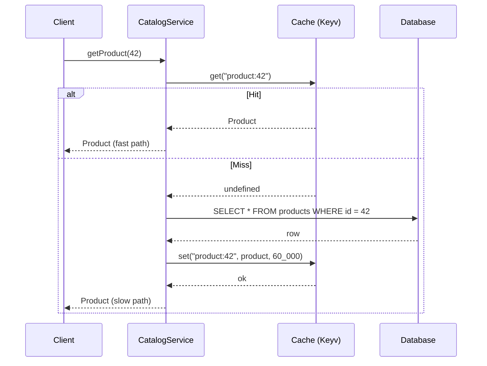

# Chapter 27 — Caching

> **한눈에 보기**
> 캐시는 성능 최적화가 아니라 **일관성과의 거래**입니다. 이 장은 `@nestjs/cache-manager`와
> `cache-manager` v6(내부적으로 Keyv)의 전체 API — `register`/`registerAsync` 옵션,
> `CACHE_MANAGER` 스토어 메서드, `CacheInterceptor`와 `@CacheKey`/`@CacheTTL`, `trackBy`
> 재정의 — 를 다룬 뒤, 공식 문서가 말하지 않는 부분으로 넘어갑니다. 무효화 전략,
> 캐시 스탬피드와 single-flight 잠금, 네거티브 캐싱, TTL을 고르는 방법, 그리고
> cache-aside·read-through·write-through의 차이입니다. 12장의 인터셉터가 여기서
> 실제 제품 기능이 되고, 17장의 설정이 스토어 연결에 쓰입니다.

**What you will learn**

- What `CacheModule.register()` actually builds at bootstrap — a Keyv-backed `Cache` object published under the `CACHE_MANAGER` token — and why that indirection is the reason switching to Redis is a one-line change.
- The complete store API (`get`, `set`, `del`, `mget`, `mset`, `mdel`, `clear`, `ttl`, `wrap`) including the `undefined`-vs-`null` miss semantics that changed in `cache-manager` v6.
- Why `CacheInterceptor` only caches `GET` requests, why it silently skips routes that inject `@Res()`, and exactly where in the request pipeline it decides to short-circuit.
- How to override `trackBy()` to build tenant- and user-scoped cache keys — and the concrete data-leak bug you ship if you bind `CacheInterceptor` globally without doing it.
- How to point the cache at Redis with `@keyv/redis`, how to layer a memory store in front of it, and how to wire the connection string through `ConfigService` with `registerAsync()`.
- Four invalidation strategies (TTL, write-through delete, key versioning, tag sets), when each is correct, and why "just clear the cache" is a production incident waiting to happen.
- How to detect and prevent a cache stampede with single-flight locking, and how to choose a TTL from a number you can actually measure.

**Why this matters**

Here is a real incident, and it is the reason this chapter spends as much space on invalidation as on the API.

A team put `CacheInterceptor` on their `UsersController` globally, with a 60-second TTL. Latency dropped, everyone was pleased. Two weeks later a support ticket arrived: a customer saw *another company's* user list on `GET /users`. The cause was three lines of default behaviour. `CacheInterceptor` builds its key from `request.url`. The tenant was not in the URL — it came from a JWT claim resolved by a guard. So `GET /users` from tenant A wrote a cache entry under the key `/users`, and `GET /users` from tenant B read it back. The framework did exactly what it documents; the team never asked what the key *identified*. A cache key is an assertion that two requests deserve the same answer, and nobody had checked that assertion.

The second failure mode is quieter and more common. A cache with a 5-minute TTL fronting an expensive aggregation query works perfectly at low traffic. At 3,000 requests per second, the moment that entry expires, every in-flight request misses simultaneously and all of them hit the database with the same query. The database, which comfortably served one such query every five minutes, now receives 3,000 at once. This is a **cache stampede**, and it is worse than having no cache at all — without the cache the load would have been steady and the query plan warm. The cure is not a longer TTL; it is making the misses collapse into one.

Third: caching is the only technique in this book that makes your application *return wrong data on purpose*. Every other chapter is about correctness. This one is about deciding how stale is acceptable, writing that decision down as a TTL, and building an invalidation path for the cases where it is not. If you cannot answer "how wrong can this be, for how long?" for a piece of data, you are not ready to cache it.

---

## 1. What Nest actually gives you

`@nestjs/cache-manager` is a thin, honest wrapper. It contributes three things and no more:

1. A **dynamic module** (`CacheModule`) that constructs a `Cache` instance and publishes it under the `CACHE_MANAGER` injection token.
2. An **interceptor** (`CacheInterceptor`) that reads and writes that `Cache` around your route handlers.
3. Two **metadata decorators** (`@CacheKey`, `@CacheTTL`) that the interceptor reads.

Everything else — eviction, TTL enforcement, serialization, the network protocol for Redis — belongs to `cache-manager` v6 and, beneath it, [Keyv](https://keyv.org/docs/). This layering matters because it tells you where to look when something behaves oddly. If a value comes back `undefined` when you expected an object, that is a Keyv/store question. If a route is not being cached at all, that is a Nest interceptor question.

```bash
$ npm install @nestjs/cache-manager cache-manager
```

Register the module:

```typescript title="app.module.ts"
import { Module } from '@nestjs/common';
import { CacheModule } from '@nestjs/cache-manager';
import { CatalogModule } from './catalog/catalog.module';

@Module({
  imports: [
    CacheModule.register({
      ttl: 30_000, // milliseconds
      isGlobal: true,
    }),
    CatalogModule,
  ],
})
export class AppModule {}
```

With no arguments, `CacheModule.register()` gives you an in-memory store with **no expiration** — the default `ttl` is `0`, which in `cache-manager` means "never expire". That default is a trap in a long-running process: an unbounded in-memory cache is a memory leak with good intentions. Always pass an explicit `ttl`, and on the in-memory store consider a size bound as well (§7).

The three options you will set at registration:

| Option | Type | Meaning |
|---|---|---|
| `ttl` | `number` | Default time-to-live in **milliseconds**. `0` means never expire. |
| `isGlobal` | `boolean` | Publishes `CACHE_MANAGER` application-wide, so feature modules need not import `CacheModule`. |
| `stores` | `Keyv[]` | Explicit store chain. First entry is primary; later entries are fallbacks (§8). |
| `max` | `number` | Maximum entries for the default memory store before LRU eviction. |

> **⚠️ Notice** — TTL is in **milliseconds** in `@nestjs/cache-manager` v2+ / `cache-manager` v5+. Older tutorials use seconds. A copied `ttl: 5` is not five seconds, it is five milliseconds, and it will look exactly like "caching is not working".

`isGlobal: true` is one of the few global modules this book recommends without hesitation. The cache is genuinely cross-cutting infrastructure, like the logger and the config service, and threading `CacheModule` through every feature module's `imports` buys you nothing.

---

## 2. The store API

Inject the cache with the `CACHE_MANAGER` token. Both the token and the `Cache` type come from `@nestjs/cache-manager`:

```typescript title="catalog.service.ts"
import { Inject, Injectable } from '@nestjs/common';
import { CACHE_MANAGER, Cache } from '@nestjs/cache-manager';

@Injectable()
export class CatalogService {
  constructor(@Inject(CACHE_MANAGER) private readonly cache: Cache) {}
}
```

### Reads and misses

```typescript
const product = await this.cache.get<Product>('product:42');
```

On a miss, `get` returns **`undefined`** in current `cache-manager`. Earlier versions returned `null`. If you are migrating, treat both as falsy — but be careful about *what* you treat as falsy, because a legitimately cached `0`, `false`, or `''` is also falsy:

```typescript
// WRONG — a cached `0` or `false` is treated as a miss forever.
const hit = await this.cache.get<number>(key);
if (!hit) {
  return this.recompute(key);
}

// RIGHT — distinguish "absent" from "falsy value".
const hit = await this.cache.get<number>(key);
if (hit === undefined || hit === null) {
  return this.recompute(key);
}
```

This is the single most common caching bug in Nest codebases, and it is invisible: the code is correct for every value except the ones that matter — a count of zero, a boolean flag, an empty string.

### Writes, deletes, and TTL

```typescript
await this.cache.set('product:42', product);           // module default TTL
await this.cache.set('product:42', product, 60_000);   // 60s, overrides default
await this.cache.set('config:flags', flags, 0);        // never expires

await this.cache.del('product:42');
await this.cache.clear();                              // flush everything
```

### Bulk operations and remaining lifetime

`cache-manager` v6 exposes multi-key operations that map to a single round trip on stores that support them (Redis `MGET`/pipelined `SET`). On a hot path that resolves twenty product IDs, this is the difference between twenty network round trips and one.

| Method | Signature | Notes |
|---|---|---|
| `mget` | `mget<T>(keys: string[]): Promise<(T \| undefined)[]>` | Result array is **positional** — index `i` corresponds to `keys[i]`, `undefined` for misses. |
| `mset` | `mset(entries: { key, value, ttl? }[])` | Per-entry TTL overrides the module default. |
| `mdel` | `mdel(keys: string[])` | Bulk delete. |
| `ttl` | `ttl(key: string): Promise<number \| null>` | Remaining lifetime in ms; `null` if the key is absent. |
| `clear` | `clear(): Promise<void>` | Wipes the store. See §9 for why you should almost never call this. |
| `wrap` | `wrap(key, fn, ttl?)` | Read-through helper: return the cached value, else run `fn`, cache the result, return it. |

```typescript
async findMany(ids: string[]): Promise<Product[]> {
  const keys = ids.map((id) => `product:${id}`);
  const cached = await this.cache.mget<Product>(keys);

  const missingIds = ids.filter((_, i) => cached[i] === undefined);
  if (missingIds.length === 0) {
    return cached as Product[];
  }

  const fetched = await this.repo.findByIds(missingIds);
  await this.cache.mset(
    fetched.map((p) => ({ key: `product:${p.id}`, value: p, ttl: 60_000 })),
  );

  const byId = new Map(fetched.map((p) => [p.id, p]));
  return ids.map((id, i) => cached[i] ?? byId.get(id)!);
}
```

That method is a partial-hit read, and it is what a real caching layer looks like: it never assumes all-hit or all-miss.

> **⚠️ Notice** — The default in-memory store serializes values with the [structured clone algorithm](https://developer.mozilla.org/en-US/docs/Web/API/Web_Workers_API/Structured_clone_algorithm#javascript_types). Class instances lose their prototype, `Date` survives, functions and `Symbol`s throw. Cache plain data, and re-hydrate into classes on read if you need methods. This bites hardest with TypeORM entities and Mongoose documents — cache the DTO, not the entity.

---

## 3. Cache-aside: the pattern you will actually write

The default pattern, and the one to reach for unless you have a reason not to, is **cache-aside** (also called lazy loading): the application owns the caching logic, the cache knows nothing about the database.



Written out:

```typescript title="catalog.service.ts"
import { Inject, Injectable, NotFoundException } from '@nestjs/common';
import { CACHE_MANAGER, Cache } from '@nestjs/cache-manager';
import { ProductRepository } from './product.repository';
import { Product } from './product.entity';

const PRODUCT_TTL_MS = 60_000;

@Injectable()
export class CatalogService {
  constructor(
    @Inject(CACHE_MANAGER) private readonly cache: Cache,
    private readonly repo: ProductRepository,
  ) {}

  async findOne(id: string): Promise<Product> {
    const key = `product:${id}`;

    const cached = await this.cache.get<Product>(key);
    if (cached !== undefined && cached !== null) {
      return cached;
    }

    const product = await this.repo.findById(id);
    if (!product) {
      throw new NotFoundException(`Product ${id} not found`);
    }

    await this.cache.set(key, product, PRODUCT_TTL_MS);
    return product;
  }
}
```

`cache.wrap` compresses this to one call when you do not need the miss branch to do anything special:

```typescript
async findOne(id: string): Promise<Product> {
  return this.cache.wrap(
    `product:${id}`,
    async () => {
      const product = await this.repo.findById(id);
      if (!product) throw new NotFoundException(`Product ${id} not found`);
      return product;
    },
    PRODUCT_TTL_MS,
  );
}
```

Prefer `wrap` for the common case. Drop to explicit `get`/`set` when you need partial hits, conditional TTLs, or negative caching (§11).

### Key naming is a design decision

Adopt a convention on day one and enforce it in review:

```text
<entity>:<id>                       product:42
<entity>:<id>:<projection>          product:42:summary
<tenant>:<entity>:<id>              t_9f3a:product:42
<entity>:list:<hash-of-query>       product:list:a1b9c2
v3:<entity>:<id>                    v3:product:42       (see §9, key versioning)
```

Three rules. **Every key includes the entity type**, so a `KEYS product:*` scan in Redis is meaningful. **Every key that depends on the caller includes the caller's scope** — tenant, user, or role — because a key that omits it is the multi-tenant bug from the introduction. **List keys hash their query parameters**, because `product:list` with no discriminator will be wrong the first time someone adds a filter.

---

## 4. Auto-caching with `CacheInterceptor`

Everything above is manual. `CacheInterceptor` automates the whole pattern at the HTTP layer:

```typescript title="catalog.controller.ts"
import { Controller, Get, UseInterceptors } from '@nestjs/common';
import { CacheInterceptor } from '@nestjs/cache-manager';

@Controller('products')
@UseInterceptors(CacheInterceptor)
export class CatalogController {
  @Get()
  findAll() {
    return this.service.findAll();
  }
}
```

Mechanically — and this is worth holding in your head, because it explains every surprising behaviour — the interceptor does this:

1. **Before** the handler runs, it computes a key by calling `trackBy(context)`.
2. If `trackBy` returns `undefined`, it bails out and the handler runs normally, uncached.
3. Otherwise it reads the key. On a hit it returns `of(cachedValue)` — an observable that emits immediately. **The handler never executes.** Neither do any interceptors downstream of it.
4. On a miss it lets the handler run and taps the response stream, writing the emitted value to the cache with the resolved TTL.

Step 3 is the important one. `CacheInterceptor` short-circuits the pipeline. If you have a logging interceptor registered *after* the cache interceptor that records "handler executed", it will not fire on a hit. If a downstream interceptor mutates the response, that mutation is baked into what gets cached — cache the shape you actually want to serve.

### Why only GET

The base `trackBy` implementation returns `undefined` for anything that is not an HTTP `GET`. This is not a limitation to route around; it is the correct default. `POST`, `PATCH`, `PUT` and `DELETE` are, by HTTP semantics, non-idempotent state changes. Caching a `POST` response means a second identical `POST` returns the first one's response without performing the operation — an order silently not placed, a payment silently not taken. Nest refuses to give you that footgun.

If you find yourself wanting to cache a `POST`, you almost certainly want a **search endpoint expressed as a POST because the query is too large for a URL**. That is a legitimate case, and the correct answer is a `trackBy` override that hashes the body — not a blanket removal of the method check. See §6.

### The `@Res()` exclusion

A handler that injects the native response object with `@Res()` opts out of Nest's response pipeline entirely (see [Chapter 4 — Controllers II](../part1-beginner/04-controllers-responses.md) and [Chapter 12 — Interceptors](../part1-beginner/12-interceptors.md)). Nothing is emitted on the observable stream for the interceptor to capture, so there is nothing to cache. The interceptor does not error — the route simply never caches, forever, silently. If a route stubbornly refuses to cache, check for `@Res()` before you check anything else.

### Binding globally

```typescript title="app.module.ts"
import { Module } from '@nestjs/common';
import { APP_INTERCEPTOR } from '@nestjs/core';
import { CacheModule, CacheInterceptor } from '@nestjs/cache-manager';

@Module({
  imports: [CacheModule.register({ ttl: 30_000, isGlobal: true })],
  providers: [{ provide: APP_INTERCEPTOR, useClass: CacheInterceptor }],
})
export class AppModule {}
```

This caches **every GET route in the application**. Read §6 before you do this. The author's recommendation: do not bind `CacheInterceptor` globally with the stock implementation. Bind a subclass with a `trackBy` you wrote, or apply it per-controller.

---

## 5. `@CacheKey` and `@CacheTTL`

Two metadata decorators tune the interceptor per handler or per controller.

```typescript
import { Controller, Get, UseInterceptors } from '@nestjs/common';
import { CacheInterceptor, CacheKey, CacheTTL } from '@nestjs/cache-manager';

@Controller('products')
@UseInterceptors(CacheInterceptor)
@CacheTTL(30_000)                 // controller-wide default
export class CatalogController {
  @Get()
  findAll() { /* uses 30_000 */ }

  @Get('featured')
  @CacheTTL(300_000)              // method wins over controller
  findFeatured() { /* uses 300_000 */ }

  @Get('stats')
  @CacheKey('catalog_stats')      // fixed key, ignores the URL
  @CacheTTL(600_000)
  stats() { /* ... */ }
}
```

Resolution order for TTL: **method-level `@CacheTTL` → controller-level `@CacheTTL` → module `ttl` option**. The two decorators are independent; use either, both, or neither.

`@CacheTTL` also accepts a factory, which is how you make TTL depend on the request:

```typescript
@Get(':id')
@CacheTTL((ctx: ExecutionContext) => {
  const req = ctx.switchToHttp().getRequest();
  // Premium tenants get fresher data.
  return req.user?.plan === 'enterprise' ? 5_000 : 60_000;
})
findOne(@Param('id') id: string) { /* ... */ }
```

`@CacheKey` matters most in two places. First, for **non-HTTP transports**, where there is no URL to derive a key from — see §12. Second, for endpoints whose URL is a poor identity: `/products/stats` and `/v2/products/stats` returning the same data should share one key.

> **Hint** — `@CacheKey` sets a *literal* key, not a template. `@CacheKey('product')` on a `:id` route makes every product share one entry. For per-parameter keys, either leave `@CacheKey` off (the URL already contains the id) or override `trackBy`.

---

## 6. `trackBy`: the security-critical extension point

`trackBy(context: ExecutionContext): string | undefined` is the whole key-derivation policy in one method. Override it by subclassing.

The stock implementation, roughly: if the request is not HTTP, use the `@CacheKey` metadata; if it is HTTP and the method is not `GET`, return `undefined`; otherwise return `request.url` (or the `@CacheKey` metadata when present).

Notice what is *not* in that list: the authenticated user, the tenant, the `Accept-Language` header, the API version, the user's role. Every one of those can change the response body while leaving the URL identical. When one does, the stock key is wrong — and "wrong" means one user's data served to another.

```typescript title="http-cache.interceptor.ts"
import { CacheInterceptor } from '@nestjs/cache-manager';
import { ExecutionContext, Injectable } from '@nestjs/common';
import { Request } from 'express';

@Injectable()
export class HttpCacheInterceptor extends CacheInterceptor {
  trackBy(context: ExecutionContext): string | undefined {
    // Preserve every base-class rule (GET-only, @CacheKey, non-HTTP contexts).
    const base = super.trackBy(context);
    if (base === undefined) {
      return undefined;
    }

    const req = context.switchToHttp().getRequest<Request>();

    // Never cache a response we could not attribute to a scope.
    const tenantId = req.user?.tenantId;
    if (!tenantId) {
      return undefined;
    }

    const lang = req.headers['accept-language'] ?? 'default';
    return `t:${tenantId}|l:${lang}|${base}`;
  }
}
```

Three deliberate choices here, each worth copying.

**Call `super.trackBy()` first.** Reimplementing the GET check and the `@CacheKey` lookup by hand is how the method-check regression gets introduced.

**Return `undefined` rather than guess.** If the tenant cannot be determined, the safe outcome is *no caching*, not caching under a shared key. A cache miss costs milliseconds; a cross-tenant leak costs a customer.

**Namespace the parts.** `t:9f3a|l:en|/products` cannot collide with a different decomposition, whereas naive concatenation (`9f3aen/products`) can.

Bind it globally in place of the stock interceptor:

```typescript
providers: [{ provide: APP_INTERCEPTOR, useClass: HttpCacheInterceptor }],
```

### Ordering matters more than it looks

`trackBy` reads `req.user`. That property is populated by an authentication guard. Guards run **before** interceptors in the Nest pipeline ([Chapter 13 — the Complete Request Lifecycle](../part1-beginner/13-custom-decorators-and-lifecycle.md)), so this works — but only for routes that actually have the guard. A route with `@Public()` has no `req.user`, `trackBy` returns `undefined`, and that route is uncached. That is the correct outcome, and it is why the guard clause reads the way it does.

### Opting individual routes out

A user-specific route that must never share an entry is best marked explicitly:

```typescript
export const NO_CACHE = 'no_cache';
export const NoCache = () => SetMetadata(NO_CACHE, true);

// inside trackBy, after super.trackBy():
if (this.reflector.getAllAndOverride<boolean>(NO_CACHE, [
  context.getHandler(),
  context.getClass(),
])) {
  return undefined;
}
```

`CacheInterceptor` already injects a `Reflector` as `this.reflector`, so no constructor changes are needed.

---

## 7. Stores: memory, Redis, and layering

The default store is in-memory. Its two properties define its correct use:

- It is **per-process**. Four replicas of your API behind a load balancer have four independent caches, four times the miss rate, and no way to invalidate an entry on the other three. A `DELETE /products/42` handler that evicts the local entry leaves stale data on the other three replicas until TTL.
- It is **on the heap**. Every cached object counts against `--max-old-space-size`. Unbounded, it ends in an OOM kill.

So: in-memory is correct for small, bounded, immutable-ish data (feature flags, a currency table, decoded JWKS keys) and for single-process deployments. For anything shared across replicas or invalidated on write, use Redis.

```bash
$ npm install @keyv/redis
```

```typescript title="app.module.ts"
import { Module } from '@nestjs/common';
import { CacheModule } from '@nestjs/cache-manager';
import { ConfigModule, ConfigService } from '@nestjs/config';
import KeyvRedis from '@keyv/redis';
import { Keyv } from 'keyv';
import { KeyvCacheableMemory } from 'cacheable';

@Module({
  imports: [
    CacheModule.registerAsync({
      isGlobal: true,
      imports: [ConfigModule],
      inject: [ConfigService],
      useFactory: (config: ConfigService) => ({
        ttl: config.get<number>('CACHE_TTL_MS', 30_000),
        stores: [
          // L1: process-local, tiny TTL, bounded size.
          new Keyv({
            store: new KeyvCacheableMemory({ ttl: 5_000, lruSize: 5_000 }),
          }),
          // L2: shared across all replicas.
          new KeyvRedis(config.getOrThrow<string>('REDIS_URL')),
        ],
      }),
    }),
  ],
})
export class AppModule {}
```

The `stores` array is a **chain**: the first entry is primary, the rest are fallbacks. A read tries L1, then L2; a write goes to both. This two-tier arrangement is a genuine optimisation — it absorbs the "same key, 500 times per second, from one process" pattern without a network hop — but it re-introduces the staleness problem in miniature. An entry invalidated in Redis by another replica lives on in this replica's L1 for up to its L1 TTL. Keep L1 TTLs *short* (single-digit seconds) so the inconsistency window is bounded and small.

| Store | Package | Shared across replicas | Survives restart | Use for |
|---|---|---|---|---|
| Memory (default) | built in | No | No | Flags, small reference data, single-process apps |
| `KeyvCacheableMemory` | `cacheable` | No | No | L1 tier with LRU bound |
| Redis / Valkey | `@keyv/redis` | Yes | With persistence | The default choice for multi-replica services |
| Memcached | `@keyv/memcache` | Yes | No | Existing Memcached infrastructure |
| SQLite / Postgres | `@keyv/sqlite`, `@keyv/postgres` | Yes | Yes | Low-traffic apps, avoiding a new dependency |
| Mongo | `@keyv/mongo` | Yes | Yes | Same |

### Async configuration variants

`registerAsync()` accepts the four standard forms. `useFactory` above is the one to use in practice; the rest exist for cases where configuration is itself a service.

```typescript
// useClass — Nest instantiates the factory class inside CacheModule.
CacheModule.registerAsync({ useClass: CacheConfigService });

// useExisting — reuse an instance already created in an imported module.
CacheModule.registerAsync({ imports: [ConfigModule], useExisting: CacheConfigService });

// extraProviders — merge additional providers into the module so the
// factory/class can inject them.
CacheModule.registerAsync({
  imports: [ConfigModule],
  useClass: CacheConfigService,
  extraProviders: [RedisHealthProvider],
});
```

```typescript title="cache-config.service.ts"
import { Injectable } from '@nestjs/common';
import { CacheOptionsFactory, CacheModuleOptions } from '@nestjs/cache-manager';

@Injectable()
export class CacheConfigService implements CacheOptionsFactory {
  createCacheOptions(): CacheModuleOptions {
    return { ttl: 30_000 };
  }
}
```

`register`, `registerAsync` and `CacheOptionsFactory` all take an optional generic type argument to narrow store-specific options, e.g. `CacheModule.register<RedisOptions>({ ... })`, which restores type safety on store-specific keys.

> **⚠️ Notice** — Redis is now a hard dependency of your request path. If Redis is unreachable, `cache.get` rejects, and an unguarded `await` turns a cache outage into a full outage. Wrap cache reads in your service layer so that a store failure degrades to a miss, not a 500. §13 shows the pattern.

---

## 8. Invalidation

Phil Karlton's line about cache invalidation being one of the two hard problems in computer science is quoted so often that people forget it is a description of a real engineering task with real, specific solutions. There are four, and they compose.

### 8.1 TTL only (expiry-based)

Set a TTL, never explicitly delete, accept staleness up to the TTL. This is the right default for data where a bounded lag is acceptable: catalogue listings, aggregate counts, public profiles, search results.

Its virtue is that it cannot go wrong. There is no invalidation code to forget to call, no consistency bug across replicas, no ordering hazard. Its cost is stated up front in the TTL, which makes it reviewable: `ttl: 60_000` on a product listing is a written promise that an edit appears within a minute.

### 8.2 Write-through delete (evict on mutation)

Every write path deletes the keys it invalidates.

```typescript title="catalog.service.ts"
async update(id: string, dto: UpdateProductDto): Promise<Product> {
  const product = await this.repo.update(id, dto);

  await this.cache.mdel([
    `product:${id}`,
    `product:${id}:summary`,
  ]);
  await this.bumpListVersion();   // §8.3 — list keys cannot be enumerated

  return product;
}
```

Delete, do not overwrite. Writing the new value into the cache from the write path looks tidier and introduces a race: two concurrent updates can write their values in the opposite order to the one in which they hit the database, leaving the cache permanently holding the older row. Deleting is idempotent and order-independent — the next read re-populates from the source of truth.

The failure mode of write-through delete is **incompleteness**. Every derived key that depends on the updated row must be deleted, and six months later someone adds a seventh key and forgets. Keep the eviction list next to the key-construction code, ideally in a single method:

```typescript
private keysFor(id: string): string[] {
  return [`product:${id}`, `product:${id}:summary`, `product:${id}:reviews`];
}
```

### 8.3 Key versioning (generational invalidation)

You cannot enumerate list keys — `product:list:<hash>` has unbounded variants and `KEYS product:list:*` is an O(n) scan that blocks Redis. The solution is to put a version number in the key prefix and bump it. Old entries become unreachable and expire on their own.

```typescript
private async listVersion(): Promise<number> {
  return (await this.cache.get<number>('product:list:version')) ?? 1;
}

private async bumpListVersion(): Promise<void> {
  const v = await this.listVersion();
  await this.cache.set('product:list:version', v + 1, 0);
}

async findAll(query: ListQuery): Promise<Product[]> {
  const v = await this.listVersion();
  const key = `product:list:v${v}:${hashQuery(query)}`;
  return this.cache.wrap(key, () => this.repo.findAll(query), 60_000);
}
```

One write invalidates every list variant at once. The cost is one extra cache read per request (cheap, and cacheable in L1) and a burst of misses after every write — which is why this suits read-heavy data with infrequent writes, and suits a product catalogue much better than a chat feed.

### 8.4 Tag sets

Maintain a set of keys per tag and delete the set's members on invalidation. Redis does this well with a `SET` per tag, but it is outside the Keyv abstraction — you reach for the raw Redis client. Use it when a single write invalidates a cross-cutting group (all keys touching `category:shoes`) that neither an id nor a version prefix expresses.

| Strategy | Consistency | Complexity | Invalidates lists | Best for |
|---|---|---|---|---|
| TTL only | Bounded staleness | Lowest | Yes, eventually | Most read paths |
| Write-through delete | Immediate for known keys | Low | No | Entity-by-id reads |
| Key versioning | Immediate, coarse | Medium | Yes | Read-heavy list endpoints |
| Tag sets | Immediate, precise | High | Yes | Complex derived views |

### 8.5 Never `clear()` in production

`cache.clear()` flushes the entire store. On a shared Redis, that includes every other service's keys, every session if you store sessions there, and every rate-limit counter. It also produces a coordinated stampede: every request in the system misses at once. Use it in tests and in `afterEach`. In production, prefer versioning.

---

## 9. Cache stampede and single-flight

Return to the incident from the introduction. One key, a 5-minute TTL, 3,000 rps, an aggregation that takes 800 ms. At expiry, all requests arriving during those 800 ms miss and all of them run the query. This is **not** rare — it is guaranteed for any hot key.

The fix is **single-flight**: at most one concurrent computation per key, with the others waiting on its result.

### In-process single-flight

```typescript title="single-flight.ts"
export class SingleFlight {
  private readonly inFlight = new Map<string, Promise<unknown>>();

  async do<T>(key: string, fn: () => Promise<T>): Promise<T> {
    const existing = this.inFlight.get(key) as Promise<T> | undefined;
    if (existing) {
      return existing;
    }

    const promise = fn().finally(() => this.inFlight.delete(key));
    this.inFlight.set(key, promise);
    return promise;
  }
}
```

```typescript
async expensiveStats(): Promise<Stats> {
  const key = 'catalog:stats';

  const cached = await this.cache.get<Stats>(key);
  if (cached !== undefined && cached !== null) return cached;

  return this.flight.do(key, async () => {
    // Re-check: another caller may have populated it while we queued.
    const again = await this.cache.get<Stats>(key);
    if (again !== undefined && again !== null) return again;

    const stats = await this.repo.computeStats();
    await this.cache.set(key, stats, 300_000);
    return stats;
  });
}
```

This collapses 3,000 concurrent misses into one query **per process**. With four replicas you get four queries instead of 3,000 — usually enough. Note the re-check inside the critical section; without it the second waiter recomputes needlessly.

### Cross-process locking

When one query is genuinely all the database can take, coordinate through the store. Use `SET key value NX PX ttl` semantics on the raw Redis client: the winner computes and populates, the losers sleep briefly and re-read. Two rules make this safe: the lock **must** have its own short TTL (10–30 s) so a crashed holder cannot deadlock the key forever, and the losers **must** have a bounded retry budget after which they compute anyway or return a degraded response, so a lost lock does not become a hang.

### Probabilistic early expiry

The cheapest mitigation, and often sufficient. Instead of letting an entry expire, recompute it *probabilistically* as expiry approaches, so the refresh happens under low concurrency:

```typescript
const remaining = await this.cache.ttl(key);          // ms, or null
const shouldRefreshEarly =
  remaining !== null && remaining < 30_000 && Math.random() < 0.05;
```

Five percent of requests in the last 30 seconds of life refresh the entry. At any meaningful traffic, one of them wins long before expiry and the cliff never arrives. This also solves the correlated-expiry problem: entries created in a burst (a deploy, a cold start) all expire in a burst. Adding jitter to the TTL at write time is the same idea applied earlier:

```typescript
const jitter = Math.floor(Math.random() * 10_000);
await this.cache.set(key, value, 60_000 + jitter);
```

---

## 10. Choosing a TTL, and negative caching

### TTL as an arithmetic problem

A TTL is not a vibe. Two numbers determine it.

**The staleness budget** is a product decision: how long may a user see an old value? Get this from a person, not from a config file. Order status: seconds. Product description: minutes. Country list: a day.

**The hit-rate curve** is an engineering measurement. For a key requested `r` times per second with TTL `t` seconds, roughly `r × t` requests share one computation, so the hit rate approaches `1 − 1/(r × t)`. That formula has a blunt consequence: at 10 rps, going from a 10-second TTL (99% hit rate) to a 60-second TTL (99.8%) removes 80% of the *remaining* misses — but the remaining misses were already 1% of traffic. You bought almost nothing and paid six times the staleness.

The rule that follows: **take the smallest TTL that gets you onto the flat part of the curve**, and stop. For most endpoints that is tens of seconds, not hours. Long TTLs are a symptom of an expensive query that deserves an index, not a caching win.

### Negative caching

Cache misses of the *source*, not just of the cache. If `product:99999` does not exist and an enumeration script requests it 10,000 times, each request is a full database round trip returning nothing.

```typescript
const NEGATIVE = Symbol.for('cache:absent');

async findOne(id: string): Promise<Product> {
  const key = `product:${id}`;
  const cached = await this.cache.get<Product | 'ABSENT'>(key);

  if (cached === 'ABSENT') {
    throw new NotFoundException(`Product ${id} not found`);
  }
  if (cached !== undefined && cached !== null) {
    return cached;
  }

  const product = await this.repo.findById(id);
  if (!product) {
    // Short TTL: an id can start existing at any moment.
    await this.cache.set(key, 'ABSENT', 10_000);
    throw new NotFoundException(`Product ${id} not found`);
  }

  await this.cache.set(key, product, 60_000);
  return product;
}
```

Two rules. Negative TTLs are **much shorter** than positive ones (a nonexistent row can become existent; an existing row rarely vanishes), and the sentinel must be a value that cannot collide with real data — a string constant like `'ABSENT'` for structured-clone-safe stores, since `Symbol` does not survive serialization.

Negative caching is also a cheap denial-of-service mitigation: it caps the database cost of enumeration attacks against `/products/:id`. Pair it with the rate limiting from [Chapter 26](26-web-security-hardening.md).

---

## 11. Cache-aside vs read-through vs write-through

| | Who populates | Who invalidates | Read latency on miss | Write latency | Consistency | Complexity |
|---|---|---|---|---|---|---|
| **Cache-aside** (lazy) | Application, on miss | Application, on write | DB + cache write | DB only | Bounded staleness | Low |
| **Read-through** | Cache layer (`wrap`, or store plugin) | TTL, or app | DB + cache write | DB only | Same as cache-aside | Low |
| **Write-through** | Write path, on every write | Implicit — always fresh | DB (first read only) | DB + cache write | Strong, if writes all go through it | Medium |
| **Write-behind** | Write path, async flush to DB | Implicit | Cache only | Cache only (fast) | Weak; data loss on crash | High |
| **Refresh-ahead** | Background job / early expiry | Job schedule | Rarely misses | DB only | Bounded by refresh interval | Medium |

`@nestjs/cache-manager` gives you cache-aside and, via `cache.wrap`, read-through. The others you build yourself.

**Cache-aside** is the default and the recommendation. It caches only what is actually read, it survives a cold cache gracefully, and its failure mode (a stale read for at most TTL) is the mildest one available.

**Write-through** — writing to the cache on every write, so the cache is always warm and always fresh — is tempting and usually wrong in a Nest service. It only holds if *every* writer goes through your application. The moment a migration script, an admin console, a database trigger, or a second service writes the same table, the cache is silently wrong with no TTL to save it. Write-through is for caches that own their data, not for caches in front of a shared database.

**Write-behind** trades durability for write latency and should be treated as a queue, not a cache. If you want it, use [BullMQ](35-queues.md) with a real job store rather than an eviction-prone cache.

**Refresh-ahead** — a scheduled job that recomputes hot keys before they expire — is the right answer for a small number of very expensive, very hot aggregates (a homepage, a dashboard). Implement it with [`@nestjs/schedule`](34-scheduling-and-events.md) and a `ttl` of `0`, so the entry never expires and the job is the only writer. Now a failed job means stale data rather than a stampede, which is the better failure.

---

## 12. Caching outside HTTP

### Microservices and WebSockets

`CacheInterceptor` works in message handlers and gateway subscribers, on any transport. Because there is no URL, `@CacheKey` is **required** — without it `trackBy` has nothing to build a key from and the handler runs uncached.

```typescript
import { CacheInterceptor, CacheKey, CacheTTL } from '@nestjs/cache-manager';
import { UseInterceptors } from '@nestjs/common';
import { MessagePattern } from '@nestjs/microservices';

@CacheKey('catalog.summary')
@CacheTTL(30_000)
@UseInterceptors(CacheInterceptor)
@MessagePattern({ cmd: 'catalog.summary' })
getSummary() {
  return this.service.summary();
}
```

The same applies to `@SubscribeMessage` handlers in a WebSocket gateway. And the same warning applies with more force here than over HTTP: because the key is a fixed constant, it is shared by *every* caller. Only use a static `@CacheKey` for genuinely global data. Anything caller-specific needs a `trackBy` override reading the message payload.

The docs' own advice is worth repeating verbatim: **you should not cache everything.** A handler that performs a business operation rather than answering a query must never be cached — a static `@CacheKey` on a command handler means the command runs once and then stops running.

### GraphQL

`CacheInterceptor` does **not** work usefully in a GraphQL application. Interceptors in `@nestjs/graphql` execute per **field resolver**, not per request, so the cache interceptor fires once for every resolved field, with a `trackBy` that has no URL to work from. Do not bind it globally in a GraphQL app.

Cache GraphQL at two other levels instead: inside your resolvers and services with the explicit `cache.get`/`set` pattern from §3, and — for the N+1 problem, which is the one that actually hurts — with per-request `DataLoader` batching. `CACHE_MANAGER` is a perfectly good backing store for a longer-lived resolver cache; it is the *interceptor* that does not fit. See [Chapter 50](../part3-advanced/50-graphql-fundamentals.md).

---

## 13. Common mistakes

1. **TTL in seconds.** *Symptom:* caching appears to do nothing; every request is a miss. *Cause:* `ttl: 60` copied from a pre-v5 tutorial is 60 milliseconds. *Fix:* milliseconds everywhere; write `60_000` with the numeric separator so review catches it.

2. **`if (!cached)` as a miss check.** *Symptom:* an endpoint returning `0`, `false`, or `''` never gets a cache hit and its "cache" doubles the work. *Cause:* falsy values are indistinguishable from absent ones. *Fix:* `if (cached === undefined || cached === null)`.

3. **Global `CacheInterceptor` with the stock `trackBy`.** *Symptom:* users see other users' data, intermittently, usually reported first by a customer. *Cause:* the key is `request.url`, which does not include the identity that shaped the response. *Fix:* subclass and include the scope — and return `undefined` when the scope is unknown (§6).

4. **Caching entities instead of DTOs.** *Symptom:* `TypeError: product.getDisplayName is not a function`, or a Mongoose document that has lost `.save()`. *Cause:* the structured-clone round trip drops prototypes. *Fix:* cache plain serializable data; map to and from your class at the boundary.

5. **Overwriting the cache from the write path.** *Symptom:* the cache permanently holds a value older than the database, and only a restart or TTL clears it. *Cause:* two concurrent updates completed in one order at the database and the reverse order at the cache. *Fix:* delete on write, never `set`; let the next read repopulate.

6. **No fallback when the store is down.** *Symptom:* Redis restarts for 20 seconds; the API returns 500 for 20 seconds. *Cause:* an unguarded `await this.cache.get(...)` propagates the connection error. *Fix:* treat cache failure as a miss.

   ```typescript
   private async safeGet<T>(key: string): Promise<T | undefined> {
     try {
       return (await this.cache.get<T>(key)) ?? undefined;
     } catch (err) {
       this.logger.warn(`cache read failed for ${key}: ${err.message}`);
       return undefined;   // degrade to a miss, never to a 500
     }
   }
   ```

7. **Caching a route that injects `@Res()`.** *Symptom:* one specific route is never cached and there is no error anywhere. *Cause:* no value is emitted on the observable stream for the interceptor to capture. *Fix:* remove `@Res()` (use `@Res({ passthrough: true })` if you only need to set a header), or cache inside the service.

8. **`clear()` on a shared Redis.** *Symptom:* every service that shares the instance loses its cache, sessions log everyone out, rate limits reset. *Cause:* `clear()` is a flush, not a namespace delete. *Fix:* key versioning (§8.3); reserve `clear()` for tests.

9. **Caching authenticated responses in a CDN too.** *Symptom:* the leak from mistake 3, but at the edge, where you cannot purge it quickly. *Cause:* a `Cache-Control: public` header on a personalized response. *Fix:* `Cache-Control: private, no-store` on anything user-specific; the application cache and the HTTP cache are separate decisions and need separate reviews.

---

## 14. Putting it together

A catalogue service that uses everything: cache-aside with negative caching, single-flight, jittered TTL, versioned list keys, write-through deletion, and graceful degradation when Redis is unavailable.

```typescript title="catalog.service.ts"
import { Inject, Injectable, Logger, NotFoundException } from '@nestjs/common';
import { CACHE_MANAGER, Cache } from '@nestjs/cache-manager';
import { createHash } from 'node:crypto';
import { ProductRepository } from './product.repository';
import { ProductDto, ListQuery } from './product.dto';

const ABSENT = 'ABSENT';
const PRODUCT_TTL = 60_000;
const ABSENT_TTL = 10_000;
const LIST_TTL = 30_000;

@Injectable()
export class CatalogService {
  private readonly logger = new Logger(CatalogService.name);
  private readonly inFlight = new Map<string, Promise<unknown>>();

  constructor(
    @Inject(CACHE_MANAGER) private readonly cache: Cache,
    private readonly repo: ProductRepository,
  ) {}

  async findOne(tenantId: string, id: string): Promise<ProductDto> {
    const key = `${tenantId}:product:${id}`;
    const cached = await this.safeGet<ProductDto | typeof ABSENT>(key);

    if (cached === ABSENT) throw new NotFoundException(`Product ${id} not found`);
    if (cached !== undefined) return cached as ProductDto;

    return this.single(key, async () => {
      const product = await this.repo.findById(tenantId, id);
      if (!product) {
        await this.safeSet(key, ABSENT, ABSENT_TTL);
        throw new NotFoundException(`Product ${id} not found`);
      }
      await this.safeSet(key, ProductDto.from(product), this.jitter(PRODUCT_TTL));
      return ProductDto.from(product);
    });
  }

  async findAll(tenantId: string, query: ListQuery): Promise<ProductDto[]> {
    const version = (await this.safeGet<number>(`${tenantId}:product:v`)) ?? 1;
    const hash = createHash('sha1').update(JSON.stringify(query)).digest('hex').slice(0, 12);
    const key = `${tenantId}:product:list:v${version}:${hash}`;

    const cached = await this.safeGet<ProductDto[]>(key);
    if (cached !== undefined) return cached;

    return this.single(key, async () => {
      const rows = await this.repo.findAll(tenantId, query);
      const dtos = rows.map(ProductDto.from);
      await this.safeSet(key, dtos, this.jitter(LIST_TTL));
      return dtos;
    });
  }

  async update(tenantId: string, id: string, patch: Partial<ProductDto>): Promise<ProductDto> {
    const product = await this.repo.update(tenantId, id, patch);

    // Evict the entity, then invalidate every list variant by bumping the version.
    await this.cache.mdel([`${tenantId}:product:${id}`]).catch(() => undefined);
    const version = (await this.safeGet<number>(`${tenantId}:product:v`)) ?? 1;
    await this.safeSet(`${tenantId}:product:v`, version + 1, 0);

    return ProductDto.from(product);
  }

  // --- helpers -------------------------------------------------------------

  private jitter(ms: number): number {
    return ms + Math.floor(Math.random() * ms * 0.1);
  }

  private single<T>(key: string, fn: () => Promise<T>): Promise<T> {
    const existing = this.inFlight.get(key) as Promise<T> | undefined;
    if (existing) return existing;
    const p = fn().finally(() => this.inFlight.delete(key));
    this.inFlight.set(key, p);
    return p;
  }

  private async safeGet<T>(key: string): Promise<T | undefined> {
    try {
      const v = await this.cache.get<T>(key);
      return v === null ? undefined : v;
    } catch (err) {
      this.logger.warn(`cache read failed (${key}): ${(err as Error).message}`);
      return undefined;
    }
  }

  private async safeSet(key: string, value: unknown, ttl: number): Promise<void> {
    try {
      await this.cache.set(key, value, ttl);
    } catch (err) {
      this.logger.warn(`cache write failed (${key}): ${(err as Error).message}`);
    }
  }
}
```

Every cache interaction in that class can fail without failing the request. Every key carries its tenant. Every miss is collapsed. Every write invalidates both the entity and its lists. That is roughly 90 lines more than the naive version and it is the difference between a cache you can leave running and one that pages you.

---

> **핵심 정리**
> - `@nestjs/cache-manager`는 얇은 래퍼입니다. `CACHE_MANAGER` 토큰 뒤에는 `cache-manager` v6와 Keyv가 있고, 실제 만료·직렬화·네트워크는 모두 거기서 일어납니다.
> - TTL 단위는 **밀리초**이며 기본값 `0`은 "만료 없음"입니다. 항상 명시적으로 지정하세요.
> - 캐시 미스 판정은 `!value`가 아니라 `value === undefined || value === null`로 하세요. `0`·`false`·`''`은 유효한 캐시 값입니다.
> - `CacheInterceptor`는 히트 시 핸들러를 **실행하지 않고** 파이프라인을 단축합니다. GET만 캐시하며 `@Res()` 라우트는 조용히 건너뜁니다.
> - 기본 `trackBy`는 `request.url`만 씁니다. 테넌트·사용자·언어가 응답을 바꾼다면 반드시 `trackBy`를 재정의하고, 범위를 알 수 없으면 `undefined`를 반환해 캐시하지 마세요.
> - 무효화 전략은 네 가지입니다 — TTL만, 쓰기 시 삭제, 키 버저닝, 태그 세트. 목록 키는 열거할 수 없으므로 버저닝이 정답입니다.
> - 쓰기 경로에서는 `set`이 아니라 `del`하세요. 덮어쓰기는 동시 갱신 시 영구적으로 오래된 값을 남깁니다.
> - 인기 키는 만료 순간 스탬피드를 일으킵니다. single-flight 잠금, TTL 지터, 확률적 조기 갱신으로 막으세요.
> - 없는 데이터도 짧은 TTL로 캐시(네거티브 캐싱)하면 열거 공격의 DB 비용을 상한선으로 묶을 수 있습니다.
> - 캐시 장애가 요청 장애가 되어서는 안 됩니다. 모든 캐시 호출은 실패 시 "미스"로 강등되어야 합니다.

> **연습 문제**
> 1. `CacheModule.register({ ttl: 5 })`로 등록하고 `@UseInterceptors(CacheInterceptor)`를 붙인 GET 라우트가 왜 캐시되지 않는 것처럼 보이는지 설명하고, 실제로 캐시되고 있음을 증명하는 테스트를 작성하세요.
> 2. 재고 수량을 반환하는 엔드포인트가 있습니다. 수량이 `0`일 때만 응답이 느립니다. 원인을 코드 한 줄로 지목하고 고치세요.
> 3. `CacheInterceptor`를 상속해 `trackBy`를 재정의하는 `TenantCacheInterceptor`를 직접 구현하세요. 요구사항: (a) `super.trackBy()` 결과를 존중할 것, (b) `req.user.tenantId`가 없으면 캐시하지 않을 것, (c) `@NoCache()` 데코레이터가 붙은 핸들러를 제외할 것. 세 조건 각각에 대한 단위 테스트를 포함하세요.
> 4. 목록 엔드포인트에 키 버저닝을 적용하세요. 버전 카운터는 어디에 저장해야 하며, TTL은 얼마여야 합니까? 그 이유를 쓰세요.
> 5. 800ms가 걸리는 집계 쿼리를 캐시하는 서비스를 만들고, 100개의 동시 요청을 보내는 테스트를 작성해 리포지토리가 **정확히 한 번** 호출되는지 검증하세요(single-flight).
> 6. Redis 연결을 끊은 상태에서 애플리케이션이 계속 200을 반환하도록 만드세요. 어떤 로그가 남아야 하고, 어떤 메트릭을 노출해야 운영 중에 캐시가 죽은 것을 알아챌 수 있습니까?

**Next:** [Chapter 28 — File Upload, Streaming, and Static Assets](28-file-upload-and-streaming.md) moves from data you compute to data you move: multipart uploads, streamable file responses, and why a file served through your Node process is a file you are paying for twice.
