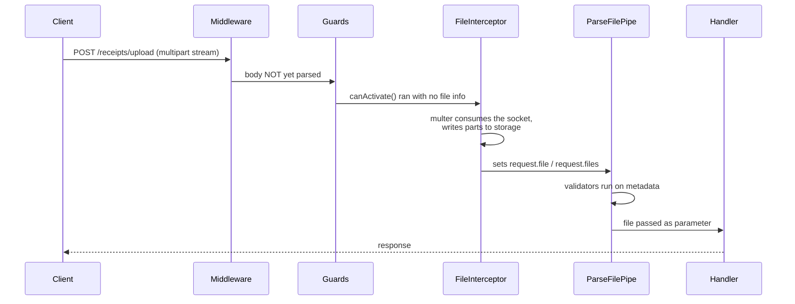
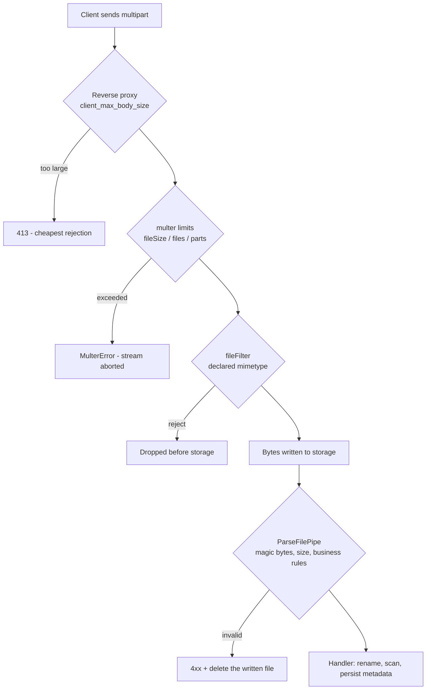

# Chapter 28 — File Upload, Streaming, and Static Assets

> **한눈에 보기**
> 지금까지 다룬 요청은 모두 JSON이었습니다. 이 장에서는 바이트를 다룹니다. 업로드는
> `multipart/form-data`를 파싱하는 multer 인터셉터와 `ParseFilePipe` 검증으로,
> 다운로드는 인터셉터 체인을 잃지 않는 `StreamableFile`로, 정적 자산은
> `ServeStaticModule`로 처리합니다. 마지막으로 웹훅 서명 검증에 반드시 필요한
> `rawBody` 옵션과, 업로드 기능이 열어 주는 공격 표면 전체를 정리합니다.
> 10장의 파이프와 12장의 인터셉터가 여기서 실제 바이트 위에서 동작하는 모습을 봅니다.

**What you will learn**

- Why `multipart/form-data` needs a dedicated parser that the JSON body parser cannot provide, and exactly where multer plugs into the Nest request pipeline.
- How to choose between `FileInterceptor`, `FilesInterceptor`, `FileFieldsInterceptor`, `AnyFilesInterceptor`, and `NoFilesInterceptor` — and why `diskStorage` and `memoryStorage` give you a *different shaped* `Express.Multer.File`.
- How to validate uploads with `ParseFilePipe`, `MaxFileSizeValidator`, `FileTypeValidator`, and a `FileValidator` you write yourself that checks magic bytes rather than a client-supplied header.
- How to return a file without losing your interceptors, using `StreamableFile`, and how to handle an error that occurs *after* the response headers have already gone out.
- How `ServeStaticModule` serves a single-page app without swallowing your API routes.
- Why `rawBody: true` exists, and how to verify a Stripe-style webhook signature on both Express and Fastify.
- The seven ways an upload endpoint gets you compromised, and the specific mitigation for each.

**Why this matters**

An upload endpoint is the single most dangerous route in a typical application, and it is usually written by whoever drew the short straw. Consider a real incident pattern. A team ships an avatar upload. Multer's defaults are permissive — no size limit at all — so a client streams a 4 GB file. Because someone chose `memoryStorage()` "to keep it simple", the process holds all 4 GB in a `Buffer` and the container is OOM-killed. Every in-flight request on that instance dies. The endpoint was never called by a real user; a scanner found it.

Change one variable and you get a different incident. The team switches to `diskStorage()` and names the saved file after `file.originalname`, because that is what the browser sent and it looks like a filename. A client sends `originalname` of `../../../../app/dist/main.js`. Multer's `filename` callback returns it verbatim, the write escapes the upload directory, and the next process restart runs attacker-supplied JavaScript. Neither bug is exotic. Both come from treating a multipart part as if it were trustworthy structured data instead of what it actually is: an arbitrary byte stream with an attacker-controlled label attached.

Downloads have a quieter failure mode. The obvious way to send a file back is `@Res() res` plus `stream.pipe(res)`. It works, and it silently opts that route out of every interceptor you have — your logging interceptor, your response envelope, your timeout. Six months later someone asks why one route is missing from the metrics dashboard and nobody can find the reason. `StreamableFile` exists precisely so that returning a stream stays a *return value* and the pipeline from [Chapter 12](../part1-beginner/12-interceptors.md) keeps running.

This chapter treats bytes as a first-class concern: parsing them in, validating them properly, streaming them out, serving them statically, and — for webhooks — deliberately *not* parsing them at all.

## 1. What `multipart/form-data` actually is

`express.json()` reads the whole body, hands it to `JSON.parse`, and puts the result on `req.body`. That works because JSON is a small, self-delimiting text format. `multipart/form-data` is not.

A multipart body is a sequence of *parts* separated by a boundary string that the client picks and announces in the `Content-Type` header:

```text
Content-Type: multipart/form-data; boundary=----Boundary7MA4YWxk

------Boundary7MA4YWxk
Content-Disposition: form-data; name="expenseId"

exp_8812
------Boundary7MA4YWxk
Content-Disposition: form-data; name="receipt"; filename="lunch.jpg"
Content-Type: image/jpeg

<binary bytes…>
------Boundary7MA4YWxk--
```

Three consequences follow, and they drive every design decision in the rest of this section:

1. **A part can be arbitrarily large.** Buffering the whole body before parsing is not an option, so a multipart parser must be a *streaming* parser. It reads part headers, then pipes the part body somewhere (disk, memory, S3) while the socket is still open.
2. **Text fields and files are interleaved.** A regular field can appear *after* a 200 MB file. If you need `expenseId` in order to decide where to store the file, you cannot rely on ordering — which is why clients should be told to send scalar fields first, and why your server must not depend on it.
3. **`filename` and `Content-Type` are just labels.** They are strings the client typed into the part header. They are not derived from the bytes. Everything in [§13](#13-security-the-part-that-gets-people-breached) follows from this one fact.

Nest does not ship its own multipart parser. On Express it wraps [multer](https://github.com/expressjs/multer), the de-facto standard, in a set of interceptors.

> **⚠️ Notice** — Multer only handles `multipart/form-data`. It ignores `application/json` and `application/x-www-form-urlencoded` bodies entirely, and the multer-based interceptors in `@nestjs/platform-express` are **not** compatible with `FastifyAdapter`. Fastify users go to [§9](#9-fastify-fastifymultipart).

Install the typings so `Express.Multer.File` resolves:

```bash
$ npm i -D @types/multer
```

The runtime dependency comes with `@nestjs/platform-express`; you do not install `multer` separately. `Express.Multer.File` is an ambient type merged into the `Express` namespace, so `import { Express } from 'express'` (or simply having `@types/multer` in scope) is what makes it available.

## 2. The first upload, and where the interceptor sits

Our running domain for this chapter is an expense-reporting API: users attach receipt images to an expense, download them later, and the service receives payment webhooks.

```typescript title="src/receipts/receipts.controller.ts"
import {
  Controller,
  Post,
  UploadedFile,
  UseInterceptors,
} from '@nestjs/common';
import { FileInterceptor } from '@nestjs/platform-express';

@Controller('receipts')
export class ReceiptsController {
  @Post('upload')
  @UseInterceptors(FileInterceptor('receipt'))
  upload(@UploadedFile() file: Express.Multer.File) {
    return { storedAs: file.filename, bytes: file.size };
  }
}
```

`FileInterceptor` comes from `@nestjs/platform-express`; `@UploadedFile()` comes from `@nestjs/common`. That split is deliberate — the decorator is platform-agnostic (it just reads `request.file`), the interceptor is not.

`FileInterceptor(fieldName, options?)` takes:

- `fieldName` — the `name` attribute of the form field holding the file. It must match exactly. A mismatch does not error; you get `undefined`.
- `options` — an optional `MulterOptions` object, identical to what you would pass to the multer constructor ([§5](#5-multer-options-in-full)).

### The mechanism

Understanding *when* multer runs explains most of the surprises in this chapter.



Two things fall out of this diagram immediately.

**Guards run before the file exists.** A guard cannot inspect the upload, because at `canActivate()` time the multipart body has not been read. Authorisation decisions that depend on file content have to live in a pipe or in the handler. Authorisation decisions that depend on the *user* still belong in the guard — and should stay there, because rejecting in a guard means you never pay to buffer the bytes.

**Multer has already written the bytes by the time your pipe runs.** `ParseFilePipe` is a *post-hoc* validator. If the file went to `diskStorage`, a rejected upload has already touched your disk, and nothing deletes it for you. This is the single most common production leak in Nest upload code, and [§7](#7-validating-uploads-parsefilepipe) shows the fix.

## 3. The `Express.Multer.File` object

`@UploadedFile()` hands you multer's file descriptor. Which fields are populated depends entirely on the storage engine.

| Property | Type | Present with | Meaning |
|---|---|---|---|
| `fieldname` | `string` | always | The form field name — what you passed to `FileInterceptor` |
| `originalname` | `string` | always | The filename the **client** claimed. Attacker-controlled. |
| `encoding` | `string` | always | Transfer encoding of the part (`7bit`, `binary`, …) |
| `mimetype` | `string` | always | The `Content-Type` the **client** claimed. Attacker-controlled. |
| `size` | `number` | always | Byte length actually received |
| `destination` | `string` | `diskStorage` / `dest` | Directory the file was written to |
| `filename` | `string` | `diskStorage` / `dest` | Name on disk — a random 32-hex string unless you override it |
| `path` | `string` | `diskStorage` / `dest` | Full path of the written file |
| `buffer` | `Buffer` | `memoryStorage` | The complete file contents in RAM |
| `stream` | `Readable` | custom engines | The readable part stream, for engines that pipe elsewhere |

Read that table as two disjoint worlds. With disk storage `file.buffer` is `undefined`; with memory storage `file.path` is `undefined`. Code like `readFileSync(file.path)` compiles fine and throws `ENOENT: undefined` at runtime the day someone changes the storage engine in a shared `MulterModule.register()` call. Type the boundary explicitly if this matters:

```typescript
type DiskFile = Express.Multer.File & { path: string; filename: string };
type MemoryFile = Express.Multer.File & { buffer: Buffer };
```

Note also that `size` is the *received* byte count, so it is trustworthy in a way that `originalname` and `mimetype` are not — multer counted the bytes itself.

## 4. The five interceptors

| Interceptor | Decorator to read it | Shape you receive | Use when |
|---|---|---|---|
| `FileInterceptor(field, opts?)` | `@UploadedFile()` | `Express.Multer.File` | Exactly one file under one field |
| `FilesInterceptor(field, maxCount?, opts?)` | `@UploadedFiles()` | `Express.Multer.File[]` | Many files, one field name |
| `FileFieldsInterceptor(fields[], opts?)` | `@UploadedFiles()` | `Record<string, Express.Multer.File[]>` | Several distinct fields |
| `AnyFilesInterceptor(opts?)` | `@UploadedFiles()` | `Express.Multer.File[]` | Field names unknown ahead of time |
| `NoFilesInterceptor(opts?)` | `@Body()` | — (files rejected) | Multipart form with **no** files allowed |

### One file per field, many files

```typescript title="src/receipts/receipts.controller.ts"
import { FilesInterceptor } from '@nestjs/platform-express';

@Post('upload-many')
@UseInterceptors(FilesInterceptor('receipts', 10))
uploadMany(@UploadedFiles() files: Array<Express.Multer.File>) {
  return files.map((f) => f.filename);
}
```

`maxCount` is enforced by multer: an eleventh file raises `MulterError('LIMIT_UNEXPECTED_FILE')`, which Nest surfaces as a 500 unless you filter it (see [§7.6](#76-turning-multer-errors-into-http-errors)). Omit `maxCount` and you have accepted an unbounded number of files — a mistake, always.

### Distinct fields

```typescript title="src/receipts/receipts.controller.ts"
import { FileFieldsInterceptor } from '@nestjs/platform-express';

@Post('expense-package')
@UseInterceptors(
  FileFieldsInterceptor([
    { name: 'receipt', maxCount: 1 },
    { name: 'approval', maxCount: 1 },
  ]),
)
uploadPackage(
  @UploadedFiles()
  files: {
    receipt?: Express.Multer.File[];
    approval?: Express.Multer.File[];
  },
) {
  return {
    receipt: files.receipt?.[0]?.filename,
    approval: files.approval?.[0]?.filename,
  };
}
```

Note the shape: **always arrays, always optional**, even where `maxCount` is 1. Writing `files.receipt[0]` without the optional chain crashes on a request that omits the field. Any field name *not* declared here is rejected with `LIMIT_UNEXPECTED_FILE` — which is a feature, not a nuisance: it is an allowlist.

### Arbitrary fields

```typescript
import { AnyFilesInterceptor } from '@nestjs/platform-express';

@Post('bulk')
@UseInterceptors(AnyFilesInterceptor())
bulk(@UploadedFiles() files: Array<Express.Multer.File>) {
  return files.map((f) => `${f.fieldname}:${f.filename}`);
}
```

`AnyFilesInterceptor` accepts every file part under every field name. It is the right tool for a generic ingest endpoint and the wrong tool for everything else, because it removes the allowlist that `FileFieldsInterceptor` gives you for free. If you use it, `limits.files` becomes mandatory.

### Multipart without files

```typescript
import { NoFilesInterceptor } from '@nestjs/platform-express';

@Post('metadata-only')
@UseInterceptors(NoFilesInterceptor())
handleMultipart(@Body() body: Record<string, string>) {
  return body;
}
```

This is the one people miss. A browser form with `enctype="multipart/form-data"` but no `<input type="file">` still sends a multipart body, which `express.json()` and `express.urlencoded()` both ignore — so `@Body()` is `{}` and the bug looks like "validation rejects everything". `NoFilesInterceptor` parses the text fields onto `request.body` and throws `BadRequestException` if any file part appears.

## 5. Multer options in full

Every interceptor takes the same `MulterOptions` object as its last argument.

| Option | Type | Default | Effect |
|---|---|---|---|
| `dest` | `string` | — | Shorthand: write to this directory with random filenames |
| `storage` | `StorageEngine` | `diskStorage` via `dest`, else memory | Full control over where bytes go |
| `limits` | `object` | see below | Hard ceilings enforced while streaming |
| `fileFilter` | `(req, file, cb) => void` | accept all | Per-part accept/reject decision, made on headers only |
| `preservePath` | `boolean` | `false` | Keep the full client-supplied path in `originalname` instead of just the basename |

`dest` and `storage` are mutually exclusive; `dest: './upload'` is exactly `storage: diskStorage({ destination: './upload' })`.

### `limits` — the table you must not skip

These come straight from busboy, the parser under multer. **Most default to `Infinity`.**

| Limit | Default | What it caps |
|---|---|---|
| `fieldNameSize` | `100` bytes | Length of a field *name* |
| `fieldSize` | `1 MB` | Length of a non-file field *value* |
| `fields` | `Infinity` | Number of non-file fields |
| `fileSize` | `Infinity` | **Bytes per file** |
| `files` | `Infinity` | **Number of file parts** |
| `parts` | `Infinity` | Total parts (fields + files) |
| `headerPairs` | `2000` | Header key/value pairs parsed from the multipart headers |

A production configuration sets at minimum `fileSize`, `files`, and `parts`:

```typescript
{
  limits: {
    fileSize: 5 * 1024 * 1024, // 5 MB
    files: 5,
    parts: 20,
  },
}
```

`fileSize` is enforced *during* streaming, so a 4 GB upload is aborted after 5 MB rather than after 4 GB. This is the difference between a rejected request and an OOM kill, and it is why a size check in a pipe is a *second* line of defence, never the first.

### `storage`: disk vs memory

```typescript title="src/receipts/multer.config.ts"
import { randomUUID } from 'node:crypto';
import { extname } from 'node:path';
import { diskStorage, memoryStorage } from 'multer';
import type { MulterOptions } from '@nestjs/platform-express/multer/interfaces/multer-options.interface';

const ALLOWED_EXTENSIONS = new Set(['.jpg', '.jpeg', '.png', '.pdf']);

export const receiptDiskOptions: MulterOptions = {
  storage: diskStorage({
    // Outside the web root, and outside the deployed source tree.
    destination: (_req, _file, cb) => cb(null, '/var/data/receipts'),
    filename: (_req, file, cb) => {
      // NEVER: cb(null, file.originalname)
      const ext = extname(file.originalname).toLowerCase();
      cb(null, `${randomUUID()}${ALLOWED_EXTENSIONS.has(ext) ? ext : '.bin'}`);
    },
  }),
  limits: { fileSize: 5 * 1024 * 1024, files: 5, parts: 20 },
  fileFilter: (_req, file, cb) => {
    if (!file.mimetype.startsWith('image/') && file.mimetype !== 'application/pdf') {
      // Reject without throwing: the request continues, the file is dropped.
      return cb(null, false);
    }
    cb(null, true);
  },
};

export const receiptMemoryOptions: MulterOptions = {
  storage: memoryStorage(),
  limits: { fileSize: 1 * 1024 * 1024, files: 1 },
};
```

Choosing between them:

| | `diskStorage` | `memoryStorage` |
|---|---|---|
| Peak RSS | ~64 KB per stream | **the whole file, per concurrent request** |
| Survives process restart | Yes (until you clean it up) | No |
| Works on read-only / ephemeral FS | No | Yes |
| Natural next step | `fs.rename` into place, or upload to S3 | pass `buffer` straight to an SDK |
| Cleanup burden | **Yours** — rejected files stay on disk | None |

The rule I recommend: use `memoryStorage()` only when the file is small (≤ 1–2 MB), bounded by an explicit `limits.fileSize`, and immediately forwarded somewhere else. Use `diskStorage()` for anything user-sized. For truly large uploads, do not proxy the bytes through your API at all — issue a pre-signed URL and let the client upload directly to object storage.

### `fileFilter`

`fileFilter` runs on the *part headers*, before any bytes are stored, which makes it the cheapest possible rejection point. It has two failure modes, and they behave differently:

```typescript
fileFilter: (req, file, cb) => {
  cb(null, false);                          // drop this file, continue the request
  // or
  cb(new BadRequestException('Bad type'));  // abort the whole request
}
```

`cb(null, false)` is quiet: the handler simply receives no file for that field, and if you did not make the file required your endpoint happily succeeds with nothing uploaded. That surprises people. Prefer throwing when the client sent something you refuse to accept, and reserve `cb(null, false)` for genuinely optional extras.

Remember what `fileFilter` can see: `fieldname`, `originalname`, `encoding`, `mimetype`. All client-supplied. It is a cheap first filter, not a security control.

## 6. `MulterModule.register()` and `registerAsync()`

Passing options to every interceptor duplicates configuration. `MulterModule` sets defaults for the whole application.

```typescript title="src/app.module.ts"
import { Module } from '@nestjs/common';
import { MulterModule } from '@nestjs/platform-express';

@Module({
  imports: [MulterModule.register({ dest: './upload' })],
})
export class AppModule {}
```

Options passed directly to an interceptor override the module defaults for that route — they are merged shallowly, so a route-level `limits` object replaces the module-level one wholesale rather than merging key by key. That has bitten people: setting `limits: { files: 3 }` on one route silently discards a module-level `limits: { fileSize: 5_000_000 }`.

Configuration usually depends on environment, which means async registration. All four dynamic-module idioms from [Chapter 37](../part3-advanced/37-dynamic-modules.md) apply:

```typescript title="src/app.module.ts"
import { ConfigModule, ConfigService } from '@nestjs/config';
import { MulterModule } from '@nestjs/platform-express';

// 1. Factory
MulterModule.registerAsync({
  imports: [ConfigModule],
  useFactory: async (config: ConfigService) => ({
    dest: config.getOrThrow<string>('UPLOAD_DIR'),
    limits: { fileSize: config.get<number>('MAX_UPLOAD_BYTES', 5_000_000) },
  }),
  inject: [ConfigService],
});
```

```typescript title="src/receipts/multer-config.service.ts"
import { Injectable } from '@nestjs/common';
import { ConfigService } from '@nestjs/config';
import type {
  MulterModuleOptions,
  MulterOptionsFactory,
} from '@nestjs/platform-express';

// 2. Class
@Injectable()
export class MulterConfigService implements MulterOptionsFactory {
  constructor(private readonly config: ConfigService) {}

  createMulterOptions(): MulterModuleOptions {
    return { dest: this.config.getOrThrow<string>('UPLOAD_DIR') };
  }
}
```

```typescript
MulterModule.registerAsync({ useClass: MulterConfigService });

// 3. Reuse an existing provider rather than instantiating a private copy
MulterModule.registerAsync({
  imports: [ConfigModule],
  useExisting: MulterConfigService,
});

// 4. Inject extra providers into the factory or class constructor
MulterModule.registerAsync({
  imports: [ConfigModule],
  useClass: MulterConfigService,
  extraProviders: [StorageMetricsProvider],
});
```

`useClass` constructs `MulterConfigService` *inside* `MulterModule`, so it gets a fresh instance; `useExisting` resolves the one already registered elsewhere. Use `useExisting` when the provider holds state (a connection, a cache) you do not want duplicated. `extraProviders` are merged into the dynamic module's own provider list, which is how you inject something that is not exported by any imported module.

## 7. Validating uploads: `ParseFilePipe`

### 7.1 The naive pipe, and why it is wrong

The official documentation opens with a hand-rolled pipe. It is worth showing precisely because it contains a bug people copy:

```typescript title="WRONG"
@Injectable()
export class FileSizeValidationPipe implements PipeTransform {
  transform(value: any, metadata: ArgumentMetadata) {
    const oneKb = 1000;
    return value.size < oneKb; // returns a boolean!
  }
}
```

A pipe's return value *replaces the argument*. This pipe hands your handler `true` or `false` instead of a file, and an oversized upload silently becomes `false` rather than a 400. A correct hand-written pipe throws and returns the value untouched:

```typescript title="src/receipts/pipes/file-size.pipe.ts — correct"
import {
  ArgumentMetadata,
  Injectable,
  PayloadTooLargeException,
  PipeTransform,
} from '@nestjs/common';

@Injectable()
export class FileSizeValidationPipe implements PipeTransform {
  constructor(private readonly maxBytes: number) {}

  transform(file: Express.Multer.File, _metadata: ArgumentMetadata) {
    if (file.size > this.maxBytes) {
      throw new PayloadTooLargeException(`File exceeds ${this.maxBytes} bytes`);
    }
    return file;
  }
}
```

You rarely need to write this, because Nest ships the pipe already.

### 7.2 `ParseFilePipe`

```typescript title="src/receipts/receipts.controller.ts"
import {
  FileTypeValidator,
  MaxFileSizeValidator,
  ParseFilePipe,
} from '@nestjs/common';

@Post('receipt')
@UseInterceptors(FileInterceptor('receipt'))
upload(
  @Body() body: CreateReceiptDto,
  @UploadedFile(
    new ParseFilePipe({
      validators: [
        new MaxFileSizeValidator({ maxSize: 5 * 1024 * 1024 }),
        new FileTypeValidator({ fileType: /^image\/(jpeg|png)$/ }),
      ],
    }),
  )
  file: Express.Multer.File,
) {
  return { body, size: file.size };
}
```

`ParseFilePipe` takes an array of `FileValidator` instances plus four optional settings:

| Option | Default | Effect |
|---|---|---|
| `validators` | `[]` | Validators run in order; the first failure wins |
| `errorHttpStatusCode` | `400` | Status thrown when any validator fails |
| `exceptionFactory` | built-in | `(message: string) => any` — return the exception to throw |
| `fileIsRequired` | `true` | When `false`, a missing file passes through as `undefined` |

`fileIsRequired: false` is the correct way to model an optional attachment. Without it, `ParseFilePipe` throws when the field is absent, and your "optional avatar" endpoint rejects every request that omits the avatar.

```typescript
@UploadedFile(
  new ParseFilePipe({
    validators: [new MaxFileSizeValidator({ maxSize: 1_000_000 })],
    fileIsRequired: false,
    errorHttpStatusCode: HttpStatus.UNPROCESSABLE_ENTITY,
    exceptionFactory: (message) =>
      new UnprocessableEntityException({ code: 'INVALID_UPLOAD', message }),
  }),
)
avatar?: Express.Multer.File,
```

`errorHttpStatusCode` is worth thinking about rather than accepting. A file that is too large is semantically `413 Payload Too Large`; a file of the wrong type is `415 Unsupported Media Type`; a file failing a business rule is `422`. A single pipe can only pick one, so if you care about the distinction, use `exceptionFactory` and branch on the message, or split the validators across two pipes.

### 7.3 The built-in validators

**`MaxFileSizeValidator({ maxSize, message? })`** compares `file.size` against `maxSize` in **bytes**. `maxSize: 1000` is one kilobyte, not one megabyte — a mistake so common it deserves a constant:

```typescript
const MB = 1024 * 1024;
new MaxFileSizeValidator({ maxSize: 5 * MB, message: 'Receipts must be under 5 MB' });
```

`message` also accepts a function `(maxSize: number) => string` if you want the limit interpolated.

**`FileTypeValidator({ fileType, skipMagicNumbersValidation? })`** takes a string or `RegExp`. The important detail, and the reason this validator is not the toy it looks like: **by default it validates against the file's magic number** — the leading bytes that actually identify the format — not against the client's `Content-Type` header. A `.exe` renamed to `photo.jpg` with `Content-Type: image/jpeg` is rejected.

```typescript
new FileTypeValidator({ fileType: 'image/jpeg' });        // content-sniffed
new FileTypeValidator({ fileType: /^image\/(jpe?g|png)$/ });
new FileTypeValidator({ fileType: 'text/csv', skipMagicNumbersValidation: true });
```

`skipMagicNumbersValidation: true` falls back to the header. You need it for formats with no distinctive signature — CSV, plain text, some XML dialects — and you should treat any endpoint using it as unvalidated for type. Magic-number detection requires the bytes to be reachable, which means it works out of the box with `memoryStorage()`; with `diskStorage()` the validator reads from `file.path`.

### 7.4 `ParseFilePipeBuilder`

Once you have three validators the constructor soup gets hard to read. The builder is the same thing with named steps:

```typescript
import { HttpStatus, ParseFilePipeBuilder } from '@nestjs/common';

@UploadedFile(
  new ParseFilePipeBuilder()
    .addFileTypeValidator({ fileType: /^image\/(jpe?g|png)$/ })
    .addMaxSizeValidator({ maxSize: 5 * 1024 * 1024 })
    .addValidator(new ImageDimensionsValidator({ maxWidth: 4000, maxHeight: 4000 }))
    .build({
      errorHttpStatusCode: HttpStatus.UNPROCESSABLE_ENTITY,
      fileIsRequired: false,
    }),
)
file?: Express.Multer.File,
```

`build()` accepts the same options object as the `ParseFilePipe` constructor minus `validators`. The builder is stateful — do not share one instance across routes; construct it inline, or extract the whole finished pipe:

```typescript title="src/receipts/receipt-file.pipe.ts"
export const ReceiptFilePipe = new ParseFilePipeBuilder()
  .addFileTypeValidator({ fileType: /^image\/(jpe?g|png)$|^application\/pdf$/ })
  .addMaxSizeValidator({ maxSize: 5 * 1024 * 1024 })
  .build({ errorHttpStatusCode: HttpStatus.UNPROCESSABLE_ENTITY });
```

```typescript
upload(@UploadedFile(ReceiptFilePipe) file: Express.Multer.File) {}
```

That is the form I recommend: one named pipe per upload kind, defined once, referenced everywhere. It also gives you a single place to change limits.

### 7.5 Writing a custom `FileValidator`

The abstract class is small:

```typescript
export abstract class FileValidator<TValidationOptions = Record<string, any>> {
  constructor(protected readonly validationOptions: TValidationOptions) {}
  abstract isValid(file?: any): boolean | Promise<boolean>;
  abstract buildErrorMessage(file: any): string;
}
```

`isValid` may be async, which is what makes non-trivial checks possible. Here is a validator that verifies a PNG or JPEG by its actual signature bytes *and* enforces a maximum pixel count, defending against the decompression-bomb trick where a 40 KB PNG expands to 40 000 × 40 000 pixels and kills your image processor:

```typescript title="src/receipts/validators/image-content.validator.ts"
import { FileValidator } from '@nestjs/common';
import { open } from 'node:fs/promises';

interface ImageContentOptions {
  maxPixels: number;
}

const SIGNATURES: Array<{ mime: string; bytes: number[] }> = [
  { mime: 'image/png', bytes: [0x89, 0x50, 0x4e, 0x47] },
  { mime: 'image/jpeg', bytes: [0xff, 0xd8, 0xff] },
  { mime: 'application/pdf', bytes: [0x25, 0x50, 0x44, 0x46] },
];

export class ImageContentValidator extends FileValidator<ImageContentOptions> {
  private reason = 'Unsupported file content';

  async isValid(file?: Express.Multer.File): Promise<boolean> {
    if (!file) return false;

    const head = await this.readHead(file, 8);
    const match = SIGNATURES.find((sig) =>
      sig.bytes.every((byte, i) => head[i] === byte),
    );

    if (!match) {
      this.reason = 'File content does not match any accepted format';
      return false;
    }
    if (match.mime !== file.mimetype) {
      // Declared type and real type disagree — always suspicious.
      this.reason = `Declared ${file.mimetype} but content is ${match.mime}`;
      return false;
    }
    return true;
  }

  buildErrorMessage(): string {
    return this.reason;
  }

  private async readHead(
    file: Express.Multer.File,
    length: number,
  ): Promise<Buffer> {
    if (file.buffer) return file.buffer.subarray(0, length);

    const handle = await open(file.path, 'r');
    try {
      const buffer = Buffer.alloc(length);
      await handle.read(buffer, 0, length, 0);
      return buffer;
    } finally {
      await handle.close();
    }
  }
}
```

Two design notes. First, it handles both storage engines, because a validator that only works with `memoryStorage` is a landmine. Second, it reports *why* it failed via `buildErrorMessage()` — Nest calls that method only when `isValid` returns false, so stashing the reason on the instance is safe for a per-request pipe but **not** for a validator instance shared across concurrent requests. If you extract the pipe as a module-level constant (§7.4), keep `buildErrorMessage()` stateless and derive the message from the `file` argument it receives.

### 7.6 Turning multer errors into HTTP errors

Multer throws `MulterError` for its own limit violations, and by default Nest maps an unknown error to `500`. A client that uploads an oversized file deserves a `413`, not "Internal Server Error". Catch it with an exception filter ([Chapter 9](../part1-beginner/09-exception-filters.md)):

```typescript title="src/common/filters/multer-exception.filter.ts"
import {
  ArgumentsHost,
  Catch,
  ExceptionFilter,
  HttpStatus,
} from '@nestjs/common';
import { MulterError } from 'multer';
import type { Response } from 'express';

const STATUS: Record<string, number> = {
  LIMIT_FILE_SIZE: HttpStatus.PAYLOAD_TOO_LARGE,
  LIMIT_FILE_COUNT: HttpStatus.PAYLOAD_TOO_LARGE,
  LIMIT_PART_COUNT: HttpStatus.PAYLOAD_TOO_LARGE,
  LIMIT_FIELD_VALUE: HttpStatus.PAYLOAD_TOO_LARGE,
  LIMIT_UNEXPECTED_FILE: HttpStatus.BAD_REQUEST,
};

@Catch(MulterError)
export class MulterExceptionFilter implements ExceptionFilter<MulterError> {
  catch(error: MulterError, host: ArgumentsHost) {
    const status = STATUS[error.code] ?? HttpStatus.BAD_REQUEST;
    host.switchToHttp().getResponse<Response>().status(status).json({
      statusCode: status,
      error: error.code,
      message: error.message,
      field: error.field,
    });
  }
}
```

### 7.7 Cleaning up rejected disk uploads

Because multer writes before validation, a rejected upload leaves a file behind. Delete it in a filter or a small interceptor:

```typescript title="src/receipts/interceptors/cleanup-rejected.interceptor.ts"
import {
  CallHandler,
  ExecutionContext,
  Injectable,
  NestInterceptor,
} from '@nestjs/common';
import { unlink } from 'node:fs/promises';
import { Observable, catchError, throwError } from 'rxjs';

@Injectable()
export class CleanupRejectedUploadInterceptor implements NestInterceptor {
  intercept(context: ExecutionContext, next: CallHandler): Observable<unknown> {
    const request = context.switchToHttp().getRequest();

    return next.handle().pipe(
      catchError((error) => {
        const files: Express.Multer.File[] = [
          ...(request.file ? [request.file] : []),
          ...(Array.isArray(request.files) ? request.files : []),
          ...Object.values(request.files ?? {}).flat() as Express.Multer.File[],
        ];
        for (const file of files) {
          if (file?.path) void unlink(file.path).catch(() => undefined);
        }
        return throwError(() => error);
      }),
    );
  }
}
```

Register it **after** the file interceptor so it wraps the pipe that throws:

```typescript
@UseInterceptors(FileInterceptor('receipt', receiptDiskOptions), CleanupRejectedUploadInterceptor)
```

## 8. Documenting uploads in OpenAPI

Reflection cannot see a multipart body — there is no DTO class to introspect. You describe it by hand with `@ApiConsumes()` and a body schema whose property has `format: 'binary'`.

```typescript title="src/receipts/dto/receipt-upload.dto.ts"
import { ApiProperty } from '@nestjs/swagger';

export class ReceiptUploadDto {
  @ApiProperty({ type: 'string', format: 'binary' })
  receipt: any;

  @ApiProperty({ example: 'exp_8812' })
  expenseId: string;
}

export class ReceiptsUploadDto {
  @ApiProperty({ type: 'array', items: { type: 'string', format: 'binary' } })
  receipts: any[];
}
```

```typescript title="src/receipts/receipts.controller.ts"
import { ApiBody, ApiConsumes, ApiCreatedResponse } from '@nestjs/swagger';

@Post('receipt')
@UseInterceptors(FileInterceptor('receipt', receiptDiskOptions))
@ApiConsumes('multipart/form-data')
@ApiBody({ description: 'Receipt image plus the expense it belongs to', type: ReceiptUploadDto })
@ApiCreatedResponse({ type: ReceiptResponseDto })
upload(
  @UploadedFile(ReceiptFilePipe) file: Express.Multer.File,
  @Body() body: CreateReceiptDto,
) {}
```

`format: 'binary'` is what makes Swagger UI render a file picker instead of a text box. The `any` type on the property is deliberate: nothing in TypeScript models "a file on the wire", and typing it `Express.Multer.File` would make the plugin emit a nonsense schema. [Chapter 30](./30-openapi-advanced.md) covers `@ApiConsumes` and the rest of the operation decorators in depth.

## 9. Fastify: `@fastify/multipart`

Multer is Express middleware. It does not run on Fastify, and neither do the `@nestjs/platform-express` interceptors. Fastify has its own parser.

```bash
$ npm i @fastify/multipart
```

```typescript title="src/main.ts"
import { NestFactory } from '@nestjs/core';
import {
  FastifyAdapter,
  NestFastifyApplication,
} from '@nestjs/platform-fastify';
import multipart from '@fastify/multipart';
import { AppModule } from './app.module';

async function bootstrap() {
  const app = await NestFactory.create<NestFastifyApplication>(
    AppModule,
    new FastifyAdapter(),
  );

  await app.register(multipart, {
    limits: { fileSize: 5 * 1024 * 1024, files: 5, fields: 10 },
  });

  await app.listen(process.env.PORT ?? 3000, '0.0.0.0');
}
bootstrap();
```

There are two usage modes, and the choice matters.

**Streaming mode (default).** The plugin gives you an async iterator over the parts; you consume each stream yourself. Nothing is buffered, which is the whole point of Fastify.

```typescript title="src/receipts/receipts.fastify.controller.ts"
import { Controller, Post, Req, BadRequestException } from '@nestjs/common';
import type { FastifyRequest } from 'fastify';
import { pipeline } from 'node:stream/promises';
import { createWriteStream } from 'node:fs';
import { randomUUID } from 'node:crypto';

@Controller('receipts')
export class ReceiptsFastifyController {
  @Post('upload')
  async upload(@Req() req: FastifyRequest) {
    const part = await req.file();
    if (!part) throw new BadRequestException('receipt file is required');

    const target = `/var/data/receipts/${randomUUID()}`;
    await pipeline(part.file, createWriteStream(target));

    // truncated is set when limits.fileSize was hit mid-stream
    if (part.file.truncated) {
      throw new BadRequestException('File too large');
    }
    return { storedAs: target, field: part.fieldname };
  }
}
```

Two Fastify-specific traps: you **must** consume (or explicitly drain) every part, or the request hangs; and `limits.fileSize` does not throw, it sets `truncated` on the stream, so a check that never looks at `truncated` silently accepts a half file.

**Buffered mode.** `attachFieldsToBody: true` (optionally `'keyValues'`) makes the plugin populate `request.body`, so `@Body()` works and validation pipes see the text fields:

```typescript
await app.register(multipart, {
  attachFieldsToBody: true,
  limits: { fileSize: 2 * 1024 * 1024 },
});
```

With `attachFieldsToBody: 'keyValues'` the file parts are read into buffers and placed on the body by field name, which is convenient and reintroduces exactly the memory profile `memoryStorage()` has. Bound it aggressively.

Community packages such as `@nest-lab/fastify-multer` re-implement the `FileInterceptor` family on top of `fastify-multer`, letting you keep the Express-style decorators. They work, but they are a compatibility layer over a parser that was not designed for streaming-first Fastify; if you chose Fastify for throughput, prefer the native plugin.

| Concern | Express + multer | Fastify + `@fastify/multipart` |
|---|---|---|
| Decorator support | `@UploadedFile()` / `@UploadedFiles()` | `@Req()`, or `@Body()` with `attachFieldsToBody` |
| Size limit behaviour | Throws `MulterError` | Sets `stream.truncated` |
| Unconsumed parts | Handled by multer | **Hangs the request** |
| `ParseFilePipe` | Works directly | Only with `attachFieldsToBody` and a matching shape |

## 10. Streaming files back: `StreamableFile`

### The problem with `@Res()`

```typescript title="works, but opts out of the pipeline"
@Get(':id/download')
download(@Param('id') id: string, @Res() res: Response) {
  createReadStream(this.receipts.pathFor(id)).pipe(res);
}
```

Using `@Res()` without `passthrough: true` puts you in "library-specific mode": Nest stops managing the response, so your interceptors' `map` operators never see a value, your serialisation interceptor is bypassed, and a global response-shaping interceptor produces different output for this one route. That is the whole cost, for one line of convenience.

`StreamableFile` fixes it by making the stream a normal return value:

```typescript title="src/receipts/receipts.controller.ts"
import { Controller, Get, Param, StreamableFile } from '@nestjs/common';
import { createReadStream } from 'node:fs';

@Get(':id/download')
download(@Param('id') id: string): StreamableFile {
  const stream = createReadStream(this.receipts.pathFor(id));
  return new StreamableFile(stream);
}
```

The framework detects the `StreamableFile` return value and pipes it for you, after the interceptor chain has run. `StreamableFile` is exported from `@nestjs/common` and accepts either a `Readable` **or** a `Buffer`/`Uint8Array` in its constructor.

### Options

| Option | Header set | Default |
|---|---|---|
| `type` | `Content-Type` | `application/octet-stream` |
| `disposition` | `Content-Disposition` | not set (renders inline) |
| `length` | `Content-Length` | not set (chunked) |

```typescript
@Get(':id/download')
async download(@Param('id') id: string): Promise<StreamableFile> {
  const receipt = await this.receipts.findOrFail(id);
  const stat = await stat(receipt.path);

  return new StreamableFile(createReadStream(receipt.path), {
    type: receipt.mimeType,
    // Quote the filename and strip anything exotic — see §13.
    disposition: `attachment; filename="${sanitize(receipt.displayName)}"`,
    length: stat.size,
  });
}
```

Setting `length` matters more than it looks: with a known `Content-Length` the browser can show a progress bar and the client can detect a truncated transfer. Without it the response is chunked and a connection that dies mid-file is indistinguishable from a complete one.

### Three ways to set the headers

All three are equivalent for a fixed value; they differ in where the value can come from.

```typescript
// 1. Constructor options — the value can be computed per request.
return new StreamableFile(stream, { type: 'application/pdf' });

// 2. The response object, with passthrough: true so Nest still handles the body.
@Get('b')
b(@Res({ passthrough: true }) res: Response): StreamableFile {
  res.set({
    'Content-Type': 'application/pdf',
    'Content-Disposition': 'attachment; filename="receipt.pdf"',
  });
  return new StreamableFile(createReadStream(path));
}

// 3. @Header() — compile-time constants only.
@Get('c')
@Header('Content-Type', 'application/pdf')
@Header('Content-Disposition', 'attachment; filename="receipt.pdf"')
c(): StreamableFile {
  return new StreamableFile(createReadStream(path));
}
```

Prefer (1). `@Header()` cannot interpolate a per-request filename because decorator arguments are evaluated once at class-definition time. `@Res({ passthrough: true })` works but reintroduces a platform-specific type into your handler signature, which is exactly what [Chapter 40](../part3-advanced/40-execution-context.md) argues against.

> **Hint** — `passthrough: true` is the crucial difference from the broken version. It says "let me touch the response object, but you still own writing the body."

### Streaming from object storage

The same pattern works for anything that produces a `Readable`, which is where `StreamableFile` earns its keep — the bytes never land on your disk and never fully occupy your heap.

```typescript title="src/receipts/receipts.service.ts"
import { GetObjectCommand, S3Client } from '@aws-sdk/client-s3';
import { Injectable, NotFoundException, StreamableFile } from '@nestjs/common';
import type { Readable } from 'node:stream';

@Injectable()
export class ReceiptsService {
  constructor(private readonly s3: S3Client) {}

  async stream(key: string): Promise<StreamableFile> {
    const result = await this.s3.send(
      new GetObjectCommand({ Bucket: 'receipts', Key: key }),
    );
    if (!result.Body) throw new NotFoundException();

    return new StreamableFile(result.Body as Readable, {
      type: result.ContentType ?? 'application/octet-stream',
      length: result.ContentLength,
      disposition: `attachment; filename="${key.split('/').pop()}"`,
    });
  }
}
```

For a public-facing download of a large object, the better answer is usually a pre-signed URL: you return a 302 and the client fetches from S3 directly, so your process never carries the bytes. Proxy through Nest only when you need to enforce per-request authorisation that the storage layer cannot express, or when you must hide the storage location.

### Errors after the headers are sent

This is the part that only shows up in production. Once the first byte is written, the status code is already committed — you cannot turn a half-sent 200 into a 500. If the underlying stream errors (the file was deleted, the S3 connection dropped), an unhandled `'error'` event crashes the process.

Nest attaches a default handler that destroys the response. You can override it:

```typescript
const file = new StreamableFile(stream, { type: 'application/pdf' });

file.setErrorHandler((err, response) => {
  // Headers may already be sent; the only honest action is to abort.
  response.destroy(err);
});

file.setErrorLogger((err) => {
  this.logger.error({ err }, 'receipt stream failed mid-transfer');
});

return file;
```

Handle the errors you can still convert into a proper status code *before* returning the `StreamableFile` — check existence, check permissions, `await stat()` — so that by the time the stream starts, the only remaining failures are genuinely unrecoverable. You can also attach directly:

```typescript
const stream = createReadStream(path);
stream.on('error', (err) => logger.error({ err }, 'read failed'));
return new StreamableFile(stream);
```

### Fastify

Fastify can send a stream from a route handler natively, so `StreamableFile` is not strictly required there. Nest supports it on both platforms anyway, which means a `StreamableFile`-based controller ports between adapters unchanged — a real benefit if you ever migrate for throughput ([Chapter 55](../part3-advanced/55-performance-and-compilation.md)). One difference to know: Fastify does not implement Express's `res.set()` chaining identically, so on Fastify prefer the constructor options over `@Res({ passthrough: true })`.

### What `StreamableFile` does *not* do

It does not implement HTTP range requests. There is no `Accept-Ranges`, no `206 Partial Content`, no seeking. For video or audio that users scrub through, either serve the file with `ServeStaticModule` (which delegates to `send`/`@fastify/static`, both of which handle ranges), or put it behind a CDN, or implement ranges yourself by parsing the `Range` header and passing `start`/`end` to `createReadStream`. Discovering this by shipping a video endpoint that cannot seek is a rite of passage worth skipping.

## 11. Static assets with `ServeStaticModule`

```bash
$ npm i --save @nestjs/serve-static
```

```typescript title="src/app.module.ts"
import { Module } from '@nestjs/common';
import { ServeStaticModule } from '@nestjs/serve-static';
import { join } from 'node:path';

@Module({
  imports: [
    ServeStaticModule.forRoot({
      rootPath: join(__dirname, '..', 'client', 'dist'),
      exclude: ['/api/{*splat}'],
    }),
  ],
})
export class AppModule {}
```

| Option | Default | Purpose |
|---|---|---|
| `rootPath` | — | Absolute directory containing the files to serve |
| `serveRoot` | `''` | URL prefix the files are mounted under (`/static`) |
| `renderPath` | `*` | Which paths fall back to `index.html` (the SPA fallback) |
| `exclude` | `[]` | Route patterns that must **not** be handled by the static middleware |
| `serveStaticOptions` | `{}` | Passed to Express `serve-static` or `@fastify/static` |
| `useGlobalPrefix` | `false` | Whether `setGlobalPrefix()` also applies to static routes |

`forRoot()` also accepts an **array** of configurations, which is how you serve two apps (say an admin SPA and a marketing site) from one process, and `forRootAsync()` exists with the same factory/class/existing idioms as `MulterModule`.

### The SPA fallback, and how it eats your API

The default `renderPath` is `*` — *every* path — and the module responds with `index.html` for anything it does not find on disk. That is exactly what client-side routing needs: a browser hitting `/expenses/8812/edit` must receive the app shell, not a 404, so the router can take over.

It is also why an unconfigured `ServeStaticModule` appears to break your API. A request to `/api/receipts` that your controller does not match returns `index.html` with status 200, and the client's `response.json()` fails with "Unexpected token <". The symptom looks like a JSON bug; the cause is HTML.

There are two fixes, and you generally want both:

```typescript
ServeStaticModule.forRoot({
  rootPath: join(__dirname, '..', 'client', 'dist'),
  exclude: ['/api/{*splat}'],   // never serve static content under /api
})
```

and, when your API lives under a global prefix, set that prefix and keep the static mount off it:

```typescript
app.setGlobalPrefix('api');
```

> **⚠️ Notice** — Nest 11 runs on Express 5, whose router uses `path-to-regexp` v8. The bare `*` wildcard from Express 4 is no longer valid in route patterns; wildcards must be **named**, as in `/api/{*splat}` or `{*path}`. Copying `exclude: ['/api*']` from an older tutorial throws at bootstrap with a `path-to-regexp` parse error. This affects `exclude`, `app.use()` paths, and middleware `forRoutes()` alike.

Order also matters: controller routes are matched before the static middleware's fallback, so a real `GET /api/receipts` handler always wins. The problem is only with paths your controllers *do not* match.

### Fastify

`@fastify/static` returns a 404 rather than falling through to the next handler, so the SPA fallback needs to be enabled explicitly:

```typescript
ServeStaticModule.forRoot({
  rootPath: join(__dirname, '..', 'client', 'dist'),
  serveStaticOptions: { fallthrough: true },
})
```

Without `fallthrough: true` on Fastify, deep links into your SPA return 404 instead of `index.html` — a bug that only appears when a user refreshes the page on a nested route, which is to say, in production and not in your demo.

### Caching

`serveStaticOptions` passes through to the underlying static middleware, so immutable hashed assets get the treatment they deserve:

```typescript
ServeStaticModule.forRoot({
  rootPath: join(__dirname, '..', 'client', 'dist'),
  serveStaticOptions: {
    maxAge: '1y',
    immutable: true,
    index: false,        // let renderPath handle index.html
    setHeaders: (res, path) => {
      if (path.endsWith('index.html')) {
        res.setHeader('Cache-Control', 'no-cache');
      }
    },
  },
})
```

The pattern is: hashed filenames cached forever, `index.html` never cached. Getting it backwards means users run last week's JavaScript against this week's API.

### When not to use it

Node is a mediocre static file server. If you are behind nginx, a CDN, or any object-storage-backed hosting, serve the SPA there and keep Nest for the API. `ServeStaticModule` is excellent for single-container deployments, internal tools, and development — and it saves you a CORS configuration, since the app and the API share an origin. At scale, it is a hop you are paying for twice.

## 12. Raw body and webhook signatures

### Why raw body

A webhook provider signs the exact bytes it sent. To verify, you must compute an HMAC over those same bytes. `JSON.parse` followed by `JSON.stringify` does not round-trip: key order can change, `1.0` becomes `1`, non-ASCII escapes normalise. Any of those differences changes the hash and every signature check fails — with an error message that says "invalid signature", sending you hunting for a wrong secret when the real problem is that you hashed a re-serialised body.

Nest solves this by keeping the original buffer alongside the parsed body.

```typescript title="src/main.ts"
import { NestFactory } from '@nestjs/core';
import type { NestExpressApplication } from '@nestjs/platform-express';
import { AppModule } from './app.module';

async function bootstrap() {
  const app = await NestFactory.create<NestExpressApplication>(AppModule, {
    rawBody: true,
  });
  await app.listen(process.env.PORT ?? 3000);
}
bootstrap();
```

> **⚠️ Notice** — `rawBody: true` only works while the built-in body parser is enabled. If you passed `bodyParser: false` to `NestFactory.create()`, there is nothing to capture the buffer and `req.rawBody` stays `undefined`.

```typescript title="src/billing/billing.controller.ts"
import { Controller, Post, RawBodyRequest, Req } from '@nestjs/common';
import type { Request } from 'express';

@Controller('billing')
export class BillingController {
  @Post('webhook')
  handle(@Req() req: RawBodyRequest<Request>) {
    const raw = req.rawBody; // Buffer | undefined
  }
}
```

`RawBodyRequest<T>` is a small generic helper from `@nestjs/common` that adds `rawBody?: Buffer` to your platform's request type. Both `req.body` (parsed) and `req.rawBody` (original bytes) are available — you verify against the second and read fields from the first.

### A Stripe-style verification

```typescript title="src/billing/billing.controller.ts"
import {
  BadRequestException,
  Controller,
  Headers,
  HttpCode,
  Post,
  RawBodyRequest,
  Req,
} from '@nestjs/common';
import { createHmac, timingSafeEqual } from 'node:crypto';
import type { Request } from 'express';

const TOLERANCE_SECONDS = 300;

@Controller('billing')
export class BillingController {
  constructor(
    private readonly config: ConfigService,
    private readonly billing: BillingService,
  ) {}

  @Post('webhook')
  @HttpCode(200)
  async webhook(
    @Req() req: RawBodyRequest<Request>,
    @Headers('stripe-signature') signature: string | undefined,
  ) {
    const raw = req.rawBody;
    if (!raw || !signature) {
      throw new BadRequestException('Missing raw body or signature header');
    }

    // Header format: t=1699999999,v1=<hex>,v1=<hex>
    const parts = Object.fromEntries(
      signature.split(',').map((kv) => kv.split('=') as [string, string]),
    );
    const timestamp = Number(parts.t);
    if (!Number.isFinite(timestamp)) {
      throw new BadRequestException('Malformed signature header');
    }

    // Reject replays.
    if (Math.abs(Date.now() / 1000 - timestamp) > TOLERANCE_SECONDS) {
      throw new BadRequestException('Signature timestamp outside tolerance');
    }

    const secret = this.config.getOrThrow<string>('STRIPE_WEBHOOK_SECRET');
    const expected = createHmac('sha256', secret)
      .update(`${timestamp}.${raw.toString('utf8')}`)
      .digest('hex');

    const provided = Buffer.from(parts.v1 ?? '', 'hex');
    const computed = Buffer.from(expected, 'hex');
    if (
      provided.length !== computed.length ||
      !timingSafeEqual(provided, computed)
    ) {
      throw new BadRequestException('Signature mismatch');
    }

    // Only now is req.body trustworthy.
    await this.billing.apply(req.body);
    return { received: true };
  }
}
```

Three details that matter as much as the HMAC itself. **`timingSafeEqual`, not `===`** — string comparison short-circuits on the first differing byte, which leaks the correct prefix over enough attempts. **The timestamp check** — a valid signature is valid forever without it, so a captured request can be replayed. **`@HttpCode(200)`** — providers retry on non-2xx, and a `POST` defaulting to 201 is fine for most but some providers are picky; more importantly, return 2xx *fast* and do the work asynchronously ([Chapter 35](./35-queues.md)), because a webhook that times out gets retried and your handler must be idempotent anyway.

In production, use the provider's own SDK (`stripe.webhooks.constructEvent(req.rawBody, signature, secret)`) rather than hand-rolling this. The manual version is here because you should know what the SDK is doing.

### Body parser configuration

By default Express registers only `json` and `urlencoded` parsers. Add others explicitly:

```typescript
app.useBodyParser('text');
```

And raise the limit when 100 KB is not enough:

```typescript
app.useBodyParser('json', { limit: '10mb' });
```

`useBodyParser()` respects the `rawBody` option you passed to `NestFactory.create()`, so re-registering `json` with a bigger limit does not lose raw-body capture.

> **⚠️ Notice** — `useBodyParser()` exists on `NestExpressApplication` and `NestFastifyApplication`, not on the base `INestApplication`. If TypeScript says the method does not exist, you forgot the generic parameter on `NestFactory.create<NestExpressApplication>(…)`.

### Fastify

```typescript title="src/main.ts"
import { NestFactory } from '@nestjs/core';
import {
  FastifyAdapter,
  NestFastifyApplication,
} from '@nestjs/platform-fastify';
import { AppModule } from './app.module';

const app = await NestFactory.create<NestFastifyApplication>(
  AppModule,
  new FastifyAdapter(),
  { rawBody: true },
);
```

The controller code is identical apart from the request type:

```typescript
import type { FastifyRequest } from 'fastify';

@Post('webhook')
webhook(@Req() req: RawBodyRequest<FastifyRequest>) {
  const raw = req.rawBody;
}
```

Fastify's defaults differ: it registers `application/json` and `application/x-www-form-urlencoded`, its parser names are full MIME types, and its default body limit is 1 MiB rather than Express's 100 KB.

```typescript
app.useBodyParser('text/plain');
app.useBodyParser('application/json', { bodyLimit: 10 * 1024 * 1024 });
```

| | Express | Fastify |
|---|---|---|
| Parser identifier | `'json'`, `'text'`, `'urlencoded'` | `'application/json'`, `'text/plain'` |
| Default limit | `100kb` | `1 MiB` |
| Limit option | `{ limit: '10mb' }` | `{ bodyLimit: 10485760 }` |
| App type | `NestExpressApplication` | `NestFastifyApplication` |

## 13. Security: the part that gets people breached

Everything above is plumbing. This section is why the plumbing has to be right.



Read that as four independent gates. Each one is cheap relative to the one after it, and each one catches things the others cannot.

**1. Path traversal.** `originalname` is a client-supplied string. `../../etc/cron.d/backdoor` is a valid string. Never pass it to `path.join`, `fs.writeFile`, or multer's `filename` callback. Generate the stored name yourself — `randomUUID()` plus an extension you derived from an allowlist — and keep the client's name only as *metadata* in your database, never as a filesystem path. Multer strips directory components from `originalname` by default, but `preservePath: true` puts them back, and any code path that concatenates a user string into a path is one refactor away from being exploitable regardless.

**2. Content-type sniffing vs magic bytes.** The `Content-Type` header on a multipart part is a claim, not evidence. A polyglot file that is valid GIF *and* valid HTML will be served as HTML by a browser that sniffs, executing script in your origin. Two mitigations, both required: validate against magic bytes (`FileTypeValidator` does this by default; `skipMagicNumbersValidation: true` opts out of it), and send `X-Content-Type-Options: nosniff` on every download so browsers honour the `Content-Type` you declare. Helmet sets that header for you ([Chapter 26](./26-web-security-hardening.md)).

**3. SVG is executable.** SVG is XML, XML can carry `<script>`, and an SVG served inline from your origin runs that script with your cookies. It also passes any magic-byte check you write, because its signature is "looks like XML". Either exclude SVG from your allowlist, or sanitise it server-side, or serve all user uploads from a **separate origin** (`usercontent.example.com`) so that even a successful XSS lands outside your session cookie's scope. The separate origin is the only mitigation that generalises to formats you have not thought about yet.

**4. Size limits at every layer.** `limits.fileSize` in multer, `client_max_body_size` in nginx, `bodyLimit` in Fastify, and a quota per user in your own code. Each protects against a different failure: multer protects the process, the proxy protects the network path and rejects before Node is even involved, and the quota protects your storage bill. A decompression bomb defeats all three — a 42 KB zip that expands to 4.5 PB, or a PNG whose header claims 40 000 × 40 000 pixels — so also cap *decoded* dimensions before handing anything to an image library.

**5. Store outside the web root.** If uploads land in a directory that `ServeStaticModule` (or nginx) serves, then uploading `shell.js` and requesting `/uploads/shell.js` gets it served, and on some stacks executed. Write to a path no static handler covers — `/var/data/receipts`, not `./public/uploads` — and serve downloads through an authenticated controller with `StreamableFile`, or from object storage with pre-signed URLs. This single decision neutralises a whole class of attacks.

**6. Never echo `originalname` unescaped.** It appears in three dangerous places: the filesystem (covered above), the `Content-Disposition` header, and your HTML/JSON responses. A filename containing `"` or a newline can break out of the `Content-Disposition` quoting and inject a header. Sanitise before it goes anywhere:

```typescript title="src/receipts/sanitize-filename.ts"
export function sanitizeFilename(name: string): string {
  const base = name.split(/[\\/]/).pop() ?? 'download';
  return base.replace(/[^\w.\- ]+/g, '_').slice(0, 100) || 'download';
}
```

For non-ASCII names, use the RFC 5987 form — `Content-Disposition: attachment; filename="receipt.pdf"; filename*=UTF-8''%ED%99%95%EC%9D%B8%EC%84%9C.pdf` — rather than putting raw UTF-8 in the quoted field.

**7. Always `attachment`, unless you are certain.** `Content-Disposition: attachment` tells the browser to download rather than render, which defuses HTML, SVG, and PDF-based attacks in one move. Use `inline` only for image types you have verified by magic bytes, and only when the product genuinely requires in-page rendering.

Beyond these seven: authorise the download, not just the upload — an unguessable UUID in a URL is obscurity, not access control; scan with an AV engine (ClamAV via `clamscan`) if users share files with each other; and rate-limit upload routes specifically, because they are the most expensive endpoints you own.

## Common mistakes

1. **`memoryStorage()` with no `limits.fileSize`.** *Symptom:* the container is OOM-killed under a trivial load test. *Cause:* multer's default file size limit is `Infinity`, so every concurrent upload allocates the entire file in RAM. *Fix:* set `limits.fileSize` always; use `diskStorage()` for anything user-sized.

2. **The field name does not match.** *Symptom:* `file` is `undefined` and `ParseFilePipe` throws "File is required" even though the client attached one. *Cause:* the string in `FileInterceptor('receipt')` must equal the form field name exactly; `FileInterceptor('file')` with a form field named `receipt` produces nothing. *Fix:* compare the two, and remember `FileFieldsInterceptor` rejects undeclared fields with `LIMIT_UNEXPECTED_FILE`.

3. **Reading `file.buffer` after switching to disk storage.** *Symptom:* `TypeError: Cannot read properties of undefined`. *Cause:* `buffer` exists only with `memoryStorage`; `path` exists only with disk storage. *Fix:* pick one and encode it in the type, or write helpers that handle both like `readHead()` in §7.5.

4. **Rejected uploads accumulate on disk.** *Symptom:* the volume fills up with orphaned files nobody references. *Cause:* multer writes before `ParseFilePipe` runs, and a thrown exception does not unwind the write. *Fix:* an interceptor that unlinks `request.file`/`request.files` on error (§7.7), plus a periodic sweep of files older than an hour with no database row.

5. **`ServeStaticModule` swallowing API 404s.** *Symptom:* `response.json()` fails with "Unexpected token <" on a mistyped API path. *Cause:* the default `renderPath: '*'` returns `index.html` with status 200 for every unmatched path. *Fix:* `exclude: ['/api/{*splat}']` — and note that the bare `*` pattern is invalid on Express 5.

6. **Webhook signature always invalid.** *Symptom:* every webhook fails verification with the correct secret. *Cause:* hashing `JSON.stringify(req.body)` instead of the original bytes; re-serialisation does not reproduce them. *Fix:* `rawBody: true` plus `req.rawBody`, and confirm you did not pass `bodyParser: false`.

7. **`@Res() res` plus `pipe()` for downloads.** *Symptom:* one route is missing from logs, metrics, or the standard response envelope. *Cause:* `@Res()` without `passthrough: true` disables Nest's response handling and short-circuits the interceptor chain. *Fix:* return a `StreamableFile`.

8. **Fastify uploads hang.** *Symptom:* the request never completes and the connection eventually times out. *Cause:* `@fastify/multipart` in streaming mode requires every part to be consumed or drained. *Fix:* iterate all parts, or use `attachFieldsToBody` with a strict `limits` configuration.

## Putting it together

A complete receipts module: validated upload to disk, authenticated streaming download, orphan cleanup, static SPA, and a signed webhook.

```typescript title="src/receipts/receipts.controller.ts"
import {
  Body,
  Controller,
  Get,
  HttpStatus,
  Param,
  ParseFilePipeBuilder,
  ParseUUIDPipe,
  Post,
  StreamableFile,
  UploadedFile,
  UseGuards,
  UseInterceptors,
} from '@nestjs/common';
import { FileInterceptor } from '@nestjs/platform-express';
import { ApiBody, ApiConsumes, ApiTags } from '@nestjs/swagger';
import { JwtAuthGuard } from '../auth/jwt-auth.guard';
import { CleanupRejectedUploadInterceptor } from './interceptors/cleanup-rejected.interceptor';
import { ImageContentValidator } from './validators/image-content.validator';
import { receiptDiskOptions } from './multer.config';
import { ReceiptUploadDto } from './dto/receipt-upload.dto';
import { CreateReceiptDto } from './dto/create-receipt.dto';
import { ReceiptsService } from './receipts.service';
import { CurrentUser } from '../auth/current-user.decorator';

const ReceiptFilePipe = new ParseFilePipeBuilder()
  .addFileTypeValidator({ fileType: /^image\/(jpe?g|png)$|^application\/pdf$/ })
  .addMaxSizeValidator({ maxSize: 5 * 1024 * 1024 })
  .addValidator(new ImageContentValidator({ maxPixels: 40_000_000 }))
  .build({ errorHttpStatusCode: HttpStatus.UNPROCESSABLE_ENTITY });

@ApiTags('receipts')
@UseGuards(JwtAuthGuard)
@Controller('receipts')
export class ReceiptsController {
  constructor(private readonly receipts: ReceiptsService) {}

  @Post()
  @UseInterceptors(
    FileInterceptor('receipt', receiptDiskOptions),
    CleanupRejectedUploadInterceptor,
  )
  @ApiConsumes('multipart/form-data')
  @ApiBody({ type: ReceiptUploadDto })
  async upload(
    @CurrentUser('id') userId: string,
    @Body() dto: CreateReceiptDto,
    @UploadedFile(ReceiptFilePipe) file: Express.Multer.File,
  ) {
    return this.receipts.persist(userId, dto, file);
  }

  @Get(':id/content')
  async download(
    @CurrentUser('id') userId: string,
    @Param('id', ParseUUIDPipe) id: string,
  ): Promise<StreamableFile> {
    // Authorisation happens here, before a single byte is streamed.
    return this.receipts.streamFor(userId, id);
  }
}
```

```typescript title="src/receipts/receipts.service.ts"
import { ForbiddenException, Injectable, Logger, NotFoundException, StreamableFile } from '@nestjs/common';
import { createReadStream } from 'node:fs';
import { stat, unlink } from 'node:fs/promises';
import { sanitizeFilename } from './sanitize-filename';

@Injectable()
export class ReceiptsService {
  private readonly logger = new Logger(ReceiptsService.name);

  constructor(private readonly repo: ReceiptRepository) {}

  async persist(userId: string, dto: CreateReceiptDto, file: Express.Multer.File) {
    try {
      return await this.repo.create({
        ownerId: userId,
        expenseId: dto.expenseId,
        storagePath: file.path,                          // random UUID name
        displayName: sanitizeFilename(file.originalname),// metadata only
        mimeType: file.mimetype,
        bytes: file.size,
      });
    } catch (error) {
      // The row failed; do not leave the file orphaned.
      await unlink(file.path).catch(() => undefined);
      throw error;
    }
  }

  async streamFor(userId: string, id: string): Promise<StreamableFile> {
    const receipt = await this.repo.findById(id);
    if (!receipt) throw new NotFoundException();
    if (receipt.ownerId !== userId) throw new ForbiddenException();

    const { size } = await stat(receipt.storagePath); // fails loudly BEFORE headers
    const stream = createReadStream(receipt.storagePath);

    const file = new StreamableFile(stream, {
      type: receipt.mimeType,
      disposition: `attachment; filename="${receipt.displayName}"`,
      length: size,
    });
    file.setErrorLogger((err) =>
      this.logger.error({ err, id }, 'receipt stream aborted mid-transfer'),
    );
    return file;
  }
}
```

```typescript title="src/app.module.ts"
import { Module } from '@nestjs/common';
import { APP_FILTER } from '@nestjs/core';
import { ConfigModule } from '@nestjs/config';
import { ServeStaticModule } from '@nestjs/serve-static';
import { join } from 'node:path';
import { MulterExceptionFilter } from './common/filters/multer-exception.filter';
import { ReceiptsModule } from './receipts/receipts.module';
import { BillingModule } from './billing/billing.module';

@Module({
  imports: [
    ConfigModule.forRoot({ isGlobal: true }),
    ServeStaticModule.forRoot({
      rootPath: join(__dirname, '..', 'client', 'dist'),
      exclude: ['/api/{*splat}'],
      serveStaticOptions: { maxAge: '1y', immutable: true, index: false },
    }),
    ReceiptsModule,
    BillingModule,
  ],
  providers: [{ provide: APP_FILTER, useClass: MulterExceptionFilter }],
})
export class AppModule {}
```

```typescript title="src/main.ts"
import { NestFactory } from '@nestjs/core';
import { ValidationPipe } from '@nestjs/common';
import type { NestExpressApplication } from '@nestjs/platform-express';
import helmet from 'helmet';
import { AppModule } from './app.module';

async function bootstrap() {
  const app = await NestFactory.create<NestExpressApplication>(AppModule, {
    rawBody: true, // required by the billing webhook
  });

  app.use(helmet()); // sets X-Content-Type-Options: nosniff
  app.setGlobalPrefix('api', { exclude: [''] });
  app.useGlobalPipes(new ValidationPipe({ whitelist: true, transform: true }));
  app.useBodyParser('json', { limit: '1mb' });

  await app.listen(process.env.PORT ?? 3000);
}
bootstrap();
```

Trace one upload through it: helmet sets the sniffing header, the global prefix keeps the API off the static mount, `JwtAuthGuard` rejects anonymous callers before any bytes are read, multer streams to `/var/data/receipts` under a UUID name with a 5 MB ceiling, `ReceiptFilePipe` checks the real magic bytes, the cleanup interceptor unlinks anything that failed, and the download route re-checks ownership before opening the stream. Nine defences, each one cheap, none of them sufficient alone.

> **핵심 정리**
> - `multipart/form-data`는 스트리밍 파서가 필요하며, Express에서는 multer 기반 인터셉터가, Fastify에서는 `@fastify/multipart`가 그 역할을 합니다. 둘은 호환되지 않습니다.
> - 가드는 파일이 존재하기 *전에* 실행되고, `ParseFilePipe`는 바이트가 이미 저장된 *후에* 실행됩니다. 이 순서가 거부된 업로드의 디스크 누수를 만듭니다.
> - `diskStorage`는 `path`·`filename`을, `memoryStorage`는 `buffer`를 채웁니다. 서로 배타적이므로 코드가 한쪽을 가정하면 스토리지 교체 시 런타임에 깨집니다.
> - multer의 `limits`는 대부분 기본값이 `Infinity`입니다. `fileSize`, `files`, `parts`는 반드시 명시하십시오.
> - `FileTypeValidator`는 기본적으로 매직 넘버로 검사합니다. `skipMagicNumbersValidation: true`는 클라이언트가 보낸 헤더를 믿겠다는 선언입니다.
> - 커스텀 검증은 `FileValidator`를 상속해 `isValid`(비동기 가능)와 `buildErrorMessage`를 구현합니다.
> - `@Res()` + `pipe()` 대신 `StreamableFile`을 반환하면 인터셉터 체인이 유지됩니다. `type`·`disposition`·`length`로 헤더를 지정하고, 헤더 전송 이후의 오류는 `setErrorHandler`로 처리합니다.
> - `ServeStaticModule`의 기본 `renderPath: '*'`는 매칭되지 않은 모든 경로에 `index.html`을 돌려주므로, API는 `exclude`로 반드시 제외해야 합니다. Express 5에서는 와일드카드에 이름이 필요합니다(`{*splat}`).
> - 웹훅 서명은 `rawBody: true`로 얻은 원본 버퍼에 대해, `timingSafeEqual`과 타임스탬프 허용 오차를 함께 사용해 검증합니다.
> - `originalname`과 `mimetype`은 공격자가 제어하는 문자열입니다. 저장 이름은 직접 생성하고, 업로드는 웹 루트 밖에, 가급적 별도 오리진에서 `attachment`로 서빙하십시오.

> **연습 문제**
> 1. `memoryStorage()`와 `limits.fileSize: Infinity`로 구성한 업로드 엔드포인트에 200 MB 파일을 동시에 3개 보내면 프로세스에서 무슨 일이 일어나는지 설명하고, `diskStorage()`로 바꾸었을 때 메모리 사용량이 어떻게 달라지는지 근거와 함께 서술하십시오.
> 2. `FileFieldsInterceptor([{ name: 'avatar', maxCount: 1 }])`를 쓴 라우트에 클라이언트가 `banner` 필드로 파일을 보냈습니다. 어떤 오류가 발생하며, 왜 이것이 보안상 바람직한 동작인지 설명하십시오.
> 3. **직접 만들어 보라.** ZIP 파일만 허용하되, 압축 해제 후 총 크기가 100 MB를 넘거나 항목 수가 1000개를 넘으면 거부하는 커스텀 `FileValidator`를 작성하십시오. `isValid`는 비동기여야 하고, `diskStorage`와 `memoryStorage` 양쪽에서 동작해야 합니다.
> 4. **직접 만들어 보라.** `Range` 헤더를 파싱해 `206 Partial Content`와 `Content-Range`를 반환하는 비디오 스트리밍 컨트롤러를 작성하십시오. `StreamableFile`이 왜 이 기능을 대신해 주지 못하는지도 함께 정리하십시오.
> 5. `ServeStaticModule`을 설정한 뒤 `GET /api/unknown`이 200과 함께 HTML을 반환했습니다. 원인을 설명하고, `exclude`·`serveRoot`·`setGlobalPrefix` 중 어떤 조합으로 해결할지 선택한 이유와 함께 제시하십시오.
> 6. 웹훅 핸들러가 `JSON.stringify(req.body)`로 HMAC을 계산하고 있습니다. 서명이 실패하는 구체적인 이유를 세 가지 이상 들고, `rawBody`로 전환한 뒤에도 남아 있는 재전송(replay) 위험을 어떻게 막을지 설명하십시오.

**Next:** [Chapter 29 — OpenAPI I: Documenting Your API](./29-openapi-fundamentals.md) turns the routing and DTO metadata you have been attaching all through Part II into a machine-readable OpenAPI document — including the `multipart/form-data` bodies this chapter had to describe by hand.
