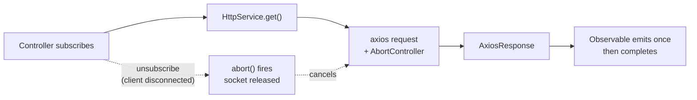

# Chapter 32 — HTTP Client, Cookies, Sessions, and Compression

> **한눈에 보기**
> 이 장은 서버가 "바깥과 주고받는 상태"를 다룹니다. 나가는 방향으로는 `HttpModule`로
> 다른 서비스를 호출하고 — Observable 반환값, 타임아웃, 재시도, `AxiosError` 처리까지 —
> 들어오는 방향으로는 쿠키와 세션으로 요청 사이의 상태를 유지합니다. 마지막으로 응답
> 압축을 다루며, 왜 대부분의 배포에서 압축을 앱이 아니라 리버스 프록시에 맡겨야 하는지
> 설명합니다. 8장의 미들웨어와 17장의 설정이 여기서 실제로 쓰입니다.

**What you will learn**

- Why `HttpService` returns an `Observable<AxiosResponse<T>>` instead of a promise, and the exact difference between `firstValueFrom` and `lastValueFrom` when you convert it.
- How to configure the underlying axios instance three ways — `register()`, `registerAsync()`, and direct mutation through `axiosRef` — and which one survives testing.
- How to build a resilient outbound call with `timeout()`, `retry({ count, delay })`, and `catchError()` that translates an `AxiosError` into a Nest `HttpException` instead of leaking a stack trace.
- How `cookie-parser` and `@fastify/cookie` populate `req.cookies` / `req.signedCookies`, and how to write a cross-platform `@Cookies()` decorator that works on both.
- What each cookie attribute (`HttpOnly`, `Secure`, `SameSite`, `Domain`, `Path`, `Max-Age`) actually defends against, and the exact combination to use for a session cookie.
- How `express-session` stores state, why `MemoryStore` fails in production, and how to wire a Redis store plus session regeneration to close the session-fixation hole.
- When response compression belongs in your Nest process, when it belongs in nginx, and why compressing a response that mixes a secret with attacker-controlled input is a vulnerability (BREACH/CRIME).

**Why this matters**

Three of the four topics in this chapter look trivial in the official docs — one `app.use()` call each — and all three are where real applications leak. A team ships `app.use(session({ secret: 'my-secret', resave: false, saveUninitialized: false }))` copied verbatim from a tutorial, deploys two pods behind a load balancer, and users start getting logged out at random: the default `MemoryStore` keeps sessions in the heap of whichever process happened to serve the login. Another team sets an auth cookie without `HttpOnly` and a single reflected XSS becomes full account takeover. A third enables `compression()` on an endpoint that echoes a query parameter next to a CSRF token, and quietly reintroduces BREACH.

The outbound half has its own failure mode, and it is the one that takes down production most often. `HttpService.get(...)` with no timeout inherits axios's default of *no timeout at all*. When the upstream service starts hanging instead of erroring, your request handlers pile up, the Node event loop stays busy holding sockets, health checks start failing, and the orchestrator restarts a process that was never broken — it was waiting. A four-line RxJS pipe (`timeout`, `retry`, `catchError`) is the difference between a degraded dependency and a cascading outage.

There is also a design question worth settling early: Node 20 ships a perfectly good global `fetch`. `@nestjs/axios` is not free — it is a peer dependency on axios, an RxJS layer over a promise API, and one more thing to mock in tests. This chapter is opinionated about when the wrapper earns its place and when a thin `fetch` helper is the better engineering call.

---

## 1. The HTTP module: what `@nestjs/axios` actually is

`@nestjs/axios` is a thin package. It contains a dynamic module (`HttpModule`), a provider (`HttpService`), and roughly two hundred lines of code. `HttpService` holds a single `AxiosInstance` and wraps each of its methods so the returned promise is converted into an RxJS `Observable`.

```bash
npm i --save @nestjs/axios axios
```

> **Hint** — `axios` is a **peer dependency**. `@nestjs/axios` does not bundle it, so an `npm i @nestjs/axios` alone will fail at runtime with a module-not-found error. Install both.

Import the module where you need it:

```typescript title="cats.module.ts"
import { Module } from '@nestjs/common';
import { HttpModule } from '@nestjs/axios';
import { CatsService } from './cats.service';

@Module({
  imports: [HttpModule],
  providers: [CatsService],
})
export class CatsModule {}
```

`HttpModule` exports `HttpService`, so a plain constructor injection is enough:

```typescript title="cats.service.ts"
import { Injectable } from '@nestjs/common';
import { HttpService } from '@nestjs/axios';
import { AxiosResponse } from 'axios';
import { Observable } from 'rxjs';
import { Cat } from './cat.interface';

@Injectable()
export class CatsService {
  constructor(private readonly httpService: HttpService) {}

  findAll(): Observable<AxiosResponse<Cat[]>> {
    return this.httpService.get<Cat[]>('http://localhost:3000/cats');
  }
}
```

Note the return type carefully: `Observable<AxiosResponse<Cat[]>>`, not `Observable<Cat[]>`. The `AxiosResponse` envelope carries `data`, `status`, `statusText`, `headers`, and `config`. Beginners write `.subscribe(cats => ...)` and are surprised that `cats` is the whole envelope.

### Why an Observable at all?

The answer is not "because RxJS is nicer." It is that a request has a *cancellation* story and a *composition* story, and promises have neither.



When you unsubscribe from an `HttpService` observable, `@nestjs/axios` calls `abort()` on the `AbortController` it attached to the request. The TCP socket is released and the upstream call stops. A promise cannot do that — once created, it runs to completion whether anyone is listening or not. This matters most in two places: a Nest interceptor that applies `timeout()` (Chapter 12), and Server-Sent Events / streaming endpoints where a client disconnect must propagate downstream.

The composition story is that `retry`, `timeout`, `catchError`, `mergeMap`, and `concatMap` are already written, tested, and composable. Rebuilding "retry three times with exponential backoff, but give up after five seconds total" over raw promises is a day of work and a subtle bug.

If you need neither cancellation nor composition, the Observable is pure overhead — see §7.

---

## 2. Configuring the axios instance

Axios accepts a large configuration object. `HttpModule.register()` passes it straight to `axios.create()`.

```typescript title="cats.module.ts"
@Module({
  imports: [
    HttpModule.register({
      timeout: 5000,
      maxRedirects: 5,
      baseURL: 'https://api.upstream.example.com',
      headers: { 'User-Agent': 'orders-service/1.4.0' },
    }),
  ],
  providers: [CatsService],
})
export class CatsModule {}
```

The options most worth setting deliberately:

| Option | Default | Why you should set it |
|---|---|---|
| `timeout` | `0` (no timeout) | The single most important setting. `0` means a hung upstream hangs you forever. |
| `baseURL` | none | Lets services state a path (`/cats`) rather than an environment-dependent absolute URL. |
| `maxRedirects` | `5` | Set `0` for internal service-to-service calls; a redirect there is a misconfiguration, not a feature. |
| `maxContentLength` / `maxBodyLength` | `-1` (unlimited) | An unbounded response from a compromised or buggy upstream is a memory-exhaustion vector. |
| `validateStatus` | `s => s >= 200 && s < 300` | Override to treat `404` as a value rather than an error when the upstream uses it for "not found". |
| `headers` | `{}` | Static headers such as `User-Agent` or an API key that never varies. |
| `proxy` | from env | Explicitly `false` to bypass `HTTP_PROXY` env vars in a corporate network. |
| `httpAgent` / `httpsAgent` | Node default | Set `new https.Agent({ keepAlive: true })` — connection reuse is often the largest single latency win. |
| `paramsSerializer` | axios default | Required when the upstream expects a non-standard array encoding (`?id=1&id=2` vs `?id[]=1`). |

### Async configuration

Hard-coding a timeout is acceptable; hard-coding a `baseURL` is not. Use `registerAsync()` with `ConfigService` from [Chapter 17 — Configuration](17-configuration.md):

```typescript title="cats.module.ts"
import { Module } from '@nestjs/common';
import { HttpModule } from '@nestjs/axios';
import { ConfigModule, ConfigService } from '@nestjs/config';

@Module({
  imports: [
    HttpModule.registerAsync({
      imports: [ConfigModule],
      inject: [ConfigService],
      useFactory: async (config: ConfigService) => ({
        baseURL: config.getOrThrow<string>('CATS_API_URL'),
        timeout: config.get<number>('HTTP_TIMEOUT', 5000),
        maxRedirects: config.get<number>('HTTP_MAX_REDIRECTS', 5),
      }),
    }),
  ],
  providers: [CatsService],
})
export class CatsModule {}
```

`registerAsync()` accepts the same four shapes as every configurable Nest module ([Chapter 37 — Dynamic Modules](../part3-advanced/37-dynamic-modules.md) covers the mechanism):

| Shape | Use when |
|---|---|
| `useFactory` + `inject` | The default. Most readable, easiest to test. |
| `useClass: HttpConfigService` | The options logic is substantial and deserves its own class. Nest **instantiates a private copy** inside `HttpModule`. |
| `useExisting: HttpConfigService` | You already have that provider elsewhere and want to reuse the instance rather than duplicate it. |
| `extraProviders: [...]` | Your factory or config class needs a dependency that is not exported by any imported module. |

The class form must implement `HttpModuleOptionsFactory`:

```typescript title="http-config.service.ts"
import { Injectable } from '@nestjs/common';
import { HttpModuleOptions, HttpModuleOptionsFactory } from '@nestjs/axios';
import { ConfigService } from '@nestjs/config';

@Injectable()
export class HttpConfigService implements HttpModuleOptionsFactory {
  constructor(private readonly config: ConfigService) {}

  createHttpOptions(): HttpModuleOptions {
    return {
      baseURL: this.config.getOrThrow('CATS_API_URL'),
      timeout: 5000,
    };
  }
}
```

> **⚠️ Notice** — `HttpModule` is **not global**. Each module that injects `HttpService` must import `HttpModule` itself, and each import creates its own axios instance with its own configuration. That is usually what you want: the payments client and the search client should not share a timeout. If you genuinely want one shared client, wrap it in your own `@Global()` module that imports `HttpModule` once and re-exports it.

### Per-request configuration

Every `HttpService` method takes an optional `AxiosRequestConfig` as its last argument, merged over the instance config:

```typescript
this.httpService.get<Cat[]>('/cats', {
  timeout: 1500,                                  // tighter than the module default
  headers: { Authorization: `Bearer ${token}` },  // per-caller credential
  params: { limit: 20, breed },                   // serialized into the query string
  signal: AbortSignal.timeout(2000),              // native cancellation, belt and braces
});
```

Use per-request config for anything that varies per call — auth headers, query params, a tighter deadline on a latency-sensitive path. Use module config for anything that does not.

### Reaching the raw axios instance

`HttpService#axiosRef` is the `AxiosInstance` itself. It returns promises, not observables:

```typescript
import { Injectable } from '@nestjs/common';
import { HttpService } from '@nestjs/axios';
import { AxiosResponse } from 'axios';

@Injectable()
export class CatsService {
  constructor(private readonly httpService: HttpService) {}

  findAll(): Promise<AxiosResponse<Cat[]>> {
    return this.httpService.axiosRef.get<Cat[]>('/cats');
  }
}
```

Use `axiosRef` when you need axios features the wrapper does not surface: registering interceptors (§6), `axios.CancelToken`, `getUri()`, or streaming with `responseType: 'stream'`. Do not use it merely to avoid RxJS — if you never want observables, see §7 and consider whether you want this dependency at all.

---

## 3. From Observable to value: `firstValueFrom` and `lastValueFrom`

Most service methods should return a promise or a plain value, not an observable — the caller of `CatsService.findAll()` should not have to know that an HTTP call is involved. RxJS provides two converters:

```typescript
import { firstValueFrom, lastValueFrom } from 'rxjs';
```

| | Emits when | Behaviour on an empty stream |
|---|---|---|
| `firstValueFrom(obs$)` | The **first** value arrives; then unsubscribes immediately | Rejects with `EmptyError` |
| `lastValueFrom(obs$)` | The source **completes**; resolves with the last value seen | Rejects with `EmptyError` |

For `HttpService` the observable emits exactly once and completes, so both behave identically — *until you add operators*. Once you pipe through `retry()` or `expand()` (for pagination), or once a `timeout()` may fire, the distinction matters. **Prefer `firstValueFrom`**: it unsubscribes as soon as it has an answer, which triggers the abort path for anything still in flight. `lastValueFrom` waits for completion and can hold a socket open longer than needed.

Both accept a `defaultValue` to avoid `EmptyError`:

```typescript
const cats = await firstValueFrom(this.httpService.get<Cat[]>('/cats'), {
  defaultValue: { data: [] } as AxiosResponse<Cat[]>,
});
```

### Error handling with `catchError` and `AxiosError`

An `AxiosError` has a shape you must handle defensively. `error.response` is populated when the upstream *answered* with a non-2xx status. It is `undefined` when the request never got an answer — DNS failure, connection refused, TLS error, or a timeout. The official docs' `this.logger.error(error.response.data)` throws `TypeError: Cannot read properties of undefined` in exactly the cases you most need logged.

```typescript title="cats.service.ts"
import {
  HttpException,
  Injectable,
  Logger,
  ServiceUnavailableException,
} from '@nestjs/common';
import { HttpService } from '@nestjs/axios';
import { AxiosError } from 'axios';
import { catchError, firstValueFrom } from 'rxjs';
import { Cat } from './cat.interface';

@Injectable()
export class CatsService {
  private readonly logger = new Logger(CatsService.name);

  constructor(private readonly httpService: HttpService) {}

  async findAll(): Promise<Cat[]> {
    const { data } = await firstValueFrom(
      this.httpService.get<Cat[]>('/cats').pipe(
        catchError((error: AxiosError) => {
          if (error.response) {
            // Upstream answered, but not with 2xx.
            this.logger.error(
              `Cats API responded ${error.response.status}`,
              JSON.stringify(error.response.data),
            );
            throw new HttpException(
              'Upstream cats service rejected the request',
              error.response.status >= 500 ? 502 : 400,
            );
          }
          // No response: network, DNS, TLS, or timeout.
          this.logger.error(`Cats API unreachable: ${error.code} ${error.message}`);
          throw new ServiceUnavailableException('Cats service is unavailable');
        }),
      ),
    );
    return data;
  }
}
```

Two rules are doing real work here:

1. **Never let an `AxiosError` escape your service.** If it reaches Nest's default exception filter ([Chapter 9](../part1-beginner/09-exception-filters.md)), the client gets a `500` with the framework's generic message — and, if you have a filter that serializes `error.message`, possibly your internal hostnames and query strings. Translate at the boundary.
2. **Map upstream 5xx to `502 Bad Gateway`, not `500`.** `500` says *you* are broken. `502`/`503` says a dependency is. That distinction drives on-call routing and is invisible if you collapse everything to `500`.

The `AxiosError` fields worth knowing:

| Field | Meaning |
|---|---|
| `error.response` | The `AxiosResponse` when the server answered; `undefined` otherwise |
| `error.request` | The underlying `ClientRequest` when the request was sent but no response came |
| `error.code` | `'ECONNREFUSED'`, `'ENOTFOUND'`, `'ECONNABORTED'` (axios `timeout` fired), `'ETIMEDOUT'`, `'ERR_CANCELED'` |
| `error.config` | The resolved request config — **contains your headers, including `Authorization`.** Never log it whole. |
| `axios.isAxiosError(e)` | The type guard. Prefer it over `e instanceof AxiosError` across module boundaries. |

---

## 4. Timeouts, retries, and backoff

Axios's own `timeout` option covers the whole request/response cycle and rejects with `code: 'ECONNABORTED'`. RxJS's `timeout()` operator is complementary: it measures wall-clock time across the *entire pipe*, including any retries, and it cancels the subscription (which aborts the socket). Use both — axios's for the individual attempt, RxJS's as an overall deadline.

```typescript title="cats.service.ts"
import { catchError, firstValueFrom, retry, throwError, timeout, timer } from 'rxjs';
import { AxiosError } from 'axios';
import { GatewayTimeoutException, ServiceUnavailableException } from '@nestjs/common';

async findAllResilient(): Promise<Cat[]> {
  const response = await firstValueFrom(
    this.httpService.get<Cat[]>('/cats', { timeout: 1500 }).pipe(
      // Retry only on transient failures, with exponential backoff + jitter.
      retry({
        count: 3,
        delay: (error: AxiosError, retryCount) => {
          if (!this.isTransient(error)) {
            return throwError(() => error); // do not retry 4xx
          }
          const backoff = 200 * 2 ** (retryCount - 1);       // 200, 400, 800 ms
          const jitter = Math.random() * 100;
          this.logger.warn(`Retry ${retryCount} for /cats in ${backoff | 0}ms`);
          return timer(backoff + jitter);
        },
      }),
      // Hard deadline for the whole operation, retries included.
      timeout({ each: 0, first: 5000 }),
      catchError((error) => {
        if (error?.name === 'TimeoutError') {
          throw new GatewayTimeoutException('Cats service timed out');
        }
        throw new ServiceUnavailableException('Cats service is unavailable');
      }),
    ),
  );
  return response.data;
}

private isTransient(error: AxiosError): boolean {
  if (!error.response) return true;                    // network-level failure
  const s = error.response.status;
  return s === 408 || s === 429 || s >= 500;
}
```

Three things people get wrong:

**Retrying non-idempotent requests.** `retry()` will happily re-send a `POST /orders`. If the first attempt actually reached the upstream and only the *response* was lost, you have now created two orders. Retry `GET`/`PUT`/`DELETE` freely; retry `POST` only when the upstream supports an idempotency key and you send one.

**Retrying 4xx.** A `400` will be `400` again. Retrying it wastes your latency budget and the upstream's capacity. The `isTransient` guard above is not optional.

**No jitter.** If a shared dependency blips, every one of your pods retries at exactly 200 ms, then 400 ms, then 800 ms — a synchronized thundering herd that keeps the dependency down. The random component spreads the load.

> **Hint** — Retries are a client-side patch. If a dependency fails often enough that retries matter, you also want a **circuit breaker** so that a sustained outage fails fast instead of burning your entire connection pool on doomed attempts. `opossum` wraps a promise-returning function and drops in cleanly around `firstValueFrom`. Chapter 56 covers the observability side of this.

---

## 5. Interceptors on the axios instance

Nest interceptors ([Chapter 12](../part1-beginner/12-interceptors.md)) run around *inbound* requests. To act on *outbound* ones — attaching a correlation ID, logging every call, refreshing a token on `401` — register axios interceptors on `axiosRef`, once, in `onModuleInit`.

```typescript title="upstream-http.service.ts"
import { Injectable, Logger, OnModuleInit } from '@nestjs/common';
import { HttpService } from '@nestjs/axios';
import { randomUUID } from 'node:crypto';

@Injectable()
export class UpstreamHttpService implements OnModuleInit {
  private readonly logger = new Logger(UpstreamHttpService.name);

  constructor(private readonly httpService: HttpService) {}

  onModuleInit(): void {
    const axios = this.httpService.axiosRef;

    axios.interceptors.request.use((config) => {
      config.headers.set('X-Request-Id', randomUUID());
      (config as any).metadata = { start: Date.now() };
      return config;
    });

    axios.interceptors.response.use(
      (response) => {
        const ms = Date.now() - (response.config as any).metadata.start;
        this.logger.log(`${response.config.method?.toUpperCase()} ${response.config.url} -> ${response.status} (${ms}ms)`);
        return response;
      },
      (error) => {
        const cfg = error.config ?? {};
        const ms = cfg.metadata ? Date.now() - cfg.metadata.start : -1;
        this.logger.warn(`${cfg.method?.toUpperCase()} ${cfg.url} -> ${error.response?.status ?? error.code} (${ms}ms)`);
        return Promise.reject(error);
      },
    );
  }
}
```

Register it in `onModuleInit`, not in the constructor — constructors run during dependency resolution and may run more than you expect in test setups, and a double-registered interceptor logs everything twice. For propagating an inbound request ID into outbound calls automatically, combine this with `AsyncLocalStorage` ([Chapter 43](../part3-advanced/43-async-local-storage.md)).

---

## 6. When to skip `HttpModule` and use `fetch`

Node 20 ships a standards-compliant global `fetch` (undici under the hood). It is fast, has no dependencies, and supports `AbortSignal.timeout()` natively. Here is the honest comparison:

| | `@nestjs/axios` | global `fetch` | `undici` directly |
|---|---|---|---|
| Dependencies | axios + rxjs peer deps | none | one |
| Cancellation | via unsubscribe → abort | `AbortSignal` | `AbortSignal` |
| JSON parsing | automatic | manual `await res.json()` | manual |
| Non-2xx | throws | **resolves** — you must check `res.ok` | resolves |
| Interceptors | yes | no (wrap it yourself) | no |
| Retry/backoff | RxJS operators | hand-written | hand-written |
| Connection pooling | Node agent (opt in `keepAlive`) | undici pool by default | tunable pool |
| Mocking in tests | `HttpService` is injectable → trivial | `nock`/`msw`/`undici` MockAgent | MockAgent |
| Raw throughput | good | better | best |

**Use `HttpModule` when** you make many outbound calls with shared configuration, you want them injectable and mockable through Nest's DI container, or you need retry/timeout composition and interceptors. That covers most service-to-service code in a Nest application.

**Use `fetch` when** you make one or two calls, from one place, with no shared config — a webhook, a health probe, an OAuth token exchange at startup. Wrap it in an injectable service so it stays mockable:

```typescript title="token.service.ts"
import { Injectable, ServiceUnavailableException } from '@nestjs/common';

@Injectable()
export class TokenService {
  async exchange(code: string): Promise<{ access_token: string }> {
    const res = await fetch('https://auth.example.com/oauth/token', {
      method: 'POST',
      headers: { 'Content-Type': 'application/json' },
      body: JSON.stringify({ code, grant_type: 'authorization_code' }),
      signal: AbortSignal.timeout(3000), // fetch does NOT time out by default either
    });
    if (!res.ok) {
      throw new ServiceUnavailableException(`Token endpoint returned ${res.status}`);
    }
    return res.json();
  }
}
```

The trap that catches everyone migrating from axios: **`fetch` does not reject on `404` or `500`.** It rejects only on network failure. Forgetting `if (!res.ok)` means an error page gets parsed as JSON and fails somewhere far from the cause.

---

## 7. Cookies

A cookie is a name/value pair the server asks the browser to store and resend. Nest does not parse cookies for you — neither Express nor Fastify does out of the box — so you add a parser.

### Express

```bash
npm i cookie-parser
npm i -D @types/cookie-parser
```

```typescript title="main.ts"
import { NestFactory } from '@nestjs/core';
import cookieParser from 'cookie-parser';
import { AppModule } from './app.module';

async function bootstrap() {
  const app = await NestFactory.create(AppModule);
  app.use(cookieParser(process.env.COOKIE_SECRET));
  await app.listen(process.env.PORT ?? 3000);
}
bootstrap();
```

`cookieParser(secret?, options?)` takes:

- **`secret`** — a string, or an array of strings, used to sign cookies. Omit it and signed cookies are not parsed at all. With an array, the **first** element signs and **all** elements are tried when verifying — that is how you rotate a secret without logging everyone out.
- **`options`** — passed through to `cookie.parse`; mainly `decode` for a custom value decoder.

The middleware reads the `Cookie` header and populates two objects: `req.cookies` for unsigned cookies, and `req.signedCookies` for cookies whose value starts with `s:` and whose signature verifies. A signed cookie that **fails** verification appears in `req.cookies` with the value `false`, not with the tampered value — so `if (req.signedCookies.sid)` is a real integrity check.

Reading and writing in a handler:

```typescript title="cats.controller.ts"
import { Controller, Get, Post, Req, Res } from '@nestjs/common';
import { Request, Response } from 'express';

@Controller('cats')
export class CatsController {
  @Get()
  findAll(@Req() request: Request) {
    console.log(request.cookies);        // { theme: 'dark' }
    console.log(request.signedCookies);  // { sid: 'abc123' } — verified
  }

  @Post('theme')
  setTheme(@Res({ passthrough: true }) response: Response) {
    response.cookie('theme', 'dark', {
      httpOnly: false,   // this one is read by client JS on purpose
      sameSite: 'lax',
      secure: true,
      maxAge: 1000 * 60 * 60 * 24 * 365,
      path: '/',
    });
    return { ok: true };  // still returned by Nest, because passthrough: true
  }
}
```

> **⚠️ Notice** — `@Res({ passthrough: true })` is essential. Without `passthrough`, Nest hands the response object to you and **stops managing the response entirely**: your `return { ok: true }` is ignored, interceptors that transform the body do nothing, and the request hangs until you call `res.send()` yourself. See [Chapter 4 — Controllers II](../part1-beginner/04-controllers-responses.md).

### Fastify

```bash
npm i @fastify/cookie
```

```typescript title="main.ts"
import { NestFactory } from '@nestjs/core';
import { FastifyAdapter, NestFastifyApplication } from '@nestjs/platform-fastify';
import fastifyCookie from '@fastify/cookie';
import { AppModule } from './app.module';

async function bootstrap() {
  const app = await NestFactory.create<NestFastifyApplication>(
    AppModule,
    new FastifyAdapter(),
  );
  await app.register(fastifyCookie, { secret: process.env.COOKIE_SECRET });
  await app.listen(process.env.PORT ?? 3000, '0.0.0.0');
}
bootstrap();
```

The API differs in two ways: the setter is `setCookie` rather than `cookie`, and signed cookies are **not** split into a separate object — you call `request.unsignCookie(value)` explicitly.

```typescript
import { FastifyReply, FastifyRequest } from 'fastify';

@Get()
findAll(@Req() request: FastifyRequest) {
  console.log(request.cookies);
  const result = request.unsignCookie(request.cookies.sid ?? '');
  // { valid: boolean, renew: boolean, value: string | null }
}

@Post('theme')
setTheme(@Res({ passthrough: true }) response: FastifyReply) {
  response.setCookie('theme', 'dark', { path: '/', sameSite: 'lax', secure: true });
  return { ok: true };
}
```

### A cross-platform `@Cookies()` decorator

Both adapters expose `request.cookies`, so one custom decorator ([Chapter 13](../part1-beginner/13-custom-decorators-and-lifecycle.md)) covers both:

```typescript title="cookies.decorator.ts"
import { createParamDecorator, ExecutionContext } from '@nestjs/common';

export const Cookies = createParamDecorator(
  (data: string | undefined, ctx: ExecutionContext) => {
    const request = ctx.switchToHttp().getRequest();
    return data ? request.cookies?.[data] : request.cookies;
  },
);

export const SignedCookies = createParamDecorator(
  (data: string | undefined, ctx: ExecutionContext) => {
    const request = ctx.switchToHttp().getRequest();
    const source = request.signedCookies ?? request.cookies; // Express | Fastify
    return data ? source?.[data] : source;
  },
);
```

```typescript
@Get()
findAll(@Cookies('theme') theme: string, @Cookies() all: Record<string, string>) {}
```

The decorator does more than save keystrokes: it keeps `express`/`fastify` types out of your controller signatures, which is what makes the same controller runnable on either adapter.

### Cookie attributes: what each one actually defends against

| Attribute | Value to use for an auth cookie | What it prevents |
|---|---|---|
| `HttpOnly` | `true` | JavaScript (`document.cookie`) cannot read it. The single most effective mitigation for session theft via XSS. Non-negotiable for auth cookies. |
| `Secure` | `true` | The browser refuses to send it over plain HTTP, blocking passive network capture. Requires HTTPS — behind a proxy you must also `app.set('trust proxy', 1)`. |
| `SameSite` | `'lax'` (or `'strict'`) | The browser withholds the cookie on cross-site requests, which is the structural defence against CSRF. `'lax'` still sends it on top-level GET navigations, so a user following a link stays logged in. `'none'` requires `Secure` and reopens CSRF — use only for a deliberate cross-origin API. |
| `Domain` | **omit** | Omitting it scopes the cookie to the exact host. Setting `.example.com` shares it with *every* subdomain, including a compromised marketing site on `blog.example.com`. Set it only when you truly need cross-subdomain SSO. |
| `Path` | `'/'` | Scoping narrowly (`/admin`) is weak defence — path is not a security boundary, since any page on the origin can script a request to that path. Keep it `'/'` and rely on the other attributes. |
| `Max-Age` / `Expires` | a bounded value | Without either, the cookie is a *session cookie* that dies when the browser closes — except browsers that restore tabs keep it alive indefinitely. Set an explicit maximum lifetime. |
| `Partitioned` | for third-party contexts | CHIPS: partitions the cookie per top-level site so it cannot be used for cross-site tracking. Required by newer browsers for embedded third-party cookies. |
| `__Host-` name prefix | for the strictest cookies | A cookie named `__Host-sid` is only accepted with `Secure`, `Path=/`, and **no** `Domain` — the browser enforces the safe configuration for you, including against a subdomain that tries to overwrite it. |

The recommended shape for a session cookie:

```typescript
response.cookie('__Host-sid', sessionId, {
  httpOnly: true,
  secure: true,
  sameSite: 'lax',
  path: '/',
  maxAge: 1000 * 60 * 60 * 8,  // 8 hours
  signed: true,
});
```

> **Hint** — Cookies are limited to roughly 4 KB each and about 50 per domain, and every one is sent on *every* matching request. A 3 KB cookie adds 3 KB to each image request too. Store an identifier, never state.

---

## 8. Sessions

A session moves the state to the server and leaves the client holding only an opaque ID.

```mermaid
sequenceDiagram
  participant B as Browser
  participant N as Nest app
  participant S as Session store (Redis)
  B->>N: POST /login (credentials)
  N->>S: SET sess:9f3a {userId, roles} EX 28800
  N-->>B: Set-Cookie: connect.sid=s:9f3a...; HttpOnly; Secure
  B->>N: GET /orders (Cookie: connect.sid=s:9f3a...)
  N->>S: GET sess:9f3a
  S-->>N: {userId, roles}
  N-->>B: 200 orders for that user
  B->>N: POST /logout
  N->>S: DEL sess:9f3a
  N-->>B: Set-Cookie: connect.sid=; Max-Age=0
```

### Express: `express-session`

```bash
npm i express-session
npm i -D @types/express-session
```

```typescript title="main.ts"
import session from 'express-session';

app.set('trust proxy', 1);  // required behind a load balancer for secure cookies
app.use(
  session({
    name: '__Host-sid',
    secret: process.env.SESSION_SECRET!,
    resave: false,
    saveUninitialized: false,
    rolling: true,
    cookie: {
      httpOnly: true,
      secure: true,
      sameSite: 'lax',
      path: '/',
      maxAge: 1000 * 60 * 60 * 8,
    },
  }),
);
```

The options that matter:

| Option | Recommended | Why |
|---|---|---|
| `secret` | a long random string from config | Signs the session-ID cookie so a client cannot forge one. An **array** rotates secrets: the first element signs, all are accepted when verifying. |
| `resave` | `false` | `true` writes the session back to the store on every request even when untouched — pointless load and a race when parallel requests both save. The `true` default is deprecated. |
| `saveUninitialized` | `false` | `true` creates a store entry for every visitor including bots, which is both a storage leak and a consent-law problem (you set a cookie before the user did anything). `false` also avoids races where parallel requests from a sessionless client each mint a session. |
| `rolling` | `true` for idle-timeout semantics | Resets `maxAge` on every response, so an active user is not logged out mid-work. Combine with an absolute cap enforced in your own code. |
| `name` | anything but the default | The default `connect.sid` advertises your stack. Cosmetic, but free. |
| `cookie` | see §7 table | These are the attributes from the previous section. |
| `store` | a real store | See below. |
| `genid` | default (uid-safe) | Override only if you must; do **not** substitute a predictable ID. |
| `unset` | `'destroy'` | Deleting `req.session` actually removes it from the store. |

> **⚠️ Notice** — `secure: true` requires HTTPS. If Node sits behind nginx or an ALB terminating TLS, Express sees an HTTP connection and refuses to set the cookie until you call `app.set('trust proxy', 1)`. This is the most common "sessions work locally but not in production" bug.

Reading and writing the session:

```typescript title="visits.controller.ts"
import { Controller, Get, Req, Session } from '@nestjs/common';
import { Request } from 'express';

@Controller()
export class VisitsController {
  @Get('a')
  viaRequest(@Req() request: Request) {
    request.session.visits = (request.session.visits ?? 0) + 1;
    return { visits: request.session.visits };
  }

  @Get('b')
  viaDecorator(@Session() session: Record<string, any>) {
    session.visits = (session.visits ?? 0) + 1;
    return { visits: session.visits };
  }
}
```

`@Session()` is a built-in decorator from `@nestjs/common` that returns `req.session`. Type it properly by augmenting the module:

```typescript title="types/express-session.d.ts"
import 'express-session';

declare module 'express-session' {
  interface SessionData {
    userId?: string;
    roles?: string[];
    visits?: number;
  }
}
```

### Why `MemoryStore` is not for production

`express-session` warns at startup if you do not supply a `store`, and the warning is accurate: the default `MemoryStore` keeps every session in a plain object in the process heap. That means it **leaks** (expired sessions are never reclaimed), it **dies on restart** (every deploy logs out every user), and it **does not scale past one process** — with two pods behind a round-robin load balancer, a user logs in on pod A and is anonymous on pod B, so they appear to be randomly logged out.

A Redis-backed store fixes all three:

```bash
npm i connect-redis redis
```

```typescript title="main.ts"
import { NestFactory } from '@nestjs/core';
import session from 'express-session';
import { RedisStore } from 'connect-redis';
import { createClient } from 'redis';
import { AppModule } from './app.module';

async function bootstrap() {
  const app = await NestFactory.create(AppModule);

  const redisClient = createClient({ url: process.env.REDIS_URL });
  redisClient.on('error', (err) => console.error('Redis session store', err));
  await redisClient.connect();

  const store = new RedisStore({
    client: redisClient,
    prefix: 'sess:',
    ttl: 60 * 60 * 8,        // seconds — Redis expires the key itself
    disableTouch: false,     // let `rolling` extend the TTL
  });

  app.set('trust proxy', 1);
  app.use(
    session({
      store,
      name: '__Host-sid',
      secret: process.env.SESSION_SECRET!,
      resave: false,
      saveUninitialized: false,
      rolling: true,
      cookie: {
        httpOnly: true,
        secure: true,
        sameSite: 'lax',
        path: '/',
        maxAge: 1000 * 60 * 60 * 8,
      },
    }),
  );

  await app.listen(process.env.PORT ?? 3000);
}
bootstrap();
```

Redis is the usual choice because expiry is native (`EX`), lookups are O(1), and it is already in most stacks for caching ([Chapter 27](27-caching.md)). Alternatives: `connect-pg-simple` if you refuse to add Redis, or `connect-mongo`. Do **not** use a JSON file store or your primary transactional table — session reads happen on *every* request and will dominate your database load.

### Session fixation and regeneration

Session fixation works like this: an attacker obtains a valid session ID (by visiting your site, or by planting one through a subdomain), tricks the victim into using that same ID, then waits for the victim to log in. If your login handler writes `session.userId` into the *existing* session, the attacker's pre-known ID is now an authenticated session.

The fix is one line, and it is the reason `session.regenerate()` exists:

```typescript title="auth.controller.ts"
import { BadRequestException, Body, Controller, Post, Req } from '@nestjs/common';
import { Request } from 'express';

@Controller('auth')
export class AuthController {
  constructor(private readonly authService: AuthService) {}

  @Post('login')
  async login(@Req() req: Request, @Body() dto: LoginDto) {
    const user = await this.authService.validate(dto.email, dto.password);
    if (!user) throw new BadRequestException('Invalid credentials');

    // Destroy the old session ID and mint a new one BEFORE storing identity.
    await new Promise<void>((resolve, reject) =>
      req.session.regenerate((err) => (err ? reject(err) : resolve())),
    );

    req.session.userId = user.id;
    req.session.roles = user.roles;

    // Persist before responding, so a redirect cannot race the store write.
    await new Promise<void>((resolve, reject) =>
      req.session.save((err) => (err ? reject(err) : resolve())),
    );

    return { id: user.id, email: user.email };
  }

  @Post('logout')
  async logout(@Req() req: Request) {
    await new Promise<void>((resolve, reject) =>
      req.session.destroy((err) => (err ? reject(err) : resolve())),
    );
    return { ok: true };
  }
}
```

Regenerate on **every privilege change**, not only login: password change, MFA completion, and role elevation all deserve a fresh ID. And always `destroy()` on logout — clearing the cookie alone leaves a live server-side session that anyone holding the old ID can keep using.

### Fastify: `@fastify/secure-session`

Fastify's canonical session plugin takes a different approach: rather than storing state server-side and handing out an ID, it **encrypts the session data into the cookie itself** using libsodium.

```bash
npm i @fastify/secure-session
```

```typescript title="main.ts"
import secureSession from '@fastify/secure-session';

const app = await NestFactory.create<NestFastifyApplication>(
  AppModule,
  new FastifyAdapter(),
);
await app.register(secureSession, {
  secret: process.env.SESSION_SECRET!, // must be > 32 characters
  salt: process.env.SESSION_SALT!,     // exactly 16 characters
  cookieName: '__Host-session',
  cookie: { path: '/', httpOnly: true, secure: true, sameSite: 'lax' },
});
```

> **Hint** — Deriving a key from `secret` + `salt` on every boot is slow. In production, pregenerate a key file (`npx @fastify/secure-session > secret-key`) and pass `key: readFileSync('secret-key')`. The plugin also supports **key rotation**: pass an array of keys and the first is used for signing while all are accepted for verification.

The session API is get/set rather than property access:

```typescript
import * as secureSession from '@fastify/secure-session';

@Get()
findAll(@Session() session: secureSession.Session) {
  const visits = session.get('visits');
  session.set('visits', visits ? visits + 1 : 1);
  return { visits: session.get('visits') };
}
```

Because the data lives in the cookie, there is no store to scale — but also **no server-side revocation** and a hard ~4 KB budget. If you need "log out all devices", pair it with a server-side token version you check per request, or use a store-backed session instead.

### Sessions vs JWT

Chapters [23](23-authentication.md) and [24](24-passport-strategies.md) build JWT authentication. Here is when to choose which:

| | Server-side session | JWT (bearer token) |
|---|---|---|
| State | In a store; cookie holds an opaque ID | In the token; server holds nothing |
| Revocation | Immediate — `DEL sess:...` | Not possible without a denylist, which reintroduces the store |
| Per-request cost | One store lookup (~0.3 ms to local Redis) | Signature verification (~0.05 ms), no I/O |
| Horizontal scale | Needs a shared store | Stateless — any pod can verify |
| Payload size on the wire | ~40 bytes | 300–1500 bytes on **every** request |
| CSRF | Cookie is sent automatically → **CSRF applies**; needs `SameSite` + tokens | Immune *if* stored outside cookies — but then vulnerable to XSS exfiltration |
| XSS exposure | `HttpOnly` cookie is unreadable by JS | `localStorage` token is readable by any injected script |
| Changing a user's roles | Effective on the next request | Effective only after the token expires |
| Best fit | Server-rendered apps, first-party SPAs on the same origin, anything needing instant logout | Mobile clients, third-party API consumers, service-to-service |

The author's recommendation: **for a browser client on your own origin, a session cookie is the safer default.** The `HttpOnly` + `Secure` + `SameSite=Lax` combination removes the XSS-exfiltration class of attack entirely, and instant revocation is worth a Redis lookup. Reach for JWTs when the client is not a browser, or when a shared session store is genuinely impractical. The hybrid many teams land on — a short-lived JWT in memory plus a refresh token in an `HttpOnly` cookie — is really a session with extra steps; be honest about that before adopting it.

---

## 9. Compression

`compression` for Express and `@fastify/compress` for Fastify gzip (or Brotli) response bodies.

```bash
npm i --save compression
npm i -D @types/compression
```

```typescript title="main.ts"
import compression from 'compression';

app.use(
  compression({
    threshold: 1024,                  // bytes; skip small bodies
    level: 6,                          // zlib level 1 (fast) .. 9 (small)
    filter: (req, res) => {
      if (req.headers['x-no-compression']) return false;
      return compression.filter(req, res); // respects Content-Type
    },
  }),
);
```

| Option | Default | Notes |
|---|---|---|
| `threshold` | `1024` | Below this size, compression costs more CPU and header bytes than it saves. |
| `level` | `-1` (zlib default, ≈6) | 9 buys a few percent for a lot of CPU. Leave it at the default. |
| `filter` | `compression.filter` | Skips already-compressed types (images, video, zip). Extend, never replace, or you will re-compress JPEGs. |
| `chunkSize`, `memLevel`, `windowBits` | zlib defaults | Tuning knobs you almost certainly do not need. |
| `strategy` | `Z_DEFAULT_STRATEGY` | Only relevant for unusual payload shapes. |

Fastify:

```bash
npm i --save @fastify/compress
```

```typescript title="main.ts"
import { FastifyAdapter, NestFastifyApplication } from '@nestjs/platform-fastify';
import compression from '@fastify/compress';
import { constants } from 'node:zlib';

const app = await NestFactory.create<NestFastifyApplication>(
  AppModule,
  new FastifyAdapter(),
);
await app.register(compression, {
  encodings: ['gzip', 'deflate'],   // skip Brotli entirely for speed
  threshold: 1024,
});
```

> **⚠️ Notice** — You must type the app as `NestFastifyApplication`, otherwise `app.register` does not exist on the type.

`@fastify/compress` defaults to **Brotli** when the client advertises it. Brotli compresses better than gzip but its default quality level is 11, which is extremely slow for dynamically generated responses — it was designed for static assets compressed once at build time. Either lower the quality or drop Brotli:

```typescript
await app.register(compression, {
  brotliOptions: { params: { [constants.BROTLI_PARAM_QUALITY]: 4 } },
});
```

### Where compression really belongs

For any deployment with a reverse proxy — nginx, Envoy, an ALB, Cloudflare — **compress there, not in Node.** Three reasons:

1. **CPU.** gzip is CPU-bound and Node is single-threaded per process. Every millisecond spent compressing is a millisecond the event loop is not accepting connections. nginx does it in a worker pool built for exactly this.
2. **Static assets.** A proxy can serve pre-compressed `.gz`/`.br` files from disk with zero per-request compression cost. Node compresses them again on every hit.
3. **Correctness.** The proxy is the last thing before the network, so it sees the final bytes and gets `Content-Length`, `ETag`, and `Vary: Accept-Encoding` right.

Enable in-process compression when there is no proxy in front of you (a container serving traffic directly, a small internal service) or when the proxy is out of your control.

### The BREACH/CRIME caveat

Compression is not free of security consequences. Compression ratio leaks information about content, because a repeated string compresses better than a novel one. **BREACH** exploits this: if a response body contains both a secret (a CSRF token, an API key, part of a session ID) and attacker-controlled input reflected back, the attacker can guess the secret one character at a time by watching the compressed response size. Each correct guess makes the reflection match the secret and the response shrinks measurably.

Practical rules:

- **Do not compress responses that contain a secret alongside reflected user input.** In practice: exclude any endpoint that echoes a query parameter or form field into a page that also carries a CSRF token.
- **Do not put secrets in response bodies at all** where you can avoid it. Cookies are not compressed; headers are not compressed by `compression`.
- Use a per-request CSRF token masked with a random value, so its byte representation differs on every response and compression ratio reveals nothing. (Chapter 26 covers CSRF token design.)
- Selectively disable via the `filter` option:

```typescript
app.use(
  compression({
    filter: (req, res) => {
      if (req.path.startsWith('/search')) return false; // reflects user input
      return compression.filter(req, res);
    },
  }),
);
```

CRIME was the same attack against TLS-level compression; TLS compression is disabled everywhere now, so BREACH (HTTP-level) is the live concern. The risk is real but narrow: a pure JSON API that never reflects input and puts its CSRF token in a header is not exposed.

---

## Common mistakes

1. **`HttpService` call with no timeout.** *Symptom:* under a partial upstream outage, request latency climbs to minutes and the pod is killed by a liveness probe. *Cause:* axios defaults `timeout` to `0`, meaning wait forever. *Fix:* set `timeout` in `HttpModule.register()` and add an RxJS `timeout()` around any pipe that retries.

2. **`error.response.data` in a `catchError`.** *Symptom:* `TypeError: Cannot read properties of undefined (reading 'data')` in the error path, masking the actual failure. *Cause:* `error.response` is `undefined` for network errors and timeouts. *Fix:* branch on `if (error.response)` and handle the no-response case separately, as in §3.

3. **Retrying a `POST`.** *Symptom:* duplicate orders / duplicate charges after a transient network blip. *Cause:* a blanket `retry({ count: 3 })` re-sends non-idempotent requests whose first attempt actually succeeded. *Fix:* retry only idempotent methods, or send an `Idempotency-Key` header the upstream honours.

4. **`@Res()` without `passthrough: true` to set a cookie.** *Symptom:* the route hangs, or returns an empty body, and interceptors stop firing. *Cause:* the plain `@Res()` decorator hands response control entirely to you. *Fix:* `@Res({ passthrough: true })`, and let Nest send the body.

5. **Auth cookie without `HttpOnly`.** *Symptom:* one XSS becomes total account takeover across all affected users. *Cause:* the cookie is readable by `document.cookie`. *Fix:* `httpOnly: true, secure: true, sameSite: 'lax'`, and consider the `__Host-` name prefix.

6. **Sessions in the default `MemoryStore` behind more than one replica.** *Symptom:* users are logged out at random; the rate matches your replica count. *Cause:* each process has its own in-heap session map. *Fix:* a shared store — Redis via `connect-redis`. The startup warning from `express-session` is telling you this.

7. **`secure: true` behind a TLS-terminating proxy without `trust proxy`.** *Symptom:* login "works" but the session cookie never appears in the browser; everything is fine locally. *Cause:* Express sees `req.protocol === 'http'` and refuses to send a `Secure` cookie. *Fix:* `app.set('trust proxy', 1)` (Fastify: `new FastifyAdapter({ trustProxy: true })`).

8. **Not calling `session.regenerate()` on login.** *Symptom:* a session-fixation finding in a penetration test. *Cause:* the pre-login session ID is reused after authentication. *Fix:* regenerate before writing identity into the session, and `destroy()` on logout.

9. **Enabling `compression()` in a container that already sits behind nginx.** *Symptom:* elevated CPU with no bandwidth benefit; occasionally a doubly-encoded response. *Cause:* both layers compress. *Fix:* pick one — normally the proxy.

10. **Assuming `fetch` rejects on `404`.** *Symptom:* `SyntaxError: Unexpected token '<'` from `res.json()` far away from the real problem. *Cause:* `fetch` resolves for any HTTP status. *Fix:* check `res.ok` before parsing.

---

## Putting it together

A small `PartnersModule` that uses all four topics: it calls an upstream partner API with resilience, keeps a server-side session for the logged-in operator, sets a hardened cookie, and skips compression on the reflective endpoint.

```typescript title="partners/partners.module.ts"
import { Module } from '@nestjs/common';
import { HttpModule } from '@nestjs/axios';
import { ConfigModule, ConfigService } from '@nestjs/config';
import { PartnersController } from './partners.controller';
import { PartnersService } from './partners.service';

@Module({
  imports: [
    HttpModule.registerAsync({
      imports: [ConfigModule],
      inject: [ConfigService],
      useFactory: (config: ConfigService) => ({
        baseURL: config.getOrThrow<string>('PARTNER_API_URL'),
        timeout: config.get<number>('PARTNER_TIMEOUT_MS', 2000),
        maxRedirects: 0,
        maxContentLength: 5 * 1024 * 1024,
        headers: { 'User-Agent': 'orders-service/1.4.0' },
      }),
    }),
  ],
  controllers: [PartnersController],
  providers: [PartnersService],
})
export class PartnersModule {}
```

```typescript title="partners/partners.service.ts"
import {
  BadGatewayException,
  GatewayTimeoutException,
  Injectable,
  Logger,
} from '@nestjs/common';
import { HttpService } from '@nestjs/axios';
import { AxiosError } from 'axios';
import { catchError, firstValueFrom, retry, throwError, timeout, timer } from 'rxjs';

export interface Partner { id: string; name: string; tier: 'gold' | 'silver'; }

@Injectable()
export class PartnersService {
  private readonly logger = new Logger(PartnersService.name);

  constructor(private readonly http: HttpService) {}

  async findAll(): Promise<Partner[]> {
    const { data } = await firstValueFrom(
      this.http.get<Partner[]>('/partners').pipe(
        retry({
          count: 2,
          delay: (error: AxiosError, attempt) => {
            const status = error.response?.status;
            const transient = !status || status === 429 || status >= 500;
            if (!transient) return throwError(() => error);
            return timer(200 * 2 ** (attempt - 1) + Math.random() * 100);
          },
        }),
        timeout({ first: 5000 }),
        catchError((error) => {
          if (error?.name === 'TimeoutError') {
            throw new GatewayTimeoutException('Partner API timed out');
          }
          const status = (error as AxiosError).response?.status;
          this.logger.error(`Partner API failed: ${status ?? (error as AxiosError).code}`);
          throw new BadGatewayException('Partner API unavailable');
        }),
      ),
    );
    return data;
  }
}
```

```typescript title="partners/partners.controller.ts"
import { Controller, Get, Post, Query, Req, Res, Session, UnauthorizedException } from '@nestjs/common';
import { Response, Request } from 'express';
import { Cookies } from '../common/cookies.decorator';
import { PartnersService, Partner } from './partners.service';

@Controller('partners')
export class PartnersController {
  constructor(private readonly partners: PartnersService) {}

  @Get()
  async list(@Session() session: Record<string, any>): Promise<Partner[]> {
    if (!session.userId) throw new UnauthorizedException();
    session.lastPartnerView = new Date().toISOString();
    return this.partners.findAll();
  }

  // Reflects user input -> compression is disabled for this path in main.ts.
  @Get('search')
  async search(@Query('q') q: string, @Session() session: Record<string, any>) {
    if (!session.userId) throw new UnauthorizedException();
    const all = await this.partners.findAll();
    return { query: q, results: all.filter((p) => p.name.includes(q)) };
  }

  @Post('preferences')
  savePrefs(
    @Cookies('partner-view') current: string | undefined,
    @Res({ passthrough: true }) res: Response,
  ) {
    const next = current === 'compact' ? 'detailed' : 'compact';
    res.cookie('partner-view', next, {
      httpOnly: false,      // read by the client to pick a layout
      secure: true,
      sameSite: 'lax',
      path: '/',
      maxAge: 1000 * 60 * 60 * 24 * 90,
    });
    return { view: next };
  }
}
```

```typescript title="main.ts"
import { NestFactory } from '@nestjs/core';
import { NestExpressApplication } from '@nestjs/platform-express';
import session from 'express-session';
import { RedisStore } from 'connect-redis';
import { createClient } from 'redis';
import cookieParser from 'cookie-parser';
import compression from 'compression';
import { AppModule } from './app.module';

async function bootstrap() {
  const app = await NestFactory.create<NestExpressApplication>(AppModule);
  app.set('trust proxy', 1);

  const redis = createClient({ url: process.env.REDIS_URL });
  await redis.connect();

  app.use(cookieParser(process.env.COOKIE_SECRET));
  app.use(
    session({
      store: new RedisStore({ client: redis, prefix: 'sess:', ttl: 28800 }),
      name: '__Host-sid',
      secret: process.env.SESSION_SECRET!,
      resave: false,
      saveUninitialized: false,
      rolling: true,
      cookie: { httpOnly: true, secure: true, sameSite: 'lax', path: '/', maxAge: 28_800_000 },
    }),
  );
  app.use(
    compression({
      threshold: 1024,
      filter: (req, res) =>
        req.path.startsWith('/partners/search') ? false : compression.filter(req, res),
    }),
  );

  await app.listen(process.env.PORT ?? 3000);
}
bootstrap();
```

Every decision in that file is deliberate: `trust proxy` so `secure` cookies work behind the load balancer, a Redis store so sessions survive a deploy and span replicas, `saveUninitialized: false` so a bot crawl does not fill Redis, and a compression filter that excludes the one endpoint reflecting user input next to a session-bound response.

---

> **핵심 정리**
> - `HttpService`는 `Observable<AxiosResponse<T>>`를 반환합니다. `data`가 아니라 응답 봉투 전체이며, `firstValueFrom`으로 변환할 때 구독 해제가 곧 요청 취소(abort)로 이어집니다.
> - axios의 기본 `timeout`은 `0`(무한)입니다. 명시적으로 설정하지 않으면 상류 서비스가 멈출 때 애플리케이션도 함께 멈춥니다.
> - `AxiosError.response`는 서버가 응답했을 때만 존재합니다. 네트워크·DNS·타임아웃 오류에서는 `undefined`이므로 반드시 분기 처리하고, 상류 5xx는 `500`이 아니라 `502`로 번역하세요.
> - 재시도는 멱등 요청에만, 4xx에는 하지 말고, 항상 지터(jitter)를 넣어 동시 재시도 폭주를 피하세요.
> - `@Res()`로 쿠키를 설정할 때는 반드시 `passthrough: true`를 주어야 Nest가 응답 처리를 계속합니다.
> - 인증 쿠키는 `HttpOnly` + `Secure` + `SameSite=Lax` + `__Host-` 접두사 조합이 기본값입니다. `Domain`은 꼭 필요할 때만 설정합니다.
> - `express-session`의 기본 `MemoryStore`는 메모리 누수·재시작 시 소실·다중 프로세스 불가 세 가지 이유로 프로덕션에서 사용할 수 없습니다. Redis 스토어를 쓰세요.
> - 로그인 시 `session.regenerate()`를 호출해 세션 고정(fixation) 공격을 차단하고, 로그아웃 시 `destroy()`로 서버 측 세션까지 제거하세요.
> - TLS를 종료하는 프록시 뒤에서는 `app.set('trust proxy', 1)`이 없으면 `secure` 쿠키가 절대 설정되지 않습니다.
> - 압축은 대부분의 배포에서 리버스 프록시의 일이며, 비밀값과 사용자 입력이 함께 담긴 응답은 BREACH 때문에 압축하지 않아야 합니다.

> **연습 문제**
> 1. `HttpModule.register({ timeout: 5000 })`로 설정한 클라이언트에서 상류가 10초 동안 응답하지 않으면 어떤 `AxiosError.code`가 발생합니까? 여기에 `retry({ count: 3 })`를 추가하면 최악의 경우 총 대기 시간은 얼마가 됩니까? 이 문제를 RxJS `timeout()`으로 어떻게 막습니까?
> 2. `firstValueFrom`과 `lastValueFrom`의 차이가 `HttpService` 호출에서 드러나지 **않는** 이유를 설명하고, 파이프에 어떤 연산자를 추가하면 차이가 나타나는지 예를 드세요.
> 3. 어떤 팀이 `SameSite=None; Secure`로 세션 쿠키를 설정했습니다. 어떤 공격 표면이 다시 열리며, 그 팀이 그럼에도 이 설정을 필요로 할 수 있는 정당한 이유는 무엇입니까?
> 4. **직접 만들어 보기** — `@SessionUser()` 파라미터 데코레이터를 작성하세요. 세션에 `userId`가 있으면 사용자 객체를, 없으면 `undefined`를 반환해야 하며, Express와 Fastify(`@fastify/secure-session`) 양쪽에서 동작해야 합니다.
> 5. **직접 만들어 보기** — 외부 API를 호출하는 서비스를 작성하되, 상류 5xx와 429에만 지수 백오프 + 지터로 최대 3회 재시도하고, 4xx는 즉시 실패하며, 전체 5초 데드라인을 지키고, 실패 시 `502`/`504`를 구분해 던지도록 만드세요. `HttpService`를 목(mock)으로 대체하는 유닛 테스트도 함께 작성하세요.
> 6. `express-session`을 Redis 스토어로 구성한 뒤, 두 개의 프로세스를 띄우고 로드 밸런서 없이 번갈아 요청해 세션이 공유되는지 확인하세요. 그런 다음 `store` 옵션을 제거하고 같은 실험을 반복해 무엇이 달라지는지 기록하세요.

**Next:** [Chapter 33 — Server-Side Rendering (MVC) and API Versioning](33-mvc-and-versioning.md) turns from state to presentation and contracts: rendering HTML from Nest with a template engine, and running two incompatible versions of the same route side by side without forking your application.
