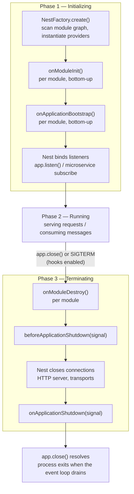
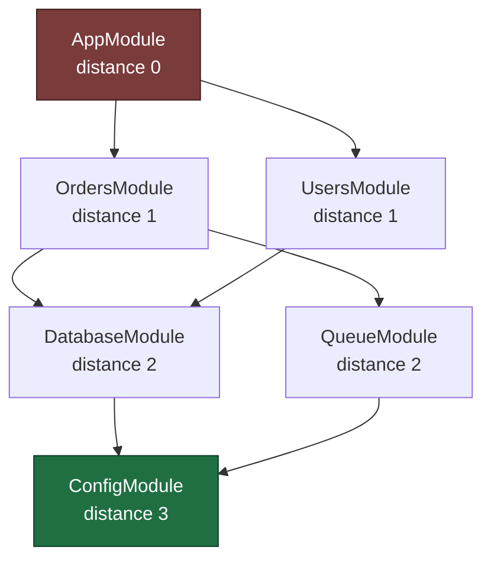
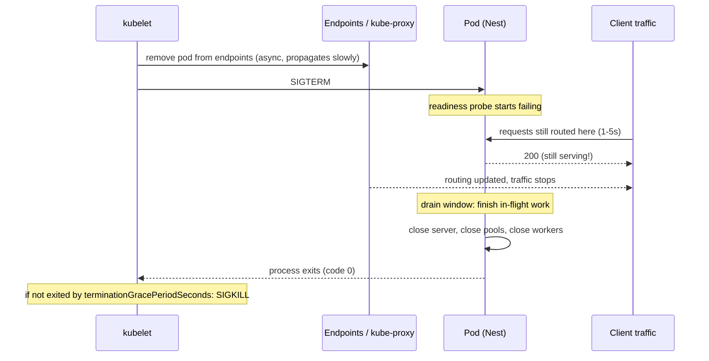

# Chapter 39 — Lifecycle Events and Graceful Shutdown

> **한눈에 보기**
> 애플리케이션은 `bootstrap()`이 끝나는 순간 시작되고, `SIGTERM`이 도착하는 순간 끝납니다.
> 이 장은 그 두 경계에서 Nest가 정확히 무엇을 하는지 다룹니다. 다섯 개의 라이프사이클 훅,
> 모듈 그래프에서의 호출 순서 보장, `enableShutdownHooks()`가 실제로 등록하는 시그널,
> 그리고 쿠버네티스가 파드를 죽일 때 진행 중인 요청·큐 워커·DB 커넥션 풀·웹소켓 연결을
> 잃지 않고 빠져나오는 방법까지. 6장에서 모듈 그래프를 배웠다면, 이 장은 그 그래프가
> 시간 축 위에서 어떻게 켜지고 꺼지는지에 대한 이야기입니다.

**What you will learn**

- The exact sequence of the five lifecycle hooks, which of them require opt-in, and what Nest itself does between them (binding the listener, closing the server).
- What "bottom-up" ordering means in a real module graph, why teardown is *not* a mirror image of startup in current Nest, and how to stop depending on order you do not control.
- How to write async hooks that Nest actually waits for, and how one hanging `await` turns a graceful shutdown into a `SIGKILL`.
- Why `enableShutdownHooks()` is off by default, which signals it registers, and how to narrow that set.
- The complete container story: `SIGTERM`, `terminationGracePeriodSeconds`, the readiness-probe-first drain, and why the pod keeps receiving traffic for several seconds after it starts shutting down.
- How to drain in-flight HTTP requests, BullMQ workers, database pools, WebSocket connections, and microservice consumers — in the right order, with a worked implementation.
- The four bugs that account for nearly every "my shutdown hooks never fired" report: no `enableShutdownHooks()`, PID 1 not forwarding signals, `process.exit()` inside a hook, and request-scoped providers.

**Why this matters**

Here is a production incident you can have on any Wednesday afternoon. You deploy. Kubernetes starts a rolling update: it sends `SIGTERM` to the old pod and starts a new one. Thirty seconds later your on-call channel fills with 502s, a handful of orders are stuck in a `processing` state that nothing will ever move out of, and your payment provider's dashboard shows two charge attempts for one order. Nothing crashed. No exception was logged. The deploy "succeeded."

What actually happened is that the old pod died mid-sentence. It was holding eleven HTTP requests it never finished, a BullMQ worker had claimed a job and was six seconds into a ten-second call to the payment API, and a database transaction was open. Node received `SIGTERM`, and because nothing was listening for it, Node's default behaviour applied: terminate immediately. The queue's stalled-job detector eventually re-delivered the payment job to a new worker, which charged the card a second time.

None of that is a NestJS bug. It is the default behaviour of a Node process, and Nest hands you the tools to override it — but they are opt-in, they are ordered in a way that is not obvious, and the two most common ways of running Node in a container break signal delivery entirely. Graceful shutdown is one of those subjects where the API is ten minutes of reading and the correct implementation is a day of thinking. This chapter gives you both, and it is explicit about the part the official documentation leaves out: the *order* in which you must release resources, and what happens to each kind of connection when you do not.

The startup half matters for a smaller but sharper reason. `onModuleInit` looks like a constructor that can be `async`, and people use it to warm caches, run migrations, and connect to brokers. Whether that works depends on ordering guarantees that most developers assume rather than verify. We will make them explicit.

---

## The three phases

A Nest application's life divides into three phases: **initializing**, **running**, and **terminating**. Every lifecycle hook belongs to exactly one of them, and Nest interleaves its own work — instantiating providers, binding the HTTP listener, closing it again — between your hooks at fixed points.



Two things in that diagram are easy to misread, and both cost people hours.

First, **`app.listen()` happens after both init hooks**. The server does not accept a single connection until every `onModuleInit` and every `onApplicationBootstrap` in the entire graph has settled. That is a genuine guarantee you can build on: if a hook loads a feature-flag snapshot, no request can observe the unloaded state. It is also a genuine liability: a hook that takes forty seconds delays your readiness probe by forty seconds, and a hook that hangs means your pod never becomes ready and gets killed by the deployment controller.

Second, **`beforeApplicationShutdown` runs before the HTTP server closes, and `onApplicationShutdown` runs after**. This is the single most useful fact in the chapter. The window between them is where Nest stops accepting new connections and waits for in-flight ones. Anything that must run *while the server is still up* — flipping a readiness flag, waiting for in-flight jobs — goes in `beforeApplicationShutdown`. Anything that must run *after nothing else can be using the resource* — closing the database pool, flushing a log transport — goes in `onApplicationShutdown`.

> **Hint** — `onModuleInit` and `onApplicationBootstrap` only fire if you explicitly call `app.init()` or `app.listen()`. `NestFactory.create()` alone does not run them. This matters in tests: `Test.createTestingModule(...).compile()` does not call them either, but `.init()` on the resulting application does.

---

## The five hooks

Each hook is an interface from `@nestjs/common`. The interfaces are erased at compile time, so implementing them is technically optional — Nest looks for the *method*, not the type. Implement them anyway: it is the only thing that catches a typo like `onModuleDestory()`, which is otherwise a silent no-op that you discover in production.

| Hook | Interface | Fires when | Receives | Opt-in? |
|---|---|---|---|---|
| `onModuleInit()` | `OnModuleInit` | The host module's dependencies have all been resolved | — | Requires `app.init()`/`app.listen()` |
| `onApplicationBootstrap()` | `OnApplicationBootstrap` | Every module has initialized, **before** listening | — | Requires `app.init()`/`app.listen()` |
| `onModuleDestroy()` | `OnModuleDestroy` | A termination signal was received, or `app.close()` was called | `signal?: string` | Requires `enableShutdownHooks()` for signals |
| `beforeApplicationShutdown()` | `BeforeApplicationShutdown` | All `onModuleDestroy()` results have settled; **before** connections close | `signal?: string` | Requires `enableShutdownHooks()` for signals |
| `onApplicationShutdown()` | `OnApplicationShutdown` | After connections have closed | `signal?: string` | Requires `enableShutdownHooks()` for signals |

Hooks can live on **providers, controllers, and module classes**. A module class implementing `OnModuleInit` is a legitimate and underused pattern for wiring that belongs to the module as a whole rather than to any one provider.

```typescript title="orders.module.ts"
import { Module, OnModuleInit, Logger } from '@nestjs/common';
import { OrdersService } from './orders.service';
import { OrdersController } from './orders.controller';

@Module({
  controllers: [OrdersController],
  providers: [OrdersService],
})
export class OrdersModule implements OnModuleInit {
  private readonly logger = new Logger(OrdersModule.name);

  onModuleInit() {
    this.logger.log('OrdersModule dependencies resolved');
  }
}
```

### The distinction between `onModuleInit` and `onApplicationBootstrap`

They look interchangeable and are not. `onModuleInit` fires per module, as soon as *that module's* dependency tree is resolved — while other modules may still be initializing. `onApplicationBootstrap` fires only after *every* module in the graph has finished its `onModuleInit`.

The rule that follows is mechanical:

- Work that touches **only this module's own providers** → `onModuleInit`. Opening a connection this module owns, compiling a schema, registering a local handler.
- Work that touches **other modules** → `onApplicationBootstrap`. Registering yourself in a global registry, subscribing to another module's event bus, publishing a "service is up" heartbeat, kicking off a background loop that calls across module boundaries.

Get this backwards and you get a class of bug that only appears when someone reorders an `imports` array: a provider in module A calls into module B during `onModuleInit`, and B's own initialization has not run yet, so B's internal map is still empty.

```typescript title="plugin-registry.service.ts"
import { Injectable, OnApplicationBootstrap, Logger } from '@nestjs/common';
import { PluginRegistry } from './plugin-registry';
import { PaymentPlugin } from './payment.plugin';

@Injectable()
export class PaymentPluginBootstrap implements OnApplicationBootstrap {
  private readonly logger = new Logger(PaymentPluginBootstrap.name);

  constructor(
    private readonly registry: PluginRegistry, // owned by another module
    private readonly plugin: PaymentPlugin,
  ) {}

  // Correct: the registry module has certainly finished its own onModuleInit
  // by the time any onApplicationBootstrap runs.
  onApplicationBootstrap() {
    this.registry.register('payment', this.plugin);
    this.logger.log('payment plugin registered');
  }
}
```

---

## Ordering: what "bottom-up" actually means

The official docs say execution order "directly depends on the order of module imports." That is true but underspecified, and the underspecification is where the bugs live. Here is the mechanism.

During bootstrap, Nest's dependency scanner walks the module graph starting at the root module and records, for each module, a **distance** — its depth from the root, taking the longest path when a module is reachable by several routes. When it is time to run a lifecycle hook, Nest sorts the modules by distance **descending** and calls the hook on each module in that order. Within a module, hooks run over its providers and then its controllers, in registration order.

Descending distance means the *deepest* modules — the leaves, the ones nothing else depends on for imports but that everything depends on for services — run first. That is what "bottom-up" means.



For this graph, `onModuleInit` runs in the order: `ConfigModule` (3) → `DatabaseModule`, `QueueModule` (2) → `OrdersModule`, `UsersModule` (1) → `AppModule` (0). Modules at equal distance run in the order the scanner registered them, which follows the `imports` arrays.

That is the intuitive order for startup: configuration is loaded before the pool that reads it, the pool exists before the service that queries it.

### Teardown is not a mirror

Here is the part that surprises people, and it is worth asserting in a test in your own codebase rather than taking on faith: **the destroy hooks use the same distance-sorted order, not the reverse.** `ConfigModule` and `DatabaseModule` receive `onModuleDestroy` *before* `OrdersModule` does.

Read that again with a concrete consequence. If `DatabaseModule` closes its connection pool in `onModuleDestroy`, and `OrdersService` (in `OrdersModule`, one level up) tries to write a final audit record in *its* `onModuleDestroy`, the write fails against a closed pool.

The correct response is not to fight the ordering. It is to stop encoding cross-module ordering into `onModuleDestroy` at all, and to use the phase boundary that Nest actually guarantees:

| You want to… | Put it in | Why |
|---|---|---|
| Stop accepting new work (flip readiness, pause a queue) | `onModuleDestroy` | Runs first, while everything is still connected |
| Finish in-flight work that needs the database, the broker, the HTTP client | `beforeApplicationShutdown` | All `onModuleDestroy` calls have settled; nothing is closed yet |
| Release a resource nobody can still be using | `onApplicationShutdown` | Servers and transports are closed by now |

Under that discipline the intra-phase ordering between modules stops mattering, because within a phase no module depends on another module having already run. That is the design goal: **make your teardown order-independent instead of guessing the order.**

> **⚠️ Notice** — Lifecycle hooks are **not** called on request-scoped classes. A `Scope.REQUEST` provider is created per request and garbage-collected after the response; it has no relationship to the application lifecycle. If you put `onModuleDestroy` on a request-scoped provider it will never fire. See [Chapter 38 — Injection Scopes](./38-injection-scopes.md) for why. The same is true of anything instantiated by `ModuleRef.create()`, covered in [Chapter 41](./41-module-ref-discovery-lazy.md).

---

## Async hooks and what Nest waits for

Every lifecycle hook may return a `Promise`, and Nest awaits it before moving to the next module in the sorted list. This is a sequential `await` per module, not a `Promise.all` — a slow hook in a deep module delays every shallower module behind it.

```typescript title="schema-cache.service.ts"
import { Injectable, OnModuleInit, OnApplicationShutdown, Logger } from '@nestjs/common';
import { HttpService } from '@nestjs/axios';
import { firstValueFrom, timeout } from 'rxjs';

@Injectable()
export class SchemaCacheService implements OnModuleInit, OnApplicationShutdown {
  private readonly logger = new Logger(SchemaCacheService.name);
  private schema: Record<string, unknown> | null = null;
  private refresher?: NodeJS.Timeout;

  constructor(private readonly http: HttpService) {}

  async onModuleInit(): Promise<void> {
    // Nest will not proceed until this resolves or rejects.
    this.schema = await this.fetchSchema();
    this.refresher = setInterval(() => void this.refresh(), 60_000);
    this.logger.log('schema cache warmed');
  }

  onApplicationShutdown(signal?: string) {
    clearInterval(this.refresher); // otherwise the process never exits
    this.logger.log(`schema cache released (${signal ?? 'app.close()'})`);
  }

  private async fetchSchema() {
    const res = await firstValueFrom(
      this.http.get('/schema').pipe(timeout(5_000)), // always bound the wait
    );
    return res.data;
  }

  private async refresh() {
    try {
      this.schema = await this.fetchSchema();
    } catch (err) {
      this.logger.warn(`schema refresh failed, keeping stale copy: ${err}`);
    }
  }
}
```

Three rules follow from "Nest awaits your promise":

1. **Bound every wait.** An `onModuleInit` with an unbounded network call is an application that will not start when the dependency is down. A timeout with a sane fallback beats a hang every time — a pod that starts degraded and reports it is worth more than a pod that never becomes ready.
2. **Decide whether failure is fatal.** An unhandled rejection in `onModuleInit` propagates out of `NestFactory` and kills bootstrap. Sometimes that is exactly right (no database, no service). Often it is not (an optional analytics sink). Choose deliberately; do not let a `try/catch`'s absence make the choice.
3. **Clean up what you started.** Timers, intervals, watchers, and open sockets keep the Node event loop alive. `app.close()` does not terminate the process — it only runs the hooks and closes what Nest itself opened. If your process hangs after a clean shutdown, an interval you forgot to clear is nearly always the reason.

---

## `enableShutdownHooks()` — the opt-in

`onModuleDestroy`, `beforeApplicationShutdown`, and `onApplicationShutdown` always fire when you call `app.close()` yourself. They fire on **system signals** only if you opt in:

```typescript title="main.ts"
import { NestFactory } from '@nestjs/core';
import { AppModule } from './app.module';

async function bootstrap() {
  const app = await NestFactory.create(AppModule);

  // Registers process-level signal listeners that route into app.close().
  app.enableShutdownHooks();

  await app.listen(process.env.PORT ?? 3000);
}
void bootstrap();
```

### Why it is off by default

`enableShutdownHooks()` attaches listeners to the Node `process` object for every signal in its set. Node warns at eleven listeners per event. If you run several Nest applications inside one Node process — the normal situation in a Jest suite running e2e specs in a single worker, or in a monorepo test harness — you accumulate listeners and Node starts printing `MaxListenersExceededWarning`, and in a large suite you leak memory across tests. That is the entire reason for the opt-in. It is not a performance concern in production; a handful of signal listeners cost nothing.

The practical consequence is that you should call it in `main.ts` and *not* in shared test bootstrap code. If a test needs to assert that a hook runs, call `await app.close()` explicitly instead of raising a signal.

### Which signals

Called with no arguments, `enableShutdownHooks()` registers every member of the `ShutdownSignal` enum from `@nestjs/common`:

| Signal | Typical source |
|---|---|
| `SIGHUP` | Terminal hangup; also used by some supervisors to request reload |
| `SIGINT` | Ctrl-C in a terminal |
| `SIGQUIT` | Ctrl-\ ; quit with core dump |
| `SIGILL`, `SIGTRAP`, `SIGABRT`, `SIGBUS`, `SIGFPE`, `SIGSEGV` | Hardware/runtime faults |
| `SIGUSR2` | User-defined; **nodemon uses this to restart** |
| `SIGTERM` | The polite "please stop" — Docker, Kubernetes, systemd |

You can narrow the set, which is what I recommend for a container workload. There is little value in running an orderly shutdown after `SIGSEGV` — the process is already in an undefined state — and trapping `SIGUSR2` can interfere with tooling.

```typescript
import { ShutdownSignal } from '@nestjs/common';

app.enableShutdownHooks([ShutdownSignal.SIGTERM, ShutdownSignal.SIGINT]);
```

> **⚠️ Notice** — Windows support is limited by the platform, not by Nest. `SIGINT` works, `SIGBREAK` works, `SIGHUP` partly works, and **`SIGTERM` will never work on Windows** — killing a process there is unconditional and cannot be observed or prevented by the application. Develop your shutdown path on Linux (or in a container) even if your laptop runs Windows.

### `app.close()` does not exit the process

This trips up CLI-style and worker-style applications. `await app.close()` runs the three terminating hooks and closes what Nest opened. It does **not** call `process.exit()`. If an interval, an open server socket, a pending `setTimeout`, or a still-connected client keeps the event loop alive, your process sits there looking healthy and doing nothing.

For a long-running HTTP server this is correct behaviour: once everything is released, the event loop drains and Node exits with code 0 on its own. For a script, close explicitly and let the natural exit happen; if you must force it, do so *after* `close()` resolves, never inside a hook.

---

## The container story: SIGTERM in Kubernetes

Everything above is the mechanism. Here is the environment it runs in, because the two most damaging shutdown bugs are environmental rather than in your Nest code.

When Kubernetes terminates a pod, it does several things **concurrently**, not in sequence:

1. It marks the pod `Terminating` and starts removing it from the `Endpoints`/`EndpointSlice` of every Service that selects it.
2. It runs the `preStop` hook, if any.
3. It sends `SIGTERM` to PID 1 of each container.
4. It starts a clock. After `terminationGracePeriodSeconds` (default **30**), it sends `SIGKILL`, which is not catchable.

Step 1 is *eventually consistent*. Endpoint removal has to propagate to every kube-proxy, every ingress controller, and every service mesh sidecar on every node. That takes time — commonly a second or two, sometimes much longer under load. Meanwhile step 3 has already happened.

**The consequence: your application will receive new connections for some period after `SIGTERM` arrives.** If your handler's first act is to close the HTTP server, those connections are refused, and your users see 502s during every deploy. This is the single most common cause of "we get errors on every rollout" and it is not fixed by anything in your Nest code — it is fixed by *waiting*.



### The readiness-probe-first drain pattern

The fix is to make the pod report itself unready *before* it stops serving, and to hold the connection-accepting state open long enough for the routing layer to catch up.

```typescript title="readiness.service.ts"
import { Injectable, OnModuleDestroy, Logger } from '@nestjs/common';

@Injectable()
export class ReadinessService implements OnModuleDestroy {
  private readonly logger = new Logger(ReadinessService.name);
  private ready = true;

  isReady(): boolean {
    return this.ready;
  }

  // onModuleDestroy is the FIRST terminating hook — perfect place to flip the flag.
  onModuleDestroy() {
    this.ready = false;
    this.logger.log('readiness flipped to false; draining');
  }
}
```

```typescript title="health.controller.ts"
import { Controller, Get, ServiceUnavailableException } from '@nestjs/common';
import { ReadinessService } from './readiness.service';

@Controller()
export class HealthController {
  constructor(private readonly readiness: ReadinessService) {}

  // Liveness: "is the process alive?" — must keep answering 200 during drain,
  // otherwise the kubelet restarts the container mid-shutdown.
  @Get('/healthz')
  liveness() {
    return { status: 'ok' };
  }

  // Readiness: "should traffic be routed here?" — flips to 503 on SIGTERM.
  @Get('/readyz')
  readinessProbe() {
    if (!this.readiness.isReady()) {
      throw new ServiceUnavailableException({ status: 'draining' });
    }
    return { status: 'ok' };
  }
}
```

Then buy the routing layer time. There are two ways, and you want the first:

```yaml title="deployment.yaml"
spec:
  template:
    spec:
      terminationGracePeriodSeconds: 60   # must exceed your worst-case drain
      containers:
        - name: api
          lifecycle:
            preStop:
              exec:
                # Runs BEFORE SIGTERM is sent. Pure delay so endpoint removal
                # can propagate while the app is still fully serving.
                command: ["sh", "-c", "sleep 8"]
          readinessProbe:
            httpGet: { path: /readyz, port: 3000 }
            periodSeconds: 2
            failureThreshold: 1
          livenessProbe:
            httpGet: { path: /healthz, port: 3000 }
            periodSeconds: 10
            failureThreshold: 3
```

A `preStop` sleep is the cleanest mechanism because it delays `SIGTERM` itself: during the sleep the application is completely normal and still in the endpoint list, so no request is at risk. The alternative — a `setTimeout` at the top of `beforeApplicationShutdown` — works too, and is what you use when you cannot edit the manifest, but it means the sleep happens after `onModuleDestroy` has already run.

Budget the grace period as: `preStop sleep + slowest in-flight request + queue job drain + a safety margin`. If `terminationGracePeriodSeconds` is smaller than that sum, Kubernetes `SIGKILL`s you halfway through the careful shutdown you just wrote, and you are back where you started.

### The PID 1 problem

This one silently disables everything above.

```dockerfile
# WRONG — shell form. The shell becomes PID 1 and does not forward SIGTERM.
CMD npm run start:prod
```

With shell form, Docker runs `/bin/sh -c "npm run start:prod"`. `sh` is PID 1; it receives `SIGTERM` and, having no handler, ignores it and does not pass it to its child. Your Node process never sees a signal, sits until the grace period expires, and is `SIGKILL`ed. Every symptom looks like "Nest ignored my shutdown hooks."

`npm` is the second offender: even in exec form, `npm` spawns node as a child and its signal forwarding has historically been unreliable.

```dockerfile
# RIGHT — exec form, node as PID 1, no npm in the middle.
CMD ["node", "dist/main.js"]
```

If you genuinely need a wrapper, or if your app spawns children that must be reaped, add an init process:

```dockerfile
FROM node:22-slim
RUN apt-get update && apt-get install -y --no-install-recommends dumb-init \
  && rm -rf /var/lib/apt/lists/*
WORKDIR /app
COPY --chown=node:node . .
USER node
ENTRYPOINT ["dumb-init", "--"]
CMD ["node", "dist/main.js"]
```

`docker run --init` and Kubernetes' `shareProcessNamespace` are alternatives, but a `dumb-init`/`tini` entrypoint is explicit and portable.

Verify it, do not assume it. In a running container:

```bash
# 1. Is node actually PID 1?
docker exec <id> ps -o pid,comm

# 2. Does a TERM produce your shutdown logs, and how long does exit take?
docker stop --time 60 <id> && docker logs <id> | tail -20
```

---

## Draining each kind of resource

The five hooks are generic. What you put in them depends on what you are holding open. This table is the practical core of the chapter.

| Resource | Where to release | What happens if you do not |
|---|---|---|
| HTTP server (in-flight requests) | Nest closes it between `beforeApplicationShutdown` and `onApplicationShutdown` | Connections cut mid-response; clients see socket hang-ups |
| Readiness flag | `onModuleDestroy` (first hook) | Load balancer keeps routing to a draining pod |
| BullMQ worker | `onModuleDestroy` to pause, `beforeApplicationShutdown` to await in-flight jobs | Job is abandoned, marked stalled, and **re-delivered** — duplicate side effects |
| Database pool (TypeORM/Prisma/Mongoose) | Handled by the module's own `onModuleDestroy`; add nothing | Connections linger until the DB times them out; migrations may see phantom locks |
| Redis / cache client | `onApplicationShutdown` | Usually harmless, but leaks a socket and can keep the event loop alive |
| Microservice consumers (Kafka, RabbitMQ, NATS) | `app.close()` on the hybrid app; Nest closes transports | Broker redelivers unacked messages after a visibility timeout |
| WebSocket connections | `beforeApplicationShutdown` — send a close frame yourself | Clients see an abrupt `1006` and reconnect storms hit the new pod |
| Timers / intervals / watchers | `onApplicationShutdown` | Process never exits after `app.close()` |
| Log/telemetry transports | `onApplicationShutdown`, last | The final and most diagnostic log lines are lost |

A few of these deserve their own paragraph.

**Database pools.** You almost never write this yourself. `TypeOrmModule`, `MongooseModule`, `SequelizeModule`, and Prisma integrations all implement `onModuleDestroy` (or `onApplicationShutdown`) internally and close their pool for you — that is exactly why calling `enableShutdownHooks()` matters even when your own code has no hooks at all. See [Chapter 19 — SQL Databases with TypeORM](../part2-intermediate/19-sql-with-typeorm.md). The trap is the ordering point from earlier: because `DatabaseModule` typically sits *deeper* than your feature modules, its pool may close before a feature module's `onModuleDestroy` runs. Do your last database write in `beforeApplicationShutdown`, not `onModuleDestroy`.

**Queue workers.** This is where money is lost. A BullMQ worker that is killed mid-job does not fail the job — it simply stops renewing its lock, and after `lockDuration` the job is declared *stalled* and handed to another worker. If the job charged a card before dying, it charges again. The fix has two halves: make handlers idempotent (covered in [Chapter 35 — Queues and Background Jobs with BullMQ](../part2-intermediate/35-queues.md)) and close the worker properly, which BullMQ supports directly — `worker.close()` stops fetching new jobs and resolves once the current ones finish.

**WebSockets.** Closing the HTTP server does not close established WebSocket connections; an upgraded socket is no longer tracked by `server.close()`, which is why a Nest app with a gateway can hang at shutdown until `SIGKILL`. Broadcast a shutdown notice, give clients a moment to reconnect elsewhere, then disconnect them explicitly. See [Chapter 44 — WebSockets](./44-websockets.md) for the gateway API.

**Microservice consumers.** For a hybrid application (`app.connectMicroservice(...)`), `app.close()` closes the HTTP server *and* every connected microservice. For a pure microservice created with `NestFactory.createMicroservice`, the same `enableShutdownHooks()` call applies. The important semantic: brokers redeliver. A Kafka consumer that dies without committing offsets replays from the last commit; RabbitMQ requeues unacked messages. Your consumers must be idempotent regardless of how careful your shutdown is — graceful shutdown reduces the frequency of redelivery, it does not eliminate it. See [Chapter 45 — Microservices I](./45-microservices-fundamentals.md).

---

## Common mistakes

1. **The hooks never fire, and there is no error.**
   *Symptom:* `SIGTERM` in production kills the pod instantly; no shutdown logs.
   *Cause:* `enableShutdownHooks()` was never called. Everything works in tests because tests call `app.close()` directly, which does not need the opt-in.
   *Fix:* Call `app.enableShutdownHooks()` in `main.ts`, and add an e2e assertion that raises a real signal against a spawned process rather than calling `close()`.

2. **The hooks never fire, in Docker only.**
   *Symptom:* Works locally under Ctrl-C, never works in a container; `docker stop` always takes exactly ten seconds.
   *Cause:* Shell-form `CMD` or an `npm` wrapper — a shell is PID 1 and does not forward `SIGTERM`.
   *Fix:* `CMD ["node", "dist/main.js"]`, or an init process as entrypoint. Verify with `ps -o pid,comm` inside the container.

3. **`process.exit()` inside a hook.**
   *Symptom:* Some cleanup runs, the rest silently does not; logs are truncated mid-line.
   *Cause:* `process.exit()` terminates immediately, abandoning every pending hook, every in-flight request, and any buffered stdout. It is the shutdown equivalent of pulling the power cord to turn off a computer.
   *Fix:* Never call it in a hook. Let `app.close()` resolve and let the event loop drain. If you must force an exit code, do it in `main.ts` after `close()` returns.

4. **Method name typos.**
   *Symptom:* One provider's cleanup silently never runs.
   *Cause:* `onModuleDestory`, `onApplicationShutDown`, `beforeApplicationShutDown`. Nest matches by method name, and a name that does not match is simply not a hook.
   *Fix:* Always `implements OnModuleDestroy` — the compiler then catches it.

5. **Lifecycle hooks on request-scoped providers.**
   *Symptom:* `onModuleDestroy` in a `Scope.REQUEST` provider never fires.
   *Cause:* Request-scoped instances are not part of the application lifecycle by design.
   *Fix:* Move the resource into a default-scoped provider, or release it in a `finally` inside the request path.

6. **The process hangs after a clean shutdown.**
   *Symptom:* All shutdown logs print, exit code never arrives, `SIGKILL` at the grace period.
   *Cause:* A `setInterval`, a `setTimeout`, a file watcher, an open WebSocket, or an unclosed Redis client keeping the event loop alive. `app.close()` does not exit the process.
   *Fix:* `clearInterval`/`clearTimeout` in `onApplicationShutdown`; `unref()` timers that should not hold the process; close every client you opened yourself.

7. **`terminationGracePeriodSeconds` shorter than the real drain.**
   *Symptom:* Careful shutdown code exists, and jobs are still duplicated on deploy.
   *Cause:* The grace period (default 30s) expires while a long job is finishing; `SIGKILL` lands mid-drain.
   *Fix:* Measure your p99 job and request durations, set the grace period above their sum plus the `preStop` sleep, and cap in-flight work with your own timeout so the drain is bounded.

8. **Cross-module work in `onModuleDestroy`.**
   *Symptom:* "Connection pool is closed" or "Client is closed" errors during shutdown only.
   *Cause:* A deeper module (database, cache) already tore down its resource, because destroy hooks run deepest-first, not root-first.
   *Fix:* Move the final flush into `beforeApplicationShutdown`, which runs after *all* `onModuleDestroy` calls and before anything Nest closes.

---

## Putting it together

A single service with HTTP endpoints, a BullMQ worker, and a database — the exact combination that gets shutdown wrong. Here is the whole thing.

```typescript title="main.ts"
import { NestFactory } from '@nestjs/core';
import { Logger, ShutdownSignal } from '@nestjs/common';
import { AppModule } from './app.module';

async function bootstrap() {
  const logger = new Logger('Bootstrap');
  const app = await NestFactory.create(AppModule, { bufferLogs: true });

  // Only the signals an orchestrator or a developer actually sends.
  app.enableShutdownHooks([ShutdownSignal.SIGTERM, ShutdownSignal.SIGINT]);

  await app.listen(process.env.PORT ?? 3000);
  logger.log(`listening on ${await app.getUrl()}`);
}
void bootstrap();
```

```typescript title="drain/in-flight.interceptor.ts"
import {
  Injectable, NestInterceptor, ExecutionContext, CallHandler,
} from '@nestjs/common';
import { Observable } from 'rxjs';
import { finalize } from 'rxjs/operators';
import { DrainService } from './drain.service';

/** Counts in-flight HTTP requests so shutdown can wait for them. */
@Injectable()
export class InFlightInterceptor implements NestInterceptor {
  constructor(private readonly drain: DrainService) {}

  intercept(_ctx: ExecutionContext, next: CallHandler): Observable<unknown> {
    this.drain.enter();
    return next.handle().pipe(finalize(() => this.drain.leave()));
  }
}
```

```typescript title="drain/drain.service.ts"
import {
  Injectable, Logger, OnModuleDestroy, BeforeApplicationShutdown,
} from '@nestjs/common';

@Injectable()
export class DrainService implements OnModuleDestroy, BeforeApplicationShutdown {
  private readonly logger = new Logger(DrainService.name);
  private inFlight = 0;
  private ready = true;

  isReady() { return this.ready; }
  enter() { this.inFlight++; }
  leave() { this.inFlight--; }

  /** Phase 3, step 1: stop attracting traffic while still fully connected. */
  onModuleDestroy() {
    this.ready = false;
    this.logger.log(`draining: ${this.inFlight} request(s) in flight`);
  }

  /** Phase 3, step 2: wait for them, but never forever. */
  async beforeApplicationShutdown(signal?: string) {
    const deadline = Date.now() + 20_000;
    while (this.inFlight > 0 && Date.now() < deadline) {
      await new Promise((r) => setTimeout(r, 200));
    }
    if (this.inFlight > 0) {
      this.logger.warn(`forcing shutdown with ${this.inFlight} request(s) still open`);
    }
    this.logger.log(`HTTP drained (${signal ?? 'app.close()'})`);
  }
}
```

```typescript title="orders/orders.processor.ts"
import { Processor, WorkerHost } from '@nestjs/bullmq';
import {
  Logger, OnModuleDestroy, BeforeApplicationShutdown,
} from '@nestjs/common';
import { Job } from 'bullmq';
import { OrdersService } from './orders.service';

@Processor('orders')
export class OrdersProcessor
  extends WorkerHost
  implements OnModuleDestroy, BeforeApplicationShutdown
{
  private readonly logger = new Logger(OrdersProcessor.name);

  constructor(private readonly orders: OrdersService) {
    super();
  }

  async process(job: Job<{ orderId: string }>): Promise<void> {
    // Idempotent by design: safe if the job is redelivered after a hard kill.
    await this.orders.fulfil(job.data.orderId);
  }

  /** Stop claiming new jobs immediately. */
  async onModuleDestroy() {
    await this.worker.pause(/* doNotWaitActive */ true);
    this.logger.log('worker paused; no new jobs will be claimed');
  }

  /** Let the current job finish; the DB is still open at this point. */
  async beforeApplicationShutdown() {
    await this.worker.close(); // resolves when active jobs complete
    this.logger.log('worker closed cleanly');
  }
}
```

```typescript title="app.module.ts"
import { Module } from '@nestjs/common';
import { APP_INTERCEPTOR } from '@nestjs/core';
import { TypeOrmModule } from '@nestjs/typeorm';
import { BullModule } from '@nestjs/bullmq';
import { DrainService } from './drain/drain.service';
import { InFlightInterceptor } from './drain/in-flight.interceptor';
import { HealthController } from './health.controller';
import { OrdersModule } from './orders/orders.module';

@Module({
  imports: [
    TypeOrmModule.forRoot({ /* ... */ }),   // closes its pool on destroy
    BullModule.forRoot({ connection: { host: 'redis', port: 6379 } }),
    OrdersModule,
  ],
  controllers: [HealthController],
  providers: [
    DrainService,
    { provide: APP_INTERCEPTOR, useClass: InFlightInterceptor },
  ],
})
export class AppModule {}
```

Trace one `SIGTERM` through this application:

1. `preStop` sleeps 8s (manifest). The app is untouched and still serving; the endpoint removal propagates.
2. `SIGTERM` arrives at node (PID 1) → Nest's signal listener calls `app.close()`.
3. **`onModuleDestroy`** everywhere: `DrainService` flips `ready` to `false` so `/readyz` returns 503; `OrdersProcessor` pauses the worker.
4. **`beforeApplicationShutdown`**: `DrainService` waits up to 20s for in-flight HTTP requests; `OrdersProcessor` awaits the active job. The database pool is still open, so both can finish their work.
5. Nest closes the HTTP server and the BullMQ connections.
6. **`onApplicationShutdown`**: TypeORM's own hook closes the pool; any timers you registered are cleared.
7. `app.close()` resolves, the event loop drains, node exits 0 — well inside the 60s grace period.

No 502s, no duplicated charges, no stalled jobs.

---

> **핵심 정리**
> - 라이프사이클은 초기화 → 실행 → 종료의 3단계이며, `app.listen()`은 모든 `onModuleInit`과 `onApplicationBootstrap`이 끝난 **뒤에** 실행된다.
> - `onModuleInit`은 자기 모듈 내부 작업에, `onApplicationBootstrap`은 다른 모듈을 건드리는 작업에 쓴다.
> - 훅 호출 순서는 루트로부터의 거리 내림차순(깊은 모듈 먼저)이며, **종료 훅도 같은 순서**다. 시작의 역순이 아니다.
> - 따라서 모듈 간 순서에 의존하지 말고 단계(phase)에 의존하라: 트래픽 차단은 `onModuleDestroy`, 진행 중 작업 마무리는 `beforeApplicationShutdown`, 자원 해제는 `onApplicationShutdown`.
> - 시그널로 종료 훅을 받으려면 `enableShutdownHooks()`가 필수다. 리스너 누수 때문에 기본값이 off이므로 테스트 코드에는 넣지 말 것.
> - 쿠버네티스의 엔드포인트 제거는 비동기라서 `SIGTERM` 이후에도 트래픽이 온다. `preStop` sleep + readiness 503 패턴으로 배포 중 502를 없앤다.
> - `terminationGracePeriodSeconds`는 `preStop 지연 + 최장 요청 + 잡 드레인 + 여유`보다 커야 한다. 작으면 `SIGKILL`이 정성 들인 종료 코드를 잘라낸다.
> - 컨테이너에서 훅이 안 도는 원인의 대부분은 쉘 형식 `CMD`로 인해 node가 PID 1이 아닌 것이다. `CMD ["node", "dist/main.js"]`를 쓰라.
> - 훅 안에서 `process.exit()`를 부르지 말 것. `app.close()`는 프로세스를 종료시키지 않으므로, 종료가 안 되면 정리하지 않은 타이머를 의심하라.
> - 큐 워커와 브로커 컨슈머는 우아한 종료를 해도 재전달이 발생할 수 있다. 핸들러의 멱등성은 여전히 필수다.

> **연습 문제**
> 1. `distance`가 서로 다른 세 개의 모듈(`AppModule` → `FeatureModule` → `InfraModule`)을 만들고 각 모듈 클래스에 다섯 개 훅을 모두 구현해 로그를 찍어 보라. 실제 출력 순서를 기록하고, 초기화 순서와 종료 순서가 어떤 관계인지 서술하라.
> 2. `enableShutdownHooks()`를 호출하지 않은 앱과 호출한 앱을 각각 `docker stop`으로 종료시키고, `docker stop`이 반환되기까지 걸린 시간을 비교하라. 왜 차이가 나는가?
> 3. `CMD npm run start:prod`(쉘 형식)로 만든 이미지와 `CMD ["node", "dist/main.js"]`로 만든 이미지에서 `ps -o pid,comm`을 실행해 PID 1이 무엇인지 확인하고, `SIGTERM` 수신 여부를 로그로 증명하라.
> 4. **직접 만들어 보라.** HTTP 인플라이트 카운터 인터셉터와 `DrainService`를 구현하고, 10초 걸리는 엔드포인트를 호출한 직후 `SIGTERM`을 보내 응답이 끝까지 전달되는지 확인하라. 그다음 대기 상한(deadline)을 2초로 줄여 강제 종료 경고가 찍히는 것도 확인하라.
> 5. **직접 만들어 보라.** BullMQ 워커를 붙이고, 8초 걸리는 잡을 처리하는 도중 종료 신호를 보내라. (a) `worker.close()`를 호출하지 않을 때 잡이 stalled로 재전달되는 모습, (b) 호출할 때 정상 완료되는 모습을 각각 재현하고, 왜 그런지 설명하라.
> 6. `onModuleDestroy`에서 데이터베이스에 마지막 감사 로그를 쓰려다 "pool is closed" 오류가 나는 상황을 재현한 뒤, `beforeApplicationShutdown`으로 옮겨 해결하라.

**Next:** [Chapter 40 — Execution Context and Platform Agnosticism](./40-execution-context.md) turns from *when* your code runs to *where* it runs: how one guard, filter, or interceptor can serve HTTP, WebSocket, microservice, and GraphQL traffic without knowing which is which.
