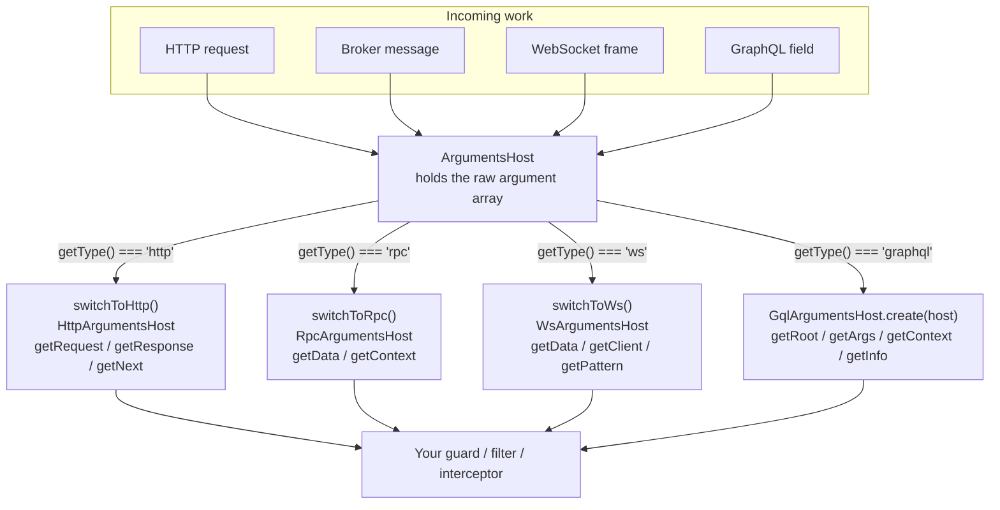

# Chapter 40 — Execution Context and Platform Agnosticism

> **한눈에 보기**
> 11장의 가드와 12장의 인터셉터는 `ExecutionContext`를 인자로 받았지만, 우리는 늘
> `switchToHttp()`만 불렀습니다. 이 장은 그 인자의 정체를 밝힙니다. `ArgumentsHost`가
> 핸들러 인자 배열을 어떻게 추상화하는지, `getType()`으로 HTTP·RPC·WS·GraphQL을 어떻게
> 구분하는지, `getClass()`/`getHandler()`와 `Reflector`가 어떻게 메타데이터를 읽는지,
> 그리고 하나의 필터·가드·인터셉터를 네 가지 전송 계층에서 모두 돌아가게 쓰는 방법까지.
> 마지막으로 Express와 Fastify 사이에서 무엇이 진짜 이식 가능하고 무엇이 아닌지를 정리합니다.

**What you will learn**

- What `ArgumentsHost` actually wraps — the raw handler argument array — and why that framing makes every later API obvious.
- How `getType()` lets one class serve HTTP, microservice, WebSocket, and GraphQL traffic, and how to type the GraphQL case correctly.
- Every method on `HttpArgumentsHost`, `RpcArgumentsHost`, and `WsArgumentsHost`, and which of them are safe to use in shared library code.
- How to write a genuinely transport-agnostic exception filter that returns JSON over HTTP, an error observable over RPC, and an `exception` event over WebSockets.
- What `ExecutionContext` adds over `ArgumentsHost`, and how `getClass()`/`getHandler()` become the two lookup keys that `Reflector` needs.
- `Reflector` in full: `get`, `getAll`, `getAllAndMerge`, `getAllAndOverride`, `Reflector.createDecorator` with typed metadata, and when the low-level `@SetMetadata()` is still the better tool.
- Where platform agnosticism is real, where it is a comfortable lie, and how to write library code that binds to `HttpAdapterHost` rather than to Express.

**Why this matters**

You write a `RolesGuard`. It works. Six months later the team adds a WebSocket gateway for live order tracking, and you apply the same guard to it. It throws: `Cannot read properties of undefined (reading 'headers')`. The guard called `context.switchToHttp().getRequest().headers` and, in a WebSocket context, `getRequest()` returned `undefined` — because for a gateway handler the argument array is `[client, data]`, not `[request, response, next]`.

That failure is the whole subject of this chapter. Nest's enhancers — guards, interceptors, filters, and pipes — are deliberately *not* HTTP concepts. They are pipeline concepts, and Nest runs the same pipeline for an HTTP request, a Kafka message, a WebSocket frame, and a GraphQL field resolution. What differs is the shape of the arguments the handler receives. `ArgumentsHost` exists precisely to let a single class read those arguments without knowing which shape it got.

There is a second, quieter reason to understand this. The most valuable code you write in a mature NestJS codebase is the shared kind: the logging interceptor every service uses, the tenancy guard, the error filter that shapes every response your organisation emits. That code lives in a library, gets published to a private registry, and is consumed by teams whose transport and HTTP platform you do not control. If it does `import { Request } from 'express'` and reaches for `req.raw`, it is not a library — it is an Express plugin wearing a Nest costume. Getting the boundary right is what makes the difference.

---

## `ArgumentsHost`: a wrapper over the argument array

Strip away the naming and `ArgumentsHost` is one thing: **an object that holds the array of arguments Nest is about to pass (or has passed) to your handler, plus methods for reading that array safely.**

The array's shape depends entirely on the transport:

| Context type | Argument array | Produced by |
|---|---|---|
| `'http'` (Express) | `[req, res, next]` | `@nestjs/platform-express` |
| `'http'` (Fastify) | `[request, reply, next]` | `@nestjs/platform-fastify` |
| `'rpc'` | `[data, context]` | `@nestjs/microservices` |
| `'ws'` | `[client, data]` | `@nestjs/websockets` |
| `'graphql'` | `[root, args, context, info]` | `@nestjs/graphql` |

Nest hands you an `ArgumentsHost` in every place where the current arguments matter but the transport might vary. The clearest example is an exception filter, whose `catch()` signature is `catch(exception: unknown, host: ArgumentsHost)` — you saw it in [Chapter 9 — Exception Filters](../part1-beginner/09-exception-filters.md) and used only its HTTP face.



### `getType()` — which world am I in?

```typescript
import { ArgumentsHost } from '@nestjs/common';
import type { GqlContextType } from '@nestjs/graphql';

function describe(host: ArgumentsHost): string {
  if (host.getType() === 'http') {
    return 'REST / MVC request';
  }
  if (host.getType() === 'rpc') {
    return 'microservice message';
  }
  if (host.getType() === 'ws') {
    return 'websocket event';
  }
  if (host.getType<GqlContextType>() === 'graphql') {
    return 'graphql field resolution';
  }
  return 'unknown';
}
```

The generic parameter on the last branch is not decoration. `ArgumentsHost#getType<TContext extends string = ContextType>(): TContext` defaults to `ContextType`, which is the union `'http' | 'rpc' | 'ws'`. `'graphql'` is not in that union, so comparing against it without widening the type is a TypeScript error ("This comparison appears to be unintentional"). `GqlContextType` — imported from `@nestjs/graphql`, a type-only import so you do not create a hard runtime dependency — is `ContextType | 'graphql'`.

That detail also tells you something structural: GraphQL is not a fourth transport in Nest's core. A GraphQL request arrives over HTTP; `@nestjs/graphql` overrides the context type so that enhancers can tell the difference between "an HTTP request being routed by a controller" and "an HTTP request being resolved by a resolver." Order your checks accordingly — test for `'graphql'` **before** falling through to a generic `'http'` branch, or your GraphQL requests will be handled by the REST path.

### `getArgs()` and `getArgByIndex()`

The unabstracted escape hatch:

```typescript
const [req, res, next] = host.getArgs();          // whole array
const request = host.getArgByIndex(0);            // one element, untyped
const response = host.getArgByIndex<Response>(1); // one element, asserted
```

These exist, they are occasionally necessary, and they are the wrong default. Index 0 means "request" under HTTP and "data" under RPC and "client" under WebSockets. Code written against indices is silently correct for one transport and silently wrong for the others — no exception, just the wrong object. Reach for `getArgByIndex` only when you are writing a transport-specific adapter and you have already narrowed on `getType()`.

There is one legitimate recurring use: `getNext()` does not exist on the GraphQL side and `next` is not always present, so a middleware-adjacent utility that needs the raw third argument sometimes uses `getArgByIndex(2)`. Guard it with a type check.

---

## The three context switchers

```typescript
export interface ArgumentsHost {
  getArgs<T extends Array<any> = any[]>(): T;
  getArgByIndex<T = any>(index: number): T;
  switchToRpc(): RpcArgumentsHost;
  switchToHttp(): HttpArgumentsHost;
  switchToWs(): WsArgumentsHost;
  getType<TContext extends string = ContextType>(): TContext;
}
```

Each switcher returns a small, transport-appropriate interface.

```typescript
export interface HttpArgumentsHost {
  getRequest<T = any>(): T;
  getResponse<T = any>(): T;
  getNext<T = any>(): T;
}

export interface RpcArgumentsHost {
  getData<T = any>(): T;      // the deserialized message payload
  getContext<T = any>(): T;   // transport-specific: KafkaContext, RmqContext, NatsContext...
}

export interface WsArgumentsHost {
  getData<T = any>(): T;      // the message body sent by the client
  getClient<T = any>(): T;    // the Socket / WebSocket instance
  getPattern(): string;       // the event name (v10.4+)
}
```

Two warnings about the switchers, because the API shape hides them.

**They do not validate.** `switchToHttp()` in a WebSocket context does not throw. It returns an `HttpArgumentsHost` whose `getRequest()` reads argument 0 — the socket client — and `getResponse()` reads argument 1, the message payload. You get a plausible-looking object with none of the properties you expect, and the failure surfaces three lines later as `undefined is not an object`. **Always branch on `getType()` first.**

**The returned objects are transport-shaped, not platform-shaped.** `getRequest()` under Express returns an `express.Request`; under Fastify it returns a `FastifyRequest`. Both are "the request," neither is the other. We return to this in the platform-agnosticism section.

The `RpcArgumentsHost#getContext()` return type varies by transporter: `KafkaContext` gives you `getTopic()`, `getPartition()`, `getMessage()`; `RmqContext` gives you `getChannelRef()` and `getMessage()` for manual acking; `NatsContext` gives you `getSubject()`. Generic library code should treat the context as opaque and only reach into it after checking which transporter is in play. See [Chapter 46 — Message Brokers](./46-message-brokers.md) and [Chapter 47 — Kafka](./47-kafka.md).

---

## A genuinely generic exception filter

This is the worked example the docs gesture at and never write. One filter, four contexts, correct behaviour in each.

```typescript title="all-exceptions.filter.ts"
import {
  ArgumentsHost,
  Catch,
  ExceptionFilter,
  HttpException,
  HttpStatus,
  Logger,
} from '@nestjs/common';
import { HttpAdapterHost } from '@nestjs/core';
import { RpcException } from '@nestjs/microservices';
import type { GqlContextType } from '@nestjs/graphql';
import { throwError, Observable } from 'rxjs';

interface ErrorBody {
  statusCode: number;
  message: string;
  error: string;
  timestamp: string;
}

@Catch()
export class AllExceptionsFilter implements ExceptionFilter {
  private readonly logger = new Logger(AllExceptionsFilter.name);

  // Injecting the adapter host instead of importing express keeps this portable.
  constructor(private readonly httpAdapterHost: HttpAdapterHost) {}

  catch(exception: unknown, host: ArgumentsHost): Observable<never> | void {
    const body = this.normalise(exception);
    const type = host.getType<GqlContextType>();

    this.logger.error(`[${type}] ${body.statusCode} ${body.message}`);

    switch (type) {
      case 'graphql':
        // Let the GraphQL error formatter own the response shape.
        // Returning the exception re-throws it into Apollo's pipeline.
        throw exception;

      case 'rpc':
        // RPC handlers return observables; an error must be an error notification.
        return throwError(() => new RpcException(body));

      case 'ws': {
        const client = host.switchToWs().getClient<{ emit: Function }>();
        client.emit('exception', body);
        return;
      }

      case 'http':
      default: {
        // httpAdapter.reply() works identically on Express and Fastify.
        const { httpAdapter } = this.httpAdapterHost;
        const ctx = host.switchToHttp();
        httpAdapter.reply(ctx.getResponse(), body, body.statusCode);
        return;
      }
    }
  }

  private normalise(exception: unknown): ErrorBody {
    const timestamp = new Date().toISOString();

    if (exception instanceof HttpException) {
      const res = exception.getResponse();
      const message =
        typeof res === 'string'
          ? res
          : ((res as Record<string, unknown>).message as string) ?? exception.message;
      return {
        statusCode: exception.getStatus(),
        message,
        error: exception.name,
        timestamp,
      };
    }

    return {
      statusCode: HttpStatus.INTERNAL_SERVER_ERROR,
      message: 'Internal server error',
      error: 'InternalServerError',
      timestamp,
    };
  }
}
```

Three design decisions in there are worth naming.

**`HttpAdapterHost` instead of `res.status(...).json(...)`.** The Express idiom `res.status(400).json(body)` does not exist on a Fastify reply, which uses `reply.status(400).send(body)`. `httpAdapter.reply(response, body, status)` is the portable form, and it is the reason this filter can be registered in a Fastify application without a single change. This is also why the filter is a class with a constructor rather than a stateless one — it needs the injected adapter, which means registering it with `APP_FILTER` (or passing an instance) rather than `app.useGlobalFilters(new AllExceptionsFilter())` with no arguments.

**RPC returns an observable rather than writing a response.** A microservice handler has no response object. Nest expects the filter to return an `Observable` that errors; the transporter serialises that into whatever the protocol's error representation is. Emitting to a socket in an RPC context, or returning an observable in an HTTP context, is a silent no-op.

**GraphQL re-throws.** You *can* format GraphQL errors here, but you should not: `@nestjs/graphql` has a `formatError` option that runs later and owns the `errors` array shape. Intercepting here means writing that formatting twice. Catch, log, re-throw.

Register it globally:

```typescript title="app.module.ts"
import { Module } from '@nestjs/common';
import { APP_FILTER } from '@nestjs/core';
import { AllExceptionsFilter } from './all-exceptions.filter';

@Module({
  providers: [{ provide: APP_FILTER, useClass: AllExceptionsFilter }],
})
export class AppModule {}
```

---

## `ExecutionContext`: the two extra questions

`ArgumentsHost` answers "what arguments?" `ExecutionContext` extends it to also answer "**whose** handler?"

```typescript
export interface ExecutionContext extends ArgumentsHost {
  getClass<T = any>(): Type<T>;
  getHandler(): Function;
}
```

- `getHandler()` returns a reference to the method that is about to be invoked — the function object itself, not its name.
- `getClass()` returns the **class**, not an instance. For a `POST /cats` bound to `CatsController#create`, `getHandler()` is `create` and `getClass()` is `CatsController`.

```typescript
const methodKey = ctx.getHandler().name; // "create"
const className = ctx.getClass().name;   // "CatsController"
```

Nest passes an `ExecutionContext` (not a plain `ArgumentsHost`) to guards' `canActivate()`, interceptors' `intercept()`, and pipes that receive metadata. Filters get only an `ArgumentsHost` — by the time a filter runs, "which handler was going to run" is no longer meaningful, since the handler may have thrown before it started.

Those two references are useful for logging (`${className}#${methodKey}` is the single most valuable field in an application log line) but their real purpose is to serve as **metadata lookup keys**. Decorators attach metadata to a method or a class; `Reflector` reads metadata off a method or a class; `getHandler()` and `getClass()` are how a guard names the method and the class it is currently guarding. Everything else in this section follows from that.

---

## `Reflector` in full

`Reflector` is injectable from `@nestjs/core` and needs no module import.

```typescript
@Injectable()
export class RolesGuard implements CanActivate {
  constructor(private readonly reflector: Reflector) {}
}
```

### Typed decorators with `Reflector.createDecorator`

The modern, recommended approach. You declare a decorator with a metadata type, and the same object is both the decorator and the lookup key — no string constant to keep in sync.

```typescript title="roles.decorator.ts"
import { Reflector } from '@nestjs/core';

export const Roles = Reflector.createDecorator<string[]>();
```

```typescript title="cats.controller.ts"
import { Body, Controller, Post } from '@nestjs/common';
import { Roles } from './roles.decorator';
import { CreateCatDto } from './dto/create-cat.dto';

@Controller('cats')
export class CatsController {
  @Post()
  @Roles(['admin'])
  async create(@Body() createCatDto: CreateCatDto) {
    return this.catsService.create(createCatDto);
  }
}
```

`Roles` is now a function accepting exactly `string[]`. `@Roles('admin')` — a bare string — is a compile error, and so is `@Roles([Role.Admin, 42])`. Reading it back is typed too: `reflector.get(Roles, handler)` is inferred as `string[]`, with no generic parameter to get wrong.

`createDecorator` takes an options object as well. `{ key: 'roles' }` pins the underlying metadata key so it interoperates with existing `@SetMetadata('roles', ...)` code — useful during a migration. `{ transform: (value) => ... }` normalises the value at decoration time, which is how you accept both `'admin'` and `['admin']` while storing one canonical shape.

```typescript
export const Roles = Reflector.createDecorator<string | string[], string[]>({
  transform: (value) => (Array.isArray(value) ? value : [value]),
});
```

### The four read methods

| Method | Signature shape | Returns | Use when |
|---|---|---|---|
| `get` | `get(decorator, target)` | The value at that single target, or `undefined` | You only ever set metadata in one place |
| `getAll` | `getAll(decorator, targets[])` | An array, one entry per target, in order | You want to inspect each level separately |
| `getAllAndOverride` | `getAllAndOverride(decorator, targets[])` | The **first defined** value in target order | Method should override controller (the usual case) |
| `getAllAndMerge` | `getAllAndMerge(decorator, targets[])` | Arrays concatenated, objects shallow-merged | Metadata is additive, not overriding |

The ordering of the `targets` array is the whole semantic. `[context.getHandler(), context.getClass()]` means "method first, then class," which for `getAllAndOverride` means the method wins. Flip the array and the class wins — which is almost never what you want and is a subtle bug when it happens.

```typescript title="roles.guard.ts"
import { CanActivate, ExecutionContext, Injectable } from '@nestjs/common';
import { Reflector } from '@nestjs/core';
import { Roles } from './roles.decorator';

@Injectable()
export class RolesGuard implements CanActivate {
  constructor(private readonly reflector: Reflector) {}

  canActivate(context: ExecutionContext): boolean {
    // Method-level @Roles wins over controller-level @Roles.
    const required = this.reflector.getAllAndOverride(Roles, [
      context.getHandler(),
      context.getClass(),
    ]);

    if (!required?.length) {
      return true; // no @Roles anywhere -> route is open
    }

    const { user } = context.switchToHttp().getRequest();
    return required.some((role) => user?.roles?.includes(role));
  }
}
```

Given `@Roles(['user'])` on `CatsController` and `@Roles(['admin'])` on `create()`:

- `get(Roles, context.getHandler())` → `['admin']`
- `get(Roles, context.getClass())` → `['user']`
- `getAll(Roles, [handler, cls])` → `[['admin'], ['user']]`
- `getAllAndOverride(Roles, [handler, cls])` → `['admin']`
- `getAllAndMerge(Roles, [handler, cls])` → `['admin', 'user']`

Choose deliberately. `getAllAndOverride` models "the controller sets a default, a method may replace it." `getAllAndMerge` models "requirements accumulate as you nest." A permissions system usually wants override (a public endpoint on a protected controller must be able to opt out); a feature-tagging system usually wants merge.

> **Hint** — `getAllAndOverride` returns the first **defined** value, not the first truthy one. An explicit `@Roles([])` on a method therefore overrides the controller's roles with an empty array rather than falling through to it. That is a feature: it is how you write "this specific route requires nothing."

### The low-level approach: `@SetMetadata`

Before `createDecorator`, and still valid, there is `@SetMetadata(key, value)` from `@nestjs/common`.

```typescript
@Post()
@SetMetadata('roles', ['admin'])
async create(@Body() dto: CreateCatDto) {}
```

Using it inline like that is poor practice — it scatters a magic string across your controllers. Wrap it:

```typescript title="roles.decorator.ts"
import { SetMetadata } from '@nestjs/common';

export const ROLES_KEY = 'roles';
export const Roles = (...roles: string[]) => SetMetadata(ROLES_KEY, roles);
```

Read it back by key, with an explicit generic since there is nothing to infer from:

```typescript
const roles = this.reflector.getAllAndOverride<string[]>(ROLES_KEY, [
  context.getHandler(),
  context.getClass(),
]);
```

**Which should you use?** `Reflector.createDecorator` by default: it is type-safe end to end and eliminates the exported key constant. Reach for `@SetMetadata` when you need something `createDecorator` cannot express:

- **Variadic decorators.** `@Roles('admin', 'owner')` with several arguments. `createDecorator` decorators take exactly one argument.
- **A stable, public metadata key.** If third parties or another library must read your metadata by key — as `@nestjs/swagger` and `@nestjs/passport` do — the key is part of your API.
- **Multiple decorators writing to one key** from different call sites.

Both mechanisms write to the same `reflect-metadata` store, so they interoperate: a `createDecorator` with an explicit `key` is readable by `reflector.get('that-key', target)`.

---

## GraphQL: `GqlExecutionContext`

A GraphQL resolver's handler receives `[root, args, context, info]`. `switchToHttp()` on that array returns `root` as the "request" — garbage. `@nestjs/graphql` provides a fifth switcher that you construct explicitly:

```typescript title="gql-auth.guard.ts"
import { CanActivate, ExecutionContext, Injectable } from '@nestjs/common';
import { GqlExecutionContext } from '@nestjs/graphql';
import { Reflector } from '@nestjs/core';
import { Roles } from './roles.decorator';

@Injectable()
export class GqlRolesGuard implements CanActivate {
  constructor(private readonly reflector: Reflector) {}

  canActivate(context: ExecutionContext): boolean {
    const required = this.reflector.getAllAndOverride(Roles, [
      context.getHandler(),
      context.getClass(),
    ]);
    if (!required?.length) return true;

    const gqlCtx = GqlExecutionContext.create(context);
    // The GraphQL "context" is where your context factory put the request.
    const { req } = gqlCtx.getContext<{ req: { user?: { roles: string[] } } }>();
    return required.some((r) => req.user?.roles?.includes(r));
  }
}
```

`GqlExecutionContext.create(context)` wraps the standard context and adds four accessors mirroring the resolver argument set:

| Method | Returns | Resolver argument |
|---|---|---|
| `getRoot<T>()` | The parent object of the field being resolved | `root` / `parent` |
| `getArgs<T>()` | The field's arguments | `args` |
| `getContext<T>()` | The per-request GraphQL context object | `context` |
| `getInfo<T>()` | `GraphQLResolveInfo` — field name, selection set, path | `info` |

Note what `getHandler()` and `getClass()` mean here: the resolver *method* and the resolver *class*. `Reflector` works identically — which is the payoff of the whole design. The same `@Roles` decorator and the same metadata reads work on a controller and on a resolver; only the "where is the user?" line differs.

A single guard can therefore cover both:

```typescript
canActivate(context: ExecutionContext): boolean {
  const required = this.reflector.getAllAndOverride(Roles, [
    context.getHandler(),
    context.getClass(),
  ]);
  if (!required?.length) return true;

  const user =
    context.getType<GqlContextType>() === 'graphql'
      ? GqlExecutionContext.create(context).getContext().req?.user
      : context.switchToHttp().getRequest().user;

  return required.some((r) => user?.roles?.includes(r));
}
```

`getInfo()` is the one accessor with no analogue elsewhere, and it enables things the other contexts cannot do — reading the selection set to decide whether to join a table, or computing query complexity. See [Chapter 52 — GraphQL III](./52-graphql-advanced.md).

---

## Platform agnosticism

Nest's second portability axis is not the transport but the **HTTP platform**: Express or Fastify under the same application code. The claim in the documentation — "build once, use everywhere" — is largely true and worth understanding precisely, because the exceptions are where teams get stuck two days into a Fastify migration.

### What makes it work: the adapter

`NestFactory.create(AppModule)` defaults to `ExpressAdapter`. Passing a second argument swaps it:

```typescript title="main.ts — Fastify"
import { NestFactory } from '@nestjs/core';
import { FastifyAdapter, NestFastifyApplication } from '@nestjs/platform-fastify';
import { AppModule } from './app.module';

async function bootstrap() {
  const app = await NestFactory.create<NestFastifyApplication>(
    AppModule,
    new FastifyAdapter({ logger: false }),
  );
  await app.listen(3000, '0.0.0.0'); // Fastify binds to localhost by default
}
void bootstrap();
```

Both adapters extend `AbstractHttpAdapter`, which normalises the operations Nest itself performs: `get/post/put/...` for route registration, `reply(response, body, statusCode)`, `status()`, `redirect()`, `setHeader()`, `render()`, `getRequestUrl()`, `getRequestMethod()`, `isHeadersSent()`, `listen()`, `close()`. Nest's core never touches Express directly; it goes through this interface.

Your code can do the same. `HttpAdapterHost` is a global provider holding the live adapter:

```typescript
import { Injectable } from '@nestjs/common';
import { HttpAdapterHost } from '@nestjs/core';

@Injectable()
export class PortableResponder {
  constructor(private readonly adapterHost: HttpAdapterHost) {}

  send(response: unknown, body: unknown, status = 200): void {
    this.adapterHost.httpAdapter.reply(response, body, status);
  }

  platform(): string {
    return this.adapterHost.httpAdapter.getType(); // 'express' | 'fastify'
  }
}
```

`httpAdapter.getInstance()` returns the underlying Express app or Fastify instance when you genuinely need the native object — registering a Fastify plugin, mounting Express middleware. That call is your explicit admission that you are leaving portable territory, which is exactly the right ergonomic. [Chapter 57 — Advanced HTTP](./57-advanced-http.md) covers `AbstractHttpAdapter` and writing your own.

> **⚠️ Notice** — `HttpAdapterHost.httpAdapter` is `undefined` until the adapter is instantiated, which happens during `NestFactory.create`. Do not read it in a provider's constructor. Read it in `onModuleInit`, in the method that uses it, or later. This is a common cause of "cannot read property 'reply' of undefined" at bootstrap.

### What is genuinely portable

| Building block | Portable across Express/Fastify? | Notes |
|---|---|---|
| Controllers, routing decorators, `@Param`/`@Query`/`@Body` | ✅ Yes | The reason to use them instead of `req.params` |
| Providers, DI, modules, dynamic modules | ✅ Yes | Zero platform contact |
| Pipes, DTOs, validation | ✅ Yes | Operate on already-extracted values |
| Guards & interceptors written against `ExecutionContext` | ✅ Yes | Until they touch `getRequest()` internals |
| Exception filters using `httpAdapter.reply()` | ✅ Yes | Not `res.status().json()` |
| `@Res()` / `@Req()` handlers | ❌ No | You have bound to `express.Response` or `FastifyReply` |
| `res.status(x).json(y)` | ❌ No | Fastify: `reply.status(x).send(y)` |
| Express middleware (`app.use`, `consumer.apply`) | ⚠️ Partial | Fastify has an Express-compat layer, but many packages misbehave |
| Fastify plugins (`app.register(...)`) | ❌ No | Fastify only |
| Cookies, sessions, static assets, file upload, CORS, Helmet | ⚠️ Different packages | `cookie-parser` vs `@fastify/cookie`, `multer` vs `@fastify/multipart`, etc. |
| Nested route wildcards & path syntax | ⚠️ Differs | Express 5 and Fastify diverge; `*` needs a name in Express 5 (`*splat`) |
| Microservices, WebSockets, GraphQL, CQRS, scheduling | ✅ Yes | Independent of the HTTP platform |

The pattern is consistent: **anything Nest abstracts is portable; anything you reach around Nest to touch is not.** Every `@Res()` in your codebase is a line item in a future migration estimate. Use the return-value style (`return dto`) and let Nest serialise; when you truly need the response object for streaming or a custom header, prefer `@Res({ passthrough: true })`, which at least keeps Nest's response handling in play.

### Writing a portable library

If you are publishing shared enhancers — see [Chapter 54 — Monorepos, Workspaces, and Publishable Libraries](./54-monorepo-and-libraries.md) — apply these five rules:

1. **Depend only on `@nestjs/common` and `@nestjs/core`.** Everything else (`@nestjs/graphql`, `@nestjs/microservices`, `express`) goes in `peerDependencies` and `devDependencies`, never `dependencies`.
2. **Import platform types with `import type`.** Erased at compile time, so a consumer without Express installed does not get a runtime resolution failure.
3. **Branch on `getType()` before every switcher call.** Never assume HTTP.
4. **Write responses through `httpAdapter.reply()`**, never through platform methods.
5. **Read request data through the narrowest possible surface.** `req.headers['authorization']` exists on both platforms; `req.get('authorization')` is Express-only; `req.raw` is Fastify-only.

---

## Common mistakes

1. **`switchToHttp()` in a non-HTTP context.**
   *Symptom:* `Cannot read properties of undefined (reading 'headers')` in a gateway or microservice handler.
   *Cause:* `getRequest()` returned argument 0, which is the socket client or the message payload.
   *Fix:* Branch on `getType()` first; give each transport its own extraction path.

2. **Comparing `getType()` to `'graphql'` without the generic.**
   *Symptom:* `This comparison appears to be unintentional because the types have no overlap.`
   *Cause:* The default return type is `'http' | 'rpc' | 'ws'`.
   *Fix:* `host.getType<GqlContextType>() === 'graphql'`, with `import type { GqlContextType } from '@nestjs/graphql'`.

3. **Checking `'http'` before `'graphql'`.**
   *Symptom:* A generic filter returns a REST-shaped JSON body for GraphQL errors, and Apollo reports a malformed response.
   *Cause:* GraphQL rides on HTTP; a naive `if (type === 'http')` catches it.
   *Fix:* Order the branches with `'graphql'` first, or use a `switch` on the widened type as in the worked filter.

4. **`res.status().json()` in a shared filter.**
   *Symptom:* `reply.json is not a function` after switching to Fastify.
   *Fix:* `this.httpAdapterHost.httpAdapter.reply(res, body, status)`.

5. **`getClass()` treated as an instance.**
   *Symptom:* `this.someService is undefined` when calling a method off `context.getClass()`.
   *Cause:* `getClass()` returns the constructor, not the instantiated controller.
   *Fix:* Use it only as a metadata target and for its `.name`. If you need the instance, resolve it via `ModuleRef` — see [Chapter 41](./41-module-ref-discovery-lazy.md).

6. **Reading only `getHandler()` when metadata is on the controller.**
   *Symptom:* A controller-level `@Roles(['admin'])` is ignored; every route reads as public.
   *Fix:* `getAllAndOverride(Roles, [context.getHandler(), context.getClass()])`.

7. **Injecting `HttpAdapterHost` and using it in a constructor.**
   *Symptom:* `Cannot read properties of undefined (reading 'reply')` during bootstrap.
   *Fix:* Access `.httpAdapter` lazily, inside the method or in `onModuleInit`.

8. **Reversed targets array.**
   *Symptom:* A method-level override does nothing.
   *Cause:* `[context.getClass(), context.getHandler()]` makes the class win under `getAllAndOverride`.
   *Fix:* Handler first. Always.

---

## Putting it together

One interceptor, registered globally, that logs every unit of work in the application regardless of how it arrived — HTTP, GraphQL, WebSocket, or broker message — and honours a typed `@AuditLevel()` decorator that a controller can set and a method can override.

```typescript title="audit/audit-level.decorator.ts"
import { Reflector } from '@nestjs/core';

export type AuditLevel = 'none' | 'summary' | 'full';

export const Audit = Reflector.createDecorator<AuditLevel>();
```

```typescript title="audit/audit.interceptor.ts"
import {
  CallHandler,
  ExecutionContext,
  Injectable,
  Logger,
  NestInterceptor,
} from '@nestjs/common';
import { Reflector } from '@nestjs/core';
import { GqlExecutionContext } from '@nestjs/graphql';
import type { GqlContextType } from '@nestjs/graphql';
import { Observable, tap } from 'rxjs';
import { Audit } from './audit-level.decorator';

interface AuditRecord {
  transport: string;
  target: string;
  detail?: unknown;
}

@Injectable()
export class AuditInterceptor implements NestInterceptor {
  private readonly logger = new Logger('Audit');

  constructor(private readonly reflector: Reflector) {}

  intercept(context: ExecutionContext, next: CallHandler): Observable<unknown> {
    // Method-level @Audit overrides controller/resolver/gateway-level @Audit.
    const level =
      this.reflector.getAllAndOverride(Audit, [
        context.getHandler(),
        context.getClass(),
      ]) ?? 'summary';

    if (level === 'none') {
      return next.handle();
    }

    const record = this.describe(context, level === 'full');
    const startedAt = Date.now();

    return next.handle().pipe(
      tap({
        next: () =>
          this.logger.log(
            `${record.transport} ${record.target} ok ${Date.now() - startedAt}ms` +
              (record.detail ? ` ${JSON.stringify(record.detail)}` : ''),
          ),
        error: (err) =>
          this.logger.warn(
            `${record.transport} ${record.target} failed ${Date.now() - startedAt}ms: ${err?.message}`,
          ),
      }),
    );
  }

  private describe(context: ExecutionContext, full: boolean): AuditRecord {
    const target = `${context.getClass().name}#${context.getHandler().name}`;
    const type = context.getType<GqlContextType>();

    // 'graphql' must be tested before 'http': GraphQL rides on HTTP.
    if (type === 'graphql') {
      const gql = GqlExecutionContext.create(context);
      return {
        transport: 'gql',
        target: `${gql.getInfo().parentType.name}.${gql.getInfo().fieldName}`,
        detail: full ? gql.getArgs() : undefined,
      };
    }

    if (type === 'ws') {
      const ws = context.switchToWs();
      return {
        transport: 'ws',
        target: `${ws.getPattern()} (${target})`,
        detail: full ? ws.getData() : undefined,
      };
    }

    if (type === 'rpc') {
      const rpc = context.switchToRpc();
      return {
        transport: 'rpc',
        target,
        detail: full ? rpc.getData() : undefined,
      };
    }

    const req = context.switchToHttp().getRequest<{
      method: string;
      url: string;
      body?: unknown;
    }>();
    return {
      transport: 'http',
      target: `${req.method} ${req.url} (${target})`,
      detail: full ? req.body : undefined,
    };
  }
}
```

```typescript title="app.module.ts"
import { Module } from '@nestjs/common';
import { APP_INTERCEPTOR, APP_FILTER } from '@nestjs/core';
import { AuditInterceptor } from './audit/audit.interceptor';
import { AllExceptionsFilter } from './all-exceptions.filter';

@Module({
  providers: [
    { provide: APP_INTERCEPTOR, useClass: AuditInterceptor },
    { provide: APP_FILTER, useClass: AllExceptionsFilter },
  ],
})
export class AppModule {}
```

```typescript title="orders/orders.controller.ts"
import { Body, Controller, Get, Post } from '@nestjs/common';
import { Audit } from '../audit/audit-level.decorator';

@Audit('summary') // controller default
@Controller('orders')
export class OrdersController {
  @Get()
  findAll() { /* logged at summary level */ }

  @Post()
  @Audit('full') // overrides the controller: log the body too
  create(@Body() dto: unknown) { /* ... */ }

  @Get('health')
  @Audit('none') // overrides the controller: log nothing
  health() { return { ok: true }; }
}
```

Attach the same interceptor to a gateway, a resolver, and a `@MessagePattern` handler and it keeps working — no branches at the call site, no duplicated logging code, and nothing in it that assumes Express. That is what `ExecutionContext` buys you.

---

> **핵심 정리**
> - `ArgumentsHost`는 핸들러 인자 배열의 추상화다. 배열의 모양은 전송 계층마다 다르다: HTTP는 `[req, res, next]`, RPC는 `[data, context]`, WS는 `[client, data]`, GraphQL은 `[root, args, context, info]`.
> - `switchToHttp()`/`switchToRpc()`/`switchToWs()`는 검증하지 않는다. 잘못된 컨텍스트에서 호출해도 예외 없이 엉뚱한 객체를 준다. 반드시 `getType()`으로 먼저 분기하라.
> - `getType()`의 기본 타입은 `'http' | 'rpc' | 'ws'`이므로 GraphQL은 `getType<GqlContextType>()`으로 넓혀야 한다. GraphQL은 HTTP 위에서 동작하므로 `'graphql'`을 `'http'`보다 **먼저** 검사하라.
> - `getArgByIndex()`는 인덱스에 결합되므로 전송 계층별 어댑터를 쓸 때만 사용한다.
> - `ExecutionContext`는 `ArgumentsHost`에 `getClass()`(클래스, 인스턴스 아님)와 `getHandler()`(메서드 참조)를 더한다. 이 둘은 `Reflector`의 조회 키다. 필터는 `ArgumentsHost`만 받는다.
> - `Reflector.createDecorator<T>()`가 기본 선택지다. 타입 안전하고 키 상수가 필요 없다. 가변 인자·공개 메타데이터 키가 필요할 때만 `@SetMetadata`를 쓴다.
> - `getAllAndOverride`는 배열 순서상 **처음 정의된** 값을, `getAllAndMerge`는 병합 결과를 준다. `[getHandler(), getClass()]` 순서여야 메서드가 컨트롤러를 덮어쓴다.
> - `GqlExecutionContext.create(ctx)`는 `getRoot`/`getArgs`/`getContext`/`getInfo`를 준다. `getInfo()`의 선택 집합(selection set)은 다른 컨텍스트에 없는 정보다.
> - 플랫폼 이식성의 규칙은 하나다: Nest가 추상화한 것은 이식되고, Nest를 우회해 만진 것은 이식되지 않는다. `@Res()` 하나하나가 미래 마이그레이션 비용이다.
> - 라이브러리 코드는 `HttpAdapterHost.httpAdapter.reply()`로 응답하고, 플랫폼 타입은 `import type`으로만 가져오며, `httpAdapter`는 생성자가 아니라 사용 시점에 읽는다.

> **연습 문제**
> 1. HTTP 컨트롤러와 웹소켓 게이트웨이에 동일한 가드를 적용한 뒤, 가드 안에서 `getArgs()` 결과를 그대로 로그로 찍어 두 배열의 모양이 어떻게 다른지 직접 확인하라.
> 2. `getType()` 분기 순서를 `'http'` → `'graphql'`로 뒤집은 필터를 만들어 GraphQL 오류 응답이 어떻게 깨지는지 재현하고, 왜 그런지 설명하라.
> 3. `@Roles`를 컨트롤러와 메서드 양쪽에 붙인 뒤 `get`, `getAll`, `getAllAndOverride`, `getAllAndMerge` 네 가지 결과를 모두 로그로 출력해 표로 정리하라. `targets` 배열 순서를 뒤집으면 어떤 것이 달라지는가?
> 4. **직접 만들어 보라.** `Reflector.createDecorator`에 `transform` 옵션을 써서 `@Roles('admin')`과 `@Roles(['admin', 'owner'])`를 모두 받아들이되 항상 `string[]`로 저장되는 데코레이터를 구현하라.
> 5. **직접 만들어 보라.** HTTP·RPC·WS 세 컨텍스트를 모두 처리하는 예외 필터를 작성하고, 같은 애플리케이션을 `ExpressAdapter`와 `FastifyAdapter`로 각각 부팅해 두 경우 모두 동일한 JSON 오류 본문이 나오는지 e2e 테스트로 증명하라.
> 6. 기존 `@Res()` 사용처를 모두 찾아 목록으로 만들고, 각각을 반환값 방식 또는 `@Res({ passthrough: true })`로 바꿀 수 있는지 판정하라. 바꿀 수 없는 것은 그 이유를 적어라.

**Next:** [Chapter 41 — ModuleRef, DiscoveryService, Lazy Loading, and Circular Dependencies](./41-module-ref-discovery-lazy.md) goes underneath the context object to the container itself: how to pull providers out of the DI graph at runtime, scan the graph to build a plugin system, load modules on demand, and untangle the cycles that DI cannot resolve on its own.
