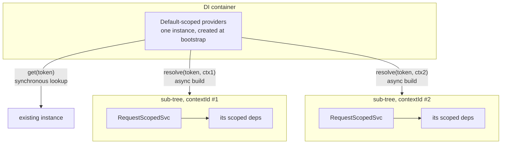
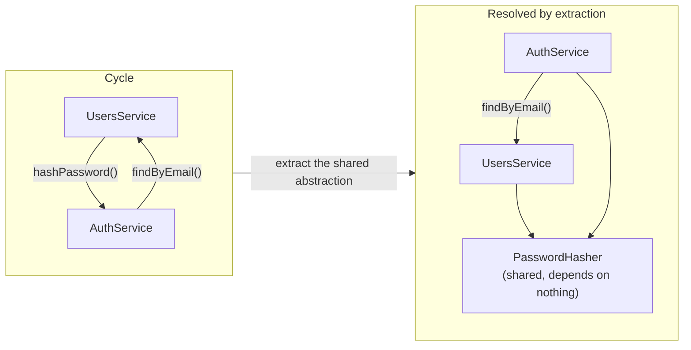

# Chapter 41 — ModuleRef, DiscoveryService, Lazy Loading, and Circular Dependencies

> **한눈에 보기**
> 지금까지 DI 컨테이너는 생성자를 통해서만 만났습니다. 이 장은 컨테이너 자체를 런타임에
> 직접 다루는 네 가지 도구를 다룹니다. `ModuleRef`로 토큰을 주고 인스턴스를 꺼내고,
> `DiscoveryService`로 그래프 전체를 훑어 플러그인 시스템을 만들고,
> `LazyModuleLoader`로 필요할 때만 모듈을 올리고, `forwardRef()`로 순환 의존을 푸는 법.
> 네 가지 모두 강력하지만 남용하면 설계를 망칩니다. 언제 정당하고 언제 냄새인지도 함께 다룹니다.

**What you will learn**

- How `ModuleRef.get()` resolves a token, why it is module-scoped by default, and what `{ strict: false }` actually widens.
- Why `resolve()` returns a `Promise` while `get()` does not, and how a context id defines a DI sub-tree you can share across several resolutions.
- How `ContextIdFactory.create()`, `ContextIdFactory.getByRequest()`, and `registerRequestByContextId()` fit together when you need a request-scoped provider outside a request.
- When `ModuleRef` is the right tool and when it is a service locator hiding a design problem you should fix instead.
- How `DiscoveryService` and `MetadataScanner` let you scan the running application, and how to build the plugin pattern that `@nestjs/schedule` and `@nestjs/cqrs` use internally.
- What `LazyModuleLoader` can and cannot load, why lazy modules are cached, and why controllers, gateways, resolvers, and lifecycle hooks are excluded.
- Why circular dependencies happen, how `forwardRef()` resolves them at both the provider and the module level, and how to extract a shared abstraction so you do not need it at all.

**Why this matters**

There is a point in every growing NestJS codebase where the declarative model stops being enough. You need to pick a payment gateway based on a value that only exists at runtime. You need every service tagged `@Migration()` to run in dependency order, without maintaining a list of them by hand. You need a Lambda that boots in 200ms instead of 2 seconds because it only ever calls one of your fifteen modules. Or — most commonly — you have just added an innocuous method to `UsersService` and the application refuses to start with `Nest cannot create the AuthModule instance. The module at index [0] of the AuthModule "imports" array is undefined.`

Each of those is a container problem, and each has a specific answer in this chapter. What ties them together is that all four tools puncture the abstraction that makes NestJS pleasant. Constructor injection is *declarative*: reading a class's constructor tells you everything it depends on, and the compiler and the container agree on the graph before a single request arrives. The moment you write `this.moduleRef.get(SomeService)`, that guarantee is gone — the dependency is invisible to the type system, invisible to `nest build`, and invisible to the next person reading the file.

That is not an argument against these tools. It is an argument for using them on purpose, in a small number of well-marked places, with an understanding of what you are trading away. This chapter is as much about the boundary as about the API.

---

## `ModuleRef`: reaching into the container

`ModuleRef` comes from `@nestjs/core` and is injectable everywhere with no module import — every module has its own instance, bound to that module's provider scope.

```typescript title="cats.service.ts"
import { Injectable, OnModuleInit } from '@nestjs/common';
import { ModuleRef } from '@nestjs/core';
import { AuditService } from './audit.service';

@Injectable()
export class CatsService implements OnModuleInit {
  private audit!: AuditService;

  constructor(private readonly moduleRef: ModuleRef) {}

  onModuleInit() {
    this.audit = this.moduleRef.get(AuditService);
  }
}
```

### `get()` and the strict boundary

`get(token)` returns an already-instantiated provider, controller, or injectable (guards and interceptors included) registered in the **current module**. If the token is not found, it throws `UnknownElementException`. It is synchronous, because by the time your code can call it, the container has finished instantiating every default-scoped provider.

"Current module" is the important qualifier and the source of most confusion. `ModuleRef` injected into `CatsService` resolves against `CatsModule`'s provider list — which includes everything `CatsModule` declares *and* everything its imported modules export into it. It does **not** include a provider that lives in an unrelated module, even one that is instantiated and running.

```typescript
// Resolves only within this module's own scope.
this.moduleRef.get(AuditService);

// Searches the entire application container.
this.moduleRef.get(AuditService, { strict: false });
```

`{ strict: false }` walks every module in the container looking for the token. Two consequences you must accept before using it:

- **It bypasses module encapsulation deliberately.** A provider that another module never exported becomes reachable. The compiler will not tell you that you have created a dependency across a boundary the module system was drawn to prevent.
- **Ambiguity is resolved by search order, not by intent.** If two modules register different providers under the same string token, you get whichever the traversal finds first. With class tokens this is rarely a problem; with `'CONFIG'`-style string tokens it is a real hazard. Use `Symbol` or a namespaced string for tokens that might collide — see [Chapter 36 — Custom Providers](./36-custom-providers.md).

My recommendation: default to strict. Use `{ strict: false }` when writing infrastructure that legitimately spans modules — a health-check aggregator, a metrics collector, a framework-like library. In application code, an unfound token usually means you forgot an `imports` entry, and the strict error is telling you the truth.

### `resolve()` and scoped providers

`get()` cannot return a `Scope.REQUEST` or `Scope.TRANSIENT` provider. There is no single instance to return — that is what "scoped" means. Attempting it throws.

For scoped providers use `resolve()`, which is asynchronous:

```typescript
@Injectable()
export class CatsService implements OnModuleInit {
  private transient!: TransientService;

  constructor(private readonly moduleRef: ModuleRef) {}

  async onModuleInit() {
    this.transient = await this.moduleRef.resolve(TransientService);
  }
}
```

**Why a Promise?** Because `resolve()` does not look an instance up — it *builds* one, along with the whole sub-tree of dependencies that instance needs, and any of those may be an async provider (`useFactory` returning a Promise, a `forRootAsync` configuration). Instantiation is genuinely asynchronous, so the API is honest about it. `get()` can be synchronous only because it is a lookup of something already built.

Each `resolve()` creates a **new DI container sub-tree** with its own **context identifier**:

```typescript
const [a, b] = await Promise.all([
  this.moduleRef.resolve(TransientService),
  this.moduleRef.resolve(TransientService),
]);
console.log(a === b); // false — two sub-trees, two instances
```

To make several resolutions share one sub-tree — so that a request-scoped `Logger` resolved twice is the *same* logger, holding the same correlation id — pass a context id:

```typescript
import { ContextIdFactory, ModuleRef } from '@nestjs/core';

const contextId = ContextIdFactory.create();
const [a, b] = await Promise.all([
  this.moduleRef.resolve(TransientService, contextId),
  this.moduleRef.resolve(TransientService, contextId),
]);
console.log(a === b); // true — one sub-tree
```

Think of a context id as the identity of a "unit of work." During an HTTP request, Nest creates one automatically and every request-scoped provider in that request shares it. Outside a request — in a cron job, a queue consumer, a CLI command — nothing creates one for you, so you create it yourself.



### `registerRequestByContextId()` — giving a manual sub-tree a request

A context id you created with `ContextIdFactory.create()` represents a sub-tree the framework did not build for a real HTTP request. In that sub-tree, the built-in `REQUEST` provider is `undefined`. Any provider that injects `@Inject(REQUEST)` — a tenancy resolver, a correlation-id holder, an audit context — will blow up with `Cannot read properties of undefined`.

The fix is to register a request-like object for that context id **before** resolving:

```typescript title="orders.processor.ts"
import { Injectable } from '@nestjs/common';
import { ContextIdFactory, ModuleRef } from '@nestjs/core';
import { OrdersService } from './orders.service'; // request-scoped

@Injectable()
export class OrdersProcessor {
  constructor(private readonly moduleRef: ModuleRef) {}

  async handleJob(job: { tenantId: string; orderId: string; correlationId: string }) {
    const contextId = ContextIdFactory.create();

    // Fabricate the "request" that request-scoped providers will inject.
    this.moduleRef.registerRequestByContextId(
      {
        headers: {
          'x-tenant-id': job.tenantId,
          'x-correlation-id': job.correlationId,
        },
        user: { id: 'system' },
      },
      contextId,
    );

    const orders = await this.moduleRef.resolve(OrdersService, contextId);
    await orders.fulfil(job.orderId);
  }
}
```

This is the standard bridge between request-scoped application code and non-HTTP entry points: queue consumers, scheduled jobs, Kafka handlers, CLI commands. It lets you write your domain services once, against `REQUEST`, and drive them from anywhere. ([Chapter 43 — AsyncLocalStorage](./43-async-local-storage.md) presents the alternative that avoids request scope entirely; read both before choosing.)

### `getByRequest()` — joining the *current* sub-tree

The opposite situation: you are already inside a request, in a request-scoped provider, and you want to resolve *another* request-scoped provider into the same sub-tree. Creating a new context id here would be wrong — you would get a second, unrelated instance with a different correlation id.

```typescript title="cats.service.ts"
import { Inject, Injectable, Scope } from '@nestjs/common';
import { REQUEST } from '@nestjs/core';
import { ContextIdFactory, ModuleRef } from '@nestjs/core';
import { CatsRepository } from './cats.repository';

@Injectable({ scope: Scope.REQUEST })
export class CatsService {
  constructor(
    @Inject(REQUEST) private readonly request: Record<string, unknown>,
    private readonly moduleRef: ModuleRef,
  ) {}

  async findAll() {
    const contextId = ContextIdFactory.getByRequest(this.request);
    const repo = await this.moduleRef.resolve(CatsRepository, contextId);
    return repo.findAll();
  }
}
```

`getByRequest()` returns the context id Nest already attached to that request object, so the resolved `CatsRepository` joins the sub-tree that is already running.

| Need | Call |
|---|---|
| A default-scoped provider in this module | `moduleRef.get(Token)` |
| A default-scoped provider anywhere in the app | `moduleRef.get(Token, { strict: false })` |
| A scoped provider, fresh sub-tree | `await moduleRef.resolve(Token)` |
| Several scoped providers sharing one sub-tree | `ContextIdFactory.create()` → pass to each `resolve()` |
| Scoped providers that inject `REQUEST`, outside a request | `create()` + `registerRequestByContextId()` → `resolve()` |
| A scoped provider inside the current request | `ContextIdFactory.getByRequest(req)` → `resolve()` |
| A class the container has never heard of | `await moduleRef.create(SomeClass)` |

### `create()` — instantiating unregistered classes

`create()` takes a class that is **not** a registered provider, resolves its constructor dependencies from the container, and returns an instance:

```typescript
@Injectable()
export class ReportService {
  constructor(private readonly moduleRef: ModuleRef) {}

  async buildRenderer(format: 'pdf' | 'csv') {
    const Renderer = format === 'pdf' ? PdfRenderer : CsvRenderer;
    // Both renderers take (private http: HttpService, private cfg: ConfigService)
    // — those get injected, even though neither class is a provider.
    return this.moduleRef.create(Renderer);
  }
}
```

This is the cleanest way to get DI for classes that are chosen at runtime, or that you create many of. Two things to know: the instance is **not managed** by the container — no lifecycle hooks, no caching, no cleanup, you own it — and `create()` is async for the same reason `resolve()` is.

---

## When `ModuleRef` is legitimate, and when it is a smell

`ModuleRef.get()` is the **service locator** pattern, and service locators have a bad reputation for good reasons. When a class asks the container for what it needs instead of declaring it, four things break at once: the constructor no longer documents the dependencies; the compiler no longer verifies them; unit tests need a container mock rather than a stub argument; and a missing provider fails at call time in production rather than at bootstrap.

Compare:

```typescript
// ❌ Service locator: the dependency is invisible.
@Injectable()
export class InvoiceService {
  constructor(private readonly moduleRef: ModuleRef) {}

  async send(id: string) {
    const mailer = this.moduleRef.get(MailerService, { strict: false });
    const pdf = this.moduleRef.get(PdfService, { strict: false });
    // Nothing about this class's signature says it needs a mailer or a PDF engine.
  }
}

// ✅ Declared: the graph is checked at bootstrap, the test is trivial.
@Injectable()
export class InvoiceService {
  constructor(
    private readonly mailer: MailerService,
    private readonly pdf: PdfService,
  ) {}
}
```

Use `ModuleRef` when the dependency genuinely cannot be known at class-definition time:

| Situation | Verdict |
|---|---|
| The concrete class is chosen at runtime from user input, config, or a database row | ✅ Legitimate — often with `create()` |
| Resolving a request-scoped provider from a non-request entry point (queue, cron, CLI) | ✅ Legitimate — the framework offers no other route |
| Framework/library code that must work with providers it cannot import | ✅ Legitimate — usually paired with `DiscoveryService` |
| Breaking a circular dependency as a last resort | ⚠️ Acceptable — but see the refactoring section below |
| Avoiding an `imports` entry you did not want to add | ❌ Smell — the module boundary is telling you something |
| Because injecting five things "felt like too many constructor parameters" | ❌ Smell — the class does too much; split it |
| Anywhere in a controller | ❌ Smell — controllers are the most testable layer; keep them declarative |

A practical containment rule: **`ModuleRef` may appear in infrastructure, not in domain logic.** If a factory, a strategy resolver, or an adapter uses it and everything downstream receives ordinary injected dependencies, the blast radius is one class. If it is scattered across your services, you have replaced dependency injection with a global registry.

---

## `DiscoveryService`: scanning the graph

`ModuleRef` answers "give me *this* thing." `DiscoveryService` answers "give me *everything* that looks like this." It is the foundation of every convention-driven feature in the Nest ecosystem — `@nestjs/schedule` finds your `@Cron()` methods with it, `@nestjs/cqrs` finds your `@CommandHandler()` classes, `@nestjs/bullmq` finds your `@Processor()`s.

Unlike `ModuleRef`, it requires a module import:

```typescript title="plugins.module.ts"
import { Module } from '@nestjs/common';
import { DiscoveryModule } from '@nestjs/core';
import { PluginExplorer } from './plugin.explorer';

@Module({
  imports: [DiscoveryModule],
  providers: [PluginExplorer],
})
export class PluginsModule {}
```

### The two enumerations

```typescript
const providers = this.discovery.getProviders();     // InstanceWrapper[]
const controllers = this.discovery.getControllers();  // InstanceWrapper[]
```

Each result is an `InstanceWrapper` carrying `.instance` (the live object, or `null` for a scoped/uninstantiated provider), `.token`, `.name`, `.metatype` (the class), `.isDependencyTreeStatic()`, and more. Two defensive habits are mandatory in real code:

```typescript
const candidates = this.discovery
  .getProviders()
  .filter((w) => w.instance && w.metatype); // skip null instances & value providers
```

`instance` is `null` for request- and transient-scoped providers (there is no singleton to hand you) and `metatype` is `null` for `useValue` providers. Iterating without these filters produces a `TypeError` on the first configuration object in your application.

### Filtering by metadata

`DiscoveryService.createDecorator()` creates a class decorator whose metadata `DiscoveryService` can read back:

```typescript title="feature-flag.decorator.ts"
import { DiscoveryService } from '@nestjs/core';

export const FeatureFlag = DiscoveryService.createDecorator<string>();
```

```typescript title="custom.service.ts"
import { Injectable } from '@nestjs/common';
import { FeatureFlag } from './feature-flag.decorator';

@Injectable()
@FeatureFlag('experimental')
export class CustomService {}
```

```typescript
const experimental = this.discovery
  .getProviders()
  .filter(
    (w) => this.discovery.getMetadataByDecorator(FeatureFlag, w) === 'experimental',
  );
```

`getMetadataByDecorator(decorator, wrapper)` returns the decorator's value or `undefined`. The result of the filter is conventionally typed as `DiscoveredClassWithMeta<T>` in ecosystem code — a wrapper plus its extracted metadata — and building that shape yourself makes downstream code far more pleasant than passing raw `InstanceWrapper`s around.

### `MetadataScanner`: finding decorated *methods*

Class-level discovery is half the story. Most plugin systems tag methods, not classes: `@Cron('0 * * * *')`, `@OnEvent('order.created')`, `@SubscribeMessage('ping')`. `MetadataScanner` (also from `@nestjs/core`, provided by `DiscoveryModule`) enumerates a class's method names, including inherited ones, while skipping the constructor:

```typescript
const prototype = Object.getPrototypeOf(wrapper.instance);
const methodNames = this.metadataScanner.getAllMethodNames(prototype);
```

Use `getAllMethodNames(prototype)` — the older `scanFromPrototype(instance, prototype, cb)` still exists but is deprecated and awkward. Note that you pass the **prototype**, not the instance: methods live on the prototype, and enumerating the instance would find only fields.

### A complete plugin system

Here is the full pattern, end to end. A `@WebhookHandler(event)` method decorator, a bootstrap-time explorer that discovers every one of them, and a dispatcher that routes incoming webhooks — with no central registration list anywhere.

```typescript title="webhooks/webhook-handler.decorator.ts"
import { SetMetadata } from '@nestjs/common';

export const WEBHOOK_HANDLER = Symbol('WEBHOOK_HANDLER');

export interface WebhookHandlerMeta {
  event: string;
  priority: number;
}

export const WebhookHandler = (event: string, priority = 0) =>
  SetMetadata<symbol, WebhookHandlerMeta>(WEBHOOK_HANDLER, { event, priority });
```

```typescript title="webhooks/webhook.registry.ts"
import { Injectable } from '@nestjs/common';

export interface RegisteredHandler {
  event: string;
  priority: number;
  invoke: (payload: unknown) => Promise<void>;
  describe: string;
}

@Injectable()
export class WebhookRegistry {
  private readonly handlers = new Map<string, RegisteredHandler[]>();

  add(handler: RegisteredHandler) {
    const list = this.handlers.get(handler.event) ?? [];
    list.push(handler);
    list.sort((a, b) => b.priority - a.priority);
    this.handlers.set(handler.event, list);
  }

  for(event: string): RegisteredHandler[] {
    return this.handlers.get(event) ?? [];
  }

  all(): ReadonlyMap<string, RegisteredHandler[]> {
    return this.handlers;
  }
}
```

```typescript title="webhooks/webhook.explorer.ts"
import { Injectable, Logger, OnApplicationBootstrap } from '@nestjs/common';
import { DiscoveryService, MetadataScanner, Reflector } from '@nestjs/core';
import { WEBHOOK_HANDLER, WebhookHandlerMeta } from './webhook-handler.decorator';
import { WebhookRegistry } from './webhook.registry';

@Injectable()
export class WebhookExplorer implements OnApplicationBootstrap {
  private readonly logger = new Logger(WebhookExplorer.name);

  constructor(
    private readonly discovery: DiscoveryService,
    private readonly scanner: MetadataScanner,
    private readonly reflector: Reflector,
    private readonly registry: WebhookRegistry,
  ) {}

  // onApplicationBootstrap, not onModuleInit: every module has finished
  // initialising, so every provider we might discover certainly exists.
  onApplicationBootstrap() {
    const wrappers = [
      ...this.discovery.getProviders(),
      ...this.discovery.getControllers(),
    ];

    for (const wrapper of wrappers) {
      const { instance } = wrapper;
      if (!instance || !wrapper.metatype) continue;      // scoped or useValue
      if (!wrapper.isDependencyTreeStatic()) continue;   // request-scoped: no singleton

      const prototype = Object.getPrototypeOf(instance);
      for (const methodName of this.scanner.getAllMethodNames(prototype)) {
        const meta = this.reflector.get<WebhookHandlerMeta>(
          WEBHOOK_HANDLER,
          prototype[methodName],
        );
        if (!meta) continue;

        this.registry.add({
          event: meta.event,
          priority: meta.priority,
          describe: `${wrapper.name}#${methodName}`,
          // Bind so `this` inside the handler is the provider instance.
          invoke: (payload) => instance[methodName].call(instance, payload),
        });
        this.logger.log(`bound ${meta.event} -> ${wrapper.name}#${methodName}`);
      }
    }
  }
}
```

```typescript title="webhooks/webhook.dispatcher.ts"
import { Injectable, Logger } from '@nestjs/common';
import { WebhookRegistry } from './webhook.registry';

@Injectable()
export class WebhookDispatcher {
  private readonly logger = new Logger(WebhookDispatcher.name);

  constructor(private readonly registry: WebhookRegistry) {}

  async dispatch(event: string, payload: unknown): Promise<void> {
    const handlers = this.registry.for(event);
    if (!handlers.length) {
      this.logger.warn(`no handler registered for "${event}"`);
      return;
    }
    for (const handler of handlers) {
      try {
        await handler.invoke(payload);
      } catch (err) {
        this.logger.error(`${handler.describe} failed: ${(err as Error).message}`);
      }
    }
  }
}
```

Now any provider anywhere in the application can participate by decorating a method:

```typescript title="billing/billing.service.ts"
import { Injectable, Logger } from '@nestjs/common';
import { WebhookHandler } from '../webhooks/webhook-handler.decorator';

@Injectable()
export class BillingService {
  private readonly logger = new Logger(BillingService.name);

  @WebhookHandler('invoice.paid', 10)
  async onInvoicePaid(payload: { invoiceId: string }) {
    this.logger.log(`marking ${payload.invoiceId} as settled`);
  }

  @WebhookHandler('invoice.payment_failed')
  async onPaymentFailed(payload: { invoiceId: string }) {
    this.logger.warn(`dunning ${payload.invoiceId}`);
  }
}
```

That is the whole mechanism behind `@nestjs/schedule` and `@nestjs/cqrs`: a method decorator writing metadata, an explorer running at `onApplicationBootstrap`, and a registry mapping keys to bound invocations. Once you have seen it once, every "how does that decorator work?" question in the ecosystem has the same answer.

> **⚠️ Notice** — Discovery is a **bootstrap-time** activity. Scanning the whole provider graph on every request is expensive and pointless: the graph does not change. Scan once, build a map, and look up from the map. And prefer `onApplicationBootstrap` over `onModuleInit` — see [Chapter 39](./39-lifecycle-and-shutdown.md) for why the timing matters.

---

## Lazy loading modules

By default every module in the graph is instantiated at bootstrap, whether or not the first request needs it. For a long-running server that is exactly right: pay once, serve fast forever. For a serverless function it is the opposite of right — you pay the full bootstrap cost on every cold start, for fifteen modules when the invocation touches one.

`LazyModuleLoader` defers that cost.

```typescript title="serverless.service.ts"
import { Injectable } from '@nestjs/common';
import { LazyModuleLoader } from '@nestjs/core';

@Injectable()
export class ServerlessService {
  constructor(private readonly lazyModuleLoader: LazyModuleLoader) {}

  async handle(operation: 'report' | 'export', input: unknown) {
    if (operation === 'report') {
      const { ReportModule } = await import('./report/report.module');
      const moduleRef = await this.lazyModuleLoader.load(() => ReportModule);

      const { ReportService } = await import('./report/report.service');
      const reports = moduleRef.get(ReportService);
      return reports.generate(input);
    }

    const { ExportModule } = await import('./export/export.module');
    const moduleRef = await this.lazyModuleLoader.load(() => ExportModule);
    const { ExportService } = await import('./export/export.service');
    return moduleRef.get(ExportService).run(input);
  }
}
```

You can also obtain it outside DI, in `main.ts`:

```typescript
const lazyModuleLoader = app.get(LazyModuleLoader);
```

Three properties make this practical:

**The module is an ordinary module.** `report.module.ts` needs no special marker, no extra decorator argument. Any `@Module()` class works.

**Loads are cached.** The first `load()` instantiates the module and its providers; every subsequent call returns the cached `ModuleRef` immediately. The documented timings tell the story: attempt 1 at ~2.4ms, attempts 2 and 3 at ~0.3ms. In a warm Lambda container the cost is paid once and then disappears.

**Lazy modules share the one module graph.** They are not a separate container. A lazily loaded module can import an eagerly loaded module, inject its exported providers, and be injected by other lazy modules loaded later. Everything resolves against the same graph.

The `import()` call and the `load()` call are separate for a reason: `import()` is the *JavaScript* module load (which is what gives you code-splitting under a bundler) and `load()` is the *Nest* module instantiation. Under Webpack, code splitting requires the right compiler settings:

```json title="tsconfig.json"
{
  "compilerOptions": {
    "module": "esnext",
    "moduleResolution": "node"
  }
}
```

### The limitations, and why they exist

This is where the feature's boundary is sharp, and the reasons are worth internalising rather than memorising.

| Cannot be lazy loaded | Why |
|---|---|
| **Controllers** | Routes are registered with the HTTP platform during bootstrap. Fastify explicitly forbids adding routes after `listen()`; there is no runtime registration path. |
| **Gateways** | WebSocket handlers are bound to events when the adapter attaches. |
| **Resolvers** | Code-first GraphQL generates the schema from metadata at bootstrap; a class loaded later is absent from the schema. |
| **Middleware** | `MiddlewareConsumer` runs during module initialisation only. |
| **Microservice patterns** | Kafka, gRPC, and RabbitMQ require subscriptions to be declared before the connection is established. |
| **Global modules** | `@Global()` means "available everywhere from bootstrap," which a lazily loaded module by definition is not. |
| **Global enhancers** (`APP_GUARD`, `APP_FILTER`, …) | Bound at bootstrap; ones declared inside a lazy module will not apply. |
| **Lifecycle hooks** | `onModuleInit`, `onApplicationBootstrap`, and the shutdown hooks are **not invoked** for lazily loaded modules or their providers. |

That last row deserves emphasis because it is silent. A provider inside a lazy module that opens a connection in `onModuleInit` will never open it — and will never close it in `onModuleDestroy` either. Lazy modules should contain plain providers whose setup happens in their constructor or on first use, and whose resources are either stateless or explicitly managed.

The practical shape that respects all of this: **controllers, gateways, and resolvers stay eager and thin; the expensive work behind them lives in lazily loaded modules.** A controller receives the request, decides what is needed, and lazily loads the module that does it. See [Chapter 58 — Deployment and Serverless](./58-deployment-and-serverless.md) for the full cold-start budget.

And the honest caveat from the documentation: for a monolith that boots once and runs for weeks, lazy loading buys you nothing and costs you clarity. Use it where startup latency is a user-visible number.

---

## Circular dependencies

### Why they happen

A circular dependency is two classes that need each other: `UsersService` calls `AuthService.hashPassword()`, and `AuthService` calls `UsersService.findByEmail()`. The DI container must instantiate one first, and whichever it picks needs an argument that does not exist yet.

There is a second, sneakier source: **ES module evaluation order**. When `users.service.ts` imports `auth.service.ts` and vice versa, one of them is evaluated while the other is still partially initialised, so its exported binding is `undefined` at the moment the decorator runs. Nest's design-time type metadata then records `undefined` as the parameter type, producing the classic error:

```text
Nest can't resolve dependencies of the UsersService (?).
Please make sure that the argument dependency at index [0] is available in the UsersModule context.
```

or, at the module level:

```text
Nest cannot create the AuthModule instance.
The module at index [0] of the AuthModule "imports" array is undefined.
```

**Barrel files turn near-misses into cycles.** If `users/index.ts` re-exports both the service and the module, and `users/users.service.ts` imports from `'./'` (or from `'../users'`), you have created a cycle between a file and the barrel that contains it. Concretely: `cats/cats.controller.ts` must import `./cats.service`, never `../cats`. The rule is simple and worth enforcing with a lint rule — **never import through a barrel file from inside the directory that barrel covers**, and prefer not to barrel module/provider classes at all.



### `forwardRef()` between providers

`forwardRef()` from `@nestjs/common` wraps a lazy reference: instead of evaluating the class immediately, Nest evaluates the arrow function later, when both classes exist. It must be applied on **both sides**.

```typescript title="cats.service.ts"
import { forwardRef, Inject, Injectable } from '@nestjs/common';
import { CommonService } from './common.service';

@Injectable()
export class CatsService {
  constructor(
    @Inject(forwardRef(() => CommonService))
    private readonly commonService: CommonService,
  ) {}
}
```

```typescript title="common.service.ts"
import { forwardRef, Inject, Injectable } from '@nestjs/common';
import { CatsService } from './cats.service';

@Injectable()
export class CommonService {
  constructor(
    @Inject(forwardRef(() => CatsService))
    private readonly catsService: CatsService,
  ) {}
}
```

> **⚠️ Notice** — The order of instantiation is **indeterminate**. Do not write code that assumes one constructor ran first, and do not touch the forward-referenced dependency inside a constructor — it may be a partially constructed object. Call it from a method, or from `onModuleInit` at the earliest. Also, combining `forwardRef()` with `Scope.REQUEST` providers can produce `undefined` dependencies; if you need both, break the cycle properly rather than layering workarounds.

### `forwardRef()` between modules

Same utility, applied to `imports` on both modules:

```typescript title="common.module.ts"
import { Module, forwardRef } from '@nestjs/common';
import { CatsModule } from './cats.module';

@Module({
  imports: [forwardRef(() => CatsModule)],
})
export class CommonModule {}
```

```typescript title="cats.module.ts"
import { Module, forwardRef } from '@nestjs/common';
import { CommonModule } from './common.module';

@Module({
  imports: [forwardRef(() => CommonModule)],
})
export class CatsModule {}
```

A module cycle and a provider cycle are independent problems. Two modules can import each other with `forwardRef()` while no provider inside them forms a cycle, and vice versa. Fix the one you actually have.

### `ModuleRef` as the escape hatch

Instead of `forwardRef()` on both sides, break the compile-time link on one side entirely:

```typescript title="common.service.ts"
import { Injectable, OnModuleInit } from '@nestjs/common';
import { ModuleRef } from '@nestjs/core';
import type { CatsService } from './cats.service'; // type-only: no runtime import, no cycle

@Injectable()
export class CommonService implements OnModuleInit {
  private catsService!: CatsService;

  constructor(private readonly moduleRef: ModuleRef) {}

  onModuleInit() {
    // Resolve by name/token to avoid a runtime import of the class.
    this.catsService = this.moduleRef.get<CatsService>('CatsService', { strict: false });
  }
}
```

Note `import type`, which is what actually removes the cycle — a value import would reintroduce it. The cost is the service-locator cost from earlier, plus a stringly-typed token. This is a reasonable escape when one side is genuinely infrastructure, and a poor one when both sides are domain services.

### Refactoring the cycle away

`forwardRef()` makes the error go away. It does not make the design better — a cycle means two classes cannot be understood, tested, or deployed independently. In almost every case the cycle exists because a third concept is hiding inside one of the two classes. Extract it.

**Before** — a real cycle:

```typescript title="users/users.service.ts (before)"
@Injectable()
export class UsersService {
  constructor(
    @Inject(forwardRef(() => AuthService))
    private readonly auth: AuthService,
    private readonly repo: UsersRepository,
  ) {}

  async register(email: string, plaintext: string) {
    const hash = await this.auth.hashPassword(plaintext); // needs AuthService
    return this.repo.insert({ email, hash });
  }
}
```

```typescript title="auth/auth.service.ts (before)"
@Injectable()
export class AuthService {
  constructor(
    @Inject(forwardRef(() => UsersService))
    private readonly users: UsersService,
    private readonly jwt: JwtService,
  ) {}

  async hashPassword(plaintext: string) {
    return argon2.hash(plaintext);
  }

  async login(email: string, plaintext: string) {
    const user = await this.users.findByEmail(email); // needs UsersService
    if (!user || !(await argon2.verify(user.hash, plaintext))) {
      throw new UnauthorizedException();
    }
    return { access_token: await this.jwt.signAsync({ sub: user.id }) };
  }
}
```

The hidden concept is **password hashing**. It belongs to neither service; both merely use it. Pull it out:

```typescript title="crypto/password-hasher.service.ts (after)"
import { Injectable } from '@nestjs/common';
import * as argon2 from 'argon2';

@Injectable()
export class PasswordHasher {
  hash(plaintext: string): Promise<string> {
    return argon2.hash(plaintext);
  }

  verify(hash: string, plaintext: string): Promise<boolean> {
    return argon2.verify(hash, plaintext);
  }
}
```

```typescript title="crypto/crypto.module.ts (after)"
import { Module } from '@nestjs/common';
import { PasswordHasher } from './password-hasher.service';

@Module({
  providers: [PasswordHasher],
  exports: [PasswordHasher],
})
export class CryptoModule {}
```

```typescript title="users/users.service.ts (after)"
@Injectable()
export class UsersService {
  constructor(
    private readonly hasher: PasswordHasher,
    private readonly repo: UsersRepository,
  ) {}

  async register(email: string, plaintext: string) {
    return this.repo.insert({ email, hash: await this.hasher.hash(plaintext) });
  }

  findByEmail(email: string) {
    return this.repo.findOne({ email });
  }
}
```

```typescript title="auth/auth.service.ts (after)"
@Injectable()
export class AuthService {
  constructor(
    private readonly users: UsersService,     // one direction only
    private readonly hasher: PasswordHasher,
    private readonly jwt: JwtService,
  ) {}

  async login(email: string, plaintext: string) {
    const user = await this.users.findByEmail(email);
    if (!user || !(await this.hasher.verify(user.hash, plaintext))) {
      throw new UnauthorizedException();
    }
    return { access_token: await this.jwt.signAsync({ sub: user.id }) };
  }
}
```

The dependency graph is now `AuthModule → UsersModule → CryptoModule`, a DAG. No `forwardRef()`, no `@Inject()`, and both services are unit-testable with two stub arguments each.

Three extraction recipes cover most real cycles:

1. **Extract the shared capability** (as above). Applies when both classes call the same small piece of logic.
2. **Invert with an event.** If A calls B only to notify it that something happened, A should emit and B should listen. The compile-time edge disappears entirely. See [Chapter 34 — Task Scheduling and In-Process Events](../part2-intermediate/34-scheduling-and-events.md).
3. **Extract an interface plus a token.** If A needs a *capability* that B happens to provide, define `NOTIFIER` as a token with an interface, have A depend on the token, and register B against it. A no longer knows B exists — this is the custom-provider pattern from [Chapter 36](./36-custom-providers.md).

---

## Common mistakes

1. **`get()` on a scoped provider.**
   *Symptom:* `SomeService is marked as a scoped provider. Request and transient-scoped providers can't be used in combination with "get()" method.`
   *Fix:* `await moduleRef.resolve(SomeService)`, with a context id if several resolutions must share a sub-tree.

2. **`resolve()` in a loop, expecting one instance.**
   *Symptom:* Correlation ids differ between two providers that should share a request; caches behave as if empty.
   *Cause:* Each `resolve()` without a context id builds a fresh sub-tree.
   *Fix:* `const ctx = ContextIdFactory.create()` once, pass it to every `resolve()`.

3. **`REQUEST` is `undefined` in a manually created sub-tree.**
   *Symptom:* `Cannot read properties of undefined (reading 'headers')` in a queue consumer or cron job.
   *Cause:* `ContextIdFactory.create()` produces a sub-tree with no request object.
   *Fix:* `moduleRef.registerRequestByContextId(fakeRequest, contextId)` before resolving.

4. **`DiscoveryService` used without importing `DiscoveryModule`.**
   *Symptom:* `Nest can't resolve dependencies of the XExplorer (?)`.
   *Fix:* Add `DiscoveryModule` to that module's `imports`. Unlike `ModuleRef` and `Reflector`, it is not globally available.

5. **Iterating discovered providers without null checks.**
   *Symptom:* `Cannot read properties of null (reading 'constructor')` on startup, in an application that worked yesterday.
   *Cause:* Someone added a `useValue` provider (`metatype` is `null`) or a request-scoped one (`instance` is `null`).
   *Fix:* Filter on `w.instance && w.metatype` and, for singleton-only scans, `w.isDependencyTreeStatic()`.

6. **Lifecycle hooks in a lazily loaded module.**
   *Symptom:* A connection is never opened; a cache is never warmed; no error anywhere.
   *Cause:* Lazy modules do not receive lifecycle hooks, by design.
   *Fix:* Initialise in the constructor or lazily on first use, and manage the resource explicitly.

7. **Controllers inside a lazy module.**
   *Symptom:* Routes return 404 despite the module loading successfully.
   *Cause:* Route registration happens at bootstrap; nothing registers them afterwards.
   *Fix:* Keep controllers eager and thin; lazily load the modules they delegate to.

8. **`forwardRef()` on only one side.**
   *Symptom:* The error moves from one class to the other but does not go away.
   *Fix:* Both sides. Always. Same for module-level `forwardRef()` in both `imports` arrays.

9. **Using a forward-referenced dependency inside the constructor.**
   *Symptom:* Intermittent `undefined` method calls, usually only in production build order.
   *Cause:* Instantiation order is indeterminate; the other object may be half-built.
   *Fix:* Move the call into `onModuleInit` or a request-time method.

10. **A cycle created by a barrel file.**
    *Symptom:* `imports array is undefined` for a module you can plainly see is defined.
    *Cause:* A file imported its own directory's `index.ts`.
    *Fix:* Import sibling files by their direct path; do not barrel modules and providers.

---

## Putting it together

A payment system that uses three of the four tools at once: `DiscoveryService` to find every registered gateway, `ModuleRef.create()` to build the one selected at runtime, and a design with no cycles anywhere.

```typescript title="payments/payment-gateway.decorator.ts"
import { DiscoveryService } from '@nestjs/core';

export const PaymentGateway = DiscoveryService.createDecorator<string>();

export interface PaymentGateway {
  charge(amountCents: number, token: string): Promise<{ id: string }>;
}
```

```typescript title="payments/stripe.gateway.ts"
import { Injectable, Logger } from '@nestjs/common';
import { HttpService } from '@nestjs/axios';
import { PaymentGateway } from './payment-gateway.decorator';

@Injectable()
@PaymentGateway('stripe')
export class StripeGateway implements PaymentGateway {
  private readonly logger = new Logger(StripeGateway.name);

  constructor(private readonly http: HttpService) {}

  async charge(amountCents: number, token: string) {
    this.logger.log(`charging ${amountCents} via stripe`);
    return { id: `st_${token.slice(0, 8)}` };
  }
}
```

```typescript title="payments/adyen.gateway.ts"
import { Injectable } from '@nestjs/common';
import { HttpService } from '@nestjs/axios';
import { PaymentGateway } from './payment-gateway.decorator';

@Injectable()
@PaymentGateway('adyen')
export class AdyenGateway implements PaymentGateway {
  constructor(private readonly http: HttpService) {}

  async charge(amountCents: number, token: string) {
    return { id: `ad_${token.slice(0, 8)}` };
  }
}
```

```typescript title="payments/gateway.resolver.ts"
import { Injectable, Logger, OnApplicationBootstrap, NotFoundException } from '@nestjs/common';
import { DiscoveryService } from '@nestjs/core';
import { PaymentGateway } from './payment-gateway.decorator';

@Injectable()
export class GatewayResolver implements OnApplicationBootstrap {
  private readonly logger = new Logger(GatewayResolver.name);
  private readonly byName = new Map<string, PaymentGateway>();

  constructor(private readonly discovery: DiscoveryService) {}

  onApplicationBootstrap() {
    for (const wrapper of this.discovery.getProviders()) {
      if (!wrapper.instance || !wrapper.metatype) continue;
      const name = this.discovery.getMetadataByDecorator(PaymentGateway, wrapper);
      if (!name) continue;
      this.byName.set(name, wrapper.instance as PaymentGateway);
      this.logger.log(`registered payment gateway "${name}" (${wrapper.name})`);
    }
  }

  resolve(name: string): PaymentGateway {
    const gateway = this.byName.get(name);
    if (!gateway) {
      throw new NotFoundException(
        `Unknown gateway "${name}". Available: ${[...this.byName.keys()].join(', ')}`,
      );
    }
    return gateway;
  }
}
```

```typescript title="payments/payments.service.ts"
import { Injectable } from '@nestjs/common';
import { GatewayResolver } from './gateway.resolver';

@Injectable()
export class PaymentsService {
  // Declared dependency: no service locator in the domain layer.
  constructor(private readonly gateways: GatewayResolver) {}

  async charge(gatewayName: string, amountCents: number, token: string) {
    const gateway = this.gateways.resolve(gatewayName);
    return gateway.charge(amountCents, token);
  }
}
```

```typescript title="payments/payments.module.ts"
import { Module } from '@nestjs/common';
import { DiscoveryModule } from '@nestjs/core';
import { HttpModule } from '@nestjs/axios';
import { StripeGateway } from './stripe.gateway';
import { AdyenGateway } from './adyen.gateway';
import { GatewayResolver } from './gateway.resolver';
import { PaymentsService } from './payments.service';

@Module({
  imports: [DiscoveryModule, HttpModule],
  providers: [StripeGateway, AdyenGateway, GatewayResolver, PaymentsService],
  exports: [PaymentsService],
})
export class PaymentsModule {}
```

Adding a third gateway is one file with one decorator — no registry edit, no `switch`, no cycle. `GatewayResolver` is the single place where discovery lives, and everything downstream of it is ordinary constructor injection. That is the containment rule in practice: **one infrastructure class touches the container; the rest of the application never knows.**

---

> **핵심 정리**
> - `ModuleRef.get()`은 동기 조회이고 기본적으로 **현재 모듈 범위**다. `{ strict: false }`는 컨테이너 전체를 뒤지며 모듈 캡슐화를 의도적으로 뚫는다.
> - `resolve()`가 Promise를 반환하는 이유는 조회가 아니라 **생성**이기 때문이다. 호출할 때마다 새 DI 하위 트리가 생기며, 같은 트리를 공유하려면 `ContextIdFactory.create()`로 만든 컨텍스트 ID를 넘긴다.
> - 수동으로 만든 하위 트리에는 `REQUEST`가 없다. `registerRequestByContextId()`로 넣어 주면 큐·크론·CLI에서도 요청 스코프 서비스를 그대로 쓸 수 있다. 요청 안에서라면 `ContextIdFactory.getByRequest()`로 현재 트리에 합류하라.
> - `create()`는 프로바이더로 등록되지 않은 클래스에 DI를 적용해 인스턴스를 만든다. 컨테이너가 관리하지 않으므로 생명주기 훅도 정리도 없다.
> - `ModuleRef`는 서비스 로케이터다. 런타임에만 결정되는 구현체, 비-HTTP 진입점, 프레임워크성 코드에는 정당하지만 도메인 로직에 흩뿌리면 DI를 전역 레지스트리로 되돌리는 셈이다.
> - `DiscoveryService`는 `DiscoveryModule` 임포트가 필요하며, `instance`가 `null`(스코프드)·`metatype`이 `null`(`useValue`)인 래퍼를 반드시 걸러야 한다.
> - 데코레이터 + `MetadataScanner.getAllMethodNames(prototype)` + `onApplicationBootstrap` 탐색기 + 레지스트리 — 이 네 조각이 `@nestjs/schedule`과 `@nestjs/cqrs`가 쓰는 플러그인 패턴 전부다. 스캔은 부팅 시 한 번만.
> - `LazyModuleLoader.load()`는 첫 호출 후 캐시되며 같은 모듈 그래프를 공유한다. 그러나 컨트롤러·게이트웨이·리졸버·미들웨어·전역 모듈/인핸서는 올릴 수 없고, **생명주기 훅도 호출되지 않는다.**
> - 순환 의존은 양쪽 모두에 `forwardRef()`를 걸어야 풀린다. 인스턴스화 순서는 불확정이므로 생성자 안에서 상대를 만지지 말라.
> - 배럴 파일(index.ts)을 같은 디렉터리 내부에서 임포트하면 순환이 생긴다. 모듈·프로바이더 클래스는 배럴로 묶지 말라.
> - `forwardRef()`는 증상 완화다. 대부분의 순환은 숨어 있는 제3의 개념을 추출하거나, 이벤트로 방향을 뒤집거나, 인터페이스+토큰으로 의존을 역전시키면 사라진다.

> **연습 문제**
> 1. 같은 트랜지언트 프로바이더를 `resolve()`로 두 번 호출해 인스턴스가 다름을 확인한 뒤, `ContextIdFactory.create()`로 만든 컨텍스트 ID를 공유해 같아지는 것을 증명하라.
> 2. `@Inject(REQUEST)`를 쓰는 요청 스코프 서비스를 만들고, BullMQ 컨슈머에서 `registerRequestByContextId()` 없이 `resolve()`했을 때 어떤 오류가 나는지 확인한 뒤 고쳐라.
> 3. `getProviders()` 결과를 필터 없이 순회해 실제로 터지는 지점을 찾고, `instance`/`metatype`/`isDependencyTreeStatic()` 중 어떤 조건이 그것을 막아 주는지 각각 실험으로 확인하라.
> 4. **직접 만들어 보라.** `@RetryPolicy(attempts, backoffMs)` 메서드 데코레이터와, 이를 스캔해 대상 메서드를 재시도 로직으로 감싸는 탐색기를 구현하라. 스캔은 `onApplicationBootstrap`에서 단 한 번만 수행해야 한다.
> 5. **직접 만들어 보라.** 무거운 모듈(예: PDF 렌더링)을 지연 로딩하도록 바꾸고, 첫 번째 `load()`와 두 번째 `load()`의 소요 시간을 측정해 캐싱 효과를 수치로 보여라. 그 모듈 안에 컨트롤러를 넣으면 어떻게 되는지도 확인하라.
> 6. `forwardRef()`로 연결된 두 서비스를 찾아(없으면 만들어) 공유 추상화 추출·이벤트 역전·인터페이스 토큰 중 하나로 순환을 제거하고, 두 서비스의 단위 테스트가 각각 어떻게 단순해졌는지 비교하라.

**Next:** [Chapter 42 — Standalone Applications and Building CLIs](./42-standalone-and-cli-apps.md) drops the HTTP server entirely and uses the container on its own — `NestFactory.createApplicationContext()` — to build CLI tools, migration runners, and cron workers that keep every provider, module, and pattern you have learned so far.
